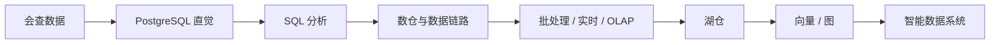

# 0. 核心定位

::: tip 本章导读
说明本书为什么以 PostgreSQL 为入口，如何把数据库学习连接到大数据与 AI 数据基础设施。
:::


## 本章阅读框架

| 阅读问题 | 本章回答方式 |
| --- | --- |
| 这个问题为什么出现？ | 从业务增长、数据规模、系统目标或 AI 应用压力切入。 |
| 它解决什么问题？ | 提炼为一个核心判断，避免把概念写成孤立定义。 |
| 它不解决什么问题？ | 在机制解释和常见误区中说明边界，防止工具崇拜。 |
| 它在真实平台哪里出现？ | 放回 PostgreSQL、数仓、批流、OLAP、湖仓、向量、图和治理的演化链路。 |
| 读完要会做什么？ | 通过场景案例和实战任务转成可练习的判断。 |



## 问题切入

这本书不是 PostgreSQL 使用手册，也不是 SQL 语法大全，更不是大数据工具名录。

它要解决的问题是：一个已经会查一些数据的人，如何建立完整的数据系统理解，最终能看懂并参与构建大数据与 AI 数据基础设施。

如果学习路线从工具开始，读者很容易陷入清单式学习：

```text
今天学 PostgreSQL
明天学 Spark
后天学 Flink
再学 ClickHouse、Iceberg、Milvus、Neo4j
```

这种学习方式的问题是：工具越学越多，系统关系反而越来越模糊。

更稳定的路线，是从 PostgreSQL 出发，先理解一个业务数据库如何组织数据、约束数据、查询数据和保持一致；再看当数据量、分析需求、实时性和 AI 应用要求持续增长时，系统为什么会演化出 OLAP、数仓、ETL / CDC、批处理、实时计算、湖仓、向量数据库、图数据库和数据治理。

## 核心判断

本书的核心判断是：数据库学习不应该从工具清单开始，而应该从数据系统的演化路径开始。PostgreSQL 是入口，因为它能让读者先理解数据组织、约束、事务、查询和单机边界，再自然进入大数据和 AI 数据基础设施。

## 机制解释

### 一、PostgreSQL 的角色

PostgreSQL 在本书里有四个角色。

第一，它是数据库直觉训练场。

你可以在 PostgreSQL 里看到一个数据系统最基础的问题：数据放在哪里，如何命名，如何建立关系，如何避免错误写入，如何在多步修改中保持一致，如何为查询选择访问路径。

第二，它是 OLTP 到 OLAP 的桥梁。

PostgreSQL 适合支撑业务系统，但业务增长后，分析查询会逐渐和在线交易产生资源冲突。理解这个冲突，才能真正理解为什么 OLTP 和 OLAP 会分化。

第三，它是大数据链路中常见的数据源。

很多数仓、实时数仓、湖仓和指标平台，最早的数据都来自 PostgreSQL 或类似业务库。订单、用户、支付、权限、状态变化，都从业务库进入 ETL、CDC、Kafka、Flink、Spark、ClickHouse 或 Iceberg。

第四，它是 AI 数据系统的重要基础组件。

AI 应用不是只靠模型运行。RAG 需要文档元数据、权限、Chunk、Embedding 版本、召回日志和评测记录；GraphRAG 需要实体、关系、图谱版本和路径查询记录。PostgreSQL 经常承担这些结构化元数据和控制数据。

### 二、总学习路线

本书的路线不是平铺所有概念，而是一条演化路径：

```text
PostgreSQL 基础
  -> SQL 分析能力
  -> 大表与查询优化
  -> OLTP vs OLAP
  -> 数仓建模
  -> ETL / ELT / CDC
  -> 批处理
  -> 实时数据处理
  -> OLAP 数据库
  -> 向量数据库
  -> 图数据库
  -> 数据湖 / 湖仓
  -> 数据治理
```

这条路线的关键不是“每个工具都懂一点”，而是理解每个系统为什么出现。

SQL 为什么是大数据系统的共同语言？

因为无论底层是 PostgreSQL、Hive、Spark SQL、Trino、ClickHouse 还是 Doris，业务分析最终都需要把问题表达成筛选、关联、聚合、排序、窗口计算和指标口径。

OLAP 为什么从 OLTP 中分化出来？

因为高频小事务和大范围分析扫描对存储、执行、延迟和一致性的要求不同。

ETL / CDC 为什么重要？

因为数据不会天然出现在数仓里，必须从业务系统被抽取、同步、清洗、转换和装载。

湖仓为什么出现？

因为数据湖提供低成本开放存储，数仓提供建模和治理能力，现代平台希望同时获得开放性、事务性、可演化表结构和多引擎查询。

向量数据库和图数据库为什么进入数据基础设施？

因为 AI 应用不只查询结构化表，还需要语义相似性检索、实体关系网络、多跳推理和可追溯上下文。


### 深度展开：全书定位如何落到真实系统

本节补齐本章的工程细节。阅读时不要只记住概念名称，而要把它放回“输入是什么、处理路径是什么、输出给谁、边界在哪里、如何验证”的链路中。

#### 一、它从什么问题开始

很多数据库学习路径把知识拆成孤立工具，导致读者会写 SQL、听过大数据组件，却无法解释系统为什么从业务库演化到数仓、湖仓、向量、图和治理。

这个问题通常不会以技术名词出现，而是以业务现象出现：报表变慢、指标不一致、实时看板延迟、RAG 召回不稳定、数据无法追溯、项目 Demo 无法验收。能不能把现象还原成系统问题，是本书要训练的第一层能力。

#### 二、输入数据和前置判断

输入是读者已有的零散经验：查过表、写过 SQL、听过 PostgreSQL、Spark、Flink、ClickHouse、Milvus 或 Neo4j，但缺少把它们放进同一条数据系统演化链路的框架。

在动手之前，至少要确认四件事：

| 判断项 | 要回答的问题 |
| --- | --- |
| 数据粒度 | 一行代表什么事实，是用户、订单、订单明细、事件、文件、Chunk，还是一条关系？ |
| 时间边界 | 使用创建时间、更新时间、支付时间、事件时间，还是处理时间？ |
| 状态边界 | 哪些状态算有效，哪些测试、取消、退款、重复或迟到数据要排除？ |
| 责任边界 | 这个环节负责记录事实、生产指标、加速查询、治理质量，还是服务 AI 应用？ |

#### 三、处理路径

处理路径是先用 PostgreSQL 建立数据组织和一致性直觉，再用 SQL 建立分析表达能力，随后沿着大表边界、OLTP / OLAP 分化、数仓建模、数据链路、批流计算、OLAP、湖仓、向量、图和治理逐步展开。

这条路径应该能被写成可执行流程，而不是停留在术语解释。一个合格的设计至少要说明：数据从哪里来、经过哪些转换、写到哪里、谁消费、失败后如何重跑、结果如何校验。

#### 四、在真实平台中的位置

在真实平台里，这条路径对应一条端到端数据链路：业务库记录事实，分析系统重构事实，计算系统加工事实，检索和图系统扩展事实，治理系统保证事实可信。

平台位置决定了它和前后系统的关系。不要孤立地问“这个技术好不好”，而要问：

- 它继承了上一层什么问题？
- 它把什么复杂度转移给了下一层？
- 它的输出是否能被复用、追溯和治理？
- 它是否改变了数据粒度、延迟、一致性或权限边界？

#### 五、边界和失败模式

本书不是某个数据库的参数手册，也不是大数据工具百科。它不会追求覆盖所有产品细节，而是训练读者理解问题、机制、边界和迁移关系。

常见失败信号可以这样检查：

| 失败信号 | 应该追问什么 |
| --- | --- |
| 只会背工具名但说不清上下游 | 定位到具体输入、口径、链路、边界或治理责任。 |
| 能写 SQL 但解释不了指标口径 | 定位到具体输入、口径、链路、边界或治理责任。 |
| 能跑 RAG Demo 但没有数据治理 | 定位到具体输入、口径、链路、边界或治理责任。 |
| 能画架构图但说不清每层责任 | 定位到具体输入、口径、链路、边界或治理责任。 |

#### 六、可操作练习

在正式阅读前，画出自己理解的数据链路：业务库、SQL、数仓、同步、批处理、实时、OLAP、湖仓、向量、图、治理分别在哪里，哪些还说不清。

练习完成后不要只看“有没有跑通”，还要补一份复盘：

- 输入数据是否足以支撑问题？
- 口径和边界是否写清楚？
- 结果能否被重复计算和对账？
- 如果数据量扩大 10 倍，瓶颈会出现在哪里？
- 如果接入下游 BI、RAG 或治理系统，还缺哪些元数据？


## 系统位置

第 0 章是全书的定位层。它不展开某个单点技术，而是规定全书的叙事方式：从 PostgreSQL 出发，沿着 SQL、OLTP/OLAP、数仓、链路、批流、湖仓、向量、图和治理逐步演化。

后续每一章都要回到这个问题：当前机制解决了上一阶段留下的什么压力，又为什么会引出下一阶段系统。

## 场景案例

### 三、最小闭环

如果把整条路线压缩成一个最小闭环，它是：

```text
PostgreSQL 业务数据
  -> SQL 分析
  -> 数仓建模
  -> ETL / CDC
  -> ClickHouse / Spark / Flink
  -> 向量检索 / 图关系分析
  -> 指标、BI、RAG、GraphRAG 和数据应用
```

这个闭环里，PostgreSQL 不是被淘汰，而是继续承担可靠业务事实和元数据管理。

SQL 不是被替换，而是成为跨系统分析语言。

数仓不是简单复制业务库，而是重构分析语义。

ETL / CDC 不是搬运文件，而是构建可信数据链路。

批处理、实时计算和 OLAP 数据库不是堆工具，而是分别处理历史计算、事件流和高性能分析。

向量数据库和图数据库不是传统数据库替代品，而是为语义检索和关系网络提供新的查询能力。

数据治理不是最后的装饰，而是让所有数据长期可信、可追溯、可复用、可控制的基础。

## 常见误区

**误区一：这本书是 PostgreSQL 手册。**

PostgreSQL 是入口，不是全部。本书关心的是如何从 PostgreSQL 建立数据系统直觉，并迁移到大数据和 AI 数据基础设施。

**误区二：大数据学习就是工具越多越好。**

工具清单不能形成系统理解。每个工具都要放回它解决的问题、边界和上下游关系中。

**误区三：AI 数据系统可以跳过传统数据基础。**

RAG、GraphRAG 和智能应用仍然依赖元数据、权限、质量、血缘、评测和治理。

## 实战任务

阅读本书前，先画一张自己的数据系统路线图，至少回答：

- 当前你会哪些 SQL 或数据库操作？
- 你是否能解释 PostgreSQL、数仓、OLAP、湖仓、向量库和图数据库的关系？
- 你最想解决的是业务报表、实时监控、RAG、GraphRAG，还是数据治理？
- 你当前最薄弱的是 SQL、建模、链路、选型还是治理？

## 小结引出下一章

### 四、学习后的能力变化

本书希望完成的迁移是：

```text
会查数据
  -> 能理解业务数据如何建模
  -> 能写分析 SQL 和指标 SQL
  -> 能判断 PostgreSQL 的查询边界
  -> 能区分 OLTP 与 OLAP
  -> 能设计数仓分层和数据链路
  -> 能理解批处理、实时计算和湖仓
  -> 能把向量、图和治理纳入 AI 数据系统
  -> 能构建智能数据系统的基础架构
```

这不是一条只服务数据库管理员的路线，也不是一条只服务数据工程师的路线。

它服务的是任何想真正理解数据基础设施的人：后端工程师、数据工程师、AI 应用工程师、数据产品经理、技术负责人，都可以从这条路径里获得系统判断。

### 五、如何阅读本书

阅读时不要把每个概念当作单独术语背诵。

每遇到一个概念，都问五个问题：

1. 它解决什么问题？
2. 它不解决什么问题？
3. 它为什么出现？
4. 它和前后系统是什么关系？
5. 它在真实数据平台中如何落地？

只要保持这个问题框架，PostgreSQL、SQL、数仓、Spark、Flink、ClickHouse、Iceberg、Milvus、Neo4j 和数据治理，就不会再是散落的工具名，而会连成一条清晰的数据系统演化路径。
