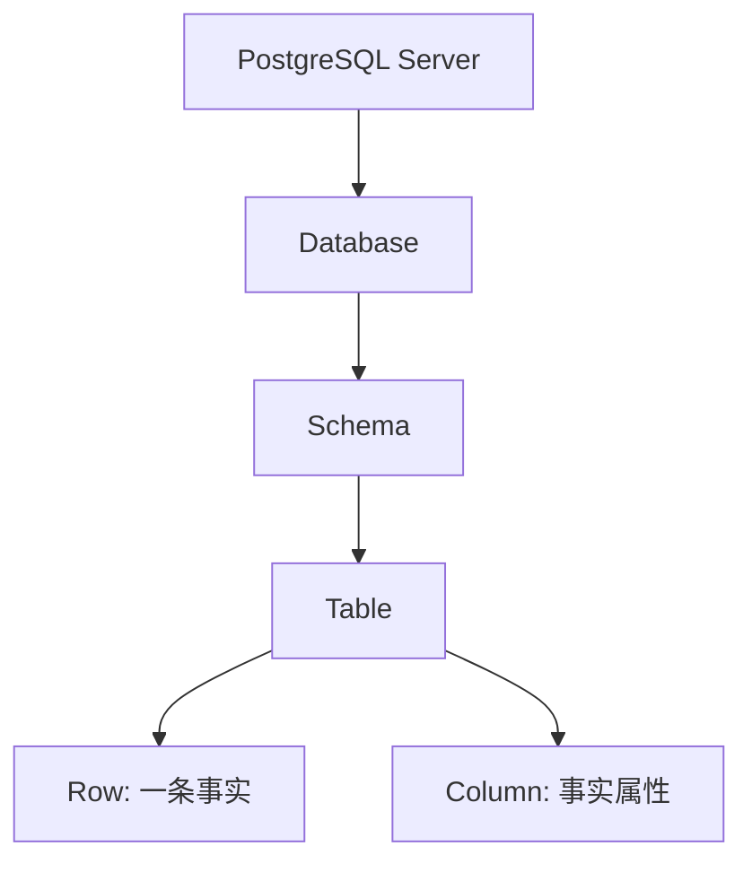

# 1. 数据库基础：用 PostgreSQL 建立数据系统直觉

::: tip 本章导读
用 PostgreSQL 建立数据如何被组织、约束、查询和保持一致的基础直觉。
:::
::: info 本章验收问题
- 你能否解释一张表中的一行、一列、主键、外键和约束各代表什么业务事实？
- 你能否说明 PostgreSQL 为什么适合作为数据库直觉训练入口？
:::




## 问题切入

很多人学习数据库，第一反应是去背 SQL 语法。

比如：

```sql
SELECT * FROM users;
```

或者：

```sql
SELECT count(*) FROM orders;
```

这些语句当然重要，但它们不是数据库学习的真正起点。真正的起点是理解一个更基础的问题：

> 当现实世界中的业务、用户、订单、商品、行为、日志进入计算机系统之后，它们究竟是如何被组织、约束、查询和演化的？

如果只是为了查几条数据，学习一些 SQL 就够了。

但如果你的目标是进入大数据、数据仓库、实时计算、湖仓架构、向量数据库、图数据库，甚至是 AI 时代的数据基础设施，那么你不能只停留在“会写查询语句”这一层。

你需要先建立一种更底层的数据系统直觉。

PostgreSQL 正适合作为这个入口。

它不是最简单的数据库，也不是专门为大数据分析而生的系统。但正因为如此，它反而适合作为学习数据系统的训练场。它足够完整，能让你看到数据库系统的核心结构；它足够成熟，能让你理解事务、索引、约束、执行计划、分区、视图等关键机制；它又足够贴近真实业务，常常出现在企业系统、数据同步链路、数仓源系统和 AI 应用元数据管理中。

所以，本章不是把 PostgreSQL 当成一个普通工具来讲，而是把它当成理解数据世界的第一块地图。

## 核心判断

PostgreSQL 的价值不只是能存数据和查数据，而是它把数据组织、约束、事务、查询、访问路径和单机边界压缩在一个真实可学习的环境里。

这一章要回答一个问题：为什么从 PostgreSQL 开始？答案是——PostgreSQL 的架构足够直观、足够严谨，让你在学 SQL 之前先建立"数据如何被管理"的体感。有了这个体感，后面的大数据工具才不会变成一堆散乱的名字。

### 1.1 为什么要从 PostgreSQL 开始理解数据系统？

### 一、数据库不是高级 Excel

初学者很容易把数据库理解成一种更强大的 Excel。

表面上看，这个理解并没有完全错。

Excel 里有表格，数据库里也有表。Excel 里有行和列，数据库里也有行和列。Excel 可以筛选、排序、统计，数据库也可以查询、过滤、聚合。

但这只是表象。

Excel 更像是一个面向人的数据整理工具，而数据库是一个面向系统的数据管理机制。

它们之间最大的区别，不在于谁能存更多数据，而在于数据库会严肃回答数据系统中的几个关键问题。

第一，数据应该如何被组织？

一个用户应该放在哪里？一笔订单应该如何表示？订单和用户之间是什么关系？商品、支付、物流、行为日志之间应该如何连接？

第二，数据应该如何被约束？

用户 ID 能不能重复？订单金额能不能为空？一笔订单能不能指向一个不存在的用户？库存数量能不能变成负数？

第三，数据应该如何被一致地修改？

当用户下单时，订单表要新增记录，库存表要减少数量，支付表要生成流水。如果中间某一步失败，系统应该怎么办？是保留一半结果，还是全部回滚？

第四，数据应该如何被高效查询？

为什么同样是查订单，有的查询几毫秒返回，有的查询几十秒还没有结果？为什么加了索引会变快？为什么数据量变大之后，原来的查询方式会失效？

第五，数据量继续增长之后，系统边界在哪里？

一个业务库可以支撑多少分析任务？什么时候应该把数据同步到数仓？什么时候应该引入 ClickHouse、Spark、Flink、Iceberg、Milvus 或 Neo4j？

这些问题，Excel 并不会真正回答。

而 PostgreSQL 会。

这就是为什么学习数据库不能只从语法开始，而要从数据系统的结构开始。

### 二、核心判断：PostgreSQL 是数据系统训练场

PostgreSQL 的价值，不只是它能存数据、查数据。

更重要的是，它把一个真实数据系统的核心问题压缩在一个相对完整、可学习、可实践的环境里。

你可以把 PostgreSQL 看成一个小型数据世界。

在这个世界里，数据不是随便堆放的，而是被放进不同的 Database、Schema 和 Table 中。

数据不是随便填写的，而是受到 Primary Key、Foreign Key、Constraint 的约束。

查询不是凭空发生的，而是由查询优化器生成执行计划，再通过扫描、索引、连接、排序、聚合等步骤完成。

修改不是简单覆盖，而是由事务、锁、MVCC、日志共同保证一致性和持久性。

当数据量变大时，PostgreSQL 又会让你看到索引、分区、物化视图、并行查询、执行计划这些机制如何帮助单机数据库继续工作，也会让你看到它们的边界。

所以，PostgreSQL 在本书里的角色不是“数据库工具 A”。

它是理解数据系统的训练场：

```text
组织数据
  -> 约束数据
  -> 查询数据
  -> 一致修改数据
  -> 优化访问路径
  -> 识别单机边界
  -> 走向 OLAP、数仓、实时计算和 AI 数据系统
```

### 三、PostgreSQL 和大数据不是两条线

很多人把 PostgreSQL 和大数据系统分开理解。

一边是业务数据库，另一边是 Spark、Flink、ClickHouse、Kafka、Iceberg、Milvus、Neo4j。

这种分法在系统选型上有意义，但在学习上容易造成割裂。

真实的数据平台不是凭空出现的。它通常从业务系统开始。

例如一个电商系统，最早的数据可能都在 PostgreSQL 里：

```text
users         用户
products      商品
orders        订单
order_items   订单明细
payments      支付
events        行为事件
```

业务刚开始时，PostgreSQL 既支撑在线交易，也支撑一些简单报表。

随着业务增长，订单表越来越大，事件数据越来越多，报表越来越复杂，分析查询开始影响在线业务。于是系统会自然演化：

```text
PostgreSQL 业务库
  -> ETL / CDC
  -> 数仓 / OLAP / 湖仓 / 实时计算
  -> BI / 指标 / 推荐 / RAG / GraphRAG
```

这条路径说明，PostgreSQL 不是大数据学习之外的前置知识，而是大数据系统的入口。

你只有先理解业务数据在 PostgreSQL 中如何组织，后面才能理解为什么需要数仓建模、为什么需要 CDC、为什么需要批处理和实时处理、为什么 OLAP 数据库要使用列式存储、为什么 AI 应用还需要向量库、图数据库和数据治理。

### 四、从会查数据到会理解数据系统

本书要完成的迁移，不是从一个 SQL 语法点迁移到另一个 SQL 语法点。

它真正要完成的是能力迁移：

```text
会查数据
  -> 理解表结构
  -> 理解约束和事务
  -> 理解查询执行
  -> 理解大表边界
  -> 理解 OLTP / OLAP 分化
  -> 理解数仓和数据链路
  -> 理解批处理、实时处理、湖仓
  -> 理解向量、图和治理
  -> 能构建智能数据系统
```

因此，第一章的目标不是让你记住所有 PostgreSQL 命令。

第一章要建立的是四个基础直觉：

- 数据如何被组织。
- 查询如何被执行。
- 事务如何保证一致性。
- 单机数据库在大数据场景中为什么会遇到边界。

只要这四个直觉建立起来，后面进入 SQL 分析、大表优化、数仓建模、ETL / CDC、OLAP、湖仓、向量数据库和图数据库时，就不会只是背工具名。

你会知道每个系统为什么出现，以及它试图接住 PostgreSQL 无法继续独自承担的哪一类问题。

### 五、常见误区

**误区一：先背 SQL 语法，再理解数据库。**

SQL 很重要，但 SQL 只是表达方式。数据库学习的底层问题是数据如何被组织、约束、修改和查询。如果不理解这些机制，SQL 写得越复杂，越容易制造不可解释的结果。

**误区二：PostgreSQL 只是业务库，和大数据无关。**

PostgreSQL 经常是大数据链路的数据源，也经常是数据平台的元数据库。业务事实从 PostgreSQL 出发，经过同步、建模、加工和治理，才进入 OLAP、湖仓、向量库和图数据库。

**误区三：学大数据应该先学 Spark、Flink、ClickHouse。**

直接学工具容易形成工具清单，但不一定理解系统压力。先在 PostgreSQL 中看见数据组织、查询边界和负载冲突，再理解分布式计算和分析引擎，会更稳定。

### 六、实战任务

准备一个电商数据库模型草图，不需要立刻建表，先写出业务对象：

```text
用户
商品
订单
订单明细
支付
用户行为事件
```

然后回答：

1. 哪些对象适合成为独立表？
2. 哪些对象之间存在关系？
3. 哪些字段必须唯一？
4. 哪些数据不能随便为空？
5. 哪些查询会是业务查询？
6. 哪些查询会是分析查询？

这个任务的目的不是写 SQL，而是先训练数据库建模前的结构感。

### 七、小结

PostgreSQL 不是本书的学习终点，而是理解数据系统的起点。

它能让你看到一个业务数据库如何组织数据、约束数据、查询数据和一致地修改数据，也能让你看到当数据规模、分析需求和系统复杂度增长时，单机数据库为什么会自然引出 OLAP、数仓、ETL / CDC、批处理、实时计算、湖仓、向量数据库、图数据库和数据治理。

下一节开始，我们不急着写查询语句，而是先进入 PostgreSQL 的核心结构。

因为学数据库的第一步，不是记住 `SELECT`，而是理解数据进入系统之后，被放在哪里。

## 机制解释

### 1.2 PostgreSQL 核心结构：数据系统是如何被组织起来的

很多人第一次接触数据库时，会自然地把它理解成“一堆表”。

这个理解有一定道理，但不够准确。

如果数据库只是几张表，那么它和 Excel 的区别并不明显。真正让数据库成为系统的，不只是它能存储表格，而是它有一套清晰的组织结构：数据放在哪里、如何命名、如何隔离、如何访问、如何被约束，以及不同数据之间如何建立关系。

PostgreSQL 的核心结构，正是在回答这个问题。

> 数据库学习的第一步，不是学会写 `SELECT`，而是理解数据进入系统之后，被安放在哪些层级里。

这一节要解决的，就是 PostgreSQL 最基础、但也最重要的结构感。

### 一、为什么数据库不能只是“一堆表”？

假设我们正在做一个电商系统。

系统里有用户、商品、订单、支付、浏览行为、优惠券、库存、物流等数据。表面上看，我们只要建很多表就可以了：

```text
users
products
orders
payments
events
inventory
coupons
shipments
```

但问题很快会出现。

这些表属于哪个业务系统？哪些表是交易系统的？哪些表是运营分析用的？测试环境和生产环境的数据如何隔离？不同团队能不能使用同一个表名？用户表和订单表之间的关系如何保持清晰？一张表里的字段，哪些是业务字段，哪些是系统字段？当数据越来越多，如何管理命名、权限、查询和维护？

如果没有层级结构，数据库很快就会变成一个混乱的数据仓库：表名冲突、字段含义不清、权限边界模糊、业务关系难以追踪。

所以，数据库不能只是“一堆表”。

它必须先有组织结构。

PostgreSQL 的结构可以简单理解为：

```text
PostgreSQL Server
  ↓
Database
  ↓
Schema
  ↓
Table
  ↓
Row / Column
```

这不是为了增加复杂度，而是为了让数据在系统中拥有明确的位置。

一个成熟的数据系统，首先要解决的不是“能不能查”，而是“数据在哪里”。

### 二、核心判断：数据库结构，本质上是在给数据安排位置

PostgreSQL 的结构，可以类比成一座城市。

PostgreSQL Server 像整座城市的运行系统。

Database 像城市中的不同园区。

Schema 像园区里的不同街区。

Table 像街区里的不同建筑。

Row 像建筑里的一条记录。

Column 像记录中的具体属性。

当然，类比只是帮助理解。回到数据系统本身，PostgreSQL 的层级结构真正解决的是五类问题。

第一，隔离问题。

不同业务、不同环境、不同应用的数据，不应该随便混在一起。Database 和 Schema 提供了隔离边界。

第二，命名问题。

真实系统中，很多业务都会有 `users`、`orders`、`logs` 这样的表名。如果没有命名空间，不同团队、不同模块之间很容易冲突。

第三，组织问题。

数据不是越多越好，而是要按照业务关系、访问方式和管理边界组织起来。

第四，权限问题。

谁能访问哪些数据？谁能修改哪些表？谁只能读取部分 Schema？这些都依赖清晰的结构边界。

第五，演化问题。

业务会变化，表会增加，字段会调整，数据规模会扩大。没有结构，系统越发展越混乱；有结构，系统才有演化空间。

所以，PostgreSQL 的核心结构不是一组死概念，而是一套数据管理秩序。

### 三、PostgreSQL Server：数据库系统的运行入口

最外层是 PostgreSQL Server。

它可以理解为一个正在运行的 PostgreSQL 数据库服务实例。

当你启动 PostgreSQL 时，本质上是启动了一个数据库服务。这个服务负责接收客户端连接、处理 SQL 请求、管理数据库文件、维护事务、执行查询、控制权限、写入日志，并保证数据在系统中的一致性。

你平时通过命令行、图形化工具、后端程序连接 PostgreSQL，连接的并不是某一张表，而是这个正在运行的数据库服务。

比如一个后端服务连接数据库时，通常需要这些信息：

```text
host
port
database
user
password
```

其中 `host` 和 `port` 指向的是 PostgreSQL Server；`database` 指向这个服务里的某个 Database；`user` 和 `password` 决定你以什么身份进入这个数据世界。

PostgreSQL Server 解决的是运行入口问题：

> 谁在提供数据库服务，客户端连接到哪里，SQL 请求由谁接收和执行。

它不直接表达业务对象。用户、订单、商品这些对象不会直接放在 Server 层。Server 是运行环境，不是业务建模单位。

这也是它不解决的问题：Server 不负责告诉你业务表应该怎么设计，也不负责定义指标口径。它提供数据库系统运行所需的外层基础。

### 四、Database：一个相对独立的数据世界

在 PostgreSQL Server 里面，可以有多个 Database。

Database 可以理解为一个相对独立的数据世界。

例如：

```text
shop_prod
shop_test
analytics_dev
metadata
```

这些 Database 可以运行在同一个 PostgreSQL Server 中，但它们之间有明确边界。一般情况下，你连接到一个 Database 之后，主要操作的就是这个 Database 内部的对象。

Database 解决的是大边界问题。

它适合隔离不同应用、不同环境或不同用途的数据。

例如：

- `shop_prod` 保存生产环境电商业务数据。
- `shop_test` 保存测试环境数据。
- `analytics_dev` 保存分析开发数据。
- `metadata` 保存平台元数据。

但 Database 不是万能隔离层。

如果只是同一个业务系统里的不同模块，比如用户、商品、订单、支付，不一定要拆成多个 Database。过度拆分会增加连接、权限、迁移和查询管理成本。

在大数据系统里，Database 这个概念会继续演化成更大的组织边界，例如数据域、项目空间、工作空间或 Catalog。它回答的仍然是同一个问题：

> 这一组数据属于哪个相对独立的世界？

### 五、Schema：数据库内部的命名空间

进入一个 Database 后，下一层是 Schema。

Schema 是 Database 内部的命名空间。

它最容易被误解。很多初学者会把 Schema 理解成“表结构”，比如字段名和字段类型。但在 PostgreSQL 中，Schema 更接近“命名空间”。

一个 Database 里可以有多个 Schema：

```text
shop
├── user_center
├── catalog
├── sales
├── payment
└── tracking
```

然后不同 Schema 下可以有自己的表：

```text
user_center.users
catalog.products
sales.orders
sales.order_items
payment.payments
tracking.events
```

这样做的价值是非常直接的。

第一，它让表名更清楚。

`sales.orders` 明确表示这是销售域的订单表，而不是某个临时分析表或测试表。

第二，它降低命名冲突。

不同 Schema 中可以出现同名对象。比如 `raw.events` 和 `tracking.events` 可以表达不同阶段、不同来源或不同用途的数据。

第三，它帮助权限管理。

你可以让某个用户只访问 `sales` Schema，让另一个用户只访问 `analytics` Schema。

第四，它为后面的数仓分层建立直觉。

在数仓里，我们会经常看到 ODS、DWD、DWS、ADS 这样的层次。它们和 PostgreSQL Schema 不完全等同，但都在解决数据组织、命名和边界问题。

Schema 解决的是命名空间和组织边界问题。

它不解决业务建模本身。把表放进不同 Schema，并不会自动让表结构正确，也不会自动让指标口径一致。

### 六、Table：业务对象、事件和关系的数据化表达

Table 是初学者最熟悉的一层。

但 Table 不能简单理解成“表格”。

在数据库系统里，Table 是业务对象、业务事件和业务关系的数据化表达。

例如：

```text
users         用户对象
products      商品对象
orders        下单事件 / 订单对象
order_items   订单与商品之间的关系明细
payments      支付事件
events        用户行为事件
```

这几个表看起来都是表，但含义不一样。

`users` 更像对象表，一行代表一个用户。

`products` 更像对象表，一行代表一个商品。

`orders` 既可以看成订单对象，也可以看成用户下单这个业务事件的结果。

`order_items` 是典型关系明细表，因为一笔订单可以包含多个商品，一个商品也可以出现在多笔订单中。

`payments` 更像事件表，因为它记录支付动作是否发生、何时发生、以什么方式发生、结果如何。

`events` 是行为日志表，一行通常代表一次浏览、点击、加购、搜索或曝光。

所以，建表时真正重要的问题不是“要有哪些字段”，而是：

> 这张表的一行代表什么？

如果一行代表一个用户，那么它就是用户粒度。

如果一行代表一笔订单，那么它就是订单粒度。

如果一行代表一件订单商品明细，那么它就是订单商品粒度。

如果一行代表一次点击，那么它就是事件粒度。

粒度一旦混乱，后面的 JOIN、聚合、指标计算都会混乱。

这也是为什么 PostgreSQL 表结构学习，会自然连接到后面的数仓事实表、维度表、宽表和指标口径。

### 七、Row 与 Column：记录事实与描述属性

Table 里面是 Row 和 Column。

Row 是一条记录，也是一条具体事实。

Column 是字段，用来描述这条事实的属性。

以 `orders` 表为例：

```text
orders
├── order_id
├── user_id
├── order_status
├── total_amount
├── created_at
└── paid_at
```

如果 `orders` 表一行代表一笔订单，那么每一行就是一条订单事实。

例如：

```text
order_id: 10001
user_id: 501
order_status: paid
total_amount: 299.00
created_at: 2026-04-01 10:30:00
paid_at: 2026-04-01 10:31:20
```

这条 Row 表达的是：

> 用户 501 在 2026 年 4 月 1 日创建并支付了一笔金额为 299 元的订单。

Column 则回答这条事实有哪些属性。

`order_id` 描述订单身份。

`user_id` 描述订单属于哪个用户。

`order_status` 描述订单状态。

`total_amount` 描述订单金额。

`created_at` 描述创建时间。

`paid_at` 描述支付时间。

Row 和 Column 看起来简单，但它们是后面所有数据分析的基础。

聚合分析本质上是在多条 Row 上计算统计结果。

JOIN 本质上是通过某些 Column 把不同 Table 的 Row 连接起来。

索引本质上是为某些 Column 建立更高效的访问路径。

数仓建模本质上是在重新定义不同 Table 的 Row 粒度和 Column 含义。

向量数据库和图数据库虽然数据模型不同，但仍然绕不开“一个数据单元代表什么、它有哪些属性、它和其他数据如何关联”这些问题。

### 八、从电商业务看数据如何进入表结构

现在把这些层级放到一个电商系统里。

我们可以设计一个 Database：

```text
shop
```

在这个 Database 中，按业务域划分 Schema：

```text
user_center
catalog
sales
payment
tracking
```

再在不同 Schema 下放表：

```text
user_center.users
catalog.products
sales.orders
sales.order_items
payment.payments
tracking.events
```

这时，业务对象就有了清晰的位置：

```text
用户        -> user_center.users
商品        -> catalog.products
订单        -> sales.orders
订单商品明细 -> sales.order_items
支付        -> payment.payments
用户行为     -> tracking.events
```

这套结构带来的好处不是“看起来更整齐”，而是让后续系统能力有了基础。

你可以为 `users` 定义主键。

你可以让 `orders.user_id` 指向 `users.user_id`。

你可以让 `order_items.order_id` 指向 `orders.order_id`。

你可以用索引加速按用户查订单。

你可以用分区管理按时间增长的 `events` 表。

你可以把 `orders`、`order_items`、`payments` 同步到数仓，重新建模为订单事实表和支付事实表。

也就是说，结构不是静态目录，而是后续约束、查询、事务、分析和同步链路的基础。

### 九、这些结构在大数据系统中的延伸

PostgreSQL 的结构不是只在 PostgreSQL 内部有意义。

它会自然延伸到后面的大数据系统。

| PostgreSQL 结构 | 解决的问题 | 大数据系统中的延伸 |
| --- | --- | --- |
| Database | 大边界、环境、应用空间 | 数据域、项目空间、Catalog |
| Schema | 命名空间、业务组织 | 主题域、数仓分层、命名规范 |
| Table | 数据对象、事件、关系 | 事实表、维度表、明细表、宽表 |
| Row | 一条事实记录 | 一条业务事件、一条日志、一条明细 |
| Column | 事实属性 | 字段、维度、指标、特征 |

比如数仓里的事实表，本质上仍然要回答：

> 一行代表什么事实？

维度表仍然要回答：

> 这些字段描述哪个业务对象？

指标体系仍然要回答：

> 哪些字段可以被计算成稳定指标？

湖仓里的表格式仍然要回答：

> 数据文件如何被组织成可查询、可演化、可管理的表？

向量数据库仍然要回答：

> 一个向量对应哪个文档、哪个 Chunk、哪个权限范围和哪个版本？

图数据库仍然要回答：

> 节点代表什么实体，边代表什么关系？

所以，PostgreSQL 的结构感，是后面所有数据系统学习的底层语言。

### 十、常见误区

**误区一：把 Database 理解成一个文件。**

Database 不是一个简单文件，而是 PostgreSQL Server 内部的相对独立数据世界。它包含 Schema、Table、权限、函数等数据库对象。

**误区二：把 Schema 理解成字段结构。**

在 PostgreSQL 中，Schema 主要是命名空间，不是“这张表有哪些字段”的意思。表字段结构应该看 Table Definition，而不是把它和 Schema 混为一谈。

**误区三：把 Table 当成 Excel 表。**

Table 不只是行列集合。它表达业务对象、事件或关系，并且要配合主键、外键、约束、索引和事务工作。

**误区四：只关心字段，不关心一行代表什么。**

字段设计之前，必须先明确表的粒度。一行代表一个用户、一笔订单、一次支付，还是一次点击？如果粒度不清，后面所有分析都会不稳定。

**误区五：只会建表，不会建模。**

建表是写出结构，建模是解释结构。真正的数据系统需要知道每张表为什么存在、和其他表有什么关系、服务什么业务问题、未来如何演化。

### 十一、实战任务

为一个电商系统设计 PostgreSQL 的基础组织结构。

要求：

1. 创建一个 Database 名称设计，例如 `shop`。
2. 规划至少 5 个 Schema：用户、商品、销售、支付、行为。
3. 为每个 Schema 设计 1 到 2 张表。
4. 写清楚每张表的一行代表什么。
5. 标出至少 3 组表之间的关系。

参考输出：

```text
Database: shop

Schema: user_center
  Table: users
  Row grain: one row per user

Schema: catalog
  Table: products
  Row grain: one row per product

Schema: sales
  Table: orders
  Row grain: one row per order

  Table: order_items
  Row grain: one row per product item in an order

Schema: payment
  Table: payments
  Row grain: one row per payment attempt

Schema: tracking
  Table: events
  Row grain: one row per user behavior event
```

复盘时回答：

- 哪些表是对象表？
- 哪些表是事件表？
- 哪些表是关系明细表？
- 哪些字段适合成为主键？
- 哪些字段会成为后续 JOIN 的关联键？
- 哪些表未来可能同步到数仓或 OLAP 数据库？

### 十二、小结

这一节解决的是数据库学习的空间问题。

PostgreSQL Server 提供运行入口。

Database 提供相对独立的数据世界。

Schema 提供数据库内部的命名空间。

Table 表达业务对象、事件和关系。

Row 记录一条事实。

Column 描述事实的属性。

理解这些结构之后，数据库就不再是“一堆表”，而是一套有层级、有边界、有归属的数据组织系统。

下一节将进入这些结构内部最重要的控制机制：主键、外键、约束、事务、索引、视图、物化视图和分区。

这些机制会继续回答一个更关键的问题：

> 数据放进数据库之后，系统如何让它长期保持可靠、可查、可分析、可演化？

### 1.3 必学概念：从主键、外键、约束到事务、索引和分区

理解了 PostgreSQL 的层级结构之后，下一步不是马上写复杂 SQL，而是理解这些结构里最关键的控制机制。

表、行、列只是把数据放进系统。

但数据系统真正难的地方在于：

- 如何保证一条记录有稳定身份？
- 如何保证表和表之间的关系不乱？
- 如何阻止明显错误的数据进入系统？
- 如何让多步修改要么全部成功，要么全部失败？
- 如何让查询在数据量变大后仍然可接受？
- 如何复用查询逻辑？
- 如何提前计算重复报表？
- 如何管理越来越大的历史数据？

这些问题对应 PostgreSQL 中的一组基础概念：

```text
Primary Key
Foreign Key
Constraint
Transaction
Index
View
Materialized View
Partition
```

如果把它们写成词典条目，它们会显得很散。

但如果放回数据系统中，它们其实共同回答一个问题：

> 数据放进数据库之后，系统如何让它长期保持可靠、可查、可分析、可演化？

### 一、Primary Key：解决记录身份问题

主键解决的第一个问题是记录身份。

如果 `users` 表一行代表一个用户，那么系统必须知道每一行用户记录如何被唯一识别。

最常见的做法是设计 `user_id`：

```text
users
├── user_id       Primary Key
├── name
├── email
├── status
└── created_at
```

主键的核心判断是：

> 一张表如果没有稳定身份，后续的关联、修改、追踪和分析都会变得不可靠。

主键解决的是“这一行是谁”的问题。

它不解决“这一行是否业务上合理”的全部问题。比如 `user_id` 唯一，并不代表邮箱格式正确，也不代表用户状态合法。这些还需要其他约束配合。

在后面的数仓和 AI 数据系统中，主键意识会继续存在。事实表要有业务键或去重键，文档 Chunk 要有 `chunk_id`，向量记录要能追溯到原始文档和版本，图数据库里的节点也需要稳定实体 ID。

### 二、Foreign Key：解决表之间的关系问题

外键解决的是表和表之间的关系。

例如订单属于用户：

```text
orders.user_id
  -> users.user_id
```

这表示 `orders` 表中的 `user_id` 应该来自 `users` 表中已经存在的用户。

如果没有外键或关系约束，就可能出现这样的数据：

```text
orders.user_id = 999999
```

但 `users` 表里根本没有这个用户。

这类数据就是关系断裂。

外键的核心判断是：

> 外键不是为了让建表语句更完整，而是为了让数据库知道不同表之间的业务关系。

它解决的是引用可靠性问题。

但外键也不是所有系统都会强制使用。高并发业务库、跨库系统、数据仓库和大数据平台中，外键约束有时会被弱化，改由应用逻辑、数据质量任务或建模规范维护关系。

这不是因为关系不重要，而是因为不同系统在一致性、性能、灵活性之间做了不同取舍。

### 三、Constraint：把业务规则放进数据层

Constraint 是约束。

它解决的是“什么样的数据允许进入表”的问题。

常见约束包括：

```text
NOT NULL      不能为空
UNIQUE        不能重复
CHECK         必须满足条件
DEFAULT       默认值
PRIMARY KEY   主键约束
FOREIGN KEY   外键约束
```

例如订单金额不能为负：

```sql
total_amount numeric CHECK (total_amount >= 0)
```

用户邮箱不能重复：

```sql
email text UNIQUE
```

订单状态不能为空：

```sql
order_status text NOT NULL
```

约束的核心判断是：

> 越重要的数据规则，越不应该只停留在口头约定或应用代码里。

应用代码会变，入口会变，团队会变，导入脚本会变。但数据库约束可以在数据层持续守住底线。

约束不解决所有业务正确性。比如“用户是否应该享受某个优惠”可能依赖复杂规则，不适合全部写进数据库约束。但基础规则越早落在数据层，后面的分析和治理越可靠。

### 四、Transaction：让多步修改表现得像一个可靠动作

事务解决的是多步修改的一致性问题。

以下单为例，一个订单创建过程可能包括：

```text
创建订单
写入订单明细
扣减库存
生成支付记录
写入操作日志
```

如果这些步骤执行到一半失败，系统不能留下半个订单。

事务的核心判断是：

> 事务让多步修改在业务上表现得像一个动作：要么全部成功，要么全部失败。

例如：

```sql
BEGIN;

INSERT INTO orders (...);
INSERT INTO order_items (...);
UPDATE inventory SET stock = stock - 1 WHERE product_id = 10;
INSERT INTO payments (...);

COMMIT;
```

如果中间出错，可以回滚：

```sql
ROLLBACK;
```

事务解决的是可靠修改问题。

它不解决所有分布式一致性问题。只要数据跨多个数据库、多个消息系统、多个服务，事务边界就会变复杂。后面讲 CDC、Kafka、Flink 和实时数仓时，还会遇到”数据库事务”和”数据链路一致性”之间的差异。

#### 事务的底层：MVCC 如何让读写不互相阻塞

PostgreSQL 不是靠”加锁等”来实现事务隔离的。它用的是 MVCC（Multi-Version Concurrency Control，多版本并发控制）。这个概念在 PostgreSQL 内部无处不在，不理解 MVCC，你就无法真正理解为什么有时候查询变慢、为什么表会膨胀、为什么 vacuum 很重要。

**核心机制：每个元组有多个版本**

PostgreSQL 不在行上原地修改。每行数据（PostgreSQL 内部叫 tuple）有两个隐藏的系统字段：

- `xmin`：创建这个版本的事务 ID
- `xmax`：删除或使这个版本过期的事务 ID

当你执行 `UPDATE orders SET status = 'paid' WHERE id = 100` 时，PostgreSQL 实际上做了两件事：

1. 把旧行的 `xmax` 设为本事务的 ID（标记为”这个版本不再可见”）
2. 插入一个新行，`xmin` 设为本事务的 ID（”新版本从此刻生效”），内容包含 `status = 'paid'`

旧行不会立即删除。它继续留在磁盘上，直到没有任何活跃事务需要看到它为止。

**可见性规则：你能看到什么版本？**

每个事务在开始时获得一个快照（snapshot），记录了此刻活跃的所有事务 ID。查询时，PostgreSQL 根据以下规则判断一行是否可见：

- 行的 `xmin` 必须在快照中已提交，且不能是当前事务开始后提交的
- 行的 `xmax` 要么为空（未被删除），要么对应的事务在快照中未提交或是在快照之后才提交的

这套规则确保：即使有其他事务在同时修改同一行，你的 SELECT 看到的仍然是事务开始时的那个一致快照。读取永远不会阻塞写入，写入也不会阻塞读取（除了行级更新的并发冲突）。

**Vacuum：为什么要清理死版本**

每次 UPDATE 和 DELETE 都会产生旧版本（dead tuple）。这些死版本占磁盘空间、拖慢扫描速度、让索引膨胀。PostgreSQL 的 VACUUM 进程负责回收这些空间：

- 普通 VACUUM：标记死版本占用的空间可重用，但不交还给操作系统
- VACUUM FULL：重写整个表，交还磁盘空间，但会锁表——生产环境慎用
- Autovacuum：后台自动运行的 VACUUM，PostgreSQL 默认开启

**经验规则**：如果你看到一张频繁更新的表越来越大但行数没怎么变，先检查 autovacuum 是否正常工作。`pg_stat_user_tables` 里的 `n_dead_tup` 和 `last_autovacuum` 是你的第一排查入口。

#### ACID 隔离级别：事务能读到什么

MVCC 是实现手段，隔离级别定义的是”在这个事务里，你能看到别的并发事务做了什么”。

SQL 标准定义了四种隔离级别，PostgreSQL 全部支持：

| 隔离级别 | Dirty Read | Non-repeatable Read | Phantom Read | 在 PostgreSQL 中的实现 |
|----------|-----------|-------------------|-------------|---------------------|
| Read Uncommitted | 允许 | 可能 | 可能 | PostgreSQL 不允许脏读，实际等同于 Read Committed |
| Read Committed | 不允许 | 可能 | 可能 | 每条语句看到已提交的最新版本（默认级别） |
| Repeatable Read | 不允许 | 不允许 | 允许（PG 中实际不允许） | 整个事务看到同一个快照 |
| Serializable | 不允许 | 不允许 | 不允许 | 真正串行化，PG 用 SSI（Serializable Snapshot Isolation）实现 |

- **脏读（Dirty Read）**：读到另一个事务未提交的修改。PostgreSQL 不允许——你永远不会看到别人 `BEGIN` 后尚未 `COMMIT` 的数据。
- **不可重复读（Non-repeatable Read）**：同一个事务内，两次读同一行得到了不同的值，因为中间别人改了并提交了。Read Committed 级别允许这种情况发生。
- **幻读（Phantom Read）**：同一个事务内，两次范围查询返回了不同的行集合，因为中间别人插入或删除了匹配条件的行。

**默认的 Read Committed 够用吗？**

绝大多数 Web 应用和 API 服务用 Read Committed 就足够了。每个 HTTP 请求通常只跑几条简单的查询和更新，不需要事务级别的快照。

以下场景才需要升到 Repeatable Read 或 Serializable：
- 财务报表——当月的期初期末余额必须在同一个快照中计算
- 库存扣减——“只有库存大于 0 才能下单”这类跨行约束
- 数据迁移——一批互相依赖的查询必须在同一个时间点看到数据

**PostgreSQL 的 Repeatable Read 实际上比 SQL 标准更严格**：它阻止了大多数幻读（因为快照是整个事务级别的，不是语句级别的）。在实践中，PostgreSQL 的 Repeatable Read 对大多数场景已经足够，Serializable 在性能开销和复杂度上都更高。

### 五、Index：用写入成本换读取路径

索引解决的是查询访问路径问题。

没有索引时，数据库要找到某个用户的订单，可能需要扫描整张 `orders` 表。

如果订单表只有几千行，这没什么问题。

但如果订单表有几千万行，全表扫描就会变成明显成本。

例如常见查询是：

```sql
SELECT *
FROM orders
WHERE user_id = 501
ORDER BY created_at DESC;
```

那么可以考虑建立组合索引：

```sql
CREATE INDEX idx_orders_user_created
ON orders (user_id, created_at DESC);
```

PostgreSQL 默认创建的是 B-tree 索引，它适合最常见的等值、范围和排序访问路径。其他索引类型要通过 `USING` 显式选择，例如 Hash 主要服务简单等值比较，GIN 常用于数组、JSONB、全文检索这类多值结构，GiST / SP-GiST 常用于几何、范围、近邻等需要特定 operator class 的场景，BRIN 适合与物理存储顺序高度相关的大表列。

索引的核心判断是：

> 索引不是让所有查询都变快，而是用额外存储和写入维护成本，换取特定访问路径上的更少读取。

索引解决的是“如何更快找到一批数据”的问题。

它不解决“所有分析都应该压在业务库上”的问题。大范围聚合、多维分析、历史扫描和复杂报表，即使有索引，也可能不适合长期放在 OLTP 业务库里。

这就是索引会自然引出大表优化、执行计划和 OLAP 系统的原因。

### 六、View：复用查询逻辑

视图解决的是查询逻辑复用问题。

假设很多分析都只关心已支付订单：

```sql
SELECT *
FROM orders
WHERE order_status = 'paid';
```

如果每个人都重复写这段条件，就容易出现口径不一致。

可以定义一个视图：

```sql
CREATE VIEW paid_orders AS
SELECT *
FROM orders
WHERE order_status = 'paid';
```

之后可以直接查询：

```sql
SELECT *
FROM paid_orders;
```

视图的核心判断是：

> 视图不是复制一份数据，而是把一段查询逻辑命名并复用。

它解决的是表达复用和口径封装问题。

但普通视图不等于性能加速。查询视图时，数据库通常仍然要执行背后的查询逻辑。如果底层数据很大，视图本身不会自动让计算变轻。

这就引出物化视图。

### 七、Materialized View：把重复计算提前做掉

物化视图解决的是重复计算问题。

假设每天都有人查询每日 GMV：

```sql
SELECT
    date(created_at) AS order_date,
    sum(total_amount) AS gmv
FROM orders
WHERE order_status = 'paid'
GROUP BY date(created_at);
```

如果 `orders` 表很大，每次都重新聚合，成本会越来越高。

物化视图可以把结果提前算好并存下来：

```sql
CREATE MATERIALIZED VIEW daily_gmv AS
SELECT
    date(created_at) AS order_date,
    sum(total_amount) AS gmv
FROM orders
WHERE order_status = 'paid'
GROUP BY date(created_at);
```

物化视图的核心判断是：

> 物化视图用数据新鲜度和刷新成本，换取重复查询时的读取效率。

它解决的是预计算问题。

它不解决实时一致性问题。物化视图需要刷新，刷新之前结果可能滞后。因此它更适合报表、统计、低频更新的分析场景，不适合所有实时交易判断。

后面进入 OLAP 数据库、数仓汇总层和聚合表时，你会再次看到同样的思想：把反复计算的结果提前准备好。

### 八、Partition：让大表具有物理边界

分区解决的是大表管理问题。

如果 `events` 表记录用户行为，每天产生几百万行，一年下来就是几十亿行。

这时一张逻辑表可能过大：

```text
events
```

可以按时间分区：

```text
events_2026_01
events_2026_02
events_2026_03
```

查询 2026 年 3 月的数据时，数据库可以只访问对应分区，而不是扫描全部历史数据。

分区的核心判断是：

> 分区不是把表随便拆开，而是为持续增长的大表建立可管理、可裁剪的物理边界。

分区解决的是数据管理、查询裁剪、历史归档和维护成本问题。

它不自动解决所有性能问题。如果查询条件不包含分区键，或者分区设计和访问模式不匹配，分区可能帮不上忙，甚至增加管理复杂度。

分区也是从 PostgreSQL 走向大数据系统的重要桥梁。Hive 分区表、湖仓表格式、ClickHouse 分区、Iceberg 分区演化，都在回答类似问题：大规模数据如何组织，才能被有效扫描、维护和演化。

### 九、这些机制如何一起工作

把这些概念放回电商系统，可以看到它们不是孤立存在的。

```text
users.user_id
  -> Primary Key，识别用户

orders.user_id
  -> Foreign Key，关联用户

orders.total_amount >= 0
  -> Constraint，阻止错误金额

下单流程
  -> Transaction，保证订单、明细、库存、支付一致修改

orders(user_id, created_at)
  -> Index，加速按用户查订单

paid_orders
  -> View，复用已支付订单口径

daily_gmv
  -> Materialized View，提前计算每日 GMV

events 按时间分区
  -> Partition，管理持续增长的行为数据
```

这就是数据库的基础秩序：

```text
身份
  -> 关系
  -> 规则
  -> 一致修改
  -> 高效访问
  -> 查询复用
  -> 预计算
  -> 大表管理
```

理解这套秩序之后，PostgreSQL 就不再是一堆命令，而是一套可以持续管理业务数据的系统。

### 十、常见误区

**误区一：主键只是一个自增 ID。**

自增 ID 是常见实现方式，但主键真正解决的是记录身份问题。身份不稳定，后续关联、更新、追踪和分析都会不稳定。

**误区二：外键不重要，因为应用代码也能检查。**

应用代码可以检查，但数据库约束能在更底层守住关系边界。是否强制外键要看系统取舍，但关系本身不能忽略。

**误区三：索引越多越好。**

索引会增加存储和写入维护成本。索引应该围绕真实查询路径设计，而不是看到字段就加。

**误区四：视图能自动提升性能。**

普通视图主要复用查询逻辑，不一定提升性能。需要预计算时，应考虑物化视图或数仓汇总表。

**误区五：分区之后查询一定变快。**

分区只有在查询能利用分区键裁剪数据时才明显有效。分区设计必须服务于数据增长方式和查询模式。

### 十一、实战任务

围绕电商模型，设计一组 PostgreSQL 基础机制。

要求：

1. 为 `users`、`products`、`orders`、`order_items`、`payments` 设计主键。
2. 标出 `orders`、`order_items`、`payments` 中至少 3 个外键关系。
3. 写出 3 条约束规则，例如订单金额不能为负、邮箱不能重复、支付状态不能为空。
4. 设计一个下单事务流程。
5. 为“按用户查询最近订单”设计一个索引。
6. 为“已支付订单”设计一个 View。
7. 为“每日 GMV”设计一个 Materialized View。
8. 判断 `events` 表是否需要按时间分区，并说明原因。

复盘时回答：

- 哪些机制保证数据可靠？
- 哪些机制提升查询效率？
- 哪些机制服务分析？
- 哪些机制会带来写入、刷新或维护成本？

### 十二、小结

PostgreSQL 的基础概念不是零散功能。

主键解决身份问题。

外键解决关系问题。

约束解决规则问题。

事务解决一致修改问题。

索引解决访问路径问题。

视图解决查询逻辑复用问题。

物化视图解决重复计算问题。

分区解决大表管理问题。

这些机制共同构成了数据库的基础秩序。

下一节，我们将把这些机制放到更大的问题里：查询为什么会快或慢，数据量变大后单机数据库为什么会吃力，以及为什么不能把所有分析任务都压在业务库上。

## 系统位置

PostgreSQL 是本书路线里的第一层系统。它承担业务事实、事务一致性、结构化元数据和中小规模分析，也暴露出后续章节要解决的边界：分析 SQL 会变复杂，大表会变慢，OLTP 和 OLAP 会分化，数据会进入数仓、批流、湖仓、向量和图系统。

### 1.4 关键问题：从业务库走向分析系统的边界

前面几节建立了 PostgreSQL 的基础结构和控制机制。

现在要把视角稍微拉远。

一个业务库并不是不能分析。PostgreSQL 完全可以做查询、聚合、JOIN、报表、物化视图和一定规模的数据分析。

但问题在于：

> 业务库可以承担分析，不代表它应该无限承担所有分析。

这正是从 PostgreSQL 走向大数据系统的关键转折。

### 一、数据如何从业务对象变成表结构？

业务世界里没有天然的表。

现实里有用户、商品、订单、支付、浏览、库存、物流、退款、评价。

数据库建模要做的，是把这些对象、事件和关系转换成可保存、可约束、可查询的数据结构。

正确顺序不是：

```text
先想字段
再凑表
```

而是：

```text
识别业务对象
  -> 区分对象、事件和关系
  -> 确定每张表的粒度
  -> 设计字段、主键和外键
  -> 加入基础约束
  -> 根据查询路径补充索引
```

这套思路后面会迁移到数仓建模。

事实表仍然要回答“一行代表什么业务事实”。

维度表仍然要回答“这些字段描述哪个业务对象”。

指标体系仍然要回答“哪些事实可以稳定计算成指标”。

所以 PostgreSQL 的表结构建模，是数仓建模的前置直觉。

### 二、查询为什么会快或慢？

查询快慢不是 SQL 长短决定的，而是数据库为了得到结果做了多少工作。

一条 SQL 执行时，数据库会生成执行计划，选择访问路径，再完成扫描、过滤、连接、排序、聚合和返回。

影响查询成本的关键因素包括：

```text
扫描了多少数据
有没有合适索引
过滤是否足够早
JOIN 两边数据量多大
排序和聚合是否需要大量内存
统计信息是否准确
执行计划是否合理
```

例如：

```sql
SELECT *
FROM orders
WHERE user_id = 501;
```

如果 `user_id` 上有合适索引，数据库可能快速定位该用户的订单。

但如果查询变成：

```sql
SELECT
    date(created_at) AS order_date,
    sum(total_amount) AS gmv
FROM orders
GROUP BY date(created_at)
ORDER BY order_date;
```

它可能需要扫描大量历史订单，再做聚合和排序。

这类查询已经开始从业务查询走向分析查询。

业务查询关注少量记录。

分析查询关注大量记录背后的趋势、结构和指标。

### 三、数据量变大后单机数据库为什么吃力？

PostgreSQL 是强大的单机数据库，也可以通过扩展、分区、并行查询和架构设计支撑很大规模的业务。

但它仍然会遇到边界。

边界通常来自四类压力。

第一，数据量压力。

表从百万行增长到千万行、亿级行后，扫描、索引维护、VACUUM、备份、恢复、归档都会变重。

第二，查询复杂度压力。

多表 JOIN、多维 GROUP BY、窗口函数、排序、去重、历史趋势分析，会消耗大量 CPU、内存和 I/O。

第三，负载冲突压力。

业务系统需要低延迟、高稳定、强一致。分析任务往往需要大范围扫描和长时间计算。两者争抢同一套资源时，业务交易可能被拖慢。

第四，团队协作压力。

当多个团队都在业务库上取数、建报表、跑临时查询，指标口径、权限边界、查询成本和数据解释都会变得难以管理。

这些压力不会在第一天出现。

它们通常随着业务增长逐步积累。

这就是为什么大数据系统不是凭空出现的，而是单机业务库边界被不断推高之后自然分化出来的。

### 四、为什么不能把所有分析任务压在业务库上？

业务库的核心任务是支撑在线交易。

典型请求是：

```text
用户登录
商品查询
创建订单
支付更新
库存扣减
订单状态流转
```

这些请求追求的是：

```text
小范围
高频
低延迟
强一致
稳定响应
```

而分析任务通常是：

```text
统计每日 GMV
计算用户留存
分析转化漏斗
统计商品销量排行
回看一年订单趋势
按渠道、地区、用户等级多维分析
```

这些任务追求的是：

```text
大范围扫描
历史数据计算
多表 JOIN
多维聚合
指标口径统一
可重复产出
```

这两类负载的目标不同。

业务库不是不能跑分析，而是不应该长期承担所有分析。

更合理的系统演化是：

```text
PostgreSQL 业务库
  -> ETL / CDC
  -> ODS / DWD / DWS / ADS
  -> ClickHouse / Doris / Spark / Trino / Iceberg
  -> BI / 指标服务 / 推荐 / RAG / GraphRAG
```

PostgreSQL 继续承担业务事实的可靠写入。

分析系统承担历史扫描、复杂聚合、指标生产、跨系统数据融合和 AI 数据准备。

这不是替代关系，而是分工关系。

## 场景案例

本章贯穿的场景是电商业务系统：

```text
users
products
orders
order_items
payments
events
```

这个模型让读者同时看到业务对象、业务事件和业务关系：用户下单、订单包含商品明细、支付更新订单状态、行为事件进入后续分析链路。

它也展示了 PostgreSQL 的系统位置：早期可以同时支撑业务查询和轻量分析；当订单、支付和事件数据增长后，就会自然引出 SQL 分析、大表边界、OLTP/OLAP 分化、数仓建模和数据链路。

## 常见误区

### 五、常见误区

**误区一：PostgreSQL 能做分析，所以不需要数仓。**

PostgreSQL 可以做分析，但数仓解决的不只是查询性能，还包括分层建模、指标口径、数据质量、血缘、权限和跨系统数据融合。

**误区二：查询慢就一定加索引。**

索引适合特定访问路径，不适合所有大范围分析。慢查询需要先看执行计划，再判断是索引、SQL、分区、预计算，还是系统分工问题。

**误区三：大数据就是换一个更快的数据库。**

大数据系统不是单点替换，而是数据链路、建模、计算、存储、治理和应用方式的整体变化。

**误区四：业务库和分析库完全无关。**

分析库的数据往往来自业务库。业务库的建模质量、主键设计、状态字段、时间字段和变更记录，都会影响后续数仓和实时链路。

## 实战任务

### 六、实战任务

基于前面的电商模型，列出 10 个查询需求，并把它们分成两类。

业务查询示例：

```text
查询某个用户的最近 20 笔订单
查询某笔订单的支付状态
更新订单状态
扣减某个商品库存
```

分析查询示例：

```text
统计最近 30 天每日 GMV
计算不同渠道用户的 7 日留存
分析浏览 -> 加购 -> 下单 -> 支付转化漏斗
统计商品销量 Top 100
计算每个用户生命周期消费金额
```

然后回答：

1. 哪些查询应该优先留在 PostgreSQL 业务库？
2. 哪些查询适合进入数仓或 OLAP 系统？
3. 哪些查询需要事件数据？
4. 哪些查询会扫描大量历史数据？
5. 哪些查询对实时性要求高？
6. 哪些查询需要统一指标口径？

这个任务的目的，是让你开始区分业务查询和分析查询。

这也是理解 OLTP 与 OLAP 分化的前置能力。

## 小结引出下一章

### 第一章小结：从数据库工具到数据系统直觉

到这里，第一章完成的不是一次普通 PostgreSQL 入门。

如果只是把 PostgreSQL 当作一个数据库工具来学，我们很容易陷入语法、命令和功能清单：怎么建表、怎么写 SQL、怎么加索引、怎么查数据。

但这一章真正要建立的，不是“我会用 PostgreSQL”，而是更底层的判断：

> 数据系统的核心，不是把数据存进去，而是让数据在长期变化中仍然有结构、有规则、有关联、可查询、可分析、可演化。

第一章建立了四个基础直觉。

第一，数据不是随便堆放的，而是被组织起来的。

```text
PostgreSQL Server
  -> Database
  -> Schema
  -> Table
  -> Row / Column
```

第二，数据不是写进去就结束，而是要被规则控制。

```text
Primary Key        解决记录身份问题
Foreign Key        解决表之间关系问题
Constraint         解决数据规则问题
Transaction        解决多步修改一致性问题
Index              解决查询定位效率问题
View               解决查询逻辑复用问题
Materialized View  解决预计算加速问题
Partition          解决大表管理问题
```

第三，表结构不是字段集合，而是业务理解的结果。

```text
识别业务对象
  -> 区分对象、事件和关系
  -> 确定每张表的粒度
  -> 设计字段、主键和外键
  -> 加入基础约束
```

第四，业务库不是不能分析，而是不能承担所有分析。

```text
PostgreSQL 业务库
  -> ETL / CDC
  -> 数仓 / OLAP / 湖仓 / 实时计算
  -> BI / 指标 / AI 应用
```

到这里，我们已经完成了从“数据库是表格集合”到“数据库是数据系统入口”的迁移。

下一章将正式进入 SQL 分析能力。

SQL 在这里不再只是查询语法，而是大数据系统的共同语言。无论后面使用 PostgreSQL、Hive、Spark SQL、Trino、ClickHouse 还是 Doris，都绕不开一个基础能力：

> 如何用 SQL 把业务问题准确表达成可执行、可解释、可迁移的数据分析过程。
