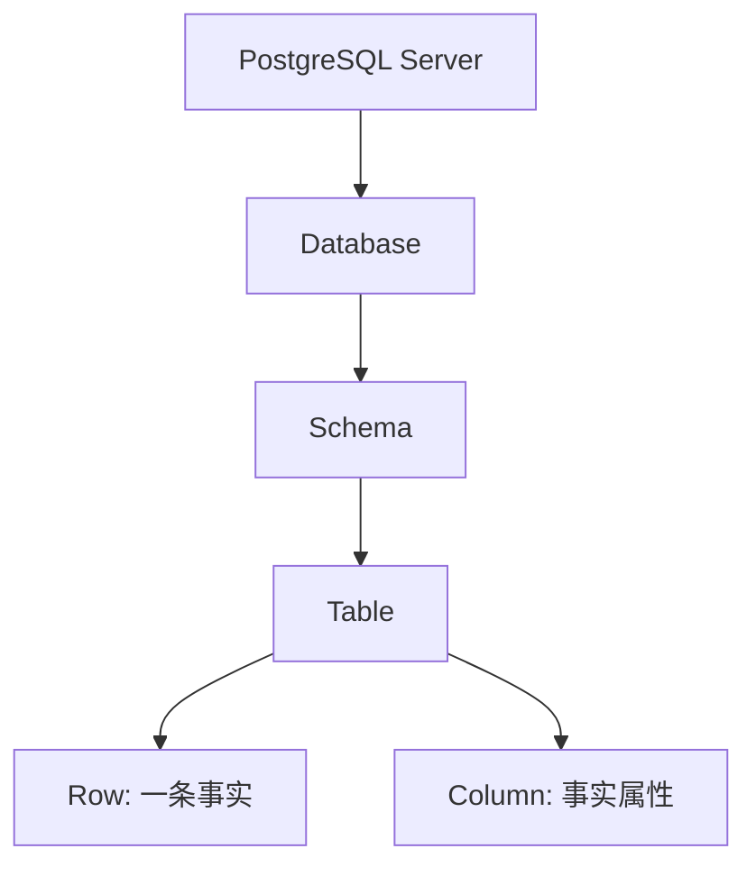

# 1. 数据库基础：用 PostgreSQL 建立数据系统直觉

::: tip 本章导读
用 PostgreSQL 建立数据如何被组织、约束、查询和保持一致的基础直觉。
:::
::: info 本章验收问题
- 你能否解释一张表中的一行、一列、主键、外键和约束各代表什么业务事实？
- 你能否说明 PostgreSQL 为什么适合作为数据库直觉训练入口？
:::




## 问题切入

很多人学习数据库，第一反应是去背 SQL 语法。

比如：

```sql
SELECT * FROM users;
```

或者：

```sql
SELECT count(*) FROM orders;
```

这些语句当然重要，但它们不是数据库学习的真正起点。真正的起点是理解一个更基础的问题：

> 当现实世界中的业务、用户、订单、商品、行为、日志进入计算机系统之后，它们究竟是如何被组织、约束、查询和演化的？

如果只是为了查几条数据，学习一些 SQL 就够了。

但如果你的目标是进入大数据、数据仓库、实时计算、湖仓架构、向量数据库、图数据库，甚至是 AI 时代的数据基础设施，那么你不能只停留在“会写查询语句”这一层。

你需要先建立一种更底层的数据系统直觉。

PostgreSQL 正适合作为这个入口。

它不是最简单的数据库，也不是专门为大数据分析而生的系统。但正因为如此，它反而适合作为学习数据系统的训练场。它足够完整，能让你看到数据库系统的核心结构；它足够成熟，能让你理解事务、索引、约束、执行计划、分区、视图等关键机制；它又足够贴近真实业务，常常出现在企业系统、数据同步链路、数仓源系统和 AI 应用元数据管理中。

所以，本章不是把 PostgreSQL 当成一个普通工具来讲，而是把它当成理解数据世界的第一块地图。

## 核心判断

PostgreSQL 的价值不只是能存数据和查数据，而是它把数据组织、约束、事务、查询、访问路径和单机边界压缩在一个真实可学习的环境里。

这一章要回答一个问题：为什么从 PostgreSQL 开始？答案是——PostgreSQL 的架构足够直观、足够严谨，让你在学 SQL 之前先建立"数据如何被管理"的体感。有了这个体感，后面的大数据工具才不会变成一堆散乱的名字。

### 1.1 为什么要从 PostgreSQL 开始理解数据系统？

### 一、数据库不是高级 Excel

初学者很容易把数据库理解成一种更强大的 Excel。

表面上看，这个理解并没有完全错。

Excel 里有表格，数据库里也有表。Excel 里有行和列，数据库里也有行和列。Excel 可以筛选、排序、统计，数据库也可以查询、过滤、聚合。

但这只是表象。

Excel 更像是一个面向人的数据整理工具，而数据库是一个面向系统的数据管理机制。

它们之间最大的区别，不在于谁能存更多数据，而在于数据库会严肃回答数据系统中的几个关键问题。

第一，数据应该如何被组织？

一个用户应该放在哪里？一笔订单应该如何表示？订单和用户之间是什么关系？商品、支付、物流、行为日志之间应该如何连接？

第二，数据应该如何被约束？

用户 ID 能不能重复？订单金额能不能为空？一笔订单能不能指向一个不存在的用户？库存数量能不能变成负数？

第三，数据应该如何被一致地修改？

当用户下单时，订单表要新增记录，库存表要减少数量，支付表要生成流水。如果中间某一步失败，系统应该怎么办？是保留一半结果，还是全部回滚？

第四，数据应该如何被高效查询？

为什么同样是查订单，有的查询几毫秒返回，有的查询几十秒还没有结果？为什么加了索引会变快？为什么数据量变大之后，原来的查询方式会失效？

第五，数据量继续增长之后，系统边界在哪里？

一个业务库可以支撑多少分析任务？什么时候应该把数据同步到数仓？什么时候应该引入 ClickHouse、Spark、Flink、Iceberg、Milvus 或 Neo4j？

这些问题，Excel 并不会真正回答。

而 PostgreSQL 会。

这就是为什么学习数据库不能只从语法开始，而要从数据系统的结构开始。

### 二、核心判断：PostgreSQL 是数据系统训练场

PostgreSQL 的价值，不只是它能存数据、查数据。

更重要的是，它把一个真实数据系统的核心问题压缩在一个相对完整、可学习、可实践的环境里。

你可以把 PostgreSQL 看成一个小型数据世界。

在这个世界里，数据不是随便堆放的，而是被放进不同的 Database、Schema 和 Table 中。

数据不是随便填写的，而是受到 Primary Key、Foreign Key、Constraint 的约束。

查询不是凭空发生的，而是由查询优化器生成执行计划，再通过扫描、索引、连接、排序、聚合等步骤完成。

修改不是简单覆盖，而是由事务、锁、MVCC、日志共同保证一致性和持久性。

当数据量变大时，PostgreSQL 又会让你看到索引、分区、物化视图、并行查询、执行计划这些机制如何帮助单机数据库继续工作，也会让你看到它们的边界。

所以，PostgreSQL 在本书里的角色不是“数据库工具 A”。

它是理解数据系统的训练场：

```text
组织数据
  -> 约束数据
  -> 查询数据
  -> 一致修改数据
  -> 优化访问路径
  -> 识别单机边界
  -> 走向 OLAP、数仓、实时计算和 AI 数据系统
```

### 三、PostgreSQL 和大数据不是两条线

很多人把 PostgreSQL 和大数据系统分开理解。

一边是业务数据库，另一边是 Spark、Flink、ClickHouse、Kafka、Iceberg、Milvus、Neo4j。

这种分法在系统选型上有意义，但在学习上容易造成割裂。

真实的数据平台不是凭空出现的。它通常从业务系统开始。

例如一个电商系统，最早的数据可能都在 PostgreSQL 里：

```text
users         用户
products      商品
orders        订单
order_items   订单明细
payments      支付
events        行为事件
```

业务刚开始时，PostgreSQL 既支撑在线交易，也支撑一些简单报表。

随着业务增长，订单表越来越大，事件数据越来越多，报表越来越复杂，分析查询开始影响在线业务。于是系统会自然演化：

```text
PostgreSQL 业务库
  -> ETL / CDC
  -> 数仓 / OLAP / 湖仓 / 实时计算
  -> BI / 指标 / 推荐 / RAG / GraphRAG
```

这条路径说明，PostgreSQL 不是大数据学习之外的前置知识，而是大数据系统的入口。

你只有先理解业务数据在 PostgreSQL 中如何组织，后面才能理解为什么需要数仓建模、为什么需要 CDC、为什么需要批处理和实时处理、为什么 OLAP 数据库要使用列式存储、为什么 AI 应用还需要向量库、图数据库和数据治理。

### 四、从会查数据到会理解数据系统

本书要完成的迁移，不是从一个 SQL 语法点迁移到另一个 SQL 语法点。

它真正要完成的是能力迁移：

```text
会查数据
  -> 理解表结构
  -> 理解约束和事务
  -> 理解查询执行
  -> 理解大表边界
  -> 理解 OLTP / OLAP 分化
  -> 理解数仓和数据链路
  -> 理解批处理、实时处理、湖仓
  -> 理解向量、图和治理
  -> 能构建智能数据系统
```

因此，第一章的目标不是让你记住所有 PostgreSQL 命令。

第一章要建立的是四个基础直觉：

- 数据如何被组织。
- 查询如何被执行。
- 事务如何保证一致性。
- 单机数据库在大数据场景中为什么会遇到边界。

只要这四个直觉建立起来，后面进入 SQL 分析、大表优化、数仓建模、ETL / CDC、OLAP、湖仓、向量数据库和图数据库时，就不会只是背工具名。

你会知道每个系统为什么出现，以及它试图接住 PostgreSQL 无法继续独自承担的哪一类问题。

### 五、常见误区

**误区一：先背 SQL 语法，再理解数据库。**

SQL 很重要，但 SQL 只是表达方式。数据库学习的底层问题是数据如何被组织、约束、修改和查询。如果不理解这些机制，SQL 写得越复杂，越容易制造不可解释的结果。

**误区二：PostgreSQL 只是业务库，和大数据无关。**

PostgreSQL 经常是大数据链路的数据源，也经常是数据平台的元数据库。业务事实从 PostgreSQL 出发，经过同步、建模、加工和治理，才进入 OLAP、湖仓、向量库和图数据库。

**误区三：学大数据应该先学 Spark、Flink、ClickHouse。**

直接学工具容易形成工具清单，但不一定理解系统压力。先在 PostgreSQL 中看见数据组织、查询边界和负载冲突，再理解分布式计算和分析引擎，会更稳定。

### 六、实战任务

准备一个电商数据库模型草图，不需要立刻建表，先写出业务对象：

```text
用户
商品
订单
订单明细
支付
用户行为事件
```

然后回答：

1. 哪些对象适合成为独立表？
2. 哪些对象之间存在关系？
3. 哪些字段必须唯一？
4. 哪些数据不能随便为空？
5. 哪些查询会是业务查询？
6. 哪些查询会是分析查询？

这个任务的目的不是写 SQL，而是先训练数据库建模前的结构感。

### 七、小结

PostgreSQL 不是本书的学习终点，而是理解数据系统的起点。

它能让你看到一个业务数据库如何组织数据、约束数据、查询数据和一致地修改数据，也能让你看到当数据规模、分析需求和系统复杂度增长时，单机数据库为什么会自然引出 OLAP、数仓、ETL / CDC、批处理、实时计算、湖仓、向量数据库、图数据库和数据治理。

下一节开始，我们不急着写查询语句，而是先进入 PostgreSQL 的核心结构。

因为学数据库的第一步，不是记住 `SELECT`，而是理解数据进入系统之后，被放在哪里。

## 机制解释

## 本章内容

| 节号 | 主题 |
|------|------|
| [01.1](/chapters/01/01-1) | 为什么要从 PostgreSQL 开始理解数据系统？ |
| [01.2](/chapters/01/01-2) | PostgreSQL 核心结构：数据系统是如何被组织起来的 |
| [01.3](/chapters/01/01-3) | 必学概念：从主键、外键、约束到事务、索引和分区 |
| [01.4](/chapters/01/01-4) | 关键问题：从业务库走向分析系统的边界 |


## 系统位置

PostgreSQL 是本书路线里的第一层系统。它承担业务事实、事务一致性、结构化元数据和中小规模分析，也暴露出后续章节要解决的边界：分析 SQL 会变复杂，大表会变慢，OLTP 和 OLAP 会分化，数据会进入数仓、批流、湖仓、向量和图系统。

### 1.4 关键问题：从业务库走向分析系统的边界

前面几节建立了 PostgreSQL 的基础结构和控制机制。

现在要把视角稍微拉远。

一个业务库并不是不能分析。PostgreSQL 完全可以做查询、聚合、JOIN、报表、物化视图和一定规模的数据分析。

但问题在于：

> 业务库可以承担分析，不代表它应该无限承担所有分析。

这正是从 PostgreSQL 走向大数据系统的关键转折。

### 一、数据如何从业务对象变成表结构？

业务世界里没有天然的表。

现实里有用户、商品、订单、支付、浏览、库存、物流、退款、评价。

数据库建模要做的，是把这些对象、事件和关系转换成可保存、可约束、可查询的数据结构。

正确顺序不是：

```text
先想字段
再凑表
```

而是：

```text
识别业务对象
  -> 区分对象、事件和关系
  -> 确定每张表的粒度
  -> 设计字段、主键和外键
  -> 加入基础约束
  -> 根据查询路径补充索引
```

这套思路后面会迁移到数仓建模。

事实表仍然要回答“一行代表什么业务事实”。

维度表仍然要回答“这些字段描述哪个业务对象”。

指标体系仍然要回答“哪些事实可以稳定计算成指标”。

所以 PostgreSQL 的表结构建模，是数仓建模的前置直觉。

### 二、查询为什么会快或慢？

查询快慢不是 SQL 长短决定的，而是数据库为了得到结果做了多少工作。

一条 SQL 执行时，数据库会生成执行计划，选择访问路径，再完成扫描、过滤、连接、排序、聚合和返回。

影响查询成本的关键因素包括：

```text
扫描了多少数据
有没有合适索引
过滤是否足够早
JOIN 两边数据量多大
排序和聚合是否需要大量内存
统计信息是否准确
执行计划是否合理
```

例如：

```sql
SELECT *
FROM orders
WHERE user_id = 501;
```

如果 `user_id` 上有合适索引，数据库可能快速定位该用户的订单。

但如果查询变成：

```sql
SELECT
    date(created_at) AS order_date,
    sum(total_amount) AS gmv
FROM orders
GROUP BY date(created_at)
ORDER BY order_date;
```

它可能需要扫描大量历史订单，再做聚合和排序。

这类查询已经开始从业务查询走向分析查询。

业务查询关注少量记录。

分析查询关注大量记录背后的趋势、结构和指标。

### 三、数据量变大后单机数据库为什么吃力？

PostgreSQL 是强大的单机数据库，也可以通过扩展、分区、并行查询和架构设计支撑很大规模的业务。

但它仍然会遇到边界。

边界通常来自四类压力。

第一，数据量压力。

表从百万行增长到千万行、亿级行后，扫描、索引维护、VACUUM、备份、恢复、归档都会变重。

第二，查询复杂度压力。

多表 JOIN、多维 GROUP BY、窗口函数、排序、去重、历史趋势分析，会消耗大量 CPU、内存和 I/O。

第三，负载冲突压力。

业务系统需要低延迟、高稳定、强一致。分析任务往往需要大范围扫描和长时间计算。两者争抢同一套资源时，业务交易可能被拖慢。

第四，团队协作压力。

当多个团队都在业务库上取数、建报表、跑临时查询，指标口径、权限边界、查询成本和数据解释都会变得难以管理。

这些压力不会在第一天出现。

它们通常随着业务增长逐步积累。

这就是为什么大数据系统不是凭空出现的，而是单机业务库边界被不断推高之后自然分化出来的。

### 四、为什么不能把所有分析任务压在业务库上？

业务库的核心任务是支撑在线交易。

典型请求是：

```text
用户登录
商品查询
创建订单
支付更新
库存扣减
订单状态流转
```

这些请求追求的是：

```text
小范围
高频
低延迟
强一致
稳定响应
```

而分析任务通常是：

```text
统计每日 GMV
计算用户留存
分析转化漏斗
统计商品销量排行
回看一年订单趋势
按渠道、地区、用户等级多维分析
```

这些任务追求的是：

```text
大范围扫描
历史数据计算
多表 JOIN
多维聚合
指标口径统一
可重复产出
```

这两类负载的目标不同。

业务库不是不能跑分析，而是不应该长期承担所有分析。

更合理的系统演化是：

```text
PostgreSQL 业务库
  -> ETL / CDC
  -> ODS / DWD / DWS / ADS
  -> ClickHouse / Doris / Spark / Trino / Iceberg
  -> BI / 指标服务 / 推荐 / RAG / GraphRAG
```

PostgreSQL 继续承担业务事实的可靠写入。

分析系统承担历史扫描、复杂聚合、指标生产、跨系统数据融合和 AI 数据准备。

这不是替代关系，而是分工关系。

## 场景案例

本章贯穿的场景是电商业务系统：

```text
users
products
orders
order_items
payments
events
```

这个模型让读者同时看到业务对象、业务事件和业务关系：用户下单、订单包含商品明细、支付更新订单状态、行为事件进入后续分析链路。

它也展示了 PostgreSQL 的系统位置：早期可以同时支撑业务查询和轻量分析；当订单、支付和事件数据增长后，就会自然引出 SQL 分析、大表边界、OLTP/OLAP 分化、数仓建模和数据链路。

## 常见误区

### 五、常见误区

**误区一：PostgreSQL 能做分析，所以不需要数仓。**

PostgreSQL 可以做分析，但数仓解决的不只是查询性能，还包括分层建模、指标口径、数据质量、血缘、权限和跨系统数据融合。

**误区二：查询慢就一定加索引。**

索引适合特定访问路径，不适合所有大范围分析。慢查询需要先看执行计划，再判断是索引、SQL、分区、预计算，还是系统分工问题。

**误区三：大数据就是换一个更快的数据库。**

大数据系统不是单点替换，而是数据链路、建模、计算、存储、治理和应用方式的整体变化。

**误区四：业务库和分析库完全无关。**

分析库的数据往往来自业务库。业务库的建模质量、主键设计、状态字段、时间字段和变更记录，都会影响后续数仓和实时链路。

## 实战任务

### 六、实战任务

基于前面的电商模型，列出 10 个查询需求，并把它们分成两类。

业务查询示例：

```text
查询某个用户的最近 20 笔订单
查询某笔订单的支付状态
更新订单状态
扣减某个商品库存
```

分析查询示例：

```text
统计最近 30 天每日 GMV
计算不同渠道用户的 7 日留存
分析浏览 -> 加购 -> 下单 -> 支付转化漏斗
统计商品销量 Top 100
计算每个用户生命周期消费金额
```

然后回答：

1. 哪些查询应该优先留在 PostgreSQL 业务库？
2. 哪些查询适合进入数仓或 OLAP 系统？
3. 哪些查询需要事件数据？
4. 哪些查询会扫描大量历史数据？
5. 哪些查询对实时性要求高？
6. 哪些查询需要统一指标口径？

这个任务的目的，是让你开始区分业务查询和分析查询。

这也是理解 OLTP 与 OLAP 分化的前置能力。

## 小结引出下一章

### 第一章小结：从数据库工具到数据系统直觉

到这里，第一章完成的不是一次普通 PostgreSQL 入门。

如果只是把 PostgreSQL 当作一个数据库工具来学，我们很容易陷入语法、命令和功能清单：怎么建表、怎么写 SQL、怎么加索引、怎么查数据。

但这一章真正要建立的，不是“我会用 PostgreSQL”，而是更底层的判断：

> 数据系统的核心，不是把数据存进去，而是让数据在长期变化中仍然有结构、有规则、有关联、可查询、可分析、可演化。

第一章建立了四个基础直觉。

第一，数据不是随便堆放的，而是被组织起来的。

```text
PostgreSQL Server
  -> Database
  -> Schema
  -> Table
  -> Row / Column
```

第二，数据不是写进去就结束，而是要被规则控制。

```text
Primary Key        解决记录身份问题
Foreign Key        解决表之间关系问题
Constraint         解决数据规则问题
Transaction        解决多步修改一致性问题
Index              解决查询定位效率问题
View               解决查询逻辑复用问题
Materialized View  解决预计算加速问题
Partition          解决大表管理问题
```

第三，表结构不是字段集合，而是业务理解的结果。

```text
识别业务对象
  -> 区分对象、事件和关系
  -> 确定每张表的粒度
  -> 设计字段、主键和外键
  -> 加入基础约束
```

第四，业务库不是不能分析，而是不能承担所有分析。

```text
PostgreSQL 业务库
  -> ETL / CDC
  -> 数仓 / OLAP / 湖仓 / 实时计算
  -> BI / 指标 / AI 应用
```

到这里，我们已经完成了从“数据库是表格集合”到“数据库是数据系统入口”的迁移。

下一章将正式进入 SQL 分析能力。

SQL 在这里不再只是查询语法，而是大数据系统的共同语言。无论后面使用 PostgreSQL、Hive、Spark SQL、Trino、ClickHouse 还是 Doris，都绕不开一个基础能力：

> 如何用 SQL 把业务问题准确表达成可执行、可解释、可迁移的数据分析过程。
