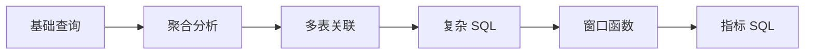

# 2. SQL 分析能力：大数据方向第一硬技能

::: tip 本章导读
把 SQL 从查询语法提升为分析表达能力，训练取数、聚合、关联、窗口和指标口径。
:::
::: info 本章验收问题
- 你能否为 GMV、留存或复购写出口径说明，而不是只写出一条 SQL？
- 你能否指出一条 SQL 的粒度、时间边界和状态边界？
:::




第一章建立的是数据库直觉：数据如何被组织、约束、查询和保持一致。

第二章开始进入 SQL。

## 问题切入

很多人学习数据库时，会把 SQL 当成语法题：会写 `SELECT`、`WHERE`、`GROUP BY`、`JOIN`，就认为自己掌握了 SQL。

但真实数据工作不是这样。业务同学不会问“请写一个 `GROUP BY`”，而是会问：

```text
今天成交额为什么比昨天低？
新用户 7 日留存是多少？
哪些商品带来了最多复购？
一次营销活动影响了哪些用户分层？
为什么同一个 GMV 指标，两个报表算出来不一样？
```

这些问题的难点不在语法本身，而在三件事：

1. **取数边界**：哪些记录应该算入，哪些记录应该排除。
2. **业务粒度**：一行数据代表用户、订单、订单明细、支付记录，还是一次行为事件。
3. **指标口径**：统计时间、状态过滤、去重方式、退款处理和异常数据如何定义。

如果只会写语法，不会表达这些判断，SQL 就只能查出一张临时表，不能沉淀成可信的分析能力。

## 核心判断

但这里的 SQL 不是语法清单，而是一种分析表达能力。它让你把业务问题转换成数据问题，再转换成可执行、可验证、可迁移的计算过程。

> SQL 是大数据系统的共同语言。PostgreSQL、Hive、Spark SQL、Trino、ClickHouse、Doris 都依赖 SQL。学习大数据，应先强化分析 SQL，而不是先背工具名。

SQL 是数据工程师职业生涯中复用率最高的技能。这一章的目标是把 SQL 从”能查出数据”升级到”能把业务问题翻译成稳定、可复用、可验证的计算过程”。这里建立的判断，会原封不动地迁移到 Spark SQL、Trino、ClickHouse 和 DuckDB。

SQL 也不是万能工具。它不能替你定义业务口径，不能自动判断数据质量，不能解决所有性能瓶颈，也不能替代数据建模、数据治理和系统架构。它负责把已经明确的问题、数据边界和计算规则表达出来。

## 机制解释

本章按六层能力展开：

```text
基础查询
  -> 聚合分析
  -> 多表关联
  -> 复杂分析 SQL
  -> 窗口函数
  -> 指标 SQL
```

这条路径不是语法从简单到复杂的堆叠，而是分析能力从“取出记录”到“形成指标”的升级。

### 2.1 SQL不是语法题，而是分析表达能力

#### 一、为什么很多人学SQL只会不会用

大多数人的SQL学习是这样的：

```text
第一天：SELECT * FROM users;
第二天：SELECT * FROM orders WHERE status = 'paid';
第三天：SELECT count(*) FROM orders GROUP BY user_id;
第四天：学会JOIN
第五天：学会窗口函数
```

看起来什么都学会了，但遇到真实问题时却卡住了。

业务同学问"今天的成交额是多少？"，会写SQL的人立刻写出：

```sql
SELECT sum(amount) FROM orders;
```

但这个结果可能有问题：是否包含退款订单？是否包含测试订单？是否包含取消订单？统计时间是按创建时间还是支付时间？未支付的订单算不算？

业务同学问"新用户7日留存是多少？"，会写SQL的人可能写：

```sql
SELECT
    count(DISTINCT case when login_date between register_date + 1 and register_date + 7 then user_id end) * 1.0 / count(DISTINCT user_id)
FROM users;
```

但这个查询可能有很多问题：什么是"新用户"？首次注册还是首次下单？什么是"留存"？登录、下单还是活跃？7日从哪天开始算？用哪个字段判断时间？去重用user_id对吗？

会SQL语法不等于会做数据分析。问题不在语法，而在表达。

#### 二、SQL是把业务问题转成数据计算过程

SQL从表面看是一种查询语言，用于从数据库中取出数据。从本质看是一种分析表达能力，它让你把业务问题转换成数据问题，再转换成可执行的计算过程。

这个过程包括：

```text
业务问题
  ↓ 理解和澄清
数据问题
  ↓ 设计计算逻辑
计算过程（SQL）
  ↓ 执行和验证
分析结果
  ↓ 解释和沉淀
可信指标
```

以"新用户7日留存"为例展示这个完整过程。

第一步，理解业务问题。业务为什么要看这个指标？评估产品粘性、评估用户质量、评估获客渠道效果。什么是"新用户"？某日首次注册的用户还是某日首次下单的用户。什么是"7日留存"？注册后第7天仍然活跃的用户比例，第7天登录、下单还是浏览？时间如何计算？按自然日还是按24小时精确时间。

第二步，转换成数据问题。有了这些澄清，数据问题就清晰了：计算2026-04-01注册的用户，在注册后7日内（4月2日-4月8日）至少登录一次的用户比例。

第三步，设计计算逻辑。找出2026-04-01注册的用户，统计这些用户总数，统计这些用户在4月2日-4月8日内登录的数量，计算比例。

第四步，写出SQL：

```sql
WITH new_users AS (
    SELECT user_id, register_date
    FROM users
    WHERE register_date = '2026-04-01'
),
user_count AS (
    SELECT count(*) AS total_users
    FROM new_users
),
retention_users AS (
    SELECT count(DISTINCT nu.user_id) AS retained_users
    FROM new_users nu
    JOIN events e ON nu.user_id = e.user_id
    WHERE e.event_date BETWEEN nu.register_date + 1 AND nu.register_date + 7
      AND e.event_name = 'login'
)
SELECT
    retained_users * 100.0 / total_users AS retention_rate_7day
FROM user_count, retention_users;
```

第五步，验证和解释。结果是否合理（比如30%的7日留存是否正常）？SQL是否正确表达了业务定义？留存率的定义和边界是什么？

这个完整过程说明：SQL的能力不在于语法，而在于把业务问题清晰化、结构化、可执行化。

#### 三、SQL在大数据系统中的位置

SQL不只是PostgreSQL的语言，它是所有大数据系统的共同语言。

| 系统 | SQL支持 | 用途 |
|------|---------|------|
| PostgreSQL | 完整SQL | 业务库查询、简单分析 |
| Hive | Hive SQL | 离线数仓查询 |
| Spark SQL | 完整SQL | 批处理计算 |
| Trino | 完整SQL | 联邦查询、交互分析 |
| ClickHouse | 完整SQL | OLAP查询 |
| Doris | 完整SQL | 实时OLAP查询 |
| DuckDB | 完整SQL | 本地数据分析 |

虽然各系统的SQL有差异，但核心语法（SELECT、WHERE、GROUP BY、JOIN、窗口函数）是相通的。在PostgreSQL中学到的SQL能力，可以直接迁移到所有大数据系统。区别在于性能、扩展性、函数支持，而不在于基本语法。

这意味着在PostgreSQL上打好SQL基础，是学习大数据系统的合理起点。不要一上来就去学Spark、Flink的特殊语法。先把通用SQL能力打牢，再学各系统的扩展特性。

#### 四、SQL能力的四个层次

**层次1：会写语法。** 能写SELECT、WHERE、GROUP BY、JOIN，能查询出数据。局限是不知道查出来的数据对不对。

**层次2：写出能运行的查询。** SQL能执行并返回结果，结果看起来合理。局限是不知道口径是否清晰，能否复用。

**层次3：写出清晰的业务定义。** SQL表达了明确的业务逻辑，有清晰的取数边界，有明确的指标口径。局限是不考虑性能和可维护性。

**层次4：写出可复用、可迁移的分析能力。** SQL逻辑清晰、可读、可维护，指标口径明确、可沉淀，可以迁移到不同系统，性能合理。这是本章要达到的目标。

#### 五、从"会SQL"到"会分析SQL"的关键转变

要实现从层次1到层次4的跨越，需要在五个方面转变。

**转变1：从"写SQL"到"定义问题"。** 拿到需求不要立刻写SQL、边写边想逻辑，而要先问清楚业务问题是什么，再澄清数据口径，最后才是写SQL。

**转变2：从"拿到结果"到"验证结果"。** SQL跑出结果不等于结束。要验证结果是否在合理范围、和其他数据源对比是否一致、边界情况是否考虑。

**转变3：从"临时查询"到"可沉淀的指标"。** 每次都临时写SQL会导致口径不统一。正确的做法是把SQL沉淀成视图或表，统一指标口径，建立指标字典。

**转变4：从"只考虑功能"到"考虑性能"。** 只要SQL能跑出来就行是不够的。需要考虑扫描的数据量、索引使用、执行计划。

**转变5：从"写一次"到"可维护、可迁移"。** SQL写得难以阅读、逻辑嵌套混乱是常见问题。应该用CTE让逻辑清晰，添加注释说明业务逻辑，保持代码结构清晰，便于迁移到Spark SQL或ClickHouse。

#### 六、常见误区

**语法等于分析能力。** 语法只是工具，业务理解才是前提。能查数据但不知道数据对不对，产出的分析结论不可信。SQL是表达工具，分析能力是本质。

**SQL跑出结果就完成了。** 需要验证结果的正确性。不验证可能产出错误的分析结论。验证和解释与写SQL同样重要。

**不同系统的SQL差异很大。** 核心SQL语法是相通的。在PostgreSQL上学到的SQL能力可以直接迁移到其他大数据系统。重复学习浪费时间的根源在于没有抓住核心能力的共同性。

#### 七、小结

SQL分析能力的起点不是语法，而是理解：

1. SQL是分析表达能力，把业务问题转成数据计算过程
2. SQL是大数据系统的共同语言，在PostgreSQL上学到的能力可以直接迁移
3. SQL能力有四个层次，从会语法到会分析，目标是写出可复用、可迁移的分析能力
4. 需要五个转变：从写SQL到定义问题，从拿结果到验证结果，从临时查询到可沉淀指标，从只考虑功能到考虑性能，从写一次到可维护

下一节将进入SQL分析能力的第一个具体层次：基础查询。即使是最简单的SELECT语句，也需要清晰的边界意识。

### 2.2 基础查询：从表中准确取出你需要的数据

基础查询解决的是取数边界问题。

一条最简单的查询是：

```sql
SELECT * FROM orders;
```

但在真实数据分析中，这条SQL通常不够好。它没有说明你要哪些字段、哪些记录、什么顺序、返回多少行，也没有表达清楚业务边界。

更好的写法是：

```sql
SELECT
    order_id,
    user_id,
    total_amount,
    order_status,
    created_at
FROM orders
WHERE order_status = 'paid'
ORDER BY created_at DESC
LIMIT 20;
```

这条SQL表达了五个判断：

```text
SELECT      取哪些字段
FROM        从哪张表取
WHERE       取哪些行
ORDER BY    按什么顺序返回
LIMIT       返回多少行
```

基础查询不是为了"查出来"，而是为了清楚定义数据范围。

#### 一、为什么SELECT *不够好

很多人习惯用`SELECT *`。原因是写起来快，不需要知道表有哪些字段，看起来"什么都有了"。

但实践表明，`SELECT *`在生产环境中有五个问题。

**性能代价**：假设`orders`表有50个字段，真正需要的只有5个。`SELECT *`读取全部50个字段——如果表有1000万行，多余的数据传输量很可观。

**无法使用覆盖索引**。如果`(user_id, order_status, created_at)`上有索引：

```sql
-- SELECT * 无法使用覆盖索引，需要回表
SELECT * FROM orders WHERE user_id = 123;

-- 明确字段可以直接从索引获取，不需要回表
SELECT user_id, order_status, created_at FROM orders WHERE user_id = 123;
```

**结果集不稳定**。当表增加新字段时，所有`SELECT *`都会自动包含新字段，可能导致程序逻辑出错。

**无法表达业务语义**。明确字段有业务含义：
```sql
SELECT
    order_id as 订单号,
    user_id as 用户ID,
    total_amount as 订单金额,
    order_status as 订单状态
FROM orders;
```

`SELECT *`只是原始数据，没有语义。

经验规则是：小表和探索阶段可以用`SELECT *`，生产环境、大表、跨系统查询必须明确字段。

#### 二、SELECT与投影：选择需要的字段

基本三原则：

**只选择需要的字段**。减少I/O、减少网络传输、减少内存使用、提高查询可读性。

```sql
-- 差：读取所有字段
SELECT * FROM orders;

-- 好：只选择需要的字段
SELECT order_id, user_id, total_amount, created_at
FROM orders;
```

**使用字段别名**。别名字段让结果更清晰：
```sql
SELECT
    order_id as 订单编号,
    user_id as 用户编号,
    total_amount as 订单金额,
    created_at as 创建时间
FROM orders;
```

**避免SELECT子查询中的`*`**：
```sql
-- 差：子查询中的*
SELECT u.*,
       (SELECT count(*) FROM orders WHERE user_id = u.user_id) as order_count
FROM users u;

-- 好：明确字段
SELECT u.user_id, u.name, u.email,
       (SELECT count(*) FROM orders WHERE user_id = u.user_id) as order_count
FROM users u;
```

计算字段示例：
```sql
SELECT
    order_id,
    total_amount,
    tax_amount,
    total_amount + tax_amount as final_amount,
    (total_amount + tax_amount) * 0.9 as discounted_amount
FROM orders;
```

CASE WHEN可以把业务规则转成字段：
```sql
SELECT
    order_id,
    total_amount,
    CASE
        WHEN total_amount >= 1000 THEN 'high'
        WHEN total_amount >= 100 THEN 'middle'
        ELSE 'low'
    END as amount_level,
    CASE
        WHEN order_status = 'paid' THEN 1
        WHEN order_status = 'pending' THEN 0
        ELSE -1
    END as is_paid
FROM orders;
```

CASE WHEN特别适合数据分类、标志位计算、业务规则实现。

#### 三、WHERE与过滤：定义数据边界

比较运算符的使用：
```sql
-- 等于
SELECT * FROM orders WHERE user_id = 123;

-- 不等于
SELECT * FROM orders WHERE order_status != 'cancelled';

-- 大于
SELECT * FROM orders WHERE total_amount > 100;

-- 小于等于
SELECT * FROM orders WHERE created_at <= '2026-04-01';
```

字符串比较是字典序，日期比较要确保格式一致。

逻辑运算符的优先级：NOT > AND > OR。不确定时用括号：

```sql
-- 正确：用括号明确优先级
SELECT * FROM orders
WHERE (user_id = 123 OR user_id = 456) AND order_status = 'paid';
```

NULL需要特殊处理——NULL不等于任何值，也不能用`=`或`!=`判断：

```sql
-- 判断是否为NULL
SELECT * FROM orders WHERE paid_at IS NULL;

-- COALESCE：返回第一个非NULL值
SELECT
    order_id,
    COALESCE(discount_amount, 0) as final_discount
FROM orders;
```

模糊匹配LIKE/ILIKE：
```sql
-- 前缀匹配（可以用索引）
SELECT * FROM products WHERE name LIKE 'iPhone%';

-- ILIKE (PostgreSQL特有，不区分大小写)
SELECT * FROM products WHERE name ILIKE 'iphone%';
```

范围过滤：
```sql
-- BETWEEN是闭区间
SELECT * FROM orders
WHERE total_amount BETWEEN 100 AND 500;

-- IN比OR更清晰
SELECT * FROM orders
WHERE order_status IN ('paid', 'shipped', 'completed');
```

#### 四、ORDER BY与LIMIT：控制结果集

排序：
```sql
-- 升序（默认）
SELECT * FROM orders ORDER BY created_at;

-- 降序
SELECT * FROM orders ORDER BY created_at DESC;

-- 多字段排序
SELECT * FROM orders ORDER BY user_id ASC, created_at DESC;
```

排序会增加内存和CPU开销，大结果集排序要谨慎，能用索引排序会更快。

分页的注意点——OFFSET越大，性能越差，因为需要跳过前面的所有行。大数据集分页考虑用游标或WHERE条件替代OFFSET：

```sql
-- 第1页（每页20条）
SELECT * FROM orders ORDER BY created_at DESC LIMIT 20 OFFSET 0;

-- 第2页
SELECT * FROM orders ORDER BY created_at DESC LIMIT 20 OFFSET 20;
```

#### 五、DISTINCT与去重

```sql
-- 单字段去重：查看有哪些用户下过单
SELECT DISTINCT user_id FROM orders;

-- 多字段去重：查看每个用户每天是否下过单
SELECT DISTINCT user_id, date(created_at) FROM orders;
```

DISTINCT和GROUP BY功能相似但不完全一样：DISTINCT更简洁，GROUP BY可以做聚合，GROUP BY更灵活。

#### 六、常见过滤场景

**按时间范围过滤时**，注意`date(created_at)`这类函数会导致索引失效。更好的写法是范围比较：

```sql
-- 差：无法使用索引
SELECT * FROM orders WHERE date(created_at) = '2026-04-01';

-- 好：可以使用索引
SELECT * FROM orders
WHERE created_at >= '2026-04-01' AND created_at < '2026-04-02';
```

按状态过滤：
```sql
SELECT * FROM orders WHERE order_status = 'paid';
SELECT * FROM orders WHERE order_status IN ('paid', 'shipped', 'completed');
SELECT * FROM orders WHERE order_status NOT IN ('cancelled', 'refunded');
```

#### 七、常见误区

**不处理NULL语义**。NULL与任何运算结果都是NULL，聚合结果可能因此出错。用`IS NULL`/`IS NOT NULL`判断，用`COALESCE`处理缺值。

**用字符串函数过滤日期导致索引失效**。`date_format(created_at, '%Y-%m-%d') = '2026-04-01'`这类写法无法使用索引。用范围过滤代替。

**不知道LIMIT OFFSET在数据量大时性能差**。OFFSET需要跳过前面的所有行，翻页越深越慢。大数据集分页考虑用`WHERE created_at < last_seen_time`这种游标方式。

#### 八、小结

基础查询看起来简单，但直接决定数据边界和查询成本：

1. **明确字段**：只选择需要的字段，减少I/O和网络传输
2. **明确过滤**：用WHERE定义取数范围，同时考虑索引使用
3. **明确排序**：ORDER BY定义返回顺序，能用索引排序就用索引
4. **明确限制**：LIMIT定义返回行数，大偏移量分页避免用OFFSET

下一节将进入聚合分析：从明细记录统计出指标。

### 2.3 聚合分析：从明细记录到统计指标

基础查询回答的是"哪些记录符合条件"。

聚合分析回答的是"这些记录合起来说明什么"。

假设`orders`表一行代表一笔订单：

```text
orders
├── order_id
├── user_id
├── order_status
├── total_amount
├── created_at
└── paid_at
```

如果只看明细，你可以知道最近20笔订单是什么。但业务通常更关心：

```text
今天有多少订单？
这个月GMV是多少？
平均每笔订单多少钱？
哪个商品销量最高？
每天订单量趋势如何？
哪些用户发生了复购？
```

这就需要聚合。

#### 一、为什么只看明细不够

明细无法回答宏观问题。运营同学关心的是整体情况——"今天成交额怎么样？""这个月增长了吗？""哪个类目表现最好？"这些都不是单条订单能回答的。

明细数据量太大，难以直接理解。如果你有1000万行订单，逐行查看几乎不可能。你需要的是把1000万行压缩成一个GMV数字、30天的每日GMV，或者Top10商品排行。聚合让大数据变成可理解的指标。

业务决策基于统计，不是明细。GMV是否达标、增长率是否健康、用户留存是否良好——这些都需要聚合分析。

#### 二、聚合函数详解

COUNT的三种用法：
```sql
-- COUNT(*)：包括NULL，统计所有行
SELECT count(*) FROM orders;

-- COUNT(字段)：不包括NULL
SELECT count(user_id) FROM orders;

-- COUNT(DISTINCT 字段)：去重后计数
SELECT count(DISTINCT user_id) FROM orders;
```

实战场景：
```sql
-- 订单总数
SELECT count(*) FROM orders;

-- 下单用户数（去重）
SELECT count(DISTINCT user_id) FROM orders;

-- 有支付的用户数
SELECT count(DISTINCT user_id) FROM orders WHERE paid_at IS NOT NULL;
```

SUM求和，忽略NULL值。如果所有值都是NULL，返回NULL。用COALESCE处理缺值：
```sql
SELECT order_status, sum(COALESCE(total_amount, 0)) FROM orders GROUP BY order_status;
```

AVG计算平均值，自动排除NULL，但可能被异常值扭曲。有极端值时，考虑用中位数MEDIAN（PostgreSQL 12+支持）或先用WHERE过滤极端值再聚合。

MAX/MIN找极值：
```sql
SELECT user_id, max(total_amount) FROM orders GROUP BY user_id;
```

#### 三、GROUP BY与分组维度

GROUP BY按维度分组统计。分组维度决定粒度：

```sql
-- 按日统计（一行一天）
SELECT date(created_at), count(*) FROM orders GROUP BY date(created_at);

-- 按月统计（一行一月）
SELECT date_trunc('month', created_at), count(*) FROM orders GROUP BY date_trunc('month', created_at);

-- 按用户统计（一行一个用户）
SELECT user_id, count(*) FROM orders GROUP BY user_id;
```

关键理解：GROUP BY的字段就是分析维度。不同分组维度得出不同指标，必须明确当前分析是按什么维度聚合。

HAVING对聚合结果进行过滤，区别于WHERE对明细记录的过滤：

```sql
-- WHERE：聚合前过滤（只看已支付订单）
SELECT user_id, count(*) as order_count
FROM orders
WHERE total_amount > 100
GROUP BY user_id;

-- HAVING：聚合后过滤（只看下单超过5次的用户）
SELECT user_id, count(*) as order_count
FROM orders
GROUP BY user_id
HAVING count(*) > 5;
```

#### 四、聚合的粒度陷阱

JOIN会改变粒度，导致重复计算。假设orders是一行一笔订单，JOIN order_items后变成一行一个订单商品明细。如果直接对order_items做SUM，统计的是商品粒度金额，不是订单粒度金额。

正确做法是先聚合再JOIN：
```sql
WITH order_totals AS (
    SELECT order_id, sum(item_amount) as order_amount
    FROM order_items
    GROUP BY order_id
)
SELECT o.order_id, o.order_status, ot.order_amount
FROM orders o
JOIN order_totals ot ON o.order_id = ot.order_id;
```

去重时机也很容易出错。统计每日活跃用户数（DAU）时，直接在events表上做`count(DISTINCT user_id)`，不要先JOIN users表——JOIN可能导致用户数重复计算或丢失。

#### 五、常见误区

**聚合结果有数字就认为正确**。聚合函数能算出数字，但数字是否可信取决于过滤条件、去重口径、时间字段、JOIN粒度。不同人、不同SQL能算出不同结果。必须明确定义：取数边界（哪些记录算入）、过滤条件（哪些记录排除）、时间口径（按创建时间还是支付时间）、去重口径（用COUNT(*)还是COUNT(DISTINCT)）。

**COUNT(*)和COUNT(字段)混淆**。COUNT(*)包括NULL，COUNT(字段)不包括NULL。统计分析时这个差异可能导致结果不符合预期。

**AVG被异常值扭曲**。简单场景用AVG即可，有极端值时考虑中位数或百分位数，也可以先用WHERE过滤极端值再聚合。

**HAVING和WHERE不分**。WHERE过滤明细记录（聚合前），HAVING过滤聚合结果（聚合后）。执行顺序是：WHERE → GROUP BY → HAVING。

#### 六、小结

基础查询回答"哪些记录符合条件"，聚合分析回答"这些记录合起来说明什么"。

核心要点：
- 聚合函数（COUNT、SUM、AVG、MAX、MIN）是聚合的基础
- GROUP BY定义分组维度，不同的维度得出不同的指标
- HAVING对聚合结果进行过滤
- JOIN会改变粒度，要先聚合再JOIN避免重复计算
- 聚合结果有数字不代表正确，必须明确口径

下一节将进入多表关联：现实数据通常不会在一张表里，需要从多表中恢复完整的业务事实。

### 2.4 多表关联：从分散数据中恢复完整业务事实

基础查询从单表中取出数据，聚合分析从明细数据中计算统计指标。

但现实业务数据通常不会都在一张表里。

假设你在分析电商订单，需要回答这些问题：

```text
哪个用户的订单金额最高？
用户最近一次购买是什么时候？
用户购买最多的商品是什么？
```

这些问题的答案分散在多张表里：用户基本信息在`users`表，订单记录在`orders`表，订单明细在`order_items`表，商品信息在`products`表。

要回答这些业务问题，需要把分散在多表的数据"拼"起来。这就是多表关联。

#### 一、为什么数据会分散在多张表

规范化设计减少数据冗余。如果把用户信息和订单放在一张表里，一个用户有10笔订单，用户信息就重复10次。用户邮箱变了，需要更新10条记录。拆分成users和orders两张表后，用户信息只存储一次，更新只需修改一行。

不同实体的数据自然分离。用户、商品、订单、支付这些不同实体通常分开存储，通过外键关联形成关系模型。

分析需要关联多个维度。比如"哪个地区的用户购买力最高？"需要JOIN users和orders，"哪个类目的商品销售额最高？"需要JOIN order_items和products。这些都是跨表的业务问题。

#### 二、JOIN的类型与用法

INNER JOIN只返回两边都匹配的记录：

```sql
SELECT
    u.user_id, u.name, o.order_id, o.total_amount
FROM users u
INNER JOIN orders o ON u.user_id = o.user_id;
```

结果：只有在users和orders中都存在的user_id才会返回。没有下过单的用户不会出现。这是最常用的JOIN类型。

LEFT JOIN返回左表所有记录，右表没有匹配时填NULL：

```sql
SELECT
    u.user_id, u.name, o.order_id, o.total_amount
FROM users u
LEFT JOIN orders o ON u.user_id = o.user_id;
```

所有用户都会返回，没有订单的用户order_id和total_amount为NULL。典型应用是找出左表中没有匹配的记录：

```sql
SELECT u.user_id, u.name
FROM users u
LEFT JOIN orders o ON u.user_id = o.user_id
WHERE o.order_id IS NULL;
```

RIGHT JOIN返回右表所有记录，相对较少用，可以用LEFT JOIN通过交换表的顺序实现。

FULL OUTER JOIN返回两边所有记录，没有匹配时填NULL。MySQL不支持FULL OUTER JOIN，可以用UNION模拟。

CROSS JOIN返回两表的笛卡尔积，用于生成所有可能的组合，需要慎用——数据量会爆炸。

SELF JOIN让表与自己关联，适合层级结构（组织架构、分类树）：

```sql
SELECT
    e.name as employee_name,
    m.name as manager_name
FROM employees e
LEFT JOIN employees m ON e.manager_id = m.employee_id;
```

#### 三、多表关联的粒度问题

一对一关联：一个用户对应一个用户扩展信息，JOIN后行数不变。

一对多关联：一个用户有多个订单，JOIN后行数增加（一个用户有多笔订单时会展开）。

多对多关联：一个订单有多个商品，一个商品在多个订单中，通过中间表关联。关联后的行数等于订单数乘以平均商品数。

关联导致数据膨胀是最常见的陷阱。统计每个用户的GMV时，如果直接JOIN orders和order_items，一个订单如果有3个商品，关联后订单会展开成3行，直接SUM会重复计算。正确做法是先聚合再关联：

```sql
WITH order_totals AS (
    SELECT order_id, sum(item_amount) as order_amount
    FROM order_items
    GROUP BY order_id
)
SELECT
    u.user_id,
    sum(ot.order_amount) as gmv
FROM users u
JOIN orders o ON u.user_id = o.user_id
JOIN order_totals ot ON o.order_id = ot.order_id
GROUP BY u.user_id;
```

#### 四、JOIN的性能考虑

从小表JOIN大表，先过滤再JOIN，确保JOIN字段有索引。所有JOIN字段都应该建立索引——外键在PostgreSQL中会自动建立索引，但明确创建的索引需要自己管理。

经验规则是单个SQL中JOIN不超过5个。超过时考虑宽表或物化视图减少JOIN，或者分步骤查询，用应用层组装。

用EXPLAIN分析JOIN执行计划：

```sql
EXPLAIN SELECT u.name, o.order_id
FROM users u
JOIN orders o ON u.user_id = o.user_id;
```

观察是否使用了索引、是否有全表扫描、每一步的执行成本。

#### 五、常见误区

**JOIN越多越强大**。JOIN能关联表，但不是越多越好。每增加一个JOIN就增加一层复杂度和性能开销，数据膨胀也更难察觉。只JOIN必要的表。

**LEFT JOIN后不注意NULL**。LEFT JOIN会保留左表所有记录，但可能引入NULL值，导致聚合函数（SUM、AVG）被NULL影响。使用LEFT JOIN后要用COALESCE处理可能为NULL的字段。

**关联后数据量不变**。JOIN会改变数据量。一对一关联行数不变，一对多关联行数增加，多对多关联行数大幅增加。先聚合再JOIN可以避免膨胀。

**JOIN字段没有索引**。如果没有索引，JOIN会导致全表扫描，性能极差。定期检查EXPLAIN输出确认索引使用情况。

#### 六、小结

基础查询从单表中取数据，聚合分析从明细数据中计算指标。多表关联从分散的数据中恢复完整的业务事实。

核心要点：
- INNER JOIN只返回匹配的记录，LEFT JOIN保留左表所有记录
- 一对一、一对多、多对多关联有不同的行为
- JOIN会导致数据膨胀，要先聚合再JOIN
- JOIN字段必须建立索引
- 单个SQL中JOIN不超过5个，超过时考虑物化视图或宽表

下一节将进入复杂分析SQL：现实分析往往需要多个步骤，如何把中间过程表达清楚。

### 2.5 复杂分析SQL：把中间过程表达清楚

基础查询从单表取数据，聚合分析计算统计指标，多表关联恢复业务事实。

但现实分析往往需要多个步骤：

```text
问题：哪个用户复购率最高？

步骤分解：
1. 计算每个用户的订单数
2. 计算每个用户的购买天数（去重）
3. 复购率 = (订单数 - 购买天数) / 订单数
4. 按复购率排序
```

如果用一个SQL写完，会很复杂且难以理解。如果把步骤拆开，又难以在一个SQL中完成。

如何既保持可读性，又在一个查询中完成多步骤分析？这就是CTE要解决的问题。

#### 一、嵌套子查询的困境

业务分析很少能一步完成。每个用户的平均客单价需要先计算总金额除以订单数，哪个类目的复购率最高需要先计算复购用户数除以总用户数，每天的活跃用户留存率需要先计算今天活跃的用户中明天还活跃的比例。

如果用嵌套子查询写，可读性会很差：

```sql
-- 可读性差
SELECT user_id, order_count / distinct_days as repeat_rate
FROM (
    SELECT user_id, count(*) as order_count, count(DISTINCT date(created_at)) as distinct_days
    FROM (
        SELECT user_id, created_at
        FROM orders
        WHERE order_status = 'paid'
    ) o
    GROUP BY user_id
) t
WHERE order_count > 1;
```

嵌套层次深，别名多，调试困难——你不知道哪一步出错了。

#### 二、CTE的基本用法

CTE（Common Table Expression）定义临时的命名结果集，可在后续查询中引用。用CTE重写复购率查询：

```sql
WITH user_orders AS (
    SELECT
        user_id,
        count(*) as order_count,
        count(DISTINCT date(created_at)) as distinct_days
    FROM orders
    WHERE order_status = 'paid'
    GROUP BY user_id
)
SELECT
    user_id, order_count, distinct_days,
    (order_count - distinct_days)::numeric / order_count as repeat_rate
FROM user_orders
WHERE order_count > 1
ORDER BY repeat_rate DESC;
```

每个步骤清晰命名，逻辑分层，易于理解。可以单独运行每个CTE来调试。

多个CTE串联：

```sql
WITH user_avg AS (
    SELECT user_id, avg(total_amount) as avg_amount
    FROM orders WHERE order_status = 'paid'
    GROUP BY user_id
),
global_avg AS (
    SELECT avg(avg_amount) as overall_avg
    FROM user_avg
)
SELECT
    u.user_id, u.avg_amount, g.overall_avg,
    u.avg_amount / g.overall_avg as ratio
FROM user_avg u
CROSS JOIN global_avg g
WHERE u.avg_amount > g.overall_avg
ORDER BY ratio DESC;
```

CTE还可以递归使用，适合层级结构查询：

```sql
WITH RECURSIVE subordinates AS (
    SELECT employee_id, name, manager_id
    FROM employees
    WHERE employee_id = 100

    UNION ALL

    SELECT e.employee_id, e.name, e.manager_id
    FROM employees e
    JOIN subordinates s ON e.manager_id = s.employee_id
)
SELECT * FROM subordinates;
```

#### 三、常见分析模式

**漏斗分析**（浏览→加购→下单→支付）：
```sql
WITH funnel AS (
    SELECT
        count(DISTINCT user_id) as view_count,
        count(DISTINCT CASE WHEN event_name = 'add_to_cart' THEN user_id END) as cart_count,
        count(DISTINCT CASE WHEN event_name = 'place_order' THEN user_id END) as order_count,
        count(DISTINCT CASE WHEN event_name = 'payment' THEN user_id END) as payment_count
    FROM events
    WHERE event_time >= '2026-04-01'
)
SELECT
    view_count, cart_count,
    cart_count::numeric / view_count as view_to_cart_rate,
    order_count,
    order_count::numeric / cart_count as cart_to_order_rate,
    payment_count,
    payment_count::numeric / order_count as order_to_payment_rate
FROM funnel;
```

**同群分析**（按注册月份分组看留存）：
```sql
WITH cohorts AS (
    SELECT user_id, date_trunc('month', registered_at) as cohort_month
    FROM users
),
user_activities AS (
    SELECT DISTINCT user_id, date_trunc('month', event_time) as activity_month
    FROM events
),
cohort_retention AS (
    SELECT
        c.cohort_month, u.activity_month,
        EXTRACT(month FROM age(u.activity_month, c.cohort_month)) as month_number,
        count(DISTINCT c.user_id) as user_count
    FROM cohorts c
    JOIN user_activities u ON c.user_id = u.user_id
    GROUP BY c.cohort_month, u.activity_month
)
SELECT cohort_month, month_number, user_count
FROM cohort_retention
ORDER BY cohort_month, month_number;
```

#### 四、CTE vs 窗口函数

窗口函数适合排名、累计、移动平均；CTE适合多步骤清洗和中间结果复用。两者可以配合使用。例如先用CTE做数据清洗，再在清洗结果上用窗口函数计算排名。

#### 五、性能优化的原则

尽早过滤：先过滤再JOIN，减少后续所有步骤的数据量。避免在多个CTE中重复计算相同的条件——先定义一个CTE，后续CTE引用它。

如果一个复杂CTE频繁使用，考虑用物化视图缓存：

```sql
CREATE MATERIALIZED VIEW user_daily_stats AS
SELECT
    user_id, date(created_at) as order_date,
    count(*) as order_count, sum(total_amount) as total_amount
FROM orders
GROUP BY user_id, date(created_at);
```

#### 六、常见误区

**以为CTE比子查询快**。CTE和子查询在PostgreSQL中的性能没有本质区别，都是语法糖。CTE是为了可读性，不是为了性能。用EXPLAIN分析实际执行计划来判断。

**复杂SQL越长越厉害**。SQL的价值在于清晰表达业务逻辑。把复杂的SQL拆分成多个CTE，每个CTE完成一个明确任务。可读性优先于简洁性。

**窗口函数和CTE互斥**。它们是互补工具。组内排序和累计用窗口函数，多步骤清洗用CTE。两者经常配合使用。

#### 七、小结

基础查询、聚合分析、多表关联是SQL的基础。复杂分析SQL是把这些能力组合起来，解决多步骤的业务问题。

核心要点：
- 用CTE把中间过程清晰表达
- 每个CTE完成一个明确的任务
- 复杂逻辑拆分成多个步骤
- 窗口函数和CTE配合使用
- 物化视图缓存频繁使用的CTE

下一节将进入窗口函数：在保留明细的同时做组内分析。

### 2.6 窗口函数：在保留明细的同时做组内分析

聚合分析会压缩明细，计算统计指标。

但有些分析需要既保留明细，又在组内做计算：

```text
每个用户的订单金额排名
每个商品在各月的销量排名
每个用户的累计消费金额
每天的订单金额与7天移动平均
每个用户的下一次订单时间
```

GROUP BY会丢失明细，看不到每笔订单的具体情况。不GROUP BY则无法按用户分组计算排名和累计。

窗口函数就是用来解决这个矛盾的：在保留所有明细的同时，按分组做组内计算。

#### 一、不用窗口函数的替代方案有多差

计算每个用户的订单金额排名，不用窗口函数需要自关联：

```sql
SELECT
    o1.order_id, o1.user_id, o1.total_amount,
    (SELECT count(*)
     FROM orders o2
     WHERE o2.user_id = o1.user_id
     AND o2.total_amount >= o1.total_amount) as rank
FROM orders o1;
```

问题很明显：自关联复杂，每个订单都扫描一次用户的所有订单，性能差，不易扩展。

#### 二、窗口函数的基本语法

```sql
<窗口函数>(<字段>) OVER (
    PARTITION BY <分组字段>
    ORDER BY <排序字段>
    [ROWS/RANGE BETWEEN <开始> AND <结束>]
)
```

简单示例——计算每个用户的订单金额排名：

```sql
SELECT
    order_id, user_id, total_amount,
    rank() OVER (PARTITION BY user_id ORDER BY total_amount DESC) as order_rank
FROM orders;
```

结果保留了所有订单明细，每个用户内部按金额排名，不同用户的排名独立计算。

#### 三、常用窗口函数

排名函数有三个，差别在于相同值怎么处理：

```sql
-- ROW_NUMBER：连续排名（1, 2, 3...），相同值按顺序继续排
row_number() OVER (PARTITION BY user_id ORDER BY total_amount DESC)

-- RANK：跳跃排名（1, 2, 2, 4...），相同值排名相同、下一个跳跃
rank() OVER (PARTITION BY user_id ORDER BY total_amount DESC)

-- DENSE_RANK：密集排名（1, 2, 2, 3...），相同值排名相同、下一个连续
dense_rank() OVER (PARTITION BY user_id ORDER BY total_amount DESC)
```

对比：金额1000/800/800/500时，ROW_NUMBER给出1/2/3/4，RANK给出1/2/2/4，DENSE_RANK给出1/2/2/3。

聚合函数做窗口函数：

```sql
-- SUM作为累计求和
SELECT
    order_id, user_id, total_amount,
    sum(total_amount) OVER (
        PARTITION BY user_id ORDER BY created_at
    ) as cumulative_amount
FROM orders;

-- AVG作为移动平均（当前行+前2行，共3行）
SELECT
    date(created_at) as order_date,
    sum(total_amount) as daily_gmv,
    avg(sum(total_amount)) OVER (
        ORDER BY date(created_at)
        ROWS BETWEEN 2 PRECEDING AND CURRENT ROW
    ) as ma3_gmv
FROM orders
GROUP BY date(created_at);
```

偏移函数LAG和LEAD：

```sql
-- LAG：取前一个值，计算距上次下单的天数
SELECT
    order_id, user_id, created_at,
    created_at - lag(created_at, 1) OVER (
        PARTITION BY user_id ORDER BY created_at
    ) as days_since_prev
FROM orders;

-- LEAD：取后一个值，查看下一笔订单金额
SELECT
    order_id, user_id, total_amount,
    lead(total_amount, 1) OVER (
        PARTITION BY user_id ORDER BY created_at
    ) as next_amount
FROM orders;
```

#### 四、窗口边界：ROWS vs RANGE

ROWS按物理行数定义窗口。计算3天移动平均：`ROWS BETWEEN 2 PRECEDING AND CURRENT ROW`表示当前行加前2行，共3行。

RANGE按值范围定义窗口。例如金额在`[total_amount-100, total_amount+100]`范围内的订单：`RANGE BETWEEN 100 PRECEDING AND 100 FOLLOWING`。

默认窗口（当指定ORDER BY但不指定ROWS/RANGE时）是从分组的第一行到当前行，适合累计求和。

#### 五、常见应用场景

Top N查询——每个用户的前3笔订单：

```sql
WITH user_order_rank AS (
    SELECT
        order_id, user_id, total_amount,
        row_number() OVER (PARTITION BY user_id ORDER BY total_amount DESC) as rn
    FROM orders
)
SELECT * FROM user_order_rank WHERE rn <= 3;
```

连续登录天数计算：

```sql
WITH user_login_dates AS (
    SELECT DISTINCT user_id, date(event_time) as login_date
    FROM events WHERE event_name = 'login'
),
login_rank AS (
    SELECT
        user_id, login_date,
        date_trunc('day', login_date) - row_number() OVER (
            PARTITION BY user_id ORDER BY login_date
        ) * interval '1 day' as date_group
    FROM user_login_dates
),
continuous_days AS (
    SELECT user_id, date_group, count(*) as continuous_days
    FROM login_rank
    GROUP BY user_id, date_group
)
SELECT user_id, max(continuous_days) as max_continuous_days
FROM continuous_days
GROUP BY user_id;
```

#### 六、窗口函数 vs GROUP BY

| 维度 | GROUP BY | 窗口函数 |
|------|----------|----------|
| 明细 | 压缩明细，每组返回一行 | 保留所有明细 |
| 计算粒度 | 组级别统计 | 组内每行都计算 |
| 排名 | 无法直接排名 | 可以排名 |
| 累计 | 无法累计 | 可以累计 |

使用建议：需要统计指标用GROUP BY，需要保留明细用窗口函数，需要Top N用窗口函数加WHERE，需要累计和移动平均用窗口函数。

#### 七、常见误区

**窗口函数可以替代GROUP BY**。它们解决不同问题，不能互相替代。需要压缩明细用GROUP BY，需要保留明细用窗口函数。两者可以配合使用。

**窗口函数总是慢**。窗口函数比自关联高效。确保窗口字段有索引，用EXPLAIN分析性能。

**PARTITION BY和GROUP BY一样**。PARTITION BY定义分组但不压缩明细，GROUP BY会压缩明细。目的不同，不能混淆。

**不定义窗口边界导致结果错误**。累计求和用`ORDER BY`（默认从第一行到当前行），移动平均需要`ROWS BETWEEN N PRECEDING AND CURRENT ROW`，全窗口计算用`ROWS BETWEEN UNBOUNDED PRECEDING AND UNBOUNDED FOLLOWING`。

#### 八、小结

窗口函数在保留明细的同时做组内分析。

核心要点：
- ROW_NUMBER、RANK、DENSE_RANK用于排名，区别在于相同值的处理
- SUM、AVG等聚合函数可作为窗口函数实现累计和移动平均
- LAG、LEAD用于取前后值
- ROWS定义物理边界，RANGE定义逻辑边界
- 窗口函数比自关联更高效

下一节将进入指标计算：从SQL到指标，理解如何将SQL查询转化为业务指标。

### 2.7 指标计算：从SQL到指标

前面学习了SQL的基础能力：查询、聚合、关联、复杂分析。

但业务同学问的是"今天的GMV是多少""DAU多少""转化率多少"。这些就是指标。

指标和SQL查询有什么区别？

```sql
-- SQL查询：返回数据
SELECT sum(total_amount) FROM orders WHERE created_at = '2026-04-01';

-- 指标：GMV = 2026年4月1日所有已支付订单的金额总和
```

看上去一样，但指标有更严格的定义：业务口径（什么是GMV，包括未支付订单吗）、计算逻辑（用哪个字段，created_at还是paid_at）、取数范围（哪些订单算入，取消的算吗）、更新频率（实时还是每小时）、数据来源（哪个表哪个字段）。

从SQL到指标，是从"能算出数"到"算出可信的指标"。

#### 一、为什么需要指标体系

同一个"GMV"指标，不同人写出不同SQL：

```sql
-- 按订单创建时间
SELECT sum(total_amount) FROM orders WHERE date(created_at) = '2026-04-01';

-- 按订单支付时间
SELECT sum(total_amount) FROM orders WHERE date(paid_at) = '2026-04-01';

-- 只统计已支付订单
SELECT sum(total_amount) FROM orders
WHERE order_status = 'paid' AND date(created_at) = '2026-04-01';
```

三个SQL算出三个不同的数字。如果没有统一口径，每个人理解不同，数据对不上，决策基于错误的数字。

指标体系是数据团队和业务团队的共同语言，是所有数据分析的基础。

#### 二、指标的构成要素

一个完整的GMV指标定义包含：

```text
指标名称：GMV（Gross Merchandise Volume，成交总额）
业务口径：所有已支付订单的金额总和
计算逻辑：sum(orders.total_amount)
取数范围：orders.order_status = 'paid'，排除测试订单
时间口径：按订单支付时间（paid_at）
更新频率：每小时
数据来源：production.orders 表
```

每个要素都有明确的理由：

业务口径消除歧义——GMV包括取消订单吗？
计算逻辑确保一致——用sum(total_amount)还是sum(item_amount)？
取数范围划定边界——排除测试订单和退款订单。
时间口径直接影响数字——created_at和paid_at可能相差数小时甚至数天。
更新频率匹配使用场景——实时适合监控告警，每小时适合运营看板，每天适合财务报表。
数据来源便于追溯——数据链路变化时知道影响范围。

#### 三、指标的类型

绝对指标可直接累加：GMV、订单数、用户数。

相对指标不可累加，需要重新计算：转化率、复购率、客单价。举例说明——如果你有每天的转化率，月的转化率不能把每天的转化率加总或平均，必须用"月内所有转化用户数除以月内所有浏览用户数"重新计算。

#### 四、指标的生命周期

指标设计阶段要先理解业务需求（什么决策需要这个指标、谁在使用）、明确口径（怎么定义、怎么算、算哪些数据）、选择数据来源（哪个表有这些数据、数据质量如何）。

指标开发阶段，复杂指标适合用物化视图封装：

```sql
CREATE MATERIALIZED VIEW daily_gmv AS
SELECT
    date(paid_at) as order_date,
    sum(total_amount) as gmv,
    count(*) as order_count
FROM orders
WHERE order_status = 'paid'
GROUP BY date(paid_at);
```

指标维护阶段需要监控是否正常更新、验证数据是否异常、业务变化时调整指标口径。一个简单的监控查询：

```sql
SELECT
    order_date, gmv,
    lag(gmv, 1) OVER (ORDER BY order_date) as prev_gmv,
    (gmv - lag(gmv, 1) OVER (ORDER BY order_date)) /
        lag(gmv, 1) OVER (ORDER BY order_date) as growth_rate
FROM daily_gmv
ORDER BY order_date DESC
LIMIT 7;
```

#### 五、常见指标的计算模式

**转化类**（漏斗转化率）——每个环节的转化率单独计算，整体转化率等于各环节转化率的乘积。注意NULLIF防止除零错误。

**留存类**（次日留存率）——用某日活跃用户LEFT JOIN次日活跃用户，匹配上的就是留存的。

**增长类**（同比增长率）——用`lag(gmv, 12) OVER (ORDER BY month)`取去年同期值。

**用户行为类**（客单价）——GMV除以订单数。

#### 六、指标管理实践

命名规范：daily_gmv能让读者看到名字就知道是什么，gmv则不清楚粒度。

指标文档化（指标字典）：记录指标ID、名称、定义、计算公式、粒度、取数条件、时间口径、数据来源、负责团队、更新频率。

指标血缘追踪：当上游表结构变化时，知道影响哪些指标；发现数据问题时快速定位源头。

#### 七、常见误区

**指标就是SQL查询**。指标是标准化的业务度量，包含口径、逻辑、来源等完整定义，不只是SQL。指标需要文档化和版本管理。

**指标越多越好**。指标的价值在于对业务决策的支持，不在于数量。核心指标5-10个，过程指标做补充，定期清理无用指标。

**相对指标可以累加**。转化率、留存率等相对指标必须重新计算，不能简单平均或累加。

#### 八、小结

SQL是计算工具，指标是业务语言。

核心要点：
- 指标 = 口径 + 逻辑 + 范围 + 频率 + 来源
- 指标需要标准化定义和文档化
- 绝对指标可累加，相对指标必须重新计算
- 指标生命周期：设计、开发、维护、迭代
- 指标管理需要命名规范、文档化、血缘追踪

下一节将进入常见指标SQL实战：实际业务中最常用的指标如何用SQL实现。

### 2.8 常见指标SQL实战

前面学习了SQL的各个能力：查询、聚合、关联、窗口函数、复杂分析。也学习了指标的概念和体系。

现在要把这些能力综合起来，解决实际业务中的常见指标计算。

电商业务中有哪些最常用的指标？

```text
用户指标：DAU、MAU、新增用户数、用户留存率、用户流失率
订单指标：GMV、订单数、客单价、复购率
商品指标：商品销量、商品销售额、库存周转率
运营指标：转化率、ROI（投资回报率）、LTV（用户生命周期价值）、CAC（用户获取成本）
```

这些指标如何用SQL实现？需要注意什么问题？这就是本节要解决的问题。

#### 一、为什么需要实战练习

实际业务比教程示例复杂得多。教程中的GMV计算只用一行`WHERE order_status = 'paid'`，但实际业务中的GMV需要考虑时间边界精确到秒、排除测试订单、排除黑名单用户、排除退款订单、排除异常订单：

```sql
SELECT
    sum(CASE WHEN o.order_status = 'paid'
        AND o.created_at >= '2026-04-01 00:00:00'
        AND o.created_at < '2026-04-02 00:00:00'
        AND o.is_test = false
        AND o.user_id NOT IN (SELECT user_id FROM blacklist_users)
        THEN o.total_amount
        ELSE 0 END) as gmv
FROM orders o
LEFT JOIN refunds r ON o.order_id = r.order_id
WHERE r.refund_id IS NULL
AND o.total_amount > 0;
```

同一个指标有多种实现方式。以DAU为例，三种写法各有侧重：简单统计所有事件、只统计核心事件（login, view_product, add_to_cart, place_order）、排除测试用户后统计。三种方式结果不同，业务需要明确定义哪种口径是正确的DAU。

实际业务还有数据质量问题：user_id为NULL的记录、event_time异常（未来时间、1970年）、重复的事件记录、测试数据混入生产数据。需要逐一处理：

```sql
SELECT count(DISTINCT user_id) as dau
FROM events
WHERE date(event_time) = '2026-04-01'
AND user_id IS NOT NULL
AND event_time >= '2020-01-01'
AND event_time <= CURRENT_DATE
AND is_duplicate = false;
```

实战练习的价值在于：面对真实业务的复杂性、多实现方式的选择、数据质量问题，写出正确的SQL。

实战不是"能算出数"，而是"算出可信的数"。需要综合运用SQL的各项能力，处理实际业务中的边界情况、数据质量问题、多口径选择，计算出可信的业务指标。

#### 二、用户类指标实战

**DAU（日活跃用户数）** 定义：每天至少发生一次行为的去重用户数。

```sql
SELECT
    date(event_time) as activity_date,
    count(DISTINCT user_id) as dau
FROM events
WHERE user_id IS NOT NULL
AND event_time >= '2026-04-01'
AND event_time < '2026-05-01'
AND is_test = false
GROUP BY date(event_time)
ORDER BY activity_date;
```

注意事项：用DISTINCT去重，排除测试用户和NULL值，时间范围精确用`<`而不是`<=`。如果数据量大，考虑只统计核心事件来优化：

```sql
SELECT
    date(event_time) as activity_date,
    count(DISTINCT user_id) as dau
FROM events
WHERE date(event_time) = '2026-04-01'
AND event_name IN ('login', 'view_product', 'add_to_cart', 'place_order', 'payment')
AND user_id IS NOT NULL
AND is_test = false
GROUP BY date(event_time);
```

**新增用户数** 定义：每天新注册的用户数。

```sql
SELECT
    date(registered_at) as register_date,
    count(*) as new_users
FROM users
WHERE registered_at >= '2026-04-01'
AND registered_at < '2026-05-01'
AND is_test = false
GROUP BY date(registered_at)
ORDER BY register_date;
```

注意新增的定义：是注册时间还是首次活跃时间？如果按首次活跃时间：

```sql
WITH user_first_active AS (
    SELECT
        user_id,
        min(date(event_time)) as first_active_date
    FROM events
    WHERE is_test = false
    GROUP BY user_id
)
SELECT
    first_active_date,
    count(*) as new_users
FROM user_first_active
WHERE first_active_date >= '2026-04-01'
AND first_active_date < '2026-05-01'
GROUP BY first_active_date
ORDER BY first_active_date;
```

**用户留存率** 定义：某日活跃的用户在N日后仍活跃的比例。

次日留存率：

```sql
WITH day1_users AS (
    SELECT DISTINCT user_id
    FROM events
    WHERE date(event_time) = '2026-04-01'
    AND is_test = false
),
day2_users AS (
    SELECT DISTINCT user_id
    FROM events
    WHERE date(event_time) = '2026-04-02'
    AND is_test = false
)
SELECT
    count(*) as day1_total,
    count(d2.user_id) as day2_retained,
    count(d2.user_id)::numeric / count(*) as day1_retention_rate
FROM day1_users d1
LEFT JOIN day2_users d2 ON d1.user_id = d2.user_id;
```

7日留存率：

```sql
WITH cohort_users AS (
    SELECT DISTINCT user_id
    FROM events
    WHERE date(event_time) = '2026-04-01'
    AND is_test = false
),
retention_7d AS (
    SELECT
        c.user_id,
        count(DISTINCT CASE
            WHEN date(e.event_time) BETWEEN '2026-04-02' AND '2026-04-08'
            THEN e.event_time
        END) as active_days
    FROM cohort_users c
    LEFT JOIN events e ON c.user_id = e.user_id
        AND date(e.event_time) BETWEEN '2026-04-02' AND '2026-04-08'
        AND e.is_test = false
    GROUP BY c.user_id
)
SELECT
    count(*) as cohort_total,
    count(CASE WHEN active_days > 0 THEN 1 END) as retained_users,
    count(CASE WHEN active_days > 0 THEN 1 END)::numeric / count(*) as retention_7d_rate
FROM retention_7d;
```

#### 三、订单类指标实战

**GMV（成交总额）** 定义：已支付订单的金额总和。

基础实现：

```sql
SELECT
    date(paid_at) as order_date,
    sum(total_amount) as gmv
FROM orders
WHERE order_status = 'paid'
AND paid_at >= '2026-04-01'
AND paid_at < '2026-05-01'
AND is_test = false
GROUP BY date(paid_at)
ORDER BY order_date;
```

排除退款订单的复杂实现：

```sql
SELECT
    date(o.paid_at) as order_date,
    sum(o.total_amount) as gmv
FROM orders o
LEFT JOIN refunds r ON o.order_id = r.order_id
WHERE o.order_status = 'paid'
AND o.paid_at >= '2026-04-01'
AND o.paid_at < '2026-05-01'
AND o.is_test = false
AND r.refund_id IS NULL
GROUP BY date(o.paid_at)
ORDER BY order_date;
```

净GMV（GMV减去退款金额）：

```sql
WITH order_gmv AS (
    SELECT
        date(paid_at) as order_date,
        sum(total_amount) as gross_gmv
    FROM orders
    WHERE order_status = 'paid'
    AND is_test = false
    GROUP BY date(paid_at)
),
refund_amount AS (
    SELECT
        date(r.refunded_at) as refund_date,
        sum(r.refund_amount) as total_refund
    FROM refunds r
    WHERE r.refund_status = 'success'
    AND r.is_test = false
    GROUP BY date(r.refunded_at)
)
SELECT
    COALESCE(o.order_date, r.refund_date) as date,
    COALESCE(o.gross_gmv, 0) as gross_gmv,
    COALESCE(r.total_refund, 0) as refund_amount,
    COALESCE(o.gross_gmv, 0) - COALESCE(r.total_refund, 0) as net_gmv
FROM order_gmv o
FULL OUTER JOIN refund_amount r ON o.order_date = r.refund_date
ORDER BY date;
```

**客单价（AOV）** 定义：平均每笔订单的金额。

```sql
SELECT
    date(paid_at) as order_date,
    sum(total_amount) as gmv,
    count(*) as order_count,
    sum(total_amount) / count(*) as aov
FROM orders
WHERE order_status = 'paid'
AND paid_at >= '2026-04-01'
AND paid_at < '2026-05-01'
AND is_test = false
GROUP BY date(paid_at)
ORDER BY order_date;
```

按用户的客单价：

```sql
SELECT
    user_id,
    sum(total_amount) as total_amount,
    count(*) as order_count,
    sum(total_amount) / count(*) as aov_per_user
FROM orders
WHERE order_status = 'paid'
AND paid_at >= '2026-04-01'
AND paid_at < '2026-05-01'
AND is_test = false
GROUP BY user_id
ORDER BY total_amount DESC
LIMIT 10;
```

**复购率** 定义：有多次购买行为的用户占比。

```sql
WITH user_order_count AS (
    SELECT
        user_id,
        count(*) as order_count
    FROM orders
    WHERE order_status = 'paid'
    AND is_test = false
    GROUP BY user_id
)
SELECT
    count(*) as total_users,
    count(CASE WHEN order_count >= 2 THEN 1 END) as repeat_users,
    count(CASE WHEN order_count >= 2 THEN 1 END)::numeric / count(*) as repeat_rate
FROM user_order_count;
```

新用户复购率（注册后30天内复购）：

```sql
WITH new_users AS (
    SELECT
        user_id,
        date(registered_at) as register_date
    FROM users
    WHERE is_test = false
    AND date(registered_at) >= '2026-03-01'
    AND date(registered_at) < '2026-04-01'
),
user_orders AS (
    SELECT
        u.user_id,
        count(*) as order_count
    FROM new_users u
    JOIN orders o ON u.user_id = o.user_id
        AND o.order_status = 'paid'
        AND o.is_test = false
        AND o.paid_at >= u.register_date
        AND o.paid_at < u.register_date + INTERVAL '30 days'
    GROUP BY u.user_id
)
SELECT
    count(*) as total_new_users,
    count(CASE WHEN order_count >= 2 THEN 1 END) as repeat_users,
    count(CASE WHEN order_count >= 2 THEN 1 END)::numeric / count(*) as repeat_rate_new_users
FROM user_orders;
```

#### 四、商品类指标实战

**商品销量排行**：

```sql
SELECT
    p.product_id,
    p.name,
    sum(oi.quantity) as total_quantity,
    rank() OVER (ORDER BY sum(oi.quantity) DESC) as sales_rank
FROM order_items oi
JOIN products p ON oi.product_id = p.product_id
JOIN orders o ON oi.order_id = o.order_id
WHERE o.order_status = 'paid'
AND o.is_test = false
AND date(o.paid_at) >= '2026-04-01'
AND date(o.paid_at) < '2026-05-01'
GROUP BY p.product_id, p.name
ORDER BY total_quantity DESC
LIMIT 10;
```

注意事项：聚合后再排序，JOIN确保只统计已支付订单，排除测试数据。

**类目销售额占比**：

```sql
WITH category_sales AS (
    SELECT
        p.category_id,
        c.name as category_name,
        sum(oi.item_amount) as category_sales
    FROM order_items oi
    JOIN products p ON oi.product_id = p.product_id
    JOIN categories c ON p.category_id = c.category_id
    JOIN orders o ON oi.order_id = o.order_id
    WHERE o.order_status = 'paid'
    AND o.is_test = false
    AND date(o.paid_at) >= '2026-04-01'
    AND date(o.paid_at) < '2026-05-01'
    GROUP BY p.category_id, c.name
),
total_sales AS (
    SELECT sum(category_sales) as total
    FROM category_sales
)
SELECT
    c.category_id,
    c.category_name,
    c.category_sales,
    t.total,
    c.category_sales::numeric / t.total as sales_percentage
FROM category_sales c
CROSS JOIN total_sales t
ORDER BY c.category_sales DESC;
```

#### 五、运营类指标实战

**转化漏斗**：

```sql
WITH funnel_events AS (
    SELECT
        user_id,
        event_name,
        event_time
    FROM events
    WHERE date(event_time) = '2026-04-01'
    AND is_test = false
),
funnel_counts AS (
    SELECT
        count(DISTINCT CASE WHEN event_name = 'view_product' THEN user_id END) as view_users,
        count(DISTINCT CASE WHEN event_name = 'add_to_cart' THEN user_id END) as cart_users,
        count(DISTINCT CASE WHEN event_name = 'place_order' THEN user_id END) as order_users,
        count(DISTINCT CASE WHEN event_name = 'payment' THEN user_id END) as payment_users
    FROM funnel_events
)
SELECT
    view_users,
    cart_users,
    cart_users::numeric / NULLIF(view_users, 0) as view_to_cart_rate,
    order_users,
    order_users::numeric / NULLIF(cart_users, 0) as cart_to_order_rate,
    payment_users,
    payment_users::numeric / NULLIF(order_users, 0) as order_to_payment_rate,
    payment_users::numeric / NULLIF(view_users, 0) as view_to_payment_rate
FROM funnel_counts;
```

NULLIF防止除零错误。每个环节的转化率单独计算，整体转化率等于各环节转化率的乘积。

**ROI（投资回报率）** 定义：(收入 - 成本) / 成本：

```sql
WITH revenue AS (
    SELECT
        campaign_id,
        sum(o.total_amount) as total_revenue
    FROM orders o
    JOIN order_attributions oa ON o.order_id = oa.order_id
    WHERE o.order_status = 'paid'
    AND o.is_test = false
    AND date(o.paid_at) >= '2026-04-01'
    AND date(o.paid_at) < '2026-05-01'
    GROUP BY campaign_id
),
cost AS (
    SELECT
        campaign_id,
        sum(spend) as total_cost
    FROM campaign_spend
    WHERE date(spend_date) >= '2026-04-01'
    AND date(spend_date) < '2026-05-01'
    GROUP BY campaign_id
)
SELECT
    COALESCE(r.campaign_id, c.campaign_id) as campaign_id,
    COALESCE(r.total_revenue, 0) as revenue,
    COALESCE(c.total_cost, 0) as cost,
    (COALESCE(r.total_revenue, 0) - COALESCE(c.total_cost, 0))::numeric /
        NULLIF(COALESCE(c.total_cost, 0), 0) as roi
FROM revenue r
FULL OUTER JOIN cost c ON r.campaign_id = c.campaign_id
ORDER BY roi DESC;
```

#### 六、常见数据质量问题处理

**排除测试数据**：在WHERE子句中用`WHERE is_test = false`，或在JOIN中排除`JOIN users u ON e.user_id = u.user_id AND u.is_test = false`。

**处理NULL值**：统计时用`WHERE user_id IS NOT NULL`排除，计算时用`COALESCE(total_amount, 0)`替换，排序时用`ORDER BY COALESCE(total_amount, 0) DESC`处理。

**处理异常时间**：排除未来时间`WHERE event_time <= CURRENT_TIMESTAMP`，排除太早的时间`WHERE event_time >= '2020-01-01'`。

**处理重复数据**：用`SELECT DISTINCT`、`GROUP BY`去重，或用ROW_NUMBER去重：

```sql
WITH ranked_events AS (
    SELECT
        *,
        row_number() OVER (PARTITION BY user_id, event_name, event_time ORDER BY created_at) as rn
    FROM events
)
SELECT * FROM ranked_events WHERE rn = 1;
```

#### 七、常见误区

**指标SQL越复杂越准确。** 复杂度不是准确性的保证，反而可能引入错误。从简单开始，逐步复杂化，每个复杂步骤都要有明确理由。定期review是否有过度复杂的逻辑。

**不考虑数据质量。** 实际数据总有各种问题，必须处理NULL、异常值、测试数据、重复数据。数据质量问题不处理，指标不准确，直接误导业务决策。

**不验证结果。** SQL能运行不代表结果正确。需要与业务报表对比、与历史数据对比、用不同方法验证、对异常值进行调查。错误的指标被使用，造成错误决策。

**不考虑可维护性。** 指标SQL会长期使用，代码格式化、添加注释、版本管理、文档化都很重要。否则修改困难、问题难定位。

#### 八、小结

常见指标SQL实战是将SQL能力应用于实际业务。

核心要点：
- 用户类：DAU、新增、留存、流失
- 订单类：GMV、订单数、客单价、复购率
- 商品类：销量、销售额、类目占比
- 运营类：转化漏斗、ROI、LTV、CAC
- 处理数据质量问题：测试数据、NULL、异常时间、重复数据
- 验证结果：对比、验证、异常分析

下一节将进入SQL性能基础：写出正确的SQL还不够，还要写出高效的SQL。

### 2.9 SQL性能基础：写出高效的SQL查询

前面学习了SQL的各项能力：查询、聚合、关联、窗口函数、复杂分析。也学习了如何计算常见指标。

但还有一个关键问题：性能。

```sql
-- 这个SQL能算出结果，但需要10分钟
SELECT count(*) FROM orders WHERE total_amount > 100;

-- 这个SQL也能算出结果，但只需要0.1秒
SELECT count(*) FROM orders WHERE total_amount > 100;
```

为什么同样的查询，性能差异这么大？差异在于是否使用了索引、JOIN的顺序是否合理、是否过滤了不必要的数据、是否使用了物化视图。

写出正确的SQL还不够，还要写出高效的SQL。

#### 一、为什么SQL性能很重要

性能直接影响用户体验。运营同学看GMV报表，慢查询需要30秒等待，用户可能以为页面卡死、重复点击加重系统负担。快查询0.5秒出结果，可以交互式分析。

性能影响系统成本。慢查询占用数据库连接、消耗CPU和内存、阻塞其他查询、导致系统负载高。慢查询方案需要更多的数据库服务器，资源消耗大，成本高。快查询方案使用较少的数据库服务器，资源消耗小，成本低。

性能影响数据及时性。运营决策需要实时GMV数据来判断是否加大投放。慢查询数据延迟30分钟，决策滞后，错失机会。快查询数据延迟1分钟，能及时决策，抓住机会。

SQL性能不只关乎技术体验，更直接影响业务价值、系统成本、数据及时性。

#### 二、性能优化不是"试错"，而是理解执行计划

通过理解数据库的执行计划，找出性能瓶颈，然后通过索引优化、查询重写、物化缓存等手段提升查询效率。目标是减少扫描的数据量，结果是查询更快、负载更低。

#### 三、执行计划分析

执行计划是数据库执行SQL的具体步骤。它让你看到SQL如何执行、找出性能瓶颈、验证优化效果。

```sql
-- PostgreSQL
EXPLAIN ANALYZE SELECT * FROM orders WHERE user_id = 123;

-- MySQL
EXPLAIN SELECT * FROM orders WHERE user_id = 123;
```

PostgreSQL的EXPLAIN ANALYZE输出示例：

```text
Index Scan using orders_user_id_idx on orders  (cost=0.42..8.44 rows=1 width=200) (actual time=0.021..0.022 rows=1 loops=1)
  Index Cond: (user_id = 123)
Planning Time: 0.123 ms
Execution Time: 0.045 ms
```

关键指标：Index Scan表示使用索引扫描（好），Seq Scan表示全表扫描（通常不好），cost是预估成本（越低越好），rows是预估行数，actual time是实际执行时间（越低越好），loops是循环次数。

无索引时的对比：

```text
Seq Scan on orders  (cost=0.00..12345.67 rows=1000 width=200)
  Filter: (user_id = 123)
Execution Time: 123.456 ms
```

有索引后快了2700多倍：123.456 ms vs 0.045 ms。

常见执行计划问题有三种。

全表扫描（Seq Scan）：扫描了整个表，即使只需要1行也要扫描所有行。解决方法是创建索引：`CREATE INDEX idx_orders_user_id ON orders(user_id)`。

Nested Loop（嵌套循环）：对orders的每一行都扫描users表，复杂度是O(orders x users)。解决方法是确保JOIN字段有索引：`CREATE INDEX idx_orders_user_id ON orders(user_id)`和`CREATE INDEX idx_users_user_id ON users(user_id)`。

Filter过滤太晚：先JOIN再过滤，如果大部分数据不在过滤范围内，JOIN就浪费了。解决方法是先过滤再JOIN：

```sql
EXPLAIN SELECT * FROM (
    SELECT * FROM orders WHERE created_at >= '2026-01-01'
) o
JOIN users u ON o.user_id = u.user_id;
```

#### 四、索引优化

索引类似书的目录：没有目录需要从第一页翻到最后一页，有目录直接翻到对应页码。技术定义上，索引是一种数据结构（通常是B-Tree），加速数据查找。

经常用于查询条件的字段需要索引：

```sql
CREATE INDEX idx_orders_user_id ON orders(user_id);
CREATE INDEX idx_orders_created_at ON orders(created_at);
CREATE INDEX idx_orders_status ON orders(order_status);
-- 组合索引：多个字段经常一起查询
CREATE INDEX idx_orders_user_status ON orders(user_id, order_status);
```

索引类型包括：单列索引、组合索引（遵循最左前缀原则）、部分索引（只索引已支付订单）、表达式索引（索引日期部分）。

```sql
-- 部分索引
CREATE INDEX idx_orders_paid ON orders(user_id) WHERE order_status = 'paid';
-- 表达式索引
CREATE INDEX idx_orders_created_date ON orders(date(created_at));
```

索引有代价：加速查询，但占用存储空间，降低写入速度（INSERT、UPDATE、DELETE需要更新索引）。平衡策略是：只为查询频繁的字段建索引，写入频繁的表索引要少，定期清理无用索引。

#### 五、查询重写优化

**尽早过滤数据。** 先过滤再JOIN，减少JOIN的数据量。把`WHERE o.created_at >= '2026-01-01'`放在子查询里执行，而不是在JOIN之后。

**避免SELECT \***。SELECT * 返回所有列，可能导致覆盖索引失效，增加网络传输。只选需要的列：`SELECT order_id, total_amount, created_at FROM orders WHERE user_id = 123`。

**使用EXISTS代替IN。** EXISTS找到一个匹配就停止，IN需要扫描所有匹配：

```sql
-- 优先使用
SELECT * FROM orders o
WHERE EXISTS (
    SELECT 1 FROM premium_users pu WHERE pu.user_id = o.user_id
);
```

**使用UNION ALL代替UNION。** UNION会去重需要排序，UNION ALL不去重更快。如果确定没有重复，用UNION ALL。

#### 六、物化视图与缓存

物化视图预计算并存储查询结果：

```sql
CREATE MATERIALIZED VIEW daily_gmv AS
SELECT
    date(paid_at) as order_date,
    sum(total_amount) as gmv,
    count(*) as order_count
FROM orders
WHERE order_status = 'paid'
GROUP BY date(paid_at);

-- 查询物化视图（快）
SELECT * FROM daily_gmv WHERE order_date = '2026-04-01';

-- 刷新物化视图
REFRESH MATERIALIZED VIEW daily_gmv;
```

优点是查询非常快、减少实时计算。缺点是数据有延迟（需要刷新）、占用存储空间。适合聚合统计类查询，不适合实时性要求高的场景。

#### 七、性能优化的步骤

第一步，识别慢查询。使用PostgreSQL的pg_stat_statements：

```sql
SELECT * FROM pg_stat_statements
ORDER BY mean_exec_time DESC
LIMIT 10;
```

第二步，分析执行计划。使用EXPLAIN ANALYZE找出瓶颈：全表扫描、Nested Loop、高cost。确认索引情况：

```sql
SELECT * FROM pg_indexes WHERE tablename = 'orders';
```

第三步，针对性优化：创建索引、重写SQL、使用物化视图、考虑分区表。

第四步，验证效果。再次EXPLAIN ANALYZE对比执行时间和cost。执行时间从100ms降到1ms、cost从10000降到10，说明优化成功。

#### 八、常见误区

**索引越多越快。** 索引加速查询但降低写入速度、占用存储。只为查询频繁的字段建索引，写入频繁的表索引要少，定期清理无用索引。

**复杂SQL一定慢。** SQL复杂度不是性能的唯一因素，执行计划更重要。复杂但有索引的SQL可能很快，简单但全表扫描的SQL可能很慢。用EXPLAIN分析，不要凭直觉。

**物化视图万能。** 物化视图能加速查询但有数据延迟和存储成本。适合聚合统计类查询，不适合实时性要求高的场景，需要定期刷新。

**不用EXPLAIN直接优化。** 没有EXPLAIN不知道真正的瓶颈在哪里。先EXPLAIN找出瓶颈，针对性优化，再验证优化效果。

#### 九、小结

SQL性能优化是数据能力的重要组成部分。

核心要点：
- 性能影响用户体验、系统成本、数据及时性
- 使用EXPLAIN ANALYZE分析执行计划
- 索引是最有效的优化手段
- 查询重写能显著提升性能（尽早过滤、避免SELECT *、用EXISTS代替IN）
- 物化视图适合聚合统计类查询
- 性能优化是持续工作，不是一次性任务

下一节将进入SQL在不同系统中的迁移：SQL语法有差异，如何在不同数据库系统间迁移？

### 2.10 SQL在不同系统中的迁移：理解差异，保持能力

前面9节学习了SQL的核心能力：查询、聚合、关联、复杂分析、窗口函数、指标计算、性能优化。这些能力是基于PostgreSQL学习的。

但现实世界不止有PostgreSQL。OLTP数据库有MySQL、PostgreSQL、SQL Server、Oracle；OLAP数据库有ClickHouse、Doris、StarRocks、BigQuery；大数据系统有Hive、Spark SQL、Presto。

这些系统的SQL一样吗？

```sql
-- PostgreSQL
SELECT date_trunc('month', created_at) FROM orders;

-- MySQL
SELECT DATE_FORMAT(created_at, '%Y-%m-01') FROM orders;

-- ClickHouse
SELECT toStartOfMonth(created_at) FROM orders;
```

同样功能，语法不同。但SQL的核心能力是一样的，只是语法有差异。理解核心能力，掌握迁移方法，就能在不同系统间保持SQL能力。

#### 一、为什么需要理解SQL差异

多系统是常态。业务用MySQL存储交易数据，分析用ClickHouse做用户行为分析，报表用PostgreSQL做数据服务，大数据用Spark SQL做离线分析。同一个分析需求要在多个系统实现，不同系统的SQL语法不同，需要知道如何迁移。

不同系统有不同优化方向。MySQL适合事务处理（OLTP），支持ACID事务、行级锁、高并发写入。ClickHouse适合分析查询（OLAP），列式存储、聚合查询快，但不适合事务。BigQuery适合大规模数据分析，无服务器、按查询计费、自动扩展。同一个SQL在不同系统的表现也不同：MySQL适合查询单个用户的订单，ClickHouse适合查询所有用户的统计，BigQuery适合查询全量数据。

需要选择合适的系统。实时交易系统用MySQL/PostgreSQL，讲求事务一致性和高并发。用户行为分析用ClickHouse/Doris，聚合查询快、压缩比高。全量数据挖掘用Spark SQL/Hive，能处理大规模数据。

理解SQL在不同系统中的差异，是为了在合适的场景使用合适的系统，并能在不同系统间迁移SQL能力。

#### 二、SQL能力可迁移，语法需适配

SQL的核心能力（查询、聚合、关联、窗口函数）在不同系统中是一致的，只是语法和函数有差异。掌握常见差异和转换模式，就能快速适配不同系统。

#### 三、常见的SQL差异

**字符串处理：**

| 操作 | PostgreSQL | MySQL | ClickHouse |
|------|-----------|-------|------------|
| 拼接 | `'Hello ' \|\| 'World'` | `CONCAT('Hello ', 'World')` | `'Hello ' \|\| 'World'` |
| 长度 | `length('hello')` | `LENGTH('hello')` | `length('hello')` |
| 子串 | `substring('hello', 1, 2)` | `SUBSTRING('hello', 1, 2)` | `substring('hello', 1, 2)` |

PostgreSQL和ClickHouse用`||`，MySQL用`CONCAT()`。大部分函数名一致。

**日期时间处理：**

| 操作 | PostgreSQL | MySQL | ClickHouse |
|------|-----------|-------|------------|
| 当前时间 | `NOW()` | `NOW()` | `now()` |
| 日期截断 | `date_trunc('month', created_at)` | `DATE_FORMAT(created_at, '%Y-%m-01')` | `toStartOfMonth(created_at)` |
| 日期差 | `age(end_time, start_time)` | `DATEDIFF(end_date, start_date)` | `dateDiff('day', start_date, end_date)` |
| 日期加减 | `created_at + INTERVAL '1 day'` | `DATE_ADD(created_at, INTERVAL 1 DAY)` | `addDays(created_at, 1)` |

日期函数差异最大，建议迁移时参考各系统的日期函数文档。

**聚合函数：**

| 操作 | PostgreSQL | MySQL | ClickHouse |
|------|-----------|-------|------------|
| 数组聚合 | `array_agg(user_id)` | `GROUP_CONCAT(user_id)` | `groupArray(user_id)` |
| JSON聚合 | `json_agg(row_to_json(t))` | `JSON_ARRAYAGG(user_id)` | 不直接支持 |
| 字符串聚合 | `string_agg(name, ',')` | `GROUP_CONCAT(name SEPARATOR ',')` | `arrayStringConcat(groupArray(name), ',')` |

**窗口函数：** 语法基本一致，PostgreSQL、MySQL 8.0+、ClickHouse、BigQuery都完整支持。MySQL 5.7及以下不支持窗口函数，需要注意版本。

**LIMIT/OFFSET：** PostgreSQL和ClickHouse用`LIMIT x OFFSET y`，MySQL也可用`LIMIT offset, count`。优先用`LIMIT x OFFSET y`更通用。

#### 四、不同系统的特性差异

**MySQL vs PostgreSQL：** MySQL流行度高、社区活跃，适合OLTP事务处理，InnoDB引擎支持ACID，复制和高可用方案成熟。PostgreSQL功能更丰富（窗口函数、JSON、数组），适合OLTP和轻量级OLAP，扩展性好（PostGIS、pg_stat_statements），开源、标准兼容性好。选择建议：事务系统用MySQL，复杂查询和分析用PostgreSQL。

**ClickHouse vs PostgreSQL：** ClickHouse列式存储、聚合查询极快、不适合事务，适合用户行为分析和日志分析。PostgreSQL行式存储、单点查询快、支持事务，适合OLTP和轻量级分析。可以用PostgreSQL做OLTP、ClickHouse做OLAP的配合架构。

**BigQuery vs ClickHouse：** BigQuery无服务器架构、按查询计费、自动扩展，适合临时分析。ClickHouse需要自己管理集群、按资源计费、手动扩展，适合持续查询。临时分析无运维团队用BigQuery，持续分析有运维团队用ClickHouse。

#### 五、SQL迁移实战

从PostgreSQL迁移到MySQL：

```sql
-- PostgreSQL
SELECT
    date_trunc('month', created_at) as month,
    sum(total_amount) as gmv
FROM orders
WHERE order_status = 'paid'
GROUP BY date_trunc('month', created_at);

-- MySQL
SELECT
    DATE_FORMAT(created_at, '%Y-%m-01') as month,
    sum(total_amount) as gmv
FROM orders
WHERE order_status = 'paid'
GROUP BY DATE_FORMAT(created_at, '%Y-%m-01');
```

迁移要点：`date_trunc('month', ...)`替换为`DATE_FORMAT(..., '%Y-%m-01')`。

从MySQL迁移到ClickHouse：

```sql
-- MySQL
SELECT
    user_id,
    count(*) as order_count,
    sum(total_amount) as total_amount
FROM orders
WHERE created_at >= '2026-01-01'
GROUP BY user_id;

-- ClickHouse
SELECT
    user_id,
    count(*) as order_count,
    sum(total_amount) as total_amount
FROM orders
WHERE created_at >= toDate('2026-01-01')
GROUP BY user_id;
```

迁移要点：日期字符串自动转换替换为`toDate()`，其他语法基本一致。

从PostgreSQL迁移到BigQuery：窗口函数语法完全一致，大部分SQL语法兼容。

#### 六、迁移的注意事项

**性能差异。** 同一个SQL，不同系统性能不同。PostgreSQL适合中小规模数据（小于1亿行），聚合查询秒级，需要合理索引。ClickHouse适合大规模数据（大于10亿行），聚合查询亚秒级，列式存储天然适合聚合。BigQuery适合大规模数据，聚合查询秒级，按查询付费适合临时查询。

**功能支持度。** 窗口函数：PostgreSQL、MySQL 8.0+、BigQuery完整支持，ClickHouse大部分支持，MySQL 5.7及以下不支持。CTE：PostgreSQL、MySQL 8.0+、ClickHouse、BigQuery均完整支持，MySQL 5.7及以下不支持。JSON：PostgreSQL、MySQL 8.0+、BigQuery完整支持，ClickHouse部分支持。

**数据类型差异。** 字符串类型：PostgreSQL用VARCHAR/TEXT，MySQL用VARCHAR/TEXT，ClickHouse用String/FixedString，BigQuery用STRING。日期时间类型：PostgreSQL用TIMESTAMP/DATE，MySQL用DATETIME/DATE，ClickHouse用DateTime/Date，BigQuery用TIMESTAMP/DATE。数值类型：PostgreSQL用INTEGER/BIGINT/NUMERIC，MySQL用INT/BIGINT/DECIMAL，ClickHouse用Int32/Int64/Float64，BigQuery用INT64/FLOAT64。

#### 七、迁移的最佳实践

了解目标系统的能力：阅读目标系统的SQL文档，了解函数支持度、性能特性、数据类型。

逐步迁移和验证：先迁移简单查询（SELECT、WHERE），再迁移聚合查询（GROUP BY、聚合函数），然后迁移复杂查询（JOIN、窗口函数、CTE）。每一步都要对比原系统和目标系统的结果，进行性能测试。

使用SQL转换工具：SQLines、AWS Schema Conversion Tool等工具可以处理基础转换，但复杂SQL需要手动优化。

建立迁移知识库，记录常见转换模式。以下是一个示例：

| 操作 | PostgreSQL | MySQL | ClickHouse |
|------|-----------|-------|------------|
| 日期截断（月） | `date_trunc('month', col)` | `DATE_FORMAT(col, '%Y-%m-01')` | `toStartOfMonth(col)` |
| 字符串拼接 | `'a' \|\| 'b'` | `CONCAT('a', 'b')` | `'a' \|\| 'b'` |
| 数组聚合 | `array_agg(col)` | `GROUP_CONCAT(col)` | `groupArray(col)` |

#### 八、常见误区

**所有系统的SQL都一样。** SQL的核心能力相同，但语法和函数有差异。直接复制SQL会语法错误。需要理解核心能力（查询、聚合、关联），掌握常见语法差异，参考目标系统文档。

**只需要学一个系统的SQL。** 不同系统有不同优化和特性。在所有系统都用同一个系统的方式会导致性能差。应该理解各系统的优化方向，在合适场景用合适系统，掌握各系统的最佳实践。

**迁移后性能一定更好。** 迁移到不同的系统，性能可能更好也可能更差。迁移前要了解目标系统的性能特性，做性能测试，根据性能选择合适系统，而不是盲目迁移。

**可以自动迁移所有SQL。** SQL转换工具能处理大部分场景，但复杂SQL需要手动优化。完全依赖工具可能导致迁移后性能差或有bug。工具处理基础转换，复杂SQL手动优化，必须验证和测试。

#### 九、小结

SQL在不同系统中有差异，但核心能力是一致的。

核心要点：
- 理解SQL的核心能力：查询、聚合、关联、窗口函数
- 掌握常见语法差异：字符串、日期、聚合、窗口函数
- 了解不同系统的特性：MySQL、PostgreSQL、ClickHouse、BigQuery
- 迁移方法：逐步迁移、验证测试、建立知识库
- 不同系统有不同优化方向，需要选择合适的系统

第2章（SQL分析能力）小结：
- SQL不是语法题，而是分析表达能力
- 基础查询：准确取出数据
- 聚合分析：从明细到统计
- 多表关联：恢复完整业务事实
- 复杂SQL：表达中间过程
- 窗口函数：组内分析
- 指标计算：从SQL到指标
- 常见指标：实战应用
- 性能优化：写出高效SQL
- 跨系统迁移：保持能力

下一章将进入PostgreSQL大表能力：当数据量增长到单表上亿行，PostgreSQL如何应对？

## 系统位置

SQL 分析能力处在整条学习路线的第二层。

上一章用 PostgreSQL 建立了数据库直觉：数据如何被组织成表，如何通过主键、外键、约束和事务保持正确。到了本章，读者开始从“理解数据库结构”转向“用数据库回答业务问题”。

这一步非常关键，因为后面所有系统都会继续复用 SQL 思维：

| 后续系统 | SQL 能力如何迁移 |
| --- | --- |
| PostgreSQL 大表 | 同一条 SQL 在大表上会暴露扫描、排序、连接和聚合成本 |
| 数仓建模 | 指标 SQL 会反推事实表、维度表和分层模型 |
| ETL / ELT | 清洗、转换、去重、拉链和汇总都需要 SQL 表达 |
| Spark SQL / Hive SQL | 分布式批处理仍然大量使用 SQL 描述计算 |
| Trino / ClickHouse / Doris | 交互式分析和 OLAP 查询继续以 SQL 为主要入口 |
| 数据治理 | 指标口径、血缘、质量规则和权限控制都要回到 SQL 逻辑 |

但 SQL 也会在下一章遇到边界：当数据量从几万行变成几千万行、几亿行，同样的查询逻辑会因为扫描范围、索引选择、JOIN 代价和排序聚合成本而变慢。于是读者需要继续学习 PostgreSQL 大表能力。

## 场景案例

假设一个电商团队把业务数据放在 PostgreSQL 中：

```text
users         用户注册信息
products      商品信息
orders        订单主表，一行一笔订单
order_items   订单明细，一行一个商品项
payments      支付记录
events        用户行为事件
```

运营团队提出一个问题：

> 最近 30 天的新用户中，哪些人在注册后 7 天内完成首单？这些首单来自哪些商品类目？这些用户后续是否发生复购？

这个问题看起来是一句话，实际需要拆成多层 SQL 判断：

1. 从 `users` 中找出最近 30 天注册的新用户。
2. 从 `orders` 中找出这些用户的已支付订单。
3. 用窗口函数给每个用户订单排序，识别首单。
4. 关联 `order_items` 和 `products`，看首单商品类目。
5. 判断首单发生时间是否在注册后 7 天内。
6. 再看首单之后是否还有第二笔已支付订单。

一个简化版本可以写成：

```sql
WITH new_users AS (
    SELECT
        user_id,
        registered_at
    FROM users
    WHERE registered_at >= current_date - interval '30 days'
),
paid_orders AS (
    SELECT
        o.order_id,
        o.user_id,
        o.paid_at,
        o.total_amount,
        ROW_NUMBER() OVER (
            PARTITION BY o.user_id
            ORDER BY o.paid_at
        ) AS order_seq
    FROM orders o
    JOIN new_users u
        ON o.user_id = u.user_id
    WHERE o.order_status = 'paid'
),
first_orders AS (
    SELECT *
    FROM paid_orders
    WHERE order_seq = 1
),
repurchase_users AS (
    SELECT DISTINCT user_id
    FROM paid_orders
    WHERE order_seq >= 2
)
SELECT
    p.category,
    COUNT(DISTINCT f.user_id) AS first_order_users,
    COUNT(DISTINCT r.user_id) AS repurchase_users,
    SUM(f.total_amount) AS first_order_gmv
FROM first_orders f
JOIN new_users u
    ON f.user_id = u.user_id
JOIN order_items oi
    ON f.order_id = oi.order_id
JOIN products p
    ON oi.product_id = p.product_id
LEFT JOIN repurchase_users r
    ON f.user_id = r.user_id
WHERE f.paid_at < u.registered_at + interval '7 days'
GROUP BY p.category
ORDER BY first_order_users DESC;
```

这段 SQL 的重点不是语法复杂，而是每一步都把业务问题拆成了可复查的中间结果。后续如果迁移到数仓，可以把 `new_users`、`paid_orders`、`first_orders` 这些逻辑沉淀为中间表、指标模型或 dbt model。

## 常见误区

**误区一：会写语法就等于会做分析。**

语法只是表达工具。真正的分析能力还包括业务口径、数据粒度、异常数据处理和结果校验。没有这些判断，SQL 越复杂，错误越难发现。

**误区二：聚合结果有数字就可信。**

`COUNT`、`SUM`、`AVG` 都能算出数字，但数字是否可信取决于过滤条件、去重口径、时间字段、状态字段和 JOIN 粒度。指标 SQL 必须能解释“为什么这些记录被算入”。

**误区三：JOIN 只是把表连起来。**

JOIN 会改变数据粒度。订单表 JOIN 订单明细表后，一笔订单可能变成多行。如果继续对订单金额求和，就可能重复计算。

**误区四：窗口函数越多越高级。**

窗口函数适合组内顺序、累计、排名和前后关系，但它不能替代清晰的业务定义。`PARTITION BY` 和 `ORDER BY` 写错时，结果仍然会返回，看起来还很合理。

**误区五：SQL 可以解决所有数据平台问题。**

SQL 能表达计算，但不能单独解决数据规模、实时延迟、跨系统同步、权限、血缘、质量和语义检索。后续章节要学习的系统，正是为了补足这些边界。

## 实战任务

本章实战任务是把电商业务问题拆成可验证 SQL。

### 数据准备

使用仓库中的样例数据：

```text
site/public/examples/ecommerce-postgres.sql
site/public/examples/chapter-02-queries.sql
```

如果本地有 PostgreSQL，可以创建一个练习库后导入样例数据：

```bash
createdb db_cookbook_lab
psql db_cookbook_lab -f site/public/examples/ecommerce-postgres.sql
```

### 操作步骤

1. 写一条基础查询：取出最近 20 笔已支付订单，只返回订单编号、用户、金额、状态和创建时间。
2. 写一条聚合查询：按天统计已支付订单数、GMV 和客单价。
3. 写一条 JOIN 查询：按商品类目统计销售额，检查订单金额是否被订单明细放大。
4. 写一条窗口函数查询：找出每个用户的首单和第二单。
5. 写一条指标 SQL：计算最近 30 天新用户的 7 日首单转化率。

### 观察指标

每一步都记录：

- 输入表和输出结果各自是什么粒度。
- 是否使用了正确的时间字段。
- 是否需要 `COUNT(DISTINCT ...)`。
- JOIN 后行数是否变化。
- 指标是否排除了取消、未支付、测试或异常订单。

### 对比实验

对同一个 GMV 指标写两个版本：

1. 只从 `orders` 表聚合。
2. JOIN `order_items` 后再聚合。

比较两个结果是否一致。如果不一致，解释差异来自订单粒度和订单明细粒度的变化，还是来自过滤条件不一致。

### 复盘问题

- 这条 SQL 解决的业务问题是什么？
- 它没有解决哪些问题？
- 如果迁移到数仓，哪些 CTE 应该变成中间表？
- 如果数据量扩大 100 倍，最可能变慢的是扫描、JOIN、排序还是聚合？
- 哪些指标口径需要写入数据治理文档？

## 小结引出下一章

完成本章后，读者应具备五项能力：

- 能写复杂查询。
- 能写统计报表 SQL。
- 能写窗口函数分析。
- 能理解指标计算口径。
- 能迁移到 Spark SQL / Hive SQL / ClickHouse SQL。

下一章进入 PostgreSQL 大表能力。

因为当 SQL 从练习数据进入真实业务数据，最先遇到的问题就是：表变大之后，为什么原来的查询方式开始变慢？
