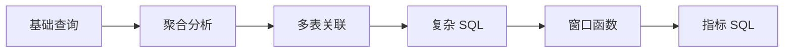

# 2. SQL 分析能力：大数据方向第一硬技能

::: tip 本章导读
把 SQL 从查询语法提升为分析表达能力，训练取数、聚合、关联、窗口和指标口径。
:::


## 本章阅读框架

| 阅读问题 | 本章回答方式 |
| --- | --- |
| 这个问题为什么出现？ | 从业务增长、数据规模、系统目标或 AI 应用压力切入。 |
| 它解决什么问题？ | 提炼为一个核心判断，避免把概念写成孤立定义。 |
| 它不解决什么问题？ | 在机制解释和常见误区中说明边界，防止工具崇拜。 |
| 它在真实平台哪里出现？ | 放回 PostgreSQL、数仓、批流、OLAP、湖仓、向量、图和治理的演化链路。 |
| 读完要会做什么？ | 通过场景案例和实战任务转成可练习的判断。 |



第一章建立的是数据库直觉：数据如何被组织、约束、查询和保持一致。

第二章开始进入 SQL。

## 问题切入

很多人学习数据库时，会把 SQL 当成语法题：会写 `SELECT`、`WHERE`、`GROUP BY`、`JOIN`，就认为自己掌握了 SQL。

但真实数据工作不是这样。业务同学不会问“请写一个 `GROUP BY`”，而是会问：

```text
今天成交额为什么比昨天低？
新用户 7 日留存是多少？
哪些商品带来了最多复购？
一次营销活动影响了哪些用户分层？
为什么同一个 GMV 指标，两个报表算出来不一样？
```

这些问题的难点不在语法本身，而在三件事：

1. **取数边界**：哪些记录应该算入，哪些记录应该排除。
2. **业务粒度**：一行数据代表用户、订单、订单明细、支付记录，还是一次行为事件。
3. **指标口径**：统计时间、状态过滤、去重方式、退款处理和异常数据如何定义。

如果只会写语法，不会表达这些判断，SQL 就只能查出一张临时表，不能沉淀成可信的分析能力。

## 核心判断

但这里的 SQL 不是语法清单，而是一种分析表达能力。它让你把业务问题转换成数据问题，再转换成可执行、可验证、可迁移的计算过程。

> SQL 是大数据系统的共同语言。PostgreSQL、Hive、Spark SQL、Trino、ClickHouse、Doris 都依赖 SQL。学习大数据，应先强化分析 SQL，而不是先背工具名。

本章要建立的判断是：SQL 不是为了“从数据库里拿到结果”，而是为了把业务问题转成稳定的数据计算过程。它的价值不只在 PostgreSQL 中成立，也会迁移到数仓、Spark SQL、Trino、ClickHouse、Doris 和 DuckDB。

SQL 也不是万能工具。它不能替你定义业务口径，不能自动判断数据质量，不能解决所有性能瓶颈，也不能替代数据建模、数据治理和系统架构。它负责把已经明确的问题、数据边界和计算规则表达出来。

## 机制解释

本章按六层能力展开：

```text
基础查询
  -> 聚合分析
  -> 多表关联
  -> 复杂分析 SQL
  -> 窗口函数
  -> 指标 SQL
```

这条路径不是语法从简单到复杂的堆叠，而是分析能力从“取出记录”到“形成指标”的升级。

### 2.1 SQL不是语法题，而是分析表达能力

#### 一、为什么很多人学SQL只会不会用

**典型的学习路径**：

大多数人的SQL学习是这样的：

```text
第一天：SELECT * FROM users;
第二天：SELECT * FROM orders WHERE status = 'paid';
第三天：SELECT count(*) FROM orders GROUP BY user_id;
第四天：学会JOIN
第五天：学会窗口函数
```

看起来什么都学会了，但遇到真实问题时却卡住了：

**场景1：业务同学问"今天的成交额是多少？"**

会写SQL的人立刻写出了：

```sql
SELECT sum(amount) FROM orders;
```

但这个结果可能有问题：
- 是否包含退款订单？
- 是否包含测试订单？
- 是否包含取消订单？
- 统计时间是按创建时间还是支付时间？
- 未支付的订单算不算？

**场景2：业务同学问"新用户7日留存是多少？"**

会写SQL的人可能写：

```sql
SELECT
    count(DISTINCT case when login_date between register_date + 1 and register_date + 7 then user_id end) * 1.0 / count(DISTINCT user_id)
FROM users;
```

但这个查询可能有很多问题：
- 什么是"新用户"？首次注册？首次下单？
- 什么是"留存"？登录？下单？还是活跃？
- 7日是从哪天开始算？注册日？还是首次下单日？
- 用哪个字段判断时间？register_date还是first_order_date？
- 去重用user_id对吗？

这两个场景说明了一个问题：

> **会SQL语法不等于会做数据分析**

**问题不在语法，而在表达**。

#### 二、核心判断：SQL是把业务问题转成数据计算过程

SQL的本质是什么？

**从表面看**：
SQL是一种查询语言，用于从数据库中取出数据。

**从本质看**：
SQL是一种分析表达能力，它让你把业务问题转换成数据问题，再转换成可执行的计算过程。

这个过程包括：

```text
业务问题
  ↓ 理解和澄清
数据问题
  ↓ 设计计算逻辑
计算过程（SQL）
  ↓ 执行和验证
分析结果
  ↓ 解释和沉淀
可信指标
```

**以"新用户7日留存"为例**：

##### 第一步：理解业务问题
- 业务为什么要看这个指标？
  - 评估产品粘性
  - 评估用户质量
  - 评估获客渠道效果

- 什么是"新用户"？
  - 某日首次注册的用户
  - 某日首次下单的用户
  - 需要明确

- 什么是"7日留存"？
  - 注册后第7天仍然活跃的用户比例
  - 第7天发生了什么行为算留存？
  - 登录？下单？还是浏览？

- 时间如何计算？
  - 按自然日（0点到24点）
  - 按24小时精确时间
  - 需要明确

##### 第二步：转换成数据问题
有了这些澄清，数据问题就清晰了：

```text
数据问题：计算2026-04-01注册的用户，在注册后7日内（4月2日-4月8日）
至少登录一次的用户比例
```

##### 第三步：设计计算逻辑
数据问题清楚了，计算逻辑也就明确了：

```text
1. 找出2026-04-01注册的用户（新用户）
2. 统计这些用户总数
3. 统计这些用户在4月2日-4月8日内登录的数量
4. 计算比例：登录用户数 / 新用户总数
```

##### 第四步：写出SQL
有了计算逻辑，SQL就自然出来了：

```sql
WITH new_users AS (
    -- 1. 找出新用户
    SELECT user_id, register_date
    FROM users
    WHERE register_date = '2026-04-01'
),
user_count AS (
    -- 2. 统计新用户总数
    SELECT count(*) AS total_users
    FROM new_users
),
retention_users AS (
    -- 3. 统计留存用户数
    SELECT count(DISTINCT nu.user_id) AS retained_users
    FROM new_users nu
    JOIN events e ON nu.user_id = e.user_id
    WHERE e.event_date BETWEEN nu.register_date + 1 AND nu.register_date + 7
      AND e.event_name = 'login'
)
SELECT
    retained_users * 100.0 / total_users AS retention_rate_7day
FROM user_count, retention_users;
```

##### 第五步：验证和解释
- **验证数据**：结果是否合理？（比如30%的7日留存是否正常）
- **验证逻辑**：SQL是否正确表达了业务定义？
- **解释口径**：留存率是如何定义的？边界在哪里？

这个完整过程说明：

> **SQL的能力不在于语法，而在于把业务问题清晰化、结构化、可执行化**

#### 三、SQL在大数据系统中的位置

理解SQL的另一个关键是：SQL不只是PostgreSQL的语言，它是所有大数据系统的共同语言。

| 系统 | SQL支持 | 用途 |
|------|---------|------|
| PostgreSQL | 完整SQL | 业务库查询、简单分析 |
| Hive | Hive SQL | 离线数仓查询 |
| Spark SQL | 完整SQL | 批处理计算 |
| Trino | 完整SQL | 联邦查询、交互分析 |
| ClickHouse | 完整SQL | OLAP查询 |
| Doris | 完整SQL | 实时OLAP查询 |
| DuckDB | 完整SQL | 本地数据分析 |

**关键发现**：
- 虽然各系统的SQL有差异，但核心语法（SELECT、WHERE、GROUP BY、JOIN、窗口函数）是相通的
- 在PostgreSQL中学到的SQL能力，可以直接迁移到所有大数据系统
- 区别在于性能、扩展性、函数支持，而不在于基本语法

**这意味着**：
- 在PostgreSQL上打好SQL基础，是学习大数据系统的最佳起点
- 不要一上来就去学Spark、Flink的特殊语法
- 先把通用SQL能力打牢，再学各系统的扩展特性

#### 四、SQL能力的四个层次

基于前面的分析，SQL能力可以分为四个层次：

##### 层次1：会写语法
- 能写SELECT、WHERE、GROUP BY、JOIN
- 能查询出数据
- **局限**：不知道查出来的数据对不对

##### 层次2：写出能运行的查询
- SQL能执行并返回结果
- 结果看起来合理
- **局限**：不知道口径是否清晰，能否复用

##### 层次3：写出清晰的业务定义
- SQL表达了明确的业务逻辑
- 有清晰的取数边界
- 有明确的指标口径
- **局限**：不考虑性能和可维护性

##### 层次4：写出可复用、可迁移的分析能力
- SQL逻辑清晰、可读、可维护
- 指标口径明确、可沉淀
- 可以迁移到不同系统
- 性能合理
- **这是本章要达到的目标**

#### 五、从"会SQL"到"会分析SQL"的关键转变

要实现从层次1到层次4的跨越，需要在五个方面转变：

##### 转变1：从"写SQL"到"定义问题"
**错误做法**：
- 拿到需求立刻写SQL
- 边写边想逻辑

**正确做法**：
- 先问清楚业务问题是什么
- 再澄清数据口径
- 最后才是写SQL

##### 转变2：从"拿到结果"到"验证结果"
**错误做法**：
- SQL跑出结果就结束了
- 不验证结果是否合理

**正确做法**：
- 结果是否在合理范围？
- 和其他数据源对比是否一致？
- 边界情况是否考虑？

##### 转变3：从"临时查询"到"可沉淀的指标"
**错误做法**：
- 每次都临时写SQL
- 口径不统一

**正确做法**：
- 把SQL沉淀成视图或表
- 统一指标口径
- 建立指标字典

##### 转变4：从"只考虑功能"到"考虑性能"
**错误做法**：
- 只要SQL能跑出来就行
- 不管性能

**正确做法**：
- 考虑扫描的数据量
- 考虑索引使用
- 考虑执行计划

##### 转变5：从"写一次"到"可维护、可迁移"
**错误做法**：
- SQL写得难以阅读
- 逻辑嵌套混乱

**正确做法**：
- 使用CTE让逻辑清晰
- 添加注释说明业务逻辑
- 保持代码结构清晰，便于迁移到Spark SQL或ClickHouse

#### 六、常见误区

**误区一：会SQL语法就等于会做数据分析**

- **说明**：语法只是工具，业务理解才是核心
- **后果**：能查数据，但不知道数据对不对
- **正确理解**：SQL是表达工具，分析能力才是本质

**误区二：SQL跑出结果就完成了**

- **说明**：需要验证结果的正确性
- **后果**：可能产出错误的分析结论
- **正确理解**：验证和解释与写SQL同样重要

**误区三：临时查询不需要写清楚**

- **说明**：即使是临时查询，也要保持逻辑清晰
- **后果**：时间久了忘记自己写的什么
- **正确理解**：清晰的SQL便于复查、复用和迁移

**误区四：不同系统的SQL差异很大**

- **说明**：核心SQL语法是相通的
- **后果**：重复学习，浪费时间
- **正确理解**：在PostgreSQL上学到的SQL能力可以直接迁移

**误区五：SQL性能不重要，数据库会优化**

- **说明**：SQL写法直接影响性能
- **后果**：查询很慢，影响自己和他人
- **正确理解**：理解SQL如何执行，才能写出高效的查询

#### 七、实战任务

**任务1：分析一个业务问题**

给定一个业务问题："昨天的新用户，今天有多少比例回访了？"

完成以下步骤：
1. 理解问题：这里"新用户"是什么？"回访"是什么？
2. 澄清口径：使用哪个字段判断新用户？使用哪个字段判断回访？
3. 设计计算逻辑：分哪几步计算？
4. 写出SQL：表达这个逻辑
5. 验证结果：结果是否合理？

**任务2：对比不同写法**

同一个GMV指标，写出两种SQL：

写法A：
```sql
SELECT sum(amount) FROM orders;
```

写法B：
```sql
SELECT sum(amount) FROM orders WHERE order_status = 'paid';
```

对比两种写法：
- 结果可能差多少？
- 哪种写法更符合业务？
- 差异说明了什么？

**任务3：阅读和解释SQL**

阅读以下SQL，尝试理解它在解决什么业务问题：

```sql
WITH weekly_users AS (
    SELECT
        user_id,
        date_trunc('week', event_date) AS week
    FROM events
    WHERE event_name = 'login'
    GROUP BY user_id, date_trunc('week', event_date)
),
user_sequences AS (
    SELECT
        user_id,
        week,
        lag(week, 1) OVER (PARTITION BY user_id ORDER BY week) AS prev_week
    FROM weekly_users
),
retention AS (
    SELECT
        week,
        count(DISTINCT CASE WHEN prev_week IS NOT NULL THEN user_id END) AS retained_users,
        count(DISTINCT user_id) AS total_users
    FROM user_sequences
    GROUP BY week
)
SELECT
    week,
    retained_users * 100.0 / total_users AS week_retention_rate
FROM retention
ORDER BY week;
```

回答：
- 这个SQL在计算什么？
- 它的口径是什么？
- 结果如何使用？

#### 八、小结

SQL分析能力的起点不是语法，而是理解：

1. **SQL是分析表达能力**：把业务问题转成数据计算过程
2. **SQL是大数据系统的共同语言**：在PostgreSQL上学到的能力可以直接迁移
3. **SQL能力有四个层次**：从会语法到会分析，目标是写出可复用、可迁移的分析能力
4. **需要五个转变**：从写SQL到定义问题，从拿结果到验证结果，从临时查询到可沉淀指标，从只考虑功能到考虑性能，从写一次到可维护

下一节将进入SQL分析能力的第一个具体层次：基础查询。我们将看到，即使是最简单的SELECT语句，也需要清晰的边界意识。

### 2.2 基础查询：从表中准确取出你需要的数据

基础查询解决的是取数边界问题。

一条最简单的查询是：

```sql
SELECT * FROM orders;
```

但在真实数据分析中，这条SQL通常不够好。它没有说明你要哪些字段、哪些记录、什么顺序、返回多少行，也没有表达清楚业务边界。

更好的写法是：

```sql
SELECT
    order_id,
    user_id,
    total_amount,
    order_status,
    created_at
FROM orders
WHERE order_status = 'paid'
ORDER BY created_at DESC
LIMIT 20;
```

这条SQL表达了五个判断：

```text
SELECT      取哪些字段
FROM        从哪张表取
WHERE       取哪些行
ORDER BY    按什么顺序返回
LIMIT       返回多少行
```

基础查询不是为了"查出来"，而是为了清楚定义数据范围。

#### 一、为什么SELECT *不够好

**很多人习惯用SELECT ***

原因很简单：
- 写起来快
- 不需要知道表有哪些字段
- 看起来"什么都有了"

**但SELECT *有五个问题**：

**问题1：读取不必要的数据**

假设`orders`表有50个字段，但你只需要5个字段：
```sql
-- SELECT * 读取全部50个字段
SELECT * FROM orders;

-- 明确字段只读取5个字段
SELECT order_id, user_id, total_amount, order_status, created_at FROM orders;
```

区别：
- SELECT *读取50个字段的数据
- 明确字段只读取5个字段
- 如果表有1000万行，差异巨大

**问题2：无法使用覆盖索引**

如果`(user_id, order_status, created_at)`上有索引：
```sql
-- SELECT * 无法使用覆盖索引，需要回表
SELECT * FROM orders WHERE user_id = 123;

-- 明确字段可以使用覆盖索引，不需要回表
SELECT user_id, order_status, created_at FROM orders WHERE user_id = 123;
```

**问题3：结果集难以理解和控制**

SELECT *返回所有字段：
- 你不知道返回了哪些数据
- 表结构变更时，SQL结果会隐式改变
- 难以理解业务含义

**问题4：后续维护困难**

当表增加新字段时：
- 所有SELECT *都会自动包含新字段
- 可能导致意外的结果变化
- 难以追踪问题

**问题5：无法表达业务语义**

明确字段有业务含义：
```sql
SELECT 
    order_id as 订单号,
    user_id as 用户ID,
    total_amount as 订单金额,
    order_status as 订单状态
FROM orders;
```

SELECT *只是原始数据，没有语义。

**结论**：
> 小表和探索阶段可以用SELECT *，生产环境、大表、跨系统查询必须明确字段。

#### 二、核心判断：基础查询是为了清楚定义数据范围

> 基础查询不只是"查出来"，而是清楚定义：取哪些字段、取哪些记录、什么顺序、返回多少行

这个判断说明：

**1. 明确字段 = 定义数据边界**
- 你需要哪些数据？
- 这些数据代表什么？
- 不需要的字段不读取

**2. 明确过滤 = 定义取数范围**
- 哪些记录符合条件？
- 哪些记录应该排除？
- 边界在哪里？

**3. 明确排序和限制 = 定义结果集**
- 按什么顺序返回？
- 需要多少行？
- 是否需要分页？

#### 三、SELECT与投影：选择需要的字段

##### 3.1 字段选择的原则

**原则1：只选择需要的字段**

为什么？
- 减少I/O
- 减少网络传输
- 减少内存使用
- 提高查询可读性

示例：
```sql
-- 差：读取所有字段
SELECT * FROM orders;

-- 好：只选择需要的字段
SELECT order_id, user_id, total_amount, created_at 
FROM orders;
```

**原则2：明确字段别名**

字段别名让结果更清晰：
```sql
SELECT 
    order_id,
    user_id,
    total_amount,
    created_at
FROM orders;
```

对比：
```sql
SELECT 
    order_id as 订单编号,
    user_id as 用户编号,
    total_amount as 订单金额,
    created_at as 创建时间
FROM orders;
```

**原则3：避免SELECT子查询中的***

```sql
-- 差：SELECT子查询中的*
SELECT u.*, 
       (SELECT count(*) FROM orders WHERE user_id = u.user_id) as order_count
FROM users u;

-- 好：明确字段
SELECT u.user_id, u.name, u.email,
       (SELECT count(*) FROM orders WHERE user_id = u.user_id) as order_count
FROM users u;
```

##### 3.2 计算字段

可以在SELECT中创建计算字段：
```sql
SELECT 
    order_id,
    total_amount,
    tax_amount,
    total_amount + tax_amount as final_amount,
    (total_amount + tax_amount) * 0.9 as discounted_amount
FROM orders;
```

**注意**：
- 计算字段不会持久化
- 可以在ORDER BY和HAVING中使用
- 复杂计算可以考虑用视图封装

##### 3.3 CASE WHEN在SELECT中的使用

CASE WHEN可以把业务规则转成字段：

```sql
SELECT 
    order_id,
    total_amount,
    CASE 
        WHEN total_amount >= 1000 THEN 'high'
        WHEN total_amount >= 100 THEN 'middle'
        ELSE 'low'
    END as amount_level,
    CASE 
        WHEN order_status = 'paid' THEN 1
        WHEN order_status = 'pending' THEN 0
        ELSE -1
    END as is_paid
FROM orders;
```

CASE WHEN特别适合：
- 数据分类
- 标志位计算
- 业务规则实现

#### 四、WHERE与过滤：定义数据边界

##### 4.1 比较运算符

**基本比较**：
```sql
-- 等于
SELECT * FROM orders WHERE user_id = 123;

-- 不等于
SELECT * FROM orders WHERE order_status != 'cancelled';

-- 大于
SELECT * FROM orders WHERE total_amount > 100;

-- 小于等于
SELECT * FROM orders WHERE created_at <= '2026-04-01';
```

**注意**：
- 比较运算符可以用于数字、字符串、日期
- 字符串比较是字典序
- 日期比较要确保格式一致

##### 4.2 逻辑运算符

**AND、OR、NOT**：
```sql
-- AND：同时满足
SELECT * FROM orders 
WHERE user_id = 123 AND order_status = 'paid';

-- OR：满足任一
SELECT * FROM orders 
WHERE order_status = 'paid' OR order_status = 'shipped';

-- NOT：取反
SELECT * FROM orders 
WHERE NOT (order_status = 'cancelled');

-- 组合条件
SELECT * FROM orders 
WHERE (user_id = 123 OR user_id = 456) 
  AND order_status = 'paid'
  AND total_amount > 100;
```

**优先级**：
- NOT > AND > OR
- 不确定时用括号

##### 4.3 NULL的处理

**NULL的特殊性**：
- NULL不等于任何值，包括NULL本身
- NULL与任何运算结果都是NULL
- 不能用=或!=判断NULL

**正确的做法**：
```sql
-- 判断是否为NULL
SELECT * FROM orders WHERE paid_at IS NULL;

-- 判断是否不为NULL
SELECT * FROM orders WHERE paid_at IS NOT NULL;

-- COALESCE：返回第一个非NULL值
SELECT 
    order_id,
    COALESCE(discount_amount, 0) as final_discount
FROM orders;
```

##### 4.4 模糊匹配：LIKE和ILIKE

**LIKE**：
```sql
-- 前缀匹配
SELECT * FROM products WHERE name LIKE 'iPhone%';

-- 后缀匹配
SELECT * FROM products WHERE name LIKE '%Pro';

-- 包含匹配
SELECT * FROM products WHERE name LIKE '%iPhone%';

-- 单字符匹配
SELECT * FROM products WHERE name LIKE 'iPhone_1_';
```

**ILIKE**（PostgreSQL特有，不区分大小写）：
```sql
SELECT * FROM products WHERE name ILIKE 'iphone%';
```

**注意**：
- LIKE和ILIKE可能无法使用索引（前缀匹配除外）
- 大小写敏感取决于数据库
- 考虑用全文检索替代模糊匹配

##### 4.5 范围过滤：BETWEEN和IN

**BETWEEN**：
```sql
-- 数值范围
SELECT * FROM orders 
WHERE total_amount BETWEEN 100 AND 500;

-- 日期范围
SELECT * FROM orders 
WHERE created_at BETWEEN '2026-04-01' AND '2026-04-30';
```

**注意**：
- BETWEEN是闭区间，包含两端
- 日期范围要考虑时间部分

**IN**：
```sql
-- 列表匹配
SELECT * FROM orders 
WHERE order_status IN ('paid', 'shipped', 'completed');

-- NOT IN
SELECT * FROM orders 
WHERE order_status NOT IN ('cancelled', 'refunded');
```

**IN vs OR**：
```sql
-- 等价写法
WHERE status IN ('a', 'b', 'c')
-- 等于
WHERE status = 'a' OR status = 'b' OR status = 'c'
```

IN通常更清晰，也可能被优化器优化。

#### 五、ORDER BY与LIMIT：控制结果集

##### 5.1 排序：ORDER BY

**单字段排序**：
```sql
-- 升序（默认）
SELECT * FROM orders ORDER BY created_at;

-- 降序
SELECT * FROM orders ORDER BY created_at DESC;
```

**多字段排序**：
```sql
SELECT * FROM orders 
ORDER BY user_id ASC, created_at DESC;
```

含义：
- 先按user_id升序
- user_id相同的，按created_at降序

**注意**：
- 排序增加内存和CPU开销
- 大结果集排序要谨慎
- 能用索引排序会更快

##### 5.2 限制结果：LIMIT

**基本用法**：
```sql
-- 返回前20行
SELECT * FROM orders 
WHERE user_id = 123 
ORDER BY created_at DESC
LIMIT 20;
```

**分页：LIMIT和OFFSET**：
```sql
-- 第1页（每页20条）
SELECT * FROM orders 
ORDER BY created_at DESC
LIMIT 20 OFFSET 0;

-- 第2页
SELECT * FROM orders 
ORDER BY created_at DESC
LIMIT 20 OFFSET 20;

-- 第3页
SELECT * FROM orders 
ORDER BY created_at DESC
LIMIT 20 OFFSET 40;
```

**OFFSET的性能问题**：
- OFFSET越大，性能越差
- 需要跳过前面的所有行
- 大数据集分页考虑用游标或WHERE条件

#### 六、DISTINCT与去重

##### 6.1 DISTINCT的基本用法

**单字段去重**：
```sql
-- 查看有哪些用户下过单
SELECT DISTINCT user_id FROM orders;
```

**多字段去重**：
```sql
-- 查看每个用户每天是否下过单
SELECT DISTINCT user_id, date(created_at) 
FROM orders;
```

##### 6.2 DISTINCT vs GROUP BY

```sql
-- DISTINCT写法
SELECT DISTINCT user_id FROM orders;

-- GROUP BY写法
SELECT user_id FROM orders GROUP BY user_id;
```

**功能相似，但区别在于**：
- DISTINCT更简洁
- GROUP BY可以做聚合
- GROUP BY更灵活

#### 七、常见过滤场景的SQL模式

##### 7.1 按时间范围过滤

**固定时间范围**：
```sql
-- 某一天
SELECT * FROM orders 
WHERE date(created_at) = '2026-04-01';

-- 最近7天
SELECT * FROM orders 
WHERE created_at >= current_date - interval '7 days';

-- 某个月
SELECT * FROM orders 
WHERE date_trunc('month', created_at) = '2026-04-01';
```

**注意**：
- `date(created_at)`无法使用索引
- `created_at >= '2026-04-01' AND created_at < '2026-04-02'`可以使用索引

##### 7.2 按状态过滤

**单一状态**：
```sql
SELECT * FROM orders WHERE order_status = 'paid';
```

**多状态**：
```sql
SELECT * FROM orders 
WHERE order_status IN ('paid', 'shipped', 'completed');
```

**排除状态**：
```sql
SELECT * FROM orders 
WHERE order_status NOT IN ('cancelled', 'refunded');
```

##### 7.3 组合过滤

**注意括号的使用**：
```sql
-- 错误：优先级导致逻辑错误
SELECT * FROM orders 
WHERE user_id = 123 OR user_id = 456 AND order_status = 'paid';
-- 实际执行为：user_id = 123 OR (user_id = 456 AND order_status = 'paid')

-- 正确：用括号明确优先级
SELECT * FROM orders 
WHERE (user_id = 123 OR user_id = 456) AND order_status = 'paid';
```

#### 八、常见误区

**误区一：长期依赖SELECT ***

- **说明**：小表可以，大表、生产库、跨系统查询不行
- **后果**：性能差、维护难、容易出bug
- **正确理解**：明确字段是基础查询的基本要求

**误区二：不注意NULL的语义**

- **说明**：NULL与任何运算都是NULL
- **后果**：聚合结果可能错误
- **正确理解**：用IS NULL/IS NOT NULL判断，用COALESCE处理

**误区三：用字符串函数过滤日期**

- **说明**：`date_format(created_at, '%Y-%m-%d') = '2026-04-01'`
- **后果**：无法使用索引，性能差
- **正确理解**：用范围过滤：`created_at >= '2026-04-01' AND created_at < '2026-04-02'`

**误区四：OR条件不加括号导致逻辑错误**

- **说明**：AND优先级高于OR
- **后果**：查询结果不符合预期
- **正确理解**：不确定优先级时，用括号明确

**误区五：不知道LIMIT OFFSET在数据量大时性能差**

- **说明**：OFFSET需要跳过前面的所有行
- **后果**：分页越后面越慢
- **正确理解**：大数据集分页考虑用游标或WHERE条件

#### 九、实战任务

**任务1：基础查询练习**

给定orders表，写SQL完成：
1. 查询最近20笔已支付订单，返回订单号、用户、金额、状态、创建时间
2. 查询某个用户（user_id = 123）的最近10笔订单
3. 查询2026年4月的所有订单
4. 查询金额在100-500之间的订单

**任务2：字段选择对比**

对同一个查询，写两个版本：
```sql
-- 版本A：SELECT *
SELECT * FROM orders WHERE user_id = 123;

-- 版本B：明确字段
SELECT order_id, user_id, total_amount, order_status, created_at 
FROM orders WHERE user_id = 123;
```

对比：
- 返回的字段数
- 是否能使用索引
- 查询可读性

**任务3：过滤条件练习**

写SQL查询满足以下条件的订单：
- 状态为paid或completed
- 金额大于100
- 创建时间在2026年4月
- 或者用户ID为123（特殊处理）

注意括号的使用。

**任务4：分页查询**

假设每页20条，写SQL查询：
- 第1页订单
- 第2页订单
- 第3页订单

观察OFFSET增大的性能影响。

#### 十、小结

基础查询看起来简单，但直接决定数据边界和查询成本：

1. **明确字段**：只选择需要的字段，减少I/O和网络传输
2. **明确过滤**：用WHERE定义取数范围，考虑索引使用
3. **明确排序**：ORDER BY定义返回顺序
4. **明确限制**：LIMIT定义返回行数，控制结果集大小

这些判断会直接影响：
- 查询性能
- 数据准确性
- 可维护性
- 跨系统迁移

下一节将进入聚合分析，看看如何从明细记录统计出指标。

### 2.3 聚合分析：从明细记录到统计指标

基础查询回答的是"哪些记录符合条件"。

聚合分析回答的是"这些记录合起来说明什么"。

假设`orders`表一行代表一笔订单：

```text
orders
├── order_id
├── user_id
├── order_status
├── total_amount
├── created_at
└── paid_at
```

如果只看明细，你可以知道最近20笔订单是什么。但业务通常更关心：

```text
今天有多少订单？
这个月GMV是多少？
平均每笔订单多少钱？
哪个商品销量最高？
每天订单量趋势如何？
哪些用户发生了复购？
```

这就需要聚合。

#### 一、为什么只看明细不够

**第一，明细无法回答宏观问题**

运营同学关心的是整体情况：
- "今天成交额怎么样？"
- "这个月增长了吗？"
- "哪个类目表现最好？"

这些问题都不是单条订单能回答的，需要对大量订单进行统计。

**第二，明细数据量太大，难以理解**

如果你有1000万行订单，逐行查看几乎不可能。你需要的是：
- 1000万行订单 → 1个GMV数字
- 1000万行订单 → 30天的每日GMV
- 1000万行订单 → Top10商品排行

聚合让大数据变成可理解的指标。

**第三，业务决策基于统计，不是明细**

业务决策的依据通常是：
- GMV是否达标
- 增长率是否健康
- 用户留存是否良好

这些都需要聚合分析。

**结论**：
> 聚合分析是SQL分析能力的核心，也是所有统计报表的基础。

#### 二、核心判断：聚合回答"这些记录合起来说明什么"

> 聚合分析的核心判断是：从大量明细记录中，按照特定维度分组，计算统计指标，回答业务问题。

这个判断说明：
- **输入**：大量明细记录
- **过程**：分组（GROUP BY）+ 计算（聚合函数）
- **输出**：统计指标
- **目的**：支持业务决策

#### 三、聚合函数详解

##### 3.1 COUNT：计数

**作用**：计算记录数

**常见用法**：
```sql
-- 统计所有记录数
SELECT count(*) FROM orders;

-- 统计非NULL值数
SELECT count(user_id) FROM orders;

-- 统计去重后的记录数
SELECT count(DISTINCT user_id) FROM orders;
```

**注意事项**：
- `COUNT(*)`：包括NULL，统计所有行
- `COUNT(字段)`：不包括NULL
- `COUNT(DISTINCT 字段)`：去重后计数

**实战场景**：
```sql
-- 订单总数
SELECT count(*) FROM orders;

-- 下单用户数（去重）
SELECT count(DISTINCT user_id) FROM orders;

-- 有支付的用户数
SELECT count(DISTINCT user_id) FROM orders WHERE paid_at IS NOT NULL;
```

##### 3.2 SUM：求和

**作用**：计算数值的总和

**常见用法**：
```sql
-- 订单总金额
SELECT sum(total_amount) FROM orders;

-- 按状态求和
SELECT order_status, sum(total_amount) FROM orders GROUP BY order_status;

-- 处理NULL
SELECT sum(COALESCE(total_amount, 0)) FROM orders;
```

**注意事项**：
- SUM忽略NULL值
- 如果所有值都是NULL，返回NULL
- 使用COALESCE处理NULL

##### 3.3 AVG：平均值

**作用**：计算平均值

**实现方式**：
```sql
-- AVG会自动忽略NULL
SELECT avg(total_amount) FROM orders;

-- 等价于：SUM / COUNT
SELECT sum(total_amount) / count(*) FROM orders;
```

**注意事项**：
- AVG自动排除NULL
- 可能被异常值影响
- 考虑使用中位数MEDIAN（PostgreSQL 12+）

##### 3.4 MAX/MIN：最大值/最小值

**作用**：找出极值

**常见用法**：
```sql
-- 最大订单金额
SELECT max(total_amount) FROM orders;

-- 最小订单金额
SELECT min(total_amount) FROM orders WHERE order_status = 'paid';

-- 每个用户的最大订单金额
SELECT user_id, max(total_amount) FROM orders GROUP BY user_id;
```

#### 四、GROUP BY与分组维度

##### 4.1 GROUP BY的基本用法

**作用**：按照维度分组统计

**示例**：
```sql
-- 按日期统计
SELECT 
    date(created_at) as order_date,
    count(*) as order_count,
    sum(total_amount) as gmv
FROM orders
GROUP BY date(created_at);
```

**关键理解**：分组维度决定粒度

**不同分组粒度**：
```sql
-- 按日统计（一行一天）
SELECT date(created_at), count(*) FROM orders GROUP BY date(created_at);

-- 按月统计（一行一月）
SELECT date_trunc('month', created_at), count(*) FROM orders GROUP BY date_trunc('month', created_at);

-- 按用户统计（一行一个用户）
SELECT user_id, count(*) FROM orders GROUP BY user_id;
```

##### 4.2 GROUP BY的粒度问题

**粒度混乱的后果**：
```sql
-- 错误示例：混合粒度
SELECT 
    user_id,
    date(created_at),      -- 按天分组
    date_trunc('month', created_at),  -- 按月分组（嵌套在天里）
    count(*)
FROM orders
GROUP BY user_id, date(created_at), date_trunc('month', created_at);
```

**问题**：按月分组嵌套在天分组里，逻辑混乱

**正确做法**：明确一个分组维度
```sql
-- 选择按天分组
SELECT user_id, date(created_at), count(*)
FROM orders
GROUP BY user_id, date(created_at);

-- 或选择按月分组
SELECT user_id, date_trunc('month', created_at), count(*)
FROM orders
GROUP BY user_id, date_trunc('month', created_at);
```

##### 4.3 HAVING：分组后过滤

**作用**：对聚合结果进行过滤

**WHERE vs HAVING**：
```sql
-- WHERE：聚合前过滤
SELECT user_id, count(*) as order_count
FROM orders
WHERE total_amount > 100
GROUP BY user_id;

-- HAVING：聚合后过滤
SELECT user_id, count(*) as order_count
FROM orders
GROUP BY user_id
HAVING count(*) > 5;
```

**使用场景**：
- WHERE：过滤明细记录（如：只看已支付订单）
- HAVING：过滤聚合结果（如：只看下单超过5次的用户）

##### 4.4 聚合的粒度陷阱

**陷阱1：粒度变化**

**问题场景**：
```sql
SELECT 
    o.order_id,
    o.order_status,
    oi.product_id,
    sum(oi.item_amount) as total_amount
FROM orders o
JOIN order_items oi ON o.order_id = oi.order_id
GROUP BY o.order_id, o.order_status, oi.product_id;
```

**分析**：
- orders：一行一笔订单
- JOIN order_items后：一行一个订单商品明细
- SUM(order_item.item_amount)：订单商品粒度的金额
- **问题**：如果直接用SUM(total_amount)统计，会重复计算订单金额

**正确做法**：
```sql
-- 方法1：先按订单聚合，再JOIN
WITH order_totals AS (
    SELECT order_id, sum(item_amount) as order_amount
    FROM order_items
    GROUP BY order_id
)
SELECT o.order_id, o.order_status, ot.order_amount
FROM orders o
JOIN order_totals ot ON o.order_id = ot.order_id;

-- 方法2：从订单表直接统计
SELECT order_id, order_status, total_amount
FROM orders;
```

**陷阱2：去重时机**

**问题场景**：统计每日活跃用户数（DAU）

```sql
-- 错误：先用DISTINCT再JOIN
SELECT count(DISTINCT e.user_id)
FROM events e
JOIN users u ON e.user_id = u.user_id
WHERE date(e.event_time) = '2026-04-01';

-- 问题：JOIN可能导致用户数重复计算或丢失
```

**正确做法**：
```sql
-- 直接在events上统计
SELECT count(DISTINCT user_id)
FROM events
WHERE date(event_time) = '2026-04-01';
```

#### 五、常见误区

**误区一：聚合结果有数字就正确**

- **说明**：聚合函数能算出数字，但数字是否可信取决于过滤条件、去重口径、时间字段、JOIN粒度
- **后果**：不同人、不同SQL算出不同结果，指标口径不一致
- **正确理解**：必须明确定义：
  - 取数边界：哪些记录算入？
  - 过滤条件：哪些记录排除？
  - 时间口径：按创建时间还是支付时间？
  - 去重口径：用COUNT(*)还是COUNT(DISTINCT)？

**误区二：GROUP BY的字段可以随便选**

- **说明**：GROUP BY的字段决定分组维度和指标含义
- **后果**：分组维度混乱，指标口径不一致
- **正确理解**：
  - GROUP BY的字段就是分析维度
  - 不同分组维度得出不同指标
  - 必须明确当前分析是按什么维度聚合

**误区三：COUNT(*)和COUNT(字段)一样**

- **说明**：COUNT(*)包括NULL，COUNT(字段)不包括NULL
- **后果**：统计结果可能不符合预期
- **正确理解**：
  - COUNT(*)：统计所有行
  - COUNT(字段)：统计非NULL值
  - 要根据需求选择

**误区四：AVG就是算术平均，不考虑异常值**

- **说明**：AVG会被异常值影响，可能不代表典型情况
- **后果**：指标被极端值扭曲
- **正确理解**：
  - 简单场景用AVG即可
  - 有极端值时，考虑中位数MEDIAN或百分位数
  - 也可以先用WHERE过滤极端值再聚合

**误区五：HAVING和WHERE作用一样**

- **说明**：WHERE过滤明细记录，HAVING过滤聚合结果
- **后果**：逻辑错误或性能问题
- **正确理解**：
  - WHERE：在聚合前过滤
  - HAVING：在聚合后过滤
  - 顺序：WHERE → GROUP BY → HAVING

#### 六、实战任务

**任务1：基础聚合练习**

给定orders表，完成以下聚合：

1. 按订单状态统计订单数和GMV：
```sql
SELECT 
    order_status,
    count(*) as order_count,
    sum(total_amount) as gmv
FROM orders
GROUP BY order_status;
```

2. 按日期统计每日订单数和GMV：
```sql
SELECT 
    date(created_at) as order_date,
    count(*) as order_count,
    sum(total_amount) as gmv
FROM orders
GROUP BY date(created_at)
ORDER BY order_date;
```

3. 统计每个用户的订单数和消费金额：
```sql
SELECT 
    user_id,
    count(*) as order_count,
    sum(total_amount) as total_amount
FROM orders
GROUP BY user_id
ORDER BY total_amount DESC
LIMIT 10;
```

**任务2：对比实验**

同一个GMV指标，用两种方式计算：

**方式A**：
```sql
SELECT sum(total_amount) as gmv FROM orders;
```

**方式B**：
```sql
SELECT sum(total_amount) as gmv FROM orders WHERE order_status = 'paid';
```

**对比**：
- 两个结果差多少？
- 哪个更符合业务？
- 差异说明了什么？

**任务3：粒度实验**

同一个"商品销量"指标，用三种分组粒度：

**粒度1：按商品**
```sql
SELECT product_id, sum(quantity) FROM order_items GROUP BY product_id;
```

**粒度2：按类目**
```sql
SELECT category_id, sum(quantity) FROM order_items GROUP BY category_id;
```

**粒度3：按地区**
```sql
SELECT region_id, sum(quantity) FROM order_items GROUP BY region_id;
```

**分析**：
- 不同分组粒度回答不同的业务问题
- 每种粒度的适用场景

#### 七、小结

基础查询回答"哪些记录符合条件"。

聚合分析回答"这些记录合起来说明什么"。

核心要点：
- 聚合函数（COUNT、SUM、AVG、MAX、MIN）是聚合的基础
- GROUP BY定义分组维度，不同的维度得出不同的指标
- HAVING对聚合结果进行过滤
- 聚合的粒度陷阱：JOIN会改变粒度，要注意重复计算
- 聚合结果有数字不代表正确，必须明确口径

下一节将进入多表关联：现实数据通常不会在一张表里，需要从多表中恢复完整的业务事实。

### 2.4 多表关联：从分散数据中恢复完整业务事实

基础查询从单表中取出数据，聚合分析从明细数据中计算统计指标。

但现实业务数据通常不会都在一张表里。

假设你在分析电商订单，需要回答这些问题：

```text
哪个用户的订单金额最高？
用户最近一次购买是什么时候？
用户购买最多的商品是什么？
```

这些问题的答案分散在多张表里：
- 用户基本信息在 `users` 表
- 订单记录在 `orders` 表
- 订单明细在 `order_items` 表
- 商品信息在 `products` 表

要回答这些业务问题，你需要把分散在多表的数据"拼"起来。

这就是多表关联（JOIN）。

#### 一、为什么数据会分散在多张表

**第一，规范化设计减少数据冗余**

如果把用户信息和订单放在一张表：

```sql
-- 错误设计：单表存储所有信息
orders_denormalized
├── order_id
├── user_id
├── user_name         -- 用户信息重复
├── user_email        -- 用户信息重复
├── user_phone        -- 用户信息重复
├── order_status
├── total_amount
└── created_at
```

**问题**：
- 一个用户有10笔订单，用户信息就重复10次
- 用户邮箱变了，需要更新10条记录
- 数据冗余导致不一致风险

**正确做法**：拆分成用户表和订单表
```sql
users
├── user_id
├── name
├── email
└── registered_at

orders
├── order_id
├── user_id          -- 外键关联用户表
├── order_status
├── total_amount
└── created_at
```

**好处**：
- 用户信息只存储一次
- 更新用户信息只需修改一行
- 数据一致性有保障

**第二，不同实体的数据自然分离**

业务中的不同实体通常分开存储：
- 用户实体：`users` 表
- 商品实体：`products` 表
- 订单实体：`orders` 表
- 支付实体：`payments` 表

这些表通过外键关联，形成关系模型。

**第三，分析需要关联多个维度**

分析一个业务问题通常需要多个维度：

```sql
-- 问题：哪个地区的用户购买力最高？
SELECT u.region, avg(o.total_amount)
FROM users u
JOIN orders o ON u.user_id = o.user_id
GROUP BY u.region;

-- 问题：哪个类目的商品销售额最高？
SELECT p.category_name, sum(oi.quantity)
FROM order_items oi
JOIN products p ON oi.product_id = p.product_id
GROUP BY p.category_name;
```

这些问题都需要从多表中提取数据并关联。

**结论**：
> 多表关联是关系数据库的核心能力，也是从分散数据中恢复完整业务事实的必要手段。

#### 二、核心判断：关联回答"如何从分散数据中恢复业务事实"

> 多表关联的核心判断是：通过外键关系，将分散在不同表中的数据按照业务逻辑重新组合，恢复完整的业务事实。

这个判断说明：
- **输入**：多张分散的业务表
- **关系**：通过外键定义的关联关系
- **过程**：按关联条件匹配记录
- **输出**：包含多表字段的完整记录
- **目的**：回答跨表的业务问题

#### 三、JOIN的类型与用法

##### 3.1 INNER JOIN：内连接

**作用**：只返回两边都匹配的记录

**示例**：
```sql
-- 查询有订单的用户及其订单
SELECT
    u.user_id,
    u.name,
    o.order_id,
    o.total_amount
FROM users u
INNER JOIN orders o ON u.user_id = o.user_id;
```

**结果**：
- 只有在 `users` 和 `orders` 中都存在的 user_id 才会返回
- 没有下过单的用户不会出现
- 订单表中 user_id 为 NULL 的记录不会出现

**使用场景**：
- 只关心有匹配的记录
- 不需要孤儿数据（orphaned records）
- 最常用的 JOIN 类型

##### 3.2 LEFT JOIN：左连接

**作用**：返回左表所有记录，右表没有匹配时填 NULL

**示例**：
```sql
-- 查询所有用户的订单情况（包括没下过单的）
SELECT
    u.user_id,
    u.name,
    o.order_id,
    o.total_amount
FROM users u
LEFT JOIN orders o ON u.user_id = o.user_id;
```

**结果**：
- 所有用户都会返回
- 没有订单的用户，order_id 和 total_amount 为 NULL
- 右表（orders）没有匹配的记录不会返回

**使用场景**：
- 需要保留左表的所有记录
- 找出左表中没有匹配的记录（通过 WHERE right.key IS NULL）
- 统计"缺失数据"

**常见模式**：找没下单的用户
```sql
SELECT u.user_id, u.name
FROM users u
LEFT JOIN orders o ON u.user_id = o.user_id
WHERE o.order_id IS NULL;
```

##### 3.3 RIGHT JOIN：右连接

**作用**：返回右表所有记录，左表没有匹配时填 NULL

**示例**：
```sql
-- 查询所有订单对应的用户（包括用户已删除的）
SELECT
    u.user_id,
    u.name,
    o.order_id,
    o.total_amount
FROM users u
RIGHT JOIN orders o ON u.user_id = o.user_id;
```

**使用场景**：
- 相对较少用
- 可以用 LEFT JOIN 通过交换表的顺序实现

##### 3.4 FULL OUTER JOIN：全连接

**作用**：返回两边所有记录，没有匹配时填 NULL

**示例**：
```sql
-- 查询所有用户和所有订单（包括没下单的用户和没用户认领的订单）
SELECT
    u.user_id,
    u.name,
    o.order_id,
    o.total_amount
FROM users u
FULL OUTER JOIN orders o ON u.user_id = o.user_id;
```

**注意**：MySQL 不支持 FULL OUTER JOIN，可以用 UNION 模拟：
```sql
SELECT u.user_id, u.name, o.order_id, o.total_amount
FROM users u
LEFT JOIN orders o ON u.user_id = o.user_id
UNION
SELECT u.user_id, u.name, o.order_id, o.total_amount
FROM users u
RIGHT JOIN orders o ON u.user_id = o.user_id;
```

##### 3.5 CROSS JOIN：交叉连接

**作用**：返回两表的笛卡尔积（每行与每行组合）

**示例**：
```sql
-- 每个用户与每个商品的组合
SELECT u.name, p.name
FROM users u
CROSS JOIN products p;
```

**使用场景**：
- 生成所有可能的组合
- 需要慎用，数据量会爆炸

##### 3.6 SELF JOIN：自连接

**作用**：表与自己关联

**示例**：找出员工的上级
```sql
-- 假设 employees 表有 employee_id 和 manager_id
SELECT
    e.name as employee_name,
    m.name as manager_name
FROM employees e
LEFT JOIN employees m ON e.manager_id = m.employee_id;
```

**使用场景**：
- 层级结构（组织架构、分类树）
- 找出配对记录

#### 四、多表关联的粒度问题

##### 4.1 一对一关联

**场景**：一个用户对应一个用户扩展信息

```sql
users
├── user_id
├── name
└── email

user_profiles
├── user_id
├── avatar
└── bio
```

**关联方式**：
```sql
SELECT u.*, p.avatar, p.bio
FROM users u
LEFT JOIN user_profiles p ON u.user_id = p.user_id;
```

##### 4.2 一对多关联

**场景**：一个用户有多个订单

```sql
users (1) ←→ (N) orders
```

**关联方式**：
```sql
SELECT u.*, o.order_id, o.total_amount
FROM users u
LEFT JOIN orders o ON u.user_id = o.user_id;
```

**注意**：关联后行数会增加（一个用户有多笔订单时会展开）

##### 4.3 多对多关联

**场景**：一个订单有多个商品，一个商品在多个订单中

```sql
orders (N) ←→ (N) products
```

**关联方式**：通过中间表
```sql
SELECT
    o.order_id,
    p.product_id,
    oi.quantity
FROM orders o
JOIN order_items oi ON o.order_id = oi.order_id
JOIN products p ON oi.product_id = p.product_id;
```

**注意**：关联后的行数 = 订单数 × 平均商品数

##### 4.4 关联导致的数据膨胀

**问题示例**：
```sql
-- 问题：统计每个用户的GMV，但因为有订单明细，结果膨胀了
SELECT
    u.user_id,
    sum(oi.item_amount) as gmv
FROM users u
JOIN orders o ON u.user_id = o.user_id
JOIN order_items oi ON o.order_id = oi.order_id
GROUP BY u.user_id;
```

**分析**：
- 如果一个订单有3个商品，关联后订单会展开成3行
- 直接 SUM(order_item.item_amount) 会重复计算

**正确做法**：先聚合再关联
```sql
WITH order_totals AS (
    SELECT order_id, sum(item_amount) as order_amount
    FROM order_items
    GROUP BY order_id
)
SELECT
    u.user_id,
    sum(ot.order_amount) as gmv
FROM users u
JOIN orders o ON u.user_id = o.user_id
JOIN order_totals ot ON o.order_id = ot.order_id
GROUP BY u.user_id;
```

#### 五、JOIN的性能考虑

##### 5.1 JOIN的执行顺序

**原则**：
- 从小表 JOIN 大表
- 先过滤再 JOIN
- 确保 JOIN 字段有索引

**示例**：
```sql
-- 不好的写法：先 JOIN 再过滤
SELECT u.name, o.order_id
FROM users u
JOIN orders o ON u.user_id = o.user_id
WHERE o.created_at >= '2026-01-01';

-- 好的写法：先过滤再 JOIN
SELECT u.name, o.order_id
FROM users u
JOIN (
    SELECT order_id, user_id
    FROM orders
    WHERE created_at >= '2026-01-01'
) o ON u.user_id = o.user_id;
```

##### 5.2 避免过多的JOIN

**问题**：JOIN 越多，性能越差

**建议**：
- 单个 SQL 中 JOIN 不超过 5 个
- 考虑是否可以通过宽表减少 JOIN
- 分步骤查询，用应用层组装

##### 5.3 使用EXPLAIN分析JOIN

**示例**：
```sql
EXPLAIN SELECT u.name, o.order_id
FROM users u
JOIN orders o ON u.user_id = o.user_id;
```

**观察**：
- 是否使用了索引
- 是否有全表扫描
- 每一步的执行成本

#### 六、常见误区

**误区一：JOIN越多越强大**

- **说明**：JOIN 能关联表，但不是越多越好，JOIN 会增加复杂度和性能开销
- **后果**：SQL 难以理解，性能下降，数据膨胀难以察觉
- **正确理解**：
  - 只 JOIN 必要的表
  - 考虑用宽表或物化视图减少 JOIN
  - 单个 SQL 中 JOIN 不超过 5 个

**误区二：LEFT JOIN 总是安全的**

- **说明**：LEFT JOIN 会保留左表所有记录，但可能引入 NULL 值，导致后续计算错误
- **后果**：聚合函数（SUM、AVG）可能被 NULL 影响，COUNT(*) 和 COUNT(字段) 结果不一致
- **正确理解**：
  - 使用 LEFT JOIN 后要处理 NULL
  - 用 COALESCE 处理可能为 NULL 的字段
  - 明确是否需要保留左表所有记录

**误区三：JOIN 字段不需要索引**

- **说明**：JOIN 字段如果没有索引，会导致全表扫描，性能极差
- **后果**：查询很慢，系统负载高
- **正确理解**：
  - 所有 JOIN 字段都应该建立索引
  - 外键自动建立索引（PostgreSQL）
  - 定期检查 EXPLAIN 输出

**误区四：JOIN 和子查询可以随便选**

- **说明**：JOIN 和子查询可以互相转换，但性能和可读性不同
- **后果**：选择不当导致性能问题或 SQL 难以维护
- **正确理解**：
  - 简单关联用 JOIN
  - 复杂过滤用子查询
  - 用 EXPLAIN 对比不同写法的性能

**误区五：关联后数据量不变**

- **说明**：JOIN 会改变数据量，一对多、多对多关联会导致行数膨胀
- **后果**：聚合计算错误（重复计算），SUM、AVG 等指标不准确
- **正确理解**：
  - 一对一关联：行数不变
  - 一对多关联：行数增加
  - 多对多关联：行数大幅增加
  - 先聚合再 JOIN 可以避免膨胀

#### 七、实战任务

**任务1：基础JOIN练习**

给定 users 和 orders 表，完成以下查询：

1. 查询所有有订单的用户及其订单数：
```sql
SELECT
    u.user_id,
    u.name,
    count(o.order_id) as order_count
FROM users u
JOIN orders o ON u.user_id = o.user_id
GROUP BY u.user_id, u.name;
```

2. 查询所有用户的订单情况（包括没下单的）：
```sql
SELECT
    u.user_id,
    u.name,
    count(o.order_id) as order_count
FROM users u
LEFT JOIN orders o ON u.user_id = o.user_id
GROUP BY u.user_id, u.name;
```

3. 查询每个用户的总消费金额：
```sql
SELECT
    u.user_id,
    u.name,
    sum(o.total_amount) as total_amount
FROM users u
LEFT JOIN orders o ON u.user_id = o.user_id
GROUP BY u.user_id, u.name
ORDER BY total_amount DESC;
```

**任务2：对比实验**

同一个"用户订单数"指标，用两种方式计算：

**方式A**：直接 JOIN
```sql
SELECT
    u.user_id,
    count(o.order_id) as order_count
FROM users u
LEFT JOIN orders o ON u.user_id = o.user_id
GROUP BY u.user_id;
```

**方式B**：子查询
```sql
SELECT
    u.user_id,
    (
        SELECT count(*)
        FROM orders
        WHERE user_id = u.user_id
    ) as order_count
FROM users u;
```

**对比**：
- 两种方式的结果是否一致？
- 哪种性能更好？（用 EXPLAIN 分析）
- 在什么情况下选择哪种方式？

**任务3：粒度实验**

统计每个用户的 GMV，用三种方式：

**方式A**：三表直接 JOIN
```sql
SELECT
    u.user_id,
    sum(oi.item_amount) as gmv
FROM users u
JOIN orders o ON u.user_id = o.user_id
JOIN order_items oi ON o.order_id = oi.order_id
GROUP BY u.user_id;
```

**方式B**：先聚合订单金额再 JOIN
```sql
WITH order_totals AS (
    SELECT
        order_id,
        sum(item_amount) as order_amount
    FROM order_items
    GROUP BY order_id
)
SELECT
    u.user_id,
    sum(ot.order_amount) as gmv
FROM users u
JOIN orders o ON u.user_id = o.user_id
JOIN order_totals ot ON o.order_id = ot.order_id
GROUP BY u.user_id;
```

**方式C**：从订单表直接统计
```sql
SELECT
    user_id,
    sum(total_amount) as gmv
FROM orders
GROUP BY user_id;
```

**分析**：
- 三种方式的结果是否一致？
- 哪种方式最准确？
- 哪种方式性能最好？

#### 八、小结

基础查询从单表中取数据，聚合分析从明细数据中计算指标。

多表关联从分散的数据中恢复完整的业务事实。

核心要点：
- INNER JOIN 只返回匹配的记录，LEFT JOIN 保留左表所有记录
- 一对一、一对多、多对多关联有不同的行为
- JOIN 会导致数据膨胀，要先聚合再 JOIN
- JOIN 字段必须建立索引
- 不是 JOIN 越多越好，要考虑性能和可读性

下一节将进入复杂分析SQL：现实分析往往需要多个步骤，如何把中间过程表达清楚。

### 2.5 复杂分析SQL：把中间过程表达清楚

基础查询从单表取数据，聚合分析计算统计指标，多表关联恢复业务事实。

但现实分析往往需要多个步骤：

```text
问题：哪个用户复购率最高？

步骤分解：
1. 计算每个用户的订单数
2. 计算每个用户的购买天数（去重）
3. 复购率 = (订单数 - 购买天数) / 订单数
4. 按复购率排序
```

如果用一个 SQL 写完，会很复杂且难以理解。

如果把步骤拆开，又难以在一个 SQL 中完成。

如何既保持 SQL 的可读性，又在一个查询中完成多步骤分析？

这就是复杂分析 SQL 要解决的问题。

#### 一、为什么需要把中间过程表达清楚

**第一，复杂分析天然是多步骤的**

业务分析很少能一步完成：

```sql
-- 问题：每个用户的平均客单价是多少？
-- 这需要先计算：每个用户的总金额 / 订单数

-- 问题：哪个类目的复购率最高？
-- 这需要先计算：每个类目的复购用户数 / 总用户数

-- 问题：每天的活跃用户留存率是多少？
-- 这需要先计算：今天活跃的用户，明天还活跃的比例
```

这些都是多步骤分析，很难用单个 SELECT 完成。

**第二，嵌套子查询难以阅读**

如果用嵌套子查询：

```sql
-- 可读性差的写法
SELECT user_id, order_count / distinct_days as repeat_rate
FROM (
    SELECT user_id, count(*) as order_count, count(DISTINCT date(created_at)) as distinct_days
    FROM (
        SELECT user_id, created_at
        FROM orders
        WHERE order_status = 'paid'
    ) o
    GROUP BY user_id
) t
WHERE order_count > 1;
```

**问题**：
- 嵌套层次深，难以理解
- 别名多，容易混淆
- 调试困难：不知道哪一步出错了

**第三，中间结果需要复用**

有些分析中，中间结果需要多次使用：

```sql
-- 示例：计算订单的各种统计指标
-- 中间结果：每个用户的订单统计
WITH user_stats AS (
    SELECT user_id, count(*) as order_count, sum(total_amount) as total_amount
    FROM orders
    GROUP BY user_id
)
-- 复用1：高价值用户
SELECT * FROM user_stats WHERE total_amount > 1000;
-- 复用2：高频用户
SELECT * FROM user_stats WHERE order_count > 10;
```

用 CTE（Common Table Expression）可以定义一次，复用多次。

**结论**：
> 复杂分析 SQL 的核心是：把中间过程清晰地表达出来，让每个步骤都一目了然，便于理解、调试和优化。

#### 二、核心判断：复杂SQL不是写得越长越好，而是分层清晰

> 复杂分析 SQL 的核心判断是：通过 CTE 或子查询，把分析过程分解成清晰的步骤，每个步骤完成一个明确的任务，最终组装成完整的分析。

这个判断说明：
- **输入**：原始业务表
- **分解**：按逻辑拆分成多个步骤
- **表达**：用 CTE 或子 query 定义中间步骤
- **组装**：最后的 SELECT 组装所有步骤
- **价值**：可读性、可维护性、可调试性

#### 三、CTE（Common Table Expression）

##### 3.1 CTE的基本语法

**作用**：定义临时的命名结果集，可在后续查询中引用

**语法**：
```sql
WITH cte_name AS (
    -- 查询语句
    SELECT ...
)
SELECT ...
FROM cte_name;
```

**示例**：
```sql
-- 用 CTE 重写复购率查询
WITH user_orders AS (
    -- 步骤1：计算每个用户的订单统计
    SELECT
        user_id,
        count(*) as order_count,
        count(DISTINCT date(created_at)) as distinct_days
    FROM orders
    WHERE order_status = 'paid'
    GROUP BY user_id
)
SELECT
    user_id,
    order_count,
    distinct_days,
    (order_count - distinct_days)::numeric / order_count as repeat_rate
FROM user_orders
WHERE order_count > 1
ORDER BY repeat_rate DESC;
```

**好处**：
- 每个步骤清晰命名
- 逻辑分层，易于理解
- 便于调试（可以单独运行每个 CTE）

##### 3.2 多个CTE串联

**作用**：定义多个中间步骤，逐步计算

**示例**：
```sql
-- 问题：哪些用户的客单价高于平均水平？
WITH user_avg AS (
    -- 步骤1：计算每个用户的平均订单金额
    SELECT
        user_id,
        avg(total_amount) as avg_amount
    FROM orders
    WHERE order_status = 'paid'
    GROUP BY user_id
),
global_avg AS (
    -- 步骤2：计算全局平均客单价
    SELECT avg(avg_amount) as overall_avg
    FROM user_avg
)
SELECT
    u.user_id,
    u.avg_amount,
    g.overall_avg,
    u.avg_amount / g.overall_avg as ratio
FROM user_avg u
CROSS JOIN global_avg g
WHERE u.avg_amount > g.overall_avg
ORDER BY ratio DESC;
```

**好处**：
- 每个步骤职责单一
- 逐步推导，易于验证
- 可以复用中间结果

##### 3.3 CTE的递归使用

**作用**：CTE 可以引用自己，实现递归查询

**示例**：查询组织架构中的所有下属
```sql
WITH RECURSIVE subordinates AS (
    -- 初始：某个员工
    SELECT employee_id, name, manager_id
    FROM employees
    WHERE employee_id = 100

    UNION ALL

    -- 递归：查找下属
    SELECT e.employee_id, e.name, e.manager_id
    FROM employees e
    JOIN subordinates s ON e.manager_id = s.employee_id
)
SELECT * FROM subordinates;
```

**使用场景**：
- 层级结构查询（组织架构、分类树）
- 路径查找（图的最短路径）
- 日期序列生成

#### 四、复杂分析的常见模式

##### 4.1 漏斗分析

**场景**：浏览→加购→下单→支付的转化漏斗

```sql
-- 步骤1：每个环节的用户数
WITH funnel AS (
    SELECT
        count(DISTINCT user_id) as view_count,
        count(DISTINCT CASE WHEN event_name = 'add_to_cart' THEN user_id END) as cart_count,
        count(DISTINCT CASE WHEN event_name = 'place_order' THEN user_id END) as order_count,
        count(DISTINCT CASE WHEN event_name = 'payment' THEN user_id END) as payment_count
    FROM events
    WHERE event_time >= '2026-04-01'
)
SELECT
    view_count,
    cart_count,
    cart_count::numeric / view_count as view_to_cart_rate,
    order_count,
    order_count::numeric / cart_count as cart_to_order_rate,
    payment_count,
    payment_count::numeric / order_count as order_to_payment_rate
FROM funnel;
```

##### 4.2 同群分析（Cohort Analysis）

**场景**：按注册月份分组，看不同月份用户的留存情况

```sql
WITH cohorts AS (
    -- 步骤1：标记用户的注册月份
    SELECT
        user_id,
        date_trunc('month', registered_at) as cohort_month
    FROM users
),
user_activities AS (
    -- 步骤2：计算每个用户的活跃月份
    SELECT DISTINCT
        user_id,
        date_trunc('month', event_time) as activity_month
    FROM events
),
cohort_retention AS (
    -- 步骤3：计算每个cohort在各月的留存
    SELECT
        c.cohort_month,
        u.activity_month,
        EXTRACT(month FROM age(u.activity_month, c.cohort_month)) as month_number,
        count(DISTINCT c.user_id) as user_count
    FROM cohorts c
    JOIN user_activities u ON c.user_id = u.user_id
    GROUP BY c.cohort_month, u.activity_month
)
SELECT
    cohort_month,
    month_number,
    user_count
FROM cohort_retention
ORDER BY cohort_month, month_number;
```

##### 4.3 留存分析

**场景**：计算用户的次日留存、7日留存、30日留存

```sql
WITH first_activity AS (
    -- 步骤1：每个用户的首次活跃日期
    SELECT
        user_id,
        min(date(event_time)) as first_date
    FROM events
    GROUP BY user_id
),
retention_days AS (
    -- 步骤2：计算每个用户的活跃日期与首次活跃的天数差
    SELECT
        fa.user_id,
        fa.first_date,
        e.event_date,
        EXTRACT(day FROM age(e.event_date, fa.first_date)) as days_since_first
    FROM first_activity fa
    JOIN (
        SELECT DISTINCT user_id, date(event_time) as event_date
        FROM events
    ) e ON fa.user_id = e.user_id
)
SELECT
    first_date,
    count(DISTINCT CASE WHEN days_since_first = 1 THEN user_id END) as day1_retention,
    count(DISTINCT CASE WHEN days_since_first = 7 THEN user_id END) as day7_retention,
    count(DISTINCT CASE WHEN days_since_first = 30 THEN user_id END) as day30_retention,
    count(DISTINCT user_id) as total_users
FROM retention_days
GROUP BY first_date
ORDER BY first_date;
```

#### 五、窗口函数 vs 复杂子查询

##### 5.1 用窗口函数简化逻辑

**场景**：计算每个订单的排名

**不用窗口函数**（复杂）：
```sql
WITH order_amounts AS (
    SELECT
        order_id,
        total_amount,
        (
            SELECT count(*)
            FROM orders o2
            WHERE o2.total_amount >= o1.total_amount
        ) as rank
    FROM orders o1
)
SELECT * FROM order_amounts;
```

**用窗口函数**（简洁）：
```sql
SELECT
    order_id,
    total_amount,
    rank() OVER (ORDER BY total_amount DESC) as rank
FROM orders;
```

##### 5.2 什么时候用窗口函数

**用窗口函数的场景**：
- 排名（ROW_NUMBER、RANK、DENSE_RANK）
- 计算移动平均
- 计算累计值
- 组内统计

**用 CTE 的场景**：
- 多步骤数据清洗
- 复杂的业务逻辑
- 中间结果需要复用

#### 六、复杂SQL的性能优化

##### 6.1 优化原则

**原则1：尽早过滤**
```sql
-- 不好：先JOIN再过滤
WITH all_data AS (
    SELECT o.*, u.*
    FROM orders o
    JOIN users u ON o.user_id = u.user_id
)
SELECT * FROM all_data WHERE o.created_at >= '2026-01-01';

-- 好：先过滤再JOIN
WITH filtered_orders AS (
    SELECT * FROM orders WHERE created_at >= '2026-01-01'
)
SELECT o.*, u.*
FROM filtered_orders o
JOIN users u ON o.user_id = u.user_id;
```

**原则2：避免重复计算**
```sql
-- 不好：重复计算相同的条件
WITH expensive_orders AS (
    SELECT * FROM orders WHERE total_amount > 1000
),
fast_orders AS (
    SELECT * FROM orders WHERE total_amount > 1000
)
SELECT * FROM expensive_orders
UNION ALL
SELECT * FROM fast_orders;

-- 好：复用CTE
WITH expensive_orders AS (
    SELECT * FROM orders WHERE total_amount > 1000
)
SELECT * FROM expensive_orders
UNION ALL
SELECT * FROM expensive_orders;
```

**原则3：使用物化视图缓存复杂计算**
```sql
-- 如果某个复杂CTE频繁使用，考虑物化视图
CREATE MATERIALIZED VIEW user_daily_stats AS
WITH daily_stats AS (
    SELECT
        user_id,
        date(created_at) as order_date,
        count(*) as order_count,
        sum(total_amount) as total_amount
    FROM orders
    GROUP BY user_id, date(created_at)
)
SELECT * FROM daily_stats;
```

#### 七、常见误区

**误区一：CTE 比子查询快**

- **说明**：CTE 和子查询在性能上没有本质区别，都是语法糖
- **后果**：以为用了 CTE 就会自动变快，实际上没有优化效果
- **正确理解**：
  - CTE 是为了可读性，不是为了性能
  - PostgreSQL 会优化 CTE，但不保证比子查询快
  - 用 EXPLAIN 分析实际执行计划

**误区二：复杂 SQL 越长越厉害**

- **说明**：SQL 的价值在于清晰表达业务逻辑，不是越长越好
- **后果**：写出难以理解的 SQL，别人看不懂，自己也看不懂
- **正确理解**：
  - 把复杂的 SQL 拆分成多个简单 SQL
  - 用 CTE 让每个步骤清晰
  - 可读性 > 简洁性

**误区三：JOIN 越多数据越准确**

- **说明**：JOIN 会改变粒度，可能导致数据膨胀或丢失
- **后果**：统计结果不准确
- **正确理解**：
  - 先明确业务问题需要哪些数据
  - 只 JOIN 必要的表
  - 先聚合再 JOIN 避免膨胀

**误区四：窗口函数和 CTE 互斥**

- **说明**：窗口函数和 CTE 可以配合使用，各有优势
- **后果**：只用一种方式，写出复杂的 SQL
- **正确理解**：
  - 组内排序、累计用窗口函数
  - 多步骤清洗用 CTE
  - 两者可以配合

**误区五：复杂 SQL 不需要注释**

- **说明**：复杂 SQL 逻辑多，更需要注释说明
- **后果**：别人看不懂，自己过一段时间也看不懂
- **正确理解**：
  - 每个 CTE 加注释说明用途
  - 复杂逻辑加注释说明
  - 业务背景加注释说明

#### 八、实战任务

**任务1：基础CTE练习**

用 CTE 重写以下查询：

原查询（嵌套子查询）：
```sql
SELECT user_id, avg_amount
FROM (
    SELECT user_id, avg(total_amount) as avg_amount
    FROM (
        SELECT user_id, total_amount
        FROM orders
        WHERE order_status = 'paid'
    ) o
    GROUP BY user_id
) t
WHERE avg_amount > 100;
```

**重写后（CTE）**：
```sql
WITH paid_orders AS (
    -- 步骤1：过滤已支付订单
    SELECT user_id, total_amount
    FROM orders
    WHERE order_status = 'paid'
),
user_avg AS (
    -- 步骤2：计算每个用户的平均订单金额
    SELECT user_id, avg(total_amount) as avg_amount
    FROM paid_orders
    GROUP BY user_id
)
SELECT * FROM user_avg WHERE avg_amount > 100;
```

**对比**：
- 哪种写法更清晰？
- 如何单独调试每个步骤？

**任务2：漏斗分析**

计算以下转化漏斗：
- 浏览商品（event_name = 'view_product'）
- 加购物车（event_name = 'add_to_cart'）
- 下单（event_name = 'place_order'）
- 支付（event_name = 'payment'）

**要求**：
```sql
WITH funnel_events AS (
    SELECT
        user_id,
        event_name,
        event_time
    FROM events
    WHERE event_time >= '2026-04-01'
),
funnel_counts AS (
    SELECT
        count(DISTINCT CASE WHEN event_name = 'view_product' THEN user_id END) as view_users,
        count(DISTINCT CASE WHEN event_name = 'add_to_cart' THEN user_id END) as cart_users,
        count(DISTINCT CASE WHEN event_name = 'place_order' THEN user_id END) as order_users,
        count(DISTINCT CASE WHEN event_name = 'payment' THEN user_id END) as payment_users
    FROM funnel_events
)
SELECT
    view_users,
    cart_users,
    cart_users::numeric / view_users as view_to_cart_rate,
    order_users,
    order_users::numeric / cart_users as cart_to_order_rate,
    payment_users,
    payment_users::numeric / order_users as order_to_payment_rate
FROM funnel_counts;
```

**观察指标**：
- 每个环节的转化率
- 哪个环节流失最多？

**任务3：复购率计算**

计算每个用户的复购率：
- 复购率 = (订单数 - 购买天数) / 订单数
- 只计算下单超过1次的用户

**要求**：
```sql
WITH user_order_stats AS (
    SELECT
        user_id,
        count(*) as order_count,
        count(DISTINCT date(created_at)) as distinct_days
    FROM orders
    WHERE order_status = 'paid'
    GROUP BY user_id
    HAVING count(*) > 1
)
SELECT
    user_id,
    order_count,
    distinct_days,
    (order_count - distinct_days)::numeric / order_count as repeat_rate
FROM user_order_stats
ORDER BY repeat_rate DESC;
```

**分析**：
- 复购率最高的用户特征是什么？
- 复购率分布如何？

#### 九、小结

基础查询、聚合分析、多表关联是 SQL 的基础。

复杂分析 SQL 是把这些能力组合起来，解决多步骤的业务问题。

核心要点：
- 用 CTE 把中间过程清晰表达
- 每个 CTE 完成一个明确的任务
- 复杂逻辑拆分成多个步骤
- 窗口函数和 CTE 配合使用
- 性能优化：尽早过滤、避免重复计算

下一节将进入窗口函数：在保留明细的同时做组内分析，这是高级分析的重要工具。

### 2.6 窗口函数：在保留明细的同时做组内分析

聚合分析会压缩明细，计算统计指标。

但有些分析需要既保留明细，又在组内做计算：

```text
问题示例：
- 每个用户的订单金额排名
- 每个商品在各月的销量排名
- 每个用户的累计消费金额
- 每天的订单金额与7天移动平均
- 每个用户的下一个订单时间
```

如果用 GROUP BY 聚合：
- 会丢失明细，看不到每笔订单的具体情况

如果不用 GROUP BY：
- 无法按用户分组计算排名、累计等

如何既保留明细，又在组内（如按用户分组）做分析？

这就是窗口函数（Window Functions）要解决的问题。

#### 一、为什么需要窗口函数

**第一，聚合会丢失明细**

**场景**：计算每个用户的订单金额排名

**用 GROUP BY**（聚合）：
```sql
-- 问题：只能看到每个用户的总金额，看不到每笔订单
SELECT user_id, sum(total_amount) as total_amount
FROM orders
GROUP BY user_id;
```

**问题**：
- 无法看到每笔订单的金额
- 无法计算每笔订单在用户内的排名
- 无法计算每笔订单占用户总消费的比例

**第二，自关联复杂且低效**

**不用窗口函数**（自关联）：
```sql
-- 问题：计算每个用户的订单排名，需要复杂自关联
SELECT
    o1.order_id,
    o1.user_id,
    o1.total_amount,
    (
        SELECT count(*)
        FROM orders o2
        WHERE o2.user_id = o1.user_id
        AND o2.total_amount >= o1.total_amount
    ) as rank
FROM orders o1;
```

**问题**：
- 自关联复杂，难以理解
- 性能差（每个订单都扫描一次用户的所有订单）
- 不易扩展（如计算累计值更复杂）

**第三，组内分析是常见需求**

**常见场景**：
```sql
-- 排名：每个用户的订单金额排名
-- 累计：每个用户的累计消费金额
-- 移动平均：每天的7天平均GMV
-- 前后值：每个用户的上一次下单时间
-- 组内统计：每个类目的平均商品价格
```

这些都是"在组内计算，但保留明细"的场景。

**结论**：
> 窗口函数的核心价值是：在不压缩明细的情况下，按分组（窗口）做计算，实现组内排名、累计、移动平均等分析。

#### 二、核心判断：窗口函数回答"如何在保留明细的同时做组内分析"

> 窗口函数的核心判断是：通过 OVER 子句定义窗口（分组），在保留所有明细记录的同时，在窗口内进行排名、累计、移动平均等计算。

这个判断说明：
- **输入**：明细记录
- **窗口**：按 OVER 子句定义的分组
- **计算**：在窗口内做聚合、排名、偏移等计算
- **输出**：保留所有明细，增加计算结果列
- **目的**：实现组内分析，同时保留明细

#### 三、窗口函数的基本语法

##### 3.1 语法结构

```sql
<窗口函数>(<字段>) OVER (
    PARTITION BY <分组字段>
    ORDER BY <排序字段>
    [ROWS/RANGE BETWEEN <开始> AND <结束>]
)
```

**关键部分**：
- **窗口函数**：要计算的函数（如 ROW_NUMBER、SUM、AVG）
- **PARTITION BY**：如何分组（类似 GROUP BY）
- **ORDER BY**：如何在组内排序
- **ROWS/RANGE**：窗口的边界（可选）

##### 3.2 简单示例

**示例1：计算每个用户的订单金额排名**
```sql
SELECT
    order_id,
    user_id,
    total_amount,
    rank() OVER (PARTITION BY user_id ORDER BY total_amount DESC) as order_rank
FROM orders;
```

**结果**：
```
order_id | user_id | total_amount | order_rank
---------|---------|--------------|------------
1        | 1       | 500          | 1
2        | 1       | 300          | 2
3        | 1       | 200          | 3
4        | 2       | 1000         | 1
5        | 2       | 800          | 2
```

**说明**：
- 保留了所有订单明细
- 每个用户内部按金额排名
- 不同用户的排名独立计算

#### 四、常用窗口函数

##### 4.1 排名函数

**ROW_NUMBER：连续排名**
```sql
SELECT
    order_id,
    user_id,
    total_amount,
    row_number() OVER (PARTITION BY user_id ORDER BY total_amount DESC) as rn
FROM orders;
```

**特点**：
- 排名连续（1, 2, 3, ...）
- 遇到相同值，按顺序继续排
- 适合：取 Top N（如每个用户的前3笔订单）

**RANK：跳跃排名**
```sql
SELECT
    order_id,
    user_id,
    total_amount,
    rank() OVER (PARTITION BY user_id ORDER BY total_amount DESC) as rnk
FROM orders;
```

**特点**：
- 相同值排名相同
- 下一个排名跳跃（1, 2, 2, 4, ...）
- 适合：竞赛排名（并列第1，下个是第3）

**DENSE_RANK：密集排名**
```sql
SELECT
    order_id,
    user_id,
    total_amount,
    dense_rank() OVER (PARTITION BY user_id ORDER BY total_amount DESC) as dense_rnk
FROM orders;
```

**特点**：
- 相同值排名相同
- 下一个排名连续（1, 2, 2, 3, ...）
- 适合：不想跳跃的排名

**对比示例**：
```
金额    | ROW_NUMBER | RANK | DENSE_RANK
--------|------------|------|------------
1000    | 1          | 1    | 1
800     | 2          | 2    | 2
800     | 3          | 2    | 2
500     | 4          | 4    | 3
```

##### 4.2 聚合函数作为窗口函数

**SUM：累计求和**
```sql
SELECT
    order_id,
    user_id,
    total_amount,
    sum(total_amount) OVER (
        PARTITION BY user_id
        ORDER BY created_at
    ) as cumulative_amount
FROM orders;
```

**结果**：
```
order_id | user_id | total_amount | cumulative_amount
---------|---------|--------------|-------------------
1        | 1       | 200          | 200
2        | 1       | 300          | 500  (200+300)
3        | 1       | 500          | 1000 (200+300+500)
```

**AVG：移动平均**
```sql
SELECT
    date(created_at) as order_date,
    sum(total_amount) as daily_gmv,
    avg(sum(total_amount)) OVER (
        ORDER BY date(created_at)
        ROWS BETWEEN 2 PRECEDING AND CURRENT ROW
    ) as ma7_gmv
FROM orders
GROUP BY date(created_at);
```

**说明**：
- 计算3天移动平均（当天+前2天）
- ROWS BETWEEN 2 PRECEDING AND CURRENT ROW 定义窗口边界

##### 4.3 偏移函数

**LAG：取前一个值**
```sql
SELECT
    order_id,
    user_id,
    created_at,
    lag(created_at, 1) OVER (
        PARTITION BY user_id
        ORDER BY created_at
    ) as prev_order_time,
    created_at - lag(created_at, 1) OVER (
        PARTITION BY user_id
        ORDER BY created_at
    ) as days_since_prev
FROM orders;
```

**作用**：
- 计算每个用户距离上次下单的天数
- LAG(field, n) 取前第 n 个值

**LEAD：取后一个值**
```sql
SELECT
    order_id,
    user_id,
    total_amount,
    lead(total_amount, 1) OVER (
        PARTITION BY user_id
        ORDER BY created_at
    ) as next_amount
FROM orders;
```

**作用**：
- 查看每个用户的下一笔订单金额
- LEAD(field, n) 取后第 n 个值

##### 4.4 取值函数

**FIRST_VALUE：取第一个值**
```sql
SELECT
    order_id,
    user_id,
    total_amount,
    first_value(total_amount) OVER (
        PARTITION BY user_id
        ORDER BY created_at
    ) as first_amount
FROM orders;
```

**LAST_VALUE：取最后一个值**
```sql
SELECT
    order_id,
    user_id,
    total_amount,
    last_value(total_amount) OVER (
        PARTITION BY user_id
        ORDER BY created_at
        ROWS BETWEEN UNBOUNDED PRECEDING AND UNBOUNDED FOLLOWING
    ) as last_amount
FROM orders;
```

**NTH_VALUE：取第N个值**
```sql
SELECT
    order_id,
    user_id,
    total_amount,
    nth_value(total_amount, 2) OVER (
        PARTITION BY user_id
        ORDER BY created_at
    ) as second_amount
FROM orders;
```

#### 五、窗口边界（ROWS vs RANGE）

##### 5.1 ROWS：物理行边界

**作用**：按物理行数定义窗口

**示例**：3天移动平均
```sql
SELECT
    order_date,
    daily_gmv,
    avg(daily_gmv) OVER (
        ORDER BY order_date
        ROWS BETWEEN 2 PRECEDING AND CURRENT ROW
    ) as ma3_gmv
FROM daily_sales;
```

**说明**：
- 窗口包括：当前行 + 前2行（共3行）
- ROWS 是物理边界

##### 5.2 RANGE：逻辑值边界

**作用**：按值范围定义窗口

**示例**：金额±100范围内的平均
```sql
SELECT
    order_id,
    total_amount,
    avg(total_amount) OVER (
        ORDER BY total_amount
        RANGE BETWEEN 100 PRECEDING AND 100 FOLLOWING
    ) as nearby_avg
FROM orders;
```

**说明**：
- 窗口包括：金额在 [total_amount-100, total_amount+100] 范围内的订单
- RANGE 是逻辑边界

#### 六、常见应用场景

##### 6.1 Top N查询

**场景**：每个用户的前3笔订单

```sql
WITH user_order_rank AS (
    SELECT
        order_id,
        user_id,
        total_amount,
        row_number() OVER (
            PARTITION BY user_id
            ORDER BY total_amount DESC
        ) as rn
    FROM orders
)
SELECT * FROM user_order_rank WHERE rn <= 3;
```

##### 6.2 留存分析

**场景**：计算用户的连续登录天数

```sql
WITH user_login_dates AS (
    SELECT DISTINCT
        user_id,
        date(event_time) as login_date
    FROM events
    WHERE event_name = 'login'
),
login_rank AS (
    SELECT
        user_id,
        login_date,
        date_trunc('day', login_date) - row_number() OVER (
            PARTITION BY user_id
            ORDER BY login_date
        ) * interval '1 day' as date_group
    FROM user_login_dates
),
continuous_days AS (
    SELECT
        user_id,
        date_group,
        count(*) as continuous_days
    FROM login_rank
    GROUP BY user_id, date_group
)
SELECT
    user_id,
    max(continuous_days) as max_continuous_days
FROM continuous_days
GROUP BY user_id;
```

##### 6.3 订单间隔分析

**场景**：计算每个用户两次订单的平均间隔天数

```sql
WITH order_intervals AS (
    SELECT
        user_id,
        created_at,
        lag(created_at, 1) OVER (
            PARTITION BY user_id
            ORDER BY created_at
        ) as prev_order_time,
        EXTRACT(day FROM age(created_at, lag(created_at, 1) OVER (
            PARTITION BY user_id
            ORDER BY created_at
        ))) as days_since_prev
    FROM orders
)
SELECT
    user_id,
    avg(days_since_prev) as avg_interval_days
FROM order_intervals
WHERE days_since_prev IS NOT NULL
GROUP BY user_id;
```

#### 七、窗口函数 vs GROUP BY

| 维度 | GROUP BY | 窗口函数 |
|------|----------|----------|
| 明细 | 压缩明细，每組返回一行 | 保留所有明细 |
| 计算粒度 | 组级别统计 | 组内每行都计算 |
| 排名 | 无法直接排名 | 可以排名 |
| 累计 | 无法累计 | 可以累计 |
| 性能 | 相对快 | 稍慢（需要排序） |

**使用建议**：
- 需要统计指标（总和、平均）→ GROUP BY
- 需要保留明细 → 窗口函数
- 需要 Top N → 窗口函数 + WHERE
- 需要累计、排名、移动平均 → 窗口函数

#### 八、常见误区

**误区一：窗口函数可以替代 GROUP BY**

- **说明**：窗口函数和 GROUP BY 解决不同问题，不能互相替代
- **后果**：错误使用导致性能差或逻辑错误
- **正确理解**：
  - 需要压缩明细 → GROUP BY
  - 需要保留明细 → 窗口函数
  - 两者可以配合使用

**误区二：窗口函数总是慢**

- **说明**：窗口函数需要排序，但合理使用性能可接受
- **后果**：避免使用窗口函数，写出复杂的自关联 SQL
- **正确理解**：
  - 窗口函数比自关联高效
  - 确保窗口字段有索引
  - 用 EXPLAIN 分析性能

**误区三：所有聚合函数都能做窗口函数**

- **说明**：大部分聚合函数可以做窗口函数，但有些不行
- **后果**：误用导致语法错误
- **正确理解**：
  - SUM、AVG、COUNT、MIN、MAX 可以
  - ARRAY_AGG、STRING_AGG 可以
  - GROUP_CONCAT（MySQL）可以
  - 但要考虑性能

**误区四：PARTITION BY 和 GROUP BY 一样**

- **说明**：PARTITION BY 定义分组，但不压缩明细；GROUP BY 会压缩明细
- **后果**：混淆导致逻辑错误
- **正确理解**：
  - PARTITION BY：窗口函数的分组，保留明细
  - GROUP BY：聚合的分组，压缩明细
  - 目的不同，不能混淆

**误区五：窗口边界不重要**

- **说明**：ROWS/RANGE 定义窗口边界，影响计算结果
- **后果**：不定义窗口边界导致结果不符合预期
- **正确理解**：
  - 累计求和：ORDER BY created_at（默认从第一行到当前行）
  - 移动平均：ROWS BETWEEN N PRECEDING AND CURRENT ROW
  - 全窗口：ROWS BETWEEN UNBOUNDED PRECEDING AND UNBOUNDED FOLLOWING

#### 九、实战任务

**任务1：基础窗口函数练习**

完成以下分析：

1. 每个用户的订单金额排名：
```sql
SELECT
    user_id,
    order_id,
    total_amount,
    rank() OVER (PARTITION BY user_id ORDER BY total_amount DESC) as amount_rank
FROM orders;
```

2. 每个用户的累计消费金额：
```sql
SELECT
    user_id,
    order_id,
    total_amount,
    sum(total_amount) OVER (
        PARTITION BY user_id
        ORDER BY created_at
    ) as cumulative_amount
FROM orders;
```

3. 每个用户的下单间隔天数：
```sql
SELECT
    user_id,
    order_id,
    created_at,
    created_at - lag(created_at, 1) OVER (
        PARTITION BY user_id
        ORDER BY created_at
    ) as days_since_prev
FROM orders;
```

**任务2：Top N分析**

找出每个用户的前3笔订单：

```sql
WITH user_orders AS (
    SELECT
        user_id,
        order_id,
        total_amount,
        row_number() OVER (
            PARTITION BY user_id
            ORDER BY total_amount DESC
        ) as rn
    FROM orders
)
SELECT
    user_id,
    order_id,
    total_amount
FROM user_orders
WHERE rn <= 3
ORDER BY user_id, rn;
```

**观察指标**：
- 每个用户的大额订单特征
- 前3笔订单占比

**任务3：移动平均**

计算每天的GMV及7天移动平均：

```sql
WITH daily_gmv AS (
    SELECT
        date(created_at) as order_date,
        sum(total_amount) as gmv
    FROM orders
    GROUP BY date(created_at)
)
SELECT
    order_date,
    gmv,
    avg(gmv) OVER (
        ORDER BY order_date
        ROWS BETWEEN 6 PRECEDING AND CURRENT ROW
    ) as ma7_gmv
FROM daily_gmv
ORDER BY order_date;
```

**分析**：
- 7天移动平均如何平滑波动？
- 哪些天GMV异常？

#### 十、小结

基础查询、聚合分析、多表关联、复杂 CTE 是 SQL 的基础。

窗口函数在保留明细的同时做组内分析。

核心要点：
- 窗口函数保留所有明细，同时在组内计算
- ROW_NUMBER、RANK、DENSE_RANK 用于排名
- SUM、AVG 等聚合函数可作为窗口函数
- LAG、LEAD 用于取前后值
- ROWS/RANGE 定义窗口边界
- 窗口函数比自关联更高效

下一节将进入指标计算：从 SQL 到指标，理解如何将 SQL 查询转化为业务指标。

### 2.7 指标计算：从SQL到指标

前面学习了SQL的基础能力：查询、聚合、关联、复杂分析。

但业务同学问的不是"你会写SQL吗"，而是"今天的GMV是多少"、"DAU多少"、"转化率多少"。

这些就是指标。

**指标和SQL查询有什么区别？**

```sql
-- SQL查询：返回数据
SELECT sum(total_amount) FROM orders WHERE created_at = '2026-04-01';

-- 指标：GMV = 2026年4月1日所有已支付订单的金额总和
-- 定义：sum(orders.total_amount) where orders.paid_at = '2026-04-01'
```

看起来一样，但指标有更严格的定义：
- **业务口径**：什么是GMV？包括未支付订单吗？
- **计算逻辑**：用哪个字段？created_at 还是 paid_at？
- **取数范围**：哪些订单算入？取消的算吗？
- **更新频率**：实时？每小时？每天？
- **数据来源**：哪个表？哪个字段？

从SQL到指标，是从"能算出数"到"算出可信的指标"。

#### 一、为什么需要指标体系

**第一，SQL查询结果不一致**

同一个"GMV"指标，不同人写出不同SQL：

```sql
-- 方式A：按订单创建时间
SELECT sum(total_amount) FROM orders WHERE date(created_at) = '2026-04-01';

-- 方式B：按订单支付时间
SELECT sum(total_amount) FROM orders WHERE date(paid_at) = '2026-04-01';

-- 方式C：只统计已支付订单
SELECT sum(total_amount) FROM orders
WHERE order_status = 'paid'
AND date(created_at) = '2026-04-01';
```

**结果**：三个SQL算出不同数字。

**问题**：
- 哪个是正确的GMV？
- 业务同学该信哪个？
- 数据团队该维护哪个？

**第二，业务需要统一的指标语言**

运营同学说"今天GMV"，产品经理说"今天GMV"，数据分析师说"今天GMV"。

如果没有统一口径：
- 每个人理解不同
- 数据对不上
- 决策基于错误的数字

**第三，指标需要持续维护和迭代**

指标不是定义一次就完了：
- 业务变化（新增业务线）
- 数据变化（表结构变化）
- 需求变化（需要更细粒度）

如果没有指标体系：
- 指标散落在各个SQL和报表中
- 修改成本高
- 难以追踪变化

**结论**：
> 指标体系是数据团队和业务团队的共同语言，是所有数据分析的基础。

#### 二、核心判断：指标不是SQL查询结果，而是标准化的业务度量

> 指标计算的核心判断是：通过明确的业务口径、计算逻辑、取数范围、更新频率，将SQL查询转化为可信赖、可复用、可追溯的业务指标。

这个判断说明：
- **SQL查询**：能算出数字
- **指标**：数字 + 口径 + 逻辑 + 来源
- **价值**：可信、复用、追溯
- **目的**：统一业务语言

#### 三、指标的构成要素

##### 3.1 指标的定义结构

**完整的指标定义**：
```yaml
指标名称：GMV（Gross Merchandise Volume，成交总额）
业务口径：所有已支付订单的金额总和
计算逻辑：sum(orders.total_amount)
取数范围：orders.order_status = 'paid'
时间口径：按订单支付时间（paid_at）
更新频率：每小时更新一次
数据来源：production.orders 表
负责人：数据团队-电商业务组
```

**为什么每个要素都重要？**

**业务口径**：
- 说明"是什么"
- 避免歧义（GMV包括取消订单吗？）
- 业务理解的基础

**计算逻辑**：
- 说明"怎么算"
- sum(total_amount) 还是 sum(item_amount)？
- 确保计算方式一致

**取数范围**：
- 说明"算哪些"
- 只算已支付订单
- 排除测试订单

**时间口径**：
- 说明"按什么时间"
- created_at（下单时间）
- paid_at（支付时间）
- 完成时间不同，指标不同

**更新频率**：
- 说明"什么时候更新"
- 实时：适合监控告警
- 每小时：适合运营看板
- 每天：适合财务报表

**数据来源**：
- 说明"数据从哪来"
- 哪个库？哪个表？
- 数据链路变化时知道影响范围

##### 3.2 指标的类型

**绝对指标**：
- 定义：直接计数的指标
- 示例：GMV、订单数、用户数
- 特点：可累加

**相对指标**：
- 定义：两个绝对指标的比值
- 示例：转化率、复购率、客单价
- 特点：不可累加，需要重新计算

**示例**：
```sql
-- 绝对指标：GMV
SELECT sum(total_amount) as gmv
FROM orders
WHERE order_status = 'paid'
AND date(paid_at) = '2026-04-01';

-- 相对指标：转化率
SELECT
    count(DISTINCT CASE WHEN event_name = 'place_order' THEN user_id END) ::numeric /
    count(DISTINCT CASE WHEN event_name = 'view_product' THEN user_id END) as conversion_rate
FROM events
WHERE date(event_time) = '2026-04-01';
```

##### 3.3 指标的粒度

**时间粒度**：
- 实时：秒级更新
- 小时：每小时汇总
- 天：每天汇总
- 月：每月汇总

**维度粒度**：
- 全局：整体指标
- 按渠道：不同渠道的指标
- 按地区：不同地区的指标
- 按类目：不同类目的指标

**示例**：
```sql
-- 时间粒度：每天GMV
SELECT
    date(paid_at) as order_date,
    sum(total_amount) as gmv
FROM orders
WHERE order_status = 'paid'
GROUP BY date(paid_at);

-- 维度粒度：每个渠道的GMV
SELECT
    channel,
    sum(total_amount) as gmv
FROM orders o
JOIN users u ON o.user_id = u.user_id
WHERE o.order_status = 'paid'
AND date(o.paid_at) = '2026-04-01'
GROUP BY channel;
```

#### 四、指标的生命周期

##### 4.1 指标的设计

**步骤1：理解业务需求**
- 业务问题：什么决策需要这个指标？
- 指标用途：监控、分析、考核？
- 使用人群：运营、产品、管理层？

**步骤2：明确指标口径**
- 指标定义：这个指标是什么？
- 计算逻辑：怎么算？
- 取数范围：算哪些数据？

**步骤3：选择数据来源**
- 哪个表有这些数据？
- 数据质量如何？
- 更新频率如何？

**步骤4：设计计算SQL**
- 写出计算逻辑
- 验证结果准确性
- 考虑性能优化

##### 4.2 指标的开发

**开发流程**：
```sql
-- 1. 写SQL
CREATE MATERIALIZED VIEW daily_gmv AS
SELECT
    date(paid_at) as order_date,
    sum(total_amount) as gmv,
    count(*) as order_count
FROM orders
WHERE order_status = 'paid'
GROUP BY date(paid_at);

-- 2. 测试验证
SELECT * FROM daily_gmv WHERE order_date = '2026-04-01';

-- 3. 对比验证
-- 与旧数据、业务报表对比
-- 确认结果可信

-- 4. 上线发布
-- 创建定时任务，每小时更新
```

##### 4.3 指标的维护

**维护工作**：
- **监控**：指标是否正常更新？
- **验证**：数据是否异常？
- **迭代**：业务变化，指标是否需要调整？

**示例**：
```sql
-- 监控指标更新时间
SELECT
    table_name,
    max(last_update) as last_refresh_time
FROM metadata.table_update_log
WHERE table_name = 'daily_gmv';

-- 验证指标数据
SELECT
    order_date,
    gmv,
    lag(gmv, 1) OVER (ORDER BY order_date) as prev_gmv,
    (gmv - lag(gmv, 1) OVER (ORDER BY order_date)) / lag(gmv, 1) OVER (ORDER BY order_date) as growth_rate
FROM daily_gmv
ORDER BY order_date DESC
LIMIT 7;
```

#### 五、常见指标的计算模式

##### 5.1 转化类指标

**漏斗转化率**：
```sql
WITH funnel_counts AS (
    SELECT
        count(DISTINCT CASE WHEN event_name = 'view_product' THEN user_id END) as view_users,
        count(DISTINCT CASE WHEN event_name = 'add_to_cart' THEN user_id END) as cart_users,
        count(DISTINCT CASE WHEN event_name = 'place_order' THEN user_id END) as order_users,
        count(DISTINCT CASE WHEN event_name = 'payment' THEN user_id END) as payment_users
    FROM events
    WHERE date(event_time) = '2026-04-01'
)
SELECT
    view_users,
    cart_users,
    cart_users::numeric / view_users as view_to_cart_rate,
    order_users,
    order_users::numeric / cart_users as cart_to_order_rate,
    payment_users,
    payment_users::numeric / order_users as order_to_payment_rate
FROM funnel_counts;
```

##### 5.2 留存类指标

**次日留存率**：
```sql
WITH day1_users AS (
    SELECT DISTINCT user_id
    FROM events
    WHERE date(event_time) = '2026-04-01'
),
day2_users AS (
    SELECT DISTINCT user_id
    FROM events
    WHERE date(event_time) = '2026-04-02'
)
SELECT
    count(*) as day1_total,
    count(d2.user_id) as day2_retained,
    count(d2.user_id)::numeric / count(*) as day1_retention_rate
FROM day1_users d1
LEFT JOIN day2_users d2 ON d1.user_id = d2.user_id;
```

##### 5.3 增长类指标

**同比增长率**：
```sql
WITH monthly_gmv AS (
    SELECT
        date_trunc('month', paid_at) as month,
        sum(total_amount) as gmv
    FROM orders
    WHERE order_status = 'paid'
    GROUP BY date_trunc('month', paid_at)
)
SELECT
    month,
    gmv,
    lag(gmv, 12) OVER (ORDER BY month) as same_month_last_year,
    (gmv - lag(gmv, 12) OVER (ORDER BY month)) / lag(gmv, 12) OVER (ORDER BY month) as yoy_growth_rate
FROM monthly_gmv
ORDER BY month DESC
LIMIT 12;
```

##### 5.4 用户行为类指标

**客单价**：
```sql
SELECT
    date(paid_at) as order_date,
    sum(total_amount) as gmv,
    count(*) as order_count,
    sum(total_amount) / count(*) as avg_order_value
FROM orders
WHERE order_status = 'paid'
GROUP BY date(paid_at)
ORDER BY order_date DESC;
```

#### 六、指标管理的最佳实践

##### 6.1 指标命名规范

**命名原则**：
- 明确：看到名字就知道是什么
- 一致：同类指标命名一致
- 简洁：不过长

**命名示例**：
```
好的命名：
- daily_gmv（每日GMV）
- user_retention_d1（次日留存率）
- conversion_rate_checkout（结算转化率）

不好的命名：
- gmv（不清楚是什么粒度）
- retention（留存率？哪个留存？）
- rate（什么比率？）
```

##### 6.2 指标文档化

**指标字典**：
```yaml
指标ID: METRIC-001
指标名称: GMV
指标英文名: Gross Merchandise Volume
指标定义: 所有已支付订单的金额总和
计算公式: sum(orders.total_amount)
计算粒度: 按天
取数条件: orders.order_status = 'paid'
时间口径: 订单支付时间（paid_at）
数据来源: production.orders
负责团队: 数据团队
更新频率: 每小时
创建时间: 2026-01-01
最后修改: 2026-04-01
```

##### 6.3 指标血缘追踪

**为什么需要血缘追踪？**
- 数据链路变化时，知道影响哪些指标
- 发现数据问题时，快速定位源头
- 指标迭代时，了解依赖关系

**血缘记录**：
```sql
-- 指标血缘表
CREATE TABLE metric_lineage (
    metric_id VARCHAR(50),
    source_table VARCHAR(100),
    source_column VARCHAR(100),
    transformation TEXT,
    created_at TIMESTAMP
);

-- 示例记录
INSERT INTO metric_lineage VALUES
('METRIC-001', 'orders', 'total_amount', 'sum(total_amount) WHERE order_status = paid', NOW());
```

#### 七、常见误区

**误区一：指标就是SQL查询**

- **说明**：指标是标准化的业务度量，包含口径、逻辑、来源等，不只是SQL
- **后果**：指标不一致，无法复用，难以维护
- **正确理解**：
  - 指标 = SQL + 业务口径 + 计算逻辑 + 取数范围 + 更新频率
  - 指标需要文档化和版本管理
  - 指标需要持续维护

**误区二：指标越多越好**

- **说明**：指标价值在于对业务的支持，不是数量
- **后果**：指标爆炸，业务不知道看哪个，维护成本高
- **正确理解**：
  - 核心指标：5-10个
  - 过程指标：补充核心指标
  - 定期清理无用指标

**误区三：指标定义一次就行了**

- **说明**：业务在变化，指标也需要迭代
- **后果**：指标过时，不再反映业务真实情况
- **正确理解**：
  - 定期review指标
  - 业务变化时调整指标
  - 记录指标变更历史

**误区四：相对指标可以累加**

- **说明**：转化率、留存率等相对指标不能累加
- **后果**：错误计算（如"月转化率"不是"日转化率"的平均）
- **正确理解**：
  - 相对指标需要重新计算
  - 不能简单平均或累加
  - 注意指标的聚合方式

**误区五：指标更新越快越好**

- **说明**：实时指标成本高，不是所有指标都需要实时
- **后果**：系统负载高，成本浪费
- **正确理解**：
  - 监控告警类指标需要实时
  - 运营分析类指标每小时或每天
  - 财务报表类指标每周或每月
  - 根据需求选择更新频率

#### 八、实战任务

**任务1：指标定义练习**

为以下指标写完整定义：

**指标1：DAU（日活跃用户数）**
```yaml
指标名称：DAU（Daily Active Users）
业务口径：每天至少发生一次行为事件的不同用户数
计算逻辑：count(DISTINCT user_id)
取数范围：events 表，任意事件
时间口径：事件时间（event_time）
更新频率：每小时
数据来源：production.events 表
```

**指标2：客单价**
```yaml
指标名称：客单价（Average Order Value）
业务口径：平均每笔订单的金额
计算逻辑：sum(total_amount) / count(*)
取数范围：已支付订单
时间口径：订单支付时间（paid_at）
更新频率：每天
数据来源：production.orders 表
```

**任务2：指标计算**

实现以下指标的SQL：

**指标1：复购率**
```sql
WITH user_order_count AS (
    SELECT
        user_id,
        count(*) as order_count
    FROM orders
    WHERE order_status = 'paid'
    GROUP BY user_id
)
SELECT
    count(*) as total_users,
    count(CASE WHEN order_count >= 2 THEN 1 END) as repeat_users,
    count(CASE WHEN order_count >= 2 THEN 1 END)::numeric / count(*) as repeat_rate
FROM user_order_count;
```

**指标2：月度流失率**
```sql
WITH user_last_order AS (
    SELECT
        user_id,
        max(date(paid_at)) as last_order_date
    FROM orders
    WHERE order_status = 'paid'
    GROUP BY user_id
),
churn_users AS (
    SELECT
        last_order_date,
        count(*) as user_count
    FROM user_last_order
    WHERE last_order_date < CURRENT_DATE - INTERVAL '90 days'
    GROUP BY last_order_date
)
SELECT
    sum(user_count) as churn_users,
    (SELECT count(DISTINCT user_id) FROM orders) as total_users,
    sum(user_count)::numeric / (SELECT count(DISTINCT user_id) FROM orders) as churn_rate
FROM churn_users;
```

**任务3：指标验证**

验证"GMV"指标的准确性：

**步骤1**：用两种方式计算GMV
```sql
-- 方式A：从订单表直接统计
SELECT sum(total_amount) as gmv_a
FROM orders
WHERE order_status = 'paid'
AND date(paid_at) = '2026-04-01';

-- 方式B：从订单明细汇总
SELECT sum(oi.item_amount) as gmv_b
FROM order_items oi
JOIN orders o ON oi.order_id = o.order_id
WHERE o.order_status = 'paid'
AND date(o.paid_at) = '2026-04-01';
```

**步骤2**：对比结果
- 两个结果是否一致？
- 如果不一致，原因是什么？

**步骤3**：验证边界情况
- 取消的订单算入吗？
- 退款订单算入吗？
- 测试订单算入吗？

#### 九、小结

SQL是计算工具，指标是业务语言。

从SQL到指标，是从"能算出数"到"算出可信的、可复用的、可追溯的业务度量"。

核心要点：
- 指标 = 口径 + 逻辑 + 范围 + 频率 + 来源
- 指标需要标准化定义和文档化
- 指标有生命周期：设计→开发→维护→迭代
- 常见指标类型：转化、留存、增长、用户行为
- 指标管理需要命名规范、文档化、血缘追踪

下一节将进入常见指标SQL实战：实际业务中最常用的指标如何用SQL实现。

### 2.8 常见指标SQL实战

前面学习了SQL的各个能力：查询、聚合、关联、窗口函数、复杂分析。

也学习了指标的概念和体系。

现在要把这些能力综合起来，解决实际业务中的常见指标计算。

电商业务中有哪些最常用的指标？

```text
用户指标：
- DAU、MAU
- 新增用户数
- 用户留存率
- 用户流失率

订单指标：
- GMV
- 订单数
- 客单价
- 复购率

商品指标：
- 商品销量
- 商品销售额
- 库存周转率

运营指标：
- 转化率
- ROI（投资回报率）
- LTV（用户生命周期价值）
- CAC（用户获取成本）
```

这些指标如何用SQL实现？需要注意什么问题？

这就是本节要解决的问题。

#### 一、为什么需要实战练习

**第一，实际业务比示例复杂**

教程中的示例：
```sql
-- 简单的GMV计算
SELECT sum(total_amount) FROM orders WHERE order_status = 'paid';
```

实际业务中的GMV：
```sql
-- 复杂的GMV计算
SELECT
    sum(CASE WHEN o.order_status = 'paid'
        AND o.created_at >= '2026-04-01 00:00:00'
        AND o.created_at < '2026-04-02 00:00:00'
        AND o.is_test = false
        AND o.user_id NOT IN (SELECT user_id FROM blacklist_users)
        THEN o.total_amount
        ELSE 0 END) as gmv
FROM orders o
LEFT JOIN refunds r ON o.order_id = r.order_id
WHERE r.refund_id IS NULL  -- 排除退款订单
AND o.total_amount > 0;    -- 排除异常订单
```

**差异**：
- 时间边界精确到秒
- 排除测试订单
- 排除黑名单用户
- 排除退款订单
- 排除异常订单

**第二，同一个指标有多种实现方式**

**示例**：DAU的计算

**方式A**：简单统计
```sql
SELECT count(DISTINCT user_id) as dau
FROM events
WHERE date(event_time) = '2026-04-01';
```

**方式B**：只统计核心事件
```sql
SELECT count(DISTINCT user_id) as dau
FROM events
WHERE date(event_time) = '2026-04-01'
AND event_name IN ('login', 'view_product', 'add_to_cart', 'place_order');
```

**方式C**：排除测试用户
```sql
SELECT count(DISTINCT e.user_id) as dau
FROM events e
JOIN users u ON e.user_id = u.user_id
WHERE date(e.event_time) = '2026-04-01'
AND u.is_test = false;
```

**三种方式结果不同，哪个是正确的DAU？**

**第三，实际业务有数据质量问题**

**问题示例**：
- user_id 为 NULL 的记录
- event_time 异常（未来时间、1970年）
- 重复的事件记录
- 测试数据混入生产数据

**如何处理？**
```sql
SELECT count(DISTINCT user_id) as dau
FROM events
WHERE date(event_time) = '2026-04-01'
AND user_id IS NOT NULL           -- 排除NULL
AND event_time >= '2020-01-01'    -- 排除异常时间
AND event_time <= CURRENT_DATE    -- 排除未来时间
AND is_duplicate = false;         -- 排除重复记录
```

**结论**：
> 实战练习的价值在于：面对真实业务的复杂性、多实现方式的选择、数据质量问题，写出正确的SQL。

#### 二、核心判断：实战不是"能算出数"，而是"算出可信的数"

> 常见指标SQL实战的核心判断是：综合运用SQL的各项能力，处理实际业务中的边界情况、数据质量问题、多口径选择，计算出可信的业务指标。

这个判断说明：
- **能力综合**：不只一个SQL技巧，而是多项能力组合
- **问题处理**：边界情况、数据质量、口径选择
- **结果可信**：不只是能算出数，而是数字可信
- **业务价值**：支持业务决策

#### 三、用户类指标实战

##### 3.1 DAU（日活跃用户数）

**定义**：每天至少发生一次行为的去重用户数

**实现**：
```sql
SELECT
    date(event_time) as activity_date,
    count(DISTINCT user_id) as dau
FROM events
WHERE user_id IS NOT NULL
AND event_time >= '2026-04-01'
AND event_time < '2026-05-01'
AND is_test = false
GROUP BY date(event_time)
ORDER BY activity_date;
```

**注意事项**：
- 去重：DISTINCT user_id
- 排除测试用户：is_test = false
- 排除NULL：user_id IS NOT NULL
- 时间范围精确：用 < 而不是 <=

**优化**：如果数据量大，考虑只统计核心事件
```sql
SELECT
    date(event_time) as activity_date,
    count(DISTINCT user_id) as dau
FROM events
WHERE date(event_time) = '2026-04-01'
AND event_name IN (
    'login',
    'view_product',
    'add_to_cart',
    'place_order',
    'payment'
)
AND user_id IS NOT NULL
AND is_test = false
GROUP BY date(event_time);
```

##### 3.2 新增用户数

**定义**：每天新注册的用户数

**实现**：
```sql
SELECT
    date(registered_at) as register_date,
    count(*) as new_users
FROM users
WHERE registered_at >= '2026-04-01'
AND registered_at < '2026-05-01'
AND is_test = false
GROUP BY date(registered_at)
ORDER BY register_date;
```

**注意事项**：
- 新增的定义：是注册时间？还是首次活跃时间？
- 如果按首次活跃时间：
```sql
WITH user_first_active AS (
    SELECT
        user_id,
        min(date(event_time)) as first_active_date
    FROM events
    WHERE is_test = false
    GROUP BY user_id
)
SELECT
    first_active_date,
    count(*) as new_users
FROM user_first_active
WHERE first_active_date >= '2026-04-01'
AND first_active_date < '2026-05-01'
GROUP BY first_active_date
ORDER BY first_active_date;
```

##### 3.3 用户留存率

**定义**：某日活跃的用户在N日后仍活跃的比例

**次日留存率**：
```sql
WITH day1_users AS (
    SELECT DISTINCT user_id
    FROM events
    WHERE date(event_time) = '2026-04-01'
    AND is_test = false
),
day2_users AS (
    SELECT DISTINCT user_id
    FROM events
    WHERE date(event_time) = '2026-04-02'
    AND is_test = false
)
SELECT
    count(*) as day1_total,
    count(d2.user_id) as day2_retained,
    count(d2.user_id)::numeric / count(*) as day1_retention_rate
FROM day1_users d1
LEFT JOIN day2_users d2 ON d1.user_id = d2.user_id;
```

**7日留存率**：
```sql
WITH cohort_users AS (
    SELECT DISTINCT user_id
    FROM events
    WHERE date(event_time) = '2026-04-01'
    AND is_test = false
),
retention_7d AS (
    SELECT
        c.user_id,
        count(DISTINCT CASE
            WHEN date(e.event_time) BETWEEN '2026-04-02' AND '2026-04-08'
            THEN e.event_time
        END) as active_days
    FROM cohort_users c
    LEFT JOIN events e ON c.user_id = e.user_id
        AND date(e.event_time) BETWEEN '2026-04-02' AND '2026-04-08'
        AND e.is_test = false
    GROUP BY c.user_id
)
SELECT
    count(*) as cohort_total,
    count(CASE WHEN active_days > 0 THEN 1 END) as retained_users,
    count(CASE WHEN active_days > 0 THEN 1 END)::numeric / count(*) as retention_7d_rate
FROM retention_7d;
```

#### 四、订单类指标实战

##### 4.1 GMV（成交总额）

**定义**：已支付订单的金额总和

**基础实现**：
```sql
SELECT
    date(paid_at) as order_date,
    sum(total_amount) as gmv
FROM orders
WHERE order_status = 'paid'
AND paid_at >= '2026-04-01'
AND paid_at < '2026-05-01'
AND is_test = false
GROUP BY date(paid_at)
ORDER BY order_date;
```

**复杂实现**：排除退款订单
```sql
SELECT
    date(o.paid_at) as order_date,
    sum(o.total_amount) as gmv
FROM orders o
LEFT JOIN refunds r ON o.order_id = r.order_id
WHERE o.order_status = 'paid'
AND o.paid_at >= '2026-04-01'
AND o.paid_at < '2026-05-01'
AND o.is_test = false
AND r.refund_id IS NULL  -- 排除退款订单
GROUP BY date(o.paid_at)
ORDER BY order_date;
```

**更复杂**：净GMV（GMV - 退款金额）
```sql
WITH order_gmv AS (
    SELECT
        date(paid_at) as order_date,
        sum(total_amount) as gross_gmv
    FROM orders
    WHERE order_status = 'paid'
    AND is_test = false
    GROUP BY date(paid_at)
),
refund_amount AS (
    SELECT
        date(r.refunded_at) as refund_date,
        sum(r.refund_amount) as total_refund
    FROM refunds r
    WHERE r.refund_status = 'success'
    AND r.is_test = false
    GROUP BY date(r.refunded_at)
)
SELECT
    COALESCE(o.order_date, r.refund_date) as date,
    COALESCE(o.gross_gmv, 0) as gross_gmv,
    COALESCE(r.total_refund, 0) as refund_amount,
    COALESCE(o.gross_gmv, 0) - COALESCE(r.total_refund, 0) as net_gmv
FROM order_gmv o
FULL OUTER JOIN refund_amount r ON o.order_date = r.refund_date
ORDER BY date;
```

##### 4.2 客单价（AOV，Average Order Value）

**定义**：平均每笔订单的金额

**实现**：
```sql
SELECT
    date(paid_at) as order_date,
    sum(total_amount) as gmv,
    count(*) as order_count,
    sum(total_amount) / count(*) as aov
FROM orders
WHERE order_status = 'paid'
AND paid_at >= '2026-04-01'
AND paid_at < '2026-05-01'
AND is_test = false
GROUP BY date(paid_at)
ORDER BY order_date;
```

**客单价的其他口径**：
- 按用户：每个用户的平均消费金额
- 按类目：每个类目的平均订单金额

**按用户的客单价**：
```sql
SELECT
    user_id,
    sum(total_amount) as total_amount,
    count(*) as order_count,
    sum(total_amount) / count(*) as aov_per_user
FROM orders
WHERE order_status = 'paid'
AND paid_at >= '2026-04-01'
AND paid_at < '2026-05-01'
AND is_test = false
GROUP BY user_id
ORDER BY total_amount DESC
LIMIT 10;
```

##### 4.3 复购率

**定义**：有多次购买行为的用户占比

**实现**：
```sql
WITH user_order_count AS (
    SELECT
        user_id,
        count(*) as order_count
    FROM orders
    WHERE order_status = 'paid'
    AND is_test = false
    GROUP BY user_id
)
SELECT
    count(*) as total_users,
    count(CASE WHEN order_count >= 2 THEN 1 END) as repeat_users,
    count(CASE WHEN order_count >= 2 THEN 1 END)::numeric / count(*) as repeat_rate
FROM user_order_count;
```

**复购率的细分**：
- 按时间：新用户复购率 vs 老用户复购率
- 按渠道：不同渠道的复购率
- 按类目：不同类目的复购率

**新用户复购率**（注册后30天内复购）：
```sql
WITH new_users AS (
    SELECT
        user_id,
        date(registered_at) as register_date
    FROM users
    WHERE is_test = false
    AND date(registered_at) >= '2026-03-01'
    AND date(registered_at) < '2026-04-01'
),
user_orders AS (
    SELECT
        u.user_id,
        count(*) as order_count
    FROM new_users u
    JOIN orders o ON u.user_id = o.user_id
        AND o.order_status = 'paid'
        AND o.is_test = false
        AND o.paid_at >= u.register_date
        AND o.paid_at < u.register_date + INTERVAL '30 days'
    GROUP BY u.user_id
)
SELECT
    count(*) as total_new_users,
    count(CASE WHEN order_count >= 2 THEN 1 END) as repeat_users,
    count(CASE WHEN order_count >= 2 THEN 1 END)::numeric / count(*) as repeat_rate_new_users
FROM user_orders;
```

#### 五、商品类指标实战

##### 5.1 商品销量排行

**定义**：按商品销量排序

**实现**：
```sql
SELECT
    p.product_id,
    p.name,
    sum(oi.quantity) as total_quantity,
    rank() OVER (ORDER BY sum(oi.quantity) DESC) as sales_rank
FROM order_items oi
JOIN products p ON oi.product_id = p.product_id
JOIN orders o ON oi.order_id = o.order_id
WHERE o.order_status = 'paid'
AND o.is_test = false
AND date(o.paid_at) >= '2026-04-01'
AND date(o.paid_at) < '2026-05-01'
GROUP BY p.product_id, p.name
ORDER BY total_quantity DESC
LIMIT 10;
```

**注意事项**：
- 聚合后再排序
- JOIN 确保只统计已支付订单
- 排除测试数据

##### 5.2 类目销售额占比

**定义**：每个类目的销售额占总销售额的比例

**实现**：
```sql
WITH category_sales AS (
    SELECT
        p.category_id,
        c.name as category_name,
        sum(oi.item_amount) as category_sales
    FROM order_items oi
    JOIN products p ON oi.product_id = p.product_id
    JOIN categories c ON p.category_id = c.category_id
    JOIN orders o ON oi.order_id = o.order_id
    WHERE o.order_status = 'paid'
    AND o.is_test = false
    AND date(o.paid_at) >= '2026-04-01'
    AND date(o.paid_at) < '2026-05-01'
    GROUP BY p.category_id, c.name
),
total_sales AS (
    SELECT sum(category_sales) as total
    FROM category_sales
)
SELECT
    c.category_id,
    c.category_name,
    c.category_sales,
    t.total,
    c.category_sales::numeric / t.total as sales_percentage
FROM category_sales c
CROSS JOIN total_sales t
ORDER BY c.category_sales DESC;
```

#### 六、运营类指标实战

##### 6.1 转化漏斗

**定义**：从浏览到支付的各环节转化率

**实现**：
```sql
WITH funnel_events AS (
    SELECT
        user_id,
        event_name,
        event_time
    FROM events
    WHERE date(event_time) = '2026-04-01'
    AND is_test = false
),
funnel_counts AS (
    SELECT
        count(DISTINCT CASE WHEN event_name = 'view_product' THEN user_id END) as view_users,
        count(DISTINCT CASE WHEN event_name = 'add_to_cart' THEN user_id END) as cart_users,
        count(DISTINCT CASE WHEN event_name = 'place_order' THEN user_id END) as order_users,
        count(DISTINCT CASE WHEN event_name = 'payment' THEN user_id END) as payment_users
    FROM funnel_events
)
SELECT
    view_users,
    cart_users,
    cart_users::numeric / NULLIF(view_users, 0) as view_to_cart_rate,
    order_users,
    order_users::numeric / NULLIF(cart_users, 0) as cart_to_order_rate,
    payment_users,
    payment_users::numeric / NULLIF(order_users, 0) as order_to_payment_rate,
    payment_users::numeric / NULLIF(view_users, 0) as view_to_payment_rate
FROM funnel_counts;
```

**注意事项**：
- NULLIF 防止除零错误
- 每个环节的转化率要单独计算
- 整体转化率 = 各环节转化率的乘积

##### 6.2 ROI（投资回报率）

**定义**：(收入 - 成本) / 成本

**实现**：
```sql
WITH revenue AS (
    SELECT
        campaign_id,
        sum(o.total_amount) as total_revenue
    FROM orders o
    JOIN order_attributions oa ON o.order_id = oa.order_id
    WHERE o.order_status = 'paid'
    AND o.is_test = false
    AND date(o.paid_at) >= '2026-04-01'
    AND date(o.paid_at) < '2026-05-01'
    GROUP BY campaign_id
),
cost AS (
    SELECT
        campaign_id,
        sum(spend) as total_cost
    FROM campaign_spend
    WHERE date(spend_date) >= '2026-04-01'
    AND date(spend_date) < '2026-05-01'
    GROUP BY campaign_id
)
SELECT
    COALESCE(r.campaign_id, c.campaign_id) as campaign_id,
    COALESCE(r.total_revenue, 0) as revenue,
    COALESCE(c.total_cost, 0) as cost,
    (COALESCE(r.total_revenue, 0) - COALESCE(c.total_cost, 0))::numeric /
        NULLIF(COALESCE(c.total_cost, 0), 0) as roi
FROM revenue r
FULL OUTER JOIN cost c ON r.campaign_id = c.campaign_id
ORDER BY roi DESC;
```

#### 七、常见数据质量问题处理

##### 7.1 排除测试数据

```sql
-- 在 WHERE 子句中排除
WHERE is_test = false

-- 或者在 JOIN 中排除
JOIN users u ON e.user_id = u.user_id AND u.is_test = false
```

##### 7.2 处理NULL值

```sql
-- 统计时排除
WHERE user_id IS NOT NULL

-- 计算时替换
COALESCE(total_amount, 0)

-- 排序时处理
ORDER BY COALESCE(total_amount, 0) DESC
```

##### 7.3 处理异常时间

```sql
-- 排除未来的时间
WHERE event_time <= CURRENT_TIMESTAMP

-- 排除太早的时间
WHERE event_time >= '2020-01-01'

-- 排除明显错误的时间
WHERE event_time BETWEEN '2020-01-01' AND CURRENT_TIMESTAMP
```

##### 7.4 处理重复数据

```sql
-- 使用 DISTINCT
SELECT DISTINCT user_id, event_name FROM events...

-- 使用 GROUP BY
SELECT user_id, event_name, count(*) FROM events... GROUP BY user_id, event_name

-- 使用 ROW_NUMBER 去重
WITH ranked_events AS (
    SELECT
        *,
        row_number() OVER (PARTITION BY user_id, event_name, event_time ORDER BY created_at) as rn
    FROM events
)
SELECT * FROM ranked_events WHERE rn = 1;
```

#### 八、常见误区

**误区一：指标SQL越复杂越准确**

- **说明**：复杂度不是准确性的保证，反而可能引入错误
- **后果**：SQL难以维护，性能差
- **正确理解**：
  - 从简单开始，逐步复杂化
  - 每个复杂步骤都要有明确理由
  - 定期review是否有过度复杂的逻辑

**误区二：不考虑数据质量**

- **说明**：实际数据总有各种问题，必须处理
- **后果**：指标不准确，误导业务决策
- **正确理解**：
  - 排除NULL、异常值
  - 排除测试数据
  - 处理重复数据
  - 验证数据合理性

**误区三：不验证结果**

- **说明**：SQL能运行不代表结果正确，必须验证
- **后果**：错误的指标被使用，造成错误决策
- **正确理解**：
  - 与业务报表对比
  - 与历史数据对比
  - 用不同方法验证
  - 异常值要调查

**误区四：不考虑性能**

- **说明**：指标SQL会频繁运行，性能很重要
- **后果**：查询慢，系统负载高
- **正确理解**：
  - 尽早过滤数据
  - 创建必要的索引
  - 使用物化视图
  - 定期EXPLAIN分析

**误区五：不考虑可维护性**

- **说明**：指标SQL会长期使用，需要可维护
- **后果**：修改困难，问题难定位
- **正确理解**：
  - 代码格式化
  - 添加注释
  - 版本管理
  - 文档化

#### 九、实战任务

**任务1：DAU计算**

计算2026年4月的每日DAU：

```sql
SELECT
    date(event_time) as activity_date,
    count(DISTINCT CASE WHEN user_id IS NOT NULL THEN user_id END) as dau
FROM events
WHERE event_time >= '2026-04-01'
AND event_time < '2026-05-01'
AND is_test = false
GROUP BY date(event_time)
ORDER BY activity_date;
```

**验证**：
- DAU是否合理？（与用户规模对比）
- 是否有明显异常值？
- 周末 vs 工作日是否符合预期？

**任务2：转化漏斗**

计算4月1日的购物转化漏斗：

```sql
WITH funnel_events AS (
    SELECT
        user_id,
        event_name,
        event_time
    FROM events
    WHERE date(event_time) = '2026-04-01'
    AND is_test = false
    AND event_name IN ('view_product', 'add_to_cart', 'place_order', 'payment')
),
funnel_counts AS (
    SELECT
        count(DISTINCT CASE WHEN event_name = 'view_product' THEN user_id END) as view_users,
        count(DISTINCT CASE WHEN event_name = 'add_to_cart' THEN user_id END) as cart_users,
        count(DISTINCT CASE WHEN event_name = 'place_order' THEN user_id END) as order_users,
        count(DISTINCT CASE WHEN event_name = 'payment' THEN user_id END) as payment_users
    FROM funnel_events
)
SELECT
    view_users as 浏览用户数,
    cart_users as 加购用户数,
    cart_users::numeric / NULLIF(view_users, 0) as 浏览到加购转化率,
    order_users as 下单用户数,
    order_users::numeric / NULLIF(cart_users, 0) as 加购到下单转化率,
    payment_users as 支付用户数,
    payment_users::numeric / NULLIF(order_users, 0) as 下单到支付转化率,
    payment_users::numeric / NULLIF(view_users, 0) as 整体转化率
FROM funnel_counts;
```

**分析**：
- 哪个环节流失最多？
- 如何提升整体转化率？

**任务3：同期群分析（Cohort Analysis）**

分析2026年4月注册用户的留存情况：

```sql
WITH cohort_users AS (
    SELECT
        user_id,
        date(registered_at) as cohort_date
    FROM users
    WHERE is_test = false
    AND date(registered_at) >= '2026-04-01'
    AND date(registered_at) < '2026-05-01'
),
user_activities AS (
    SELECT DISTINCT
        c.user_id,
        c.cohort_date,
        date(e.event_time) as activity_date,
        EXTRACT(day FROM age(date(e.event_time), c.cohort_date)) as day_number
    FROM cohort_users c
    JOIN events e ON c.user_id = e.user_id
        AND e.event_time >= c.cohort_date
        AND e.is_test = false
        AND date(e.event_time) < c.cohort_date + INTERVAL '30 days'
),
cohort_retention AS (
    SELECT
        cohort_date,
        day_number,
        count(DISTINCT user_id) as retained_users
    FROM user_activities
    GROUP BY cohort_date, day_number
)
SELECT
    cohort_date as 注册日期,
    day_number as 注册后第几天,
    retained_users as 留存用户数
FROM cohort_retention
ORDER BY cohort_date, day_number;
```

**观察**：
- 次日留存率（day_number = 1）
- 7日留存率（day_number = 7）
- 30日留存率（day_number = 30）

#### 十、小结

常见指标SQL实战是将SQL能力应用于实际业务。

核心要点：
- 用户类：DAU、新增、留存、流失
- 订单类：GMV、订单数、客单价、复购率
- 商品类：销量、销售额、类目占比
- 运营类：转化漏斗、ROI、LTV、CAC
- 处理数据质量问题：测试数据、NULL、异常时间、重复数据
- 验证结果：对比、验证、异常分析

下一节将进入SQL性能基础：写出正确的SQL还不够，还要写出高效的SQL。

### 2.9 SQL性能基础：写出高效的SQL查询

前面学习了SQL的各项能力：查询、聚合、关联、窗口函数、复杂分析。

也学习了如何计算常见指标。

但还有一个关键问题：**性能**。

```sql
-- 这个SQL能算出结果，但需要10分钟
SELECT count(*) FROM orders WHERE total_amount > 100;

-- 这个SQL也能算出结果，但只需要0.1秒
SELECT count(*) FROM orders WHERE total_amount > 100;
```

**为什么同样的查询，性能差异这么大？**

差异在于：
- 是否使用了索引
- JOIN的顺序是否合理
- 是否过滤了不必要的数据
- 是否使用了物化视图

写出正确的SQL还不够，还要写出高效的SQL。

#### 一、为什么SQL性能很重要

**第一，性能直接影响用户体验**

**场景**：运营同学看GMV报表

**慢查询**（30秒）：
- 运营点击"查询"
- 等待30秒
- 可能以为页面卡死
- 重复点击，加重系统负担

**快查询**（0.5秒）：
- 运营点击"查询"
- 0.5秒后看到结果
- 可以交互式分析
- 体验好

**第二，性能影响系统成本**

**慢查询的影响**：
- 占用数据库连接
- 消耗CPU和内存
- 阻塞其他查询
- 导致系统负载高

**成本对比**：
```yaml
慢查询方案：
- 需要更多的数据库服务器
- CPU、内存资源消耗大
- 成本高

快查询方案：
- 较少的数据库服务器
- 资源消耗小
- 成本低
```

**第三，性能影响数据及时性**

**实时分析场景**：
```text
运营决策：今天是否要加大投放？
需要：实时的GMV数据

慢查询：数据延迟30分钟
→ 决策滞后
→ 错失机会

快查询：数据延迟1分钟
→ 及时决策
→ 抓住机会
```

**结论**：
> SQL性能不只关乎技术体验，更直接影响业务价值、系统成本、数据及时性。

#### 二、核心判断：性能优化不是"试错"，而是"理解执行计划"

> SQL性能优化的核心判断是：通过理解数据库的执行计划，找出性能瓶颈，通过索引优化、查询重写、物化缓存等手段，提升查询效率。

这个判断说明：
- **基础**：理解执行计划（EXPLAIN）
- **方法**：索引、重写、缓存
- **目标**：减少扫描的数据量
- **结果**：查询更快、负载更低

#### 三、执行计划分析

##### 3.1 什么是执行计划

**定义**：数据库执行SQL的具体步骤

**作用**：
- 看SQL如何执行
- 找出性能瓶颈
- 验证优化效果

**如何查看**：
```sql
-- PostgreSQL
EXPLAIN ANALYZE SELECT * FROM orders WHERE user_id = 123;

-- MySQL
EXPLAIN SELECT * FROM orders WHERE user_id = 123;
```

##### 3.2 执行计划的关键指标

**PostgreSQL的EXPLAIN ANALYZE输出**：
```text
Index Scan using orders_user_id_idx on orders  (cost=0.42..8.44 rows=1 width=200) (actual time=0.021..0.022 rows=1 loops=1)
  Index Cond: (user_id = 123)
Planning Time: 0.123 ms
Execution Time: 0.045 ms
```

**关键指标**：
- **Index Scan**：使用索引扫描（好）
- **Seq Scan**：全表扫描（通常不好）
- **cost**：预估成本（越低越好）
- **rows**：预估行数
- **actual time**：实际执行时间（越低越好）
- **loops**：循环次数

**对比示例**：

**无索引**（慢）：
```text
Seq Scan on orders  (cost=0.00..12345.67 rows=1000 width=200)
  Filter: (user_id = 123)
Execution Time: 123.456 ms
```

**有索引**（快）：
```text
Index Scan using orders_user_id_idx on orders  (cost=0.42..8.44 rows=1 width=200)
  Index Cond: (user_id = 123)
Execution Time: 0.045 ms
```

**性能差异**：123.456 ms vs 0.045 ms，快了2700多倍！

##### 3.3 常见的执行计划问题

**问题1：全表扫描（Seq Scan）**

**示例**：
```sql
EXPLAIN SELECT * FROM orders WHERE user_id = 123;
```

**输出**：
```text
Seq Scan on orders  (cost=0.00..12345.67 rows=1000 width=200)
  Filter: (user_id = 123)
```

**问题**：
- 扫描了整个表
- 即使只需要1行，也要扫描100万行

**解决**：创建索引
```sql
CREATE INDEX idx_orders_user_id ON orders(user_id);
```

**问题2：Nested Loop（嵌套循环）**

**示例**：
```sql
EXPLAIN SELECT * FROM orders o JOIN users u ON o.user_id = u.user_id;
```

**输出**：
```text
Nested Loop  (cost=0.00..1234567.89 rows=1000000 width=400)
  Join Filter: (o.user_id = u.user_id)
  ->  Seq Scan on orders o
  ->  Seq Scan on users u
```

**问题**：
- 对orders的每一行，都扫描users表
- 复杂度：O(orders × users)

**解决**：确保JOIN字段有索引
```sql
CREATE INDEX idx_orders_user_id ON orders(user_id);
CREATE INDEX idx_users_user_id ON users(user_id);
```

**问题3：Filter过滤太晚**

**示例**：
```sql
EXPLAIN SELECT * FROM orders o JOIN users u ON o.user_id = u.user_id WHERE o.created_at >= '2026-01-01';
```

**输出**：
```text
Hash Join  (cost=12345.67..234567.89 rows=1000000 width=400)
  Hash Cond: (o.user_id = u.user_id)
  ->  Seq Scan on orders o
        Filter: (created_at >= '2026-01-01')
  ->  Hash
        ->  Seq Scan on users u
```

**问题**：
- 先JOIN，再过滤
- 如果大部分订单是2026年前的，JOIN浪费

**解决**：先过滤再JOIN
```sql
EXPLAIN SELECT * FROM (
    SELECT * FROM orders WHERE created_at >= '2026-01-01'
) o
JOIN users u ON o.user_id = u.user_id;
```

#### 四、索引优化

##### 4.1 什么是索引

**类比**：书的目录
- 没有目录：从第一页翻到最后一页找内容
- 有目录：直接翻到对应页码

**技术定义**：索引是一种数据结构（通常是B-Tree），加速数据查找

##### 4.2 什么时候需要索引

**原则**：经常用于查询条件的字段需要索引

**示例**：
```sql
-- user_id 经常用于查询
CREATE INDEX idx_orders_user_id ON orders(user_id);

-- created_at 经常用于时间范围查询
CREATE INDEX idx_orders_created_at ON orders(created_at);

-- order_status 经常用于过滤
CREATE INDEX idx_orders_status ON orders(order_status);

-- 组合索引：多个字段经常一起查询
CREATE INDEX idx_orders_user_status ON orders(user_id, order_status);
```

##### 4.3 索引的类型

**单列索引**：
```sql
CREATE INDEX idx_orders_user_id ON orders(user_id);
```

**组合索引**：
```sql
CREATE INDEX idx_orders_user_status ON orders(user_id, order_status);
```

**注意事项**：
- 组合索引遵循"最左前缀"原则
- WHERE user_id = 123 能用索引
- WHERE order_status = 'paid' 不能用索引
- WHERE user_id = 123 AND order_status = 'paid' 能用索引

**部分索引**：
```sql
-- 只索引已支付订单
CREATE INDEX idx_orders_paid ON orders(user_id) WHERE order_status = 'paid';
```

**表达式索引**：
```sql
-- 索引日期部分
CREATE INDEX idx_orders_created_date ON orders(date(created_at));
```

##### 4.4 索引的代价

**好处**：
- 加速查询
- 减少全表扫描

**代价**：
- 占用存储空间
- 降低写入速度（INSERT、UPDATE、DELETE需要更新索引）
- 索引越多，写入越慢

**平衡**：
- 不是所有字段都需要索引
- 查询频繁的字段建索引
- 写入频繁的表，索引要少

#### 五、查询重写优化

##### 5.1 尽早过滤数据

**不好的写法**：
```sql
SELECT u.name, o.order_id
FROM users u
JOIN orders o ON u.user_id = o.user_id
WHERE o.created_at >= '2026-01-01';
```

**好的写法**：
```sql
SELECT u.name, o.order_id
FROM users u
JOIN (
    SELECT * FROM orders WHERE created_at >= '2026-01-01'
) o ON u.user_id = o.user_id;
```

**原因**：先过滤再JOIN，减少JOIN的数据量

##### 5.2 避免SELECT *

**不好的写法**：
```sql
SELECT * FROM orders WHERE user_id = 123;
```

**好的写法**：
```sql
SELECT order_id, total_amount, created_at FROM orders WHERE user_id = 123;
```

**原因**：
- SELECT * 返回所有列，包括不需要的列
- 可能导致覆盖索引失效
- 增加网络传输

##### 5.3 使用EXISTS代替IN

**不好的写法**：
```sql
SELECT * FROM orders o
WHERE o.user_id IN (
    SELECT user_id FROM premium_users
);
```

**好的写法**：
```sql
SELECT * FROM orders o
WHERE EXISTS (
    SELECT 1 FROM premium_users pu WHERE pu.user_id = o.user_id
);
```

**原因**：
- EXISTS 找到一个匹配就停止
- IN 需要扫描所有匹配

##### 5.4 避免使用OR

**不好的写法**：
```sql
SELECT * FROM orders
WHERE user_id = 123 OR user_id = 456;
```

**好的写法**：
```sql
SELECT * FROM orders
WHERE user_id IN (123, 456);
```

**原因**：IN更容易使用索引

##### 5.5 使用UNION ALL代替UNION

**不好的写法**：
```sql
SELECT user_id FROM orders WHERE total_amount > 1000
UNION
SELECT user_id FROM orders WHERE total_amount < 10;
```

**好的写法**：
```sql
SELECT user_id FROM orders WHERE total_amount > 1000
UNION ALL
SELECT user_id FROM orders WHERE total_amount < 10;
```

**原因**：
- UNION会去重，需要排序
- UNION ALL不去重，更快
- 如果确定没有重复，用UNION ALL

#### 六、物化视图与缓存

##### 6.1 物化视图

**作用**：预计算并存储查询结果

**示例**：
```sql
-- 创建物化视图
CREATE MATERIALIZED VIEW daily_gmv AS
SELECT
    date(paid_at) as order_date,
    sum(total_amount) as gmv,
    count(*) as order_count
FROM orders
WHERE order_status = 'paid'
GROUP BY date(paid_at);

-- 查询物化视图（快）
SELECT * FROM daily_gmv WHERE order_date = '2026-04-01';

-- 刷新物化视图
REFRESH MATERIALIZED VIEW daily_gmv;
```

**优点**：
- 查询非常快
- 减少实时计算

**缺点**：
- 数据有延迟（需要刷新）
- 占用存储空间

##### 6.2 查询缓存

**PostgreSQL的prepared statement**：
```sql
-- 准备语句
PREPARE get_user_orders(int) AS
SELECT * FROM orders WHERE user_id = $1;

-- 执行（快）
EXECUTE get_user_orders(123);
```

**应用层缓存**：
- Redis缓存热点数据
- 应用内存缓存计算结果

#### 七、性能优化的步骤

##### 7.1 识别慢查询

**方法1：查看数据库日志**
```sql
-- PostgreSQL
SELECT * FROM pg_stat_statements
ORDER BY mean_exec_time DESC
LIMIT 10;
```

**方法2：监控工具**
- Prometheus + Grafana
- DataDog
- 自定义监控

##### 7.2 分析执行计划

**步骤**：
```sql
-- 1. 使用EXPLAIN ANALYZE
EXPLAIN ANALYZE SELECT * FROM orders WHERE user_id = 123;

-- 2. 找出瓶颈
-- - 全表扫描（Seq Scan）
-- - Nested Loop
-- - 高cost

-- 3. 确认索引情况
SELECT * FROM pg_indexes WHERE tablename = 'orders';
```

##### 7.3 优化SQL

**方法**：
- 创建索引
- 重写SQL
- 使用物化视图
- 分区表

##### 7.4 验证效果

**步骤**：
```sql
-- 1. 再次EXPLAIN ANALYZE
EXPLAIN ANALYZE SELECT * FROM orders WHERE user_id = 123;

-- 2. 对比执行时间
-- - 从100ms降到1ms，优化成功

-- 3. 对比cost
-- - cost从10000降到10
```

#### 八、常见误区

**误区一：索引越多越快**

- **说明**：索引加速查询，但降低写入速度，占用存储
- **后果**：索引太多，写入慢，存储浪费
- **正确理解**：
  - 只为查询频繁的字段建索引
  - 定期清理无用索引
  - 平衡查询和写入性能

**误区二：复杂SQL一定慢**

- **说明**：SQL复杂度不是性能的唯一因素，执行计划更重要
- **后果**：过度简化SQL，反而更慢
- **正确理解**：
  - 复杂但有索引的SQL可能很快
  - 简单但全表扫描的SQL可能很慢
  - 用EXPLAIN分析，不要凭直觉

**误区三：物化视图万能**

- **说明**：物化视图能加速查询，但有数据延迟和存储成本
- **后果**：过度使用，数据不及时，存储浪费
- **正确理解**：
  - 适合聚合统计类查询
  - 不适合实时性要求高的场景
  - 需要定期刷新

**误区四：不用EXPLAIN直接优化**

- **说明**：没有EXPLAIN，不知道真正的瓶颈在哪里
- **后果**：优化方向错误，浪费精力
- **正确理解**：
  - 先EXPLAIN，找出瓶颈
  - 针对性优化
  - 验证优化效果

**误区五：性能优化是一次性工作**

- **说明**：随着数据增长、业务变化，性能问题会重新出现
- **后果**：优化后不再关注，性能再次恶化
- **正确理解**：
  - 定期监控慢查询
  - 定期review执行计划
  - 持续优化和迭代

#### 九、实战任务

**任务1：找出慢查询**

从pg_stat_statements找出最慢的10个查询：

```sql
SELECT
    query,
    calls,
    total_exec_time,
    mean_exec_time,
    max_exec_time
FROM pg_stat_statements
ORDER BY mean_exec_time DESC
LIMIT 10;
```

**观察指标**：
- 哪些查询最慢？
- 执行次数多吗？
- 是否可以优化？

**任务2：优化索引**

为orders表创建合适的索引：

```sql
-- 查看当前索引
SELECT * FROM pg_indexes WHERE tablename = 'orders';

-- 分析常见查询
-- Q1：按user_id查询
EXPLAIN ANALYZE SELECT * FROM orders WHERE user_id = 123;

-- Q2：按日期范围查询
EXPLAIN ANALYZE SELECT * FROM orders WHERE created_at >= '2026-04-01';

-- Q3：按状态查询
EXPLAIN ANALYZE SELECT * FROM orders WHERE order_status = 'paid';

-- 创建索引
CREATE INDEX idx_orders_user_id ON orders(user_id);
CREATE INDEX idx_orders_created_at ON orders(created_at);
CREATE INDEX idx_orders_status ON orders(order_status);

-- 验证效果
EXPLAIN ANALYZE SELECT * FROM orders WHERE user_id = 123;
```

**对比优化前后**：
- 执行时间减少多少？
- 是否从Seq Scan变成Index Scan？

**任务3：优化查询重写**

优化以下慢查询：

**原查询**（慢）：
```sql
SELECT u.name, o.order_id, o.total_amount
FROM users u
JOIN orders o ON u.user_id = o.user_id
WHERE o.created_at >= '2026-04-01'
AND o.order_status = 'paid';
```

**优化后**：
```sql
SELECT u.name, o.order_id, o.total_amount
FROM users u
JOIN (
    SELECT order_id, user_id, total_amount
    FROM orders
    WHERE created_at >= '2026-04-01'
    AND order_status = 'paid'
) o ON u.user_id = o.user_id;
```

**验证**：
```sql
EXPLAIN ANALYZE [原查询];
EXPLAIN ANALYZE [优化后查询];
```

**对比**：
- cost差异？
- 执行时间差异？

#### 十、小结

SQL性能优化是数据能力的重要组成部分。

核心要点：
- 性能影响用户体验、系统成本、数据及时性
- 使用EXPLAIN ANALYZE分析执行计划
- 索引是最有效的优化手段
- 查询重写能显著提升性能
- 物化视图适合聚合统计类查询
- 性能优化是持续工作，不是一次性任务

下一节将进入SQL在不同系统中的迁移：SQL语法有差异，如何在不同数据库系统间迁移？

### 2.10 SQL在不同系统中的迁移：理解差异，保持能力

前面9节学习了SQL的核心能力：查询、聚合、关联、复杂分析、窗口函数、指标计算、性能优化。

这些能力是基于PostgreSQL学习的。

但现实世界不止有PostgreSQL：
- **OLTP数据库**：MySQL、PostgreSQL、SQL Server、Oracle
- **OLAP数据库**：ClickHouse、Doris、StarRocks、BigQuery
- **大数据系统**：Hive、Spark SQL、Presto

**这些系统的SQL一样吗？**

```sql
-- PostgreSQL
SELECT date_trunc('month', created_at) FROM orders;

-- MySQL
SELECT DATE_FORMAT(created_at, '%Y-%m-01') FROM orders;

-- ClickHouse
SELECT toStartOfMonth(created_at) FROM orders;
```

**同样功能，语法不同。**

是否需要为每个系统重新学习SQL？

不是的。SQL的核心能力是一样的，只是语法有差异。

理解核心能力，掌握迁移方法，就能在不同系统间保持SQL能力。

#### 一、为什么需要理解SQL差异

**第一，多系统是常态**

**现实场景**：
- 业务用MySQL存储交易数据
- 分析用ClickHouse做用户行为分析
- 报表用PostgreSQL做数据服务
- 大数据用Spark SQL做离线分析

**问题**：
- 同一个分析需求，要在多个系统实现
- 不同系统的SQL语法不同
- 需要知道如何迁移

**第二，不同系统有不同优化**

**示例**：
```sql
-- MySQL适合：事务处理（OLTP）
- 支持ACID事务
- 行级锁
- 高并发写入

-- ClickHouse适合：分析查询（OLAP）
- 列式存储
- 聚合查询快
- 不适合事务

-- BigQuery适合：大规模数据分析
- 无服务器
- 按查询计费
- 自动扩展
```

**同一个SQL在不同系统的表现**：
- MySQL：适合查询单个用户的订单
- ClickHouse：适合查询所有用户的统计
- BigQuery：适合查询全量数据

**第三，需要选择合适的系统**

**场景1**：实时交易系统
- 用MySQL/PostgreSQL
- 特点：事务一致性、高并发

**场景2**：用户行为分析
- 用ClickHouse/Doris
- 特点：聚合查询快、压缩比高

**场景3**：全量数据挖掘
- 用Spark SQL/Hive
- 特点：处理大规模数据

**结论**：
> 理解SQL在不同系统中的差异，是为了在合适的场景使用合适的系统，并能在不同系统间迁移SQL能力。

#### 二、核心判断：SQL能力可迁移，语法需适配

> SQL跨系统迁移的核心判断是：SQL的核心能力（查询、聚合、关联、窗口函数）在不同系统中是一致的，只是语法和函数有差异，掌握迁移模式就能快速适配不同系统。

这个判断说明：
- **能力一致**：SQL的核心能力在不同系统都支持
- **语法差异**：函数名、参数、关键字有差异
- **迁移方法**：掌握常见差异和转换模式
- **能力保持**：理解核心，快速适配

#### 三、常见的SQL差异

##### 3.1 字符串处理

**PostgreSQL**：
```sql
-- 字符串拼接
SELECT 'Hello ' || 'World';

-- 字符串长度
SELECT length('hello');

-- 子串
SELECT substring('hello', 1, 2);  -- 'he'
```

**MySQL**：
```sql
-- 字符串拼接
SELECT CONCAT('Hello ', 'World');

-- 字符串长度
SELECT LENGTH('hello');

-- 子串
SELECT SUBSTRING('hello', 1, 2);  -- 'he'
```

**ClickHouse**：
```sql
-- 字符串拼接
SELECT 'Hello ' || 'World';

-- 字符串长度
SELECT length('hello');

-- 子串
SELECT substring('hello', 1, 2);  -- 'he'
```

**迁移要点**：
- PostgreSQL和ClickHouse用 `||`，MySQL用 `CONCAT()`
- 大部分函数名一致

##### 3.2 日期时间处理

**PostgreSQL**：
```sql
-- 当前时间
SELECT NOW();

-- 日期截断
SELECT date_trunc('month', created_at);

-- 日期差
SELECT age(end_time, start_time);

-- 日期加减
SELECT created_at + INTERVAL '1 day';
```

**MySQL**：
```sql
-- 当前时间
SELECT NOW();

-- 日期截断
SELECT DATE_FORMAT(created_at, '%Y-%m-01');

-- 日期差
SELECT DATEDIFF(end_date, start_date);

-- 日期加减
SELECT DATE_ADD(created_at, INTERVAL 1 DAY);
```

**ClickHouse**：
```sql
-- 当前时间
SELECT now();

-- 日期截断
SELECT toStartOfMonth(created_at);

-- 日期差
SELECT dateDiff('day', start_date, end_date);

-- 日期加减
SELECT addDays(created_at, 1);
```

**迁移要点**：
- 日期函数差异最大
- 建议参考各系统的日期函数文档
- 用CTE做中间转换

##### 3.3 聚合函数

**PostgreSQL**：
```sql
-- 数组聚合
SELECT array_agg(user_id) FROM users;

-- JSON聚合
SELECT json_agg(row_to_json(t)) FROM (SELECT * FROM users) t;

-- 字符串聚合
SELECT string_agg(name, ',') FROM users;
```

**MySQL**：
```sql
-- 数组聚合（MySQL 5.7+）
SELECT GROUP_CONCAT(user_id) FROM users;

-- JSON聚合
SELECT JSON_ARRAYAGG(user_id) FROM users;

-- 字符串聚合
SELECT GROUP_CONCAT(name SEPARATOR ',') FROM users;
```

**ClickHouse**：
```sql
-- 数组聚合
SELECT groupArray(user_id) FROM users;

-- 字符串聚合
SELECT arrayStringConcat(groupArray(name), ',') FROM users;
```

**迁移要点**：
- 数组聚合：array_agg vs groupArray vs GROUP_CONCAT
- JSON聚合：json_agg vs JSON_ARRAYAGG
- 注意分隔符语法

##### 3.4 窗口函数

**PostgreSQL**：
```sql
SELECT
    user_id,
    order_id,
    row_number() OVER (PARTITION BY user_id ORDER BY created_at) as rn
FROM orders;
```

**MySQL 8.0+**：
```sql
SELECT
    user_id,
    order_id,
    row_number() OVER (PARTITION BY user_id ORDER BY created_at) as rn
FROM orders;
```

**ClickHouse**：
```sql
SELECT
    user_id,
    order_id,
    row_number() OVER (PARTITION BY user_id ORDER BY created_at) as rn
FROM orders;
```

**迁移要点**：
- 窗口函数语法基本一致
- MySQL 5.7及以下不支持窗口函数
- 注意各系统的窗口函数支持度

##### 3.5 LIMIT/OFFSET

**PostgreSQL**：
```sql
SELECT * FROM orders LIMIT 10 OFFSET 20;
```

**MySQL**：
```sql
SELECT * FROM orders LIMIT 20, 10;
-- 或者
SELECT * FROM orders LIMIT 10 OFFSET 20;
```

**ClickHouse**：
```sql
SELECT * FROM orders LIMIT 10 OFFSET 20;
```

**迁移要点**：
- PostgreSQL和ClickHouse用 `LIMIT x OFFSET y`
- MySQL可以用 `LIMIT offset, count`
- 优先用 `LIMIT x OFFSET y`（更通用）

#### 四、不同系统的特性差异

##### 4.1 MySQL vs PostgreSQL

**MySQL特点**：
- 流行度高，社区活跃
- 适合OLTP（事务处理）
- InnoDB引擎支持ACID
- 复制、高可用方案成熟

**PostgreSQL特点**：
- 功能更丰富（窗口函数、JSON、数组）
- 适合OLTP和轻量级OLAP
- 扩展性好（PostGIS、pg_stat_statements）
- 开源、标准兼容性好

**选择建议**：
- 事务系统：MySQL
- 分析系统：PostgreSQL
- 复杂查询：PostgreSQL
- 简单查询：MySQL或PostgreSQL

##### 4.2 ClickHouse vs PostgreSQL

**ClickHouse特点**：
- 列式存储
- 聚合查询极快
- 不适合事务
- 适合用户行为分析、日志分析

**PostgreSQL特点**：
- 行式存储
- 单点查询快
- 支持事务
- 适合OLTP、轻量级分析

**选择建议**：
- 大规模聚合分析：ClickHouse
- 单行查询、事务处理：PostgreSQL
- 可以用PostgreSQL做OLTP，ClickHouse做OLAP

##### 4.3 BigQuery vs ClickHouse

**BigQuery特点**：
- 无服务器架构
- 按查询计费
- 自动扩展
- 适合ad-hoc分析

**ClickHouse特点**：
- 需要自己管理集群
- 按资源计费
- 手动扩展
- 适合持续查询

**选择建议**：
- 临时分析、无运维团队：BigQuery
- 持续分析、有运维团队：ClickHouse
- 可以两者配合使用

#### 五、SQL迁移实战

##### 5.1 从PostgreSQL迁移到MySQL

**原SQL**（PostgreSQL）：
```sql
SELECT
    date_trunc('month', created_at) as month,
    sum(total_amount) as gmv
FROM orders
WHERE order_status = 'paid'
GROUP BY date_trunc('month', created_at);
```

**迁移后**（MySQL）：
```sql
SELECT
    DATE_FORMAT(created_at, '%Y-%m-01') as month,
    sum(total_amount) as gmv
FROM orders
WHERE order_status = 'paid'
GROUP BY DATE_FORMAT(created_at, '%Y-%m-01');
```

**迁移要点**：
- `date_trunc('month', ...)` → `DATE_FORMAT(..., '%Y-%m-01')`

##### 5.2 从MySQL迁移到ClickHouse

**原SQL**（MySQL）：
```sql
SELECT
    user_id,
    count(*) as order_count,
    sum(total_amount) as total_amount
FROM orders
WHERE created_at >= '2026-01-01'
GROUP BY user_id;
```

**迁移后**（ClickHouse）：
```sql
SELECT
    user_id,
    count(*) as order_count,
    sum(total_amount) as total_amount
FROM orders
WHERE created_at >= toDate('2026-01-01')
GROUP BY user_id;
```

**迁移要点**：
- 日期字符串自动转换 → `toDate()`
- 其他语法基本一致

##### 5.3 从PostgreSQL迁移到BigQuery

**原SQL**（PostgreSQL）：
```sql
SELECT
    user_id,
    row_number() OVER (PARTITION BY user_id ORDER BY created_at) as rn
FROM orders;
```

**迁移后**（BigQuery）：
```sql
SELECT
    user_id,
    row_number() OVER (PARTITION BY user_id ORDER BY created_at) as rn
FROM orders;
```

**迁移要点**：
- 窗口函数语法完全一致
- 大部分SQL语法兼容

#### 六、迁移的注意事项

##### 6.1 性能差异

**同一个SQL，不同系统性能不同**：

```sql
SELECT
    user_id,
    count(*) as order_count,
    sum(total_amount) as total_amount
FROM orders
WHERE created_at >= '2026-01-01'
GROUP BY user_id;
```

**PostgreSQL**：
- 适合中小规模数据（< 1亿行）
- 聚合查询：秒级
- 需要合理索引

**ClickHouse**：
- 适合大规模数据（> 10亿行）
- 聚合查询：亚秒级
- 列式存储天然适合聚合

**BigQuery**：
- 适合大规模数据
- 聚合查询：秒级
- 按查询付费，适合临时查询

##### 6.2 功能支持度

**窗口函数支持**：
- PostgreSQL：✅ 完整支持
- MySQL 8.0+：✅ 完整支持
- MySQL 5.7及以下：❌ 不支持
- ClickHouse：✅ 大部分支持
- BigQuery：✅ 完整支持

**CTE支持**：
- PostgreSQL：✅ 完整支持
- MySQL 8.0+：✅ 完整支持
- MySQL 5.7及以下：❌ 不支持
- ClickHouse：✅ 支持
- BigQuery：✅ 支持

**JSON支持**：
- PostgreSQL：✅ 完整支持
- MySQL 8.0+：✅ 完整支持
- ClickHouse：🟡 部分支持
- BigQuery：✅ 完整支持

##### 6.3 数据类型差异

**字符串类型**：
- PostgreSQL：VARCHAR、TEXT
- MySQL：VARCHAR、TEXT
- ClickHouse：String、FixedString
- BigQuery：STRING

**日期时间类型**：
- PostgreSQL：TIMESTAMP、DATE
- MySQL：DATETIME、DATE
- ClickHouse：DateTime、Date
- BigQuery：TIMESTAMP、DATE

**数值类型**：
- PostgreSQL：INTEGER、BIGINT、NUMERIC
- MySQL：INT、BIGINT、DECIMAL
- ClickHouse：Int32、Int64、Float64
- BigQuery：INT64、FLOAT64

#### 七、迁移的最佳实践

##### 7.1 了解目标系统的能力

**迁移前**：
- 阅读目标系统的SQL文档
- 了解函数支持度
- 了解性能特性
- 了解数据类型

##### 7.2 逐步迁移和验证

**步骤**：
1. **迁移简单查询**：SELECT、WHERE
2. **迁移聚合查询**：GROUP BY、聚合函数
3. **迁移复杂查询**：JOIN、窗口函数、CTE
4. **验证结果**：对比原系统和目标系统的结果
5. **性能测试**：对比查询性能

##### 7.3 使用SQL转换工具

**工具示例**：
- SQLines：SQL转换工具
- AWS Schema Conversion Tool：数据库迁移工具
- 自定义脚本：用正则表达式批量替换

##### 7.4 建立迁移知识库

**记录常见转换模式**：
```yaml
日期截断：
  PostgreSQL: date_trunc('month', created_at)
  MySQL: DATE_FORMAT(created_at, '%Y-%m-01')
  ClickHouse: toStartOfMonth(created_at)

字符串拼接：
  PostgreSQL: 'Hello ' || 'World'
  MySQL: CONCAT('Hello ', 'World')
  ClickHouse: 'Hello ' || 'World'

数组聚合：
  PostgreSQL: array_agg(user_id)
  MySQL: GROUP_CONCAT(user_id)
  ClickHouse: groupArray(user_id)
```

#### 八、常见误区

**误区一：所有系统的SQL都一样**

- **说明**：SQL的核心能力相同，但语法和函数有差异
- **后果**：直接复制SQL，语法错误
- **正确理解**：
  - 理解核心能力（查询、聚合、关联）
  - 掌握常见语法差异
  - 参考目标系统文档

**误区二：只需要学一个系统的SQL**

- **说明**：不同系统有不同优化和特性
- **后果**：在所有系统都用同一个系统的方式，性能差
- **正确理解**：
  - 理解各系统的优化方向
  - 在合适场景用合适系统
  - 掌握各系统的最佳实践

**误区三：迁移后性能一定更好**

- **说明**：迁移到不同的系统，性能可能更好也可能更差
- **后果**：盲目迁移，性能反而下降
- **正确理解**：
  - 迁移前要了解目标系统的性能特性
  - 做性能测试
  - 根据性能选择合适系统

**误区四：可以自动迁移所有SQL**

- **说明**：SQL转换工具能处理大部分场景，但复杂SQL需要手动优化
- **后果**：完全依赖工具，迁移后性能差或有bug
- **正确理解**：
  - 工具能处理基础转换
  - 复杂SQL需要手动优化
  - 必须验证和测试

**误区五：迁移是一次性工作**

- **说明**：SQL需要持续维护，不同系统的更新可能引入新特性
- **后果**：迁移后不再关注，错过新特性
- **正确理解**：
  - 关注各系统的版本更新
  - 定期review和优化SQL
  - 利用新特性改进性能

#### 九、实战任务

**任务1：从PostgreSQL迁移到MySQL**

迁移以下SQL：

**原SQL**（PostgreSQL）：
```sql
SELECT
    date_trunc('day', created_at) as order_date,
    count(*) as order_count,
    sum(total_amount) as gmv
FROM orders
WHERE order_status = 'paid'
AND created_at >= '2026-01-01'
GROUP BY date_trunc('day', created_at);
```

**迁移后**（MySQL）：
```sql
SELECT
    DATE(created_at) as order_date,
    count(*) as order_count,
    sum(total_amount) as gmv
FROM orders
WHERE order_status = 'paid'
AND created_at >= '2026-01-01'
GROUP BY DATE(created_at);
```

**任务2：从MySQL迁移到ClickHouse**

迁移以下SQL：

**原SQL**（MySQL）：
```sql
SELECT
    user_id,
    GROUP_CONCAT(order_id SEPARATOR ',') as order_ids,
    count(*) as order_count,
    sum(total_amount) as total_amount
FROM orders
GROUP BY user_id;
```

**迁移后**（ClickHouse）：
```sql
SELECT
    user_id,
    groupArray(order_id) as order_ids,
    count(*) as order_count,
    sum(total_amount) as total_amount
FROM orders
GROUP BY user_id;
```

**任务3：跨系统性能对比**

在PostgreSQL和ClickHouse中运行同样的聚合查询：

**SQL**：
```sql
SELECT
    user_id,
    count(*) as order_count,
    sum(total_amount) as total_amount
FROM orders
WHERE created_at >= '2026-01-01'
GROUP BY user_id;
```

**对比**：
- PostgreSQL执行时间：？
- ClickHouse执行时间：？
- 哪个更快？为什么？

#### 十、小结

SQL在不同系统中有差异，但核心能力是一致的。

核心要点：
- 理解SQL的核心能力：查询、聚合、关联、窗口函数
- 掌握常见语法差异：字符串、日期、聚合、窗口函数
- 了解不同系统的特性：MySQL、PostgreSQL、ClickHouse、BigQuery
- 迁移方法：逐步迁移、验证测试、建立知识库
- 性能差异：不同系统有不同优化，选择合适的系统

第2章（SQL分析能力）小结：
- SQL不是语法题，而是分析表达能力
- 基础查询：准确取出数据
- 聚合分析：从明细到统计
- 多表关联：恢复完整业务事实
- 复杂SQL：表达中间过程
- 窗口函数：组内分析
- 指标计算：从SQL到指标
- 常见指标：实战应用
- 性能优化：写出高效SQL
- 跨系统迁移：保持能力

下一章将进入PostgreSQL大表能力：当数据量增长到单表上亿行，PostgreSQL如何应对？

## 系统位置

SQL 分析能力处在整条学习路线的第二层。

上一章用 PostgreSQL 建立了数据库直觉：数据如何被组织成表，如何通过主键、外键、约束和事务保持正确。到了本章，读者开始从“理解数据库结构”转向“用数据库回答业务问题”。

这一步非常关键，因为后面所有系统都会继续复用 SQL 思维：

| 后续系统 | SQL 能力如何迁移 |
| --- | --- |
| PostgreSQL 大表 | 同一条 SQL 在大表上会暴露扫描、排序、连接和聚合成本 |
| 数仓建模 | 指标 SQL 会反推事实表、维度表和分层模型 |
| ETL / ELT | 清洗、转换、去重、拉链和汇总都需要 SQL 表达 |
| Spark SQL / Hive SQL | 分布式批处理仍然大量使用 SQL 描述计算 |
| Trino / ClickHouse / Doris | 交互式分析和 OLAP 查询继续以 SQL 为主要入口 |
| 数据治理 | 指标口径、血缘、质量规则和权限控制都要回到 SQL 逻辑 |

但 SQL 也会在下一章遇到边界：当数据量从几万行变成几千万行、几亿行，同样的查询逻辑会因为扫描范围、索引选择、JOIN 代价和排序聚合成本而变慢。于是读者需要继续学习 PostgreSQL 大表能力。

## 场景案例

假设一个电商团队把业务数据放在 PostgreSQL 中：

```text
users         用户注册信息
products      商品信息
orders        订单主表，一行一笔订单
order_items   订单明细，一行一个商品项
payments      支付记录
events        用户行为事件
```

运营团队提出一个问题：

> 最近 30 天的新用户中，哪些人在注册后 7 天内完成首单？这些首单来自哪些商品类目？这些用户后续是否发生复购？

这个问题看起来是一句话，实际需要拆成多层 SQL 判断：

1. 从 `users` 中找出最近 30 天注册的新用户。
2. 从 `orders` 中找出这些用户的已支付订单。
3. 用窗口函数给每个用户订单排序，识别首单。
4. 关联 `order_items` 和 `products`，看首单商品类目。
5. 判断首单发生时间是否在注册后 7 天内。
6. 再看首单之后是否还有第二笔已支付订单。

一个简化版本可以写成：

```sql
WITH new_users AS (
    SELECT
        user_id,
        registered_at
    FROM users
    WHERE registered_at >= current_date - interval '30 days'
),
paid_orders AS (
    SELECT
        o.order_id,
        o.user_id,
        o.paid_at,
        o.total_amount,
        ROW_NUMBER() OVER (
            PARTITION BY o.user_id
            ORDER BY o.paid_at
        ) AS order_seq
    FROM orders o
    JOIN new_users u
        ON o.user_id = u.user_id
    WHERE o.order_status = 'paid'
),
first_orders AS (
    SELECT *
    FROM paid_orders
    WHERE order_seq = 1
),
repurchase_users AS (
    SELECT DISTINCT user_id
    FROM paid_orders
    WHERE order_seq >= 2
)
SELECT
    p.category,
    COUNT(DISTINCT f.user_id) AS first_order_users,
    COUNT(DISTINCT r.user_id) AS repurchase_users,
    SUM(f.total_amount) AS first_order_gmv
FROM first_orders f
JOIN new_users u
    ON f.user_id = u.user_id
JOIN order_items oi
    ON f.order_id = oi.order_id
JOIN products p
    ON oi.product_id = p.product_id
LEFT JOIN repurchase_users r
    ON f.user_id = r.user_id
WHERE f.paid_at < u.registered_at + interval '7 days'
GROUP BY p.category
ORDER BY first_order_users DESC;
```

这段 SQL 的重点不是语法复杂，而是每一步都把业务问题拆成了可复查的中间结果。后续如果迁移到数仓，可以把 `new_users`、`paid_orders`、`first_orders` 这些逻辑沉淀为中间表、指标模型或 dbt model。

## 常见误区

**误区一：会写语法就等于会做分析。**

语法只是表达工具。真正的分析能力还包括业务口径、数据粒度、异常数据处理和结果校验。没有这些判断，SQL 越复杂，错误越难发现。

**误区二：聚合结果有数字就可信。**

`COUNT`、`SUM`、`AVG` 都能算出数字，但数字是否可信取决于过滤条件、去重口径、时间字段、状态字段和 JOIN 粒度。指标 SQL 必须能解释“为什么这些记录被算入”。

**误区三：JOIN 只是把表连起来。**

JOIN 会改变数据粒度。订单表 JOIN 订单明细表后，一笔订单可能变成多行。如果继续对订单金额求和，就可能重复计算。

**误区四：窗口函数越多越高级。**

窗口函数适合组内顺序、累计、排名和前后关系，但它不能替代清晰的业务定义。`PARTITION BY` 和 `ORDER BY` 写错时，结果仍然会返回，看起来还很合理。

**误区五：SQL 可以解决所有数据平台问题。**

SQL 能表达计算，但不能单独解决数据规模、实时延迟、跨系统同步、权限、血缘、质量和语义检索。后续章节要学习的系统，正是为了补足这些边界。

## 实战任务

本章实战任务是把电商业务问题拆成可验证 SQL。

### 数据准备

使用仓库中的样例数据：

```text
site/public/examples/ecommerce-postgres.sql
site/public/examples/chapter-02-queries.sql
```

如果本地有 PostgreSQL，可以创建一个练习库后导入样例数据：

```bash
createdb db_cookbook_lab
psql db_cookbook_lab -f site/public/examples/ecommerce-postgres.sql
```

### 操作步骤

1. 写一条基础查询：取出最近 20 笔已支付订单，只返回订单编号、用户、金额、状态和创建时间。
2. 写一条聚合查询：按天统计已支付订单数、GMV 和客单价。
3. 写一条 JOIN 查询：按商品类目统计销售额，检查订单金额是否被订单明细放大。
4. 写一条窗口函数查询：找出每个用户的首单和第二单。
5. 写一条指标 SQL：计算最近 30 天新用户的 7 日首单转化率。

### 观察指标

每一步都记录：

- 输入表和输出结果各自是什么粒度。
- 是否使用了正确的时间字段。
- 是否需要 `COUNT(DISTINCT ...)`。
- JOIN 后行数是否变化。
- 指标是否排除了取消、未支付、测试或异常订单。

### 对比实验

对同一个 GMV 指标写两个版本：

1. 只从 `orders` 表聚合。
2. JOIN `order_items` 后再聚合。

比较两个结果是否一致。如果不一致，解释差异来自订单粒度和订单明细粒度的变化，还是来自过滤条件不一致。

### 复盘问题

- 这条 SQL 解决的业务问题是什么？
- 它没有解决哪些问题？
- 如果迁移到数仓，哪些 CTE 应该变成中间表？
- 如果数据量扩大 100 倍，最可能变慢的是扫描、JOIN、排序还是聚合？
- 哪些指标口径需要写入数据治理文档？

## 小结引出下一章

完成本章后，读者应具备五项能力：

- 能写复杂查询。
- 能写统计报表 SQL。
- 能写窗口函数分析。
- 能理解指标计算口径。
- 能迁移到 Spark SQL / Hive SQL / ClickHouse SQL。

下一章进入 PostgreSQL 大表能力。

因为当 SQL 从练习数据进入真实业务数据，最先遇到的问题就是：表变大之后，为什么原来的查询方式开始变慢？
