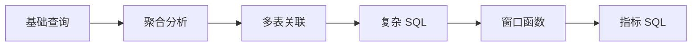

# 2. SQL 分析能力：大数据方向第一硬技能

::: tip 本章导读
把 SQL 从查询语法提升为分析表达能力，训练取数、聚合、关联、窗口和指标口径。
:::


## 本章阅读框架

| 阅读问题 | 本章回答方式 |
| --- | --- |
| 这个问题为什么出现？ | 从业务增长、数据规模、系统目标或 AI 应用压力切入。 |
| 它解决什么问题？ | 提炼为一个核心判断，避免把概念写成孤立定义。 |
| 它不解决什么问题？ | 在机制解释和常见误区中说明边界，防止工具崇拜。 |
| 它在真实平台哪里出现？ | 放回 PostgreSQL、数仓、批流、OLAP、湖仓、向量、图和治理的演化链路。 |
| 读完要会做什么？ | 通过场景案例和实战任务转成可练习的判断。 |



第一章建立的是数据库直觉：数据如何被组织、约束、查询和保持一致。

第二章开始进入 SQL。

## 问题切入

很多人学习数据库时，会把 SQL 当成语法题：会写 `SELECT`、`WHERE`、`GROUP BY`、`JOIN`，就认为自己掌握了 SQL。

但真实数据工作不是这样。业务同学不会问“请写一个 `GROUP BY`”，而是会问：

```text
今天成交额为什么比昨天低？
新用户 7 日留存是多少？
哪些商品带来了最多复购？
一次营销活动影响了哪些用户分层？
为什么同一个 GMV 指标，两个报表算出来不一样？
```

这些问题的难点不在语法本身，而在三件事：

1. **取数边界**：哪些记录应该算入，哪些记录应该排除。
2. **业务粒度**：一行数据代表用户、订单、订单明细、支付记录，还是一次行为事件。
3. **指标口径**：统计时间、状态过滤、去重方式、退款处理和异常数据如何定义。

如果只会写语法，不会表达这些判断，SQL 就只能查出一张临时表，不能沉淀成可信的分析能力。

## 核心判断

但这里的 SQL 不是语法清单，而是一种分析表达能力。它让你把业务问题转换成数据问题，再转换成可执行、可验证、可迁移的计算过程。

> SQL 是大数据系统的共同语言。PostgreSQL、Hive、Spark SQL、Trino、ClickHouse、Doris 都依赖 SQL。学习大数据，应先强化分析 SQL，而不是先背工具名。

本章要建立的判断是：SQL 不是为了“从数据库里拿到结果”，而是为了把业务问题转成稳定的数据计算过程。它的价值不只在 PostgreSQL 中成立，也会迁移到数仓、Spark SQL、Trino、ClickHouse、Doris 和 DuckDB。

SQL 也不是万能工具。它不能替你定义业务口径，不能自动判断数据质量，不能解决所有性能瓶颈，也不能替代数据建模、数据治理和系统架构。它负责把已经明确的问题、数据边界和计算规则表达出来。

## 机制解释

本章按六层能力展开：

```text
基础查询
  -> 聚合分析
  -> 多表关联
  -> 复杂分析 SQL
  -> 窗口函数
  -> 指标 SQL
```

这条路径不是语法从简单到复杂的堆叠，而是分析能力从“取出记录”到“形成指标”的升级。

### 2.1 基础查询：从表中准确取出你需要的数据

基础查询解决的是取数边界问题。

一条最简单的查询是：

```sql
SELECT *
FROM orders;
```

但在真实数据分析中，这条 SQL 通常不够好。它没有说明你要哪些字段、哪些记录、什么顺序、返回多少行，也没有表达清楚业务边界。

更好的写法是：

```sql
SELECT
    order_id,
    user_id,
    total_amount,
    order_status,
    created_at
FROM orders
WHERE order_status = 'paid'
ORDER BY created_at DESC
LIMIT 20;
```

这条 SQL 表达了五个判断：

```text
SELECT      取哪些字段
FROM        从哪张表取
WHERE       取哪些行
ORDER BY    按什么顺序返回
LIMIT       返回多少行
```

基础查询不是为了“查出来”，而是为了清楚定义数据范围。

常见基础能力包括：

- `SELECT`：选择字段。
- `WHERE`：过滤记录。
- `ORDER BY`：定义返回顺序。
- `LIMIT`：控制结果数量。
- `DISTINCT`：去除重复值。
- `LIKE` / `ILIKE`：模糊匹配。
- `IN`：匹配一组候选值。
- `BETWEEN`：范围过滤。
- `IS NULL` / `IS NOT NULL`：处理空值。

常见误区是长期依赖 `SELECT *`。在小表和探索阶段它可以接受，但在大表、宽表、生产库和跨引擎查询中，明确字段更稳定，也更容易控制成本和解释结果。

### 2.2 聚合分析：从明细记录到统计指标

基础查询回答的是“哪些记录符合条件”。

聚合分析回答的是“这些记录合起来说明什么”。

假设 `orders` 表一行代表一笔订单：

```text
orders
├── order_id
├── user_id
├── order_status
├── total_amount
├── created_at
└── paid_at
```

如果只看明细，你可以知道最近 20 笔订单是什么。但业务通常更关心：

```text
今天有多少订单？
这个月 GMV 是多少？
平均每笔订单多少钱？
哪个商品销量最高？
每天订单量趋势如何？
哪些用户发生了复购？
```

这就需要聚合。

```sql
SELECT COUNT(*)
FROM orders
WHERE order_status = 'paid';
```

统计已支付订单数。

```sql
SELECT SUM(total_amount) AS gmv
FROM orders
WHERE order_status = 'paid';
```

统计 GMV。

```sql
SELECT
    date(created_at) AS order_date,
    COUNT(*) AS order_count,
    SUM(total_amount) AS gmv
FROM orders
WHERE order_status = 'paid'
GROUP BY date(created_at)
ORDER BY order_date;
```

按日期统计订单数和 GMV。

聚合分析的核心结构是：

```text
选择统计范围
  -> 选择聚合函数
  -> 选择分组维度
  -> 得到指标
```

常用函数包括 `COUNT`、`SUM`、`AVG`、`MAX`、`MIN`。`GROUP BY` 让指标按维度拆开，`HAVING` 则对分组后的结果再次过滤。

聚合的难点不是函数本身，而是指标口径。例如 GMV 是否只算已支付订单？退款是否扣除？测试订单是否排除？时间按创建时间还是支付时间？这些口径决定了指标是否可信。

### 2.3 多表关联：从分散数据中恢复完整业务事实

真实业务数据通常不会完整存在于一张表里。

用户在 `users` 表，订单在 `orders` 表，商品在 `products` 表，订单商品明细在 `order_items` 表，支付记录在 `payments` 表，行为事件在 `events` 表。

如果只会单表查询和单表聚合，你只能看到局部事实。

JOIN 解决的不是“把几张表拼起来”这么简单，而是把分散在不同表中的业务对象重新连接成可分析的完整事实。

例如查询每笔订单对应的用户信息：

```sql
SELECT
    o.order_id,
    o.total_amount,
    o.created_at,
    u.user_id,
    u.name
FROM orders o
INNER JOIN users u
    ON o.user_id = u.user_id;
```

不同 JOIN 类型表达不同保留策略：

| JOIN 类型 | 解决的问题 | 风险 |
| --- | --- | --- |
| `INNER JOIN` | 只保留两边都匹配的数据 | 会丢掉未匹配记录 |
| `LEFT JOIN` | 保留左表全部记录，补充右表信息 | 右表字段可能为空 |
| `RIGHT JOIN` | 保留右表全部记录 | 可读性通常不如调换左右表后用 LEFT JOIN |
| `FULL JOIN` | 保留两边全部记录 | 结果更难解释 |
| `CROSS JOIN` | 生成所有组合 | 容易造成数据爆炸 |
| `SELF JOIN` | 同表内部关联 | 要明确别名和关系语义 |

JOIN 的关键不是语法，而是粒度。

如果 `orders` 一行一笔订单，`order_items` 一行一个订单商品明细，那么订单 JOIN 订单明细后，结果会从订单粒度变成订单商品粒度。后续再聚合时，如果不理解粒度变化，就可能重复计算订单金额。

所以每次 JOIN 都要问：

```text
左表一行代表什么？
右表一行代表什么？
关联字段是否唯一？
JOIN 后一行代表什么？
有没有丢数据？
有没有放大数据？
```

### 2.4 复杂分析 SQL：把中间过程表达清楚

当分析问题变复杂时，一条 SQL 往往需要分步骤表达。

子查询、CTE、`CASE WHEN`、`UNION`、`EXISTS` 和临时表，解决的是分析过程拆解问题。

CTE 适合把复杂逻辑拆成可读步骤：

```sql
WITH paid_orders AS (
    SELECT *
    FROM orders
    WHERE order_status = 'paid'
),
user_gmv AS (
    SELECT
        user_id,
        SUM(total_amount) AS gmv
    FROM paid_orders
    GROUP BY user_id
)
SELECT *
FROM user_gmv
WHERE gmv > 1000;
```

`CASE WHEN` 适合把业务规则转成字段：

```sql
SELECT
    order_id,
    total_amount,
    CASE
        WHEN total_amount >= 1000 THEN 'high'
        WHEN total_amount >= 100 THEN 'middle'
        ELSE 'low'
    END AS amount_level
FROM orders;
```

复杂 SQL 的核心判断是：

> SQL 不只是把结果算出来，还要让分析过程可读、可复查、可迁移。

如果一条 SQL 过长、重复逻辑太多、口径隐藏在嵌套里，后续迁移到 Spark SQL、ClickHouse 或 dbt 时会非常困难。

### 2.5 窗口函数：在保留明细的同时做组内分析

普通聚合会把多行合并成少数结果。

窗口函数不同，它能在保留明细行的同时，计算组内排名、前后关系、累计值和移动统计。

例如给每个用户的订单排序：

```sql
SELECT
    order_id,
    user_id,
    total_amount,
    created_at,
    ROW_NUMBER() OVER (
        PARTITION BY user_id
        ORDER BY created_at
    ) AS order_seq
FROM orders;
```

常见窗口函数包括：

- `ROW_NUMBER`：组内编号。
- `RANK` / `DENSE_RANK`：组内排名。
- `LAG` / `LEAD`：获取前一行或后一行。
- `FIRST_VALUE` / `LAST_VALUE`：获取窗口内首尾值。
- `SUM() OVER` / `COUNT() OVER` / `AVG() OVER`：窗口聚合。

窗口函数的核心结构是：

```text
函数
  -> OVER
  -> PARTITION BY 分组范围
  -> ORDER BY 组内顺序
```

它特别适合留存分析、复购分析、用户生命周期、排行榜、环比、累计 GMV、路径顺序等问题。

窗口函数的常见误区是只记函数名，不理解窗口范围。窗口定义错了，结果看起来有数字，但业务含义可能完全错误。

### 2.6 常见指标 SQL：从语法能力到指标能力

真正的数据分析不是写出漂亮 SQL，而是算出可解释、可复用、可对齐的指标。

常见指标包括：

- DAU / WAU / MAU。
- GMV。
- 客单价。
- 留存率。
- 转化率。
- 复购率。
- 漏斗分析。
- 路径分析。
- 排行榜。
- 同比。
- 环比。

例如 DAU：

```sql
SELECT
    date(event_time) AS dt,
    COUNT(DISTINCT user_id) AS dau
FROM events
WHERE event_name = 'app_open'
GROUP BY date(event_time);
```

例如客单价：

```sql
SELECT
    SUM(total_amount) / NULLIF(COUNT(*), 0) AS avg_order_value
FROM orders
WHERE order_status = 'paid';
```

例如 7 日留存，关键不是 SQL 多复杂，而是口径明确：

```text
新用户定义：某日首次注册用户
回访定义：注册后第 7 天发生 app_open
时间字段：注册时间和事件时间
去重口径：按 user_id 去重
```

指标 SQL 的核心判断是：

> SQL 分析能力的终点不是会写语法，而是能把业务问题稳定地转成指标口径和计算逻辑。


### 深度展开：SQL 分析能力如何落到真实系统

本节补齐本章的工程细节。阅读时不要只记住概念名称，而要把它放回“输入是什么、处理路径是什么、输出给谁、边界在哪里、如何验证”的链路中。

#### 一、它从什么问题开始

业务问题不能直接进入数据库执行，必须先被转换成取数边界、业务粒度、过滤规则和指标口径。

这个问题通常不会以技术名词出现，而是以业务现象出现：报表变慢、指标不一致、实时看板延迟、RAG 召回不稳定、数据无法追溯、项目 Demo 无法验收。能不能把现象还原成系统问题，是本书要训练的第一层能力。

#### 二、输入数据和前置判断

输入通常是业务表、事件表、维度表、口径说明和一个看似简单但边界不清的问题，例如 GMV、留存、复购、转化率或活跃用户。

在动手之前，至少要确认四件事：

| 判断项 | 要回答的问题 |
| --- | --- |
| 数据粒度 | 一行代表什么事实，是用户、订单、订单明细、事件、文件、Chunk，还是一条关系？ |
| 时间边界 | 使用创建时间、更新时间、支付时间、事件时间，还是处理时间？ |
| 状态边界 | 哪些状态算有效，哪些测试、取消、退款、重复或迟到数据要排除？ |
| 责任边界 | 这个环节负责记录事实、生产指标、加速查询、治理质量，还是服务 AI 应用？ |

#### 三、处理路径

处理路径是先确认一行数据代表什么，再确认统计对象、时间字段、状态过滤、去重方式和异常数据处理，最后把这些判断写成可复查的 SQL。

这条路径应该能被写成可执行流程，而不是停留在术语解释。一个合格的设计至少要说明：数据从哪里来、经过哪些转换、写到哪里、谁消费、失败后如何重跑、结果如何校验。

#### 四、在真实平台中的位置

在真实平台里，这一层会沉淀成指标 SQL、数仓任务、BI 数据集、数据质量检查和临时分析查询。PostgreSQL 用它训练基本表达，Spark SQL、Trino、ClickHouse 和 Doris 用它承接更大规模的分析。

平台位置决定了它和前后系统的关系。不要孤立地问“这个技术好不好”，而要问：

- 它继承了上一层什么问题？
- 它把什么复杂度转移给了下一层？
- 它的输出是否能被复用、追溯和治理？
- 它是否改变了数据粒度、延迟、一致性或权限边界？

#### 五、边界和失败模式

SQL 不会自动替你定义业务口径，也不会自动修复脏数据。SQL 写得再复杂，如果粒度错、JOIN 放大、时间字段错或口径不一致，结果仍然不可信。

常见失败信号可以这样检查：

| 失败信号 | 应该追问什么 |
| --- | --- |
| 同一指标在两个报表里不一致 | 定位到具体输入、口径、链路、边界或治理责任。 |
| JOIN 后行数突然变多 | 定位到具体输入、口径、链路、边界或治理责任。 |
| COUNT(*) 和 COUNT(DISTINCT user_id) 被混用 | 定位到具体输入、口径、链路、边界或治理责任。 |
| WHERE 条件没有说明状态、时间和测试数据边界 | 定位到具体输入、口径、链路、边界或治理责任。 |

#### 六、可操作练习

拿订单、支付、用户、行为事件四类表，分别写出 GMV、支付成功率、新用户 7 日留存、复购率，并为每个指标写出口径说明和反例。

练习完成后不要只看“有没有跑通”，还要补一份复盘：

- 输入数据是否足以支撑问题？
- 口径和边界是否写清楚？
- 结果能否被重复计算和对账？
- 如果数据量扩大 10 倍，瓶颈会出现在哪里？
- 如果接入下游 BI、RAG 或治理系统，还缺哪些元数据？


## 系统位置

SQL 分析能力处在整条学习路线的第二层。

上一章用 PostgreSQL 建立了数据库直觉：数据如何被组织成表，如何通过主键、外键、约束和事务保持正确。到了本章，读者开始从“理解数据库结构”转向“用数据库回答业务问题”。

这一步非常关键，因为后面所有系统都会继续复用 SQL 思维：

| 后续系统 | SQL 能力如何迁移 |
| --- | --- |
| PostgreSQL 大表 | 同一条 SQL 在大表上会暴露扫描、排序、连接和聚合成本 |
| 数仓建模 | 指标 SQL 会反推事实表、维度表和分层模型 |
| ETL / ELT | 清洗、转换、去重、拉链和汇总都需要 SQL 表达 |
| Spark SQL / Hive SQL | 分布式批处理仍然大量使用 SQL 描述计算 |
| Trino / ClickHouse / Doris | 交互式分析和 OLAP 查询继续以 SQL 为主要入口 |
| 数据治理 | 指标口径、血缘、质量规则和权限控制都要回到 SQL 逻辑 |

但 SQL 也会在下一章遇到边界：当数据量从几万行变成几千万行、几亿行，同样的查询逻辑会因为扫描范围、索引选择、JOIN 代价和排序聚合成本而变慢。于是读者需要继续学习 PostgreSQL 大表能力。

## 场景案例

假设一个电商团队把业务数据放在 PostgreSQL 中：

```text
users         用户注册信息
products      商品信息
orders        订单主表，一行一笔订单
order_items   订单明细，一行一个商品项
payments      支付记录
events        用户行为事件
```

运营团队提出一个问题：

> 最近 30 天的新用户中，哪些人在注册后 7 天内完成首单？这些首单来自哪些商品类目？这些用户后续是否发生复购？

这个问题看起来是一句话，实际需要拆成多层 SQL 判断：

1. 从 `users` 中找出最近 30 天注册的新用户。
2. 从 `orders` 中找出这些用户的已支付订单。
3. 用窗口函数给每个用户订单排序，识别首单。
4. 关联 `order_items` 和 `products`，看首单商品类目。
5. 判断首单发生时间是否在注册后 7 天内。
6. 再看首单之后是否还有第二笔已支付订单。

一个简化版本可以写成：

```sql
WITH new_users AS (
    SELECT
        user_id,
        registered_at
    FROM users
    WHERE registered_at >= current_date - interval '30 days'
),
paid_orders AS (
    SELECT
        o.order_id,
        o.user_id,
        o.paid_at,
        o.total_amount,
        ROW_NUMBER() OVER (
            PARTITION BY o.user_id
            ORDER BY o.paid_at
        ) AS order_seq
    FROM orders o
    JOIN new_users u
        ON o.user_id = u.user_id
    WHERE o.order_status = 'paid'
),
first_orders AS (
    SELECT *
    FROM paid_orders
    WHERE order_seq = 1
),
repurchase_users AS (
    SELECT DISTINCT user_id
    FROM paid_orders
    WHERE order_seq >= 2
)
SELECT
    p.category,
    COUNT(DISTINCT f.user_id) AS first_order_users,
    COUNT(DISTINCT r.user_id) AS repurchase_users,
    SUM(f.total_amount) AS first_order_gmv
FROM first_orders f
JOIN new_users u
    ON f.user_id = u.user_id
JOIN order_items oi
    ON f.order_id = oi.order_id
JOIN products p
    ON oi.product_id = p.product_id
LEFT JOIN repurchase_users r
    ON f.user_id = r.user_id
WHERE f.paid_at < u.registered_at + interval '7 days'
GROUP BY p.category
ORDER BY first_order_users DESC;
```

这段 SQL 的重点不是语法复杂，而是每一步都把业务问题拆成了可复查的中间结果。后续如果迁移到数仓，可以把 `new_users`、`paid_orders`、`first_orders` 这些逻辑沉淀为中间表、指标模型或 dbt model。

## 常见误区

**误区一：会写语法就等于会做分析。**

语法只是表达工具。真正的分析能力还包括业务口径、数据粒度、异常数据处理和结果校验。没有这些判断，SQL 越复杂，错误越难发现。

**误区二：聚合结果有数字就可信。**

`COUNT`、`SUM`、`AVG` 都能算出数字，但数字是否可信取决于过滤条件、去重口径、时间字段、状态字段和 JOIN 粒度。指标 SQL 必须能解释“为什么这些记录被算入”。

**误区三：JOIN 只是把表连起来。**

JOIN 会改变数据粒度。订单表 JOIN 订单明细表后，一笔订单可能变成多行。如果继续对订单金额求和，就可能重复计算。

**误区四：窗口函数越多越高级。**

窗口函数适合组内顺序、累计、排名和前后关系，但它不能替代清晰的业务定义。`PARTITION BY` 和 `ORDER BY` 写错时，结果仍然会返回，看起来还很合理。

**误区五：SQL 可以解决所有数据平台问题。**

SQL 能表达计算，但不能单独解决数据规模、实时延迟、跨系统同步、权限、血缘、质量和语义检索。后续章节要学习的系统，正是为了补足这些边界。

## 实战任务

本章实战任务是把电商业务问题拆成可验证 SQL。

### 数据准备

使用仓库中的样例数据：

```text
site/public/examples/ecommerce-postgres.sql
site/public/examples/chapter-02-queries.sql
```

如果本地有 PostgreSQL，可以创建一个练习库后导入样例数据：

```bash
createdb db_cookbook_lab
psql db_cookbook_lab -f site/public/examples/ecommerce-postgres.sql
```

### 操作步骤

1. 写一条基础查询：取出最近 20 笔已支付订单，只返回订单编号、用户、金额、状态和创建时间。
2. 写一条聚合查询：按天统计已支付订单数、GMV 和客单价。
3. 写一条 JOIN 查询：按商品类目统计销售额，检查订单金额是否被订单明细放大。
4. 写一条窗口函数查询：找出每个用户的首单和第二单。
5. 写一条指标 SQL：计算最近 30 天新用户的 7 日首单转化率。

### 观察指标

每一步都记录：

- 输入表和输出结果各自是什么粒度。
- 是否使用了正确的时间字段。
- 是否需要 `COUNT(DISTINCT ...)`。
- JOIN 后行数是否变化。
- 指标是否排除了取消、未支付、测试或异常订单。

### 对比实验

对同一个 GMV 指标写两个版本：

1. 只从 `orders` 表聚合。
2. JOIN `order_items` 后再聚合。

比较两个结果是否一致。如果不一致，解释差异来自订单粒度和订单明细粒度的变化，还是来自过滤条件不一致。

### 复盘问题

- 这条 SQL 解决的业务问题是什么？
- 它没有解决哪些问题？
- 如果迁移到数仓，哪些 CTE 应该变成中间表？
- 如果数据量扩大 100 倍，最可能变慢的是扫描、JOIN、排序还是聚合？
- 哪些指标口径需要写入数据治理文档？

## 小结引出下一章

完成本章后，读者应具备五项能力：

- 能写复杂查询。
- 能写统计报表 SQL。
- 能写窗口函数分析。
- 能理解指标计算口径。
- 能迁移到 Spark SQL / Hive SQL / ClickHouse SQL。

下一章进入 PostgreSQL 大表能力。

因为当 SQL 从练习数据进入真实业务数据，最先遇到的问题就是：表变大之后，为什么原来的查询方式开始变慢？
