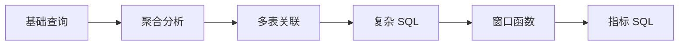

# 2. SQL 分析能力：大数据方向第一硬技能

::: tip 本章导读
把 SQL 从查询语法提升为分析表达能力，训练取数、聚合、关联、窗口和指标口径。
:::
::: info 本章验收问题
- 你能否为 GMV、留存或复购写出口径说明，而不是只写出一条 SQL？
- 你能否指出一条 SQL 的粒度、时间边界和状态边界？
:::




第一章建立的是数据库直觉：数据如何被组织、约束、查询和保持一致。

第二章开始进入 SQL。

## 问题切入

很多人学习数据库时，会把 SQL 当成语法题：会写 `SELECT`、`WHERE`、`GROUP BY`、`JOIN`，就认为自己掌握了 SQL。

但真实数据工作不是这样。业务同学不会问“请写一个 `GROUP BY`”，而是会问：

```text
今天成交额为什么比昨天低？
新用户 7 日留存是多少？
哪些商品带来了最多复购？
一次营销活动影响了哪些用户分层？
为什么同一个 GMV 指标，两个报表算出来不一样？
```

这些问题的难点不在语法本身，而在三件事：

1. **取数边界**：哪些记录应该算入，哪些记录应该排除。
2. **业务粒度**：一行数据代表用户、订单、订单明细、支付记录，还是一次行为事件。
3. **指标口径**：统计时间、状态过滤、去重方式、退款处理和异常数据如何定义。

如果只会写语法，不会表达这些判断，SQL 就只能查出一张临时表，不能沉淀成可信的分析能力。

## 核心判断

但这里的 SQL 不是语法清单，而是一种分析表达能力。它让你把业务问题转换成数据问题，再转换成可执行、可验证、可迁移的计算过程。

> SQL 是大数据系统的共同语言。PostgreSQL、Hive、Spark SQL、Trino、ClickHouse、Doris 都依赖 SQL。学习大数据，应先强化分析 SQL，而不是先背工具名。

SQL 是数据工程师职业生涯中复用率最高的技能。这一章的目标是把 SQL 从”能查出数据”升级到”能把业务问题翻译成稳定、可复用、可验证的计算过程”。这里建立的判断，会原封不动地迁移到 Spark SQL、Trino、ClickHouse 和 DuckDB。

SQL 也不是万能工具。它不能替你定义业务口径，不能自动判断数据质量，不能解决所有性能瓶颈，也不能替代数据建模、数据治理和系统架构。它负责把已经明确的问题、数据边界和计算规则表达出来。

## 机制解释

本章按六层能力展开：

```text
基础查询
  -> 聚合分析
  -> 多表关联
  -> 复杂分析 SQL
  -> 窗口函数
  -> 指标 SQL
```

这条路径不是语法从简单到复杂的堆叠，而是分析能力从“取出记录”到“形成指标”的升级。

## 本章内容

| 节号 | 主题 |
|------|------|
| [02.1](/chapters/02/02-1) | SQL不是语法题，而是分析表达能力 |
| [02.2](/chapters/02/02-2) | 基础查询：从表中准确取出你需要的数据 |
| [02.3](/chapters/02/02-3) | 聚合分析：从明细记录到统计指标 |
| [02.4](/chapters/02/02-4) | 多表关联：从分散数据中恢复完整业务事实 |
| [02.5](/chapters/02/02-5) | 复杂分析SQL：把中间过程表达清楚 |
| [02.6](/chapters/02/02-6) | 窗口函数：在保留明细的同时做组内分析 |
| [02.7](/chapters/02/02-7) | 指标计算：从SQL到指标 |
| [02.8](/chapters/02/02-8) | 常见指标SQL实战 |
| [02.9](/chapters/02/02-9) | SQL性能基础：写出高效的SQL查询 |
| [02.10](/chapters/02/02-10) | SQL在不同系统中的迁移：理解差异，保持能力 |


## 系统位置

SQL 分析能力处在整条学习路线的第二层。

上一章用 PostgreSQL 建立了数据库直觉：数据如何被组织成表，如何通过主键、外键、约束和事务保持正确。到了本章，读者开始从“理解数据库结构”转向“用数据库回答业务问题”。

这一步非常关键，因为后面所有系统都会继续复用 SQL 思维：

| 后续系统 | SQL 能力如何迁移 |
| --- | --- |
| PostgreSQL 大表 | 同一条 SQL 在大表上会暴露扫描、排序、连接和聚合成本 |
| 数仓建模 | 指标 SQL 会反推事实表、维度表和分层模型 |
| ETL / ELT | 清洗、转换、去重、拉链和汇总都需要 SQL 表达 |
| Spark SQL / Hive SQL | 分布式批处理仍然大量使用 SQL 描述计算 |
| Trino / ClickHouse / Doris | 交互式分析和 OLAP 查询继续以 SQL 为主要入口 |
| 数据治理 | 指标口径、血缘、质量规则和权限控制都要回到 SQL 逻辑 |

但 SQL 也会在下一章遇到边界：当数据量从几万行变成几千万行、几亿行，同样的查询逻辑会因为扫描范围、索引选择、JOIN 代价和排序聚合成本而变慢。于是读者需要继续学习 PostgreSQL 大表能力。

## 场景案例

假设一个电商团队把业务数据放在 PostgreSQL 中：

```text
users         用户注册信息
products      商品信息
orders        订单主表，一行一笔订单
order_items   订单明细，一行一个商品项
payments      支付记录
events        用户行为事件
```

运营团队提出一个问题：

> 最近 30 天的新用户中，哪些人在注册后 7 天内完成首单？这些首单来自哪些商品类目？这些用户后续是否发生复购？

这个问题看起来是一句话，实际需要拆成多层 SQL 判断：

1. 从 `users` 中找出最近 30 天注册的新用户。
2. 从 `orders` 中找出这些用户的已支付订单。
3. 用窗口函数给每个用户订单排序，识别首单。
4. 关联 `order_items` 和 `products`，看首单商品类目。
5. 判断首单发生时间是否在注册后 7 天内。
6. 再看首单之后是否还有第二笔已支付订单。

一个简化版本可以写成：

```sql
WITH new_users AS (
    SELECT
        user_id,
        registered_at
    FROM users
    WHERE registered_at >= current_date - interval '30 days'
),
paid_orders AS (
    SELECT
        o.order_id,
        o.user_id,
        o.paid_at,
        o.total_amount,
        ROW_NUMBER() OVER (
            PARTITION BY o.user_id
            ORDER BY o.paid_at
        ) AS order_seq
    FROM orders o
    JOIN new_users u
        ON o.user_id = u.user_id
    WHERE o.order_status = 'paid'
),
first_orders AS (
    SELECT *
    FROM paid_orders
    WHERE order_seq = 1
),
repurchase_users AS (
    SELECT DISTINCT user_id
    FROM paid_orders
    WHERE order_seq >= 2
)
SELECT
    p.category,
    COUNT(DISTINCT f.user_id) AS first_order_users,
    COUNT(DISTINCT r.user_id) AS repurchase_users,
    SUM(f.total_amount) AS first_order_gmv
FROM first_orders f
JOIN new_users u
    ON f.user_id = u.user_id
JOIN order_items oi
    ON f.order_id = oi.order_id
JOIN products p
    ON oi.product_id = p.product_id
LEFT JOIN repurchase_users r
    ON f.user_id = r.user_id
WHERE f.paid_at < u.registered_at + interval '7 days'
GROUP BY p.category
ORDER BY first_order_users DESC;
```

这段 SQL 的重点不是语法复杂，而是每一步都把业务问题拆成了可复查的中间结果。后续如果迁移到数仓，可以把 `new_users`、`paid_orders`、`first_orders` 这些逻辑沉淀为中间表、指标模型或 dbt model。

## 常见误区

**误区一：会写语法就等于会做分析。**

语法只是表达工具。真正的分析能力还包括业务口径、数据粒度、异常数据处理和结果校验。没有这些判断，SQL 越复杂，错误越难发现。

**误区二：聚合结果有数字就可信。**

`COUNT`、`SUM`、`AVG` 都能算出数字，但数字是否可信取决于过滤条件、去重口径、时间字段、状态字段和 JOIN 粒度。指标 SQL 必须能解释“为什么这些记录被算入”。

**误区三：JOIN 只是把表连起来。**

JOIN 会改变数据粒度。订单表 JOIN 订单明细表后，一笔订单可能变成多行。如果继续对订单金额求和，就可能重复计算。

**误区四：窗口函数越多越高级。**

窗口函数适合组内顺序、累计、排名和前后关系，但它不能替代清晰的业务定义。`PARTITION BY` 和 `ORDER BY` 写错时，结果仍然会返回，看起来还很合理。

**误区五：SQL 可以解决所有数据平台问题。**

SQL 能表达计算，但不能单独解决数据规模、实时延迟、跨系统同步、权限、血缘、质量和语义检索。后续章节要学习的系统，正是为了补足这些边界。

## 实战任务

本章实战任务是把电商业务问题拆成可验证 SQL。

### 数据准备

使用仓库中的样例数据：

```text
site/public/examples/ecommerce-postgres.sql
site/public/examples/chapter-02-queries.sql
```

如果本地有 PostgreSQL，可以创建一个练习库后导入样例数据：

```bash
createdb db_cookbook_lab
psql db_cookbook_lab -f site/public/examples/ecommerce-postgres.sql
```

### 操作步骤

1. 写一条基础查询：取出最近 20 笔已支付订单，只返回订单编号、用户、金额、状态和创建时间。
2. 写一条聚合查询：按天统计已支付订单数、GMV 和客单价。
3. 写一条 JOIN 查询：按商品类目统计销售额，检查订单金额是否被订单明细放大。
4. 写一条窗口函数查询：找出每个用户的首单和第二单。
5. 写一条指标 SQL：计算最近 30 天新用户的 7 日首单转化率。

### 观察指标

每一步都记录：

- 输入表和输出结果各自是什么粒度。
- 是否使用了正确的时间字段。
- 是否需要 `COUNT(DISTINCT ...)`。
- JOIN 后行数是否变化。
- 指标是否排除了取消、未支付、测试或异常订单。

### 对比实验

对同一个 GMV 指标写两个版本：

1. 只从 `orders` 表聚合。
2. JOIN `order_items` 后再聚合。

比较两个结果是否一致。如果不一致，解释差异来自订单粒度和订单明细粒度的变化，还是来自过滤条件不一致。

### 复盘问题

- 这条 SQL 解决的业务问题是什么？
- 它没有解决哪些问题？
- 如果迁移到数仓，哪些 CTE 应该变成中间表？
- 如果数据量扩大 100 倍，最可能变慢的是扫描、JOIN、排序还是聚合？
- 哪些指标口径需要写入数据治理文档？

## 小结引出下一章

完成本章后，读者应具备五项能力：

- 能写复杂查询。
- 能写统计报表 SQL。
- 能写窗口函数分析。
- 能理解指标计算口径。
- 能迁移到 Spark SQL / Hive SQL / ClickHouse SQL。

下一章进入 PostgreSQL 大表能力。

因为当 SQL 从练习数据进入真实业务数据，最先遇到的问题就是：表变大之后，为什么原来的查询方式开始变慢？
