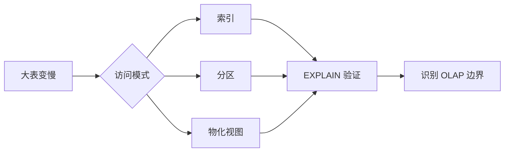

# 3. PostgreSQL 大表能力：理解单机数据库边界

::: tip 本章导读
从分区、索引、物化视图和执行计划理解 PostgreSQL 如何支撑大表，以及边界在哪里。
:::
::: info 本章验收问题
- 你能否区分索引、分区、物化视图分别解决什么问题？
- 你能否判断一个慢查询是 SQL 写法问题还是单机边界问题？
:::




大数据不是一开始就分布式。

## 问题切入

很多大数据系统的问题，最早都会在 PostgreSQL 大表上出现：表变大，查询变慢，写入变重，历史分析干扰在线业务，索引越来越多，维护越来越复杂。

先理解 PostgreSQL 大表，再理解 OLAP 和分布式计算，会更自然。

一个常见场景是：电商系统刚上线时，`orders`、`order_items`、`events` 都很小，报表直接查业务库没有明显问题。半年后，订单表有几千万行，行为事件表有数十亿行，运营仍然希望在业务库里查询过去一年的 GMV、用户路径、复购和商品排行。

这时问题不再是“SQL 会不会写”，而是：

```text
数据库到底扫描了多少数据？
索引是否真的被用上？
分区是否能裁剪无关历史数据？
重复聚合是否应该提前计算？
报表查询是否正在和业务交易争抢资源？
```

如果不理解这些问题，就会误以为“换一条 SQL”可以解决所有性能问题。

## 核心判断

> 大数据系统不是为了替代单机数据库而凭空出现，而是单机数据库在数据规模、分析负载和团队协作上遇到边界后的系统演化。

单表到了几千万行就开始慢了？这一章不劝你立刻上分布式系统。PostgreSQL 的索引、分区、物化视图、并行查询能把单机能力推到远超多数人预期的程度。但每种机制都有代价——理解这些代价，你就知道什么时候单机真的不够了。

它们解决的是单机数据库内部的访问路径、物理组织、预计算和资源利用问题，不解决长期历史分析、跨系统统一建模、低成本海量存储、多团队指标复用和分布式计算问题。正是这些未解决的问题，会在下一章引出 OLTP 与 OLAP 的分化。

## 机制解释

本章从六个机制理解 PostgreSQL 如何面对大表：

```text
分区表
  -> 物化视图
  -> 索引体系
  -> 执行计划
  -> 批量导入导出
  -> 并行查询
```

它们不是彼此替代关系，而是分别作用在不同压力点上。

| 压力 | PostgreSQL 内部机制 | 主要代价 |
| --- | --- | --- |
| 历史数据太多 | 分区表 | 分区设计和维护成本 |
| 重复聚合太重 | 物化视图 | 刷新成本和数据延迟 |
| 点查或范围查慢 | 索引 | 存储和写入维护成本 |
| 不知道慢在哪里 | 执行计划 | 需要理解优化器和实际行数 |
| 数据批量进入或离开 | `COPY`、批量导入导出 | 文件、事务和锁管理 |
| 大范围扫描耗时 | 并行查询 | 仍受单机 CPU、内存和 I/O 限制 |

## 本章内容

| 节号 | 主题 |
|------|------|
| [03.1](/chapters/03/03-1) | 大表为什么慢：从现象到本质 |
| [03.2](/chapters/03/03-2) | PostgreSQL的单机边界：能做什么，不能做什么 |
| [03.3](/chapters/03/03-3) | 分区表：让大表具有物理边界 |
| [03.4](/chapters/03/03-4) | 表空间与存储策略：让数据存储更高效 |
| [03.5](/chapters/03/03-5) | 索引基础：B-tree与查询加速 |
| [03.6](/chapters/03/03-6) | 索引进阶：BRIN、GIN、GiST与特殊场景 |
| [03.7](/chapters/03/03-7) | 查询优化基础：执行计划分析与优化 |
| [03.8](/chapters/03/03-8) | 物化视图：把重复计算提前做掉 |
| [03.9](/chapters/03/03-9) | 并行查询：利用多核CPU加速大表查询 |
| [03.10](/chapters/03/03-10) | 批量操作与数据链路接入：高效导入导出大量数据 |


## 系统位置

第 2 章解决的是“如何用 SQL 表达分析问题”。第 3 章解决的是“当这些 SQL 进入真实业务数据规模后，数据库如何执行，以及边界在哪里”。

PostgreSQL 大表能力处在 OLTP 到 OLAP 的过渡地带：

```text
业务库仍在 PostgreSQL 中
  -> 分析 SQL 开始变重
  -> 索引、分区、物化视图、执行计划还能缓解一部分问题
  -> 历史分析、跨主题建模、复杂报表和多团队复用继续增长
  -> 需要把交易负载和分析负载拆开
```

所以本章不是为了证明 PostgreSQL 不适合大数据，也不是为了把所有问题都推给分布式系统。更准确的判断是：先把单机数据库内部机制用到合理边界，再识别什么时候应该进入 OLAP、数仓、湖仓或批处理系统。

## 场景案例

假设 `events` 表记录用户行为，每天新增 500 万行：

```text
events
├── event_id
├── user_id
├── event_name
├── product_id
└── event_time
```

一开始运营只查当天 DAU：

```sql
SELECT
    date(event_time) AS dt,
    COUNT(DISTINCT user_id) AS dau
FROM events
WHERE event_time >= current_date
GROUP BY date(event_time);
```

当表只有几十万行时，全表扫描也能接受。数据增长后，同一条 SQL 可能开始扫描大量历史数据。此时可以按顺序做三类判断：

1. **是否有时间过滤**：没有时间过滤的行为分析，会天然变成大范围扫描。
2. **是否有合适索引**：如果只是最近几天查询，`event_time` 上的 B-tree 或 BRIN 可能有帮助。
3. **是否适合分区**：如果事件表按月或按日增长，按 `event_time` 做 range partition 可以让查询裁剪无关分区。
4. **是否适合预计算**：如果每天都查 DAU、购买用户数、浏览商品数，可以把每日指标做成物化视图或汇总表。
5. **是否应该迁出业务库**：如果分析开始覆盖一年历史、多个维度、多个团队和高并发报表，就应该考虑 OLAP 数据库或数仓。

这个场景体现了本章的核心：优化不是盲目加索引，而是先判断访问模式，再选择合适机制，最后识别系统边界。

## 常见误区

**误区一：表大就一定要换分布式系统。**

表变大后首先要看访问模式、索引、分区、统计信息和执行计划。很多查询问题可以在 PostgreSQL 内部改善。但如果问题是长期历史分析、多主题建模、跨团队复用和高并发报表，单机优化就不是根本解法。

**误区二：索引越多越好。**

索引只服务特定访问路径。每增加一个索引，写入、更新、删除和存储都会变重。无差别加索引会让业务写入更慢，也会让优化器选择变复杂。

**误区三：分区一定能让查询更快。**

只有查询条件能命中分区键时，分区裁剪才有明显收益。如果按时间分区，却经常按 `user_id` 跨所有历史查询，分区并不能自动减少扫描。

**误区四：物化视图就是实时指标。**

物化视图保存的是刷新后的结果。它适合重复计算和允许延迟的报表，不适合强实时、强一致或每次都必须反映最新写入的场景。

**误区五：`EXPLAIN` 看到了索引就说明查询没问题。**

是否使用索引只是一个信号。还要看实际扫描行数、估算行数是否偏差、JOIN 策略、排序和聚合成本，以及 `EXPLAIN ANALYZE` 的真实耗时。

## 实战任务

本章实战任务是用同一个分析问题观察“SQL 逻辑”和“执行代价”的差异。

### 数据准备

使用 `site/public/examples/ecommerce-postgres.sql` 导入基础数据后，可以继续插入更多模拟事件数据。小数据集也能练习语法和执行计划阅读，大数据集能更明显看到索引和扫描差异。

### 操作步骤

1. 对 `events` 写一条最近 7 天 DAU 查询。
2. 使用 `EXPLAIN` 查看是否出现 `Seq Scan`、`Index Scan`、`Aggregate` 和 `Sort`。
3. 在 `event_time` 上创建索引，再次查看执行计划。
4. 写一条按用户查询最近行为的 SQL，判断现有 `event_time` 索引是否适合。
5. 建一个每日事件数的物化视图，对比直接从明细聚合和查询物化视图的差异。

示例：

```sql
EXPLAIN ANALYZE
SELECT
    date(event_time) AS dt,
    COUNT(DISTINCT user_id) AS dau
FROM events
WHERE event_time >= current_date - interval '7 days'
GROUP BY date(event_time)
ORDER BY dt;
```

### 观察指标

- 扫描方式是 `Seq Scan` 还是 `Index Scan`。
- 估算行数和实际行数是否接近。
- 查询时间主要消耗在扫描、排序、连接还是聚合。
- 加索引后读取是否减少，写入和维护成本是否增加。
- 物化视图是否带来数据延迟。

### 对比实验

对比三种做法：

1. 明细表直接聚合。
2. 明细表加索引后聚合。
3. 查询每日汇总物化视图。

复盘它们分别解决什么问题：索引减少特定访问路径的读取，物化视图减少重复聚合，分区减少无关物理范围扫描，但都不能替代 OLAP 系统承担长期、多维、高并发分析。

## 小结引出下一章

完成本章后，读者应该能：

- 理解大表为什么慢。
- 选择基本分区策略。
- 使用物化视图做预聚合。
- 使用 `EXPLAIN` 分析查询。
- 判断 PostgreSQL 的分析边界。
- 理解为什么需要 OLAP 系统。

下一章进入 OLTP vs OLAP。

因为当业务查询和分析查询长期争抢同一套数据库资源时，系统就会出现第一条真正的分水岭。
