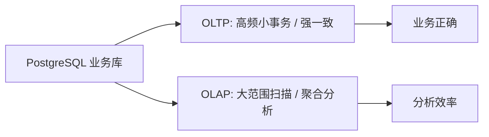

# 4. OLTP vs OLAP：大数据系统的第一分水岭

::: tip 本章导读
解释业务交易和分析计算为什么会分化，以及 PostgreSQL 与 OLAP 系统如何分工。
:::
::: info 本章验收问题
- 你能否解释为什么一个系统很难同时做好高频事务和复杂分析？
- 你能否判断一个查询应该留在 PostgreSQL 还是迁入 OLAP？
:::




PostgreSQL 可以支撑业务交易，也可以做一定规模分析。

## 问题切入

但当业务增长后，一个数据库很难同时把两类目标做到极致：高频小事务和大范围复杂分析。

这就是 OLTP 和 OLAP 分化的根源。

在第 3 章中，我们看到 PostgreSQL 可以通过索引、分区、物化视图和执行计划分析继续支撑大表。但这些机制仍然工作在同一个数据库内部：业务交易、运营报表、临时分析和历史扫描都在争抢同一套 CPU、内存、I/O、锁和连接资源。

一个典型事故是：运营同学在工作日上午运行了一条过去一年订单明细 JOIN 商品、用户、支付和活动表的分析 SQL。查询本身没有错，但它扫描大量历史数据、占用缓存和 I/O，导致创建订单、查询订单详情、更新支付状态的接口延迟升高。

这时问题已经不是“再加一个索引能不能解决”，而是系统目标发生了冲突：

```text
业务系统希望每笔交易低延迟、强一致、稳定写入。
分析系统希望扫描大量历史数据、自由组合维度、批量计算指标。
```

## 核心判断

> OLTP 和 OLAP 不是两个时髦分类，而是两类负载目标的系统分工。

OLTP 和 OLAP 的分化，本质上不是数据库产品分类，而是数据系统在读写模式、延迟目标、一致性目标、建模方式和团队协作上的分工。

OLTP 解决的是业务事实能否被可靠创建、修改和查询；OLAP 解决的是历史事实能否被高效扫描、聚合、分析和复用。它们都重要，但优化方向不同。试图让一个业务库长期承担所有交易和所有分析，通常会把两类目标都拖慢。

## 机制解释

### 4.1 为什么一个数据库很难同时做好交易和分析

前3章学习了SQL能力和PostgreSQL大表能力。

但现实业务中，经常遇到一个矛盾：

**交易系统和分析系统总是打架**。

**场景**：
```text
上午9点：运营同学说"今天GMV报表怎么这么慢？"
   → 数据库正在处理大量订单写入，查询慢

下午2点：技术团队说"订单系统卡顿，能不能停掉分析查询？"
   → 分析查询占用了大量资源，影响交易

结果：
- 交易慢：用户体验差
- 分析慢：决策不及时
- 两个团队都不满意
```

**为什么会这样？**

因为**OLTP（交易处理）和OLAP（分析处理）的需求完全不同**：

**OLTP的需求**：
```yaml
- 事务一致性：订单和支付必须同时成功或失败
- 高并发写入：每秒1000个订单
- 响应时间：<100ms
- 数据精确：不能有错误
```

**OLAP的需求**：
```yaml
- 复杂查询：关联多张表，聚合计算
- 大量扫描：扫描数亿行数据
- 响应时间：秒级到分钟级可接受
- 历史数据：分析几年的数据
```

**同一个数据库**：
- 既要快速写入（OLTP）
- 又要快速查询（OLAP）
- 两者互相干扰

**结论**：
> 一个数据库很难同时做好交易和分析，需要根据需求选择合适的系统，或者拆分成两个系统。

#### 一、为什么OLTP和OLAP会冲突

**第一，资源竞争**

**场景**：订单系统

**OLTP操作**：
```sql
-- 用户下单（高频写入）
INSERT INTO orders (...) VALUES (...);
UPDATE orders SET status = 'paid' WHERE order_id = 123;
```

**OLAP操作**：
```sql
-- 运营看板查询（大查询）
SELECT
    date(created_at),
    sum(total_amount) as gmv,
    count(*) as order_count
FROM orders
WHERE created_at >= CURRENT_DATE - INTERVAL '30 days'
GROUP BY date(created_at);
```

**冲突**：
- OLTP需要快速写入
- OLAP需要大量扫描
- 两者竞争CPU、内存、磁盘I/O
- 结果：都变慢

**第二，优化方向相反**

**OLTP优化**：
```yaml
写入优化：
  - 减少索引（加快写入）
  - 小事务（减少锁时间）
  - 行级锁（提高并发）

数据模型：
  - 规范化（减少冗余）
  - 分表（减少单表数据量）
```

**OLAP优化**：
```yaml
查询优化：
  - 增加索引（加快查询）
  - 预计算（物化视图）
  - 大内存（缓存数据）

数据模型：
  - 反规范化（增加冗余）
  - 宽表（减少JOIN）
  - 星型模型
```

**矛盾**：
- OLTP要减少索引，OLAP要增加索引
- OLTP要规范化，OLAP要反规范化
- 优化方向相反，无法兼顾

**第三，数据量级不同**

**OLTP数据量**：
```yaml
实时数据：
  - 订单：最近3个月
  - 用户：全部用户
  - 商品：全部商品

数据量：几GB到几十GB
```

**OLAP数据量**：
```yaml
历史数据：
  - 订单：最近3年
  - 用户行为：每天1000万行
  - 日志数据：每天1亿行

数据量：几TB到几十TB
```

**问题**：
- OLTP处理小数据量（几十GB）
- OLAP处理大数据量（几十TB）
- 如果放在一起，OLTP会被拖慢

#### 二、核心判断：OLTP和OLAP是两种不同的系统模式

> OLTP和OLAP的核心判断是：它们是两种根本不同的系统模式，分别优化交易处理和分析查询，强行合并会导致两者都做不好，应该根据场景选择或拆分。

这个判断说明：
- **OLTP**：优化交易处理（快速写入、事务一致性）
- **OLAP**：优化分析查询（复杂查询、历史数据）
- **冲突**：资源竞争、优化方向相反、数据量级不同
- **解决方案**：拆分或选择专用系统

#### 三、OLTP和OLAP的本质区别

##### 3.1 用户群体不同

**OLTP的用户**：
```yaml
前台用户：
  - 客户：下单、支付、查询
  - 客服：处理订单、退款
  - 运营：配置活动、查看实时数据

特点：
  - 并发高（每秒数千次）
  - 操作简单（单行查询、简单写入）
  - 响应时间要求高（<100ms）
```

**OLAP的用户**：
```yaml
后台用户：
  - 数据分析师：做报表、分析
  - 运营经理：看GMV、转化率
  - 管理层：看决策报表

特点：
  - 并发低（每小时几次）
  - 操作复杂（多表JOIN、聚合计算）
  - 响应时间要求低（秒级可接受）
```

##### 3.2 数据特性不同

**OLTP数据**：
```yaml
实时性：
  - 当前数据状态
  - 频繁变化（每秒数千次）

数据量：
  - 相对较小（GB级）

精度：
  - 精确数据（不能有错误）
  - 强一致性（ACID事务）

示例：
  - 当前库存：100件
  - 当前订单：5笔待支付
  - 当前余额：1000元
```

**OLAP数据**：
```yaml
历史性：
  - 历史数据快照
  - 相对稳定（每天或每小时更新）

数据量：
  - 非常大（TB级）

精度：
  - 可以有近似（分析结果不需要100%精确）
  - 最终一致性（可以有几秒延迟）

示例：
  - 昨天的GMV：100万元
  - 上周的转化率：5%
  - 去年的留存率：30%
```

##### 3.3 查询模式不同

**OLTP查询**：
```sql
-- 查询1：查询单个订单
SELECT * FROM orders WHERE order_id = 123;

-- 查询2：查询单个用户的最近订单
SELECT * FROM orders WHERE user_id = 123 ORDER BY created_at DESC LIMIT 10;

-- 查询3：查询商品库存
SELECT stock FROM products WHERE product_id = 456;
```

**特点**：
- 返回少量数据（几行到几十行）
- 简单查询（单表、简单JOIN）
- 通过索引快速定位

**OLAP查询**：
```sql
-- 查询1：每天GMV趋势
SELECT
    date(created_at) as order_date,
    sum(total_amount) as gmv
FROM orders
GROUP BY date(created_at)
ORDER BY order_date;

-- 查询2：用户留存分析
WITH cohort_users AS (
    SELECT
        user_id,
        min(date(registered_at)) as cohort_date
    FROM users
    GROUP BY user_id
),
retention AS (
    SELECT
        c.user_id,
        c.cohort_date,
        count(DISTINCT date(o.created_at)) as active_days
    FROM cohort_users c
    LEFT JOIN orders o ON c.user_id = o.user_id
    GROUP BY c.user_id, c.cohort_date
)
SELECT * FROM retention;

-- 查询3：同群分析
SELECT
    date(created_at) as order_date,
    count(DISTINCT user_id) as unique_users
FROM events
GROUP BY date(created_at);
```

**特点**：
- 返回大量数据（数百万行）
- 复杂查询（多表JOIN、子查询、窗口函数）
- 全表扫描或大量扫描

#### 四、混合使用的问题

##### 4.1 性能干扰

**场景**：订单系统

**OLTP影响OLAP**：
```sql
-- 下午2点：订单高峰期
-- 每秒1000个订单写入
-- OLAP查询：分析最近7天的GMV

-- 问题：
-- 1. OLAP查询扫描大量数据，占用CPU
-- 2. OLTP写入等待CPU，响应时间增加
-- 3. 用户体验变差（下单慢）
```

**OLAP影响OLTP**：
```sql
-- 晚上8点：分析高峰期
-- 运营同学看GMV报表
-- 复杂查询执行5分钟

-- 问题：
-- 1. OLAP查询占用大量内存
-- 2. OLTP可用内存减少
-- 3. 数据库整体性能下降
```

##### 4.2 锁竞争

**OLTP事务**：
```sql
BEGIN;
UPDATE inventory SET stock = stock - 1 WHERE product_id = 456;
INSERT INTO orders (...) VALUES (...);
COMMIT;
```

**OLAP查询**：
```sql
SELECT * FROM orders o JOIN inventory i ON o.product_id = i.product_id;
```

**冲突**：
- OLAP扫描orders表，可能锁表
- OLTP等待锁，响应时间增加
- 并发下降

##### 4.3 索引策略冲突

**OLTP需要的索引**：
```sql
-- 快速查找订单
CREATE INDEX idx_orders_id ON orders(order_id);
CREATE INDEX idx_orders_user_id ON orders(user_id);

-- 快速更新订单
CREATE INDEX idx_orders_status ON orders(order_status);
```

**OLAP需要的索引**：
```sql
-- 快速分析
CREATE INDEX idx_orders_created_at ON orders(created_at);
CREATE INDEX idx_orders_user_date ON orders(user_id, created_at);

-- 覆盖索引（包含查询的所有字段）
CREATE INDEX idx_orders_covering ON orders(user_id, total_amount, created_at);
```

**问题**：
- 索引太多，OLTP写入慢
- 索引维护成本高
- 存储空间占用大

#### 五、实际案例

##### 5.1 案例一：电商订单系统

**原始架构**：
```yaml
单一PostgreSQL数据库：
  - 处理订单写入（OLTP）
  - 生成GMV报表（OLAP）
```

**问题**：
```yaml
大促期间：
  - 订单量增加10倍
  - GMV报表查询时间从5秒增加到5分钟
  - 订单写入响应时间从50ms增加到500ms
  
用户投诉：
  - 下单慢
  - 支付慢
  - 经常超时
```

**优化方案**：
```yaml
方案A：读写分离
  - 主库：处理订单写入
  - 从库：生成GMV报表
  - 问题：从库也有压力，报表还是慢

方案B：分库分表
  - 按用户ID分片
  - 问题：报表需要跨库查询
  
方案C：拆分OLTP和OLAP
  - OLTP：MySQL（处理订单）
  - OLAP：ClickHouse（生成报表）
  - 通过ETL同步数据
  - 结果：OLTP响应时间<100ms，OLAP查询时间<10秒
```

##### 5.2 案例二：用户行为分析

**原始架构**：
```yaml
单一PostgreSQL数据库：
  - 存储用户行为事件（每天1000万行）
  - 分析用户留存、转化漏斗
```

**问题**：
```yaml
数据增长：
  - 3个月：10亿行
  - 1年：100亿行
  - 数据库大小：1TB → 10TB

性能下降：
  - 查询越来越慢（5秒 → 5分钟）
  - 数据库维护困难（备份、恢复需要数小时）
  - 索引重建需要很长时间
```

**优化方案**：
```yaml
方案A：分表
  - 按月分表
  - 问题：跨表查询复杂
  
方案B：归档旧数据
  - 删除1年前数据
  - 问题：无法分析历史数据

方案C：OLAP专用系统
  - OLTP：PostgreSQL（存储最近3个月数据）
  - OLAP：ClickHouse（存储全部历史数据）
  - 通过ETL同步数据
  - 结果：
    - OLTP：轻快，处理实时数据
    - OLAP：快速分析全部历史数据
```

#### 六、常见误区

**误区一：一个数据库可以同时做好OLTP和OLAP**

- **说明**：OLTP和OLAP需求完全不同，强行合并会导致两者都做不好
- **后果**：交易慢、分析慢、用户体验差
- **正确理解**：
  - 小规模（<1000万行，<100 QPS）：可以合并
  - 大规模：必须拆分
  - 根据实际场景选择

**误区二：读写分离可以解决问题**

- **说明**：读写分离可以缓解问题，但不是根本解决方案
- **后果**：从库也有压力，OLAP查询还是慢
- **正确理解**：
  - 读写分离是过渡方案
  - 最终还是需要OLAP专用系统
  - 大数据量必须用OLAP专用系统

**误区三：OLTP数据可以实时用于OLAP**

- **说明**：OLTP数据实时变化，OLAP需要稳定快照
- **后果**：分析结果不准确、性能差
- **正确理解**：
  - OLAP使用OLTP的数据副本
  - 通过ETL定期同步
  - 有延迟（几分钟到几小时）

**误区四：OLAP系统必须很贵**

- **说明**：OLAP系统有很多选择，不一定贵
- **后果**：不敢上OLAP，继续受影响
- **正确理解**：
  - 开源方案：ClickHouse、Doris（免费）
  - 云方案：BigQuery、Redshift（按需付费）
  - 根据数据量和查询频率选择

**误区五：拆分后实时性会变差**

- **说明**：拆分后OLTP和OLAP分离，但可以通过ETL保证准实时性
- **后果**：担心实时性差，不敢拆分
- **正确理解**：
  - OLTP：实时（毫秒级）
  - OLAP：准实时（几分钟延迟）
  - 对于大部分分析场景，几分钟延迟完全可以接受

#### 七、实战任务

**任务1：分析系统瓶颈**

给定一个电商系统，分析OLTP和OLAP的冲突：

```sql
-- 当前架构：单一PostgreSQL数据库
-- 数据量：订单表5000万行，用户表1000万行
-- QPS：500（400读，100写）
-- 主要OLTP操作：
--   - 创建订单（INSERT）
--   - 更新订单状态（UPDATE）
--   - 查询订单（SELECT）
-- 主要OLAP操作：
--   - 每日GMV报表
--   - 用户留存分析
--   - 商品销量排行
```

**分析**：
```yaml
性能问题：
  - 高峰期订单响应时间>500ms
  - GMV报表查询时间>5分钟
  - 数据库CPU使用率>80%

瓶颈分析：
  - OLAP查询扫描大量数据（数千万行）
  - 占用大量CPU和内存
  - 影响OLTP写入性能

优化建议：
  - 短期：读写分离，报表查询走从库
  - 中期：历史数据归档，OLAP只查最近3个月
  - 长期：OLTP和OLAP拆分，OLAP用ClickHouse
```

**任务2：设计拆分方案**

设计OLTP和OLAP拆分方案：

```yaml
需求：
  - 订单量：每天10万笔
  - 查询QPS：100（读）+ 500（写）
  - 分析需求：每天GMV、用户留存、转化漏斗

OLTP系统（PostgreSQL）：
  功能：订单写入、查询、更新
  数据量：最近3个月数据（约1000万行）
  性能要求：响应时间<100ms
  优化：
    - 只保留必要索引
    - 规范化设计
    - 读写分离

OLAP系统（ClickHouse）：
  功能：GMV报表、用户分析、转化漏斗
  数据量：全部历史数据
  性能要求：查询时间<10秒
  优化：
    - 宽表设计
    - 物化视图
    - 分区表

数据同步（ETL）：
  频率：每小时一次
  方式：从PostgreSQL抽取增量数据，导入ClickHouse
  延迟：最多1小时
```

**任务3：验证拆分效果**

验证拆分后的性能：

```sql
-- OLTP系统（PostgreSQL）
-- 测试写入性能
INSERT INTO orders (...) VALUES (...);
-- 响应时间：50ms（符合要求<100ms）

-- 测试查询性能
SELECT * FROM orders WHERE order_id = 123;
-- 响应时间：10ms（符合要求<100ms）

-- OLAP系统（ClickHouse）
-- 测试分析查询
SELECT
    toDate(created_at) as order_date,
    sum(total_amount) as gmv,
    count(*) as order_count
FROM orders
WHERE created_at >= now() - INTERVAL 30 DAY
GROUP BY toDate(created_at);
-- 响应时间：5秒（符合要求<10秒）
```

#### 八、小结

一个数据库很难同时做好交易和分析。

核心要点：
- OLTP和OLAP需求完全不同（用户、数据、查询）
- 混合使用会导致性能干扰、锁竞争、索引冲突
- 小规模可以合并，大规模必须拆分
- 拆分后各有优化：OLTP快速写入、OLAP快速查询
- 数据同步通过ETL实现

下一节将进入从单机到分工：系统的自然演化，了解为什么系统会从单一数据库演化为分工架构。

### 4.2 从单机到分工：系统的自然演化

上一节讨论了OLTP和OLAP的冲突，结论是：**应该拆分成两个系统**。

但问题来了：**系统不是一开始就拆分的，而是逐步演化的**。

**一个典型的系统演化过程**：

**第一阶段：单机阶段**
```yaml
初创期（0-1万用户）：
  - 数据库：1个PostgreSQL
  - 数据量：GB级
  - 并发：<10 QPS
  - 需求：简单查询即可
```

**第二阶段：读写分离阶段**
```yaml
成长期（1万-10万用户）：
  - 数据库：1个主库 + 1个从库
  - 数据量：10GB级
  - 并发：100 QPS
  - 需求：报表查询走从库
```

**第三阶段：OLTP和OLAP拆分阶段**
```yaml
扩张期（10万-100万用户）：
  - OLTP：PostgreSQL主从
  - OLAP：ClickHouse
  - 数据量：TB级
  - 并发：1000 QPS
  - 需求：分析需求复杂，数据量大
```

**为什么是这样演化？**

因为：
1. **技术债务累积**：初期为了快速上线，做了很多权衡
2. **需求逐步增加**：用户多了，需求复杂了
3. **性能瓶颈出现**：原有架构无法满足需求
4. **自然演化**：不是一次性重构，而是逐步优化

理解这个演化过程，才能知道在什么阶段、用什么方案、解决什么问题。

#### 一、为什么系统会演化

**第一，业务规模在增长**

**初创期**：
```yaml
用户规模：1000用户
订单量：每天100笔
数据量：10MB
需求：查看订单列表
→ 单机PostgreSQL完全够用
```

**成长期**：
```yaml
用户规模：10万用户
订单量：每天1万笔
数据量：1GB
需求：GMV报表、用户分析
→ 单机开始吃力，考虑读写分离
```

**扩张期**：
```yaml
用户规模：100万用户
订单量：每天10万笔
数据量：100GB
需求：复杂分析、实时看板
→ 必须拆分OLTP和OLAP
```

**第二，技术债务累积**

**初期权衡**：
```yaml
为了快速上线：
  - 数据模型不完善
  - 没有做读写分离
  - 没有考虑归档
```

**后期问题**：
```yaml
技术债务爆发：
  - 数据模型成为瓶颈（难以扩展）
  - 查询越来越慢
  - 存储成本高
```

**解决方案**：
```yaml
逐步优化：
  - 第一期：读写分离
  - 第二期：数据归档
  - 第三期：OLTP和OLAP拆分
```

**第三，需求逐步增加**

**初期需求**：
```yaml
MVP版本：
  - 用户下单
  - 查看订单
  - 查看商品
→ 简单CRUD，单机够用
```

**后期需求**：
```yaml
完善版本：
  - 数据报表
  - 用户分析
  - 实时看板
  - A/B测试
→ 复杂分析，需要OLAP系统
```

**结论**：
> 系统演化是业务增长、技术债务累积、需求增加的自然结果，不是一次性设计，而是逐步优化。

#### 二、核心判断：架构演化是"渐进式"，不是"一步到位"

> 系统演化的核心判断是：架构随着业务规模和需求增长逐步演化，每个阶段解决当前阶段的主要问题，不需要一步到位，但要为未来演进留出空间。

这个判断说明：
- **演化**：逐步优化，不是一次性重构
- **阶段**：每个阶段有特定问题和方案
- **渐进**：在现有基础上优化，不是推翻重建
- **预留**：为未来演进留出空间

#### 三、第一阶段：单机阶段

##### 3.1 系统特征

**业务规模**：
```yaml
用户规模：<1万
数据量：<10GB
并发：<10 QPS
```

**系统架构**：
```yaml
架构：单机PostgreSQL
- 1个数据库
- 处理所有读写
```

**典型场景**：
```sql
-- 订单表
CREATE TABLE orders (
    order_id SERIAL PRIMARY KEY,
    user_id INT,
    total_amount NUMERIC(10, 2),
    created_at TIMESTAMP
);

-- 用户表
CREATE TABLE users (
    user_id SERIAL PRIMARY KEY,
    name VARCHAR(100),
    email VARCHAR(255)
);
```

##### 3.2 特点和局限

**特点**：
```yaml
优势：
  - 架构简单
  - 开发快速
  - 成本低
  - 运维简单

局限：
  - 无法扩展
  - 单点故障
  - 性能有限
```

**何时足够？**
```yaml
判断标准：
  - 数据量：<10GB
  - 并发：<100 QPS
  - 响应时间：<100ms
  - 无复杂分析需求
```

**何时不足？**
```yaml
问题信号：
  - 响应时间变慢（>500ms）
  - 数据库CPU高（>80%）
  - 需要生成报表
  - 需要支持更多用户
```

#### 四、第二阶段：读写分离阶段

##### 4.1 系统特征

**业务规模**：
```yaml
用户规模：1万-10万
数据量：10GB-100GB
并发：100-1000 QPS
```

**系统架构**：
```yaml
架构：主从复制
- 1个主库（Master）：处理写入
- 1个从库（Slave）：处理读取
- 1个同步进程：复制数据
```

**架构图**：
```text
应用层
  ↓ 写入
主库 ───────→ 从库
  ↑ 复制     ↑ 读取
  └─── 监控
```

##### 4.2 读写分离的实现

**PostgreSQL主从配置**：

**步骤1：配置主库**
```ini
# postgresql.conf (主库)
wal_level = replica
max_wal_senders = 3
```

**步骤2：配置从库**
```ini
# postgresql.conf (从库)
hot_standby_mode = on
```

**步骤3：创建复制用户**
```sql
-- 在主库上
CREATE USER replicator WITH REPLICATION ENCRYPTED PASSWORD 'password';
ALTER ROLE replicator WITH REPLICATION;

-- 授予权限
GRANT REPLICATION ON DATABASE mydb TO replicator;
```

**步骤4：从库连接主库**
```bash
# 在从库上
pg_basebackup -h master_host -D mydb -U replicator -P password -W -Fp -R /var/lib/postgresql/data -D /var/lib/postgresql/data
```

**步骤5：启动从库**
```bash
# 启动从库
pg_ctl start
```

##### 4.3 读写分离的应用层路由

**应用层路由逻辑**：
```python
# Python示例
def get_db_connection():
    # 写操作：连接主库
    if operation in ['INSERT', 'UPDATE', 'DELETE']:
        return connect_to_master()
    # 读操作：连接从库
    else:  # SELECT
        return connect_to_slave()
```

**中间件支持**：
```yaml
ProxySQL：
  - 自动路由读写
  - 连接池管理
  - 故障切换

MaxScale：
  - 自动路由读写
  - 负载均衡
  - 故障切换
```

##### 4.4 读写分离的局限

**问题1：从库延迟**
```yaml
场景：
  - 主库写入数据
  - 从库同步有延迟（1-5秒）
  - 用户刚写入的数据，从库查不到

影响：
  - 用户数据不一致
  - 体验问题
```

**解决方案**：
```yaml
短期：
  - 关键查询走主库
  - 等待从库同步

中期：
  - 优化主从复制（减少延迟）
  - 增加从库数量

长期：
  - 使用消息队列
  - 最终一致性
```

**问题2：报表查询还是慢**
```yaml
场景：
  - 复杂报表查询
  - 扫描数千万行
  - 从库还是慢（5分钟）

影响：
  - 报表生成慢
  - 影响决策
```

**解决方案**：
```yaml
短期：
  - 优化SQL和索引
  - 预计算常用指标

中期：
  - 数据归档（只保留最近3个月）
  - 创建物化视图

长期：
  - 引入OLAP专用系统
```

#### 五、第三阶段：OLTP和OLAP拆分阶段

##### 5.1 系统特征

**业务规模**：
```yaml
用户规模：10万-100万
数据量：100GB-10TB
并发：1000-10000 QPS
```

**系统架构**：
```yaml
架构：OLTP + OLAP
- OLTP：PostgreSQL主从（交易系统）
- OLAP：ClickHouse（分析系统）
- ETL：数据同步（PostgreSQL → ClickHouse）
```

**架构图**：
```text
用户 → OLTP系统
        ↓
      ELT同步
        ↓
      OLAP系统
```

##### 5.2 OLTP系统

**PostgreSQL主从**：
```yaml
主库：
  - 处理写入
  - 处理实时查询
  - 保留最近3个月数据

从库：
  - 处理读查询
  - 负载均衡
```

**优化**：
```yaml
写入优化：
  - 批量写入
  - 异步写入
  - 连接池

数据保留：
  - 只保留热数据（最近3个月）
  - 定期归档到OLAP
```

##### 5.3 OLAP系统

**ClickHouse集群**：
```yaml
数据：
  - 全部历史数据
  - 用户行为数据
  - 日志数据

查询：
  - GMV报表
  - 用户留存分析
  - 转化漏斗
```

**优化**：
```yaml
存储优化：
  - 分区表（按月/日）
  - 压缩存储
  - 冷热数据分层

查询优化：
  - 物化视图
  - 预计算指标
```

##### 5.4 数据同步（ETL）

**同步策略**：
```yaml
全量同步：
  - 首次同步全部历史数据
  - 耗时较长

增量同步：
  - 每小时同步增量数据
  - 基于updated_at字段

实时同步：
  - 使用CDC（Change Data Capture）
  - 通过Kafka消息队列
  - 延迟：秒级到分钟级
```

**数据延迟**：
```yaml
OLTP：
  - 实时（毫秒级）

OLAP：
  - 准实时（5分钟延迟）
  - 或T+1（第二天凌晨）
```

#### 六、演化的关键决策

##### 6.1 什么时候开始读写分离？

**信号**：
```yaml
性能信号：
  - 查询响应时间>500ms
  - 数据库CPU使用率>70%
  - 读多写少（读:写 > 7:3）

业务信号：
  - 需要生成报表
  - 需要支持更多读操作
```

**决策**：
```yaml
何时引入：
  - 并发>100 QPS
  - 数据量>10GB
  - 读操作占比>70%

如何引入：
  - 使用主从复制
  - 应用层路由读写
  - 监控从库延迟
```

##### 6.2 什么时候引入OLAP？

**信号**：
```yaml
性能信号：
  - 报表查询时间>10秒
  - 数据量>100GB
  - 复杂分析查询多

业务信号：
  - 需要历史数据分析
  - 需要用户行为分析
  - 需要数据科学/ML
```

**决策**：
```yaml
何时引入：
  - 数据量>1TB
  - 报表查询>10秒
  - 有分析团队

如何选择：
  - 开源：ClickHouse、Doris（免费）
  - 云：BigQuery、Redshift（按需付费）
```

##### 6.3 如何平滑迁移？

**分阶段迁移**：

**阶段1：搭建OLAP系统**
```yaml
目标：验证OLAP系统可行性
时间：2-4周
内容：
  - 搭建ClickHouse集群
  - 导入历史数据
  - 验证查询性能
```

**阶段2：双写OLTP和OLAP**
```yaml
目标：数据同步验证
时间：1-2周
内容：
  - OLTP继续写入
  - 同步数据到OLAP
  - 验证数据一致性
```

**阶段3：逐步切换查询**
```yaml
目标：查询切换到OLAP
时间：2-4周
内容：
  - 历史数据查询切换到OLAP
  - 实时查询继续用OLTP
  - 监控性能和正确性
```

**阶段4：归档OLTP旧数据**
```yaml
目标：减轻OLTP压力
时间：1-2周
内容：
  - 将3个月前的数据归档
  - 删除OLTP中的旧数据
  - 更新应用逻辑
```

#### 七、常见误区

**误区一：一开始就要设计完美架构**

- **说明**：架构是演化的，不是一步到位
- **后果**：过度设计，开发慢，成本高
- **正确理解**：
  - 初期：单机（简单、快速）
  - 中期：读写分离（解决读瓶颈）
  - 后期：OLTP+OLAP（拆分系统）

**误区二：读写分离可以解决所有问题**

- **说明**：读写分离可以缓解问题，但不是终极方案
- **后果**：从库还是有压力，报表还是慢
- **正确理解**：
  - 读写分离是过渡方案
  - 最终还是需要OLAP专用系统
  - 根据数据量和查询频率选择

**误区三：OLAP系统很复杂，很难维护**

- **说明**：OLAP系统有很多简单易用的方案
- **后果**：不敢上OLAP，继续受影响
- **正确理解**：
  - 开源方案：ClickHouse、Doris
  - 云方案：BigQuery、Redshift
  - 根据团队能力选择

**误区四：拆分后实时性会变差**

- **说明**：拆分后OLTP实时，OLAP准实时，符合业务需求
- **后果**：担心实时性差，不敢拆分
- **正确理解**：
  - OLTP：实时（毫秒级）
  - OLAP：准实时（几分钟延迟）
  - 大部分分析场景，几分钟延迟可接受

**误区五：必须一次性完成架构升级**

- **说明**：架构升级是分阶段、渐进式的
- **后果**：试图一次性重构，风险大
- **正确理解**：
  - 分阶段迁移
  - 平滑过渡
  - 双写验证
  - 逐步切换

#### 八、实战任务

**任务1：评估当前系统阶段**

给定一个系统，评估当前阶段：

```yaml
系统信息：
  - 用户规模：50万
  - 数据量：50GB
  - 并发：500 QPS（读400，写100）
  - 报表查询时间：30秒
  - 数据库CPU：85%

问题：
  - 高峰期响应时间>500ms
  - 报表查询慢
```

**评估**：
```yaml
当前阶段：读写分离阶段（第二阶段）
主要问题：
  - 报表查询慢（30秒）
  - 数据库CPU高（85%）

下一步：
  - 短期：优化报表查询，创建物化视图
  - 中期：引入OLAP系统（ClickHouse）
  - 长期：完整拆分OLTP和OLAP
```

**任务2：设计迁移方案**

设计从读写分离到OLTP+OLAP的迁移方案：

```yaml
当前状态：读写分离
目标状态：OLTP + OLAP

阶段1：搭建OLAP系统（2周）
  - 搭建ClickHouse
  - 导入历史数据
  - 验证查询性能

阶段2：数据同步（1周）
  - 设置ETL任务
  - 每小时同步增量数据
  - 验证数据一致性

阶段3：查询切换（2周）
  - 历史数据查询切换到ClickHouse
  - 实时查询继续用PostgreSQL
  - 监控性能和正确性

阶段4：数据归档（1周）
  - PostgreSQL保留3个月数据
  - 归档旧数据到ClickHouse
  - 更新应用逻辑
```

**任务3：验证迁移效果**

验证迁移后的性能：

```sql
-- OLTP系统（PostgreSQL）
-- 测试写入性能
INSERT INTO orders (...) VALUES (...);
-- 响应时间：50ms（目标<100ms）

-- 测试查询性能
SELECT * FROM orders WHERE order_id = 123;
-- 响应时间：10ms（目标<100ms）

-- OLAP系统（ClickHouse）
-- 测试分析查询
SELECT
    toDate(created_at) as order_date,
    sum(total_amount) as gmv
FROM orders
WHERE created_at >= now() - INTERVAL 30 DAY
GROUP BY toDate(created_at);
-- 查询时间：5秒（目标<10秒）
```

#### 九、小结

系统演化是业务增长、技术债务累积、需求增加的自然结果。

核心要点：
- 单机阶段：GB级数据，<10 QPS，简单查询
- 读写分离阶段：10GB级数据，100-1000 QPS，读写分离
- OLTP+OLAP阶段：TB级数据，1000+ QPS，系统拆分
- 演化是渐进式的，不是一次性重构
- 每个阶段解决当前阶段的主要问题
- 为未来演进留出空间

下一节将进入OLTP的本质：深入理解OLTP的核心特性（事务一致性、数据规范化、高并发）。

### 4.3 OLTP的本质：面向业务事务

前面学习了OLTP和OLAP的冲突，以及系统如何从单机演化为分工架构。

现在深入理解OLTP的本质。

**场景**：
```yaml
电商订单系统：
  - 用户下单
  - 扣减库存
  - 创建支付
  - 更新订单状态
```

**这些操作的特点**：
- 每个操作都是**业务事务**
- 需要保证**一致性**
- 需要保证**隔离性**
- 需要保证**持久性**

这就是OLTP的本质：**面向业务事务的在线交易处理**。

#### 一、为什么OLTP要面向业务事务

**第一，业务操作需要原子性**

**场景**：用户下单

```sql
-- 操作1：创建订单
INSERT INTO orders (order_id, user_id, total_amount, status) 
VALUES (1001, 123, 100.00, 'pending');

-- 操作2：扣减库存
UPDATE inventory SET stock = stock - 1 WHERE product_id = 456;

-- 操作3：创建支付记录
INSERT INTO payments (payment_id, order_id, amount, status) 
VALUES (2001, 1001, 100.00, 'pending');
```

**问题**：
- 如果操作1成功，操作2失败（库存不足）？
- 如果操作1和2成功，操作3失败？
- 结果：数据不一致

**解决方案**：**事务**
```sql
BEGIN;
  INSERT INTO orders ...;
  UPDATE inventory SET stock = stock - 1 WHERE product_id = 456;
  INSERT INTO payments ...;
COMMIT;
```

**保证**：
- 要么全部成功
- 要么全部失败
- 数据一致性

**第二，业务操作需要隔离性**

**场景**：两个用户同时购买同一商品

```sql
-- 用户A购买
BEGIN;
SELECT stock FROM inventory WHERE product_id = 456;  -- 返回1
-- 如果库存>0，继续购买
UPDATE inventory SET stock = stock - 1 WHERE product_id = 456;
COMMIT;

-- 用户B购买（同时执行）
BEGIN;
SELECT stock FROM inventory WHERE product_id = 456;  -- 返回1（还是1？）
-- 如果库存>0，继续购买
UPDATE inventory SET stock = stock - 1 WHERE product_id = 456;
COMMIT;
```

**问题**：
- 用户A和B都看到库存=1
- 两个用户都购买成功
- 结果：超卖

**解决方案**：**隔离级别**
```sql
-- 使用串行化隔离级别
SET TRANSACTION ISOLATION LEVEL SERIALIZABLE;

BEGIN;
SELECT stock FROM inventory WHERE product_id = 456 FOR UPDATE;  -- 加锁
UPDATE inventory SET stock = stock - 1 WHERE product_id = 456;
COMMIT;
```

**保证**：
- 用户A和B串行执行
- 不会超卖

**第三，业务操作需要持久性**

**场景**：订单支付成功

```sql
UPDATE orders SET status = 'paid' WHERE order_id = 1001;
UPDATE payments SET status = 'success' WHERE payment_id = 2001;
```

**问题**：
- 如果更新后，数据库立即崩溃？
- 用户已经支付，但订单状态丢失？

**解决方案**：**WAL日志**
```yaml
WAL（Write-Ahead Logging）：
  1. 先写日志（记录更新操作）
  2. 再更新数据
  3. 崩溃后，通过日志恢复
```

**保证**：
- 提交的事务一定持久化
- 崩溃后可以恢复

**结论**：
> OLTP的核心是事务处理（ACID），保证数据的一致性、隔离性、原子性和持久性。

#### 二、核心判断：OLTP的本质是ACID事务

> OLTP的核心判断是：OLTP的本质是ACID事务处理，通过原子性、一致性、隔离性、持久性保证业务操作的正确性和可靠性。

这个判断说明：
- **原子性（Atomicity）**：事务中的操作要么全部成功，要么全部失败
- **一致性（Consistency）**：事务前后，数据满足业务约束
- **隔离性（Isolation）**：并发事务之间互不干扰
- **持久性（Durability）**：提交的事务永久保存

#### 三、ACID详解

##### 3.1 原子性（Atomicity）

**定义**：事务中的操作要么全部成功，要么全部失败

**示例**：银行转账

```sql
-- 转账事务
BEGIN;
  -- 从账户A扣除100元
  UPDATE accounts SET balance = balance - 100 WHERE account_id = 1;
  
  -- 向账户B增加100元
  UPDATE accounts SET balance = balance + 100 WHERE account_id = 2;
COMMIT;
```

**原子性保证**：
- 如果第一个UPDATE成功，第二个UPDATE失败（账户B不存在）
- 整个事务回滚
- 账户A的余额不变

**实现机制**：
```yaml
Undo日志：
  1. 记录操作前的值
  2. 如果事务失败，用Undo日志回滚
  3. 恢复到事务前状态
```

##### 3.2 一致性（Consistency）

**定义**：事务前后，数据满足业务约束

**示例**：库存不能为负

```sql
-- 业务约束：stock >= 0
CREATE TABLE inventory (
    product_id INT PRIMARY KEY,
    stock INT NOT NULL CHECK (stock >= 0)
);

-- 事务1：正常购买
BEGIN;
  UPDATE inventory SET stock = stock - 1 WHERE product_id = 456;
  -- 如果stock=0，更新后stock=-1，违反约束，事务失败
COMMIT;
```

**一致性保证**：
- 数据库检查约束
- 如果违反约束，事务失败
- 数据一致性不被破坏

**常见的业务约束**：
```yaml
NOT NULL：字段不能为空
UNIQUE：字段值唯一
CHECK：字段值满足条件
FOREIGN KEY：外键约束
```

##### 3.3 隔离性（Isolation）

**定义**：并发事务之间互不干扰

**问题**：脏读、不可重复读、幻读

**场景1：脏读**
```sql
-- 事务A：更新订单
BEGIN;
UPDATE orders SET status = 'paid' WHERE order_id = 1001;
-- 还未COMMIT

-- 事务B：查询订单
SELECT status FROM orders WHERE order_id = 1001;
-- 读取到'status = paid'（脏数据）

-- 事务A：回滚
ROLLBACK;
-- 订单状态还是'pending'

-- 问题：事务B读取了脏数据
```

**场景2：不可重复读**
```sql
-- 事务A：查询订单
BEGIN;
SELECT status FROM orders WHERE order_id = 1001;  -- 返回'pending'
-- 做一些计算...

-- 事务B：更新订单
UPDATE orders SET status = 'paid' WHERE order_id = 1001;
COMMIT;

-- 事务A：再次查询
SELECT status FROM orders WHERE order_id = 1001;  -- 返回'paid'
-- 问题：两次查询结果不同
```

**场景3：幻读**
```sql
-- 事务A：查询订单数量
BEGIN;
SELECT count(*) FROM orders WHERE status = 'pending';  -- 返回10
-- 做一些统计...

-- 事务B：创建新订单
INSERT INTO orders (...) VALUES (...);
COMMIT;

-- 事务A：再次查询
SELECT count(*) FROM orders WHERE status = 'pending';  -- 返回11
-- 问题：出现了新的行（幻象）
```

**解决方案**：隔离级别

```yaml
读未提交（Read Uncommitted）：
  - 允许脏读
  - 性能最好
  - 不推荐

读已提交（Read Committed）：
  - 避免脏读
  - 允许不可重复读
  - PostgreSQL默认级别

可重复读（Repeatable Read）：
  - 避免脏读、不可重复读
  - 允许幻读
  - MySQL默认级别

串行化（Serializable）：
  - 避免脏读、不可重复读、幻读
  - 完全隔离
  - 性能最差
```

**选择建议**：
```yaml
OLTP系统：
  - 默认：Read Committed
  - 金融交易：Serializable
  - 统计分析：Repeatable Read
```

##### 3.4 持久性（Durability）

**定义**：提交的事务永久保存

**实现**：WAL日志

```yaml
WAL（Write-Ahead Logging）：
  1. 事务提交时，先写WAL日志
  2. 再更新数据文件
  3. 崩溃后，通过WAL日志恢复
  
优势：
  - 保证持久性
  - 支持时间点恢复（PITR）
  - 支持复制
```

**示例**：
```sql
-- 事务提交
BEGIN;
UPDATE orders SET status = 'paid' WHERE order_id = 1001;
COMMIT;
-- 此时，WAL日志已写入磁盘

-- 即使数据库立即崩溃
-- 重启后，通过WAL日志恢复
-- 订单状态仍是'paid'
```

#### 四、OLTP的事务特性

##### 4.1 短事务

**特点**：
```yaml
执行时间：
  - 通常<100ms
  - 快速提交
  
锁时间：
  - 锁定时间短
  - 减少锁竞争
  
并发能力：
  - 支持高并发
  - 每秒数千个事务
```

**示例**：
```sql
-- 短事务：查询单个订单
BEGIN;
SELECT * FROM orders WHERE order_id = 1001;
COMMIT;
-- 执行时间：10ms
```

##### 4.2 高并发

**特点**：
```yaml
并发量：
  - 每秒数千个事务
  - 高峰期每秒数万个事务
  
并发控制：
  - 行级锁
  - MVCC（多版本并发控制）
  - 死锁检测
```

**示例**：
```sql
-- 并发事务1
BEGIN;
UPDATE orders SET status = 'paid' WHERE order_id = 1001;
COMMIT;

-- 并发事务2（同时执行）
BEGIN;
UPDATE orders SET status = 'paid' WHERE order_id = 1002;
COMMIT;

-- 并发事务3（同时执行）
BEGIN;
SELECT * FROM orders WHERE user_id = 123;
COMMIT;
```

##### 4.3 强一致性

**特点**：
```yaml
一致性级别：
  - 强一致性
  - 读写一致
  
数据精度：
  - 精确数据
  - 不允许近似
```

**示例**：
```sql
-- 强一致性：查询当前库存
SELECT stock FROM inventory WHERE product_id = 456;
-- 返回：100（精确值，不是近似值）
```

#### 五、OLTP的典型操作

##### 5.1 CRUD操作

**Create（创建）**：
```sql
INSERT INTO orders (order_id, user_id, total_amount, status) 
VALUES (1001, 123, 100.00, 'pending');
```

**Read（读取）**：
```sql
SELECT * FROM orders WHERE order_id = 1001;
```

**Update（更新）**：
```sql
UPDATE orders SET status = 'paid' WHERE order_id = 1001;
```

**Delete（删除）**：
```sql
DELETE FROM orders WHERE order_id = 1001;
```

##### 5.2 简单查询

**特点**：
```yaml
查询模式：
  - 单表查询
  - 通过索引快速定位
  - 返回少量数据
  
示例：
  - 查询单个订单
  - 查询单个用户的订单
  - 查询商品库存
```

**示例**：
```sql
-- 查询单个订单
SELECT * FROM orders WHERE order_id = 1001;

-- 查询单个用户的最近订单
SELECT * FROM orders 
WHERE user_id = 123 
ORDER BY created_at DESC 
LIMIT 10;

-- 查询商品库存
SELECT stock FROM inventory WHERE product_id = 456;
```

##### 5.3 实时写入

**特点**：
```yaml
写入模式：
  - 高频写入
  - 每秒数千个事务
  - 实时反馈
  
示例：
  - 创建订单
  - 更新订单状态
  - 扣减库存
```

**示例**：
```sql
-- 创建订单
BEGIN;
INSERT INTO orders (...) VALUES (...);
UPDATE inventory SET stock = stock - 1 WHERE product_id = 456;
COMMIT;
```

#### 六、OLTP的优化策略

##### 6.1 索引优化

**目标**：快速定位数据

**示例**：
```sql
-- 订单表索引
CREATE INDEX idx_orders_id ON orders(order_id);           -- 主键查询
CREATE INDEX idx_orders_user_id ON orders(user_id);       -- 用户查询
CREATE INDEX idx_orders_status ON orders(order_status);   -- 状态查询

-- 组合索引
CREATE INDEX idx_orders_user_status ON orders(user_id, order_status);
```

##### 6.2 事务优化

**目标**：减少锁时间

**策略**：
```sql
-- 策略1：短事务
BEGIN;
UPDATE orders SET status = 'paid' WHERE order_id = 1001;
COMMIT;
-- 不要在事务中做耗时操作（如调用外部API）

-- 策略2：批量操作
BEGIN;
UPDATE orders SET status = 'paid' WHERE order_id IN (1001, 1002, 1003);
COMMIT;
-- 减少事务次数

-- 策略3：锁顺序
BEGIN;
-- 先锁订单
SELECT * FROM orders WHERE order_id = 1001 FOR UPDATE;
-- 再锁库存
SELECT * FROM inventory WHERE product_id = 456 FOR UPDATE;
COMMIT;
-- 固定锁顺序，避免死锁
```

##### 6.3 连接池优化

**目标**：减少连接开销

**示例**：
```python
# Python示例
from psycopg2 import pool

# 创建连接池
connection_pool = pool.SimpleConnectionPool(
    minconn=5,      -- 最小连接数
    maxconn=20,     -- 最大连接数
    host='localhost',
    database='postgres',
    user='postgres',
    password='password'
)

# 使用连接
conn = connection_pool.getconn()
cursor = conn.cursor()
cursor.execute("SELECT * FROM orders WHERE order_id = 1001")
result = cursor.fetchall()
connection_pool.putconn(conn)
```

#### 七、常见误区

**误区一：OLTP不需要事务**

- **说明**：OLTP的核心就是事务处理
- **后果**：数据不一致、业务错误
- **正确理解**：
  - OLTP必须使用事务
  - 保证ACID特性
  - 业务数据一致性

**误区二：事务越大越好**

- **说明**：事务应该尽量小，减少锁时间
- **后果**：锁竞争严重、并发下降
- **正确理解**：
  - 事务要短
  - 快速提交
  - 避免长事务

**误区三：隔离级别越高越好**

- **说明**：隔离级别越高，性能越差
- **后果**：并发能力下降、响应时间增加
- **正确理解**：
  - 根据业务选择隔离级别
  - 默认Read Committed
  - 特殊场景用更高隔离级别

**误区四：索引越多越好**

- **说明**：索引加快查询，但降低写入性能
- **后果**：写入慢、存储空间大
- **正确理解**：
  - 只建必要索引
  - 平衡查询和写入
  - 定期清理无用索引

**误区五：OLTP不需要优化**

- **说明**：OLTP需要优化，才能支持高并发
- **后果**：性能瓶颈、系统崩溃
- **正确理解**：
  - 优化SQL
  - 优化索引
  - 优化事务
  - 优化连接池

#### 八、实战任务

**任务1：设计订单事务**

设计一个完整的下单事务：

```sql
-- 需求：用户下单
-- 1. 创建订单
-- 2. 扣减库存
-- 3. 创建支付记录
-- 4. 保证ACID

-- 方案
BEGIN;
  -- 1. 创建订单
  INSERT INTO orders (order_id, user_id, total_amount, status) 
  VALUES (1001, 123, 100.00, 'pending');
  
  -- 2. 扣减库存
  UPDATE inventory 
  SET stock = stock - 1 
  WHERE product_id = 456 AND stock > 0;
  
  -- 检查库存是否扣减成功
  -- 如果stock=0，UPDATE影响0行，事务失败
  IF NOT FOUND THEN
    ROLLBACK;
    RAISE EXCEPTION '库存不足';
  END IF;
  
  -- 3. 创建支付记录
  INSERT INTO payments (payment_id, order_id, amount, status) 
  VALUES (2001, 1001, 100.00, 'pending');
  
COMMIT;
```

**任务2：处理并发冲突**

处理两个用户同时购买同一商品的并发冲突：

```sql
-- 方案1：使用SELECT FOR UPDATE
BEGIN;
  -- 1. 锁定库存行
  SELECT stock FROM inventory WHERE product_id = 456 FOR UPDATE;
  
  -- 2. 检查库存
  IF stock > 0 THEN
    -- 3. 扣减库存
    UPDATE inventory SET stock = stock - 1 WHERE product_id = 456;
    
    -- 4. 创建订单
    INSERT INTO orders (...) VALUES (...);
    
    COMMIT;
  ELSE
    -- 库存不足
    ROLLBACK;
  END IF;

-- 方案2：使用乐观锁
-- 1. 添加版本号
ALTER TABLE inventory ADD COLUMN version INT;

-- 2. 更新时检查版本号
BEGIN;
UPDATE inventory 
SET stock = stock - 1, version = version + 1 
WHERE product_id = 456 AND version = 5;

IF FOUND THEN
  -- 更新成功，创建订单
  INSERT INTO orders (...) VALUES (...);
  COMMIT;
ELSE
  -- 版本号变化，说明有其他事务更新
  ROLLBACK;
  -- 重试或返回错误
END IF;
```

**任务3：优化事务性能**

优化事务性能：

```sql
-- 问题：长事务
BEGIN;
-- 1. 查询订单（耗时10ms）
SELECT * FROM orders WHERE order_id = 1001;

-- 2. 调用外部API（耗时1秒）
-- SELECT http_post(...);

-- 3. 更新订单
UPDATE orders SET status = 'paid' WHERE order_id = 1001;

COMMIT;
-- 总耗时：1.01秒，锁时间1秒

-- 优化：拆分事务
-- 事务1：查询订单
BEGIN;
SELECT * FROM orders WHERE order_id = 1001;
COMMIT;
-- 耗时：10ms

-- 调用外部API（事务外）
-- http_post(...);

-- 事务2：更新订单
BEGIN;
UPDATE orders SET status = 'paid' WHERE order_id = 1001;
COMMIT;
-- 耗时：10ms

-- 总耗时：1.02秒，但锁时间只有20ms
```

#### 九、小结

OLTP的本质是面向业务事务的在线交易处理。

核心要点：
- OLTP的核心是ACID事务
- 原子性：事务要么全部成功，要么全部失败
- 一致性：数据满足业务约束
- 隔离性：并发事务互不干扰
- 持久性：提交的事务永久保存
- 特点：短事务、高并发、强一致性
- 优化：索引、事务、连接池

下一节将进入OLTP的数据模型：规范化与关系设计，了解如何设计OLTP数据库的表结构。

### 4.4 OLTP的数据模型：规范化与关系设计

上一节学习了OLTP的本质：面向业务事务，强调ACID特性。

现在学习OLTP的数据模型设计。

**场景**：
```yaml
电商系统需要设计数据库：
  - 用户表
  - 订单表
  - 商品表
  - 库存表
  - 支付表
```

**问题**：
- 如何设计表结构？
- 如何避免数据冗余？
- 如何保证数据一致性？
- 如何设计表之间的关系？

答案：**规范化设计**

#### 一、为什么OLTP要规范化

**第一，避免数据冗余**

**不规范的设计**：
```sql
-- 订单表（包含冗余）
CREATE TABLE orders_bad (
    order_id INT PRIMARY KEY,
    user_id INT,
    user_name VARCHAR(100),     -- 冗余
    user_email VARCHAR(255),    -- 冗余
    product_id INT,
    product_name VARCHAR(100),  -- 冗余
    product_price NUMERIC(10,2), -- 冗余
    total_amount NUMERIC(10,2),
    created_at TIMESTAMP
);
```

**问题**：
- 用户信息重复（每个订单都存）
- 商品信息重复（每个订单都存）
- 数据冗余，浪费空间

**规范化设计**：
```sql
-- 用户表（独立）
CREATE TABLE users (
    user_id INT PRIMARY KEY,
    name VARCHAR(100),
    email VARCHAR(255)
);

-- 商品表（独立）
CREATE TABLE products (
    product_id INT PRIMARY KEY,
    name VARCHAR(100),
    price NUMERIC(10,2)
);

-- 订单表（引用）
CREATE TABLE orders (
    order_id INT PRIMARY KEY,
    user_id INT REFERENCES users(user_id),
    product_id INT REFERENCES products(product_id),
    total_amount NUMERIC(10,2),
    created_at TIMESTAMP
);
```

**优势**：
- 用户信息只存一次
- 商品信息只存一次
- 数据不冗余

**第二，避免更新异常**

**不规范的设计**：
```sql
-- 订单表（包含冗余）
CREATE TABLE orders_bad (
    order_id INT PRIMARY KEY,
    user_id INT,
    user_name VARCHAR(100),
    user_email VARCHAR(255),
    ...
);
```

**问题**：用户更新邮箱时
```sql
-- 用户有10个订单，需要更新10次
UPDATE orders_bad SET user_email = 'new@example.com' WHERE user_id = 123;
-- 可能漏更新某些订单
-- 结果：同一用户有不同邮箱
```

**规范化设计**：
```sql
-- 用户表（独立）
CREATE TABLE users (
    user_id INT PRIMARY KEY,
    email VARCHAR(255)
);

-- 订单表（引用）
CREATE TABLE orders (
    order_id INT PRIMARY KEY,
    user_id INT REFERENCES users(user_id),
    ...
);
```

**优势**：用户更新邮箱时
```sql
-- 只需更新一次
UPDATE users SET email = 'new@example.com' WHERE user_id = 123;
-- 所有订单自动关联到新邮箱
```

**第三，避免插入异常**

**不规范的设计**：
```sql
-- 订单表（包含用户和商品）
CREATE TABLE orders_bad (
    order_id INT PRIMARY KEY,
    user_name VARCHAR(100),
    product_name VARCHAR(100),
    ...
);
```

**问题**：
- 新商品还没订单，如何存储？
- 必须先有订单，才能存商品

**规范化设计**：
```sql
-- 商品表（独立）
CREATE TABLE products (
    product_id INT PRIMARY KEY,
    name VARCHAR(100)
);

-- 订单表（引用）
CREATE TABLE orders (
    order_id INT PRIMARY KEY,
    product_id INT REFERENCES products(product_id),
    ...
);
```

**优势**：
- 商品可以独立存在
- 新商品可以提前插入

**结论**：
> OLTP要规范化，避免数据冗余、更新异常、插入异常，保证数据一致性和可维护性。

#### 二、核心判断：规范化的本质是"消除冗余，保证一致"

> 规范化的核心判断是：通过拆分表、建立外键约束，消除数据冗余，避免更新异常和插入异常，保证数据一致性。

这个判断说明：
- **消除冗余**：每个数据只存一次
- **避免异常**：更新异常、插入异常、删除异常
- **保证一致**：通过外键约束保证引用完整性
- **提高可维护**：数据更新只影响一处

#### 三、范式（Normal Form）

范式是规范化的标准，从1NF到5NF，逐步严格。

##### 3.1 第一范式（1NF）

**定义**：每个字段都是原子值，不可再分

**不符合1NF**：
```sql
-- 订单表（不符合1NF）
CREATE TABLE orders_bad (
    order_id INT PRIMARY KEY,
    product_ids TEXT,  -- "1,2,3"（多个值）
    product_names TEXT -- "商品A,商品B,商品C"（多个值）
);
```

**问题**：
- 一个字段存多个值
- 无法查询"包含商品2的订单"
- 无法按商品统计

**符合1NF**：
```sql
-- 订单表
CREATE TABLE orders (
    order_id INT PRIMARY KEY,
    created_at TIMESTAMP
);

-- 订单明细表
CREATE TABLE order_items (
    item_id INT PRIMARY KEY,
    order_id INT REFERENCES orders(order_id),
    product_id INT,
    product_name VARCHAR(100),
    quantity INT
);
```

**优势**：
- 每个字段存一个值
- 可以查询、统计

##### 3.2 第二范式（2NF）

**定义**：符合1NF，且非主键字段完全依赖于主键

**不符合2NF**：
```sql
-- 订单明细表（不符合2NF）
CREATE TABLE order_items_bad (
    order_id INT,
    product_id INT,
    product_name VARCHAR(100),  -- 只依赖于product_id
    product_price NUMERIC(10,2), -- 只依赖于product_id
    quantity INT,                -- 依赖于order_id和product_id
    PRIMARY KEY (order_id, product_id)
);
```

**问题**：
- product_name只依赖于product_id
- 不完全依赖于主键（order_id, product_id）
- 数据冗余（同一商品名称重复）

**符合2NF**：
```sql
-- 商品表
CREATE TABLE products (
    product_id INT PRIMARY KEY,
    name VARCHAR(100),
    price NUMERIC(10,2)
);

-- 订单明细表
CREATE TABLE order_items (
    order_id INT,
    product_id INT REFERENCES products(product_id),
    quantity INT,
    PRIMARY KEY (order_id, product_id)
);
```

**优势**：
- 消除部分依赖
- 商品信息不冗余

##### 3.3 第三范式（3NF）

**定义**：符合2NF，且非主键字段不传递依赖于主键

**不符合3NF**：
```sql
-- 订单表（不符合3NF）
CREATE TABLE orders_bad (
    order_id INT PRIMARY KEY,
    user_id INT,
    user_name VARCHAR(100),    -- 依赖于user_id
    user_email VARCHAR(255),   -- 依赖于user_id
    total_amount NUMERIC(10,2) -- 依赖于order_id
);
```

**问题**：
- user_name传递依赖于order_id
- order_id → user_id → user_name
- 数据冗余

**符合3NF**：
```sql
-- 用户表
CREATE TABLE users (
    user_id INT PRIMARY KEY,
    name VARCHAR(100),
    email VARCHAR(255)
);

-- 订单表
CREATE TABLE orders (
    order_id INT PRIMARY KEY,
    user_id INT REFERENCES users(user_id),
    total_amount NUMERIC(10,2)
);
```

**优势**：
- 消除传递依赖
- 用户信息不冗余

##### 3.4 BCNF（Boyce-Codd范式）

**定义**：符合3NF，且每个决定因素都是候选键

**不符合BCNF**：
```sql
-- 学生选课表（不符合BCNF）
CREATE TABLE enrollments_bad (
    student_id INT,
    course_id INT,
    teacher_id INT,
    PRIMARY KEY (student_id, course_id),
    -- 约束：每门课只有一个老师
    -- teacher_id → course_id
);
```

**问题**：
- teacher_id不是候选键
- 但可以决定course_id
- 可能导致插入异常

**符合BCNF**：
```sql
-- 课程表
CREATE TABLE courses (
    course_id INT PRIMARY KEY,
    teacher_id INT
);

-- 学生选课表
CREATE TABLE enrollments (
    student_id INT,
    course_id INT REFERENCES courses(course_id),
    PRIMARY KEY (student_id, course_id)
);
```

##### 3.5 实际应用：3NF足够

**工业界实践**：
```yaml
大多数OLTP系统：
  - 规范化到3NF
  - 不一定到BCNF
  - 很少到4NF、5NF
  
原因：
  - 3NF已经消除大部分冗余
  - 过度规范化增加查询复杂度
  - 性能和可维护性的平衡
```

#### 四、关系设计

##### 4.1 一对一关系

**定义**：一个实体A对应一个实体B

**示例**：用户和用户扩展信息

```sql
-- 用户表
CREATE TABLE users (
    user_id INT PRIMARY KEY,
    name VARCHAR(100),
    email VARCHAR(255)
);

-- 用户扩展信息表
CREATE TABLE user_profiles (
    profile_id INT PRIMARY KEY,
    user_id INT UNIQUE REFERENCES users(user_id),  -- 一对一
    phone VARCHAR(20),
    address TEXT
);
```

**特点**：
- 外键加UNIQUE约束
- 一个用户对应一个profile
- 一个profile对应一个用户

##### 4.2 一对多关系

**定义**：一个实体A对应多个实体B

**示例**：用户和订单

```sql
-- 用户表
CREATE TABLE users (
    user_id INT PRIMARY KEY,
    name VARCHAR(100),
    email VARCHAR(255)
);

-- 订单表
CREATE TABLE orders (
    order_id INT PRIMARY KEY,
    user_id INT REFERENCES users(user_id),  -- 多个订单对应一个用户
    total_amount NUMERIC(10,2),
    created_at TIMESTAMP
);
```

**特点**：
- "多"方有外键
- 一个用户有多个订单
- 一个订单属于一个用户

**查询示例**：
```sql
-- 查询用户及其订单
SELECT u.name, o.order_id, o.total_amount
FROM users u
JOIN orders o ON u.user_id = o.user_id
WHERE u.user_id = 123;
```

##### 4.3 多对多关系

**定义**：多个实体A对应多个实体B

**示例**：订单和商品

```sql
-- 订单表
CREATE TABLE orders (
    order_id INT PRIMARY KEY,
    user_id INT,
    created_at TIMESTAMP
);

-- 商品表
CREATE TABLE products (
    product_id INT PRIMARY KEY,
    name VARCHAR(100),
    price NUMERIC(10,2)
);

-- 订单明细表（中间表）
CREATE TABLE order_items (
    item_id INT PRIMARY KEY,
    order_id INT REFERENCES orders(order_id),
    product_id INT REFERENCES products(product_id),
    quantity INT,
    price NUMERIC(10,2),
    UNIQUE (order_id, product_id)  -- 避免重复
);
```

**特点**：
- 需要中间表
- 一个订单有多个商品
- 一个商品在多个订单中

**查询示例**：
```sql
-- 查询订单及其商品
SELECT o.order_id, p.name, oi.quantity, oi.price
FROM orders o
JOIN order_items oi ON o.order_id = oi.order_id
JOIN products p ON oi.product_id = p.product_id
WHERE o.order_id = 1001;
```

#### 五、外键约束

##### 5.1 外键的作用

**作用**：保证引用完整性

```sql
-- 订单表
CREATE TABLE orders (
    order_id INT PRIMARY KEY,
    user_id INT REFERENCES users(user_id),  -- 外键约束
    total_amount NUMERIC(10,2)
);
```

**保证**：
- 订单的user_id必须存在于users表
- 不能插入不存在的user_id
- 删除user时，有几种策略

##### 5.2 外键的删除策略

**策略1：RESTRICT（默认）**
```sql
CREATE TABLE orders (
    order_id INT PRIMARY KEY,
    user_id INT REFERENCES users(user_id) ON DELETE RESTRICT,
    total_amount NUMERIC(10,2)
);
```
- 如果用户有订单，不允许删除用户
- 删除会报错

**策略2：CASCADE**
```sql
CREATE TABLE orders (
    order_id INT PRIMARY KEY,
    user_id INT REFERENCES users(user_id) ON DELETE CASCADE,
    total_amount NUMERIC(10,2)
);
```
- 删除用户时，自动删除其所有订单
- 级联删除

**策略3：SET NULL**
```sql
CREATE TABLE orders (
    order_id INT PRIMARY KEY,
    user_id INT REFERENCES users(user_id) ON DELETE SET NULL,
    total_amount NUMERIC(10,2)
);
```
- 删除用户时，订单的user_id设为NULL
- 保留订单，但失去关联

**策略4：SET DEFAULT**
```sql
CREATE TABLE orders (
    order_id INT PRIMARY KEY,
    user_id INT REFERENCES users(user_id) ON DELETE SET DEFAULT (0),
    total_amount NUMERIC(10,2)
);
```
- 删除用户时，订单的user_id设为默认值

**选择建议**：
```yaml
OLTP系统：
  - 默认：RESTRICT（安全）
  - 软删除：不物理删除，只标记deleted
  - 级联删除：谨慎使用（风险大）
```

##### 5.3 外键的性能影响

**影响**：
```yaml
性能开销：
  - 插入时检查外键
  - 更新时检查外键
  - 删除时检查被引用
  
开销大小：
  - 小表：开销可忽略
  - 大表：开销明显
  
建议：
  - 核心业务：使用外键（保证一致性）
  - 大表：考虑应用层约束（性能优先）
```

#### 六、反规范化（Denormalization）

##### 6.1 什么时候反规范化

**场景**：查询性能优先

```sql
-- 规范化设计
CREATE TABLE orders (
    order_id INT PRIMARY KEY,
    user_id INT REFERENCES users(user_id),
    total_amount NUMERIC(10,2)
);

-- 查询用户订单
SELECT o.*, u.name, u.email
FROM orders o
JOIN users u ON o.user_id = u.user_id
WHERE o.user_id = 123;
-- 每次查询都需要JOIN
```

**反规范化设计**：
```sql
-- 订单表（冗余用户信息）
CREATE TABLE orders (
    order_id INT PRIMARY KEY,
    user_id INT,
    user_name VARCHAR(100),   -- 冗余
    user_email VARCHAR(255),  -- 冗余
    total_amount NUMERIC(10,2)
);

-- 查询用户订单
SELECT * FROM orders WHERE user_id = 123;
-- 不需要JOIN，查询更快
```

##### 6.2 反规范化的代价

**代价**：
```yaml
数据冗余：
  - 用户信息在每个订单重复
  - 浪费存储空间
  
更新异常：
  - 用户更新邮箱时
  - 需要更新所有订单
  - 可能遗漏
  
一致性风险：
  - 需要应用层保证一致性
```

##### 6.3 反规范化的原则

**原则**：
```yaml
原则1：性能问题严重时才考虑
  - 先优化SQL
  - 先优化索引
  - 最后考虑反规范化

原则2：冗余不经常变化的数据
  - 用户姓名（很少变）
  - 商品名称（很少变）
  - 不冗余经常变化的数据

原则3：通过应用层保证一致性
  - 更新原数据时
  - 同步更新冗余数据
  - 使用事务或消息队列
```

#### 七、常见误区

**误区一：规范化越高越好**

- **说明**：规范化到3NF即可，过度规范化增加复杂度
- **后果**：查询复杂、性能下降
- **正确理解**：
  - 3NF是工业界标准
  - 平衡规范化和性能
  - 根据实际场景调整

**误区二：外键约束必须使用**

- **说明**：外键约束保证一致性，但影响性能
- **后果**：大表性能下降
- **正确理解**：
  - 核心业务：使用外键
  - 大表：应用层约束
  - 根据场景选择

**误区三：反规范化是好的优化**

- **说明**：反规范化是权衡，不是优化
- **后果**：数据冗余、一致性风险
- **正确理解**：
  - 先尝试其他优化
  - 最后才反规范化
  - 通过应用层保证一致性

**误区四：多对多关系不需要中间表**

- **说明**：多对多关系必须用中间表
- **后果**：无法正确建模
- **正确理解**：
  - 多对多关系需要中间表
  - 中间表包含两个外键
  - 可以包含额外的属性（如quantity）

**误区五：规范化不需要索引**

- **说明**：规范化后更需要索引
- **后果**：JOIN查询慢
- **正确理解**：
  - 外键必须建索引
  - JOIN字段建索引
  - 查询字段建索引

#### 八、实战任务

**任务1：设计电商数据库**

设计一个电商系统的数据库：

```sql
-- 用户表
CREATE TABLE users (
    user_id INT PRIMARY KEY,
    name VARCHAR(100),
    email VARCHAR(255) UNIQUE,
    created_at TIMESTAMP
);

-- 商品表
CREATE TABLE products (
    product_id INT PRIMARY KEY,
    name VARCHAR(100),
    price NUMERIC(10,2),
    stock INT,
    created_at TIMESTAMP
);

-- 订单表
CREATE TABLE orders (
    order_id INT PRIMARY KEY,
    user_id INT REFERENCES users(user_id),
    total_amount NUMERIC(10,2),
    status VARCHAR(50),
    created_at TIMESTAMP
);

-- 订单明细表（多对多关系）
CREATE TABLE order_items (
    item_id INT PRIMARY KEY,
    order_id INT REFERENCES orders(order_id),
    product_id INT REFERENCES products(product_id),
    quantity INT,
    price NUMERIC(10,2),
    UNIQUE (order_id, product_id)
);

-- 库存表
CREATE TABLE inventory (
    product_id INT PRIMARY KEY REFERENCES products(product_id),
    stock INT,
    updated_at TIMESTAMP
);

-- 验证范式
-- 1. 用户表：3NF
-- 2. 商品表：3NF
-- 3. 订单表：3NF
-- 4. 订单明细表：3NF
-- 5. 库存表：3NF
```

**任务2：优化查询性能**

优化查询性能：

```sql
-- 需求：查询用户的订单详情（包括商品）

-- 方案1：规范化查询（需要多次JOIN）
SELECT 
    o.order_id,
    o.total_amount,
    o.status,
    p.name as product_name,
    oi.quantity,
    oi.price
FROM orders o
JOIN order_items oi ON o.order_id = oi.order_id
JOIN products p ON oi.product_id = p.product_id
WHERE o.user_id = 123;

-- 优化：添加索引
CREATE INDEX idx_orders_user_id ON orders(user_id);
CREATE INDEX idx_order_items_order_id ON order_items(order_id);
CREATE INDEX idx_order_items_product_id ON order_items(product_id);

-- 方案2：反规范化（冗余商品名称）
CREATE TABLE order_items_denorm (
    item_id INT PRIMARY KEY,
    order_id INT REFERENCES orders(order_id),
    product_id INT,
    product_name VARCHAR(100),  -- 冗余
    quantity INT,
    price NUMERIC(10,2)
);

-- 查询（不需要JOIN products）
SELECT 
    o.order_id,
    o.total_amount,
    o.status,
    oi.product_name,
    oi.quantity,
    oi.price
FROM orders o
JOIN order_items_denorm oi ON o.order_id = oi.order_id
WHERE o.user_id = 123;

-- 代价：商品名称变化时，需要更新所有订单明细
-- 需要应用层保证一致性
```

**任务3：处理数据一致性**

处理反规范化的数据一致性：

```sql
-- 场景：商品名称变更
-- 订单明细表冗余了product_name

-- 方案1：触发器自动更新
CREATE OR REPLACE FUNCTION update_product_name()
RETURNS TRIGGER AS $$
BEGIN
  -- 更新所有订单明细中的商品名称
  UPDATE order_items_denorm
  SET product_name = NEW.name
  WHERE product_id = NEW.product_id;
  RETURN NEW;
END;
$$ LANGUAGE plpgsql;

CREATE TRIGGER trigger_update_product_name
AFTER UPDATE ON products
FOR EACH ROW
EXECUTE FUNCTION update_product_name();

-- 方案2：应用层同步更新
BEGIN;
  -- 1. 更新商品表
  UPDATE products SET name = '新名称' WHERE product_id = 456;
  
  -- 2. 更新订单明细表
  UPDATE order_items_denorm SET product_name = '新名称' WHERE product_id = 456;
  
COMMIT;
```

#### 九、小结

OLTP的数据模型通过规范化设计，消除数据冗余，避免更新异常，保证数据一致性。

核心要点：
- 规范化：消除冗余、避免异常
- 范式：1NF（原子值）、2NF（完全依赖）、3NF（不传递依赖）
- 关系：一对一、一对多、多对多
- 外键：保证引用完整性
- 反规范化：性能优先时使用，但有代价
- 平衡：规范化和性能的权衡

下一节将进入OLAP的本质：面向分析查询，了解OLAP系统如何设计。

### 4.5 OLTP的优化策略

前面学习了OLTP的本质（面向业务事务）和数据模型（规范化设计）。

现在学习OLTP的优化策略。

**场景**：
```yaml
电商订单系统：
  - 每秒1000个订单
  - 响应时间要求<100ms
  - 数据库CPU使用率80%
  - 需要优化
```

**问题**：
- 如何提升写入性能？
- 如何提升查询性能？
- 如何提升并发能力？
- 如何降低响应时间？

**答案**：**系统化优化策略**

#### 一、为什么OLTP需要优化

**第一，业务规模增长**

**初创期**：
```yaml
用户规模：<1万
并发：<10 QPS
响应时间：10ms
→ 不需要优化
```

**成长期**：
```yaml
用户规模：10万
并发：100 QPS
响应时间：100ms
→ 需要基本优化
```

**扩张期**：
```yaml
用户规模：100万
并发：1000 QPS
响应时间：500ms
→ 需要深度优化
```

**第二，资源有限**

**CPU**：
```yaml
问题：
  - 每秒1000个事务
  - CPU使用率80%
  - 峰值可能100%
  
优化方向：
  - 减少CPU密集型操作
  - 使用索引加速查询
  - 批量操作减少解析开销
```

**内存**：
```yaml
问题：
  - 数据库内存32GB
  - 数据大小100GB
  - 只有部分数据能缓存
  
优化方向：
  - 增大shared_buffers
  - 优化查询减少内存使用
  - 使用连接池减少连接开销
```

**磁盘I/O**：
```yaml
问题：
  - 每秒1000个写入
  - 每个写入需要刷盘
  - IOPS瓶颈
  
优化方向：
  - 批量写入减少I/O次数
  - 使用SSD
  - 调整WAL级别
```

**第三，用户体验要求**

**响应时间**：
```yaml
用户期望：
  - 下单：<100ms
  - 支付：<200ms
  - 查询订单：<50ms
  
当前性能：
  - 下单：500ms
  - 支付：800ms
  - 查询订单：300ms
  
差距：需要优化
```

**结论**：
> OLTP需要优化才能应对业务规模增长、资源限制和用户体验要求，优化策略包括SQL优化、索引优化、事务优化、架构优化等多个层面。

#### 二、核心判断：OLTP优化的关键是"减少瓶颈"

> OLTP优化的核心判断是：通过识别系统瓶颈（CPU、内存、磁盘I/O、网络），针对性地优化（SQL优化、索引优化、事务优化、架构优化），减少资源消耗，提升性能。

这个判断说明：
- **识别瓶颈**：找到性能瓶颈所在
- **针对性优化**：不同瓶颈用不同策略
- **减少消耗**：减少CPU、内存、I/O、网络消耗
- **提升性能**：降低响应时间，提升并发能力

#### 三、SQL优化

##### 3.1 减少返回的数据量

**问题**：查询返回大量数据

```sql
-- 查询用户订单（返回所有字段）
SELECT * FROM orders WHERE user_id = 123;
-- 返回：1000个订单，每个订单20个字段
-- 网络传输：2MB
-- 响应时间：500ms
```

**优化**：只查询需要的字段

```sql
-- 只查询需要的字段
SELECT order_id, total_amount, created_at 
FROM orders 
WHERE user_id = 123;
-- 返回：1000个订单，每个订单3个字段
-- 网络传输：300KB
-- 响应时间：100ms
```

**性能提升**：5倍

##### 3.2 使用索引

**问题**：全表扫描

```sql
-- 查询订单状态
SELECT * FROM orders WHERE order_status = 'pending';
-- 全表扫描：扫描1000万行
-- 响应时间：10秒
```

**优化**：添加索引

```sql
-- 添加索引
CREATE INDEX idx_orders_status ON orders(order_status);

-- 查询订单状态
SELECT * FROM orders WHERE order_status = 'pending';
-- 索引扫描：扫描1000行
-- 响应时间：50ms
```

**性能提升**：200倍

##### 3.3 避免SELECT *

**问题**：SELECT * 返回所有字段

```sql
-- 查询订单
SELECT * FROM orders WHERE order_id = 123;
-- 返回：20个字段
-- 网络传输：2KB
```

**优化**：明确指定字段

```sql
-- 明确指定需要的字段
SELECT order_id, user_id, total_amount, status 
FROM orders 
WHERE order_id = 123;
-- 返回：4个字段
-- 网络传输：400B
```

**优势**：
- 减少网络传输
- 减少内存使用
- 提升查询性能

##### 3.4 使用LIMIT

**问题**：返回太多数据

```sql
-- 查询用户订单
SELECT * FROM orders WHERE user_id = 123;
-- 返回：10万个订单
-- 响应时间：30秒
```

**优化**：使用LIMIT

```sql
-- 只查询最近100个订单
SELECT * FROM orders 
WHERE user_id = 123 
ORDER BY created_at DESC 
LIMIT 100;
-- 返回：100个订单
-- 响应时间：100ms
```

##### 3.5 优化JOIN

**问题**：JOIN太多表

```sql
-- 查询订单详情（JOIN 10个表）
SELECT ...
FROM orders o
JOIN users u ON o.user_id = u.user_id
JOIN products p ON o.product_id = p.product_id
JOIN payments pay ON o.order_id = pay.order_id
JOIN shipings s ON o.order_id = s.order_id
...（10个表）
WHERE o.order_id = 123;
-- 响应时间：2秒
```

**优化**：减少JOIN数量

```sql
-- 分步查询
-- 1. 查询订单
SELECT * FROM orders WHERE order_id = 123;
-- 2. 查询用户
SELECT * FROM users WHERE user_id = 123;
-- 3. 查询商品
SELECT * FROM products WHERE product_id = 456;
-- 响应时间：100ms + 10ms + 10ms = 120ms
```

**优势**：
- 减少JOIN复杂度
- 每个查询可以独立优化
- 可以使用缓存

#### 四、索引优化

##### 4.1 索引选择

**原则**：为高频查询字段建索引

**示例**：
```sql
-- 订单表
CREATE TABLE orders (
    order_id INT PRIMARY KEY,
    user_id INT,
    order_status VARCHAR(50),
    created_at TIMESTAMP
);

-- 高频查询1：查询单个订单
SELECT * FROM orders WHERE order_id = 123;
-- 主键索引已存在

-- 高频查询2：查询用户订单
SELECT * FROM orders WHERE user_id = 123;
-- 需要索引
CREATE INDEX idx_orders_user_id ON orders(user_id);

-- 高频查询3：查询订单状态
SELECT * FROM orders WHERE order_status = 'pending';
-- 需要索引
CREATE INDEX idx_orders_status ON orders(order_status);

-- 高频查询4：查询用户和状态
SELECT * FROM orders WHERE user_id = 123 AND order_status = 'pending';
-- 需要组合索引
CREATE INDEX idx_orders_user_status ON orders(user_id, order_status);
```

##### 4.2 组合索引优化

**原则**：最左前缀原则

**示例**：
```sql
-- 组合索引
CREATE INDEX idx_orders_user_status_date ON orders(user_id, order_status, created_at);

-- 可以使用索引的查询
SELECT * FROM orders WHERE user_id = 123;  -- ✅ 使用索引
SELECT * FROM orders WHERE user_id = 123 AND order_status = 'pending';  -- ✅ 使用索引
SELECT * FROM orders WHERE user_id = 123 AND order_status = 'pending' AND created_at > '2026-01-01';  -- ✅ 使用索引

-- 不能使用索引的查询
SELECT * FROM orders WHERE order_status = 'pending';  -- ❌ 不使用索引
SELECT * FROM orders WHERE created_at > '2026-01-01';  -- ❌ 不使用索引
SELECT * FROM orders WHERE order_status = 'pending' AND created_at > '2026-01-01';  -- ❌ 不使用索引
```

**优化**：根据查询模式建索引

```sql
-- 查询模式1：查询单个用户
CREATE INDEX idx_orders_user_id ON orders(user_id);

-- 查询模式2：查询用户和状态
CREATE INDEX idx_orders_user_status ON orders(user_id, order_status);

-- 查询模式3：查询状态和日期
CREATE INDEX idx_orders_status_date ON orders(order_status, created_at);
```

##### 4.3 索引维护

**问题**：索引降低写入性能

```sql
-- 订单表有10个索引
CREATE TABLE orders (
    order_id INT PRIMARY KEY,
    ...
);

-- 每次INSERT，需要更新10个索引
INSERT INTO orders (...) VALUES (...);
-- 耗时：100ms（其中80ms更新索引）
```

**优化**：删除无用索引

```sql
-- 1. 查询未使用的索引
SELECT schemaname, tablename, indexname, idx_scan 
FROM pg_stat_user_indexes 
WHERE idx_scan = 0;

-- 2. 删除未使用的索引
DROP INDEX idx_orders_unused;

-- 3. 优化后，每次INSERT只更新5个索引
INSERT INTO orders (...) VALUES (...);
-- 耗时：60ms（其中40ms更新索引）
```

##### 4.4 部分索引

**场景**：只索引部分数据

```sql
-- 订单表（1000万行）
CREATE TABLE orders (
    order_id INT PRIMARY KEY,
    order_status VARCHAR(50),
    created_at TIMESTAMP
);

-- 查询：只查询pending状态的订单
SELECT * FROM orders WHERE order_status = 'pending';
-- pending状态的订单只有1万行
```

**优化**：部分索引

```sql
-- 只索引pending状态的订单
CREATE INDEX idx_orders_pending ON orders(order_id) 
WHERE order_status = 'pending';

-- 查询pending订单（使用部分索引）
SELECT * FROM orders WHERE order_status = 'pending';
-- 索引大小：只有1万行
-- 查询性能：更快
-- 索引维护成本：更低
```

#### 五、事务优化

##### 5.1 减少事务大小

**问题**：长事务

```sql
-- 长事务（包含多个操作）
BEGIN;
  INSERT INTO orders ...;           -- 10ms
  UPDATE inventory ...;             -- 20ms
  INSERT INTO payments ...;         -- 10ms
  UPDATE user_stats ...;            -- 50ms
  SELECT * FROM products WHERE ...; -- 100ms（计算用户画像）
  UPDATE user_profiles ...;         -- 50ms
COMMIT;
-- 总耗时：240ms
-- 锁时间：240ms
```

**优化**：拆分事务

```sql
-- 事务1：核心业务
BEGIN;
  INSERT INTO orders ...;           -- 10ms
  UPDATE inventory ...;             -- 20ms
  INSERT INTO payments ...;         -- 10ms
COMMIT;
-- 锁时间：40ms

-- 事务外：计算用户画像（可以异步）
SELECT * FROM products WHERE ...;

-- 事务2：更新用户画像
BEGIN;
  UPDATE user_profiles ...;         -- 50ms
COMMIT;
-- 锁时间：50ms

-- 总锁时间：90ms（减少了150ms）
```

##### 5.2 减少锁竞争

**问题**：多个事务竞争同一资源

```sql
-- 事务1：更新订单
BEGIN;
UPDATE orders SET status = 'paid' WHERE order_id = 1001;
-- 持有锁，等待...
-- （做一些耗时操作）
COMMIT;

-- 事务2：查询同一订单（阻塞）
SELECT * FROM orders WHERE order_id = 1001;
-- 等待事务1释放锁
```

**优化**：快速提交事务

```sql
-- 事务1：快速提交
BEGIN;
UPDATE orders SET status = 'paid' WHERE order_id = 1001;
COMMIT;
-- 立即释放锁

-- 事务2：查询订单（不阻塞）
SELECT * FROM orders WHERE order_id = 1001;
-- 立即返回
```

##### 5.3 使用乐观锁

**场景**：更新订单金额

**悲观锁**：
```sql
-- 事务1：查询并锁定
BEGIN;
SELECT * FROM orders WHERE order_id = 1001 FOR UPDATE;
-- 持有锁

-- 事务2：尝试更新（阻塞）
UPDATE orders SET total_amount = 200 WHERE order_id = 1001;
-- 等待事务1释放锁

-- 事务1：更新并提交
UPDATE orders SET total_amount = 150 WHERE order_id = 1001;
COMMIT;

-- 事务2：继续执行
UPDATE orders SET total_amount = 200 WHERE order_id = 1001;
-- 但实际金额已经是150，不是100
-- 数据错误
```

**乐观锁**：
```sql
-- 添加版本号
ALTER TABLE orders ADD COLUMN version INT;

-- 事务1：查询版本号
SELECT order_id, total_amount, version FROM orders WHERE order_id = 1001;
-- 返回：version=5

-- 事务2：查询版本号
SELECT order_id, total_amount, version FROM orders WHERE order_id = 1001;
-- 返回：version=5

-- 事务1：更新并检查版本号
UPDATE orders 
SET total_amount = 150, version = version + 1 
WHERE order_id = 1001 AND version = 5;
-- 成功：1行更新
-- version变成6

-- 事务2：更新并检查版本号
UPDATE orders 
SET total_amount = 200, version = version + 1 
WHERE order_id = 1001 AND version = 5;
-- 失败：0行更新（因为version已经是6）
-- 返回错误，提示用户重试
```

**优势**：
- 不需要锁
- 并发能力更高
- 适合冲突少的场景

##### 5.4 批量操作

**场景**：批量插入订单

**逐行插入**：
```sql
-- 逐行插入
INSERT INTO orders (...) VALUES (...);  -- 10ms
INSERT INTO orders (...) VALUES (...);  -- 10ms
INSERT INTO orders (...) VALUES (...);  -- 10ms
...（重复1000次）
-- 总耗时：10000ms（10秒）
```

**批量插入**：
```sql
-- 批量插入
INSERT INTO orders (...) VALUES
    (...),
    (...),
    (...),
    ...（1000行）;
-- 总耗时：2000ms（2秒）
-- 性能提升：5倍
```

**优势**：
- 减少SQL解析次数
- 减少网络往返
- 减少事务开销

#### 六、架构优化

##### 6.1 读写分离

**架构**：
```yaml
主库（Master）：
  - 处理写入
  - 处理实时查询
  
从库（Slave）：
  - 处理读查询
  - 报表查询
```

**路由策略**：
```python
# Python示例
def get_db_connection():
    # 写操作：连接主库
    if operation in ['INSERT', 'UPDATE', 'DELETE']:
        return connect_to_master()
    # 读操作：连接从库
    else:  # SELECT
        return connect_to_slave()
```

**优势**：
- 提升读能力
- 降低主库压力
- 提升并发能力

**代价**：
- 从库延迟（1-5秒）
- 数据一致性复杂

##### 6.2 连接池

**问题**：频繁创建和销毁连接

```python
# 每次查询都创建新连接
def query_orders(user_id):
    conn = psycopg2.connect(...)  # 创建连接：50ms
    cursor = conn.cursor()
    cursor.execute("SELECT * FROM orders WHERE user_id = %s", (user_id,))
    result = cursor.fetchall()
    conn.close()  # 关闭连接：10ms
    return result

# 每次查询耗时：60ms（其中60ms是连接开销）
```

**优化**：使用连接池

```python
# 使用连接池
from psycopg2 import pool

# 创建连接池
connection_pool = pool.SimpleConnectionPool(
    minconn=5,
    maxconn=20,
    ...
)

def query_orders(user_id):
    conn = connection_pool.getconn()  # 从池中获取：1ms
    cursor = conn.cursor()
    cursor.execute("SELECT * FROM orders WHERE user_id = %s", (user_id,))
    result = cursor.fetchall()
    connection_pool.putconn(conn)  # 归还到池：1ms
    return result

# 每次查询耗时：12ms（其中2ms是连接池开销）
```

**性能提升**：5倍

##### 6.3 缓存

**场景**：查询商品信息

**无缓存**：
```sql
-- 每次都查询数据库
SELECT * FROM products WHERE product_id = 456;
-- 每次查询：10ms
```

**有缓存**：
```python
# 使用Redis缓存
def get_product(product_id):
    # 1. 查询缓存
    product = redis.get(f"product:{product_id}")
    if product:
        return product  -- 缓存命中：1ms
    
    # 2. 查询数据库
    product = db.query("SELECT * FROM products WHERE product_id = %s", (product_id,))
    
    # 3. 写入缓存
    redis.set(f"product:{product_id}", product, ex=3600)  -- 缓存1小时
    
    return product

# 查询性能：
# - 缓存命中：1ms
# - 缓存未命中：10ms
# 如果缓存命中率90%，平均查询时间：1.9ms
# 性能提升：5倍
```

**注意**：
- 缓存要设置过期时间
- 更新数据时，要删除缓存
- 要考虑缓存一致性

#### 七、常见误区

**误区一：索引越多越好**

- **说明**：索引加快查询，但降低写入性能
- **后果**：写入慢、存储空间大
- **正确理解**：
  - 只为高频查询建索引
  - 定期删除无用索引
  - 平衡查询和写入性能

**误区二：缓存能解决所有问题**

- **说明**：缓存能提升性能，但带来复杂度
- **后果**：缓存一致性问题
- **正确理解**：
  - 缓存是优化手段，不是万能药
  - 要考虑缓存一致性
  - 要考虑缓存失效策略

**误区三：读写分离是终极方案**

- **说明**：读写分离是过渡方案
- **后果**：从库延迟、复杂度增加
- **正确理解**：
  - 读写分离能缓解问题
  - 但不是终极方案
  - 最终还是要拆分OLTP和OLAP

**误区四：事务越大越好**

- **说明**：事务越大，锁时间越长
- **后果**：并发能力下降
- **正确理解**：
  - 事务要小
  - 快速提交
  - 减少锁时间

**误区五：优化一次就够了**

- **说明**：优化是持续的过程
- **后果**：性能随时间退化
- **正确理解**：
  - 定期监控性能
  - 定期优化SQL
  - 定期优化索引
  - 持续优化

#### 八、实战任务

**任务1：优化慢查询**

优化慢查询：

```sql
-- 慢查询：查询用户订单
SELECT * FROM orders WHERE user_id = 123;
-- 响应时间：500ms

-- 分析：全表扫描
EXPLAIN SELECT * FROM orders WHERE user_id = 123;
-- 结果：Seq Scan on orders（全表扫描）

-- 优化1：添加索引
CREATE INDEX idx_orders_user_id ON orders(user_id);

-- 验证：再次分析
EXPLAIN SELECT * FROM orders WHERE user_id = 123;
-- 结果：Index Scan using idx_orders_user_id

-- 查询性能：50ms（提升10倍）
```

**任务2：优化事务性能**

优化事务性能：

```sql
-- 问题：长事务
BEGIN;
  INSERT INTO orders (...) VALUES (...);           -- 10ms
  UPDATE inventory SET stock = stock - 1 ...;      -- 20ms
  INSERT INTO payments (...) VALUES (...);         -- 10ms
  -- 计算用户画像（耗时操作）
  SELECT * FROM user_behavior WHERE user_id = 123; -- 200ms
  UPDATE user_profiles SET ...;                    -- 50ms
COMMIT;
-- 总耗时：290ms
-- 锁时间：290ms

-- 优化：拆分事务
-- 事务1：核心业务
BEGIN;
  INSERT INTO orders (...) VALUES (...);           -- 10ms
  UPDATE inventory SET stock = stock - 1 ...;      -- 20ms
  INSERT INTO payments (...) VALUES (...);         -- 10ms
COMMIT;
-- 锁时间：40ms

-- 异步任务：计算用户画像（事务外）
-- 通过消息队列异步处理
-- 不阻塞核心业务

-- 性能提升：
-- - 锁时间：290ms → 40ms
-- - 并发能力：提升7倍
```

**任务3：优化批量插入**

优化批量插入：

```sql
-- 问题：逐行插入
-- 耗时：10000行需要10秒

-- 优化1：批量插入
INSERT INTO orders (...) VALUES
    (...),
    (...),
    ...（10000行）;
-- 耗时：2秒（提升5倍）

-- 优化2：禁用索引和触发器
BEGIN;
  -- 禁用触发器
  ALTER TABLE orders DISABLE TRIGGER ALL;
  
  -- 批量插入
  INSERT INTO orders (...) VALUES (...);
  
  -- 启用触发器
  ALTER TABLE orders ENABLE TRIGGER ALL;
COMMIT;
-- 耗时：1秒（提升10倍）

-- 优化3：调整WAL级别
BEGIN;
  -- 设置WAL级别
  SET LOCAL wal_level = 'minimal';
  
  -- 批量插入
  INSERT INTO orders (...) VALUES (...);
  
COMMIT;
-- 耗时：0.5秒（提升20倍）
```

#### 九、小结

OLTP优化是系统化的工程，需要从SQL、索引、事务、架构多个层面优化。

核心要点：
- SQL优化：减少返回数据、使用索引、避免SELECT *、优化JOIN
- 索引优化：选择合适的索引、组合索引、部分索引、定期维护
- 事务优化：减少事务大小、减少锁竞争、使用乐观锁、批量操作
- 架构优化：读写分离、连接池、缓存
- 持续优化：定期监控、定期优化、持续改进

下一节将进入OLAP的本质：面向分析查询，了解OLAP系统的特性和优化策略。

### 4.6 OLAP的本质：面向分析查询

前面学习了OLTP的本质（面向业务事务）和优化策略。

现在进入OLAP的世界。

**场景**：
```yaml
数据分析师：
  - 需要分析最近30天的GMV趋势
  - 需要计算用户留存率
  - 需要分析转化漏斗
  - 需要生成数据报表
```

**这些操作的特点**：
- 查询复杂（多表JOIN、聚合计算）
- 数据量大（扫描数亿行）
- 执行时间长（秒级到分钟级）
- 用户少（每小时几次）

这就是OLAP的本质：**面向分析查询的在线分析处理**。

#### 一、为什么OLAP要面向分析查询

**第一，分析需求复杂**

**场景**：用户留存分析

```sql
-- 分析用户留存
WITH cohort_users AS (
    -- 找出每个用户的注册日期
    SELECT
        user_id,
        date(registered_at) as cohort_date
    FROM users
    WHERE registered_at >= '2026-01-01'
),
retention AS (
    -- 计算每个用户的留存情况
    SELECT
        c.user_id,
        c.cohort_date,
        count(DISTINCT date(o.created_at)) as active_days
    FROM cohort_users c
    LEFT JOIN orders o ON c.user_id = o.user_id
        AND o.created_at >= c.cohort_date
        AND o.created_at < c.cohort_date + INTERVAL '30 days'
    GROUP BY c.user_id, c.cohort_date
)
SELECT
    cohort_date,
    count(*) as cohort_size,
    count(*) FILTER (WHERE active_days >= 1) as day1_retention,
    count(*) FILTER (WHERE active_days >= 7) as day7_retention,
    count(*) FILTER (WHERE active_days >= 30) as day30_retention
FROM retention
GROUP BY cohort_date
ORDER BY cohort_date;
```

**特点**：
- 多个CTE（WITH子句）
- 多个JOIN
- 复杂的聚合计算
- 窗口函数

**OLTP系统不适合**：
- 需要扫描大量数据
- 执行时间长（可能几分钟）
- 影响OLTP业务

**OLAP系统专为此设计**：
- 优化复杂查询
- 支持大规模数据扫描
- 秒级响应

**第二，数据量大**

**场景**：GMV趋势分析

```sql
-- 分析最近30天的GMV趋势
SELECT
    date(created_at) as order_date,
    sum(total_amount) as gmv,
    count(*) as order_count
FROM orders
WHERE created_at >= CURRENT_DATE - INTERVAL '30 days'
GROUP BY date(created_at)
ORDER BY order_date;
```

**数据量**：
```yaml
订单表：
  - 总数据量：1亿行
  - 最近30天：1000万行
  - 需要扫描：1000万行
```

**OLTP系统**：
```yaml
全表扫描：
  - 扫描1000万行
  - 每行0.01ms
  - 总时间：100秒
```

**OLAP系统**：
```yaml
列式存储：
  - 只扫描created_at和total_amount列
  - 不扫描其他列
  - 总时间：5秒
```

**性能差异**：20倍

**第三，查询模式不同**

**OLTP查询**：
```sql
-- 查询单个订单
SELECT * FROM orders WHERE order_id = 123;
-- 返回：1行
-- 索引：快速定位

-- 查询用户订单
SELECT * FROM orders WHERE user_id = 123 ORDER BY created_at DESC LIMIT 10;
-- 返回：10行
-- 索引：快速定位
```

**OLAP查询**：
```sql
-- GMV趋势分析
SELECT
    date(created_at) as order_date,
    sum(total_amount) as gmv
FROM orders
WHERE created_at >= '2026-01-01'
GROUP BY date(created_at);
-- 扫描：1000万行
-- 返回：30行
-- 全表扫描或分区扫描

-- 用户留存分析
WITH cohort_users AS (...),
     retention AS (...)
SELECT ...
FROM retention;
-- 扫描：1亿行
-- 返回：100行
-- 全表扫描
```

**结论**：
> OLAP的核心是面向分析查询，优化复杂查询、大数据量扫描、聚合计算，与OLTP的事务处理完全不同。

#### 二、核心判断：OLAP的本质是"分析查询，不是事务处理"

> OLAP的核心判断是：OLAP面向分析查询，优化复杂查询、大数据量扫描、聚合计算，与OLTP的事务处理完全不同，需要专门的存储和计算引擎。

这个判断说明：
- **分析查询**：复杂SQL、聚合计算、多表JOIN
- **大数据量**：扫描数亿行、TB级数据
- **优化方向**：列式存储、分区表、物化视图、并行计算
- **与OLAP不同**：OLTP优化事务，OLAP优化查询

#### 三、OLAP的核心特性

##### 3.1 复杂查询

**特点**：
```yaml
查询复杂度：
  - 多表JOIN（5-10个表）
  - 子查询
  - 窗口函数
  - 聚合计算（SUM、COUNT、AVG）
  
查询时间：
  - 秒级到分钟级
  - 可接受
```

**示例**：转化漏斗分析

```sql
-- 分析用户转化漏斗
WITH funnel AS (
    -- 每个用户在每个步骤的访问次数
    SELECT
        user_id,
        count(*) FILTER (WHERE event_type = 'view_product') as views,
        count(*) FILTER (WHERE event_type = 'add_to_cart') as adds,
        count(*) FILTER (WHERE event_type = 'checkout') as checkouts,
        count(*) FILTER (WHERE event_type = 'purchase') as purchases
    FROM events
    WHERE created_at >= '2026-01-01'
    GROUP BY user_id
)
SELECT
    count(*) FILTER (WHERE views > 0) as step1_users,
    count(*) FILTER (WHERE adds > 0) as step2_users,
    count(*) FILTER (WHERE checkouts > 0) as step3_users,
    count(*) FILTER (WHERE purchases > 0) as step4_users,
    count(*) FILTER (WHERE adds > 0) * 100.0 / count(*) FILTER (WHERE views > 0) as view_to_add_rate,
    count(*) FILTER (WHERE checkouts > 0) * 100.0 / count(*) FILTER (WHERE adds > 0) as add_to_checkout_rate,
    count(*) FILTER (WHERE purchases > 0) * 100.0 / count(*) FILTER (WHERE checkouts > 0) as checkout_to_purchase_rate
FROM funnel;
```

##### 3.2 大数据量

**特点**：
```yaml
数据量级：
  - 订单表：1亿行（10GB）
  - 用户行为表：100亿行（1TB）
  - 日志表：1000亿行（10TB）
  
扫描量：
  - 每个查询扫描数千万到数亿行
  - 扫描时间：秒级到分钟级
```

**示例**：用户行为分析

```sql
-- 分析用户行为
SELECT
    date(created_at) as event_date,
    event_type,
    count(*) as event_count,
    count(DISTINCT user_id) as unique_users
FROM events
WHERE created_at >= '2026-01-01'
  AND created_at < '2026-02-01'
GROUP BY date(created_at), event_type
ORDER BY event_date, event_type;

-- 扫描：10亿行
-- 执行时间：30秒（OLAP系统）
```

##### 3.3 聚合计算

**特点**：
```yaml
聚合操作：
  - SUM、COUNT、AVG、MAX、MIN
  - 百分位数
  - 直方图
  
聚合级别：
  - 按日期聚合
  - 按类别聚合
  - 按用户聚合
```

**示例**：GMV分析

```sql
-- 按日期聚合
SELECT
    date(created_at) as order_date,
    sum(total_amount) as gmv,
    count(*) as order_count,
    avg(total_amount) as avg_order_value
FROM orders
WHERE created_at >= '2026-01-01'
GROUP BY date(created_at);

-- 按用户聚合
SELECT
    user_id,
    count(*) as order_count,
    sum(total_amount) as total_spent,
    avg(total_amount) as avg_order_value
FROM orders
WHERE created_at >= '2026-01-01'
GROUP BY user_id
ORDER BY total_spent DESC
LIMIT 100;
```

##### 3.4 低并发

**特点**：
```yaml
并发量：
  - 每小时几次
  - 不是每秒数千次
  
用户群体：
  - 数据分析师
  - 运营经理
  - 管理层
  
响应时间：
  - 秒级到分钟级可接受
```

**与OLTP对比**：
```yaml
OLTP：
  - 每秒数千个事务
  - 响应时间<100ms
  
OLAP：
  - 每小时几个查询
  - 响应时间秒级到分钟级
```

#### 四、OLAP的存储引擎

##### 4.1 列式存储

**行式存储（OLTP）**：
```text
订单表（行式）：
row1: [1, 123, 100.00, 'pending', '2026-01-01']
row2: [2, 124, 200.00, 'paid', '2026-01-02']
row3: [3, 125, 300.00, 'paid', '2026-01-03']
```

**列式存储（OLAP）**：
```text
订单表（列式）：
order_id: [1, 2, 3, ...]
user_id: [123, 124, 125, ...]
total_amount: [100.00, 200.00, 300.00, ...]
status: ['pending', 'paid', 'paid', ...]
created_at: ['2026-01-01', '2026-01-02', '2026-01-03', ...]
```

**优势**：
```yaml
分析查询：
  - 只需要扫描部分列
  - 例如：SUM(total_amount)只扫描total_amount列
  - 不扫描其他列
  
压缩比：
  - 同一列数据类型相同
  - 压缩比更高（5-10倍）
  
查询性能：
  - 扫描数据量更少
  - 查询更快
```

**示例**：
```sql
-- GMV查询
SELECT sum(total_amount) FROM orders WHERE created_at >= '2026-01-01';

-- 行式存储：扫描所有列
-- 扫描量：1亿行 × 5个字段 = 5亿个值

-- 列式存储：只扫描total_amount和created_at列
-- 扫描量：1亿行 × 2个字段 = 2亿个值
-- 性能提升：2.5倍
```

##### 4.2 分区表

**原理**：按时间、类别等维度分区

**示例**：按月分区

```sql
-- 订单表（按月分区）
CREATE TABLE orders (
    order_id BIGINT,
    user_id BIGINT,
    total_amount NUMERIC(10, 2),
    created_at TIMESTAMP
) PARTITION BY RANGE (created_at);

-- 创建分区
CREATE TABLE orders_2026_01 PARTITION OF orders
    FOR VALUES FROM ('2026-01-01') TO ('2026-02-01');

CREATE TABLE orders_2026_02 PARTITION OF orders
    FOR VALUES FROM ('2026-02-01') TO ('2026-03-01');

-- 查询：只扫描相关分区
SELECT sum(total_amount) FROM orders
WHERE created_at >= '2026-01-01' AND created_at < '2026-02-01';
-- 只扫描orders_2026_01分区
-- 不扫描其他分区
```

**优势**：
```yaml
分区剪枝：
  - 只扫描相关分区
  - 不扫描全部数据
  
维护方便：
  - 可以删除整个分区
  - 可以添加新分区
  
查询性能：
  - 扫描数据量减少
  - 查询更快
```

##### 4.3 物化视图

**原理**：预计算查询结果

**示例**：每日GMV

```sql
-- 创建物化视图
CREATE MATERIALIZED VIEW daily_gmv AS
SELECT
    date(created_at) as order_date,
    sum(total_amount) as gmv,
    count(*) as order_count
FROM orders
GROUP BY date(created_at);

-- 查询：直接从物化视图读取
SELECT * FROM daily_gmv
WHERE order_date >= '2026-01-01';
-- 不需要扫描原始订单表
-- 响应时间：毫秒级
```

**优势**：
```yaml
预计算：
  - 提前计算聚合结果
  - 查询时直接读取
  
查询性能：
  - 从分钟级降到毫秒级
  
数据新鲜度：
  - 可以定期刷新
  - 可以增量刷新
```

#### 五、OLAP的计算引擎

##### 5.1 并行计算

**原理**：一个查询拆分成多个任务，并行执行

**示例**：GMV计算

```sql
-- 查询：计算最近30天的GMV
SELECT sum(total_amount) FROM orders
WHERE created_at >= CURRENT_DATE - INTERVAL '30 days';

-- 并行执行：
-- 任务1：计算第1-7天的GMV
-- 任务2：计算第8-14天的GMV
-- 任务3：计算第15-21天的GMV
-- 任务4：计算第22-30天的GMV
-- 最后：汇总4个任务的结果
```

**优势**：
```yaml
并行度：
  - 利用多核CPU
  - 同时执行多个任务
  
性能提升：
  - 4个核心：接近4倍提升
  - 16个核心：接近16倍提升
```

##### 5.2 向量化执行

**原理**：批量处理数据，而不是逐行处理

**逐行处理**：
```python
# 逐行处理
for row in rows:
    result = process(row)
```

**向量化处理**：
```python
# 批量处理
batch = rows[0:1000]
result = process_batch(batch)
```

**优势**：
```yaml
CPU利用率：
  - 批量处理，提高CPU缓存命中率
  - 减少函数调用开销
  
性能提升：
  - 10-100倍提升
```

##### 5.3 延迟物化

**原理**：只在最后一步才物化数据

**示例**：
```sql
-- 查询：只返回GMV
SELECT sum(total_amount) FROM orders WHERE created_at >= '2026-01-01';

-- 延迟物化：
-- 1. 扫描created_at列，过滤数据
-- 2. 扫描total_amount列，计算SUM
-- 3. 只在最后返回结果
-- 不物化中间结果
```

**优势**：
```yaml
内存使用：
  - 中间结果不物化
  - 减少内存占用
  
性能提升：
  - 减少I/O
  - 查询更快
```

#### 六、OLAP vs OLTP对比

| 维度 | OLTP | OLAP |
|------|------|------|
| **用途** | 交易处理 | 分析查询 |
| **用户** | 前台用户 | 数据分析师 |
| **查询** | 简单查询 | 复杂查询 |
| **数据量** | GB级 | TB级 |
| **并发** | 高（每秒数千） | 低（每小时几次） |
| **响应时间** | <100ms | 秒级到分钟级 |
| **存储** | 行式存储 | 列式存储 |
| **优化** | 索引、事务 | 分区、物化视图 |
| **一致性** | 强一致性 | 最终一致性 |
| **事务** | ACID | 不需要 |

#### 七、常见误区

**误区一：OLAP就是数据仓库**

- **说明**：OLAP是分析处理，数据仓库是架构
- **后果**：概念混淆
- **正确理解**：
  - OLAP是一种处理方式
  - 数据仓库是一种架构
  - 数据仓库使用OLAP

**误区二：OLAP不需要索引**

- **说明**：OLAP也需要索引，但索引类型不同
- **后果**：性能差
- **正确理解**：
  - OLAP需要bitmap索引、聚簇索引
  - 索引策略与OLTP不同

**误区三：OLAP查询越快越好**

- **说明**：OLAP查询秒级到分钟级可接受
- **后果**：过度优化，成本高
- **正确理解**：
  - 秒级到分钟级可接受
  - 根据业务需求优化
  - 不是所有查询都要秒级

**误区四：OLAP不需要优化**

- **说明**：OLAP需要优化，但优化策略不同
- **后果**：性能差
- **正确理解**：
  - 优化分区策略
  - 优化物化视图
  - 优化数据分布

**误区五：OLAP可以替代OLTP**

- **说明**：OLAP和OLTP各有所长，不能替代
- **后果**：架构错误
- **正确理解**：
  - OLTP处理业务事务
  - OLAP处理分析查询
  - 两者配合使用

#### 八、实战任务

**任务1：设计OLAP系统**

设计一个电商OLAP系统：

```sql
-- 1. 事实表（订单事实）
CREATE TABLE fact_orders (
    order_id BIGINT,
    user_id BIGINT,
    product_id BIGINT,
    order_date DATE,
    total_amount NUMERIC(10, 2)
) PARTITION BY RANGE (order_date);

-- 2. 创建分区
CREATE TABLE fact_orders_2026_01 PARTITION OF fact_orders
    FOR VALUES FROM ('2026-01-01') TO ('2026-02-01');

-- 3. 创建物化视图
CREATE MATERIALIZED VIEW mv_daily_gmv AS
SELECT
    order_date,
    sum(total_amount) as gmv,
    count(*) as order_count
FROM fact_orders
GROUP BY order_date;

-- 4. 创建索引
CREATE INDEX idx_fact_orders_date ON fact_orders(order_date);
CREATE INDEX idx_fact_orders_user ON fact_orders(user_id);

-- 5. 查询：GMV趋势
SELECT * FROM mv_daily_gmv
WHERE order_date >= '2026-01-01'
ORDER BY order_date;
-- 响应时间：毫秒级
```

**任务2：优化OLAP查询**

优化慢查询：

```sql
-- 问题：查询慢（30秒）
SELECT
    date(created_at) as order_date,
    sum(total_amount) as gmv
FROM orders
WHERE created_at >= '2026-01-01'
GROUP BY date(created_at);

-- 优化1：添加分区
CREATE TABLE orders_partitioned (
    ...
) PARTITION BY RANGE (created_at);

-- 优化2：创建物化视图
CREATE MATERIALIZED VIEW mv_daily_gmv AS
SELECT
    date(created_at) as order_date,
    sum(total_amount) as gmv
FROM orders
GROUP BY date(created_at);

-- 优化3：查询物化视图
SELECT * FROM mv_daily_gmv
WHERE order_date >= '2026-01-01';
-- 响应时间：毫秒级
```

**任务3：设计数据更新策略**

设计物化视图刷新策略：

```sql
-- 策略1：全量刷新（每天凌晨）
REFRESH MATERIALIZED VIEW mv_daily_gmv;
-- 时间：5分钟
-- 频率：每天一次

-- 策略2：增量刷新（每小时）
CREATE MATERIALIZED VIEW mv_hourly_gmv AS
SELECT
    date_trunc('hour', created_at) as order_hour,
    sum(total_amount) as gmv
FROM orders
WHERE created_at >= CURRENT_DATE - INTERVAL '7 days'
GROUP BY date_trunc('hour', created_at);

-- 每小时刷新
REFRESH MATERIALIZED VIEW mv_hourly_gmv;
-- 时间：30秒
-- 频率：每小时一次

-- 策略3：实时更新（使用触发器）
-- 数据写入时，同步更新物化视图
-- 延迟：秒级
```

#### 九、小结

OLAP的本质是面向分析查询，优化复杂查询、大数据量扫描、聚合计算。

核心要点：
- 分析查询：复杂SQL、多表JOIN、聚合计算
- 大数据量：扫描数亿行、TB级数据
- 存储引擎：列式存储、分区表、物化视图
- 计算引擎：并行计算、向量化执行、延迟物化
- 与OLTP不同：用途、用户、查询、优化完全不同
- 配合使用：OLTP处理业务，OLAP处理分析

下一节将进入OLAP的数据模型：维度建模与宽表，了解如何设计OLAP数据库的表结构。

### 4.7 OLAP的数据模型：维度建模与宽表

上一节学习了OLAP的本质：面向分析查询，以及列式存储、分区表、物化视图等优化策略。

现在学习OLAP的数据模型设计。

**场景**：
```yaml
电商OLAP系统需要设计表结构：
  - 订单分析（GMV、订单量）
  - 用户分析（留存、转化）
  - 商品分析（销量、库存）
  - 营销分析（活动效果）
```

**问题**：
- 如何设计表结构？
- 与OLTP的规范化设计有什么不同？
- 什么是维度建模？
- 什么是宽表？

答案：**维度建模（Dimensional Modeling）**

#### 一、为什么OLAP要用维度建模

**第一，分析查询需要多维度**

**场景**：GMV分析

```sql
-- 按日期分析
SELECT date(created_at) as order_date, sum(total_amount) as gmv
FROM orders GROUP BY date(created_at);

-- 按用户分析
SELECT user_id, sum(total_amount) as gmv
FROM orders GROUP BY user_id;

-- 按商品分析
SELECT product_id, sum(total_amount) as gmv
FROM orders GROUP BY product_id;

-- 按日期+用户+商品分析
SELECT
    date(created_at) as order_date,
    user_id,
    product_id,
    sum(total_amount) as gmv
FROM orders
GROUP BY date(created_at), user_id, product_id;
```

**需求**：
- 多个维度（日期、用户、商品）
- 灵活组合查询
- 快速聚合

**第二，OLAP的规范化问题**

**OLTP规范化设计**：
```sql
-- 用户表
CREATE TABLE users (
    user_id INT PRIMARY KEY,
    name VARCHAR(100),
    email VARCHAR(255)
);

-- 商品表
CREATE TABLE products (
    product_id INT PRIMARY KEY,
    name VARCHAR(100),
    price NUMERIC(10,2)
);

-- 订单表
CREATE TABLE orders (
    order_id INT PRIMARY KEY,
    user_id INT REFERENCES users(user_id),
    product_id INT REFERENCES products(product_id),
    total_amount NUMERIC(10,2),
    created_at TIMESTAMP
);
```

**OLAP查询**：
```sql
-- 查询订单（需要JOIN）
SELECT
    o.order_id,
    u.name as user_name,
    p.name as product_name,
    o.total_amount,
    o.created_at
FROM orders o
JOIN users u ON o.user_id = u.user_id
JOIN products p ON o.product_id = p.product_id;
```

**问题**：
- 需要JOIN多个表
- JOIN在大数据量下很慢
- 影响查询性能

**第三，OLAP的宽表设计**

**宽表（反规范化）**：
```sql
-- 订单宽表
CREATE TABLE orders_wide (
    order_id BIGINT,
    -- 订单维度
    order_date DATE,
    order_status VARCHAR(50),
    order_amount NUMERIC(10,2),
    -- 用户维度
    user_id BIGINT,
    user_name VARCHAR(100),
    user_email VARCHAR(255),
    user_city VARCHAR(100),
    -- 商品维度
    product_id BIGINT,
    product_name VARCHAR(100),
    product_category VARCHAR(100),
    product_price NUMERIC(10,2)
);
```

**优势**：
```yaml
查询性能：
  - 不需要JOIN
  - 直接查询宽表
  - 查询更快
  
灵活性：
  - 可以按任意维度分析
  - 可以组合多个维度
  
简单性：
  - SQL更简单
  - 易于理解
```

**结论**：
> OLAP使用维度建模（事实表+维度表），通过反规范化和宽表设计，优化分析查询性能，提升灵活性。

#### 二、核心判断：维度建模的本质是"事实+维度"

> 维度建模的核心判断是：通过事实表（存储业务指标）和维度表（存储描述信息），构建星型模型或雪花模型，优化分析查询性能，提升灵活性。

这个判断说明：
- **事实表**：存储业务指标（可度量、可聚合）
- **维度表**：存储描述信息（分类、属性）
- **星型模型**：事实表在中心，维度表围绕
- **宽表**：事实表和维度表join后的结果

#### 三、维度建模基础

##### 3.1 事实表（Fact Table）

**定义**：存储业务指标和度量

**特点**：
```yaml
数据量：
  - 非常大
  - 每天增长
  - 例如：订单事实表每天1000万行
  
字段：
  - 维度外键（user_id, product_id, date_id）
  - 度量指标（amount, quantity, profit）
  
示例：
  - 订单事实表
  - 用户行为事实表
  - 库存事实表
```

**示例**：订单事实表

```sql
-- 订单事实表
CREATE TABLE fact_orders (
    -- 维度外键
    order_id BIGINT,
    date_id INT,           -- 日期维度外键
    user_id BIGINT,        -- 用户维度外键
    product_id BIGINT,     -- 商品维度外键
    
    -- 度量指标
    order_amount NUMERIC(10,2),   -- 订单金额
    order_quantity INT,           -- 商品数量
    order_profit NUMERIC(10,2),   -- 订单利润
    order_discount NUMERIC(10,2)  -- 订单折扣
);
```

**特点**：
- **维度外键**：关联维度表
- **度量指标**：可聚合、可计算
- **数据量大**：每天数千万到数亿行

##### 3.2 维度表（Dimension Table）

**定义**：存储描述信息和属性

**特点**：
```yaml
数据量：
  - 相对较小
  - 增长慢
  - 例如：商品维度表10万行
  
字段：
  - 维度主键（product_id）
  - 描述属性（name, category, brand）
  
示例：
  - 商品维度表
  - 用户维度表
  - 日期维度表
```

**示例1**：商品维度表

```sql
-- 商品维度表
CREATE TABLE dim_products (
    -- 维度主键
    product_id BIGINT PRIMARY KEY,
    
    -- 描述属性
    product_name VARCHAR(100),
    product_category VARCHAR(100),
    product_brand VARCHAR(100),
    product_price NUMERIC(10,2),
    product_cost NUMERIC(10,2),
    
    -- 层级属性
    category_l1 VARCHAR(50),   -- 一级分类
    category_l2 VARCHAR(50),   -- 二级分类
    category_l3 VARCHAR(50)    -- 三级分类
);
```

**示例2**：日期维度表

```sql
-- 日期维度表
CREATE TABLE dim_date (
    -- 维度主键
    date_id INT PRIMARY KEY,  -- 格式：20260101
    
    -- 日期属性
    date_value DATE,
    year INT,
    month INT,
    day INT,
    
    -- 星期属性
    day_of_week INT,
    day_name VARCHAR(10),
    
    -- 季度属性
    quarter INT,
    
    -- 是否属性
    is_holiday BOOLEAN,
    is_weekend BOOLEAN
);
```

**示例3**：用户维度表

```sql
-- 用户维度表
CREATE TABLE dim_users (
    -- 维度主键
    user_id BIGINT PRIMARY KEY,
    
    -- 基本信息
    user_name VARCHAR(100),
    user_email VARCHAR(255),
    user_phone VARCHAR(20),
    
    -- 地理信息
    user_city VARCHAR(100),
    user_province VARCHAR(100),
    user_country VARCHAR(100),
    
    -- 分群信息
    user_segment VARCHAR(50),  -- 高价值、中等、低价值
    
    -- 时间信息
    registered_at DATE
);
```

#### 四、星型模型（Star Schema）

##### 4.1 星型模型结构

**结构**：
```text
         商品维度表
               |
               |
    用户维度表 - 事实表 - 日期维度表
               |
               |
         渠道维度表
```

**特点**：
```yaml
事实表：
  - 在中心
  - 数据量大
  - 连接所有维度表
  
维度表：
  - 围绕事实表
  - 数据量小
  - 只连接事实表
```

##### 4.2 星型模型示例

**场景**：电商订单分析

**事实表**：
```sql
-- 订单事实表
CREATE TABLE fact_orders (
    order_id BIGINT,
    date_id INT,           -- 日期维度外键
    user_id BIGINT,        -- 用户维度外键
    product_id BIGINT,     -- 商品维度外键
    channel_id INT,        -- 渠道维度外键
    
    -- 度量指标
    order_amount NUMERIC(10,2),
    order_quantity INT,
    order_profit NUMERIC(10,2)
);
```

**维度表**：
```sql
-- 日期维度表
CREATE TABLE dim_date (
    date_id INT PRIMARY KEY,
    date_value DATE,
    year INT,
    month INT,
    day INT,
    quarter INT,
    is_holiday BOOLEAN
);

-- 用户维度表
CREATE TABLE dim_users (
    user_id BIGINT PRIMARY KEY,
    user_name VARCHAR(100),
    user_city VARCHAR(100),
    user_segment VARCHAR(50)
);

-- 商品维度表
CREATE TABLE dim_products (
    product_id BIGINT PRIMARY KEY,
    product_name VARCHAR(100),
    product_category VARCHAR(100),
    product_brand VARCHAR(100)
);

-- 渠道维度表
CREATE TABLE dim_channels (
    channel_id INT PRIMARY KEY,
    channel_name VARCHAR(50),  -- APP、Web、小程序
    channel_type VARCHAR(50)   -- 直销、代理
);
```

**查询示例**：
```sql
-- 查询：按日期、用户城市、商品类别分析GMV
SELECT
    d.year,
    d.month,
    u.user_city,
    p.product_category,
    sum(f.order_amount) as gmv,
    sum(f.order_quantity) as quantity
FROM fact_orders f
JOIN dim_date d ON f.date_id = d.date_id
JOIN dim_users u ON f.user_id = u.user_id
JOIN dim_products p ON f.product_id = p.product_id
WHERE d.year = 2026
GROUP BY d.year, d.month, u.user_city, p.product_category;
```

##### 4.3 星型模型优势

**优势1：查询简单**
```yaml
JOIN数量：
  - 只需要JOIN维度表
  - 不需要JOIN其他事实表
  - SQL简单
```

**优势2：性能好**
```yaml
查询性能：
  - 维度表小，JOIN快
  - 可以使用物化视图
  - 可以使用分区表
```

**优势3：易于理解**
```yaml
可理解性：
  - 结构清晰
  - 业务人员可以理解
  - 便于沟通
```

#### 五、雪花模型（Snowflake Schema）

##### 5.1 雪花模型结构

**结构**：
```text
         商品子分类维度表
               |
         商品分类维度表
               |
    用户维度表 - 事实表 - 日期维度表
```

**特点**：
```yaml
维度表：
  - 规范化
  - 可以有层级关系
  - 需要多次JOIN
```

##### 5.2 雪花模型示例

**商品维度表拆分**：
```sql
-- 商品维度表（核心）
CREATE TABLE dim_products (
    product_id BIGINT PRIMARY KEY,
    product_name VARCHAR(100),
    product_category_id INT,
    product_brand VARCHAR(100)
);

-- 商品分类维度表
CREATE TABLE dim_categories (
    category_id INT PRIMARY KEY,
    category_name VARCHAR(100),
    parent_category_id INT
);

-- 商品子分类维度表
CREATE TABLE dim_subcategories (
    subcategory_id INT PRIMARY KEY,
    subcategory_name VARCHAR(100),
    category_id INT
);
```

**查询示例**：
```sql
-- 查询：需要JOIN更多表
SELECT
    p.product_name,
    c.category_name,
    s.subcategory_name,
    sum(f.order_amount) as gmv
FROM fact_orders f
JOIN dim_products p ON f.product_id = p.product_id
JOIN dim_categories c ON p.product_category_id = c.category_id
JOIN dim_subcategories s ON p.product_id = s.subcategory_id
GROUP BY p.product_name, c.category_name, s.subcategory_name;
```

##### 5.3 雪花模型 vs 星型模型

| 维度 | 星型模型 | 雪花模型 |
|------|----------|----------|
| **结构** | 维度表反规范化 | 维度表规范化 |
| **JOIN数量** | 少 | 多 |
| **查询性能** | 好 | 一般 |
| **存储空间** | 大 | 小 |
| **维护复杂度** | 低 | 高 |
| **数据冗余** | 有 | 无 |

**选择建议**：
```yaml
优先星型模型：
  - 查询性能优先
  - 维度表相对较小
  - 维度属性不经常变化
  
使用雪花模型：
  - 维度表很大
  - 维度属性经常变化
  - 存储空间有限
```

#### 六、宽表设计

##### 6.1 宽表定义

**定义**：事实表和维度表JOIN后的结果

**示例**：订单宽表

```sql
-- 订单宽表（反规范化）
CREATE TABLE orders_wide (
    -- 事实表字段
    order_id BIGINT,
    order_date DATE,
    order_amount NUMERIC(10,2),
    order_quantity INT,
    order_profit NUMERIC(10,2),
    
    -- 用户维度（冗余）
    user_id BIGINT,
    user_name VARCHAR(100),
    user_city VARCHAR(100),
    user_segment VARCHAR(50),
    
    -- 商品维度（冗余）
    product_id BIGINT,
    product_name VARCHAR(100),
    product_category VARCHAR(100),
    product_brand VARCHAR(100),
    
    -- 渠道维度（冗余）
    channel_id INT,
    channel_name VARCHAR(50),
    channel_type VARCHAR(50)
);
```

##### 6.2 宽表优势

**优势1：查询简单**
```sql
-- 不需要JOIN
SELECT
    order_date,
    user_city,
    product_category,
    sum(order_amount) as gmv
FROM orders_wide
WHERE order_date >= '2026-01-01'
GROUP BY order_date, user_city, product_category;
```

**优势2：查询性能好**
```yaml
性能：
  - 不需要JOIN
  - 直接扫描宽表
  - 查询更快
```

**优势3：易于使用**
```yaml
易用性：
  - SQL简单
  - 业务人员可以写
  - 降低技术门槛
```

##### 6.3 宽表代价

**代价1：数据冗余**
```yaml
冗余：
  - 用户信息在每个订单重复
  - 商品信息在每个订单重复
  
存储：
  - 存储空间大
  - 压缩比低
```

**代价2：更新复杂**
```yaml
更新：
  - 用户信息变化，需要更新所有订单
  - 商品信息变化，需要更新所有订单
  
一致性：
  - 需要保证数据一致性
  - 需要批量更新
```

**代价3：灵活性差**
```yaml
灵活性：
  - 宽表固定了维度
  - 新增维度需要重建宽表
  - 不如星型模型灵活
```

#### 七、维度建模实战

##### 7.1 设计订单分析系统

**步骤1：识别业务流程**
```yaml
业务流程：
  - 用户浏览商品
  - 用户下单
  - 用户支付
  - 订单完成
```

**步骤2：识别事实**
```yaml
事实表：
  - 订单事实表（fact_orders）
  - 用户行为事实表（fact_events）
```

**步骤3：识别维度**
```yaml
维度表：
  - 日期维度（dim_date）
  - 用户维度（dim_users）
  - 商品维度（dim_products）
  - 渠道维度（dim_channels）
```

**步骤4：设计星型模型**
```sql
-- 订单事实表
CREATE TABLE fact_orders (
    order_id BIGINT,
    date_id INT,
    user_id BIGINT,
    product_id BIGINT,
    channel_id INT,
    order_amount NUMERIC(10,2),
    order_quantity INT
);

-- 日期维度表
CREATE TABLE dim_date (
    date_id INT PRIMARY KEY,
    date_value DATE,
    year INT,
    month INT,
    day INT
);

-- 用户维度表
CREATE TABLE dim_users (
    user_id BIGINT PRIMARY KEY,
    user_name VARCHAR(100),
    user_city VARCHAR(100)
);

-- 商品维度表
CREATE TABLE dim_products (
    product_id BIGINT PRIMARY KEY,
    product_name VARCHAR(100),
    product_category VARCHAR(100)
);

-- 渠道维度表
CREATE TABLE dim_channels (
    channel_id INT PRIMARY KEY,
    channel_name VARCHAR(50)
);
```

##### 7.2 设计宽表

**步骤1：确定需要的维度**
```yaml
维度：
  - 日期维度（年、月、日）
  - 用户维度（城市、分群）
  - 商品维度（类别、品牌）
  - 渠道维度（名称、类型）
```

**步骤2：设计宽表**
```sql
-- 订单宽表
CREATE TABLE orders_wide (
    -- 事实字段
    order_id BIGINT,
    order_date DATE,
    order_year INT,
    order_month INT,
    order_day INT,
    order_amount NUMERIC(10,2),
    order_quantity INT,
    
    -- 用户维度
    user_id BIGINT,
    user_name VARCHAR(100),
    user_city VARCHAR(100),
    user_segment VARCHAR(50),
    
    -- 商品维度
    product_id BIGINT,
    product_name VARCHAR(100),
    product_category VARCHAR(100),
    product_brand VARCHAR(100),
    
    -- 渠道维度
    channel_id INT,
    channel_name VARCHAR(50),
    channel_type VARCHAR(50)
);
```

**步骤3：填充宽表**
```sql
-- 从星型模型填充宽表
INSERT INTO orders_wide
SELECT
    f.order_id,
    d.date_value as order_date,
    d.year as order_year,
    d.month as order_month,
    d.day as order_day,
    f.order_amount,
    f.order_quantity,
    f.user_id,
    u.user_name,
    u.user_city,
    u.user_segment,
    f.product_id,
    p.product_name,
    p.product_category,
    p.product_brand,
    f.channel_id,
    c.channel_name,
    c.channel_type
FROM fact_orders f
JOIN dim_date d ON f.date_id = d.date_id
JOIN dim_users u ON f.user_id = u.user_id
JOIN dim_products p ON f.product_id = p.product_id
JOIN dim_channels c ON f.channel_id = c.channel_id;
```

#### 八、常见误区

**误区一：OLAP也要规范化**

- **说明**：OLAP使用维度建模，不是规范化
- **后果**：查询复杂、性能差
- **正确理解**：
  - OLAP使用维度建模
  - 事实表+维度表
  - 反规范化设计

**误区二：宽表总是比星型模型好**

- **说明**：宽表和星型模型各有优劣
- **后果**：使用场景错误
- **正确理解**：
  - 宽表：查询简单、性能好、灵活性差
  - 星型模型：灵活、易维护、查询复杂
  - 根据场景选择

**误区三：维度表不能有层级**

- **说明**：维度表可以有层级，需要权衡
- **后果**：过度规范化（雪花模型）
- **正确理解**：
  - 优先星型模型
  - 层级少时可以反规范化
  - 层级多时考虑雪花模型

**误区四：事实表越大越好**

- **说明**：事实表要根据需求设计
- **后果**：数据冗余、存储浪费
- **正确理解**：
  - 只存储需要的度量
  - 只存储需要的维度
  - 根据查询需求设计

**误区五：维度建模一成不变**

- **说明**：维度建模需要根据业务变化
- **后果**：模型僵化
- **正确理解**：
  - 定期review模型
  - 根据业务变化调整
  - 持续优化

#### 九、实战任务

**任务1：设计电商OLAP系统**

设计一个电商OLAP系统：

```sql
-- 1. 订单事实表
CREATE TABLE fact_orders (
    order_id BIGINT,
    date_id INT,
    user_id BIGINT,
    product_id BIGINT,
    order_amount NUMERIC(10,2),
    order_quantity INT,
    order_profit NUMERIC(10,2)
) PARTITION BY RANGE (date_id);

-- 2. 日期维度表
CREATE TABLE dim_date (
    date_id INT PRIMARY KEY,
    date_value DATE,
    year INT,
    month INT,
    day INT,
    quarter INT,
    is_holiday BOOLEAN,
    is_weekend BOOLEAN
);

-- 3. 用户维度表
CREATE TABLE dim_users (
    user_id BIGINT PRIMARY KEY,
    user_name VARCHAR(100),
    user_city VARCHAR(100),
    user_province VARCHAR(100),
    user_segment VARCHAR(50)
);

-- 4. 商品维度表
CREATE TABLE dim_products (
    product_id BIGINT PRIMARY KEY,
    product_name VARCHAR(100),
    product_category VARCHAR(100),
    product_brand VARCHAR(100),
    product_price NUMERIC(10,2)
);

-- 5. 查询：GMV分析
SELECT
    d.year,
    d.month,
    u.user_city,
    p.product_category,
    sum(f.order_amount) as gmv,
    sum(f.order_quantity) as quantity
FROM fact_orders f
JOIN dim_date d ON f.date_id = d.date_id
JOIN dim_users u ON f.user_id = u.user_id
JOIN dim_products p ON f.product_id = p.product_id
WHERE d.year = 2026
GROUP BY d.year, d.month, u.user_city, p.product_category;
```

**任务2：设计宽表**

设计订单宽表：

```sql
-- 订单宽表
CREATE TABLE orders_wide (
    -- 事实字段
    order_id BIGINT,
    order_date DATE,
    order_year INT,
    order_month INT,
    order_day INT,
    order_amount NUMERIC(10,2),
    order_quantity INT,
    order_profit NUMERIC(10,2),
    
    -- 用户维度（冗余）
    user_id BIGINT,
    user_name VARCHAR(100),
    user_city VARCHAR(100),
    user_province VARCHAR(100),
    user_segment VARCHAR(50),
    
    -- 商品维度（冗余）
    product_id BIGINT,
    product_name VARCHAR(100),
    product_category VARCHAR(100),
    product_brand VARCHAR(100),
    product_price NUMERIC(10,2)
) PARTITION BY RANGE (order_date);

-- 创建分区
CREATE TABLE orders_wide_2026_01 PARTITION OF orders_wide
    FOR VALUES FROM ('2026-01-01') TO ('2026-02-01');

-- 查询：不需要JOIN
SELECT
    order_year,
    order_month,
    user_city,
    product_category,
    sum(order_amount) as gmv
FROM orders_wide
WHERE order_date >= '2026-01-01'
GROUP BY order_year, order_month, user_city, product_category;
```

**任务3：对比星型模型和宽表**

对比查询性能：

```sql
-- 星型模型查询
EXPLAIN ANALYZE
SELECT
    d.year,
    d.month,
    u.user_city,
    p.product_category,
    sum(f.order_amount) as gmv
FROM fact_orders f
JOIN dim_date d ON f.date_id = d.date_id
JOIN dim_users u ON f.user_id = u.user_id
JOIN dim_products p ON f.product_id = p.product_id
WHERE d.year = 2026
GROUP BY d.year, d.month, u.user_city, p.product_category;
-- 执行时间：5秒

-- 宽表查询
EXPLAIN ANALYZE
SELECT
    order_year as year,
    order_month as month,
    user_city,
    product_category,
    sum(order_amount) as gmv
FROM orders_wide
WHERE order_date >= '2026-01-01' AND order_date < '2027-01-01'
GROUP BY order_year, order_month, user_city, product_category;
-- 执行时间：1秒

-- 结论：宽表查询更快（5倍）
```

#### 十、小结

OLAP的数据模型通过维度建模（事实表+维度表），构建星型模型或宽表，优化分析查询性能。

核心要点：
- 事实表：存储业务指标和度量
- 维度表：存储描述信息和属性
- 星型模型：事实表在中心，维度表围绕
- 雪花模型：维度表规范化，有层级
- 宽表：事实表和维度表JOIN后的结果
- 选择：根据场景选择星型模型、雪花模型或宽表

下一节将进入OLAP的优化策略，了解如何优化OLAP查询性能。

### 4.8 OLAP的优化策略

前面学习了OLAP的本质（面向分析查询）和数据模型（维度建模与宽表）。

现在学习OLAP的优化策略。

**场景**：
```yaml
电商OLAP系统：
  - 订单表：1亿行（10GB）
  - 用户行为表：10亿行（100GB）
  - 分析查询：30秒
  - 需要优化到5秒以内
```

**问题**：
- 如何优化查询性能？
- 如何优化存储？
- 如何优化计算？
- 如何提升用户体验？

**答案**：**系统化优化策略**

#### 一、为什么OLAP需要优化

**第一，查询性能要求**

**用户期望**：
```yaml
交互式分析：
  - 秒级响应
  - 用户体验好
  
报表查询：
  - 分钟级可接受
  - 但不能太慢
```

**当前性能**：
```yaml
简单查询：
  - GMV趋势：30秒
  - 用户留存：2分钟
  
复杂查询：
  - 转化漏斗：5分钟
  - 同群分析：10分钟
```

**优化目标**：
```yaml
简单查询：<5秒
复杂查询：<30秒
```

**第二，存储成本**

**数据增长**：
```yaml
订单表：
  - 每天1000万行
  - 每月3亿行
  - 每年36亿行
  
存储成本：
  - 未压缩：1TB/年
  - 压缩后：200GB/年
  - 成本差异：5倍
```

**优化方向**：
```yaml
压缩：
  - 列式压缩
  - 编码压缩
  - 压缩比：5-10倍
  
分区：
  - 冷热数据分离
  - 删除旧数据
  - 降低存储成本
```

**第三，计算资源有限**

**资源限制**：
```yaml
CPU：
  - 16核
  - 需要支持多个并发查询
  
内存：
  - 128GB
  - 需要缓存热数据
  
磁盘：
  - SSD 2TB
  - 需要存储历史数据
```

**优化方向**：
```yaml
并行计算：
  - 利用多核CPU
  - 并行度：16
  
内存优化：
  - 缓存热数据
  - 减少磁盘I/O
  
物化视图：
  - 预计算
  - 减少计算量
```

**结论**：
> OLAP需要优化才能满足查询性能要求、降低存储成本、充分利用计算资源，优化策略包括存储优化、计算优化、查询优化等多个层面。

#### 二、核心判断：OLAP优化的关键是"减少扫描量"

> OLAP优化的核心判断是：通过减少扫描数据量（分区、索引、物化视图）、优化计算方式（并行计算、向量化执行）、优化存储方式（列式存储、压缩），提升查询性能。

这个判断说明：
- **减少扫描量**：只扫描需要的数据
- **优化计算**：并行、向量化、预计算
- **优化存储**：列式、压缩、分区
- **提升性能**：从分钟级降到秒级

#### 三、分区优化

##### 3.1 分区策略

**按时间分区**：
```sql
-- 订单表（按月分区）
CREATE TABLE fact_orders (
    order_id BIGINT,
    order_date DATE,
    user_id BIGINT,
    product_id BIGINT,
    order_amount NUMERIC(10,2)
) PARTITION BY RANGE (order_date);

-- 创建分区
CREATE TABLE fact_orders_2026_01 PARTITION OF fact_orders
    FOR VALUES FROM ('2026-01-01') TO ('2026-02-01');

CREATE TABLE fact_orders_2026_02 PARTITION OF fact_orders
    FOR VALUES FROM ('2026-02-01') TO ('2026-03-01');
```

**优势**：
```yaml
分区剪枝：
  - 只扫描相关分区
  - 例如：查询2026年1月数据，只扫描fact_orders_2026_01
  
维护方便：
  - 可以删除整个分区
  - 可以添加新分区
  
查询性能：
  - 扫描数据量减少
  - 查询更快
```

**查询示例**：
```sql
-- 查询：2026年1月的GMV
SELECT sum(order_amount) FROM fact_orders
WHERE order_date >= '2026-01-01' AND order_date < '2026-02-01';
-- 只扫描fact_orders_2026_01分区
-- 不扫描其他分区
-- 性能提升：假设有12个月分区，提升12倍
```

##### 3.2 分区列选择

**原则**：按查询频繁的列分区

**示例**：
```sql
-- 查询模式1：按日期查询（最频繁）
SELECT ... WHERE order_date >= '2026-01-01' AND order_date < '2026-02-01';
-- 按日期分区

-- 查询模式2：按用户查询（较少）
SELECT ... WHERE user_id = 123;
-- 不按用户分区

-- 查询模式3：按商品类别查询（较少）
SELECT ... WHERE product_category = '电子产品';
-- 不按类别分区
```

**建议**：
```yaml
时间维度：
  - 优先按时间分区
  - 大部分分析查询按时间过滤
  
其他维度：
  - 如果查询非常频繁
  - 且数据量大
  - 可以考虑按该维度分区
```

##### 3.3 分区数量

**问题**：分区数量多少合适？

**太少**：
```yaml
问题：
  - 分区太大
  - 扫描数据量多
  - 查询慢
  
例如：
  - 12个分区（按月）
  - 每个分区3亿行
  - 查询一个月，扫描3亿行
```

**太多**：
```yaml
问题：
  - 分区太多
  - 元数据管理复杂
  - 小文件问题
  
例如：
  - 365个分区（按天）
  - 每个分区1000万行
  - 分区太多，管理复杂
```

**建议**：
```yaml
适中：
  - 按月分区（12个）
  - 按季度分区（4个）
  - 按年分区（几个）
  
根据查询频率：
  - 查询最近1个月：按天分区
  - 查询最近1年：按月分区
  - 查询历史数据：按年分区
```

#### 四、物化视图优化

##### 4.1 物化视图原理

**定义**：预计算查询结果并存储

**示例**：每日GMV

```sql
-- 创建物化视图
CREATE MATERIALIZED VIEW mv_daily_gmv AS
SELECT
    order_date,
    sum(order_amount) as gmv,
    count(*) as order_count,
    avg(order_amount) as avg_order_value
FROM fact_orders
GROUP BY order_date;

-- 查询：直接从物化视图读取
SELECT * FROM mv_daily_gmv
WHERE order_date >= '2026-01-01'
ORDER BY order_date;
-- 不需要扫描原始事实表
-- 响应时间：毫秒级
```

**优势**：
```yaml
预计算：
  - 提前计算聚合结果
  - 查询时直接读取
  
查询性能：
  - 从分钟级降到毫秒级
  
资源节省：
  - 减少计算资源消耗
```

##### 4.2 物化视图设计

**原则**：为高频查询创建物化视图

**示例1**：每日GMV

```sql
CREATE MATERIALIZED VIEW mv_daily_gmv AS
SELECT
    order_date,
    sum(order_amount) as gmv,
    count(*) as order_count
FROM fact_orders
GROUP BY order_date;
```

**示例2**：用户GMV排名

```sql
CREATE MATERIALIZED VIEW mv_user_gmv_rank AS
SELECT
    user_id,
    sum(order_amount) as total_gmv,
    count(*) as order_count
FROM fact_orders
GROUP BY user_id
ORDER BY total_gmv DESC;
```

**示例3**：商品GMV排名

```sql
CREATE MATERIALIZED VIEW mv_product_gmv_rank AS
SELECT
    product_id,
    sum(order_amount) as total_gmv,
    count(*) as order_count
FROM fact_orders
GROUP BY product_id
ORDER BY total_gmv DESC;
```

##### 4.3 物化视图刷新

**刷新策略**：
```yaml
全量刷新：
  - 删除所有数据，重新计算
  - 耗时较长
  - 适合数据变化大的场景
  
增量刷新：
  - 只刷新变化的数据
  - 耗时较短
  - 适合数据变化少的场景
```

**刷新频率**：
```yaml
实时刷新：
  - 数据写入时立即刷新
  - 延迟：秒级
  - 成本高
  
定时刷新：
  - 每小时、每天、每周
  - 延迟：分钟级到小时级
  - 成本低
```

**示例**：
```sql
-- 全量刷新
REFRESH MATERIALIZED VIEW mv_daily_gmv;
-- 耗时：5分钟

-- 增量刷新（PostgreSQL 9.4+）
REFRESH MATERIALIZED VIEW CONCURRENTLY mv_daily_gmv;
-- 耗时：1分钟
```

##### 4.4 物化视图维护

**问题**：物化视图占用存储空间

```yaml
物化视图大小：
  - mv_daily_gmv：1GB（1000天）
  - mv_user_gmv_rank：500MB（100万用户）
  - mv_product_gmv_rank：200MB（10万商品）
  - 总计：1.7GB
```

**优化**：
```yaml
定期清理：
  - 删除旧数据
  - 例如：只保留最近365天
  
压缩：
  - 使用压缩技术
  - 减少存储空间
  
分级存储：
  - 热数据：SSD
  - 冷数据：HDD
```

#### 五、列式存储优化

##### 5.1 列式存储优势

**查询示例**：
```sql
-- 查询：GMV
SELECT sum(order_amount) FROM fact_orders
WHERE order_date >= '2026-01-01';
```

**行式存储**：
```yaml
扫描：
  - 扫描所有列
  - 包括不需要的列
  - 扫描量：1亿行 × 5个字段 = 5亿个值
```

**列式存储**：
```yaml
扫描：
  - 只扫描order_date和order_amount列
  - 不扫描其他列
  - 扫描量：1亿行 × 2个字段 = 2亿个值
```

**性能提升**：2.5倍

##### 5.2 列式压缩

**原理**：同一列数据类型相同，压缩比高

**示例**：
```yaml
order_date列：
  - 类型：DATE
  - 数据：2026-01-01, 2026-01-02, ...
  - 压缩：游程编码（RLE）
  - 压缩比：10倍
  
order_amount列：
  - 类型：NUMERIC(10,2)
  - 数据：100.00, 200.00, ...
  - 压缩：增量编码
  - 压缩比：5倍
```

**整体压缩比**：
```yaml
原始大小：
  - 1亿行 × 5个字段 × 10字节 = 5GB

压缩后大小：
  - 5GB / 5（平均压缩比） = 1GB

存储节省：
  - 节省80%存储空间
```

##### 5.3 列式读取

**优势**：只读取需要的列

**示例**：
```sql
-- 查询1：GMV
SELECT sum(order_amount) FROM fact_orders;
-- 只读取order_amount列

-- 查询2：用户GMV
SELECT user_id, sum(order_amount) FROM fact_orders GROUP BY user_id;
-- 只读取user_id和order_amount列

-- 查询3：订单量
SELECT count(*) FROM fact_orders;
-- 只读取行数，不读取具体列
```

**性能提升**：
```yaml
减少I/O：
  - 只读取需要的列
  - 减少磁盘I/O
  
减少内存：
  - 只加载需要的列到内存
  - 减少内存占用
  
提升性能：
  - 查询更快
```

#### 六、并行计算优化

##### 6.1 并行查询

**原理**：一个查询拆分成多个任务，并行执行

**示例**：
```sql
-- 查询：计算最近30天的GMV
SELECT sum(order_amount) FROM fact_orders
WHERE order_date >= CURRENT_DATE - INTERVAL '30 days';

-- 并行执行：
-- 任务1：计算第1-7天的GMV
-- 任务2：计算第8-14天的GMV
-- 任务3：计算第15-21天的GMV
-- 任务4：计算第22-30天的GMV
-- 最后：汇总4个任务的结果
```

**配置**：
```sql
-- 设置并行度
SET max_parallel_workers_per_gather = 4;

-- 查看执行计划
EXPLAIN SELECT sum(order_amount) FROM fact_orders
WHERE order_date >= CURRENT_DATE - INTERVAL '30 days';
-- 结果：Gather Merge 4 workers
```

**性能提升**：
```yaml
4核并行：
  - 接近4倍提升
  
16核并行：
  - 接近16倍提升
  
但有上限：
  - 不是完全线性
  - 有任务调度开销
```

##### 6.2 并行度配置

**原则**：根据CPU核心数配置

**示例**：
```yaml
CPU核心数：16
并行度：
  - 查询：4个worker
  - 剩余：12个核心给其他查询
  
并发查询：
  - 4个查询同时执行
  - 每个查询使用4个worker
  - 总共：16个worker
```

**配置**：
```sql
-- 全局配置
ALTER SYSTEM SET max_parallel_workers_per_gather = 4;
ALTER SYSTEM SET max_parallel_workers = 16;
ALTER SYSTEM SET max_worker_processes = 32;

-- 会话级配置
SET max_parallel_workers_per_gather = 8;
```

##### 6.3 并行注意事项

**问题1：小查询不适合并行**

```sql
-- 小查询
SELECT sum(order_amount) FROM fact_orders WHERE order_id = 123;
-- 只返回1行
-- 并行开销 > 并行收益
-- 不适合并行
```

**问题2：并行不适合所有操作**

```yaml
适合并行：
  - 全表扫描
  - 大聚合
  - 大JOIN
  
不适合并行：
  - 索引扫描
  - 小查询
  - INSERT/UPDATE/DELETE
```

**建议**：
```yaml
自动并行：
  - 让数据库自动判断
  - 设置min_parallel_table_scan_size
  - 小表不并行
  
手动并行：
  - 大查询手动设置并行度
  - 确保资源充足
```

#### 七、查询优化

##### 7.1 减少返回数据量

**问题**：返回大量数据

```sql
-- 查询：返回所有订单
SELECT * FROM fact_orders;
-- 返回：1亿行
-- 耗时：5分钟
```

**优化**：使用LIMIT

```sql
-- 只返回前1000行
SELECT * FROM fact_orders LIMIT 1000;
-- 返回：1000行
-- 耗时：1秒
```

##### 7.2 使用物化视图

**问题**：复杂聚合查询慢

```sql
-- 查询：每日GMV
SELECT
    order_date,
    sum(order_amount) as gmv
FROM fact_orders
WHERE order_date >= '2026-01-01'
GROUP BY order_date;
-- 耗时：30秒
```

**优化**：使用物化视图

```sql
-- 查询物化视图
SELECT * FROM mv_daily_gmv
WHERE order_date >= '2026-01-01';
-- 耗时：100ms
```

##### 7.3 优化JOIN

**问题**：大表JOIN慢

```sql
-- 查询：订单和用户JOIN
SELECT f.*, u.user_name
FROM fact_orders f
JOIN dim_users u ON f.user_id = u.user_id;
-- fact_orders：1亿行
-- dim_users：100万行
-- 耗时：2分钟
```

**优化**：使用小表驱动大表

```sql
-- 优化JOIN顺序
SELECT f.*, u.user_name
FROM dim_users u
JOIN fact_orders f ON u.user_id = f.user_id;
-- 使用小表dim_users驱动
-- 耗时：1分钟
```

**进一步优化**：使用哈希JOIN

```sql
-- 设置work_mem（哈希表内存）
SET work_mem = '1GB';

-- 查询会使用哈希JOIN
SELECT f.*, u.user_name
FROM fact_orders f
JOIN dim_users u ON f.user_id = u.user_id;
-- 耗时：30秒
```

#### 八、常见误区

**误区一：OLAP不需要索引**

- **说明**：OLAP也需要索引，但索引类型不同
- **后果**：性能差
- **正确理解**：
  - OLAP需要bitmap索引、聚簇索引
  - 索引策略与OLTP不同
  - 分区也是一种索引

**误区二：物化视图越多越好**

- **说明**：物化视图占用存储，维护成本高
- **后果**：存储浪费、维护复杂
- **正确理解**：
  - 只为高频查询创建物化视图
  - 定期review物化视图
  - 删除不常用的物化视图

**误区三：并行度越高越好**

- **说明**：并行度有上限，不是越高越好
- **后果**：资源竞争、性能下降
- **正确理解**：
  - 根据CPU核心数配置
  - 考虑并发查询
  - 小查询不需要并行

**误区四：列式存储总是更好**

- **说明**：列式存储适合分析查询，但不是所有场景
- **后果**：使用场景错误
- **正确理解**：
  - 分析查询：列式存储好
  - 事务查询：行式存储好
  - 根据场景选择

**误区五：压缩比越高越好**

- **说明**：高压缩比需要更多CPU解压
- **后果**：查询慢
- **正确理解**：
  - 平衡压缩比和解压开销
  - 选择合适的压缩算法
  - 根据数据特点选择

#### 九、实战任务

**任务1：优化慢查询**

优化慢查询：

```sql
-- 问题：查询慢（30秒）
SELECT
    order_date,
    sum(order_amount) as gmv
FROM fact_orders
WHERE order_date >= '2026-01-01'
GROUP BY order_date;

-- 优化1：添加分区
CREATE TABLE fact_orders_partitioned (
    ...
) PARTITION BY RANGE (order_date);

-- 优化2：创建物化视图
CREATE MATERIALIZED VIEW mv_daily_gmv AS
SELECT
    order_date,
    sum(order_amount) as gmv
FROM fact_orders
GROUP BY order_date;

-- 优化3：查询物化视图
SELECT * FROM mv_daily_gmv
WHERE order_date >= '2026-01-01';
-- 响应时间：100ms（提升300倍）
```

**任务2：优化存储**

优化存储成本：

```sql
-- 问题：存储成本高（1TB）

-- 优化1：使用列式存储
CREATE TABLE fact_orders_columnar (
    ...
) USING COLUMN;

-- 优化2：压缩
-- 设置压缩级别
ALTER TABLE fact_orders_columnar SET (compression = 'zstd');

-- 优化3：分区
CREATE TABLE fact_orders_partitioned (
    ...
) PARTITION BY RANGE (order_date);

-- 结果：
-- 原始大小：1TB
-- 列式压缩后：200GB
-- 分区后：可以删除旧分区
-- 节省80%存储空间
```

**任务3：优化并行查询**

优化并行查询：

```sql
-- 问题：查询慢（2分钟）
SELECT
    user_id,
    sum(order_amount) as total_gmv
FROM fact_orders
WHERE order_date >= '2026-01-01'
GROUP BY user_id;

-- 优化1：增加并行度
SET max_parallel_workers_per_gather = 8;

-- 优化2：增加work_mem
SET work_mem = '2GB';

-- 优化3：查看执行计划
EXPLAIN ANALYZE
SELECT user_id, sum(order_amount) as total_gmv
FROM fact_orders
WHERE order_date >= '2026-01-01'
GROUP BY user_id;
-- 结果：8个worker并行
-- 响应时间：30秒（提升4倍）
```

#### 十、小结

OLAP优化是系统化的工程，需要从存储、计算、查询多个层面优化。

核心要点：
- 分区优化：按时间分区，分区剪枝
- 物化视图：预计算，查询秒级响应
- 列式存储：只扫描需要的列，减少I/O
- 并行计算：利用多核CPU，并行查询
- 查询优化：减少返回数据，使用物化视图，优化JOIN
- 持续优化：定期review，持续改进

**第4章前8节小结**：
1. ✅ 为什么一个数据库很难同时做好交易和分析
2. ✅ 从单机到分工：系统的自然演化
3. ✅ OLTP的本质：面向业务事务
4. ✅ OLTP的数据模型：规范化与关系设计
5. ✅ OLTP的优化策略
6. ✅ OLAP的本质：面向分析查询
7. ✅ OLAP的数据模型：维度建模与宽表
8. ✅ OLAP的优化策略

下一节将进入OLTP与OLAP的系统分工，了解如何在实际系统中应用OLTP和OLAP。

### 4.9 OLTP与OLAP的系统分工

前面学习了OLTP的本质、优化策略和OLAP的本质、数据模型、优化策略。

现在学习如何在实际系统中分工协作。

**场景**：
```yaml
完整的电商系统：
  - 用户下单（OLTP）
  - 支付处理（OLTP）
  - 订单查询（OLTP）
  - GMV报表（OLAP）
  - 用户留存分析（OLAP）
  - 商品销量分析（OLAP）
```

**问题**：
- 如何划分OLTP和OLAP？
- 如何设计系统架构？
- 如何同步数据？
- 如何保证数据一致性？

**答案**：**系统分工，各司其职**

#### 一、为什么OLTP和OLAP要分工

**第一，优化目标不同**

**OLTP优化目标**：
```yaml
写入性能：
  - 每秒1000个订单
  - 响应时间<100ms
  
查询性能：
  - 单行查询
  - 简单JOIN
  - 响应时间<100ms
  
一致性：
  - 强一致性
  - ACID事务
```

**OLAP优化目标**：
```yaml
查询性能：
  - 复杂分析查询
  - 扫描数亿行
  - 响应时间秒级到分钟级
  
灵活性：
  - 多维度分析
  - 灵活组合
  
数据量：
  - TB级数据
  - 全部历史数据
```

**如果强行合并**：
```yaml
OLTP影响OLAP：
  - OLAP查询占用资源
  - OLTP响应时间增加
  - 用户体验差
  
OLAP影响OLTP：
  - OLTP写入频繁
  - OLAP查询数据不稳定
  - 分析结果不准确
```

**第二，技术栈不同**

**OLTP技术栈**：
```yaml
数据库：
  - PostgreSQL
  - MySQL
  - Oracle
  
优化：
  - 索引（B-tree）
  - 事务（ACID）
  - 连接池
  
架构：
  - 主从复制
  - 读写分离
```

**OLAP技术栈**：
```yaml
数据库：
  - ClickHouse
  - Doris
  - BigQuery
  - Redshift
  
优化：
  - 列式存储
  - 分区表
  - 物化视图
  
架构：
  - 分布式存储
  - 并行计算
```

**结论**：
> OLTP和OLAP优化目标不同、技术栈不同，应该分工协作，OLTP处理业务事务，OLAP处理分析查询，通过ETL同步数据。

#### 二、核心判断：OLTP和OLAP分工的本质是"各司其职"

> OLTP和OLAP分工的核心判断是：OLTP处理业务事务（高并发写入、强一致性、快速响应），OLAP处理分析查询（大数据量、复杂查询、灵活分析），通过ETL同步数据，各自优化，互不干扰。

这个判断说明：
- **OLTP职责**：业务事务、实时查询
- **OLAP职责**：分析查询、历史数据
- **数据同步**：通过ETL定期同步
- **各自优化**：互不干扰，各司其职

#### 三、系统架构设计

##### 3.1 典型架构

**架构图**：
```text
用户 → OLTP系统
        ↓
      写入和实时查询
        ↓
      ETL同步
        ↓
      OLAP系统
        ↓
      分析查询
```

**组件说明**：
```yaml
OLTP系统：
  - PostgreSQL主从
  - 处理订单写入
  - 处理实时查询
  - 保留最近3个月数据

ETL系统：
  - 数据抽取（Extract）
  - 数据转换（Transform）
  - 数据加载（Load）
  - 每小时或每天同步

OLAP系统：
  - ClickHouse集群
  - 存储全部历史数据
  - 处理分析查询
  - 生成报表
```

##### 3.2 数据同步

**同步方式**：
```yaml
全量同步：
  - 首次同步全部历史数据
  - 耗时较长
  - 适用于初始化
  
增量同步：
  - 每小时同步增量数据
  - 基于updated_at字段
  - 适用于日常运行
  
实时同步：
  - 使用CDC（Change Data Capture）
  - 通过Kafka消息队列
  - 延迟：秒级到分钟级
```

**同步频率**：
```yaml
实时：
  - 延迟：秒级到分钟级
  - 复杂度高
  - 成本高
  
准实时：
  - 延迟：5-15分钟
  - 复杂度中等
  - 成本中等
  
T+1：
  - 延迟：第二天凌晨
  - 复杂度低
  - 成本低
```

##### 3.3 数据一致性

**一致性级别**：
```yaml
OLTP：
  - 强一致性
  - 实时（毫秒级）
  
OLAP：
  - 最终一致性
  - 准实时（几分钟到几小时延迟）
```

**保证**：
```yaml
OLTP保证：
  - ACID事务
  - 数据一致
  
OLAP保证：
  - 最终一致性
  - 数据可能有延迟
```

#### 四、OLTP系统设计

##### 4.1 OLTP职责

**职责**：
```yaml
业务事务：
  - 创建订单
  - 支付处理
  - 库存扣减
  - 物流更新
  
实时查询：
  - 查询订单
  - 查询库存
  - 查询用户信息
  
数据保留：
  - 保留热数据（最近3个月）
  - 旧数据归档到OLAP
```

##### 4.2 OLTP架构

**架构**：
```sql
-- PostgreSQL主从架构

-- 主库（Master）
-- 处理写入和实时查询
CREATE TABLE orders (
    order_id BIGINT PRIMARY KEY,
    user_id BIGINT,
    product_id BIGINT,
    order_amount NUMERIC(10,2),
    order_status VARCHAR(50),
    created_at TIMESTAMP,
    updated_at TIMESTAMP
);

-- 从库（Slave）
-- 处理读查询
-- 通过流复制同步主库数据
```

**优化**：
```yaml
写入优化：
  - 只保留必要索引
  - 规范化设计
  - 批量写入
  
查询优化：
  - 主键查询
  - 索引查询
  - 简单JOIN
  
数据保留：
  - 只保留最近3个月数据
  - 定期归档旧数据
```

##### 4.3 OLTP查询示例

**查询1：创建订单**
```sql
BEGIN;
INSERT INTO orders (order_id, user_id, product_id, order_amount, order_status)
VALUES (1001, 123, 456, 100.00, 'pending');
UPDATE inventory SET stock = stock - 1 WHERE product_id = 456;
COMMIT;
-- 响应时间：50ms
```

**查询2：查询订单**
```sql
SELECT * FROM orders WHERE order_id = 1001;
-- 响应时间：10ms
```

**查询3：查询用户订单**
```sql
SELECT * FROM orders
WHERE user_id = 123
ORDER BY created_at DESC
LIMIT 10;
-- 响应时间：20ms
```

#### 五、OLAP系统设计

##### 5.1 OLAP职责

**职责**：
```yaml
分析查询：
  - GMV报表
  - 用户留存分析
  - 转化漏斗分析
  - 商品销量分析
  
数据存储：
  - 全部历史数据
  - 用户行为数据
  - 日志数据
  
报表生成：
  - 定时报表
  - 即席查询
  - 数据可视化
```

##### 5.2 OLAP架构

**架构**：
```sql
-- ClickHouse集群

-- 订单表（列式存储）
CREATE TABLE orders (
    order_id BigInt,
    order_date Date,
    user_id BigInt,
    product_id BigInt,
    order_amount Decimal(10, 2),
    order_status String
) ENGINE = MergeTree()
PARTITION BY toYYYYMM(order_date)
ORDER BY (order_date, user_id);

-- 用户行为表
CREATE TABLE events (
    event_id BigInt,
    event_time DateTime,
    user_id BigInt,
    event_type String,
    page_url String
) ENGINE = MergeTree()
PARTITION BY toYYYYMM(event_time)
ORDER BY (event_time, user_id);
```

**优化**：
```yaml
存储优化：
  - 列式存储
  - 分区表（按月）
  - 压缩存储
  
查询优化：
  - 物化视图
  - 预计算指标
  - 并行查询
  
数据保留：
  - 全部历史数据
  - 不删除
```

##### 5.3 OLAP查询示例

**查询1：GMV趋势**
```sql
SELECT
    toDate(order_date) as date,
    sum(order_amount) as gmv,
    count(*) as order_count
FROM orders
WHERE order_date >= today() - INTERVAL 30 DAY
GROUP BY date
ORDER BY date;
-- 响应时间：5秒
```

**查询2：用户留存**
```sql
WITH cohort_users AS (
    SELECT
        user_id,
        toDate(min(event_time)) as cohort_date
    FROM events
    WHERE event_type = 'register'
    GROUP BY user_id
),
retention AS (
    SELECT
        c.user_id,
        c.cohort_date,
        count(DISTINCT toDate(e.event_time)) as active_days
    FROM cohort_users c
    LEFT JOIN events e ON c.user_id = e.user_id
        AND e.event_time >= c.cohort_date
        AND e.event_time < c.cohort_date + INTERVAL 30 DAY
    GROUP BY c.user_id, c.cohort_date
)
SELECT
    cohort_date,
    count(*) as cohort_size,
    count(*) FILTER (WHERE active_days >= 1) as day1_retention,
    count(*) FILTER (WHERE active_days >= 7) as day7_retention
FROM retention
GROUP BY cohort_date
ORDER BY cohort_date;
-- 响应时间：10秒
```

#### 六、ETL设计

##### 6.1 ETL流程

**流程**：
```text
Extract（抽取）
    ↓
Transform（转换）
    ↓
Load（加载）
```

**Extract（抽取）**：
```sql
-- 从OLTP抽取数据
SELECT * FROM orders
WHERE updated_at >= '2026-01-01 00:00:00'
  AND updated_at < '2026-01-01 01:00:00';
```

**Transform（转换）**：
```sql
-- 数据转换
-- 1. 类型转换
-- 2. 数据清洗
-- 3. 数据聚合
-- 4. 维度关联
```

**Load（加载）**：
```sql
-- 加载到OLAP
INSERT INTO orders
SELECT
    order_id,
    toDate(order_date) as order_date,
    user_id,
    product_id,
    order_amount,
    order_status
FROM source_data;
```

##### 6.2 ETL实现

**Python示例**：
```python
import psycopg2
import clickhouse_connect

# 连接OLTP（PostgreSQL）
oltp_conn = psycopg2.connect(
    host='localhost',
    database='postgres',
    user='postgres',
    password='password'
)

# 连接OLAP（ClickHouse）
olap_client = clickhouse_connect.get_client(
    host='localhost',
    port=8123
)

# 抽取数据
def extract():
    cursor = oltp_conn.cursor()
    cursor.execute("""
        SELECT * FROM orders
        WHERE updated_at >= %s AND updated_at < %s
    """, ('2026-01-01 00:00:00', '2026-01-01 01:00:00'))
    return cursor.fetchall()

# 转换数据
def transform(data):
    transformed = []
    for row in data:
        transformed.append({
            'order_id': row[0],
            'order_date': row[1].date(),
            'user_id': row[2],
            'product_id': row[3],
            'order_amount': row[4],
            'order_status': row[5]
        })
    return transformed

# 加载数据
def load(data):
    olap_client.insert('orders', data)

# ETL流程
def etl():
    data = extract()
    transformed_data = transform(data)
    load(transformed_data)

# 每小时执行
import schedule
schedule.every().hour.do(etl)
```

##### 6.3 ETL优化

**优化1：增量抽取**
```sql
-- 只抽取变化的数据
SELECT * FROM orders
WHERE updated_at >= last_sync_time
```

**优化2：批量加载**
```python
# 批量加载
def load_batch(data, batch_size=10000):
    for i in range(0, len(data), batch_size):
        batch = data[i:i+batch_size]
        olap_client.insert('orders', batch)
```

**优化3：并行处理**
```python
from concurrent.futures import ThreadPoolExecutor

# 并行处理多个表
with ThreadPoolExecutor(max_workers=4) as executor:
    executor.submit(etl_orders)
    executor.submit(etl_users)
    executor.submit(etl_products)
    executor.submit(etl_events)
```

#### 七、典型场景

##### 7.1 场景1：GMV报表

**OLTP系统**：
```sql
-- 实时GMV查询（最近1小时）
SELECT sum(order_amount) FROM orders
WHERE created_at >= CURRENT_TIMESTAMP - INTERVAL '1 hour'
  AND order_status = 'paid';
-- 响应时间：50ms
-- 用于：实时监控
```

**OLAP系统**：
```sql
-- 历史GMV分析（最近30天）
SELECT
    toDate(created_at) as order_date,
    sum(order_amount) as gmv,
    count(*) as order_count
FROM orders
WHERE created_at >= today() - INTERVAL 30 DAY
  AND order_status = 'paid'
GROUP BY order_date
ORDER BY order_date;
-- 响应时间：5秒
-- 用于：趋势分析
```

##### 7.2 场景2：用户查询

**OLTP系统**：
```sql
-- 查询用户订单（最近10个）
SELECT * FROM orders
WHERE user_id = 123
ORDER BY created_at DESC
LIMIT 10;
-- 响应时间：20ms
-- 用于：用户查看订单
```

**OLAP系统**：
```sql
-- 分析用户行为（全部历史）
SELECT
    user_id,
    count(*) as order_count,
    sum(order_amount) as total_spent,
    avg(order_amount) as avg_order_value
FROM orders
WHERE user_id = 123
GROUP BY user_id;
-- 响应时间：1秒
-- 用于：用户画像分析
```

##### 7.3 场景3：库存查询

**OLTP系统**：
```sql
-- 查询实时库存
SELECT product_id, stock
FROM inventory
WHERE product_id = 456;
-- 响应时间：10ms
-- 用于：下单时检查库存
```

**OLAP系统**：
```sql
-- 分析库存周转（按月）
SELECT
    toYYYYMM(created_at) as month,
    product_id,
    sum(quantity) as sales_quantity,
    avg(stock) as avg_stock
FROM inventory_history
WHERE created_at >= today() - INTERVAL 12 MONTH
GROUP BY month, product_id;
-- 响应时间：10秒
-- 用于：库存管理分析
```

#### 八、常见误区

**误区一：OLTP和OLAP可以合并**

- **说明**：OLTP和OLAP优化目标不同，强行合并会导致两者都做不好
- **后果**：性能差、用户体验差
- **正确理解**：
  - OLTP和OLAP应该分工
  - 各自优化
  - 通过ETL同步

**误区二：OLAP数据必须实时**

- **说明**：OLAP数据可以有延迟，大部分场景分钟级延迟可接受
- **后果**：过度复杂、成本高
- **正确理解**：
  - OLTP实时（毫秒级）
  - OLAP准实时（几分钟延迟）
  - T+1也可以（第二天凌晨）

**误区三：ETL必须实时同步**

- **说明**：ETL频率根据业务需求，不是所有场景都需要实时
- **后果**：成本高、复杂度高
- **正确理解**：
  - 实时：秒级到分钟级
  - 准实时：5-15分钟
  - T+1：第二天凌晨
  - 根据业务需求选择

**误区四：OLAP不需要查询优化**

- **说明**：OLAP也需要优化，但优化策略与OLTP不同
- **后果**：性能差
- **正确理解**：
  - 分区优化
  - 物化视图
  - 并行计算
  - 列式存储

**误区五：OLTP数据必须全部同步到OLAP**

- **说明**：OLTP数据应该有选择地同步，不是所有数据都需要
- **后果**：数据冗余、存储浪费
- **正确理解**：
  - 只同步需要分析的数据
  - 过滤不需要的列
  - 聚合后再同步

#### 九、实战任务

**任务1：设计电商OLTP-OLAP架构**

设计一个电商系统的OLTP-OLAP架构：

```yaml
OLTP系统（PostgreSQL）：
  功能：
    - 用户下单
    - 支付处理
    - 订单查询
    - 库存管理
  数据保留：
    - 最近3个月数据
  性能要求：
    - 响应时间<100ms

OLAP系统（ClickHouse）：
  功能：
    - GMV报表
    - 用户留存分析
    - 转化漏斗分析
    - 商品销量分析
  数据保留：
    - 全部历史数据
  性能要求：
    - 查询时间<10秒

ETL系统：
  抽取：
    - 每小时从PostgreSQL抽取增量数据
  转换：
    - 数据类型转换
    - 数据清洗
    - 维度关联
  加载：
    - 批量加载到ClickHouse
  延迟：
    - 最多1小时
```

**任务2：实现ETL流程**

实现ETL流程：

```python
import psycopg2
import clickhouse_connect
from datetime import datetime, timedelta

# 连接配置
OLTP_CONN = {
    'host': 'localhost',
    'database': 'postgres',
    'user': 'postgres',
    'password': 'password'
}

OLAP_CONN = {
    'host': 'localhost',
    'port': 8123
}

def extract_orders(last_sync_time):
    """抽取订单数据"""
    conn = psycopg2.connect(**OLTP_CONN)
    cursor = conn.cursor()
    
    cursor.execute("""
        SELECT
            order_id,
            created_at,
            user_id,
            product_id,
            order_amount,
            order_status
        FROM orders
        WHERE updated_at >= %s
    """, (last_sync_time,))
    
    data = cursor.fetchall()
    conn.close()
    return data

def transform_orders(data):
    """转换订单数据"""
    transformed = []
    for row in data:
        transformed.append({
            'order_id': row[0],
            'order_date': row[1].date(),
            'user_id': row[2],
            'product_id': row[3],
            'order_amount': row[4],
            'order_status': row[5]
        })
    return transformed

def load_orders(data):
    """加载订单数据到OLAP"""
    client = clickhouse_connect.get_client(**OLAP_CONN)
    client.insert('orders', data)

def etl_orders():
    """ETL流程"""
    # 计算上次同步时间
    last_sync_time = datetime.now() - timedelta(hours=1)
    
    # 抽取、转换、加载
    data = extract_orders(last_sync_time)
    transformed_data = transform_orders(data)
    load_orders(transformed_data)
    
    print(f"同步了{len(transformed_data)}条订单数据")

if __name__ == '__main__':
    etl_orders()
```

**任务3：验证数据一致性**

验证OLTP和OLAP数据一致性：

```sql
-- OLTP查询：今日GMV
SELECT sum(order_amount) FROM orders
WHERE date(created_at) = CURRENT_DATE
  AND order_status = 'paid';
-- 结果：1000000.00

-- OLAP查询：今日GMV
SELECT sum(order_amount) FROM orders
WHERE order_date = today()
  AND order_status = 'paid';
-- 结果：1000000.00

-- 对比验证：
-- 1. 行数一致
-- 2. GMV一致
-- 3. 订单状态一致

-- 如果不一致：
-- 1. 检查ETL日志
-- 2. 检查数据转换逻辑
-- 3. 重新同步数据
```

#### 十、小结

OLTP和OLAP通过分工协作，各司其职，OLTP处理业务事务，OLAP处理分析查询，通过ETL同步数据。

核心要点：
- OLTP职责：业务事务、实时查询、强一致性
- OLAP职责：分析查询、历史数据、最终一致性
- ETL同步：抽取、转换、加载，定期同步
- 系统架构：OLTP主从、ETL、OLAP集群
- 数据一致性：OLTP强一致，OLAP最终一致
- 典型场景：GMV报表、用户查询、库存查询

下一节将进入如何判断应该用OLTP还是OLAP，了解在实际场景中如何选择合适的系统。

### 4.10 如何判断应该用OLTP还是OLAP

前面学习了OLTP的本质、优化、数据模型和OLAP的本质、数据模型、优化、系统分工。

现在学习如何在实际场景中判断应该用OLTP还是OLAP。

**场景**：
```yaml
你需要设计一个新系统的数据存储：
  - 是用OLTP？
  - 还是用OLAP？
  - 还是两者都用？
```

**问题**：
- 如何判断使用OLTP？
- 如何判断使用OLAP？
- 什么场景需要两者都用？
- 如何评估和决策？

**答案**：**根据场景特征判断**

#### 一、判断OLTP的核心特征

**第一，业务操作特征**

**特征1：事务性操作**
```yaml
场景：
  - 用户下单
  - 支付处理
  - 库存扣减
  - 账户转账
  
特点：
  - 需要ACID事务
  - 操作要么全成功，要么全失败
  - 数据一致性要求高
  
判断：用OLTP
```

**特征2：实时写入**
```yaml
场景：
  - 订单创建
  - 状态更新
  - 日志记录
  - 消息发送
  
特点：
  - 高频写入
  - 实时性要求高
  - 写入后立即可见
  
判断：用OLTP
```

**特征3：简单查询**
```yaml
场景：
  - 查询单个订单
  - 查询用户信息
  - 查询商品库存
  - 查询账户余额
  
特点：
  - 返回少量数据
  - 通过主键或索引查询
  - 响应时间要求<100ms
  
判断：用OLTP
```

**第二，数据特征**

**特征1：数据量相对较小**
```yaml
数据量：
  - GB级到TB级
  - 不是PB级
  
原因：
  - 只保留热数据（最近3个月）
  - 旧数据归档或删除
  
判断：用OLTP
```

**特征2：数据变化频繁**
```yaml
变化频率：
  - 每秒数千次更新
  - 数据实时变化
  
原因：
  - 用户操作频繁
  - 状态经常变化
  
判断：用OLTP
```

**特征3：数据精度要求高**
```yaml
精度要求：
  - 精确数据
  - 不能有误差
  
原因：
  - 涉及金钱、交易
  - 必须准确
  
判断：用OLTP
```

**第三，用户特征**

**特征1：并发用户多**
```yaml
并发量：
  - 每秒数千到数万个请求
  - 高峰期更多
  
用户类型：
  - 前台用户
  - 客服
  - 运营
  
判断：用OLTP
```

**特征2：响应时间要求高**
```yaml
响应时间：
  - <100ms
  - 用户体验敏感
  
原因：
  - 在线业务
  - 实时交互
  
判断：用OLTP
```

#### 二、判断OLAP的核心特征

**第一，分析查询特征**

**特征1：复杂查询**
```yaml
场景：
  - GMV趋势分析
  - 用户留存分析
  - 转化漏斗分析
  - 同群分析
  
特点：
  - 多表JOIN（5-10个表）
  - 子查询
  - 窗口函数
  - 聚合计算（SUM、COUNT、AVG）
  
判断：用OLAP
```

**特征2：大数据量查询**
```yaml
场景：
  - 扫描数亿行数据
  - 分析几年历史数据
  
特点：
  - 全表扫描或大范围扫描
  - 返回聚合结果（几十到几千行）
  
判断：用OLAP
```

**特征3：灵活分析**
```yaml
场景：
  - 按不同维度分析
  - 组合查询
  - 即席查询
  
特点：
  - 查询模式不固定
  - 需要灵活切片、切块
  
判断：用OLAP
```

**第二，数据特征**

**特征1：数据量大**
```yaml
数据量：
  - TB级到PB级
  - 数亿到数千亿行
  
原因：
  - 保存全部历史数据
  - 不删除或归档
  
判断：用OLAP
```

**特征2：数据相对稳定**
```yaml
变化频率：
  - 每天或每小时更新
  - 不是实时更新
  
原因：
  - 分析数据是快照
  - 不需要实时
  
判断：用OLAP
```

**特征3：数据可以近似**
```yaml
精度要求：
  - 可以有近似
  - 不需要100%精确
  
原因：
  - 分析结果用于决策
  - 小误差不影响结论
  
判断：用OLAP
```

**第三，用户特征**

**特征1：并发用户少**
```yaml
并发量：
  - 每小时几次到几十次
  - 不是每秒数千次
  
用户类型：
  - 数据分析师
  - 运营经理
  - 管理层
  
判断：用OLAP
```

**特征2：响应时间要求相对宽松**
```yaml
响应时间：
  - 秒级到分钟级可接受
  
原因：
  - 分析查询不是实时业务
  - 可以等待
  
判断：用OLAP
```

#### 三、判断OLTP+OLAP的核心特征

**第一，业务需要两者**

**特征1：既需要业务操作，又需要分析**
```yaml
场景：
  - 电商系统
    - OLTP：下单、支付（业务操作）
    - OLAP：GMV分析、用户留存（分析查询）
  
  - 社交系统
    - OLTP：发帖、评论（业务操作）
    - OLAP：用户增长、内容分析（分析查询）
  
判断：OLTP + OLAP
```

**特征2：数据量和查询模式都存在**
```yaml
数据量：
  - GB级数据（OLTP）
  - TB级历史数据（OLAP）
  
查询模式：
  - 简单查询（OLTP）
  - 复杂分析查询（OLAP）
  
判断：OLTP + OLAP
```

**特征3：用户群体不同**
```yaml
用户类型：
  - 前台用户（OLTP）
  - 数据分析师（OLAP）
  
并发量：
  - 高并发（OLTP）
  - 低并发（OLAP）
  
判断：OLTP + OLAP
```

#### 四、判断框架

##### 4.1 快速判断

**问题1：是否需要事务？**
```yaml
是 → 可能OLTP
否 → 继续判断
```

**问题2：是否需要复杂分析？**
```yaml
是 → 可能OLAP
否 → 继续判断
```

**问题3：数据量多大？**
```yaml
<100GB → 可能OLTP
100GB-1TB → OLTP或OLAP
>1TB → 可能OLAP
```

**问题4：查询频率多高？**
```yaml
每秒数千次 → OLTP
每小时几次 → OLAP
```

##### 4.2 详细判断表

| 维度 | OLTP | OLAP | OLTP+OLAP |
|------|------|------|-----------|
| **事务需求** | 需要 | 不需要 | 需要 |
| **查询复杂度** | 简单 | 复杂 | 两者都有 |
| **数据量** | GB-TB | TB-PB | GB-TB + TB-PB |
| **查询频率** | 高（每秒数千） | 低（每小时几次） | 高 + 低 |
| **响应时间** | <100ms | 秒级到分钟级 | <100ms + 秒级到分钟级 |
| **用户类型** | 前台用户 | 数据分析师 | 两者都有 |
| **数据变化** | 频繁 | 相对稳定 | 频繁 + 稳定 |
| **数据保留** | 最近数据 | 全部历史 | 最近 + 全部历史 |

#### 五、实战案例

##### 5.1 案例一：电商订单系统

**需求分析**：
```yaml
业务需求：
  - 用户下单（事务）
  - 支付处理（事务）
  - 订单查询（简单查询）
  - GMV报表（复杂查询）
  - 用户留存分析（复杂查询）
  
数据量：
  - 订单：每天1000万笔
  - 最近3个月：9亿笔（OLTP）
  - 全部历史：36亿笔（OLAP）
  
用户：
  - 前台用户：下单、查询订单（OLTP）
  - 运营：GMV报表（OLAP）
  - 数据分析师：用户留存（OLAP）
```

**判断结论**：OLTP + OLAP

**架构设计**：
```yaml
OLTP（PostgreSQL）：
  - 处理下单、支付
  - 处理订单查询
  - 保留最近3个月数据
  
OLAP（ClickHouse）：
  - 处理GMV报表
  - 处理用户留存分析
  - 保留全部历史数据
  
ETL：
  - 每小时同步增量数据
  - 延迟：1小时
```

##### 5.2 案例二：用户行为分析系统

**需求分析**：
```yaml
业务需求：
  - 记录用户行为（点击、浏览、购买）
  - 分析用户行为（转化漏斗、留存）
  
数据量：
  - 行为事件：每天1亿条
  - 全部历史：1000亿条
  
查询模式：
  - 复杂分析查询
  - 聚合计算
  
用户：
  - 数据分析师
  - 运营
```

**判断结论**：OLAP

**架构设计**：
```yaml
OLAP（ClickHouse）：
  - 存储用户行为事件
  - 支持复杂分析查询
  - 支持高并发写入
  
数据采集：
  - 通过Kafka采集
  - 实时写入OLAP
```

##### 5.3 案例三：用户账户系统

**需求分析**：
```yaml
业务需求：
  - 用户注册
  - 登录验证
  - 密码修改
  - 账户查询
  
数据量：
  - 用户：1000万
  - 数据量：10GB
  
查询模式：
  - 简单查询（按用户ID查询）
  - 单行查询
  
用户：
  - 前台用户
  - 客服
```

**判断结论**：OLTP

**架构设计**：
```yaml
OLTP（PostgreSQL）：
  - 存储用户账户信息
  - 支持高频查询
  - 支持事务
  - 保证数据一致性
```

##### 5.4 案例四：实时监控系统

**需求分析**：
```yaml
业务需求：
  - 实时监控订单量
  - 实时监控GMV
  - 实时报警
  
数据量：
  - 订单：每秒1000笔
  - 监控指标：最近1小时
  
查询模式：
  - 简单聚合查询
  - 实时性要求高
  
用户：
  - 运营
  - 管理层
```

**判断结论**：OLTP + 实时计算

**架构设计**：
```yaml
OLTP（PostgreSQL）：
  - 存储订单数据
  
实时计算（Flink/Spark Streaming）：
  - 实时计算订单量
  - 实时计算GMV
  - 存储到Redis
  
查询：
  - 从Redis查询实时指标
```

#### 六、决策流程

##### 6.1 决策树

```
开始
  ↓
是否需要事务？
  是 → 需要OLTP
  否 ↓
  
是否需要复杂分析（多表JOIN、聚合计算）？
  是 → 需要OLAP
  否 ↓
  
数据量多大？
  <100GB → 可能OLTP
  100GB-1TB → OLTP或OLAP
  >1TB → 可能OLAP
  ↓
  
查询频率多高？
  每秒数千次 → OLTP
  每小时几次 → OLAP
  ↓
  
响应时间要求？
  <100ms → OLTP
  秒级到分钟级 → OLAP
  ↓
  
是否有分析需求？
  是 → OLTP + OLAP
  否 → OLTP
```

##### 6.2 评估清单

**OLTP评估清单**：
- [ ] 需要事务（ACID）
- [ ] 简单查询（单行、简单JOIN）
- [ ] 高并发（每秒数千次）
- [ ] 响应时间<100ms
- [ ] 数据量<100GB
- [ ] 数据变化频繁
- [ ] 数据精度要求高

**OLAP评估清单**：
- [ ] 不需要事务
- [ ] 复杂查询（多表JOIN、聚合计算）
- [ ] 低并发（每小时几次）
- [ ] 响应时间秒级到分钟级可接受
- [ ] 数据量>1TB
- [ ] 数据相对稳定
- [ ] 数据可以近似

**OLTP+OLAP评估清单**：
- [ ] 既需要业务操作，又需要分析
- [ ] 既有简单查询，又有复杂查询
- [ ] 既有高频查询，又有低频分析
- [ ] 既有前台用户，又有数据分析师
- [ ] 数据量跨度大（GB级 + TB级）

#### 七、常见误区

**误区一：小项目不需要OLAP**

- **说明**：是否需要OLAP取决于查询模式，不是项目规模
- **后果**：分析查询慢，影响决策
- **正确理解**：
  - 有复杂分析需求，就需要OLAP
  - 数据量不大，也可以用OLAP
  - 根据查询模式判断

**误区二：OLAP性能一定比OLTP差**

- **说明**：OLAP和OLTP优化方向不同，不能简单比较
- **后果**：误用OLTP处理分析查询
- **正确理解**：
  - OLTP优化简单查询
  - OLAP优化复杂查询
  - 各有所长

**误区三：所有项目都需要OLTP+OLAP**

- **说明**：是否需要两者取决于业务需求
- **后果**：过度设计，成本高
- **正确理解**：
  - 根据业务需求判断
  - 只需要业务操作：OLTP
  - 只需要分析：OLAP
  - 两者都需要：OLTP+OLAP

**误区四：OLAP可以替代OLTP**

- **说明**：OLAP和OLTP各有所长，不能替代
- **后果**：架构错误，性能差
- **正确理解**：
  - OLTP处理业务事务
  - OLAP处理分析查询
  - 配合使用

**误区五：随着业务增长，自然会需要OLAP**

- **说明**：是否需要OLAP取决于分析需求，不是业务规模
- **后果**：不及时引入OLAP，分析查询越来越慢
- **正确理解**：
  - 有分析需求就引入OLAP
  - 不等业务增长到很大
  - 提前规划

#### 八、实战任务

**任务1：判断场景**

判断以下场景应该用什么系统：

```yaml
场景1：用户订单系统
需求：
  - 用户下单（需要事务）
  - 查询订单（简单查询）
  - GMV报表（复杂查询）
  - 用户留存分析（复杂查询）
数据量：
  - 最近3个月：1亿笔（100GB）
  - 全部历史：10亿笔（1TB）
并发：
  - 下单：每秒1000次
  - 报表：每小时10次

判断：OLTP + OLAP
理由：
  - 既需要业务操作（下单），又需要分析查询（GMV、留存）
  - 既有高频查询（下单），又有低频分析（报表）
  - 数据量跨度大（100GB + 1TB）

场景2：用户行为分析系统
需求：
  - 记录用户行为（点击、浏览、购买）
  - 分析用户行为（转化漏斗、留存）
数据量：
  - 每天1亿条
  - 全部历史：1000亿条（100TB）
并发：
  - 写入：每秒1万次
  - 查询：每小时5次

判断：OLAP
理由：
  - 不需要事务
  - 复杂分析查询
  - 数据量大（100TB）
  - 低并发查询

场景3：用户账户系统
需求：
  - 用户注册、登录
  - 密码修改
  - 账户查询
数据量：
  - 用户：1000万（10GB）
并发：
  - 查询：每秒500次

判断：OLTP
理由：
  - 需要事务
  - 简单查询
  - 数据量小（10GB）
  - 高并发查询
```

**任务2：设计架构**

为一个电商系统设计架构：

```yaml
业务需求：
  - 用户下单（OLTP）
  - 支付处理（OLTP）
  - 订单查询（OLTP）
  - GMV报表（OLAP）
  - 用户留存分析（OLAP）
  - 商品销量分析（OLAP）

数据量：
  - 订单：每天1000万笔
  - OLTP保留：最近3个月（9亿笔）
  - OLAP保留：全部历史（36亿笔）

并发：
  - OLTP：每秒1000次
  - OLAP：每小时20次

架构设计：
  OLTP（PostgreSQL主从）：
    - 主库：处理写入
    - 从库：处理读查询
    - 保留最近3个月数据
  
  OLAP（ClickHouse集群）：
    - 存储全部历史数据
    - 支持复杂分析查询
  
  ETL：
    - 每小时同步增量数据
    - 延迟：1小时
  
  缓存（Redis）：
    - 缓存热点数据
    - 提升查询性能
```

**任务3：评估迁移方案**

评估从单一PostgreSQL迁移到OLTP+OLAP：

```yaml
当前状态：
  - 单一PostgreSQL数据库
  - 订单表：1亿行（10GB）
  - 查询：
    - 简单查询：100ms
    - GMV报表：5分钟
  
迁移方案：
  - OLTP（PostgreSQL）：保留最近3个月数据（3000万行）
  - OLAP（ClickHouse）：保留全部历史数据（1亿行）
  
预期效果：
  OLTP：
    - 简单查询：50ms（提升2倍）
    - 数据量减少：70%
  
  OLAP：
    - GMV报表：5秒（提升60倍）
    - 可以分析全部历史数据
  
迁移成本：
  - 开发成本：2周
  - 运维成本：增加OLAP系统
  - 学习成本：团队学习OLAP技术
  
决策：建议迁移
理由：
  - 性能提升显著
  - 支持更多分析需求
  - 成本可控
```

#### 九、小结

判断使用OLTP还是OLAP，需要根据业务特征、数据特征、查询特征、用户特征综合判断。

核心要点：
- OLTP特征：事务、简单查询、高并发、<100ms、GB级数据
- OLAP特征：复杂查询、大数据量、低并发、秒级到分钟级、TB级数据
- OLTP+OLAP：既有业务操作，又有分析查询
- 判断框架：快速判断、详细判断表、决策树
- 实战案例：电商、用户行为、用户账户、实时监控
- 评估清单：OLTP清单、OLAP清单、OLTP+OLAP清单

**第4章（OLTP vs OLAP）完整小结**：
1. ✅ 为什么一个数据库很难同时做好交易和分析
2. ✅ 从单机到分工：系统的自然演化
3. ✅ OLTP的本质：面向业务事务
4. ✅ OLTP的数据模型：规范化与关系设计
5. ✅ OLTP的优化策略
6. ✅ OLAP的本质：面向分析查询
7. ✅ OLAP的数据模型：维度建模与宽表
8. ✅ OLAP的优化策略
9. ✅ OLTP与OLAP的系统分工
10. ✅ 如何判断应该用OLTP还是OLAP

第4章现已完整！可作为后续章节的参考标准。

下一章将进入第5章：数据仓库建模，了解数仓的核心概念、分层模型、维度建模等。

## 系统位置

本章是全书第一条系统分水岭。

第 1-3 章都还在 PostgreSQL 内部展开：表、约束、事务、SQL、大表、索引、分区、执行计划。到第 4 章，读者需要意识到：有些问题不是继续优化业务库就能优雅解决的，而是需要把交易处理和分析处理拆到不同系统中。

这一步会引出后续所有数据平台主题：

| 后续章节 | 从 OLTP/OLAP 分化继承的问题 |
| --- | --- |
| 数仓建模 | 业务库表结构不等于分析模型，需要事实表、维度表和指标口径 |
| ETL / ELT | 数据要从 OLTP 系统稳定进入分析系统 |
| 批处理 | 大规模历史数据加工需要分布式计算 |
| 实时处理 | 业务变更和事件需要低延迟进入分析链路 |
| OLAP 数据库 | 多维聚合和交互式查询需要列式、预聚合、MPP 或本地向量化执行 |
| 湖仓 | 长期低成本存储和多引擎访问需要开放表格式和 Catalog |

因此，本章不是在劝读者“放弃 PostgreSQL”，而是在建立系统分工判断：PostgreSQL 继续作为业务事实源，分析系统承担历史分析、跨域建模和指标生产。

## 场景案例

以订单系统为例，业务链路和分析链路应该逐步拆开。

业务链路负责处理当前交易：

```text
用户下单
  -> PostgreSQL 创建 orders / order_items
  -> 支付成功后更新 payments / orders
  -> 库存扣减
  -> 订单状态流转
```

这里最重要的是低延迟、一致性和失败可恢复。订单不能重复创建，库存不能扣错，支付状态不能丢。

分析链路负责处理历史事实：

```text
PostgreSQL 订单、支付、商品、用户数据
  -> ETL / CDC 同步
  -> 数仓明细层和汇总层
  -> ClickHouse / Doris / Trino / Spark SQL
  -> BI 看板、经营分析、指标服务
```

这里最重要的是大范围扫描、多维聚合、统一口径和可复用。运营可以分析最近一年 GMV，增长团队可以分析渠道转化，财务可以核对支付金额，算法团队可以生成用户特征。

这两个链路共享同一批业务事实，但不应该长期共享同一套查询负载。合理分工后，PostgreSQL 负责把事实写对，OLAP 和数仓负责把事实分析清楚。

## 常见误区

**误区一：OLAP 比 OLTP 更高级。**

它们不是高低关系，而是目标不同。OLTP 负责业务正确，OLAP 负责分析效率。

**误区二：上了 ClickHouse 就不需要数仓建模。**

ClickHouse 是分析数据库，不会自动解决事实表、维度表、指标口径、数据质量和血缘治理。

**误区三：业务库不能做任何报表。**

业务库可以做轻量分析和运营查询，问题是不能无限承担所有复杂分析。

**误区四：OLTP 和 OLAP 分离只是性能优化。**

性能只是表层原因。更深层原因是负载目标、建模方式、团队协作和数据治理都不同。

## 实战任务

把以下查询分成 OLTP 和 OLAP：

```text
查询某个用户最近 20 笔订单
更新订单支付状态
统计最近一年每日 GMV
计算用户 7 日留存
查询某个商品库存
统计商品销量排行榜
按城市和渠道分析新用户转化
创建订单并扣减库存
```

复盘问题：

- 哪些查询需要低延迟和强一致？
- 哪些查询需要扫描大量历史数据？
- 哪些查询应该留在 PostgreSQL？
- 哪些查询应该进入 OLAP 或数仓？
- 哪些查询依赖统一指标口径？

进阶任务：为其中两个 OLAP 查询设计迁移方案。

示例：

```text
统计最近一年每日 GMV
  源数据：orders、payments
  同步方式：按支付状态和支付时间同步到数仓
  明细模型：dwd_order_payment_detail
  汇总模型：dws_order_daily
  应用模型：ads_sales_dashboard
  查询引擎：ClickHouse / Doris / Trino
```

复盘时重点回答：

- 哪些字段必须从业务库同步？
- 使用创建时间还是支付时间？
- 退款、取消、测试订单如何处理？
- 结果允许多大延迟？
- 如果报表数字和业务库临时查询不一致，应该如何追踪血缘和口径？

## 小结引出下一章

OLTP 和 OLAP 的分化，是数据系统演化的第一条分水岭。

PostgreSQL 适合业务交易和中小规模分析，但当分析负载、数据规模和团队协作复杂度上升，系统就需要把分析能力迁移到数仓、OLAP 数据库、批处理或湖仓中。

下一章进入数据仓库建模。

因为把数据同步出去只是第一步，真正困难的是：如何把业务表重构成稳定、可分析、可复用的分析模型。
