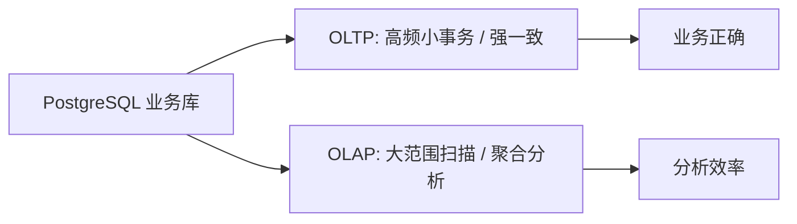

# 4. OLTP vs OLAP：大数据系统的第一分水岭

::: tip 本章导读
解释业务交易和分析计算为什么会分化，以及 PostgreSQL 与 OLAP 系统如何分工。
:::
::: info 本章验收问题
- 你能否解释为什么一个系统很难同时做好高频事务和复杂分析？
- 你能否判断一个查询应该留在 PostgreSQL 还是迁入 OLAP？
:::




PostgreSQL 可以支撑业务交易，也可以做一定规模分析。

## 问题切入

但当业务增长后，一个数据库很难同时把两类目标做到极致：高频小事务和大范围复杂分析。

这就是 OLTP 和 OLAP 分化的根源。

在第 3 章中，我们看到 PostgreSQL 可以通过索引、分区、物化视图和执行计划分析继续支撑大表。但这些机制仍然工作在同一个数据库内部：业务交易、运营报表、临时分析和历史扫描都在争抢同一套 CPU、内存、I/O、锁和连接资源。

一个典型事故是：运营同学在工作日上午运行了一条过去一年订单明细 JOIN 商品、用户、支付和活动表的分析 SQL。查询本身没有错，但它扫描大量历史数据、占用缓存和 I/O，导致创建订单、查询订单详情、更新支付状态的接口延迟升高。

这时问题已经不是“再加一个索引能不能解决”，而是系统目标发生了冲突：

```text
业务系统希望每笔交易低延迟、强一致、稳定写入。
分析系统希望扫描大量历史数据、自由组合维度、批量计算指标。
```

## 核心判断

> OLTP 和 OLAP 不是两个时髦分类，而是两类负载目标的系统分工。

OLTP 和 OLAP 的分化，本质上不是数据库产品分类，而是数据系统在读写模式、延迟目标、一致性目标、建模方式和团队协作上的分工。

OLTP 解决的是业务事实能否被可靠创建、修改和查询；OLAP 解决的是历史事实能否被高效扫描、聚合、分析和复用。它们都重要，但优化方向不同。试图让一个业务库长期承担所有交易和所有分析，通常会把两类目标都拖慢。

## 机制解释

## 本章内容

| 节号 | 主题 |
|------|------|
| [04.1](/chapters/04/04-1) | 为什么一个数据库很难同时做好交易和分析 |
| [04.2](/chapters/04/04-2) | 从单机到分工：系统的自然演化 |
| [04.3](/chapters/04/04-3) | OLTP的本质：面向业务事务 |
| [04.4](/chapters/04/04-4) | OLTP的数据模型：规范化与关系设计 |
| [04.5](/chapters/04/04-5) | OLTP的优化策略 |
| [04.6](/chapters/04/04-6) | OLAP的本质：面向分析查询 |
| [04.7](/chapters/04/04-7) | OLAP的数据模型：维度建模与宽表 |
| [04.8](/chapters/04/04-8) | OLAP的优化策略 |
| [04.9](/chapters/04/04-9) | OLTP与OLAP的系统分工 |
| [04.10](/chapters/04/04-10) | 如何判断应该用OLTP还是OLAP |


## 系统位置

本章是全书第一条系统分水岭。

第 1-3 章都还在 PostgreSQL 内部展开：表、约束、事务、SQL、大表、索引、分区、执行计划。到第 4 章，读者需要意识到：有些问题不是继续优化业务库就能优雅解决的，而是需要把交易处理和分析处理拆到不同系统中。

这一步会引出后续所有数据平台主题：

| 后续章节 | 从 OLTP/OLAP 分化继承的问题 |
| --- | --- |
| 数仓建模 | 业务库表结构不等于分析模型，需要事实表、维度表和指标口径 |
| ETL / ELT | 数据要从 OLTP 系统稳定进入分析系统 |
| 批处理 | 大规模历史数据加工需要分布式计算 |
| 实时处理 | 业务变更和事件需要低延迟进入分析链路 |
| OLAP 数据库 | 多维聚合和交互式查询需要列式、预聚合、MPP 或本地向量化执行 |
| 湖仓 | 长期低成本存储和多引擎访问需要开放表格式和 Catalog |

因此，本章不是在劝读者“放弃 PostgreSQL”，而是在建立系统分工判断：PostgreSQL 继续作为业务事实源，分析系统承担历史分析、跨域建模和指标生产。

## 场景案例

以订单系统为例，业务链路和分析链路应该逐步拆开。

业务链路负责处理当前交易：

```text
用户下单
  -> PostgreSQL 创建 orders / order_items
  -> 支付成功后更新 payments / orders
  -> 库存扣减
  -> 订单状态流转
```

这里最重要的是低延迟、一致性和失败可恢复。订单不能重复创建，库存不能扣错，支付状态不能丢。

分析链路负责处理历史事实：

```text
PostgreSQL 订单、支付、商品、用户数据
  -> ETL / CDC 同步
  -> 数仓明细层和汇总层
  -> ClickHouse / Doris / Trino / Spark SQL
  -> BI 看板、经营分析、指标服务
```

这里最重要的是大范围扫描、多维聚合、统一口径和可复用。运营可以分析最近一年 GMV，增长团队可以分析渠道转化，财务可以核对支付金额，算法团队可以生成用户特征。

这两个链路共享同一批业务事实，但不应该长期共享同一套查询负载。合理分工后，PostgreSQL 负责把事实写对，OLAP 和数仓负责把事实分析清楚。

## 常见误区

**误区一：OLAP 比 OLTP 更高级。**

它们不是高低关系，而是目标不同。OLTP 负责业务正确，OLAP 负责分析效率。

**误区二：上了 ClickHouse 就不需要数仓建模。**

ClickHouse 是分析数据库，不会自动解决事实表、维度表、指标口径、数据质量和血缘治理。

**误区三：业务库不能做任何报表。**

业务库可以做轻量分析和运营查询，问题是不能无限承担所有复杂分析。

**误区四：OLTP 和 OLAP 分离只是性能优化。**

性能只是表层原因。更深层原因是负载目标、建模方式、团队协作和数据治理都不同。

## 实战任务

把以下查询分成 OLTP 和 OLAP：

```text
查询某个用户最近 20 笔订单
更新订单支付状态
统计最近一年每日 GMV
计算用户 7 日留存
查询某个商品库存
统计商品销量排行榜
按城市和渠道分析新用户转化
创建订单并扣减库存
```

复盘问题：

- 哪些查询需要低延迟和强一致？
- 哪些查询需要扫描大量历史数据？
- 哪些查询应该留在 PostgreSQL？
- 哪些查询应该进入 OLAP 或数仓？
- 哪些查询依赖统一指标口径？

进阶任务：为其中两个 OLAP 查询设计迁移方案。

示例：

```text
统计最近一年每日 GMV
  源数据：orders、payments
  同步方式：按支付状态和支付时间同步到数仓
  明细模型：dwd_order_payment_detail
  汇总模型：dws_order_daily
  应用模型：ads_sales_dashboard
  查询引擎：ClickHouse / Doris / Trino
```

复盘时重点回答：

- 哪些字段必须从业务库同步？
- 使用创建时间还是支付时间？
- 退款、取消、测试订单如何处理？
- 结果允许多大延迟？
- 如果报表数字和业务库临时查询不一致，应该如何追踪血缘和口径？

## 小结引出下一章

OLTP 和 OLAP 的分化，是数据系统演化的第一条分水岭。

PostgreSQL 适合业务交易和中小规模分析，但当分析负载、数据规模和团队协作复杂度上升，系统就需要把分析能力迁移到数仓、OLAP 数据库、批处理或湖仓中。

下一章进入数据仓库建模。

因为把数据同步出去只是第一步，真正困难的是：如何把业务表重构成稳定、可分析、可复用的分析模型。
