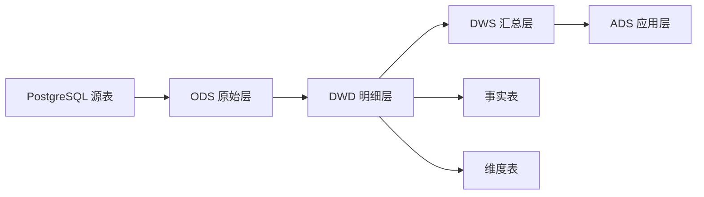

# 5. 数据仓库建模：从表设计到分析建模

::: tip 本章导读
把业务表重构成事实表、维度表、分层模型和稳定指标体系。
:::
::: info 本章验收问题
- 你能否把业务表重构成事实表、维度表和分层模型？
- 你能否说明指标口径应该沉淀在哪一层，而不是散落在报表里？
:::




业务库设计关注业务正确。

数仓设计关注分析效率、指标口径和数据复用。

## 问题切入

第 4 章说明了为什么业务交易和分析计算要分工。但把数据从 PostgreSQL 同步到另一个系统，并不自动得到一个可用的数据仓库。

如果只是把业务库表原样复制一份，分析团队很快会遇到新问题：

```text
orders 表一行是一笔订单，order_items 一行是订单商品明细，GMV 应该从哪张表算？
支付成功时间、订单创建时间、发货时间都存在，日报应该按哪个时间统计？
用户等级会变化，历史订单应该看当时等级还是当前等级？
运营、财务、增长团队都写 GMV，为什么结果不一样？
一个报表字段出错时，怎样知道它来自哪个源表和哪条任务？
```

这些问题不是查询引擎能单独解决的。ClickHouse、Spark、Trino 可以让查询更快，但不会自动告诉你业务过程、分析粒度、指标口径和数据责任应该如何设计。

## 核心判断

数仓不是复制业务库，而是把业务系统中的对象、事件和关系重构成可分析的数据语义。

> 数仓建模的核心，不是多建几层表，而是让业务过程、分析粒度、指标口径和数据责任变得清晰。

业务库的订单表和支付表，直接拿来算 GMV 会出问题——该关联哪个时间字段？退款要不要扣？这一章要解决的问题是：数据进入分析系统后，应该如何组织才能让指标口径清晰、复用方便、口径统一、维护成本可控。

数仓建模也不是万能的。它不能替代源系统正确性，不能让错误数据自动变正确，不能省掉 ETL/ELT、调度、质量校验和权限治理。它负责把数据进入分析系统之后的组织方式设计清楚。

## 机制解释

### 5.1 为什么业务库不能直接做分析

公司开始做数据分析时，最常见的做法是直接连业务库跑 SQL。运营总监要 GMV 报表，数据分析师要用户留存，技术经理说"直接查业务库就行了"。这看起来省钱省事，但三周后你就会发现问题：高峰期一个分析查询把业务库 CPU 打满，用户下单超时，客服电话被打爆。

业务库不适合做分析，这不是理论，是无数团队踩过的坑。四个层面来理解。

#### 业务库的优化目标和分析需求是相反的

业务库（OLTP）的优化目标是快速写入和单行查询。为了实现每秒 1000 个订单的写入吞吐，索引要少，事务要小，数据模型要规范化——用户一张表、订单一张表、商品一张表，通过主键和外键关联。

分析查询却是另一回事。它需要大范围扫描（"最近 30 天的所有订单"），需要复杂聚合（分组、求和、窗口函数），需要灵活组合维度（按日期、按城市、按品类）。这恰好是业务库最不擅长的操作。

当你在业务库上跑这个查询：

```sql
SELECT
    date(created_at) as order_date,
    sum(total_amount) as gmv,
    count(*) as order_count
FROM orders
WHERE created_at >= CURRENT_DATE - INTERVAL '30 days'
GROUP BY date(created_at);
```

你正在扫描 3000 万行。业务库的索引帮不上忙（全表扫描场景），规范化设计导致你需要 JOIN 三张表才能拿到城市和品类，而每次 JOIN 都在消耗已经紧张的 CPU。

#### 分析查询会抢占业务事务的资源

这是最要命的问题，而且经常被低估。上午 9 点运营同学跑 GMV 报表，正好撞上用户下单高峰期。分析查询的 5 分钟全表扫描占用了大量 CPU、内存和磁盘 I/O，订单写入的响应时间从 50ms 飙升到 500ms。用户看到"提交订单"转圈 5 秒，10% 的人会放弃。

这不是一个技术问题，是一个业务损失问题。而解决方案并不是"让运营下午再查"——运营需要早上的数据来决策今天的促销策略。

#### 业务库的数据模型是为了写入，不是为了分析

规范化设计（3NF）是业务库的标配。但分析查询面对规范化模型是一场灾难：

```sql
-- 分析查询：GMV按用户、商品维度
SELECT
    u.name as user_name,
    p.name as product_name,
    sum(o.total_amount) as gmv
FROM orders o
JOIN users u ON o.user_id = u.user_id
JOIN products p ON o.product_id = p.product_id
WHERE o.created_at >= '2026-01-01'
GROUP BY u.name, p.name;
```

这个查询在 5000 万行订单表上做两次 JOIN，再加聚合。数据仓库的做法完全不同：把用户和商品的描述信息冗余到一张宽表里（维度建模），查询时不需要 JOIN，直接扫描、直接聚合。

#### 业务库不保留历史数据

业务库通常只保留最近 3-6 个月的热数据。旧数据归档或者直接删除。当你需要分析去年同期数据做同比时，发现数据已经不存在了。而且业务库的数据是可变的——订单状态会从 pending 变成 paid 变成 refunded，商品价格会被 UPDATE 覆盖。你永远无法还原"去年双十一那天的价格是多少"。

数据仓库的定位恰恰相反：写入后不修改，保留全量历史，记录每个时间点的快照。

#### 业务库 vs 数据仓库：不是二选一，是分工

> 业务库（OLTP）面向业务事务，优化写入和简单查询。数据仓库（OLAP）面向分析查询，优化复杂查询和大数据量扫描。两者定位不同，通过 ETL 连接，各司其职。

下面这张表总结了核心差异：

| 维度 | 业务库（OLTP） | 数据仓库（OLAP） |
|------|-----------------|----------|
| **定位** | 支撑业务运行 | 支撑数据分析 |
| **用户** | 业务系统、前台用户 | 数据分析师、运营、管理层 |
| **数据时效** | 当前状态 | 历史快照 |
| **数据量** | GB 级，保留 3 个月 | TB 级，保留全量历史 |
| **查询模式** | 点查（WHERE id = ?），返回 1-N 行 | 扫描聚合（GROUP BY + SUM），扫描亿行返回百行 |
| **并发** | 每秒数千次 | 每小时十几次 |
| **响应时间** | < 100ms | 秒级到分钟级 |
| **数据模型** | 规范化（3NF） | 维度建模（星型模型） |
| **数据可变性** | 频繁 UPDATE/DELETE | 几乎不修改 |

#### 数据仓库的价值

建设数据仓库的投入是真实的：一台服务器年费 2 万，ETL 开发 2 人月，持续运维 0.2 人月。年成本大约 6-7 万。收益是什么？

**性能隔离**。分析查询在数据仓库跑，不碰业务库。订单写入响应时间不受分析影响。

**历史数据**。保留 3 年甚至 5 年的全量数据，支持同比、环比、长期趋势分析。

**数据质量**。通过 ETL 清洗统一编码、修复缺失值、过滤无效数据。所有分析使用同一份清洗过的数据，口径一致。

**分析能力**。列式存储、分区表、物化视图、并行计算——数据仓库的优化方向和分析需求天然匹配。同样的查询，从 10 分钟降到 5 秒是正常的预期。

#### 常见误区

**"小公司不需要数据仓库"**。决定因素是分析需求，不是公司规模。一个 10 人团队也可能需要分析 2 亿行事件数据。而且开源方案（ClickHouse、Doris）的成本低到可以忽略。

**"数据仓库可以替代业务库"**。不行。数据仓库是为分析优化的，它不做事务、不保证 ACID、不支持高并发点查。你把业务流量打到数据仓库上，性能会比直接查业务库还差。

**"有了数据仓库，业务库可以简化"**。也不行。业务库仍然需要完整的事务支持、规范化的数据模型、高并发写入能力。数据仓库是补充，不是替代。

#### 小结

业务库不适合做分析的根本原因：优化方向相反（写入 vs 扫描）、资源争抢（分析查询影响业务）、模型不匹配（规范化 vs 维度建模）、数据不完整（热数据 vs 全量历史）。解决方案是建设独立的数据仓库，通过 ETL 连接两者，各司其职。下一节会深入数据仓库的核心概念——面向主题、集成、相对稳定、反映历史变化这四个特征。

### 5.2 数据仓库的核心概念

上一节我们建立了判断：业务库做分析行不通，需要独立的数据仓库。这一节展开数据仓库到底是什么。

W.H. Inmon 在 1990 年代给出过一个经典定义，用四个特征描述了数据仓库的本质：

> 数据仓库是一个面向主题的、集成的、相对稳定的、反映历史变化的数据集合，用于支持管理决策。

这四个特征不是理论术语——每个特征对应一个工程决策，理解它们你就理解了数仓设计的骨架。

#### 面向主题（Subject-Oriented）

业务库按应用组织数据：订单系统有订单表、支付表，用户系统有用户表、账户表。数据仓库按业务主题组织：销售主题下面整合了订单数据、用户数据、商品数据，客户主题下面整合了用户数据、行为数据、客服数据。

这直接影响查询体验。当你需要分析"GMV 按城市和品类"，在业务库你要 JOIN 三四个系统的表。在数据仓库，销售事实表已经关联好了用户维度（含城市）和商品维度（含品类），你只做 GROUP BY。

#### 集成（Integrated）

数据来自多个源，格式各不相同。订单系统的性别字段用 0/1，用户系统用 M/F，商品系统用男/女。日期格式有 `2026-01-01`，有 `01/01/2026`，有 `20260101`。金额单位有元、有分、有万元。

数据仓库的 ETL 层负责统一这一切。这是数仓建设初期最耗时的部分——不是技术难，是业务逻辑碎。但这一步不做，后面所有分析都是建立在混乱基础上的。

实际的数据清洗包括三类操作：

```sql
-- 统一编码
CASE gender
    WHEN '0' THEN 'M'
    WHEN '1' THEN 'F'
    WHEN '男' THEN 'M'
    WHEN '女' THEN 'F'
    ELSE 'U'
END as gender

-- 统一日期格式
to_date(created_at) as order_date

-- 统一字段命名（不同系统的同一含义字段）
-- prod_id, product_id, item_id -> product_id
```

#### 相对稳定（Non-Volatile）

业务库的数据在持续变化：订单状态从 pending 到 paid 到 shipped，库存数量每秒都在更新。数据仓库不同——数据一旦写入，几乎不修改。

这有两个好处。第一，查询不需要考虑数据正在被修改（没有读写冲突），可以放心做长时间的大查询。第二，数据是可追溯的——你知道 2026 年 1 月 15 日那天 GMV 是多少，而且一年后回来查，结果不变。业务库里查到的永远是当前值，历史已经丢失了。

数据仓库通过快照方式记录变化：

```sql
-- 不修改历史记录，而是追加新的快照
INSERT INTO orders_snapshot (order_id, status, snapshot_date)
VALUES (123, 'paid', '2026-01-01 10:00:00');

INSERT INTO orders_snapshot (order_id, status, snapshot_date)
VALUES (123, 'shipped', '2026-01-01 15:00:00');
```

#### 反映历史变化（Time-Variant）

业务库只有当前状态。数据仓库保留时间维度。商品价格变了，数据仓库记录所有历史价格：

```sql
CREATE TABLE product_price_history (
    product_id INT,
    price NUMERIC(10,2),
    valid_from DATE,
    valid_to DATE
);

-- 查询价格变化历史
SELECT product_id, price, valid_from, valid_to
FROM product_price_history
WHERE product_id = 456
ORDER BY valid_from;
-- 100元 → 120元 → 110元，历史一目了然
```

这个能力决定了数据仓库能做业务库做不了的事：同比分析（今年 vs 去年）、趋势分析（过去 12 个月的变化曲线）、归因分析（价格调整后销量为什么没变化）。

#### 数据仓库的分层架构

几乎所有实际运行的数仓都采用分层设计。经典的阿里巴巴数仓规范定义了四层：

```
数据源 → ODS → DWD → DWS → ADS → 应用
        原始   清洗   汇总   应用   展示
```

**ODS 层（操作数据存储）**：源数据的直接副本，不做任何转换。作用有两个：数据备份（出问题可以重新加载）和隔离源系统（减少对业务库的查询压力）。

**DWD 层（明细数据层）**：清洗后的明细数据。统一编码、过滤无效数据、关联维度表。这是最细粒度的数据，后续所有汇总都从这里出。

**DWS 层（汇总数据层）**：按维度预聚合。比如每日 GMV、每位用户累计消费。作用是加速查询——DWD 层数据太大，每次查询都实时聚合太慢。

**ADS 层（应用数据层）**：面向具体报表和应用的数据。月度 GMV 报表、用户留存表、商品销量排名。数据已经计算好，直接用于展示。

每层独立维护，修改下层不影响上层。DWD 层改了清洗规则，DWS 层的汇总自动更新，ADS 层的报表跟着变。这就是分层的核心价值。

#### 数据仓库 vs 数据湖

在 2026 年，这个对比仍然重要：

| 维度 | 数据仓库 | 数据湖 |
|------|----------|--------|
| **数据类型** | 结构化（关系表） | 所有类型（结构化、半结构化、非结构化） |
| **Schema** | 写入时定义（schema-on-write） | 读取时定义（schema-on-read） |
| **数据质量** | 高（经过 ETL 清洗） | 原始（未清洗） |
| **查询性能** | 好（为分析优化） | 差（面向存储优化） |
| **存储成本** | 较高 | 低（对象存储） |
| **适用场景** | 报表、BI、业务分析 | 数据存储、机器学习、探索 |

实践中的常见组合：数据湖存储原始数据和日志（成本低），数据仓库存储清洗后的结构化数据（查询快）。数据湖做大规模存储和探索，确认有价值的数据再进入数据仓库。

#### 常见误区

**"数据仓库就是一个大数据库"**。数据仓库不是"把多个库的数据倒进一个大库"。它的设计原则（面向主题、维度建模、分层架构）和优化手段（列式存储、物化视图、分区表）和大数据库完全不同。

**"数据仓库可以实时"**。大部分数仓场景是 T+1（今天凌晨处理昨天的数据）或准实时（5-15 分钟延迟）。真正的毫秒级实时分析需要流处理（第 8 章），不是数仓的定位。

**"数据仓库建成后一劳永逸"**。数仓需要持续维护：数据量增长时分区策略要调整，新业务线进来要扩展维度，查询慢了要建物化视图。一个 3 年不维护的数仓，查询性能和刚建时差 10 倍是常事。

#### 小结

数据仓库的四个特征（面向主题、集成、相对稳定、反映历史变化）定义了它和业务库的根本差异。四层架构（ODS-DWD-DWS-ADS）是业界实践的结晶，每层职责明确。下一节会展开数仓的基本术语——维度、度量、事实表、维度表、星型模型、雪花模型，这些是维度建模的核心词汇。

### 5.3 数仓的基本术语

维度建模有一套专门的词汇：维度、度量、事实表、维度表、星型模型、雪花模型、粒度。这套词汇不是学院派术语堆砌——每个词对应一个具体的表设计决策。把这些术语搞清楚，动手建数仓时才知道每个字段该放在哪张表里。

#### 维度和度量

这是最基础的两个概念。

**维度（Dimension）**回答"在什么条件下"的问题。日期、城市、产品品类、用户分群——这些都是维度。维度的特征是：取值有限（离散值），用来做 GROUP BY 和 WHERE 过滤。

**度量（Measure）**回答"是多少"的问题。GMV、订单数、利润、客单价——这些都是度量。度量的特征是：数值型，可聚合（SUM、COUNT、AVG、MAX）。

一个简单的分辨方法：看它能不能放进 GROUP BY。能的是维度，不能的是度量。

```sql
SELECT
    date(order_date) as 维度_日期,
    user_city as 维度_城市,
    sum(order_amount) as 度量_GMV,
    count(*) as 度量_订单量
FROM fact_orders f
JOIN dim_users u ON f.user_id = u.user_id
WHERE order_date >= '2026-01-01'
GROUP BY date(order_date), user_city;
```

实践中需要注意的细节：并非所有数值都是度量，年龄可以作为维度（GROUP BY age_group），因为它描述的是"谁"，不是"多少"。反过来，某些计数可以是度量（订单数、用户数），因为它们是聚合的结果。

#### 事实表和维度表

**事实表（Fact Table）**存储业务事件和度量数据。每一行代表一个真实的业务事件——一笔订单、一次页面浏览、一次登录。事实表的数据量是最大的，每天以百万到千万行的速度增长。

事实表有三种类型：

- **事务事实表**：记录每个业务事件。订单事实表（每行 = 一笔订单），页面浏览事实表（每行 = 一次PV）。这是最常见、最细粒度的事实表。
- **周期快照事实表**：记录定期状态。库存快照表（每天一张快照），账户余额表（每月一张快照）。适合分析趋势变化。
- **累积快照事实表**：记录一个业务过程的完整生命周期。订单生命周期表（从 created 到 paid 到 shipped 到 delivered 的时间点）。适合分析流程效率和瓶颈。

**维度表（Dimension Table）**存储描述信息。数据量相对小（百万级 vs 事实表的亿级），更新频率低，但查询时 JOIN 频率高。

一个典型的订单事实表和它的维度表：

```sql
-- 事实表
CREATE TABLE fact_orders (
    order_id BIGINT,
    date_id INT,           -- 关联 dim_date
    user_id BIGINT,        -- 关联 dim_users
    product_id BIGINT,     -- 关联 dim_products
    order_amount NUMERIC(10,2),  -- 度量
    order_quantity INT           -- 度量
);

-- 维度表
CREATE TABLE dim_date (
    date_id INT PRIMARY KEY,
    date_value DATE,
    year INT, quarter INT, month INT, day INT,
    is_holiday BOOLEAN,
    is_weekend BOOLEAN
);

CREATE TABLE dim_users (
    user_id BIGINT PRIMARY KEY,
    user_name VARCHAR(100),
    user_city VARCHAR(100),
    user_segment VARCHAR(50)
);

CREATE TABLE dim_products (
    product_id BIGINT PRIMARY KEY,
    product_name VARCHAR(100),
    product_category VARCHAR(100),
    product_brand VARCHAR(100)
);
```

#### 星型模型和雪花模型

**星型模型（Star Schema）**：事实表在中心，所有维度表直接连接事实表。查询时每个维度只需要一次 JOIN。维度表反规范化——允许冗余（比如用户表里同时存 city 和 province），换取查询性能。

```
         商品维度表
              |
用户维度表 — 事实表 — 日期维度表
              |
         渠道维度表
```

星型模型是数据分析场景的默认选择。查询简单（SQL 清晰），性能好（JOIN 次数少），维护成本低。

**雪花模型（Snowflake Schema）**：维度表进一步规范化。比如商品维度拆成"商品表 → 三级分类表 → 二级分类表 → 一级分类表"。好处是节省存储空间，减少数据冗余。代价是查询需要多层 JOIN，SQL 变复杂，执行时间变长。

```sql
-- 雪花模型：商品查询需要 JOIN 三层
SELECT p.product_name, c3.category_name, c2.category_name
FROM fact_orders f
JOIN dim_products p ON f.product_id = p.product_id
JOIN dim_category_l3 c3 ON p.category_l3_id = c3.category_l3_id
JOIN dim_category_l2 c2 ON c3.category_l2_id = c2.category_l2_id;
```

实践证明，大多数情况下选星型模型就够了。只有当维度表自身非常大（比如 1000 万行的产品表），且维度属性经常独立变化时，才值得用雪花模型。存储成本已经很低了，为了省几十 MB 的空间牺牲查询性能不划算。

#### 粒度（Granularity）

粒度是事实表中每一行代表什么业务含义。这是一个设计决策，一旦确定就很难改。

- **订单粒度**：每行 = 一笔订单。可以回答"单笔订单金额是多少"。
- **日粒度**：每行 = 一天的汇总。只能回答"每天 GMV 多少"，不能下钻到单笔订单。
- **订单-商品粒度**：每行 = 一笔订单中的一个商品。可以回答"每个商品的销量"和"每笔订单包含哪些商品"。

粒度的选择原则很简单：事实表用最细粒度。你永远可以从细粒度汇总到粗粒度（`GROUP BY date_id`），但无法从粗粒度下钻到细粒度。汇总工作留给 DWS 层。

#### 数据立方体、下钻和上卷

当你有多个维度和一个度量，组合起来就是一个多维数据立方体。比如三个维度"时间 x 地区 x 产品"，加上度量"GMV"。

- **切片（Slice）**：固定一个维度。只看"北京"的数据。
- **切块（Dice）**：固定多个维度。看"2026 年 1 月北京地区电子产品"的数据。
- **下钻（Drill-down）**：从粗到细。从"年度 GMV"下钻到"月度 GMV"，再下钻到"每日 GMV"。
- **上卷（Roll-up）**：从细到粗。与下钻相反。

这些操作在 SQL 中就是不同的 GROUP BY 组合。BI 工具（Tableau、Metabase）的拖拽分析本质上就是在做这些多维操作。

#### 聚合和预计算

直接查事实表很慢（一次扫描几亿行）。预计算就是把常用的聚合结果提前算好存起来。

```sql
-- 创建物化视图做预计算
CREATE MATERIALIZED VIEW mv_daily_gmv AS
SELECT
    order_date,
    sum(order_amount) as gmv
FROM fact_orders
GROUP BY order_date;

-- 查询物化视图比查事实表快 100 倍以上
SELECT * FROM mv_daily_gmv WHERE order_date >= '2026-01-01';
```

预计算的核心决策不是"要不要做"，而是"哪些指标值得预计算"。经验规则：每天被查询超过 10 次的聚合，预计算。偶尔查一次的，没必要。

#### 常见误区

**"维度只能是文本"**。维度可以是数字（年龄、年份），关键在于它用于分组，不用于聚合。年龄在用户画像分析中就是维度（GROUP BY age_group）。

**"星型模型一定比雪花模型好"**。星型模型是大多数场景的正确选择，但在维度表非常大且属性频繁变化的场景，雪花模型有其合理性。关键在于判断标准不是"哪个模型更好"，而是"你的维度表多大、变化多频繁"。

**"事实表只能有一个"**。一个数仓通常有多个事实表，每个对应一个业务过程——订单事实表、浏览事实表、支付事实表。它们共享一致性维度（同一个用户维度表、同一个时间维度表），可以跨事实表做关联分析。

#### 小结

维度和度量是维度建模的基本元素，事实表和维度表是物理实现，星型模型和雪花模型是两种组织方式。粒度决定了你能回答什么层次的问题。这些术语贯穿后续所有章节——第 5.7-5.10 节会详细展开每种设计模式的实现。下一节回到数仓架构本身，讲分层的必要性：为什么要分 ODS/DWD/DWS/ADS 四层。

### 5.4 数仓分层的必要性

当你的 ETL 任务从一个变成十个，再从十个变成一百个，你会开始感受到"不分层"的痛苦。三个问题会浮现：复杂度爆炸、重复逻辑、一改全改。

#### 不分层的三个问题

**复杂度爆炸**。一个 SQL 同时包含数据清洗（过滤无效订单、排除已删除用户）、数据转换（日期格式统一、字段命名规范）、数据聚合（按天 GROUP BY、SUM 求 GMV）。这个 SQL 轻松写到 100 行，6 个月后没人看得懂：

```sql
-- 所有逻辑混在一个 SQL 里
SELECT
    date_part('year', o.created_at) as year,
    date_part('month', o.created_at) as month,
    u.city,
    p.category,
    sum(o.amount) as gmv
FROM orders o
JOIN users u ON o.user_id = u.user_id
JOIN products p ON o.product_id = p.product_id
WHERE o.status = 'completed'
  AND o.created_at >= '2026-01-01'
  AND u.is_deleted = false
  AND p.is_active = true
GROUP BY ...;
```

**重复逻辑**。GMV 日报、GMV 周报、GMV 月报、用户 GMV 排名、商品 GMV 排名——五个报表，每个都要重复相同的 JOIN 和 WHERE 条件。清洗规则改了（比如"排除退款订单"），你要改五个地方。改漏一个，报表数据就不一致。

**一改全改**。业务规则变更——"已完成订单"的定义从 `status = 'completed'` 变成 `status IN ('completed', 'paid')`。不分层架构下，每个用到这个规则的报表都要改。一个中等规模的数仓可能有 30+ 个报表，漏改是大概率事件。

#### 分层的本质：关注点分离

分层不是为了"看起来专业"，是为了把不同职责的代码隔离开。经典四层架构的职责是：

**ODS 层（操作数据存储）**：源数据副本，不做任何清洗。职责 = 备份 + 隔离源系统。

**DWD 层（明细数据层）**：清洗、统一、关联。职责 = 把原始数据变成可用的明细数据。

**DWS 层（汇总数据层）**：按维度预聚合。职责 = 把常用汇总提前算好，避免每次查询都扫描 DWD 层全量数据。

**ADS 层（应用数据层）**：面向具体报表和应用。职责 = 准备好最终数据，BI 工具直接查询。

层级之间的数据流是单向的：

```
数据源 → ODS → DWD → DWS → ADS → 应用
```

分层后，前面的问题全部消失：

```sql
-- DWD 层：清洗一次，所有下游复用
CREATE TABLE dwd_orders AS
SELECT o.order_id, o.created_at, u.user_id, p.product_id, o.amount
FROM orders o
JOIN users u ON o.user_id = u.user_id
JOIN products p ON o.product_id = p.product_id
WHERE o.status = 'completed'
  AND u.is_deleted = false
  AND p.is_active = true;

-- DWS 层：汇总一次
CREATE TABLE dws_daily_gmv AS
SELECT date_trunc('day', created_at) as order_date,
       sum(amount) as gmv
FROM dwd_orders
GROUP BY date_trunc('day', created_at);

-- ADS 层：面向应用
CREATE TABLE ads_monthly_gmv AS
SELECT date_part('year', order_date) as year,
       date_part('month', order_date) as month,
       sum(gmv) as gmv
FROM dws_daily_gmv
GROUP BY year, month;
```

业务规则改了，只改 DWD 层的 SQL 一次，所有下游自动生效。

#### 各层设计要点

**ODS 层**：表结构与源系统完全一致，新增两个技术字段——`etl_time`（同步时间戳）和 `etl_source`（数据来源）。ODS 不做任何 WHERE 过滤、不做任何 CASE WHEN 转换。它的价值在于：当 DWD 层数据处理出错时，可以从 ODS 重新加载。

```sql
CREATE TABLE ods_orders (
    -- 与源系统字段一致
    order_id BIGINT,
    user_id BIGINT,
    amount NUMERIC(10,2),
    status VARCHAR(50),
    -- 技术字段
    etl_time TIMESTAMP DEFAULT CURRENT_TIMESTAMP,
    etl_source VARCHAR(100) DEFAULT 'mysql_orders'
);
```

**DWD 层**：这是最累的一层，也是质量最关键的一层。三个操作：清洗（过滤无效数据、补全 NULL、修正错误类型）、统一（统一编码和命名）、关联（JOIN 维度表，把维度外键补上）。

**DWS 层**：只预计算高频查询。每日 GMV——所有报表的基础指标——必须预计算。年度用户留存——每月查一次——可以不用。经验规则：每天被查超过 5 次的汇总，进 DWS 层。

**ADS 层**：每个报表一个表。表名和字段名用业务语言（`ads_monthly_gmv_report` 比 `ads_metric_12` 好一万倍）。查询 ADS 层不需要 JOIN，不需要 GROUP BY，不需要窗口函数——拿来就用。

#### 分层的实际收益

用一个真实场景来感受收益。一个电商数仓有 10 个报表：GMV 日报、GMV 周报、GMV 月报、用户 GMV 排名、商品 GMV 排名、渠道 GMV、用户留存、转化漏斗、商品关联、购物篮分析。

**不分层**：每个报表 SQL 平均 80 行，10 个报表 = 800 行。相同的清洗逻辑（7 个 JOIN + 5 个 WHERE）重复 10 次。

**分层后**：DWD 20 行 + DWS 20 行 + ADS 30 行 + 10 个报表每个 10 行 = 170 行。代码量减少 78%。业务规则变更时修改量减少 90%。

性能收益同样显著。查询 2026 年 1 月 GMV：直接查 DWD 层（扫描 3000 万行，耗时 10 秒），查 DWS 层（扫描 31 行，耗时 100ms）。100 倍。

#### 常见误区

**"分层越多越好"**。四层（ODS-DWD-DWS-ADS）覆盖 90% 的场景。大团队可能加一个 DIM 层（公共维度层）。超过五层的架构通常是过度设计——每增加一层就增加一份数据冗余和维护成本。

**"小项目不需要分层"**。如果只有 3 个报表、2 张源表、数据量不到 100 万行，确实可以 ODS + DWD 两层走。但一旦报表数超过 5 个或数据量超过千万级，DWS 层的预计算就开始有价值了。分层的程度和项目规模成正比。

**"ODS 层可以省略"**。建议保留。ODS 的成本极低（就是源数据的一个副本），但它的价值在于回滚——DWD 层处理出问题，你不用重新从源库拉数据（可能已经变了），直接从 ODS 重新加载。

#### 小结

分层是关注点分离在数仓领域的应用。ODS 管备份，DWD 管清洗，DWS 管预计算，ADS 管应用。分层让你的 ETL 代码从 800 行变 170 行，业务规则变更从改 10 处变改 1 处。下一节展开各层的详细设计——ODS 怎么同步、DWD 怎么清洗、DWS 怎么汇总、ADS 怎么交付。

### 5.5 常见分层模型详解

上一节讲了分层的必要性。这一节展开 ODS、DWD、DWS、ADS 四层各自该怎么做。

#### ODS 层：原始副本，不做加工

ODS（Operational Data Store）的职责只有一个：把源数据搬过来，原封不动存好。

设计原则很简单。表结构跟源系统保持一致，不做字段重命名、不做类型转换、不做 CASE WHEN。唯一新增的是 `etl_time`（同步时间戳）和 `etl_source`（来源标识）。ODS 可以按同步日期分区，方便按天管理：

```sql
CREATE TABLE ods_orders (
    order_id BIGINT PRIMARY KEY,
    user_id BIGINT,
    total_amount NUMERIC(10,2),
    order_status VARCHAR(50),
    created_at TIMESTAMP,
    -- 技术字段
    etl_time TIMESTAMP DEFAULT CURRENT_TIMESTAMP,
    etl_source VARCHAR(100) DEFAULT 'mysql_orders'
) PARTITION BY RANGE (etl_time);
```

同步策略建议全量加增量组合：首次全量同步，之后每天增量同步（基于源表的 `updated_at` 字段拉取变化数据）。不要直接在 ODS 上做 CDC 实时同步——ODS 的定位是批处理层面的缓冲层，实时同步应该直接对接流处理通道（第 8 章）。

#### DWD 层：数据清洗和维度关联

DWD（Data Warehouse Detail）是整个数仓质量的生命线。这里做三件事。

**数据清洗**——三种典型操作：

```sql
-- 1. 过滤无效数据
WHERE order_status IN ('completed', 'paid')
  AND user_id IS NOT NULL
  AND amount > 0

-- 2. 补全缺失值
COALESCE(amount, 0) as amount
COALESCE(created_at, CURRENT_TIMESTAMP) as created_at

-- 3. 修正数据类型
CAST(amount AS NUMERIC(10,2))
CAST(created_at AS TIMESTAMP)
```

**数据统一**——处理多源异构：

```sql
-- 性别编码统一
CASE gender
    WHEN '0' THEN 'M'
    WHEN '1' THEN 'F'
    WHEN '男' THEN 'M'
    WHEN '女' THEN 'F'
    ELSE 'U'
END as gender

-- 字段命名统一（两个源系统的不同字段名 → 同一个输出字段）
SELECT prod_id as product_id, prod_name as product_name FROM mysql_products
UNION ALL
SELECT item_id as product_id, item_name as product_name FROM oracle_inventory
```

**数据关联**——JOIN 维度表，补充维度外键。这一步的意义在于：DWD 层之后的查询不再需要 JOIN 维度表做关联，直接按维度外键过滤即可。

```sql
INSERT INTO dwd_fact_orders
SELECT
    o.order_id,
    d.date_id,
    u.user_id,
    p.product_id,
    o.amount
FROM ods_orders o
JOIN dim_date d ON to_date(o.created_at) = d.date_value
JOIN dim_users u ON o.user_id = u.user_id
JOIN dim_products p ON o.product_id = p.product_id;
```

#### DWS 层：预计算常用汇总

DWS（Data Warehouse Summary）解决的核心矛盾：DWD 层数据量太大（亿级），每次查询都聚合太慢。解决方法——把高频查询的聚合结果提前算好。

三种最常见的汇总维度：

```sql
-- 按时间汇总：每日 GMV
CREATE TABLE dws_daily_gmv AS
SELECT order_date,
       sum(order_amount) as gmv,
       count(*) as order_count,
       count(DISTINCT user_id) as user_count
FROM dwd_fact_orders
GROUP BY order_date;

-- 按用户汇总：每个用户的累计消费
CREATE TABLE dws_user_gmv AS
SELECT user_id,
       sum(order_amount) as total_gmv,
       count(*) as order_count,
       min(order_date) as first_order_date,
       max(order_date) as last_order_date
FROM dwd_fact_orders
GROUP BY user_id;

-- 按商品汇总：每个商品的销量
CREATE TABLE dws_product_gmv AS
SELECT product_id,
       sum(order_amount) as total_gmv,
       sum(order_quantity) as total_quantity
FROM dwd_fact_orders
GROUP BY product_id;
```

DWS 层的取舍原则：高频查询（每天被查 5 次以上）必须预计算，低频查询（每周查一次）可以实时聚合。不要把所有能汇总的都提前算好——存储成本和管理成本也是成本。

#### ADS 层：面向应用交付

ADS（Application Data Store）是数据仓库的"门面"。这一层的表直接对接 BI 工具、报表系统和管理驾驶舱。

ADS 层的表应该做到"拿来即用"——不需要 JOIN、不需要 GROUP BY、不需要窗口函数。每个报表对应一张或几张 ADS 表。

几个典型设计：

```sql
-- 月度 GMV 报表：同比分析
CREATE TABLE ads_monthly_gmv_report AS
SELECT
    year, month,
    sum(gmv) as gmv,
    -- 同比：去年同月 GMV 和增长率
    lag(sum(gmv), 12) OVER (ORDER BY year, month) as last_year_gmv,
    (sum(gmv) - lag(sum(gmv), 12) OVER (ORDER BY year, month))
        / lag(sum(gmv), 12) OVER (ORDER BY year, month) as yoy_growth_rate
FROM dws_daily_gmv
GROUP BY year, month;

-- 商品销量排名
CREATE TABLE ads_product_sales_ranking AS
SELECT
    p.product_id, p.product_name,
    sum(f.order_quantity) as total_sales,
    rank() OVER (ORDER BY sum(f.order_quantity) DESC) as sales_rank
FROM dwd_fact_orders f
JOIN dim_products p ON f.product_id = p.product_id
GROUP BY p.product_id, p.product_name;

-- 用户留存报表
CREATE TABLE ads_user_retention AS
WITH cohort_users AS (
    SELECT user_id, min(order_date) as cohort_date
    FROM dwd_fact_orders
    GROUP BY user_id
),
retention AS (
    SELECT c.user_id, c.cohort_date,
           count(DISTINCT f.order_date) as active_days
    FROM cohort_users c
    LEFT JOIN dwd_fact_orders f ON c.user_id = f.user_id
        AND f.order_date >= c.cohort_date
        AND f.order_date < c.cohort_date + INTERVAL '30 days'
    GROUP BY c.user_id, c.cohort_date
)
SELECT cohort_date,
       count(*) as cohort_size,
       count(*) FILTER (WHERE active_days >= 1) as day1_retention,
       count(*) FILTER (WHERE active_days >= 7) as day7_retention,
       count(*) FILTER (WHERE active_days >= 30) as day30_retention
FROM retention
GROUP BY cohort_date;
```

#### 完整数据流示例

从源订单到 GMV 报表的完整路径：

```sql
-- ODS: 原始订单
CREATE TABLE ods_orders AS SELECT * FROM source_orders;

-- DWD: 清洗 + 关联维度
CREATE TABLE dwd_fact_orders AS
SELECT order_id, to_date(created_at) as order_date,
       user_id, product_id, amount
FROM ods_orders
WHERE status = 'completed';

-- DWS: 每日 GMV
CREATE TABLE dws_daily_gmv AS
SELECT order_date, sum(amount) as gmv, count(*) as order_count
FROM dwd_fact_orders
GROUP BY order_date;

-- ADS: 月度 GMV 报表
CREATE TABLE ads_monthly_gmv_report AS
SELECT date_part('year', order_date) as year,
       date_part('month', order_date) as month,
       sum(gmv) as gmv
FROM dws_daily_gmv
GROUP BY year, month;
```

查询 GMV 的性能对比：直接查 DWD 层 = 扫描 3000 万行，10 秒。查 DWS 层 = 扫描 31 行，100ms。100 倍提升，这就是 DWS 层预计算的价值。

#### 常见误区

**"ODS 层可以省略"**。建议保留。ODS 是你唯一能回溯数据的地方。DWD 处理出错，不用重新从源库拉数据（源库可能已经变化了甚至数据被删了），直接从 ODS 重做。

**"DWD 层也可以做汇总"**。不行。DWD 管清洗，DWS 管汇总，职责要分离。混在一起会导致：别人不知道你的 DWD 表到底干不干净（是原始明细还是已经汇总过了），不敢复用。

**"DWS 层汇总越细越好"**。只预计算高频查询。一个数仓可能有 50 个维度的排列组合，你不可能全算好。用"每天被查询超过 5 次"做筛选标准。

**"ADS 可以替代 DWS"**。ADS 是应用专用的（一张表给一个报表），DWS 是公用的（一张表给多个报表复用）。把 DWS 的汇总直接放到 ADS 里也行，但其他报表想用这个汇总就得重算一遍。

#### 小结

ODS 做原始备份，DWD 做数据清洗，DWS 做预计算，ADS 做应用交付。四层各有清晰边界，数据单向流动。一个中等规模数仓（10 个报表、5 张源表），分层后代码量减少约 80%，维护成本降低约 90%。下一节讨论如何实施这套分层架构——自底向上还是自顶向下，怎么分阶段推进。

### 5.6 分层的实施策略

分层架构设计好了，接下来是怎么落地。实施策略会影响项目节奏、风险控制和团队资源分配。三种策略各有适用场景。

#### 自底向上：稳扎稳打

从 ODS 层开始，一层一层往上建。顺序是 ODS → DWD → DWS → ADS。

这个策略适合数据基础差的团队。好处是风险低——每层建完验证没问题再进入下一层。坏处是见效慢——业务方要等到 ADS 层建好才能看到报表，通常需要 4-6 周。

实施过程：

```sql
-- 第 1 步：建 ODS，验证数据完整
CREATE TABLE ods_orders AS SELECT * FROM source_orders;
SELECT count(*) FROM ods_orders;  -- 确认行数对得上

-- 第 2 步：建 DWD，验证清洗逻辑
CREATE TABLE dwd_fact_orders AS SELECT ... FROM ods_orders WHERE ...;
SELECT count(*) FROM dwd_fact_orders;  -- 确认过滤后的行数合理

-- 第 3 步：建 DWS，验证汇总准确
CREATE TABLE dws_daily_gmv AS SELECT ... FROM dwd_fact_orders GROUP BY ...;
-- 抽查某一天的 sum 和直接查 DWD 层的 sum 是否一致

-- 第 4 步：建 ADS，交付报表
CREATE TABLE ads_monthly_gmv_report AS SELECT ... FROM dws_daily_gmv GROUP BY ...;
```

#### 自顶向下：业务驱动

从业务需求出发，先确定需要哪些报表（ADS 层），再倒推出需要哪些汇总（DWS 层），最后确定需要哪些明细数据（DWD 层）。

这个策略适合业务需求明确、数据基础相对成熟的团队。好处是目标导向——只做业务需要的，不过度设计。坏处是可能遇到"DWS 层汇总不出 ADS 层需要的指标"（因为 DWD 层粒度不够）。

典型流程：

```
需求：月度 GMV 报表、用户留存报表、商品销量排名
  ↓
ADS 层设计：ads_monthly_gmv_report, ads_user_retention, ads_product_ranking
  ↓
DWS 层设计：dws_daily_gmv (支撑 GMV 报表), dws_user_cohort (支撑留存), dws_product_sales (支撑排名)
  ↓
DWD 层设计：dwd_fact_orders (支撑以上所有 DWS 表)
```

关键是 DWD 层要覆盖所有 DWS 层需要的字段和粒度。如果你发现一个 DWS 表需要"订单商品的明细数量"但 DWD 表只有订单级别，说明 DWD 层的粒度设计有问题。

#### 混合策略：最快见效

ODS 层先行（建立数据管道），同时 ADS 层用临时数据快速出报表，DWD 和 DWS 层随后替换掉临时数据。

这是实践中最常用的策略。理由很简单：管理层想尽快看到报表，技术团队需要时间建基础设施。并行推进可以同时满足两者。

具体操作：先用一个简化的 SQL（不做清洗、不做分层、直接查 ODS 或者源库）输出几张核心报表给业务方。同时，后台按自底向上的节奏建 DWD 和 DWS 层。DWD 建好后，把 ADS 层的临时 SQL 切到正式的 DWS 表上。

风险点在于：临时方案可能变成永久方案。必须明确时间线——"临时报表在 2 周内切换为正式 ADS 层"——并在切换日真正执行。

#### 分阶段实施

不管选哪种策略，都建议分阶段推进：

**第一阶段（基础建设，1-2 周）**：建立 ODS 层 + 核心 DWD 层（订单事实表 + 用户/商品/日期维度表）。数据管道跑通，每天能自动同步。

**第二阶段（汇总建设，1-2 周）**：建立 DWS 层。至少覆盖每日 GMV、用户 GMV、商品 GMV 三个汇总维度。这三个汇总能支撑 80% 的日常分析。

**第三阶段（应用建设，2-3 周）**：建立 ADS 层 + BI 报表。月度 GMV 报表、用户留存报表、商品销量排名。开始让业务方使用。

**第四阶段（持续优化）**：性能优化（添加物化视图、调整分区策略）、新增报表、数据质量监控。

优先级排序：核心指标（GMV、订单量）P0，分析指标（留存率、转化率）P1，高级功能（用户画像、关联分析）P2。

#### 数据同步策略

ODS 层的数据同步有三种方式：

**全量同步**：每次把源表全部数据拉过来。实现最简单，但数据量大时耗时长（一张 5000 万行的表全量同步可能需要 30 分钟），影响源库性能。适合小表（< 100 万行）或者非高峰期执行。

**增量同步**：只同步变化数据。基于源表的 `updated_at` 字段，每天凌晨拉取前一天有更新的行。这种方式对源库影响最小，但需要源表有更新时间字段，且无法感知物理删除（行被 DELETE 了，增量检测不到）。

**CDC（Change Data Capture）**：通过数据库的 binlog/WAL 实时捕获变化。DataX、Debezium、Flink CDC 等工具支持。这是最实时的方式（秒级延迟），但实现复杂度最高，维护成本高。批处理场景下（T+1 更新），增量同步通常够用了。

建议：首次全量初始化，之后每天增量同步。对特别大的表（> 1 亿行），可以每周全量一次。

#### 数据质量策略

分层架构本身不保证数据质量。需要配备三方面检查：

**完整性检查**：ODS 层和源库行数对比，DWD 层过滤后的行数是否在合理范围。

```sql
SELECT 'ods_orders' as layer, count(*) FROM ods_orders
UNION ALL
SELECT 'dwd_fact_orders' as layer, count(*) FROM dwd_fact_orders;
```

**一致性检查**：同一个指标从 DWD 层汇总和从 DWS 层直接读，结果应该一致。

**准确性检查**：异常值检测——金额是否有负数、用户 ID 是否为空、日期是否在合理范围内。

建议建一张数据质量监控表，记录每次 ETL 的质量检查结果。告警规则：连续 3 天某检查项失败 → 发通知给数据工程师。

#### 风险控制

**回滚策略**：ODS 层不删除历史分区。DWD 层出问题，删掉出错的 DWD 数据，从 ODS 重新加载。每个 DDL 变更前备份当前表结构。

**灰度发布**：按主题分批——第一批发订单主题报表，第二批发用户主题，第三批发商品主题。按用户群体分批——先开放给数据分析师验证，再开放给运营，最后给管理层。

#### 常见误区

**"必须一次性全部建完"**。数仓是持续演进的，不是一次性工程。先建核心表的 ODS + DWD，出第一版报表，再逐步扩展。追求完美再上线，通常 3 个月后还在设计阶段。

**"实施完就结束了"**。建完是开始。数据量增长（每年翻倍）需要调整分区和索引，新业务线需要扩展维度表，查询慢了需要建物化视图。数仓需要持续维护。

**"必须实施所有四层"**。简单项目可以三层（ODS + DWD + ADS），跳过 DWS。只有当报表数量超过 5 个且查询性能成为瓶颈时，DWS 层的预计算才真正有价值。

#### 小结

三种实施策略：自底向上（稳）、自顶向下（快）、混合（平衡）。四个阶段：基础建设、汇总建设、应用建设、持续优化。数据同步优先选择增量方式，辅以全量校验。数据质量检查要在每个 ETL 节点配齐。下一节进入维度建模的基础——事实表和维度表怎么设计。

### 5.7 维度建模基础

前面讲了数仓的分层架构。分层解决的是"数据处理流程怎么组织"的问题。到了 DWD 层，你需要决定表怎么设计——这就进入维度建模的领域。

#### 为什么规范化建模不适合数仓

业务库用规范化建模（3NF）是合理的：每张表职责单一，消除冗余，通过 JOIN 获取关联信息。这个设计让写入效率很高（更新只影响一张表），但分析查询很痛苦。

分析查询的特征是大范围扫描、多维度聚合、灵活组合。面对规范化模型，每个分析查询都要 JOIN 三到五张表。订单表 JOIN 用户表 JOIN 产品表 JOIN 渠道表——在千万级甚至亿级数据量上，这些 JOIN 能让查询从 2 秒变成 2 分钟。

维度建模的思路是反过来的：为了查询性能，可以适度冗余。把用户的城市、产品的一级分类直接冗余到事实表关联的维度表里。查询时不需要再 JOIN 多张表去拿到这些信息。

#### 维度建模的核心结构

维度建模由两种表组成：

**事实表（Fact Table）**：在中心位置，存储业务事件和可聚合的度量值。每一行是一个真实的业务事件——一笔订单、一次页面浏览。事实表的数据量最大，增长最快。

**维度表（Dimension Table）**：围绕事实表，存储描述信息。一个事实表通常关联 3-10 个维度表。

```sql
-- 订单事实表（中心）
CREATE TABLE fact_orders (
    order_id BIGINT,
    date_id INT,        -- 日期维度外键
    user_id BIGINT,     -- 用户维度外键
    product_id BIGINT,  -- 商品维度外键
    channel_id INT,     -- 渠道维度外键
    -- 度量
    amount NUMERIC(10,2),
    quantity INT,
    profit NUMERIC(10,2)
);

-- 日期维度表
CREATE TABLE dim_date (
    date_id INT PRIMARY KEY,
    date_value DATE, year INT, quarter INT, month INT, day INT,
    is_holiday BOOLEAN, is_weekend BOOLEAN
);

-- 用户维度表
CREATE TABLE dim_users (
    user_id BIGINT PRIMARY KEY,
    name VARCHAR(100),
    city VARCHAR(100),
    province VARCHAR(100),
    segment VARCHAR(50)
);

-- 商品维度表
CREATE TABLE dim_products (
    product_id BIGINT PRIMARY KEY,
    name VARCHAR(100),
    category VARCHAR(100),
    brand VARCHAR(100),
    price NUMERIC(10,2)
);
```

查询时，你先 JOIN 维度表拿到描述信息，然后在维度上做 GROUP BY：

```sql
SELECT
    d.year, d.month,
    u.city,
    p.category,
    sum(f.amount) as gmv
FROM fact_orders f
JOIN dim_date d ON f.date_id = d.date_id
JOIN dim_users u ON f.user_id = u.user_id
JOIN dim_products p ON f.product_id = p.product_id
WHERE d.year = 2026
GROUP BY d.year, d.month, u.city, p.category;
```

#### 规范化建模 vs 维度建模对比

| 维度 | 规范化建模（3NF） | 维度建模（星型） |
|------|-----------|---------|
| **目标** | 支撑业务事务 | 支撑分析查询 |
| **表数量** | 多（几十到几百张） | 少（事实表 + 维度表） |
| **数据冗余** | 最小（消除冗余） | 适度冗余（换取性能） |
| **查询复杂度** | 需要多表 JOIN | JOIN 次数少且固定 |
| **写入性能** | 好（单表写入） | 一般（需维护冗余） |
| **分析性能** | 差（多表 JOIN 慢） | 好（宽表扫描快） |
| **适用场景** | OLTP 业务库 | OLAP 数仓 |

在同等数据量（5000 万行订单、100 万用户、1 万商品）下，分析查询的性能差异大约是 6 倍——维度建模 5 秒 vs 规范化建模 30 秒。

#### 星型模型 vs 雪花模型

**星型模型（Star Schema）**是默认选择。事实表在中心，所有维度表平铺直连。维度表允许冗余——用户表里同时存 `city` 和 `province`，即使 `province` 可以从 `city` 推导出来。代价是存储稍大，收益是查询不需要额外 JOIN。

**雪花模型（Snowflake Schema）**将维度表进一步规范化。比如商品维度拆成三层：

```sql
-- 雪花：商品维度规范化
CREATE TABLE dim_products (
    product_id BIGINT PRIMARY KEY,
    product_name VARCHAR(100),
    category_l3_id INT  -- 不存分类名，只存外键
);
CREATE TABLE dim_category_l3 (...);  -- 三级分类
CREATE TABLE dim_category_l2 (...);  -- 二级分类
CREATE TABLE dim_category_l1 (...);  -- 一级分类
```

查询时需要 JOIN 三层分类表。在数据分析场景里，这种复杂度通常不值得。建议：90% 的场景用星型模型。只有维度表超过百万行且属性频繁独立变化时，才考虑雪花模型。

#### 维度建模的设计原则

**原则一：事实表围绕业务过程**。一个业务过程对应一张事实表。订单过程 → fact_orders，浏览过程 → fact_page_views。不要把两个不同的业务过程塞进同一张事实表——粒度不一致，度量含义混乱。

**原则二：维度表描述业务环境**。谁（用户）、什么时候（日期）、什么商品（产品）、通过什么渠道（渠道）。每个维度表只描述一个实体。

**原则三：度量可聚合**。SUM、COUNT、AVG 适用。比例、百分比不能直接 SUM——正确的做法是在事实表存分子和分母（都是可聚合的数值），在查询时计算比率。

```sql
-- 错误：存比率
profit_rate NUMERIC(5,2)  -- 不可 SUM

-- 正确：存可聚合的数值
profit NUMERIC(10,2)
revenue NUMERIC(10,2)
-- 查询时计算比率：profit / revenue
```

**原则四：维度表适度冗余**。高频查询需要的派生字段（比如用户表的 `user_region` 从 `province` 推导），直接冗余进维度表。低频的、变化频繁的属性才通过规范化或者 JOIN 获取。

#### 常见误区

**"维度建模不需要规范化"**。维度表的适度冗余是在星型模型里的策略。雪花模型本身就是规范化的维度建模。关键在于度的把握——冗余那些"几乎不变"且"高频查询"的属性。

**"维度建模不能有外键"**。事实表必须通过外键关联维度表——这是维度建模的核心动作。区别在于这些外键通常不是数据库层面的强约束（不做 FOREIGN KEY DDL），而是在 ETL 和应用层保证完整性。原因：在大数据量下，数据库级别的外键约束会严重拖慢写入性能。

**"维度建模只适用于大数据"**。维度建模是一种设计方法论，与数据量大小无关。10 万行订单表用维度建模也能让 SQL 更清晰、报表更容易维护。数据量越大收益越大，但小数据也受益。

#### 小结

维度建模是面向分析的表设计方法论。事实表存业务事件和度量，维度表存描述信息。星型模型是默认选择（查询性能好），雪花模型在维度表特别大时有优势。四个设计原则：事实表围绕业务过程、维度表描述业务环境、度量可聚合、维度表适度冗余。下一节展开事实表设计的细节——三种事实表类型怎么选、粒度怎么定。

### 5.8 事实表设计

事实表是数仓里数据量最大、查询最频繁的表。它的设计决定了你能回答什么分析问题。设计事实表，核心决策有三个：选类型、定粒度、选度量。

#### 三种事实表类型

**事务事实表（Transaction Fact Table）**

最常用的类型。每一行对应一个真实的业务事件——一笔订单、一次点击、一次支付。数据一旦写入就不修改（事实本身不会变）。

```sql
CREATE TABLE fact_orders (
    order_id BIGINT,
    date_id INT,
    time_id INT,
    user_id BIGINT,
    product_id BIGINT,
    channel_id INT,
    -- 度量
    order_amount NUMERIC(10,2),
    order_quantity INT,
    order_profit NUMERIC(10,2),
    order_discount NUMERIC(10,2)
);
```

事务事实表是最细粒度的——单笔订单级别。从它可以汇总出任何粗粒度的指标。

**周期快照事实表（Periodic Snapshot Fact Table）**

定期记录某个业务状态。最典型的场景是库存——每天一张快照记录"今天有多少库存"。

```sql
CREATE TABLE fact_inventory_snapshot (
    snapshot_date_id INT,
    product_id BIGINT,
    warehouse_id BIGINT,
    -- 度量
    stock_on_hand INT,        -- 现有库存
    stock_in_transit INT,      -- 在途库存
    stock_reserved INT,       -- 预留库存
    stock_available INT,      -- 可用库存
    stock_cost NUMERIC(10,2)
);
```

周期快照的粒度比事务事实表粗——库存快照不能告诉你"哪些订单导致了库存减少"，但可以回答"库存周趋势"。

**累积快照事实表（Accumulating Snapshot Fact Table）**

记录一个业务过程的完整生命周期。订单从创建到支付到发货到完成，四个里程碑的时间都记录在同一行。

```sql
CREATE TABLE fact_order_lifecycle (
    order_id BIGINT,
    user_id BIGINT,
    product_id BIGINT,
    -- 里程碑时间
    created_date_id INT,
    paid_date_id INT,
    shipped_date_id INT,
    completed_date_id INT,
    -- 度量
    order_amount NUMERIC(10,2)
);
```

累积快照适合回答流程效率问题："从下单到发货平均多久？""哪个环节耗时最长？"

三种类型的选择取决于分析需求。你不需要为同一个业务过程建三张事实表——先建事务事实表（最细粒度、最灵活），当需要分析库存趋势时加周期快照，当需要分析流程效率时加累积快照。

#### 事实表的四个设计原则

**原则一：一个事实表对应一个业务过程**。订单 = fact_orders，浏览 = fact_page_views，支付 = fact_payments。不要把三个过程塞进一张表——粒度必然不一致。

**原则二：事实表必须包含度量**。度量是可聚合的数值。GMV（SUM）、订单数（COUNT）、平均客单价（AVG）。没有度量的事实表叫"无事实事实表"（后面在 5.10 节讲），有其特定用途但不常见。

**原则三：事实表包含维度外键**。外键关联维度表，这是维度建模的骨架。date_id 关联 dim_date，user_id 关联 dim_users，product_id 关联 dim_products。这些外键让事实表可以按任何维度做聚合分析。

**原则四：事实表保持最小粒度**。这是最重要的原则。事实表的粒度应该是"一个业务事件"——一个订单、一次点击。永远不要在建事实表时就做聚合（把每日 GMV 当成事实表的粒度），因为一旦聚合，你就失去了下钻的能力。

从最小粒度汇总到粗粒度很容易（`GROUP BY date_id`）。从粗粒度还原到最小粒度不可能。

#### 粒度的选择和一致性

粒度的选择决定了你能回答什么层次的问题。对于订单事实表，选择"每个订单"作为粒度：

```sql
-- 正确：一行 = 一个订单
CREATE TABLE fact_orders (
    order_id BIGINT PRIMARY KEY,
    date_id INT,
    user_id BIGINT,
    product_id BIGINT,
    amount NUMERIC(10,2)
);
-- 可以回答：单个订单金额、每日总 GMV、每位用户的总消费
```

如果你错误地选择了"每天"作为粒度：

```sql
-- 错误：一行 = 一天，丢失了订单明细
CREATE TABLE fact_daily_gmv (
    date_id INT PRIMARY KEY,
    gmv NUMERIC(20,2)
);
-- 只能回答：每天 GMV 多少
-- 无法回答：客单价多少（需要订单数）、哪个用户消费最高
```

粒度必须一致。同一张事实表不能同时存"订单级别"和"日汇总级别"的行。这会彻底搞乱度量——同一个 SUM 操作，一部分是原子值加总，另一部分是汇总值加总。

#### 事实表设计五步法

**第一步：识别业务过程**。公司有哪些业务过程需要分析？用户下单、用户浏览、用户支付——每个过程一张事实表。

**第二步：确定粒度**。每个业务过程的原子事件是什么？下单过程的原子事件 = 一笔订单。浏览过程的原子事件 = 一次页面浏览。

**第三步：确定维度**。这个事件发生时的"上下文"是什么？订单的上下文：时间、用户、商品、渠道。

**第四步：确定度量**。这个事件产生了哪些数值？订单的度量：金额、数量、利润、折扣。

**第五步：设计表结构**。综合以上信息，建表 DDL：

```sql
CREATE TABLE fact_orders (
    order_id BIGINT PRIMARY KEY,
    date_id INT NOT NULL,
    time_id INT NOT NULL,
    user_id BIGINT NOT NULL,
    product_id BIGINT NOT NULL,
    channel_id INT NOT NULL,
    -- 度量
    order_amount NUMERIC(10,2) NOT NULL,
    order_quantity INT NOT NULL,
    order_profit NUMERIC(10,2),
    order_discount NUMERIC(10,2),
    -- 技术字段
    created_at TIMESTAMP DEFAULT CURRENT_TIMESTAMP
) PARTITION BY RANGE (date_id);

-- 索引在维度外键上
CREATE INDEX idx_orders_date ON fact_orders(date_id);
CREATE INDEX idx_orders_user ON fact_orders(user_id);
CREATE INDEX idx_orders_product ON fact_orders(product_id);
```

#### 设计示例

**订单事实表**：

```sql
CREATE TABLE fact_orders (
    order_id BIGINT PRIMARY KEY,
    date_id INT NOT NULL, user_id BIGINT NOT NULL,
    product_id BIGINT NOT NULL, channel_id INT NOT NULL,
    order_amount NUMERIC(10,2) NOT NULL,
    order_quantity INT NOT NULL,
    order_profit NUMERIC(10,2),
    order_discount NUMERIC(10,2)
) PARTITION BY RANGE (date_id);
```

**用户行为事实表**：

```sql
CREATE TABLE fact_events (
    event_id BIGINT PRIMARY KEY,
    date_id INT NOT NULL, time_id INT NOT NULL,
    user_id BIGINT NOT NULL,
    event_type VARCHAR(50) NOT NULL,  -- page_view, click, add_to_cart
    page_url VARCHAR(500),
    product_id BIGINT,
    -- 度量
    duration INT,              -- 停留时长（秒）
    scroll_depth INT           -- 滚动深度（像素）
) PARTITION BY RANGE (date_id);
```

**库存快照事实表**：

```sql
CREATE TABLE fact_inventory_snapshot (
    snapshot_id BIGINT PRIMARY KEY,
    snapshot_date_id INT NOT NULL,
    product_id BIGINT NOT NULL,
    warehouse_id BIGINT NOT NULL,
    stock_on_hand INT NOT NULL,
    stock_in_transit INT,
    stock_reserved INT,
    stock_available INT,
    stock_cost NUMERIC(10,2)
) PARTITION BY RANGE (snapshot_date_id);
```

#### 常见误区

**"事实表越多越好"**。每个业务过程一张事实表就够了。在一个电商数仓里，订单、浏览、支付、加购——四到五张事实表覆盖核心分析场景。不要为每个分析需求都新建一张事实表。

**"事实表必须包含所有维度"**。只包含与这个业务过程相关的维度。订单表的维度：时间、用户、商品、渠道。流量来源这个维度跟订单有关，但"客服人员的工号"就跟订单事实表无关——那是客服事实表的维度。

**"事实表可以提前聚合"**。事实表保持最细粒度。聚合和汇总放在 DWS 层。混在一起会让下游分不清这是明细还是汇总，不敢用。

**"无事实事实表没用"**。记录事件发生但不含度量的表（比如学生出勤表：student_id + date_id + class_id，没有数值度量）。它的作用是记录事件发生的事实，COUNT 就是它的"度量"。这类表在行为分析（用户登录、页面浏览）和状态记录（出勤、签到）里很常见。

#### 小结

事实表类型选事务型（最常用），粒度选最细（原子事件），度量选可聚合（数值型）。设计五步法：识别业务过程 → 确定粒度 → 确定维度 → 确定度量 → 设计表结构。事实表是数仓的骨架，设计错了很难改（需要重跑全部历史数据）。下一节讲维度表设计——时间维度、SCD 处理、层级维度怎么设计。

### 5.9 维度表设计

维度表是数仓分析体验的核心。事实表存的是"发生了什么事"，维度表告诉你"在什么条件下发生的"。设计得好的维度表让查询自然、直观；设计得不好，分析师每次写 SQL 都要绕路。

#### 四种常见维度

**时间维度**是每个数仓的第一张维度表。几乎所有事实表都带时间维度外键。时间维度不只是存年月日，要预计算好所有可能用到的派生属性：

```sql
CREATE TABLE dim_date (
    date_id INT PRIMARY KEY,  -- 格式：20260101
    date_value DATE,
    year INT, quarter INT, month INT, day INT,
    day_of_week INT,      -- 1-7
    day_name VARCHAR(10),  -- Monday
    is_holiday BOOLEAN,
    is_weekend BOOLEAN,
    week_of_year INT,      -- 1-52
    day_of_year INT        -- 1-365
);
```

预填充 3-5 年的日期数据（大约 1000-1800 行，极小）。查询"周末的 GMV 是否比工作日低"时直接用 `is_weekend` 字段，不需要在 SQL 里写 `EXTRACT(DOW FROM date) IN (6,7)` 这种表达式。

**地理维度**按层级组织：国家 → 省份 → 城市 → 区县。根据你的业务覆盖范围确定粒度。如果业务只在国内且不需要区域对比，到城市级就够了。

**产品维度**通常带分类层级。可以用星型（所有分类信息冗余在一张产品表里）或雪花型（产品表只关联三级分类，三级分类关联二级分类）。电商场景产品表百万行级别，分类信息变化频率低，用星型冗余是更好的选择。

**用户维度**是整个数仓变化最频繁的维度表。用户级别会变（青铜 → 白银 → 黄金），用户城市会变（搬到另一个城市），用户状态会变（活跃 → 沉默 → 流失）。这就需要 SCD 策略。

#### 维度表的设计原则

**保持简洁**。维度表只放分析需要的属性。用户的身份证号、电话号码、详细地址——这些在分析中几乎不用，别放进去。字段越多加载越慢，而且容易碰到敏感数据的合规问题。

**保持稳定**。理想情况下维度表变化很少——产品名称、城市名称几乎不变。但现实中用户分群、产品价格、会员等级都会变。这就是 SCD 要解决的问题。

**可以有层级**。维度表支持层级表示——产品分类用 parent_category_id 自关联，或者直接在一张表里冗余所有层级（category_l1, category_l2, category_l3）。前者归一化、省空间，后者查询方便、不需要 JOIN。

**适度冗余**。查询"各区域 GMV"时，如果用户表里只存 city，每次查询都要 JOIN 一张 city-to-region 映射表。直接在用户表里冗余 `user_region` 字段，查询更简单。冗余的成本是一旦区域划分调整，需要更新所有用户行的 region 字段——但这通常一年才变一次。

#### 缓慢变化维度（SCD）

SCD 是维度表设计的核心难点。当一个维度属性发生变化时，你怎么记录？三种策略：

**Type 1：覆盖更新（Overwrite）**

直接 UPDATE，历史数据丢失。用户修正了自己的姓名——覆盖就行了，没人需要知道用户以前叫什么。

```sql
UPDATE dim_users SET user_name = '新名字' WHERE user_id = 1;
-- 结果：旧名字永远消失了
```

适用场景：不重要的、不需要追溯历史变化的属性。比如用户头像 URL、商品描述文案。

**Type 2：追加新行（Add New Row）**

保留历史版本，通过 `effective_date` 和 `expiry_date` 标记每个版本的生效区间。

```sql
-- 原数据
INSERT INTO dim_users VALUES (1, '张三', 'bronze', 1, '2026-01-01', NULL, true);

-- 用户等级从 bronze 升到 silver
INSERT INTO dim_users VALUES (1, '张三', 'silver', 2, '2026-01-15', NULL, true);
UPDATE dim_users SET expiry_date = '2026-01-14', is_current = false
WHERE user_id = 1 AND version = 1;

-- 结果：两条记录共存，各自标记生效区间
```

查询当前状态用 `WHERE is_current = true`，查询历史状态用 `WHERE effective_date <= '目标日期' AND (expiry_date IS NULL OR expiry_date > '目标日期')`。

Type 2 是使用最广泛的 SCD 策略。用户等级变化、产品价格调整、会员状态变更——这些需要追踪历史的属性都应该用 Type 2。

**Type 3：建历史表（Separate History Table）**

主表保持当前值，变化记录在另一张历史表里。

```sql
CREATE TABLE dim_users_history (
    history_id BIGINT PRIMARY KEY,
    user_id BIGINT,
    user_level VARCHAR(50),
    effective_date DATE
);
-- 每次变化在历史表里 INSERT 一条
```

适用场景：变化特别频繁的维度属性（比如用户积分的每日变动），放在主表会影响查询性能。

#### 如何选择 SCD 类型

经验规则：

- 不需要追溯历史的属性 → Type 1（覆盖）
- 需要追溯历史且变化频率低（每周/每月） → Type 2（追加行）
- 需要追溯历史且变化频率高（每天） → Type 3（历史表）

大部分用户维度和产品维度用 Type 2 就够了。Type 2 的代价是表行数增加——一个用户从青铜升到白银再升到黄金，占 3 行。对于百万级用户维度表，这个膨胀在可控范围内。

#### 维度表设计四步法

**第一步：确定维度**。事实表需要哪些分析角度？订单事实表 → 时间、用户、产品、渠道。

**第二步：确定属性**。每个维度有哪些描述字段？用户 → 姓名、城市、等级、注册日期、分群。只选分析用得到的。

**第三步：确定层级**。有没有层级关系？产品 → 一级分类（电子产品） → 二级分类（手机） → 三级分类（iPhone）。地理 → 国家 → 省份 → 城市。

**第四步：确定更新策略**。哪些属性会变？怎么处理变化？用户等级 → SCD Type 2（需要追溯）。用户姓名 → SCD Type 1（直接覆盖）。

#### 常见误区

**"维度表越大越好"**。维度表只放分析用得到的属性。字段多不意味着分析能力强——多出来的字段不会被查询到，只会拖慢加载和增加存储。

**"维度表必须规范化"**。维度表可以有冗余。星型模型的核心思想就是用适度冗余换查询性能。一个 analysts 一天写 20 条 SQL，为了少写 3 个 JOIN 宁愿多存几个字段。

**"所有维度都需要 SCD"**。只有变化需要追溯的维度才上 SCD。时间维度完全不需要 SCD（日期不会变）。地理维度几乎不需要（城市改名极其罕见）。

**"维度表不需要更新"**。需要更新——只是频率低。用户维度可能每天更新（新增用户 + SCD 变更），但更新的频率远低于事实表的写入频率。

#### 小结

四种常见维度：时间（必建）、地理、产品、用户。SCD 三种策略：Type 1 覆盖（不需要历史）、Type 2 追加行（需要历史，最常用）、Type 3 历史表（高频变化）。维度表的设计直接影响分析师的查询体验——属性齐全、层级清晰、冗余到位的维度表让分析从"绕路"变成"直觉"。下一节讲维度建模里的常见模式——垃圾维度、桥接表、角色扮演维度等高级设计模式。

### 5.10 常见建模模式

基础的星型模型能覆盖 70% 的场景。剩下的 30% 有一些反复出现的模式——它们不是特殊情况，而是维度建模发展过程中总结出来的最佳实践。掌握这些模式，你不会在面对多对多关系、低基数属性、多重日期时反复发明轮子。

#### 维度表模式

**垃圾维度（Junk Dimension）**

订单事实表经常附带一堆低基数的标志字段：is_new_user、is_vip_user、is_first_order、has_discount、payment_type、order_source。每个字段就三到五个值。如果放在事实表里，事实表多了 6 个列，列越多扫描越慢。如果每个独立建一个维度表，你就多了 6 张小表，JOIN 次数激增。

垃圾维度的做法是把这些低基数属性打包进一张维度表：

```sql
CREATE TABLE dim_order_flags (
    flag_id INT PRIMARY KEY,
    is_new_user BOOLEAN,
    is_vip_user BOOLEAN,
    is_first_order BOOLEAN,
    has_discount BOOLEAN,
    payment_type VARCHAR(50),
    order_source VARCHAR(50)
);

-- 事实表只保留一个外键
CREATE TABLE fact_orders (
    order_id BIGINT,
    date_id INT,
    user_id BIGINT,
    flag_id INT,          -- 垃圾维度外键
    amount NUMERIC(10,2)
);
```

这 6 个字段的组合也就几百种可能值（6 个低基数字段的笛卡尔积实际值很少）。查询时直接 JOIN dim_order_flags：

```sql
SELECT f.amount, j.is_vip_user, j.payment_type
FROM fact_orders f
JOIN dim_order_flags j ON f.flag_id = j.flag_id;
```

**角色扮演维度（Role-Playing Dimension）**

订单有订单日期、发货日期、送达日期——三个日期，都是时间维度，但扮演不同的角色。不需要建三张时间维度表。同一张 dim_date 表，事实表里用三个不同的外键关联它：

```sql
CREATE TABLE fact_orders (
    order_id BIGINT,
    order_date_id INT,       -- 订单日期（角色1）
    ship_date_id INT,        -- 发货日期（角色2）
    deliver_date_id INT,     -- 送达日期（角色3）
    user_id BIGINT,
    amount NUMERIC(10,2)
);

-- 查询：订单到发货的间隔天数
SELECT o.order_id,
       order_d.date_value as order_date,
       ship_d.date_value as ship_date,
       (ship_d.date_value - order_d.date_value) as days_to_ship
FROM fact_orders o
JOIN dim_date order_d ON o.order_date_id = order_d.date_id
JOIN dim_date ship_d ON o.ship_date_id = ship_d.date_id;
```

通过给同一个维度表不同的别名（order_d、ship_d），SQL 区分了不同的"角色"。

**缩减维度（Shrunken Dimension）**

完整用户维度表有 30 个字段、1000 万行。但月度快照事实表只需要用户的 user_id 和 segment（分群）。把完整维度表全部 JOIN 进来浪费资源。

缩减维度是完整维度的子集。只包含某个事实表需要的行和列：

```sql
-- 完整用户维度（1000 万行）
CREATE TABLE dim_users (...);  -- 30 列

-- 缩减维度：只要活跃用户 + 少量列
CREATE TABLE dim_active_users (
    user_id BIGINT PRIMARY KEY,
    name VARCHAR(100),
    segment VARCHAR(50)
);  -- 可能只有 200 万行，3 列
```

**一致性维度（Conformed Dimension）**

同一个用户维度表被订单事实表、浏览事实表、支付事实表共享。这意味着你可以跨事实表做关联分析："浏览过商品但没有下单的用户有什么特征？"

一致性维度是数仓中最重要的维度管理原则：不同事实表共享同一套维度定义和维度数据。它保证了跨业务过程的指标口径一致。

#### 事实表模式

**桥接表（Bridge Table）**

一个订单包含多个商品。事实表粒度是订单，但你还想按商品分析。桥接表处理这种多对多关系：

```sql
-- 订单事实表（粒度：订单）
CREATE TABLE fact_orders (
    order_id BIGINT PRIMARY KEY,
    date_id INT, user_id BIGINT,
    amount NUMERIC(10,2)   -- 订单总金额
);

-- 桥接表：订单-商品明细
CREATE TABLE bridge_order_products (
    order_id BIGINT,
    product_id BIGINT,
    product_quantity INT,
    product_amount NUMERIC(10,2),
    PRIMARY KEY (order_id, product_id)
);

-- 按商品分析销量
SELECT p.product_name, sum(b.product_quantity) as total_sold
FROM bridge_order_products b
JOIN dim_products p ON b.product_id = p.product_id
GROUP BY p.product_name;
```

桥接表让事实表的粒度保持纯粹，同时不丢失多对多关系的明细数据。

**无事实事实表（Factless Fact Table）**

有些事件只有"发生"这个事实，没有数值度量。学生出勤：学生张三在 2026-01-15 上数学课——没有金额、没有数量。但你需要统计出勤天数，COUNT 本身就成了"度量"。

```sql
CREATE TABLE fact_student_attendance (
    student_id BIGINT,
    date_id INT,
    class_id INT,
    PRIMARY KEY (student_id, date_id, class_id)
);

-- 统计出勤天数
SELECT student_id, count(*) as attendance_days
FROM fact_student_attendance
WHERE date_id >= 20260101 AND date_id < 20260201
GROUP BY student_id;
```

用户登录、商品浏览、页面访问——这些行为数据天然适合无事实事实表。

**聚合事实表（Aggregate Fact Table）**

这是把 DWS 层的思路搬到事实表层面。常见的高频查询（每日 GMV、用户累计消费）在聚合事实表里预计算好。跟 DWS 层的区别：聚合事实表更偏向"事实层面的汇总"（保持事实表的结构），DWS 层更偏向"为应用准备的汇总"。

```sql
CREATE TABLE fact_daily_gmv (
    date_id INT PRIMARY KEY,
    order_count BIGINT,
    total_amount NUMERIC(20,2)
);
```

#### 高级模式

**退化维度（Degenerate Dimension）**

有些维度没有对应的维度表——它们只是标识符。订单号、发票号、事务编号。这些 ID 本身不含描述信息（不需要一张 dim_orders 表存 order_id 的其他属性），但在查询中经常需要用于 GROUP BY 或 WHERE。

退化维度直接放在事实表里：

```sql
CREATE TABLE fact_orders (
    order_id BIGINT,          -- 退化维度
    invoice_number VARCHAR(50), -- 退化维度
    date_id INT,              -- 真实维度外键
    user_id BIGINT,           -- 真实维度外键
    amount NUMERIC(10,2)
);
```

**外部维度（Outrigger Dimension）**

维度表关联另一张维度表。比如用户维度关联地理维度（location_id），地理维度有完整的层级结构。

```sql
CREATE TABLE dim_users (
    user_id BIGINT PRIMARY KEY,
    name VARCHAR(100),
    location_id INT,  -- 关联外部维度 dim_location
    segment VARCHAR(50)
);

CREATE TABLE dim_location (
    location_id INT PRIMARY KEY,
    country VARCHAR(100), province VARCHAR(100),
    city VARCHAR(100), district VARCHAR(100)
);
```

查询时事实表 → 用户维度 → 地理维度，跳两级。这种模式在需要地理层级分析时有用。但如果分析维度只到城市级别，直接把 city 冗余到用户维度表里更简单。

#### 模式选择原则

两个维度判断：

- **数据量**：维度表大到影响 JOIN 性能？用缩减维度。标志字段多？用垃圾维度。
- **关系复杂度**：多对多关系？桥接表。同一维度多次引用？角色扮演维度。
- **变化频率**：维度属性频繁变？Type 2 SCD。几乎不变？直接冗余。

简单优先。当简单的星型模型够用时不要引入复杂模式。当查询开始变慢（10 秒以上）或者 SQL 开始复杂（5 个以上 JOIN），再考虑引入模式优化。

#### 常见误区

**"模式越多越专业"**。能用标准星型模型解决的，不要上模式。新手最容易犯的错误是在一张还没到 100 万行的事实表上设计垃圾维度和桥接表——过度设计。

**"垃圾维度就是垃圾"**。垃圾维度（Junk Dimension）的 "junk" 指这些标志字段"杂七杂八地凑在一起"，不是说这个设计不好。恰恰相反，它是处理低基数属性的标准做法。

**"桥接表就是普通关联表"**。桥接表承载多对多关系的业务语义（订单-商品明细），不只是技术上的中间表。它的设计直接影响"按商品分析"的数据粒度。

**"无事实事实表没用"**。事件驱动分析（用户行为、页面访问、出勤记录）是数仓的重要场景。无事实事实表的 COUNT 就是它的度量。它反而是某些分析（留存、转化、频率）的基础表。

#### 小结

六种模式覆盖了维度建模中反复出现的设计场景：垃圾维度（低基数属性打包）、角色扮演维度（同一维度多次引用）、一致性维度（跨事实表共享）、桥接表（多对多关系）、无事实事实表（记录事件）、聚合事实表（预计算）。选择原则是简单优先——复杂模式在你真正需要时才引入。下一节讲指标体系设计——指标的定义、分层、口径管理。

### 5.11 指标体系设计

数仓把数据准备好了，下一步是定义指标。指标是业务方看到的最终产物——GMV、DAU、转化率、留存率。指标体系的目标很简单：让公司里所有人对同一个指标有完全一致的理解。

#### 指标体系解决什么问题

三个真实问题，几乎每个数仓团队都会遇到。

**定义不一致**。数据分析师 A 的 GMV 包含退款，数据分析师 B 的 GMV 不含退款。两个人在同一场经营分析会上各自报了一个 GMV 数字，CEO 不知道该信谁。

**重复建设**。公司有 5 个数据分析师，每个人各自写了计算 GMV 的 SQL。5 个 SQL 实现略有不同（排序、过滤范围），维护成本高，而且口型越来越发散。

**口径不透明**。运营总监看到 GMV 增长 20%，问"这个数字包含哪些订单？包不包含退款？包不包含未支付？"数据分析师要翻 SQL 才能回答。指标成了黑箱——用的人不了解，做的人解释不清楚。

指标体系通过"先定义再计算再管理"的流程，把这三个问题全部解决。

#### 原子指标、派生指标、复合指标

指标分三层。

**原子指标（Atomic Metric）**：不可再拆分的度量，直接从事实表聚合得出。GMV（SUM order_amount）、订单数（COUNT *）、用户数（COUNT DISTINCT user_id）。原子指标的定义要精确到字段级别：

```
GMV = SUM(fact_orders.order_amount)
      过滤条件：order_status = 'completed' AND is_refunded = false
```

**派生指标（Derived Metric）**：基于原子指标计算。客单价 = GMV / 订单数。转化率 = 转化用户数 / 访问用户数 × 100%。派生指标的值不能直接从事实表 SUM 出来，需要原子指标做中间计算。

**复合指标（Composite Metric）**：多个派生指标或原子指标的组合，通常带时间维度。GMV 环比 = (本月 GMV - 上月 GMV) / 上月 GMV。GMV 同比 = (本月 GMV - 去年同月 GMV) / 去年同月 GMV。

```sql
-- 原子指标
SELECT sum(order_amount) as gmv
FROM dwd_fact_orders WHERE order_status = 'completed';

-- 派生指标
SELECT gmv / order_count as avg_order_amount
FROM dws_daily_atomic_metrics;

-- 复合指标
SELECT (gmv - LAG(gmv) OVER (ORDER BY date_id)) / LAG(gmv) OVER (ORDER BY date_id) as gmv_mom
FROM dws_daily_derived_metrics;
```

#### 指标体系的设计原则

**可理解**。指标名称要让业务方一眼看懂。"已完成订单总金额（GMV）"比"metric_order_amt_completed"好。定义中明确写出包含什么、不包含什么。

**可计算**。每个指标必须有明确的 SQL。如果两个数据分析师写出的 SQL 不一样，说明定义不够精确。

**可追踪**。每个指标知道数据来源（哪张表、哪个字段）、计算逻辑（SQL）、更新频率（T+1 还是小时级）、负责人（谁定义、谁维护）。

**可管理**。指标放在统一的元数据表里，有唯一编码，有版本历史。新增指标要评审，过时指标要下线。这是从"人人写自己的 SQL"到"体系化管理"的关键跃迁。

#### 指标元数据管理

指标元数据表是指标体系落地的核心基础设施：

```sql
CREATE TABLE dim_metrics (
    metric_id INT PRIMARY KEY,
    metric_code VARCHAR(50) UNIQUE NOT NULL,   -- 唯一编码
    metric_name VARCHAR(100) NOT NULL,         -- 指标名称
    metric_definition TEXT,                     -- 完整定义
    metric_type VARCHAR(50) NOT NULL,           -- atomic/derived/composite
    business_domain VARCHAR(100) NOT NULL,      -- 业务域
    data_source_table VARCHAR(255),             -- 数据来源表
    metric_sql TEXT,                            -- 计算 SQL
    update_frequency VARCHAR(50),               -- 更新频率
    owner VARCHAR(100),                         -- 负责人
    status VARCHAR(50) DEFAULT 'active',        -- 状态
    created_at TIMESTAMP DEFAULT CURRENT_TIMESTAMP
);

-- 指标关系表（记录派生关系和依赖）
CREATE TABLE dim_metric_relations (
    relation_id INT PRIMARY KEY,
    parent_metric_id INT,
    child_metric_id INT,
    relation_type VARCHAR(50)  -- calculated_from / composed_by
);
```

核心指标录入：

```sql
INSERT INTO dim_metrics VALUES
(1, 'GMV', 'GMV', '已完成订单金额（不含退款）', 'atomic',
 'order', 'dwd_fact_orders',
 'SELECT sum(order_amount) FROM dwd_fact_orders WHERE order_status = ''completed'' AND is_refunded = false',
 'T+1 4:00', '张三', 'active', NOW(), NOW()),

(2, 'ORDER_COUNT', '订单数', '已完成订单数量', 'atomic',
 'order', 'dwd_fact_orders',
 'SELECT count(*) FROM dwd_fact_orders WHERE order_status = ''completed''',
 'T+1 4:00', '张三', 'active', NOW(), NOW()),

(3, 'AVG_ORDER_AMOUNT', '客单价', 'GMV / 订单数', 'derived',
 'order', 'dws_daily_metrics',
 'SELECT gmv / order_count FROM dws_daily_metrics',
 'T+1 4:30', '张三', 'active', NOW(), NOW());

-- 记录依赖关系：客单价 由 GMV 和 订单数 计算得出
INSERT INTO dim_metric_relations VALUES
(1, 3, 1, 'calculated_from'),
(2, 3, 2, 'calculated_from');
```

#### 指标计算的数据流

指标计算按分层架构走：

1. 原子指标在 DWS 层计算，从 DWD 事实表聚合得出
2. 派生指标在 DWS 层计算，基于原子指标
3. 复合指标在 ADS 层计算，基于派生指标

```sql
-- DWS 层：原子指标
CREATE TABLE dws_daily_atomic_metrics AS
SELECT date_id,
       count(*) as order_count,
       sum(order_amount) as gmv,
       count(DISTINCT user_id) as user_count
FROM dwd_fact_orders
WHERE order_status = 'completed'
GROUP BY date_id;

-- DWS 层：派生指标
CREATE TABLE dws_daily_derived_metrics AS
SELECT date_id,
       gmv / order_count as avg_order_amount,
       gmv / user_count as gmv_per_user
FROM dws_daily_atomic_metrics;

-- ADS 层：复合指标
CREATE TABLE ads_monthly_report AS
SELECT year, month,
       sum(gmv) as monthly_gmv,
       sum(gmv) / LAG(sum(gmv)) OVER (ORDER BY year, month) - 1 as gmv_mom
FROM dws_daily_derived_metrics
GROUP BY year, month;
```

#### 常见误区

**"指标越多越好"**。指标泛滥是数仓常见的失败模式。一个团队追着 200 个指标看，等于一个也没看。聚焦 15-30 个核心指标（北极星指标 + 各业务线的关键指标），其余的按需查询。

**"指标定义一次就固定"**。业务在变，指标定义需要跟着演进。但变更必须有流程：评审 → 通知所有使用者 → 更新元数据 → 记录变更历史。不能悄无声息地改。

**"指标不需要管理"**。没有元数据管理的指标体系就是一团乱麻。你至少要有一张 dim_metrics 表和一份指标字典文档。否则当数据分析师离职，他写的那些 SQL 后面的人不敢改。

**"指标体系是技术团队的事"**。指标的口径定义必须由业务方参与并确认。技术团队定义 GMV 为"已完成且未退款订单金额"，但如果财务部门认为 GMV 应该含退款（因为退款也是交易的一部分），这个分歧必须由业务方拍板。技术人员负责实现，业务方负责定义。

#### 小结

指标体系的三层结构：原子指标（不可拆分的度量） → 派生指标（基于原子计算） → 复合指标（跨时间对比）。设计原则：可理解、可计算、可追踪、可管理。元数据管理（dim_metrics + dim_metric_relations）是指标落地的底座。下一节是本章最后一节——指标管理实战，讲如何从零建立指标管理体系和平台。

### 5.12 指标管理实战

指标体系设计好了，这一节讲怎么落地。从建立元数据表，到实现指标计算，到搭建管理平台——按照规划、实施、运营的节奏推进。

#### 第一步：建立指标元数据

核心基础设施是三张表：

```sql
-- 指标定义表
CREATE TABLE dim_metrics (
    metric_id INT PRIMARY KEY,
    metric_code VARCHAR(50) UNIQUE NOT NULL,
    metric_name VARCHAR(100) NOT NULL,
    metric_definition TEXT,
    metric_type VARCHAR(50) NOT NULL,     -- atomic/derived/composite
    business_domain VARCHAR(100) NOT NULL,
    data_source_table VARCHAR(255),
    metric_sql TEXT,
    update_frequency VARCHAR(50),
    owner VARCHAR(100),
    status VARCHAR(50) DEFAULT 'active',
    created_at TIMESTAMP DEFAULT CURRENT_TIMESTAMP,
    updated_at TIMESTAMP DEFAULT CURRENT_TIMESTAMP
);

-- 指标关系表
CREATE TABLE dim_metric_relations (
    relation_id INT PRIMARY KEY,
    parent_metric_id INT NOT NULL,
    child_metric_id INT NOT NULL,
    relation_type VARCHAR(50) NOT NULL,   -- calculated_from / composed_by
    FOREIGN KEY (parent_metric_id) REFERENCES dim_metrics(metric_id),
    FOREIGN KEY (child_metric_id) REFERENCES dim_metrics(metric_id)
);

-- 指标变更历史表
CREATE TABLE fact_metric_changes (
    change_id INT PRIMARY KEY,
    metric_id INT NOT NULL,
    change_type VARCHAR(50) NOT NULL,     -- create/update/deprecate
    old_value TEXT,                        -- JSON 格式
    new_value TEXT,
    change_reason TEXT,
    changed_by VARCHAR(100) NOT NULL,
    changed_at TIMESTAMP DEFAULT CURRENT_TIMESTAMP
);
```

录入第一批核心指标——原子指标先行，派生指标随后：

```sql
INSERT INTO dim_metrics (metric_code, metric_name, metric_definition, metric_type, business_domain, data_source_table, metric_sql, update_frequency, owner) VALUES
('GMV', 'GMV', '已完成订单金额（order_status=''completed''，不含退款）', 'atomic', 'order', 'dwd_fact_orders',
 'SELECT sum(order_amount) FROM dwd_fact_orders WHERE order_status = ''completed'' AND is_refunded = false',
 'T+1 4:00', '张三'),

('ORDER_COUNT', '订单数', '已完成订单数量', 'atomic', 'order', 'dwd_fact_orders',
 'SELECT count(*) FROM dwd_fact_orders WHERE order_status = ''completed''',
 'T+1 4:00', '张三'),

('AVG_ORDER_AMOUNT', '客单价', 'GMV / 订单数', 'derived', 'order', 'dws_daily_metrics',
 'SELECT gmv / order_count FROM dws_daily_metrics',
 'T+1 4:30', '张三'),

('CONVERSION_RATE', '转化率', '转化用户数 / 访客数 × 100%', 'derived', 'user', 'dws_daily_metrics',
 'SELECT conversion_user_count * 1.0 / visitor_count * 100 FROM dws_daily_metrics',
 'T+1 4:30', '李四');
```

#### 第二步：实现指标计算

用存储过程封装计算逻辑，保证幂等性（同一天数据跑两次结果不变）：

```sql
CREATE OR REPLACE FUNCTION calc_daily_metrics(p_date DATE)
RETURNS void AS $$
BEGIN
    -- 原子指标（幂等：先删旧数据再插新数据）
    DELETE FROM dws_daily_atomic_metrics WHERE metric_date = p_date;

    INSERT INTO dws_daily_atomic_metrics (metric_date, order_count, gmv, user_count)
    SELECT p_date,
           count(*) FILTER (WHERE order_status = 'completed'),
           sum(order_amount) FILTER (WHERE order_status = 'completed' AND is_refunded = false),
           count(DISTINCT user_id) FILTER (WHERE order_status = 'completed')
    FROM dwd_fact_orders
    WHERE date_id = EXTRACT(YEAR FROM p_date) * 10000 +
                    EXTRACT(MONTH FROM p_date) * 100 +
                    EXTRACT(DAY FROM p_date)
    ON CONFLICT (metric_date) DO UPDATE SET
        order_count = EXCLUDED.order_count,
        gmv = EXCLUDED.gmv,
        user_count = EXCLUDED.user_count;

    -- 派生指标
    DELETE FROM dws_daily_derived_metrics WHERE metric_date = p_date;

    INSERT INTO dws_daily_derived_metrics (metric_date, avg_order_amount, gmv_per_user)
    SELECT p_date,
           gmv / NULLIF(order_count, 0),
           gmv / NULLIF(user_count, 0)
    FROM dws_daily_atomic_metrics
    WHERE metric_date = p_date;

    -- 记录 ETL 日志
    INSERT INTO etl_logs (table_name, operation, status, rows_affected, created_at)
    VALUES ('dws_daily_metrics', 'calc_daily_metrics', 'success',
            (SELECT count(*) FROM dws_daily_atomic_metrics WHERE metric_date = p_date),
            NOW());

EXCEPTION WHEN OTHERS THEN
    INSERT INTO etl_logs (table_name, operation, status, error_message, created_at)
    VALUES ('dws_daily_metrics', 'calc_daily_metrics', 'error', SQLERRM, NOW());
    RAISE;
END;
$$ LANGUAGE plpgsql;
```

#### 第三步：创建定时任务

生产环境中用调度系统（Airflow、DolphinScheduler 或简单的 cron）定时触发：

```bash
#!/bin/bash
# /opt/dw/scripts/calc_daily_metrics.sh
export PGHOST="localhost"
export PGDATABASE="data_warehouse"
export PGUSER="postgres"

yesterday=$(date -d "yesterday" +%Y-%m-%d)
echo "[$(date)] Calculating metrics for $yesterday"
psql -c "SELECT calc_daily_metrics('$yesterday');"

if [ $? -eq 0 ]; then
    echo "[$(date)] Calculation completed"
else
    echo "[$(date)] ERROR: Calculation failed" >&2
    exit 1
fi
```

cron 配置：`0 4 * * * /opt/dw/scripts/calc_daily_metrics.sh >> /var/log/metrics.log 2>&1`

#### 第四步：指标管理平台

指标管理平台解决的核心问题是：让业务方自己查指标定义，不用每次都问数据分析师。平台的核心功能：

1. **指标查询**：搜索指标名称/编码，查看完整定义（口径、SQL、负责人、更新频率）
2. **指标申请**：新指标申请 → 评审 → 开发 → 上线，全流程可追踪
3. **指标数据**：查看历史趋势、导出数据、对接 BI 工具
4. **指标监控**：数据质量检查结果、计算任务状态、异常告警

技术选型上，简单的方案是一套 Flask/FastAPI 后端 + React/Vue 前端。后端提供 RESTful API：

```
GET  /api/metrics                -- 查询所有指标
GET  /api/metrics/{code}         -- 查询单个指标详情
GET  /api/metrics/{code}/data    -- 查询指标历史数据
POST /api/metrics                -- 创建新指标
```

指标的定义和计算 SQL 存储在 dim_metrics 表里，平台只是读取和展示。指标值的查询则路由到 dws 或 ads 层的表。

#### 持续运营

指标体系不是一建成型的东西。你需要：

**定期评审**。月度评审：哪些指标使用率为零？考虑下线。季度评审：指标体系是否仍然覆盖业务重点？需要新增哪些？年度评审：整个指标体系的架构是否需要调整？

**变更管理**。指标定义变更（比如 GMV 口径从"不含退款"变成"含退款"）必须有审批流程。所有变更记录在 fact_metric_changes 表里。变更通知所有使用该指标的报表负责人。

**推广培训**。指标管理平台建好了没人用是常态。你需要：给业务方做培训（怎么查指标、怎么理解定义）、把平台链接放到 BI 工具的首页、在每次经营分析会上用平台的数据（而不是分析师自己导出的 Excel）。

#### 常见误区

**"一次建设，一劳永逸"**。指标体系需要持续维护。业务变化 → 指标要跟，数据增长 → 计算逻辑要优化，人员变动 → 知识要交接。一个 3 年不维护的指标表里至少 30% 的指标是废的。

**"平台建好就有人用"**。平台只是工具，运营是关键。数据分析师习惯了写自己的 SQL，不会主动去平台查定义。需要强制规则：报表引用的指标必须有 metric_code，新人必须先查平台再写 SQL。

**"指标越多越好"**。指标在精不在多。一个电商团队通常 20-40 个核心指标就够用。超过 100 个指标意味着：要么很多没人看，要么很多是重复的（只是维度不同）。

**"技术团队独自负责"**。指标口径是业务决策，不是技术决策。"订单金额是否包含退款"这个问题，必须由业务方（通常是财务或运营负责人）拍板。技术上可以实现任何一种，但口径的权威性来自业务方。

---

第 5 章覆盖了数据仓库建模的完整链路：为什么业务库不适合做分析 → 数仓核心概念和四层架构 → 维度建模（事实表、维度表、星型模型）→ 分层实施策略 → 指标体系设计和管理。这一章的内容是后面 ETL（第 6 章）、批处理（第 7 章）和 OLAP 数据库（第 9 章）的基础——ETL 负责把数据从业务库搬进这四层架构里，批处理负责驱动各层之间的数据流转，OLAP 数据库正是实现这套建模的物理存储引擎。

## 系统位置

本章承接第 4 章的 OLTP/OLAP 分工。

第 4 章解决的是“分析负载应该从业务库中分离出去”。第 5 章进一步回答：数据离开 PostgreSQL 后，不能只是换个地方存，还必须重新组织成分析模型。

数仓建模位于以下链路中间：

```text
PostgreSQL / MySQL 业务事实
  -> ETL / CDC 同步
  -> ODS 原始层
  -> DWD 明细事实与维度
  -> DWS 公共汇总
  -> ADS 应用数据
  -> BI / 指标服务 / 机器学习 / AI 应用
```

它向前依赖源系统的业务事实，向后支撑 OLAP 查询、批处理、实时指标、湖仓、特征工程和 AI 数据应用。如果这里没有明确粒度、维度和指标口径，后续再快的查询引擎也只会更快地产生不一致结果。

## 场景案例

### 七、从 PostgreSQL 业务表到数仓模型

假设源系统有：

```text
users
products
orders
order_items
payments
events
```

数仓不应该简单复制这些表就结束。

它要重构为分析模型：

```text
ODS
  -> ods_users
  -> ods_orders
  -> ods_order_items
  -> ods_payments
  -> ods_events

DWD
  -> dwd_order_detail
  -> dwd_payment_detail
  -> dwd_user_event_detail

DWS
  -> dws_user_daily
  -> dws_product_daily
  -> dws_order_daily

ADS
  -> ads_sales_dashboard
  -> ads_retention_report
  -> ads_conversion_funnel
```

这就是从业务库建模到分析建模的迁移。

以 GMV 看板为例，业务库中的 `orders` 表只记录订单主信息，`order_items` 记录商品明细，`payments` 记录支付事实。数仓建模时可以这样拆：

```text
ODS
  ods_orders                原样接入订单主表
  ods_order_items           原样接入订单商品明细
  ods_payments              原样接入支付记录

DWD
  dwd_order_payment_detail  对齐订单、明细、支付状态，形成支付口径明细

DWS
  dws_sales_daily           按日期、类目、渠道形成公共日汇总

ADS
  ads_sales_dashboard       面向经营看板的展示表
```

这里最重要的不是表名，而是每层责任：

- ODS 保留源系统形态，便于追溯。
- DWD 形成稳定明细事实，明确一行代表什么。
- DWS 把高频复用指标沉淀为公共汇总。
- ADS 面向具体看板和应用，不反向污染公共层口径。

## 常见误区

**误区一：数仓就是把业务库同步一份。**

同步只是入口。数仓真正的价值在于清洗、建模、分层、汇总、治理和口径统一。

**误区二：分层越多越专业。**

分层要服务复用和治理。没有明确作用的分层只会增加任务链路和维护成本。

**误区三：宽表能解决所有问题。**

宽表查询方便，但会带来冗余、更新困难、口径固化和存储成本。它适合高频应用场景，不适合替代全部建模。

**误区四：指标就是 SQL。**

SQL 是计算方式，指标还包括业务定义、口径、负责人、版本、血缘和质量要求。

**误区五：ODS、DWD、DWS、ADS 是固定模板。**

分层名称可以不同，关键是责任边界。小团队可以减少层数，大平台可以增加主题域和数据集市，但不能丢掉原始追溯、明细复用、公共汇总和应用隔离这些基本问题。

## 实战任务

基于电商业务表，设计一个最小数仓模型。

要求：

1. 设计 ODS 层源表映射。
2. 设计一个订单明细事实表。
3. 设计用户、商品、日期三个维度表。
4. 定义 GMV、订单数、客单价三个指标。
5. 说明每个指标的时间口径和过滤规则。
6. 设计一个面向经营看板的 ADS 表。

复盘问题：

- 哪些数据保持源系统原样？
- 哪些数据被清洗和标准化？
- 哪些表可以复用？
- 哪些指标需要负责人确认？
- 哪些字段需要质量校验？

进阶任务：为 GMV 写一份指标定义卡。

至少包含：

```text
指标名称：支付 GMV
业务含义：用户成功支付订单产生的交易金额
统计对象：支付成功的订单明细
计算公式：SUM(payment_amount 或 item_amount，按确认口径选择)
时间口径：支付成功时间
过滤规则：排除未支付、取消、测试、风控拦截订单
维度范围：日期、渠道、商品类目、用户等级、地区
负责人：经营分析负责人
数据血缘：orders / order_items / payments -> dwd_order_payment_detail -> dws_sales_daily
质量规则：支付金额非负、订单支付状态一致、明细金额与订单金额可对账
```

复盘时回答：这个指标如果被用于财务报表、运营看板和推荐系统特征，哪些字段和质量规则必须更加严格？

## 小结引出下一章

数仓建模把业务库中的数据重新组织成分析语义。

PostgreSQL 业务表关注业务正确，数仓模型关注分析效率、指标口径和跨团队复用。

下一章进入 ETL / ELT。

因为模型设计出来之后，必须回答一个工程问题：数据如何从 PostgreSQL 进入数仓，并在持续变化中保持可用、可信、可追踪？
