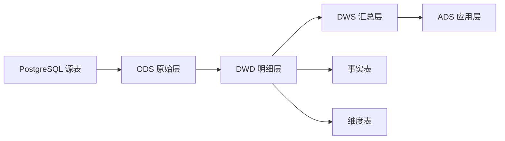

# 5. 数据仓库建模：从表设计到分析建模

::: tip 本章导读
把业务表重构成事实表、维度表、分层模型和稳定指标体系。
:::


## 本章阅读框架

| 阅读问题 | 本章回答方式 |
| --- | --- |
| 这个问题为什么出现？ | 从业务增长、数据规模、系统目标或 AI 应用压力切入。 |
| 它解决什么问题？ | 提炼为一个核心判断，避免把概念写成孤立定义。 |
| 它不解决什么问题？ | 在机制解释和常见误区中说明边界，防止工具崇拜。 |
| 它在真实平台哪里出现？ | 放回 PostgreSQL、数仓、批流、OLAP、湖仓、向量、图和治理的演化链路。 |
| 读完要会做什么？ | 通过场景案例和实战任务转成可练习的判断。 |



业务库设计关注业务正确。

数仓设计关注分析效率、指标口径和数据复用。

## 问题切入

第 4 章说明了为什么业务交易和分析计算要分工。但把数据从 PostgreSQL 同步到另一个系统，并不自动得到一个可用的数据仓库。

如果只是把业务库表原样复制一份，分析团队很快会遇到新问题：

```text
orders 表一行是一笔订单，order_items 一行是订单商品明细，GMV 应该从哪张表算？
支付成功时间、订单创建时间、发货时间都存在，日报应该按哪个时间统计？
用户等级会变化，历史订单应该看当时等级还是当前等级？
运营、财务、增长团队都写 GMV，为什么结果不一样？
一个报表字段出错时，怎样知道它来自哪个源表和哪条任务？
```

这些问题不是查询引擎能单独解决的。ClickHouse、Spark、Trino 可以让查询更快，但不会自动告诉你业务过程、分析粒度、指标口径和数据责任应该如何设计。

## 核心判断

数仓不是复制业务库，而是把业务系统中的对象、事件和关系重构成可分析的数据语义。

> 数仓建模的核心，不是多建几层表，而是让业务过程、分析粒度、指标口径和数据责任变得清晰。

本章要建立的判断是：数仓建模解决的是分析语义问题。它把 OLTP 中为了业务正确而设计的表，重构成面向分析复用的事实、维度、分层、汇总和指标体系。

数仓建模也不是万能的。它不能替代源系统正确性，不能让错误数据自动变正确，不能省掉 ETL/ELT、调度、质量校验和权限治理。它负责把数据进入分析系统之后的组织方式设计清楚。

## 机制解释

### 5.1 为什么业务库不能直接做分析

前4章学习了：
- 第2章：SQL分析能力
- 第3章：PostgreSQL大表能力
- 第4章：OLTP vs OLAP

现在进入第5章：数据仓库建模。

**场景**：
```yaml
公司决定做数据分析：
  运营总监："我们需要GMV报表"
  产品经理："我们需要用户留存分析"
  数据分析师："给我开通数据库权限，我自己查"
  
技术经理：
  "直接用业务库（OLTP）做分析吧，省事"
```

**问题来了**：
- 直接用业务库做分析有什么问题？
- 为什么需要数据仓库？
- 业务库和数据仓库有什么区别？

**答案**：**业务库不是为分析设计的，直接用会有很多问题**

#### 一、为什么业务库不适合做分析

**第一，业务库是为事务设计的**

**OLTP优化目标**：
```yaml
写入优化：
  - 快速写入（每秒1000个订单）
  - 减少索引（加快写入）
  - 小事务（减少锁时间）
  
查询优化：
  - 单行查询
  - 简单JOIN
  - 通过索引快速定位
  
数据模型：
  - 规范化（减少冗余）
  - 分表（减少单表数据量）
```

**分析需求**：
```yaml
查询需求：
  - 复杂分析（多表JOIN、聚合计算）
  - 大量扫描（扫描数亿行）
  - 灵活组合（多维度分析）
  
数据需求：
  - 历史数据（几年数据）
  - 全量数据（不只最近3个月）
  
性能需求：
  - 查询时间秒级到分钟级
```

**冲突**：
```yaml
OLTP优化写入：
  - 索引少
  - 分析查询慢
  
OLTP优化单行查询：
  - 规范化设计
  - 分析查询需要复杂JOIN
  
OLTP只保留热数据：
  - 只有最近3个月数据
  - 无法分析历史数据
```

**第二，业务库查询会干扰业务**

**场景**：GMV报表查询

```sql
-- 运营同学每天早上9点查询GMV报表
SELECT
    date(created_at) as order_date,
    sum(total_amount) as gmv,
    count(*) as order_count
FROM orders
WHERE created_at >= CURRENT_DATE - INTERVAL '30 days'
GROUP BY date(created_at);
-- 扫描：3000万行
-- 查询时间：5分钟
```

**影响**：
```yaml
对OLTP的影响：
  - 占用大量CPU
  - 占用大量内存
  - 占用大量磁盘I/O
  - 订单写入响应时间增加
  - 用户体验变差
```

**第三，业务库数据模型不适合分析**

**规范化设计**：
```sql
-- 业务库：规范化设计
CREATE TABLE users (
    user_id INT PRIMARY KEY,
    name VARCHAR(100),
    email VARCHAR(255)
);

CREATE TABLE products (
    product_id INT PRIMARY KEY,
    name VARCHAR(100),
    price NUMERIC(10,2)
);

CREATE TABLE orders (
    order_id INT PRIMARY KEY,
    user_id INT REFERENCES users(user_id),
    product_id INT REFERENCES products(product_id),
    total_amount NUMERIC(10,2),
    created_at TIMESTAMP
);
```

**分析查询**：
```sql
-- 查询：GMV趋势（需要JOIN多个表）
SELECT
    u.name as user_name,
    p.name as product_name,
    sum(o.total_amount) as gmv
FROM orders o
JOIN users u ON o.user_id = u.user_id
JOIN products p ON o.product_id = p.product_id
WHERE o.created_at >= '2026-01-01'
GROUP BY u.name, p.name;
```

**问题**：
```yaml
查询复杂：
  - 需要JOIN多个表
  - 规范化设计导致表多
  
查询慢：
  - JOIN在大数据量下很慢
  - 扫描多个表
```

**第四，业务库数据不完整**

**数据保留问题**：
```yaml
业务库：
  - 只保留热数据（最近3个月）
  - 旧数据归档或删除
  
问题：
  - 无法分析历史数据
  - 无法做同比、环比分析
  - 无法分析长期趋势
```

**数据质量问题**：
```yaml
业务库：
  - 数据可能被修改
  - 数据可能被删除
  - 没有数据变更历史
  
问题：
  - 分析结果不准确
  - 无法追溯历史数据
  - 无法对比不同时期
```

#### 二、核心判断：业务库和数据仓库的定位不同

> 业务库（OLTP）和数据仓库（OLAP）的核心判断是：业务库面向业务事务，优化写入和简单查询；数据仓库面向分析查询，优化复杂查询和大数据量扫描；两者定位不同，应该分开建设。

这个判断说明：
- **业务库**：面向业务事务、实时数据、规范化设计
- **数据仓库**：面向分析查询、历史数据、维度建模
- **定位不同**：各司其职，不能互相替代
- **分开建设**：通过ETL同步数据

#### 三、业务库 vs 数据仓库

##### 3.1 定位不同

**业务库（OLTP）**：
```yaml
定位：
  - 支撑业务运行
  - 处理业务事务
  - 实时数据服务
  
用户：
  - 业务系统
  - 前台用户
  - 客服
  
示例：
  - 用户下单
  - 支付处理
  - 订单查询
```

**数据仓库（OLAP）**：
```yaml
定位：
  - 支撑数据分析
  - 生成数据报表
  - 辅助业务决策
  
用户：
  - 数据分析师
  - 运营
  - 管理层
  
示例：
  - GMV报表
  - 用户留存分析
  - 转化漏斗分析
```

##### 3.2 数据特征不同

**业务库数据**：
```yaml
实时性：
  - 当前数据状态
  - 频繁变化（每秒数千次）
  
数据量：
  - 相对较小（GB级）
  - 只保留热数据（最近3个月）
  
精度：
  - 精确数据
  - 强一致性（ACID事务）
  
示例：
  - 当前库存：100件
  - 当前订单：5笔待支付
  - 当前余额：1000元
```

**数据仓库数据**：
```yaml
历史性：
  - 历史数据快照
  - 相对稳定（每天或每小时更新）
  
数据量：
  - 非常大（TB级）
  - 保留全部历史数据
  
精度：
  - 可以有近似
  - 最终一致性（可以有几秒延迟）
  
示例：
  - 昨天的GMV：100万元
  - 上周的转化率：5%
  - 去年的留存率：30%
```

##### 3.3 数据模型不同

**业务库**：
```yaml
数据模型：
  - 规范化设计（3NF）
  - 减少数据冗余
  - 表数量多（几十到几百个）
  
关系：
  - 一对一
  - 一对多
  - 多对多（通过中间表）
  
示例：
  - 用户表、订单表、商品表
  - 订单明细表、支付表、物流表
```

**数据仓库**：
```yaml
数据模型：
  - 维度建模（星型模型、雪花模型）
  - 反规范化（允许冗余）
  - 表数量少（事实表+维度表）
  
关系：
  - 事实表（核心）
  - 维度表（围绕事实表）
  
示例：
  - 订单事实表
  - 日期维度表、用户维度表、商品维度表
```

##### 3.4 查询模式不同

**业务库查询**：
```sql
-- 查询1：查询单个订单
SELECT * FROM orders WHERE order_id = 123;
-- 返回：1行
-- 执行时间：10ms

-- 查询2：查询单个用户的最近订单
SELECT * FROM orders WHERE user_id = 123 ORDER BY created_at DESC LIMIT 10;
-- 返回：10行
-- 执行时间：20ms

-- 查询3：查询商品库存
SELECT stock FROM inventory WHERE product_id = 456;
-- 返回：1行
-- 执行时间：10ms
```

**数据仓库查询**：
```sql
-- 查询1：GMV趋势
SELECT
    order_date,
    sum(order_amount) as gmv,
    count(*) as order_count
FROM fact_orders
WHERE order_date >= '2026-01-01'
GROUP BY order_date;
-- 扫描：1亿行
-- 返回：30行
-- 执行时间：5秒

-- 查询2：用户留存
WITH cohort_users AS (...),
     retention AS (...)
SELECT * FROM retention;
-- 扫描：10亿行
-- 返回：100行
-- 执行时间：30秒
```

#### 四、业务库做分析的典型问题

##### 4.1 性能问题

**问题**：分析查询慢

```sql
-- 业务库：查询最近30天的GMV
SELECT
    date(created_at) as order_date,
    sum(total_amount) as gmv
FROM orders
WHERE created_at >= CURRENT_DATE - INTERVAL '30 days'
GROUP BY date(created_at);
-- 扫描：3000万行
-- 执行时间：5分钟
```

**原因**：
```yaml
业务库优化：
  - 索引少（为了写入性能）
  - 规范化设计（需要JOIN多个表）
  - 只保留最近数据（数据量大时性能更差）
```

**影响**：
```yaml
用户体验：
  - 报表查询慢
  - 等待时间长
  
业务影响：
  - 决策不及时
  - 分析效率低
```

##### 4.2 业务干扰

**问题**：分析查询占用资源

```yaml
上午9点：
  - 运营同学查询GMV报表
  - 扫描3000万行，耗时5分钟
  - 占用大量CPU和内存
  
同时：
  - 用户下单高峰期
  - 订单写入响应时间从50ms增加到500ms
  - 用户体验变差
```

**影响**：
```yaml
业务影响：
  - 订单写入慢
  - 支付处理慢
  - 用户体验差
  
运营影响：
  - 分析查询被限流
  - 无法及时获取数据
```

##### 4.3 数据不完整

**问题**：无法分析历史数据

```sql
-- 业务库：只有最近3个月数据
SELECT count(*) FROM orders;
-- 返回：3000万行（最近3个月）

-- 需求：分析去年同期的GMV
SELECT sum(total_amount) FROM orders
WHERE created_at >= '2025-01-01' AND created_at < '2025-02-01';
-- 返回：NULL（数据已被删除）
```

**影响**：
```yaml
分析能力：
  - 无法分析历史趋势
  - 无法做同比分析
  - 无法做年度对比
  
决策影响：
  - 决策依据不足
  - 无法评估长期效果
```

##### 4.4 数据质量

**问题**：数据可能被修改或删除

```yaml
场景：
  - 用户取消订单（订单被删除）
  - 订单状态修改（从'paid'改为'refunded'）
  - 商品价格调整（历史价格被修改）
  
问题：
  - 分析结果不准确
  - 无法追溯历史状态
  - 无法对比不同时期
```

**影响**：
```yaml
数据准确性：
  - 分析结果不准确
  - 决策基于错误数据
  
数据追溯：
  - 无法追溯历史数据
  - 无法还原历史状态
```

#### 五、数据仓库的价值

##### 5.1 性能优化

**数据仓库优化**：
```yaml
存储优化：
  - 列式存储
  - 分区表（按时间）
  - 压缩存储
  
计算优化：
  - 物化视图（预计算）
  - 并行计算
  - 向量化执行
  
查询性能：
  - 复杂查询：秒级到分钟级
  - 比业务库快10-100倍
```

##### 5.2 业务隔离

**数据仓库隔离**：
```yaml
物理隔离：
  - 独立的数据库系统
  - 独立的计算资源
  - 不影响业务库
  
查询隔离：
  - 分析查询在数据仓库
  - 不占用业务库资源
  - 不影响业务性能
```

##### 5.3 数据完整性

**数据仓库特性**：
```yaml
历史数据：
  - 保留全部历史数据
  - 不删除或修改
  
数据快照：
  - 记录每个时间点的数据状态
  - 可以追溯历史
  
数据质量：
  - 通过ETL清洗数据
  - 保证数据质量
```

##### 5.4 分析能力

**数据仓库能力**：
```yaml
多维度分析：
  - 灵活的维度组合
  - 支持即席查询
  
复杂分析：
  - 用户留存
  - 转化漏斗
  - 同群分析
  
报表生成：
  - 定时报表
  - 即席查询
  - 数据可视化
```

#### 六、常见误区

**误区一：业务库可以直接做分析**

- **说明**：业务库不是为分析设计的，直接做分析会有很多问题
- **后果**：性能差、业务干扰、数据不完整
- **正确理解**：
  - 业务库优化业务事务
  - 数据仓库优化分析查询
  - 应该分开建设

**误区二：数据仓库成本太高**

- **说明**：数据仓库有成本，但收益更大
- **后果**：不敢建设数据仓库，分析能力不足
- **正确理解**：
  - 开源方案成本低（ClickHouse、Doris）
  - 云方案按需付费
  - 收益远大于成本

**误区三：小公司不需要数据仓库**

- **说明**：是否需要数据仓库取决于分析需求，不是公司规模
- **后果**：分析能力不足，影响决策
- **正确理解**：
  - 有分析需求就需要数据仓库
  - 数据量不大也可以用数据仓库
  - 开源方案成本低

**误区四：数据仓库可以替代业务库**

- **说明**：数据仓库和业务库各有所长，不能替代
- **后果**：架构错误，性能差
- **正确理解**：
  - 业务库处理业务事务
  - 数据仓库处理分析查询
  - 配合使用

**误区五：有了数据仓库，业务库可以简化**

- **说明**：业务库和数据仓库定位不同，不能互相替代
- **后果**：业务库功能缺失，影响业务
- **正确理解**：
  - 业务库还是需要完整设计
  - 数据仓库独立建设
  - 两者配合使用

#### 七、实战任务

**任务1：分析业务库做分析的问题**

分析以下场景的问题：

```yaml
场景：
  - 公司使用PostgreSQL作为业务库
  - 订单表：5000万行
  - 运营每天查询GMV报表（扫描5000万行）
  - 查询时间：10分钟
  
问题分析：
  1. 性能问题：
     - 查询时间10分钟，用户体验差
     - 占用大量资源，影响业务
  
  2. 业务干扰：
     - 高峰期查询，订单写入慢
     - 用户体验差
  
  3. 数据不完整：
     - 只保留最近6个月数据
     - 无法分析历史趋势
  
  4. 数据质量：
     - 订单可能被修改或删除
     - 分析结果不准确

解决方案：
  - 建设数据仓库
  - 通过ETL同步数据
  - 分析查询在数据仓库
```

**任务2：设计数据仓库架构**

设计一个简单的数据仓库架构：

```yaml
业务库（PostgreSQL）：
  - 订单表（orders）
  - 用户表（users）
  - 商品表（products）
  - 保留最近3个月数据

ETL：
  - 每天凌晨同步数据
  - 数据清洗和转换
  - 加载到数据仓库

数据仓库（ClickHouse）：
  - 订单事实表（fact_orders）
  - 日期维度表（dim_date）
  - 用户维度表（dim_users）
  - 商品维度表（dim_products）
  - 保留全部历史数据

分析查询：
  - GMV报表（在数据仓库查询）
  - 用户留存分析（在数据仓库查询）
  - 查询时间：秒级
```

**任务3：评估收益**

评估建设数据仓库的收益：

```yaml
成本：
  - 硬件成本：1台服务器（2万/年）
  - 开发成本：2人月（4万）
  - 运维成本：0.2人月（0.4万/年）
  - 总成本：6.4万（第一年）

收益：
  1. 性能提升：
     - 查询时间从10分钟降到5秒
     - 提升120倍
  
  2. 业务不受影响：
     - 分析查询不占用业务库资源
     - 订单写入响应时间不变
  
  3. 数据完整：
     - 保留全部历史数据
     - 支持历史趋势分析
  
  4. 决策支持：
     - 数据分析更及时
     - 决策更准确
  
ROI：
  - 投入：6.4万
  - 产出：难以量化，但远大于投入
  - 结论：值得建设
```

#### 八、小结

业务库不是为分析设计的，直接用业务库做分析会有很多问题：性能差、业务干扰、数据不完整、数据质量低。

核心要点：
- 业务库定位：业务事务、实时数据、规范化设计
- 数据仓库定位：分析查询、历史数据、维度建模
- 业务库做分析的问题：性能、干扰、完整性、质量
- 数据仓库的价值：性能优化、业务隔离、数据完整性、分析能力
- 分开建设：通过ETL同步数据，各司其职

下一节将进入数据仓库的核心概念，了解数据仓库的定义、特点、架构等。

### 5.2 数据仓库的核心概念

上一节学习了为什么业务库不能直接做分析，以及业务库和数据仓库的定位不同。

现在深入学习数据仓库的核心概念。

**场景**：
```yaml
公司决定建设数据仓库：
  技术经理："我们需要一个数据仓库"
  
数据分析师："什么是数据仓库？"
  
技术经理："就是一个存数据的大数据库..."
  
你："不对，数据仓库不只是一个大数据库..."
```

**问题**：
- 什么是数据仓库？
- 数据仓库的核心概念是什么？
- 数据仓库和数据库有什么区别？

**答案**：**数据仓库是一个面向主题的、集成的、相对稳定的、反映历史变化的数据集合，用于支持管理决策**

#### 一、数据仓库的定义

##### 1.1 经典定义（W.H. Inmon）

**定义**：
> 数据仓库是一个面向主题的、集成的、相对稳定的、反映历史变化的数据集合，用于支持管理决策。

**四个关键特征**：
```yaml
面向主题（Subject-Oriented）：
  - 按业务主题组织数据
  - 例如：销售主题、客户主题、产品主题
  
集成（Integrated）：
  - 数据来自多个数据源
  - 统一的数据格式和编码
  - 消除数据不一致
  
相对稳定（Non-Volatile）：
  - 数据一旦写入，很少修改
  - 主要是查询和加载
  
反映历史变化（Time-Variant）：
  - 保留历史数据
  - 记录数据随时间的变化
```

##### 1.2 数据仓库 vs 数据库

| 维度 | 数据库（业务库） | 数据仓库 |
|------|-----------------|----------|
| **面向** | 事务处理 | 分析查询 |
| **数据** | 当前数据 | 历史数据 |
| **数据量** | GB级 | TB级到PB级 |
| **查询** | 简单查询 | 复杂查询 |
| **并发** | 高（每秒数千） | 低（每小时几次） |
| **响应时间** | <100ms | 秒级到分钟级 |
| **数据模型** | 规范化（3NF） | 维度建模（星型模型） |
| **数据变化** | 频繁（每秒数千次） | 相对稳定（每天或每小时） |
| **用户** | 业务系统、前台用户 | 数据分析师、管理层 |

#### 二、数据仓库的核心特征

##### 2.1 面向主题（Subject-Oriented）

**定义**：按照业务主题组织数据，而不是按照业务应用

**业务库（按应用）**：
```yaml
订单系统：
  - 订单表
  - 订单明细表
  - 支付表
  
库存系统：
  - 库存表
  - 入库表
  - 出库表
  
用户系统：
  - 用户表
  - 账户表
  - 权限表
```

**数据仓库（按主题）**：
```yaml
销售主题：
  - 销售事实表
  - 客户维度
  - 产品维度
  - 时间维度
  
客户主题：
  - 客户事实表
  - 客户维度
  - 行为维度
  - 时间维度
  
产品主题：
  - 产品事实表
  - 产品维度
  - 分类维度
  - 时间维度
```

**优势**：
```yaml
主题划分：
  - 符合业务思维
  - 便于分析
  
数据组织：
  - 跨应用整合数据
  - 统一视角
```

##### 2.2 集成（Integrated）

**定义**：数据来自多个数据源，经过清洗、转换、整合，形成统一的数据视图

**数据源**：
```yaml
业务数据库：
  - 订单系统（MySQL）
  - 用户系统（PostgreSQL）
  - 库存系统（Oracle）
  
外部数据：
  - 第三方数据（天气、经济指标）
  - 日志数据（用户行为日志）
  - API数据（社交媒体）
```

**数据不一致问题**：
```yaml
编码不一致：
  - 性别：0/1 vs M/F vs 男/女
  - 日期：2026-01-01 vs 01/01/2026 vs 20260101
  
单位不一致：
  - 金额：元 vs 万元 vs 分
  - 重量：kg vs g vs 斤
  
命名不一致：
  - 用户：user_id vs uid vs userid
  - 订单：order_id vs oid vs order_no
```

**数据集成**：
```yaml
数据清洗：
  - 统一编码（性别：M/F）
  - 统一单位（金额：元）
  - 统一命名（user_id）
  
数据转换：
  - 类型转换（字符串 → 日期）
  - 格式转换（01/01/2026 → 2026-01-01）
  - 值转换（0 → M, 1 → F）
  
数据整合：
  - 去重
  - 关联
  - 聚合
```

##### 2.3 相对稳定（Non-Volatile）

**定义**：数据一旦写入数据仓库，很少修改或删除

**业务库**：
```yaml
数据变化：
  - 订单状态：pending → paid → shipped → delivered
  - 库存数量：100 → 99 → 98
  - 用户余额：1000 → 900 → 800
  
操作：
  - 频繁更新（每秒数千次）
  - 删除（订单取消）
  - 插入（新订单）
```

**数据仓库**：
```yaml
数据变化：
  - 数据快照（记录某个时间点的状态）
  - 增量追加（每天或每小时添加新数据）
  - 很少修改（几乎不修改历史数据）
  
操作：
  - 加载（Load）：每天加载新数据
  - 查询（Query）：分析查询
  - 很少更新（Update）
  - 很少删除（Delete）
```

**示例**：
```sql
-- 业务库：订单状态会变化
UPDATE orders SET status = 'paid' WHERE order_id = 123;
UPDATE orders SET status = 'shipped' WHERE order_id = 123;

-- 数据仓库：记录订单状态变化（快照）
INSERT INTO orders_snapshot (order_id, status, snapshot_date)
VALUES (123, 'paid', '2026-01-01 10:00:00');

INSERT INTO orders_snapshot (order_id, status, snapshot_date)
VALUES (123, 'shipped', '2026-01-01 15:00:00');

-- 查询订单状态变化历史
SELECT * FROM orders_snapshot WHERE order_id = 123;
```

##### 2.4 反映历史变化（Time-Variant）

**定义**：数据仓库保留历史数据，记录数据随时间的变化

**业务库**：
```sql
-- 业务库：只保留当前状态
SELECT * FROM products WHERE product_id = 456;
-- 返回：当前价格（100元）
-- 不知道历史价格
```

**数据仓库**：
```sql
-- 数据仓库：保留价格变化历史
CREATE TABLE product_price_history (
    product_id INT,
    price NUMERIC(10,2),
    valid_from DATE,
    valid_to DATE
);

INSERT INTO product_price_history VALUES
  (456, 100.00, '2026-01-01', '2026-01-15'),
  (456, 120.00, '2026-01-15', '2026-02-01'),
  (456, 110.00, '2026-02-01', '9999-12-31');

-- 查询价格变化历史
SELECT product_id, price, valid_from, valid_to
FROM product_price_history
WHERE product_id = 456
ORDER BY valid_from;
-- 可以看到价格从100元 → 120元 → 110元
```

**历史数据的价值**：
```yaml
趋势分析：
  - GMV趋势（月度、季度、年度）
  - 用户增长趋势
  - 产品销量趋势
  
对比分析：
  - 同比分析（今年vs去年）
  - 环比分析（本月vs上月）
  - AB测试前后对比
  
原因分析：
  - 分析历史数据，找出原因
  - 预测未来趋势
```

#### 三、数据仓库的架构

##### 3.1 典型架构

**架构图**：
```text
数据源层（Source）
    ↓
ETL层（Extract, Transform, Load）
    ↓
数据仓库层（Data Warehouse）
    ↓
数据集市层（Data Mart）
    ↓
应用层（BI, Report, Dashboard）
```

**组件说明**：
```yaml
数据源层：
  - 业务数据库（MySQL, PostgreSQL, Oracle）
  - 外部数据（API, 日志文件）
  - 第三方数据（天气、经济指标）
  
ETL层：
  - 抽取（Extract）：从数据源抽取数据
  - 转换（Transform）：清洗、转换、整合
  - 加载（Load）：加载到数据仓库
  
数据仓库层：
  - ODS层（操作数据存储）：原始数据
  - DWD层（明细数据层）：清洗后的明细数据
  - DWS层（汇总数据层）：按维度汇总的数据
  - ADS层（应用数据层）：面向应用的数据
  
数据集市层：
  - 部门级数据仓库
  - 例如：销售数据集市、财务数据集市
  
应用层：
  - BI工具（Tableau, PowerBI）
  - 报表系统
  - 仪表板（Dashboard）
```

##### 3.2 分层架构详解

**ODS层（操作数据存储）**：
```yaml
定义：
  - 操作数据存储
  - 原始数据副本
  
特点：
  - 数据结构与数据源一致
  - 不做清洗和转换
  - 保留原始数据
  
用途：
  - 数据备份
  - 数据回溯
  - 重新加载
```

**DWD层（明细数据层）**：
```yaml
定义：
  - 明细数据层
  - 清洗后的数据
  
特点：
  - 数据清洗（去重、补全）
  - 数据统一（编码、格式）
  - 数据关联（JOIN）
  
用途：
  - 明细查询
  - 基础数据层
```

**DWS层（汇总数据层）**：
```yaml
定义：
  - 汇总数据层
  - 按维度汇总的数据
  
特点：
  - 按日期汇总（每日GMV、每日订单量）
  - 按用户汇总（用户累计消费、用户订单数）
  - 按商品汇总（商品累计销量、商品GMV）
  
用途：
  - 加速查询
  - 预计算
```

**ADS层（应用数据层）**：
```yaml
定义：
  - 应用数据层
  - 面向应用的数据
  
特点：
  - 面向具体应用
  - 数据已经准备好
  - 直接用于报表
  
用途：
  - 报表数据
  - 仪表板数据
  - API数据
```

#### 四、数据仓库 vs 数据湖

##### 4.1 数据仓库

**特点**：
```yaml
结构化数据：
  - 数据有固定结构（Schema）
  - 关系型数据
  - 事务型数据
  
数据质量：
  - 经过清洗和转换
  - 数据质量高
  
查询性能：
  - 优化查询性能
  - 支持复杂查询
  
成本：
  - 存储成本较高
  - 查询性能好
  
适用场景：
  - 结构化数据分析
  - 报表生成
  - 业务决策
```

##### 4.2 数据湖

**特点**：
```yaml
原始数据：
  - 保存原始数据
  - 不做清洗和转换
  - 保留所有数据
  
数据类型：
  - 结构化数据（数据库）
  - 半结构化数据（JSON, XML）
  - 非结构化数据（图片, 视频, 文本）
  
灵活性：
  - 灵活的数据结构
  - 可以随时添加新字段
  
成本：
  - 存储成本低（对象存储）
  - 查询性能相对较差
  
适用场景：
  - 大数据存储
  - 机器学习
  - 数据探索
```

##### 4.3 数据仓库 vs 数据湖

| 维度 | 数据仓库 | 数据湖 |
|------|----------|--------|
| **数据类型** | 结构化 | 所有类型 |
| **数据结构** | 固定Schema | 灵活Schema |
| **数据质量** | 高（清洗后） | 原始（未清洗） |
| **查询性能** | 好 | 相对差 |
| **存储成本** | 较高 | 低 |
| **灵活性** | 低 | 高 |
| **用途** | 报表、分析 | 存储、探索 |

**结合使用**：
```yaml
数据湖：
  - 存储原始数据
  - 数据备份
  - 数据探索
  
数据仓库：
  - 存储清洗后的数据
  - 生成报表
  - 业务分析
  
架构：
  - 数据湖 → 数据仓库
  - 先存储到数据湖
  - 再加载到数据仓库
```

#### 五、数据仓库的价值

##### 5.1 决策支持

**价值**：
```yaml
数据驱动决策：
  - 基于数据做决策，不是凭直觉
  - 决策更准确
  
实时监控：
  - 实时监控业务指标
  - 及时发现问题
  
趋势分析：
  - 分析历史趋势
  - 预测未来趋势
```

##### 5.2 业务集成

**价值**：
```yaml
数据整合：
  - 整合多个业务系统数据
  - 统一数据视图
  
数据一致性：
  - 消除数据不一致
  - 保证数据质量
  
数据共享：
  - 多部门共享数据
  - 避免数据孤岛
```

##### 5.3 历史分析

**价值**：
```yaml
历史数据：
  - 保留全部历史数据
  - 可以分析历史趋势
  
对比分析：
  - 同比分析（今年vs去年）
  - 环比分析（本月vs上月）
  
原因分析：
  - 分析历史数据，找出原因
  - 指导未来决策
```

#### 六、常见误区

**误区一：数据仓库就是一个大数据库**

- **说明**：数据仓库不只是一个大数据库，有特定的设计原则
- **后果**：设计错误，效果差
- **正确理解**：
  - 面向主题、集成、稳定、历史变化
  - 维度建模
  - 分层架构

**误区二：数据仓库可以实时**

- **说明**：数据仓库通常是T+1或准实时，不是毫秒级实时
- **后果**：期望过高，失望越大
- **正确理解**：
  - 通常T+1（第二天凌晨）
  - 或准实时（5-15分钟延迟）
  - 不需要毫秒级实时

**误区三：数据仓库可以替代业务库**

- **说明**：数据仓库和业务库各有所长，不能替代
- **后果**：架构错误
- **正确理解**：
  - 业务库处理业务事务
  - 数据仓库处理分析查询
  - 配合使用

**误区四：数据仓库建成后一劳永逸**

- **说明**：数据仓库需要持续维护和优化
- **后果**：性能退化，数据质量下降
- **正确理解**：
  - 定期维护
  - 持续优化
  - 数据质量管理

**误区五：所有数据都要进数据仓库**

- **说明**：数据仓库应该只存储需要分析的数据
- **后果**：数据冗余，成本高
- **正确理解**：
  - 只存储需要分析的数据
  - 过滤不需要的数据
  - 控制数据量

#### 七、实战任务

**任务1：理解数据仓库特征**

分析以下场景是否符合数据仓库特征：

```yaml
场景1：销售分析系统
需求：
  - 分析GMV趋势（历史变化）
  - 整合订单、用户、商品数据（集成）
  - 按销售主题组织（面向主题）
  - 数据每天更新一次（相对稳定）

判断：符合数据仓库特征
理由：
  - 面向主题：按销售主题组织
  - 集成：整合多源数据
  - 稳定：每天更新，不频繁修改
  - 历史变化：保留历史数据

场景2：实时订单系统
需求：
  - 实时处理订单
  - 每秒1000个订单
  - 响应时间<100ms

判断：不符合数据仓库特征
理由：
  - 面向事务，不是分析
  - 高并发，不是低频查询
  - 实时响应，不是历史分析
  - 应该用OLTP，不是数据仓库
```

**任务2：设计数据仓库架构**

设计一个电商数据仓库架构：

```yaml
数据源层：
  - 订单系统（MySQL）
  - 用户系统（PostgreSQL）
  - 商品系统（Oracle）
  - 日志系统（日志文件）

ETL层：
  - 每天凌晨2点抽取数据
  - 清洗和转换
  - 加载到数据仓库

数据仓库层：
  - ODS层：原始数据副本
  - DWD层：清洗后的明细数据
  - DWS层：按维度汇总（每日GMV、用户GMV）
  - ADS层：应用数据（报表数据）

数据集市：
  - 销售数据集市（GMV报表、订单量报表）
  - 用户数据集市（用户留存、用户画像）
  - 商品数据集市（商品销量、商品分析）

应用层：
  - BI工具（Tableau）
  - 报表系统（自定义报表）
  - 仪表板（实时监控）
```

**任务3：对比业务库和数据仓库**

对比业务库和数据仓库：

```yaml
业务库（OLTP）：
  - 用途：订单处理
  - 数据：最近3个月
  - 查询：查询单个订单
  - 并发：每秒1000次
  - 响应时间：50ms
  - 数据模型：规范化（3NF）

数据仓库（OLAP）：
  - 用途：GMV分析
  - 数据：全部历史（3年）
  - 查询：分析GMV趋势
  - 并发：每小时10次
  - 响应时间：5秒
  - 数据模型：维度建模（星型模型）

配合使用：
  - 业务库处理订单
  - 数据仓库做分析
  - 通过ETL同步数据
```

#### 八、小结

数据仓库是一个面向主题的、集成的、相对稳定的、反映历史变化的数据集合，用于支持管理决策。

核心要点：
- 定义：面向主题、集成、稳定、历史变化
- 四个特征：Subject-Oriented、Integrated、Non-Volatile、Time-Variant
- 架构：数据源 → ETL → 数据仓库 → 数据集市 → 应用
- 分层：ODS → DWD → DWS → ADS
- vs数据库：定位不同，各有所长
- vs数据湖：数据仓库是结构化的，数据湖是原始的

下一节将进入数仓的基本术语，了解维度、度量、事实表、维度表等核心术语。

### 5.3 数仓的基本术语

前两节学习了为什么业务库不能直接做分析，以及数据仓库的核心概念。

现在学习数据仓库的基本术语。

**场景**：
```yaml
数据仓库项目启动会：
  
技术经理："我们需要建设数据仓库"
  
数据分析师："我需要GMV报表、用户留存分析、转化漏斗"
  
你："好，我们需要设计事实表和维度表..."
  
新同事："什么是事实表？什么是维度表？什么是度量？"
```

**问题**：
- 数据仓库有哪些基本术语？
- 这些术语是什么意思？
- 如何理解和使用这些术语？

**答案**：**掌握数据仓库的核心术语，是设计数据仓库的基础**

#### 一、维度和度量

##### 1.1 维度（Dimension）

**定义**：描述业务的角度或视角

**特点**：
```yaml
描述性：
  - 描述业务的"是什么"
  - 例如：谁、什么、哪里、什么时候
  
离散值：
  - 有限个值
  - 例如：城市（北京、上海、深圳）
  
用于分组和过滤：
  - GROUP BY
  - WHERE
```

**示例**：
```sql
-- 日期维度
SELECT
    year,
    month,
    day,
    quarter,
    is_holiday
FROM dim_date;

-- 用户维度
SELECT
    user_id,
    user_name,
    user_city,
    user_segment
FROM dim_users;

-- 商品维度
SELECT
    product_id,
    product_name,
    product_category,
    product_brand
FROM dim_products;
```

**常见维度**：
```yaml
时间维度：
  - 年、季度、月、周、日
  - 是否节假日
  - 星期几

地理维度：
  - 国家、省份、城市
  - 区域（华东、华南、华北）

产品维度：
  - 产品名称
  - 产品类别
  - 产品品牌

客户维度：
  - 客户姓名
  - 客户等级
  - 客户类型
```

##### 1.2 度量（Measure）

**定义**：可以度量的数值，用于聚合计算

**特点**：
```yaml
数值型：
  - 可以聚合（SUM、COUNT、AVG）
  - 例如：金额、数量、利润
  
连续值：
  - 连续的数值范围
  - 例如：金额（0-10000元）
  
用于聚合计算：
  - SUM（求和）
  - COUNT（计数）
  - AVG（平均）
  - MAX/MIN（最大/最小）
```

**示例**：
```sql
-- 订单金额（度量）
SELECT sum(order_amount) FROM fact_orders;
-- GMV：1000万元

-- 订单数量（度量）
SELECT count(*) FROM fact_orders;
-- 订单量：10万笔

-- 订单利润（度量）
SELECT sum(order_profit) FROM fact_orders;
-- 利润：100万元
```

**常见度量**：
```yaml
销售指标：
  - 销售额（GMV）
  - 销售数量
  - 利润
  - 利润率

用户指标：
  - 用户数
  - 活跃用户数
  - 留存率

网站指标：
  - 访问量（PV）
  - 访客数（UV）
  - 跳出率
```

##### 1.3 维度 vs 度量

| 维度 | 度量 |
|------|------|
| **性质** | 描述性 | 数值型 |
| **值** | 离散值 | 连续值 |
| **用途** | 分组、过滤 | 聚合计算 |
| **SQL** | GROUP BY | SUM/COUNT/AVG |
| **示例** | 日期、城市、产品 | 金额、数量、利润 |

**查询示例**：
```sql
-- 维度：日期、城市
-- 度量：GMV、订单量
SELECT
    date(order_date) as 维度_日期,      -- 维度
    user_city as 维度_城市,              -- 维度
    sum(order_amount) as 度量_GMV,        -- 度量
    count(*) as 度量_订单量               -- 度量
FROM fact_orders f
JOIN dim_users u ON f.user_id = u.user_id
WHERE order_date >= '2026-01-01'          -- 维度过滤
GROUP BY date(order_date), user_city       -- 维度分组
ORDER BY date(order_date), 度量_GMV DESC;
```

#### 二、事实表和维度表

##### 2.1 事实表（Fact Table）

**定义**：存储业务事件和度量数据

**特点**：
```yaml
数据量大：
  - 每天增长
  - 例如：订单事实表每天1000万行
  
包含度量：
  - 数值型字段
  - 可聚合
  
包含维度外键：
  - 关联维度表
  - 例如：date_id, user_id, product_id
  
记录业务事件：
  - 每一行是一个业务事件
  - 例如：一个订单、一次点击
```

**示例**：
```sql
-- 订单事实表
CREATE TABLE fact_orders (
    -- 维度外键
    order_id BIGINT,
    date_id INT,           -- 日期维度外键
    user_id BIGINT,        -- 用户维度外键
    product_id BIGINT,     -- 商品维度外键
    
    -- 度量
    order_amount NUMERIC(10,2),   -- 订单金额
    order_quantity INT,           -- 订单数量
    order_profit NUMERIC(10,2)    -- 订单利润
);
```

**事实表类型**：
```yaml
事务事实表：
  - 记录业务事件
  - 例如：订单、支付、物流
  
周期快照事实表：
  - 记录定期快照
  - 例如：库存快照（每天）、账户快照（每月）
  
累积快照事实表：
  - 记录过程全生命周期
  - 例如：订单从创建到完成的全过程
```

##### 2.2 维度表（Dimension Table）

**定义**：存储维度描述信息

**特点**：
```yaml
数据量小：
  - 相对较小
  - 例如：商品维度表10万行
  
包含描述属性：
  - 文本、日期等
  - 例如：产品名称、类别
  
作为分析角度：
  - 用于GROUP BY
  - 用于WHERE过滤
  
层级关系：
  - 可能有层级
  - 例如：年→季度→月→日
```

**示例**：
```sql
-- 日期维度表
CREATE TABLE dim_date (
    date_id INT PRIMARY KEY,
    date_value DATE,
    year INT,
    quarter INT,
    month INT,
    day INT,
    is_holiday BOOLEAN,
    is_weekend BOOLEAN
);

-- 用户维度表
CREATE TABLE dim_users (
    user_id BIGINT PRIMARY KEY,
    user_name VARCHAR(100),
    user_city VARCHAR(100),
    user_province VARCHAR(100),
    user_segment VARCHAR(50),  -- 客户分群
    registered_at DATE
);

-- 商品维度表
CREATE TABLE dim_products (
    product_id BIGINT PRIMARY KEY,
    product_name VARCHAR(100),
    product_category VARCHAR(100),
    product_brand VARCHAR(100),
    product_price NUMERIC(10,2)
);
```

**维度表类型**：
```yaml
时间维度：
  - 年、季度、月、日
  - 是否节假日
  
地理维度：
  - 国家、省份、城市
  - 层级关系
  
产品维度：
  - 产品名称、类别、品牌
  - 层级关系（一级分类、二级分类）
  
客户维度：
  - 客户基本信息
  - 客户分群
```

##### 2.3 事实表 vs 维度表

| 维度 | 事实表 | 维度表 |
|------|--------|--------|
| **数据量** | 大（百万到亿行） | 小（万到十万行） |
| **内容** | 度量（数值） | 描述（文本、日期） |
| **用途** | 聚合计算 | 分组、过滤 |
| **变化** | 增量追加（很少修改） | 相对稳定 |
| **关系** | 关联维度表 | 被事实表关联 |

#### 三、星型模型和雪花模型

##### 3.1 星型模型（Star Schema）

**定义**：事实表在中心，维度表围绕

**结构**：
```text
        商品维度表
              |
              |
    用户维度表 - 事实表 - 日期维度表
              |
              |
          渠道维度表
```

**特点**：
```yaml
事实表：
  - 在中心
  - 连接所有维度表
  
维度表：
  - 围绕事实表
  - 直接连接事实表
  
反规范化：
  - 维度表可能冗余
  - 为了查询性能
```

**示例**：
```sql
-- 星型模型示例
-- 事实表
CREATE TABLE fact_orders (
    order_id BIGINT,
    date_id INT,
    user_id BIGINT,
    product_id BIGINT,
    channel_id INT,
    order_amount NUMERIC(10,2)
);

-- 维度表
CREATE TABLE dim_date (...);
CREATE TABLE dim_users (...);
CREATE TABLE dim_products (...);
CREATE TABLE dim_channels (...);

-- 查询：只需要JOIN维度表
SELECT
    d.year,
    d.month,
    u.user_city,
    p.product_category,
    c.channel_name,
    sum(f.order_amount) as gmv
FROM fact_orders f
JOIN dim_date d ON f.date_id = d.date_id
JOIN dim_users u ON f.user_id = u.user_id
JOIN dim_products p ON f.product_id = p.product_id
JOIN dim_channels c ON f.channel_id = c.channel_id
GROUP BY d.year, d.month, u.user_city, p.product_category, c.channel_name;
```

##### 3.2 雪花模型（Snowflake Schema）

**定义**：维度表也可以规范化，有层级关系

**结构**：
```text
        商品子类别维度表
              |
        商品类别维度表
              |
    用户维度表 - 事实表 - 日期维度表
```

**特点**：
```yaml
维度表：
  - 规范化
  - 可以有层级
  - 需要多次JOIN
  
节省空间：
  - 减少数据冗余
  - 节省存储空间
```

**示例**：
```sql
-- 雪花模型示例
-- 事实表
CREATE TABLE fact_orders (
    order_id BIGINT,
    date_id INT,
    user_id BIGINT,
    product_id BIGINT,
    order_amount NUMERIC(10,2)
);

-- 商品维度表（规范化）
CREATE TABLE dim_products (
    product_id BIGINT PRIMARY KEY,
    product_name VARCHAR(100),
    category_id INT
);

-- 商品类别维度表
CREATE TABLE dim_categories (
    category_id INT PRIMARY KEY,
    category_name VARCHAR(100),
    parent_category_id INT
);

-- 查询：需要JOIN更多表
SELECT
    p.product_name,
    c.category_name,
    sum(f.order_amount) as gmv
FROM fact_orders f
JOIN dim_products p ON f.product_id = p.product_id
JOIN dim_categories c ON p.category_id = c.category_id
GROUP BY p.product_name, c.category_name;
```

##### 3.3 星型 vs 雪花

| 维度 | 星型模型 | 雪花模型 |
|------|----------|----------|
| **结构** | 维度表反规范化 | 维度表规范化 |
| **JOIN数量** | 少 | 多 |
| **查询性能** | 好 | 一般 |
| **存储空间** | 大 | 小 |
| **维护复杂度** | 低 | 高 |

**选择建议**：
```yaml
优先星型模型：
  - 查询性能优先
  - 维度表相对较小
  - 维度属性不经常变化
  
使用雪花模型：
  - 维度表很大
  - 维度属性经常变化
  - 存储空间有限
```

#### 四、粒度（Granularity）

##### 4.1 粒度定义

**定义**：数据的详细程度

**示例**：
```yaml
时间粒度：
  - 年（最粗）
  - 季度
  - 月
  - 日
  - 小时
  - 秒（最细）
  
商品粒度：
  - 一级分类（电子产品）
  - 二级分类（手机）
  - 三级分类（iPhone）
  - 单个商品（iPhone 15 Pro）
  
用户粒度：
  - 全部用户
  - 用户分群（高价值、中等、低价值）
  - 单个用户
```

##### 4.2 粒度选择

**原则**：根据业务需求选择合适的粒度

**示例**：
```sql
-- 粗粒度：每日GMV
SELECT
    order_date,
    sum(order_amount) as gmv
FROM fact_orders
GROUP BY order_date;

-- 细粒度：每小时GMV
SELECT
    date_trunc('hour', order_time) as order_hour,
    sum(order_amount) as gmv
FROM fact_orders
GROUP BY date_trunc('hour', order_time);

-- 更细粒度：每笔订单
SELECT
    order_id,
    order_time,
    order_amount
FROM fact_orders;
```

**选择建议**：
```yaml
粗粒度：
  - 用于高层分析
  - 数据量小
  - 查询快
  
细粒度：
  - 用于明细查询
  - 数据量大
  - 查询慢
  
建议：
  - 同时存储粗细粒度数据
  - 根据需求选择
```

#### 五、其他核心术语

##### 5.1 数据立方体（Data Cube）

**定义**：多维数据结构

**示例**：
```yaml
三维数据立方体：
  - 维度1：时间（年、月、日）
  - 维度2：地区（北京、上海、深圳）
  - 维度3：产品（电子产品、服装、食品）
  - 度量：GMV
  
可以：
  - 切片（Slice）：固定一个维度
  - 切块（Dice）：固定多个维度
  - 旋转（Pivot）：转换维度
  - 下钻（Drill-down）：从粗到细
  - 上卷（Roll-up）：从细到粗
```

##### 5.2 下钻和上卷

**下钻（Drill-down）**：
```yaml
定义：
  - 从粗粒度到细粒度
  
示例：
  - 年 → 季度 → 月 → 日
  - 一级分类 → 二级分类 → 三级分类
```

**上卷（Roll-up）**：
```yaml
定义：
  - 从细粒度到粗粒度
  
示例：
  - 日 → 月 → 季度 → 年
  - 三级分类 → 二级分类 → 一级分类
```

##### 5.3 聚合和预计算

**聚合（Aggregation）**：
```sql
-- 原始数据（明细）
SELECT
    order_id,
    user_id,
    order_amount
FROM fact_orders;

-- 聚合数据（汇总）
SELECT
    user_id,
    sum(order_amount) as total_gmv,
    count(*) as order_count
FROM fact_orders
GROUP BY user_id;
```

**预计算（Pre-computation）**：
```sql
-- 创建物化视图（预计算）
CREATE MATERIALIZED VIEW mv_daily_gmv AS
SELECT
    order_date,
    sum(order_amount) as gmv
FROM fact_orders
GROUP BY order_date;

-- 查询物化视图（快）
SELECT * FROM mv_daily_gmv
WHERE order_date >= '2026-01-01';
```

#### 六、常见误区

**误区一：维度只能是文本**

- **说明**：维度可以是文本、日期、数值等，只要用于分组和过滤
- **后果**：设计错误
- **正确理解**：
  - 维度是描述性属性
  - 可以是文本（城市）、日期（日期）、数值（年龄）
  - 关键用于GROUP BY和WHERE

**误区二：度量只能是金额**

- **说明**：度量可以是任何可聚合的数值
- **后果**：设计局限
- **正确理解**：
  - 金额、数量、利润
  - 计数、百分比
  - 只要可聚合

**误区三：事实表只能有一个**

- **说明**：可以有多个事实表，每个事实表对应一个业务主题
- **后果**：设计局限
- **正确理解**：
  - 订单事实表
  - 用户行为事实表
  - 库存事实表
  - 可以有多个

**误区四：维度表必须很小**

- **说明**：维度表可以很大，但相对事实表较小
- **后果**：理解偏差
- **正确理解**：
  - 用户维度表可能有1000万行
  - 但订单事实表有1亿行
  - 相对较小

**误区五：星型模型一定比雪花模型好**

- **说明**：星型模型和雪花模型各有优劣
- **后果**：选择错误
- **正确理解**：
  - 星型模型：查询性能好
  - 雪花模型：节省空间
  - 根据场景选择

#### 七、实战任务

**任务1：识别维度和度量**

识别以下字段是维度还是度量：

```yaml
订单表字段：
  - order_id：无（既不是维度也不是度量，是主键）
  - order_date：维度（时间维度）
  - user_id：维度（用户维度）
  - product_id：维度（商品维度）
  - order_amount：度量（可聚合）
  - order_quantity：度量（可聚合）
  - order_profit：度量（可聚合）
  - order_status：维度（订单状态）
```

**任务2：设计星型模型**

设计一个电商星型模型：

```sql
-- 事实表
CREATE TABLE fact_orders (
    order_id BIGINT,
    date_id INT,           -- 维度外键
    user_id BIGINT,        -- 维度外键
    product_id BIGINT,     -- 维度外键
    channel_id INT,        -- 维度外键
    
    -- 度量
    order_amount NUMERIC(10,2),
    order_quantity INT,
    order_profit NUMERIC(10,2)
);

-- 维度表
CREATE TABLE dim_date (
    date_id INT PRIMARY KEY,
    date_value DATE,
    year INT,
    month INT,
    day INT
);

CREATE TABLE dim_users (
    user_id BIGINT PRIMARY KEY,
    user_name VARCHAR(100),
    user_city VARCHAR(100),
    user_segment VARCHAR(50)
);

CREATE TABLE dim_products (
    product_id BIGINT PRIMARY KEY,
    product_name VARCHAR(100),
    product_category VARCHAR(100),
    product_brand VARCHAR(100)
);

CREATE TABLE dim_channels (
    channel_id INT PRIMARY KEY,
    channel_name VARCHAR(50),
    channel_type VARCHAR(50)
);
```

**任务3：查询星型模型**

查询星型模型：

```sql
-- 查询：按日期、城市、类别分析GMV
SELECT
    d.year,
    d.month,
    u.user_city,
    p.product_category,
    sum(f.order_amount) as gmv,
    sum(f.order_quantity) as quantity,
    sum(f.order_profit) as profit
FROM fact_orders f
JOIN dim_date d ON f.date_id = d.date_id
JOIN dim_users u ON f.user_id = u.user_id
JOIN dim_products p ON f.product_id = p.product_id
WHERE d.year = 2026
GROUP BY d.year, d.month, u.user_city, p.product_category
ORDER BY d.year, d.month, gmv DESC;
```

#### 八、小结

数据仓库的基本术语是设计数据仓库的基础。

核心要点：
- 维度：描述性属性，用于分组和过滤
- 度量：数值型指标，用于聚合计算
- 事实表：存储业务事件和度量
- 维度表：存储维度描述信息
- 星型模型：事实表在中心，维度表围绕
- 雪花模型：维度表规范化，有层级
- 粒度：数据的详细程度
- 其他术语：数据立方体、下钻、上卷、聚合、预计算

下一节将进入数仓分层的必要性，了解为什么需要分层、分层的好处等。

### 5.4 数仓分层的必要性

前三节学习了为什么业务库不能直接做分析、数据仓库的核心概念、基本术语。

现在学习数据仓库的分层设计。

**场景**：
```yaml
数据仓库项目启动：
  
技术经理："我们要建设数据仓库"
  
你："好，我们需要设计分层架构"
  
产品经理："为什么要分层？直接把数据放进去不就行了？"
  
你："分层有很多好处..."
```

**问题**：
- 为什么数据仓库要分层？
- 分层有哪些好处？
- 如何设计分层架构？

**答案**：**分层设计可以降低复杂度、提高复用性、便于维护**

#### 一、为什么数据仓库要分层

**第一，降低复杂度**

**问题**：所有逻辑放在一起

```sql
-- 复杂的查询（所有逻辑在一起）
SELECT
    date_part('year', o.created_at) as year,
    date_part('month', o.created_at) as month,
    u.city,
    p.category,
    sum(o.amount) as gmv,
    count(*) as order_count
FROM orders o
JOIN users u ON o.user_id = u.user_id
JOIN products p ON o.product_id = p.product_id
WHERE o.status = 'completed'
  AND o.created_at >= '2026-01-01'
  AND u.is_deleted = false
  AND p.is_active = true
GROUP BY date_part('year', o.created_at), date_part('month', o.created_at), u.city, p.category;
```

**问题分析**：
```yaml
数据清洗：
  - 过滤删除数据（u.is_deleted = false）
  - 过滤下架商品（p.is_active = true）
  
数据转换：
  - 时间转换（date_part）
  
数据聚合：
  - GROUP BY
  - SUM、COUNT
  
所有逻辑混在一起：
  - 难以理解
  - 难以维护
  - 难以复用
```

**分层后**：
```sql
-- DWD层：数据清洗
CREATE TABLE dwd_orders AS
SELECT
    o.order_id,
    o.created_at,
    u.user_id,
    p.product_id,
    o.amount
FROM orders o
JOIN users u ON o.user_id = u.user_id
JOIN products p ON o.product_id = p.product_id
WHERE o.status = 'completed'
  AND u.is_deleted = false
  AND p.is_active = true;

-- DWS层：数据聚合
CREATE TABLE dws_daily_gmv AS
SELECT
    date_trunc('day', created_at) as order_date,
    sum(amount) as gmv,
    count(*) as order_count
FROM dwd_orders
GROUP BY date_trunc('day', created_at);

-- ADS层：应用数据
CREATE TABLE ads_monthly_gmv_by_city AS
SELECT
    date_part('year', order_date) as year,
    date_part('month', order_date) as month,
    u.city,
    sum(gmv) as gmv
FROM dws_daily_gmv d
JOIN users u ON d.user_id = u.user_id
GROUP BY date_part('year', order_date), date_part('month', order_date), u.city;
```

**优势**：
```yaml
分层清晰：
  - DWD：清洗
  - DWS：聚合
  - ADS：应用
  
易于理解：
  - 每层职责明确
  - 逻辑清晰
  
易于维护：
  - 修改某一层，不影响其他层
```

**第二，提高复用性**

**问题**：相同逻辑重复

```sql
-- 报表1：每日GMV
SELECT
    date_trunc('day', created_at) as order_date,
    sum(amount) as gmv
FROM orders o
JOIN users u ON o.user_id = u.user_id
JOIN products p ON o.product_id = p.product_id
WHERE o.status = 'completed'
  AND u.is_deleted = false
  AND p.is_active = true
GROUP BY date_trunc('day', created_at);

-- 报表2：用户GMV排名
SELECT
    u.user_id,
    sum(o.amount) as total_gmv
FROM orders o
JOIN users u ON o.user_id = u.user_id
JOIN products p ON o.product_id = p.product_id
WHERE o.status = 'completed'
  AND u.is_deleted = false
  AND p.is_active = true
GROUP BY u.user_id;

-- 报表3：商品GMV排名
SELECT
    p.product_id,
    sum(o.amount) as total_gmv
FROM orders o
JOIN users u ON o.user_id = u.user_id
JOIN products p ON o.product_id = p.product_id
WHERE o.status = 'completed'
  AND u.is_deleted = false
  AND p.is_active = true
GROUP BY p.product_id;
```

**问题分析**：
```yaml
重复逻辑：
  - 相同的JOIN
  - 相同的WHERE条件
  - 重复3次
  
问题：
  - 代码重复
  - 维护成本高
  - 容易出错
```

**分层后**：
```sql
-- DWD层：清洗数据（一次）
CREATE TABLE dwd_orders AS
SELECT
    o.order_id,
    o.created_at,
    u.user_id,
    p.product_id,
    o.amount
FROM orders o
JOIN users u ON o.user_id = u.user_id
JOIN products p ON o.product_id = p.product_id
WHERE o.status = 'completed'
  AND u.is_deleted = false
  AND p.is_active = true;

-- 报表1：每日GMV（复用DWD层）
SELECT
    date_trunc('day', created_at) as order_date,
    sum(amount) as gmv
FROM dwd_orders
GROUP BY date_trunc('day', created_at);

-- 报表2：用户GMV排名（复用DWD层）
SELECT
    user_id,
    sum(amount) as total_gmv
FROM dwd_orders
GROUP BY user_id;

-- 报表3：商品GMV排名（复用DWD层）
SELECT
    product_id,
    sum(amount) as total_gmv
FROM dwd_orders
GROUP BY product_id;
```

**优势**：
```yaml
复用性：
  - DWD层清洗一次
  - 多个报表复用
  
维护性：
  - 清洗逻辑修改一次
  - 所有报表自动更新
  
一致性：
  - 所有报表使用相同逻辑
  - 保证数据一致性
```

**第三，便于维护**

**问题**：需求变更影响所有报表

```sql
-- 原需求：只统计已完成订单
WHERE o.status = 'completed'

-- 需求变更：统计已完成和已支付订单
WHERE o.status IN ('completed', 'paid')
```

**不分层**：
```yaml
影响：
  - 需要修改所有报表
  - 可能有10个报表
  - 修改10次
  
风险：
  - 可能遗漏某些报表
  - 数据不一致
```

**分层后**：
```yaml
影响：
  - 只需修改DWD层
  - 修改一次
  - 所有报表自动更新
  
优势：
  - 降低维护成本
  - 保证数据一致性
```

#### 二、核心判断：分层的本质是"关注点分离"

> 数据仓库分层的核心判断是：通过分层设计，将不同职责的逻辑分离到不同层次，降低复杂度、提高复用性、便于维护，每层只关注自己的职责。

这个判断说明：
- **降低复杂度**：复杂逻辑分解到多层
- **提高复用性**：公共逻辑只做一次
- **便于维护**：修改只影响相关层
- **职责明确**：每层有明确的职责

#### 三、常见分层架构

##### 3.1 四层架构

**ODS层（操作数据存储）**：
```yaml
职责：
  - 原始数据副本
  - 不做清洗和转换
  
特点：
  - 数据结构与源系统一致
  - 保留原始数据
  
用途：
  - 数据备份
  - 数据回溯
```

**DWD层（明细数据层）**：
```yaml
职责：
  - 数据清洗
  - 数据统一
  - 数据关联
  
特点：
  - 清洗后的明细数据
  - 最细粒度
  
用途：
  - 明细查询
  - 基础数据层
```

**DWS层（汇总数据层）**：
```yaml
职责：
  - 数据聚合
  - 数据汇总
  
特点：
  - 按维度汇总
  - 预计算
  
用途：
  - 加速查询
  - 公共汇总数据
```

**ADS层（应用数据层）**：
```yaml
职责：
  - 面向应用
  - 准备好的数据
  
特点：
  - 直接用于报表
  - 结果数据
  
用途：
  - 报表数据
  - 仪表板数据
```

##### 3.2 数据流转

**流程图**：
```text
数据源 → ODS → DWD → DWS → ADS → 应用
          ↑      ↑     ↑     ↑     ↑
        原始   清洗   汇总   应用   展示
```

**示例**：
```sql
-- ODS层：原始数据
CREATE TABLE ods_orders AS
SELECT * FROM source_orders;

-- DWD层：清洗数据
CREATE TABLE dwd_orders AS
SELECT
    order_id,
    user_id,
    product_id,
    amount
FROM ods_orders
WHERE status = 'completed'
  AND is_deleted = false;

-- DWS层：汇总数据
CREATE TABLE dws_daily_gmv AS
SELECT
    date_trunc('day', order_time) as order_date,
    sum(amount) as gmv
FROM dwd_orders
GROUP BY date_trunc('day', order_time);

-- ADS层：应用数据
CREATE TABLE ads_monthly_gmv AS
SELECT
    date_part('year', order_date) as year,
    date_part('month', order_date) as month,
    sum(gmv) as gmv
FROM dws_daily_gmv
GROUP BY date_part('year', order_date), date_part('month', order_date);
```

#### 四、各层详细设计

##### 4.1 ODS层设计

**职责**：
```yaml
数据同步：
  - 从源系统同步数据
  - 保持数据结构一致
  
数据备份：
  - 保留原始数据
  - 不做任何修改
  
数据回溯：
  - 出问题时可以重新加载
```

**设计要点**：
```sql
-- ODS层表设计
CREATE TABLE ods_orders (
    -- 与源系统保持一致
    order_id BIGINT,
    user_id BIGINT,
    product_id BIGINT,
    amount NUMERIC(10,2),
    status VARCHAR(50),
    created_at TIMESTAMP,
    updated_at TIMESTAMP,
    -- 同步时间
    etl_time TIMESTAMP DEFAULT CURRENT_TIMESTAMP
);

-- 不做清洗和转换
-- 数据结构与源系统一致
```

##### 4.2 DWD层设计

**职责**：
```yaml
数据清洗：
  - 过滤无效数据
  - 补全缺失数据
  - 修正错误数据
  
数据统一：
  - 统一编码（性别、日期格式）
  - 统一命名（user_id）
  - 统一单位（金额：元）
  
数据关联：
  - JOIN维度表
  - 丰富维度信息
```

**设计要点**：
```sql
-- DWD层表设计
CREATE TABLE dwd_fact_orders (
    -- 维度外键
    order_id BIGINT,
    date_id INT,
    user_id BIGINT,
    product_id BIGINT,
    
    -- 度量
    order_amount NUMERIC(10,2),
    order_quantity INT,
    order_profit NUMERIC(10,2),
    
    -- 技术字段
    created_at TIMESTAMP,
    updated_at TIMESTAMP
);

-- 数据清洗
-- 数据统一
-- 数据关联
```

##### 4.3 DWS层设计

**职责**：
```yaml
数据聚合：
  - 按日期汇总
  - 按用户汇总
  - 按商品汇总
  
预计算：
  - 提前计算常用指标
  - 加速查询
  
公共汇总：
  - 多个报表复用
```

**设计要点**：
```sql
-- DWS层表设计：每日汇总
CREATE TABLE dws_daily_gmv (
    date_id INT,
    gmv NUMERIC(20,2),
    order_count BIGINT,
    user_count BIGINT,
    avg_order_value NUMERIC(10,2)
);

-- DWS层表设计：用户汇总
CREATE TABLE dws_user_gmv (
    user_id BIGINT,
    total_gmv NUMERIC(20,2),
    order_count BIGINT,
    avg_order_value NUMERIC(10,2),
    first_order_date DATE,
    last_order_date DATE
);

-- DWS层表设计：商品汇总
CREATE TABLE dws_product_gmv (
    product_id BIGINT,
    total_gmv NUMERIC(20,2),
    order_count BIGINT,
    avg_order_value NUMERIC(10,2)
);
```

##### 4.4 ADS层设计

**职责**：
```yaml
面向应用：
  - 面向具体报表
  - 面向具体仪表板
  
结果数据：
  - 数据已经准备好
  - 直接用于展示
  
业务逻辑：
  - 包含业务逻辑
  - 符合业务需求
```

**设计要点**：
```sql
-- ADS层表设计：月度GMV报表
CREATE TABLE ads_monthly_gmv_report (
    year INT,
    month INT,
    gmv NUMERIC(20,2),
    order_count BIGINT,
    gmv_growth_rate NUMERIC(5,2)  -- 同比增长率
);

-- ADS层表设计：用户留存报表
CREATE TABLE ads_user_retention_report (
    cohort_date DATE,
    cohort_size BIGINT,
    day1_retention NUMERIC(5,2),
    day7_retention NUMERIC(5,2),
    day30_retention NUMERIC(5,2)
);

-- ADS层表设计：商品销量排名
CREATE TABLE ads_product_sales_ranking (
    product_id BIGINT,
    product_name VARCHAR(100),
    total_sales BIGINT,
    rank_id INT
);
```

#### 五、分层的好处

##### 5.1 降低复杂度

**示例**：复杂查询分解

**不分层**：
```sql
-- 一个SQL包含所有逻辑（100行）
SELECT ...
FROM orders o
JOIN users u ON ...
JOIN products p ON ...
JOIN categories c ON ...
WHERE ...
GROUP BY ...
HAVING ...
ORDER BY ...;
-- 难以理解、难以维护
```

**分层后**：
```sql
-- DWD层：数据清洗（20行）
CREATE TABLE dwd_orders AS ...;

-- DWS层：数据聚合（20行）
CREATE TABLE dws_daily_gmv AS ...;

-- ADS层：应用数据（20行）
CREATE TABLE ads_monthly_gmv AS ...;

-- 应用层：简单查询（10行）
SELECT * FROM ads_monthly_gmv;
-- 总共70行，逻辑清晰，易于维护
```

##### 5.2 提高复用性

**示例**：公共汇总数据

**DWS层**：
```sql
-- 公共汇总：每日GMV
CREATE TABLE dws_daily_gmv AS
SELECT
    date_trunc('day', order_time) as order_date,
    sum(amount) as gmv
FROM dwd_orders
GROUP BY date_trunc('day', order_time);
```

**多个应用复用**：
```sql
-- 应用1：日报表
SELECT * FROM dws_daily_gmv WHERE order_date = CURRENT_DATE;

-- 应用2：周报表
SELECT
    date_trunc('week', order_date) as week,
    sum(gmv) as weekly_gmv
FROM dws_daily_gmv
GROUP BY date_trunc('week', order_date);

-- 应用3：月报表
SELECT
    date_trunc('month', order_date) as month,
    sum(gmv) as monthly_gmv
FROM dws_daily_gmv
GROUP BY date_trunc('month', order_date);
```

##### 5.3 便于维护

**示例**：需求变更

**原需求**：GMV = 订单金额

**变更需求**：GMV = 订单金额 - 退款金额

**不分层**：
```yaml
影响：
  - 需要修改所有报表
  - 可能有10+个报表
  - 修改10+次
```

**分层后**：
```sql
-- 只需修改DWD层
UPDATE dwd_fact_orders
SET order_amount = order_amount - refund_amount;

-- 所有报表自动更新
-- 只需修改一次
```

##### 5.4 提升性能

**示例**：预计算加速查询

**不预计算**：
```sql
-- 每次查询都聚合
SELECT
    date_trunc('month', order_time) as month,
    sum(amount) as gmv
FROM dwd_orders
WHERE order_time >= '2026-01-01'
GROUP BY date_trunc('month', order_time);
-- 每次扫描1亿行，耗时30秒
```

**预计算后**：
```sql
-- DWS层预计算
CREATE TABLE dws_daily_gmv AS
SELECT
    order_date,
    sum(amount) as gmv
FROM dwd_orders
GROUP BY order_date;

-- 查询预计算结果
SELECT
    date_trunc('month', order_date) as month,
    sum(gmv) as gmv
FROM dws_daily_gmv
WHERE order_date >= '2026-01-01'
GROUP BY date_trunc('month', order_date);
-- 只扫描365行，耗时100ms
```

#### 六、常见误区

**误区一：分层越多越好**

- **说明**：分层要根据需求，不是越多越好
- **后果**：过度设计，维护成本高
- **正确理解**：
  - 根据项目规模选择
  - 小项目：3层（ODS-DWD-ADS）
  - 大项目：4-5层（ODS-DWD-DWS-ADS）

**误区二：所有项目都需要分层**

- **说明**：简单项目可以不分层
- **后果**：过度设计
- **正确理解**：
  - 简单项目：不分层也可以
  - 复杂项目：分层设计
  - 根据需求判断

**误区三：ODS层可以省略**

- **说明**：ODS层有重要价值，不建议省略
- **后果**：无法回溯数据
- **正确理解**：
  - ODS层：数据备份
  - 出问题时可以重新加载
  - 建议保留

**误区四：DWS层和ADS层可以合并**

- **说明**：DWS层是公共汇总，ADS层是特定应用，建议分开
- **后果**：复用性差
- **正确理解**：
  - DWS层：公共汇总，多个应用复用
  - ADS层：特定应用，单一应用使用
  - 建议分开

**误区五：分层后性能一定更好**

- **说明**：分层不直接提升性能，通过预计算才能提升性能
- **后果**：期望过高
- **正确理解**：
  - 分层主要是降低复杂度、提高复用性
  - 预计算才能提升性能
  - 合理设计DWS层

#### 七、实战任务

**任务1：设计分层架构**

设计一个电商数据仓库的分层架构：

```yaml
ODS层：
  - ods_orders：订单原始数据
  - ods_users：用户原始数据
  - ods_products：商品原始数据

DWD层：
  - dwd_fact_orders：订单事实表（清洗后）
  - dim_date：日期维度表
  - dim_users：用户维度表
  - dim_products：商品维度表

DWS层：
  - dws_daily_gmv：每日GMV汇总
  - dws_user_gmv：用户GMV汇总
  - dws_product_gmv：商品GMV汇总

ADS层：
  - ads_monthly_gmv_report：月度GMV报表
  - ads_user_retention_report：用户留存报表
  - ads_product_ranking：商品销量排名
```

**任务2：实现数据流转**

实现从ODS到ADS的数据流转：

```sql
-- 1. ODS层：原始数据
CREATE TABLE ods_orders AS
SELECT * FROM source_orders;

-- 2. DWD层：清洗数据
CREATE TABLE dwd_fact_orders AS
SELECT
    order_id,
    to_date(created_at) as order_date,
    user_id,
    product_id,
    amount
FROM ods_orders
WHERE status = 'completed'
  AND is_deleted = false;

-- 3. DWS层：汇总数据
CREATE TABLE dws_daily_gmv AS
SELECT
    order_date,
    sum(amount) as gmv,
    count(*) as order_count
FROM dwd_fact_orders
GROUP BY order_date;

-- 4. ADS层：应用数据
CREATE TABLE ads_monthly_gmv_report AS
SELECT
    date_part('year', order_date) as year,
    date_part('month', order_date) as month,
    sum(gmv) as gmv
FROM dws_daily_gmv
GROUP BY date_part('year', order_date), date_part('month', order_date);
```

**任务3：评估分层收益**

评估分层设计的收益：

```yaml
复杂度：
  不分层：
    - 每个报表SQL 100行
    - 10个报表：1000行
  
  分层后：
    - DWD层SQL 20行
    - DWS层SQL 20行
    - ADS层SQL 20行
    - 应用层SQL 10行
    - 总共：70行 + 10*10行 = 170行
  
  收益：代码减少83%

复用性：
  不分层：
    - 清洗逻辑重复10次
    - 汇总逻辑重复10次
  
  分层后：
    - DWD层清洗1次，复用10次
    - DWS层汇总1次，复用10次
  
  收益：代码复用90%

维护性：
  不分层：
    - 需求变更，修改10个报表
    - 工作量：10次修改
  
  分层后：
    - 需求变更，修改DWD层1次
    - 工作量：1次修改
  
  收益：维护成本降低90%
```

#### 八、小结

数据仓库分层设计通过关注点分离，降低复杂度、提高复用性、便于维护。

核心要点：
- 为什么分层：降低复杂度、提高复用性、便于维护
- 核心判断：关注点分离
- 常见架构：ODS-DWD-DWS-ADS四层
- 数据流转：源→ODS→DWD→DWS→ADS→应用
- 各层职责：ODS原始、DWD清洗、DWS汇总、ADS应用
- 分层好处：降低复杂度、提高复用性、便于维护、提升性能

下一节将进入常见分层模型详解，了解ODS、DWD、DWS、ADS各层的详细设计。

### 5.5 常见分层模型详解

上一节学习了数仓分层的必要性，了解了为什么需要分层以及分层的好处。

现在深入学习常见的分层模型。

**场景**：
```yaml
数据仓库项目启动：
  
架构师："我们需要设计分层架构"
  
你："好的，我来设计ODS、DWD、DWS、ADS四层架构"
  
新同事："等等，ODS是什么？DWD是什么？DWS是什么？ADS是什么？"
  
你："让我详细解释一下..."
```

**问题**：
- 每一层具体做什么？
- 每一层如何设计？
- 每一层之间如何配合？

**答案**：**每层有明确的职责和设计原则，逐层加工数据**

#### 一、ODS层（操作数据存储）

##### 1.1 ODS层定义

**定义**：操作数据存储（Operational Data Store）

**定位**：
```yaml
最接近数据源：
  - 数据从源系统直接同步过来
  - 几乎不做处理
  
原始数据副本：
  - 保存源系统的原始数据
  - 作为数据备份
  
数据缓冲：
  - 作为数据仓库的缓冲层
  - 隔离源系统和数据仓库
```

##### 1.2 ODS层特点

**特点1：数据结构一致**
```yaml
与源系统一致：
  - 表结构与源系统相同
  - 字段类型与源系统相同
  - 字段名称与源系统相同
  
不做转换：
  - 不做数据类型转换
  - 不做字段重命名
  - 不做数据清洗
```

**示例**：
```sql
-- 源系统（MySQL）
CREATE TABLE orders (
    order_id BIGINT PRIMARY KEY,
    user_id BIGINT,
    total_amount DECIMAL(10,2),
    order_status VARCHAR(50),
    created_at DATETIME,
    updated_at DATETIME
);

-- ODS层（PostgreSQL）
CREATE TABLE ods_orders (
    order_id BIGINT PRIMARY KEY,
    user_id BIGINT,
    total_amount NUMERIC(10,2),
    order_status VARCHAR(50),
    created_at TIMESTAMP,
    updated_at TIMESTAMP
);
-- 结构与源系统一致（类型可能略有不同）
```

**特点2：保留原始数据**
```yaml
不做过滤：
  - 不过滤无效数据
  - 不过滤删除数据
  - 不过滤测试数据
  
不做修改：
  - 不修改数据值
  - 不补充缺失值
  - 不修正错误数据
```

**特点3：同步时间戳**
```sql
-- 添加同步时间戳字段
ALTER TABLE ods_orders ADD COLUMN etl_time TIMESTAMP DEFAULT CURRENT_TIMESTAMP;
ALTER TABLE ods_orders ADD COLUMN etl_source VARCHAR(100) DEFAULT 'mysql_orders';
```

##### 1.3 ODS层设计原则

**原则1：保持简单**
```yaml
不做复杂处理：
  - 只做简单的同步
  - 不做复杂转换
  - 不做数据清洗
  
快速同步：
  - 同步速度要快
  - 减少对源系统的影响
```

**原则2：全量+增量**
```yaml
全量同步：
  - 首次：全量同步
  - 后续：定期全量同步（例如每周）
  
增量同步：
  - 每日：增量同步
  - 基于updated_at字段
```

**原则3：分区存储**
```sql
-- 按同步日期分区
CREATE TABLE ods_orders (
    ...
) PARTITION BY RANGE (etl_time);

-- 创建分区
CREATE TABLE ods_orders_20260101 PARTITION OF ods_orders
    FOR VALUES FROM ('2026-01-01') TO ('2026-01-02');
```

#### 二、DWD层（明细数据层）

##### 2.1 DWD层定义

**定义**：数据仓库明细层（Data Warehouse Detail）

**定位**：
```yaml
数据清洗：
  - 清洗无效数据
  - 补全缺失数据
  - 修正错误数据
  
数据统一：
  - 统一数据编码
  - 统一数据格式
  - 统一数据定义
  
数据关联：
  - 关联维度表
  - 丰富维度信息
```

##### 2.2 DWD层数据清洗

**清洗1：过滤无效数据**
```sql
-- ODS层：原始数据（包含无效数据）
SELECT * FROM ods_orders;

-- DWD层：过滤无效数据
INSERT INTO dwd_fact_orders
SELECT
    order_id,
    user_id,
    product_id,
    amount
FROM ods_orders
WHERE order_status IN ('completed', 'paid')  -- 过滤未完成订单
  AND user_id IS NOT NULL                     -- 过滤无效用户
  AND amount > 0;                             -- 过滤无效金额
```

**清洗2：补全缺失数据**
```sql
-- 补全默认值
INSERT INTO dwd_fact_orders
SELECT
    order_id,
    user_id,
    product_id,
    COALESCE(amount, 0) as amount,           -- 补全默认值0
    COALESCE(discount, 0) as discount,       -- 补全默认值0
    COALESCE(created_at, CURRENT_TIMESTAMP)  -- 补全当前时间
FROM ods_orders;
```

**清洗3：修正错误数据**
```sql
-- 修正数据类型
INSERT INTO dwd_fact_orders
SELECT
    order_id,
    user_id,
    product_id,
    CAST(amount AS NUMERIC(10,2)),          -- 转换数据类型
    CAST(created_at AS TIMESTAMP)            -- 转换数据类型
FROM ods_orders;
```

##### 2.3 DWD层数据统一

**统一1：统一编码**
```sql
-- ODS层：不同系统的编码不一致
-- 订单系统：性别 0/1
-- 用户系统：性别 M/F
-- 商品系统：性别 男/女

-- DWD层：统一编码
INSERT INTO dwd_dim_users
SELECT
    user_id,
    CASE gender                          -- 统一性别编码
        WHEN '0' THEN 'M'                -- 0 → M
        WHEN '1' THEN 'F'                -- 1 → F
        WHEN '男' THEN 'M'               -- 男 → M
        WHEN '女' THEN 'F'               -- 女 → F
        ELSE 'U'                         -- 其他 → U（未知）
    END as gender
FROM ods_users;
```

**统一2：统一格式**
```sql
-- 统一日期格式
INSERT INTO dwd_fact_orders
SELECT
    order_id,
    to_date(created_at) as order_date,    -- 统一为DATE类型
    user_id,
    product_id,
    amount
FROM ods_orders;
```

**统一3：统一命名**
```sql
-- 统一字段命名
INSERT INTO dwd_dim_products
SELECT
    product_id,
    product_name,
    product_price,
    product_category,
    product_brand
FROM (
    -- 源系统1：商品表
    SELECT 
        prod_id as product_id,
        prod_name as product_name,
        prod_price as product_price,
        prod_cat as product_category,
        prod_brand as product_brand
    FROM mysql_products
    
    UNION ALL
    
    -- 源系统2：库存表
    SELECT 
        item_id as product_id,
        item_name as product_name,
        item_price as product_price,
        item_cat as product_category,
        item_brand as product_brand
    FROM oracle_inventory
) t;
```

##### 2.4 DWD层数据关联

**关联维度表**
```sql
-- DWD层：关联维度表
INSERT INTO dwd_fact_orders
SELECT
    o.order_id,
    d.date_id,
    u.user_id,
    p.product_id,
    o.amount
FROM ods_orders o
JOIN dim_date d ON to_date(o.created_at) = d.date_value
JOIN dim_users u ON o.user_id = u.user_id
JOIN dim_products p ON o.product_id = p.product_id;
```

#### 三、DWS层（汇总数据层）

##### 3.1 DWS层定义

**定义**：数据仓库汇总层（Data Warehouse Summary）

**定位**：
```yaml
数据汇总：
  - 按维度汇总数据
  - 预计算常用指标
  
数据聚合：
  - 日期汇总（日、周、月）
  - 用户汇总
  - 商品汇总
  
公共汇总：
  - 多个应用复用
  - 减少重复计算
```

##### 3.2 DWS层汇总类型

**类型1：按时间汇总**
```sql
-- 每日汇总
CREATE TABLE dws_daily_gmv AS
SELECT
    order_date,
    sum(order_amount) as gmv,
    count(*) as order_count,
    count(DISTINCT user_id) as user_count,
    avg(order_amount) as avg_order_value
FROM dwd_fact_orders
GROUP BY order_date;

-- 每周汇总
CREATE TABLE dws_weekly_gmv AS
SELECT
    date_trunc('week', order_date) as week_date,
    sum(gmv) as gmv,
    sum(order_count) as order_count
FROM dws_daily_gmv
GROUP BY date_trunc('week', order_date);

-- 每月汇总
CREATE TABLE dws_monthly_gmv AS
SELECT
    date_trunc('month', order_date) as month_date,
    sum(gmv) as gmv,
    sum(order_count) as order_count
FROM dws_daily_gmv
GROUP BY date_trunc('month', order_date);
```

**类型2：按用户汇总**
```sql
-- 用户GMV汇总
CREATE TABLE dws_user_gmv AS
SELECT
    user_id,
    sum(order_amount) as total_gmv,
    count(*) as order_count,
    min(order_date) as first_order_date,
    max(order_date) as last_order_date,
    avg(order_amount) as avg_order_value
FROM dwd_fact_orders
GROUP BY user_id;
```

**类型3：按商品汇总**
```sql
-- 商品GMV汇总
CREATE TABLE dws_product_gmv AS
SELECT
    product_id,
    sum(order_amount) as total_gmv,
    count(*) as order_count,
    sum(order_quantity) as total_quantity,
    avg(order_amount) as avg_order_value
FROM dwd_fact_orders
GROUP BY product_id;
```

##### 3.3 DWS层设计原则

**原则1：预计算常用指标**
```yaml
常用指标：
  - 每日GMV
  - 用户GMV排名
  - 商品GMV排名
  
预计算：
  - 提前计算好
  - 查询时直接使用
```

**原则2：保持适度汇总**
```yaml
不要过度汇总：
  - 不是所有指标都需要汇总
  - 根据查询频率决定
  
适度汇总：
  - 高频查询：汇总
  - 低频查询：不汇总
```

**原则3：定期更新**
```sql
-- 每天更新汇总表
INSERT INTO dws_daily_gmv
SELECT
    CURRENT_DATE as order_date,
    sum(order_amount) as gmv,
    count(*) as order_count
FROM dwd_fact_orders
WHERE order_date = CURRENT_DATE
GROUP BY CURRENT_DATE;
```

#### 四、ADS层（应用数据层）

##### 4.1 ADS层定义

**定义**：应用数据存储（Application Data Store）

**定位**：
```yaml
面向应用：
  - 面向具体报表
  - 面向具体仪表板
  - 面向具体API
  
结果数据：
  - 数据已经准备好
  - 直接用于展示
  
业务逻辑：
  - 包含业务逻辑
  - 符合业务需求
```

##### 4.2 ADS层设计类型

**类型1：报表数据**
```sql
-- 月度GMV报表
CREATE TABLE ads_monthly_gmv_report AS
SELECT
    date_part('year', order_date) as year,
    date_part('month', order_date) as month,
    sum(gmv) as gmv,
    sum(order_count) as order_count,
    lag(sum(gmv), 12) OVER (ORDER BY date_part('year', order_date), date_part('month', order_date)) as last_year_gmv,
    (sum(gmv) - lag(sum(gmv), 12) OVER (...)) / lag(sum(gmv), 12) OVER (...) as yoy_growth_rate
FROM dws_daily_gmv
GROUP BY date_part('year', order_date), date_part('month', order_date);
```

**类型2：排行榜**
```sql
-- 商品销量排名
CREATE TABLE ads_product_sales_ranking AS
SELECT
    product_id,
    product_name,
    total_sales,
    rank() OVER (ORDER BY total_sales DESC) as sales_rank
FROM (
    SELECT
        p.product_id,
        p.product_name,
        sum(f.order_quantity) as total_sales
    FROM dwd_fact_orders f
    JOIN dim_products p ON f.product_id = p.product_id
    GROUP BY p.product_id, p.product_name
) t;
```

**类型3：留存分析**
```sql
-- 用户留存报表
CREATE TABLE ads_user_retention_report AS
WITH cohort_users AS (
    SELECT
        user_id,
        min(order_date) as cohort_date
    FROM dwd_fact_orders
    GROUP BY user_id
),
retention AS (
    SELECT
        c.user_id,
        c.cohort_date,
        count(DISTINCT date(f.order_date)) as active_days
    FROM cohort_users c
    LEFT JOIN dwd_fact_orders f ON c.user_id = f.user_id
        AND f.order_date >= c.cohort_date
        AND f.order_date < c.cohort_date + INTERVAL '30 days'
    GROUP BY c.user_id, c.cohort_date
)
SELECT
    cohort_date,
    count(*) as cohort_size,
    count(*) FILTER (WHERE active_days >= 1) as day1_retention,
    count(*) FILTER (WHERE active_days >= 7) as day7_retention,
    count(*) FILTER (WHERE active_days >= 30) as day30_retention
FROM retention
GROUP BY cohort_date;
```

##### 4.3 ADS层设计原则

**原则1：面向应用**
```yaml
每个应用一个表：
  - 一个报表 → 一个ADS表
  - 一个仪表板 → 多个ADS表
  
字段名称友好：
  - 使用业务语言
  - 便于理解
```

**原则2：结果数据**
```yaml
数据已经计算好：
  - 不需要再聚合
  - 不需要再JOIN
  - 直接查询即可
```

**原则3：定期刷新**
```sql
-- 每天刷新报表数据
REFRESH MATERIALIZED VIEW ads_monthly_gmv_report;
```

#### 五、数据流转示例

##### 5.1 完整流程

**场景**：从订单到GMV报表

**ODS层**：
```sql
-- 原始订单数据
CREATE TABLE ods_orders AS
SELECT * FROM source_orders;
```

**DWD层**：
```sql
-- 清洗后的订单事实表
CREATE TABLE dwd_fact_orders AS
SELECT
    order_id,
    to_date(created_at) as order_date,
    user_id,
    product_id,
    amount
FROM ods_orders
WHERE status = 'completed';
```

**DWS层**：
```sql
-- 每日GMV汇总
CREATE TABLE dws_daily_gmv AS
SELECT
    order_date,
    sum(amount) as gmv,
    count(*) as order_count
FROM dwd_fact_orders
GROUP BY order_date;
```

**ADS层**：
```sql
-- 月度GMV报表
CREATE TABLE ads_monthly_gmv_report AS
SELECT
    date_part('year', order_date) as year,
    date_part('month', order_date) as month,
    sum(gmv) as gmv
FROM dws_daily_gmv
GROUP BY date_part('year', order_date), date_part('month', order_date);
```

##### 5.2 查询性能对比

**查询：2026年1月的GMV**

**不使用DWS层**：
```sql
-- 直接查询DWD层
SELECT sum(amount) as gmv
FROM dwd_fact_orders
WHERE order_date >= '2026-01-01' AND order_date < '2026-02-01';
-- 扫描：3000万行
-- 执行时间：10秒
```

**使用DWS层**：
```sql
-- 查询DWS层
SELECT sum(gmv) as gmv
FROM dws_daily_gmv
WHERE order_date >= '2026-01-01' AND order_date < '2026-02-01';
-- 扫描：31行
-- 执行时间：100ms
```

**性能提升**：100倍

#### 六、常见误区

**误区一：ODS层可以省略**

- **说明**：ODS层有重要价值，不应该省略
- **后果**：无法回溯数据
- **正确理解**：
  - ODS层：数据备份
  - 出问题时可以重新加载
  - 建议保留

**误区二：DWD层可以做所有事情**

- **说明**：DWD层只负责清洗，不应该做汇总
- **后果**：职责混乱
- **正确理解**：
  - DWD层：数据清洗
  - DWS层：数据汇总
  - ADS层：应用数据

**误区三：DWS层汇总越细越好**

- **说明**：DWS层应该根据需求汇总，不是越细越好
- **后果**：存储浪费
- **正确理解**：
  - 根据查询频率决定
  - 高频查询：汇总
  - 低频查询：不汇总

**误区四：ADS层可以替代DWS层**

- **说明**：ADS层是应用数据，DWS层是公共汇总，不能替代
- **后果**：复用性差
- **正确理解**：
  - DWS层：公共汇总
  - ADS层：特定应用
  - 各司其职

**误区五：分层越多性能越好**

- **说明**：分层不直接提升性能，预计算才能提升性能
- **后果**：期望过高
- **正确理解**：
  - 分层主要是降低复杂度
  - 预计算才能提升性能
  - 合理设计DWS层

#### 七、实战任务

**任务1：设计ODS层**

设计订单表的ODS层：

```sql
-- ODS层：原始订单数据
CREATE TABLE ods_orders (
    -- 与源系统保持一致
    order_id BIGINT PRIMARY KEY,
    user_id BIGINT,
    product_id BIGINT,
    order_amount NUMERIC(10,2),
    order_status VARCHAR(50),
    created_at TIMESTAMP,
    updated_at TIMESTAMP,
    
    -- 同步时间
    etl_time TIMESTAMP DEFAULT CURRENT_TIMESTAMP,
    etl_source VARCHAR(100) DEFAULT 'order_system'
) PARTITION BY RANGE (etl_time);

-- 创建分区
CREATE TABLE ods_orders_20260101 PARTITION OF ods_orders
    FOR VALUES FROM ('2026-01-01') TO ('2026-01-02');
```

**任务2：设计DWD层**

设计订单事实表的DWD层：

```sql
-- DWD层：清洗后的订单事实表
CREATE TABLE dwd_fact_orders (
    -- 维度外键
    order_id BIGINT,
    date_id INT,
    user_id BIGINT,
    product_id BIGINT,
    
    -- 度量
    order_amount NUMERIC(10,2),
    order_quantity INT,
    order_profit NUMERIC(10,2),
    
    -- 技术字段
    created_at TIMESTAMP,
    updated_at TIMESTAMP
);

-- 数据清洗
INSERT INTO dwd_fact_orders
SELECT
    order_id,
    d.date_id,
    o.user_id,
    o.product_id,
    o.order_amount,
    o.order_quantity,
    o.order_amount * 0.2 as order_profit,  -- 计算利润（假设利润率20%）
    o.created_at,
    o.updated_at
FROM ods_orders o
JOIN dim_date d ON to_date(o.created_at) = d.date_value
WHERE o.order_status = 'completed'  -- 过滤未完成订单
  AND o.order_amount > 0;           -- 过滤无效金额
```

**任务3：设计DWS层**

设计每日GMV汇总的DWS层：

```sql
-- DWS层：每日GMV汇总
CREATE TABLE dws_daily_gmv (
    date_id INT PRIMARY KEY,
    gmv NUMERIC(20,2),
    order_count BIGINT,
    user_count BIGINT,
    avg_order_value NUMERIC(10,2),
    updated_at TIMESTAMP DEFAULT CURRENT_TIMESTAMP
);

-- 每天更新
INSERT INTO dws_daily_gmv
SELECT
    d.date_id,
    sum(f.order_amount) as gmv,
    count(*) as order_count,
    count(DISTINCT f.user_id) as user_count,
    avg(f.order_amount) as avg_order_value,
    CURRENT_TIMESTAMP as updated_at
FROM dwd_fact_orders f
WHERE f.created_at >= CURRENT_DATE
GROUP BY d.date_id
ON CONFLICT (date_id) DO UPDATE SET
    gmv = EXCLUDED.gmv,
    order_count = EXCLUDED.order_count,
    user_count = EXCLUDED.user_count,
    avg_order_value = EXCLUDED.avg_order_value,
    updated_at = EXCLUDED.updated_at;
```

#### 八、小结

常见分层模型详细介绍了ODS、DWD、DWS、ADS四层的职责、设计和配合。

核心要点：
- ODS层：原始数据副本，结构与源系统一致
- DWD层：数据清洗、数据统一、数据关联
- DWS层：数据汇总、数据聚合、预计算
- ADS层：面向应用、结果数据、业务逻辑
- 数据流转：源→ODS→DWD→DWS→ADS→应用
- 查询性能：使用DWS层后，性能提升100倍

下一节将进入分层的实施策略，了解如何实施分层架构。

### 5.6 分层的实施策略

上一节学习了常见分层模型详解，了解了ODS、DWD、DWS、ADS各层的详细设计。

现在学习如何实施分层架构。

**场景**：
```yaml
数据仓库项目启动：
  
技术经理："分层架构设计好了，现在开始实施吧"
  
你："好的，我先实施ODS层，然后DWD层，然后..."
  
产品经理："太慢了，能不能并行实施？"
  
你："分层实施有策略的..."
```

**问题**：
- 如何从无到有建设数据仓库？
- 如何实施分层架构？
- 如何控制风险？

**答案**：**分层实施、逐步推进、控制风险**

#### 一、分层实施策略

##### 1.1 自底向上策略

**定义**：从ODS层开始，逐层向上实施

**步骤**：
```yaml
第1步：实施ODS层
  - 从源系统同步数据
  - 建立ODS层
  
第2步：实施DWD层
  - 在ODS层基础上
  - 实施DWD层（清洗）
  
第3步：实施DWS层
  - 在DWD层基础上
  - 实施DWS层（汇总）
  
第4步：实施ADS层
  - 在DWS层基础上
  - 实施ADS层（应用）
```

**优势**：
```yaml
风险低：
  - 逐层实施
  - 每层验证后再继续
  
可控：
  - 每层独立完成
  - 便于控制质量
  
渐进：
  - 逐步完善
  - 边实施边优化
```

**示例**：
```sql
-- 第1步：实施ODS层
CREATE TABLE ods_orders AS
SELECT * FROM source_orders;

-- 验证：ODS层数据完整
SELECT count(*) FROM ods_orders;

-- 第2步：实施DWD层
CREATE TABLE dwd_fact_orders AS
SELECT ...
FROM ods_orders
WHERE ...;

-- 验证：DWD层数据正确
SELECT count(*) FROM dwd_fact_orders;

-- 第3步：实施DWS层
CREATE TABLE dws_daily_gmv AS
SELECT ...
FROM dwd_fact_orders
GROUP BY ...;

-- 验证：DWS层汇总正确
SELECT * FROM dws_daily_gmv ORDER BY date_id DESC LIMIT 10;

-- 第4步：实施ADS层
CREATE TABLE ads_monthly_gmv_report AS
SELECT ...
FROM dws_daily_gmv
GROUP BY ...;

-- 验证：ADS层数据可用
SELECT * FROM ads_monthly_gmv_report;
```

##### 1.2 自顶向下策略

**定义**：从ADS层开始，向下倒推

**步骤**：
```yaml
第1步：确定应用需求
  - 需要哪些报表
  - 需要哪些指标
  
第2步：设计ADS层
  - 设计报表结构
  - 确定数据来源
  
第3步：设计DWS层
  - 根据ADS层需求
  - 设计汇总表
  
第4步：设计DWD层
  - 根据DWS层需求
  - 设计明细表
```

**优势**：
```yaml
需求驱动：
  - 从业务需求出发
  - 避免过度设计
  
目标明确：
  - 知道要做什么
  - 便于优先级排序
```

**示例**：
```yaml
第1步：确定应用需求
  - 需求1：月度GMV报表
  - 需求2：用户留存报表
  - 需求3：商品销量排名

第2步：设计ADS层
  - ads_monthly_gmv_report
  - ads_user_retention_report
  - ads_product_ranking

第3步：设计DWS层
  - dws_daily_gmv（支撑ads_monthly_gmv_report）
  - dws_user_cohort（支撑ads_user_retention_report）
  - dws_product_sales（支撑ads_product_ranking）

第4步：设计DWD层
  - dwd_fact_orders（支撑所有DWS层）
```

##### 1.3 混合策略

**定义**：ODS层先行，ADS层和DWD层、DWS层并行

**步骤**：
```yaml
第1步：实施ODS层
  - 先建立数据管道
  
第2步：并行实施
  - 分组1：实施DWD层
  - 分组2：实施ADS层（使用临时数据）
  
第3步：连接
  - DWD层完成后，替换ADS层的临时数据
```

**优势**：
```yaml
快速见效：
  - ADS层先出结果
  - 快速验证价值
  
逐步完善：
  - DWD层完成后
  - 替换临时数据
```

#### 二、分阶段实施

##### 2.1 阶段划分

**阶段1：基础建设（1-2周）**
```yaml
目标：
  - 建立ODS层
  - 建立基础DWD层
  
内容：
  - 数据同步
  - 数据清洗
  - 数据关联
  
交付：
  - ODS层可用
  - DWD层可用
```

**阶段2：汇总建设（1-2周）**
```yaml
目标：
  - 建立DWS层
  - 建立常用汇总表
  
内容：
  - 每日GMV汇总
  - 用户GMV汇总
  - 商品GMV汇总
  
交付：
  - DWS层可用
```

**阶段3：应用建设（2-3周）**
```yaml
目标：
  - 建立ADS层
  - 建立报表和仪表板
  
内容：
  - 月度GMV报表
  - 用户留存报表
  - 商品销量排名
  
交付：
  - ADS层可用
  - 报表可用
```

**阶段4：优化完善（持续）**
```yaml
目标：
  - 性能优化
  - 功能完善
  - 数据质量提升
  
内容：
  - 查询优化
  - 物化视图优化
  - 数据质量监控
  
交付：
  - 性能提升
  - 功能完善
```

##### 2.2 优先级排序

**P0（必须有）**：
```yaml
核心数据：
  - ODS层（数据同步）
  - DWD层（数据清洗）
  
核心报表：
  - 日GMV报表
  - 订单量报表
```

**P1（重要）**：
```yaml
汇总数据：
  - DWS层（每日汇总）
  
分析报表：
  - 月度GMV报表
  - 用户留存报表
```

**P2（可选）**：
```yaml
高级功能：
  - 用户行为分析
  - 转化漏斗分析
  
高级报表：
  - 商品关联分析
  - 购物篮分析
```

#### 三、数据同步策略

##### 3.1 全量同步

**定义**：每次同步全部数据

**示例**：
```sql
-- 每周全量同步
DELETE FROM ods_orders;

INSERT INTO ods_orders
SELECT * FROM source_orders;
```

**优势**：
```yaml
简单：
  - 实现简单
  - 不需要追踪变化
  
可靠：
  - 数据完整
  - 不会遗漏
```

**劣势**：
```yaml
耗时：
  - 数据量大时
  - 同步时间长
  
影响：
  - 影响源系统
```

##### 3.2 增量同步

**定义**：只同步变化的数据

**示例**：
```sql
-- 每天增量同步
INSERT INTO ods_orders
SELECT * FROM source_orders
WHERE updated_at >= LAST_SYNC_TIME;
```

**优势**：
```yaml
高效：
  - 只同步变化数据
  - 同步时间短
  
影响小：
  - 对源系统影响小
```

**劣势**：
```yaml
复杂：
  - 需要追踪变化
  - 需要处理删除
```

##### 3.3 CDC同步

**定义**：通过变更数据捕获（CDC）实时同步

**示例**：
```python
# 使用Debezium实现CDC
from kafka import KafkaConsumer

consumer = KafkaConsumer('orders-cdc-topic')
for message in consumer:
    # 解析CDC事件
    event = parse_cdc_event(message.value)
    
    # 应用变更
    if event.op_type == 'INSERT':
        insert_to_ods(event.data)
    elif event.op_type == 'UPDATE':
        update_to_ods(event.data)
    elif event.op_type == 'DELETE':
        delete_from_ods(event.data)
```

**优势**：
```yaml
实时：
  - 秒级延迟
  - 数据新鲜
```

**劣势**：
```yaml
复杂：
  - 实现复杂
  - 维护成本高
```

#### 四、数据质量策略

##### 4.1 数据质量检查

**检查1：数据完整性**
```sql
-- 检查数据完整性
SELECT 
    'ods_orders' as table_name,
    count(*) as row_count,
    count(DISTINCT order_id) as unique_order_id
FROM ods_orders

UNION ALL

SELECT 
    'dwd_fact_orders' as table_name,
    count(*) as row_count,
    count(DISTINCT order_id) as unique_order_id
FROM dwd_fact_orders;
```

**检查2：数据一致性**
```sql
-- 检查数据一致性
SELECT 
    ods.count as ods_count,
    dwd.count as dwd_count,
    (ods.count - dwd.count) as diff_count
FROM (SELECT count(*) as count FROM ods_orders) ods,
     (SELECT count(*) as count FROM dwd_fact_orders) dwd;
```

**检查3：数据准确性**
```sql
-- 检查数据准确性
SELECT 
    count(*) FILTER (WHERE order_amount < 0) as negative_amount,
    count(*) FILTER (WHERE order_amount = 0) as zero_amount,
    count(*) FILTER (WHERE user_id IS NULL) as null_user_id
FROM dwd_fact_orders;
```

##### 4.2 数据质量监控

**监控指标**：
```yaml
同步监控：
  - 同步延迟
  - 同步成功率
  - 数据量对比
  
质量监控：
  - 数据完整性
  - 数据一致性
  - 数据准确性
```

**监控Dashboard**：
```sql
-- 同步监控
CREATE TABLE dq_sync_monitor (
    monitor_date DATE,
    source_system VARCHAR(100),
    table_name VARCHAR(100),
    source_count BIGINT,
    target_count BIGINT,
    diff_count BIGINT,
    sync_delay_seconds INT,
    sync_status VARCHAR(50)
);
```

#### 五、风险控制

##### 5.1 回滚策略

**策略1：保留ODS层原始数据**
```yaml
原因：
  - DWD层出问题时
  - 可以从ODS层重新加载
  
实施：
  - ODS层不做删除
  - 只做增量追加
```

**策略2：版本控制**
```yaml
原因：
  - 新版本出问题时
  - 可以回滚到旧版本
  
实施：
  - 每次更新前备份
  - 保留历史版本
```

##### 5.2 灰度发布

**策略1：按主题发布**
```yaml
第1批：订单主题
  - 只发布订单相关报表
  
第2批：用户主题
  - 发布用户相关报表
  
第3批：商品主题
  - 发布商品相关报表
```

**策略2：按用户发布**
```yaml
第1批：数据分析师
  - 先给数据分析师使用
  
第2批：运营
  - 验证无问题后，给运营使用
  
第3批：管理层
  - 最后给管理层使用
```

#### 六、常见误区

**误区一：分层越多越好**

- **说明**：分层要根据需求，不是越多越好
- **后果**：过度设计，成本高
- **正确理解**：
  - 根据项目规模选择
  - 小项目：3层
  - 大项目：4-5层

**误区二：必须完美再发布**

- **说明**：可以先发布MVP版本，逐步完善
- **后果**：发布延期，价值验证晚
- **正确理解**：
  - 先发布MVP版本
  - 快速验证价值
  - 逐步完善

**误区三：必须实施所有层**

- **说明**：可以根据需求跳过某些层
- **后果**：过度设计
- **正确理解**：
  - 简单项目：ODS + DWD + ADS
  - 跳过DWS层
  - 根据需求调整

**误区四：必须一次性完成**

- **说明**：可以分阶段实施
- **后果**：风险集中
- **正确理解**：
  - 分阶段实施
  - 分阶段发布
  - 控制风险

**误区五：实施后就结束**

- **说明**：数据仓库需要持续优化
- **后果**：性能退化
- **正确理解**：
  - 持续优化
  - 持续监控
  - 持续改进

#### 七、实战任务

**任务1：制定实施计划**

制定一个分阶段实施计划：

```yaml
阶段1：基础建设（2周）
  目标：
    - 建立ODS层
    - 建立DWD层
  内容：
    - 数据同步（MySQL → PostgreSQL）
    - 数据清洗（过滤无效数据）
    - 数据关联（关联维度表）
  交付：
    - ODS层：3个表
    - DWD层：1个事实表 + 3个维度表

阶段2：汇总建设（2周）
  目标：
    - 建立DWS层
  内容：
    - 每日GMV汇总
    - 用户GMV汇总
    - 商品GMV汇总
  交付：
    - DWS层：3个汇总表

阶段3：应用建设（3周）
  目标：
    - 建立ADS层
    - 建立报表
  内容：
    - 月度GMV报表
    - 用户留存报表
    - 商品销量排名
  交付：
    - ADS层：3个报表表
    - BI报表：3个报表

阶段4：优化完善（持续）
  目标：
    - 性能优化
    - 功能完善
  内容：
    - 查询优化
    - 物化视图优化
  交付：
    - 性能提升50%
```

**任务2：设计同步策略**

设计数据同步策略：

```yaml
ODS层同步策略：
  方式：增量同步
  频率：每天凌晨2点
  工具：自定义ETL脚本
  
  SQL：
  INSERT INTO ods_orders
  SELECT * FROM source_orders
  WHERE updated_at >= :last_sync_time

DWD层刷新策略：
  方式：全量删除后重新加载
  频率：每天凌晨3点
  工具：自定义ETL脚本
  
  SQL：
  TRUNCATE TABLE dwd_fact_orders;
  INSERT INTO dwd_fact_orders
  SELECT ...
  FROM ods_orders

DWS层刷新策略：
  方式：增量更新
  频率：每天凌晨4点
  工具：SQL脚本
  
  SQL：
  INSERT INTO dws_daily_gmv
  SELECT ...
  FROM dwd_fact_orders
  WHERE created_at >= CURRENT_DATE - INTERVAL '7 days'
  ON CONFLICT (date_id) DO UPDATE SET ...

ADS层刷新策略：
  方式：全量刷新
  频率：每天凌晨5点
  工具：物化视图刷新
  
  SQL：
  REFRESH MATERIALIZED VIEW ads_monthly_gmv_report;
```

**任务3：设计回滚策略**

设计回滚策略：

```yaml
策略1：保留ODS层历史数据
  原因：
    - DWD层出问题时
    - 可以从ODS层重新加载
  
  实施：
    - ODS层分区表，按天分区
    - 保留最近30天数据
    - 不删除历史数据
  
  回滚步骤：
    - 删除DWD层数据
    - 从ODS层重新加载

策略2：版本控制
  原因：
    - 新版本出问题时
    - 可以回滚到旧版本
  
  实施：
    - 每次更新前备份
    - 保留最近3个版本
  
  回滚步骤：
    - 删除新版本
    - 恢复旧版本
```

#### 八、小结

分层的实施策略通过分层实施、分阶段推进、控制风险，确保数据仓库顺利建设。

核心要点：
- 实施策略：自底向上、自顶向下、混合策略
- 阶段划分：基础建设、汇总建设、应用建设、优化完善
- 同步策略：全量同步、增量同步、CDC同步
- 质量策略：数据质量检查、数据质量监控
- 风险控制：回滚策略、灰度发布
- 持续优化：持续优化、持续监控、持续改进

下一节将进入维度建模基础，了解维度建模的核心概念、设计原则等。

### 5.7 维度建模基础

前面学习了数据仓库的分层架构（ODS、DWD、DWS、ADS）和实施策略。

现在学习维度建模的基础知识。

**场景**：
```yaml
数据仓库DWD层设计：
  
数据分析师："我需要分析GMV、用户留存、转化漏斗..."
  
你："好的，我来设计事实表和维度表"
  
新同事："什么是维度建模？和规范化建模有什么区别？"
```

**问题**：
- 什么是维度建模？
- 维度建模和规范化建模有什么区别？
- 如何设计维度模型？

**答案**：**维度建模是面向分析的数据建模方法，通过事实表和维度表构建星型模型或雪花模型**

#### 一、为什么需要维度建模

**第一，分析需求不同于业务需求**

**业务需求（规范化建模）**：
```yaml
目标：
  - 支撑业务运行
  - 数据一致性
  - 快速响应
  
建模方法：
  - 规范化设计（3NF）
  - 减少数据冗余
  - 消除更新异常
```

**分析需求（维度建模）**：
```yaml
目标：
  - 支撑数据分析
  - 查询性能
  - 灵活分析
  
建模方法：
  - 维度建模（星型模型）
  - 适度冗余
  - 优化查询性能
```

**第二，分析查询模式不同于业务查询模式**

**业务查询**：
```sql
-- 查询单个订单
SELECT * FROM orders WHERE order_id = 123;

-- 查询用户订单
SELECT * FROM orders WHERE user_id = 123 ORDER BY created_at DESC LIMIT 10;

-- 特点：
-- - 简单查询
-- - 返回少量数据
-- - 通过索引快速定位
```

**分析查询**：
```sql
-- 查询GMV趋势
SELECT
    date(created_at) as order_date,
    sum(amount) as gmv
FROM orders
WHERE created_at >= '2026-01-01'
GROUP BY date(created_at);

-- 查询用户留存
WITH cohort_users AS (...),
     retention AS (...)
SELECT * FROM retention;

-- 特点：
-- - 复杂查询
-- - 扫描大量数据
-- - 聚合计算
```

**第三，分析性能要求不同于业务性能要求**

**业务性能**：
```yaml
响应时间：
  - <100ms
  
并发量：
  - 每秒数千次
  
优化方向：
  - 索引优化
  - 事务优化
  - 减少锁时间
```

**分析性能**：
```yaml
响应时间：
  - 秒级到分钟级可接受
  
并发量：
  - 每小时几次
  
优化方向：
  - 分区优化
  - 物化视图
  - 并行计算
```

#### 二、核心判断：维度建模是"面向分析"的建模方法

> 维度建模的核心判断是：维度建模是面向分析查询的建模方法，通过事实表（存储业务指标）和维度表（存储描述信息）构建星型模型或雪花模型，优化分析查询性能，提升灵活性。

这个判断说明：
- **面向分析**：优化分析查询，不是业务事务
- **事实表**：存储业务指标和度量
- **维度表**：存储描述信息和属性
- **星型模型**：事实表在中心，维度表围绕

#### 三、维度建模 vs 规范化建模

##### 3.1 规范化建模

**定义**：通过规范化减少数据冗余

**示例**：
```sql
-- 规范化设计（3NF）
-- 用户表
CREATE TABLE users (
    user_id INT PRIMARY KEY,
    name VARCHAR(100),
    email VARCHAR(255),
    city VARCHAR(100)
);

-- 商品表
CREATE TABLE products (
    product_id INT PRIMARY KEY,
    name VARCHAR(100),
    price NUMERIC(10,2),
    category VARCHAR(100)
);

-- 订单表
CREATE TABLE orders (
    order_id INT PRIMARY KEY,
    user_id INT REFERENCES users(user_id),
    product_id INT REFERENCES products(product_id),
    amount NUMERIC(10,2),
    created_at TIMESTAMP
);
```

**特点**：
```yaml
规范化：
  - 3NF（第三范式）
  - 减少冗余
  
复杂查询：
  - 需要JOIN多个表
  - 分析查询慢
  
数据一致性：
  - 强一致性
  - ACID事务
```

##### 3.2 维度建模

**定义**：通过事实表和维度表构建星型模型

**示例**：
```sql
-- 维度建模（星型模型）
-- 订单事实表
CREATE TABLE fact_orders (
    order_id BIGINT,
    date_id INT,           -- 维度外键
    user_id BIGINT,        -- 维度外键
    product_id BIGINT,     -- 维度外键
    amount NUMERIC(10,2),  -- 度量
    quantity INT,          -- 度量
    profit NUMERIC(10,2)   -- 度量
);

-- 日期维度表
CREATE TABLE dim_date (
    date_id INT PRIMARY KEY,
    date_value DATE,
    year INT,
    month INT,
    day INT
);

-- 用户维度表
CREATE TABLE dim_users (
    user_id BIGINT PRIMARY KEY,
    name VARCHAR(100),
    city VARCHAR(100),
    segment VARCHAR(50)
);

-- 商品维度表
CREATE TABLE dim_products (
    product_id BIGINT PRIMARY KEY,
    name VARCHAR(100),
    category VARCHAR(100),
    price NUMERIC(10,2)
);
```

**特点**：
```yaml
维度建模：
  - 星型模型
  - 适度冗余
  
简单查询：
  - JOIN表少
  - 分析查询快
  
灵活性：
  - 多维度分析
  - 灵活组合
```

##### 3.3 对比总结

| 维度 | 规范化建模 | 维度建模 |
|------|-----------|---------|
| **目标** | 业务事务 | 分析查询 |
| **模型** | 3NF | 星型模型 |
| **表数量** | 多 | 少 |
| **数据冗余** | 无 | 适度冗余 |
| **查询** | 简单查询 | 复杂查询 |
| **性能** | 写入性能好 | 查询性能好 |
| **一致性** | 强一致性 | 最终一致性 |
| **使用场景** | OLTP | OLAP |

#### 四、维度建模核心概念

##### 4.1 事实表

**定义**：存储业务事件和度量数据

**特点**：
```yaml
数据量大：
  - 每天增长
  - 例如：订单事实表每天1000万行
  
包含度量：
  - 数值型字段
  - 可聚合（SUM、COUNT、AVG）
  
包含维度外键：
  - 关联维度表
  - 例如：date_id, user_id, product_id
  
记录业务事件：
  - 每一行是一个业务事件
  - 例如：一个订单
```

**示例**：
```sql
-- 订单事实表
CREATE TABLE fact_orders (
    -- 维度外键
    order_id BIGINT,
    date_id INT,           -- 日期维度外键
    user_id BIGINT,        -- 用户维度外键
    product_id BIGINT,     -- 商品维度外键
    channel_id INT,        -- 渠道维度外键
    
    -- 度量
    amount NUMERIC(10,2),  -- 订单金额
    quantity INT,          -- 订单数量
    profit NUMERIC(10,2),  -- 订单利润
    discount NUMERIC(10,2) -- 订单折扣
);
```

##### 4.2 维度表

**定义**：存储维度描述信息

**特点**：
```yaml
数据量小：
  - 相对较小
  - 例如：商品维度表10万行
  
包含描述属性：
  - 文本、日期等
  - 例如：产品名称、类别
  
作为分析角度：
  - 用于GROUP BY
  - 用于WHERE过滤
```

**示例**：
```sql
-- 日期维度表
CREATE TABLE dim_date (
    date_id INT PRIMARY KEY,
    date_value DATE,
    year INT,
    month INT,
    day INT,
    quarter INT,
    is_holiday BOOLEAN,
    is_weekend BOOLEAN
);

-- 用户维度表
CREATE TABLE dim_users (
    user_id BIGINT PRIMARY KEY,
    name VARCHAR(100),
    city VARCHAR(100),
    province VARCHAR(100),
    segment VARCHAR(50),     -- 客户分群
    register_date DATE
);

-- 商品维度表
CREATE TABLE dim_products (
    product_id BIGINT PRIMARY KEY,
    name VARCHAR(100),
    category VARCHAR(100),
    brand VARCHAR(100),
    price NUMERIC(10,2)
);
```

##### 4.3 星型模型

**定义**：事实表在中心，维度表围绕

**结构**：
```text
        商品维度表
              |
              |
    用户维度表 - 事实表 - 日期维度表
              |
              |
          渠道维度表
```

**特点**：
```yaml
事实表：
  - 在中心
  - 连接所有维度表
  
维度表：
  - 围绕事实表
  - 直接连接事实表
  
反规范化：
  - 维度表可能冗余
  - 为了查询性能
```

**示例**：
```sql
-- 查询：星型模型
SELECT
    d.year,
    d.month,
    u.city,
    p.category,
    c.channel_name,
    sum(f.amount) as gmv,
    sum(f.quantity) as quantity
FROM fact_orders f
JOIN dim_date d ON f.date_id = d.date_id
JOIN dim_users u ON f.user_id = u.user_id
JOIN dim_products p ON f.product_id = p.product_id
JOIN dim_channels c ON f.channel_id = c.channel_id
WHERE d.year = 2026
GROUP BY d.year, d.month, u.city, p.category, c.channel_name;
```

##### 4.4 雪花模型

**定义**：维度表也可以规范化，有层级关系

**结构**：
```text
        商品子类别维度表
              |
        商品类别维度表
              |
    用户维度表 - 事实表 - 日期维度表
```

**特点**：
```yaml
维度表：
  - 规范化
  - 可以有层级
  
节省空间：
  - 减少数据冗余
  - 节省存储空间
```

**示例**：
```sql
-- 商品维度表（规范化）
CREATE TABLE dim_products (
    product_id BIGINT PRIMARY KEY,
    product_name VARCHAR(100),
    category_id INT
);

-- 商品类别维度表
CREATE TABLE dim_categories (
    category_id INT PRIMARY KEY,
    category_name VARCHAR(100),
    parent_category_id INT
);

-- 查询：雪花模型
SELECT
    p.product_name,
    c.category_name,
    sum(f.amount) as gmv
FROM fact_orders f
JOIN dim_products p ON f.product_id = p.product_id
JOIN dim_categories c ON p.category_id = c.category_id
GROUP BY p.product_name, c.category_name;
```

#### 五、维度建模设计原则

##### 5.1 原则1：事实表围绕业务过程

**定义**：事实表对应一个业务过程

**示例**：
```yaml
业务过程1：用户下单
  → 事实表：fact_orders
  
业务过程2：用户浏览
  → 事实表：fact_page_views
  
业务过程3：用户加入购物车
  → 事实表：fact_cart_events
```

##### 5.2 原则2：维度表描述业务环境

**定义**：维度表描述业务的环境信息

**示例**：
```yaml
维度1：时间维度
  → 描述：什么时候发生的
  
维度2：用户维度
  → 描述：谁发生的
  
维度3：商品维度
  → 描述：什么商品
  
维度4：渠道维度
  → 描述：通过什么渠道
```

##### 5.3 原则3：度量可聚合

**定义**：事实表中的度量可以聚合计算

**示例**：
```sql
-- 可聚合的度量
SELECT sum(amount) FROM fact_orders;
SELECT avg(amount) FROM fact_orders;
SELECT count(*) FROM fact_orders;

-- 不可聚合的度量（例如：比率）
SELECT sum(profit_rate) FROM fact_orders;  -- 错误！
-- 正确做法：
SELECT sum(profit) / sum(amount) FROM fact_orders;  -- 正确！
```

##### 5.4 原则4：维度表可以冗余

**定义**：维度表可以适度冗余，提升查询性能

**示例**：
```sql
-- 冗余维度表
CREATE TABLE dim_users (
    user_id BIGINT PRIMARY KEY,
    name VARCHAR(100),
    city VARCHAR(100),
    province VARCHAR(100),   -- 冗余（可以从city推导）
    region VARCHAR(50),      -- 冗余（可以从province推导）
    segment VARCHAR(50)
);
```

**优势**：
```yaml
查询性能：
  - 不需要JOIN其他表
  - 查询更快
  
使用便利：
  - 直接使用
  - 不需要计算
```

#### 六、常见误区

**误区一：维度建模就是简单的表设计**

- **说明**：维度建模有系统的理论和方法，不是简单的表设计
- **后果**：设计错误，效果差
- **正确理解**：
  - 遵循维度建模原则
  - 使用事实表和维度表
  - 构建星型模型

**误区二：维度建模不需要规范化**

- **说明**：维度建模也需要规范化，但程度不同
- **后果**：过度冗余
- **正确理解**：
  - 星型模型：适度冗余
  - 雪花模型：维度表规范化
  - 根据场景选择

**误区三：维度建模不能有外键**

- **说明**：维度建模也需要外键，但外键的作用不同
- **后果**：理解错误
- **正确理解**：
  - 维度建模有外键
  - 但主要用于关联，不是强约束
  - 可以通过应用层保证

**误区四：维度建模不需要更新**

- **说明**：维度表也需要更新，但更新频率低
- **后果**：数据过时
- **正确理解**：
  - 维度表可以更新
  - 但更新频率低（每天或每周）
  - 需要考虑更新策略

**误区五：维度建模只适用于大数据**

- **说明**：维度建模适用于所有分析场景，不管数据量大小
- **后果**：小项目不敢用
- **正确理解**：
  - 维度建模适用于所有分析场景
  - 小项目也可以用
  - 根据需求选择

#### 七、实战任务

**任务1：设计星型模型**

设计一个电商的星型模型：

```sql
-- 事实表
CREATE TABLE fact_orders (
    order_id BIGINT,
    date_id INT,
    user_id BIGINT,
    product_id BIGINT,
    channel_id INT,
    
    -- 度量
    amount NUMERIC(10,2),
    quantity INT,
    profit NUMERIC(10,2)
);

-- 维度表
CREATE TABLE dim_date (
    date_id INT PRIMARY KEY,
    date_value DATE,
    year INT,
    month INT,
    day INT
);

CREATE TABLE dim_users (
    user_id BIGINT PRIMARY KEY,
    name VARCHAR(100),
    city VARCHAR(100),
    segment VARCHAR(50)
);

CREATE TABLE dim_products (
    product_id BIGINT PRIMARY KEY,
    name VARCHAR(100),
    category VARCHAR(100),
    brand VARCHAR(100)
);

CREATE TABLE dim_channels (
    channel_id INT PRIMARY KEY,
    channel_name VARCHAR(50),
    channel_type VARCHAR(50)
);
```

**任务2：对比维度建模和规范化建模**

对比查询性能：

```sql
-- 维度建模（星型模型）
SELECT
    d.year,
    d.month,
    u.city,
    p.category,
    sum(f.amount) as gmv
FROM fact_orders f
JOIN dim_date d ON f.date_id = d.date_id
JOIN dim_users u ON f.user_id = u.user_id
JOIN dim_products p ON f.product_id = p.product_id
GROUP BY d.year, d.month, u.city, p.category;
-- 执行时间：5秒

-- 规范化建模（3NF）
SELECT
    date_part('year', o.created_at) as year,
    date_part('month', o.created_at) as month,
    u.city,
    p.category,
    sum(o.amount) as gmv
FROM orders o
JOIN users u ON o.user_id = u.user_id
JOIN products p ON o.product_id = p.product_id
GROUP BY date_part('year', o.created_at), date_part('month', o.created_at), u.city, p.category;
-- 执行时间：30秒

-- 性能差异：6倍
```

**任务3：设计维度表层级**

设计商品维度的层级：

```sql
-- 方案1：扁平维度（星型模型）
CREATE TABLE dim_products (
    product_id BIGINT PRIMARY KEY,
    product_name VARCHAR(100),
    category_l1 VARCHAR(50),   -- 一级分类
    category_l2 VARCHAR(50),   -- 二级分类
    category_l3 VARCHAR(50)    -- 三级分类
);

-- 方案2：层级维度（雪花模型）
CREATE TABLE dim_products (
    product_id BIGINT PRIMARY KEY,
    product_name VARCHAR(100),
    category_l3_id INT
);

CREATE TABLE dim_category_l3 (
    category_l3_id INT PRIMARY KEY,
    category_l3_name VARCHAR(50),
    category_l2_id INT
);

CREATE TABLE dim_category_l2 (
    category_l2_id INT PRIMARY KEY,
    category_l2_name VARCHAR(50),
    category_l1_id INT
);

CREATE TABLE dim_category_l1 (
    category_l1_id INT PRIMARY KEY,
    category_l1_name VARCHAR(50)
);

-- 选择：
-- 简单场景：扁平维度（星型模型）
-- 复杂场景：层级维度（雪花模型）
```

#### 八、小结

维度建模是面向分析查询的数据建模方法，通过事实表和维度表构建星型模型或雪花模型。

核心要点：
- 为什么需要维度建模：分析需求不同于业务需求
- 核心判断：面向分析的建模方法
- vs规范化建模：目标、模型、特点不同
- 核心概念：事实表、维度表、星型模型、雪花模型
- 设计原则：事实表围绕业务过程、维度表描述业务环境
- 常见误区：不是简单表设计、需要规范化、可以有外键

下一节将进入事实表设计，了解事实表的类型、设计原则、设计方法等。

### 5.8 事实表设计

上一节学习了维度建模基础，了解了维度建模的核心概念和设计原则。

现在深入学习事实表的设计。

**场景**：
```yaml
数据仓库DWD层设计：
  
你："维度表设计好了，现在设计事实表"
  
数据分析师："我需要分析订单、用户行为、库存..."
  
你："好的，我们需要设计不同类型的事实表"
  
新同事："什么是事务事实表？什么是快照事实表？"
```

**问题**：
- 事实表有哪些类型？
- 如何设计不同类型的事实表？
- 设计事实表需要注意什么？

**答案**：**根据业务过程选择合适的事实表类型，遵循设计原则**

#### 一、事实表的类型

##### 1.1 事务事实表

**定义**：记录业务过程中的事件

**特点**：
```yaml
业务事件：
  - 每一行是一个业务事件
  - 例如：一个订单、一次点击、一次支付
  
粒度：
  - 最细粒度
  - 不可再分
  
更新：
  - 一旦写入，很少修改
```

**示例**：
```sql
-- 订单事务事实表
CREATE TABLE fact_orders (
    -- 维度外键
    order_id BIGINT,
    date_id INT,
    time_id INT,
    user_id BIGINT,
    product_id BIGINT,
    channel_id INT,
    
    -- 度量
    order_amount NUMERIC(10,2),
    order_quantity INT,
    order_profit NUMERIC(10,2),
    order_discount NUMERIC(10,2)
);
```

##### 1.2 周期快照事实表

**定义**：定期记录业务状态

**特点**：
```yaml
定期快照：
  - 每天一次
  - 每月一次
  - 每周一次
  
状态记录：
  - 记录某个时间点的状态
  - 例如：库存快照、账户快照
```

**示例**：
```sql
-- 库存快照事实表
CREATE TABLE fact_inventory_snapshot (
    -- 维度外键
    snapshot_date_id INT,
    product_id BIGINT,
    warehouse_id BIGINT,
    
    -- 度量
    stock_on_hand INT,        -- 现有库存
    stock_in_transit INT,      -- 在途库存
    stock_reserved INT,       -- 预留库存
    stock_available INT,      -- 可用库存
    stock_cost NUMERIC(10,2)  -- 库存成本
);
```

##### 1.3 累积快照事实表

**定义**：记录业务过程的全生命周期

**特点**：
```yaml
全生命周期：
  - 从开始到结束
  - 例如：订单从创建到完成
  
状态记录：
  - 记录每个状态的时间
  - 例如：创建时间、支付时间、发货时间、完成时间
```

**示例**：
```sql
-- 订单累积快照事实表
CREATE TABLE fact_order_lifecycle (
    -- 维度外键
    order_id BIGINT,
    user_id BIGINT,
    product_id BIGINT,
    
    -- 状态时间
    created_date_id INT,      -- 创建日期
    paid_date_id INT,         -- 支付日期
    shipped_date_id INT,      -- 发货日期
    completed_date_id INT,   -- 完成日期
    
    -- 度量
    order_amount NUMERIC(10,2),
    order_quantity INT,
    
    -- 技术字段
    created_at TIMESTAMP,
    updated_at TIMESTAMP
);
```

#### 二、事实表设计原则

##### 2.1 原则1：事实表围绕业务过程

**定义**：事实表对应一个明确的业务过程

**示例**：
```yaml
业务过程1：用户下单
  → 事实表：fact_orders
  → 粒度：每个订单
  
业务过程2：用户浏览商品
  → 事实表：fact_product_views
  → 粒度：每次浏览
  
业务过程3：用户加入购物车
  → 事实表：fact_cart_events
  → 粒度：每次加入购物车
```

**反例**：
```yaml
错误：事实表包含多个业务过程
  CREATE TABLE fact_orders_and_views (...);
  → 不清楚是什么业务过程
  → 粒度不一致
  
正确：每个业务过程一个事实表
  CREATE TABLE fact_orders (...);
  CREATE TABLE fact_product_views (...);
  → 业务过程清晰
  → 粒度一致
```

##### 2.2 原则2：事实表包含度量

**定义**：事实表必须包含可聚合的度量

**示例**：
```sql
-- 正确：包含度量
CREATE TABLE fact_orders (
    order_id BIGINT,
    date_id INT,
    amount NUMERIC(10,2),     -- 度量
    quantity INT,             -- 度量
    profit NUMERIC(10,2)      -- 度量
);

-- 错误：没有度量
CREATE TABLE fact_orders (
    order_id BIGINT,
    date_id INT,
    user_id BIGINT,
    product_id BIGINT
    -- 没有度量！
);
```

**问题**：
```yaml
没有度量：
  - 无法聚合
  - 无法分析
  
正确做法：
  - 添加度量字段
  - 确保可聚合
```

##### 2.3 原则3：事实表包含维度外键

**定义**：事实表通过维度外键关联维度表

**示例**：
```sql
CREATE TABLE fact_orders (
    order_id BIGINT,
    date_id INT,        -- 时间维度外键
    user_id BIGINT,      -- 用户维度外键
    product_id BIGINT,   -- 商品维度外键
    channel_id INT,      -- 渠道维度外键
    
    -- 度量
    amount NUMERIC(10,2),
    quantity INT
);
```

**优势**：
```yaml
维度分析：
  - 可以按维度分组
  - 可以按维度过滤
  
数据丰富：
  - 关联维度表
  - 获取维度描述信息
```

##### 2.4 原则4：事实表保持最小粒度

**定义**：事实表记录最细粒度的数据

**示例**：
```sql
-- 正确：最小粒度（每个订单）
CREATE TABLE fact_orders (
    order_id BIGINT,
    date_id INT,
    user_id BIGINT,
    product_id BIGINT,
    amount NUMERIC(10,2)
);

-- 错误：提前聚合（每日GMV）
CREATE TABLE fact_daily_gmv (
    date_id INT,
    gmv NUMERIC(20,2)
);
```

**问题**：
```yaml
提前聚合：
  - 丢失明细数据
  - 无法进行更细粒度的分析
  
正确做法：
  - 事实表保持最小粒度
  - 汇总表在DWS层
```

#### 三、事实表粒度设计

##### 3.1 粒度定义

**定义**：数据的详细程度

**示例**：
```yaml
粗粒度：
  - 每日GMV
  - 每月GMV
  - 每个用户的GMV
  
细粒度：
  - 每个订单
  - 每次点击
  - 每次加入购物车
```

##### 3.2 粒度选择原则

**原则1：尽可能细**

**说明**：事实表应该记录最细粒度的数据

**示例**：
```sql
-- 正确：记录每个订单
CREATE TABLE fact_orders (
    order_id BIGINT,
    date_id INT,
    user_id BIGINT,
    product_id BIGINT,
    amount NUMERIC(10,2)
);

-- 从细粒度汇总到粗粒度很容易
SELECT 
    date_id,
    sum(amount) as gmv
FROM fact_orders
GROUP BY date_id;

-- 从粗粒度细分到细粒度不可能
-- 如果事实表是每日GMV，无法还原每个订单的数据
```

**原则2：粒度要一致**

**说明**：事实表的粒度要一致，不能有的行是细粒度，有的行是粗粒度

**示例**：
```sql
-- 错误：粒度不一致
CREATE TABLE fact_orders (
    order_id BIGINT,          -- 有些行是订单粒度
    date_id INT,              -- 有些行是日期粒度
    user_id BIGINT,
    gmv NUMERIC(20,2)         -- 粒度不一致
);

-- 正确：粒度一致
CREATE TABLE fact_orders (
    order_id BIGINT,          -- 所有行都是订单粒度
    date_id INT,
    user_id BIGINT,
    product_id BIGINT,
    amount NUMERIC(10,2)       -- 每个订单的金额
);
```

#### 四、事实表设计步骤

##### 4.1 步骤1：识别业务过程

**目标**：明确要分析的业务过程

**示例**：
```yaml
业务过程识别：
  1. 用户下单（order）
  2. 用户浏览商品（product_view）
  3. 用户加入购物车（add_to_cart）
  4. 用户支付（payment）
```

##### 4.2 步骤2：确定粒度

**目标**：明确事实表的粒度

**示例**：
```yaml
订单事实表：
  - 粒度：每个订单
  
用户浏览事实表：
  - 粒度：每次浏览
  
库存快照事实表：
  - 粒度：每天快照
```

##### 4.3 步骤3：确定维度

**目标**：明确需要哪些维度

**示例**：
```yaml
订单事实表的维度：
  - 时间维度（何时）
  - 用户维度（谁）
  - 商品维度（什么商品）
  - 渠道维度（通过什么渠道）
```

##### 4.4 步骤4：确定度量

**目标**：明确需要哪些度量

**示例**：
```yaml
订单事实表的度量：
  - 订单金额（order_amount）
  - 订单数量（order_quantity）
  - 订单利润（order_profit）
  - 订单折扣（order_discount）
```

##### 4.5 步骤5：设计事实表

**目标**：综合以上信息，设计事实表

**示例**：
```sql
-- 订单事实表
CREATE TABLE fact_orders (
    -- 主键
    order_id BIGINT PRIMARY KEY,
    
    -- 维度外键
    date_id INT NOT NULL,
    time_id INT NOT NULL,
    user_id BIGINT NOT NULL,
    product_id BIGINT NOT NULL,
    channel_id INT NOT NULL,
    
    -- 度量
    order_amount NUMERIC(10,2) NOT NULL,
    order_quantity INT NOT NULL,
    order_profit NUMERIC(10,2),
    order_discount NUMERIC(10,2),
    
    -- 技术字段
    created_at TIMESTAMP DEFAULT CURRENT_TIMESTAMP,
    updated_at TIMESTAMP DEFAULT CURRENT_TIMESTAMP
) PARTITION BY RANGE (date_id);

-- 创建索引
CREATE INDEX idx_fact_orders_date ON fact_orders(date_id);
CREATE INDEX idx_fact_orders_user ON fact_orders(user_id);
CREATE INDEX idx_fact_orders_product ON fact_orders(product_id);
```

#### 五、事实表设计示例

##### 5.1 示例1：订单事实表

**需求**：分析订单的GMV、订单量、利润

**设计**：
```sql
-- 订单事实表
CREATE TABLE fact_orders (
    order_id BIGINT PRIMARY KEY,
    date_id INT NOT NULL,
    user_id BIGINT NOT NULL,
    product_id BIGINT NOT NULL,
    channel_id INT NOT NULL,
    
    -- 度量
    order_amount NUMERIC(10,2) NOT NULL,
    order_quantity INT NOT NULL,
    order_profit NUMERIC(10,2),
    order_discount NUMERIC(10,2),
    
    created_at TIMESTAMP DEFAULT CURRENT_TIMESTAMP
) PARTITION BY RANGE (date_id);

-- 查询示例
SELECT
    d.year,
    d.month,
    sum(f.order_amount) as gmv,
    sum(f.order_quantity) as quantity
FROM fact_orders f
JOIN dim_date d ON f.date_id = d.date_id
GROUP BY d.year, d.month;
```

##### 5.2 示例2：用户行为事实表

**需求**：分析用户行为（浏览、点击、加购）

**设计**：
```sql
-- 用户行为事实表
CREATE TABLE fact_events (
    event_id BIGINT PRIMARY KEY,
    date_id INT NOT NULL,
    time_id INT NOT NULL,
    user_id BIGINT NOT NULL,
    event_type VARCHAR(50) NOT NULL,
    page_url VARCHAR(500),
    product_id BIGINT,
    
    -- 度量
    duration INT,              -- 停留时长（秒）
    scroll_depth INT,          -- 滚动深度（像素）
    
    created_at TIMESTAMP DEFAULT CURRENT_TIMESTAMP
) PARTITION BY RANGE (date_id);

-- 查询示例
SELECT
    event_type,
    count(*) as event_count,
    avg(duration) as avg_duration
FROM fact_events
WHERE date_id = 20260101
GROUP BY event_type;
```

##### 5.3 示例3：库存快照事实表

**需求**：分析库存变化

**设计**：
```sql
-- 库存快照事实表
CREATE TABLE fact_inventory_snapshot (
    snapshot_id BIGINT PRIMARY KEY,
    snapshot_date_id INT NOT NULL,
    product_id BIGINT NOT NULL,
    warehouse_id BIGINT NOT NULL,
    
    -- 度量
    stock_on_hand INT NOT NULL,
    stock_in_transit INT,
    stock_reserved INT,
    stock_available INT,
    stock_cost NUMERIC(10,2),
    
    created_at TIMESTAMP DEFAULT CURRENT_TIMESTAMP
) PARTITION BY RANGE (snapshot_date_id);

-- 查询示例
SELECT
    snapshot_date_id,
    product_id,
    stock_on_hand
FROM fact_inventory_snapshot
WHERE snapshot_date_id >= 20260101 AND snapshot_date_id < 20260201
ORDER BY snapshot_date_id, product_id;
```

#### 六、常见误区

**误区一：事实表越多越好**

- **说明**：事实表应该根据业务过程设计，不是越多越好
- **后果**：过度设计，维护成本高
- **正确理解**：
  - 每个业务过程一个事实表
  - 根据需求设计
  - 避免过度设计

**误区二：事实表必须包含所有维度**

- **说明**：事实表只包含相关维度，不是所有维度
- **后果**：表过大，查询慢
- **正确理解**：
  - 只包含相关维度
  - 不相关的维度放在其他事实表
  - 保持事实表精简

**误区三：事实表可以包含描述信息**

- **说明**：事实表应该只包含度量，描述信息放在维度表
- **后果**：表过大，冗余多
- **正确理解**：
  - 事实表：度量
  - 维度表：描述信息
  - 职责分离

**误区四：事实表可以提前聚合**

- **说明**：事实表应该保持最小粒度，汇总在DWS层
- **后果**：丢失明细数据
- **正确理解**：
  - 事实表：最小粒度
  - DWS层：汇总数据
  - 分层设计

**误区五：所有事实表都必须有度量**

- **说明**：大部分事实表需要度量，但有些事实表可以只有维度外键（无事实事实表）
- **后果**：设计局限
- **正确理解**：
  - 大部分事实表需要度量
  - 特殊情况：无事实事实表
  - 例如：记录学生出勤，只有维度（学生、日期）

#### 七、实战任务

**任务1：设计订单事实表**

设计一个订单事实表：

```sql
-- 需求分析
业务过程：用户下单
粒度：每个订单
维度：时间、用户、商品、渠道
度量：订单金额、订单数量、订单利润

-- 设计
CREATE TABLE fact_orders (
    -- 主键
    order_id BIGINT PRIMARY KEY,
    
    -- 维度外键
    date_id INT NOT NULL,
    time_id INT NOT NULL,
    user_id BIGINT NOT NULL,
    product_id BIGINT NOT NULL,
    channel_id INT NOT NULL,
    
    -- 度量
    order_amount NUMERIC(10,2) NOT NULL,
    order_quantity INT NOT NULL,
    order_profit NUMERIC(10,2),
    order_discount NUMERIC(10,2),
    
    -- 技术字段
    created_at TIMESTAMP DEFAULT CURRENT_TIMESTAMP
) PARTITION BY RANGE (date_id);

-- 创建索引
CREATE INDEX idx_fact_orders_date ON fact_orders(date_id);
CREATE INDEX idx_fact_orders_user ON fact_orders(user_id);
CREATE INDEX idx_fact_orders_product ON fact_orders(product_id);
```

**任务2：设计库存快照事实表**

设计一个库存快照事实表：

```sql
-- 需求分析
业务过程：库存快照
粒度：每天快照
维度：日期、商品、仓库
度量：现有库存、在途库存、预留库存、可用库存

-- 设计
CREATE TABLE fact_inventory_snapshot (
    -- 主键
    snapshot_id BIGINT PRIMARY KEY,
    
    -- 维度外键
    snapshot_date_id INT NOT NULL,
    product_id BIGINT NOT NULL,
    warehouse_id BIGINT NOT NULL,
    
    -- 度量
    stock_on_hand INT NOT NULL,
    stock_in_transit INT,
    stock_reserved INT,
    stock_available INT,
    stock_cost NUMERIC(10,2),
    
    -- 技术字段
    created_at TIMESTAMP DEFAULT CURRENT_TIMESTAMP
) PARTITION BY RANGE (snapshot_date_id);

-- 创建索引
CREATE INDEX idx_inventory_snapshot_date ON fact_inventory_snapshot(snapshot_date_id);
CREATE INDEX idx_inventory_snapshot_product ON fact_inventory_snapshot(product_id);
```

**任务3：对比不同类型事实表**

对比事务事实表和快照事实表：

```sql
-- 事务事实表：订单事实表
-- 特点：记录每个订单
-- 优点：明细数据，可以分析每个订单
-- 缺点：数据量大

CREATE TABLE fact_orders (
    order_id BIGINT PRIMARY KEY,
    date_id INT NOT NULL,
    user_id BIGINT NOT NULL,
    product_id BIGINT NOT NULL,
    order_amount NUMERIC(10,2) NOT NULL,
    order_quantity INT NOT NULL
);

-- 快照事实表：库存快照事实表
-- 特点：记录每天快照
-- 优点：可以分析库存变化趋势
-- 缺点：数据量相对较小

CREATE TABLE fact_inventory_snapshot (
    snapshot_id BIGINT PRIMARY KEY,
    snapshot_date_id INT NOT NULL,
    product_id BIGINT NOT NULL,
    stock_on_hand INT NOT NULL
);

-- 选择：
-- 分析订单：使用事务事实表
-- 分析库存：使用快照事实表
```

#### 八、小结

事实表设计根据业务过程选择合适的事实表类型，遵循设计原则。

核心要点：
- 事实表类型：事务事实表、周期快照事实表、累积快照事实表
- 设计原则：围绕业务过程、包含度量、包含维度外键、保持最小粒度
- 粒度设计：尽可能细、保持一致
- 设计步骤：识别业务过程 → 确定粒度 → 确定维度 → 确定度量 → 设计事实表
- 设计示例：订单事实表、用户行为事实表、库存快照事实表
- 常见误区：不是越多越好、只包含相关维度、职责分离

下一节将进入维度表设计，了解维度表的类型、设计原则、设计方法等。

### 5.9 维度表设计

上一节学习了事实表设计，了解了事实表的类型、设计原则和设计步骤。

现在学习维度表的设计。

**场景**：
```yaml
数据仓库DWD层设计：
  
你："事实表设计好了，现在设计维度表"
  
数据分析师："我需要按日期、用户、商品、渠道分析"
  
你："好的，我们需要设计对应的维度表"
  
新同事："维度表应该包含哪些字段？"
```

**问题**：
- 维度表有哪些类型？
- 如何设计不同类型的维度表？
- 设计维度表需要注意什么？

**答案**：**维度表存储描述信息，提供分析的视角，应该简洁、完整、易理解**

#### 一、维度表的类型

##### 1.1 时间维度

**定义**：描述时间相关的信息

**特点**：
```yaml
层级结构：
  - 年 → 季度 → 月 → 日
  
属性丰富：
  - 日期值
  - 星期几
  - 是否节假日
  - 是否工作日
```

**示例**：
```sql
-- 时间维度表
CREATE TABLE dim_date (
    date_id INT PRIMARY KEY,  -- 格式：20260101
    date_value DATE,          -- 日期值：2026-01-01
    year INT,                 -- 年：2026
    quarter INT,              -- 季度：1
    month INT,                -- 月：1
    day INT,                  -- 日：1
    day_of_week INT,          -- 星期几：1-7
    day_name VARCHAR(10),      -- 星期名称：Monday
    is_holiday BOOLEAN,       -- 是否节假日
    is_weekend BOOLEAN,       -- 是否周末
    week_of_year INT,         -- 年第几周：1-52
    day_of_year INT           -- 年第几天：1-365
);

-- 预填充数据
INSERT INTO dim_date VALUES
    (20260101, '2026-01-01', 2026, 1, 1, 1, 5, 'Friday', false, false, 1, 1),
    (20260102, '2026-01-02', 2026, 1, 2, 2, 6, 'Saturday', false, true, 1, 2),
    (20260103, '2026-01-03', 2026, 1, 3, 3, 7, 'Sunday', false, true, 1, 3);
```

##### 1.2 地理维度

**定义**：描述地理位置相关的信息

**特点**：
```yaml
层级结构：
  - 国家 → 省/州 → 城市
  
详细程度：
  - 根据需求确定
  - 例如：只到城市级
```

**示例**：
```sql
-- 地理维度表
CREATE TABLE dim_geography (
    geo_id INT PRIMARY KEY,
    country VARCHAR(50),       -- 国家：China
    province VARCHAR(50),      -- 省份：Beijing
    city VARCHAR(50),          -- 城市：Beijing
    district VARCHAR(50),      -- 区：Chaoyang
    continent VARCHAR(50),     -- 大洲：Asia
    region VARCHAR(50)          -- 地区：North
);

-- 层级关系
-- country → province → city → district
```

##### 1.3 产品维度

**定义**：描述产品相关的信息

**特点**：
```yaml
层级结构：
  - 一级分类 → 二级分类 → 三级分类
  
属性丰富：
  - 产品名称
  - 产品类别
  - 产品品牌
```

**示例**：
```sql
-- 产品维度表
CREATE TABLE dim_products (
    product_id BIGINT PRIMARY KEY,
    product_name VARCHAR(200),   -- 产品名称
    product_category_l1 VARCHAR(50),   -- 一级分类：电子产品
    product_category_l2 VARCHAR(50),   -- 二级分类：手机
    product_category_l3 VARCHAR(50),   -- 三级分类：iPhone
    product_brand VARCHAR(100),  -- 产品品牌：Apple
    product_price NUMERIC(10,2),    -- 产品价格
    product_cost NUMERIC(10,2),     -- 产品成本
    product_status VARCHAR(50),     -- 产品状态：active, inactive
    launch_date DATE             -- 上市日期
);
```

##### 1.4 用户维度

**定义**：描述用户相关的信息

**特点**：
```yaml
属性丰富：
  - 基本信息
  - 人口统计学信息
  - 行为特征
```

**示例**：
```sql
-- 用户维度表
CREATE TABLE dim_users (
    user_id BIGINT PRIMARY KEY,
    user_name VARCHAR(100),     -- 用户姓名
    user_gender VARCHAR(10),    -- 用户性别：M/F
    user_age INT,              -- 用户年龄
    user_city VARCHAR(100),    -- 用户城市
    user_province VARCHAR(100), -- 用户省份
    user_segment VARCHAR(50),   -- 用户分群：高价值、中等、低价值
    register_date DATE,        -- 注册日期
    user_level VARCHAR(50),     -- 用户等级：bronze, silver, gold
    is_active BOOLEAN,         -- 是否活跃
    last_order_date DATE       -- 最后下单日期
);
```

#### 二、维度表设计原则

##### 2.1 原则1：维度表保持简洁

**定义**：维度表应该只包含必要的描述信息

**示例**：
```sql
-- 好的维度表：简洁
CREATE TABLE dim_users (
    user_id BIGINT PRIMARY KEY,
    user_name VARCHAR(100),
    user_city VARCHAR(100),
    user_segment VARCHAR(50)
);

-- 不好的维度表：包含太多字段
CREATE TABLE dim_users (
    user_id BIGINT PRIMARY KEY,
    user_name VARCHAR(100),
    user_email VARCHAR(255),
    user_phone VARCHAR(20),
    user_address TEXT,
    user_city VARCHAR(100),
    user_province VARCHAR(100),
    user_id_card VARCHAR(18),
    -- ... 太多字段
);
```

**原因**：
```yaml
字段太多：
  - 表太大
  - 加载慢
  
使用频率：
  - 很多字段在分析中不使用
  - 只保留必要字段
```

##### 2.2 原则2：维度表保持稳定

**定义**：维度表应该相对稳定，不频繁变化

**示例**：
```sql
-- 好的维度表：稳定
-- 产品名称、类别很少变化

-- 不好的维度表：频繁变化
-- 用户级别可能每天变化
-- 更新策略：每天或每周更新
```

**更新策略**：
```yaml
缓慢变化维度（SCD）：
  - 类型1：覆盖更新（Type 1）
  - 类型2：保留历史（Type 2）
  - 类型3：完整历史（Type 3）
```

##### 2.3 原则3：维度表可以有层级

**定义**：维度表可以有层级关系

**示例**：
```sql
-- 层级维度表：产品类别
CREATE TABLE dim_category (
    category_id INT PRIMARY KEY,
    category_name VARCHAR(100),
    category_level INT,         -- 层级：1,2,3
    parent_category_id INT       -- 父级类别ID
);

-- 数据示例
INSERT INTO dim_category VALUES
    (1, '电子产品', 1, NULL),           -- 一级分类
    (11, '手机', 2, 1),                 -- 二级分类
    (111, 'iPhone', 3, 11);              -- 三级分类

-- 查询：从顶级到子级
SELECT 
    category_id,
    category_name,
    category_level
FROM dim_category
ORDER BY category_id;
```

##### 2.4 原则4：维度表可以适度冗余

**定义**：维度表可以适度冗余，提升查询性能

**示例**：
```sql
-- 冗余维度表：包含派生字段
CREATE TABLE dim_users (
    user_id BIGINT PRIMARY KEY,
    user_city VARCHAR(100),
    user_province VARCHAR(100),   -- 冗余（可以从city推导）
    user_region VARCHAR(50)       -- 冗余（可以从province推导）
);

-- 好处：
-- 1. 查询时不需要JOIN
-- 2. 不需要计算派生字段
-- 3. 查询更快
```

**权衡**：
```yaml
优势：
  - 查询性能好
  
劣势：
  - 数据冗余
  - 维护成本高（更新时需要同步）
  
建议：
  - 根据查询频率决定是否冗余
  - 高频查询：冗余
  - 低频查询：不冗余
```

#### 三、缓慢变化维度（SCD）

##### 3.1 SCD定义

**定义**：维度数据会缓慢变化，需要处理变化

**场景**：
```yaml
用户级别变化：
  - 用户从"青铜"升级到"白银"
  - 用户从"白银"升级到"黄金"
  
产品价格变化：
  - 产品价格调整
  - 产品成本调整
```

##### 3.2 SCD类型

**类型1：Type 1 - 覆盖更新**

**定义**：直接覆盖旧值，不保留历史

**示例**：
```sql
-- 原始数据
user_id | user_level
--------|------------
1       | bronze

-- 变化后：直接覆盖
UPDATE dim_users SET user_level = 'silver' WHERE user_id = 1;

-- 结果：
user_id | user_level
--------|------------
1       | silver

-- 特点：
-- - 简单
-- - 不保留历史
-- - 适用于不需要历史的场景
```

**类型2：Type 2 - 保留历史**

**定义**：添加新版本，保留历史版本

**示例**：
```sql
-- 添加版本号和生效时间字段
ALTER TABLE dim_users ADD COLUMN version INT;
ALTER TABLE dim_users ADD COLUMN effective_date DATE;
ALTER TABLE dim_users ADD COLUMN expiry_date DATE;

-- 原始数据
user_id | user_level | version | effective_date | expiry_date
--------|-----------|---------|----------------|------------
1       | bronze    | 1       | 2026-01-01    | NULL

-- 变化后：添加新版本
INSERT INTO dim_users (user_id, user_level, version, effective_date, expiry_date)
VALUES (1, 'silver', 2, '2026-01-15', NULL);

-- 更新旧版本的过期时间
UPDATE dim_users SET expiry_date = '2026-01-14'
WHERE user_id = 1 AND version = 1;

-- 结果：
user_id | user_level | version | effective_date | expiry_date
--------|-----------|---------|----------------|------------
1       | bronze    | 1       | 2026-01-01    | 2026-01-14
1       | silver    | 2       | 2026-01-15    | NULL

-- 特点：
-- - 保留历史
-- - 可以查询某个时间点的状态
-- - 需要添加版本控制字段
```

**类型3：Type 3 - 完整历史**

**定义**：每次变化都记录，形成完整历史

**示例**：
```sql
-- 创建历史表
CREATE TABLE dim_users_history (
    history_id BIGINT PRIMARY KEY,
    user_id BIGINT,
    user_level VARCHAR(50),
    effective_date DATE,
    record_date TIMESTAMP DEFAULT CURRENT_TIMESTAMP
);

-- 记录每次变化
INSERT INTO dim_users_history (user_id, user_level, effective_date)
VALUES
    (1, 'bronze', '2026-01-01'),
    (1, 'silver', '2026-01-15'),
    (1, 'gold', '2026-02-01');

-- 查询历史
SELECT *
FROM dim_users_history
WHERE user_id = 1
ORDER BY effective_date;

-- 特点：
-- - 完整历史
-- - 可以分析变化趋势
-- - 数据量大
```

##### 3.3 SCD实现

**策略1：Type 2实现**

**步骤**：
```sql
-- 1. 创建维度表（带版本控制）
CREATE TABLE dim_users (
    user_id BIGINT,
    user_level VARCHAR(50),
    version INT,
    effective_date DATE,
    expiry_date DATE,
    is_current BOOLEAN
);

-- 2. 更新时：添加新版本
INSERT INTO dim_users (user_id, user_level, version, effective_date, is_current)
VALUES (1, 'silver', 2, CURRENT_DATE, true);

-- 3. 更新旧版本
UPDATE dim_users 
SET expiry_date = CURRENT_DATE - INTERVAL '1 day',
    is_current = false
WHERE user_id = 1 
  AND version = 1
  AND is_current = true;
```

#### 四、维度表设计步骤

##### 4.1 步骤1：确定维度

**目标**：明确需要哪些维度

**示例**：
```yaml
订单分析的维度：
  - 时间维度（什么时候）
  - 用户维度（谁）
  - 产品维度（什么产品）
  - 渠道维度（通过什么渠道）
```

##### 4.2 步骤2：确定维度属性

**目标**：明确每个维度包含哪些属性

**示例**：
```yaml
时间维度属性：
  - date_id
  - date_value
  - year, quarter, month, day
  - day_of_week, day_name
  - is_holiday, is_weekend
  
用户维度属性：
  - user_id
  - user_name
  - user_city
  - user_segment
  - register_date
```

##### 4.3 步骤3：确定层级关系

**目标**：明确维度是否有层级

**示例**：
```yaml
产品维度层级：
  - 一级分类（电子产品）
  - 二级分类（手机）
  - 三级分类（iPhone）
  
地理维度层级：
  - 国家（China）
  - 省份（Beijing）
  - 城市（Beijing）
```

##### 4.4 步骤4：确定更新策略

**目标**：明确维度如何更新

**示例**：
```yaml
用户维度更新：
  - 用户级别变化：使用Type 2（保留历史）
  - 用户城市变化：使用Type 1（覆盖更新）
  
产品维度更新：
  - 产品价格调整：使用Type 1（覆盖更新）
  - 新产品上市：插入新记录
```

#### 五、维度表设计示例

##### 5.1 示例1：时间维度

**设计**：
```sql
-- 时间维度表
CREATE TABLE dim_date (
    date_id INT PRIMARY KEY,
    date_value DATE,
    year INT,
    quarter INT,
    month INT,
    day INT,
    day_of_week INT,
    day_name VARCHAR(10),
    is_holiday BOOLEAN,
    is_weekend BOOLEAN,
    week_of_year INT,
    day_of_year INT
);

-- 预填充数据
INSERT INTO dim_date
SELECT
    (EXTRACT(YEAR FROM d)::INT * 10000 +
     EXTRACT(MONTH FROM d)::INT * 100 +
     EXTRACT(DAY FROM d)::INT) as date_id,
    d as date_value,
    EXTRACT(YEAR FROM d)::INT as year,
    EXTRACT(QUARTER FROM d)::INT as quarter,
    EXTRACT(MONTH FROM d)::INT as month,
    EXTRACT(DAY FROM d)::INT as day,
    EXTRACT(DOW FROM d) as day_of_week,
    TO_CHAR(d, 'Day') as day_name,
    is_holiday(d) as is_holiday,
    EXTRACT(DOW FROM d) IN (6, 7) as is_weekend,
    EXTRACT(WEEK FROM d) as week_of_year,
    EXTRACT(DOY FROM d) as day_of_year
FROM (
    SELECT CURRENT_DATE - INTERVAL '30 days' + i * INTERVAL '1 day' as d
    FROM generate_series(0, 29) i
) t;
```

##### 5.2 示例2：用户维度

**设计**：
```sql
-- 用户维度表（使用Type 2 SCD）
CREATE TABLE dim_users (
    user_id BIGINT,
    user_name VARCHAR(100),
    user_city VARCHAR(100),
    user_province VARCHAR(100),
    user_segment VARCHAR(50),
    version INT,
    effective_date DATE,
    expiry_date DATE,
    is_current BOOLEAN
);

-- 插入初始数据
INSERT INTO dim_users 
VALUES
    (1, '张三', '北京', '北京', '高价值', 1, '2026-01-01', NULL, true);

-- 更新用户分群（Type 2）
INSERT INTO dim_users (user_id, user_name, user_city, user_province, user_segment, version, effective_date, is_current)
VALUES (1, '张三', '北京', '北京', '中价值', 2, '2026-01-15', true);

UPDATE dim_users 
SET expiry_date = '2026-01-14', is_current = false
WHERE user_id = 1 AND version = 1;
```

##### 5.3 示例3：产品维度

**设计**：
```sql
-- 产品维度表（带层级）
CREATE TABLE dim_products (
    product_id BIGINT PRIMARY KEY,
    product_name VARCHAR(200),
    category_id INT,
    product_brand VARCHAR(100),
    product_price NUMERIC(10,2),
    product_status VARCHAR(50)
);

-- 产品类别层级表
CREATE TABLE dim_category (
    category_id INT PRIMARY KEY,
    category_name VARCHAR(100),
    category_level INT,
    parent_category_id INT
);

-- 填充类别数据
INSERT INTO dim_category VALUES
    (1, '电子产品', 1, NULL),           -- 一级
    (11, '手机', 2, 1),                 -- 二级
    (111, 'iPhone', 3, 11),              -- 三级
    (112, 'Samsung', 3, 11);             -- 三级

-- 填充产品数据
INSERT INTO dim_products 
SELECT
    111 as product_id,
    'iPhone 15 Pro' as product_name,
    111 as category_id,
    'Apple' as product_brand,
    7999.00 as product_price,
    'active' as product_status;
```

#### 六、常见误区

**误区一：维度表越大越好**

- **说明**：维度表应该只包含必要的属性
- **后果**：表太大，加载慢
- **正确理解**：
  - 只包含分析需要的属性
  - 避免过度冗余
  - 保持简洁

**误区二：维度表必须规范化**

- **说明**：维度表可以适度冗余，提升查询性能
- **后果**：查询性能差
- **正确理解**：
  - 可以适度冗余
  - 根据查询频率决定
  - 权衡性能和维护成本

**误区三：维度表不需要更新**

- **说明**：维度表需要更新，但更新频率低
- **后果**：数据过时
- **正确理解**：
  - 维度表需要更新
  - 更新频率低（每天或每周）
  - 需要考虑SCD

**误区四：所有维度都需要SCD**

- **说明**：只有缓慢变化的维度需要SCD
- **后果**：过度设计
- **正确理解**：
  - 根据变化频率选择
  - 频繁变化：Type 1（覆盖）
  - 缓慢变化：Type 2（保留历史）

**误区五：维度表不能有计算字段**

- **说明**：维度表可以有计算字段，提升查询性能
- **后果**：查询复杂
- **正确理解**：
  - 可以添加派生字段
  - 例如：从city推导province
  - 但要注意维护成本

#### 七、实战任务

**任务1：设计时间维度表**

设计一个时间维度表：

```sql
-- 时间维度表
CREATE TABLE dim_date (
    date_id INT PRIMARY KEY,
    date_value DATE,
    year INT,
    quarter INT,
    month INT,
    day INT,
    day_of_week INT,
    day_name VARCHAR(10),
    is_holiday BOOLEAN DEFAULT false,
    is_weekend BOOLEAN DEFAULT false,
    week_of_year INT,
    day_of_year INT
);

-- 预填充数据
INSERT INTO dim_date
SELECT
    (EXTRACT(YEAR FROM d)::INT * 10000 +
     EXTRACT(MONTH FROM d)::INT * 100 +
     EXTRACT(DAY FROM d)::INT) as date_id,
    d as date_value,
    EXTRACT(YEAR FROM d)::INT as year,
    EXTRACT(QUARTER FROM d)::INT as quarter,
    EXTRACT(MONTH FROM d)::INT as month,
    EXTRACT(DAY FROM d)::INT as day,
    EXTRACT(DOW FROM d) as day_of_week,
    TO_CHAR(d, 'Day') as day_name,
    false as is_holiday,
    EXTRACT(DOW FROM d) IN (6, 7) as is_weekend,
    EXTRACT(WEEK FROM d) as week_of_year,
    EXTRACT(DOY FROM d) as day_of_year
FROM (
    SELECT CURRENT_DATE - INTERVAL '365 days' + i * INTERVAL '1 day' as d
    FROM generate_series(0, 364) i
) t;
```

**任务2：实现SCD Type 2**

实现用户维度的SCD Type 2：

```sql
-- 用户维度表（Type 2）
CREATE TABLE dim_users (
    user_id BIGINT,
    user_name VARCHAR(100),
    user_segment VARCHAR(50),
    version INT,
    effective_date DATE,
    expiry_date DATE,
    is_current BOOLEAN
);

-- 初始数据
INSERT INTO dim_users VALUES
    (1, '张三', '青铜', 1, '2026-01-01', NULL, true);

-- 更新用户分群（Type 2）
INSERT INTO dim_users (user_id, user_name, user_segment, version, effective_date, is_current)
VALUES (1, '张三', '白银', 2, '2026-01-15', true);

UPDATE dim_users 
SET expiry_date = '2026-01-14', is_current = false
WHERE user_id = 1 AND version = 1;

-- 验证
SELECT * FROM dim_users WHERE user_id = 1 ORDER BY version;
```

**任务3：设计产品维度层级**

设计产品维度的层级：

```sql
-- 产品维度表
CREATE TABLE dim_products (
    product_id BIGINT PRIMARY KEY,
    product_name VARCHAR(200),
    category_id INT,
    product_brand VARCHAR(100),
    product_price NUMERIC(10,2)
);

-- 产品类别层级表
CREATE TABLE dim_category (
    category_id INT PRIMARY KEY,
    category_name VARCHAR(100),
    category_level INT,
    parent_category_id INT
);

-- 填充层级数据
INSERT INTO dim_category VALUES
    (1, '电子产品', 1, NULL),           -- 一级分类
    (11, '手机', 2, 1),                 -- 二级分类
    (12, '电脑', 2, 1),                 -- 二级分类
    (111, 'iPhone', 3, 11),              -- 三级分类
    (112, 'Samsung Galaxy', 3, 11),   -- 三级分类
    (121, 'MacBook', 3, 12),            -- 三级分类
    (122, 'ThinkPad', 3, 12);           -- 三级分类

-- 填充产品数据
INSERT INTO dim_products 
SELECT
    111 as product_id,
    'iPhone 15 Pro' as product_name,
    111 as category_id,
    'Apple' as product_brand,
    7999.00 as product_price
UNION ALL
SELECT
    121 as product_id,
    'MacBook Pro' as product_name,
    121 as category_id,
    'Apple' as product_brand,
    12999.00 as product_price;

-- 查询：按层级查询
SELECT
    c1.category_name as l1_category,
    c2.category_name as l2_category,
    p.product_name
FROM dim_products p
JOIN dim_category c2 ON p.category_id = c2.category_id
JOIN dim_category c1 ON c2.parent_category_id = c1.category_id;
```

#### 八、小结

维度表设计存储描述信息，提供分析的视角，应该简洁、完整、易理解。

核心要点：
- 维度表类型：时间维度、地理维度、产品维度、用户维度
- 设计原则：保持简洁、保持稳定、可以有层级、可以适度冗余
- SCD类型：Type 1（覆盖）、Type 2（保留历史）、Type 3（完整历史）
- 设计步骤：确定维度 → 确定属性 → 确定层级 → 确定更新策略
- 设计示例：时间维度、用户维度（SCD）、产品维度（层级）
- 常见误区：不是越大越好、可以适度冗余、需要更新

下一节将进入常见建模模式，了解常见的建模模式及其应用场景。

### 5.10 常见建模模式

上一节学习了维度表设计，了解了维度表的类型、设计原则、SCD处理等。

现在学习维度建模中的常见设计模式。

**场景**：
```yaml
数据仓库设计过程中的复杂场景：
  
你："订单事实表需要关联商品，但一个订单有多个商品..."
  
数据架构师："用桥接表（Bridge Table）处理多对多关系"
  
你："用户维度表有很多低基数的属性（性别、年龄段...）"
  
数据架构师："用垃圾维度（Junk Dimension）"
  
新同事："什么是桥接表？什么是垃圾维度？"
```

**问题**：
- 什么是常见的维度建模模式？
- 如何处理多对多关系？
- 如何处理低基数属性？
- 如何处理特殊场景？

**答案**：**掌握常见的维度建模模式，根据场景选择合适的模式**

#### 一、维度表常见模式

##### 1.1 垃圾维度（Junk Dimension）

**定义**：将多个低基数的标志字段或属性组合成一个维度表

**场景**：
```yaml
问题：
  - 事实表有很多标志字段（is_new, is_vip, is_active...）
  - 这些字段基数低（通常只有几个值）
  - 如果直接放在事实表，事实表会很大
  - 如果每个字段一个维度表，会有很多小表
  
解决：
  - 将多个低基数字段组合成一个维度表
  - 事实表只保留一个外键
```

**示例**：
```sql
-- 原始设计：事实表包含多个标志字段
CREATE TABLE fact_orders (
    order_id BIGINT,
    date_id INT,
    user_id BIGINT,
    amount NUMERIC(10,2),
    is_new_user BOOLEAN,        -- 新用户标志
    is_vip_user BOOLEAN,        -- VIP用户标志
    is_first_order BOOLEAN,     -- 首单标志
    has_discount BOOLEAN,       -- 有折扣标志
    payment_type VARCHAR(50),   -- 支付方式（低基数）
    order_source VARCHAR(50)    -- 订单来源（低基数）
);

-- 优化设计：使用垃圾维度
CREATE TABLE dim_order_flags (
    flag_id INT PRIMARY KEY,
    is_new_user BOOLEAN,
    is_vip_user BOOLEAN,
    is_first_order BOOLEAN,
    has_discount BOOLEAN,
    payment_type VARCHAR(50),
    order_source VARCHAR(50)
);

CREATE TABLE fact_orders (
    order_id BIGINT,
    date_id INT,
    user_id BIGINT,
    flag_id INT,                -- 垃圾维度外键
    amount NUMERIC(10,2)
);

-- 垃圾维度数据示例
INSERT INTO dim_order_flags VALUES
(1, true, false, true, false, 'alipay', 'app'),
(2, false, true, false, true, 'wechat', 'web'),
(3, false, false, false, false, 'card', 'app'),
...;

-- 查询时关联
SELECT
    f.amount,
    j.is_vip_user,
    j.payment_type
FROM fact_orders f
JOIN dim_order_flags j ON f.flag_id = j.flag_id;
```

**优势**：
```yaml
减少事实表大小：
  - 事实表只保留一个外键
  - 不需要多个标志字段
  
提升查询性能：
  - 减少事实表列数
  - 提升扫描性能
  
便于管理：
  - 集中管理低基数属性
  - 便于维护
```

##### 1.2 角色扮演维度（Role-Playing Dimension）

**定义**：同一个维度表在事实表中扮演不同的角色

**场景**：
```yaml
问题：
  - 订单有订单日期和发货日期
  - 两个日期都是时间维度
  - 但需要区分不同的角色
  
解决：
  - 使用同一个时间维度表
  - 事实表中有两个外键，分别扮演不同角色
```

**示例**：
```sql
-- 时间维度表（只有一个）
CREATE TABLE dim_date (
    date_id INT PRIMARY KEY,
    date_value DATE,
    year INT,
    month INT,
    day INT,
    quarter INT,
    week INT,
    is_holiday BOOLEAN,
    is_weekend BOOLEAN
);

-- 事实表：日期维度扮演不同角色
CREATE TABLE fact_orders (
    order_id BIGINT,
    order_date_id INT,          -- 订单日期（角色1）
    ship_date_id INT,           -- 发货日期（角色2）
    deliver_date_id INT,        -- 送达日期（角色3）
    user_id BIGINT,
    amount NUMERIC(10,2)
);

-- 查询：订单日期到发货日期的间隔
SELECT
    o.order_id,
    order_date.date_value as order_date,
    ship_date.date_value as ship_date,
    (ship_date.date_value - order_date.date_value) as days_to_ship
FROM fact_orders o
JOIN dim_date order_date ON o.order_date_id = order_date.date_id
JOIN dim_date ship_date ON o.ship_date_id = ship_date.date_id;

-- 查询：订单在星期几下单，星期几发货
SELECT
    order_date.week as order_week,
    ship_date.week as ship_week,
    count(*) as order_count
FROM fact_orders o
JOIN dim_date order_date ON o.order_date_id = order_date.date_id
JOIN dim_date ship_date ON o.ship_date_id = ship_date.date_id
GROUP BY order_date.week, ship_date.week;
```

**优势**：
```yaml
复用维度表：
  - 不需要创建多个时间维度表
  - 减少维护成本
  
支持多角度分析：
  - 可以按订单日期分析
  - 可以按发货日期分析
  - 可以按间隔时间分析
```

##### 1.3 缩减维度（Shrunken Dimension）

**定义**：维度表的子集，用于特定的事实表

**场景**：
```yaml
问题：
  - 月度快照事实表只需要部分用户（活跃用户）
  - 但用户维度表包含所有用户
  
解决：
  - 创建缩减维度，只包含需要的用户
  - 月度快照事实表关联缩减维度
```

**示例**：
```sql
-- 完整用户维度
CREATE TABLE dim_users (
    user_id BIGINT PRIMARY KEY,
    name VARCHAR(100),
    city VARCHAR(100),
    province VARCHAR(100),
    segment VARCHAR(50),
    register_date DATE,
    total_orders INT,
    total_amount NUMERIC(10,2)
);

-- 缩减维度：只包含月度活跃用户
CREATE TABLE dim_active_users (
    user_id BIGINT PRIMARY KEY,
    name VARCHAR(100),
    segment VARCHAR(50)
);

-- 月度快照事实表
CREATE TABLE fact_monthly_user_snapshot (
    snapshot_id BIGINT,
    snapshot_date_id INT,
    user_id BIGINT,
    month_orders INT,
    month_amount NUMERIC(10,2)
);

-- 查询：关联缩减维度
SELECT
    s.snapshot_date_id,
    u.segment,
    sum(s.month_amount) as total_amount
FROM fact_monthly_user_snapshot s
JOIN dim_active_users u ON s.user_id = u.user_id
GROUP BY s.snapshot_date_id, u.segment;
```

**优势**：
```yaml
减少数据量：
  - 缩减维度只包含需要的维度
  - 减少JOIN的数据量
  
提升性能：
  - 减少JOIN的数据量
  - 提升查询性能
```

##### 1.4 一致性维度（Conformed Dimension）

**定义**：跨多个事实表共享的维度表

**场景**：
```yaml
问题：
  - 订单事实表需要用户维度
  - 用户行为事实表也需要用户维度
  - 两个事实表需要关联分析
  
解决：
  - 使用同一个用户维度表
  - 确保维度定义一致
```

**示例**：
```sql
-- 一致性维度：用户维度
CREATE TABLE dim_users (
    user_id BIGINT PRIMARY KEY,
    name VARCHAR(100),
    city VARCHAR(100),
    segment VARCHAR(50),
    register_date DATE
);

-- 事实表1：订单事实表
CREATE TABLE fact_orders (
    order_id BIGINT,
    date_id INT,
    user_id BIGINT,          -- 关联一致性维度
    product_id BIGINT,
    amount NUMERIC(10,2)
);

-- 事实表2：用户行为事实表
CREATE TABLE fact_events (
    event_id BIGINT,
    date_id INT,
    user_id BIGINT,          -- 关联一致性维度
    event_type VARCHAR(50),
    page_url VARCHAR(500)
);

-- 跨事实表分析：订单用户的特征
SELECT
    u.segment,
    count(DISTINCT o.order_id) as order_count,
    count(DISTINCT e.event_id) as event_count
FROM dim_users u
LEFT JOIN fact_orders o ON u.user_id = o.user_id
LEFT JOIN fact_events e ON u.user_id = e.user_id
GROUP BY u.segment;
```

**优势**：
```yaml
跨事实表分析：
  - 可以关联不同事实表
  - 进行跨业务分析
  
一致性：
  - 维度定义一致
  - 确保数据一致性
```

#### 二、事实表常见模式

##### 2.1 桥接表（Bridge Table）

**定义**：处理多对多关系的中间表

**场景**：
```yaml
问题：
  - 一个订单包含多个商品
  - 事实表粒度是订单，不是订单商品明细
  
解决：
  - 事实表只记录订单级别的度量
  - 桥接表记录订单和商品的多对多关系
```

**示例**：
```sql
-- 订单事实表（粒度：订单）
CREATE TABLE fact_orders (
    order_id BIGINT PRIMARY KEY,
    date_id INT,
    user_id BIGINT,
    amount NUMERIC(10,2),           -- 订单总金额
    quantity INT,                   -- 订单总数量
    discount NUMERIC(10,2)          -- 订单总折扣
);

-- 桥接表：订单-商品多对多关系
CREATE TABLE bridge_order_products (
    order_id BIGINT,
    product_id BIGINT,
    product_quantity INT,           -- 该商品的数量
    product_amount NUMERIC(10,2),   -- 该商品的金额
    PRIMARY KEY (order_id, product_id)
);

-- 查询：订单商品明细
SELECT
    o.order_id,
    p.product_name,
    b.product_quantity,
    b.product_amount
FROM fact_orders o
JOIN bridge_order_products b ON o.order_id = b.order_id
JOIN dim_products p ON b.product_id = p.product_id
WHERE o.order_id = 12345;

-- 查询：包含某个商品的所有订单
SELECT DISTINCT
    o.order_id,
    o.amount
FROM fact_orders o
JOIN bridge_order_products b ON o.order_id = b.order_id
WHERE b.product_id = 999;

-- 查询：商品销售排名
SELECT
    b.product_id,
    p.product_name,
    sum(b.product_quantity) as total_quantity,
    sum(b.product_amount) as total_amount
FROM bridge_order_products b
JOIN dim_products p ON b.product_id = p.product_id
GROUP BY b.product_id, p.product_name
ORDER BY total_amount DESC
LIMIT 10;
```

**优势**：
```yaml
处理多对多：
  - 事实表保持简单
  - 桥接表处理多对多关系
  
灵活分析：
  - 可以按订单分析
  - 可以按商品分析
  - 可以分析订单商品明细
```

##### 2.2 无事实事实表（Factless Fact Table）

**定义**：只有维度外键，没有度量的 fact 表

**场景**：
```yaml
问题：
  - 需要记录事件，但没有数值度量
  - 例如：学生出勤、用户登录、商品浏览
  
解决：
  - 创建无事实事实表
  - 只记录维度外键
```

**示例**：
```sql
-- 无事实事实表：学生出勤
CREATE TABLE fact_student_attendance (
    student_id BIGINT,
    date_id INT,
    class_id INT,
    is_present BOOLEAN,
    PRIMARY KEY (student_id, date_id, class_id)
);

-- 查询：学生出勤天数
SELECT
    s.student_name,
    count(*) FILTER (WHERE f.is_present = true) as present_days,
    count(*) FILTER (WHERE f.is_present = false) as absent_days
FROM fact_student_attendance f
JOIN dim_students s ON f.student_id = s.student_id
WHERE f.date_id >= 20260101 AND f.date_id < 20260201
GROUP BY s.student_name;

-- 无事实事实表：用户登录
CREATE TABLE fact_user_login (
    user_id BIGINT,
    date_id INT,
    session_id VARCHAR(100),
    login_time TIMESTAMP,
    PRIMARY KEY (user_id, date_id, session_id)
);

-- 查询：用户登录次数
SELECT
    user_id,
    date_id,
    count(*) as login_count
FROM fact_user_login
WHERE date_id >= 20260101
GROUP BY user_id, date_id;

-- 无事实事实表：商品浏览
CREATE TABLE fact_product_views (
    user_id BIGINT,
    product_id BIGINT,
    date_id INT,
    view_time TIMESTAMP,
    session_id VARCHAR(100)
);

-- 查询：商品浏览次数
SELECT
    product_id,
    count(*) as view_count,
    count(DISTINCT user_id) as unique_viewers
FROM fact_product_views
WHERE date_id >= 20260101
GROUP BY product_id
ORDER BY view_count DESC;
```

**优势**：
```yaml
记录事件：
  - 记录事件发生
  - 没有数值度量
  
支持分析：
  - 可以分析事件次数
  - 可以分析事件模式
```

##### 2.3 聚合事实表（Aggregate Fact Table）

**定义**：预先聚合的 fact 表

**场景**：
```yaml
问题：
  - 常用查询需要聚合计算
  - 每次查询都聚合很慢
  
解决：
  - 创建聚合事实表
  - 预先计算常用聚合
```

**示例**：
```sql
-- 明细事实表
CREATE TABLE fact_orders (
    order_id BIGINT,
    date_id INT,
    user_id BIGINT,
    product_id BIGINT,
    amount NUMERIC(10,2),
    quantity INT
);

-- 聚合事实表：每日GMV
CREATE TABLE fact_daily_gmv (
    date_id INT PRIMARY KEY,
    order_count BIGINT,
    total_amount NUMERIC(20,2),
    total_quantity BIGINT,
    avg_amount NUMERIC(10,2)
);

-- 聚合事实表：用户GMV
CREATE TABLE fact_user_gmv (
    user_id BIGINT PRIMARY KEY,
    order_count BIGINT,
    total_amount NUMERIC(20,2),
    total_quantity BIGINT,
    avg_amount NUMERIC(10,2),
    first_order_date DATE,
    last_order_date DATE
);

-- 聚合事实表：商品GMV
CREATE TABLE fact_product_gmv (
    product_id BIGINT PRIMARY KEY,
    order_count BIGINT,
    total_amount NUMERIC(20,2),
    total_quantity BIGINT,
    avg_amount NUMERIC(10,2)
);

-- 查询：直接使用聚合事实表（快速）
SELECT 
    date_id,
    total_amount as gmv,
    order_count
FROM fact_daily_gmv
WHERE date_id >= 20260101 AND date_id < 20260201
ORDER BY date_id;

-- 不需要：
-- SELECT date_id, sum(amount) as gmv, count(*) as order_count
-- FROM fact_orders
-- WHERE date_id >= 20260101 AND date_id < 20260201
-- GROUP BY date_id;
```

**优势**：
```yaml
提升查询性能：
  - 不需要实时聚合
  - 查询速度更快
  
减轻系统负载：
  - 减少聚合计算
  - 降低系统负载
```

#### 三、高级模式

##### 3.1 退化维度（Degenerate Dimension）

**定义**：没有对应维度表的维度，直接放在事实表中

**场景**：
```yaml
问题：
  - 订单号、发票号等既是维度又是标识
  - 没有额外的属性
  - 不需要单独的维度表
  
解决：
  - 退化维度直接放在事实表中
  - 不创建维度表
```

**示例**：
```sql
-- 事实表：包含退化维度
CREATE TABLE fact_orders (
    order_id BIGINT,                -- 退化维度（没有对应的dim_orders）
    invoice_number VARCHAR(50),     -- 退化维度（没有对应的dim_invoices）
    date_id INT,
    user_id BIGINT,
    product_id BIGINT,
    amount NUMERIC(10,2)
);

-- 退化维度的作用：作为标识，用于GROUP BY或WHERE
-- 查询：某个订单的详细信息
SELECT * FROM fact_orders WHERE order_id = 12345;

-- 查询：每个订单的金额（退化维度作为GROUP BY维度）
SELECT 
    order_id,
    sum(amount) as order_amount
FROM fact_orders
GROUP BY order_id;

-- 注意：退化维度没有对应的维度表
-- 不需要：CREATE TABLE dim_orders (...);
```

**优势**：
```yaml
简化设计：
  - 不需要为每个标识创建维度表
  - 减少表数量
  
保留标识：
  - 保留业务标识
  - 便于追踪和分析
```

##### 3.2 外部维度（Outrigger Dimension）

**定义**：维度表的维度，描述维度的某个属性

**场景**：
```yaml
问题：
  - 用户维度包含地址信息
  - 地址本身有层级（省、市、区）
  - 需要按地址层级分析
  
解决：
  - 创建地理维度表
  - 用户维度关联地理维度
```

**示例**：
```sql
-- 外部维度：地理维度
CREATE TABLE dim_location (
    location_id INT PRIMARY KEY,
    country VARCHAR(100),
    province VARCHAR(100),
    city VARCHAR(100),
    district VARCHAR(100)
);

-- 用户维度：关联外部维度
CREATE TABLE dim_users (
    user_id BIGINT PRIMARY KEY,
    name VARCHAR(100),
    location_id INT,          -- 关联外部维度
    segment VARCHAR(50)
);

-- 事实表
CREATE TABLE fact_orders (
    order_id BIGINT,
    date_id INT,
    user_id BIGINT
);

-- 查询：按城市分析
SELECT
    l.city,
    count(*) as order_count
FROM fact_orders f
JOIN dim_users u ON f.user_id = u.user_id
JOIN dim_location l ON u.location_id = l.location_id
GROUP BY l.city;

-- 查询：按省份分析
SELECT
    l.province,
    count(*) as order_count
FROM fact_orders f
JOIN dim_users u ON f.user_id = u.user_id
JOIN dim_location l ON u.location_id = l.location_id
GROUP BY l.province;
```

**优势**：
```yaml
层级分析：
  - 支持按层级分析
  - 省份、城市、区域
  
减少冗余：
  - 地理信息统一管理
  - 减少冗余
```

#### 四、模式选择原则

##### 4.1 原则1：根据场景选择

**垃圾维度**：
```yaml
场景：
  - 多个低基数属性
  - 标志字段多
  
示例：
  - is_new, is_vip, is_active
  - payment_type, order_source
```

**角色扮演维度**：
```yaml
场景：
  - 同一维度表多次使用
  - 需要区分角色
  
示例：
  - 订单日期、发货日期
  - 买方用户、卖方用户
```

**桥接表**：
```yaml
场景：
  - 多对多关系
  - 事实表粒度不一致
  
示例：
  - 订单-商品多对多
  - 学生-课程多对多
```

**无事实事实表**：
```yaml
场景：
  - 记录事件
  - 没有数值度量
  
示例：
  - 学生出勤
  - 用户登录
  - 商品浏览
```

##### 4.2 原则2：性能 vs 复杂度

**简单场景**：
```yaml
设计：
  - 简单的星型模型
  - 不使用高级模式
  
优势：
  - 设计简单
  - 易于理解
  
劣势：
  - 可能性能不佳
  - 表较大
```

**复杂场景**：
```yaml
设计：
  - 使用高级模式
  - 垃圾维度、桥接表等
  
优势：
  - 性能更好
  - 表更精简
  
劣势：
  - 设计复杂
  - 难以理解
```

**建议**：
```yaml
小项目：
  - 简单设计优先
  - 避免过度设计
  
大项目：
  - 性能优先
  - 使用高级模式
```

#### 五、常见误区

**误区一：模式越多越好**

- **说明**：模式要根据需求，不是越多越好
- **后果**：过度设计，维护成本高
- **正确理解**：
  - 根据场景选择
  - 避免过度设计
  - 简单优先

**误区二：垃圾维度是"垃圾"**

- **说明**：垃圾维度不是垃圾，是合理的维度设计
- **后果**：理解错误
- **正确理解**：
  - 垃圾维度是专业术语
  - 用于低基数属性
  - 提升性能

**误区三：桥接表就是关联表**

- **说明**：桥接表是处理多对多关系的特殊表
- **后果**：理解错误
- **正确理解**：
  - 桥接表处理多对多
  - 不是简单的关联表
  - 有特殊作用

**误区四：无事实事实表没用**

- **说明**：无事实事实表记录事件，有价值
- **后果**：不使用
- **正确理解**：
  - 记录事件发生
  - 支持事件分析
  - 有实际价值

**误区五：退化维度不规范**

- **说明**：退化维度是合理的简化设计
- **后果**：不使用
- **正确理解**：
  - 退化维度是标识
  - 没有额外属性
  - 可以直接使用

#### 六、实战任务

**任务1：设计垃圾维度**

设计订单事实表的垃圾维度：

```sql
-- 需求分析
标志字段：
  - is_new_user（是否新用户）
  - is_vip_user（是否VIP用户）
  - is_first_order（是否首单）
  - has_discount（有折扣）
  - payment_type（支付方式）
  - order_source（订单来源）

-- 设计
CREATE TABLE dim_order_flags (
    flag_id INT PRIMARY KEY,
    is_new_user BOOLEAN,
    is_vip_user BOOLEAN,
    is_first_order BOOLEAN,
    has_discount BOOLEAN,
    payment_type VARCHAR(50),
    order_source VARCHAR(50)
);

CREATE TABLE fact_orders (
    order_id BIGINT PRIMARY KEY,
    date_id INT NOT NULL,
    user_id BIGINT NOT NULL,
    flag_id INT NOT NULL,
    amount NUMERIC(10,2) NOT NULL
);

-- 查询
SELECT
    f.amount,
    j.is_vip_user,
    j.payment_type
FROM fact_orders f
JOIN dim_order_flags j ON f.flag_id = j.flag_id;
```

**任务2：设计桥接表**

设计订单-商品桥接表：

```sql
-- 需求分析
需求：
  - 一个订单包含多个商品
  - 事实表粒度是订单
  - 需要记录订单商品明细

-- 设计
CREATE TABLE fact_orders (
    order_id BIGINT PRIMARY KEY,
    date_id INT NOT NULL,
    user_id BIGINT NOT NULL,
    amount NUMERIC(10,2) NOT NULL,
    quantity INT NOT NULL
);

CREATE TABLE bridge_order_products (
    order_id BIGINT,
    product_id BIGINT,
    product_quantity INT,
    product_amount NUMERIC(10,2),
    PRIMARY KEY (order_id, product_id)
);

-- 查询
SELECT
    o.order_id,
    p.product_name,
    b.product_quantity,
    b.product_amount
FROM fact_orders o
JOIN bridge_order_products b ON o.order_id = b.order_id
JOIN dim_products p ON b.product_id = p.product_id
WHERE o.order_id = 12345;
```

**任务3：设计角色扮演维度**

设计订单事实表的角色扮演维度：

```sql
-- 需求分析
需求：
  - 订单有订单日期、发货日期、送达日期
  - 都是时间维度
  - 需要区分不同角色

-- 设计
CREATE TABLE dim_date (
    date_id INT PRIMARY KEY,
    date_value DATE,
    year INT,
    month INT,
    day INT,
    week INT,
    is_holiday BOOLEAN,
    is_weekend BOOLEAN
);

CREATE TABLE fact_orders (
    order_id BIGINT PRIMARY KEY,
    order_date_id INT NOT NULL,
    ship_date_id INT,
    deliver_date_id INT,
    user_id BIGINT NOT NULL,
    amount NUMERIC(10,2) NOT NULL
);

-- 查询：订单到发货的天数
SELECT
    o.order_id,
    order_date.date_value as order_date,
    ship_date.date_value as ship_date,
    (ship_date.date_value - order_date.date_value) as days_to_ship
FROM fact_orders o
JOIN dim_date order_date ON o.order_date_id = order_date.date_id
JOIN dim_date ship_date ON o.ship_date_id = ship_date.date_id;
```

#### 七、小结

常见建模模式提供了处理特殊场景的方法，根据场景选择合适的模式。

核心要点：
- 垃圾维度：低基数属性组合，减少事实表大小
- 角色扮演维度：同一维度表多次使用，区分不同角色
- 缩减维度：维度表子集，用于特定事实表
- 一致性维度：跨事实表共享，支持跨业务分析
- 桥接表：处理多对多关系，保持事实表简单
- 无事实事实表：记录事件，没有度量
- 聚合事实表：预先聚合，提升查询性能
- 退化维度：没有维度表的维度，简化设计
- 外部维度：维度的维度，支持层级分析
- 选择原则：根据场景选择，平衡性能和复杂度

下一节将进入指标体系设计，了解如何设计指标体系、指标管理方法等。

### 5.11 指标体系设计

上一节学习了常见建模模式，了解了垃圾维度、桥接表、角色扮演维度等设计模式。

现在学习如何设计指标体系。

**场景**：
```yaml
数据仓库建设完成后：
  
业务方："我需要GMV、DAU、留存率、转化率..."
  
数据分析师："好的，我来计算这些指标"
  
新员工："什么是GMV？什么是DAU？如何定义？"
  
数据架构师："我们需要建立统一的指标体系"
```

**问题**：
- 什么是指标体系？
- 为什么需要指标体系？
- 如何设计指标体系？
- 如何管理指标？

**答案**：**建立分层、分类、可管理的指标体系，确保指标定义一致、计算准确**

#### 一、为什么需要指标体系

**第一，指标定义混乱**

**问题**：
```yaml
场景1：GMV定义不一致
  数据分析师A："GMV = 所有订单金额（含未支付）"
  数据分析师B："GMV = 已支付订单金额"
  数据分析师C："GMV = 已完成订单金额（不含退款）"
  
结果：
  - 同一个GMV，不同人计算结果不同
  - 数据对比困难
  - 决策依据不准确
```

**场景2：DAU定义不一致**
```yaml
数据产品A："DAU = 当天登录用户数"
数据产品B："DAU = 当天活跃用户数（有行为）"
数据产品C："DAU = 当天去重用户数（UV）"

结果：
  - DAU数据波动大
  - 无法判断真实增长
```

**第二，指标重复建设**

```yaml
问题：
  - 每个数据分析师各自计算指标
  - 重复开发相同指标
  - 浪费资源
  
示例：
  - 计算GMV的SQL有10个版本
  - 每个版本略有不同
  - 维护成本高
```

**第三，指标口径不透明**

```yaml
问题：
  - 业务方不知道指标如何计算
  - 不理解指标含义
  - 不信任数据
  
示例：
  - 报表显示GMV增长20%
  - 业务方："怎么算的？包含哪些订单？"
  - 数据分析师："这个...让我看看SQL..."
```

#### 二、指标体系的核心概念

##### 2.1 指标的定义

**定义**：衡量业务目标的量化标准

**示例**：
```yaml
电商指标：
  - GMV（成交金额）
  - 订单量
  - DAU（日活跃用户数）
  - 转化率
  - 留存率
  
用户指标：
  - 新增用户数
  - 活跃用户数
  - 流失用户数
  - 用户生命周期价值（LTV）
  
商品指标：
  - 销量
  - 销售额
  - 库存周转天数
  - 毛利率
```

##### 2.2 指标的构成

**构成要素**：
```yaml
指标名称：
  - GMV
  - DAU
  - 转化率
  
指标定义：
  - GMV = 已完成订单金额（不含退款）
  - DAU = 当天有行为的去重用户数
  - 转化率 = 转化用户数 / 访问用户数 × 100%
  
计算口径：
  - 时间范围：最近30天
  - 用户范围：所有用户
  - 订单范围：已完成订单
  - 排除范围：退款订单
  
数据来源：
  - 数据表：fact_orders
  - 字段：order_amount, order_status
  - 过滤条件：order_status = 'completed'
  
更新频率：
  - T+1更新
  - 每天4:00更新
```

##### 2.3 原子指标 vs 派生指标

**原子指标（Atomic Metric）**：
```yaml
定义：
  - 最基础的指标
  - 不可再分
  
示例：
  - 订单数（count(order_id)）
  - 订单金额（sum(order_amount)）
  - 用户数（count(DISTINCT user_id)）
```

**派生指标（Derived Metric）**：
```yaml
定义：
  - 基于原子指标计算
  - 可以是多个原子指标的组合
  
示例：
  - 客单价 = GMV / 订单数
  - 人均GMV = GMV / 用户数
  - 转化率 = 转化用户数 / 访问用户数 × 100%
  - 复购率 = 复购用户数 / 购买用户数 × 100%
```

**示例**：
```sql
-- 原子指标1：GMV
SELECT sum(order_amount) as gmv
FROM fact_orders
WHERE order_status = 'completed';

-- 原子指标2：订单数
SELECT count(*) as order_count
FROM fact_orders
WHERE order_status = 'completed';

-- 原子指标3：用户数
SELECT count(DISTINCT user_id) as user_count
FROM fact_orders
WHERE order_status = 'completed';

-- 派生指标1：客单价（客单价 = GMV / 订单数）
SELECT 
    sum(order_amount) / count(*) as avg_order_amount
FROM fact_orders
WHERE order_status = 'completed';

-- 派生指标2：人均GMV（人均GMV = GMV / 用户数）
SELECT 
    sum(order_amount) / count(DISTINCT user_id) as gmv_per_user
FROM fact_orders
WHERE order_status = 'completed';

-- 派生指标3：转化率（转化率 = 转化用户数 / 访问用户数）
SELECT 
    count(DISTINCT CASE WHEN order_status = 'completed' THEN user_id END) * 1.0 / 
    count(DISTINCT user_id) as conversion_rate
FROM fact_orders;
```

#### 三、指标体系的设计原则

##### 3.1 原则1：指标可理解

**定义**：指标名称和定义要清晰易懂

**示例**：
```sql
-- 不好的指标名称
SELECT sum(amount) as metric_1;
-- 问题：metric_1是什么？

-- 好的指标名称
SELECT sum(order_amount) as gmv_completed;
-- 清晰：已完成订单的GMV

-- 不好的定义
GMV = 订单金额
-- 问题：哪些订单？包含退款吗？

-- 好的定义
GMV = 已完成订单金额（order_status='completed'，不含退款订单）
-- 清晰：明确说明口径
```

##### 3.2 原则2：指标可计算

**定义**：指标要有明确的计算方法

**示例**：
```sql
-- 清晰的计算方法
-- 指标：转化率
-- 定义：转化用户数 / 访问用户数 × 100%
-- SQL：
WITH visiting_users AS (
    SELECT DISTINCT user_id
    FROM fact_events
    WHERE event_type = 'page_view'
    AND date_id = 20260101
),
converting_users AS (
    SELECT DISTINCT user_id
    FROM fact_orders
    WHERE date_id = 20260101
    AND order_status = 'completed'
)
SELECT 
    count(*) FILTER (FROM converting_users) * 1.0 / count(*) as conversion_rate
FROM visiting_users;
```

##### 3.3 原则3：指标可追踪

**定义**：指标要有数据来源和更新时间

**示例**：
```yaml
指标：GMV
数据来源：
  - 表名：dwd_fact_orders
  - 字段：order_amount
  - 过滤条件：order_status = 'completed'
  
计算逻辑：
  - SQL：SELECT sum(order_amount) FROM dwd_fact_orders WHERE ...
  
更新频率：
  - T+1更新
  - 每天凌晨4点
  
负责人：
  - 数据分析师：张三
  - 数据工程师：李四
```

##### 3.4 原则4：指标可管理

**定义**：指标要有统一的元数据管理

**示例**：
```sql
-- 指标元数据表
CREATE TABLE dim_metrics (
    metric_id INT PRIMARY KEY,
    metric_name VARCHAR(100),          -- 指标名称
    metric_definition TEXT,            -- 指标定义
    metric_type VARCHAR(50),           -- 指标类型（原子/派生）
    metric_sql TEXT,                   -- 计算SQL
    data_source_table VARCHAR(100),    -- 数据来源表
    data_source_field VARCHAR(100),    -- 数据来源字段
    update_frequency VARCHAR(50),      -- 更新频率
    owner VARCHAR(100),                -- 负责人
    created_at TIMESTAMP,
    updated_at TIMESTAMP
);

-- 示例数据
INSERT INTO dim_metrics VALUES
(1, 'GMV', '已完成订单金额（不含退款）', '原子', 
 'SELECT sum(order_amount) FROM dwd_fact_orders WHERE order_status = ''completed''',
 'dwd_fact_orders', 'order_amount', 'T+1 4:00', '张三', NOW(), NOW()),
 
(2, '转化率', '转化用户数 / 访问用户数 × 100%', '派生',
 'SELECT ...',
 'fact_events, fact_orders', 'user_id', 'T+1 4:00', '张三', NOW(), NOW());
```

#### 四、指标体系的架构设计

##### 4.1 分层架构

**三层架构**：
```yaml
第1层：原子指标层（Atomic Metrics）
  - 最基础的指标
  - 不可再分
  - 例如：订单数、GMV、用户数
  
第2层：派生指标层（Derived Metrics）
  - 基于原子指标计算
  - 例如：客单价、转化率、复购率
  
第3层：复合指标层（Composite Metrics）
  - 基于派生指标计算
  - 例如：GMV增长率、DAU环比、用户价值分层
```

**示例**：
```sql
-- 第1层：原子指标
CREATE TABLE atomic_metrics (
    metric_date DATE,
    order_count BIGINT,
    gmv NUMERIC(20,2),
    user_count BIGINT
);

-- 第2层：派生指标
CREATE TABLE derived_metrics (
    metric_date DATE,
    avg_order_amount NUMERIC(10,2),      -- GMV / 订单数
    gmv_per_user NUMERIC(10,2),          -- GMV / 用户数
    conversion_rate NUMERIC(5,2)         -- 转化用户数 / 用户数
);

-- 第3层：复合指标
CREATE TABLE composite_metrics (
    metric_date DATE,
    gmv_growth_rate NUMERIC(5,2),        -- GMV环比增长率
    gmv_mom NUMERIC(5,2),                -- GMV环比
    gmv_yoy NUMERIC(5,2),                -- GMV同比
    user_ltv NUMERIC(10,2),              -- 用户生命周期价值
    user_segment VARCHAR(50)             -- 用户价值分层
);
```

##### 4.2 指标数据流

**数据流**：
```yaml
第1步：数据源（DWD层）
  - fact_orders（订单事实表）
  - fact_events（用户行为事实表）
  
第2步：原子指标计算（DWS层）
  - 计算原子指标
  - 按天汇总
  
第3步：派生指标计算（DWS层）
  - 基于原子指标计算
  - 按天汇总
  
第4步：复合指标计算（ADS层）
  - 基于派生指标计算
  - 支撑报表和仪表板
```

**示例**：
```sql
-- 第2步：原子指标（DWS层）
CREATE TABLE dws_daily_atomic_metrics AS
SELECT
    date_id,
    count(*) as order_count,
    sum(order_amount) as gmv,
    count(DISTINCT user_id) as user_count
FROM dwd_fact_orders
WHERE order_status = 'completed'
GROUP BY date_id;

-- 第3步：派生指标（DWS层）
CREATE TABLE dws_daily_derived_metrics AS
SELECT
    date_id,
    gmv / order_count as avg_order_amount,
    gmv / user_count as gmv_per_user,
    conversion_rate
FROM dws_daily_atomic_metrics;

-- 第4步：复合指标（ADS层）
CREATE TABLE ads_monthly_report AS
SELECT
    year,
    month,
    sum(gmv) as monthly_gmv,
    sum(gmv) / LAG(sum(gmv)) OVER (ORDER BY year, month) - 1 as gmv_mom,
    sum(gmv) / LAG(sum(gmv), 12) OVER (ORDER BY year, month) - 1 as gmv_yoy
FROM dws_daily_derived_metrics
GROUP BY year, month;
```

#### 五、指标体系的管理

##### 5.1 指标元数据管理

**元数据表设计**：
```sql
-- 指标定义表
CREATE TABLE dim_metrics (
    metric_id INT PRIMARY KEY,
    metric_code VARCHAR(50),            -- 指标编码
    metric_name VARCHAR(100),           -- 指标名称
    metric_definition TEXT,             -- 指标定义
    metric_type VARCHAR(50),            -- 指标类型（atomic/derived/composite）
    business_domain VARCHAR(100),       -- 业务域（order/user/product）
    data_source_table VARCHAR(100),     -- 数据来源表
    metric_sql TEXT,                    -- 计算SQL
    update_frequency VARCHAR(50),       -- 更新频率
    owner VARCHAR(100),                 -- 负责人
    created_at TIMESTAMP,
    updated_at TIMESTAMP
);

-- 指标关系表
CREATE TABLE dim_metric_relations (
    relation_id INT PRIMARY KEY,
    parent_metric_id INT,               -- 父指标ID
    child_metric_id INT,                -- 子指标ID
    relation_type VARCHAR(50)           -- 关系类型（composed_by/calculated_from）
);

-- 指标维度表
CREATE TABLE dim_metric_dimensions (
    dimension_id INT PRIMARY KEY,
    metric_id INT,
    dimension_name VARCHAR(100),        -- 维度名称
    dimension_value VARCHAR(100)        -- 维度值
);
```

**示例数据**：
```sql
-- 原子指标：GMV
INSERT INTO dim_metrics VALUES
(1, 'GMV', 'GMV', '已完成订单金额（不含退款）', 'atomic',
 'order', 'dwd_fact_orders',
 'SELECT sum(order_amount) FROM dwd_fact_orders WHERE order_status = ''completed''',
 'T+1 4:00', '张三', NOW(), NOW());

-- 原子指标：订单数
INSERT INTO dim_metrics VALUES
(2, 'ORDER_COUNT', '订单数', '已完成订单数量', 'atomic',
 'order', 'dwd_fact_orders',
 'SELECT count(*) FROM dwd_fact_orders WHERE order_status = ''completed''',
 'T+1 4:00', '张三', NOW(), NOW());

-- 派生指标：客单价
INSERT INTO dim_metrics VALUES
(3, 'AVG_ORDER_AMOUNT', '客单价', 'GMV / 订单数', 'derived',
 'order', 'dws_daily_metrics',
 'SELECT gmv / order_count FROM dws_daily_metrics',
 'T+1 4:30', '张三', NOW(), NOW());

-- 指标关系
INSERT INTO dim_metric_relations VALUES
(1, 3, 1, 'calculated_from'),  -- 客单价由GMV计算
(2, 3, 2, 'calculated_from');  -- 客单价由订单数计算
```

##### 5.2 指标数据管理

**指标数据表**：
```sql
-- 指标数据表（存储指标值）
CREATE TABLE fact_metrics (
    metric_id INT,
    metric_date DATE,
    metric_value NUMERIC(20,2),
    dimension_values JSONB,            -- 维度值（JSON格式）
    created_at TIMESTAMP,
    PRIMARY KEY (metric_id, metric_date, dimension_values)
);

-- 示例数据
INSERT INTO fact_metrics VALUES
(1, '2026-01-01', 1000000.00, '{"channel": "app"}', NOW()),
(1, '2026-01-01', 500000.00, '{"channel": "web"}', NOW()),
(2, '2026-01-01', 10000.00, '{"channel": "app"}', NOW()),
(2, '2026-01-01', 5000.00, '{"channel": "web"}', NOW());

-- 查询：某个指标的数据
SELECT 
    m.metric_name,
    f.metric_date,
    f.metric_value,
    f.dimension_values->>'channel' as channel
FROM fact_metrics f
JOIN dim_metrics m ON f.metric_id = m.metric_id
WHERE m.metric_code = 'GMV'
AND f.metric_date = '2026-01-01';
```

##### 5.3 指标质量管理

**质量检查**：
```sql
-- 指标质量检查表
CREATE TABLE dq_metric_checks (
    check_id INT PRIMARY KEY,
    metric_id INT,
    check_date DATE,
    check_type VARCHAR(50),            -- 检查类型（completeness/accuracy/timeliness）
    check_result VARCHAR(50),          -- 检查结果（pass/fail）
    check_detail TEXT,                 -- 检查详情
    created_at TIMESTAMP
);

-- 检查1：完整性检查（是否有空值）
INSERT INTO dq_metric_checks
SELECT 
    1 as check_id,
    m.metric_id,
    CURRENT_DATE as check_date,
    'completeness' as check_type,
    CASE 
        WHEN f.metric_value IS NULL THEN 'fail'
        ELSE 'pass'
    END as check_result,
    '检查指标值是否为空' as check_detail,
    NOW()
FROM dim_metrics m
LEFT JOIN fact_metrics f ON m.metric_id = f.metric_id AND f.metric_date = CURRENT_DATE;

-- 检查2：准确性检查（是否在合理范围内）
INSERT INTO dq_metric_checks
SELECT 
    2 as check_id,
    m.metric_id,
    CURRENT_DATE as check_date,
    'accuracy' as check_type,
    CASE 
        WHEN f.metric_value < 0 THEN 'fail'
        WHEN f.metric_value > 10000000000 THEN 'fail'
        ELSE 'pass'
    END as check_result,
    '检查指标值是否在合理范围内' as check_detail,
    NOW()
FROM dim_metrics m
JOIN fact_metrics f ON m.metric_id = f.metric_id AND f.metric_date = CURRENT_DATE;

-- 检查3：及时性检查（是否按时更新）
INSERT INTO dq_metric_checks
SELECT 
    3 as check_id,
    m.metric_id,
    CURRENT_DATE as check_date,
    'timeliness' as check_type,
    CASE 
        WHEN f.created_at < CURRENT_TIMESTAMP - INTERVAL '2 hours' THEN 'fail'
        ELSE 'pass'
    END as check_result,
    '检查指标是否按时更新' as check_detail,
    NOW()
FROM dim_metrics m
JOIN fact_metrics f ON m.metric_id = f.metric_id AND f.metric_date = CURRENT_DATE;
```

#### 六、常见误区

**误区一：指标越多越好**

- **说明**：指标要根据业务需求，不是越多越好
- **后果**：指标过多，管理困难
- **正确理解**：
  - 根据业务目标设计指标
  - 专注核心指标
  - 避免指标泛滥

**误区二：指标就是数字**

- **说明**：指标要有定义、口径、来源
- **后果**：指标混乱
- **正确理解**：
  - 指标要有明确定义
  - 指标要有计算口径
  - 指标要有数据来源

**误区三：指标一成不变**

- **说明**：指标要根据业务发展调整
- **后果**：指标失效
- **正确理解**：
  - 定期评估指标
  - 及时更新指标
  - 淘汰无效指标

**误区四：指标不需要管理**

- **说明**：指标需要统一管理
- **后果**：指标混乱
- **正确理解**：
  - 建立指标元数据
  - 统一管理指标
  - 指标可追溯

**误区五：指标可以随意定义**

- **说明**：指标定义要经过评审
- **后果**：口径不一致
- **正确理解**：
  - 指标定义要评审
  - 达成共识
  - 统一口径

#### 七、实战任务

**任务1：设计指标体系**

设计电商的指标体系：

```sql
-- 原子指标
INSERT INTO dim_metrics (metric_code, metric_name, metric_definition, metric_type, business_domain) VALUES
('GMV', 'GMV', '已完成订单金额', 'atomic', 'order'),
('ORDER_COUNT', '订单数', '已完成订单数量', 'atomic', 'order'),
('USER_COUNT', '用户数', '去重用户数', 'atomic', 'user'),
('VISIT_COUNT', '访问次数', 'PV', 'atomic', 'user'),
('VISITOR_COUNT', '访客数', 'UV', 'atomic', 'user');

-- 派生指标
INSERT INTO dim_metrics (metric_code, metric_name, metric_definition, metric_type, business_domain) VALUES
('AVG_ORDER_AMOUNT', '客单价', 'GMV / 订单数', 'derived', 'order'),
('GMV_PER_USER', '人均GMV', 'GMV / 用户数', 'derived', 'order'),
('CONVERSION_RATE', '转化率', '转化用户数 / 访问用户数 × 100%', 'derived', 'user'),
('REPURCHASE_RATE', '复购率', '复购用户数 / 购买用户数 × 100%', 'derived', 'user');

-- 复合指标
INSERT INTO dim_metrics (metric_code, metric_name, metric_definition, metric_type, business_domain) VALUES
('GMV_MOM', 'GMV环比', '本月GMV / 上月GMV - 1', 'composite', 'order'),
('GMV_YOY', 'GMV同比', '今年GMV / 去年GMV - 1', 'composite', 'order'),
('USER_LTV', '用户生命周期价值', '用户总GMV', 'composite', 'user');

-- 指标关系
INSERT INTO dim_metric_relations (parent_metric_id, child_metric_id, relation_type) VALUES
-- 客单价 = GMV / 订单数
(3, 1, 'calculated_from'),
(3, 2, 'calculated_from'),
-- 人均GMV = GMV / 用户数
(4, 1, 'calculated_from'),
(4, 3, 'calculated_from'),
-- 转化率 = 转化用户数 / 访问用户数
(5, 3, 'calculated_from'),
(5, 5, 'calculated_from');
```

**任务2：实现指标计算**

实现指标计算SQL：

```sql
-- 原子指标计算
CREATE TABLE dws_daily_atomic_metrics AS
SELECT
    date_id,
    -- 订单相关
    count(*) FILTER (WHERE order_status = 'completed') as order_count,
    sum(order_amount) FILTER (WHERE order_status = 'completed') as gmv,
    count(DISTINCT user_id) FILTER (WHERE order_status = 'completed') as user_count,
    -- 用户行为相关
    count(*) FILTER (WHERE event_type = 'page_view') as visit_count,
    count(DISTINCT user_id) FILTER (WHERE event_type = 'page_view') as visitor_count
FROM (
    -- 订单事实表
    SELECT order_id, date_id, user_id, order_amount, order_status, NULL as event_type
    FROM dwd_fact_orders
    
    UNION ALL
    
    -- 用户行为事实表
    SELECT event_id, date_id, user_id, NULL as order_amount, NULL as order_status, event_type
    FROM dwd_fact_events
) combined_data
GROUP BY date_id;

-- 派生指标计算
CREATE TABLE dws_daily_derived_metrics AS
SELECT
    date_id,
    -- 客单价 = GMV / 订单数
    gmv / NULLIF(order_count, 0) as avg_order_amount,
    -- 人均GMV = GMV / 用户数
    gmv / NULLIF(user_count, 0) as gmv_per_user,
    -- 转化率 = 购买用户数 / 访客数
    user_count * 1.0 / NULLIF(visitor_count, 0) as conversion_rate
FROM dws_daily_atomic_metrics;

-- 复合指标计算
CREATE TABLE ads_monthly_metrics AS
SELECT
    date_id,
    gmv,
    LAG(gmv) OVER (ORDER BY date_id) as prev_gmv,
    LAG(gmv, 30) OVER (ORDER BY date_id) as prev_month_gmv,
    -- GMV环比 = (今日GMV - 昨日GMV) / 昨日GMV
    (gmv - LAG(gmv) OVER (ORDER BY date_id)) / LAG(gmv) OVER (ORDER BY date_id) as gmv_mom,
    -- GMV环比30天 = (今日GMV - 30天前GMV) / 30天前GMV
    (gmv - LAG(gmv, 30) OVER (ORDER BY date_id)) / LAG(gmv, 30) OVER (ORDER BY date_id) as gmv_mom_30d
FROM dws_daily_derived_metrics;
```

**任务3：设计指标质量检查**

设计指标质量检查：

```sql
-- 质量检查1：数据完整性
CREATE TABLE dq_metric_completeness AS
SELECT
    date_id,
    'order_count' as metric_name,
    CASE 
        WHEN order_count IS NULL THEN 'fail'
        ELSE 'pass'
    END as check_result
FROM dws_daily_atomic_metrics

UNION ALL

SELECT
    date_id,
    'gmv' as metric_name,
    CASE 
        WHEN gmv IS NULL THEN 'fail'
        ELSE 'pass'
    END as check_result
FROM dws_daily_atomic_metrics;

-- 质量检查2：数据准确性
CREATE TABLE dq_metric_accuracy AS
SELECT
    date_id,
    'gmv' as metric_name,
    CASE 
        WHEN gmv < 0 THEN 'fail'
        WHEN gmv > 10000000000 THEN 'fail'
        ELSE 'pass'
    END as check_result
FROM dws_daily_atomic_metrics;

-- 质量检查3：数据合理性
CREATE TABLE dq_metric_sanity AS
SELECT
    date_id,
    'avg_order_amount' as metric_name,
    CASE 
        WHEN avg_order_amount < 0 THEN 'fail'
        WHEN avg_order_amount > 100000 THEN 'fail'
        ELSE 'pass'
    END as check_result
FROM dws_daily_derived_metrics;

-- 查询：质量检查汇总
SELECT
    date_id,
    count(*) FILTER (WHERE check_result = 'pass') as pass_count,
    count(*) FILTER (WHERE check_result = 'fail') as fail_count
FROM (
    SELECT * FROM dq_metric_completeness
    UNION ALL
    SELECT * FROM dq_metric_accuracy
    UNION ALL
    SELECT * FROM dq_metric_sanity
) combined_checks
GROUP BY date_id;
```

#### 八、小结

指标体系设计通过分层、分类、可管理的设计，确保指标定义一致、计算准确。

核心要点：
- 为什么需要指标体系：指标定义混乱、重复建设、口径不透明
- 核心概念：指标定义、指标构成、原子指标 vs 派生指标
- 设计原则：可理解、可计算、可追踪、可管理
- 架构设计：三层架构（原子、派生、复合）、指标数据流
- 指标管理：元数据管理、数据管理、质量管理
- 常见误区：不是越多越好、需要管理、要随业务调整

下一节将进入指标管理实战，了解如何在实际项目中实施指标管理。

### 5.12 指标管理实战

上一节学习了指标体系设计，了解了指标的分层架构、元数据管理、质量管理等。

现在学习如何在实际项目中实施指标管理。

**场景**：
```yaml
数据仓库建设进入实战阶段：
  
技术经理："指标体系设计好了，现在开始实施吧"
  
你："好的，我先建立指标元数据表，然后开发指标计算..."
  
产品经理："我们需要一个指标管理平台，让业务方可以查询指标定义"
  
数据分析师："我需要在一个地方看到所有指标，避免重复开发"
  
新同事："有没有最佳实践可以参考？"
```

**问题**：
- 如何从零开始建立指标管理体系？
- 如何实施指标计算和存储？
- 如何建立指标管理平台？
- 如何推广和运营指标体系？

**答案**：**按照规划→设计→实施→运营的流程，建立可持续的指标管理体系**

#### 一、实施前的准备

##### 1.1 需求调研

**调研对象**：
```yaml
业务方：
  - 需要哪些指标？
  - 指标如何使用？
  - 指标更新频率？
  
数据分析师：
  - 常用哪些指标？
  - 哪些指标重复计算？
  - 指标口径有什么问题？
  
数据工程师：
  - 指标如何实现？
  - 数据来源在哪里？
  - 计算逻辑是什么？
```

**调研问题**：
```yaml
指标使用：
  1. 你们日常关注哪些指标？
  2. 这些指标如何定义？
  3. 数据从哪里来？
  4. 多久更新一次？
  
痛点：
  1. 指标定义是否一致？
  2. 是否重复计算？
  3. 是否有指标不清楚？
  4. 是否有指标无法追溯？
  
期望：
  1. 希望有什么功能？
  2. 如何查询指标？
  3. 如何申请新指标？
  4. 如何管理指标？
```

**调研方法**：
```yaml
访谈：
  - 一对一访谈
  - 访谈业务方、数据分析师、数据工程师
  
问卷：
  - 设计问卷
  - 收集广泛意见
  
文档：
  - 查看现有报表
  - 查看现有SQL
  - 查看数据字典
```

##### 1.2 现状分析

**分析维度1：指标现状**
```sql
-- 分析现有指标（查看现有报表）
SELECT 
    report_name,
    indicator_name,
    indicator_definition
FROM existing_reports;

-- 分析现有SQL（查找常用指标）
-- 搜索包含"GMV"的SQL
SELECT * FROM sql_scripts WHERE script_content LIKE '%GMV%';

-- 搜索包含"DAU"的SQL
SELECT * FROM sql_scripts WHERE script_content LIKE '%DAU%';
```

**分析维度2：问题识别**
```yaml
问题1：指标定义不一致
  示例：
    - 报表A的GMV包含退款订单
    - 报表B的GMV不包含退款订单
  
问题2：指标重复计算
  示例：
    - 数据分析师A计算GMV的SQL
    - 数据分析师B计算GMV的SQL
    - 两个SQL略有不同
  
问题3：指标口径不透明
  示例：
    - 报表显示GMV增长20%
    - 但不知道如何计算
    - 无法确认是否正确
  
问题4：指标无法追溯
  示例：
    - 看到一个指标
    - 不知道谁定义的
    - 不知道数据来源
    - 不知道计算逻辑
```

**分析维度3：优先级排序**
```yaml
P0（立即处理）：
  - 核心指标（GMV、DAU、转化率）
  - 定义不一致的指标
  - 使用频率高的指标
  
P1（尽快处理）：
  - 重要指标（留存率、复购率）
  - 重复计算的指标
  - 口径不透明的指标
  
P2（逐步处理）：
  - 一般指标（浏览量、点击量）
  - 使用频率低的指标
```

#### 二、实施步骤

##### 2.1 第1步：建立指标元数据

**创建元数据表**：
```sql
-- 指标定义表
CREATE TABLE dim_metrics (
    metric_id INT PRIMARY KEY,
    metric_code VARCHAR(50) UNIQUE NOT NULL,           -- 指标编码
    metric_name VARCHAR(100) NOT NULL,                 -- 指标名称
    metric_definition TEXT,                             -- 指标定义
    metric_type VARCHAR(50) NOT NULL,                   -- 指标类型（atomic/derived/composite）
    business_domain VARCHAR(100) NOT NULL,              -- 业务域（order/user/product）
    data_source_table VARCHAR(255),                     -- 数据来源表
    metric_sql TEXT,                                    -- 计算SQL
    update_frequency VARCHAR(50),                       -- 更新频率
    owner VARCHAR(100),                                 -- 负责人
    status VARCHAR(50) DEFAULT 'active',                -- 状态（active/inactive/deprecated）
    created_at TIMESTAMP DEFAULT CURRENT_TIMESTAMP,
    updated_at TIMESTAMP DEFAULT CURRENT_TIMESTAMP
);

-- 指标关系表
CREATE TABLE dim_metric_relations (
    relation_id INT PRIMARY KEY,
    parent_metric_id INT NOT NULL,                      -- 父指标ID
    child_metric_id INT NOT NULL,                       -- 子指标ID
    relation_type VARCHAR(50) NOT NULL,                 -- 关系类型（composed_by/calculated_from）
    created_at TIMESTAMP DEFAULT CURRENT_TIMESTAMP,
    FOREIGN KEY (parent_metric_id) REFERENCES dim_metrics(metric_id),
    FOREIGN KEY (child_metric_id) REFERENCES dim_metrics(metric_id)
);

-- 指标维度表（支持多维指标）
CREATE TABLE dim_metric_dimensions (
    dimension_id INT PRIMARY KEY,
    metric_id INT NOT NULL,
    dimension_name VARCHAR(100) NOT NULL,               -- 维度名称
    dimension_type VARCHAR(50) NOT NULL,                -- 维度类型（date/channel/product/category）
    allowed_values TEXT,                                 -- 允许的值（JSON格式）
    created_at TIMESTAMP DEFAULT CURRENT_TIMESTAMP,
    FOREIGN KEY (metric_id) REFERENCES dim_metrics(metric_id)
);

-- 指标变更历史表
CREATE TABLE fact_metric_changes (
    change_id INT PRIMARY KEY,
    metric_id INT NOT NULL,
    change_type VARCHAR(50) NOT NULL,                   -- 变更类型（create/update/delete/deprecate）
    old_value TEXT,                                      -- 旧值（JSON格式）
    new_value TEXT,                                      -- 新值（JSON格式）
    change_reason TEXT,                                  -- 变更原因
    changed_by VARCHAR(100) NOT NULL,                    -- 变更人
    changed_at TIMESTAMP DEFAULT CURRENT_TIMESTAMP,
    FOREIGN KEY (metric_id) REFERENCES dim_metrics(metric_id)
);
```

**导入基础指标**：
```sql
-- 原子指标
INSERT INTO dim_metrics (metric_code, metric_name, metric_definition, metric_type, business_domain, data_source_table, metric_sql, update_frequency, owner) VALUES
('GMV', 'GMV', '已完成订单金额（order_status=''completed''，不含退款订单）', 'atomic', 'order', 'dwd_fact_orders', 
 'SELECT sum(order_amount) FROM dwd_fact_orders WHERE order_status = ''completed'' AND is_refunded = false',
 'T+1 4:00', '张三'),

('ORDER_COUNT', '订单数', '已完成订单数量', 'atomic', 'order', 'dwd_fact_orders',
 'SELECT count(*) FROM dwd_fact_orders WHERE order_status = ''completed''',
 'T+1 4:00', '张三'),

('USER_COUNT', '用户数', '去重用户数（有订单的用户）', 'atomic', 'user', 'dwd_fact_orders',
 'SELECT count(DISTINCT user_id) FROM dwd_fact_orders WHERE order_status = ''completed''',
 'T+1 4:00', '张三'),

('VISITOR_COUNT', '访客数', '去重访客数（有页面浏览的用户）', 'atomic', 'user', 'dwd_fact_events',
 'SELECT count(DISTINCT user_id) FROM dwd_fact_events WHERE event_type = ''page_view''',
 'T+1 4:00', '李四'),

('CONVERSION_USER_COUNT', '转化用户数', '有完成订单的访客数', 'atomic', 'user', 'dwd_fact_orders',
 'SELECT count(DISTINCT user_id) FROM dwd_fact_orders WHERE order_status = ''completed''',
 'T+1 4:00', '张三');

-- 派生指标
INSERT INTO dim_metrics (metric_code, metric_name, metric_definition, metric_type, business_domain, data_source_table, metric_sql, update_frequency, owner) VALUES
('AVG_ORDER_AMOUNT', '客单价', 'GMV / 订单数', 'derived', 'order', 'dws_daily_metrics',
 'SELECT gmv / order_count FROM dws_daily_metrics',
 'T+1 4:30', '张三'),

('GMV_PER_USER', '人均GMV', 'GMV / 用户数', 'derived', 'order', 'dws_daily_metrics',
 'SELECT gmv / user_count FROM dws_daily_metrics',
 'T+1 4:30', '张三'),

('CONVERSION_RATE', '转化率', '转化用户数 / 访客数 × 100%', 'derived', 'user', 'dws_daily_metrics',
 'SELECT conversion_user_count * 1.0 / visitor_count * 100 FROM dws_daily_metrics',
 'T+1 4:30', '李四');

-- 指标关系
INSERT INTO dim_metric_relations (parent_metric_id, child_metric_id, relation_type) VALUES
-- 客单价 = GMV / 订单数
(7, 1, 'calculated_from'),
(7, 2, 'calculated_from'),
-- 人均GMV = GMV / 用户数
(8, 1, 'calculated_from'),
(8, 3, 'calculated_from'),
-- 转化率 = 转化用户数 / 访客数
(9, 5, 'calculated_from'),
(9, 4, 'calculated_from');
```

##### 2.2 第2步：实现指标计算

**创建DWS层（原子指标）**：
```sql
-- 原子指标表（每日汇总）
CREATE TABLE dws_daily_atomic_metrics (
    metric_date DATE PRIMARY KEY,
    -- 订单相关指标
    order_count BIGINT,
    gmv NUMERIC(20,2),
    user_count BIGINT,
    -- 用户行为相关指标
    visitor_count BIGINT,
    visit_count BIGINT,
    -- 转化相关指标
    conversion_user_count BIGINT,
    created_at TIMESTAMP DEFAULT CURRENT_TIMESTAMP
);

-- 创建索引
CREATE INDEX idx_atomic_metrics_date ON dws_daily_atomic_metrics(metric_date);

-- 计算原子指标（存储过程）
CREATE OR REPLACE FUNCTION calc_atomic_metrics(p_date DATE)
RETURNS void AS $$
BEGIN
    -- 删除当天数据（幂等性）
    DELETE FROM dws_daily_atomic_metrics WHERE metric_date = p_date;
    
    -- 插入新数据
    INSERT INTO dws_daily_atomic_metrics (
        metric_date,
        order_count,
        gmv,
        user_count,
        visitor_count,
        visit_count,
        conversion_user_count
    )
    SELECT
        p_date as metric_date,
        -- 订单相关指标
        (SELECT count(*) 
         FROM dwd_fact_orders 
         WHERE order_status = 'completed' 
         AND date_id = EXTRACT(YEAR FROM p_date) * 10000 + 
                     EXTRACT(MONTH FROM p_date) * 100 + 
                     EXTRACT(DAY FROM p_date)) as order_count,
        
        (SELECT sum(order_amount)
         FROM dwd_fact_orders 
         WHERE order_status = 'completed' 
         AND is_refunded = false
         AND date_id = EXTRACT(YEAR FROM p_date) * 10000 + 
                     EXTRACT(MONTH FROM p_date) * 100 + 
                     EXTRACT(DAY FROM p_date)) as gmv,
        
        (SELECT count(DISTINCT user_id)
         FROM dwd_fact_orders 
         WHERE order_status = 'completed' 
         AND date_id = EXTRACT(YEAR FROM p_date) * 10000 + 
                     EXTRACT(MONTH FROM p_date) * 100 + 
                     EXTRACT(DAY FROM p_date)) as user_count,
        
        -- 用户行为相关指标
        (SELECT count(DISTINCT user_id)
         FROM dwd_fact_events 
         WHERE event_type = 'page_view'
         AND date_id = EXTRACT(YEAR FROM p_date) * 10000 + 
                     EXTRACT(MONTH FROM p_date) * 100 + 
                     EXTRACT(DAY FROM p_date)) as visitor_count,
        
        (SELECT count(*)
         FROM dwd_fact_events 
         WHERE event_type = 'page_view'
         AND date_id = EXTRACT(YEAR FROM p_date) * 10000 + 
                     EXTRACT(MONTH FROM p_date) * 100 + 
                     EXTRACT(DAY FROM p_date)) as visit_count,
        
        -- 转化相关指标
        (SELECT count(DISTINCT user_id)
         FROM dwd_fact_orders 
         WHERE order_status = 'completed' 
         AND date_id = EXTRACT(YEAR FROM p_date) * 10000 + 
                     EXTRACT(MONTH FROM p_date) * 100 + 
                     EXTRACT(DAY FROM p_date)) as conversion_user_count;
    
    -- 记录日志
    INSERT INTO etl_logs (table_name, operation, status, start_time, end_time)
    VALUES ('dws_daily_atomic_metrics', 'calc_atomic_metrics', 'success', NOW(), NOW());
    
EXCEPTION WHEN OTHERS THEN
    -- 记录错误
    INSERT INTO etl_logs (table_name, operation, status, error_message, start_time, end_time)
    VALUES ('dws_daily_atomic_metrics', 'calc_atomic_metrics', 'error', SQLERRM, NOW(), NOW());
    RAISE;
END;
$$ LANGUAGE plpgsql;

-- 调用存储过程（计算昨天的数据）
SELECT calc_atomic_metrics(CURRENT_DATE - INTERVAL '1 day');
```

**创建DWS层（派生指标）**：
```sql
-- 派生指标表（每日汇总）
CREATE TABLE dws_daily_derived_metrics (
    metric_date DATE PRIMARY KEY,
    -- 派生指标
    avg_order_amount NUMERIC(10,2),
    gmv_per_user NUMERIC(10,2),
    conversion_rate NUMERIC(5,2),
    created_at TIMESTAMP DEFAULT CURRENT_TIMESTAMP
);

-- 计算派生指标（基于原子指标）
CREATE OR REPLACE FUNCTION calc_derived_metrics(p_date DATE)
RETURNS void AS $$
BEGIN
    -- 删除当天数据
    DELETE FROM dws_daily_derived_metrics WHERE metric_date = p_date;
    
    -- 插入新数据
    INSERT INTO dws_daily_derived_metrics (
        metric_date,
        avg_order_amount,
        gmv_per_user,
        conversion_rate
    )
    SELECT
        p_date as metric_date,
        -- 客单价 = GMV / 订单数
        (gmv / NULLIF(order_count, 0)) as avg_order_amount,
        -- 人均GMV = GMV / 用户数
        (gmv / NULLIF(user_count, 0)) as gmv_per_user,
        -- 转化率 = 转化用户数 / 访客数
        (conversion_user_count * 100.0 / NULLIF(visitor_count, 0)) as conversion_rate
    FROM dws_daily_atomic_metrics
    WHERE metric_date = p_date;
    
    -- 记录日志
    INSERT INTO etl_logs (table_name, operation, status, start_time, end_time)
    VALUES ('dws_daily_derived_metrics', 'calc_derived_metrics', 'success', NOW(), NOW());
    
EXCEPTION WHEN OTHERS THEN
    -- 记录错误
    INSERT INTO etl_logs (table_name, operation, status, error_message, start_time, end_time)
    VALUES ('dws_daily_derived_metrics', 'calc_derived_metrics', 'error', SQLERRM, NOW(), NOW());
    RAISE;
END;
$$ LANGUAGE plpgsql;

-- 调用存储过程
SELECT calc_derived_metrics(CURRENT_DATE - INTERVAL '1 day');
```

##### 2.3 第3步：创建指标API

**RESTful API设计**：
```python
# Flask API示例
from flask import Flask, jsonify, request
import psycopg2
from psycopg2.extras import RealDictCursor

app = Flask(__name__)

# 数据库连接
def get_db_connection():
    conn = psycopg2.connect(
        host="localhost",
        database="data_warehouse",
        user="postgres",
        password="password"
    )
    return conn

# API 1: 查询所有指标
@app.route('/api/metrics', methods=['GET'])
def get_metrics():
    conn = get_db_connection()
    cur = conn.cursor(cursor_factory=RealDictCursor)
    
    # 查询参数
    business_domain = request.args.get('business_domain')
    metric_type = request.args.get('metric_type')
    
    # 构建SQL
    sql = "SELECT * FROM dim_metrics WHERE status = 'active'"
    params = []
    
    if business_domain:
        sql += " AND business_domain = %s"
        params.append(business_domain)
    
    if metric_type:
        sql += " AND metric_type = %s"
        params.append(metric_type)
    
    cur.execute(sql, params)
    metrics = cur.fetchall()
    
    cur.close()
    conn.close()
    
    return jsonify(metrics)

# API 2: 查询单个指标详情
@app.route('/api/metrics/<metric_code>', methods=['GET'])
def get_metric_detail(metric_code):
    conn = get_db_connection()
    cur = conn.cursor(cursor_factory=RealDictCursor)
    
    # 查询指标详情
    cur.execute("""
        SELECT 
            m.*,
            json_agg(
                json_build_object(
                    'child_metric_id', r.child_metric_id,
                    'child_metric_code', c.metric_code,
                    'child_metric_name', c.metric_name
                )
            ) as derived_from
        FROM dim_metrics m
        LEFT JOIN dim_metric_relations r ON m.metric_id = r.parent_metric_id
        LEFT JOIN dim_metrics c ON r.child_metric_id = c.metric_id
        WHERE m.metric_code = %s
        GROUP BY m.metric_id
    """, (metric_code,))
    
    metric = cur.fetchone()
    
    cur.close()
    conn.close()
    
    if metric:
        return jsonify(metric)
    else:
        return jsonify({'error': 'Metric not found'}), 404

# API 3: 查询指标数据
@app.route('/api/metrics/<metric_code>/data', methods=['GET'])
def get_metric_data(metric_code):
    conn = get_db_connection()
    cur = conn.cursor(cursor_factory=RealDictCursor)
    
    # 查询参数
    start_date = request.args.get('start_date')
    end_date = request.args.get('end_date')
    
    # 查询指标定义
    cur.execute("SELECT metric_sql FROM dim_metrics WHERE metric_code = %s", (metric_code,))
    metric = cur.fetchone()
    
    if not metric:
        return jsonify({'error': 'Metric not found'}), 404
    
    # 执行指标SQL
    if start_date and end_date:
        sql = f"""
            SELECT 
                metric_date,
                {metric_code.lower()} as metric_value
            FROM dws_daily_derived_metrics
            WHERE metric_date BETWEEN %s AND %s
            ORDER BY metric_date
        """
        cur.execute(sql, (start_date, end_date))
    else:
        sql = f"""
            SELECT 
                metric_date,
                {metric_code.lower()} as metric_value
            FROM dws_daily_derived_metrics
            ORDER BY metric_date DESC
            LIMIT 30
        """
        cur.execute(sql)
    
    data = cur.fetchall()
    
    cur.close()
    conn.close()
    
    return jsonify(data)

# API 4: 创建新指标
@app.route('/api/metrics', methods=['POST'])
def create_metric():
    data = request.get_json()
    
    conn = get_db_connection()
    cur = conn.cursor()
    
    try:
        # 插入指标
        cur.execute("""
            INSERT INTO dim_metrics (
                metric_code, metric_name, metric_definition, metric_type,
                business_domain, data_source_table, metric_sql, update_frequency, owner
            ) VALUES (%s, %s, %s, %s, %s, %s, %s, %s, %s)
            RETURNING metric_id
        """, (
            data['metric_code'],
            data['metric_name'],
            data['metric_definition'],
            data['metric_type'],
            data['business_domain'],
            data.get('data_source_table'),
            data.get('metric_sql'),
            data.get('update_frequency', 'T+1'),
            data.get('owner', 'system')
        ))
        
        metric_id = cur.fetchone()[0]
        conn.commit()
        
        return jsonify({'metric_id': metric_id, 'message': 'Metric created successfully'}), 201
    
    except Exception as e:
        conn.rollback()
        return jsonify({'error': str(e)}), 400
    
    finally:
        cur.close()
        conn.close()

if __name__ == '__main__':
    app.run(debug=True)
```

##### 2.4 第4步：创建定时任务

**创建定时任务（每日计算指标）**：
```bash
#!/bin/bash
# script: calc_daily_metrics.sh

# 设置环境变量
export PGHOST="localhost"
export PGDATABASE="data_warehouse"
export PGUSER="postgres"
export PGPASSWORD="password"

# 计算昨天的日期
yesterday=$(date -d "yesterday" +%Y-%m-%d)

# 计算原子指标
echo "Calculating atomic metrics for $yesterday..."
psql -c "SELECT calc_atomic_metrics('$yesterday');"

# 计算派生指标
echo "Calculating derived metrics for $yesterday..."
psql -c "SELECT calc_derived_metrics('$yesterday');"

# 数据质量检查
echo "Running data quality checks..."
psql -f /path/to/dq_checks.sql

echo "Daily metrics calculation completed at $(date)"
```

**配置Cron定时任务**：
```bash
# 编辑crontab
crontab -e

# 添加定时任务（每天凌晨4点执行）
0 4 * * * /path/to/calc_daily_metrics.sh >> /var/log/metrics_calc.log 2>&1

# 查看定时任务
crontab -l
```

#### 三、指标管理平台

##### 3.1 功能设计

**功能模块**：
```yaml
1. 指标查询
   - 搜索指标
   - 查看指标详情
   - 查看指标定义
   - 查看指标关系

2. 指标管理
   - 创建指标
   - 编辑指标
   - 下线指标
   - 审批流程

3. 指标数据
   - 查看指标数据
   - 导出指标数据
   - 可视化展示

4. 指标监控
   - 数据质量监控
   - 计算任务监控
   - 告警通知
```

##### 3.2 前端界面

**指标查询页面**：
```html
<!DOCTYPE html>
<html>
<head>
    <title>指标管理平台</title>
    <style>
        body { font-family: Arial, sans-serif; margin: 20px; }
        .search-box { margin-bottom: 20px; }
        .metric-card { border: 1px solid #ddd; padding: 15px; margin-bottom: 10px; border-radius: 5px; }
        .metric-name { font-size: 18px; font-weight: bold; }
        .metric-code { color: #666; }
        .metric-definition { margin-top: 10px; }
        .metric-type { display: inline-block; padding: 3px 8px; border-radius: 3px; font-size: 12px; }
        .type-atomic { background-color: #e3f2fd; color: #1976d2; }
        .type-derived { background-color: #fff3e0; color: #f57c00; }
        .type-composite { background-color: #f3e5f5; color: #7b1fa2; }
    </style>
</head>
<body>
    <h1>指标管理平台</h1>
    
    <div class="search-box">
        <input type="text" id="searchInput" placeholder="搜索指标名称或编码" onkeyup="searchMetrics()">
        <select id="domainFilter" onchange="searchMetrics()">
            <option value="">所有业务域</option>
            <option value="order">订单</option>
            <option value="user">用户</option>
            <option value="product">商品</option>
        </select>
        <select id="typeFilter" onchange="searchMetrics()">
            <option value="">所有类型</option>
            <option value="atomic">原子指标</option>
            <option value="derived">派生指标</option>
            <option value="composite">复合指标</option>
        </select>
    </div>
    
    <div id="metricsList"></div>
    
    <script>
        // 加载指标列表
        function loadMetrics() {
            fetch('/api/metrics')
                .then(response => response.json())
                .then(data => {
                    displayMetrics(data);
                });
        }
        
        // 搜索指标
        function searchMetrics() {
            const search = document.getElementById('searchInput').value;
            const domain = document.getElementById('domainFilter').value;
            const type = document.getElementById('typeFilter').value;
            
            let url = '/api/metrics?';
            if (search) url += `search=${search}&`;
            if (domain) url += `business_domain=${domain}&`;
            if (type) url += `metric_type=${type}`;
            
            fetch(url)
                .then(response => response.json())
                .then(data => {
                    displayMetrics(data);
                });
        }
        
        // 展示指标列表
        function displayMetrics(metrics) {
            const list = document.getElementById('metricsList');
            list.innerHTML = '';
            
            metrics.forEach(metric => {
                const card = document.createElement('div');
                card.className = 'metric-card';
                card.innerHTML = `
                    <div class="metric-name">${metric.metric_name}</div>
                    <div class="metric-code">${metric.metric_code}</div>
                    <span class="metric-type type-${metric.metric_type}">${metric.metric_type}</span>
                    <span class="metric-domain">${metric.business_domain}</span>
                    <div class="metric-definition">${metric.metric_definition}</div>
                    <button onclick="viewMetricDetail('${metric.metric_code}')">查看详情</button>
                `;
                list.appendChild(card);
            });
        }
        
        // 查看指标详情
        function viewMetricDetail(metricCode) {
            window.location.href = `/metrics/${metricCode}`;
        }
        
        // 页面加载时执行
        loadMetrics();
    </script>
</body>
</html>
```

#### 四、运营和推广

##### 4.1 培训和文档

**培训材料**：
```yaml
1. 指标体系介绍
   - 什么是指标体系
   - 为什么需要指标体系
   - 指标体系的架构
   
2. 指标查询指南
   - 如何查询指标
   - 如何理解指标定义
   - 如何使用指标数据
   
3. 指标管理流程
   - 如何申请新指标
   - 如何修改指标
   - 如何下线指标
```

**文档模板**：
```markdown
# 指标管理指南

## 1. 指标查询

### 1.1 通过平台查询
1. 访问指标管理平台：http://metrics.company.com
2. 在搜索框输入指标名称或编码
3. 点击"查看详情"查看完整定义

### 1.2 通过API查询
```bash
# 查询所有指标
curl http://metrics.company.com/api/metrics

# 查询单个指标
curl http://metrics.company.com/api/metrics/GMV

# 查询指标数据
curl http://metrics.company.com/api/metrics/GMV/data?start_date=2026-01-01&end_date=2026-01-31
```

## 2. 指标申请

### 2.1 申请新指标
1. 确认指标不存在（通过平台查询）
2. 填写指标申请表（见附件）
3. 提交到数据团队审批
4. 审批通过后，由数据团队开发

### 2.2 申请修改指标
1. 说明修改原因
2. 提交修改方案
3. 评审通过后执行

## 3. 指标使用

### 3.1 数据分析师
- 使用平台查询指标定义
- 使用API获取指标数据
- 不重复计算已有指标

### 3.2 业务方
- 查看指标定义
- 理解指标口径
- 正确使用指标
```

##### 4.2 持续运营

**定期评审**：
```yaml
月度评审：
  - 评审指标使用情况
  - 识别低频指标
  - 下线无效指标
  
季度评审：
  - 评审指标体系架构
  - 优化指标定义
  - 新增业务指标
  
年度评审：
  - 总结指标体系
  - 规划下一年度
  - 淘汰过时指标
```

**用户反馈**：
```yaml
收集渠道：
  - 用户访谈
  - 问卷调查
  - 平台留言
  
处理流程：
  1. 收集反馈
  2. 分类整理
  3. 评估优先级
  4. 制定改进计划
  5. 执行改进
```

#### 五、常见误区

**误区一：一次建设，一劳永逸**

- **说明**：指标体系需要持续优化
- **后果**：指标过时，无法支撑业务
- **正确理解**：
  - 定期评估指标
  - 持续优化改进
  - 淘汰无效指标

**误区二：平台建设就是全部**

- **说明**：平台只是工具，运营更重要
- **后果**：平台闲置，无人使用
- **正确理解**：
  - 平台是工具
  - 运营是关键
  - 推广要重视

**误区三：指标越多越好**

- **说明**：指标要根据业务需求
- **后果**：指标泛滥，管理困难
- **正确理解**：
  - 专注核心指标
  - 避免指标泛滥
  - 定期清理

**误区四：技术团队独自负责**

- **说明**：指标管理需要业务参与
- **后果**：指标与业务脱节
- **正确理解**：
  - 业务方参与定义
  - 技术团队负责实现
  - 共同管理指标

**误区五：忽视数据质量**

- **说明**：数据质量是指标的生命
- **后果**：指标不可信，使用率低
- **正确理解**：
  - 重视数据质量
  - 建立质量监控
  - 及时修复问题

#### 六、实战任务

**任务1：建立指标元数据**

```sql
-- 1. 创建元数据表
CREATE TABLE dim_metrics (
    metric_id INT PRIMARY KEY,
    metric_code VARCHAR(50) UNIQUE NOT NULL,
    metric_name VARCHAR(100) NOT NULL,
    metric_definition TEXT,
    metric_type VARCHAR(50) NOT NULL,
    business_domain VARCHAR(100) NOT NULL,
    data_source_table VARCHAR(255),
    metric_sql TEXT,
    update_frequency VARCHAR(50),
    owner VARCHAR(100),
    status VARCHAR(50) DEFAULT 'active',
    created_at TIMESTAMP DEFAULT CURRENT_TIMESTAMP
);

-- 2. 导入核心指标
INSERT INTO dim_metrics (metric_code, metric_name, metric_definition, metric_type, business_domain, data_source_table, metric_sql, update_frequency, owner) VALUES
('GMV', 'GMV', '已完成订单金额', 'atomic', 'order', 'dwd_fact_orders', 'SELECT sum(order_amount) FROM dwd_fact_orders WHERE order_status = ''completed''', 'T+1 4:00', '张三'),
('ORDER_COUNT', '订单数', '已完成订单数量', 'atomic', 'order', 'dwd_fact_orders', 'SELECT count(*) FROM dwd_fact_orders WHERE order_status = ''completed''', 'T+1 4:00', '张三'),
('USER_COUNT', '用户数', '去重用户数', 'atomic', 'user', 'dwd_fact_orders', 'SELECT count(DISTINCT user_id) FROM dwd_fact_orders WHERE order_status = ''completed''', 'T+1 4:00', '张三');
```

**任务2：实现指标计算**

```sql
-- 创建存储过程
CREATE OR REPLACE FUNCTION calc_daily_metrics(p_date DATE)
RETURNS void AS $$
BEGIN
    -- 计算原子指标
    INSERT INTO dws_daily_atomic_metrics (metric_date, order_count, gmv, user_count)
    SELECT
        p_date,
        count(*) FILTER (WHERE order_status = 'completed'),
        sum(order_amount) FILTER (WHERE order_status = 'completed' AND is_refunded = false),
        count(DISTINCT user_id) FILTER (WHERE order_status = 'completed')
    FROM dwd_fact_orders
    WHERE date = p_date
    ON CONFLICT (metric_date) DO UPDATE SET
        order_count = EXCLUDED.order_count,
        gmv = EXCLUDED.gmv,
        user_count = EXCLUDED.user_count;
    
    -- 计算派生指标
    INSERT INTO dws_daily_derived_metrics (metric_date, avg_order_amount, gmv_per_user)
    SELECT
        p_date,
        gmv / NULLIF(order_count, 0),
        gmv / NULLIF(user_count, 0)
    FROM dws_daily_atomic_metrics
    WHERE metric_date = p_date
    ON CONFLICT (metric_date) DO UPDATE SET
        avg_order_amount = EXCLUDED.avg_order_amount,
        gmv_per_user = EXCLUDED.gmv_per_user;
END;
$$ LANGUAGE plpgsql;

-- 执行计算
SELECT calc_daily_metrics(CURRENT_DATE - INTERVAL '1 day');
```

**任务3：创建定时任务**

```bash
#!/bin/bash
# script: daily_metrics.sh

# 设置环境变量
export PGHOST="localhost"
export PGDATABASE="data_warehouse"
export PGUSER="postgres"
export PGPASSWORD="password"

# 计算昨天的日期
yesterday=$(date -d "yesterday" +%Y-%m-%d)

# 执行计算
echo "Calculating metrics for $yesterday..."
psql -c "SELECT calc_daily_metrics('$yesterday');"

echo "Calculation completed at $(date)"
```

```bash
# 配置定时任务
crontab -e

# 添加：每天凌晨4点执行
0 4 * * * /path/to/daily_metrics.sh >> /var/log/metrics.log 2>&1
```

#### 七、小结

指标管理实战通过规划→设计→实施→运营的流程，建立可持续的指标管理体系。

核心要点：
- 实施前准备：需求调研、现状分析、优先级排序
- 实施步骤：建立元数据→实现计算→创建API→定时任务
- 管理平台：功能设计、前端界面、API服务
- 运营推广：培训文档、持续运营、用户反馈
- 常见误区：需要持续优化、重视运营、关注质量

**至此，第5章"数据仓库建模"全部完成！**

第5章涵盖内容：
- 5.1 为什么业务库不能直接做分析
- 5.2 数据仓库的核心概念
- 5.3 数仓的基本术语
- 5.4 数仓分层的必要性
- 5.5 常见分层模型详解
- 5.6 分层的实施策略
- 5.7 维度建模基础
- 5.8 事实表设计
- 5.9 维度表设计
- 5.10 常见建模模式
- 5.11 指标体系设计
- 5.12 指标管理实战

下一章将进入第6章：ETL/ELT，学习数据抽取、转换、加载的方法和工具。

## 系统位置

本章承接第 4 章的 OLTP/OLAP 分工。

第 4 章解决的是“分析负载应该从业务库中分离出去”。第 5 章进一步回答：数据离开 PostgreSQL 后，不能只是换个地方存，还必须重新组织成分析模型。

数仓建模位于以下链路中间：

```text
PostgreSQL / MySQL 业务事实
  -> ETL / CDC 同步
  -> ODS 原始层
  -> DWD 明细事实与维度
  -> DWS 公共汇总
  -> ADS 应用数据
  -> BI / 指标服务 / 机器学习 / AI 应用
```

它向前依赖源系统的业务事实，向后支撑 OLAP 查询、批处理、实时指标、湖仓、特征工程和 AI 数据应用。如果这里没有明确粒度、维度和指标口径，后续再快的查询引擎也只会更快地产生不一致结果。

## 场景案例

### 七、从 PostgreSQL 业务表到数仓模型

假设源系统有：

```text
users
products
orders
order_items
payments
events
```

数仓不应该简单复制这些表就结束。

它要重构为分析模型：

```text
ODS
  -> ods_users
  -> ods_orders
  -> ods_order_items
  -> ods_payments
  -> ods_events

DWD
  -> dwd_order_detail
  -> dwd_payment_detail
  -> dwd_user_event_detail

DWS
  -> dws_user_daily
  -> dws_product_daily
  -> dws_order_daily

ADS
  -> ads_sales_dashboard
  -> ads_retention_report
  -> ads_conversion_funnel
```

这就是从业务库建模到分析建模的迁移。

以 GMV 看板为例，业务库中的 `orders` 表只记录订单主信息，`order_items` 记录商品明细，`payments` 记录支付事实。数仓建模时可以这样拆：

```text
ODS
  ods_orders                原样接入订单主表
  ods_order_items           原样接入订单商品明细
  ods_payments              原样接入支付记录

DWD
  dwd_order_payment_detail  对齐订单、明细、支付状态，形成支付口径明细

DWS
  dws_sales_daily           按日期、类目、渠道形成公共日汇总

ADS
  ads_sales_dashboard       面向经营看板的展示表
```

这里最重要的不是表名，而是每层责任：

- ODS 保留源系统形态，便于追溯。
- DWD 形成稳定明细事实，明确一行代表什么。
- DWS 把高频复用指标沉淀为公共汇总。
- ADS 面向具体看板和应用，不反向污染公共层口径。

## 常见误区

**误区一：数仓就是把业务库同步一份。**

同步只是入口。数仓真正的价值在于清洗、建模、分层、汇总、治理和口径统一。

**误区二：分层越多越专业。**

分层要服务复用和治理。没有明确作用的分层只会增加任务链路和维护成本。

**误区三：宽表能解决所有问题。**

宽表查询方便，但会带来冗余、更新困难、口径固化和存储成本。它适合高频应用场景，不适合替代全部建模。

**误区四：指标就是 SQL。**

SQL 是计算方式，指标还包括业务定义、口径、负责人、版本、血缘和质量要求。

**误区五：ODS、DWD、DWS、ADS 是固定模板。**

分层名称可以不同，关键是责任边界。小团队可以减少层数，大平台可以增加主题域和数据集市，但不能丢掉原始追溯、明细复用、公共汇总和应用隔离这些基本问题。

## 实战任务

基于电商业务表，设计一个最小数仓模型。

要求：

1. 设计 ODS 层源表映射。
2. 设计一个订单明细事实表。
3. 设计用户、商品、日期三个维度表。
4. 定义 GMV、订单数、客单价三个指标。
5. 说明每个指标的时间口径和过滤规则。
6. 设计一个面向经营看板的 ADS 表。

复盘问题：

- 哪些数据保持源系统原样？
- 哪些数据被清洗和标准化？
- 哪些表可以复用？
- 哪些指标需要负责人确认？
- 哪些字段需要质量校验？

进阶任务：为 GMV 写一份指标定义卡。

至少包含：

```text
指标名称：支付 GMV
业务含义：用户成功支付订单产生的交易金额
统计对象：支付成功的订单明细
计算公式：SUM(payment_amount 或 item_amount，按确认口径选择)
时间口径：支付成功时间
过滤规则：排除未支付、取消、测试、风控拦截订单
维度范围：日期、渠道、商品类目、用户等级、地区
负责人：经营分析负责人
数据血缘：orders / order_items / payments -> dwd_order_payment_detail -> dws_sales_daily
质量规则：支付金额非负、订单支付状态一致、明细金额与订单金额可对账
```

复盘时回答：这个指标如果被用于财务报表、运营看板和推荐系统特征，哪些字段和质量规则必须更加严格？

## 小结引出下一章

数仓建模把业务库中的数据重新组织成分析语义。

PostgreSQL 业务表关注业务正确，数仓模型关注分析效率、指标口径和跨团队复用。

下一章进入 ETL / ELT。

因为模型设计出来之后，必须回答一个工程问题：数据如何从 PostgreSQL 进入数仓，并在持续变化中保持可用、可信、可追踪？
