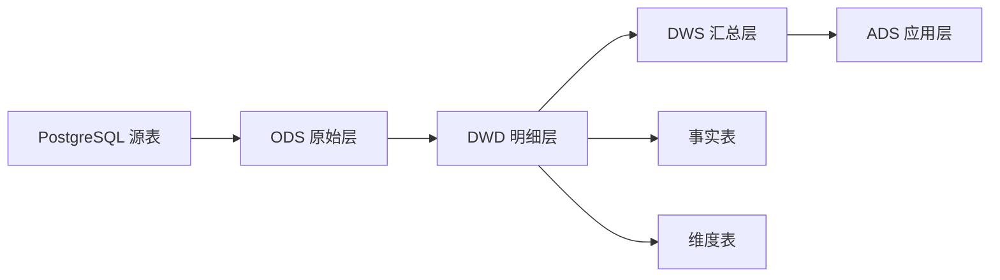

# 5. 数据仓库建模：从表设计到分析建模

::: tip 本章导读
把业务表重构成事实表、维度表、分层模型和稳定指标体系。
:::
::: info 本章验收问题
- 你能否把业务表重构成事实表、维度表和分层模型？
- 你能否说明指标口径应该沉淀在哪一层，而不是散落在报表里？
:::




业务库设计关注业务正确。

数仓设计关注分析效率、指标口径和数据复用。

## 问题切入

第 4 章说明了为什么业务交易和分析计算要分工。但把数据从 PostgreSQL 同步到另一个系统，并不自动得到一个可用的数据仓库。

如果只是把业务库表原样复制一份，分析团队很快会遇到新问题：

```text
orders 表一行是一笔订单，order_items 一行是订单商品明细，GMV 应该从哪张表算？
支付成功时间、订单创建时间、发货时间都存在，日报应该按哪个时间统计？
用户等级会变化，历史订单应该看当时等级还是当前等级？
运营、财务、增长团队都写 GMV，为什么结果不一样？
一个报表字段出错时，怎样知道它来自哪个源表和哪条任务？
```

这些问题不是查询引擎能单独解决的。ClickHouse、Spark、Trino 可以让查询更快，但不会自动告诉你业务过程、分析粒度、指标口径和数据责任应该如何设计。

## 核心判断

数仓不是复制业务库，而是把业务系统中的对象、事件和关系重构成可分析的数据语义。

> 数仓建模的核心，不是多建几层表，而是让业务过程、分析粒度、指标口径和数据责任变得清晰。

业务库的订单表和支付表，直接拿来算 GMV 会出问题——该关联哪个时间字段？退款要不要扣？这一章要解决的问题是：数据进入分析系统后，应该如何组织才能让指标口径清晰、复用方便、口径统一、维护成本可控。

数仓建模也不是万能的。它不能替代源系统正确性，不能让错误数据自动变正确，不能省掉 ETL/ELT、调度、质量校验和权限治理。它负责把数据进入分析系统之后的组织方式设计清楚。

## 机制解释

## 本章内容

| 节号 | 主题 |
|------|------|
| [05.1](/chapters/05/05-1) | 为什么业务库不能直接做分析 |
| [05.2](/chapters/05/05-2) | 数据仓库的核心概念 |
| [05.3](/chapters/05/05-3) | 数仓的基本术语 |
| [05.4](/chapters/05/05-4) | 数仓分层的必要性 |
| [05.5](/chapters/05/05-5) | 常见分层模型详解 |
| [05.6](/chapters/05/05-6) | 分层的实施策略 |
| [05.7](/chapters/05/05-7) | 维度建模基础 |
| [05.8](/chapters/05/05-8) | 事实表设计 |
| [05.9](/chapters/05/05-9) | 维度表设计 |
| [05.10](/chapters/05/05-10) | 常见建模模式 |
| [05.11](/chapters/05/05-11) | 指标体系设计 |
| [05.12](/chapters/05/05-12) | 指标管理实战 |


## 系统位置

本章承接第 4 章的 OLTP/OLAP 分工。

第 4 章解决的是“分析负载应该从业务库中分离出去”。第 5 章进一步回答：数据离开 PostgreSQL 后，不能只是换个地方存，还必须重新组织成分析模型。

数仓建模位于以下链路中间：

```text
PostgreSQL / MySQL 业务事实
  -> ETL / CDC 同步
  -> ODS 原始层
  -> DWD 明细事实与维度
  -> DWS 公共汇总
  -> ADS 应用数据
  -> BI / 指标服务 / 机器学习 / AI 应用
```

它向前依赖源系统的业务事实，向后支撑 OLAP 查询、批处理、实时指标、湖仓、特征工程和 AI 数据应用。如果这里没有明确粒度、维度和指标口径，后续再快的查询引擎也只会更快地产生不一致结果。

## 场景案例

### 七、从 PostgreSQL 业务表到数仓模型

假设源系统有：

```text
users
products
orders
order_items
payments
events
```

数仓不应该简单复制这些表就结束。

它要重构为分析模型：

```text
ODS
  -> ods_users
  -> ods_orders
  -> ods_order_items
  -> ods_payments
  -> ods_events

DWD
  -> dwd_order_detail
  -> dwd_payment_detail
  -> dwd_user_event_detail

DWS
  -> dws_user_daily
  -> dws_product_daily
  -> dws_order_daily

ADS
  -> ads_sales_dashboard
  -> ads_retention_report
  -> ads_conversion_funnel
```

这就是从业务库建模到分析建模的迁移。

以 GMV 看板为例，业务库中的 `orders` 表只记录订单主信息，`order_items` 记录商品明细，`payments` 记录支付事实。数仓建模时可以这样拆：

```text
ODS
  ods_orders                原样接入订单主表
  ods_order_items           原样接入订单商品明细
  ods_payments              原样接入支付记录

DWD
  dwd_order_payment_detail  对齐订单、明细、支付状态，形成支付口径明细

DWS
  dws_sales_daily           按日期、类目、渠道形成公共日汇总

ADS
  ads_sales_dashboard       面向经营看板的展示表
```

这里最重要的不是表名，而是每层责任：

- ODS 保留源系统形态，便于追溯。
- DWD 形成稳定明细事实，明确一行代表什么。
- DWS 把高频复用指标沉淀为公共汇总。
- ADS 面向具体看板和应用，不反向污染公共层口径。

## 常见误区

**误区一：数仓就是把业务库同步一份。**

同步只是入口。数仓真正的价值在于清洗、建模、分层、汇总、治理和口径统一。

**误区二：分层越多越专业。**

分层要服务复用和治理。没有明确作用的分层只会增加任务链路和维护成本。

**误区三：宽表能解决所有问题。**

宽表查询方便，但会带来冗余、更新困难、口径固化和存储成本。它适合高频应用场景，不适合替代全部建模。

**误区四：指标就是 SQL。**

SQL 是计算方式，指标还包括业务定义、口径、负责人、版本、血缘和质量要求。

**误区五：ODS、DWD、DWS、ADS 是固定模板。**

分层名称可以不同，关键是责任边界。小团队可以减少层数，大平台可以增加主题域和数据集市，但不能丢掉原始追溯、明细复用、公共汇总和应用隔离这些基本问题。

## 实战任务

基于电商业务表，设计一个最小数仓模型。

要求：

1. 设计 ODS 层源表映射。
2. 设计一个订单明细事实表。
3. 设计用户、商品、日期三个维度表。
4. 定义 GMV、订单数、客单价三个指标。
5. 说明每个指标的时间口径和过滤规则。
6. 设计一个面向经营看板的 ADS 表。

复盘问题：

- 哪些数据保持源系统原样？
- 哪些数据被清洗和标准化？
- 哪些表可以复用？
- 哪些指标需要负责人确认？
- 哪些字段需要质量校验？

进阶任务：为 GMV 写一份指标定义卡。

至少包含：

```text
指标名称：支付 GMV
业务含义：用户成功支付订单产生的交易金额
统计对象：支付成功的订单明细
计算公式：SUM(payment_amount 或 item_amount，按确认口径选择)
时间口径：支付成功时间
过滤规则：排除未支付、取消、测试、风控拦截订单
维度范围：日期、渠道、商品类目、用户等级、地区
负责人：经营分析负责人
数据血缘：orders / order_items / payments -> dwd_order_payment_detail -> dws_sales_daily
质量规则：支付金额非负、订单支付状态一致、明细金额与订单金额可对账
```

复盘时回答：这个指标如果被用于财务报表、运营看板和推荐系统特征，哪些字段和质量规则必须更加严格？

## 小结引出下一章

数仓建模把业务库中的数据重新组织成分析语义。

PostgreSQL 业务表关注业务正确，数仓模型关注分析效率、指标口径和跨团队复用。

下一章进入 ETL / ELT。

因为模型设计出来之后，必须回答一个工程问题：数据如何从 PostgreSQL 进入数仓，并在持续变化中保持可用、可信、可追踪？
