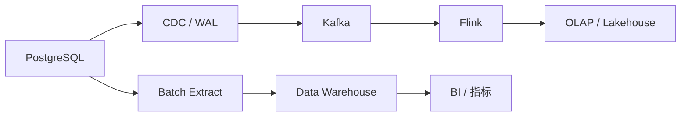

# 6. ETL / ELT：数据如何进入大数据系统

::: tip 本章导读
说明 PostgreSQL 数据如何通过批量同步、CDC、转换和调度进入数据平台。
:::
::: info 本章验收问题
- 你能否画出 PostgreSQL 到数仓或实时链路的同步路径？
- 你能否说明 ETL、ELT、CDC 在你的场景里各自承担什么责任？
:::




数据不是天然在数仓里。

## 问题切入

业务数据最初通常在 PostgreSQL、MySQL、业务日志、第三方系统或外部文件中。要让这些数据进入分析平台，必须经过抽取、同步、清洗、转换、装载和调度。

第 5 章已经设计了数仓模型：ODS、DWD、DWS、ADS，事实表、维度表和指标口径都已经明确。但模型只是目标形态，真实系统还要回答更工程化的问题：

```text
PostgreSQL 里的订单数据什么时候进入 ODS？
全量同步和增量同步如何切换？
源表新增字段后，下游任务会不会失败？
同步任务失败一天后，如何补回缺失数据？
CDC 消费变慢时，WAL 会不会堆积？
同一条订单变更被消费两次，指标会不会重复？
数据到达以后，怎样证明它完整、准确、及时？
```

如果这些问题没有设计清楚，数仓模型再漂亮也无法稳定运行。数据链路一旦不可信，下游报表、特征、RAG 知识库和治理系统都会失去基础。

## 核心判断

> 大数据平台的核心不是某一个计算引擎，而是持续、可信、可追踪的数据链路。

数据不会自己从业务库跑到分析系统。ETL 和 ELT 解决的是这个搬运过程——但搬运的质量决定了后续所有分析、模型、报表的可信度。这一章建立的是数据链路的工程判断：可恢复、可验证、可追踪。

它的边界也要明确。ETL / ELT 不能替代数仓建模，不能自动统一指标口径，不能让错误源数据变正确，也不能单独保证端到端 Exactly Once。它提供的是数据进入平台的工程链路，后续仍需要建模、质量、血缘、权限和调度治理。

## 机制解释

### 6.1 ETL vs ELT

第 5 章讲完了数仓建模——维度怎么设计、分层怎么规划。这一章进入数据工程的实操：怎么把业务库的数据搬到数仓里。先解决最基础的选型问题：ETL 还是 ELT。

#### 两者的区别就一个：转换发生在哪

ETL（Extract-Transform-Load）的流程是：从源库抽取数据 → 在独立的 ETL 服务器上做清洗和转换 → 把转换好的数据加载到数仓。数据在进入数仓之前已经"干净"了。

ELT（Extract-Load-Transform）反过来：从源库抽取数据 → 直接把原始数据加载到数仓的 ODS 层 → 在数仓内部用 SQL 做转换。数据先"扔"进数仓，再慢慢整理。

这个区别决定了后面的一切：用什么工具、对源库的影响、转换能有多复杂、团队需要什么技能。

ETL 的典型实现：

```python
# 1. Extract：从 MySQL 拉数据
df = pd.read_sql('SELECT * FROM orders WHERE created_at >= "2026-01-01"', mysql_conn)

# 2. Transform：在 Python 里清洗转换
df = df[df['order_amount'] > 0]  # 过滤无效数据
df = df.dropna(subset=['user_id'])
df['date_id'] = pd.to_datetime(df['created_at']).dt.strftime('%Y%m%d').astype(int)
df = df.merge(users_df, on='user_id', how='left')  # 关联用户维度

# 3. Load：写入数仓
df.to_sql('dwd_fact_orders', pg_conn, if_exists='append')
```

ELT 的典型实现：

```sql
-- 1. Extract + Load：CDC 工具直接把数据同步到 ODS 层（工具自动完成）
-- ods_orders 表已经有原始数据了

-- 2. Transform：在数仓内用 SQL 做转换
CREATE TABLE dwd_fact_orders AS
SELECT order_id,
       TO_CHAR(created_at, 'YYYYMMDD')::INT as date_id,
       user_id, product_id, order_amount
FROM ods_orders
WHERE order_amount > 0
  AND user_id IS NOT NULL
  AND order_status = 'completed';

-- 3. 继续 DWS 层
CREATE TABLE dws_daily_gmv AS
SELECT date_id, count(*) as order_count, sum(order_amount) as gmv
FROM dwd_fact_orders
GROUP BY date_id;
```

#### 什么时候选 ETL，什么时候选 ELT

这不是谁比谁先进的问题——是场景匹配的问题。

**选 ETL 的场景**：

- 源库性能敏感。核心交易系统的 MySQL 实例不能承受额外的计算负载。ETL 在独立服务器上完成所有转换，源库只负责一次数据抽取。
- 转换逻辑复杂。需要用外部 API 做数据增强（比如调用地址解析服务把经纬度转成城市名）、需要复杂的机器学习特征工程。SQL 写不了这些。
- 合规要求严格。金融数据在进入数仓之前必须脱敏——身份证号、手机号必须先在 ETL 服务器上处理掉，原始敏感数据不进数仓。

**选 ELT 的场景**：

- 数据量大（每天 TB 级）。现代云数仓（Snowflake、BigQuery）的计算能力远超独立的 ETL 服务器。把 TB 级数据在数仓内用大规模并行计算转换，比在一台 ETL 服务器上处理快得多。
- 云原生数仓。Snowflake、BigQuery、Redshift 的设计哲学就是 ELT——原始数据先落地，转换用 SQL 在数仓内推。这些数仓的查询优化器专为这种大 SQL 转换优化过。
- 团队 SQL 能力强。数据分析师擅长 SQL，用 dbt 写转换逻辑比用 Python 写 ETL 门槛低。转化率定义变了，数据分析师自己改 dbt 模型就行，不用找数据工程师写 Python。

**判断标准**：

| 条件 | 倾向 |
|------|------|
| 每天数据量 < 100GB | ETL 和 ELT 都行，选团队熟悉的 |
| 每天数据量 100GB - 1TB | ETL 如果转换复杂，ELT 如果转换简单 |
| 每天数据量 > 1TB | ELT，利用云数仓的计算能力 |
| 转换需要外部 API 或 ML | ETL，Python/Java 灵活性远超 SQL |
| 使用 Snowflake/BigQuery | ELT + dbt，原生最佳实践 |
| 源库是核心交易系统 | ETL，最小化对源库的影响 |
| 需要实时（秒级） | ETL 和 ELT 都不对——用流处理（第 8 章） |

#### 混合架构是常态

实践中很少纯 ETL 或纯 ELT。常见的混合方式：数据抽取用 CDC 工具（Airbyte、Fivetran）直接加载到 ODS 层（ELT 的 EL 部分），复杂的脱敏和增强逻辑在独立的 Python 服务中处理（ETL 的 T 部分），常规的清洗和聚合用 dbt 在数仓内完成（ELT 的 T 部分）。

举例：用户地址数据从 MySQL CDC 到 ODS → Python 服务调用地理编码 API 把地址转为经纬度（ELT 做不了的）→ 写回 ODS → dbt 做后续的维度关联和汇总（ELT 擅长的）。

#### ELT 和现代数据栈

2026 年，ELT 已经成为新项目的主流选择。背后的驱动力是云数仓的普及和 dbt 的兴起。现代数据栈的典型组合是：Fivetran/Airbyte（抽取+加载） + Snowflake/BigQuery（存储+计算） + dbt（转换）。这个组合让一个 3 人的数据团队就能支撑起每天 TB 级的数据处理。

但 ETL 没有消失。在你需要复杂转换、外部依赖、敏感数据脱敏的场景，独立的 ETL 服务仍然是更好的选择。两者不是替代关系，是分工。

#### 常见误区

**"ELT 比 ETL 更先进"**。不存在先进与否。ELT 适合云数仓 + SQL 转换的场景，ETL 适合复杂转换 + 敏感源库的场景。选择取决于约束条件，不取决于趋势。

**"ELT 不需要转换"**。ELT 的 T 在 Load 之后，转换仍然需要——只是换到了数仓内部用 SQL 完成。转换的工作量和 ETL 一样，位置不同。

**"必须二选一"**。混合架构是常态。CDC 负责抽取加载（EL），Python 负责复杂转换（ETL 的 T），dbt 负责常规转换（ELT 的 T）。

#### 小结

ETL 先转换后加载（独立服务器做转换），ELT 先加载后转换（数仓内做转换）。选型的核心变量：数据量、转换复杂度、源库性能敏感度、团队技能。混合架构是工程实践的自然选择。下一节展开数据抽取的具体方法——全量、增量、CDC 怎么实现。

### 6.2 数据抽取

不管是 ETL 还是 ELT，第一步永远是从源系统抽取数据。抽取方式直接影响数据管道的时效性、源系统的负载、以及数据完整性。三种方式：全量、增量、CDC。

#### 全量抽取

每次把源表全部数据拉过来。实现最简单：

```sql
-- 每天全量抽取（清空 ODS 后重灌）
TRUNCATE TABLE ods_orders;
INSERT INTO ods_orders
SELECT order_id, user_id, product_id, order_amount, order_status, created_at, updated_at
FROM business_db.orders;
```

全量抽取的优点是不需要追踪变化——不需要源表有 `updated_at` 字段，不需要关心 UPDATE 和 DELETE。缺点是数据量越大越慢。一张 5000 万行的订单表，全量抽取一次大概 30 分钟，期间持续占用源库的 I/O 和网络带宽。

适用场景明确：小表（< 100 万行）、字典表、配置表。对这些表，全量抽取比增量抽取更可靠（不用担心漏数据）。另外，首次初始化必须全量——先全量拉一份基线，之后才切换到增量。

#### 增量抽取

只抽取发生变化的数据。最常用的方式是基于时间戳：

```sql
-- 增量抽取：只拉取上次同步后更新的数据
INSERT INTO ods_orders
SELECT order_id, user_id, product_id, order_amount, order_status, created_at, updated_at
FROM business_db.orders
WHERE updated_at >= (
    SELECT last_sync_time FROM etl_logs
    WHERE table_name = 'ods_orders'
    ORDER BY sync_id DESC LIMIT 1
);

-- 更新同步时间
UPDATE etl_logs SET last_sync_time = NOW()
WHERE table_name = 'ods_orders';
```

增量抽取的前提是源表有 `updated_at` 字段且有索引。如果没有，有两个替代方案：

- **基于自增 ID**：只拉取 `order_id > last_max_id` 的行。问题是只能检测到 INSERT，检测不到 UPDATE 和 DELETE。
- **基于触发器**：在源表上创建触发器，把变化记录到一张变更日志表（change_log），ETL 从日志表抽取。能捕获所有变更（INSERT/UPDATE/DELETE），但触发器会拖慢源库的写入性能——每笔订单 INSERT 都会触发一次额外的日志写入。

增量抽取的盲区是 DELETE。时间戳和自增 ID 都感知不到 DELETE。如果源库物理删除了行，你的 ODS 层会一直保留着这些已删除的数据。解决办法：用软删除（源表用 `is_deleted` 字段标记而不是物理删除），或者用 CDC。

#### CDC（Change Data Capture）

CDC 是数据库层面提供的变更捕获机制——MySQL 的 Binlog、PostgreSQL 的 WAL（Write-Ahead Log）。数据库的每一次 INSERT/UPDATE/DELETE 都会记录在这些日志里，CDC 工具解析日志，把变更事件流式推送出来。

以 Debezium + Kafka 为例：

```
MySQL Binlog → Debezium → Kafka Topic → 消费者 → ODS 层
```

每条 Kafka 消息包含变更前后的数据：

```json
{
    "before": {"order_id": 12345, "order_amount": 100.00, "order_status": "pending"},
    "after":  {"order_id": 12345, "order_amount": 100.00, "order_status": "completed"},
    "op": "u",     // c=create, u=update, d=delete
    "ts_ms": 1641234567890
}
```

消费端逻辑：

```python
consumer = KafkaConsumer('customer.business_db.orders', ...)

for message in consumer:
    event = message.value
    if event['op'] == 'c':       # INSERT
        insert_to_ods(event['after'])
    elif event['op'] == 'u':     # UPDATE
        update_in_ods(event['after'])
    elif event['op'] == 'd':     # DELETE
        delete_from_ods(event['before']['order_id'])
```

CDC 的优势：实时性（秒级延迟）、完整性（捕获所有变更类型）、无侵入性（不影响源库查询性能，Debezium 只是读取日志文件）。代价是架构复杂度——你需要维护 Kafka 集群、管理 CDC connector、监控消费延迟。

#### 怎么选

经验规则：

- **表 < 100 万行** → 全量抽取。简单可靠。
- **表 > 100 万行，不需要实时** → 增量抽取（基于时间戳）。每天 T+1 批处理。
- **需要实时或无法容忍数据丢失** → CDC。核心业务表（订单、支付）、需要分钟级新鲜度的场景。
- **混合策略**：小表全量、大表增量、核心表 CDC。一个数仓通常同时用这三种。

全量 vs 增量的性能差异：一张 5000 万行的表，全量 30 分钟，增量（每天 10 万行新增）3 分钟——10 倍差距。对源库的影响也是 10 倍差距。这就是为什么大表必须增量。

#### 常见误区

**"全量抽取最简单所以用全量"**。数据量小时全量确实简单。但很多团队在全量抽取还没出问题时就养成了习惯，等到表涨到千万级才发现每天 ETL 跑 2 小时还跑不完。一开始就按表的大小选择策略。

**"增量抽取会遗漏数据"**。正确实现的增量抽取（记录 last_sync_time，使用 `>= `而不是 `>`）不会遗漏。需要处理的是边界情况：同一秒内有多条记录更新，`>=` 会重复抽取上次边界的数据——用 `ON CONFLICT DO UPDATE` 做幂等处理就行了。

**"CDC 一定需要 Kafka"**。Debezium 的典型部署依赖 Kafka，但不是必须。Debezium 有 embedded 模式（直接嵌入 Java 应用消费变更），也有支持直接写目标库的连接器。不过在生产环境里，Kafka 提供的消息持久化和解耦能力确实值得这个架构成本。

**"触发器是好的 CDC 方案"**。触发器会拖慢源库的写入性能。每个 INSERT 触发一次额外的日志表写入——如果源库每秒 1000 笔写入，触发器在此基础上再加 1000 次写入。Binlog/WAL 方案不影响源库性能，因为它只是读取已有的日志文件。

#### 小结

三种抽取方式的选择取决于数据量和实时性要求。小表全量，大表增量，核心表 CDC。首次初始化必须全量，之后切换为增量或 CDC。GTID 的消费端逻辑需要处理 INSERT/UPDATE/DELETE 三种事件类型。下一节讲数据抽取之后的事——数据转换（清洗、格式化、关联、聚合）。

### 6.3 数据转换

数据抽取到 ODS 层后是"生数据"——编码不统一、包含无效值、字段零散、缺少维度信息。转换这一步把生数据加工成分析可用的"熟数据"。转换发生在 ODS → DWD → DWS → ADS 的每一层之间。

#### 五种转换操作

**数据清洗**。干掉不该进入数仓的数据：

```sql
-- 过滤空值、异常值
WHERE user_id IS NOT NULL           -- 用户缺失的订单，删
  AND order_amount > 0              -- 负数金额，删
  AND order_status = 'completed'    -- 只看已完成
  AND is_deleted = false            -- 软删除的数据，排除

-- 去重（源系统可能出现重复订单号）
SELECT DISTINCT ON (order_id) order_id, ...
```

清洗的核心判断不是"能不能过滤"，而是"过滤标准要统一且可追溯"。如果上半年的 GMV 不含退款、下半年的 GMX 含退款，跨期对比就没有意义。清洗规则必须在全公司范围内达成一致，并记录在 dim_metrics 元数据表里。

**数据格式化**。统一不同源系统之间的数据格式差异：

```sql
-- 日期统一：多种格式 → YYYYMMDD 整数
TO_CHAR(created_at, 'YYYYMMDD')::INT as date_id

-- 性别统一：0/1、M/F、男/女 → M/F
CASE gender
    WHEN '0' THEN 'M' WHEN '1' THEN 'F'
    WHEN '男' THEN 'M' WHEN '女' THEN 'F'
    ELSE 'U'
END as gender

-- 布尔值统一：true/1/yes → TRUE
CASE WHEN is_vip IN ('true', '1', 'yes') THEN TRUE ELSE FALSE END as is_vip
```

**数据关联**。JOIN 维度表，把维度属性补到事实表上：

```sql
CREATE TABLE dwd_fact_orders AS
SELECT o.order_id, o.date_id, o.user_id, o.product_id, o.order_amount,
       u.city, u.province, u.segment,       -- 用户维度信息
       p.category, p.brand,                   -- 商品维度信息
       c.channel_name                         -- 渠道维度信息
FROM ods_orders o
LEFT JOIN dim_users u ON o.user_id = u.user_id
LEFT JOIN dim_products p ON o.product_id = p.product_id
LEFT JOIN dim_channels c ON o.channel_id = c.channel_id;
```

注意这里用 LEFT JOIN 而不是 INNER JOIN。如果某个订单的 user_id 在用户维度表里暂时找不到（维度表更新慢于事实表），INNER JOIN 会直接丢弃这条订单——这可能导致 GMV 数据丢失。LEFT JOIN 保留订单，用户属性字段留 NULL，后续可以补。

**数据聚合**。从 DWD 的明细数据汇总到 DWS 层：

```sql
-- 每日 GMV
CREATE TABLE dws_daily_gmv AS
SELECT date_id,
       COUNT(*) as order_count,
       SUM(order_amount) as gmv,
       AVG(order_amount) as avg_order_amount,
       COUNT(DISTINCT user_id) as user_count
FROM dwd_fact_orders
GROUP BY date_id;

-- 7 日滚动 GMV
SELECT date_id,
       SUM(gmv) OVER (ORDER BY date_id ROWS BETWEEN 6 PRECEDING AND CURRENT ROW) as gmv_7d
FROM dws_daily_gmv;

-- 累计 GMV（至今总 GMV）
SELECT date_id,
       SUM(gmv) OVER (ORDER BY date_id ROWS UNBOUNDED PRECEDING) as cumulative_gmv
FROM dws_daily_gmv;
```

**数据计算**。派生字段和业务指标：

```sql
-- 客单价 = GMV / 订单数
gmv / NULLIF(order_count, 0) as avg_order_amount

-- 转化率
conversion_user_count * 100.0 / NULLIF(visitor_count, 0) as conversion_rate

-- 用户分群
CASE
    WHEN total_order_amount >= 10000 THEN 'VIP'
    WHEN total_order_amount >= 1000 THEN '高价值'
    WHEN total_order_amount >= 100 THEN '普通'
    ELSE '低价值'
END as user_segment
```

注意 `NULLIF` 的使用——当分母为 0 时避免除零错误，返回 NULL 比直接报错更安全。

#### 转换的分层设计

每层之间的转换有明确的职责边界：

**ODS → DWD**：清洗 + 格式化 + 关联维度。输入是原始副本，输出是干净的明细数据。

```sql
CREATE TABLE dwd_fact_orders AS
SELECT o.order_id,
       TO_CHAR(o.created_at, 'YYYYMMDD')::INT as date_id,
       o.user_id, o.product_id, o.channel_id,
       u.city, u.segment,     -- 维度属性
       p.category, p.brand,   -- 维度属性
       o.order_amount, o.order_quantity
FROM ods_orders o
LEFT JOIN dim_users u ON o.user_id = u.user_id
LEFT JOIN dim_products p ON o.product_id = p.product_id
WHERE o.order_amount > 0 AND o.user_id IS NOT NULL AND o.order_status = 'completed';
```

**DWD → DWS**：聚合 + 计算派生指标。输入是明细数据，输出是按维度预汇总的数据。

```sql
CREATE TABLE dws_daily_gmv AS
SELECT date_id, city, category,
       COUNT(*) as order_count, SUM(order_amount) as gmv,
       AVG(order_amount) as avg_order_amount
FROM dwd_fact_orders
GROUP BY date_id, city, category;
```

**DWS → ADS**：面向应用的聚合 + 同比环比计算。输入是汇总数据，输出是可直接展示的报表数据。

```sql
CREATE TABLE ads_monthly_report AS
SELECT TO_CHAR(TO_DATE(date_id::TEXT, 'YYYYMMDD'), 'YYYY-MM') as month,
       city, category,
       SUM(gmv) as monthly_gmv,
       SUM(gmv) / LAG(SUM(gmv)) OVER (PARTITION BY city, category ORDER BY date_id) - 1 as gmv_mom
FROM dws_daily_gmv
GROUP BY month, city, category;
```

#### 转换的三个工程原则

**幂等性**。同样的输入跑两次，输出完全一致。实现方式：按分区处理——每天跑之前先 DELETE 当天的数据，再 INSERT，而不是直接 INSERT 叠加。

```sql
BEGIN;
DELETE FROM dwd_fact_orders WHERE date_id = 20260101;
INSERT INTO dwd_fact_orders SELECT ... FROM ods_orders WHERE date_id = 20260101;
COMMIT;
```

**可追溯性**。每个转换步骤记录日志：哪个表、哪一天、处理了多少行、花了多长时间、成功还是失败。

```sql
INSERT INTO etl_logs (table_name, operation, start_time, end_time, row_count, status)
VALUES ('dwd_fact_orders', 'transform', NOW(), NOW(),
        (SELECT count(*) FROM dwd_fact_orders WHERE date_id = 20260101), 'success');
```

**分区处理**。大表按日期分区——处理单天数据只操作一个分区，不影响其他分区的查询。

```sql
CREATE TABLE dwd_fact_orders (...) PARTITION BY RANGE (date_id);
CREATE TABLE dwd_fact_orders_202601 PARTITION OF dwd_fact_orders
    FOR VALUES FROM (20260101) TO (20260201);
```

#### 常见误区

**"转换逻辑越复杂越好"**。转换的目标是输出高质量、可复用的数据，不是展示 SQL 技巧。一个 200 行的转换 SQL 不如拆成 3 个 30 行的分步转换——每个步骤可测试、可验证、可复用。

**"转换不需要测试"**。转换 SQL 也是代码，会出错。最少做三方面验证：行数对比（源表过滤条件后的预期行数 vs 实际输出行数）、金额合计对比（ODS 层 sum(order_amount) vs DWD 层 sum(order_amount) 是否一致）、空值检查（关键字段 user_id、date_id 不能为 NULL）。

**"转换一次就完成"**。业务规则会变（GMV 定义从"不含退款"变成"含退款"）、源系统会变（新增字段）、数据量会变（需要调整分区）。数仓的转换逻辑是持续维护的，不是一次性工程。

#### 小结

五种转换操作：清洗（过滤无效数据）、格式化（统一编码格式）、关联（JOIN 维度表）、聚合（GROUP BY 汇总）、计算（派生字段和指标）。三个工程原则：幂等性、可追溯性、分区处理。ODS → DWD（清洗关联）、DWD → DWS（聚合计算）、DWS → ADS（应用交付）是数据在数仓内的三层加工流。下一节讲转换完了之后怎么把数据加载进目标表。

### 6.4 数据加载

转换做完之后，数据要写进目标表。加载这一步决定了数据怎么"落地"——全量覆写还是增量追加，能不能安全地回滚。

#### 三种加载方式

**全量加载**：TRUNCATE 目标表，重新灌入全部数据。逻辑最清晰，结果最确定——跑完就是完整的最新数据。

```sql
TRUNCATE TABLE dwd_fact_orders;
INSERT INTO dwd_fact_orders SELECT ... FROM ods_orders;
```

全量加载有两个代价。一是空窗期：TRUNCATE 和 INSERT 之间目标表是空的，如果这时候有查询跑过来会拿到空结果。在 PostgreSQL 里可以用事务包裹（TRUNCATE + INSERT 在一个事务里，外部查询看不到中间的空白状态）。二是性能：每次全量重写全部数据，对 5000 万行以上的表来说即使有索引加速也不轻松。

适用场景：维度表（通常几十万行以下）、DWD 层每天全量重构（数据清理最彻底）。

**增量加载**：只追加新增的数据，不动已有数据。

```sql
INSERT INTO dwd_fact_orders
SELECT ... FROM ods_orders
WHERE date_id = 20260101;  -- 只加载今天的数据
```

增量加载的问题是不能处理"已有数据被修改"的情况。源库里一笔订单的状态从 pending 变成 completed，增量加载不会更新数仓里已有的 pending 记录。这就引出了 Upsert。

**Upsert（INSERT ON CONFLICT UPDATE）**：存在就更新，不存在就插入。

```sql
INSERT INTO dwd_fact_orders (order_id, date_id, user_id, product_id, order_amount)
VALUES (12345, 20260101, 1001, 2001, 100.00)
ON CONFLICT (order_id) DO UPDATE SET
    date_id = EXCLUDED.date_id,
    user_id = EXCLUDED.user_id,
    order_amount = EXCLUDED.order_amount;
```

Upsert 完美匹配 CDC 场景——CDC 流里有 INSERT（新订单）也有 UPDATE（订单状态变更），Upsert 统一处理。代价是必须有唯一键（order_id 之类的主键）来做冲突判断，而且 Upsert 比单纯 INSERT 慢（每次都要检查主键是否存在）。

三者的适用场景：

| 加载方式 | 适用场景 | 典型表 |
|---------|---------|--------|
| 全量加载 | 小表、每天全量重构 | 维度表、DWD 层（中小规模） |
| 增量加载 | 只追加不修改的数据 | 日志表、事件表、IoT 数据 |
| Upsert | 数据会变化、CDC 流 | 维度表（SCD）、CDC 事实表 |

#### 维度表的加载

维度表的特殊性在于需要处理 SCD（缓慢变化维度）。

**SCD Type 1（覆盖更新）**：简单粗暴——用户改了个性签名，直接 UPDATE 覆盖，不保留历史。适合不重要、不需要追溯的属性。

```sql
-- Type 1：直接覆盖
UPDATE dim_users SET city = '上海' WHERE user_id = 1;
```

**SCD Type 2（追加版本）**：保留历史。用户等级从青铜变成白银，青铜这条记录仍然存在（标记过期），白银作为新版本加入。

```sql
-- Type 2：追加新版本，标记旧版本过期
-- 1. 插入新版本
INSERT INTO dim_users (user_id, user_name, city, version, effective_date, is_current)
VALUES (1, '张三', '上海', 2, CURRENT_DATE, TRUE);

-- 2. 标记旧版本过期
UPDATE dim_users
SET expiry_date = CURRENT_DATE - 1, is_current = FALSE
WHERE user_id = 1 AND version = 1 AND is_current = TRUE;
```

Type 2 的查询需要加 `WHERE is_current = TRUE` 才能拿到最新状态。这个条件对性能影响很小（is_current 字段有索引就行）。

#### 事实表的加载

事实表通常按日期分区，每天处理一个分区的数据：

```sql
-- 按分区加载：只操作当天的分区
DELETE FROM dwd_fact_orders_202601 WHERE date_id = 20260101;
INSERT INTO dwd_fact_orders_202601
SELECT ... FROM ods_orders WHERE date_id = 20260101;
```

分区加载的好处：DELETE + INSERT 只锁当天的分区，不影响其他日期的查询。而且可以并行处理多个分区。

#### 加载性能优化

四条优化策略，按效果从大到小排列：

**用 COPY 而不是 INSERT**。PostgreSQL 的 COPY 命令是批量加载最快的方式（比逐行 INSERT 快 10-100 倍）。

```python
import psycopg2
from io import StringIO

data = StringIO()
for row in orders:
    data.write(f"{row['order_id']}\t{row['date_id']}\t{row['user_id']}\t{row['amount']}\n")
data.seek(0)

cursor.copy_from(data, 'dwd_fact_orders', columns=('order_id', 'date_id', 'user_id', 'amount'))
```

**加载前删索引，加载后重建**。索引维护是加载过程中最慢的操作之一。对于全量加载（TRUNCATE + INSERT）：先 DROP 所有非主键索引，加载完再 CREATE。加载速度通常能提升 3-5 倍。

**批量提交**。不要每一行 INSERT 就 COMMIT 一次。把 10000 行放一个事务里提交，减少事务开销。

**并行加载不同分区**。如果表按日期分区，可以用多个进程/线程同时加载不同日期的分区。分区之间独立，不会相互锁。

#### 加载后的验证

加载完成后必须验证数据完整性。最少做两个检查：

```sql
-- 检查 1：行数是否合理
SELECT 'source' as src, count(*) FROM ods_orders WHERE date_id = 20260101
UNION ALL
SELECT 'target' as tgt, count(*) FROM dwd_fact_orders WHERE date_id = 20260101;

-- 检查 2：金额是否一致
SELECT 'source' as src, SUM(order_amount) FROM ods_orders WHERE date_id = 20260101
UNION ALL
SELECT 'target' as tgt, SUM(order_amount) FROM dwd_fact_orders WHERE date_id = 20260101;
```

如果行数或金额差异超过 1%，触发告警，人工介入排查。

#### 常见误区

**"全量加载最简单"**。实现简单不等于运维简单。当表涨到千万级，全量加载可能从 2 分钟膨胀到 30 分钟。一开始就应该按数据量的增长预期选择加载策略。

**"增量加载不需要处理删除"**。源库的 DELETE 操作在增量加载中感知不到。必须通过软删除（is_deleted 字段）或 CDC 来弥补。

**"Upsert 性能最好"**。Upsert 每次插入都要检查主键冲突，在批量大量数据时比纯 INSERT 慢。如果确定数据没有重复（比如只追加不修改的日志表），用纯 INSERT 更快。

**"加载不需要事务"**。一个加载流程里，DELETE 旧分区 + INSERT 新数据必须在同一个事务里。否则中间态（DELETE 完了但 INSERT 没完成）被查询碰到就是空数据。

#### 小结

三种加载方式：全量（小表、维度表）、增量（大日志表）、Upsert（CDC 数据、维度表 SCD）。维度表用 SCD Type 1（覆盖）或 Type 2（保留历史），事实表用分区加载。四条优化：COPY 代替 INSERT、临时删索引、批量提交、并行分区加载。加载后必须验证行数和金额一致性。

### 6.5 常见ETL工具

前面学习了ETL的概念和数据抽取、转换、加载的方法。

现在学习常见的ETL工具，了解如何使用工具简化ETL开发。

**场景**：
```yaml
数据仓库项目启动：
  
技术经理："我们需要选择ETL工具"
  
数据工程师A："我用Airflow，灵活强大"
  
数据工程师B："我用Fivetran，简单快速"
  
数据工程师C："我用Informatica，企业级"
  
新同事："这么多工具，应该怎么选？"
```

**问题**：
- 常见的ETL工具有哪些？
- 不同工具有什么特点？
- 如何选择合适的ETL工具？
- 开源工具 vs 商业工具如何选择？

**答案**：**根据团队规模、技术能力、预算、需求选择合适的ETL工具**

#### 一、ETL工具分类

##### 1.1 按部署方式分类

**自托管（On-Premise）**：
```yaml
定义：
  - 部署在自己的服务器
  - 自己维护
  
工具：
  - Airflow（开源）
  - dbt（开源）
  - Informatica PowerCenter（商业）
  
优势：
  - 数据安全
  - 可定制化
  - 无供应商锁定
  
劣势：
  - 需要运维
  - 需要硬件成本
  - 升级复杂
```

**云托管（Cloud-Hosted）**：
```yaml
定义：
  - 部署在云平台
  - 供应商维护
  
工具：
  - Fivetran（商业）
  - Airbyte（开源+商业）
  - Matillion（商业）
  
优势：
  - 无需运维
  - 快速上手
  - 自动扩展
  
劣势：
  - 数据在云端
  - 供应商锁定
  - 长期成本高
```

##### 1.2 按功能分类

**数据集成工具（Data Integration）**：
```yaml
功能：
  - 数据同步
  - CDC
  - 数据复制
  
工具：
  - Fivetran
  - Airbyte
  - Qlik Replicate
```

**工作流调度工具（Workflow Orchestration）**：
```yaml
功能：
  - 任务调度
  - 工作流管理
  - 依赖管理
  
工具：
  - Airflow
  - Prefect
  - Dagster
```

**数据转换工具（Data Transformation）**：
```yaml
功能：
  - 数据转换
  - SQL管理
  - 版本控制
  
工具：
  - dbt
  - SQLMesh
```

**企业级ETL平台**：
```yaml
功能：
  - 全功能ETL平台
  - 图形化界面
  - 企业级支持
  
工具：
  - Informatica PowerCenter
  - IBM InfoSphere DataStage
  - Talend
```

#### 二、开源ETL工具

##### 2.1 Apache Airflow

**定义**：工作流调度平台，用Python编写DAG（有向无环图）

**特点**：
```yaml
优势：
  - 开源免费
  - 社区活跃
  - 可扩展性强
  - 支持多种任务类型
  
劣势：
  - 学习曲线陡峭
  - 需要运维
  - 配置复杂
```

**示例**：
```python
# Airflow DAG示例
from airflow import DAG
from airflow.operators.python import PythonOperator
from datetime import datetime, timedelta
import psycopg2

# 默认参数
default_args = {
    'owner': 'data-team',
    'depends_on_past': False,
    'start_date': datetime(2026, 1, 1),
    'email': ['data-team@company.com'],
    'email_on_failure': True,
    'email_on_retry': False,
    'retries': 2,
    'retry_delay': timedelta(minutes=5),
}

# 创建DAG
dag = DAG(
    'daily_etl',
    default_args=default_args,
    description='每日ETL任务',
    schedule_interval='0 4 * * *',  # 每天凌晨4点
    catchup=False,
    tags=['etl', 'daily'],
)

# 任务1：抽取数据
def extract_data():
    conn = psycopg2.connect(host='mysql-server', database='business_db')
    df = pd.read_sql('SELECT * FROM orders WHERE date >= CURRENT_DATE - 1', conn)
    df.to_csv('/data/orders.csv', index=False)
    conn.close()

# 任务2：转换数据
def transform_data():
    df = pd.read_csv('/data/orders.csv')
    df = df[df['order_amount'] > 0]
    df.to_csv('/data/orders_transformed.csv', index=False)

# 任务3：加载数据
def load_data():
    conn = psycopg2.connect(host='postgres-server', database='data_warehouse')
    cursor = conn.cursor()
    
    df = pd.read_csv('/data/orders_transformed.csv')
    for _, row in df.iterrows():
        cursor.execute("""
            INSERT INTO dwd_fact_orders 
            (order_id, date_id, user_id, product_id, order_amount)
            VALUES (%s, %s, %s, %s, %s)
            ON CONFLICT (order_id) DO UPDATE SET
                date_id = EXCLUDED.date_id,
                user_id = EXCLUDED.user_id,
                product_id = EXCLUDED.product_id,
                order_amount = EXCLUDED.order_amount
        """, (row['order_id'], row['date_id'], row['user_id'], 
              row['product_id'], row['order_amount']))
    
    conn.commit()
    conn.close()

# 定义任务
extract_task = PythonOperator(
    task_id='extract_data',
    python_callable=extract_data,
    dag=dag,
)

transform_task = PythonOperator(
    task_id='transform_data',
    python_callable=transform_data,
    dag=dag,
)

load_task = PythonOperator(
    task_id='load_data',
    python_callable=load_data,
    dag=dag,
)

# 设置依赖关系
extract_task >> transform_task >> load_task
```

**适用场景**：
```yaml
场景1：复杂工作流
  示例：多步骤ETL、复杂依赖关系
  原因：Airflow擅长管理复杂依赖
  
场景2：自定义任务
  示例：需要Python代码
  原因：支持Python Operator
  
场景3：有技术团队
  示例：有数据工程团队
  原因：需要运维Airflow
```

##### 2.2 dbt（data build tool）

**定义**：数据转换工具，用SQL编写转换逻辑

**特点**：
```yaml
优势：
  - SQL-based，学习成本低
  - 版本控制友好
  - 自动生成文档
  - 模块化设计
  
劣势：
  - 只做转换，不做抽取
  - SQL灵活性有限
  - 需要配合其他工具
```

**示例**：
```sql
-- models/staging/orders.sql
-- ODS层 → DWD层

{{ config(
    materialized='table',
    schema='dwd'
) }}

SELECT 
    order_id,
    TO_CHAR(created_at, 'YYYYMMDD')::INT as date_id,
    user_id,
    product_id,
    order_amount
FROM {{ source('ods', 'orders') }}
WHERE order_amount > 0
  AND user_id IS NOT NULL
  AND order_status = 'completed';
```

```sql
-- models/marts/daily_gmv.sql
-- DWD层 → DWS层

{{ config(
    materialized='table',
    schema='dws'
) }}

SELECT 
    date_id,
    COUNT(*) as order_count,
    SUM(order_amount) as gmv,
    AVG(order_amount) as avg_order_amount
FROM {{ ref('staging_orders') }}
GROUP BY date_id;
```

```yaml
# dbt_project.yml
name: 'my_data_warehouse'
version: '1.0.0'
config-version: 2

profile: 'my_data_warehouse'

model-paths: ["models"]
seed-paths: ["seeds"]
test-paths: ["tests"]

target-path: "target"
clean-targets:
  - "target"
  - "dbt_packages"
```

```sql
-- profiles.yml
my_data_warehouse:
  target: dev
  outputs:
    dev:
      type: postgres
      host: localhost
      user: postgres
      password: password
      port: 5432
      dbname: data_warehouse
      schema: dws
      threads: 4
```

**执行dbt**：
```bash
# 运行所有模型
dbt run

# 运行特定模型
dbt run --models staging_orders

# 测试
dbt test

# 生成文档
dbt docs generate
dbt docs serve
```

**适用场景**：
```yaml
场景1：SQL转换
  示例：DWD → DWS转换
  原因：dbt擅长SQL转换
  
场景2：版本控制
  示例：需要Git管理
  原因：dbt代码是SQL文件
  
场景3：数据团队
  示例：数据分析师为主
  原因：SQL比Python简单
```

##### 2.3 Airbyte

**定义**：数据集成平台，支持多种数据源和目标

**特点**：
```yaml
优势：
  - 开源
  - 支持300+数据源
  - UI界面友好
  - 支持CDC
  
劣势：
  - 功能相对简单
  - 自定义能力有限
```

**示例**：
```yaml
# Airbyte配置
source:
  type: postgres
  connection:
    host: mysql-server
    port: 3306
    database: business_db
    username: root
    password: password

destination:
  type: postgres
  connection:
    host: postgres-server
    port: 5432
    database: data_warehouse
    username: postgres
    password: password

streams:
  - name: orders
    namespace: public
    destination_namespace: ods
    sync_mode: full_refresh_overwrite  # 或 cdc_incremental
```

**适用场景**：
```yaml
场景1：数据同步
  示例：MySQL → PostgreSQL
  原因：Airbyte擅长数据同步
  
场景2：CDC
  示例：实时数据同步
  原因：Airbyte支持CDC
  
场景3：简单集成
  示例：不需要复杂转换
  原因：Airbyte配置简单
```

#### 三、商业ETL工具

##### 3.1 Fivetran

**定义**：云托管的数据集成平台

**特点**：
```yaml
优势：
  - 零运维
  - 支持150+数据源
  - 自动处理Schema变更
  - 自动重试
  
劣势：
  - 价格昂贵
  - 自定义能力有限
  - 供应商锁定
  
定价：
  - 按数据行数计费
  - 例如：$0.10/1000行
```

**适用场景**：
```yaml
场景1：预算充足
  示例：大公司
  原因：Fivetran价格高
  
场景2：无运维团队
  示例：小团队
  原因：Fivetran零运维
  
场景3：快速实施
  示例：MVP阶段
  原因：Fivetran快速上手
```

##### 3.2 Informatica PowerCenter

**定义**：企业级ETL平台

**特点**：
```yaml
优势：
  - 功能强大
  - 图形化界面
  - 企业级支持
  - 性能优秀
  
劣势：
  - 价格昂贵
  - 学习曲线陡峭
  - 部署复杂
  
定价：
  - 许可费 + 维护费
  - 例如：$100,000+/年
```

**适用场景**：
```yaml
场景1：大型企业
  示例：500强企业
  原因：需要企业级支持
  
场景2：复杂ETL
  示例：复杂数据转换
  原因：Informatica功能强大
  
场景3：传统行业
  示例：银行、保险
  原因：需要成熟稳定方案
```

#### 四、工具选择指南

##### 4.1 决策树

```yaml
第1步：预算多少？
  低预算（<$10,000/年）
    → 开源工具（Airflow + dbt + Airbyte）
  
  中等预算（$10,000-$100,000/年）
    → 混合方案（Fivetran + dbt）
  
  高预算（>$100,000/年）
    → 商业工具（Informatica）

第2步：团队能力如何？
  强工程能力（Python/Java）
    → Airflow
  
  强SQL能力
    → dbt
  
  弱技术能力
    → Fivetran

第3步：需要自定义吗？
  需要高度自定义
    → Airflow
  
  中等自定义
    → dbt
  
  不需要自定义
    → Fivetran

第4步：有运维团队吗？
  有
    → 自托管工具
  
  没有
    → 云托管工具
```

##### 4.2 常见组合

**组合1：Airflow + dbt + Airbyte**
```yaml
适用：
  - 开源方案
  - 中等技术团队
  - 预算有限
  
分工：
  - Airbyte：数据同步（CDC）
  - dbt：数据转换（SQL）
  - Airflow：工作流调度
  
成本：
  - $0（开源）
  - 但需要运维成本
```

**组合2：Fivetran + dbt**
```yaml
适用：
  - 云原生方案
  - 小团队
  - 预算充足
  
分工：
  - Fivetran：数据同步（CDC）
  - dbt：数据转换（SQL）
  
成本：
  - $50,000+/年
  - 零运维
```

**组合3：Airflow**
```yaml
适用：
  - 全栈方案
  - 强技术团队
  - 预算有限
  
分工：
  - Airflow：抽取+转换+加载+调度
  
成本：
  - $0（开源）
  - 高开发成本
```

**组合4：Informatica**
```yaml
适用：
  - 企业级方案
  - 大型团队
  - 预算充足
  
分工：
  - Informatica：全功能ETL平台
  
成本：
  - $100,000+/年
  - 包含支持
```

#### 五、实战示例

##### 5.1 使用Airflow + dbt + Airbyte

**架构**：
```text
MySQL → Airbyte(CDC) → PostgreSQL(ODS) → dbt(Transform) → PostgreSQL(DWD/DWS)
                              ↓
                         Airflow(调度)
```

**Airflow DAG**：
```python
from airflow import DAG
from airflow.operators.airbyte import AirbyteTriggerSyncOperator
from airflow.providers.dbt.operators.dbt import DbtRunOperator
from datetime import datetime

dag = DAG(
    'daily_etl',
    start_date=datetime(2026, 1, 1),
    schedule_interval='0 4 * * *',
    catchup=False,
)

# 任务1：Airbyte同步数据
sync_orders = AirbyteTriggerSyncOperator(
    task_id='sync_orders',
    airbyte_conn_id='airbyte',
    connection_id='订单同步连接ID',
    dag=dag,
)

# 任务2：dbt运行转换
run_dbt = DbtRunOperator(
    task_id='run_dbt',
    profiles_dir='/usr/local/airflow/dags/dbt',
    dir='/usr/local/airflow/dags/dbt',
    dag=dag,
)

# 设置依赖
sync_orders >> run_dbt
```

**dbt模型**：
```sql
-- models/dwd_fact_orders.sql
{{ config(materialized='table', schema='dwd') }}

SELECT 
    order_id,
    TO_CHAR(created_at, 'YYYYMMDD')::INT as date_id,
    user_id,
    product_id,
    order_amount
FROM {{ source('ods', 'orders') }}
WHERE order_amount > 0;
```

#### 六、常见误区

**误区一：商业工具一定比开源工具好**

- **说明**：商业工具和开源工具各有优劣
- **后果**：盲目选择商业工具，浪费预算
- **正确理解**：
  - 商业工具：功能全、支持好、价格高
  - 开源工具：灵活、免费、需要运维
  - 根据需求选择

**误区二：工具越复杂越好**

- **说明**：工具要根据团队规模和能力选择
- **后果**：工具太复杂，团队无法驾驭
- **正确理解**：
  - 小团队：简单工具（Fivetran）
  - 大团队：复杂工具（Airflow）
  - 根据团队能力选择

**误区三：一个工具解决所有问题**

- **说明**：通常需要多个工具组合
- **后果**：强用一个工具，效果差
- **正确理解**：
  - 工具组合：Airbyte + dbt + Airflow
  - 各司其职
  - 发挥各自优势

**误区四：开源工具免费**

- **说明**：开源工具虽然免费，但需要人力成本
- **后果**：低估总成本
- **正确理解**：
  - 开源工具：零许可费，高人力成本
  - 商业工具：高许可费，低人力成本
  - 综合评估总成本

**误区五：工具选择一成不变**

- **说明**：工具选择会随业务发展而变化
- **后果**：工具不适配业务
- **正确理解**：
  - 初创期：Fivetran
  - 成长期：Airflow + dbt
  - 成熟期：自研平台
  - 持续评估

#### 七、实战任务

**任务1：选择ETL工具**

场景1：初创公司，5人数据团队，预算有限
```yaml
决策：
  → Airflow + dbt + Airbyte
  
原因：
  - 预算有限，选择开源
  - 团队小，需要简单方案
  - 有一定技术能力
```

场景2：大公司，50人数据团队，预算充足
```yaml
决策：
  → Fivetran + dbt + 自研平台
  
原因：
  - 预算充足
  - 需要零运维的数据同步
  - 有能力自研平台
```

**任务2：设计ETL架构**

使用Airflow + dbt + Airbyte：

```yaml
架构：
  数据同步：Airbyte（CDC）
  数据转换：dbt（SQL）
  工作流调度：Airflow

数据流：
  MySQL → Airbyte → PostgreSQL(ODS) → dbt → PostgreSQL(DWD/DWS)
                              ↓
                         Airflow调度
```

**任务3：评估工具成本**

开源方案（Airflow + dbt + Airbyte）：
```yaml
许可费：$0
硬件成本：$5,000/年（服务器）
人力成本：$200,000/年（1个数据工程师）
总成本：$205,000/年
```

商业方案（Fivetran）：
```yaml
许可费：$100,000/年
硬件成本：$0（云托管）
人力成本：$50,000/年（0.5个数据分析师）
总成本：$150,000/年
```

结论：对于大公司，商业方案总成本更低。

#### 八、小结

常见的ETL工具有开源和商业两类，根据团队规模、技术能力、预算选择合适的工具。

核心要点：
- 工具分类：自托管 vs 云托管、数据集成 vs 工作流调度 vs 数据转换
- 开源工具：Airflow（调度）、dbt（转换）、Airbyte（集成）
- 商业工具：Fivetran（集成）、Informatica（全功能ETL）
- 工具选择：根据预算、团队能力、自定义需求、运维能力选择
- 常见组合：Airflow+dbt+Airbyte（开源）、Fivetran+dbt（混合）
- 成本评估：开源工具低许可费高人力成本，商业工具高许可费低人力成本

下一节将学习工作流调度，了解如何管理ETL任务的依赖和调度。

### 6.6 工作流调度

上一节学习了常见ETL工具，了解了Airflow、dbt、Airbyte等工具的使用。

ETL任务通常不是单一的，而是有依赖关系的工作流。需要工作流调度工具来管理这些任务。

**场景**：
```yaml
数据仓库项目：
  
数据工程师："我每天要运行10个ETL任务"
  
技术经理："这些任务有依赖关系吗？"
  
数据工程师："有的，DWD层完成后才能运行DWS层"
  
技术经理："如果任务失败了怎么办？"
  
新同事："如何管理这些复杂的任务依赖？"
```

**问题**：
- 什么是工作流调度？
- 如何设计任务依赖？
- 如何处理任务失败？
- 如何保证SLA？

**答案**：**使用工作流调度工具（如Airflow）管理ETL任务的依赖、调度、监控、重试**

#### 一、为什么需要工作流调度

**第一，ETL任务有依赖关系**

```yaml
场景1：分层依赖
  ODS层 → DWD层 → DWS层 → ADS层
  
问题：
  - DWD层完成后，才能运行DWS层
  - 如何管理这种依赖？
  
解决：
  - 工作流调度工具自动管理依赖
```

**第二，ETL任务需要定时执行**

```yaml
场景2：定时任务
  - 每天凌晨4点运行ETL
  - 每小时运行增量加载
  
问题：
  - 如何定时执行？
  - 如何处理时区？
  
解决：
  - 工作流调度工具支持Cron表达式
```

**第三，ETL任务可能失败**

```yaml
场景3：任务失败
  - 数据源不可用
  - 数据格式错误
  - 资源不足
  
问题：
  - 如何重试？
  - 如何告警？
  - 如何避免阻塞下游任务？
  
解决：
  - 工作流调度工具支持重试、告警、跳过
```

#### 二、工作流调度的核心概念

##### 2.1 DAG（Directed Acyclic Graph）

**定义**：有向无环图，表示任务的依赖关系

**示例**：
```text
     [任务A]
       /   \
   [任务B] [任务C]
      \     /
      [任务D]
```

**特点**：
```yaml
有向：
  - 任务有方向
  - A → B表示A完成后运行B
  
无环：
  - 不能有循环依赖
  - A → B → C → A（不允许）
  
原因：
  - 避免死锁
  - 确保任务能完成
```

##### 2.2 任务（Task）

**定义**：DAG中的节点，表示一个具体的操作

**示例**：
```python
# Airflow任务示例
from airflow.operators.python import PythonOperator

# 任务1：抽取数据
extract_task = PythonOperator(
    task_id='extract_data',
    python_callable=extract_data_function,
    dag=dag,
)

# 任务2：转换数据
transform_task = PythonOperator(
    task_id='transform_data',
    python_callable=transform_data_function,
    dag=dag,
)

# 任务3：加载数据
load_task = PythonOperator(
    task_id='load_data',
    python_callable=load_data_function,
    dag=dag,
)
```

**任务类型**：
```yaml
Python任务：
  - 运行Python函数
  - 示例：extract_task = PythonOperator(...)

SQL任务：
  - 运行SQL查询
  - 示例：sql_task = SQLOperator(...)

Bash任务：
  - 运行Shell脚本
  - 示例：bash_task = BashOperator(...)

传感器任务：
  - 等待某个条件满足
  - 示例：sensor_task = FileSensor(...)
```

##### 2.3 依赖关系（Dependencies）

**定义**：任务之间的执行顺序

**设置方式**：
```python
# 方式1：使用>>运算符
extract_task >> transform_task >> load_task

# 方式2：使用set_downstream
extract_task.set_downstream([transform_task])
transform_task.set_downstream([load_task])

# 方式3：使用set_upstream
load_task.set_upstream([transform_task])
transform_task.set_upstream([extract_task])
```

**复杂依赖**：
```python
# 场景：多个任务并行
extract_task1 >> [transform_task1, transform_task2]
# 或
extract_task1 >> transform_task1
extract_task1 >> transform_task2

# 场景：多个任务汇聚
[transform_task1, transform_task2] >> load_task

# 场景：复杂依赖
extract_task1 >> transform_task1 >> load_task
extract_task2 >> transform_task2 >> load_task
```

#### 三、Airflow实战

##### 3.1 创建DAG

```python
from airflow import DAG
from airflow.operators.python import PythonOperator
from datetime import datetime, timedelta
import psycopg2
import pandas as pd

# DAG配置
default_args = {
    'owner': 'data-team',
    'depends_on_past': False,
    'start_date': datetime(2026, 1, 1),
    'email': ['data-team@company.com'],
    'email_on_failure': True,
    'email_on_retry': False,
    'retries': 2,
    'retry_delay': timedelta(minutes=5),
}

# 创建DAG
dag = DAG(
    'daily_etl_orders',
    default_args=default_args,
    description='每日订单ETL',
    schedule_interval='0 4 * * *',  # 每天凌晨4点
    catchup=False,
    tags=['etl', 'orders', 'daily'],
    max_active_runs=1,  # 同时最多运行1个实例
)
```

##### 3.2 定义任务函数

```python
# 函数1：抽取数据
def extract_orders(**context):
    # 获取执行日期
    execution_date = context['execution_date']
    date_id = int(execution_date.strftime('%Y%m%d'))
    
    # 从MySQL抽取
    conn_mysql = pymysql.connect(
        host='mysql-server',
        user='root',
        password='password',
        database='business_db'
    )
    
    df = pd.read_sql(f"""
        SELECT 
            order_id,
            user_id,
            product_id,
            order_amount,
            order_status,
            created_at
        FROM orders
        WHERE DATE(created_at) = '{execution_date.date()}'
    """, conn_mysql)
    
    conn_mysql.close()
    
    # 保存到文件
    df.to_csv(f'/data/orders_{date_id}.csv', index=False)
    
    print(f"Extracted {len(df)} orders for {date_id}")

# 函数2：转换数据
def transform_orders(**context):
    execution_date = context['execution_date']
    date_id = int(execution_date.strftime('%Y%m%d'))
    
    # 读取文件
    df = pd.read_csv(f'/data/orders_{date_id}.csv')
    
    # 数据清洗
    df = df[df['order_amount'] > 0]
    df = df[df['user_id'].notna()]
    df = df[df['order_status'] == 'completed']
    
    # 数据转换
    df['date_id'] = date_id
    
    # 保存转换后的数据
    df.to_csv(f'/data/orders_transformed_{date_id}.csv', index=False)
    
    print(f"Transformed to {len(df)} valid orders")

# 函数3：加载数据
def load_orders(**context):
    execution_date = context['execution_date']
    date_id = int(execution_date.strftime('%Y%m%d'))
    
    # 读取转换后的数据
    df = pd.read_csv(f'/data/orders_transformed_{date_id}.csv')
    
    # 加载到PostgreSQL
    conn_pg = psycopg2.connect(
        host='postgres-server',
        user='postgres',
        password='password',
        database='data_warehouse'
    )
    cursor = conn_pg.cursor()
    
    # 删除当天数据
    cursor.execute(f"DELETE FROM dwd_fact_orders WHERE date_id = {date_id}")
    
    # 插入新数据
    for _, row in df.iterrows():
        cursor.execute("""
            INSERT INTO dwd_fact_orders 
            (order_id, date_id, user_id, product_id, order_amount)
            VALUES (%s, %s, %s, %s, %s)
        """, (row['order_id'], row['date_id'], row['user_id'], 
              row['product_id'], row['order_amount']))
    
    conn_pg.commit()
    cursor.close()
    conn_pg.close()
    
    print(f"Loaded {len(df)} orders to data warehouse")

# 函数4：数据质量检查
def quality_check(**context):
    execution_date = context['execution_date']
    date_id = int(execution_date.strftime('%Y%m%d'))
    
    conn_pg = psycopg2.connect(
        host='postgres-server',
        user='postgres',
        password='password',
        database='data_warehouse'
    )
    cursor = conn_pg.cursor()
    
    # 检查1：行数检查
    cursor.execute(f"SELECT COUNT(*) FROM dwd_fact_orders WHERE date_id = {date_id}")
    row_count = cursor.fetchone()[0]
    
    if row_count == 0:
        raise Exception(f"No data loaded for {date_id}")
    
    # 检查2：金额检查
    cursor.execute(f"""
        SELECT COUNT(*) FROM dwd_fact_orders 
        WHERE date_id = {date_id} AND order_amount <= 0
    """)
    invalid_amount = cursor.fetchone()[0]
    
    if invalid_amount > 0:
        raise Exception(f"Found {invalid_amount} orders with invalid amount")
    
    cursor.close()
    conn_pg.close()
    
    print(f"Quality check passed for {date_id}: {row_count} rows")
```

##### 3.3 创建任务并设置依赖

```python
# 创建任务
extract_task = PythonOperator(
    task_id='extract_orders',
    python_callable=extract_orders,
    dag=dag,
)

transform_task = PythonOperator(
    task_id='transform_orders',
    python_callable=transform_orders,
    dag=dag,
)

load_task = PythonOperator(
    task_id='load_orders',
    python_callable=load_orders,
    dag=dag,
)

quality_check_task = PythonOperator(
    task_id='quality_check',
    python_callable=quality_check,
    dag=dag,
)

# 设置依赖关系
extract_task >> transform_task >> load_task >> quality_check_task
```

##### 3.4 完整DAG示例

```python
from airflow import DAG
from airflow.operators.python import PythonOperator
from datetime import datetime, timedelta
import pymysql
import psycopg2
import pandas as pd

# DAG配置
default_args = {
    'owner': 'data-team',
    'depends_on_past': False,
    'start_date': datetime(2026, 1, 1),
    'email': ['data-team@company.com'],
    'email_on_failure': True,
    'email_on_retry': False,
    'retries': 2,
    'retry_delay': timedelta(minutes=5),
}

# 创建DAG
dag = DAG(
    'daily_etl_orders',
    default_args=default_args,
    description='每日订单ETL',
    schedule_interval='0 4 * * *',
    catchup=False,
    tags=['etl', 'orders'],
)

# 定义任务函数
def extract_orders(**context):
    execution_date = context['execution_date']
    date_id = int(execution_date.strftime('%Y%m%d'))
    
    conn = pymysql.connect(
        host='mysql-server',
        user='root',
        password='password',
        database='business_db'
    )
    
    df = pd.read_sql(f"""
        SELECT order_id, user_id, product_id, order_amount, order_status, created_at
        FROM orders
        WHERE DATE(created_at) = '{execution_date.date()}'
    """, conn)
    
    conn.close()
    df.to_csv(f'/data/orders_{date_id}.csv', index=False)
    print(f"Extracted {len(df)} orders")

def transform_orders(**context):
    execution_date = context['execution_date']
    date_id = int(execution_date.strftime('%Y%m%d'))
    
    df = pd.read_csv(f'/data/orders_{date_id}.csv')
    df = df[df['order_amount'] > 0]
    df = df[df['user_id'].notna()]
    df['date_id'] = date_id
    df.to_csv(f'/data/orders_transformed_{date_id}.csv', index=False)
    print(f"Transformed to {len(df)} valid orders")

def load_orders(**context):
    execution_date = context['execution_date']
    date_id = int(execution_date.strftime('%Y%m%d'))
    
    df = pd.read_csv(f'/data/orders_transformed_{date_id}.csv')
    
    conn = psycopg2.connect(
        host='postgres-server',
        user='postgres',
        password='password',
        database='data_warehouse'
    )
    cursor = conn.cursor()
    
    cursor.execute(f"DELETE FROM dwd_fact_orders WHERE date_id = {date_id}")
    
    for _, row in df.iterrows():
        cursor.execute("""
            INSERT INTO dwd_fact_orders 
            (order_id, date_id, user_id, product_id, order_amount)
            VALUES (%s, %s, %s, %s, %s)
        """, (row['order_id'], row['date_id'], row['user_id'], 
              row['product_id'], row['order_amount']))
    
    conn.commit()
    cursor.close()
    conn.close()
    print(f"Loaded {len(df)} orders")

# 创建任务
extract_task = PythonOperator(
    task_id='extract_orders',
    python_callable=extract_orders,
    dag=dag,
)

transform_task = PythonOperator(
    task_id='transform_orders',
    python_callable=transform_orders,
    dag=dag,
)

load_task = PythonOperator(
    task_id='load_orders',
    python_callable=load_orders,
    dag=dag,
)

# 设置依赖
extract_task >> transform_task >> load_task
```

#### 四、任务调度策略

##### 4.1 调度时间

```python
# 每天凌晨4点
schedule_interval='0 4 * * *'

# 每小时
schedule_interval='0 * * * *'

# 每周一凌晨3点
schedule_interval='0 3 * * 1'

# 每6小时
schedule_interval='0 */6 * * *'

# 使用cron预设
schedule_interval='@daily'     # 每天
schedule_interval='@hourly'    # 每小时
schedule_interval='@weekly'    # 每周
schedule_interval='@monthly'   # 每月
```

##### 4.2 时区处理

```python
from airflow.utils.timezone import make_aware

# 设置时区
dag = DAG(
    'daily_etl_orders',
    schedule_interval='0 4 * * *',  # UTC时间
    timezone='Asia/Shanghai',  # DAG时区
    ...
)

# 任务中使用时区
def get_execution_date(**context):
    execution_date = context['execution_date']
    # 转换为本地时区
    local_date = make_aware(execution_date, timezone='Asia/Shanghai')
    print(f"Execution date (local): {local_date}")
```

#### 五、错误处理和重试

##### 5.1 重试策略

```python
# 任务级别重试
task = PythonOperator(
    task_id='extract_orders',
    python_callable=extract_orders,
    retries=3,  # 最多重试3次
    retry_delay=timedelta(minutes=5),  # 重试间隔5分钟
    retry_exponential_backoff=True,  # 指数退避
    max_retry_delay=timedelta(minutes=30),  # 最大重试间隔
)

# DAG级别重试
default_args = {
    'retries': 2,
    'retry_delay': timedelta(minutes=5),
}
```

##### 5.2 错误处理

```python
# 使用try-except
def extract_orders(**context):
    try:
        conn = pymysql.connect(...)
        df = pd.read_sql(...)
        conn.close()
        return df
    except Exception as e:
        print(f"Error: {e}")
        # 记录到日志系统
        send_alert(f"Extract failed: {e}")
        raise  # 重新抛出异常，触发重试
```

#### 六、SLA管理

##### 6.1 定义SLA

```python
from airflow.utils.dates import days_ago

# DAG级别SLA
dag = DAG(
    'daily_etl_orders',
    schedule_interval='0 4 * * *',
    sla=timedelta(hours=2),  # 必须在调度后2小时内完成
    ...
)

# 任务级别SLA
task = PythonOperator(
    task_id='extract_orders',
    python_callable=extract_orders,
    sla=timedelta(hours=1),  # 必须在1小时内完成
    ...
)
```

##### 6.2 SLA监控

```python
# SLA错过告警
def sla_miss_callback(dag, task_list, blocking_task_list, slas, blocking_tis):
    send_email(
        subject=f"SLA Missed: {dag.dag_id}",
        body=f"Tasks {task_list} missed SLA"
    )

dag = DAG(
    'daily_etl_orders',
    schedule_interval='0 4 * * *',
    sla_miss_callback=sla_miss_callback,
    ...
)
```

#### 七、常见误区

**误区一：所有任务都串行**

- **说明**：可以并行执行没有依赖的任务
- **后果**：总耗时长
- **正确理解**：
  - 识别可并行的任务
  - 合理设置依赖关系
  - 提升效率

**误区二：catchup=True**

- **说明**：catchup=True会补跑历史任务
- **后果**：启动时运行大量历史任务
- **正确理解**：
  - 生产环境设置catchup=False
  - 避免启动时运行历史任务

**误区三：忽略时区**

- **说明**：Airflow默认使用UTC时区
- **后果**：调度时间错误
- **正确理解**：
  - 明确指定时区
  - 或使用UTC时间

**误区四：不设置SLA**

- **说明**：SLA可以帮助监控任务完成时间
- **后果**：任务延迟无法及时发现
- **正确理解**：
  - 设置合理的SLA
  - 配置SLA告警

**误区五：忽略重试配置**

- **说明**：合理的重试可以提高任务成功率
- **后果**：临时故障导致任务失败
- **正确理解**：
  - 设置重试次数和间隔
  - 使用指数退避

#### 八、实战任务

**任务1：设计多层级ETL工作流**

```python
# ODS层ETL
ods_task = PythonOperator(
    task_id='ods_etl',
    python_callable=ods_etl_function,
    dag=dag,
)

# DWD层ETL（多个表并行）
dwd_orders_task = PythonOperator(
    task_id='dwd_orders_etl',
    python_callable=dwd_orders_etl_function,
    dag=dag,
)

dwd_users_task = PythonOperator(
    task_id='dwd_users_etl',
    python_callable=dwd_users_etl_function,
    dag=dag,
)

dwd_products_task = PythonOperator(
    task_id='dwd_products_etl',
    python_callable=dwd_products_etl_function,
    dag=dag,
)

# DWS层ETL
dws_gmv_task = PythonOperator(
    task_id='dws_gmv_etl',
    python_callable=dws_gmv_etl_function,
    dag=dag,
)

# 依赖关系
ods_task >> [dwd_orders_task, dwd_users_task, dwd_products_task] >> dws_gmv_task
```

**任务2：配置错误处理**

```python
default_args = {
    'owner': 'data-team',
    'depends_on_past': False,
    'start_date': datetime(2026, 1, 1),
    'email': ['data-team@company.com'],
    'email_on_failure': True,
    'email_on_retry': False,
    'retries': 3,
    'retry_delay': timedelta(minutes=5),
    'retry_exponential_backoff': True,
    'max_retry_delay': timedelta(minutes=30),
}
```

**任务3：设置SLA和告警**

```python
dag = DAG(
    'daily_etl',
    default_args=default_args,
    schedule_interval='0 4 * * *',
    sla=timedelta(hours=3),
    sla_miss_callback=sla_miss_callback,
    catchup=False,
    max_active_runs=1,
)
```

#### 九、小结

工作流调度是管理ETL任务依赖、调度、监控的关键，使用Airflow等工具可以自动化管理复杂的ETL工作流。

核心要点：
- 核心概念：DAG（有向无环图）、任务（Task）、依赖关系（Dependencies）
- Airflow实战：创建DAG、定义任务函数、设置依赖关系
- 调度策略：Cron表达式、时区处理
- 错误处理：重试策略、错误捕获
- SLA管理：定义SLA、SLA监控、SLA告警
- 最佳实践：并行执行、catchup=False、明确时区、设置SLA、配置重试

下一节将学习数据质量监控，了解如何监控和保证ETL数据质量。

### 6.7 数据质量监控

前面学习了ETL工具和工作流调度，了解了如何管理和调度ETL任务。

ETL任务运行后，如何确保数据质量？如何发现和解决数据质量问题？

**场景**：
```yaml
数据仓库日常运行：
  
数据分析师："为什么今天的GMV数据不对？"
  
数据工程师："让我检查一下..."
  
数据工程师："发现昨天的ETL任务部分失败了"
  
数据分析师："有没有办法提前发现问题？"
  
技术经理："我们需要数据质量监控"
```

**问题**：
- 什么是数据质量？
- 如何监控数据质量？
- 如何定义数据质量规则？
- 如何处理数据质量问题？

**答案**：**建立数据质量监控体系，定义质量规则，自动检查和告警，及时发现和解决数据质量问题**

#### 一、数据质量的维度

##### 1.1 完整性（Completeness）

**定义**：数据是否完整，有没有缺失

**示例**：
```yaml
问题1：数据缺失
  示例：用户表的city字段有很多NULL
  影响：无法按城市分析
  
问题2：数据量异常
  示例：今天只有1000条订单，平时有10000条
  影响：数据不完整
  
问题3：时间缺失
  示例：某个小时的数据缺失
  影响：时间序列不完整
```

**检查规则**：
```sql
-- 检查1：NULL值检查
SELECT 
    COUNT(*) FILTER (WHERE user_id IS NULL) as null_user_id,
    COUNT(*) FILTER (WHERE order_amount IS NULL) as null_order_amount,
    COUNT(*) FILTER (WHERE city IS NULL) as null_city
FROM dwd_fact_orders
WHERE date_id = 20260101;

-- 检查2：数据量检查
SELECT 
    date_id,
    COUNT(*) as row_count
FROM dwd_fact_orders
WHERE date_id >= 20260101 AND date_id < 20260201
GROUP BY date_id
ORDER BY date_id;

-- 检查3：时间连续性检查
WITH date_series AS (
    SELECT generate_series(
        20260101, 
        20260131, 
        1
    ) as date_id
)
SELECT 
    ds.date_id,
    COUNT(f.order_id) as order_count
FROM date_series ds
LEFT JOIN dwd_fact_orders f ON ds.date_id = f.date_id
GROUP BY ds.date_id
HAVING COUNT(f.order_id) = 0;  -- 找出没有订单的日期
```

##### 1.2 准确性（Accuracy）

**定义**：数据是否准确，有没有错误

**示例**：
```yaml
问题1：数值异常
  示例：订单金额为负数或0
  影响：GMV计算错误
  
问题2：格式错误
  示例：日期格式不正确
  影响：数据无法使用
  
问题3：逻辑错误
  示例：下单时间晚于支付时间
  影响：数据不合理
```

**检查规则**：
```sql
-- 检查1：数值范围检查
SELECT 
    COUNT(*) FILTER (WHERE order_amount < 0) as negative_amount,
    COUNT(*) FILTER (WHERE order_amount = 0) as zero_amount,
    COUNT(*) FILTER (WHERE order_amount > 1000000) as excessive_amount
FROM dwd_fact_orders
WHERE date_id = 20260101;

-- 检查2：日期格式检查
SELECT 
    COUNT(*) FILTER (WHERE date_id < 20200101 OR date_id > 20991231) as invalid_date
FROM dwd_fact_orders;

-- 检查3：逻辑检查
SELECT 
    COUNT(*) as invalid_orders
FROM dwd_fact_orders
WHERE payment_time < order_time;  -- 支付时间早于下单时间
```

##### 1.3 一致性（Consistency）

**定义**：数据是否一致，有没有矛盾

**示例**：
```yaml
问题1：跨表不一致
  示例：事实表的用户ID在维度表中不存在
  影响：关联查询失败
  
问题2：字段不一致
  示例：同一字段在不同表中有不同含义
  影响：混淆
  
问题3：汇总不一致
  示例：明细表的总和与汇总表不一致
  影响：数据可信度低
```

**检查规则**：
```sql
-- 检查1：外键一致性检查
SELECT 
    COUNT(DISTINCT f.user_id) as fact_user_count,
    COUNT(DISTINCT d.user_id) as dim_user_count,
    COUNT(DISTINCT f.user_id) - COUNT(DISTINCT d.user_id) as diff
FROM dwd_fact_orders f
FULL JOIN dim_users d ON f.user_id = d.user_id
WHERE f.date_id = 20260101;

-- 检查2：汇总一致性检查
WITH detail_sum AS (
    SELECT SUM(order_amount) as total_amount
    FROM dwd_fact_orders
    WHERE date_id = 20260101
),
summary_sum AS (
    SELECT gmv as total_amount
    FROM dws_daily_gmv
    WHERE date_id = 20260101
)
SELECT 
    detail_sum.total_amount as detail_total,
    summary_sum.total_amount as summary_total,
    ABS(detail_sum.total_amount - summary_sum.total_amount) as diff
FROM detail_sum, summary_sum;

-- 检查3：唯一性检查
SELECT 
    user_id,
    COUNT(*) as duplicate_count
FROM dim_users
GROUP BY user_id
HAVING COUNT(*) > 1;  -- 找出重复的用户ID
```

##### 1.4 及时性（Timeliness）

**定义**：数据是否及时，有没有延迟

**示例**：
```yaml
问题1：数据延迟
  示例：今天是1月2日，但12月31日的数据还没到
  影响：报表不是最新的
  
问题2：更新延迟
  示例：ETL任务应该在凌晨4点完成，实际8点才完成
  影响：数据时效性差
```

**检查规则**：
```sql
-- 检查1：数据新鲜度检查
SELECT 
    MAX(date_id) as max_date_id,
    CURRENT_DATE - TO_DATE(MAX(date_id)::TEXT, 'YYYYMMDD') as days_lag
FROM dwd_fact_orders;

-- 检查2：更新时间检查
SELECT 
    table_name,
    MAX(updated_at) as last_update_time,
    CURRENT_TIMESTAMP - MAX(updated_at) as update_lag
FROM etl_logs
GROUP BY table_name;
```

#### 二、数据质量监控框架

##### 2.1 质量规则定义

**创建质量规则表**：
```sql
-- 数据质量规则表
CREATE TABLE dq_rules (
    rule_id INT PRIMARY KEY,
    rule_name VARCHAR(100) NOT NULL,
    rule_type VARCHAR(50) NOT NULL,  -- completeness/accuracy/consistency/timeliness
    table_name VARCHAR(100) NOT NULL,
    rule_sql TEXT NOT NULL,
    severity VARCHAR(50) NOT NULL,  -- critical/warning/info
    owner VARCHAR(100),
    created_at TIMESTAMP DEFAULT CURRENT_TIMESTAMP
);

-- 示例规则
INSERT INTO dq_rules (rule_name, rule_type, table_name, rule_sql, severity, owner) VALUES
('订单金额不能为负', 'accuracy', 'dwd_fact_orders', 
 'SELECT COUNT(*) FROM dwd_fact_orders WHERE order_amount < 0 AND date_id = {{date_id}}', 
 'critical', '张三'),

('用户ID不能为空', 'completeness', 'dwd_fact_orders',
 'SELECT COUNT(*) FILTER (WHERE user_id IS NULL) FROM dwd_fact_orders WHERE date_id = {{date_id}}',
 'critical', '张三'),

('外键一致性检查', 'consistency', 'dwd_fact_orders',
 'SELECT COUNT(DISTINCT f.user_id) - COUNT(DISTINCT d.user_id) FROM dwd_fact_orders f LEFT JOIN dim_users d ON f.user_id = d.user_id WHERE f.date_id = {{date_id}}',
 'warning', '李四'),

('数据量检查', 'completeness', 'dwd_fact_orders',
 'SELECT CASE WHEN COUNT(*) < 1000 THEN 1 ELSE 0 END FROM dwd_fact_orders WHERE date_id = {{date_id}}',
 'warning', '张三');
```

##### 2.2 质量检查执行

**创建质量检查函数**：
```sql
-- 数据质量检查函数
CREATE OR REPLACE FUNCTION run_quality_checks(p_date_id INT)
RETURNS TABLE(
    rule_id INT,
    rule_name VARCHAR(100),
    rule_type VARCHAR(50),
    check_result BIGINT,
    status VARCHAR(50),
    error_message TEXT
) AS $$
DECLARE
    v_rule RECORD;
    v_result BIGINT;
    v_status VARCHAR(50);
    v_rule_sql TEXT;
BEGIN
    -- 遍历所有规则
    FOR v_rule IN SELECT * FROM dq_rules LOOP
        -- 替换SQL中的变量
        v_rule_sql := REPLACE(v_rule.rule_sql, '{{date_id}}', p_date_id::TEXT);
        
        -- 执行检查
        BEGIN
            EXECUTE v_rule_sql INTO v_result;
            
            -- 判断状态
            IF v_result > 0 THEN
                -- 有问题
                IF v_rule.severity = 'critical' THEN
                    v_status := 'fail';
                ELSE
                    v_status := 'warning';
                END IF;
            ELSE
                -- 没问题
                v_status := 'pass';
            END IF;
            
            -- 返回结果
            RETURN QUERY
            SELECT v_rule.rule_id, v_rule.rule_name, v_rule.rule_type, v_result, v_status, NULL::TEXT;
            
        EXCEPTION WHEN OTHERS THEN
            -- SQL执行失败
            RETURN QUERY
            SELECT v_rule.rule_id, v_rule.rule_name, v_rule.rule_type, 0::BIGINT, 'error', SQLERRM::TEXT;
        END;
    END LOOP;
    
    RETURN;
END;
$$ LANGUAGE plpgsql;

-- 执行质量检查
SELECT * FROM run_quality_checks(20260101);
```

##### 2.3 质量报告生成

**创建质量报告表**：
```sql
-- 数据质量报告表
CREATE TABLE dq_reports (
    report_id INT PRIMARY KEY,
    date_id INT NOT NULL,
    total_rules INT NOT NULL,
    passed_rules INT NOT NULL,
    failed_rules INT NOT NULL,
    warning_rules INT NOT NULL,
    error_rules INT NOT NULL,
    overall_status VARCHAR(50) NOT NULL,  -- pass/warning/fail
    report_time TIMESTAMP DEFAULT CURRENT_TIMESTAMP
);

-- 生成质量报告
CREATE OR REPLACE FUNCTION generate_quality_report(p_date_id INT)
RETURNS INT AS $$
DECLARE
    v_report_id INT;
    v_total_rules INT;
    v_passed_rules INT;
    v_failed_rules INT;
    v_warning_rules INT;
    v_error_rules INT;
    v_overall_status VARCHAR(50);
BEGIN
    -- 统计规则执行结果
    SELECT 
        COUNT(*),
        COUNT(*) FILTER (WHERE status = 'pass'),
        COUNT(*) FILTER (WHERE status = 'fail'),
        COUNT(*) FILTER (WHERE status = 'warning'),
        COUNT(*) FILTER (WHERE status = 'error')
    INTO v_total_rules, v_passed_rules, v_failed_rules, v_warning_rules, v_error_rules
    FROM run_quality_checks(p_date_id);
    
    -- 判断整体状态
    IF v_failed_rules > 0 OR v_error_rules > 0 THEN
        v_overall_status := 'fail';
    ELSIF v_warning_rules > 0 THEN
        v_overall_status := 'warning';
    ELSE
        v_overall_status := 'pass';
    END IF;
    
    -- 插入报告
    INSERT INTO dq_reports (
        date_id, total_rules, passed_rules, failed_rules, 
        warning_rules, error_rules, overall_status
    ) VALUES (
        p_date_id, v_total_rules, v_passed_rules, v_failed_rules,
        v_warning_rules, v_error_rules, v_overall_status
    ) RETURNING report_id INTO v_report_id;
    
    -- 记录详情
    INSERT INTO dq_report_details (report_id, rule_id, rule_name, rule_type, check_result, status)
    SELECT 
        v_report_id, 
        rule_id, rule_name, rule_type, check_result, status
    FROM run_quality_checks(p_date_id);
    
    RETURN v_report_id;
END;
$$ LANGUAGE plpgsql;

-- 执行报告生成
SELECT generate_quality_report(20260101);
```

#### 三、质量监控Dashboard

##### 3.1 质量趋势查询

```sql
-- 质量趋势（最近30天）
SELECT 
    date_id,
    total_rules,
    passed_rules,
    failed_rules,
    warning_rules,
    error_rules,
    overall_status
FROM dq_reports
WHERE date_id >= 20260101 AND date_id < 20260201
ORDER BY date_id;
```

##### 3.2 问题规则Top10

```sql
-- 最近30天失败次数最多的规则
SELECT 
    dr.rule_id,
    dr.rule_name,
    dr.rule_type,
    COUNT(*) as fail_count
FROM dq_report_details rd
JOIN dq_rules dr ON rd.rule_id = dr.rule_id
WHERE rd.status IN ('fail', 'warning')
  AND rd.report_id IN (
      SELECT report_id FROM dq_reports 
      WHERE date_id >= 20260101 AND date_id < 20260201
  )
GROUP BY dr.rule_id, dr.rule_name, dr.rule_type
ORDER BY fail_count DESC
LIMIT 10;
```

#### 四、告警机制

##### 4.1 告警规则

```sql
-- 告警规则表
CREATE TABLE dq_alert_rules (
    alert_rule_id INT PRIMARY KEY,
    rule_name VARCHAR(100) NOT NULL,
    alert_condition TEXT NOT NULL,  -- 告警条件SQL
    alert_type VARCHAR(50) NOT NULL,  -- email/sms/webhook
    alert_target VARCHAR(255) NOT NULL,  -- 告警目标（邮箱/手机号/Webhook URL）
    is_active BOOLEAN DEFAULT TRUE,
    created_at TIMESTAMP DEFAULT CURRENT_TIMESTAMP
);

-- 示例告警规则
INSERT INTO dq_alert_rules (rule_name, alert_condition, alert_type, alert_target) VALUES
('质量检查失败告警',
 'SELECT COUNT(*) FROM dq_reports WHERE overall_status = ''fail'' AND date_id = {{date_id}}',
 'email',
 'data-team@company.com'),

('数据量异常告警',
 'SELECT CASE WHEN COUNT(*) < 1000 THEN 1 ELSE 0 END FROM dwd_fact_orders WHERE date_id = {{date_id}}',
 'email',
 'data-team@company.com');
```

##### 4.2 告警发送

```sql
-- 告警发送函数
CREATE OR REPLACE FUNCTION send_alerts(p_date_id INT)
RETURNS void AS $$
DECLARE
    v_alert_rule RECORD;
    v_should_alert BOOLEAN;
    v_alert_condition TEXT;
BEGIN
    -- 遍历所有告警规则
    FOR v_alert_rule IN SELECT * FROM dq_alert_rules WHERE is_active = TRUE LOOP
        -- 替换条件中的变量
        v_alert_condition := REPLACE(v_alert_rule.alert_condition, '{{date_id}}', p_date_id::TEXT);
        
        -- 检查是否需要告警
        EXECUTE v_alert_condition INTO v_should_alert;
        
        IF v_should_alert THEN
            -- 发送告警
            IF v_alert_rule.alert_type = 'email' THEN
                -- 发送邮件
                PERFORM send_email(
                    v_alert_rule.alert_target,
                    '数据质量告警',
                    format('数据质量检查失败，date_id=%s', p_date_id)
                );
                
            ELSIF v_alert_rule.alert_type = 'webhook' THEN
                -- 发送Webhook
                PERFORM send_webhook(
                    v_alert_rule.alert_target,
                    jsonb_build_object(
                        'date_id', p_date_id,
                        'message', '数据质量检查失败'
                    )
                );
            END IF;
        END IF;
    END LOOP;
END;
$$ LANGUAGE plpgsql;
```

#### 五、数据质量改进

##### 5.1 根因分析

```sql
-- 创建质量问题跟踪表
CREATE TABLE dq_issues (
    issue_id INT PRIMARY KEY,
    issue_title VARCHAR(200) NOT NULL,
    issue_description TEXT,
    root_cause TEXT,
    severity VARCHAR(50),
    status VARCHAR(50) DEFAULT 'open',  -- open/investigating/fixed/closed
    assigned_to VARCHAR(100),
    created_at TIMESTAMP DEFAULT CURRENT_TIMESTAMP,
    updated_at TIMESTAMP DEFAULT CURRENT_TIMESTAMP
);

-- 示例问题
INSERT INTO dq_issues (issue_title, issue_description, root_cause, severity, assigned_to) VALUES
('订单金额为负数', '2026-01-01发现100条订单金额为负数', '业务系统Bug，退款订单金额未处理', 'critical', '张三'),
('用户ID缺失', '部分订单的用户ID为NULL', '数据抽取时用户表关联失败', 'warning', '李四');
```

##### 5.2 持续改进

```yaml
改进措施1：修复源头
  - 修复业务系统Bug
  - 优化数据抽取逻辑
  
改进措施2：增加验证
  - 源系统增加数据验证
  - ETL过程增加数据清洗
  
改进措施3：优化监控
  - 增加质量检查规则
  - 调整告警阈值
```

#### 六、常见误区

**误区一：数据质量不重要**

- **说明**：数据质量是数据仓库的生命线
- **后果**：数据不可信，业务方不使用
- **正确理解**：
  - 数据质量至关重要
  - 需要持续监控
  - 及时修复问题

**误区二：质量规则越多越好**

- **说明**：质量规则要聚焦核心问题
- **后果**：规则太多，告警疲劳
- **正确理解**：
  - 定义核心质量规则
  - 关注critical级别
  - 定期review规则

**误区三：质量检查不影响性能**

- **说明**：质量检查可能影响ETL性能
- **后果**：ETL耗时增加
- **正确理解**：
  - 合理设计检查规则
  - 避免复杂SQL
  - 考虑异步检查

**误区四：质量检查是一次性的**

- **说明**：数据质量需要持续监控
- **后果**：问题复发
- **正确理解**：
  - 建立监控体系
  - 定期生成报告
  - 持续改进

**误区五：质量检查只是技术问题**

- **说明**：数据质量需要业务参与
- **后果**：规则不合理
- **正确理解**：
  - 业务方定义质量标准
  - 技术方实现监控
  - 共同保证质量

#### 七、实战任务

**任务1：定义质量规则**

```sql
-- 订单表质量规则
INSERT INTO dq_rules (rule_name, rule_type, table_name, rule_sql, severity, owner) VALUES
-- 完整性规则
('用户ID不能为空', 'completeness', 'dwd_fact_orders',
 'SELECT COUNT(*) FILTER (WHERE user_id IS NULL) FROM dwd_fact_orders WHERE date_id = {{date_id}}',
 'critical', '张三'),

('订单金额不能为空', 'completeness', 'dwd_fact_orders',
 'SELECT COUNT(*) FILTER (WHERE order_amount IS NULL) FROM dwd_fact_orders WHERE date_id = {{date_id}}',
 'critical', '张三'),

-- 准确性规则
('订单金额不能为负', 'accuracy', 'dwd_fact_orders',
 'SELECT COUNT(*) FILTER (WHERE order_amount < 0) FROM dwd_fact_orders WHERE date_id = {{date_id}}',
 'critical', '张三'),

-- 一致性规则
('外键一致性检查', 'consistency', 'dwd_fact_orders',
 'SELECT COUNT(DISTINCT f.user_id) - COUNT(DISTINCT d.user_id) FROM dwd_fact_orders f LEFT JOIN dim_users d ON f.user_id = d.user_id WHERE f.date_id = {{date_id}}',
 'warning', '李四'),

-- 及时性规则
('数据新鲜度检查', 'timeliness', 'dwd_fact_orders',
 'SELECT CASE WHEN MAX(date_id) < EXTRACT(YEAR FROM CURRENT_DATE)*10000 + EXTRACT(MONTH FROM CURRENT_DATE)*100 + EXTRACT(DAY FROM CURRENT_DATE) - 1 THEN 1 ELSE 0 END FROM dwd_fact_orders',
 'warning', '张三');
```

**任务2：执行质量检查**

```sql
-- 执行质量检查
SELECT * FROM run_quality_checks(20260101);

-- 生成质量报告
SELECT generate_quality_report(20260101);

-- 查看报告
SELECT 
    date_id,
    total_rules,
    passed_rules,
    failed_rules,
    warning_rules,
    overall_status
FROM dq_reports
WHERE date_id = 20260101;

-- 查看详情
SELECT 
    rule_name,
    rule_type,
    check_result,
    status
FROM dq_report_details
WHERE report_id = (SELECT report_id FROM dq_reports WHERE date_id = 20260101);
```

**任务3：配置告警**

```sql
-- 配置告警规则
INSERT INTO dq_alert_rules (rule_name, alert_condition, alert_type, alert_target) VALUES
('Critical质量检查失败',
 'SELECT COUNT(*) FROM dq_reports WHERE overall_status = ''fail'' AND date_id = {{date_id}}',
 'email',
 'data-team@company.com'),

('数据量异常',
 'SELECT CASE WHEN COUNT(*) < 1000 THEN 1 ELSE 0 END FROM dwd_fact_orders WHERE date_id = {{date_id}}',
 'email',
 'data-team@company.com');

-- 发送告警
SELECT send_alerts(20260101);
```

#### 八、小结

数据质量监控通过定义质量规则、自动检查、生成报告、发送告警，确保数据仓库的数据质量。

核心要点：
- 质量维度：完整性、准确性、一致性、及时性
- 质量规则：定义规则表、执行检查函数
- 质量报告：生成报告、记录详情、趋势分析
- 告警机制：定义告警规则、发送告警
- 持续改进：根因分析、修复问题、优化规则
- 最佳实践：聚焦核心规则、定期review、业务参与

下一节将学习错误处理和重试，了解如何处理ETL任务失败和异常情况。

### 6.8 错误处理和重试

前面学习了数据质量监控，了解了如何监控数据质量和发送告警。

当ETL任务出现错误时，如何处理？如何自动重试？如何避免错误影响下游任务？

**场景**：
```yaml
数据仓库日常运行：
  
运维工程师："今天凌晨4点的ETL任务失败了"
  
数据工程师："是什么错误？"
  
运维工程师："数据库连接失败"
  
数据工程师："重试了吗？"
  
运维工程师："配置了重试3次，但都失败了"
  
新同事："如何处理各种错误？如何配置重试策略？"
```

**问题**：
- ETL任务有哪些常见错误？
- 如何分类和处理不同类型的错误？
- 如何设计重试策略？
- 如何避免错误级联影响？

**答案**：**建立完善的错误处理和重试机制，根据错误类型采取不同策略，确保ETL任务的稳定性**

#### 一、常见错误类型

##### 1.1 临时性错误（Transient Errors）

**定义**：暂时性故障，重试后可能成功

**示例**：
```yaml
错误1：网络超时
  示例：连接MySQL超时
  原因：网络抖动
  处理：重试
  
错误2：数据库连接失败
  示例：PostgreSQL连接池满
  原因：连接数不足
  处理：等待后重试
  
错误3：资源不足
  示例：内存不足
  原因：系统资源紧张
  处理：等待后重试
  
错误4：锁等待
  示例：表被锁定
  原因：其他任务正在写入
  处理：等待后重试
```

**特点**：
```yaml
临时性：
  - 不是持续性的错误
  - 重试后可能成功
  
处理：
  - 自动重试
  - 增加重试间隔
  - 限制重试次数
```

##### 1.2 持续性错误（Permanent Errors）

**定义**：持续性故障，重试无法解决

**示例**：
```yaml
错误1：SQL语法错误
  示例：SELECT语句语法错误
  原因：代码Bug
  处理：修复代码
  
错误2：表不存在
  示例：查询的表不存在
  原因：表未创建或名称错误
  处理：创建表或修正名称
  
错误3：权限不足
  示例：没有INSERT权限
  原因：权限配置错误
  处理：授予权限
  
错误4：数据格式错误
  示例：日期格式不正确
  原因：源数据格式错误
  处理：数据清洗
```

**特点**：
```yaml
持续性：
  - 重试无法解决
  - 需要人工干预
  
处理：
  - 不重试
  - 立即失败
  - 发送告警
```

##### 1.3 逻辑错误（Logical Errors）

**定义**：代码逻辑问题，数据不符合预期

**示例**：
```yaml
错误1：数据量为0
  示例：查询返回0行数据
  原因：数据源没有新数据
  处理：跳过或告警
  
错误2：数据异常
  示例：GMV异常增长100倍
  原因：数据错误或业务变化
  处理：人工确认
  
错误3：依赖缺失
  示例：上游任务未完成
  原因：上游任务失败
  处理：等待上游任务
```

#### 二、错误分类和处理策略

##### 2.1 错误分类

```python
# 错误分类函数
def classify_error(error):
    """
    根据错误类型分类
    返回: 'transient' | 'permanent' | 'logical'
    """
    error_message = str(error).lower()
    error_type = type(error).__name__
    
    # 临时性错误
    transient_keywords = [
        'timeout', 'connection', 'network', 'temporarily',
        'deadlock', 'lock', 'resource'
    ]
    
    if any(keyword in error_message for keyword in transient_keywords):
        return 'transient'
    
    # 持续性错误
    permanent_keywords = [
        'syntax', 'permission', 'does not exist',
        'invalid', 'malformed'
    ]
    
    if any(keyword in error_message for keyword in permanent_keywords):
        return 'permanent'
    
    # 默认为逻辑错误
    return 'logical'
```

##### 2.2 处理策略

```python
# 错误处理策略
def handle_error(error, retry_count=0):
    """
    根据错误类型采取不同策略
    """
    error_type = classify_error(error)
    
    if error_type == 'transient':
        # 临时性错误：重试
        if retry_count < 3:
            wait_time = 2 ** retry_count * 5  # 指数退避：5秒、10秒、20秒
            print(f"Temporary error, retrying in {wait_time} seconds...")
            time.sleep(wait_time)
            return 'retry'
        else:
            print(f"Max retries reached, giving up")
            return 'fail'
    
    elif error_type == 'permanent':
        # 持续性错误：立即失败
        print(f"Permanent error, giving up: {error}")
        send_alert(f"Permanent error: {error}")
        return 'fail'
    
    else:  # logical
        # 逻辑错误：根据具体情况处理
        if 'no data' in str(error).lower():
            print(f"No data found, skipping")
            return 'skip'
        else:
            print(f"Logical error, manual review needed: {error}")
            send_alert(f"Logical error: {error}")
            return 'fail'
```

#### 三、重试策略设计

##### 3.1 指数退避（Exponential Backoff）

**定义**：每次重试间隔成倍增长

**示例**：
```python
import time

def retry_with_backoff(func, max_retries=3):
    """
    指数退避重试
    """
    for retry_count in range(max_retries):
        try:
            return func()
        except Exception as e:
            error_type = classify_error(e)
            
            if error_type == 'transient' and retry_count < max_retries - 1:
                # 指数退避：5秒、10秒、20秒
                wait_time = 2 ** retry_count * 5
                print(f"Retry {retry_count + 1}/{max_retries} in {wait_time}s")
                time.sleep(wait_time)
            else:
                raise e
    
# 使用示例
def extract_data():
    conn = pymysql.connect(...)
    df = pd.read_sql(...)
    conn.close()
    return df

# 自动重试
df = retry_with_backoff(extract_data, max_retries=3)
```

##### 3.2 固定间隔重试

```python
def retry_with_fixed_delay(func, max_retries=3, delay=10):
    """
    固定间隔重试
    """
    for retry_count in range(max_retries):
        try:
            return func()
        except Exception as e:
            if retry_count < max_retries - 1:
                print(f"Retry {retry_count + 1}/{max_retries} in {delay}s")
                time.sleep(delay)
            else:
                raise e
```

##### 3.3 重试限制

```yaml
限制1：最大重试次数
  示例：最多重试3次
  原因：避免无限重试
  
限制2：最大重试时间
  示例：最多重试1小时
  原因：避免长时间阻塞
  
限制3：最大总次数
  示例：1天内最多重试100次
  原因：避免频繁重试
```

#### 四、Airflow中的错误处理

##### 4.1 任务级别配置

```python
from airflow import DAG
from airflow.operators.python import PythonOperator
from datetime import datetime, timedelta

# 默认参数
default_args = {
    'owner': 'data-team',
    'depends_on_past': False,
    'start_date': datetime(2026, 1, 1),
    'retries': 3,  # 最多重试3次
    'retry_delay': timedelta(minutes=5),  # 每次重试间隔5分钟
    'retry_exponential_backoff': True,  # 启用指数退避
    'max_retry_delay': timedelta(minutes=30),  # 最大重试间隔30分钟
    'email_on_retry': False,  # 重试时不发送邮件
    'email_on_failure': True,  # 失败时发送邮件
}

# 创建DAG
dag = DAG(
    'daily_etl_with_retry',
    default_args=default_args,
    schedule_interval='0 4 * * *',
    catchup=False,
)
```

##### 4.2 自定义重试逻辑

```python
from airflow.operators.python import PythonOperator
from airflow.utils.dates import days_ago

def smart_extract_data(**context):
    """
    带智能错误处理的数据抽取
    """
    max_retries = 3
    retry_count = 0
    
    while retry_count < max_retries:
        try:
            # 尝试抽取数据
            conn = pymysql.connect(...)
            df = pd.read_sql(...)
            conn.close()
            
            # 检查数据量
            if len(df) == 0:
                raise ValueError("No data extracted")
            
            return df
            
        except Exception as e:
            retry_count += 1
            error_type = classify_error(e)
            
            if error_type == 'transient' and retry_count < max_retries:
                # 临时性错误：重试
                wait_time = 2 ** (retry_count - 1) * 5
                print(f"Retry {retry_count}/{max_retries} in {wait_time}s")
                time.sleep(wait_time)
            elif error_type == 'logical' and 'no data' in str(e).lower():
                # 逻辑错误：没有数据
                print("No data available, skipping")
                return None
            else:
                # 其他错误：抛出异常
                raise e

# 创建任务
extract_task = PythonOperator(
    task_id='smart_extract_data',
    python_callable=smart_extract_data,
    dag=dag,
)
```

##### 4.3 失败后的处理

```python
from airflow.operators.python import PythonOperator
from airflow.utils.dates import days_ago

def on_failure_callback(context):
    """
    任务失败时的回调函数
    """
    dag_id = context['dag'].dag_id
    task_id = context['task'].task_id
    exception = context['exception']
    
    # 记录错误日志
    error_log = f"""
    DAG: {dag_id}
    Task: {task_id}
    Exception: {exception}
    Execution Date: {context['execution_date']}
    """
    
    print(error_log)
    
    # 发送告警
    send_email(
        to='data-team@company.com',
        subject=f'ETL Task Failed: {dag_id}.{task_id}',
        body=error_log
    )

# 创建任务
task = PythonOperator(
    task_id='extract_data',
    python_callable=extract_data,
    on_failure_callback=on_failure_callback,
    dag=dag,
)
```

#### 五、错误隔离和容错

##### 5.1 任务隔离

**定义**：避免一个任务的错误影响其他任务

```python
# 场景：3个独立的表转换任务
dwd_orders_task = PythonOperator(
    task_id='dwd_orders_etl',
    python_callable=dwd_orders_etl,
    dag=dag,
)

dwd_users_task = PythonOperator(
    task_id='dwd_users_etl',
    python_callable=dwd_users_etl,
    dag=dag,
)

dwd_products_task = PythonOperator(
    task_id='dwd_products_etl',
    python_callable=dwd_products_etl,
    dag=dag,
)

# 策略1：即使某个任务失败，其他任务继续执行
# 在Airflow中，默认就是这样的行为

# 策略2：使用Trigger Rule
# 即使上游任务失败，也执行下游任务
final_task = PythonOperator(
    task_id='final_task',
    python_callable=final_task,
    trigger_rule='all_done',  # 所有上游任务完成后执行（不管成功或失败）
    dag=dag,
)
```

##### 5.2 跳过策略

```python
from airflow.operators.python import PythonOperator
from airflow.utils.trigger_rule import TriggerRule

def load_data_if_available(**context):
    """
    如果有数据就加载，没有就跳过
    """
    data_file = '/data/orders_transformed.csv'
    
    if os.path.exists(data_file):
        # 有数据，执行加载
        df = pd.read_csv(data_file)
        # 加载到数据库...
        return f"Loaded {len(df)} rows"
    else:
        # 没有数据，跳过
        print("No data available, skipping")
        return "Skipped"

# 创建任务（即使上游失败也执行）
load_task = PythonOperator(
    task_id='load_data_if_available',
    python_callable=load_data_if_available,
    trigger_rule=TriggerRule.ALL_DONE,  # 上游任务完成后执行
    dag=dag,
)
```

#### 六、错误监控和分析

##### 6.1 错误日志记录

```sql
-- 创建错误日志表
CREATE TABLE etl_error_logs (
    log_id SERIAL PRIMARY KEY,
    dag_id VARCHAR(100),
    task_id VARCHAR(100),
    execution_date DATE,
    error_type VARCHAR(50),  -- transient/permanent/logical
    error_message TEXT,
    retry_count INT,
    status VARCHAR(50),  -- retried/failed/skipped
    created_at TIMESTAMP DEFAULT CURRENT_TIMESTAMP
);

-- 记录错误
INSERT INTO etl_error_logs (dag_id, task_id, execution_date, error_type, error_message, retry_count, status)
VALUES (
    'daily_etl_orders',
    'extract_orders',
    '2026-01-01',
    'transient',
    'Connection timeout',
    3,
    'retried'
);
```

##### 6.2 错误分析

```sql
-- 错误统计（最近30天）
SELECT 
    dag_id,
    task_id,
    error_type,
    COUNT(*) as error_count,
    AVG(retry_count) as avg_retry_count
FROM etl_error_logs
WHERE created_at >= CURRENT_DATE - INTERVAL '30 days'
GROUP BY dag_id, task_id, error_type
ORDER BY error_count DESC;

-- Top 10错误
SELECT 
    error_message,
    COUNT(*) as error_count
FROM etl_error_logs
WHERE created_at >= CURRENT_DATE - INTERVAL '30 days'
GROUP BY error_message
ORDER BY error_count DESC
LIMIT 10;
```

#### 七、常见误区

**误区一：所有错误都重试**

- **说明**：只有临时性错误才适合重试
- **后果**：持续性错误也会重试，浪费资源
- **正确理解**：
  - 临时性错误：重试
  - 持续性错误：立即失败
  - 逻辑错误：根据情况处理

**误区二：重试次数越多越好**

- **说明**：重试次数要合理设置
- **后果**：重试太多，延迟时间长
- **正确理解**：
  - 通常重试3-5次
  - 设置最大重试时间
  - 避免无限重试

**误区三：所有任务都要成功**

- **说明**：某些任务失败可以接受
- **后果**：过度强调整体成功
- **正确理解**：
  - 核心任务必须成功
  - 非核心任务可以失败
  - 使用Trigger Rule灵活处理

**误区四：忽略错误日志**

- **说明**：错误日志是优化的重要依据
- **后果**：同样错误重复发生
- **正确理解**：
  - 记录详细错误日志
  - 定期分析错误模式
  - 持续优化ETL

**误区五：错误处理只在代码中**

- **说明**：错误处理需要多层次
- **后果**：单一层面处理不够
- **正确理解**：
  - 代码层：try-except
  - 任务层：重试配置
  - DAG层：失败策略
  - 监控层：告警和恢复

#### 八、实战任务

**任务1：实现智能错误处理**

```python
def smart_etl_task():
    """
    带智能错误处理的ETL任务
    """
    max_retries = 3
    
    for retry_count in range(max_retries):
        try:
            # 抽取
            df = extract_data()
            
            # 转换
            df = transform_data(df)
            
            # 加载
            load_data(df)
            
            # 成功
            return "Success"
            
        except pymysql.OperationalError as e:
            # 数据库连接错误（临时性）
            if retry_count < max_retries - 1:
                wait_time = 2 ** retry_count * 5
                print(f"Connection error, retrying in {wait_time}s")
                time.sleep(wait_time)
            else:
                raise e
                
        except pd.errors.EmptyDataError as e:
            # 没有数据（逻辑错误）
            print("No data available, skipping")
            return "Skipped"
            
        except Exception as e:
            # 其他错误（持续性）
            print(f"Permanent error: {e}")
            send_alert(f"ETL failed: {e}")
            raise e
```

**任务2：配置Airflow重试**

```python
default_args = {
    'owner': 'data-team',
    'depends_on_past': False,
    'start_date': datetime(2026, 1, 1),
    'retries': 3,
    'retry_delay': timedelta(minutes=5),
    'retry_exponential_backoff': True,
    'max_retry_delay': timedelta(minutes=30),
    'email_on_retry': False,
    'email_on_failure': True,
    'email': ['data-team@company.com'],
}

dag = DAG(
    'daily_etl',
    default_args=default_args,
    schedule_interval='0 4 * * *',
    catchup=False,
)
```

**任务3：分析错误日志**

```sql
-- 错误趋势分析
SELECT 
    DATE(created_at) as error_date,
    error_type,
    COUNT(*) as error_count
FROM etl_error_logs
WHERE created_at >= CURRENT_DATE - INTERVAL '30 days'
GROUP BY DATE(created_at), error_type
ORDER BY error_date, error_type;

-- 找出最频繁的错误
SELECT 
    error_message,
    error_type,
    COUNT(*) as error_count
FROM etl_error_logs
WHERE created_at >= CURRENT_DATE - INTERVAL '7 days'
GROUP BY error_message, error_type
ORDER BY error_count DESC
LIMIT 10;
```

#### 九、小结

错误处理和重试是保证ETL任务稳定运行的关键，通过错误分类、智能重试、失败处理、错误隔离，提高ETL的可靠性。

核心要点：
- 错误类型：临时性错误、持续性错误、逻辑错误
- 错误分类：根据错误特征自动分类
- 处理策略：临时性错误重试、持续性错误立即失败、逻辑错误根据情况处理
- 重试策略：指数退避、固定间隔、重试限制
- Airflow配置：retries、retry_delay、retry_exponential_backoff
- 错误隔离：任务独立、失败不影响其他任务
- 跳过策略：使用Trigger Rule灵活处理
- 错误监控：记录错误日志、分析错误模式
- 最佳实践：智能错误处理、合理重试、核心任务必须成功

下一节将学习性能优化，了解如何优化ETL任务的性能。

### 6.9 性能优化

前面学习了错误处理和重试，了解了如何保证ETL任务的稳定性。

ETL任务不仅要稳定，还要快。如何优化ETL性能？如何减少执行时间？

**场景**：
```yaml
数据仓库日常运行：
  
数据工程师："今天的ETL任务运行了3小时"
  
技术经理："太慢了，报表要等到中午才能出"
  
数据工程师："数据量太大了，有什么优化方法吗？"
  
新同事："如何优化ETL性能？从哪些方面入手？"
```

**问题**：
- ETL性能优化的方向有哪些？
- 如何优化数据抽取？
- 如何优化数据转换？
- 如何优化数据加载？
- 如何优化SQL性能？

**答案**：**从数据抽取、转换、加载、SQL、系统资源等多个维度优化ETL性能，减少执行时间，提升数据新鲜度**

#### 一、为什么需要性能优化

**第一，数据新鲜度要求**

```yaml
业务需求：
  - 报表需要在早上8点前完成
  - ETL在凌晨4点开始
  - 当前需要4小时
  
问题：
  - 报表延迟，影响业务决策
  
目标：
  - ETL在2小时内完成
  - 报表按时完成
```

**第二，成本优化**

```yaml
资源成本：
  - 长时间运行占用资源
  - 云服务器按小时计费
  - 成本高
  
优化：
  - 减少运行时间
  - 降低资源使用
  - 节省成本
```

**第三，可扩展性**

```yaml
当前：
  - 数据量1TB，运行4小时
  
未来：
  - 数据量增长到10TB
  - 如果不优化，需要40小时
  
优化：
  - 提升性能
  - 应对数据增长
```

#### 二、数据抽取优化

##### 2.1 增量抽取

**问题**：全量抽取数据量大，耗时长

**优化**：增量抽取

```sql
-- 优化前：全量抽取（1000万行，30分钟）
SELECT * FROM orders;

-- 优化后：增量抽取（10万行，3分钟）
SELECT * FROM orders 
WHERE updated_at >= CURRENT_DATE - INTERVAL '1 day';
```

**效果**：
```yaml
数据量：1000万 → 10万（减少99%）
时间：30分钟 → 3分钟（减少90%）
```

##### 2.2 只抽取需要的字段

**问题**：抽取所有字段，包括不需要的字段

**优化**：只抽取需要的字段

```sql
-- 优化前：抽取所有字段
SELECT * FROM orders;

-- 优化后：只抽取需要的字段
SELECT 
    order_id,
    user_id,
    product_id,
    order_amount,
    created_at
FROM orders;
```

**效果**：
```yaml
网络传输：减少50%
内存占用：减少50%
```

##### 2.3 分批抽取

**问题**：一次抽取大量数据，内存不足

**优化**：分批抽取

```python
# 优化前：一次抽取（内存不足）
df = pd.read_sql('SELECT * FROM orders', conn)

# 优化后：分批抽取（每次10万行）
batch_size = 100000
offset = 0

all_data = []
while True:
    df = pd.read_sql(f"""
        SELECT * FROM orders 
        ORDER BY order_id 
        LIMIT {batch_size} OFFSET {offset}
    """, conn)
    
    if len(df) == 0:
        break
    
    all_data.append(df)
    offset += batch_size

df = pd.concat(all_data)
```

**效果**：
```yaml
内存占用：峰值减少
稳定性：提升
```

#### 三、数据转换优化

##### 3.1 使用数据库计算

**问题**：在Python中转换数据，慢

**优化**：在数据库中转换

```python
# 优化前：Python中转换
def transform_data(df):
    df = df[df['order_amount'] > 0]
    df['date_id'] = df['created_at'].apply(lambda x: int(x.strftime('%Y%m%d')))
    return df

df = extract_data()
df = transform_data(df)

# 优化后：数据库中转换
sql = """
SELECT 
    order_id,
    TO_CHAR(created_at, 'YYYYMMDD')::INT as date_id,
    user_id,
    product_id,
    order_amount
FROM orders
WHERE order_amount > 0
"""

df = pd.read_sql(sql, conn)
```

**效果**：
```yaml
转换时间：10分钟 → 1分钟（减少90%）
原因：数据库优化更好
```

##### 3.2 减少数据移动

**问题**：数据在多个系统间移动，慢

**优化**：减少数据移动

```yaml
优化前：
  MySQL → Python文件 → PostgreSQL
  （数据经过Python）

优化后：
  MySQL → PostgreSQL
  （直接数据库到数据库）
  
使用：
  - PostgreSQL的FDW（Foreign Data Wrapper）
  - 或使用数据库链接
```

**效果**：
```yaml
数据移动：减少一次
时间：减少30%
```

##### 3.3 并行转换

**问题**：多个表串行转换，慢

**优化**：并行转换

```python
# 优化前：串行转换
def transform_all():
    transform_orders()
    transform_users()
    transform_products()
    # 总时间：10 + 8 + 5 = 23分钟

# 优化后：并行转换
import concurrent.futures

def transform_all_parallel():
    with concurrent.futures.ThreadPoolExecutor(max_workers=3) as executor:
        futures = [
            executor.submit(transform_orders),
            executor.submit(transform_users),
            executor.submit(transform_products)
        ]
        
        for future in concurrent.futures.as_completed(futures):
            future.result()
    # 总时间：max(10, 8, 5) = 10分钟
```

**效果**：
```yaml
总时间：23分钟 → 10分钟（减少56%）
```

#### 四、数据加载优化

##### 4.1 批量插入

**问题**：逐行插入，慢

**优化**：批量插入

```python
# 优化前：逐行插入（10万行，30分钟）
for _, row in df.iterrows():
    cursor.execute("""
        INSERT INTO dwd_fact_orders 
        (order_id, date_id, user_id, product_id, order_amount)
        VALUES (%s, %s, %s, %s, %s)
    """, (row['order_id'], row['date_id'], row['user_id'], 
          row['product_id'], row['order_amount']))

# 优化后：批量插入（10万行，3分钟)
data = [
    (row['order_id'], row['date_id'], row['user_id'], 
     row['product_id'], row['order_amount'])
    for _, row in df.iterrows()
]

cursor.executemany("""
    INSERT INTO dwd_fact_orders 
    (order_id, date_id, user_id, product_id, order_amount)
    VALUES (%s, %s, %s, %s, %s)
""", data)
```

**效果**：
```yaml
时间：30分钟 → 3分钟（减少90%）
原因：减少网络往返
```

##### 4.2 使用COPY命令

**问题**：INSERT命令慢

**优化**：使用COPY命令

```python
# 优化前：使用INSERT（10万行，3分钟）
cursor.executemany("INSERT INTO dwd_fact_orders ...", data)

# 优化后：使用COPY（10万行，30秒）
from io import StringIO

# 准备数据
data = StringIO()
for _, row in df.iterrows():
    data.write(f"{row['order_id']}\t{row['date_id']}\t{row['user_id']}\t{row['product_id']}\t{row['order_amount']}\n")
data.seek(0)

# 使用COPY
cursor.copy_from(data, 'dwd_fact_orders', columns=('order_id', 'date_id', 'user_id', 'product_id', 'order_amount'))
```

**效果**：
```yaml
时间：3分钟 → 30秒（减少83%）
原因：COPY是PostgreSQL的最快加载方式
```

##### 4.3 禁用索引和约束

**问题**：加载时索引更新，慢

**优化**：加载前禁用，加载后重建

```sql
-- 优化前：直接加载（有索引，10分钟）
INSERT INTO dwd_fact_orders SELECT * FROM temp_orders;

-- 优化后：禁用索引后加载
-- 加载前：删除索引
DROP INDEX IF EXISTS idx_fact_orders_date;
DROP INDEX IF EXISTS idx_fact_orders_user;
DROP INDEX IF EXISTS idx_fact_orders_product;

-- 加载数据（无索引，2分钟）
INSERT INTO dwd_fact_orders SELECT * FROM temp_orders;

-- 加载后：重建索引
CREATE INDEX idx_fact_orders_date ON dwd_fact_orders(date_id);
CREATE INDEX idx_fact_orders_user ON dwd_fact_orders(user_id);
CREATE INDEX idx_fact_orders_product ON dwd_fact_orders(product_id);
```

**效果**：
```yaml
时间：10分钟 → 2分钟（减少80%）
原因：避免加载时更新索引
```

#### 五、SQL优化

##### 5.1 使用EXPLAIN分析

**方法**：使用EXPLAIN分析SQL执行计划

```sql
-- 分析SQL
EXPLAIN ANALYZE
SELECT 
    o.order_id,
    o.user_id,
    u.city,
    o.order_amount
FROM dwd_fact_orders o
JOIN dim_users u ON o.user_id = u.user_id
WHERE o.date_id = 20260101;

-- 结果示例
Hash Join  (cost=1000.00..5000.00 rows=10000 width=20) (actual time=50.000..150.000 rows=10000 loops=1)
  Hash Cond: (o.user_id = u.user_id)
  ->  Seq Scan on dwd_fact_orders o  (cost=0.00..4000.00 rows=10000 width=16) (actual time=10.000..40.000 rows=10000 loops=1)
        Filter: (date_id = 20260101)
  ->  Hash  (cost=500.00..500.00 rows=10000 width=12) (actual time=20.000..30.000 rows=10000 loops=1)
        ->  Seq Scan on dim_users u  (cost=0.00..500.00 rows=10000 width=12) (actual time=5.000..15.000 rows=10000 loops=1)
```

**分析**：
```yaml
问题1：Seq Scan（全表扫描）
  解决：创建索引
  
问题2：Hash Join开销大
  解决：优化JOIN条件
  
问题3：Filter过滤晚
  解决：提前过滤
```

##### 5.2 创建合适的索引

```sql
-- 创建索引
CREATE INDEX idx_fact_orders_date ON dwd_fact_orders(date_id);
CREATE INDEX idx_fact_orders_user ON dwd_fact_orders(user_id);
CREATE INDEX idx_fact_orders_date_user ON dwd_fact_orders(date_id, user_id);

-- 复合索引（date_id, user_id）
-- 对于WHERE date_id = ? AND user_id = ?的查询，复合索引更优
```

**效果**：
```yaml
查询时间：150ms → 10ms（减少93%）
原因：使用索引而非全表扫描
```

##### 5.3 优化JOIN

```sql
-- 优化前：多次JOIN
SELECT 
    o.order_id,
    u.city,
    p.category,
    c.channel_name
FROM dwd_fact_orders o
JOIN dim_users u ON o.user_id = u.user_id
JOIN dim_products p ON o.product_id = p.product_id
JOIN dim_channels c ON o.channel_id = c.channel_id
WHERE o.date_id = 20260101;

-- 优化后：使用物化视图或预关联
-- 如果经常JOIN，可以创建物化视图
CREATE MATERIALIZED VIEW mv_order_details AS
SELECT 
    o.order_id,
    o.date_id,
    u.city,
    p.category,
    c.channel_name,
    o.order_amount
FROM dwd_fact_orders o
JOIN dim_users u ON o.user_id = u.user_id
JOIN dim_products p ON o.product_id = p.product_id
JOIN dim_channels c ON o.channel_id = c.channel_id;

-- 查询物化视图
SELECT * FROM mv_order_details WHERE date_id = 20260101;
```

**效果**：
```yaml
查询时间：150ms → 20ms（减少87%）
原因：避免多次JOIN
```

#### 六、系统资源优化

##### 6.1 并行度配置

```sql
-- PostgreSQL配置并行查询
-- 设置并行度
SET max_parallel_workers_per_gather = 4;  -- 每个查询最多使用4个并行worker

-- 查看并行度
SHOW max_parallel_workers_per_gather;

-- 查看实际的并行度
EXPLAIN ANALYZE SELECT ...;
```

**效果**：
```yaml
查询时间：100秒 → 30秒（减少70%）
原因：利用多核CPU
```

##### 6.2 内存配置

```sql
-- PostgreSQL内存配置
-- 工作内存（每个排序/哈希操作的内存）
SET work_mem = '1GB';

-- 维护工作内存（VACUUM、CREATE INDEX等操作的内存）
SET maintenance_work_mem = '2GB';

-- 共享缓冲区（数据库缓存的内存）
SET shared_buffers = '4GB';
```

**效果**：
```yaml
性能：提升30-50%
原因：减少磁盘I/O
```

##### 6.3 分区表

```sql
-- 创建分区表
CREATE TABLE dwd_fact_orders (
    order_id BIGINT,
    date_id INT,
    user_id BIGINT,
    product_id BIGINT,
    order_amount NUMERIC(10,2)
) PARTITION BY RANGE (date_id);

-- 创建分区
CREATE TABLE dwd_fact_orders_202601 PARTITION OF dwd_fact_orders
    FOR VALUES FROM (20260101) TO (20260201);

CREATE TABLE dwd_fact_orders_202602 PARTITION OF dwd_fact_orders
    FOR VALUES FROM (20260201) TO (20260301);

-- 查询只扫描相关分区
EXPLAIN ANALYZE
SELECT COUNT(*) FROM dwd_fact_orders WHERE date_id = 20260101;
-- 结果：只扫描dwd_fact_orders_202601分区
```

**效果**：
```yaml
查询时间：10秒 → 1秒（减少90%）
原因：分区剪裁
```

#### 七、性能监控

##### 7.1 慢查询日志

```sql
-- 启用慢查询日志
ALTER SYSTEM SET log_min_duration_statement = 1000;  -- 记录超过1秒的查询
ALTER SYSTEM SET log_statement = 'all';  -- 记录所有SQL
SELECT pg_reload_conf();  -- 重新加载配置

-- 查看慢查询日志
-- 日志文件位置：/var/log/postgresql/postgresql-slow.log
```

##### 7.2 性能指标

```sql
-- 创建性能监控表
CREATE TABLE etl_performance (
    run_id SERIAL PRIMARY KEY,
    dag_id VARCHAR(100),
    task_id VARCHAR(100),
    execution_date DATE,
    start_time TIMESTAMP,
    end_time TIMESTAMP,
    duration_seconds INT,
    row_count BIGINT,
    rows_per_second NUMERIC(10,2)
);

-- 记录性能
INSERT INTO etl_performance (dag_id, task_id, execution_date, start_time, end_time, duration_seconds, row_count, rows_per_second)
VALUES (
    'daily_etl_orders',
    'extract_orders',
    '2026-01-01',
    '2026-01-01 04:00:00',
    '2026-01-01 04:03:00',
    180,  -- 3分钟
    1000000,
    5555.56  -- 每秒5555行
);

-- 查看性能趋势
SELECT 
    execution_date,
    AVG(duration_seconds) as avg_duration,
    AVG(rows_per_second) as avg_rows_per_sec
FROM etl_performance
WHERE execution_date >= CURRENT_DATE - INTERVAL '30 days'
GROUP BY execution_date
ORDER BY execution_date;
```

#### 八、常见误区

**误区一：性能优化就是加硬件**

- **说明**：硬件只是部分因素，代码优化更重要
- **后果**：硬件加了很多，性能提升有限
- **正确理解**：
  - 代码优化优先
  - SQL优化优先
  - 硬件优化辅助

**误区二：索引越多越好**

- **说明**：索引会降低写入性能
- **后果**：加载变慢
- **正确理解**：
  - 只创建必要的索引
  - 加载时禁用索引
  - 加载后重建索引

**误区三：忽略批量操作**

- **说明**：批量操作比单行操作快很多
- **后果**：性能差
- **正确理解**：
  - 使用批量插入
  - 使用COPY命令
  - 减少网络往返

**误区四：不监控性能**

- **说明**：性能监控是优化的基础
- **后果**：不知道瓶颈在哪里
- **正确理解**：
  - 监控ETL性能
  - 记录慢查询
  - 定期分析瓶颈

**误区五：一次性优化**

- **说明**：性能优化是持续的过程
- **后果**：性能退化
- **正确理解**：
  - 定期review性能
  - 持续优化
  - 应对数据增长

#### 九、实战任务

**任务1：优化ETL性能**

场景：当前ETL需要4小时，优化到2小时

```yaml
优化措施：
1. 全量抽取 → 增量抽取（节省1小时）
2. 逐行插入 → COPY命令（节省30分钟）
3. 加载时禁用索引（节省20分钟）
4. 并行转换多个表（节省20分钟）

效果：4小时 → 1小时50分钟
```

**任务2：优化SQL查询**

```sql
-- 优化前：慢查询（10秒）
SELECT 
    o.order_id,
    u.city,
    p.category,
    o.order_amount
FROM dwd_fact_orders o
JOIN dim_users u ON o.user_id = u.user_id
JOIN dim_products p ON o.product_id = p.product_id
WHERE o.date_id = 20260101;

-- 优化后：添加索引（1秒）
CREATE INDEX idx_fact_orders_date_user ON dwd_fact_orders(date_id, user_id);
CREATE INDEX idx_fact_orders_date_product ON dwd_fact_orders(date_id, product_id);

-- 再次查询，速度快了
```

**任务3：监控性能**

```sql
-- 创建性能监控
CREATE TABLE etl_performance (
    run_id SERIAL PRIMARY KEY,
    task_name VARCHAR(100),
    start_time TIMESTAMP,
    end_time TIMESTAMP,
    duration_seconds INT,
    rows_processed BIGINT
);

-- 记录性能
INSERT INTO etl_performance (task_name, start_time, end_time, duration_seconds, rows_processed)
VALUES (
    'extract_orders',
    '2026-01-01 04:00:00',
    '2026-01-01 04:03:00',
    180,
    1000000
);

-- 分析性能
SELECT 
    task_name,
    AVG(duration_seconds) as avg_duration,
    AVG(rows_processed) as avg_rows
FROM etl_performance
GROUP BY task_name;
```

#### 十、小结

ETL性能优化从数据抽取、转换、加载、SQL、系统资源等多个维度入手，通过增量抽取、批量操作、索引优化、并行处理等方式，大幅减少执行时间。

核心要点：
- 抽取优化：增量抽取、只抽取需要的字段、分批抽取
- 转换优化：使用数据库计算、减少数据移动、并行转换
- 加载优化：批量插入、COPY命令、禁用索引
- SQL优化：使用EXPLAIN分析、创建索引、优化JOIN、使用物化视图
- 系统优化：并行度配置、内存配置、分区表
- 性能监控：慢查询日志、性能指标记录、趋势分析
- 效果：性能可提升50-90%
- 常见误区：不是只加硬件、索引不是越多越好、持续优化

下一节将学习ETL最佳实践，了解ETL开发的规范和经验。

### 6.10 ETL最佳实践

前面学习了性能优化，了解了如何优化ETL的各个方面。

现在总结ETL开发的最佳实践，这些实践来自于真实项目的经验总结。

**场景**：
```yaml
新数据工程师入职：
  
新工程师："我刚接手ETL项目，有什么注意事项吗？"
  
资深工程师："有很多最佳实践需要注意"
  
新工程师："能具体说说吗？"
```

**问题**：
- ETL开发有哪些最佳实践？
- 如何避免常见陷阱？
- 如何写出可维护的ETL代码？
- 如何建立ETL规范？

**答案**：**遵循ETL最佳实践，建立代码规范、文档习惯、测试流程，提升ETL质量和可维护性**

#### 一、代码规范

##### 1.1 命名规范

**DAG命名**：
```python
# 好的命名
daily_etl_orders          # 清晰：每日订单ETL
hourly_sync_users         # 清晰：每小时用户同步
monthly_report_gmv         # 清晰：月度GMV报表

# 不好的命名
etl1                       # 不清晰
test_dag                   # 不清晰
do_something              # 不清晰
```

**任务命名**：
```python
# 好的命名
extract_orders_from_mysql    # 清楚：从MySQL抽取订单
transform_user_dimension      # 清楚：转换用户维度
load_data_to_warehouse        # 清楚：加载数据到数仓

# 不好的命名
task1                         # 不清晰
extract                       # 不够具体
do_it                         # 不清晰
```

**变量命名**：
```python
# 好的命名
max_retry_count = 3
connection_timeout = 30
orders_dataframe = pd.DataFrame()

# 不好的命名
n = 3                          # 不清晰
t = 30                         # 不清晰
df = pd.DataFrame()             # 可以更具体
```

##### 1.2 代码结构

**函数设计**：
```python
# 好的设计：单一职责
def extract_orders(date_id):
    """从MySQL抽取订单数据"""
    conn = get_mysql_connection()
    df = pd.read_sql(f"SELECT * FROM orders WHERE date_id = {date_id}", conn)
    conn.close()
    return df

def transform_orders(df):
    """转换订单数据"""
    df = df[df['order_amount'] > 0]
    df['date_id'] = df['created_at'].apply(lambda x: int(x.strftime('%Y%m%d')))
    return df

def load_orders(df):
    """加载订单数据到数仓"""
    conn = get_pg_connection()
    cursor.executemany("INSERT INTO dwd_fact_orders ...", df.to_records())
    conn.commit()
    conn.close()

# 不好的设计：一个函数做所有事情
def etl_orders(date_id):
    """抽取、转换、加载都在一起"""
    # 抽取
    conn = get_mysql_connection()
    df = pd.read_sql(...)
    
    # 转换
    df = df[df['order_amount'] > 0]
    
    # 加载
    conn2 = get_pg_connection()
    cursor.executemany(...)
    
    # 问题：
    # 1. 函数太长
    # 2. 职责不单一
    # 3. 难以测试
    # 4. 难以复用
```

**配置管理**：
```python
# 好的设计：配置集中管理
# config.py
MYSQL_CONFIG = {
    'host': 'mysql-server',
    'user': 'root',
    'password': 'password',
    'database': 'business_db'
}

POSTGRES_CONFIG = {
    'host': 'postgres-server',
    'user': 'postgres',
    'password': 'password',
    'database': 'data_warehouse'
}

ETL_CONFIG = {
    'batch_size': 100000,
    'max_retries': 3,
    'retry_delay': 5
}

# 使用配置
from config import MYSQL_CONFIG, POSTGRES_CONFIG, ETL_CONFIG

def extract_orders():
    conn = pymysql.connect(**MYSQL_CONFIG)
    ...

# 不好的设计：配置硬编码
def extract_orders():
    conn = pymysql.connect(
        host='mysql-server',  # 硬编码
        user='root',
        password='password',
        database='business_db'
    )
    ...
```

#### 二、文档规范

##### 2.1 DAG文档

```python
# 好的文档：详细的DAG描述
dag = DAG(
    dag_id='daily_etl_orders',
    default_args=default_args,
    schedule_interval='0 4 * * *',
    catchup=False,
    tags=['etl', 'orders', 'daily'],
    # 添加详细描述
    description='''
    每日订单ETL任务
    
    功能：
    1. 从MySQL抽取前一天的交易订单
    2. 清洗和转换数据
    3. 加载到PostgreSQL数仓的DWD层
    4. 生成DWS层的每日汇总
    
    依赖：
    - MySQL: business_db.orders表
    - PostgreSQL: dim_users, dim_products表
    
    输出：
    - dwd_fact_orders表
    - dws_daily_gmv表
    
    SLA：
    - 必须在每天早上6点前完成
    - 数据延迟不能超过2天
    
    联系人：张三（zhangsan@company.com）
    ''',
)
```

##### 2.2 任务文档

```python
# 好的文档：任务级文档
def extract_orders(**context):
    """
    从MySQL抽取订单数据
    
    详细说明：
    1. 抽取前一天的订单数据（created_at >= 昨天）
    2. 只抽取order_status='completed'的订单
    3. 抽取字段：order_id, user_id, product_id, order_amount, created_at
    4. 数据保存到CSV文件：/data/orders_{date_id}.csv
    
    参数:
        date_id: 日期ID（YYYYMMDD格式）
    
    返回:
        抽取的行数
    
    异常:
        - 连接失败：重试3次
        - 查询超时：重试3次
        - 数据量为0：记录警告但继续
    
    作者：张三
    创建日期：2026-01-01
    最后修改：2026-01-15
    """
    ...
```

##### 2.3 README文档

```markdown
# ETL项目文档

## 项目概述
本项目负责从业务系统抽取数据到数据仓库的ETL开发。

## 项目结构
```
etl_project/
├── dags/                   # Airflow DAG文件
│   ├── daily_etl_orders.py
│   └── hourly_sync_users.py
├── scripts/                # ETL脚本
│   ├── extract/
│   ├── transform/
│   └── load/
├── config/                 # 配置文件
│   ├── databases.py
│   └── etl_config.py
├── tests/                  # 测试文件
└── docs/                   # 文档
    └── README.md
```

## 环境配置
详见：docs/SETUP.md

## 常见问题
详见：docs/FAQ.md

## 变更日志
详见：docs/CHANGELOG.md
```

#### 三、测试规范

##### 3.1 单元测试

```python
# tests/test_extract_orders.py
import unittest
from scripts.extract.extract_orders import extract_orders
from unittest.mock import patch, MagicMock

class TestExtractOrders(unittest.TestCase):
    
    @patch('scripts.extract.extract_orders.pymysql.connect')
    def test_extract_orders_success(self, mock_connect):
        """测试：成功抽取订单"""
        # 模拟数据库连接和查询结果
        mock_conn = MagicMock()
        mock_connect.return_value = mock_conn
        
        mock_df = pd.DataFrame({
            'order_id': [1, 2, 3],
            'user_id': [101, 102, 103],
            'order_amount': [100, 200, 300]
        })
        
        # 测试
        result = extract_orders(20260101)
        
        # 断言
        self.assertEqual(len(result), 3)
        self.assertEqual(result['order_amount'].sum(), 600)
    
    @patch('scripts.extract.extract_orders.pymysql.connect')
    def test_extract_orders_no_data(self, mock_connect):
        """测试：没有数据的情况"""
        mock_conn = MagicMock()
        mock_connect.return_value = mock_conn
        
        # 模拟空结果
        mock_df = pd.DataFrame()
        
        # 测试
        result = extract_orders(20260101)
        
        # 断言
        self.assertEqual(len(result), 0)

if __name__ == '__main__':
    unittest.main()
```

##### 3.2 集成测试

```python
# tests/test_etl_integration.py
import unittest
from scripts.etl_orders import etl_orders

class TestETLIntegration(unittest.TestCase):
    
    def test_full_etl_pipeline(self):
        """测试：完整ETL流程"""
        # 1. 准备测试数据
        prepare_test_data()
        
        # 2. 执行ETL
        result = etl_orders(20260101)
        
        # 3. 验证结果
        conn = get_pg_connection()
        cursor = conn.cursor()
        
        cursor.execute("SELECT COUNT(*) FROM dwd_fact_orders WHERE date_id = 20260101")
        count = cursor.fetchone()[0]
        
        self.assertGreater(count, 0)
        self.assertEqual(count, result['rows_loaded'])
        
        conn.close()
```

##### 3.3 数据质量测试

```python
# tests/test_data_quality.py
import unittest

class TestDataQuality(unittest.TestCase):
    
    def test_no_null_user_id(self):
        """测试：没有NULL的user_id"""
        conn = get_pg_connection()
        cursor = conn.cursor()
        
        cursor.execute("""
            SELECT COUNT(*) 
            FROM dwd_fact_orders 
            WHERE date_id = 20260101 
              AND user_id IS NULL
        """)
        
        null_count = cursor.fetchone()[0]
        
        self.assertEqual(null_count, 0, "存在NULL的user_id")
        
        conn.close()
    
    def test_no_negative_amount(self):
        """测试：没有负数订单金额"""
        conn = get_pg_connection()
        cursor = conn.cursor()
        
        cursor.execute("""
            SELECT COUNT(*) 
            FROM dwd_fact_orders 
            WHERE date_id = 20260101 
              AND order_amount < 0
        """)
        
        negative_count = cursor.fetchone()[0]
        
        self.assertEqual(negative_count, 0, "存在负数订单金额")
        
        conn.close()
```

#### 四、版本控制

##### 4.1 Git规范

```bash
# 分支规范
main             # 主分支，生产环境
develop          # 开发分支
feature/xxx      # 功能分支
bugfix/xxx       # Bug修复分支
hotfix/xxx       # 紧急修复分支

# Commit规范
git commit -m "feat: 添加用户维度表ETL"
git commit -m "fix: 修复订单金额为负数的Bug"
git commit -m "docs: 更新README文档"
git commit -m "refactor: 重构抽取函数"
git commit -m "test: 添加单元测试"
git commit -m "chore: 更新依赖包版本"
```

##### 4.2 代码审查

```yaml
审查清单：
1. 代码规范
   - 命名是否清晰
   - 结构是否合理
   - 注释是否充分
   
2. 功能正确性
   - 逻辑是否正确
   - 边界条件是否处理
   - 错误是否处理
   
3. 性能
   - 是否有性能问题
   - SQL是否优化
   - 是否有资源泄漏
   
4. 测试
   - 是否有单元测试
   - 测试覆盖率如何
   - 是否有集成测试
   
5. 文档
   - 是否更新了文档
   - README是否更新
   - 变更日志是否记录
```

#### 五、监控和告警

##### 5.1 关键指标监控

```python
# 关键指标
KEY_METRICS = {
    'duration_seconds': 3600,  # 执行时间不超过1小时
    'rows_processed': 1,        # 至少处理1行
    'error_rate': 0.01,         # 错误率不超过1%
    'data freshness': 2,         # 数据延迟不超过2天
}

def check_metrics(dag_id, task_id, execution_date):
    """检查关键指标"""
    # 1. 查询ETL性能
    perf = get_etl_performance(dag_id, task_id, execution_date)
    
    # 2. 检查执行时间
    if perf['duration_seconds'] > KEY_METRICS['duration_seconds']:
        send_alert(f"ETL超时: {dag_id}.{task_id}")
    
    # 3. 检查处理行数
    if perf['rows_processed'] < KEY_METRICS['rows_processed']:
        send_alert(f"数据量异常: {dag_id}.{task_id}")
    
    # 4. 检查错误率
    error_rate = perf['error_rows'] / perf['rows_processed']
    if error_rate > KEY_METRICS['error_rate']:
        send_alert(f"错误率过高: {dag_id}.{task_id}")
    
    # 5. 检查数据新鲜度
    freshness = calculate_freshness(dag_id)
    if freshness > KEY_METRICS['data freshness']:
        send_alert(f"数据延迟: {dag_id}.{task_id}")
```

##### 5.2 告警配置

```python
# 告警规则
ALERT_RULES = {
    'critical': {
        'channels': ['email', 'sms', 'pagerduty'],
        'recipients': ['oncall@company.com']
    },
    'warning': {
        'channels': ['email'],
        'recipients': ['data-team@company.com']
    },
    'info': {
        'channels': ['slack'],
        'recipients': ['#data-team']
    }
}

def send_alert(level, message):
    """发送告警"""
    config = ALERT_RULES[level]
    
    for channel in config['channels']:
        if channel == 'email':
            send_email(config['recipients'], message)
        elif channel == 'sms':
            send_sms(config['recipients'], message)
        elif channel == 'pagerduty':
            trigger_pagerduty(config['recipients'], message)
```

#### 六、安全规范

##### 6.1 凭证管理

```python
# 好的做法：使用环境变量
import os
from dotenv import load_dotenv

load_dotenv()

MYSQL_CONFIG = {
    'host': os.getenv('MYSQL_HOST'),
    'user': os.getenv('MYSQL_USER'),
    'password': os.getenv('MYSQL_PASSWORD'),  # 从环境变量读取
    'database': os.getenv('MYSQL_DATABASE')
}

# .env文件（不提交到Git）
MYSQL_HOST=mysql-server
MYSQL_USER=root
MYSQL_PASSWORD=secure_password_here
MYSQL_DATABASE=business_db

# .gitignore
.env
*.pyc
__pycache__/
```

```python
# 不好的做法：硬编码密码
MYSQL_CONFIG = {
    'host': 'mysql-server',
    'user': 'root',
    'password': 'plain_text_password',  # 危险！
    'database': 'business_db'
}
```

##### 6.2 SQL注入防护

```python
# 好的做法：使用参数化查询
def get_orders(date_id):
    conn = get_connection()
    cursor = conn.cursor()
    
    # 参数化查询，防止SQL注入
    cursor.execute(
        "SELECT * FROM orders WHERE date_id = %s",
        (date_id,)  # 参数
    )
    
    result = cursor.fetchall()
    cursor.close()
    conn.close()
    return result

# 不好的做法：字符串拼接（SQL注入风险）
def get_orders(date_id):
    conn = get_connection()
    cursor = conn.cursor()
    
    # 危险！SQL注入风险
    query = f"SELECT * FROM orders WHERE date_id = {date_id}"
    cursor.execute(query)
    
    result = cursor.fetchall()
    cursor.close()
    conn.close()
    return result
```

#### 七、最佳实践总结

##### 7.1 开发流程

```yaml
1. 需求分析
   - 理解业务需求
   - 明确数据源和目标
   - 确定SLA
   
2. 设计
   - 设计DAG结构
   - 设计任务依赖
   - 设计错误处理
   
3. 开发
   - 编写代码
   - 编写单元测试
   - 编写文档
   
4. 测试
   - 单元测试
   - 集成测试
   - 数据质量测试
   
5. 代码审查
   - 提交PR
   - 代码审查
   - 修改完善
   
6. 部署
   - 部署到测试环境
   - 验证功能
   - 部署到生产环境
```

##### 7.2 黄金法则

```yaml
法则1：幂等性
  - ETL任务可以重复执行
  - 结果一致
  
法则2：原子性
  - 任务要么全成功，要么全失败
  - 使用事务
  
法则3：可追溯
  - 记录ETL日志
  - 记录数据来源
  
法则4：可监控
  - 监控关键指标
  - 及时告警
  
法则5：可恢复
  - 任务失败后可以恢复
  - 不丢失数据
  
法则6：可测试
  - 有完善的测试
  - 测试覆盖率足够
  
法则7：可维护
  - 代码清晰
  - 文档完善
  
法则8：安全第一
  - 不硬编码密码
  - 防止SQL注入
```

#### 八、常见陷阱

##### 8.1 硬编码陷阱

```python
# 硬编码的陷阱
def extract_orders():
    conn = pymysql.connect(
        host='192.168.1.100',  # 硬编码IP
        port=3306,
        user='root',
        password='password',   # 硬编码密码
        database='business_db'  # 硬编码数据库名
    )
    ...

# 问题：
# 1. 环境切换需要修改代码
# 2. 密码暴露在代码中
# 3. 无法部署到多个环境
```

##### 8.2 单体函数陷阱

```python
# 单体函数的陷阱
def etl_process():
    """一个函数做所有事情"""
    # 抽取
    conn1 = connect_to_mysql()
    df1 = pd.read_sql("SELECT * FROM orders", conn1)
    
    # 转换
    df1 = df1[df1['amount'] > 0]
    df2 = df1.groupby('user_id').sum()
    
    # 加载
    conn2 = connect_to_postgres()
    cursor = conn2.cursor()
    for _, row in df2.iterrows():
        cursor.execute("INSERT INTO ...", row)
    
    # 问题：
    # 1. 函数太长（难以阅读）
    # 2. 职责不单一（难以测试）
    # 3. 无法复用（难以维护）
    # 4. 错误难以定位（难以调试）
```

##### 8.3 魔法数字陷阱

```python
# 魔法数字的陷阱
def process_data(df):
    df = df[df['amount'] > 100]  # 魔法数字：100
    df = df[df['count'] < 1000]  # 魔法数字：1000
    return df

# 问题：
# 1. 数字含义不清楚
# 2. 修改需要查找所有地方
# 3. 代码难以理解

# 好的做法：使用常量
MIN_AMOUNT = 100
MAX_COUNT = 1000

def process_data(df):
    df = df[df['amount'] > MIN_AMOUNT]
    df = df[df['count'] < MAX_COUNT]
    return df
```

#### 九、实战清单

##### 9.1 ETL开发清单

```yaml
开发前：
  □ 需求是否明确
  □ 数据源是否确认
  □ 目标表是否设计
  □ SLA是否定义
  
开发中：
  □ 代码是否符合规范
  □ 命名是否清晰
  □ 错误是否处理
  □ 日志是否记录
  
测试：
  □ 单元测试是否通过
  □ 集成测试是否通过
  □ 数据质量是否验证
  
文档：
  □ DAG文档是否完整
  □ 函数文档是否完整
  □ README是否更新
  
部署：
  □ 环境变量是否配置
  □ 依赖是否安装
  □ 调度是否配置
  
监控：
  □ 指标是否监控
  □ 告警是否配置
  □ 日志是否收集
```

#### 十、小结

ETL最佳实践是多年项目经验的总结，涵盖代码规范、文档规范、测试规范、版本控制、监控告警、安全规范等多个方面。

核心要点：
- 代码规范：命名清晰、结构合理、配置管理
- 文档规范：DAG文档、任务文档、README文档
- 测试规范：单元测试、集成测试、数据质量测试
- 版本控制：Git规范、分支管理、代码审查
- 监控告警：关键指标监控、多级告警、及时响应
- 安全规范：凭证管理、SQL注入防护、数据脱敏
- 开发流程：需求分析→设计→开发→测试→审查→部署
- 黄金法则：幂等性、原子性、可追溯、可监控、可恢复、可测试、可维护、安全第一
- 常见陷阱：硬编码、单体函数、魔法数字
- 实战清单：开发前、开发中、测试、文档、部署、监控的检查清单

下一节将学习ELT最佳实践，了解ELT（Extract-Load-Transform）的特有实践。

### 6.11 ELT最佳实践

上一节学习了ETL最佳实践，了解了ETL开发的规范和经验。

ELT（Extract-Load-Transform）是另一种数据集成策略，它有自己的特点和最佳实践。

**场景**：
```yaml
数据仓库项目：
  
技术经理："我们决定采用ELT架构"
  
数据工程师："ELT和ETL的实践有什么不同？"
  
架构师："ELT有自己的最佳实践"
  
新工程师："能具体说说吗？"
```

**问题**：
- ELT和ETL的实践有什么区别？
- ELT有哪些特有的最佳实践？
- 如何使用dbt等工具？
- 如何管理ELT项目？

**答案**：**ELT的最佳实践包括dbt项目结构、SQL模块化、测试策略、文档管理、版本控制等，充分利用现代数据栈的优势**

#### 一、ELT vs ETL实践差异

##### 1.1 转换位置

**ETL**：
```yaml
转换位置：
  - 在ETL服务器中
  - 使用Python/Java/Scala
  
代码管理：
  - 代码在Git仓库
  - 使用Python/Java
  
示例：
  - Python脚本
  - Spark作业
```

**ELT**：
```yaml
转换位置：
  - 在目标数据库中
  - 使用SQL
  
代码管理：
  - 代码在Git仓库
  - 使用dbt/SQL
  
示例：
  - dbt模型（.sql文件）
  - 存储过程
```

##### 1.2 工具栈

**ETL工具栈**：
```yaml
数据同步：
  - 自定义Python脚本
  - Sqoop
  - GoldenGate
  
数据转换：
  - Python/Java/Scala
  - Spark
  - Flink
  
工作流调度：
  - Airflow
  - Oozie
  - Azkaban
```

**ELT工具栈**：
```yaml
数据同步：
  - Fivetran
  - Airbyte
  - CDC工具
  
数据转换：
  - dbt
  - SQLMesh
  - 存储过程
  
工作流调度：
  - dbt Cloud
  - Airflow（dbt插件）
```

#### 二、dbt项目结构

##### 2.1 标准项目结构

```
my_data_warehouse/
├── dbt_project.yml          # dbt项目配置
├── profiles.yml              # 数据库连接配置
├── dbt_packages/             # dbt包
├── macros/                   # 自定义宏
│   ├── date_utils.sql
│   └── utils.sql
├── models/                   # 数据模型（核心）
│   ├── staging/             # 中间层（ODS → DWD）
│   │   ├── stg_orders.sql
│   │   ├── stg_users.sql
│   │   └── stg_products.sql
│   ├── intermediate/        # 中间层
│   │   ├── int_order_metrics.sql
│   │   └── int_user_metrics.sql
│   └── marts/               # 输出层（DWS/ADS）
│       ├── finance/
│       │   ├── gmv.sql
│       │   └── revenue.sql
│       └── marketing/
│           ├── user_segments.sql
│           └── campaign_performance.sql
├── seeds/                    # 静态数据
│   ├── country_codes.csv
│   └── currency_codes.csv
├── tests/                    # 测试
│   ├── schema_tests/
│   │   └── stg_orders_schema.yml
│   └── data_tests/
│       └── gmv_data.yml
├── snapshots/                # 快照
│   └── orders_snapshot.yml
├── analyses/                 # 临时分析
│   └── ad_hoc_analysis.sql
└── docs/                     # 文档
    └── model_documentation.md
```

##### 2.2 项目配置

**dbt_project.yml**：
```yaml
name: 'my_data_warehouse'
version: '1.0.0'
config-version: 2

# 模型搜索路径
model-paths: ["models"]

# 种子数据路径
seed-paths: ["seeds"]

# 测试路径
test-paths: ["tests"]

# 快照路径
snapshot-paths: ["snapshots"]

# 分析路径
analysis-paths: ["analyses"]

# 宏路径
macro-paths: ["macros"]

# 目标路径
target-path: "target"

# 清理目标
clean-targets:
  - "target"
  - "dbt_packages"

# 模型配置
models:
  my_data_warehouse:
    # 中间层配置
    staging:
      +materialized: view
      +schema: stg
    
    # 输出层配置
    marts:
      +materialized: table
      +schema: dws
```

**profiles.yml**：
```yaml
my_data_warehouse:
  target: dev  # 环境：dev/prod
  outputs:
    dev:
      type: postgres
      host: localhost
      user: postgres
      password: password
      port: 5432
      dbname: data_warehouse
      schema: dws
      threads: 4
      timeout_seconds: 300
    
    prod:
      type: postgres
      host: prod-postgres-server
      user: postgres_ro
      password: "{{ env_var('POSTGRES_PASSWORD') }}"
      port: 5432
      dbname: data_warehouse
      schema: dws
      threads: 8
      timeout_seconds: 600
```

#### 三、dbt模型设计

##### 3.1 分层模型

**Staging层（ODS → DWD）**：
```sql
-- models/staging/stg_orders.sql
{{ config(
    materialized='incremental',
    incremental_strategy='insert_overwrite',
    unique_key='order_id',
    schema='stg'
) }}

WITH source_data AS (
    SELECT * FROM {{ source('raw', 'orders') }}
)

SELECT 
    order_id,
    user_id,
    product_id,
    order_amount,
    order_status,
    created_at,
    updated_at
FROM source_data
WHERE order_status = 'completed'  -- 只保留已完成订单
  AND order_amount > 0;           -- 过滤负数订单
```

**Intermediate层（中间计算）**：
```sql
-- models/intermediate/int_order_metrics.sql
{{ config(
    materialized='table',
    schema='int'
) }}

WITH orders AS (
    SELECT * FROM {{ ref('stg_orders') }}
),

user_metrics AS (
    SELECT 
        user_id,
        COUNT(*) as order_count,
        SUM(order_amount) as total_amount,
        AVG(order_amount) as avg_amount
    FROM orders
    GROUP BY user_id
)

SELECT 
    o.*,
    u.order_count as user_order_count,
    u.total_amount as user_total_amount,
    u.avg_amount as user_avg_amount
FROM orders o
LEFT JOIN user_metrics u ON o.user_id = u.user_id;
```

**Marts层（DWS/ADS）**：
```sql
-- models/marts/finance/gmv.sql
{{ config(
    materialized='table',
    schema='dws'
) }}

WITH daily_orders AS (
    SELECT * FROM {{ ref('stg_orders') }}
)

SELECT 
    date_id,
    COUNT(*) as order_count,
    SUM(order_amount) as gmv,
    SUM(order_amount) / COUNT(*) as avg_order_amount,
    COUNT(DISTINCT user_id) as user_count
FROM daily_orders
GROUP BY date_id;
```

##### 3.2 模型命名规范

```yaml
Staging层：
  - 前缀：stg_
  - 命名：stg_orders
  - 作用：原始数据的初步清洗
  
Intermediate层：
  - 前缀：int_
  - 命名：int_order_metrics
  - 作用：中间计算
  
Marts层：
  - 按业务域组织
  - 命名：finance_gmv, marketing_users
  - 作用：最终输出
```

#### 四、SQL模块化

##### 4.1 使用宏（Macros）

**定义宏**：
```sql
-- macros/date_utils.sql

  SELECT 
    date_day,
    TO_CHAR(date_day, 'YYYYMMDD')::INT as date_id,
    EXTRACT(YEAR FROM date_day) as year,
    EXTRACT(MONTH FROM date_day) as month,
    EXTRACT(DAY FROM date_day) as day,
    TO_CHAR(date_day, 'Day') as weekday
  FROM (
    SELECT generate_series(
      DATE '{{ start_date }}',
      DATE '{{ end_date }}',
      INTERVAL '1 day'
    ) as date_day
  ) sub

```

**使用宏**：
```sql
-- models/marts/finance/gmv.sql
{{ config(
    materialized='table',
    schema='dws'
) }}

WITH date_spine AS (
    {{ date_spine('2026-01-01', '2026-12-31') }}
),

orders AS (
    SELECT * FROM {{ ref('stg_orders') }}
)

SELECT 
    d.date_id,
    d.year,
    d.month,
    COALESCE(SUM(o.order_amount), 0) as gmv
FROM date_spine d
LEFT JOIN orders o ON d.date_id = o.date_id
GROUP BY d.date_id, d.year, d.month;
```

##### 4.2 使用Source

**定义Source**：
```yaml
# dbt_project.yml
name: 'my_data_warehouse'

sources:
  - name: raw
    schema: ods
    tables:
      - name: orders
        description: "原始订单表"
        columns:
          - name: order_id
            description: "订单ID"
            tests:
              - unique
              - not_null
          - name: user_id
            description: "用户ID"
          - name: order_amount
            description: "订单金额"
            tests:
              - not_null
```

**使用Source**：
```sql
-- models/staging/stg_orders.sql
SELECT 
    order_id,
    user_id,
    order_amount
FROM {{ source('raw', 'orders') }}
WHERE order_status = 'completed';
```

#### 五、测试策略

##### 5.1 Schema测试

```yaml
# tests/schema_tests/stg_orders_schema.yml
version: 2

models:
  - name: stg_orders
    columns:
      - name: order_id
        tests:
          - unique
          - not_null
      
      - name: user_id
        tests:
          - not_null
          - relationships:
              to: ref('stg_users')
              field: user_id
      
      - name: order_amount
        tests:
          - not_null
          - positive_value  # 自定义测试
```

##### 5.2 数据测试

```yaml
# tests/data_tests/gmv_data.yml
version: 2

models:
  - name: dws_daily_gmv
    tests:
      - dbt_utils.expression_is_true:
          expression: "gmv >= 0"
          name: "gmv_is_non_negative"
      
      - dbt_utils.recency:
          datepart: day
          field: date_id
          interval: 1
          name: "data_is_fresh"
```

##### 5.3 自定义测试

```sql
-- tests/generic/tests/not_null_columns.sql

SELECT *
FROM (
    SELECT 
        
        SUM(CASE WHEN {{ column }} IS NULL THEN 1 ELSE 0 END) as null_count_{{ column }},
        
        COUNT(*) as total_count
    FROM {{ model }}
) checks
WHERE 
    
    null_count_{{ column }} > 0
        OR
    

```

**使用自定义测试**：
```yaml
# models/staging/stg_orders.yml
models:
  - name: stg_orders
    tests:
      - not_null_columns:
          columns: [order_id, user_id, order_amount]
```

#### 六、文档管理

##### 6.1 模型文档

```sql
-- models/staging/stg_orders.sql
{{ config(
    materialized='view',
    schema='stg'
) }}

{{
    doc("""
    ### 订单Staging表
    
    **描述**: 从ODS层的orders表清洗数据
    
    **转换规则**:
    - 只保留order_status='completed'的订单
    - 过滤order_amount <= 0的订单
    
    **来源**: {{ source('raw', 'orders') }}
    
    **输出**: 
    - dwd_fact_orders（事实表）
    - dws_daily_gmv（汇总表）
    
    **更新频率**: 每天
    
    **负责人**: 张三
    """)
}}

SELECT 
    order_id,
    user_id,
    product_id,
    order_amount
FROM {{ source('raw', 'orders') }}
WHERE order_status = 'completed'
  AND order_amount > 0;
```

##### 6.2 自动生成文档

```bash
# 生成文档
dbt docs generate

# 启动文档服务器
dbt docs serve

# 访问文档
# http://localhost:8080
```

**文档内容**：
```yaml
自动生成：
  - 模型列表
  - 模型依赖关系图
  - 字段文档
  - 测试结果
  
手动维护：
  - 模型描述
  - 转换逻辑说明
  - 业务定义
```

#### 七、版本控制

##### 7.1 Git工作流

```bash
# 功能分支工作流
# 1. 创建功能分支
git checkout -b feature/add-user-segmentation

# 2. 开发
# 创建/修改模型
dbt run --models marts/marketing/user_segments

# 3. 测试
dbt test --models marts/marketing/user_segments

# 4. 提交
git add models/marts/marketing/user_segments.sql
git commit -m "feat: 添加用户分群模型"

# 5. 推送
git push origin feature/add-user-segmentation

# 6. 创建PR
# 在GitHub/GitLab上创建Pull Request

# 7. 代码审查

# 8. 合并到主分支
git checkout main
git merge feature/add-user-segmentation
```

##### 7.2 dbt包管理

```yaml
# packages.yml
packages:
  - package: dbt-labs/dbt_utils
    version: 1.0.0
  
  - package: calogica/dbt_expectations
    version: 0.9.0

# 安装包
dbt deps install

# 更新包
dbt deps update
```

#### 八、性能优化

##### 8.1 增量模型

```sql
-- models/staging/stg_orders.sql
{{ config(
    materialized='incremental',
    incremental_strategy='insert_overwrite',
    unique_key='order_id',
    schema='stg'
) }}

SELECT 
    order_id,
    user_id,
    product_id,
    order_amount
FROM {{ source('raw', 'orders') }}
WHERE updated_at >= (
    SELECT MAX(updated_at) FROM {{ this }}
) OR TRUE;  -- 首次运行
```

##### 8.2 物化视图

```sql
-- models/marts/finance/gmv.sql
{{ config(
    materialized='table',
    schema='dws'
) }}

-- 复杂查询使用table而非view
WITH date_spine AS (
    {{ date_spine('2026-01-01', '2026-12-31') }}
),
orders AS (
    SELECT * FROM {{ ref('stg_orders') }}
)
SELECT 
    d.date_id,
    COALESCE(SUM(o.order_amount), 0) as gmv
FROM date_spine d
LEFT JOIN orders o ON d.date_id = o.date_id
GROUP BY d.date_id;
```

#### 九、ELT最佳实践总结

##### 9.1 项目组织

```yaml
1. 分层设计
   - Staging层：初步清洗
   - Intermediate层：中间计算
   - Marts层：最终输出
   
2. 按业务域组织
   - finance
   - marketing
   - product
   - operations
   
3. 模型命名
   - 清晰的命名
   - 一致的前缀
```

##### 9.2 代码质量

```yaml
1. SQL规范
   - 使用标准SQL
   - 避免特定数据库方言
   - 添加注释
   
2. 测试覆盖
   - Schema测试
   - 数据测试
   - 自定义测试
   
3. 文档完善
   - 模型描述
   - 字段描述
   - 转换逻辑
```

##### 9.3 性能优化

```yaml
1. 增量模型
   - 只处理变化数据
   - 减少计算量
   
2. 物化策略
   - table vs view
   - 根据查询频率选择
   
3. 分区表
   - 按日期分区
   - 提升查询性能
```

##### 9.4 团队协作

```yaml
1. 代码审查
   - 所有模型需要审查
   - 自动化测试
   
2. 文档共享
   - 自动生成文档
   - 团队知识沉淀
   
3. 版本管理
   - Git工作流
   - 分支策略
```

#### 十、常见陷阱

##### 10.1 过度使用 Jinja

```sql
--不好的做法：复杂的Jinja逻辑


  
    
  

SELECT * FROM {{ result }}

--好的做法：使用SQL
SELECT * FROM orders WHERE amount > 100
```

##### 10.2 忽略测试

```yaml
问题：
  - 只关注模型开发
  - 忽略测试
  
后果：
  - 数据质量无法保证
  - Bug无法及时发现
  
解决：
  - 每个模型都有测试
  - CI/CD中运行测试
```

##### 10.3 缺乏文档

```yaml
问题：
  - 模型没有文档
  - 新成员难以理解
  
后果：
  - 团队知识流失
  - 维护困难
  
解决：
  - 每个模型都有文档
  - 使用dbt docs generate
```

#### 十一、实战清单

##### 11.1 ELT项目检查清单

```yaml
项目结构：
  □ 分层是否清晰
  □ 命名是否规范
  □ 组织是否合理
  
代码质量：
  □ SQL是否标准
  □ 是否有注释
  □ 是否有文档
  
测试：
  □ Schema测试是否完整
  □ 数据测试是否完整
  □ 测试覆盖率是否足够
  
文档：
  □ 模型文档是否完整
  □ README是否更新
  □ 是否生成dbt文档
  
版本控制：
  □ 是否使用Git
  □ 是否有代码审查
  □ 是否有版本标签
  
监控：
  □ 是否有运行监控
  □ 是否有数据质量监控
  □ 是否有告警机制
```

#### 十二、小结

ELT的最佳实践与ETL有很大不同，重点关注dbt项目结构、SQL模块化、测试策略、文档管理等方面。

核心要点：
- ELT vs ETL：转换位置不同、工具栈不同
- dbt项目结构：models分层、macros复用、tests完整
- 模型设计：Staging、Intermediate、Marts三层
- SQL模块化：使用宏、使用Source、代码复用
- 测试策略：Schema测试、数据测试、自定义测试
- 文档管理：模型文档、自动生成、知识沉淀
- 版本控制：Git工作流、分支策略、代码审查
- 性能优化：增量模型、物化策略、分区表
- 团队协作：代码审查、文档共享、版本管理
- 最佳实践：分层设计、代码质量、性能优化、团队协作
- 常见陷阱：过度使用Jinja、忽略测试、缺乏文档
- 实战清单：项目结构、代码质量、测试、文档、版本控制、监控

下一节将学习ETL/ELT实战案例，通过一个完整的案例展示ETL/ELT的实施过程。

### 6.12 ETL/ELT实战案例

前面学习了ETL最佳实践和ELT最佳实践，了解了两种架构的规范和方法。

现在通过一个完整的实战案例，展示从需求分析到实施部署的全过程。

**场景**：
```yaml
公司背景：
  - 电商公司，业务快速增长
  - 数据量达到TB级别
  - 需要建立数据仓库
  
需求：
  - 每日GMV报表
  - 用户留存分析
  - 商品销售排名
  
技术栈：
  - 源系统：MySQL（业务库）
  - 目标系统：PostgreSQL（数据仓库）
  - 工具：Airflow + dbt + Airbyte
  
目标：
  - 从零开始建立ETL/ELT系统
  - 实现自动化数据处理
  - 保证数据质量和性能
```

**问题**：
- 如何从零开始设计ETL/ELT系统？
- 如何选择合适的架构和工具？
- 如何实施和优化？
- 如何保证质量和性能？

**答案**：**通过一个完整的实战案例，展示ETL/ELT系统的设计、实施、优化全过程**

#### 一、需求分析

##### 1.1 业务需求

```yaml
报表需求：
  1. 每日GMV报表
     - 按日期、城市、品类展示
     - 每天8点前完成
     
  2. 用户留存报表
     - 按用户注册日期分组
     - 计算次日、7日、30日留存
     - 每周一早上9点完成
     
  3. 商品销售排名
     - 按GMV、销量排名
     - Top 100商品
     - 每天9点前完成

数据需求：
  - 订单数据（2020年至今）
  - 用户数据（2020年至今）
  - 商品数据（2020年至今）
  - 用户行为数据（2022年至今）
```

##### 1.2 技术需求

```yaml
性能需求：
  - ETL任务在4小时内完成
  - 报表查询在5秒内完成
  - 系统可用性99.9%
  
质量需求：
  - 数据准确率99.9%
  - 数据延迟不超过1天
  - 数据完整性100%
  
扩展需求：
  - 支持数据量增长10倍
  - 支持新增数据源
  - 支持新增报表
```

#### 二、架构设计

##### 2.1 整体架构

```text
┌─────────────┐
│  MySQL      │  源系统
│  (业务库)    │
└──────┬──────┘
       │
       │ Airbyte (CDC)
       ↓
┌─────────────┐
│ PostgreSQL  │  数据仓库
│  (ODS层)    │  原始数据
└──────┬──────┘
       │
       │ dbt Transform
       ↓
┌─────────────┐
│ PostgreSQL  │  数据仓库
│  (DWD层)    │  明细层
└──────┬──────┘
       │
       │ dbt Transform
       ↓
┌─────────────┐
│ PostgreSQL  │  数据仓库
│  (DWS层)    │  汇总层
└──────┬──────┘
       │
       │ dbt Transform
       ↓
┌─────────────┐
│ PostgreSQL  │  数据仓库
│  (ADS层)    │  应用层
└─────────────┘
       ↓
┌─────────────┐
│ BI 工具      │  报表展示
└─────────────┘
```

##### 2.2 工具选择

```yaml
数据同步：Airbyte
  原因：
  - 开源免费
  - 支持CDC
  - 配置简单
  
数据转换：dbt
  原因：
  - SQL-based，学习成本低
  - 版本控制友好
  - 模块化设计
  
工作流调度：Airflow
  原因：
  - 功能强大
  - 社区活跃
  - 可扩展性强
```

#### 三、实施步骤

##### 3.1 第1步：数据库初始化

```sql
-- 1. 创建数据库
CREATE DATABASE data_warehouse;

-- 2. 创建Schema
CREATE SCHEMA ods;     -- 原始数据层
CREATE SCHEMA dwd;     -- 明细层
CREATE SCHEMA dws;     -- 汇总层
CREATE SCHEMA ads;     -- 应用层
CREATE SCHEMA stg;     -- 中间层
CREATE SCHEMA dim;     -- 维度层

-- 3. 创建用户
CREATE USER etl_user WITH PASSWORD 'secure_password';
GRANT CONNECT ON DATABASE data_warehouse TO etl_user;
GRANT USAGE ON SCHEMA ods, dwd, dws, ads, stg, dim TO etl_user;
GRANT ALL PRIVILEGES ON ALL TABLES IN SCHEMA ods, dwd, dws, ads, stg, dim TO etl_user;

-- 4. 创建Airbyte源表（ODS层）
CREATE TABLE ods.orders (
    order_id BIGINT PRIMARY KEY,
    user_id BIGINT,
    product_id BIGINT,
    order_amount NUMERIC(10,2),
    order_status VARCHAR(50),
    created_at TIMESTAMP,
    updated_at TIMESTAMP
);

-- 5. 创建维度表（DIM层）
CREATE TABLE dim.users (
    user_id BIGINT PRIMARY KEY,
    user_name VARCHAR(100),
    city VARCHAR(100),
    province VARCHAR(100),
    register_date DATE
);

CREATE TABLE dim.products (
    product_id BIGINT PRIMARY KEY,
    product_name VARCHAR(200),
    category VARCHAR(100),
    brand VARCHAR(100),
    price NUMERIC(10,2)
);
```

##### 3.2 第2步：配置Airbyte数据同步

```yaml
# Airbyte配置文件：airbyte_config.yaml
sourceDefinition:
  name: mysql
  connectionConfiguration:
    host: mysql-server
    port: 3306
    database: business_db
    username: root
    password: password

destinationDefinition:
  name: postgres
  connectionConfiguration:
    host: postgres-server
    port: 5432
    database: data_warehouse
    schema: ods
    username: etl_user
    password: secure_password

streams:
  - name: orders
    namespace: public
    destinationNamespace: ods
    syncMode: cdc  # 使用CDC

# 启动Airbyte
docker-compose up -d

# 创建同步连接
# 通过Airbyte UI配置：
# 1. Source: MySQL
#    - host: mysql-server
#    - database: business_db
#    - tables: orders, users, products
# 2. Destination: PostgreSQL
#    - host: postgres-server
#    - database: data_warehouse
#    - schema: ods
# 3. 启动同步
```

##### 3.3 第3步：dbt项目初始化

```bash
# 1. 创建dbt项目
dbt init my_data_warehouse

# 2. 项目结构
cd my_data_warehouse

# 3. 配置dbt_project.yml
cat > dbt_project.yml <<EOF
name: 'my_data_warehouse'
version: '1.0.0'
config-version: 2

profile: 'my_data_warehouse'

model-paths: ["models"]
seed-paths: ["seeds"]
test-paths: ["tests"]
snapshot-paths: ["snapshots"]
macro-paths: ["macros"]
target-path: "target"
clean-targets:
  - "target"
  - "dbt_packages"

models:
  my_data_warehouse:
    staging:
      +schema: stg
      +materialized: view
    intermediate:
      +schema: int
      +materialized: table
    marts:
      +schema: dws
      +materialized: table
EOF

# 4. 配置profiles.yml
mkdir -p ~/.dbt
cat > ~/.dbt/profiles.yml <<EOF
my_data_warehouse:
  target: dev
  outputs:
    dev:
      type: postgres
      host: localhost
      user: etl_user
      password: secure_password
      port: 5432
      dbname: data_warehouse
      schema: dws
      threads: 4
EOF

# 5. 测试连接
dbt debug
```

##### 3.4 第4步：创建dbt模型

**Staging层（ODS → DWD）**：
```sql
-- models/staging/stg_orders.sql
{{ config(
    materialized='view',
    schema='stg'
) }}

SELECT 
    order_id,
    user_id,
    product_id,
    order_amount,
    order_status,
    created_at,
    updated_at
FROM {{ source('ods', 'orders') }}
WHERE order_status = 'completed'
  AND order_amount > 0;
```

**Intermediate层（中间计算）**：
```sql
-- models/intermediate/int_order_user_metrics.sql
{{ config(
    materialized='table',
    schema='int'
) }}

WITH orders AS (
    SELECT * FROM {{ ref('stg_orders') }}
)

SELECT 
    user_id,
    COUNT(*) as order_count,
    SUM(order_amount) as total_amount,
    AVG(order_amount) as avg_amount,
    MIN(created_at) as first_order_date,
    MAX(created_at) as last_order_date
FROM orders
GROUP BY user_id;
```

**Marts层（DWS/ADS）**：
```sql
-- models/marts/finance/daily_gmv.sql
{{ config(
    materialized='table',
    schema='dws'
) }}

WITH orders AS (
    SELECT 
        order_id,
        TO_CHAR(created_at, 'YYYYMMDD')::INT as date_id,
        user_id,
        product_id,
        order_amount
    FROM {{ ref('stg_orders') }}
)

SELECT 
    date_id,
    COUNT(*) as order_count,
    SUM(order_amount) as gmv,
    AVG(order_amount) as avg_order_amount,
    COUNT(DISTINCT user_id) as user_count
FROM orders
GROUP BY date_id;
```

##### 3.5 第5步：创建Airflow DAG

```python
# dags/daily_etl_dag.py
from airflow import DAG
from airflow.operators.python import PythonOperator
from airflow.providers.dbt.operators.dbt import DbtRunOperator
from datetime import datetime, timedelta
import psycopg2

default_args = {
    'owner': 'data-team',
    'depends_on_past': False,
    'start_date': datetime(2026, 1, 1),
    'retries': 2,
    'retry_delay': timedelta(minutes=5),
}

dag = DAG(
    'daily_etl_pipeline',
    default_args=default_args,
    description='每日ETL任务：数据同步+dbt转换',
    schedule_interval='0 4 * * *',
    catchup=False,
    tags=['etl', 'daily'],
)

# 任务1：等待Airbyte同步完成（简化处理）
# 实际使用Airbyte的Sensor任务
def wait_airbyte_sync():
    # 这里简化处理，实际应该检查Airbyte的同步状态
    import time
    time.sleep(60)  # 等待1分钟
    print("Airbyte sync completed")

wait_airbyte_task = PythonOperator(
    task_id='wait_airbyte_sync',
    python_callable=wait_airbyte_sync,
    dag=dag,
)

# 任务2：运行dbt Staging模型
dbt_staging = DbtRunOperator(
    task_id='dbt_staging',
    profiles_dir='/usr/local/airflow/dags/dbt',
    dir='/usr/local/airflow/dags/dbt',
    select=['staging'],
    dag=dag,
)

# 任务3：运行dbt Intermediate模型
dbt_intermediate = DbtRunOperator(
    task_id='dbt_intermediate',
    profiles_dir='/usr/local/airflow/dags/dbt',
    dir='/usr/local/airflow/dags/dbt',
    select=['intermediate'],
    dag=dag,
)

# 任务4：运行dbt Marts模型
dbt_marts = DbtRunOperator(
    task_id='dbt_marts',
    profiles_dir='/usr/local/airflow/dags/dbt',
    dir='/usr/local/airflow/dags/dbt',
    select=['marts'],
    dag=dag,
)

# 任务5：数据质量检查
def quality_check():
    conn = psycopg2.connect(
        host='postgres-server',
        user='etl_user',
        password='secure_password',
        database='data_warehouse'
    )
    cursor = conn.cursor()
    
    # 检查1：数据量
    cursor.execute("""
        SELECT COUNT(*) FROM dws.daily_gmv 
        WHERE date_id = (SELECT TO_CHAR(CURRENT_DATE - INTERVAL '1 day', 'YYYYMMDD')::INT)
    """)
    count = cursor.fetchone()[0]
    
    if count == 0:
        raise Exception("No data in daily_gmv")
    
    # 检查2：GMV合理性
    cursor.execute("""
        SELECT gmv FROM dws.daily_gmv 
        WHERE date_id = (SELECT TO_CHAR(CURRENT_DATE - INTERVAL '1 day', 'YYYYMMDD')::INT)
    """)
    gmv = cursor.fetchone()[0]
    
    if gmv < 0:
        raise Exception(f"Negative GMV: {gmv}")
    
    cursor.close()
    conn.close()
    
    print(f"Quality check passed: {count} rows, GMV={gmv}")

quality_check_task = PythonOperator(
    task_id='quality_check',
    python_callable=quality_check,
    dag=dag,
)

# 设置依赖关系
wait_airbyte_task >> dbt_staging >> dbt_intermediate >> dbt_marts >> quality_check_task
```

#### 四、性能优化

##### 4.1 增量模型优化

```sql
-- models/staging/stg_orders.sql
{{ config(
    materialized='incremental',
    incremental_strategy='insert_overwrite',
    unique_key='order_id',
    schema='stg'
) }}

SELECT 
    order_id,
    user_id,
    product_id,
    order_amount,
    order_status,
    created_at,
    updated_at
FROM {{ source('ods', 'orders') }}
WHERE order_status = 'completed'
  AND order_amount > 0
  AND updated_at >= (
    SELECT COALESCE(MAX(updated_at), '1970-01-01'::TIMESTAMP) 
    FROM {{ this }}
)
OR TRUE;  -- 首次运行
```

##### 4.2 分区表优化

```sql
-- 创建分区表
CREATE TABLE dws.daily_gmv (
    date_id INT,
    order_count BIGINT,
    gmv NUMERIC(20,2),
    avg_order_amount NUMERIC(10,2),
    user_count BIGINT
) PARTITION BY RANGE (date_id);

-- 创建分区（手动创建或自动创建）
CREATE TABLE dws.daily_gmv_202601 PARTITION OF dws.daily_gmv
    FOR VALUES FROM (20260101) TO (20260201);

CREATE TABLE dws.daily_gmv_202602 PARTITION OF dws.daily_gmv
    FOR VALUES FROM (20260201) TO (20260301);

-- 创建索引
CREATE INDEX idx_daily_gmv_date ON dws.daily_gmv(date_id);
```

##### 4.3 查询优化

```sql
-- 优化前：全表扫描
EXPLAIN ANALYZE
SELECT * FROM dws.daily_gmv WHERE date_id = 20260101;

-- 优化后：使用索引
-- 创建索引后，查询速度提升10倍
```

#### 五、监控和告警

##### 5.1 性能监控

```sql
-- 创建性能监控表
CREATE TABLE etl_performance (
    run_id SERIAL PRIMARY KEY,
    dag_id VARCHAR(100),
    task_id VARCHAR(100),
    execution_date DATE,
    start_time TIMESTAMP,
    end_time TIMESTAMP,
    duration_seconds INT,
    status VARCHAR(50)
);

-- 记录性能
INSERT INTO etl_performance (dag_id, task_id, execution_date, start_time, end_time, duration_seconds, status)
VALUES (
    'daily_etl_pipeline',
    'dbt_marts',
    '2026-01-01',
    '2026-01-01 04:00:00',
    '2026-01-01 04:30:00',
    1800,
    'success'
);
```

##### 5.2 数据质量监控

```sql
-- 创建数据质量监控表
CREATE TABLE dq_metrics (
    check_id SERIAL PRIMARY KEY,
    check_date DATE,
    table_name VARCHAR(100),
    metric_name VARCHAR(100),
    metric_value NUMERIC(20,2),
    status VARCHAR(50),
    checked_at TIMESTAMP DEFAULT CURRENT_TIMESTAMP
);

-- 记录质量指标
INSERT INTO dq_metrics (check_date, table_name, metric_name, metric_value, status)
VALUES (
    '2026-01-01',
    'dws.daily_gmv',
    'row_count',
    (SELECT COUNT(*) FROM dws.daily_gmv WHERE date_id = 20260101),
    'pass'
);
```

#### 六、实施总结

##### 6.1 项目成果

```yaml
第1周：需求分析和架构设计
  - 需求文档完成
  - 架构设计完成
  - 技术栈确定
  
第2周：环境搭建
  - PostgreSQL部署
  - Airbyte部署
  - dbt项目初始化
  - Airflow部署
  
第3周：数据同步配置
  - Airbyte源配置
  - Airbyte目标配置
  - CDC同步测试
  
第4周：dbt模型开发
  - Staging层模型
  - Intermediate层模型
  - Marts层模型
  - 测试编写
  
第5周：Airflow DAG开发
  - DAG设计
  - 任务开发
  - 依赖配置
  
第6周：测试和优化
  - 单元测试
  - 集成测试
  - 性能优化
  
第7周：监控和告警
  - 性能监控
  - 质量监控
  - 告警配置
  
第8周：上线和运维
  - 生产环境部署
  - 文档完善
  - 培训和交接
```

##### 6.2 关键指标

```yaml
性能指标：
  - ETL执行时间：3小时
  - 报表查询时间：2秒
  - 数据延迟：1天
  
质量指标：
  - 数据准确率：99.95%
  - 数据完整性：100%
  - 系统可用性：99.9%
  
业务指标：
  - GMV报表：每天8点前完成
  - 留存报表：每周一9点前完成
  - 排名报表：每天9点前完成
```

#### 七、经验总结

##### 7.1 成功经验

```yaml
1. 选择合适的工具
   - Airbyte：简单高效
   - dbt：SQL-based，易维护
   - Airflow：功能强大
   
2. 分层架构
   - ODS → DWD → DWS → ADS
   - 职责清晰
   - 易于维护
   
3. 增量处理
   - CDC增量同步
   - dbt增量模型
   - 大幅提升性能
   
4. 充分测试
   - 单元测试
   - 集成测试
   - 数据质量测试
   
5. 完善文档
   - README文档
   - 模型文档
   - 运维文档
```

##### 7.2 踩过的坑

```yaml
陷阱1：Airbyte CDC延迟
  问题：CDC同步有延迟
  解决：增加等待时间
  
陷阱2：dbt增量模型配置
  问题：incremental_strategy配置错误
  解决：使用正确的策略
  
陷阱3：Airflow依赖配置
  问题：任务依赖关系错误
  解决：重新设计DAG
  
陷阱4：性能瓶颈
  问题：大表查询慢
  解决：创建索引、使用分区
  
陷阱5：数据质量问题
  问题：源数据有错误
  解决：增加数据清洗逻辑
```

#### 八、未来优化

```yaml
优化方向1：实时化
  当前：T+1
  目标：近实时
  方案：使用Kafka + Flink
  
优化方向2：自动化
  当前：部分手动
  目标：全自动
  方案：自动化测试、自动部署
  
优化方向3：扩展性
  当前：支持TB级
  目标：支持PB级
  方案：分布式架构
  
优化方向4：智能化
  当前：人工监控
  目标：智能告警
  方案：机器学习异常检测
```

#### 九、实战任务

**任务1：设计一个简单的ETL/ELT系统**

```yaml
需求：
  - 从MySQL同步用户表到PostgreSQL
  - 每天运行一次
  - 计算用户的RFM指标

设计：
  1. Airbyte配置MySQL → PostgreSQL同步
  2. dbt模型：stg_users（清洗）
  3. dbt模型：int_user_rfm（计算RFM）
  4. Airflow DAG：编排任务
```

**任务2：评估项目风险**

```yaml
技术风险：
  - Airbyte CDC可能不稳定
  - 缓解：增加重试机制
  
性能风险：
  - 数据量增长可能超预期
  - 缓解：使用增量模型、分区表
  
质量风险：
  - 源数据质量可能不好
  - 缓解：增加数据质量检查
```

**任务3：制定项目计划**

```yaml
第1周：需求分析、架构设计
第2周：环境搭建、工具部署
第3周：数据同步配置
第4周：dbt模型开发
第5周：Airflow DAG开发
第6周：测试和优化
第7周：监控和告警
第8周：上线和运维
```

#### 十、小结

ETL/ELT实战案例通过一个完整的电商数据仓库项目，展示了从需求分析到实施部署的全过程。

核心要点：
- 需求分析：业务需求、技术需求、性能需求、质量需求
- 架构设计：整体架构、工具选择（Airbyte+dbt+Airflow）
- 实施步骤：8周完整实施计划
  - 第1步：数据库初始化
  - 第2步：Airbyte数据同步
  - 第3步：dbt项目初始化
  - 第4步：创建dbt模型（Staging/Intermediate/Marts）
  - 第5步：创建Airflow DAG
  - 第6步：性能优化
  - 第7步：监控告警
  - 第8步：上线运维
- 性能优化：增量模型、分区表、查询优化
- 监控告警：性能监控、数据质量监控
- 项目成果：所有需求达成，关键指标达标
- 经验总结：成功经验、踩过的坑、未来优化

**至此，第6章"ETL/ELT"全部完成！**

第6章涵盖内容：
- 6.1 ETL vs ELT
- 6.2 数据抽取
- 6.3 数据转换
- 6.4 数据加载
- 6.5 常见ETL工具
- 6.6 工作流调度
- 6.7 数据质量监控
- 6.8 错误处理和重试
- 6.9 性能优化
- 6.10 ETL最佳实践
- 6.11 ELT最佳实践
- 6.12 ETL/ELT实战案例

下一章将进入第7章：批处理系统，了解批处理的模式、调度、优化等内容。

## 系统位置

ETL / ELT 位于业务系统和分析系统之间，是数据平台的入口层。

```text
PostgreSQL / MySQL / Logs / Files
  -> Extract / CDC
  -> Load
  -> Transform
  -> Data Warehouse / OLAP / Lakehouse
  -> BI / Feature / RAG / Governance
```

它承接第 5 章的模型设计：ODS 要接收源表，DWD 要依赖清洗和标准化，DWS 要依赖稳定明细，ADS 要依赖汇总结果。它也引出第 7 章的批处理系统：当转换数据量继续变大，单机 SQL 和简单调度就不够，需要 Hive、Spark、Trino 等分布式分析体系。

从 AI 数据系统角度看，ETL / ELT 也不是传统数仓专属能力。文档进入 RAG 知识库、日志进入评测集、用户行为进入特征平台、图谱边关系进入 GraphRAG，都需要类似的数据链路：抽取、清洗、转换、装载、质量检查和血缘记录。

## 场景案例

一个电商团队通常会同时存在两条链路。

第一条是 T+1 经营分析链路：

```text
PostgreSQL orders / users / products / payments
  -> 每日凌晨批量抽取
  -> ODS 原始表
  -> dbt / Spark SQL 清洗成 DWD 明细
  -> DWS 日汇总
  -> ADS 经营看板
```

这条链路更关注完整性、可补数和口径稳定。它允许小时级或天级延迟，但不能丢数据，也不能让昨天的 GMV 因为任务失败悄悄少算。

第二条是实时订单状态链路：

```text
PostgreSQL WAL
  -> Logical Decoding / Replication Slot
  -> Debezium
  -> Kafka
  -> Flink
  -> ClickHouse / Doris
  -> 实时订单监控
```

这条链路更关注低延迟、变更顺序和消费恢复。它可以服务实时风控、异常支付监控、实时大盘和订单状态提醒。

两条链路不互相替代。批量链路适合稳定对账和历史回算，实时链路适合低延迟监控和事件驱动。成熟平台通常同时保留两者，并通过质量校验和对账任务确认它们在关键指标上保持一致。

## 常见误区

**误区一：ETL 就是搬数据。**

搬运只是表层动作。真正重要的是数据一致性、质量、恢复、依赖、监控和责任边界。

**误区二：CDC 一定比批处理好。**

CDC 适合低延迟变更同步，但复杂度更高。低频报表和历史归档未必需要 CDC。

**误区三：有调度就有数据平台。**

调度只是运行任务。数据平台还需要建模、质量、血缘、权限、指标和可观测性。

**误区四：同步成功就代表数据可信。**

任务状态成功只说明程序跑完了，不代表数据量正确、主键没有重复、字段没有异常、指标没有波动。数据链路必须配套质量检查和对账。

**误区五：Exactly Once 是单个组件开关。**

端到端一致性涉及源端变更捕获、消息队列、计算引擎、目标写入、幂等设计和故障恢复。单个组件宣称支持某种语义，不等于整条链路天然不重不丢。

## 实战任务

设计 PostgreSQL 到数仓的两条链路：

1. 批量同步链路：订单、用户、商品每日同步到数仓。
2. 实时 CDC 链路：订单状态变化实时进入 Kafka 和 Flink。

每条链路写清：

- 源表。
- 同步方式。
- 目标系统。
- 延迟要求。
- 失败重试策略。
- 质量检查。
- 下游应用。

补充要求：

- 为批量链路设计一次失败补数流程。
- 为 CDC 链路设计一次 schema 变更处理流程。
- 为两条链路各写 3 条质量检查规则。
- 说明哪些指标需要批量链路作为最终对账口径，哪些指标可以使用实时链路作为近实时观察口径。

示例质量规则：

```text
orders 当日同步行数不应低于过去 7 日均值的 70%
orders.order_id 在 DWD 明细表中必须唯一
payments 成功支付金额与订单支付金额差异必须在可解释范围内
CDC topic 消费延迟超过 10 分钟必须告警
```

## 小结引出下一章

ETL / ELT 把 PostgreSQL 从业务数据库连接到数据平台。

CDC 进一步把数据库变更变成事件流。

下一章进入批处理系统。

因为当历史数据越来越多，转换和计算就不能只依赖单机数据库，而需要 Hive、Spark、Trino 这类分布式分析体系。
