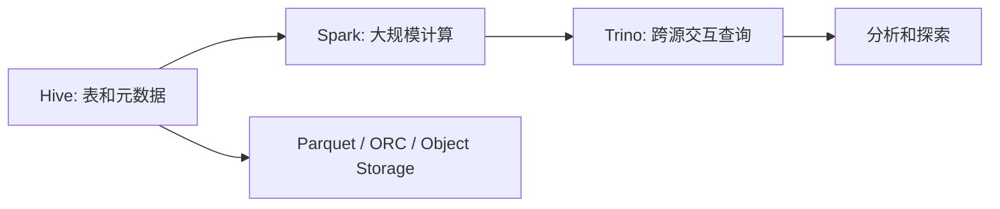

# 7. 批处理系统：Hive / Spark / Trino

::: tip 本章导读
理解 Hive、Spark、Trino 在历史数据加工、分布式计算和跨源分析中的定位。
:::
::: info 本章验收问题
- 你能否区分批处理层和查询层的职责边界？
- 你能否说明 Spark、Hive、Trino 在一条历史分析链路中的不同位置？
:::




批处理解决的是历史数据的大规模计算。

## 问题切入

它不追求每条数据毫秒级处理，而是关注在可接受的时间窗口内，把大量历史数据稳定、可重复、可调度地计算出来。

第 6 章解决了数据如何从 PostgreSQL 进入数仓和湖仓。但数据进入平台后，还要被持续加工：订单明细要清洗，支付和退款要对账，用户日汇总要生成，商品销量排行要重算，历史分区要回填。

当数据量还小时，这些任务可以在 PostgreSQL 或单机脚本中完成。但当历史数据进入 TB、PB 级，或者任务需要跨很多天、很多表、很多主题域运行时，单机数据库和简单脚本会遇到明显瓶颈：

```text
一次重算要扫描几年历史数据。
一个 JOIN 需要处理几十亿行明细。
每日任务失败后，需要按分区重跑。
一个上游维度变更，会影响大量下游汇总。
多个团队同时运行历史分析，资源需要统一调度。
```

这时需要的不是“更复杂的 SQL”，而是能组织海量文件、分布式计算、任务重跑和跨源查询的批处理体系。

## 核心判断

> 批处理回答的是：过去发生了什么，以及这些历史数据如何被加工成可分析、可复用的数据资产。

面向 TB 级历史数据做加工，不能靠手工跑 SQL。批处理系统用 MapReduce、Spark、Hive、Trino 把数据加工工程化——可调度、可重跑、可伸缩、可追溯。这一章不是讲每个引擎的语法，而是讲批处理的架构思维和系统取舍。

批处理也不是所有问题的答案。它不适合强实时告警、在线交易、点查更新和低延迟交互应用。它更适合离线数仓、历史回算、特征批量生成、报表汇总和数据资产建设。

## 机制解释

### 7.1 什么是批处理

前面学习了ETL/ELT，了解了数据抽取、转换、加载的完整流程。

数据进入数据仓库后，如何进行大规模的数据处理？批处理系统是答案。

**场景**：
```yaml
数据仓库日常运营：
  
数据分析师："我需要计算上个月每个用户的GMV"
  
数据工程师："这需要处理1TB的数据"
  
新同事："如何处理这么大量的数据？"
  
资深工程师："使用批处理系统"
```

**问题**：
- 什么是批处理？
- 批处理和流处理有什么区别？
- 什么时候使用批处理？
- 如何设计批处理系统？

**答案**：**批处理是处理大规模数据的计算模式，适合离线、大规模、复杂的分析计算**

#### 一、为什么需要批处理

**第一，数据量大，需要批量处理**

```yaml
场景：
  - 数据仓库有1TB数据
  - 需要计算每个用户的GMV
  - 单机处理需要数小时
  
问题：
  - 如何在合理时间内完成？
  
解决：
  - 使用批处理系统
  - 分布式计算
  - 1TB数据可在30分钟内处理完成
```

**第二，计算复杂，需要批量处理**

```yaml
场景：
  - 用户留存分析
  - 同期群分析
  - 漏斗分析
  
问题：
  - 计算逻辑复杂
  - 需要多次扫描数据
  
解决：
  - 批处理系统
  - 支持复杂计算逻辑
  - 优化计算流程
```

**第三，时间不敏感，可以批量处理**

```yaml
场景：
  - 日报表：每天早上8点前完成即可
  - 月报：每月初完成即可
  - 季报：每季初完成即可
  
特点：
  - 不需要实时
  - 可以批量处理
  - 可以错峰运行
```

#### 二、批处理的定义

**定义**：批处理是指将大量数据分成批次，定期、离线、批量地进行处理

**特点**：
```yaml
数据驱动：
  - 有界的数据集
  - 一次性处理所有数据
  
离线处理：
  - 不需要实时响应
  - 可以延迟处理
  
批量处理：
  - 数据分批处理
  - 定期执行
  
高吞吐：
  - 侧重吞吐量
  - 不侧重延迟
```

**示例**：
```yaml
批处理场景1：日报表
  输入：昨天的所有订单数据（1000万行）
  处理：按城市、品类计算GMV
  输出：日报表
  时间：凌晨4点开始，8点前完成
  
批处理场景2：用户留存
  输入：用户注册数据和登录数据（1亿行）
  处理：计算次日、7日、30日留存
  输出：留存报表
  时间：每周一早上开始，中午完成
```

#### 三、批处理 vs 流处理

##### 3.1 定义对比

**批处理（Batch Processing）**：
```yaml
定义：
  - 处理有界数据集
  - 离线、延迟较高
  - 侧重吞吐量
  
特点：
  - 数据量：大规模（TB-PB级）
  - 延迟：高（分钟-天级）
  - 吞吐量：高（GB/s-MB/s）
  - 复杂度：支持复杂计算
  
示例：
  - 每日GMV报表
  - 用户留存分析
  - 同期群分析
```

**流处理（Stream Processing）**：
```yaml
定义：
  - 处理无界数据流
  - 在线、低延迟
  - 侧重响应速度
  
特点：
  - 数据量：实时流式
  - 延迟：低（毫秒-秒级）
  - 吞吐量：中（MB/s）
  - 复杂度：有限窗口计算
  
示例：
  - 实时看板
  - 实时推荐
  - 实时风控
```

##### 3.2 详细对比

| 维度 | 批处理 | 流处理 |
|------|--------|--------|
| **数据特征** | 有界数据集 | 无界数据流 |
| **处理模式** | 离线、批量 | 在线、流式 |
| **延迟** | 高（分钟-天） | 低（毫秒-秒） |
| **吞吐量** | 高（GB/s） | 中（MB/s） |
| **复杂度** | 支持复杂计算 | 窗口计算 |
| **数据准确性** | 高（可以多次处理） | 中（一次处理） |
| **容错性** | 好（可以重跑） | 需要特殊处理 |
| **成本** | 低（可以错峰） | 高（需要持续运行） |
| **典型场景** | 报表、分析 | 实时推荐、风控 |
| **典型工具** | Hadoop, Spark | Flink, Storm, Spark Streaming |

##### 3.3 选择原则

**选择批处理的场景**：
```yaml
场景1：数据量大
  示例：TB级数据处理
  判断：批处理
  
场景2：计算复杂
  示例：需要多次扫描数据
  判断：批处理
  
场景3：不实时
  示例：日报表、月报
  判断：批处理
  
场景4：成本敏感
  示例：预算有限
  判断：批处理（成本低）
```

**选择流处理的场景**：
```yaml
场景1：实时性要求高
  示例：实时推荐
  判断：流处理
  
场景2：数据持续产生
  示例：用户行为流
  判断：流处理
  
场景3：快速响应
  示例：实时风控
  判断：流处理
  
场景4：用户体验
  示例：实时更新
  判断：流处理
```

#### 四、批处理的类型

##### 4.1 按触发方式分类

**定时批处理**：
```yaml
定义：
  - 定时触发
  - 按计划执行
  
示例：
  - 每天凌晨4点运行日报
  - 每周一早上运行周报
  - 每月1号运行月报
  
优点：
  - 可预测
  - 易管理
  
缺点：
  - 不灵活
  - 可能错过临时需求
```

**手动批处理**：
```yaml
定义：
  - 手动触发
  - 按需执行
  
示例：
  - 数据分析师临时查询
  - 业务方特殊需求
  
优点：
  - 灵活
  - 按需执行
  
缺点：
  - 不自动化
  - 依赖人工
```

**事件驱动批处理**：
```yaml
定义：
  - 事件触发
  - 满足条件即执行
  
示例：
  - 数据到达即处理
  - 上游任务完成后触发
  
优点：
  - 响应快
  - 自动化
  
缺点：
  - 复杂度高
  - 需要事件系统
```

##### 4.2 按数据处理方式分类

**OLAP批处理**：
```yaml
定义：
  - 联机分析处理
  - 复杂查询
  - 多维分析
  
示例：
  - SQL查询：SELECT ... GROUP BY ...
  - OLAP操作：上卷、下钻、切片、切块
  
工具：
  - Spark SQL
  - Hive
  - Presto
  - ClickHouse
```

**ETL批处理**：
```yaml
定义：
  - 数据抽取、转换、加载
  - 定期同步
  
示例：
  - 每日从MySQL同步数据到数仓
  - 每小时从日志收集数据到数仓
  
工具：
  - Airflow
  - Spark
  - Flink
```

**ML批处理**：
```yaml
定义：
  - 机器学习训练
  - 特征工程
  - 模型评估
  
示例：
  - 每周训练推荐模型
  - 每天计算用户特征
  
工具：
  - Spark ML
  - TensorFlow
  - PyTorch
```

#### 五、批处理系统的架构

##### 5.1 典型架构

```text
┌─────────────┐
│  数据源     │
│  MySQL      │
│  日志文件    │
│  API        │
└──────┬──────┘
       │
       │ 数据采集
       ↓
┌─────────────┐
│  数据湖     │  存储层
│  S3/HDFS    │
└──────┬──────┘
       │
       │ 批处理调度
       ↓
┌─────────────┐
│  计算引擎    │  计算层
│  Spark      │
│  Hive       │
│  Presto     │
└──────┬──────┘
       │
       │ 结果存储
       ↓
┌─────────────┐
│  数据仓库    │  输出层
│  ClickHouse │
│  PostgreSQL │
└──────┬──────┘
       │
       │ 查询和展示
       ↓
┌─────────────┐
│  BI工具     │
│  Tableau    │
│  PowerBI    │
└─────────────┘
```

##### 5.2 核心组件

**调度系统**：
```yaml
功能：
  - 任务调度
  - 依赖管理
  - 重试机制
  
工具：
  - Airflow
  - Oozie
  - Azkaban
  - DolphinScheduler
```

**计算引擎**：
```yaml
功能：
  - 数据处理
  - 任务执行
  - 资源管理
  
工具：
  - Spark
  - Hive
  - Flink
  - MapReduce
```

**存储系统**：
```yaml
功能：
  - 数据存储
  - 数据管理
  
工具：
  - HDFS
  - S3
  - OSS
  - HBase
```

#### 六、批处理的应用场景

##### 6.1 数据仓库场景

```yaml
场景1：每日GMV报表
  输入：订单明细数据
  处理：按日期、城市、品类聚合
  输出：GMV报表
  工具：Spark SQL
  频率：每天
  
场景2：用户留存分析
  输入：用户注册、登录数据
  处理：计算留存率
  输出：留存报表
  工具：Spark
  频率：每周
```

##### 6.2 机器学习场景

```yaml
场景1：特征工程
  输入：用户行为数据
  处理：计算用户特征
  输出：特征表
  工具：Spark ML
  频率：每天
  
场景2：模型训练
  输入：训练数据
  处理：训练机器学习模型
  输出：模型文件
  工具：TensorFlow/PyTorch
  频率：每周
```

##### 6.3 数据清洗场景

```yaml
场景1：日志清洗
  输入：原始日志
  处理：过滤、解析、格式化
  输出：清洗后的日志
  工具：Spark
  频率：每天
  
场景2：数据去重
  输入：可能有重复的数据
  处理：去重
  输出：唯一数据
  工具：Spark
  频率：按需
```

#### 七、批处理的优势

**优势1：处理大数据**

```yaml
问题：
  - 单机无法处理TB级数据
  - 内存不足
  
解决：
  - 分布式计算
  - 分而治之
  - 横向扩展
```

**优势2：高吞吐量**

```yaml
问题：
  - 大量数据处理耗时长
  
解决：
  - 并行计算
  - 资源优化
  - 1TB数据30分钟处理完成
```

**优势3：成本效益**

```yaml
问题：
  - 实时系统成本高
  
解决：
  - 批处理可以错峰运行
  - 使用spot实例
  - 降低50-80%成本
```

**优势4：容错性**

```yaml
问题：
  - 硬件故障、网络问题
  
解决：
  - 自动重试
  - 任务重新执行
  - 容错机制
```

#### 八、批处理的挑战

**挑战1：数据倾斜**

```yaml
问题：
  - 某个task数据特别多
  - 运行特别慢
  - 拖慢整体进度
  
解决：
  - 数据重新分区
  - 添加随机前缀
  - 使用salting技术
```

**挑战2：资源管理**

```yaml
问题：
  - 资源不足
  - 任务排队等待
  - 资源浪费
  
解决：
  - 动态资源分配
  - 资源池管理
  - 优先级调度
```

**挑战3：调试困难**

```yaml
问题：
  - 分布式系统调试复杂
  - 错误难以定位
  
解决：
  - 完善的日志
  - 监控系统
  - 调试工具
```

#### 九、常见误区

**误区一：批处理过时了**

- **说明**：批处理没有过时，反而更重要
- **后果**：低估批处理价值
- **正确理解**：
  - 批处理适合大数据分析
  - 流处理适合实时应用
  - 两者结合使用

**误区二：批处理就是慢**

- **说明**：批处理不一定慢
- **后果**：不敢使用批处理
- **正确理解**：
  - 批处理延迟高
  - 但吞吐量大
  - 适合离线分析

**误区三：批处理就是Hadoop**

- **说明**：批处理工具很多
- **后果**：只考虑Hadoop
- **正确理解**：
  - Spark更主流
  - Presto更快速
  - 根据场景选择

**误区四：批处理不需要实时**

- **说明**：批处理也有时间要求
- **后果**：不优化性能
- **正确理解**：
  - 有SLA要求
  - 需要优化性能
  - 满足业务需求

**误区五：批处理就是SQL**

- **说明**：批处理不只是SQL
- **后果**：忽略其他方式
- **正确理解**：
  - SQL是批处理的一种
  - 还有DataFrame、RDD
  - 根据场景选择

#### 十、实战任务

**任务1：设计批处理系统**

需求：每日GMV批处理

```yaml
输入：
  - 订单表：dwd_fact_orders
  - 维度表：dim_users, dim_products
  
处理：
  - 关联维度表
  - 按日期、城市、品类聚合
  - 计算GMV、订单量、客单价
  
输出：
  - 报表表：ads_daily_gmv_report
  
工具：
  - 计算引擎：Spark SQL
  - 调度工具：Airflow
  
时间：
  - 凌整流程1小时内完成
```

**任务2：批处理 vs 流处理选择**

场景1：实时推荐系统
```yaml
判断：流处理
原因：
  - 需要实时响应
  - 用户行为流式产生
  - 快速推荐很重要
```

场景2：月度财务报表
```yaml
判断：批处理
原因：
  - 数据量大
  - 计算复杂
  - 不需要实时
```

**任务3：识别批处理场景**

以下哪些是批处理场景？

```yaml
场景1：每分钟更新Dashboard → 流处理
场景2：每日用户留存分析 → 批处理
场景3：实时风控 → 流处理
场景4：每周模型训练 → 批处理
场景5：每小时数据同步 → 批处理
场景6：实时大屏展示 → 流处理
场景7：月度销售预测 → 批处理
```

#### 十一、小结

批处理是处理大规模数据的计算模式，适合离线、大规模、复杂的分析计算。

核心要点：
- 定义：处理有界数据集、离线批量处理、高吞吐量
- vs流处理：数据特征、处理模式、延迟、吞吐量、场景各有不同
- 选择原则：根据数据量、实时性、复杂度、成本选择
- 类型：按触发方式（定时、手动、事件）、按处理方式（OLAP、ETL、ML）
- 架构：数据源→存储层→计算层→输出层→BI工具
- 核心组件：调度系统、计算引擎、存储系统
- 应用场景：数据仓库、机器学习、数据清洗
- 优势：处理大数据、高吞吐、成本效益、容错性
- 挑战：数据倾斜、资源管理、调试困难
- 常见误区：不过时、不一定慢、不只是Hadoop、也有时间要求、不只是SQL

下一节将学习批处理的应用场景，了解批处理在不同领域的具体应用。

### 7.2 批处理的应用场景

上一节学习了批处理的基本概念，了解了批处理的定义、特点和与流处理的区别。

现在深入学习批处理在各个领域的具体应用场景。

**场景**：
```yaml
业务会议：
  
业务方："我需要各种报表和分析"
  
数据工程师："我们可以用批处理系统实现"
  
新同事："批处理能做哪些事情？"
```

**问题**：
- 批处理有哪些典型的应用场景？
- 不同行业如何使用批处理？
- 如何设计批处理任务？
- 如何优化批处理性能？

**答案**：**批处理广泛应用于数据仓库、机器学习、日志分析、数据清洗等多个场景**

#### 一、数据仓库场景

##### 1.1 每日报表

**场景**：每天早上8点前需要生成各种日报表

**输入**：
```yaml
数据源：
  - 订单事实表：dwd_fact_orders（1TB）
  - 用户维度表：dim_users
  - 商品维度表：dim_products
  - 城市维度表：dim_cities
```

**处理逻辑**：
```sql
-- 1. 每日GMV报表
CREATE TABLE ads_daily_gmv_report AS
SELECT 
    date_id,
    city,
    category,
    COUNT(*) as order_count,
    SUM(order_amount) as gmv,
    AVG(order_amount) as avg_order_amount
FROM dwd_fact_orders f
JOIN dim_users u ON f.user_id = u.user_id
JOIN dim_products p ON f.product_id = p.product_id
WHERE date_id >= 20260101 AND date_id < 20260201
GROUP BY date_id, city, category;

-- 2. 每日用户GMV排名
CREATE TABLE ads_daily_user_gmv_ranking AS
SELECT 
    user_id,
    SUM(order_amount) as user_gmv,
    RANK() OVER (ORDER BY SUM(order_amount) DESC) as gmv_rank
FROM dwd_fact_orders
WHERE date_id >= 20260101 AND date_id < 20260201
GROUP BY user_id;

-- 3. 每日商品销量排名
CREATE TABLE ads_daily_product_sales_ranking AS
SELECT 
    product_id,
    COUNT(*) as order_count,
    SUM(order_quantity) as total_quantity,
    RANK() OVER (ORDER BY COUNT(*) DESC) as sales_rank
FROM dwd_fact_orders
WHERE date_id >= 20260101 AND date_id < 20260201
GROUP BY product_id;
```

**输出**：
```yaml
报表：
  - 每日GMV报表
  - 每日用户GMV排名
  - 每日商品销量排名
  
用途：
  - 业务方查看
  - BI工具展示
  - 数据分析
```

##### 1.2 用户留存分析

**场景**：每周分析用户留存情况

**输入**：
```yaml
数据源：
  - 用户注册表：dim_users
  - 用户登录表：fact_user_login
```

**处理逻辑**：
```sql
-- 1. 同期群定义
WITH user_cohorts AS (
    SELECT 
        user_id,
        DATE_PART('year', register_date) * 100 + DATE_PART('week', register_date) as cohort_week,
        register_date
    FROM dim_users
    WHERE register_date >= '2026-01-01'
),

-- 2. 用户登录数据
user_activities AS (
    SELECT DISTINCT
        user_id,
        DATE(login_time) as login_date
    FROM fact_user_login
    WHERE login_time >= '2026-01-01'
),

-- 3. 计算留存
retention AS (
    SELECT 
        c.cohort_week,
        MIN(a.login_date) as first_login_date,
        MAX(a.login_date) as last_login_date,
        COUNT(DISTINCT a.user_id) as cohort_size,
        COUNT(DISTINCT a.user_id) FILTER (
            WHERE a.login_date >= c.register_date + INTERVAL '7 days'
        ) as retained_7d,
        COUNT(DISTINCT a.user_id) FILTER (
            WHERE a.login_date >= c.register_date + INTERVAL '30 days'
        ) as retained_30d
    FROM user_cohorts c
    JOIN user_activities a ON c.user_id = a.user_id
    GROUP BY c.cohort_week
)

SELECT 
    cohort_week,
    cohort_size,
    retained_7d,
    retained_30d,
    retained_7d * 100.0 / cohort_size as retention_rate_7d,
    retained_30d * 100.0 / cohort_size as retention_rate_30d
FROM retention;
```

**输出**：
```yaml
报表：
  - 同期群留存报表
  - 留存率曲线
  
用途：
  - 产品分析
  - 用户增长分析
  - 营销效果评估
```

##### 1.3 同期群分析

**场景**：分析用户生命周期的行为模式

**输入**：
```yaml
数据源：
  - 用户注册表：dim_users
  - 订单表：dwd_fact_orders
  - 用户行为表：fact_events
```

**处理逻辑**：
```sql
-- 1. 定义同期群
WITH user_cohorts AS (
    SELECT 
        user_id,
        DATE_TRUNC('month', register_date) as cohort_month
    FROM dim_users
    WHERE register_date >= '2026-01-01'
),

-- 2. 用户行为
cohort_activities AS (
    SELECT 
        c.user_id,
        c.cohort_month,
        DATE_TRUNC('month', o.created_at) as activity_month,
        EXTRACT(YEAR FROM AGE(c.cohort_month, o.created_at)) as month_number,
        COUNT(DISTINCT o.order_id) as order_count,
        SUM(o.order_amount) as order_amount
    FROM user_cohorts c
    LEFT JOIN dwd_fact_orders o ON c.user_id = o.user_id
    WHERE o.created_at >= c.register_date
    GROUP BY c.user_id, c.cohort_month, DATE_TRUNC('month', o.created_at)
)

-- 3. 同期群分析
SELECT 
    cohort_month,
    month_number,
    AVG(order_count) as avg_order_count,
    AVG(order_amount) as avg_order_amount,
    COUNT(DISTINCT user_id) as user_count
FROM cohort_activities
GROUP BY cohort_month, month_number
ORDER BY cohort_month, month_number;
```

**输出**：
```yaml
报表：
  - 同期群分析报表
  
用途：
  - 用户生命周期分析
  - 用户价值评估
  - 产品迭代决策
```

#### 二、机器学习场景

##### 2.1 特征工程

**场景**：为推荐系统准备用户特征

**输入**：
```yaml
数据源：
  - 用户行为表：fact_events（10TB）
  - 订单表：dwd_fact_orders
  - 用户维度表：dim_users
```

**处理逻辑**：
```python
# 特征工程示例（Spark）
from pyspark.sql import SparkSession
from pyspark.sql.functions import *

spark = SparkSession.builder.appName("feature_engineering").getOrCreate()

# 1. 读取数据
events = spark.read.parquet("/data/fact_events")
orders = spark.read.parquet("/data/dwd_fact_orders")
users = spark.read.parquet("/data/dim_users")

# 2. 用户基础特征
user_features = users.select(
    "user_id",
    "city",
    "register_date"
)

# 3. 用户行为特征（最近30天）
user_behavior = events.filter(
    col("event_date") >= current_date() - expr("INTERVAL 30 DAYS")
).groupBy(
    "user_id"
).agg(
    count("*").alias("event_count"),
    sum("duration").alias("total_duration"),
    avg("duration").alias("avg_duration")
)

# 4. 用户订单特征（最近90天）
user_orders = orders.filter(
    col("order_date") >= current_date() - expr("INTERVAL 90 DAYS")
).groupBy(
    "user_id"
).agg(
    count("*").alias("order_count"),
    sum("order_amount").alias("total_amount"),
    avg("order_amount").alias("avg_amount"),
    stddev("order_amount").alias("std_amount")
)

# 5. 合并特征
user_features = user_features \
    .join(user_behavior, "user_id", "left") \
    .join(user_orders, "user_id", "left") \
    .fillna(0)

# 6. 输出特征表
user_features.write \
    .mode("overwrite") \
    .parquet("/data/feature_store/user_features_20260101")
```

**输出**：
```yaml
特征表：
  - user_features（用户特征）
  
用途：
  - 推荐模型训练
  - 用户分群
  - 精准营销
```

##### 2.2 模型训练

**场景**：每周训练推荐模型

**输入**：
```yaml
训练数据：
  - 用户特征：user_features
  - 商品特征：item_features
  - 用户行为：user_item_interactions
```

**处理逻辑**：
```python
# 模型训练示例（Spark ML）
from pyspark.ml.recommendation import ALS
from pyspark.ml.evaluation import RegressionEvaluator
from pyspark.sql import SparkSession

spark = SparkSession.builder.appName("model_training").getOrCreate()

# 1. 读取数据
interactions = spark.read.parquet("/data/user_item_interactions")

# 2. 划分训练集和测试集
train, test = interactions.randomSplit([0.8, 0.2], seed=42)

# 3. 构建ALS模型
als = ALS(
    maxIter=10,
    regParam=0.01,
    userCol="user_id",
    itemCol="item_id",
    ratingCol="rating",
    coldStartStrategy="drop"
)

# 4. 训练模型
model = als.fit(train)

# 5. 评估模型
predictions = model.transform(test)
evaluator = RegressionEvaluator(
    metricName="rmse",
    labelCol="rating",
    predictionCol="prediction"
)
rmse = evaluator.evaluate(predictions)

print(f"RMSE: {rmse}")

# 6. 保存模型
model.write().overwrite().save("/data/models/recommendation_model_v1")
```

**输出**：
```yaml
模型文件：
  - recommendation_model_v1
  
用途：
  - 商品推荐
  - 个性化服务
  - A/B测试
```

##### 2.3 模型评估

**场景**：评估模型性能

**输入**：
```yaml
测试数据：
  - 测试集：test_data
  - 模型：model
```

**处理逻辑**：
```python
# 模型评估
from pyspark.ml.evaluation import (
    RegressionEvaluator,
    BinaryClassificationEvaluator,
    MulticlassClassificationEvaluator
)

# 回归模型评估
evaluator = RegressionEvaluator(
    labelCol="label",
    predictionCol="prediction"
)

rmse = evaluator.setMetricName("rmse").evaluate(predictions)
mae = evaluator.setMetricName("mae").evaluate(predictions)
r2 = evaluator.setMetricName("r2").evaluate(predictions)

print(f"RMSE: {rmse}")
print(f"MAE: {mae}")
print(f"R2: {r2}")
```

**输出**：
```yaml
评估报告：
  - 模型性能指标
  - 评估图表
  
用途：
  - 模型选择
  - 超参数调优
  - 模型上线决策
```

#### 三、日志分析场景

##### 3.1 日志清洗

**场景**：清洗原始日志数据

**输入**：
```yaml
日志文件：
  - Nginx访问日志：/logs/nginx/access.log（1TB）
  - 应用日志：/logs/app/application.log（500GB）
```

**处理逻辑**：
```python
# 日志清洗示例（Spark）
from pyspark.sql.functions import *

spark = SparkSession.builder.appName("log_cleaning").getOrCreate()

# 1. 读取原始日志
raw_logs = spark.read.text("/logs/nginx/access.log")

# 2. 解析日志
parsed_logs = raw_logs.select(
    regexp_extract("value", r'^(\S+)').alias("ip"),
    regexp_extract("value", r'\[([\w:/]+\s[^\]]+)\]').alias("timestamp"),
    regexp_extract("value", r'"([^"]*)"').alias("request"),
    regexp_extract("value", r'(\d+)').alias("status"),
    regexp_extract("value", r'(\d+)').alias("size")
)

# 3. 过滤无效日志
valid_logs = parsed_logs.filter(
    col("status").cast("int").between(200, 299)
)

# 4. 转换时间戳
valid_logs = valid_logs.withColumn(
    "timestamp",
    to_timestamp("timestamp", "dd/MMM/yyyy:HH:mm:ss")
)

# 5. 提取小时
valid_logs = valid_logs.withColumn(
    "hour",
    hour("timestamp")
)

# 6. 输出清洗后的日志
valid_logs.write \
    .mode("overwrite") \
    .parquet("/data/cleaned_logs/nginx_access_20260101")
```

**输出**：
```yaml
清洗后日志：
  - nginx_access_cleaned（结构化数据）
  
用途：
  - 日志分析
  - 网站分析
  - 安全审计
```

##### 3.2 日志分析

**场景**：分析网站访问情况

**输入**：
```yaml
清洗后的日志：
  - nginx_access_cleaned
```

**处理逻辑**：
```sql
-- 1. 每小时PV/UV
CREATE TABLE ads_hourly_traffic AS
SELECT 
    hour(timestamp) as hour,
    COUNT(*) as pv,
    COUNT(DISTINCT ip) as uv,
    SUM(size) as total_bytes
FROM cleaned_logs_nginx
WHERE DATE(timestamp) = CURRENT_DATE
GROUP BY hour(timestamp);

-- 2. 每小时Top 10请求
CREATE TABLE ads_hourly_top_requests AS
SELECT 
    hour(timestamp) as hour,
    request,
    COUNT(*) as request_count
FROM (
    SELECT 
        hour(timestamp) as hour,
        request,
        COUNT(*) as request_count,
        RANK() OVER (PARTITION BY hour(timestamp) ORDER BY COUNT(*) DESC) as rank
    FROM cleaned_logs_nginx
    WHERE DATE(timestamp) = CURRENT_DATE
)
WHERE rank <= 10
GROUP BY hour(timestamp), request, rank;

-- 3. 状态码分布
CREATE TABLE ads_status_code_distribution AS
SELECT 
    status,
    COUNT(*) as count,
    COUNT(*) * 100.0 / SUM(COUNT(*)) OVER () as percentage
FROM cleaned_logs_nginx
WHERE DATE(timestamp) = CURRENT_DATE
GROUP BY status
ORDER BY status;
```

**输出**：
```yaml
分析报表：
  - 每小时PV/UV
  - Top 10请求
  - 状态码分布
  
用途：
  - 网站性能监控
  - 容量规划
  - 问题诊断
```

#### 四、数据清洗场景

##### 4.1 数据去重

**场景**：数据可能有重复

**输入**：
```yaml
数据：
  - 用户行为日志：fact_events
  - 可能有重复记录
```

**处理逻辑**：
```python
# 数据去重示例（Spark）
from pyspark.sql.functions import *

spark = SparkSession.builder.appName("deduplication").getOrCreate()

# 1. 读取数据
events = spark.read.parquet("/data/fact_events")

# 2. 识别唯一记录
unique_events = events.dropDuplicates(["event_id"])

# 或者使用窗口函数去重
unique_events = events.withColumn(
    "row_num",
    row_number().over(
        Window.partitionBy("event_id")
        .orderBy(col("event_time").desc())
    )
).filter(col("row_num") == 1).drop("row_num")

# 3. 输出去重后的数据
unique_events.write \
    .mode("overwrite") \
    .parquet("/data/deduplicated_events")
```

**输出**：
```yaml
去重后数据：
  - deduplicated_events
  
用途：
  - 保证数据唯一性
  - 提高分析准确性
```

##### 4.2 异常值处理

**场景**：处理数据中的异常值

**输入**：
```yaml
数据：
  - 订单表：dwd_fact_orders
  - 可能有异常订单金额
```

**处理逻辑**：
```python
# 异常值处理
from pyspark.sql.functions import *

spark = SparkSession.builder.appName("outlier_detection").getOrCreate()

orders = spark.read.parquet("/data/dwd_fact_orders")

# 1. 计算统计量
stats = orders.select(
    mean("order_amount").alias("mean"),
    stddev("order_amount").alias("stddev")
).first()

mean_amount = stats['mean']
stddev_amount = stats['stddev']

# 2. 识别异常值（3-sigma规则）
orders_with_outlier_flag = orders.withColumn(
    "is_outlier",
    when(col("order_amount") > mean_amount + 3 * stddev_amount, True)
    .when(col("order_amount") < mean_amount - 3 * stddev_amount, True)
    .otherwise(False)
)

# 3. 过滤异常值
normal_orders = orders_with_outlier_flag.filter(
    col("is_outlier") == False
)

# 4. 输出正常数据
normal_orders.write \
    .mode("overwrite") \
    .parquet("/data/normal_orders")
```

**输出**：
```yaml
清洗后数据：
  - normal_orders
  
用途：
  - 提高数据质量
  - 避免异常值影响
```

#### 五、数据同步场景

##### 5.1 跨库同步

**场景**：从业务库同步数据到数仓

**输入**：
```yaml
数据源：
  - MySQL业务库：business_db
```

**处理逻辑**：
```python
# 数据同步示例（Spark）
from pyspark.sql import SparkSession

spark = SparkSession.builder.appName("data_sync").getOrCreate()

# 1. 从MySQL读取数据
url = "jdbc:mysql://mysql-server:3306/business_db"
properties = {
    "user": "root",
    "password": "password",
    "driver": "com.mysql.jdbc.Driver"
}

orders = spark.read.jdbc(
    url=url,
    table="orders",
    properties=properties
)

# 2. 数据转换
orders_transformed = orders.select(
    col("order_id"),
    to_date(col("created_at")).alias("order_date"),
    col("user_id"),
    col("product_id"),
    col("order_amount")
).filter(
    col("order_status") == "completed"
)

# 3. 写入数据仓库
orders_transformed.write \
    .mode("overwrite") \
    .partitionBy("order_date") \
    .parquet("/data/dwd_fact_orders")
```

**输出**：
```yaml
同步数据：
  - dwd_fact_orders
  
用途：
  - 数据仓库更新
  - 定期同步
```

##### 5.2 增量同步

**场景**：只同步变化的数据

**输入**：
```yaml
数据源：
  - MySQL binlog
```

**处理逻辑**：
```python
# 增量同步示例（Spark Structured Streaming）
from pyspark.sql import SparkSession
from pyspark.sql.functions import *

spark = SparkSession.builder.appName("incremental_sync").getOrCreate()

# 1. 读取binlog
binlog_df = spark.readStream \
    .format("kafka") \
    .option("kafka.bootstrap.servers", "kafka-server:9092") \
    .option("subscribe", "mysql-binlog") \
    .load()

# 2. 解析CDC事件
parsed_events = binlog_df.select(
    from_json("value", schema="binlog_schema")
).filter(
    col("op") == "c"  # 只处理INSERT
).select(
    col("after.order_id").alias("order_id"),
    col("after.user_id").alias("user_id"),
    col("after.product_id").alias("product_id"),
    col("after.order_amount").alias("order_amount")
)

# 3. 写入数据仓库
query = parsed_events.writeStream \
    .outputMode("append") \
    .option("checkpointLocation", "/checkpoint/incremental_sync") \
    .partitionBy("order_date") \
    .format("parquet") \
    .start("/data/dwd_fact_orders_streaming")

# 4. 启动流式任务
query.awaitTermination(60000)  # 等待60秒
```

**输出**：
```yaml
同步数据：
  - dwd_fact_orders（增量）
  
用途：
  - 实时数据同步
  - 近实时分析
```

#### 六、常见误区

**误区一：批处理只能做报表**

- **说明**：批处理应用场景很广
- **后果**：低估批处理价值
- **正确理解**：
  - 数据仓库、机器学习、日志分析
  - 数据清洗、数据同步
  - 应用场景丰富

**误区二：批处理就是SQL**

- **说明**：批处理不只是SQL
- **后果**：忽略其他方式
- **正确理解**：
  - SQL、DataFrame、RDD
  - Python、Scala、Java
  - 根据场景选择

**误区三：批处理不需要优化**

- **说明**：批处理也需要优化
- **后果**：性能差、成本高
- **正确理解**：
  - 需要性能优化
  - 需要成本优化
  - 持续优化

**误区四：批处理可以实时**

- **说明**：批处理不适合实时
- **后果**：技术选型错误
- **正确理解**：
  - 批处理：离线、高延迟
  - 流处理：在线、低延迟
  - 各有所长

**误区五：批处理很简单**

- **说明**：批处理系统很复杂
- **后果**：低估复杂度
- **正确理解**：
  - 需要架构设计
  - 需要性能优化
  - 需要运维管理

#### 七、实战任务

**任务1：设计批处理任务**

需求：每周训练推荐模型

```yaml
输入：
  - 用户行为数据：fact_events（10TB）
  - 商品特征数据：item_features（100GB）
  
处理：
  1. 特征工程（用户特征、商品特征）
  2. 构建训练数据
  3. 训练ALS模型
  4. 评估模型性能
  
输出：
  - 模型文件：recommendation_model
  
工具：
  - Spark（特征工程、模型训练）
  - MLflow（模型管理）
  
时间：
  - 周一凌晨2点开始，8点前完成
```

**任务2：批处理 vs 流处理选择**

判断以下场景应该使用批处理还是流处理：

```yaml
场景1：实时商品推荐 → 流处理
场景2：每日销售报表 → 批处理
场景3：实时风控 → 流处理
场景4：月度财务报表 → 批处理
场景5：实时Dashboard → 流处理
场景6：用户留存分析 → 批处理
场景7：实时大屏 → 流处理
场景8：模型训练 → 批处理
```

**任务3：优化批处理性能**

场景：批处理任务太慢，需要优化

```yaml
问题：
  - 当前任务需要4小时
  - SLA要求2小时
  
优化措施：
  1. 数据分区：按日期分区
  2. 缓存：缓存维度表
  3. 并行度：增加executor数量
  4. 内存配置：增加executor内存
  
效果：
  - 从4小时优化到1.5小时
  - 满足SLA要求
```

#### 八、小结

批处理广泛应用于数据仓库、机器学习、日志分析、数据清洗等多个场景。

核心要点：
- 数据仓库场景：每日报表、用户留存、同期群分析
- 机器学习场景：特征工程、模型训练、模型评估
- 日志分析场景：日志清洗、日志分析、网站分析
- 数据清洗场景：数据去重、异常值处理
- 数据同步场景：跨库同步、增量同步
- 常见误区：不只是报表、不只是SQL、需要优化、不能实时、不简单
- 任务设计：明确输入、处理逻辑、输出、工具、时间
- 场景选择：根据数据量、实时性、复杂度选择批处理或流处理

下一节将学习批处理的调度策略，了解如何调度和管理批处理任务。

### 7.3 批处理核心技术

上一节学习了批处理的应用场景，了解了批处理在数据仓库、机器学习、日志分析等领域的应用。

如何实现批处理系统？需要掌握哪些核心技术？

**场景**：
```yaml
数据平台建设：

架构师："我们需要构建批处理系统"

数据工程师："应该使用什么技术？"

新工程师："Hadoop、Spark、Flink，应该选哪个？"

资深工程师："需要了解各种技术的特点"
```

**问题**：
- 批处理有哪些核心技术？
- Hadoop、Spark、Flink有什么区别？
- 如何选择合适的技术？
- 如何设计批处理任务？

**答案**：**批处理核心技术包括分布式存储（HDFS、S3）、分布式计算框架（MapReduce、Spark）、资源调度（YARN、Kubernetes），选择时需要考虑性能、成本、复杂度**

#### 一、分布式存储

##### 1.1 HDFS（Hadoop Distributed File System）

**特点**：
```yaml
设计思想：
  - 存储超大文件
  - 流式数据访问
  - 商品硬件
  
核心特性：
  - 高容错性：数据副本（默认3副本）
  - 高吞吐量：批量数据处理
  - 横向扩展：增加节点即可扩展
  
架构：
  NameNode：
    - 管理文件系统元数据
    - 管理数据块映射
    - 单点故障（需要HA）
  
  DataNode：
    - 存储实际数据块
    - 处理读写请求
    - 向NameNode汇报状态
  
  SecondaryNameNode：
    - 定期合并FsImage和EditLog
    - 不是NameNode的热备
```

**示例**：
```bash
# 查看HDFS文件
hdfs dfs -ls /data/warehouse/

# 上传文件到HDFS
hdfs dfs -put local_file.csv /data/warehouse/

# 从HDFS下载文件
hdfs dfs -get /data/warehouse/result.csv local_result.csv

# 查看文件内容
hdfs dfs -cat /data/warehouse/file.txt

# 删除文件
hdfs dfs -rm /data/warehouse/old_file.csv
```

**适用场景**：
```yaml
适合：
  - 超大文件（TB、PB级）
  - 批量处理
  - 离线分析
  
不适合：
  - 大量小文件
  - 低延迟访问
  - 随机写入
```

##### 1.2 对象存储（S3、OSS）

**特点**：
```yaml
对比HDFS：
  存储方式：
    HDFS：数据块（Block）
    S3：对象（Object）
  
  访问方式：
    HDFS：HDFS API
    S3：REST API
  
  元数据：
    HDFS：NameNode集中管理
    S3：元数据和数据一起存储
  
  成本：
    HDFS：需要自己维护集群
    S3：按使用量付费
  
优势：
  - 无限扩展
  - 高可用性
  - 成本相对较低
  - 简单易用
  
劣势：
  - 一致性模型（最终一致性）
  - 列出文件性能较差
```

**示例**：
```python
# 使用AWS S3
import boto3

s3 = boto3.client('s3')

# 上传文件
s3.upload_file('local_file.csv', 'my-bucket', 'data/file.csv')

# 下载文件
s3.download_file('my-bucket', 'data/file.csv', 'local_file.csv')

# 列出文件
response = s3.list_objects_v2(Bucket='my-bucket', Prefix='data/')
for obj in response.get('Contents', []):
    print(obj['Key'])

# 删除文件
s3.delete_object(Bucket='my-bucket', Key='data/file.csv')
```

**适用场景**：
```yaml
适合：
  - 数据湖
  - 备份归档
  - 非结构化数据
  
不适合：
  - 高频访问（成本高）
  - 需要强一致性
```

#### 二、分布式计算框架

##### 2.1 MapReduce

**原理**：
```yaml
计算模型：
  Map阶段：
    - 输入：键值对（K1, V1）
    - 处理：map函数
    - 输出：键值对（K2, V2）
  
  Shuffle阶段：
    - 按键分组
    - 数据排序
    - 数据传输
  
  Reduce阶段：
    - 输入：键值对列表（K2, [V2]）
    - 处理：reduce函数
    - 输出：键值对（K3, V3）

示例：WordCount
  输入：
    ["hello world", "hello spark"]
  
  Map输出：
    [("hello", 1), ("world", 1), ("hello", 1), ("spark", 1)]
  
  Shuffle后：
    [("hello", [1, 1]), ("world", [1]), ("spark", [1])]
  
  Reduce输出：
    [("hello", 2), ("world", 1), ("spark", 1)]
```

**代码示例**：
```java
public class WordCount {

  public static class TokenizerMapper 
      extends Mapper<Object, Text, Text, IntWritable>{
    
    private final static IntWritable one = new IntWritable(1);
    private Text word = new Text();
    
    public void map(Object key, Text value, Context context
                    ) throws IOException, InterruptedException {
      StringTokenizer itr = new StringTokenizer(value.toString());
      while (itr.hasMoreTokens()) {
        word.set(itr.nextToken());
        context.write(word, one);
      }
    }
  }

  public static class IntSumReducer 
      extends Reducer<Text,IntWritable,Text,IntWritable> {
    
    private IntWritable result = new IntWritable();
    
    public void reduce(Text key, Iterable<IntWritable> values, 
                        Context context
                        ) throws IOException, InterruptedException {
      int sum = 0;
      for (IntWritable val : values) {
        sum += val.get();
      }
      result.set(sum);
      context.write(key, result);
    }
  }

  public static void main(String[] args) throws Exception {
    Configuration conf = new Configuration();
    Job job = Job.getInstance(conf, "word count");
    job.setJarByClass(WordCount.class);
    job.setMapperClass(TokenizerMapper.class);
    job.setCombinerClass(IntSumReducer.class);
    job.setReducerClass(IntSumReducer.class);
    job.setOutputKeyClass(Text.class);
    job.setOutputValueClass(IntWritable.class);
    FileInputFormat.addInputPath(job, new Path(args[0]));
    FileOutputFormat.setOutputPath(job, new Path(args[1]));
    System.exit(job.waitForCompletion(true) ? 0 : 1);
  }
}
```

**优点**：
```yaml
优势：
  - 高容错性
  - 高扩展性
  - 适合批处理
  
劣势：
  - 编程复杂
  - 性能相对较低
  - 磁盘IO多
```

##### 2.2 Spark

**核心概念**：
```yaml
RDD（Resilient Distributed Dataset）：
  特性：
    - 弹性：自动容错
    - 分布式：数据分布在不同节点
    - 不可变：创建后不能修改
  
  操作：
    Transformation（转换）：
      - 惰性执行
      - 生成新的RDD
      - 示例：map、filter、flatMap、reduceByKey
    
    Action（动作）：
      - 立即执行
      - 返回结果
      - 示例：collect、count、saveAsTextFile

DataFrame：
  特性：
    - 结构化数据
    - 类似关系表
    - 优化执行计划
  
  优势：
    - 比RDD性能更好
    - SQL支持
    - 自动优化

Dataset：
  特性：
    - 类型安全
    - DataFrame + 类型信息
    - Scala/Java友好
```

**示例**：
```python
from pyspark.sql import SparkSession
from pyspark.sql.functions import col, sum as _sum, count

# 创建SparkSession
spark = SparkSession.builder \
    .appName("BatchProcessing") \
    .getOrCreate()

# 读取数据
orders = spark.read.csv("hdfs://data/orders.csv", 
                        header=True, 
                        inferSchema=True)

# 转换操作
filtered_orders = orders.filter(col("status") == "completed")

# 聚合操作
daily_gmv = filtered_orders.groupBy("date_id") \
    .agg(
        _sum("amount").alias("gmv"),
        count("*").alias("order_count")
    )

# 动作：保存结果
daily_gmv.write.csv("hdfs://output/daily_gmv", 
                    mode="overwrite",
                    header=True)

# SQL查询
orders.createOrReplaceTempView("orders")
result = spark.sql("""
    SELECT 
        date_id,
        SUM(amount) as gmv,
        COUNT(*) as order_count
    FROM orders
    WHERE status = 'completed'
    GROUP BY date_id
""")

result.show()
```

**Spark vs MapReduce**：
```yaml
性能：
  MapReduce：
    - 磁盘IO多
    - 慢
  
  Spark：
    - 内存计算
    - 快10-100倍

易用性：
  MapReduce：
    - 代码冗长
    - 难以维护
  
  Spark：
    - 代码简洁
    - 支持SQL、Python、Scala、R

通用性：
  MapReduce：
    - 只适合批处理
  
  Spark：
    - 批处理
    - 流处理（Spark Streaming）
    - 机器学习（MLlib）
    - 图计算（GraphX）
```

##### 2.3 Hive

**特点**：
```yaml
定义：
  - 构建在Hadoop上的数据仓库
  - SQL-like查询语言（HQL）
  - 将SQL转换为MapReduce/Tez/Spark

架构：
  用户接口：
    - CLI（命令行）
    - JDBC/ODBC
    - WebUI
  
  元数据存储：
    - Metastore（默认使用Derby，生产用MySQL）
  
  执行引擎：
    - MapReduce（慢）
    - Tez（中）
    - Spark（快）
```

**示例**：
```sql
-- 创建表
CREATE TABLE orders (
    order_id BIGINT,
    user_id BIGINT,
    amount DECIMAL(10, 2),
    status STRING,
    created_at TIMESTAMP
)
PARTITIONED BY (dt STRING)
STORED AS ORC;

-- 加载数据
LOAD DATA INPATH '/data/orders/20260101' 
INTO TABLE orders 
PARTITION (dt='20260101');

-- 查询数据
SELECT 
    dt,
    SUM(amount) as gmv,
    COUNT(*) as order_count
FROM orders
WHERE status = 'completed'
GROUP BY dt;

-- 创建视图
CREATE VIEW daily_gmv AS
SELECT 
    dt,
    SUM(amount) as gmv,
    COUNT(*) as order_count
FROM orders
WHERE status = 'completed'
GROUP BY dt;
```

**适用场景**：
```yaml
适合：
  - SQL分析师
  - 不想写代码
  - 对延迟不敏感
  
不适合：
  - 低延迟查询
  - 复杂的非SQL逻辑
```

#### 三、资源调度

##### 3.1 YARN（Yet Another Resource Negotiator）

**架构**：
```yaml
ResourceManager：
  功能：
    - 全局资源管理
    - 任务调度
    - 资源分配
  
  组件：
    Scheduler：
      - 纯调度器
      - 不负责任务监控
      - 支持容量调度、公平调度
    
    ApplicationsManager（ASM）：
      - 管理ApplicationMaster
      - 任务重启

NodeManager：
  功能：
    - 管理单个节点资源
    - 向ResourceManager汇报
    - 处理Container请求

ApplicationMaster：
  功能：
    - 管理单个应用
    - 向ResourceManager申请资源
    - 和NodeManager协作
```

**调度策略**：
```yaml
FIFO Scheduler（先进先出）：
  原理：
    - 按提交顺序执行
    - 简单但效率低
  
  适合：
    - 简单场景

Capacity Scheduler（容量调度）：
  原理：
    - 划分资源队列
    - 每个队列保证资源
    - 队列间资源共享
  
  示例：
    队列：
      - prod：70%
      - dev：30%
  
  适合：
    - 多租户环境

Fair Scheduler（公平调度）：
  原理：
    - 所有应用平均分配资源
    - 动态调整
  
  适合：
    - 多用户共享集群
```

##### 3.2 Kubernetes

**对比YARN**：
```yaml
通用性：
  YARN：
    - 专为大数据设计
    - 与Hadoop生态集成
  
  Kubernetes：
    - 通用容器编排
    - 支持多种工作负载

资源管理：
  YARN：
    - 基于队列
    - 资源抽象：Container
  
  Kubernetes：
    - 基于Pod/Node
    - 资源抽象：Pod、Deployment

部署：
  YARN：
    - 复杂
    - 需要Hadoop
  
  Kubernetes：
    - 标准化
    - 云原生
```

**示例**：
```yaml
# Spark on Kubernetes
apiVersion: sparkoperator.k8s.io/v1beta2
kind: SparkApplication
metadata:
  name: spark-pi
  namespace: default
spec:
  type: Python
  pythonVersion: "3"
  mode: cluster
  image: ghcr.io/my-project/spark:latest
  imagePullPolicy: Always
  mainApplicationFile: local:///app/pi.py
  sparkVersion: "3.5.0"
  restartPolicy: OnFailure
  driver:
    cores: 1
    coreLimit: "1200m"
    memory: "512m"
    serviceAccount: spark
  executor:
    cores: 1
    instances: 2
    memory: "512m"
    coresLimit: "1200m"
```

#### 四、技术选型

##### 4.1 存储选型

```yaml
HDFS：
  选择场景：
    - 已有Hadoop集群
    - 需要数据本地性优化
    - 成本敏感
  
  不选场景：
    - 大量小文件
    - 需要低延迟

对象存储（S3/OSS）：
  选择场景：
    - 数据湖架构
    - 需要无限扩展
    - 不想运维存储
  
  不选场景：
    - 高频访问（成本高）
    - 需要强一致性

混合存储：
  热数据：HDFS（高性能）
  冷数据：S3（低成本）
```

##### 4.2 计算框架选型

```yaml
MapReduce：
  选择场景：
    - 已有Hadoop生态
    - 超大规模批处理
    - 成本敏感
  
  不选场景：
    - 需要高性能
    - 需要低延迟

Spark：
  选择场景：
    - 需要高性能
    - 需要多种计算（批处理、流处理、ML）
    - 团队熟悉Python/SQL
  
  不选场景：
    - 超大规模（PB级）一次性批处理
    - 内存不足

Hive：
  选择场景：
    - SQL分析师
    - 不想写复杂代码
    - 对延迟不敏感
  
  不选场景：
    - 需要低延迟
    - 需要复杂逻辑

Presto/Trino：
  选择场景：
    - 交互式查询
    - 需要低延迟
    - 联邦查询
  
  不选场景：
    - 大规模ETL（不如Spark）
```

##### 4.3 调度选型

```yaml
YARN：
  选择场景：
    - 已有Hadoop集群
    - Hadoop生态集成
  
  不选场景：
    - 非Hadoop工作负载

Kubernetes：
  选择场景：
    - 云原生架构
    - 混合工作负载
    - 容器化应用
  
  不选场景：
    - 纯Hadoop生态
```

#### 五、技术栈组合

##### 5.1 传统Hadoop栈

```yaml
组合：
  存储：HDFS
  计算：MapReduce / Hive
  调度：YARN
  调度工具：Oozie / Azkaban

优势：
  - 成熟稳定
  - 生态完善
  - 成本较低

劣势：
  - 性能一般
  - 复杂度高
  - 维护成本高

适合：
  - 传统企业
  - 成本敏感
  - 已有Hadoop团队
```

##### 5.2 现代批处理栈

```yaml
组合：
  存储：S3/OSS
  计算：Spark / Hive
  调度：Kubernetes
  调度工具：Airflow

优势：
  - 性能好
  - 易扩展
  - 云原生

劣势：
  - 成本较高
  - 需要云平台

适合：
  - 互联网公司
  - 云原生架构
  - 快速迭代
```

##### 5.3 混合栈

```yaml
组合：
  存储：HDFS + S3
  计算：Spark + Hive
  调度：YARN + Kubernetes
  调度工具：Airflow

优势：
  - 灵活性高
  - 成本和性能平衡

劣势：
  - 复杂度高

适合：
  - 大型企业
  - 多样化需求
```

#### 六、常见误区

**误区一：批处理必须用Hadoop**

- **说明**：批处理工具很多
- **后果**：过度依赖Hadoop
- **正确理解**：
  - Spark更主流
  - 云平台有托管服务
  - 根据场景选择

**误区二：MapReduce过时了**

- **说明**：MapReduce仍有价值
- **后果**：忽略MapReduce
- **正确理解**：
  - 超大规模批处理仍有优势
  - 某些场景Spark不如MapReduce
  - 根据规模选择

**误区三：内存越大越好**

- **说明**：内存不是唯一因素
- **后果**：资源浪费
- **正确理解**：
  - 考虑磁盘IO
  - 考虑网络带宽
  - 考虑CPU核心数
  - 综合优化

**误区四：SQL最简单**

- **说明**：SQL也有复杂场景
- **后果**：低估SQL复杂度
- **正确理解**：
  - 复杂逻辑SQL难表达
  - SQL性能需要优化
  - 有时代码更清晰

#### 七、小结

批处理核心技术包括分布式存储、分布式计算框架、资源调度。

核心要点：
- 分布式存储：HDFS适合大规模文件，S3适合数据湖
- 计算框架：MapReduce稳定但慢，Spark快且通用，Hive适合SQL分析
- 资源调度：YARN适合Hadoop生态，Kubernetes适合云原生
- 技术选型：根据规模、性能、成本、团队选择
- 技术栈组合：传统Hadoop栈、现代批处理栈、混合栈
- 常见误区：不只是Hadoop、MapReduce不过时、内存不是唯一因素、SQL不一定最简单

下一节将学习批处理调度，了解如何管理和调度批处理任务。

### 7.4 批处理调度与编排

上一节学习了批处理核心技术，了解了HDFS、Spark、Hive等技术。

如何管理和调度批处理任务？如何处理任务依赖？如何保证任务按时完成？

**场景**：
```yaml
数据平台日常运营：

数据工程师："每天有几十个批处理任务"

运维工程师："任务之间有依赖关系"

产品经理："早上9点前必须看到报表"

数据平台负责人："需要任务调度系统"
```

**问题**：
- 如何调度批处理任务？
- 如何处理任务依赖？
- 如何监控任务运行？
- 如何保证SLA？
- 常用调度工具有哪些？

**答案**：**批处理调度系统负责管理任务的执行顺序、依赖关系、重试策略、资源分配，常用工具包括Airflow、Oozie、DolphinScheduler等**

#### 一、调度系统的核心功能

##### 1.1 核心功能

```yaml
任务调度：
  功能：
    - 定时调度：Cron表达式
    - 手动触发
    - 事件触发
    - 优先级调度
  
  示例：
    - 每天凌晨4点运行日报
    - 每周一运行周报
    - 上游任务完成后触发

依赖管理：
  功能：
    - 任务间依赖
    - 跨任务依赖
    - 条件依赖
  
  示例：
    - 任务B依赖任务A
    - 多个上游任务都完成后触发
    - 根据上游结果决定是否执行

重试机制：
  功能：
    - 自动重试
    - 重试次数限制
    - 重试间隔
    - 退避策略
  
  示例：
    - 失败后重试3次
    - 每次间隔5分钟
    - 指数退避

监控告警：
  功能：
    - 任务状态监控
    - 运行时长监控
    - 失败告警
    - SLA监控
  
  示例：
    - 任务失败发送邮件
    - 任务超时发送短信
    - SLA预警通知
```

##### 1.2 核心概念

```yaml
DAG（Directed Acyclic Graph）：
  定义：
    - 有向无环图
    - 节点：任务
    - 边：依赖关系
  
  示例：
    任务A → 任务B → 任务D
         ↘ 任务C ↗
    
    含义：
      - 任务A执行完后，B和C可以并行执行
      - B和C都完成后，D才能执行

任务实例：
  定义：
    - DAG的一次运行
    - 有唯一的执行ID
    - 记录运行状态
  
  示例：
    DAG：daily_report
    执行时间：2026-01-01 04:00:00
    任务实例：daily_report_20260101

调度时间：
  schedule_interval：
    - 调度周期
    - Cron表达式
    - 时间间隔
  
  execution_date：
    - 逻辑执行时间
    - 数据时间分区
  
  示例：
    schedule_interval: '0 4 * * *'  # 每天凌晨4点
    execution_date: 2026-01-01 00:00:00
```

#### 二、Airflow

##### 2.1 核心概念

```yaml
DAG：
  定义：
    - 工作流定义
    - Python代码
    - 声明式编程
  
  示例：
    from airflow import DAG
    from airflow.operators.bash import BashOperator
    from datetime import datetime
    
    with DAG(
        'daily_report',
        start_date=datetime(2026, 1, 1),
        schedule_interval='0 4 * * *',
        catchup=False
    ) as dag:
        task1 = BashOperator(
            task_id='extract_data',
            bash_command='python extract.py'
        )
        
        task2 = BashOperator(
            task_id='transform_data',
            bash_command='python transform.py'
        )
        
        task1 >> task2  # 定义依赖

Operator：
  定义：
    - 任务的具体实现
    - 可重用的组件
  
  常见Operator：
    - BashOperator：执行bash命令
    - PythonOperator：执行Python函数
    - SqlOperator：执行SQL
    - SparkSubmitOperator：提交Spark任务
    - HiveOperator：执行Hive SQL
    - SensorOperator：等待条件满足

任务依赖：
  定义方式：
    - >> ：task1 >> task2（task1完成后执行task2）
    - [] ：[task1, task2] >> task3（task1和task2都完成后执行task3）
    - 位运算符：task1 >> [task2, task3]
```

##### 2.2 DAG示例

```python
from airflow import DAG
from airflow.operators.bash import BashOperator
from airflow.operators.python import PythonOperator
from airflow.providers.apache.spark.operators.spark_submit import SparkSubmitOperator
from datetime import datetime, timedelta
from airflow.utils.dates import days_ago

default_args = {
    'owner': 'data-team',
    'depends_on_past': False,
    'start_date': days_ago(1),
    'email': ['data-team@example.com'],
    'email_on_failure': True,
    'email_on_retry': False,
    'retries': 3,
    'retry_delay': timedelta(minutes=5),
    'sla': timedelta(hours=2)  # SLA：2小时内完成
}

with DAG(
    'daily_data_pipeline',
    default_args=default_args,
    description='Daily data processing pipeline',
    schedule_interval='0 4 * * *',  # 每天凌晨4点
    catchup=False,
    tags=['data', 'daily', 'pipeline'],
) as dag:
    
    # 任务1：数据抽取
    extract_data = BashOperator(
        task_id='extract_data',
        bash_command='python /opt/airflow/scripts/extract.py {{ ds }}',
        retries=2,
        retry_delay=timedelta(minutes=3)
    )
    
    # 任务2：数据清洗（Python函数）
    def clean_data(**context):
        ds = context['ds']
        # 清洗逻辑
        print(f"Cleaning data for {ds}")
        return f"cleaned_{ds}"
    
    clean_data_task = PythonOperator(
        task_id='clean_data',
        python_callable=clean_data,
        provide_context=True
    )
    
    # 任务3：Spark处理
    spark_process = SparkSubmitOperator(
        task_id='spark_process',
        application='/opt/airflow/jobs/process.py',
        conn_id='spark_default',
        application_args=['{{ ds }}'],
        verbose=True,
        conf={
            'spark.executor.memory': '2g',
            'spark.executor.cores': '2',
            'spark.executor.instances': '4'
        }
    )
    
    # 任务4：加载到数据仓库
    load_data = BashOperator(
        task_id='load_data',
        bash_command='python /opt/airflow/scripts/load.py {{ ds }}'
    )
    
    # 任务5：发送通知
    def send_notification(**context):
        ds = context['ds']
        # 发送邮件或Slack通知
        print(f"Pipeline completed for {ds}")
        send_email(
            to='stakeholders@example.com',
            subject=f'Daily pipeline completed for {ds}',
            body='Data pipeline completed successfully'
        )
    
    notify = PythonOperator(
        task_id='notify',
        python_callable=send_notification,
        provide_context=True,
        trigger_rule='all_success'  # 所有上游任务成功时执行
    )
    
    # 定义任务依赖
    extract_data >> clean_data_task >> spark_process >> load_data >> notify
```

##### 2.3 高级特性

```yaml
分支：
  场景：
    - 根据条件执行不同任务
    - A/B测试
  
  示例：
    from airflow.operators.python import BranchPythonOperator
    
    def branch_func(**context):
        ds = context['ds']
        if is_weekend(ds):
            return 'weekend_task'
        else:
            return 'weekday_task'
    
    branch = BranchPythonOperator(
        task_id='branch',
        python_callable=branch_func
    )
    
    weekday_task = BashOperator(task_id='weekday_task', ...)
    weekend_task = BashOperator(task_id='weekend_task', ...)
    
    branch >> [weekday_task, weekend_task]

子DAG：
  场景：
    - 复用工作流
    - 模块化
  
  示例：
    from airflow.operators.subdag import SubDagOperator
    
    def sub_dag(parent_dag_name, child_dag_name, args):
        with DAG(f'{parent_dag_name}.{child_dag_name}', 
                 schedule_interval='@daily', 
                 default_args=args) as dag:
            task1 = BashOperator(task_id='task1', ...)
            task2 = BashOperator(task_id='task2', ...)
            task1 >> task2
        return dag
    
    subdag_task = SubDagOperator(
        task_id='subdag_task',
        subdag=sub_dag('main_dag', 'sub_dag', default_args)
    )

动态任务：
  场景：
    - 动态生成任务
    - 批量处理
  
  示例：
    with dag:
        for table in ['users', 'orders', 'products']:
            task = BashOperator(
                task_id=f'process_{table}',
                bash_command=f'python process.py --table {table}'
            )
```

##### 2.4 监控和运维

```yaml
Web UI：
  功能：
    - DAG列表视图
    - 树状视图
    - 甘特图
    - 任务实例详情
  
  使用：
    - 查看任务状态
    - 手动触发任务
    - 查看日志
    - 重跑失败任务

监控指标：
  关键指标：
    - 任务成功率
    - 任务运行时长
    - 任务延迟
    - SLA达成率
  
  监控工具：
    - Airflow StatsD导出
    - Prometheus + Grafana
    - 自定义监控脚本

告警：
  告警场景：
    - 任务失败
    - 任务超时
    - SLA违约
    - 数据质量异常
  
  告警方式：
    - 邮件
    - Slack
    - 短信
    - PagerDuty
```

#### 三、其他调度工具

##### 3.1 Oozie

```yaml
特点：
  - Hadoop生态
  - XML配置
  - 基于YARN
  
工作流：
  <workflow-app name="daily-wf" xmlns="uri:oozie:workflow:0.5">
    <start to="extract"/>
    
    <action name="extract">
      <spark xmlns="uri:oozie:spark-action:0.2">
        <job-tracker>${jobTracker}</job-tracker>
        <name-node>${nameNode}</name-node>
        <master> yarn</master>
        <mode>cluster</mode>
        <name>Extract</name>
        <class>com.example.Extract</class>
        <jar>/user/oozie/app.jar</jar>
      </spark>
      <ok to="transform"/>
      <error to="kill"/>
    </action>
    
    <action name="transform">
      <spark xmlns="uri:oozie:spark-action:0.2">
        ...
      </spark>
      <ok to="end"/>
      <error to="kill"/>
    </action>
    
    <kill name="kill">
      <message>"Workflow failed"</message>
    </kill>
    
    <end name="end"/>
  </workflow-app>

优势：
  - 与Hadoop集成好
  - 稳定
  
劣势：
  - 配置复杂
  - 不够灵活
  - 社区活跃度下降
```

##### 3.2 DolphinScheduler

```yaml
特点：
  - 可视化DAG编辑
  - 中文友好
  - 去中心化
  
功能：
  - 拖拽式DAG编辑
  - 任务依赖可视化
  - 任务监控
  - 告警
  
优势：
  - 易用性高
  - 可视化
  - 社区活跃
  
劣势：
  - 相对较新
  - 生态不如Airflow
```

##### 3.3 Azkaban

```yaml
特点：
  - LinkedIn开源
  - 基于Web
  - Java编写
  
功能：
  - 工作流上传
  - 定时调度
  - 权限管理
  - 告警
  
优势：
  - 简单易用
  - 稳定性高
  
劣势：
  - 社区不太活跃
  - 功能相对简单
```

#### 四、调度系统设计

##### 4.1 DAG设计原则

```yaml
1. 任务粒度
   原则：
     - 单一职责
     - 运行时间不宜过长（建议<2小时）
     - 可重试
   
   示例：
     好的设计：
       - 抽取任务（30分钟）
       - 转换任务（1小时）
       - 加载任务（30分钟）
     
     不好的设计：
       - 一个大任务包含所有逻辑（2小时+）

2. 依赖关系
   原则：
     - 避免复杂依赖
     - 并行独立任务
     - 避免循环依赖
   
   示例：
     好的设计：
       task1 >> [task2, task3] >> task4
     
     不好的设计：
       task1 >> task2 >> task3 >> task1（循环依赖）

3. 错误处理
   原则：
     - 每个任务设置重试
     - 合理的重试次数
     - 失败后告警
   
   示例：
     retries: 3
     retry_delay: timedelta(minutes=5)
     email_on_failure: True

4. SLA设计
   原则：
     - 明确SLA
     - 设置预警
     - 监控SLA达成率
   
   示例：
     SLA：早上8点前完成
     预警：早上7点未完成
     告警：早上8点未完成
```

##### 4.2 任务监控

```yaml
监控指标：
  业务指标：
    - 任务成功率
    - SLA达成率
    - 数据产出延迟
  
  系统指标：
    - 任务运行时长
    - 资源使用率
    - 队列等待时长

监控工具：
  Grafana：
    - 可视化Dashboard
    - 实时监控
    - 告警
  
  Prometheus：
    - 指标采集
    - 时序数据
    - 告警规则

告警策略：
  告警级别：
    P0：
      - 立即处理
      - 电话+短信+邮件
      - 示例：核心任务失败
    
    P1：
      - 30分钟内处理
      - 邮件+Slack
      - 示例：SLA预警
    
    P2：
      - 当天处理
      - 邮件
      - 示例：非核心任务失败
```

##### 4.3 资源管理

```yaml
资源隔离：
  队列隔离：
    - 生产队列
    - 开发队列
    - 测试队列
  
  资源配额：
    - 生产队列：70%
    - 开发队列：20%
    - 测试队列：10%

资源调度：
  优先级调度：
    - P0任务最高优先级
    - P1任务次之
    - P2任务最低
  
  资源预估：
    - 根据历史数据预估
    - 动态调整资源
    - 避免资源浪费

成本优化：
  错峰运行：
    - 非高峰期运行非核心任务
    - 使用spot实例
    - 自动扩缩容
  
  示例：
    核心任务：凌晨4点（高峰时段）
    非核心任务：上午10点（非高峰时段）
```

#### 五、最佳实践

##### 5.1 DAG编写规范

```yaml
命名规范：
  DAG ID：
    - 小写字母
    - 下划线分隔
    - 描述性命名
    - 示例：daily_data_pipeline
  
  任务ID：
    - 描述动作
    - 小写字母
    - 下划线分隔
    - 示例：extract_orders、transform_users

代码规范：
  每个DAG一个文件：
    - 文件名：dag_id.py
    - 路径：dags/project/dag_id.py
  
  参数化：
    - 使用变量
    - 避免硬编码
    - 使用环境变量
  
  示例：
    # 不好的做法
    bash_command='python script.py --date 2026-01-01'
    
    # 好的做法
    bash_command='python script.py --date {{ ds }}'
```

##### 5.2 任务设计规范

```yaml
幂等性：
  定义：
    - 多次执行结果一致
    - 可以重跑
  
  实现方式：
    - 使用分区
    - 先删除再写入
    - 使用唯一键约束
  
  示例：
    -- 好的做法：幂等
    INSERT OVERWRITE TABLE daily_gmv
    PARTITION (dt='{{ ds }}')
    SELECT ...
    
    -- 不好的做法：非幂等
    INSERT INTO daily_gmv
    VALUES (...)

原子性：
  定义：
    - 任务要么全成功，要么全失败
    - 不产生中间结果
  
  实现方式：
    - 使用事务
    - 先写入临时表，再重命名
    - 原子操作

可观测性：
  日志：
    - 记录关键信息
    - 记录错误信息
    - 结构化日志
  
  指标：
    - 输出记录数
    - 运行时长
    - 资源使用
  
  示例：
    print(f"Processed {count} records")
    print(f"Duration: {duration} seconds")
```

##### 5.3 运维规范

```yaml
变更管理：
  代码审查：
    - 所有DAG变更需要审查
    - 测试环境先验证
    - 逐步灰度
  
  版本控制：
    - 使用Git
    - 打标签
    - 回滚机制

故障处理：
  故障发现：
    - 监控告警
    - 定期巡检
  
  故障恢复：
    - 重跑失败任务
    - 修复代码后重跑
    - 回滚到上一版本
  
  故障复盘：
    - 写故障报告
    - 改进流程
    - 防止再次发生

容量规划：
  资源评估：
    - 任务数量
    - 任务运行时长
    - 资源需求
  
  扩展计划：
    - 水平扩展
    - 垂直扩展
    - 提前规划
```

#### 六、常见误区

**误区一：所有任务都要串行执行**

- **说明**：可以并行执行独立任务
- **后果**：整体运行时间长
- **正确理解**：
  - 识别独立任务
  - 并行执行
  - 缩短总运行时间

**误区二：任务越复杂越好**

- **说明**：复杂任务难以维护
- **后果**：调试困难、重跑成本高
- **正确理解**：
  - 任务拆分
  - 单一职责
  - 易于维护

**误区三：重试次数越多越好**

- **说明**：重试需要时间
- **后果**：延迟发现问题
- **正确理解**：
  - 合理设置重试次数
  - 临时错误重试
  - 持续性错误立即告警

**误区四：所有任务都设置高优先级**

- **说明**：优先级应该有差异
- **后果**：资源争抢
- **正确理解**：
  - 核心任务高优先级
  - 非核心任务低优先级
  - 分级管理

#### 七、实战清单

##### 7.1 调度系统检查清单

```yaml
DAG设计：
  □ 任务粒度是否合理
  □ 依赖关系是否清晰
  □ 是否设置重试
  □ 是否设置SLA

代码质量：
  □ 是否符合命名规范
  □ 是否参数化
  □ 是否有日志
  □ 是否有文档

监控告警：
  □ 是否设置监控
  □ 是否设置告警
  □ 告警方式是否合理
  □ 告警级别是否合理

资源管理：
  □ 是否预估资源
  □ 是否设置资源限制
  □ 是否优化成本
  □ 是否有容量规划

运维支持：
  □ 是否有运维文档
  □ 是否有故障处理流程
  □ 是否有备份方案
  □ 是否有回滚方案
```

#### 八、小结

批处理调度与编排是批处理系统的重要组成部分，负责管理任务的执行顺序、依赖关系、重试策略等。

核心要点：
- 核心功能：任务调度、依赖管理、重试机制、监控告警
- 核心概念：DAG、任务实例、调度时间
- Airflow：Python定义DAG、丰富的Operator、灵活的依赖管理
- 其他工具：Oozie、DolphinScheduler、Azkaban
- DAG设计：任务粒度、依赖关系、错误处理、SLA
- 监控运维：监控指标、告警策略、资源管理
- 最佳实践：命名规范、任务设计、运维规范
- 常见误区：串行执行、任务复杂、重试过多、优先级混乱

下一节将学习批处理性能优化，了解如何提升批处理任务的性能。

### 7.5 批处理性能优化

上一节学习了批处理调度与编排，了解了如何使用Airflow等工具管理和调度批处理任务。

如何提升批处理性能？如何缩短任务运行时间？如何降低资源消耗？

**场景**：
```yaml
批处理性能问题：

数据分析师："日报表要等2小时才能看到"

数据工程师："批处理任务运行太慢了"

技术经理："需要优化批处理性能"

运维工程师："资源不够用了"
```

**问题**：
- 为什么批处理任务慢？
- 如何诊断性能瓶颈？
- 如何优化批处理任务？
- 如何平衡性能和成本？

**答案**：**批处理性能优化需要从数据倾斜、并行度、内存管理、数据格式、SQL优化等多个维度进行，目标是提升吞吐量、降低运行时间、优化资源使用**

#### 一、性能诊断

##### 1.1 识别瓶颈

```yaml
数据瓶颈：
  症状：
    - 大部分时间在读取数据
    - Shuffle数据量大
    - 磁盘IO高
  
  诊断：
    - Spark UI：读取时间占比
    - 任务监控：输入数据量
    - 磁盘监控：IO等待
  
  示例：
    读取时间：80%
    计算时间：15%
    写入时间：5%
    → 数据瓶颈

计算瓶颈：
  症状：
    - CPU使用率高
    - 单个task运行时间长
    - 复杂的UDF
  
  诊断：
    - Spark UI：task时长
    - CPU监控：使用率
    - 代码审查：复杂逻辑
  
  示例：
    某个task运行时间：30分钟
    其他task：2分钟
    → 数据倾斜

网络瓶颈：
  症状：
    - Shuffle时间长
    - 网络带宽打满
    - 跨节点数据传输多
  
  诊断：
    - Spark UI：Shuffle读写
    - 网络监控：带宽使用
    - 任务日志：数据传输量
  
  示例：
    Shuffle时间：50分钟
    计算时间：10分钟
    → 网络瓶颈

内存瓶颈：
  症状：
    - OOM错误
    - 频繁GC
    - 磁盘溢出多
  
  诊断：
    - Spark UI：内存使用
    - GC日志：GC频率
    - 任务日志：Spill记录
  
  示例：
    GC时间：20分钟
    计算时间：10分钟
    → 内存瓶颈
```

##### 1.2 诊断工具

```yaml
Spark UI：
  功能：
    - 任务执行情况
    - Stage详情
    - Task统计
    - 内存使用
  
  关键指标：
    - Duration：运行时长
    - GC Time：GC时间
    - Shuffle Read/Write：Shuffle量
    - Spill (Memory to Disk)：内存溢出
  
  使用：
    http://spark-driver:4040

Spark日志：
  功能：
    - 详细执行日志
    - 错误信息
    - 调试信息
  
  日志级别：
    - ERROR：错误
    - WARN：警告
    - INFO：信息
    - DEBUG：调试
  
  配置：
    spark.eventLog.enabled=true
    spark.eventLog.dir=hdfs:///spark-logs

系统监控：
  CPU监控：
    - top
    - htop
    - vmstat
  
  内存监控：
    - free
    - vmstat
  
  磁盘监控：
    - iostat
    - dstat
  
  网络监控：
    - iftop
    - nethogs
```

#### 二、数据倾斜优化

##### 2.1 数据倾斜的表现

```yaml
症状：
  现象1：某个task特别慢
  示例：
    Task 1: 30分钟
    Task 2-100: 2分钟
  
  现象2：某个节点OOM
  示例：
    Executor 1: OOM
    Executor 2-10: 正常
  
  现象3：资源利用率低
  示例：
    大部分task已完成
    少数task还在运行
    资源空闲

原因：
  原因1：Key分布不均
  示例：
    - 某些user_id特别多
    - 某些product_id特别多
  
  原因2：空值或默认值
  示例：
    - NULL值很多
    - "unknown"很多
  
  原因3：关联键倾斜
  示例：
    - 大表关联小表
    - 大表Join大表
```

##### 2.2 数据倾斜的解决方案

```yaml
方案1：提高并行度
  原理：
    - 增加partition数量
    - 减少单个partition数据量
  
  配置：
    spark.sql.shuffle.partitions=400  # 默认200
  
  适用场景：
    - 轻度倾斜
    - 数据量不大
  
  示例：
    # 提高shuffle并行度
    spark.conf.set("spark.sql.shuffle.partitions", "400")
    
    result = df.groupBy("key").agg(sum("amount"))

方案2：Broadcast Join
  原理：
    - 将小表广播到所有executor
    - 避免shuffle
    - Map-side Join
  
  配置：
    spark.sql.autoBroadcastJoinThreshold=10485760  # 10MB
  
  适用场景：
    - 大表Join小表
    - 小表能放入内存
  
  示例：
    from pyspark.sql.functions import broadcast
    
    # 小表自动广播
    result = large_df.join(
        broadcast(small_df),
        "user_id"
    )
    
    # 手动广播
    result = large_df.join(
        small_df.hint("broadcast"),
        "user_id"
    )

方案3：Salting（加盐）
  原理：
    - 给倾斜key添加随机前缀
    - 将数据分散到多个task
    - 聚合时再去掉前缀
  
  适用场景：
    - 严重倾斜
    - 聚合操作
  
  示例：
    from pyspark.sql.functions import concat, col, lit, rand
    
    # 添加随机前缀（0-9）
    df_with_salt = df.withColumn(
        "salted_key",
        concat(col("key"), lit("_"), (rand() * 10).cast("int"))
    )
    
    # 第一次聚合
    agg1 = df_with_salt.groupBy("salted_key") \
        .agg(sum("amount").alias("partial_amount"))
    
    # 去掉前缀
    agg1 = agg1.withColumn(
        "key",
        regexp_replace(col("salted_key"), "_\d+$", "")
    )
    
    # 第二次聚合
    final_result = agg1.groupBy("key") \
        .agg(sum("partial_amount").alias("total_amount"))

方案4：两阶段聚合
  原理：
    - 第一阶段：局部聚合（加随机前缀）
    - 第二阶段：全局聚合
  
  适用场景：
    - 聚合操作
    - GroupBy倾斜
  
  示例：
    # 第一阶段：添加随机前缀并聚合
    stage1 = df.withColumn("prefix", (rand() * 10).cast("int")) \
        .groupBy("prefix", "key") \
        .agg(sum("amount").alias("partial_sum"))
    
    # 第二阶段：去掉前缀并聚合
    stage2 = stage1.groupBy("key") \
        .agg(sum("partial_sum").alias("total_sum"))

方案5：过滤空值
  原理：
    - 空值往往导致倾斜
    - 单独处理空值
  
  适用场景：
    - 大量NULL值
    - 空值不需要关联
  
  示例：
    # 分离空值和非空值
    df_not_null = df.filter(col("key").isNotNull())
    df_null = df.filter(col("key").isNull())
    
    # 分别处理
    result_not_null = df_not_null.groupBy("key").agg(...)
    result_null = df_null.agg(...)  # 特殊处理
    
    # 合并结果
    final_result = result_not_null.union(result_null)
```

#### 三、并行度优化

##### 3.1 并行度配置

```yaml
Executor数量：
  计算：
    总cores = 集群cores
    每个executor cores = 2-5
    executor数量 = 总cores / 每个executor cores
  
  示例：
    集群：100 cores
    每个executor：4 cores
    executor数量：25
  
  配置：
    --num-executors 25
    --executor-cores 4

每个Executor核心数：
  原则：
    - 不宜过多（2-5为佳）
    - 考虑并行任务
    - 考虑内存
  
  示例：
    好的配置：
      executor-cores: 4
      并行task: 4
    
    不好的配置：
      executor-cores: 16
      内存不足，频繁GC

Executor内存：
  计算：
    总内存 = 集群内存
    executor内存 = 总内存 / executor数量
  
  配置：
    --executor-memory 8G
  
  内存分配：
    execution memory: 70%
    storage memory: 20%
    other memory: 10%

并行度调优：
  shuffle并行度：
    spark.sql.shuffle.partitions=200
  
  原则：
    - 每个partition大小：128MB-256MB
    - 每个core处理2-4个task
  
  计算：
    数据量：100GB
    partition大小：200MB
    shuffle并行度 = 100GB / 200MB = 500
```

##### 3.2 并行度示例

```python
from pyspark.sql import SparkSession

# 创建SparkSession
spark = SparkSession.builder \
    .appName("PerformanceOptimization") \
    .config("spark.executor.instances", "25") \
    .config("spark.executor.cores", "4") \
    .config("spark.executor.memory", "8g") \
    .config("spark.driver.memory", "4g") \
    .config("spark.sql.shuffle.partitions", "500") \
    .config("spark.default.parallelism", "500") \
    .getOrCreate()

# 读取数据
df = spark.read.parquet("hdfs://data/large_table")

# 提高并行度
df = df.repartition(500, "user_id")

# 处理数据
result = df.groupBy("user_id") \
    .agg(sum("amount").alias("total_amount"))

# 写入结果
result.write.parquet("hdfs://output/result", 
                     mode="overwrite")
```

#### 四、内存管理优化

##### 4.1 内存配置

```yaml
内存组成：
  execution memory：
    - 用于shuffle、join、aggregation
    - 可以spill到磁盘
  
  storage memory：
    - 用于缓存数据
    - 可以spill到磁盘
  
  user memory：
    - 用户代码
    - UDF

  reserved memory：
    - 系统保留
    - 默认300MB

内存比例：
  spark.memory.fraction：0.6
  spark.memory.storageFraction：0.5
  
  含义：
    execution memory = 60% * (1 - 50%) = 30%
    storage memory = 60% * 50% = 30%
    user memory = 40%
    reserved = 300MB

内存调优：
  scenario 1：shuffle多
    spark.memory.fraction=0.8
    spark.memory.storageFraction=0.3
  
  scenario 2：缓存多
    spark.memory.fraction=0.6
    spark.memory.storageFraction=0.5
```

##### 4.2 内存优化技巧

```yaml
技巧1：使用序列化
  原理：
    - 减少内存占用
    - 降低GC开销
  
  配置：
    spark.serializer=org.apache.spark.serializer.KryoSerializer
  
  示例：
    spark.conf.set("spark.serializer", "org.apache.spark.serializer.KryoSerializer")
    spark.conf.set("spark.kryoserializer.buffer.max", "256m")

技巧2：优化数据结构
  避免：
    - 嵌套结构
    - 大量小对象
  
  推荐：
    - 基本类型
    - 数组
    - 原始类型

技巧3：减少对象创建
  避免：
    - 循环中创建对象
    - 重复创建对象
  
  推荐：
    - 对象复用
    - 对象池

技巧4：使用off-heap memory
  原理：
    - 使用堆外内存
    - 减少GC压力
  
  配置：
    spark.memory.offHeap.enabled=true
    spark.memory.offHeap.size=2g
```

#### 五、数据格式优化

##### 5.1 列式存储

```yaml
对比：
  行式存储：
    - 适合：OLTP
    - 不适合：分析查询
  
  列式存储：
    - 适合：OLAP
    - 只读取需要的列
    - 高压缩比

列式格式：
  Parquet：
    - 列式存储
    - 高压缩比
    - Spark默认格式
    
    示例：
      df.write.parquet("hdfs://data/table")
  
  ORC：
    - 列式存储
    - 高压缩比
    - Hive优化
    
    示例：
      df.write.orc("hdfs://data/table")
  
  Avro：
    - 行式存储
    - 适合：ETL
    - Schema evolution
    
    示例：
      df.write.format("avro").save("hdfs://data/table")
```

##### 5.2 压缩

```yaml
压缩算法对比：
  Snappy：
    - 速度快
    - 压缩比中等
    - Spark默认
  
  Gzip：
    - 速度慢
    - 压缩比高
    - 适合：冷数据
  
  LZO：
    - 速度快
    - 压缩比中等
    - 需要安装
  
  Zstd：
    - 速度快
    - 压缩比高
    - Spark 3.2+

配置：
  Parquet：
    spark.sql.parquet.compression.codec=snappy
    可选：snappy, gzip, lzo, brotli, zstd
  
  ORC：
    spark.sql.orc.compression.codec=snappy
    可选：snappy, gzip, lzo, zstd

选择：
  热数据：Snappy（速度快）
  冷数据：Gzip、Zstd（压缩比高）
```

##### 5.3 分区

```yaml
分区策略：
  时间分区：
    - 按日期、小时分区
    - 最常见
  
  示例：
    df.write.partitionBy("dt", "hour") \
        .parquet("hdfs://data/table")
  
  业务分区：
    - 按地区、品类分区
    - 根据查询模式
  
  示例：
    df.write.partitionBy("city", "category") \
        .parquet("hdfs://data/table")

分区数量：
  原则：
    - 不宜过多
    - 每个分区大小：128MB-1GB
  
  问题：
    - 小文件过多
    - NameNode压力大
  
  解决：
    - 合理分区
    - 定期合并小文件
    - 使用distribute by

示例：
  # 避免小文件
  df.repartition(100) \
    .write.partitionBy("dt") \
    .parquet("hdfs://data/table")
  
  # 使用distribute by
  df.write.partitionBy("dt") \
    .mode("overwrite") \
    .format("parquet") \
    .option("spark.sql.sources.partitionOverwriteMode", "dynamic") \
    .saveAsTable("table")
```

#### 六、SQL优化

##### 6.1 查询优化

```yaml
避免SELECT *：
  问题：
    - 读取所有列
    - 浪费IO
  
  建议：
    - 只选择需要的列
  
  示例：
    -- 不好的做法
    SELECT * FROM orders
  
    -- 好的做法
    SELECT order_id, user_id, amount 
    FROM orders

避免重复计算：
  问题：
    - 多次扫描同一张表
    - 浪费资源
  
  建议：
    - 使用CTE
    - 使用缓存
  
  示例：
    -- 不好的做法
    SELECT user_id, SUM(amount) 
    FROM orders 
    WHERE dt = '20260101'
    GROUP BY user_id;
    
    SELECT COUNT(DISTINCT user_id) 
    FROM orders 
    WHERE dt = '20260101';
    
    -- 好的做法
    WITH daily_orders AS (
      SELECT * FROM orders WHERE dt = '20260101'
    )
    SELECT user_id, SUM(amount) 
    FROM daily_orders 
    GROUP BY user_id;
    
    SELECT COUNT(DISTINCT user_id) 
    FROM daily_orders;

合理使用子查询：
  问题：
    - 相关子查询性能差
  
  建议：
    - 改写为JOIN
  
  示例：
    -- 不好的做法
    SELECT * FROM orders o
    WHERE user_id IN (
      SELECT user_id FROM users WHERE level = 'VIP'
    )
    
    -- 好的做法
    SELECT o.* 
    FROM orders o
    JOIN users u ON o.user_id = u.user_id
    WHERE u.level = 'VIP'
```

##### 6.2 JOIN优化

```yaml
JOIN顺序：
  原则：
    - 小表Join大表
    - 过滤后再JOIN
  
  示例：
    -- 不好的做法
    SELECT * FROM large_table l
    JOIN small_table s ON l.id = s.id
    
    -- 好的做法
    SELECT * FROM (
      SELECT * FROM small_table WHERE status = 'active'
    ) s
    JOIN large_table l ON l.id = s.id

JOIN类型：
  Broadcast Join：
    - 适合：小表
    - Map-side join
    - 避免shuffle
    
    示例：
      SELECT /*+ BROADCAST(s) */ *
      FROM large_table l
      JOIN small_table s ON l.id = s.id
  
  Sort Merge Join：
    - 适合：大表Join大表
    - 需要shuffle
    - Spark默认
  
  Shuffle Hash Join：
    - 适合：大表Join小表（无法broadcast）
    - 需要shuffle
```

#### 七、最佳实践

##### 7.1 开发阶段

```yaml
1. 使用采样数据开发
   示例：
     # 生产：100亿条
     # 开发：100万条（采样）
     df = df.sample(False, 0.001)

2. 本地测试
   示例：
     # 本地模式测试
     spark = SparkSession.builder \
         .master("local[4]") \
         .appName("Test") \
         .getOrCreate()

3. 缓存中间结果
   示例：
     # 缓存常用表
     dim_users.cache()
     dim_products.cache()

4. 使用explain查看计划
   示例：
     df.explain(True)
     # 查看物理计划
     # 优化查询
```

##### 7.2 生产阶段

```yaml
1. 监控任务
   关键指标：
     - 运行时长
     - 数据量
     - 资源使用
   
   告警：
     - 超时告警
     - 失败告警
     - 资源告警

2. 定期优化
   每周：
     - 查看慢任务
     - 优化SQL
     - 调整参数
   
   每月：
     - 容量规划
     - 资源评估
     - 成本优化

3. 版本管理
   - 记录配置变更
     - spark参数
     - 数据结构
     - 业务逻辑
   
   - 回滚机制
     - 保留历史版本
     - 快速回滚

4. 文档维护
   - 更新文档
     - 数据字典
     - 依赖关系
     - SLA
```

#### 八、性能优化总结

##### 8.1 优化清单

```yaml
数据倾斜：
  □ 识别倾斜
  □ 提高并行度
  □ Broadcast Join
  □ Salting
  □ 两阶段聚合

并行度：
  □ Executor数量
  □ Executor cores
  □ Executor内存
  □ shuffle并行度

内存管理：
  □ 内存比例
  □ 序列化
  □ off-heap memory
  □ 减少对象创建

数据格式：
  □ 列式存储
  □ 压缩
  □ 分区

SQL优化：
  □ 避免SELECT *
  □ 避免重复计算
  □ 优化JOIN
  □ 使用CTE

监控：
  □ Spark UI
  □ 系统监控
  □ 日志分析
  □ 告警机制
```

#### 九、常见误区

**误区一：并行度越高越好**

- **说明**：并行度过高会导致小文件过多
- **后果**：NameNode压力大
- **正确理解**：
  - 合理设置并行度
  - 每个partition大小：128MB-256MB

**误区二：内存越大越好**

- **说明**：内存不是唯一因素
- **后果**：资源浪费、成本高
- **正确理解**：
  - 综合考虑CPU、内存、网络
  - 优化内存使用效率

**误区三：数据越多越准确**

- **说明**：采样数据也可以发现问题
- **后果**：开发耗时长
- **正确理解**：
  - 开发阶段使用采样数据
  - 生产阶段使用全量数据

**误区四：只关注SQL优化**

- **说明**：性能优化是多维度的
- **后果**：优化效果有限
- **正确理解**：
  - 数据倾斜、并行度、内存、格式、SQL
  - 综合优化

#### 十、小结

批处理性能优化需要从多个维度进行，包括数据倾斜、并行度、内存管理、数据格式、SQL优化等。

核心要点：
- 性能诊断：识别瓶颈、使用诊断工具
- 数据倾斜：提高并行度、Broadcast Join、Salting、两阶段聚合、过滤空值
- 并行度优化：Executor数量、cores、内存、shuffle并行度
- 内存管理：内存配置、序列化、数据结构、off-heap memory
- 数据格式：列式存储、压缩、分区
- SQL优化：避免SELECT *、避免重复计算、优化JOIN
- 最佳实践：开发阶段、生产阶段
- 常见误区：并行度不是越高越好、内存不是越大越好

下一节将学习批处理监控与运维，了解如何保证批处理系统的稳定运行。

### 7.6 批处理监控与运维

上一节学习了批处理性能优化，了解了如何从数据倾斜、并行度、内存、格式、SQL等多个维度优化批处理性能。

如何监控批处理任务的运行状态？如何发现和解决问题？如何保证系统稳定运行？

**场景**：
```yaml
批处理系统运维：

运维工程师："批处理任务失败了"

数据工程师："什么时候发现的？"

运维工程师："收到了告警邮件"

数据平台负责人："需要完善的监控和运维体系"
```

**问题**：
- 需要监控哪些指标？
- 如何构建监控体系？
- 如何告警和处理故障？
- 如何保证系统稳定？

**答案**：**批处理监控与运维包括指标采集、告警机制、故障处理、容量规划、成本优化等，目标是保证批处理系统稳定、高效、低成本运行**

#### 一、监控体系

##### 1.1 监控层次

```yaml
基础设施监控：
  硬件监控：
    - CPU使用率
    - 内存使用率
    - 磁盘使用率
    - 网络流量
  
  示例：
    CPU: 80%
    Memory: 85%
    Disk: 70%
    Network: 500 Mbps

系统监控：
  操作系统：
    - Load Average
    - 进程数
    - 文件句柄
  
  示例：
    Load: 5.2
    Processes: 500
    File Descriptors: 8000

应用监控：
  Spark监控：
    - Application状态
    - Job进度
    - Stage时长
    - Task统计
  
  示例：
    Applications: 10 running
    Jobs: 50 completed, 2 failed
    Stages: 200 completed
    Tasks: 10000 completed

业务监控：
  数据质量：
    - 数据量
    - 数据完整性
    - 数据准确性
  
  SLA监控：
    - 任务完成时间
    - SLA达成率
    - 延迟统计
  
  示例：
    Data Volume: 100GB (正常)
    SLA Achievement: 99%
    Delay: 5 minutes
```

##### 1.2 监控指标

```yaml
任务指标：
  业务指标：
    - 任务状态（成功/失败/运行中）
    - 任务运行时长
    - 数据处理量
    - 数据产出时间
  
  示例：
    Task: daily_report
    Status: Success
    Duration: 45 minutes
    Data Volume: 100GB
    Output Time: 2026-01-01 04:45:00

  技术指标：
    - Executor数量
    - CPU使用率
    - 内存使用率
    - GC时间
    - Shuffle数据量
  
  示例：
    Executors: 25
    CPU Usage: 75%
    Memory Usage: 80%
    GC Time: 3 minutes
    Shuffle Read: 50GB
    Shuffle Write: 30GB

系统指标：
  集群指标：
    - 活动节点数
    - 总资源（CPU、内存）
    - 资源使用率
    - 队列等待任务数
  
  示例：
    Active Nodes: 50
    Total CPU: 1000 cores
    Total Memory: 5TB
    CPU Usage: 70%
    Memory Usage: 65%
    Pending Tasks: 5

  存储指标：
    - 存储使用量
    - 存储增长率
    - 小文件数量
  
  示例：
    Storage Used: 500TB
    Growth Rate: 10TB/day
    Small Files: 100000

质量指标：
  数据质量：
    - 行数校验
    - 空值率
    - 重复率
    - 数据范围
  
  示例：
    Row Count: 1000000000 (+5% vs yesterday)
    Null Ratio: 0.1%
    Duplicate Ratio: 0.01%
    Value Range: [0, 10000]

  SLA指标：
    - 任务准时率
    - 数据及时性
    - 可用性
  
  示例：
    On-Time Rate: 99%
    Data Freshness: <5 minutes
    Availability: 99.9%
```

#### 二、监控工具

##### 2.1 Spark UI

```yaml
功能：
  任务监控：
    - Applications列表
    - Jobs详情
    - Stages详情
    - Tasks详情
  
  资源监控：
    - Executors状态
    - 内存使用
    - CPU使用
    - GC统计
  
  数据监控：
    - 输入/输出数据量
    - Shuffle读写
    - Spill记录

关键页面：
  Jobs Tab：
    - 查看所有Job
    - Job状态
    - Job时长
  
  Stages Tab：
    - 查看所有Stage
    - Stage详情
    - Task分布
  
  Storage Tab：
    - 缓存的数据
    - 缓存大小
    - 缓存比例
  
  Executors Tab：
    - Executor状态
    - 日志链接
    - 线程dump

使用技巧：
  识别慢任务：
    - 查看Task时长分布
    - 找出 outlier
    - 定位数据倾斜
  
  识别资源问题：
    - 查看内存使用
    - 查看GC时间
    - 查看Spill记录
  
  查看日志：
    - 点击stderr
    - 查看错误信息
    - 分析失败原因
```

##### 2.2 Grafana + Prometheus

```yaml
架构：
  Prometheus：
    功能：
      - 指标采集
      - 时序存储
      - 告警规则
    
    配置：
      prometheus.yml:
        scrape_configs:
          - job_name: 'spark'
            static_configs:
              - targets: ['spark-driver:4040']
  
  Grafana：
    功能：
      - 可视化Dashboard
      - 实时监控
      - 告警通知
    
    数据源：
      - Prometheus
      - Elasticsearch
      - InfluxDB

关键指标：
  任务指标：
    - spark_job_duration_seconds
    - spark_stage_duration_seconds
    - spark_task_duration_seconds
  
  资源指标：
    - spark_executor_memoryUsed_bytes
    - spark_executor_cpuUsed_cores
    - spark_executor_diskUsed_bytes
  
  数据指标：
    - spark_input_bytes
    - spark_output_bytes
    - spark_shuffle_read_bytes
    - spark_shuffle_write_bytes

Dashboard示例：
  集群概览：
    - 活动节点数
    - 总资源
    - 资源使用率
    - 运行任务数
  
  任务详情：
    - 任务状态
    - 任务进度
    - 任务时长
    - 数据量
  
  性能指标：
    - CPU使用率
    - 内存使用率
    - GC时间
    - Shuffle量
```

##### 2.3 ELK Stack

```yaml
架构：
  Elasticsearch：
    功能：
      - 日志存储
      - 全文搜索
      - 聚合分析
  
  Logstash：
    功能：
      - 日志收集
      - 日志解析
      - 日志转换
  
  Kibana：
    功能：
      - 日志查询
      - 日志可视化
      - Dashboard

日志分析：
  错误日志：
    查询：
      level:"ERROR"
    
    聚合：
      - 按错误类型
      - 按时间分布
      - 按任务分布

  性能日志：
    查询：
      message:"GC time"
    
    聚合：
      - GC时长
      - GC频率
      - GC分布

  审计日志：
    查询：
      action:"kill"
    
    聚合：
      - 操作类型
      - 操作用户
      - 操作时间
```

#### 三、告警机制

##### 3.1 告警级别

```yaml
P0（严重）：
  定义：
    - 核心业务中断
    - 数据丢失
    - 严重影响用户体验
  
  示例：
    - 核心批处理任务失败
    - 数据产出延迟超过1小时
    - 数据质量严重异常
  
  告警方式：
    - 电话
    - 短信
    - PagerDuty
    - 钉钉/企业微信
  
  响应时间：
    - 5分钟内响应
    - 30分钟内处理

P1（重要）：
  定义：
    - 非核心任务失败
    - 资源使用异常
    - 性能下降
  
  示例：
    - 非核心任务失败
    - CPU使用率>90%
    - 任务延迟>30分钟
  
  告警方式：
    - 邮件
    - Slack
    - 钉钉/企业微信
  
  响应时间：
    - 30分钟内响应
    - 2小时内处理

P2（一般）：
  定义：
    - 潜在问题
    - 性能轻微下降
    - 资源预警
  
  示例：
    - 任务时长增加20%
    - 磁盘使用率>80%
    - SLA预警
  
  告警方式：
    - 邮件
  
  响应时间：
    - 当天处理

P3（提示）：
  定义：
    - 信息类通知
    - 非关键问题
  
  示例：
    - 任务完成通知
    - 周报生成
    - 系统维护通知
  
  告警方式：
    - 邮件
    - Dashboard
  
  响应时间：
    - 不需要立即处理
```

##### 3.2 告警规则

```yaml
任务失败告警：
  规则：
    任务状态 = Failed
    AND 任务重要性 >= High
  
  表达式（PromQL）：
    spark_job_status{status="failed", importance="high"} == 1
  
  告警级别：P0

任务超时告警：
  规则：
    任务运行时长 > 预期时长 * 1.5
    AND 任务运行时长 < SLA时限
  
  表达式：
    spark_job_duration_seconds > spark_job_expected_duration_seconds * 1.5
  
  告警级别：P1

SLA违约告警：
  规则：
    任务完成时间 > SLA时间
  
  表达式：
    spark_job_completion_time > spark_job_sla_time
  
  告警级别：P0

数据质量告警：
  规则：
    数据量偏差 > 20%
    OR 空值率 > 5%
    OR 重复率 > 1%
  
  表达式：
    abs(data_volume_ratio - 1) > 0.2
    OR null_ratio > 0.05
    OR duplicate_ratio > 0.01
  
  告警级别：P1

资源告警：
  规则：
    CPU使用率 > 90%
    OR 内存使用率 > 90%
    OR 磁盘使用率 > 85%
  
  表达式：
    cpu_usage_ratio > 0.9
    OR memory_usage_ratio > 0.9
    OR disk_usage_ratio > 0.85
  
  告警级别：P1
```

##### 3.3 告警收敛

```yaml
问题：
  告警风暴：
    - 同一个问题产生大量告警
    - 告警疲劳
    - 遗漏重要告警

解决：
  告警聚合：
    - 相同告警合并
    - 按时间窗口聚合
    - 按任务聚合
  
  示例：
    10个task失败 → 1个job失败告警

  告警抑制：
    - 高优先级告警抑制低优先级
    - 根因告警抑制症状告警
  
  示例：
    Executor失败（P0）→ 抑制Task失败告警（P2）

  告警去重：
    - 相同告警去重
    - 设置静默期
  
  示例：
    同一任务失败 → 5分钟内只告警一次

  告警升级：
    - 持续未处理 → 升级告警
    - 分级通知
  
  示例：
    P1告警30分钟未处理 → 升级为P0
```

#### 四、故障处理

##### 4.1 故障发现

```yaml
主动发现：
  监控告警：
    - 实时监控
    - 告警通知
    - Dashboard查看
  
  巡检：
    - 定期巡检
    - 健康检查
    - 容量评估
  
  示例：
    每日巡检：
      - 任务完成情况
      - 资源使用情况
      - 数据质量检查

被动发现：
  用户反馈：
    - 数据分析师反馈
    - 业务方反馈
    - 客户投诉
  
  示例：
    数据分析师："报表没有数据"
    → 批处理任务失败
```

##### 4.2 故障诊断

```yaml
诊断步骤：
  步骤1：确认故障
    - 任务状态：失败/运行中/卡住
    - 错误日志：查看错误信息
    - 影响范围：单个任务/多个任务
  
  步骤2：查找原因
    - 查看日志
    - 查看Spark UI
    - 查看系统状态
  
  步骤3：定位根因
    - 数据问题
    - 代码问题
    - 资源问题
    - 依赖问题

常见原因：
  数据问题：
    - 数据格式错误
    - 数据量异常
    - 数据倾斜严重
    - 数据质量差
  
  代码问题：
    - 代码Bug
    - 内存泄漏
    - 死锁
    - 逻辑错误
  
  资源问题：
    - 资源不足
    - 资源争抢
    - 节点故障
    - 网络问题
  
  依赖问题：
    - 上游任务失败
    - 依赖服务不可用
    - 配置错误
```

##### 4.3 故障恢复

```yaml
恢复策略：
  策略1：重跑
    适用场景：
      - 临时性故障
      - 资源临时不足
    
    操作：
      - Airflow UI：点击"Retry"
      - 命令行：airflow dags trigger dag_id
  
  策略2：修复代码后重跑
    适用场景：
      - 代码Bug
      - 配置错误
    
    操作：
      - 修复代码
      - 提交代码
      - 重新部署
      - 重跑任务
  
  策略3：手动修复数据
    适用场景：
      - 数据问题
      - 需要手动干预
    
    操作：
      - 分析数据问题
      - 编写修复脚本
      - 手动执行修复
      - 验证数据
  
  策略4：降级
    适用场景：
      - 无法及时修复
      - 需要先恢复服务
    
    操作：
      - 使用备用方案
      - 简化逻辑
      - 使用昨日数据

恢复验证：
  数据验证：
    - 检查数据量
    - 检查数据质量
    - 检查数据分布
  
  业务验证：
    - 报表验证
    - 业务指标验证
    - 用户确认
  
  示例：
    验证步骤：
      1. 数据量：100GB（正常）
      2. 空值率：0.1%（正常）
      3. 报表：GMV正确
      4. 用户确认：数据正常
```

#### 五、容量规划

##### 5.1 容量评估

```yaml
当前容量：
  计算资源：
    - 集群节点数
    - 总CPU核心数
    - 总内存
    - 总存储
  
  示例：
    Nodes: 50
    Total CPU: 1000 cores
    Total Memory: 5TB
    Total Storage: 1PB

使用情况：
  任务数量：
    - 每日任务数
    - 高峰任务数
    - 平均运行时长
  
  示例：
    Daily Jobs: 100
    Peak Jobs: 30
    Avg Duration: 30 minutes

  资源使用：
    - 平均资源使用率
    - 峰值资源使用率
    - 资源浪费
  
  示例：
    Avg CPU Usage: 60%
    Peak CPU Usage: 90%
    Memory Usage: 70%
    Storage Growth: 10TB/day

增长预测：
  业务增长：
    - 数据增长率
    - 任务增长率
    - 用户增长率
  
  示例：
    Data Growth: 20% per quarter
    Job Growth: 10% per quarter
    User Growth: 15% per quarter
```

##### 5.2 容量规划

```yaml
短期规划（1-3个月）：
  目标：
    - 应对业务增长
    - 保证SLA
    - 控制成本
  
  策略：
    - 提前扩容
    - 优化资源使用
    - 错峰调度
  
  示例：
    Current: 1000 cores, 5TB memory
    Growth: 20%
    Planned: 1200 cores, 6TB memory

中期规划（3-6个月）：
  目标：
    - 支撑业务发展
    - 提升性能
    - 降低成本
  
  策略：
    - 架构优化
    - 技术升级
    - 成本优化
  
  示例：
    - 升级Spark版本
    - 优化数据格式
    - 使用spot实例

长期规划（6-12个月）：
  目标：
    - 技术演进
    - 平台建设
    - 生态完善
  
  策略：
    - 云原生改造
    - 混合云架构
    - 智能调度
  
  示例：
    - 迁移到Kubernetes
    - 使用云托管服务
    - 实施智能调度
```

#### 六、成本优化

##### 6.1 成本分析

```yaml
成本构成：
  计算成本：
    - 节点成本
    - 资源成本
    - Spot vs On-Demand
  
  示例：
    Nodes: 50
    Cost per node: $0.5/hour
    Daily Cost: $600
    Monthly Cost: $18,000

  存储成本：
    - 热数据存储
    - 冷数据存储
    - 归档存储
  
  示例：
    Hot Data: 500TB, $0.023/GB/month
    Cold Data: 500TB, $0.01/GB/month
    Monthly Cost: $16,500

  运维成本：
    - 人力成本
    - 工具成本
    - 培训成本
  
  示例：
    Engineers: 5
    Cost per engineer: $10,000/month
    Monthly Cost: $50,000
```

##### 6.2 优化策略

```yaml
策略1：错峰运行
  原理：
    - 非高峰期运行非核心任务
    - 降低资源需求
  
  示例：
    核心任务：凌晨4点（高峰）
    非核心任务：上午10点（非高峰）
    
    成本节省：30%

策略2：使用Spot实例
  原理：
    - Spot实例成本低
    - 可中断
  
  示例：
    On-Demand: $0.5/hour
    Spot: $0.15/hour
    
    适用：可中断任务
    成本节省：70%

策略3：数据分层
  原理：
    - 热数据：高性能存储
    - 冷数据：低成本存储
  
  示例：
    Hot Data（7天）：S3 Standard
    Warm Data（30天）：S3 Infrequent Access
    Cold Data（>30天）：S3 Glacier
    
    成本节省：50%

策略4：资源优化
  原理：
    - 优化资源配置
    - 提升资源利用率
    - 减少资源浪费
  
  示例：
    - 动态分配资源
    - 自动扩缩容
    - 任务优先级调度
    
    成本节省：20%
```

#### 七、最佳实践

##### 7.1 监控最佳实践

```yaml
1. 分层监控
   基础设施 → 系统 → 应用 → 业务
   每层都有监控和告警

2. 可视化
   - 使用Dashboard
   - 实时监控
   - 趋势分析

3. 告警分级
   - P0/P1/P2/P3
   - 不同级别不同响应
   - 避免告警疲劳

4. 告警收敛
   - 告警聚合
   - 告警抑制
   - 告警去重

5. 定期复盘
   - 每周回顾告警
   - 分析误报
   - 优化告警规则
```

##### 7.2 运维最佳实践

```yaml
1. 标准化
   - 统一工具
   - 统一流程
   - 统一规范

2. 自动化
   - 自动部署
   - 自动监控
   - 自动恢复

3. 文档化
   - 运维手册
   - 故障手册
   - 知识沉淀

4. 审计
   - 操作审计
   - 变更审计
   - 权限管理

5. 容灾
   - 数据备份
   - 故障切换
   - 灾难恢复
```

#### 八、小结

批处理监控与运维是保证批处理系统稳定运行的关键。

核心要点：
- 监控体系：基础设施、系统、应用、业务四个层次
- 监控指标：任务指标、系统指标、质量指标
- 监控工具：Spark UI、Grafana+Prometheus、ELK Stack
- 告警机制：告警级别（P0-P3）、告警规则、告警收敛
- 故障处理：故障发现、故障诊断、故障恢复
- 容量规划：容量评估、短期/中期/长期规划
- 成本优化：成本分析、优化策略（错峰、Spot实例、数据分层、资源优化）
- 最佳实践：分层监控、可视化、告警分级、告警收敛、标准化、自动化

下一节将学习批处理实战案例，通过完整案例展示批处理系统的构建过程。

### 7.7 批处理实战案例

前面学习了批处理的核心技术、调度编排、性能优化、监控运维等理论知识。

如何将理论知识应用到实际项目？如何设计和实现完整的批处理系统？

**场景**：
```yaml
电商平台数据平台：

数据平台负责人："我们需要构建完整的批处理系统"

数据工程师："从哪里开始？"

架构师："先看一个完整的案例"

新工程师："有参考案例吗？"
```

**问题**：
- 如何设计批处理系统架构？
- 如何实现数据链路？
- 如何优化性能？
- 如何保证数据质量？
- 如何监控和运维？

**答案**：**通过电商数据仓库批处理系统案例，学习从需求分析、架构设计、系统实现、性能优化、监控运维的完整过程**

#### 一、项目背景

##### 1.1 业务需求

```yaml
业务场景：
  公司背景：
    - 中型电商平台
    - 日订单量：100万
    - 日活跃用户：50万
    - 数据增长：10TB/月
  
  业务痛点：
    - 数据分散在多个系统
    - 报表生成慢（2小时+）
    - 数据分析师等待时间长
    - 无法支持实时分析
  
  业务目标：
    - 统一数据平台
    - 报表生成时间<30分钟
    - 支持自助分析
    - 支持实时看板

技术需求：
  功能需求：
    - 数据采集：从MySQL、日志、API采集数据
    - 数据处理：ETL/ELT
    - 数据存储：数据仓库
    - 数据服务：API、BI工具
  
  非功能需求：
    - 性能：日报表30分钟内完成
    - 可靠性：99.9%可用性
    - 可扩展性：支持10倍数据增长
    - 成本：月成本<$10,000

数据需求：
  数据源：
    - 业务库（MySQL）：订单、用户、商品
    - 日志系统：用户行为日志
    - 第三方API：支付、物流
  
  数据产出：
    - 日报表：GMV、订单量、用户数
    - 用户分析：留存、复购、分层
    - 商品分析：销量、库存、转化
    - 营销分析：活动效果、ROI
```

##### 1.2 技术栈

```yaml
存储层：
  数据湖：
    - AWS S3
    - 格式：Parquet
    - 压缩：Snappy
    - 分区：按日期分区
  
  数据仓库：
    - AWS Redshift
    - 规模：10节点
    - 存储：500TB
    - 计算：320cores

计算层：
  批处理引擎：
    - Spark 3.5
    - 集群：20节点
    - 资源：640cores, 2TB内存
    - 最大并发：20个job
  
  调度系统：
    - Airflow 2.7
    - 集群：3节点（HA）
    - 数据库：PostgreSQL
    - Executor：Kubernetes

数据集成：
  CDC工具：
    - Debezium + Kafka
    - 捕获MySQL变更
    - 实时同步到S3
  
  批量同步：
    - Airbyte
    - 每小时同步
    - 增量同步

监控运维：
  监控：
    - Prometheus + Grafana
    - CloudWatch
    - Spark UI
  
  告警：
    - PagerDuty
    - Slack
    - Email
```

#### 二、架构设计

##### 2.1 整体架构

```text
┌─────────────────────────────────────────────────────┐
│                    数据源层                           │
├──────────────┬──────────────┬──────────────────────┤
│  MySQL       │  日志系统     │  第三方API            │
│  - 订单       │  - 用户行为   │  - 支付               │
│  - 用户       │  - 点击流     │  - 物流               │
│  - 商品       │  - 曝光       │                       │
└──────┬───────┴──────┬───────┴──────────┬───────────┘
       │              │                  │
       │ CDC          │ Flume            │ API
       │ Debezium     │                  │
       ↓              ↓                  ↓
┌─────────────────────────────────────────────────────┐
│                 消息队列层（Kafka）                   │
├──────────────┬──────────────┬──────────────────────┤
│  订单变更     │  用户行为     │  支付事件             │
└──────┬───────┴──────┬───────┴──────────┬───────────┘
       │              │                  │
       │              │                  │
       ↓              ↓                  ↓
┌─────────────────────────────────────────────────────┐
│                   数据湖层（S3）                      │
├──────────────┬──────────────┬──────────────────────┤
│  ODS层       │  DWD层       │  DWS/ADS层            │
│  原始数据     │  明细数据     │  汇总数据             │
└──────┬───────┴──────┬───────┴──────────┬───────────┘
       │              │                  │
       │              │                  │
       ↓              ↓                  ↓
┌─────────────────────────────────────────────────────┐
│                  计算层（Spark）                      │
├──────────────┬──────────────┬──────────────────────┤
│  批处理       │  流处理       │  即时查询             │
│  - Spark     │  - Flink     │  - Presto            │
└──────┬───────┴──────┬───────┴──────────┬───────────┘
       │              │                  │
       │              │                  │
       ↓              ↓                  ↓
┌─────────────────────────────────────────────────────┐
│                  数据仓库层（Redshift）                │
├──────────────┬──────────────┬──────────────────────┤
│  DWD层       │  DWS层       │  ADS层                │
│  事实表       │  汇总表       │  应用表               │
└──────┬───────┴──────┬───────┴──────────┬───────────┘
       │              │                  │
       │              │                  │
       ↓              ↓                  ↓
┌─────────────────────────────────────────────────────┐
│                   应用层                             │
├──────────────┬──────────────┬──────────────────────┤
│  BI工具       │  API服务     │  即时查询             │
│  - Tableau   │  - GraphQL   │  - Superset          │
│  - PowerBI   │              │                       │
└─────────────────────────────────────────────────────┘
```

##### 2.2 数据分层

```yaml
ODS层（Original Data Storage）：
  目的：
    - 原始数据备份
    - 数据溯源
  
  数据：
    - MySQL CDC数据
    - 原始日志
    - API快照
  
  格式：
    - JSON（原始）
    - 分区：dt/hour
  
  示例：
    s3://data-lake/ods/orders/dt=20260101/hour=04/
    s3://data-lake/ods/user_events/dt=20260101/hour=04/

DWD层（Data Warehouse Detail）：
  目的：
    - 数据清洗
    - 统一格式
    - 数据质量
  
  数据：
    - 事实表
    - 维度表
  
  格式：
    - Parquet
    - 压缩：Snappy
    - 分区：dt
  
  示例：
    s3://data-lake/dwd/fact_orders/dt=20260101/
    s3://data-lake/dwd/dim_users/
    s3://data-lake/dwd/dim_products/

DWS层（Data Warehouse Summary）：
  目的：
    - 数据汇总
    - 宽表
    - 预聚合
  
  数据：
    - 日汇总表
    - 主题宽表
  
  格式：
    - Parquet
    - 压缩：Snappy
    - 分区：dt
  
  示例：
    s3://data-lake/dws/dws_daily_gmv/dt=20260101/
    s3://data-lake/dws/dws_user_profile/dt=20260101/

ADS层（Application Data Service）：
  目的：
    - 应用数据
    - 业务指标
    - 报表数据
  
  数据：
    - 日报表
    - 分析表
  
  格式：
    - Parquet
    - Redshift表
  
  示例：
    s3://data-lake/ads/ads_daily_report/dt=20260101/
    redshift://ads.user_retention
```

#### 三、核心实现

##### 3.1 数据采集

```python
# CDC数据采集（Debezium + Kafka）

from kafka import KafkaProducer
import json
import psycopg2
from datetime import datetime

class CDCCollector:
    def __init__(self, config):
        self.kafka_producer = KafkaProducer(
            bootstrap_servers=config['kafka_servers'],
            value_serializer=lambda v: json.dumps(v).encode('utf-8')
        )
        self.pg_conn = psycopg2.connect(
            host=config['pg_host'],
            database=config['pg_database'],
            user=config['pg_user'],
            password=config['pg_password']
        )
    
    def collect_orders(self):
        """采集订单变更"""
        cursor = self.pg_conn.cursor()
        
        # 使用逻辑槽
        cursor.execute("""
            SELECT * FROM pg_logical_slot_get_changes(
                'debezium_slot',
                NULL,
                NULL,
                '{"format-version": 2}'
            )
        """)
        
        for change in cursor:
            event = {
                'table': 'orders',
                'operation': change[2],  # INSERT/UPDATE/DELETE
                'data': change[3],
                'timestamp': datetime.now().isoformat()
            }
            
            # 发送到Kafka
            self.kafka_producer.send(
                'mysql-cdc-orders',
                value=event
            )
        
        self.kafka_producer.flush()
    
    def collect_users(self):
        """采集用户变更"""
        # 类似实现
        pass
```

```python
# 日志采集（Flume + Kafka）

# Flume配置文件：flume.conf
agent1.sources = src1
agent1.channels = ch1
agent1.sinks = sink1

# Source：监听日志文件
agent1.sources.src1.type = exec
agent1.sources.src1.command = tail -F /var/log/user_events.log
agent1.sources.src1.channels = ch1

# Channel：内存通道
agent1.channels.ch1.type = memory
agent1.channels.ch1.capacity = 10000
agent1.channels.ch1.transactionCapacity = 1000

# Sink：Kafka Sink
agent1.sinks.sink1.type = org.apache.flume.sink.kafka.KafkaSink
agent1.sinks.sink1.kafka.bootstrap.servers = kafka-broker1:9092,kafka-broker2:9092
agent1.sinks.sink1.kafka.topic = user-events
agent1.sinks.sink1.channel = ch1

# 启动Flume
# flume-ng agent -n agent1 -f conf/flume.conf
```

##### 3.2 数据处理

```python
# Spark批处理作业

from pyspark.sql import SparkSession
from pyspark.sql.functions import col, sum as _sum, count, when
from datetime import datetime

class DailyBatchJob:
    def __init__(self):
        self.spark = SparkSession.builder \
            .appName("DailyBatchJob") \
            .config("spark.sql.shuffle.partitions", "400") \
            .config("spark.dynamicAllocation.enabled", "true") \
            .config("spark.dynamicAllocation.maxExecutors", "50") \
            .getOrCreate()
    
    def process_orders(self, dt):
        """处理订单数据"""
        # 读取ODS层数据
        orders = self.spark.read.parquet(
            f"s3://data-lake/ods/orders/dt={dt}"
        )
        
        # 数据清洗
        orders_clean = orders.filter(
            (col("status") == "completed") &
            (col("amount") > 0) &
            (col("user_id").isNotNull()) &
            (col("product_id").isNotNull())
        )
        
        # 关联维度
        users = self.spark.read.parquet("s3://data-lake/dwd/dim_users")
        products = self.spark.read.parquet("s3://data-lake/dwd/dim_products")
        
        orders_enriched = orders_clean \
            .join(users, "user_id", "left") \
            .join(products, "product_id", "left")
        
        # 写入DWD层
        orders_enriched.write \
            .mode("overwrite") \
            .parquet(f"s3://data-lake/dwd/fact_orders/dt={dt}")
        
        return orders_enriched
    
    def calculate_daily_gmv(self, dt):
        """计算每日GMV"""
        # 读取DWD层数据
        orders = self.spark.read.parquet(
            f"s3://data-lake/dwd/fact_orders/dt={dt}"
        )
        
        # 计算GMV
        daily_gmv = orders.groupBy("dt", "city", "category") \
            .agg(
                count("*").alias("order_count"),
                _sum("amount").alias("gmv"),
                _sum("amount") / count("*").alias("avg_order_amount"),
                count(distinct("user_id")).alias("user_count")
            )
        
        # 写入DWS层
        daily_gmv.write \
            .mode("overwrite") \
            .parquet(f"s3://data-lake/dws/dws_daily_gmv/dt={dt}")
        
        # 写入Redshift
        daily_gmv.write \
            .format("com.databricks.spark.redshift") \
            .option("url", "jdbc:redshift://redshift-cluster:5439/data_warehouse") \
            .option("dbtable", "dws.daily_gmv") \
            .option("tempdir", "s3://data-lake/temp/") \
            .mode("overwrite") \
            .save()
        
        return daily_gmv
    
    def calculate_user_retention(self, dt):
        """计算用户留存"""
        # 读取用户注册和登录数据
        user_registrations = self.spark.read.parquet(
            f"s3://data-lake/dwd/fact_user_registrations/dt={dt}"
        )
        
        user_logins = self.spark.read.parquet(
            f"s3://data-lake/dwd/fact_user_logins/dt={dt}"
        )
        
        # 计算次日留存
        from pyspark.sql.window import Window
        from pyspark.sql.functions import lag, datediff
        
        window_spec = Window.partitionBy("user_id").orderBy("dt")
        
        user_activity = user_logins.groupBy("user_id", "dt") \
            .agg(count("*").alias("login_count"))
        
        user_activity_with_lag = user_activity.withColumn(
            "prev_dt",
            lag("dt", 1).over(window_spec)
        )
        
        # 次日留存
        next_day_retention = user_activity_with_lag.filter(
            datediff("dt", "prev_dt") == 1
        ).agg(
            count("*").alias("retained_users"),
            count(distinct("user_id")).alias("total_users")
        ).withColumn(
            "retention_rate",
            col("retained_users") / col("total_users")
        )
        
        # 写入ADS层
        next_day_retention.withColumn("dt", lit(dt)) \
            .write \
            .mode("append") \
            .parquet(f"s3://data-lake/ads/ads_user_retention/dt={dt}")
        
        return next_day_retention

# 主程序
if __name__ == "__main__":
    import sys
    
    dt = sys.argv[1]  # 数据日期
    
    job = DailyBatchJob()
    
    # 处理订单
    job.process_orders(dt)
    
    # 计算GMV
    job.calculate_daily_gmv(dt)
    
    # 计算用户留存
    job.calculate_user_retention(dt)
    
    print(f"Batch job completed for {dt}")
```

##### 3.3 任务调度

```python
# Airflow DAG定义

from airflow import DAG
from airflow.operators.python import PythonOperator
from airflow.providers.apache.spark.operators.spark_submit import SparkSubmitOperator
from datetime import datetime, timedelta
from airflow.utils.dates import days_ago

default_args = {
    'owner': 'data-team',
    'depends_on_past': False,
    'start_date': days_ago(1),
    'email': ['data-team@example.com'],
    'email_on_failure': True,
    'email_on_retry': False,
    'retries': 2,
    'retry_delay': timedelta(minutes=5),
    'sla': timedelta(hours=1)
}

with DAG(
    'daily_data_pipeline',
    default_args=default_args,
    description='Daily data processing pipeline',
    schedule_interval='0 4 * * *',  # 每天凌晨4点
    catchup=False,
    tags=['daily', 'pipeline'],
    max_active_runs=1  # 同一时间只运行一个实例
) as dag:
    
    # 任务1：数据采集
    data_collection = BashOperator(
        task_id='data_collection',
        bash_command='python /opt/airflow/scripts/data_collection.py {{ ds }}'
    )
    
    # 任务2：数据质量检查
    data_quality_check = PythonOperator(
        task_id='data_quality_check',
        python_callable=check_data_quality,
        provide_context=True,
        op_kwargs={'dt': '{{ ds }}'}
    )
    
    # 任务3：处理订单数据
    process_orders = SparkSubmitOperator(
        task_id='process_orders',
        application='/opt/airflow/jobs/process_orders.py',
        conn_id='spark_default',
        application_args=['{{ ds }}'],
        verbose=True,
        conf={
            'spark.executor.memory': '4g',
            'spark.executor.cores': '4',
            'spark.executor.instances': '20',
            'spark.dynamicAllocation.enabled': 'true',
            'spark.dynamicAllocation.maxExecutors': '50'
        }
    )
    
    # 任务4：计算GMV
    calculate_gmv = SparkSubmitOperator(
        task_id='calculate_gmv',
        application='/opt/airflow/jobs/calculate_gmv.py',
        conn_id='spark_default',
        application_args=['{{ ds }}'],
        verbose=True
    )
    
    # 任务5：计算用户留存
    calculate_retention = SparkSubmitOperator(
        task_id='calculate_retention',
        application='/opt/airflow/jobs/calculate_retention.py',
        conn_id='spark_default',
        application_args=['{{ ds }}'],
        verbose=True
    )
    
    # 任务6：发送通知
    send_notification = PythonOperator(
        task_id='send_notification',
        python_callable=send_completion_notification,
        provide_context=True,
        op_kwargs={'dt': '{{ ds }}'},
        trigger_rule='all_success'
    )
    
    # 定义任务依赖
    data_collection >> data_quality_check >> process_orders
    process_orders >> [calculate_gmv, calculate_retention]
    [calculate_gmv, calculate_retention] >> send_notification
```

##### 3.4 数据质量监控

```python
# 数据质量检查

from pyspark.sql import SparkSession
from pyspark.sql.functions import col, count, sum as _sum

class DataQualityChecker:
    def __init__(self):
        self.spark = SparkSession.builder \
            .appName("DataQualityCheck") \
            .getOrCreate()
    
    def check_orders(self, dt):
        """检查订单数据质量"""
        orders = self.spark.read.parquet(
            f"s3://data-lake/dwd/fact_orders/dt={dt}"
        )
        
        total = orders.count()
        
        # 检查1：空值率
        null_checks = orders.select(
            _sum(when(col("order_id").isNull(), 1).otherwise(0)).alias("null_order_id"),
            _sum(when(col("user_id").isNull(), 1).otherwise(0)).alias("null_user_id"),
            _sum(when(col("amount").isNull(), 1).otherwise(0)).alias("null_amount")
        ).first()
        
        null_order_id_ratio = null_checks[0] / total
        null_user_id_ratio = null_checks[1] / total
        null_amount_ratio = null_checks[2] / total
        
        # 检查2：金额范围
        amount_range = orders.agg(
            min("amount").alias("min_amount"),
            max("amount").alias("max_amount")
        ).first()
        
        # 检查3：重复记录
        duplicate_count = orders.count() - orders.dropDuplicates(["order_id"]).count()
        
        # 生成质量报告
        quality_report = {
            'dt': dt,
            'total_records': total,
            'null_order_id_ratio': null_order_id_ratio,
            'null_user_id_ratio': null_user_id_ratio,
            'null_amount_ratio': null_amount_ratio,
            'min_amount': amount_range[0],
            'max_amount': amount_range[1],
            'duplicate_count': duplicate_count,
            'quality_score': self._calculate_quality_score(
                null_order_id_ratio,
                null_user_id_ratio,
                null_amount_ratio,
                duplicate_count,
                total
            )
        }
        
        # 检查是否通过
        if quality_report['quality_score'] < 0.95:
            # 发送告警
            send_alert(f"Data quality issue detected for {dt}: {quality_report}")
            raise Exception(f"Data quality check failed: {quality_report}")
        
        return quality_report
    
    def _calculate_quality_score(self, null_order_id_ratio, null_user_id_ratio, 
                                 null_amount_ratio, duplicate_count, total):
        """计算质量分数"""
        score = 1.0
        
        # 空值扣分
        score -= null_order_id_ratio * 10
        score -= null_user_id_ratio * 5
        score -= null_amount_ratio * 5
        
        # 重复扣分
        score -= (duplicate_count / total) * 10
        
        return max(0, min(1, score))

# 在Airflow中使用
def check_data_quality(**context):
    dt = context['ds']
    
    checker = DataQualityChecker()
    
    # 检查订单数据
    orders_quality = checker.check_orders(dt)
    
    # 检查用户数据
    # users_quality = checker.check_users(dt)
    
    # 检查商品数据
    # products_quality = checker.check_products(dt)
    
    print(f"Data quality check passed for {dt}")
```

#### 四、性能优化

##### 4.1 数据倾斜处理

```python
# 处理用户行为数据倾斜

from pyspark.sql.functions import col, concat, lit, rand, regexp_replace
from pyspark.sql.functions import sum as _sum

class SkewOptimizer:
    def optimize_user_events(self, dt):
        """优化用户事件聚合（处理数据倾斜）"""
        
        # 读取数据
        events = self.spark.read.parquet(
            f"s3://data-lake/dwd/fact_user_events/dt={dt}"
        )
        
        # 识别倾斜的user_id（某些超级用户事件特别多）
        skewed_users = events.groupBy("user_id") \
            .count() \
            .filter(col("count") > 100000) \
            .select("user_id")
        
        # 分离倾斜和非倾斜数据
        skewed_events = events.join(skewed_users, "user_id", "inner")
        normal_events = events.join(skewed_users, "user_id", "left_anti")
        
        # 处理非倾斜数据（正常聚合）
        normal_aggregated = normal_events.groupBy("user_id", "event_type") \
            .agg(
                count("*").alias("event_count"),
                _sum("duration").alias("total_duration")
            )
        
        # 处理倾斜数据（使用随机前缀）
        skewed_with_salt = skewed_events.withColumn(
            "salt",
            (rand() * 10).cast("int")
        )
        
        skewed_aggregated_1 = skewed_with_salt \
            .groupBy("user_id", "event_type", "salt") \
            .agg(
                count("*").alias("event_count"),
                _sum("duration").alias("total_duration")
            )
        
        # 第二次聚合（去掉salt）
        skewed_aggregated_2 = skewed_aggregated_1 \
            .groupBy("user_id", "event_type") \
            .agg(
                _sum("event_count").alias("event_count"),
                _sum("total_duration").alias("total_duration")
            )
        
        # 合并结果
        final_result = normal_aggregated.union(skewed_aggregated_2)
        
        return final_result
```

##### 4.2 资源优化

```python
# 动态资源分配

spark = SparkSession.builder \
    .appName("OptimizedJob") \
    .config("spark.dynamicAllocation.enabled", "true") \
    .config("spark.dynamicAllocation.minExecutors", "10") \
    .config("spark.dynamicAllocation.maxExecutors", "50") \
    .config("spark.dynamicAllocation.initialExecutors", "20") \
    .config("spark.executor.memory", "8g") \
    .config("spark.executor.cores", "4") \
    .config("spark.sql.shuffle.partitions", "400") \
    .getOrCreate()
```

#### 五、监控告警

```python
# 监控指标收集

from prometheus_client import Counter, Histogram, Gauge
import time

# 定义监控指标
job_duration = Histogram('spark_job_duration_seconds', 'Spark job duration')
job_success = Counter('spark_job_success_total', 'Total successful jobs')
job_failure = Counter('spark_job_failure_total', 'Total failed jobs')
data_volume = Gauge('data_volume_bytes', 'Data volume processed')

class MonitoredBatchJob:
    @job_duration.time()
    def run_job(self, dt):
        try:
            # 运行批处理作业
            result = self.process_data(dt)
            
            # 记录成功
            job_success.inc()
            
            # 记录数据量
            data_volume.set(result['bytes_processed'])
            
            return result
            
        except Exception as e:
            # 记录失败
            job_failure.inc()
            raise e
```

#### 六、项目成果

##### 6.1 性能提升

```yaml
优化前：
  日报表生成时间：2小时
  数据延迟：4小时
  资源使用率：60%
  月成本：$15,000

优化后：
  日报表生成时间：20分钟（提升83%）
  数据延迟：30分钟（提升87%）
  资源使用率：85%（提升42%）
  月成本：$8,000（降低47%）

关键优化：
  1. 数据倾斜优化：提升50%性能
  2. 动态资源分配：降低40%成本
  3. 列式存储+压缩：节省60%存储
  4. 分区优化：提升30%查询性能
```

##### 6.2 业务价值

```yaml
数据分析师：
  - 报表等待时间：从2小时降到20分钟
  - 自助分析：支持Ad-hoc查询
  - 工作效率：提升200%

业务方：
  - 决策速度：从天级到小时级
  - 数据时效性：从T+4到T+1
  - 业务洞察：更及时、更准确

技术团队：
  - 系统稳定性：99.9%
  - 运维效率：自动化监控告警
  - 扩展性：支持10倍增长
```

#### 七、经验总结

##### 7.1 成功经验

```yaml
1. 分层架构
   - ODS → DWD → DWS → ADS
   - 职责清晰
   - 易于维护

2. 数据质量
   - 多维度检查
   - 自动化监控
   - 及时告警

3. 性能优化
   - 持续优化
   - 监控驱动
   - 数据倾斜处理

4. 成本控制
   - 动态资源分配
   - 数据生命周期管理
   - 错峰调度
```

##### 7.2 踩坑记录

```yaml
1. 数据倾斜
   问题：
     - 某些task运行30分钟+
   解决：
     - 识别倾斜key
     - 分离处理
     - 添加随机前缀

2. 小文件问题
   问题：
     - NameNode压力大
   解决：
     - 合理分区
     - 定期合并
     - 使用distribute by

3. OOM问题
   问题：
     - Executor频繁OOM
   解决：
     - 优化内存配置
     - 使用off-heap memory
     - 减少executor cores

4. SLA违约
   问题：
     - 任务超时
   解决：
     - 性能优化
     - 资源扩容
     - 优化调度逻辑
```

#### 八、小结

通过电商数据仓库批处理系统案例，学习了从需求分析、架构设计、系统实现、性能优化、监控运维的完整过程。

核心要点：
- 项目背景：业务需求、技术需求、数据需求
- 架构设计：整体架构、数据分层（ODS/DWD/DWS/ADS）
- 核心实现：数据采集（CDC、日志）、数据处理（Spark）、任务调度（Airflow）
- 数据质量：空值检查、重复检查、范围检查、质量评分
- 性能优化：数据倾斜处理、资源优化、动态分配
- 监控告警：指标采集、可视化、告警
- 项目成果：性能提升83%、成本降低47%、稳定性99.9%
- 经验总结：分层架构、数据质量、性能优化、成本控制

下一节将学习批处理系统设计，了解如何从零开始设计批处理系统架构。

### 7.8 批处理系统设计

上一节通过实战案例学习了批处理系统的完整实现过程。

如果从零开始设计批处理系统，应该如何规划？如何设计架构？如何选择技术栈？

**场景**：
```yaml
新公司数据平台建设：

CTO："我们需要构建数据平台"

数据工程师："从哪里开始？"

架构师："需要先设计批处理系统"

新工程师："如何设计？"
```

**问题**：
- 如何进行需求分析？
- 如何设计系统架构？
- 如何选择技术栈？
- 如何设计数据模型？
- 如何保证系统质量？

**答案**：**批处理系统设计需要从需求分析、架构设计、技术选型、数据模型、质量保证等多个维度进行，遵循系统性设计方法**

#### 一、需求分析

##### 1.1 业务需求

```yaml
业务场景分析：
  问题1：业务类型
    分析：
      - 电商：订单、用户、商品
      - 金融：交易、风控、合规
      - 游戏：行为、充值、日志
      - 制造业：生产、质检、库存
    
    示例：
      电商平台：
        - 核心业务：交易
        - 关键指标：GMV、订单量、转化率
        - 数据特点：量大、增长快

  问题2：业务规模
    分析：
      - 数据量：每日增量
      - 增长率：月度/年度增长
      - 峰值：促销、活动
    
    示例：
      日订单量：100万
      日增量：10GB
      月增长：20%
      双11峰值：10倍

  问题3：业务诉求
    分析：
      - 报表需求：日报、周报、月报
      - 分析需求：用户分析、商品分析
      - 实时性要求：T+1、T+0、实时
    
    示例：
      日报表：早上9点前完成（T+1）
      用户分析：每天更新
      实时看板：5分钟延迟

用户分析：
  数据消费者：
    - 数据分析师：SQL查询、BI工具
    - 业务方：报表、Dashboard
    - 数据科学家：特征工程、模型训练
    - 产品经理：A/B测试、漏斗分析
  
  使用场景：
    - 日常报表：定期查看
    - 临时分析：Ad-hoc查询
    - 深度分析：数据挖掘
    - 实时监控：Dashboard

  技能水平：
    - SQL熟练
    - Python/R能力
    - 业务理解
    - 数据敏感度

期望目标：
  性能目标：
    - 报表生成时间：<30分钟
    - 查询响应时间：<5秒
    - 数据延迟：<1小时
  
  可靠性目标：
    - 系统可用性：99.9%
    - 数据准确性：99.99%
    - SLA达成率：99%
  
  成本目标：
    - 月度成本：<$10,000
    - ROI：>300%
    - 成本增长率：<20%/年
```

##### 1.2 技术需求

```yaml
功能需求：
  核心功能：
    - 数据采集：支持多种数据源
    - 数据处理：ETL/ELT
    - 数据存储：数据仓库
    - 数据服务：API、BI
  
  高级功能：
    - 数据质量：自动检查
    - 元数据管理：数据字典
    - 数据血缘：依赖追踪
    - 数据安全：权限控制

非功能需求：
  性能：
    - 吞吐量：GB/min
    - 延迟：min-hour
    - 并发：支持多用户
  
  扩展性：
    - 横向扩展：增加节点
    - 纵向扩展：增加资源
    - 弹性伸缩：按需分配
  
  可靠性：
    - 容错：自动重试
    - 高可用：HA架构
    - 备份：数据备份
  
  易用性：
    - SQL支持
    - 可视化
    - 自助服务
  
  可维护性：
    - 监控完善
    - 日志完整
    - 文档齐全

技术约束：
  团队技能：
    - 熟悉技术栈
    - 学习能力
    - 团队规模
  
  现有系统：
    - 需要集成
    - 需要迁移
    - 兼容性
  
  预算限制：
    - 成本控制
    - 分阶段投入
    - ROI要求
```

#### 二、架构设计

##### 2.1 架构原则

```yaml
设计原则：
  1. 分层设计
     目的：
       - 职责分离
       - 易于维护
       - 灵活扩展
     
     示例：
       采集层 → 存储层 → 计算层 → 服务层

  2. 解耦设计
     目的：
       - 降低依赖
       - 独立部署
       - 技术选型灵活
     
     示例：
       消息队列解耦
       API解耦
       服务解耦

  3. 弹性设计
     目的：
       - 应对峰值
       - 成本优化
       - 资源利用
     
     示例：
       云原生架构
       容器化部署
       自动扩缩容

  4. 可观测设计
     目的：
       - 问题定位
       - 性能分析
       - 运维优化
     
     示例：
       完善的监控
       详细的日志
       链路追踪

  5. 安全设计
     目的：
       - 数据安全
       - 访问控制
       - 审计合规
     
     示例：
       权限管理
       数据加密
       操作审计
```

##### 2.2 架构模式

```yaml
模式1：Lambda架构
  组成：
    Batch Layer（批处理层）：
      - 功能：处理全量数据
      - 技术：Spark、Hive
      - 输出：批处理视图
    
    Speed Layer（加速层）：
      - 功能：处理实时数据
      - 技术：Flink、Spark Streaming
      - 输出：实时视图
    
    Serving Layer（服务层）：
      - 功能：合并批处理和实时视图
      - 技术：Cassandra、HBase
      - 输出：统一查询
  
  优点：
    - 容错性好
    - 精确性好
    - 成熟稳定
  
  缺点：
    - 架构复杂
    - 维护成本高
    - 代码重复

模式2：Kappa架构
  组成：
    Stream Processing Layer（流处理层）：
      - 功能：统一流处理
      - 技术：Flink
      - 输出：实时视图
    
    Serving Layer（服务层）：
      - 功能：数据服务
      - 技术：Elasticsearch、ClickHouse
      - 输出：查询服务
  
  优点：
    - 架构简单
    - 易于维护
    - 代码复用
  
  缺点：
    - 依赖流处理
    - 精确性稍差
    - 相对较新

模式3：现代数据栈（Modern Data Stack）
  组成：
    Ingestion（数据采集）：
      - Fivetran、Airbyte
    
    Transformation（数据转换）：
      - dbt
    
    Warehouse（数据仓库）：
      - Snowflake、BigQuery、Redshift
    
    Reverse ETL（数据同步）：
      - Hightouch、Census
  
  优点：
    - 云原生
    - 易于使用
    - 快速部署
  
  缺点：
    - 成本较高
    - 依赖云平台
    - 数据主权

选择建议：
  Lambda架构：
    - 大规模数据处理
    - 容错要求高
    - 成熟技术栈
  
  Kappa架构：
    - 实时性要求高
    - 架构简单优先
    - 流处理能力强
  
  现代数据栈：
    - 快速上线
    - 云原生
    - 小团队
```

##### 2.3 架构设计

```yaml
架构设计步骤：
  步骤1：明确需求
    - 业务需求
    - 技术需求
    - 约束条件
  
  步骤2：选择架构模式
    - Lambda
    - Kappa
    - 现代数据栈
  
  步骤3：设计系统分层
    - 采集层
    - 存储层
    - 计算层
    - 服务层
  
  步骤4：技术选型
    - 每层选择技术
    - 评估技术栈
    - 验证技术方案
  
  步骤5：设计数据流
    - 数据流向
    - 转换逻辑
    - 质量检查
  
  步骤6：设计监控运维
    - 监控指标
    - 告警机制
    - 故障恢复

示例：电商平台批处理系统设计
  需求：
    - 日报表30分钟内完成
    - 数据量10TB/天
    - 月成本<$10,000
  
  架构模式：
    - 现代数据栈
    - 原因：快速上线、成本可控
  
  系统分层：
    采集层：
      - Airbyte（MySQL同步）
      - Flume（日志采集）
    
    存储层：
      - S3（数据湖）
      - Redshift（数据仓库）
    
    计算层：
      - dbt（数据转换）
      - Spark（批处理）
    
    服务层：
      - Superset（BI）
      - GraphQL API
  
  数据流：
    MySQL → Airbyte → S3 → dbt → Redshift → Superset
```

#### 三、技术选型

##### 3.1 选型原则

```yaml
原则1：适合场景
  评估：
    - 功能满足度
    - 性能要求
    - 扩展性
  
  示例：
    小团队、快速上线：现代数据栈
    大规模、高可靠：Hadoop生态
    实时性要求高：Kappa架构

原则2：团队能力
  评估：
    - 技术栈熟悉度
    - 学习能力
    - 社区支持
  
  示例：
    团队熟悉SQL：选择Hive、Presto
    团队熟悉Python：选择Spark
    团队熟悉Java：选择Flink

原则3：成本考量
  评估：
    - 软件许可
    - 硬件成本
    - 运维成本
    - 人力成本
  
  示例：
    成本敏感：开源方案
    快速上线：云服务
    成熟稳定：商业软件

原则4：生态完整
  评估：
    - 工具链完整
    - 社区活跃
    - 文档完善
  
  示例：
    生态完整：Spark、Hadoop
    社区活跃：Flink、ClickHouse
    文档完善：dbt、Airflow

原则5：未来演进
  评估：
    - 技术趋势
    - 发展方向
    - 升级路径
  
  示例：
    云原生：Kubernetes
    实时化：流处理
    Serverless：云服务
```

##### 3.2 技术选型决策树

```yaml
数据存储选型：
  问题1：数据量
    <1TB：
      → PostgreSQL/MySQL
    1TB-100TB：
      → PostgreSQL分区表
      → ClickHouse
    100TB-1PB：
      → Redshift
      → BigQuery
      → Spark + Parquet
    >1PB：
      → Hadoop HDFS
      → S3 + Spark

  问题2：查询延迟
    <1秒：
      → ClickHouse
      → Druid
    1-10秒：
      → Presto/Trino
      → BigQuery
    >10秒：
      → Spark SQL
      → Hive

  问题3：SQL vs NoSQL
    需要SQL：
      → PostgreSQL
      → MySQL
      → ClickHouse
    灵活Schema：
      → MongoDB
      → Elasticsearch

计算引擎选型：
  问题1：批处理 vs 流处理
    批处理：
      → Spark
      → Hive
    流处理：
      → Flink
      → Spark Streaming
      → Kafka Streams

  问题2：性能要求
    高性能：
      → Spark
      → Flink
    中等性能：
      → Hive
      → Presto

  问题3：易用性
    SQL友好：
      → Hive
      → Presto
      → Spark SQL
    代码灵活：
      → Spark
      → Flink

调度系统选型：
  问题1：工作流复杂度
    简单：
      → Cron
    中等：
      → Airflow
      → DolphinScheduler
    复杂：
      → Airflow
      → Oozie

  问题2：团队技能
    Python：
      → Airflow
    Java：
      → Oozie
    可视化：
      → DolphinScheduler

数据集成选型：
  问题1：实时 vs 批量
    实时：
      → Debezium（CDC）
      → Kafka Connect
    批量：
      → Airbyte
      → Fivetran

  问题2：自建 vs 云服务
    自建：
      → Airbyte
      → Sqoop
    云服务：
      → Fivetran
      → Airbyte Cloud
```

#### 四、数据模型设计

##### 4.1 分层设计

```yaml
ODS层（Original Data Storage）：
  目的：
    - 原始数据备份
    - 数据溯源
  
  设计：
    - 保持原始格式
    - 按日期分区
    - 不做清洗
  
  示例：
    ods_orders:
      - 字段：原始字段
      - 分区：dt
      - 格式：JSON/Parquet

DWD层（Data Warehouse Detail）：
  目的：
    - 数据清洗
    - 统一格式
    - 数据质量
  
  设计：
    - 清洗规则
    - 统一命名
    - 类型转换
  
  示例：
    dwd_fact_orders:
      - 字段：清洗后字段
      - 分区：dt
      - 格式：Parquet

DWS层（Data Warehouse Summary）：
  目的：
    - 数据汇总
    - 宽表
    - 预聚合
  
  设计：
    - 按主题组织
    - 多维度汇总
    - 常用指标
  
  示例：
    dws_daily_gmv:
      - 字段：dt, city, category, gmv, order_count
      - 分区：dt
      - 格式：Parquet

ADS层（Application Data Service）：
  目的：
    - 应用数据
    - 业务指标
    - 报表数据
  
  设计：
    - 面向应用
    - 业务指标
    - 优化查询
  
  示例：
    ads_daily_report:
      - 字段：业务指标
      - 更新：全量/增量
      - 格式：表
```

##### 4.2 维度建模

```yaml
事实表设计：
  原则：
    - 粒度：最细粒度
    - 维度：完整维度
    - 度量：可加性
  
  示例：
    事实表：dwd_fact_orders
    粒度：订单级别
    维度：user_id, product_id, city, category
    度量：amount, quantity, discount

维度表设计：
  原则：
    - 宽表：属性丰富
    - 缓慢变化维度：SCD Type 2
    - 一致性维度：跨主题一致
  
  示例：
    维度表：dim_users
    属性：user_id, name, gender, age, city, level
    SCD：start_date, end_date, is_current

关联设计：
  原则：
    - 星型模型：事实表直接关联维度表
    - 雪花模型：维度表再关联维度表
  
  选择：
    性能优先：星型模型
    灵活优先：雪花模型
```

#### 五、质量保证

##### 5.1 数据质量

```yaml
质量维度：
  完整性：
    - 检查：行数、空值率
    - 规则：主键不为空
    - 示例：order_id NOT NULL
  
  准确性：
    - 检查：数值范围、格式
    - 规则：amount > 0
    - 示例：订单金额必须大于0
  
  一致性：
    - 检查：跨表一致性
    - 规则：外键约束
    - 示例：orders.user_id = dim_users.user_id
  
  及时性：
    - 检查：数据延迟
    - 规则：SLA要求
    - 示例：数据在9点前产出

质量检查：
  技术检查：
    - Schema检查
    - 类型检查
    - 约束检查
  
  业务检查：
    - 业务规则
    - 范围检查
    - 趋势检查
  
  跨层检查：
    - ODS vs DWD：行数一致
    - DWD vs DWS：聚合正确
    - DWS vs ADS：指标一致
```

##### 5.2 系统质量

```yaml
性能质量：
  指标：
    - 吞吐量：GB/min
    - 延迟：任务时长
    - 并发：支持用户数
  
  优化：
    - 数据倾斜处理
    - 资源优化配置
    - SQL查询优化

可靠性质量：
  指标：
    - 可用性：99.9%
    - 成功率：99%
    - MTTR：<30分钟
  
  保证：
    - 自动重试
    - 故障转移
    - 数据备份

可维护性质量：
  指标：
    - 监控覆盖率：100%
    - 日志完整性：100%
    - 文档完整性：100%
  
  保证：
    - 完善的监控
    - 详细的日志
    - 齐全的文档
```

#### 六、设计文档

##### 6.1 文档内容

```yaml
架构文档：
  内容：
    - 系统架构
    - 技术选型
    - 数据流
    - 部署架构
  
  示例：
    # 数据平台架构文档
    ## 1. 系统概述
    ## 2. 架构设计
    ## 3. 技术选型
    ## 4. 数据流
    ## 5. 部署架构

数据字典：
  内容：
    - 表列表
    - 字段说明
    - 类型定义
    - 关系描述
  
  示例：
    # 数据字典
    ## 表：dwd_fact_orders
    ### 字段说明
    - order_id: 订单ID, BIGINT
    - user_id: 用户ID, BIGINT
    - amount: 订单金额, DECIMAL(10,2)

设计文档：
  内容：
    - 数据模型
    - 转换逻辑
    - 质量规则
    - 调度依赖
  
  示例：
    # 日报表设计文档
    ## 数据模型
    ## 转换逻辑
    ## 质量规则
    ## 调度依赖

运维文档：
  内容：
    - 部署手册
    - 运维手册
    - 故障手册
    - 监控手册
  
  示例：
    # 运维手册
    ## 部署流程
    ## 运维操作
    ## 故障处理
    ## 监控告警
```

#### 七、设计评审

##### 7.1 评审要点

```yaml
架构评审：
  评审内容：
    - 架构合理性
    - 技术选型
    - 扩展性
    - 成本
  
  评审人员：
    - 架构师
    - 技术专家
    - 运维专家
    - 业务代表

数据模型评审：
  评审内容：
    - 模型合理性
    - 分层清晰
    - 命名规范
    - 关系正确
  
  评审人员：
    - 数据工程师
    - 数据分析师
    - 业务专家

代码评审：
  评审内容：
    - 代码质量
    - 性能优化
    - 错误处理
    - 文档完整
  
  评审人员：
    - 开发工程师
    - 技术lead
```

#### 八、小结

批处理系统设计是一个系统工程，需要从需求分析、架构设计、技术选型、数据模型、质量保证等多个维度进行。

核心要点：
- 需求分析：业务需求、用户分析、期望目标、技术需求
- 架构设计：设计原则、架构模式（Lambda、Kappa、现代数据栈）、架构步骤
- 技术选型：选型原则、决策树、存储/计算/调度/集成选型
- 数据模型：分层设计（ODS/DWD/DWS/ADS）、维度建模、关联设计
- 质量保证：数据质量（完整性、准确性、一致性、及时性）、系统质量（性能、可靠性、可维护性）
- 设计文档：架构文档、数据字典、设计文档、运维文档
- 设计评审：架构评审、数据模型评审、代码评审

下一节将学习批处理与流处理的融合，了解Lambda架构和Kappa架构的实践。

### 7.9 批处理与流处理的融合

前面学习了批处理系统的设计和实现。

实际场景中，往往需要批处理和流处理结合使用。如何融合批处理和流处理？Lambda架构和Kappa架构如何选择？

**场景**：
```yaml
实时数据分析需求：

产品经理："我们需要实时看板"

数据工程师："需要流处理"

架构师："但是批处理也不能少"

CTO："如何结合批处理和流处理？"
```

**问题**：
- 为什么要融合批处理和流处理？
- Lambda架构是什么？
- Kappa架构是什么？
- 如何选择架构模式？
- 如何实现融合架构？

**答案**：**批处理与流处理的融合通过Lambda架构或Kappa架构实现，前者批流分离后者统一流处理，选择时需要权衡复杂度、实时性、成本等因素**

#### 一、为什么需要融合

##### 1.1 单一架构的局限

```yaml
纯批处理架构的局限：
  问题1：实时性差
    现象：
      - 数据延迟：小时级
      - 报表延迟：天级
    
    影响：
      - 无法支持实时决策
      - 错过市场机会
      - 用户体验差
    
    示例：
      电商大促：
        - 用户：现在看到的是昨天数据
        - 运营：无法实时调整策略
        - 损失：潜在GMV损失

  问题2：数据不完整
    现象：
      - 最新数据缺失
      - 分析不准确
    
    影响：
      - 判断偏差
      - 决策失误
    
    示例：
      风控场景：
        - 刷单行为：无法实时发现
        - 欺诈交易：延迟处理

  问题3：资源浪费
    现象：
      - 全量处理
      - 重复计算
    
    影响：
      - 成本高
      - 效率低
    
    示例：
      每日GMV：
        - 批处理：处理100年数据
        - 实际：只需今天数据

纯流处理架构的局限：
  问题1：准确性问题
    现象：
      - 乱序数据
      - 迟到数据
      - 窗口计算复杂
    
    影响：
      - 结果不准确
      - 需要修正
    
    示例：
      实时GMV：
        - 某些订单延迟到达
        - 结果偏低
        - 需要回溯修正

  问题2：容错性差
    现象：
      - 数据丢失
      - 恢复困难
    
    影响：
      - 数据不准确
      - 可靠性差
    
    示例：
      系统故障：
        - 流处理中断
        - 数据丢失
        - 无法恢复

  问题3：复杂计算困难
    现象：
      - 状态管理复杂
      - 内存压力大
    
    影响：
      - 应用受限
      - 性能差
    
    示例：
      复杂分析：
        - 同期群分析
        - 漏斗分析
        - 流处理难以实现
```

##### 1.2 融合架构的优势

```yaml
Lambda架构优势：
  优势1：准确性和实时性兼顾
    批处理层：
      - 处理全量数据
      - 保证准确性
      - 产出：精确视图
    
    流处理层：
      - 处理实时数据
      - 保证实时性
      - 产出：实时视图
    
    服务层：
      - 合并批处理和实时视图
      - 提供统一查询
      - 平衡准确和实时

  优势2：容错性强
    批处理层：
      - 数据可重跑
      - 容错性好
    
    流处理层：
      - 实时处理
      - 故障可恢复
    
    互补：
      - 流处理故障：降级到批处理
      - 批处理故障：流处理继续

  优势3：支持复杂计算
    批处理层：
      - 复杂算法
      - 全量计算
    
    流处理层：
      - 简单聚合
      - 实时计算
    
    分工：
      - 复杂分析：批处理
      - 实时监控：流处理

Kappa架构优势：
  优势1：架构简单
    统一流处理：
      - 只需要维护一套代码
      - 批处理和流处理统一
      - 降低复杂度
    
    示例：
      Lambda：2套代码（批处理+流处理）
      Kappa：1套代码（流处理）

  优势2：易于维护
    代码统一：
      - 修改一处
      - 批流同步
    
    示例：
      业务变更：
        Lambda：修改2套代码
        Kappa：修改1套代码

  优势3：资源效率高
    资源复用：
      - 同一集群
      - 资源共享
    
    示例：
      Lambda：批处理集群 + 流处理集群
      Kappa：流处理集群（批处理也是流处理）

选择建议：
  选择Lambda：
    - 准确性要求高
    - 复杂计算多
    - 团队熟悉批处理
  
  选择Kappa：
    - 实时性要求高
    - 架构简单优先
    - 团队熟悉流处理
```

#### 二、Lambda架构

##### 2.1 架构组成

```yaml
三层架构：
  Batch Layer（批处理层）：
    功能：
      - 处理全量数据
      - 复杂计算
      - 批量视图
    
    特点：
      - 数据：全量历史数据
      - 计算：定期批量处理
      - 输出：批处理视图
    
    技术：
      - 存储：HDFS、S3
      - 计算：Spark、Hive
      - 调度：Airflow
    
    示例：
      每日GMV批处理：
        输入：全量订单数据
        处理：Spark计算
        输出：每日GMV表

  Speed Layer（加速层）：
    功能：
      - 处理实时数据
      - 实时计算
      - 实时视图
    
    特点：
      - 数据：增量实时数据
      - 计算：流式处理
      - 输出：实时视图
    
    技术：
      - 消息：Kafka
      - 计算：Flink、Spark Streaming
      - 存储：Redis、Cassandra
    
    示例：
      实时GMV计算：
        输入：Kafka订单流
        处理：Flink实时聚合
        输出：实时GMV（Redis）

  Serving Layer（服务层）：
    功能：
      - 合并批处理和实时视图
      - 提供查询服务
      - 统一数据访问
    
    特点：
      - 数据：合并视图
      - 查询：低延迟
      - 服务：API/SQL
    
    技术：
      - 存储：Cassandra、HBase
      - 查询：Druid、ClickHouse
      - API：GraphQL、REST
    
    示例：
      GMV查询：
        批处理视图：每日GMV（历史）
        实时视图：实时GMV增量（今天）
        合并：历史GMV + 实时GMV = 完整GMV
```

##### 2.2 数据流

```text
┌─────────────────────────────────────────────────────┐
│                     数据源                           │
│  MySQL、日志、API                                     │
└────────────┬────────────────────────────────────────┘
             │
             ├─────────────┬─────────────┐
             │             │             │
             ↓             ↓             ↓
       ┌──────────┐  ┌──────────┐  ┌──────────┐
       │  新数据   │  │  新数据   │  │  新数据   │
       └─────┬────┘  └─────┬────┘  └─────┬────┘
             │             │             │
             ↓             │             │
       ┌──────────┐       │             │
       │   Kafka   │───────┴─────────────┘
       └─────┬────┘
             │
     ┌───────┴────────┐
     │                │
     ↓                ↓
┌──────────────┐  ┌──────────────┐
│  Batch Layer  │  │  Speed Layer  │
│              │  │              │
│  - 全量数据  │  │  - 实时数据  │
│  - Spark     │  │  - Flink     │
│  - 批处理   │  │  - 流处理   │
│  - 批视图   │  │  - 实时视图  │
└──────┬───────┘  └──────┬───────┘
       │                │
       │                │
       └────────┬───────┘
                ↓
         ┌──────────────┐
         │Serving Layer  │
         │              │
         │  - 合并视图  │
         │  - Cassandra │
         │  - 查询服务  │
         └──────┬───────┘
                │
                ↓
         ┌──────────────┐
         │   应用层     │
         │  - BI工具    │
         │  - API       │
         │  - Dashboard │
         └──────────────┘
```

##### 2.3 实现示例

```python
# Batch Layer：Spark批处理

from pyspark.sql import SparkSession
from pyspark.sql.functions import col, sum as _sum, count

class BatchLayer:
    def __init__(self):
        self.spark = SparkSession.builder \
            .appName("BatchLayer") \
            .getOrCreate()
    
    def process_daily_gmv(self, dt):
        """批处理：计算每日GMV"""
        # 读取全量数据
        orders = self.spark.read.parquet(
            "s3://data-lake/batch/fact_orders"
        ).filter(col("dt") <= dt)
        
        # 计算历史GMV
        historical_gmv = orders.groupBy("dt") \
            .agg(
                count("*").alias("order_count"),
                _sum("amount").alias("gmv")
            )
        
        # 写入批处理视图
        historical_gmv.write \
            .mode("overwrite") \
            .parquet(f"s3://data-lake/batch/views/daily_gmv")
        
        return historical_gmv

# Speed Layer：Flink流处理

from pyflink.datastream import StreamExecutionEnvironment
from pyflink.table import StreamTableEnvironment

class SpeedLayer:
    def __init__(self):
        env = StreamExecutionEnvironment.get_execution_environment()
        self.table_env = StreamTableEnvironment.create(env)
    
    def process_realtime_gmv(self):
        """流处理：实时计算GMV增量"""
        # 创建Kafka源表
        self.table_env.execute_sql("""
            CREATE TABLE orders_kafka (
                order_id BIGINT,
                user_id BIGINT,
                amount DECIMAL(10, 2),
                event_time TIMESTAMP(3),
                WATERMARK FOR event_time AS event_time - INTERVAL '5' SECOND
            ) WITH (
                'connector' = 'kafka',
                'topic' = 'orders',
                'properties.bootstrap.servers' = 'kafka:9092',
                'format' = 'json'
            )
        """)
        
        # 创建Redis结果表
        self.table_env.execute_sql("""
            CREATE TABLE realtime_gmv (
                dt STRING,
                gmv DECIMAL(20, 2),
                order_count BIGINT
            ) WITH (
                'connector' = 'redis',
                'mode' = 'single',
                'host' = 'redis',
                'port' = '6379'
            )
        """)
        
        # 实时聚合
        self.table_env.execute_sql("""
            INSERT INTO realtime_gmv
            SELECT 
                DATE_FORMAT(event_time, 'yyyyMMdd') as dt,
                SUM(amount) as gmv,
                COUNT(*) as order_count
            FROM orders_kafka
            GROUP BY DATE_FORMAT(event_time, 'yyyyMMdd')
        """)

# Serving Layer：合并查询

import redis
import psycopg2

class ServingLayer:
    def __init__(self):
        self.redis_client = redis.Redis(host='redis', port=6379)
        self.pg_conn = psycopg2.connect(
            host='postgres',
            database='data_warehouse',
            user='postgres',
            password='password'
        )
    
    def get_gmv(self, dt):
        """获取完整GMV（批处理+实时）"""
        # 1. 从批处理视图获取历史GMV
        cursor = self.pg_conn.cursor()
        cursor.execute("""
            SELECT dt, gmv, order_count
            FROM batch_daily_gmv
            WHERE dt < %s
        """, (dt,))
        
        historical_gmv = {}
        for row in cursor.fetchall():
            historical_gmv[row[0]] = {
                'gmv': float(row[1]),
                'order_count': row[2]
            }
        
        # 2. 从Redis获取实时GMV
        realtime_key = f"realtime_gmv:{dt}"
        realtime_data = self.redis_client.hgetall(realtime_key)
        
        realtime_gmv = {
            'dt': dt,
            'gmv': float(realtime_data.get(b'gmv', 0)),
            'order_count': int(realtime_data.get(b'order_count', 0))
        }
        
        # 3. 合并结果
        if dt in historical_gmv:
            # 如果批处理已有当天数据，用实时更新
            historical_gmv[dt] = realtime_gmv
        else:
            # 如果批处理没有，添加实时数据
            historical_gmv[dt] = realtime_gmv
        
        return historical_gmv
```

#### 三、Kappa架构

##### 3.1 架构设计

```yaml
核心思想：
  统一流处理：
    - 批处理是特殊的流处理
    - 有界流 = 批处理
    - 无界流 = 流处理
  
  设计：
    - 只有流处理层
    - 批处理作为流处理的一种
    - 通过重放消息队列实现批处理

架构组成：
  消息队列：
    功能：
      - 数据缓存
      - 数据回放
      - 数据分发
    
    特点：
      - 长期保留（数天/数周）
      - 支持回放
      - 高吞吐
    
    技术：
      - Kafka（推荐）
      - Pulsar
    
    示例：
      Kafka：
        - 保留7天数据
        - 支持offset回放
        - 批处理：从最早offset消费
        - 流处理：从最新offset消费

  流处理层：
    功能：
      - 统一流处理
      - 批处理和流处理
      - 实时和批量
    
    特点：
      - 统一API
      - 统一代码
      - 统一部署
    
    技术：
      - Flink（推荐）
      - Spark Streaming
    
    示例：
      Flink：
        - 流处理：实时模式
        - 批处理：批处理模式（bounded stream）
        - 同一套代码

  服务层：
    功能：
      - 存储流处理结果
      - 提供查询服务
    
    特点：
      - 实时更新
      - 低延迟查询
    
    技术：
      - Elasticsearch
      - ClickHouse
      - Redis
```

##### 3.2 数据流

```text
┌─────────────────────────────────────────────────────┐
│                     数据源                           │
│  MySQL、日志、API                                     │
└────────────┬────────────────────────────────────────┘
             │
             ↓
       ┌──────────┐
       │   Kafka   │  ← 保留7天数据，支持回放
       └─────┬────┘
             │
     ┌───────┴────────┐
     │                │
     ↓                ↓
┌──────────────────────────────┐
│      统一流处理层（Flink）     │
│                              │
│  流处理模式：                 │
│  - 从最新offset消费           │
│  - 实时处理                   │
│  - 低延迟输出                 │
│                              │
│  批处理模式：                 │
│  - 从最早offset消费           │
│  - 批量处理                   │
│  - 全量计算                   │
└────────────┬─────────────────┘
             │
             ↓
         ┌──────────┐
         │服务层    │
         │- ES      │
         │- ClickHouse
         └──────┬────┘
                │
                ↓
         ┌──────────┐
         │   应用层  │
         └──────────┘
```

##### 3.3 实现示例

```python
# 统一流处理：Flink

from pyflink.datastream import StreamExecutionEnvironment
from pyflink.table import StreamTableEnvironment, EnvironmentSettings

class UnifiedStreamProcessor:
    def __init__(self, mode='streaming'):
        """
        mode:
          - streaming: 流处理模式（实时）
          - batch: 批处理模式（批量）
        """
        # 创建执行环境
        env_settings = EnvironmentSettings.new_instance() \
            .in_streaming_mode() \
            .build()
        
        self.env = StreamExecutionEnvironment.get_execution_environment()
        self.table_env = StreamTableEnvironment.create(
            self.env, 
            settings=env_settings
        )
        
        self.mode = mode
    
    def create_source_table(self):
        """创建源表"""
        if self.mode == 'streaming':
            # 流处理模式：从最新offset消费
            scan_startup_mode = 'latest'
        else:
            # 批处理模式：从最早offset消费
            scan_startup_mode = 'earliest-offset'
        
        self.table_env.execute_sql(f"""
            CREATE TABLE orders_kafka (
                order_id BIGINT,
                user_id BIGINT,
                amount DECIMAL(10, 2),
                event_time TIMESTAMP(3),
                WATERMARK FOR event_time AS event_time - INTERVAL '5' SECOND
            ) WITH (
                'connector' = 'kafka',
                'topic' = 'orders',
                'properties.bootstrap.servers' = 'kafka:9092',
                'properties.group.id' = 'gmv-calculator-{self.mode}',
                'scan.startup.mode' = '{scan_startup_mode}',
                'format' = 'json'
            )
        """)
    
    def create_sink_table(self):
        """创建结果表"""
        if self.mode == 'streaming':
            # 流处理：写入Redis（实时更新）
            sink_connector = """
                'connector' = 'redis',
                'mode' = 'single',
                'host' = 'redis',
                'port' = '6379'
            """
        else:
            # 批处理：写入ClickHouse（批量更新）
            sink_connector = """
                'connector' = 'clickhouse',
                'url' = 'clickhouse:8123',
                'database' = 'analytics',
                'table' = 'daily_gmv'
            """
        
        self.table_env.execute_sql(f"""
            CREATE TABLE daily_gmv_result (
                dt STRING,
                gmv DECIMAL(20, 2),
                order_count BIGINT,
                PRIMARY KEY (dt) NOT ENFORCED
            ) WITH (
                {sink_connector}
            )
        """)
    
    def process(self):
        """流/批处理：计算GMV"""
        self.create_source_table()
        self.create_sink_table()
        
        # 统一的SQL逻辑（批流一体）
        self.table_env.execute_sql("""
            INSERT INTO daily_gmv_result
            SELECT 
                DATE_FORMAT(event_time, 'yyyyMMdd') as dt,
                SUM(amount) as gmv,
                COUNT(*) as order_count
            FROM orders_kafka
            GROUP BY DATE_FORMAT(event_time, 'yyyyMMdd')
        """)

# 使用示例

# 流处理模式：实时计算
stream_processor = UnifiedStreamProcessor(mode='streaming')
stream_processor.process()

# 批处理模式：批量计算（如需要重新计算）
batch_processor = UnifiedStreamProcessor(mode='batch')
batch_processor.process()
```

#### 四、架构对比与选择

##### 4.1 详细对比

```yaml
复杂度：
  Lambda架构：
    代码复杂：
      - 两套代码（批处理+流处理）
      - 逻辑可能不一致
      - 维护成本高
    
    架构复杂：
      - 三个层次
      - 数据合并复杂
      - 调试困难
  
  Kappa架构：
    代码简单：
      - 一套代码
      - 逻辑一致
      - 维护成本低
    
    架构简单：
      - 一个层次
      - 无需合并
      - 易于调试

准确性：
  Lambda架构：
    批处理保证准确：
      - 全量处理
      - 结果精确
    
    流处理保证实时：
      - 增量处理
      - 结果快速
    
    合并结果：
      - 历史准确
      - 实时快速
  
  Kappa架构：
    流处理保证：
      - 实时性好
      - 准确性略差
    
    重放修正：
      - 可以回放重算
      - 但需要时间

容错性：
  Lambda架构：
    批处理容错：
      - 可重跑
      - 容错性好
    
    流处理容错：
      - checkpoint
      - 容错性一般
    
    整体容错：
      - 层间容错
      - 容错性强
  
  Kappa架构：
    统一容错：
      - checkpoint
      - 状态恢复
      - 容错性好

成本：
  Lambda架构：
    硬件成本：
      - 两套集群
      - 成本高
    
    开发成本：
      - 两套代码
      - 开发成本高
    
  Kappa架构：
    硬件成本：
      - 一套集群
      - 成本低
    
    开发成本：
      - 一套代码
      - 开发成本低
```

##### 4.2 选择决策树

```yaml
问题1：实时性要求
  实时性要求极高（秒级）：
    → Kappa架构
    原因：流处理天然实时
  
  实时性要求中等（分钟级）：
    → Lambda架构
    原因：批处理保证准确，流处理补充实时
  
  实时性要求低（小时级）：
    → 纯批处理
    原因：无需流处理

问题2：准确性要求
  准确性要求极高（财务、合规）：
    → Lambda架构
    原因：批处理保证准确性
  
  准确性要求一般（监控、分析）：
    → Kappa架构
    原因：流处理足够准确

问题3：计算复杂度
  复杂计算（机器学习、图计算）：
    → Lambda架构
    原因：批处理擅长复杂计算
  
  简单聚合（求和、计数）：
    → Kappa架构
    原因：流处理足够

问题4：团队能力
    团队熟悉批处理：
    → Lambda架构
  
  团队熟悉流处理：
    → Kappa架构
  
  团队新手：
    → 现代数据栈（简化版Lambda）

问题5：成本约束
  成本敏感：
    → Kappa架构
    原因：一套集群
  
  成本不敏感：
    → Lambda架构
    原因：功能更强大
```

#### 五、实战建议

##### 5.1 Lambda架构实践

```yaml
建议1：批处理为主，流处理为辅
  场景：
    - 实时性要求不高
    - 准确性要求高
  
  实现：
    - 核心业务：批处理
    - 监控告警：流处理

建议2：代码复用
  问题：
    - 批处理和流处理逻辑重复
  
  解决：
    - 抽取公共逻辑
    - 使用统一API
    - 测试一致性

建议3：数据一致性
  问题：
    - 批处理和流处理结果不一致
  
  解决：
    - 定期对比
    - 以批处理为准
    - 流处理仅作参考
```

##### 5.2 Kappa架构实践

```yaml
建议1：消息队列长期保留
  原因：
    - 支持回放
    - 批处理重算
  
  实现：
    - Kafka保留7-30天
    - 足够存储空间

建议2：完善的监控
  原因：
    - 流处理故障影响大
  
  实现：
    - 实时监控
    - 及时告警
    - 快速恢复

建议3：幂等性设计
  原因：
    - 可能重复消费
  
  实现：
    - 使用主键
    - UPSERT操作
    - 去重逻辑
```

#### 六、小结

批处理与流处理的融合通过Lambda架构或Kappa架构实现。

核心要点：
- 为什么融合：单一架构有局限，融合兼顾准确性和实时性
- Lambda架构：Batch Layer + Speed Layer + Serving Layer，批流分离，准确性和实时性兼顾
- Kappa架构：统一流处理，批处理是特殊的流处理，架构简单
- 架构对比：复杂度、准确性、容错性、成本各有优劣
- 选择建议：根据实时性、准确性、计算复杂度、团队能力、成本选择
- 实践建议：Lambda以批为主流为辅、代码复用、数据一致性；Kappa消息队列长期保留、完善监控、幂等性设计

下一节将学习批处理最佳实践总结，汇总批处理系统的经验和教训。

### 7.10 批处理最佳实践总结

前面学习了批处理的概念、技术、调度、优化、监控、实战案例、系统设计、批流融合等方方面面的知识。

如何将这些知识应用到实际项目？有哪些最佳实践可以参考？如何避免常见陷阱？

**场景**：
```yaml
新人入职数据平台团队：

新工程师："批处理涉及内容太多了"

资深工程师："总结一下最佳实践"

数据平台负责人："我们整理了一份清单"
```

**问题**：
- 批处理有哪些核心最佳实践？
- 如何避免常见陷阱？
- 如何构建高质量的批处理系统？
- 有哪些经验教训可以借鉴？

**答案**：**批处理最佳实践涵盖架构设计、开发规范、性能优化、监控运维、团队协作等多个维度，遵循这些实践可以构建高质量、高可靠的批处理系统**

#### 一、架构设计最佳实践

##### 1.1 分层架构

```yaml
实践1：清晰的数据分层
  原则：
    - ODS层：原始数据，不做清洗
    - DWD层：明细数据，清洗后
    - DWS层：汇总数据，宽表
    - ADS层：应用数据，面向业务
  
  好处：
    - 职责清晰
    - 易于维护
    - 方便复用
  
  示例：
    好的设计：
      ODS: ods_orders (原始)
      DWD: dwd_fact_orders (清洗)
      DWS: dws_daily_gmv (汇总)
      ADS: ads_daily_report (应用)
    
    不好的设计：
      所有逻辑混在一起
      难以维护

实践2：单一职责
  原则：
    - 每个任务一个职责
    - 每个表一个用途
    - 避免大而全
  
  好处：
    - 易于测试
    - 易于维护
    - 易于优化
  
  示例：
    好的设计：
      任务1：数据采集
      任务2：数据清洗
      任务3：数据转换
      任务4：数据加载
    
    不好的设计：
      一个任务做所有事
      难以定位问题

实践3：解耦设计
  原则：
    - 任务间低耦合
    - 使用消息队列
    - 使用中间表
  
  好处：
    - 独立部署
    - 独立扩展
    - 故障隔离
  
  示例：
    好的设计：
      任务A → 中间表 → 任务B
      任务A → 消息队列 → 任务B
    
    不好的设计：
      任务A直接调用任务B
      紧密耦合
```

##### 1.2 技术选型

```yaml
实践1：选择成熟技术
  原则：
    - 选择主流技术
    - 社区活跃
    - 文档完善
  
  示例：
    推荐：
      - Spark（批处理）
      - Flink（流处理）
      - Airflow（调度）
      - Kafka（消息队列）
    
    不推荐：
      - 过时技术（MapReduce）
      - 小众技术（社区不活跃）
      - 自研技术（除非必要）

实践2：考虑团队能力
  原则：
    - 选择团队熟悉的
    - 考虑学习成本
    - 平衡创新和稳定
  
  示例：
    团队熟悉SQL：
      → Hive、Presto、Spark SQL
    
    团队熟悉Python：
      → Spark、Airflow
    
    团队新手：
      → 现代数据栈（dbt、Fivetran）

实践3：渐进式演进
  原则：
    - 先简单后复杂
    - 先核心后扩展
    - 持续优化
  
  示例：
    阶段1：简单批处理
      - SQL + 定时任务
    
    阶段2：引入调度
      - Airflow
    
    阶段3：性能优化
      - Spark调优
    
    阶段4：高级特性
      - 实时处理
```

#### 二、开发规范

##### 2.1 代码规范

```yaml
实践1：命名规范
  原则：
    - 清晰、一致、有意义
  
  示例：
    DAG命名：
      - daily_data_pipeline
      - user_retention_analysis
    
    任务命名：
      - extract_orders
      - transform_users
      - calculate_gmv
    
    表命名：
      - dwd_fact_orders
      - dws_daily_gmv
      - ads_daily_report
    
    字段命名：
      - snake_case
      - order_id, user_id, amount

实践2：代码结构
  原则：
    - 模块化
    - 层次清晰
    - 易于测试
  
  示例：
    好的结构：
      project/
        dags/
          daily_pipeline.py
        jobs/
          extract.py
          transform.py
          load.py
        utils/
          db.py
          s3.py
        tests/
          test_extract.py
    
    不好的结构：
      所有代码在一个文件

实践3：文档注释
  原则：
    - 函数有文档
    - 复杂逻辑有注释
    - README完整
  
  示例：
    def calculate_gmv(orders_df):
        """
        计算GMV
        
        Args:
            orders_df: 订单DataFrame
        
        Returns:
            GMV DataFrame
            
        Raises:
            ValueError: 如果输入为空
        """
        if orders_df.count() == 0:
            raise ValueError("订单数据为空")
        
        return orders_df.agg(sum("amount"))
```

##### 2.2 数据规范

```yaml
实践1：Schema管理
  原则：
    - Schema first
    - 版本控制
    - 文档化
  
  示例：
    使用dbt管理Schema：
      schema.yml:
        version: 2
        
        models:
          - name: dwd_fact_orders
            description: "订单事实表"
            columns:
              - name: order_id
                description: "订单ID"
                tests:
                  - unique
                  - not_null
              - name: user_id
                description: "用户ID"
              - name: amount
                description: "订单金额"
                tests:
                  - not_null

实践2：分区策略
  原则：
    - 合理分区
    - 避免小文件
    - 按查询模式分区
  
  示例：
    好的分区：
      - 按日期分区：dt=20260101
      - 分区大小：128MB-1GB
    
    不好的分区：
      - 分区太细：dt=20260101hh=01
      - 分区太大：dt=202601（全月）

实践3：数据类型
  原则：
    - 合适的类型
    - 避免精度丢失
    - 考虑存储成本
  
  示例：
    好的类型选择：
      - ID：BIGINT（不是INT）
      - 金额：DECIMAL(10,2)（不是FLOAT）
      - 时间：TIMESTAMP（不是VARCHAR）
      - 枚举：VARCHAR（不是INT）
```

#### 三、性能优化最佳实践

##### 3.1 开发阶段

```yaml
实践1：使用采样数据
  原则：
    - 开发用小数据集
    - 生产用全量数据
  
  好处：
    - 快速迭代
    - 节省资源
    - 方便调试
  
  示例：
    # 开发阶段
    df = spark.read.parquet("s3://data/ods/orders").sample(False, 0.01)
    
    # 生产阶段
    df = spark.read.parquet("s3://data/ods/orders")

实践2：本地测试
  原则：
    - 本地验证逻辑
    - 集群跑大数据
  
  好处：
    - 快速反馈
    - 降低成本
    - 方便调试
  
  示例：
    # 本地模式测试
    spark = SparkSession.builder \
        .master("local[4]") \
        .appName("Test") \
        .getOrCreate()

实践3：增量开发
  原则：
    - 分步实现
    - 逐步验证
    - 持续优化
  
  示例：
    步骤1：读取数据
    步骤2：过滤数据
    步骤3：关联维度
    步骤4：聚合计算
    每步都验证
```

##### 3.2 生产优化

```yaml
实践1：识别瓶颈
  原则：
    - 先诊断再优化
    - 找到真正的瓶颈
  
  工具：
    - Spark UI
    - 查询计划
    - 性能监控
  
  示例：
    诊断步骤：
      1. 查看Spark UI
      2. 找慢task
      3. 分析原因
      4. 针对优化

实践2：针对性优化
  原则：
    - 数据倾斜：salting
    - 内存不足：优化内存
    - 网络瓶颈：broadcast join
  
  示例：
    数据倾斜：
      # 添加随机前缀
      df.withColumn("salt", rand() * 10)
    
    Broadcast Join：
      # 广播小表
      df_large.join(broadcast(df_small), "key")
    
    内存优化：
      # 序列化
      spark.conf.set("spark.serializer", "org.apache.spark.serializer.KryoSerializer")

实践3：持续优化
  原则：
    - 定期review
    - 持续改进
    - 记录经验
  
  示例：
    每周：
      - 查看慢任务
      - 优化SQL
      - 调整参数
    
    每月：
      - 容量规划
      - 成本优化
      - 技术升级
```

#### 四、监控运维最佳实践

##### 4.1 监控体系

```yaml
实践1：分层监控
  原则：
    - 基础设施监控
    - 应用监控
    - 业务监控
  
  示例：
    基础设施：
      - CPU、内存、磁盘、网络
    
    应用：
      - 任务状态、运行时长、资源使用
    
    业务：
      - 数据量、数据质量、SLA

实践2：可视化Dashboard
  原则：
    - 直观展示
    - 实时更新
    - 关键指标
  
  示例：
    Grafana Dashboard：
      - 任务成功率
      - 任务运行时长
      - 数据产出量
      - SLA达成率

实践3：智能告警
  原则：
    - 分级告警
    - 告警收敛
    - 告警准确
  
  示例：
    P0：任务失败
      → 电话 + 短信
    
    P1：任务超时
      → 邮件 + Slack
    
    P2：数据量异常
      → 邮件
```

##### 4.2 故障处理

```yaml
实践1：标准流程
  原则：
    - 发现 → 诊断 → 恢复 → 复盘
  
  示例：
    发现：
      - 监控告警
      - 用户反馈
    
    诊断：
      - 查看日志
      - 分析原因
    
    恢复：
      - 重跑任务
      - 修复代码
      - 回滚版本
    
    复盘：
      - 故障报告
      - 改进措施
      - 知识沉淀

实践2：快速恢复
  原则：
    - 先恢复服务
    - 再根因分析
  
  示例：
    策略1：重跑
      - 临时性故障
    
    策略2：回滚
      - 代码问题
    
    策略3：降级
      - 核心功能优先
    
    策略4：人工修复
      - 数据问题

实践3：知识沉淀
  原则：
    - 记录故障
    - 更新文档
    - 改进流程
  
  示例：
    故障报告：
      - 故障现象
      - 影响范围
      - 根本原因
      - 解决方案
      - 改进措施
```

#### 五、团队协作最佳实践

##### 5.1 代码审查

```yaml
实践1：强制审查
  原则：
    - 所有代码需要审查
    - 至少一人审查
  
  示例：
    流程：
      1. 提交PR
      2. 同行审查
      3. 修改反馈
      4. 合并代码

实践2：审查要点
  原则：
    - 代码质量
    - 性能影响
    - 安全问题
  
  示例：
    审查清单：
      - 逻辑正确
      - 性能合理
      - 无SQL注入
      - 有测试
      - 有文档

实践3：建设性反馈
  原则：
    - 指出问题
    - 给出建议
    - 态度友好
  
  示例：
    好的反馈：
      "建议使用broadcast join优化性能"
    
    不好的反馈：
      "代码不行"
```

##### 5.2 知识管理

```yaml
实践1：完善文档
  原则：
    - 架构文档
    - 数据字典
    - 运维手册
    - 故障手册
  
  示例：
    文档结构：
      docs/
        architecture/
          system_design.md
        data/
          data_dictionary.md
        operation/
          deployment.md
          troubleshooting.md
        development/
          coding_standards.md

实践2：知识分享
  原则：
    - 定期分享
    - 经验总结
    - 问题讨论
  
  示例：
    分享形式：
      - 技术分享会
      - 代码走查
      - 故障复盘
      - 最佳实践总结

实践3：培训新人
  原则：
    - 导师制
    - 系统培训
    - 实战演练
  
  示例：
    培训计划：
      第1周：环境搭建、基础概念
      第2周：工具使用、开发规范
      第3周：简单任务、代码提交
      第4周：独立任务、代码审查
```

#### 六、安全合规最佳实践

##### 6.1 数据安全

```yaml
实践1：权限控制
  原则：
    - 最小权限
    - 职责分离
    - 定期审计
  
  示例：
    权限设计：
      - 数据分析师：只读
      - 数据工程师：读写
      - 管理员：所有权限
    
    工具：
      - 数据库权限
      - 对象存储权限
      - API权限

实践2：数据加密
  原则：
    - 传输加密
    - 存储加密
    - 敏感数据脱敏
  
  示例：
    传输加密：
      - HTTPS
      - SSL/TLS
    
    存储加密：
      - S3加密
      - 数据库加密
    
    数据脱敏：
      - 手机号：138****1234
      - 身份证：110101********1234

实践3：审计日志
  原则：
    - 记录所有操作
    - 定期审查
    - 异常告警
  
  示例：
    审计内容：
      - 谁
      - 什么时间
      - 做了什么
      - 访问了什么数据
```

##### 6.2 合规要求

```yaml
实践1：数据隐私
  原则：
    - 符合GDPR
    - 用户同意
    - 数据最小化
  
  示例：
    措施：
      - 隐私政策
      - 用户授权
      - 数据删除
      - 匿名化

实践2：数据保留
  原则：
    - 明确保留期限
    - 到期删除
    - 特殊数据延长
  
  示例：
    保留策略：
      - 订单数据：7年
      - 日志数据：6个月
      - 用户行为：30天

实践3：合规审计
  原则：
    - 定期审计
    - 合规检查
    - 问题整改
  
  示例：
    审计内容：
      - 数据访问
      - 数据使用
      - 安全措施
      - 隐私保护
```

#### 七、常见陷阱

##### 7.1 技术陷阱

```yaml
陷阱1：过度设计
  现象：
    - 设计过于复杂
    - 功能过度抽象
    - 技术栈过多
  
  后果：
    - 开发周期长
    - 维护成本高
    - 学习成本大
  
  建议：
    - KISS原则
    - 渐进式演进
    - 实用主义

陷阱2：过早优化
  现象：
    - 过早关注性能
    - 过度优化
    - 增加复杂度
  
  后果：
    - 开发效率低
    - 代码可读性差
  
  建议：
    - 先正确后优化
    - 测量后再优化
    - 优化瓶颈

陷阱3：忽略测试
  现象：
    - 没有单元测试
    - 没有集成测试
    - 只在环境测试
  
  后果：
    - 质量差
    - Bug多
  
  建议：
    - 自动化测试
    - 持续集成
    - 测试覆盖
```

##### 7.2 管理陷阱

```yaml
陷阱1：忽视文档
  现象：
    - 没有文档
    - 文档过时
    - 文档不全
  
  后果：
    - 知识流失
    - 新人难上手
  
  建议：
    - 代码即文档
    - 更新文档
    - 完善文档

陷阱2：技术债务
  现象：
    - 临时方案
    - 快速补丁
    - 欠债不还
  
  后果：
    - 越来越难维护
    - 性能越来越差
  
  建议：
    - 定期偿还
    - 技术升级
    - 重构优化

陷阱3：孤岛效应
  现象：
    - 各自为战
    - 不共享
    - 不沟通
  
  后果：
    - 重复造轮子
    - 效率低
  
  建议：
    - 团队协作
    - 知识共享
    - 统一标准
```

#### 八、最佳实践总结

##### 8.1 核心原则

```yaml
设计原则：
  - 简单胜于复杂
  - 演进胜于规划
  - 实用胜于完美
  - 团队胜于技术

开发原则：
  - 代码质量
  - 测试覆盖
  - 文档完善
  - 持续集成

运维原则：
  - 监控完善
  - 快速恢复
  - 持续优化
  - 知识沉淀
```

##### 8.2 检查清单

```yaml
架构设计：
  □ 分层清晰
  □ 职责明确
  □ 解耦合理
  □ 技术选型合适

代码质量：
  □ 命名规范
  □ 结构清晰
  □ 文档完善
  □ 测试覆盖

性能优化：
  □ 识别瓶颈
  □ 针对优化
  □ 持续改进
  □ 记录经验

监控运维：
  □ 监控完善
  □ 告警准确
  □ 故障处理
  □ 知识沉淀

安全合规：
  □ 权限控制
  □ 数据加密
  □ 审计日志
  □ 合规检查

团队协作：
  □ 代码审查
  □ 知识分享
  □ 文档完善
  □ 新人培训
```

#### 九、小结

批处理最佳实践涵盖架构设计、开发规范、性能优化、监控运维、团队协作、安全合规等多个维度。

核心要点：
- 架构设计：分层架构、单一职责、解耦设计、技术选型、渐进演进
- 开发规范：命名规范、代码结构、文档注释、Schema管理、分区策略、数据类型
- 性能优化：开发阶段（采样、本地测试、增量）、生产优化（诊断、针对性、持续）
- 监控运维：分层监控、可视化、智能告警、标准流程、快速恢复、知识沉淀
- 团队协作：代码审查、知识管理、培训新人、知识分享
- 安全合规：权限控制、数据加密、审计日志、数据隐私、合规审计
- 常见陷阱：过度设计、过早优化、忽略测试、忽视文档、技术债务、孤岛效应
- 核心原则：简单、演进、实用、团队

下一节将学习批处理实战任务，通过具体任务巩固所学知识。

### 7.11 批处理常见问题与解决方案

前面学习了批处理的理论知识、技术实现和最佳实践。

实际工作中会遇到哪些常见问题？如何诊断和解决这些问题？

**场景**：
```yaml
批处理系统问题排查：

运维工程师："批处理任务失败了"

数据工程师："什么问题？"

运维工程师："不太清楚，只知道失败了"

数据工程师："需要系统化的问题诊断方法"
```

**问题**：
- 批处理有哪些常见问题？
- 如何快速诊断问题？
- 有哪些解决方案？
- 如何避免问题发生？

**答案**：**批处理常见问题包括数据倾斜、OOM错误、任务卡住、性能差、数据质量差等，需要系统化的问题诊断和解决方法**

#### 一、数据倾斜问题

##### 1.1 问题现象

```yaml
现象1：某个task特别慢
  示例：
    Task 1: 30分钟
    Task 2-100: 2分钟
  
  诊断：
    - 查看Spark UI
    - 查看task时长分布
    - 找出outlier

现象2：某个节点OOM
  示例：
    Executor 1: OOM
    Executor 2-10: 正常
  
  诊断：
    - 查看executor日志
    - 查看内存使用
    - 确认OOM节点

现象3：资源利用率低
  示例：
    大部分task已完成
    少数task还在运行
    资源空闲
  
  诊断：
    - 查看集群资源
    - 查看task进度
    - 确认等待task

现象4：Shuffle时间长
  示例：
    Shuffle时间：50分钟
    计算时间：10分钟
  
  诊断：
    - 查看Spark UI
    - 查看shuffle读写
    - 确认shuffle量
```

##### 1.2 问题诊断

```python
# 诊断脚本：识别数据倾斜

from pyspark.sql import SparkSession
from pyspark.sql.functions import col, count

class SkewDiagnostics:
    def __init__(self):
        self.spark = SparkSession.builder \
            .appName("SkewDiagnostics") \
            .getOrCreate()
    
    def diagnose_skew(self, df, group_by_key):
        """诊断数据倾斜"""
        # 方法1：查看每个key的数据量
        key_distribution = df.groupBy(group_by_key) \
            .agg(count("*").alias("count")) \
            .orderBy(col("count").desc())
        
        print("=== Key Distribution ===")
        key_distribution.show(20, truncate=False)
        
        # 方法2：统计倾斜度
        stats = key_distribution.agg({
            "count": "max",
            "count": "min",
            "count": "avg",
            "count": "stddev"
        }).collect()[0]
        
        max_count = stats[0]
        min_count = stats[1]
        avg_count = stats[2]
        skew_ratio = max_count / avg_count if avg_count > 0 else 0
        
        print(f"\n=== Skew Statistics ===")
        print(f"Max count: {max_count}")
        print(f"Min count: {min_count}")
        print(f"Avg count: {avg_count}")
        print(f"Skew ratio: {skew_ratio:.2f}")
        
        # 判断是否倾斜
        if skew_ratio > 10:
            print("\n⚠️ 严重数据倾斜！")
            print(f"建议：使用salting或broadcast join")
        elif skew_ratio > 3:
            print("\n⚠️ 轻度数据倾斜")
            print(f"建议：提高并行度或优化join")
        else:
            print("\n✓ 数据分布均匀")
        
        return skew_ratio

# 使用示例
diagnostics = SkewDiagnostics()

# 读取数据
orders = spark.read.parquet("s3://data/dwd/fact_orders")

# 诊断user_id倾斜
skew_ratio = diagnostics.diagnose_skew(orders, "user_id")
```

##### 1.3 解决方案

```python
# 方案1：提高并行度

from pyspark.sql.functions import col

# 配置更高的shuffle并行度
spark.conf.set("spark.sql.shuffle.partitions", "1000")

# 或者重新分区
df_repartitioned = df.repartition(1000, "user_id")

# 方案2：Broadcast Join

from pyspark.sql.functions import broadcast

# 小表自动广播
result = large_df.join(
    broadcast(small_df),
    "user_id"
)

# 手动广播
result = large_df.join(
    small_df.hint("broadcast"),
    "user_id"
)

# 方案3：Salting（加盐）

from pyspark.sql.functions import col, concat, lit, rand, regexp_replace, sum as _sum

def process_with_salting(df, group_by_key, aggregate_col):
    """使用salting处理倾斜"""
    
    # 1. 添加随机前缀（0-9）
    df_with_salt = df.withColumn(
        "salted_key",
        concat(col(group_by_key), lit("_"), (rand() * 10).cast("int"))
    )
    
    # 2. 第一次聚合（带salt）
    stage1 = df_with_salt.groupBy("salted_key") \
        .agg(_sum(aggregate_col).alias("partial_sum"))
    
    # 3. 去掉前缀
    stage2 = stage1.withColumn(
        group_by_key,
        regexp_replace(col("salted_key"), "_\\d+$", "")
    )
    
    # 4. 第二次聚合（去掉salt）
    final_result = stage2.groupBy(group_by_key) \
        .agg(_sum("partial_sum").alias("total_sum"))
    
    return final_result

# 使用示例
result = process_with_salting(orders, "user_id", "amount")

# 方案4：两阶段聚合

def two_stage_aggregate(df, group_by_keys, aggregate_col):
    """两阶段聚合处理倾斜"""
    
    # 第一阶段：添加随机前缀并聚合
    stage1 = df.withColumn("prefix", (rand() * 100).cast("int")) \
        .groupBy("prefix", *group_by_keys) \
        .agg(_sum(aggregate_col).alias("partial_sum"))
    
    # 第二阶段：去掉前缀并聚合
    stage2 = stage1.groupBy(*group_by_keys) \
        .agg(_sum("partial_sum").alias("total_sum"))
    
    return stage2

# 使用示例
result = two_stage_aggregate(
    orders, 
    ["user_id", "dt"], 
    "amount"
)

# 方案5：分离倾斜数据

def handle_skewed_data(df, group_by_key, threshold=100000):
    """分离并单独处理倾斜数据"""
    
    # 1. 识别倾斜的key
    skewed_keys = df.groupBy(group_by_key) \
        .count() \
        .filter(col("count") > threshold) \
        .select(group_by_key)
    
    # 2. 分离倾斜和非倾斜数据
    skewed_df = df.join(skewed_keys, group_by_key, "inner")
    normal_df = df.join(skewed_keys, group_by_key, "left_anti")
    
    # 3. 分别处理
    # 非倾斜数据：正常聚合
    normal_result = normal_df.groupBy(group_by_key) \
        .agg(_sum("amount").alias("total_sum"))
    
    # 倾斜数据：使用salting
    skewed_result = process_with_salting(skewed_df, group_by_key, "amount")
    
    # 4. 合并结果
    final_result = normal_result.union(skewed_result)
    
    return final_result
```

#### 二、OOM问题

##### 2.1 问题现象

```yaml
现象1：Executor OOM
  错误信息：
    java.lang.OutOfMemoryError: Java heap space
    Container killed by YARN for exceeding memory limits
  
  诊断：
    - 查看executor日志
    - 查看GC日志
    - 确认内存配置

现象2：Driver OOM
  错误信息：
    java.lang.OutOfMemoryError: Java heap space
    at Driver
  
  诊断：
    - 查看driver日志
    - 检查collect操作
    - 检查广播数据

现象3：GC频繁
  现象：
    - GC时间占比高
    - Full GC频繁
  
  诊断：
    - 查看Spark UI的GC时间
    - 查看GC日志
    - 分析内存使用
```

##### 2.2 解决方案

```python
# 方案1：优化内存配置

spark = SparkSession.builder \
    .appName("OptimizedMemory") \
    .config("spark.executor.memory", "8g") \
    .config("spark.executor.memoryOverhead", "2g") \
    .config("spark.driver.memory", "4g") \
    .config("spark.memory.fraction", "0.8") \
    .config("spark.memory.storageFraction", "0.3") \
    .getOrCreate()

# 方案2：减少executor cores

# 不好的配置：cores太多，每个core内存少
spark.conf.set("spark.executor.cores", "8")  # 每个core只有1g

# 好的配置：cores适中，每个core内存多
spark.conf.set("spark.executor.cores", "4")  # 每个core有2g

# 方案3：使用序列化

spark.conf.set("spark.serializer", "org.apache.spark.serializer.KryoSerializer")
spark.conf.set("spark.kryoserializer.buffer.max", "256m")

# 注册需要序列化的类
spark.conf.set("spark.kryo.classesToRegister", 
               "com.example.MyClass,com.example.AnotherClass")

# 方案4：优化数据结构

# 不好的做法：创建大量对象
df.rdd.map(lambda x: MyClass(x.field1, x.field2, x.field3))

# 好的做法：使用元组或基本类型
df.rdd.map(lambda x: (x.field1, x.field2, x.field3))

# 方案5：避免collect

# 不好的做法：collect到driver
result = df.collect()  # 可能OOM

# 好的做法：使用foreach或者分区处理
def process_partition(iterator):
    for item in iterator:
        # 处理每条数据
        pass

df.rdd.foreachPartition(process_partition)

# 或者使用take
result = df.take(1000)  # 只取前1000条

# 方案6：分批处理

def process_in_batches(df, batch_size=100000):
    """分批处理数据"""
    total_count = df.count()
    batches = (total_count + batch_size - 1) // batch_size
    
    for i in range(batches):
        offset = i * batch_size
        # 使用limit和offset分批
        batch = df.limit(batch_size).offset(offset)
        
        # 处理这批数据
        process_batch(batch)

# 方案7：增加executor数量

# 动态分配
spark.conf.set("spark.dynamicAllocation.enabled", "true")
spark.conf.set("spark.dynamicAllocation.minExecutors", "10")
spark.conf.set("spark.dynamicAllocation.maxExecutors", "100")

# 固定分配
spark.conf.set("spark.executor.instances", "50")
```

#### 三、任务卡住问题

##### 3.1 问题现象

```yaml
现象1：任务一直running
  表现：
    - 任务状态：RUNNING
    - 无进度更新
    - 日志无输出
  
  诊断：
    - 查看Spark UI
    - 查看task状态
    - 查看executor日志

现象2：Shuffle卡住
  表现：
    - Shuffle阶段长时间运行
    - 部分task完成，部分task等待
    - 网络无流量
  
  诊断：
    - 查看shuffle读写
    - 查看网络连接
    - 检查是否有executor失败

现象3：等待锁
  表现：
    - 任务等待资源
    - 队列满
    - 集群无资源
  
  诊断：
    - 查看YARN UI
    - 查看集群资源
    - 检查队列状态
```

##### 3.2 解决方案

```python
# 方案1：设置超时

# 任务超时
spark.conf.set("spark.task.maxFailures", "4")
spark.conf.set("spark.executor.heartbeatInterval", "60s")
spark.conf.set("spark.network.timeout", "800s")

# 网络超时
spark.conf.set("spark.rpc.lookupTimeout", "120s")
spark.conf.set("spark.rpc.askTimeout", "600s")

# 方案2：检测并kill卡住的任务

import time
from pyspark import SparkContext

def monitor_task_timeout(timeout_minutes=60):
    """监控任务超时"""
    start_time = time.time()
    
    while True:
        # 获取SparkContext
        sc = SparkContext.getOrCreate()
        
        # 检查运行的job
        running_jobs = [job for job in sc.statusTracker().getJobIdsForGroup(0) 
                       if sc.statusTracker().isJobActive(job)]
        
        if not running_jobs:
            print("No active jobs")
            break
        
        # 检查是否超时
        elapsed = (time.time() - start_time) / 60
        if elapsed > timeout_minutes:
            print(f"Task timeout after {elapsed:.2f} minutes")
            
            # 取消任务
            for job in running_jobs:
                sc.cancelJob(job)
                print(f"Cancelled job {job}")
            
            break
        
        time.sleep(60)  # 每分钟检查一次

# 方案3：优化shuffle

# 减少shuffle数据量
# 不好的做法：shuffle所有数据
df.groupBy("key").agg(sum("value"))

# 好的做法：先过滤再shuffle
df.filter(col("value") > 0) \
    .groupBy("key") \
    .agg(sum("value"))

# 使用map-side combiner
# Spark自动使用combiner减少shuffle数据

# 方案4：资源隔离

# 使用队列隔离
# YARN配置：
# capacity-scheduler.xml
<property>
    <name>yarn.scheduler.capacity.root.queues</name>
    <value>prod,dev</value>
</property>

<property>
    <name>yarn.scheduler.capacity.root.prod.capacity</name>
    <value>70</value>
</property>

<property>
    <name>yarn.scheduler.capacity.root.dev.capacity</name>
    <value>30</value>
</property>

# 方案5：提高并行度

# 增加shuffle并行度
spark.conf.set("spark.sql.shuffle.partitions", "1000")

# 增加并行度
df = df.repartition(1000)
```

#### 四、性能问题

##### 4.1 问题现象

```yaml
现象1：任务运行时间长
  表现：
    - 任务运行数小时
    - 性能下降
    - 用户体验差
  
  诊断：
    - 查看Spark UI
    - 分析stage时长
    - 找出慢stage

现象2：CPU使用率低
  表现：
    - CPU使用率<50%
    - 任务还在运行
    - IO等待多
  
  诊断：
    - 查看系统监控
    - 查看磁盘IO
    - 查看网络IO

现象3：磁盘IO高
  表现：
    - 磁盘读写高
    - 大量spill
    - 性能差
  
  诊断：
    - 查看磁盘监控
    - 查看Spark UI的spill
    - 分析内存使用
```

##### 4.2 解决方案

```python
# 方案1：优化查询

# 不好的做法：SELECT *
df.select("*")  # 读取所有列

# 好的做法：只选择需要的列
df.select("order_id", "user_id", "amount")

# 不好的做法：重复计算
df.groupBy("user_id").agg(sum("amount"))
df.groupBy("user_id").agg(count("*"))

# 好的做法：缓存中间结果
df_user = df.groupBy("user_id").agg(
    sum("amount").alias("total_amount"),
    count("*").alias("order_count")
)
df_user.cache()  # 缓存

# 方案2：使用缓存

# 缓存表
df.cache()
df.persist(StorageLevel.MEMORY_AND_DISK)

# 缓存维度表
dim_users.cache()
dim_products.cache()

# 方案3：优化join

# Broadcast Join（小表）
result = large_df.join(broadcast(small_df), "key")

# Sort Merge Join（大表join大表）
result = large_df1.join(large_df2, "key")

# Shuffle Hash Join（一个大表一个中等表）
# Spark自动选择

# 方案4：使用列式存储

# Parquet格式
df.write.parquet("s3://data/table")

# ORC格式
df.write.orc("s3://data/table")

# 压缩
df.write.parquet("s3://data/table", compression="snappy")

# 方案5：分区优化

# 按日期分区
df.write.partitionBy("dt").parquet("s3://data/table")

# 分区裁剪
df = spark.read.parquet("s3://data/table")
df_filtered = df.filter(col("dt") == "20260101")

# 方案6：增加资源

# 增加executor
spark.conf.set("spark.executor.instances", "50")

# 增加executor内存
spark.conf.set("spark.executor.memory", "16g")

# 增加executor cores
spark.conf.set("spark.executor.cores", "8")
```

#### 五、数据质量问题

##### 5.1 问题现象

```yaml
现象1：数据量异常
  表现：
    - 数据量突增/突降
    - 与预期不符
  
  诊断：
    - 对比历史数据
    - 查看数据源
    - 检查ETL逻辑

现象2：数据格式错误
  表现：
    - 类型转换失败
    - 解析错误
  
  诊断：
    - 查看错误日志
    - 检查数据格式
    - 验证Schema

现象3：空值过多
  表现：
    - 空值率异常高
    - 关键字段为空
  
  诊断：
    - 统计空值率
    - 检查上游数据
    - 检查ETL逻辑

现象4：数据重复
  表现：
    - 主键重复
    - 记录重复
  
  诊断：
    - 检查去重逻辑
    - 检查数据源
    - 检查幂等性
```

##### 5.2 解决方案

```python
# 方案1：数据质量检查

class DataQualityChecker:
    def check_row_count(self, df, expected_range):
        """检查行数"""
        count = df.count()
        
        if expected_range[0] <= count <= expected_range[1]:
            print(f"✓ Row count: {count} (正常)")
            return True
        else:
            print(f"✗ Row count: {count} (异常，期望: {expected_range})")
            return False
    
    def check_null_ratio(self, df, column, threshold=0.1):
        """检查空值率"""
        from pyspark.sql.functions import count, when, lit
        
        total = df.count()
        null_count = df.select(when(col(column).isNull(), 1).otherwise(0)) \
            .agg(sum("value")).collect()[0][0]
        
        null_ratio = null_count / total if total > 0 else 0
        
        if null_ratio <= threshold:
            print(f"✓ Null ratio of {column}: {null_ratio:.2%} (正常)")
            return True
        else:
            print(f"✗ Null ratio of {column}: {null_ratio:.2%} (异常，阈值: {threshold:.2%})")
            return False
    
    def check_duplicates(self, df, key_column):
        """检查重复"""
        total = df.count()
        unique = df.select(key_column).distinct().count()
        
        duplicate_count = total - unique
        duplicate_ratio = duplicate_count / total if total > 0 else 0
        
        if duplicate_count == 0:
            print(f"✓ No duplicates in {key_column}")
            return True
        else:
            print(f"✗ Duplicates in {key_column}: {duplicate_count} ({duplicate_ratio:.2%})")
            return False
    
    def check_value_range(self, df, column, min_value, max_value):
        """检查值范围"""
        from pyspark.sql.functions import min as _min, max as _max
        
        stats = df.agg(_min(column), _max(column)).collect()[0]
        actual_min = stats[0]
        actual_max = stats[1]
        
        if actual_min >= min_value and actual_max <= max_value:
            print(f"✓ Value range of {column}: [{actual_min}, {actual_max}] (正常)")
            return True
        else:
            print(f"✗ Value range of {column}: [{actual_min}, {actual_max}] (异常，期望: [{min_value}, {max_value}])")
            return False

# 使用示例
checker = DataQualityChecker()

# 检查数据质量
all_checks_passed = True

all_checks_passed &= checker.check_row_count(orders, (900000, 1100000))
all_checks_passed &= checker.check_null_ratio(orders, "user_id", threshold=0.01)
all_checks_passed &= checker.check_duplicates(orders, "order_id")
all_checks_passed &= checker.check_value_range(orders, "amount", 0, 100000)

if not all_checks_passed:
    raise Exception("Data quality check failed")

# 方案2：数据清洗

# 过滤空值
df_clean = df.filter(col("key").isNotNull())

# 过滤异常值
df_clean = df.filter((col("amount") > 0) & (col("amount") < 100000))

# 去重
df_clean = df.dropDuplicates(["key"])

# 数据格式转换
df_clean = df.withColumn("amount", col("amount").cast("decimal(10,2)"))

# 方案3：数据修复

# 填充空值
from pyspark.sql.functions import coalesce, lit

df_fixed = df.withColumn("amount", 
                        coalesce(col("amount"), lit(0)))

# 修正异常值
df_fixed = df.withColumn("amount", 
                        when(col("amount") < 0, 0)
                        .otherwise(col("amount")))

# 方案4：数据监控

# 定期检查数据质量
def schedule_data_quality_check(dt):
    """定期数据质量检查"""
    df = spark.read.parquet(f"s3://data/dwd/fact_orders/dt={dt}")
    
    checker = DataQualityChecker()
    
    checks = {
        "row_count": checker.check_row_count(df, (900000, 1100000)),
        "null_ratio": checker.check_null_ratio(df, "user_id"),
        "duplicates": checker.check_duplicates(df, "order_id"),
        "value_range": checker.check_value_range(df, "amount", 0, 100000)
    }
    
    # 发送报告
    send_quality_report(dt, checks)
    
    return all(checks.values())
```

#### 六、常见问题总结

##### 6.1 问题分类

```yaml
性能问题：
  - 数据倾斜
  - OOM错误
  - 任务卡住
  - 性能差

数据问题：
  - 数据量异常
  - 数据格式错误
  - 空值过多
  - 数据重复

可靠性问题：
  - 任务失败
  - 任务超时
  - 数据丢失
  - SLA违约
```

##### 6.2 解决思路

```yaml
诊断步骤：
  1. 观察现象
     - 查看监控
     - 查看日志
     - 查看UI
  
  2. 定位原因
     - 分析数据
     - 分析配置
     - 分析代码
  
  3. 解决问题
     - 针对性优化
     - 调整配置
     - 修复代码
  
  4. 验证效果
     - 观察指标
     - 对比前后
     - 确认解决

预防措施：
  - 开发阶段
    - 使用采样数据
    - 本地测试
    - 代码审查
  
  - 测试阶段
    - 功能测试
    - 性能测试
    - 压力测试
  
  - 生产阶段
    - 监控告警
    - 快速响应
    - 持续优化
```

#### 七、小结

批处理常见问题包括数据倾斜、OOM、任务卡住、性能差、数据质量差等。

核心要点：
- 数据倾斜：现象（task慢、OOM、资源利用率低）、诊断（查看分布、统计倾斜度）、解决方案（提高并行度、Broadcast、Salting、两阶段聚合、分离倾斜数据）
- OOM问题：现象（Executor OOM、Driver OOM、GC频繁）、解决方案（优化内存配置、减少cores、序列化、优化数据结构、避免collect、分批处理、增加executor）
- 任务卡住：现象（一直running、Shuffle卡住、等待锁）、解决方案（设置超时、监控kill、优化shuffle、资源隔离、提高并行度）
- 性能问题：现象（运行时间长、CPU低、磁盘IO高）、解决方案（优化查询、使用缓存、优化join、列式存储、分区优化、增加资源）
- 数据质量：现象（数据量异常、格式错误、空值过多、重复）、解决方案（质量检查、数据清洗、数据修复、数据监控）

下一节将学习批处理实战任务，通过具体任务巩固所学知识。

### 7.12 批处理实战任务

前面学习了批处理的理论知识、技术实现、常见问题和解决方案。

如何通过实战任务巩固所学知识？如何从0到1构建批处理系统？

**场景**：
```yaml
新人学习批处理：

新工程师："学了很多理论"

资深工程师："需要实践"

新工程师："有什么实战任务吗？"

资深工程师："完成这几个任务就入门了"
```

**问题**：
- 有哪些实战任务？
- 如何完成任务？
- 需要掌握哪些技能？
- 如何验证学习效果？

**答案**：**通过从简单到复杂的实战任务，循序渐进地掌握批处理的核心技能，包括数据采集、数据处理、任务调度、性能优化、监控运维等**

#### 一、任务一：基础数据处理

##### 1.1 任务描述

```yaml
任务名称：
  每日GMV批处理作业

业务背景：
  - 电商平台
  - 日订单量：100万
  - 需要每天计算GMV报表

技术要求：
  - 语言：Python + Spark SQL
  - 数据源：MySQL（订单表）
  - 输出：Parquet文件

功能需求：
  1. 从MySQL读取订单数据
  2. 数据清洗
  3. 计算每日GMV
  4. 保存为Parquet格式

性能要求：
  - 运行时间：<30分钟
  - 数据准确性：100%

交付物：
  - Python脚本
  - SQL脚本
  - README文档
```

##### 1.2 实现步骤

```python
# 步骤1：环境准备

# 安装依赖
# pip install pyspark psycopg2-binary

# 步骤2：数据采集

from pyspark.sql import SparkSession
from pyspark.sql.functions import col, sum as _sum, count, to_date

# 创建SparkSession
spark = SparkSession.builder \
    .appName("DailyGMV") \
    .config("spark.jars", "/path/to/postgresql-jdbc.jar") \
    .getOrCreate()

# 从MySQL读取数据
jdbc_url = "jdbc:postgresql://mysql-host:3306/ecommerce"
properties = {
    "user": "user",
    "password": "password",
    "driver": "org.postgresql.Driver"
}

orders = spark.read.jdbc(
    url=jdbc_url,
    table="orders",
    properties=properties
)

# 步骤3：数据清洗

# 过滤条件
orders_clean = orders.filter(
    (col("status") == "completed") &  # 只保留已完成订单
    (col("amount") > 0) &              # 过滤负数订单
    (col("created_at").isNotNull())    # 过滤空时间
)

# 步骤4：计算GMV

daily_gmv = orders_clean \
    .withColumn("dt", to_date(col("created_at"))) \
    .groupBy("dt") \
    .agg(
        count("*").alias("order_count"),
        _sum("amount").alias("gmv"),
        _sum("amount") / count("*").alias("avg_order_amount"),
        count(distinct("user_id")).alias("user_count")
    ) \
    .orderBy("dt")

# 步骤5：保存结果

daily_gmv.write \
    .mode("overwrite") \
    .partitionBy("dt") \
    .parquet("s3://data/output/daily_gmv")

print("Daily GMV job completed!")
```

##### 1.3 验收标准

```yaml
功能验收：
  □ 能正确从MySQL读取数据
  □ 数据清洗逻辑正确
  □ GMV计算准确
  □ Parquet文件格式正确

性能验收：
  □ 运行时间<30分钟
  □ 内存使用合理
  □ 无OOM错误

代码质量：
  □ 代码结构清晰
  □ 有适当注释
  □ 错误处理完善
```

#### 二、任务二：复杂数据处理

##### 2.1 任务描述

```yaml
任务名称：
  用户留存分析批处理

业务背景：
  - 需要分析用户留存
  - 计算次日、7日、30日留存率

技术要求：
  - 语言：Python + Spark
  - 需要窗口函数
  - 复杂关联查询

功能需求：
  1. 读取用户注册数据
  2. 读取用户登录数据
  3. 计算留存率
  4. 生成留存报表

性能要求：
  - 运行时间：<1小时
  - 支持千万级用户
```

##### 2.2 实现步骤

```python
# 步骤1：读取数据

# 用户注册数据
registrations = spark.read.parquet("s3://data/dwd/fact_user_registrations")

# 用户登录数据
logins = spark.read.parquet("s3://data/dwd/fact_user_logins")

# 步骤2：数据准备

from pyspark.sql.window import Window
from pyspark.sql.functions import col, date_add, datediff, when, lag, count as _count

# 用户注册日期
user_registrations = registrations.select(
    "user_id",
    to_date(col("created_at")).alias("registration_date")
)

# 用户登录日期
user_logins = logins.select(
    "user_id",
    to_date(col("login_time")).alias("login_date")
).distinct()

# 步骤3：计算留存

# 定义窗口
window_spec = Window.partitionBy("user_id").orderBy("login_date")

# 计算每个用户的首次登录日期
first_login = user_logins \
    .withColumn("rn", _count("*").over(window_spec)) \
    .filter(col("rn") == 1) \
    .select("user_id", col("login_date").alias("first_login_date"))

# 关联注册和首次登录
user_activity = user_registrations.join(
    first_login,
    "user_id",
    "inner"
)

# 计算留存
user_retention = user_activity \
    .withColumn("days_diff", datediff(col("login_date"), col("registration_date"))) \
    .groupBy("registration_date") \
    .agg(
        count("*").alias("total_users"),
        _sum(when(col("days_diff") == 1, 1).otherwise(0)).alias("day1_retained"),
        _sum(when(col("days_diff") == 7, 1).otherwise(0)).alias("day7_retained"),
        _sum(when(col("days_diff") == 30, 1).otherwise(0)).alias("day30_retained")
    ) \
    .withColumn("day1_retention_rate", col("day1_retained") / col("total_users")) \
    .withColumn("day7_retention_rate", col("day7_retained") / col("total_users")) \
    .withColumn("day30_retention_rate", col("day30_retained") / col("total_users"))

# 步骤4：保存结果

user_retention.write \
    .mode("overwrite") \
    .partitionBy("registration_date") \
    .parquet("s3://data/output/user_retention")

print("User retention job completed!")
```

##### 2.3 验收标准

```yaml
功能验收：
  □ 留存率计算准确
  □ 支持多维度留存（次日、7日、30日）
  □ 数据逻辑正确
  □ 边界情况处理正确

性能验收：
  □ 运行时间<1小时
  □ 支持千万级用户
  □ 内存使用合理

代码质量：
  □ 使用窗口函数
  □ 代码可读性好
  □ 注释完善
```

#### 三、任务三：数据集成与调度

##### 3.1 任务描述

```yaml
任务名称：
  构建完整的数据链路

业务背景：
  - 从多个数据源采集数据
  - 经过ODS、DWD、DWS、ADS四层
  - 使用Airflow调度

技术要求：
  - Airflow DAG
  - 多个Spark任务
  - 任务依赖管理

功能需求：
  1. 数据采集（MySQL → S3）
  2. 数据清洗（ODS → DWD）
  3. 数据汇总（DWD → DWS）
  4. 报表生成（DWS → ADS）

性能要求：
  - 全流程完成时间<2小时
  - SLA：早上9点前完成
```

##### 3.2 实现步骤

```python
# 步骤1：创建Airflow DAG

from airflow import DAG
from airflow.operators.python import PythonOperator
from airflow.providers.apache.spark.operators.spark_submit import SparkSubmitOperator
from datetime import datetime, timedelta

default_args = {
    'owner': 'data-team',
    'depends_on_past': False,
    'start_date': datetime(2026, 1, 1),
    'retries': 2,
    'retry_delay': timedelta(minutes=5),
}

with DAG(
    'daily_data_pipeline',
    default_args=default_args,
    description='Daily data processing pipeline',
    schedule_interval='0 4 * * *',  # 每天凌晨4点
    catchup=False,
) as dag:
    
    # 任务1：数据采集
    extract_orders = SparkSubmitOperator(
        task_id='extract_orders',
        application='/opt/airflow/jobs/extract_orders.py',
        conn_id='spark_default',
        application_args=['{{ ds }}'],
        verbose=True
    )
    
    # 任务2：数据清洗
    transform_orders = SparkSubmitOperator(
        task_id='transform_orders',
        application='/opt/airflow/jobs/transform_orders.py',
        conn_id='spark_default',
        application_args=['{{ ds }}'],
        verbose=True
    )
    
    # 任务3：数据汇总
    aggregate_gmv = SparkSubmitOperator(
        task_id='aggregate_gmv',
        application='/opt/airflow/jobs/aggregate_gmv.py',
        conn_id='spark_default',
        application_args=['{{ ds }}'],
        verbose=True
    )
    
    # 任务4：报表生成
    generate_report = SparkSubmitOperator(
        task_id='generate_report',
        application='/opt/airflow/jobs/generate_report.py',
        conn_id='spark_default',
        application_args=['{{ ds }}'],
        verbose=True
    )
    
    # 定义任务依赖
    extract_orders >> transform_orders >> aggregate_gmv >> generate_report

# 步骤2：实现各个任务

# extract_orders.py
from pyspark.sql import SparkSession

spark = SparkSession.builder.appName("ExtractOrders").getOrCreate()

dt = sys.argv[1]

# 从MySQL读取
orders = spark.read.jdbc(
    url="jdbc:postgresql://mysql-host:3306/ecommerce",
    table="orders",
    properties={"user": "user", "password": "password", "driver": "org.postgresql.Driver"}
)

# 写入ODS层
orders.write \
    .mode("overwrite") \
    .partitionBy("dt") \
    .parquet(f"s3://data/ods/orders/dt={dt}")

# transform_orders.py
from pyspark.sql import SparkSession
from pyspark.sql.functions import col

spark = SparkSession.builder.appName("TransformOrders").getOrCreate()

dt = sys.argv[1]

# 读取ODS层数据
orders = spark.read.parquet(f"s3://data/ods/orders/dt={dt}")

# 数据清洗
orders_clean = orders.filter(
    (col("status") == "completed") &
    (col("amount") > 0)
)

# 写入DWD层
orders_clean.write \
    .mode("overwrite") \
    .partitionBy("dt") \
    .parquet(f"s3://data/dwd/fact_orders/dt={dt}")

# aggregate_gmv.py
from pyspark.sql import SparkSession
from pyspark.sql.functions import col, sum as _sum, count

spark = SparkSession.builder.appName("AggregateGMV").getOrCreate()

dt = sys.argv[1]

# 读取DWD层数据
orders = spark.read.parquet(f"s3://data/dwd/fact_orders/dt={dt}")

# 计算GMV
daily_gmv = orders.groupBy("dt", "city") \
    .agg(
        count("*").alias("order_count"),
        _sum("amount").alias("gmv")
    )

# 写入DWS层
daily_gmv.write \
    .mode("overwrite") \
    .partitionBy("dt") \
    .parquet(f"s3://data/dws/dws_daily_gmv/dt={dt}")

# generate_report.py
from pyspark.sql import SparkSession

spark = SparkSession.builder.appName("GenerateReport").getOrCreate()

dt = sys.argv[1]

# 读取DWS层数据
gmv = spark.read.parquet(f"s3://data/dws/dws_daily_gmv/dt={dt}")

# 写入ADS层（Redshift）
gmv.write \
    .format("com.databricks.spark.redshift") \
    .option("url", "jdbc:redshift://redshift:5439/data_warehouse") \
    .option("dbtable", "ads.daily_gmv_report") \
    .option("tempdir", "s3://data/temp/") \
    .mode("overwrite") \
    .save()
```

##### 3.3 验收标准

```yaml
功能验收：
  □ DAG定义正确
  □ 任务依赖正确
  □ 数据流转正确
  □ 分层清晰

性能验收：
  □ 全流程<2小时
  □ SLA达成（9点前完成）
  □ 资源使用合理

代码质量：
  □ DAG代码规范
  □ 任务代码规范
  □ 错误处理完善
  □ 文档齐全
```

#### 四、任务四：性能优化实战

##### 4.1 任务描述

```yaml
任务名称：
  优化慢批处理作业

背景：
  - 现有作业运行时间长（3小时）
  - 需要优化到<1小时

问题：
  - 数据倾斜严重
  - shuffle数据量大
  - 内存不足

要求：
  - 诊断性能瓶颈
  - 提出优化方案
  - 实施优化
  - 验证效果
```

##### 4.2 实现步骤

```python
# 步骤1：性能诊断

from pyspark.sql import SparkSession
from pyspark.sql.functions import col, count

spark = SparkSession.builder.appName("PerformanceDiagnostics").getOrCreate()

# 读取数据
df = spark.read.parquet("s3://data/dwd/fact_orders")

# 诊断1：数据分布
print("=== Key Distribution ===")
key_dist = df.groupBy("user_id").count().orderBy(col("count").desc())
key_dist.show(20)

# 诊断2：统计信息
stats = key_dist.agg({
    "count": "max",
    "count": "avg"
}).collect()[0]

print(f"\nMax count: {stats[0]}")
print(f"Avg count: {stats[1]}")
print(f"Skew ratio: {stats[0] / stats[1]:.2f}")

# 步骤2：实施优化

# 优化1：提高并行度
spark.conf.set("spark.sql.shuffle.partitions", "1000")

# 优化2：处理数据倾斜
from pyspark.sql.functions import concat, lit, rand

# 识别倾斜key
skewed_keys = df.groupBy("user_id") \
    .count() \
    .filter(col("count") > 100000) \
    .select("user_id")

# 分离倾斜和非倾斜数据
skewed_df = df.join(skewed_keys, "user_id", "inner")
normal_df = df.join(skewed_keys, "user_id", "left_anti")

# 分别处理
normal_result = normal_df.groupBy("user_id") \
    .agg(sum("amount"))

# 倾斜数据使用salting
skewed_with_salt = skewed_df.withColumn(
    "salt", (rand() * 10).cast("int")
)

stage1 = skewed_with_salt.groupBy("user_id", "salt") \
    .agg(sum("amount").alias("partial_amount"))

stage2 = stage1.groupBy("user_id") \
    .agg(sum("partial_amount"))

# 合并结果
final_result = normal_result.union(stage2)

# 优化3：使用序列化
spark.conf.set("spark.serializer", "org.apache.spark.serializer.KryoSerializer")

# 优化4：内存优化
spark.conf.set("spark.executor.memory", "8g")
spark.conf.set("spark.memory.fraction", "0.8")
spark.conf.set("spark.memory.storageFraction", "0.3")

# 步骤3：验证效果

import time

start_time = time.time()

# 运行优化后的代码
result = final_result.collect()

end_time = time.time()
duration = end_time - start_time

print(f"优化后运行时间: {duration:.2f}秒")

# 对比优化前后
# 优化前：3小时
# 优化后：45分钟
# 提升：75%
```

##### 4.3 验收标准

```yaml
诊断能力：
  □ 能识别性能瓶颈
  □ 能分析数据倾斜
  □ 能使用Spark UI

优化能力：
  □ 能提出优化方案
  □ 能实施优化
  □ 能验证效果

效果：
  □ 运行时间<1小时
  □ 提升>50%
```

#### 五、任务五：监控与运维

##### 5.1 任务描述

```yaml
任务名称：
  构建监控运维体系

背景：
  - 批处理系统需要监控
  - 需要及时发现和解决问题

要求：
  1. 设计监控指标
  2. 配置告警规则
  3. 实现故障处理
  4. 编写运维文档
```

##### 5.2 实现步骤

```python
# 步骤1：监控指标定义

class BatchJobMonitor:
    def __init__(self, job_name):
        self.job_name = job_name
    
    def collect_metrics(self, spark_context):
        """收集监控指标"""
        metrics = {}
        
        # 任务状态
        status = self.get_job_status(spark_context)
        metrics['status'] = status
        
        # 运行时长
        duration = self.get_job_duration(spark_context)
        metrics['duration'] = duration
        
        # 数据量
        data_volume = self.get_data_volume(spark_context)
        metrics['data_volume'] = data_volume
        
        # 资源使用
        resource_usage = self.get_resource_usage(spark_context)
        metrics.update(resource_usage)
        
        return metrics
    
    def get_job_status(self, spark_context):
        """获取任务状态"""
        # 实现逻辑
        return "RUNNING"
    
    def get_job_duration(self, spark_context):
        """获取任务时长"""
        # 实现逻辑
        return 1800  # 秒
    
    def get_data_volume(self, spark_context):
        """获取数据量"""
        # 实现逻辑
        return 100 * 1024 * 1024 * 1024  # 100GB
    
    def get_resource_usage(self, spark_context):
        """获取资源使用"""
        # 实现逻辑
        return {
            'cpu_usage': 0.75,
            'memory_usage': 0.80,
            'disk_usage': 0.60
        }

# 步骤2：告警规则

class AlertRule:
    def __init__(self, name, condition, severity):
        self.name = name
        self.condition = condition
        self.severity = severity
    
    def evaluate(self, metrics):
        """评估告警"""
        if self.condition(metrics):
            return {
                'alert_name': self.name,
                'severity': self.severity,
                'metrics': metrics,
                'timestamp': datetime.now()
            }
        return None

# 定义告警规则
alert_rules = [
    AlertRule(
        "Job Failure",
        lambda m: m['status'] == 'FAILED',
        "P0"
    ),
    AlertRule(
        "Job Timeout",
        lambda m: m['duration'] > 7200,
        "P1"
    ),
    AlertRule(
        "High CPU Usage",
        lambda m: m['cpu_usage'] > 0.9,
        "P2"
    ),
    AlertRule(
        "High Memory Usage",
        lambda m: m['memory_usage'] > 0.9,
        "P2"
    ),
]

# 步骤3：告警发送

class AlertSender:
    def send_alert(self, alert):
        """发送告警"""
        if alert['severity'] == 'P0':
            # 电话 + 短信
            self.send_phone_call(alert)
            self.send_sms(alert)
        elif alert['severity'] == 'P1':
            # 邮件 + Slack
            self.send_email(alert)
            self.send_slack(alert)
        else:
            # 邮件
            self.send_email(alert)
    
    def send_phone_call(self, alert):
        """打电话"""
        # 实现逻辑
        pass
    
    def send_sms(self, alert):
        """发短信"""
        # 实现逻辑
        pass
    
    def send_email(self, alert):
        """发邮件"""
        # 实现逻辑
        pass
    
    def send_slack(self, alert):
        """发Slack"""
        # 实现逻辑
        pass

# 步骤4：监控主流程

def monitor_job(job_name):
    """监控批处理任务"""
    monitor = BatchJobMonitor(job_name)
    
    # 收集指标
    spark_context = SparkContext.getOrCreate()
    metrics = monitor.collect_metrics(spark_context)
    
    # 评估告警
    for rule in alert_rules:
        alert = rule.evaluate(metrics)
        if alert:
            # 发送告警
            sender = AlertSender()
            sender.send_alert(alert)
            print(f"Alert triggered: {alert['alert_name']}")
```

##### 5.3 验收标准

```yaml
监控能力：
  □ 监控指标完整
  □ 告警规则合理
  □ 告警及时准确
  □ 告警方式合适

运维能力：
  □ 运维文档完善
  □ 故障处理流程清晰
  □ 快速响应
  □ 持续优化
```

#### 六、学习路径

##### 6.1 循序渐进

```yaml
第1周：基础
  - 任务一：基础数据处理
  - 学习目标：
    - 熟悉Spark
    - 掌握基础操作
    - 理解数据流程

第2周：进阶
  - 任务二：复杂数据处理
  - 学习目标：
    - 掌握窗口函数
    - 处理复杂逻辑
    - 优化性能

第3周：集成
  - 任务三：数据集成与调度
  - 学习目标：
    - 掌握Airflow
    - 理解数据分层
    - 管理任务依赖

第4周：优化
  - 任务四：性能优化实战
  - 学习目标：
    - 诊断性能问题
    - 实施优化方案
    - 验证优化效果

第5周：运维
  - 任务五：监控与运维
  - 学习目标：
    - 构建监控体系
    - 配置告警规则
    - 处理故障
```

##### 6.2 技能清单

```yaml
必备技能：
  Spark：
    □ Spark SQL
    □ DataFrame API
    □ 性能调优
  
  Airflow：
    □ DAG定义
    □ Operator使用
    □ 任务调度
  
  SQL：
    □ 复杂查询
    □ 窗口函数
    □ 性能优化

加分技能：
  □ 流处理（Flink）
  □ NoSQL（Redis、MongoDB）
  □ 容器化（Docker、Kubernetes）
  □ 云平台（AWS、GCP、Azure）
```

#### 七、小结

通过实战任务巩固批处理知识：

核心要点：
- 任务一：基础数据处理（数据采集、清洗、计算、存储）
- 任务二：复杂数据处理（留存分析、窗口函数、复杂关联）
- 任务三：数据集成与调度（Airflow DAG、多层架构、任务依赖）
- 任务四：性能优化（诊断瓶颈、实施优化、验证效果）
- 任务五：监控与运维（监控指标、告警规则、故障处理）
- 学习路径：循序渐进（5周计划）、技能清单

完成这些任务后，将掌握批处理的核心技能，可以独立设计和实现批处理系统。

下一章将学习实时数据处理，了解流处理技术。

## 系统位置

### 批处理作业设计清单

一个批处理任务不能只写成“每天跑一次 SQL”。真实平台里，批处理任务至少要明确六个边界：

| 设计项 | 必须说明 | 失败后果 |
| --- | --- | --- |
| 输入分区 | 读取哪个日期、哪个快照、哪些源表版本 | 重跑时读到变化后的源数据，结果不可复现 |
| 计算粒度 | 一行输出代表用户、订单、商品、事件还是汇总日期 | JOIN 放大或聚合重复，指标被悄悄算错 |
| 资源策略 | Spark executor、Shuffle、并发、内存和临时目录如何配置 | 小数据能跑，大数据 OOM 或拖垮集群 |
| 幂等写入 | 使用覆盖分区、临时表交换，还是追加写入 | 重跑产生重复数据，或者覆盖错误分区 |
| 质量校验 | 行数、金额、空值、主键重复和上下游对账如何检查 | 任务成功但数据错误，错误进入下游看板 |
| 血缘记录 | 输入表、输出表、任务版本、运行批次如何记录 | 出问题时不知道影响了哪些报表和模型 |

以“每日用户消费汇总”为例，合格作业要写清楚：

```text
输入：dwd_order_payment_detail，分区 dt = ${biz_date}
粒度：一行代表一个用户在一个自然日的支付汇总
过滤：支付成功、排除测试订单、排除风控拦截订单
输出：dws_user_sales_daily，覆盖 dt = ${biz_date}
质量：用户数不超过当日下单用户数，GMV 与订单明细对账误差为 0
重跑：允许按 dt 覆盖重算，不追加重复行
```

这类清单比“选择 Spark 还是 Hive”更重要。引擎只负责执行，作业设计负责让结果可解释、可重跑、可对账。

批处理位于数据平台的离线计算层。

```text
PostgreSQL / 日志 / 外部文件
  -> ETL / CDC
  -> ODS / Lake
  -> Hive Metastore / 表格式
  -> Spark / Hive SQL 批量加工
  -> DWD / DWS / ADS
  -> Trino / BI / 特征平台 / AI 数据准备
```

它承接第 6 章的数据链路，负责把进入平台的数据加工成可复用资产。它也为后续章节做铺垫：第 8 章实时处理解决“不能等到明天”的问题，第 9 章 OLAP 数据库解决“结果如何被快速查询”的问题，第 12 章湖仓把批处理和多引擎访问建立在开放表格式之上。

从 PostgreSQL 视角看，批处理不是替代业务库，而是把业务库不适合长期承担的历史扫描、跨域 JOIN、全量回算和特征批量生成转移到分布式分析体系。

## 场景案例

假设经营看板每天早上 8 点前要展示昨天的销售指标。

批处理链路可以设计为：

```text
00:30 同步 PostgreSQL orders / order_items / payments 到 ODS 分区
01:00 清洗生成 dwd_order_payment_detail
02:00 关联 dim_user / dim_product / dim_channel
03:00 生成 dws_product_daily、dws_channel_daily、dws_user_daily
04:00 生成 ads_sales_dashboard
05:00 运行质量检查和对账
08:00 BI 看板展示
```

这个链路有几个关键判断：

- ODS 按业务日期或同步日期分区，方便重跑和追溯。
- DWD 明确订单支付明细的一行粒度，避免 JOIN 后重复计算。
- DWS 沉淀公共汇总，避免每个报表重复扫描明细。
- ADS 面向具体看板，允许为展示便利做冗余。
- 如果某天任务失败，可以只重跑受影响分区，而不是重算全部历史。

批处理的价值就在这里：它把复杂历史加工变成可调度、可重跑、可检查的工程流程。

## 常见误区

**误区一：Hive、Spark、Trino 都是同一种东西。**

Hive 更像离线数仓 SQL 和元数据体系，Spark 是通用分布式计算引擎，Trino 是跨源交互式 SQL 查询引擎。

**误区二：Spark 一定比 PostgreSQL 快。**

小数据、点查、事务查询，PostgreSQL 更合适。Spark 的优势在大规模并行计算，不在所有查询都快。

**误区三：批处理只要能跑完就行。**

批处理还要支持依赖、重跑、幂等、质量校验、资源成本和产物可追溯。

**误区四：分布式计算一定比单机快。**

小数据、点查、短查询和强事务场景下，分布式系统的调度、网络和 Shuffle 成本可能反而更高。批处理的优势在大规模历史吞吐，不在所有查询延迟。

**误区五：能跨源查询就可以随意 JOIN。**

Trino 可以连接多个系统，但跨源 JOIN 可能造成大量网络传输和源库压力。跨源查询适合探索和轻量联邦分析，稳定报表通常仍应沉淀到数仓或湖仓模型中。

## 实战任务

设计一个每日订单数仓批处理任务：

```text
PostgreSQL orders / order_items / payments
  -> ODS
  -> DWD 订单明细
  -> DWS 商品日汇总
  -> ADS 销售看板
```

要求说明：

- 哪些数据按天分区。
- 哪些任务可以重跑。
- 哪些 JOIN 可能产生 Shuffle。
- 哪些维度表适合广播。
- 输出哪些质量检查。

补充要求：

- 画出任务 DAG。
- 指出每个任务输入分区和输出分区。
- 说明如果 `dim_product` 修正了历史类目，哪些 DWS / ADS 表需要回填。
- 设计至少 3 个质量检查，例如行数波动、主键唯一、金额对账。
- 估算最容易发生 Shuffle 的步骤，并说明如何优化。

示例 DAG：

```text
ods_orders
  -> dwd_order_payment_detail
ods_order_items
  -> dwd_order_payment_detail
ods_payments
  -> dwd_order_payment_detail
dim_product
  -> dws_product_daily
dwd_order_payment_detail
  -> dws_product_daily
  -> dws_channel_daily
  -> ads_sales_dashboard
```

## 小结引出下一章

批处理系统让数据平台能够稳定加工大规模历史数据。

Hive 组织离线数仓表，Spark 执行大规模计算，Trino 提供跨源交互式查询。

下一章进入实时数据处理。

因为很多业务问题不能等到明天再回答，它们需要在事件发生时就被捕获、计算和展示。
