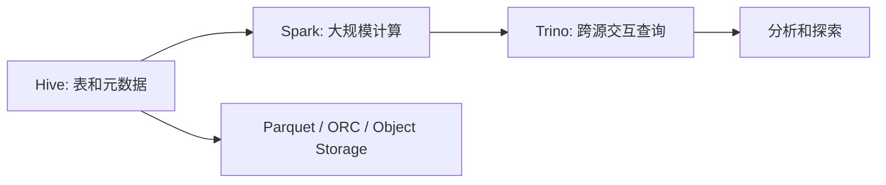

# 7. 批处理系统：Hive / Spark / Trino

::: tip 本章导读
理解 Hive、Spark、Trino 在历史数据加工、分布式计算和跨源分析中的定位。
:::
::: info 本章验收问题
- 你能否区分批处理层和查询层的职责边界？
- 你能否说明 Spark、Hive、Trino 在一条历史分析链路中的不同位置？
:::




批处理解决的是历史数据的大规模计算。

## 问题切入

它不追求每条数据毫秒级处理，而是关注在可接受的时间窗口内，把大量历史数据稳定、可重复、可调度地计算出来。

第 6 章解决了数据如何从 PostgreSQL 进入数仓和湖仓。但数据进入平台后，还要被持续加工：订单明细要清洗，支付和退款要对账，用户日汇总要生成，商品销量排行要重算，历史分区要回填。

当数据量还小时，这些任务可以在 PostgreSQL 或单机脚本中完成。但当历史数据进入 TB、PB 级，或者任务需要跨很多天、很多表、很多主题域运行时，单机数据库和简单脚本会遇到明显瓶颈：

```text
一次重算要扫描几年历史数据。
一个 JOIN 需要处理几十亿行明细。
每日任务失败后，需要按分区重跑。
一个上游维度变更，会影响大量下游汇总。
多个团队同时运行历史分析，资源需要统一调度。
```

这时需要的不是“更复杂的 SQL”，而是能组织海量文件、分布式计算、任务重跑和跨源查询的批处理体系。

## 核心判断

> 批处理回答的是：过去发生了什么，以及这些历史数据如何被加工成可分析、可复用的数据资产。

面向 TB 级历史数据做加工，不能靠手工跑 SQL。批处理系统用 MapReduce、Spark、Hive、Trino 把数据加工工程化——可调度、可重跑、可伸缩、可追溯。这一章不是讲每个引擎的语法，而是讲批处理的架构思维和系统取舍。

批处理也不是所有问题的答案。它不适合强实时告警、在线交易、点查更新和低延迟交互应用。它更适合离线数仓、历史回算、特征批量生成、报表汇总和数据资产建设。

## 机制解释

## 本章内容

| 节号 | 主题 |
|------|------|
| [07.1](/chapters/07/07-1) | 什么是批处理 |
| [07.2](/chapters/07/07-2) | 批处理的应用场景 |
| [07.3](/chapters/07/07-3) | 批处理核心技术 |
| [07.4](/chapters/07/07-4) | 批处理调度与编排 |
| [07.5](/chapters/07/07-5) | 批处理性能优化 |
| [07.6](/chapters/07/07-6) | 批处理监控与运维 |
| [07.7](/chapters/07/07-7) | 批处理实战案例 |
| [07.8](/chapters/07/07-8) | 批处理系统设计 |
| [07.9](/chapters/07/07-9) | 批处理与流处理的融合 |
| [07.10](/chapters/07/07-10) | 批处理最佳实践总结 |
| [07.11](/chapters/07/07-11) | 批处理常见问题与解决方案 |
| [07.12](/chapters/07/07-12) | 批处理实战任务 |


## 系统位置

### 批处理作业设计清单

一个批处理任务不能只写成“每天跑一次 SQL”。真实平台里，批处理任务至少要明确六个边界：

| 设计项 | 必须说明 | 失败后果 |
| --- | --- | --- |
| 输入分区 | 读取哪个日期、哪个快照、哪些源表版本 | 重跑时读到变化后的源数据，结果不可复现 |
| 计算粒度 | 一行输出代表用户、订单、商品、事件还是汇总日期 | JOIN 放大或聚合重复，指标被悄悄算错 |
| 资源策略 | Spark executor、Shuffle、并发、内存和临时目录如何配置 | 小数据能跑，大数据 OOM 或拖垮集群 |
| 幂等写入 | 使用覆盖分区、临时表交换，还是追加写入 | 重跑产生重复数据，或者覆盖错误分区 |
| 质量校验 | 行数、金额、空值、主键重复和上下游对账如何检查 | 任务成功但数据错误，错误进入下游看板 |
| 血缘记录 | 输入表、输出表、任务版本、运行批次如何记录 | 出问题时不知道影响了哪些报表和模型 |

以“每日用户消费汇总”为例，合格作业要写清楚：

```text
输入：dwd_order_payment_detail，分区 dt = ${biz_date}
粒度：一行代表一个用户在一个自然日的支付汇总
过滤：支付成功、排除测试订单、排除风控拦截订单
输出：dws_user_sales_daily，覆盖 dt = ${biz_date}
质量：用户数不超过当日下单用户数，GMV 与订单明细对账误差为 0
重跑：允许按 dt 覆盖重算，不追加重复行
```

这类清单比“选择 Spark 还是 Hive”更重要。引擎只负责执行，作业设计负责让结果可解释、可重跑、可对账。

批处理位于数据平台的离线计算层。

```text
PostgreSQL / 日志 / 外部文件
  -> ETL / CDC
  -> ODS / Lake
  -> Hive Metastore / 表格式
  -> Spark / Hive SQL 批量加工
  -> DWD / DWS / ADS
  -> Trino / BI / 特征平台 / AI 数据准备
```

它承接第 6 章的数据链路，负责把进入平台的数据加工成可复用资产。它也为后续章节做铺垫：第 8 章实时处理解决“不能等到明天”的问题，第 9 章 OLAP 数据库解决“结果如何被快速查询”的问题，第 12 章湖仓把批处理和多引擎访问建立在开放表格式之上。

从 PostgreSQL 视角看，批处理不是替代业务库，而是把业务库不适合长期承担的历史扫描、跨域 JOIN、全量回算和特征批量生成转移到分布式分析体系。

## 场景案例

假设经营看板每天早上 8 点前要展示昨天的销售指标。

批处理链路可以设计为：

```text
00:30 同步 PostgreSQL orders / order_items / payments 到 ODS 分区
01:00 清洗生成 dwd_order_payment_detail
02:00 关联 dim_user / dim_product / dim_channel
03:00 生成 dws_product_daily、dws_channel_daily、dws_user_daily
04:00 生成 ads_sales_dashboard
05:00 运行质量检查和对账
08:00 BI 看板展示
```

这个链路有几个关键判断：

- ODS 按业务日期或同步日期分区，方便重跑和追溯。
- DWD 明确订单支付明细的一行粒度，避免 JOIN 后重复计算。
- DWS 沉淀公共汇总，避免每个报表重复扫描明细。
- ADS 面向具体看板，允许为展示便利做冗余。
- 如果某天任务失败，可以只重跑受影响分区，而不是重算全部历史。

批处理的价值就在这里：它把复杂历史加工变成可调度、可重跑、可检查的工程流程。

## 常见误区

**误区一：Hive、Spark、Trino 都是同一种东西。**

Hive 更像离线数仓 SQL 和元数据体系，Spark 是通用分布式计算引擎，Trino 是跨源交互式 SQL 查询引擎。

**误区二：Spark 一定比 PostgreSQL 快。**

小数据、点查、事务查询，PostgreSQL 更合适。Spark 的优势在大规模并行计算，不在所有查询都快。

**误区三：批处理只要能跑完就行。**

批处理还要支持依赖、重跑、幂等、质量校验、资源成本和产物可追溯。

**误区四：分布式计算一定比单机快。**

小数据、点查、短查询和强事务场景下，分布式系统的调度、网络和 Shuffle 成本可能反而更高。批处理的优势在大规模历史吞吐，不在所有查询延迟。

**误区五：能跨源查询就可以随意 JOIN。**

Trino 可以连接多个系统，但跨源 JOIN 可能造成大量网络传输和源库压力。跨源查询适合探索和轻量联邦分析，稳定报表通常仍应沉淀到数仓或湖仓模型中。

## 实战任务

设计一个每日订单数仓批处理任务：

```text
PostgreSQL orders / order_items / payments
  -> ODS
  -> DWD 订单明细
  -> DWS 商品日汇总
  -> ADS 销售看板
```

要求说明：

- 哪些数据按天分区。
- 哪些任务可以重跑。
- 哪些 JOIN 可能产生 Shuffle。
- 哪些维度表适合广播。
- 输出哪些质量检查。

补充要求：

- 画出任务 DAG。
- 指出每个任务输入分区和输出分区。
- 说明如果 `dim_product` 修正了历史类目，哪些 DWS / ADS 表需要回填。
- 设计至少 3 个质量检查，例如行数波动、主键唯一、金额对账。
- 估算最容易发生 Shuffle 的步骤，并说明如何优化。

示例 DAG：

```text
ods_orders
  -> dwd_order_payment_detail
ods_order_items
  -> dwd_order_payment_detail
ods_payments
  -> dwd_order_payment_detail
dim_product
  -> dws_product_daily
dwd_order_payment_detail
  -> dws_product_daily
  -> dws_channel_daily
  -> ads_sales_dashboard
```

## 小结引出下一章

批处理系统让数据平台能够稳定加工大规模历史数据。

Hive 组织离线数仓表，Spark 执行大规模计算，Trino 提供跨源交互式查询。

下一章进入实时数据处理。

因为很多业务问题不能等到明天再回答，它们需要在事件发生时就被捕获、计算和展示。
