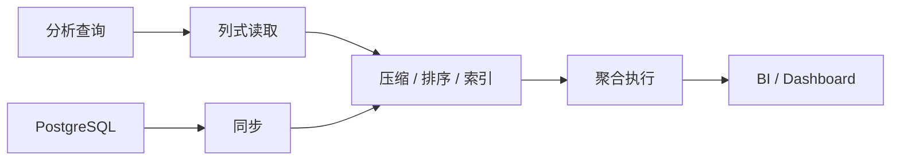

# 9. OLAP 数据库：ClickHouse / Doris / DuckDB

::: tip 本章导读
理解列式存储、MPP、本地 OLAP 和 PostgreSQL 到分析库的链路。
:::


## 本章阅读框架

| 阅读问题 | 本章回答方式 |
| --- | --- |
| 这个问题为什么出现？ | 从业务增长、数据规模、系统目标或 AI 应用压力切入。 |
| 它解决什么问题？ | 提炼为一个核心判断，避免把概念写成孤立定义。 |
| 它不解决什么问题？ | 在机制解释和常见误区中说明边界，防止工具崇拜。 |
| 它在真实平台哪里出现？ | 放回 PostgreSQL、数仓、批流、OLAP、湖仓、向量、图和治理的演化链路。 |
| 读完要会做什么？ | 通过场景案例和实战任务转成可练习的判断。 |



OLAP 数据库面向高性能分析。

## 问题切入

它们的设计目标不是替代 PostgreSQL 的业务事务能力，而是更高效地处理大范围扫描、聚合、排序、多维分析和报表查询。

第 7 章说明了历史数据如何通过批处理生成 DWD、DWS、ADS。第 8 章说明了实时事件如何通过 Kafka 和 Flink 生成实时指标。但无论数据来自批处理还是实时流，最终都会遇到一个问题：这些结果要被人和应用高频查询。

典型需求包括：

```text
BI 看板秒级打开最近 90 天 GMV 趋势。
运营按渠道、地区、类目、用户等级自由下钻。
实时大盘每分钟刷新订单数和支付金额。
日志分析要在几十亿行中快速过滤错误事件。
数据科学家想在本地直接分析 Parquet 文件。
```

这些查询和 PostgreSQL 的业务点查不同，也和 Spark 批处理不同。它们需要在大量历史或近实时数据上做低延迟分析，于是需要专门面向分析查询优化的 OLAP 数据库。

## 核心判断

> OLAP 数据库的核心，是用列式存储、压缩、排序、预聚合和分布式执行，为分析查询优化。

本章要建立的判断是：OLAP 数据库不是“更快的 PostgreSQL”，而是面向分析负载重新设计的查询系统。它通过列式存储、排序键、压缩、分区、向量化执行、MPP 或本地嵌入式执行，让大范围扫描和聚合更高效。

OLAP 数据库也不是数仓建模、ETL、治理和事务系统的替代品。它负责承载分析查询，但指标口径、数据质量、血缘、权限、更新语义和源系统一致性仍然需要完整数据平台来保证。

## 机制解释

### 9.1 为什么列式存储适合分析

业务查询经常需要读取一整行。

分析查询经常只需要少数列，但要扫描大量行。

例如统计 GMV：

```sql
SELECT
    date(created_at) AS dt,
    SUM(total_amount) AS gmv
FROM orders
WHERE order_status = 'paid'
GROUP BY date(created_at);
```

这个查询主要需要：

```text
created_at
total_amount
order_status
```

如果表有 100 个字段，行存会读取大量不需要的列。列存只读取相关列，因此更适合扫描和聚合。

列式存储还更容易压缩，因为同一列的数据类型和分布更一致。

### 9.2 ClickHouse

ClickHouse 是高性能列式 OLAP 数据库。

核心概念包括：

- 列式存储。
- MergeTree。
- 分区 Partition。
- 排序键 `ORDER BY`。
- 主键 Primary Key。
- 稀疏索引。
- 数据压缩。
- 物化视图。
- 聚合函数。
- ReplacingMergeTree。
- SummingMergeTree。
- AggregatingMergeTree。
- 分布式表。
- 大宽表建模。

ClickHouse 中最重要的是 MergeTree 系列表引擎。

一个常见表设计：

```sql
CREATE TABLE orders_olap
(
    order_id String,
    user_id String,
    order_status String,
    total_amount Decimal(18, 2),
    created_at DateTime
)
ENGINE = MergeTree
PARTITION BY toYYYYMM(created_at)
ORDER BY (user_id, created_at);
```

这里 Partition 解决数据管理和分区裁剪，`ORDER BY` 解决数据排序和稀疏索引访问路径。

ClickHouse 的核心判断是：

> ClickHouse 快，不只是因为列存，而是列存、排序、压缩、稀疏索引、向量化执行和表引擎共同作用。

它适合日志分析、行为分析、实时看板、宽表分析和高并发聚合查询。

它不适合替代强事务业务库。

### 9.3 Apache Doris

Doris 是面向实时数仓和 BI 的 MPP 分析数据库。

核心概念包括：

- FE / BE。
- MPP 架构。
- 明细模型。
- 聚合模型。
- 主键模型。
- Duplicate Key。
- Aggregate Key。
- Unique Key。
- 物化视图。
- 数据导入。
- 冷热分层。
- 实时数仓。

Doris 的表模型强调分析场景。

Duplicate Key 是明细模型，Key 列主要承担排序和存储组织作用，不做去重或聚合，适合保存事实表明细、日志明细、用户行为明细和需要保留原始记录的分析场景。

Aggregate Key 是聚合模型，按 Key 列聚合 Value 列，在导入、Compaction 和查询阶段共同完成预聚合，适合固定维度报表、汇总宽表和不需要在 Doris 中保留原始明细的场景。

Unique Key 是主键 / 唯一键模型，同一个 Key 的新数据会覆盖旧数据，适合从上游 OLTP 或 CDC 同步来的更新型分析场景，例如订单状态、用户标签、维表和需要 Upsert 的实时数仓表。

这三种模型不是性能档位，而是语义选择：

| 表模型 | 保留语义 | 适合场景 | 主要边界 |
| --- | --- | --- | --- |
| Duplicate Key | 保留所有写入记录 | 明细事实、日志、行为事件、任意维度 Ad Hoc 查询 | 不自动去重、不预聚合 |
| Aggregate Key | 按 Key 聚合 Value | 固定维度汇总、报表预聚合、存储压缩 | 原始明细不在该表中完整保留，聚合语义必须提前设计 |
| Unique Key | 同 Key 保留最新值 | CDC 同步、维表、订单状态、用户画像标签 | 更新语义依赖 Key 设计和 Upsert 模式，不等同 OLTP 事务库 |

FE / BE 也需要分清责任。FE 主要处理用户请求、SQL 解析和规划、元数据管理、节点管理；BE 主要负责数据存储和查询执行。MPP 查询依赖多个节点之间和节点内部的并行执行。Doris 因此适合承接数仓、CDC、Flink 或湖仓之后的低延迟分析查询，但它仍然不替代源端事务一致性、指标口径治理和跨系统数据质量校验。

Doris 的核心判断是：

> Doris 把数据导入、表模型、MPP 查询和实时数仓能力整合到一个面向 BI 的分析系统中。

它适合实时数仓、报表平台、交互分析和统一分析服务。

### 9.4 DuckDB

DuckDB 是本地嵌入式 OLAP 数据库。

它不像 ClickHouse 和 Doris 那样主要面向服务化集群，而是作为进程内分析数据库嵌入到应用、Notebook 或脚本中，适合本地分析、数据科学和嵌入式场景。

核心能力包括：

- 本地 OLAP。
- 嵌入式分析。
- Parquet 查询。
- Python 集成。
- 单机高性能。
- 数据科学。
- AI 数据预处理。

例如直接查询 Parquet：

```sql
SELECT
    category,
    SUM(amount) AS gmv
FROM read_parquet('orders.parquet')
GROUP BY category;
```

DuckDB 的核心判断是：

> DuckDB 让本地文件、Notebook、Python 和分析 SQL 之间的距离变得很短。

它特别适合开发、探索、数据科学预处理、小型离线分析和 AI 数据准备。官方 Parquet 文档也强调 DuckDB 可以直接查询 Parquet 文件，并利用列裁剪和过滤下推减少不必要读取。

但这不意味着 DuckDB 可以替代服务化 OLAP 平台。它的优势是嵌入式、本地、单进程、低摩擦分析；如果场景需要统一权限、多用户并发服务、长期在线查询、资源隔离和集群运维，通常仍要使用 ClickHouse、Doris、Trino 或湖仓查询服务。

### 9.5 PostgreSQL 到 OLAP 的分析链路

典型链路是：

```text
PostgreSQL
  -> ETL / CDC
  -> ClickHouse / Doris
  -> BI / Dashboard
```

在这条链路中：

- PostgreSQL 负责业务写入。
- ETL / CDC 负责同步。
- OLAP 数据库负责分析查询。
- BI 负责展示和交互。

设计时要注意：

```text
源表主键如何映射？
更新和删除如何处理？
是否保留明细？
是否构建宽表？
是否预聚合？
实时性要求多高？
指标口径在哪里定义？
```


### 深度展开：OLAP 数据库如何落到真实系统

本节补齐本章的工程细节。阅读时不要只记住概念名称，而要把它放回“输入是什么、处理路径是什么、输出给谁、边界在哪里、如何验证”的链路中。

#### 一、它从什么问题开始

分析查询经常只读少数列、扫描大量行、做高并发聚合，传统行存业务库不是为这种负载优化的。

这个问题通常不会以技术名词出现，而是以业务现象出现：报表变慢、指标不一致、实时看板延迟、RAG 召回不稳定、数据无法追溯、项目 Demo 无法验收。能不能把现象还原成系统问题，是本书要训练的第一层能力。

#### 二、输入数据和前置判断

输入是事实表、宽表、聚合表、实时明细流和 BI 查询请求。

在动手之前，至少要确认四件事：

| 判断项 | 要回答的问题 |
| --- | --- |
| 数据粒度 | 一行代表什么事实，是用户、订单、订单明细、事件、文件、Chunk，还是一条关系？ |
| 时间边界 | 使用创建时间、更新时间、支付时间、事件时间，还是处理时间？ |
| 状态边界 | 哪些状态算有效，哪些测试、取消、退款、重复或迟到数据要排除？ |
| 责任边界 | 这个环节负责记录事实、生产指标、加速查询、治理质量，还是服务 AI 应用？ |

#### 三、处理路径

处理路径是通过列式存储、压缩、排序键、分区、稀疏索引、向量化执行、预聚合或 MPP 并行执行，加速扫描、过滤、GROUP BY 和排序。

这条路径应该能被写成可执行流程，而不是停留在术语解释。一个合格的设计至少要说明：数据从哪里来、经过哪些转换、写到哪里、谁消费、失败后如何重跑、结果如何校验。

#### 四、在真实平台中的位置

真实平台中 ClickHouse 适合高性能列式分析，Doris 常用于实时数仓和 BI 服务，DuckDB 适合本地文件分析和嵌入式 OLAP。它们经常接在数仓、CDC 或湖仓之后。

平台位置决定了它和前后系统的关系。不要孤立地问“这个技术好不好”，而要问：

- 它继承了上一层什么问题？
- 它把什么复杂度转移给了下一层？
- 它的输出是否能被复用、追溯和治理？
- 它是否改变了数据粒度、延迟、一致性或权限边界？

#### 五、边界和失败模式

OLAP 数据库不是业务交易库。它通常不适合高频小事务、复杂跨行更新、强一致写入链路，也不能替代指标建模和数据治理。

常见失败信号可以这样检查：

| 失败信号 | 应该追问什么 |
| --- | --- |
| BI 查询扫描大量历史数据 | 定位到具体输入、口径、链路、边界或治理责任。 |
| 查询只用少数列但业务库仍要读整行 | 定位到具体输入、口径、链路、边界或治理责任。 |
| 并发看板影响业务库 | 定位到具体输入、口径、链路、边界或治理责任。 |
| 宽表和聚合表需要低延迟查询 | 定位到具体输入、口径、链路、边界或治理责任。 |

#### 六、可操作练习

把订单明细同步到一个列式模型，设计排序键、分区键、常用查询和预聚合表，并解释为什么这些设计服务 BI 查询。

练习完成后不要只看“有没有跑通”，还要补一份复盘：

- 输入数据是否足以支撑问题？
- 口径和边界是否写清楚？
- 结果能否被重复计算和对账？
- 如果数据量扩大 10 倍，瓶颈会出现在哪里？
- 如果接入下游 BI、RAG 或治理系统，还缺哪些元数据？


## 系统位置

OLAP 数据库位于数据平台的分析服务层。

```text
PostgreSQL / Kafka / Files
  -> ETL / CDC / Flink / Spark
  -> 明细表 / 宽表 / 汇总表
  -> ClickHouse / Doris / DuckDB
  -> BI / Dashboard / Ad hoc SQL / 数据应用
```

它承接第 7 章和第 8 章的计算结果：批处理生成的历史汇总、实时处理生成的近实时指标，都需要一个查询层服务用户。它也引出第 10 章向量数据库：当查询对象从结构化字段、指标和维度扩展到文本语义、图片语义和知识片段时，传统 OLAP 的过滤聚合能力就不够，需要相似度检索和向量索引。

选型时要先看场景：

| 场景 | 更常见选择 | 判断原因 |
| --- | --- | --- |
| 高并发实时看板、日志分析 | ClickHouse | 列式、MergeTree、宽表和高吞吐聚合能力强 |
| 实时数仓、BI 服务、更新型分析 | Doris | MPP、表模型和 BI 场景整合度高 |
| 本地文件分析、Notebook、数据科学预处理 | DuckDB | 嵌入式、本地高性能、直接查询 Parquet |
| 大规模离线回算 | Spark / Hive | 更适合批量计算，不是交互查询层 |
| 强事务业务写入 | PostgreSQL | OLTP 一致性和事务能力更合适 |

## 场景案例

一个订单分析平台可以这样设计：

```text
PostgreSQL orders / order_items / payments
  -> CDC 或批量同步
  -> dwd_order_payment_detail
  -> ClickHouse orders_wide
  -> daily_order_metrics 物化视图 / 汇总表
  -> BI Dashboard
```

ClickHouse 明细宽表可以围绕查询模式设计：

```sql
CREATE TABLE orders_wide
(
    order_id String,
    user_id String,
    channel String,
    category String,
    order_status String,
    total_amount Decimal(18, 2),
    paid_at DateTime
)
ENGINE = MergeTree
PARTITION BY toYYYYMM(paid_at)
ORDER BY (channel, category, paid_at, user_id);
```

这个表设计表达了几个判断：

- `PARTITION BY toYYYYMM(paid_at)` 方便按月管理和裁剪历史数据。
- `ORDER BY (channel, category, paid_at, user_id)` 服务常见渠道、类目、时间范围分析。
- 宽表牺牲一定冗余，换取 BI 查询便利。
- 如果订单状态会更新，必须设计更新和去重策略，不能只把 append-only 日志当最终事实。

同一个场景如果是本地探索，可以先把 DWD 明细导出为 Parquet，用 DuckDB 在 Notebook 中快速验证分析逻辑；如果是企业 BI 平台，可以选择 Doris 承载高并发查询和更新型实时数仓。

## 常见误区

**误区一：OLAP 数据库越快越好，业务库可以不要。**

OLAP 快在分析，不代表适合强事务写入和复杂业务一致性。

**误区二：ClickHouse 有物化视图，就不需要数仓。**

物化视图是计算机制，数仓还包括分层、口径、质量、血缘、权限和治理。

**误区三：DuckDB 只是玩具。**

DuckDB 不适合替代服务化数仓，但在本地 OLAP、数据科学和文件分析中非常实用。

**误区四：把所有字段做成大宽表就万事大吉。**

宽表能提升查询便利性，但会带来冗余、更新困难、口径固化和存储成本。公共明细、汇总表和应用宽表要有边界。

**误区五：OLAP 查询快就代表数据可信。**

查询速度和数据可信是两件事。OLAP 数据库可以很快返回错误口径、重复数据或未治理字段。可信仍依赖建模、质量、血缘和权限。

## 实战任务

设计 PostgreSQL 到 ClickHouse 的订单分析链路。

要求：

1. 选择同步方式：批量还是 CDC。
2. 设计 ClickHouse 明细表。
3. 选择分区键。
4. 选择排序键。
5. 设计每日 GMV 物化视图或汇总表。
6. 说明更新和删除如何处理。
7. 说明哪些查询留在 PostgreSQL，哪些查询进入 ClickHouse。

补充要求：

- 列出 5 条目标查询，并用它们反推分区键、排序键和宽表字段。
- 对比 ClickHouse 明细宽表、Doris 主键模型、DuckDB 本地 Parquet 分析三种方案。
- 说明物化视图或汇总表的刷新策略。
- 设计一条对账规则：ClickHouse 每日 GMV 与数仓 DWS 每日 GMV 差异超过阈值时告警。
- 说明哪些场景不能迁入 OLAP，例如订单创建、库存扣减、支付状态强一致更新。

## 小结引出下一章

OLAP 数据库承担高性能分析。

ClickHouse 强在列式高性能和表引擎，Doris 强在实时数仓和 BI 场景，DuckDB 强在本地嵌入式分析。

下一章进入向量数据库。

因为 AI 时代的数据查询不再只有结构化过滤和聚合，还需要基于语义相似性的检索能力。
