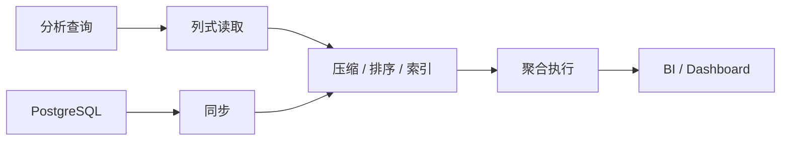

# 9. OLAP 数据库：ClickHouse / Doris / DuckDB

::: tip 本章导读
理解列式存储、MPP、本地 OLAP 和 PostgreSQL 到分析库的链路。
:::


## 本章阅读框架

| 阅读问题 | 本章回答方式 |
| --- | --- |
| 这个问题为什么出现？ | 从业务增长、数据规模、系统目标或 AI 应用压力切入。 |
| 它解决什么问题？ | 提炼为一个核心判断，避免把概念写成孤立定义。 |
| 它不解决什么问题？ | 在机制解释和常见误区中说明边界，防止工具崇拜。 |
| 它在真实平台哪里出现？ | 放回 PostgreSQL、数仓、批流、OLAP、湖仓、向量、图和治理的演化链路。 |
| 读完要会做什么？ | 通过场景案例和实战任务转成可练习的判断。 |



OLAP 数据库面向高性能分析。

## 问题切入

它们的设计目标不是替代 PostgreSQL 的业务事务能力，而是更高效地处理大范围扫描、聚合、排序、多维分析和报表查询。

第 7 章说明了历史数据如何通过批处理生成 DWD、DWS、ADS。第 8 章说明了实时事件如何通过 Kafka 和 Flink 生成实时指标。但无论数据来自批处理还是实时流，最终都会遇到一个问题：这些结果要被人和应用高频查询。

典型需求包括：

```text
BI 看板秒级打开最近 90 天 GMV 趋势。
运营按渠道、地区、类目、用户等级自由下钻。
实时大盘每分钟刷新订单数和支付金额。
日志分析要在几十亿行中快速过滤错误事件。
数据科学家想在本地直接分析 Parquet 文件。
```

这些查询和 PostgreSQL 的业务点查不同，也和 Spark 批处理不同。它们需要在大量历史或近实时数据上做低延迟分析，于是需要专门面向分析查询优化的 OLAP 数据库。

## 核心判断

> OLAP 数据库的核心，是用列式存储、压缩、排序、预聚合和分布式执行，为分析查询优化。

本章要建立的判断是：OLAP 数据库不是“更快的 PostgreSQL”，而是面向分析负载重新设计的查询系统。它通过列式存储、排序键、压缩、分区、向量化执行、MPP 或本地嵌入式执行，让大范围扫描和聚合更高效。

OLAP 数据库也不是数仓建模、ETL、治理和事务系统的替代品。它负责承载分析查询，但指标口径、数据质量、血缘、权限、更新语义和源系统一致性仍然需要完整数据平台来保证。

## 机制解释

### 9.1 OLAP数据库概述

前面学习了实时数据处理，了解了流处理和批处理的融合。

分析型数据库（OLAP）是数据系统的核心组件。如何理解OLAP数据库？它与OLTP有什么区别？如何选择合适的OLAP数据库？

**场景**：
```yaml
分析型数据库需求：

产品经理："要看用户增长分析"

数据工程师："用MySQL查询很慢"

架构师："需要OLAP数据库"

新工程师："什么是OLAP？"
```

**问题**：
- OLAP和OLTP有什么区别？
- OLAP数据库的核心特性是什么？
- 有哪些主流的OLAP数据库？
- 如何选择合适的OLAP数据库？
- OLAP数据库如何支撑分析查询？

**答案**：**OLAP数据库专门为分析型场景设计，采用列式存储、向量化执行、MPP架构、索引优化等技术，能够在海量数据上快速完成复杂聚合查询，是数据分析系统的核心引擎**

---

## OLAP vs OLTP：根本差异

### 核心区别

| 维度 | OLTP（交易型） | OLAP（分析型） |
|------|----------------|----------------|
| **业务场景** | 业务交易、实时事务 | 数据分析、报表、决策支持 |
| **数据特点** | 当前状态、少量记录 | 历史数据、大量记录 |
| **查询模式** | 简单查询、点查询 | 复杂聚合、多表关联 |
| **数据更新** | 频繁的增删改 | 批量导入、很少修改 |
| **性能指标** | 响应时间（ms级） | 查询吞吐量 |
| **数据量** | GB级 | TB/PB级 |
| **并发要求** | 高并发、强一致性 | 并发度低、最终一致 |
| **典型用户** | 业务系统、前端应用 | 分析师、BI工具 |

### 为什么不能用OLTP做分析？

**问题1：查询性能**
```sql
-- OLTP数据库上的分析查询
SELECT 
    DATE_FORMAT(order_time, '%Y-%m') AS month,
    COUNT(DISTINCT user_id) AS buyers,
    COUNT(*) AS orders,
    SUM(amount) AS gmv
FROM orders
WHERE order_time >= '2025-01-01'
GROUP BY month;

-- 问题：
-- 1. 需要全表扫描（数亿行）
-- 2. 行式存储效率低
-- 3. 索引无法加速聚合
-- 4. 查询时间：数分钟到数小时
```

**问题2：影响业务**
```yaml
分析查询占用资源：
- CPU：100%
- 内存：溢出
- 磁盘IO：饱和
- 结果：业务交易受影响
```

**问题3：数据组织方式不匹配**
```yaml
OLTP数据组织：
- 按业务流程设计
- 范式化、多表关联
- 优化单条记录查询

OLAP需求：
- 按分析主题组织
- 宽表、预聚合
- 优化批量扫描和聚合
```

## OLAP数据库核心特性

### 1. 列式存储

**原理**：将同一列的数据连续存储

```sql
-- 表结构
CREATE TABLE sales (
    id INT,
    product_id INT,
    category VARCHAR(50),
    amount DECIMAL(10,2),
    sale_time TIMESTAMP
);

-- 行式存储（OLTP）
[id=1, product_id=100, category='A', amount=10.0, time='2025-01-01']
[id=2, product_id=101, category='B', amount=20.0, time='2025-01-02']
[id=3, product_id=100, category='A', amount=15.0, time='2025-01-03']

-- 列式存储（OLAP）
id: [1, 2, 3]
product_id: [100, 101, 100]
category: ['A', 'B', 'A']
amount: [10.0, 20.0, 15.0]
time: ['2025-01-01', '2025-01-02', '2025-01-03']
```

**优势**：
```yaml
分析查询只访问需要的列：
- SELECT SUM(amount) FROM sales;
- 只读取amount列，其他列不读
- IO减少：5列查询只读1列，减少80%
- 压缩比高：同类数据压缩率高（5-10倍）

行式存储的问题：
- 即使只查询1列，也要读整行
- IO浪费：读5列的数据只为用1列
- 压缩比低：不同类型数据混在一起
```

### 2. 向量化执行

**原理**：批量处理数据，而不是逐行处理

```sql
-- 传统执行（逐行）
total = 0
for each row:
    total += row.amount
    # 每次处理一条记录，函数调用开销大

-- 向量化执行（批量）
amount_array = [10.0, 20.0, 15.0, 30.0, ...]
total = sum(amount_array)
# 一次处理一批数据，利用CPU SIMD加速
```

**性能提升**：
```yaml
向量化加速：
- SIMD指令：一次处理多个数据（4-8倍）
- 减少函数调用：批量处理减少开销
- CPU缓存友好：连续访问内存
- 实际提升：2-10倍性能提升
```

### 3. MPP架构

**原理**：大规模并行处理（Massively Parallel Processing）

```
┌─────────────────────────────────────┐
│           Coordinator               │
│        (查询解析、调度)               │
└──────────┬──────────────────────────┘
           │
    ┌──────┴──────┬──────────┬──────────┐
    │             │          │          │
┌───▼───┐    ┌───▼───┐  ┌───▼───┐  ┌───▼───┐
│ Node1 │    │ Node2 │  │ Node3 │  │ Node4 │
│  1TB  │    │  1TB  │  │  1TB  │  │  1TB  │
└───────┘    └───────┘  └───────┘  └───────┘
     │            │          │          │
  ┌──▼──┐      ┌──▼──┐    ┌──▼──┐    ┌──▼──┐
  │ Disk │      │ Disk │    │ Disk │    │ Disk │
  └─────┘      └─────┘    └─────┘    └─────┘

-- 查询执行流程
-- 1. Coordinator接收查询
-- 2. 解析SQL，生成执行计划
-- 3. 分发任务到各个节点
-- 4. 各节点并行处理本地数据
-- 5. 中间结果在节点间交换
-- 6. 汇总结果返回
```

**优势**：
```yaml
线性扩展：
- 增加1个节点，性能提升1倍（理论上）
- 数据量增加1倍，增加1个节点即可
- 查询时间不随数据量线性增长

分布式执行：
- 数据分片：每个节点存储部分数据
- 本地计算：节点处理本地数据
- 网络交换：必要时交换数据
- 并行聚合：各节点预聚合，再汇总
```

### 4. 智能索引

**原理**：为分析场景设计的索引结构

```sql
-- 1. 聚簇索引（Clustering Key）
-- 按时间列排序存储
CREATE TABLE events (
    event_time TIMESTAMP,
    user_id INT,
    event_type VARCHAR(50)
) CLUSTER BY (event_time);

-- 查询时可以跳过大量数据
SELECT COUNT(*) FROM events
WHERE event_time >= '2025-01-01';
-- 只扫描2025年的数据块

-- 2. 物化视图（预聚合）
CREATE MATERIALIZED VIEW daily_sales AS
SELECT 
    DATE(sale_time) AS date,
    category,
    SUM(amount) AS total_amount,
    COUNT(*) AS count
FROM sales
GROUP BY date, category;

-- 查询直接用预聚合结果
SELECT * FROM daily_sales
WHERE date >= '2025-01-01';
-- 毫秒级返回

-- 3. 布隆过滤器（快速判断）
-- 快速判断值是否存在，避免扫描不相关数据
```

**效果**：
```yaml
索引加速：
- 跳数扫描：跳过不相关的数据块（90%+）
- 预聚合：复杂查询变简单查询
- 布隆过滤：快速过滤数据
- 结果：查询速度提升10-1000倍
```

## 主流OLAP数据库对比

### ClickHouse

```yaml
特点：
- 单表性能最强
- 列式存储、向量化执行
- 压缩比高、查询速度快
- 不适合JOIN、多表关联

适用场景：
- 日志分析
- 时序数据
- 事件分析
- 监控指标

优势：
- 查询性能极佳
- 线性扩展好
- 数据压缩率高
- 社区活跃

劣势：
- JOIN性能弱
- 并发能力有限
- 运维复杂度高
- 缺少完整SQL支持
```

### Apache Doris

```yaml
特点：
- MPP架构
- 支持高并发查询
- 兼容MySQL协议
- JOIN性能好

适用场景：
- 多维分析
- 即时查询（Ad-hoc）
- BI报表
- 用户行为分析

优势：
- 查询延迟低
- 支持高并发
- 运维相对简单
- 完整SQL支持

劣势：
- 单表性能不如ClickHouse
- 资源占用较高
- 扩展性受限于FE节点
```

### StarRocks

```yaml
特点：
- 新一代MPP数据库
- 全面向量化执行
- 列存、行存都支持
- JOIN性能极强

适用场景：
- 复杂分析查询
- 多表关联
- 实时数据分析
- 替代传统数仓

优势：
- 性能最强（综合）
- JOIN性能极佳
- 支持更新删除
- 兼容MySQL协议

劣势：
- 相对较新
- 社区较小
- 学习曲线陡
```

### Apache Druid

```yaml
特点：
- 专为时序数据设计
- 支持实时摄入
- 支持高并发
- 列式+索引存储

适用场景：
- 实时监控
- 时序分析
- 广告技术
- 网络分析

优势：
- 实时摄入能力
- 高并发查询
- 时序场景优化
- 滚动升级

劣势：
- Join支持弱
- 存储成本高
- 运维复杂
```

## 如何选择OLAP数据库

### 决策树

```yaml
1. 数据类型：
   - 时序数据、日志数据 → ClickHouse/Druid
   - 宽表分析 → ClickHouse
   - 多表关联复杂查询 → StarRocks/Doris
   - 实时摄入 → Druid/StarRocks

2. 查询模式：
   - 简单聚合、单表查询 → ClickHouse
   - 复杂JOIN、多维度分析 → StarRocks
   - 高并发即席查询 → Doris
   - 实时分析 → Druid

3. 数据规模：
   - < 10TB → 单机或小集群
   - 10TB-100TB → 中等集群
   - > 100TB → 大规模集群

4. 团队能力：
   - 运维能力强 → ClickHouse
   - 追求简单 → Doris
   - 愿意尝鲜 → StarRocks

5. 成本考量：
   - 硬件成本 → ClickHouse（压缩比高）
   - 人力成本 → Doris（运维简单）
```

### 推荐组合

```yaml
场景1：用户行为分析
- 推荐：ClickHouse
- 原因：单表查询、写入量大、实时性要求高

场景2：业务多维分析
- 推荐：StarRocks/Doris
- 原因：多表JOIN、复杂聚合、高并发

场景3：日志分析
- 推荐：ClickHouse
- 原因：日志格式固定、时间序列、聚合查询

场景4：实时监控
- 推荐：Druid
- 原因：实时摄入、时序优化、高并发

场景5：传统数仓替换
- 推荐：StarRocks
- 原因：兼容性强、性能提升大、迁移成本低
```

## OLAP数据库典型架构

### Lambda架构中的OLAP

```
                    ┌─────────────┐
                    │  数据源系统   │
                    └──────┬──────┘
                           │
            ┌──────────────┴──────────────┐
            │                             │
      ┌─────▼─────┐                 ┌─────▼─────┐
      │ 实时流处理  │                 │ 批量ETL   │
      │ (Flink)   │                 │ (Spark)   │
      └─────┬─────┘                 └─────┬─────┘
            │                             │
            │        ┌─────────────────────┘
            │        │
        ┌───▼────────▼──┐
        │  OLAP数据库    │
        │ (ClickHouse)  │
        │               │
        │ - 实时层      │
        │ - 批量层      │
        └───────┬───────┘
                │
         ┌──────▼──────┐
         │  BI工具      │
         │ - Tableau   │
         │ - PowerBI   │
         │ - 自定义系统 │
         └─────────────┘
```

### Kappa架构中的OLAP

```
                    ┌─────────────┐
                    │  数据源系统   │
                    └──────┬──────┘
                           │
                    ┌──────▼──────┐
                    │   Kafka     │
                    │  消息队列    │
                    └──────┬──────┘
                           │
                    ┌──────▼──────┐
                    │  流处理引擎  │
                    │  (Flink)    │
                    └──────┬──────┘
                           │
                    ┌──────▼──────┐
                    │  OLAP数据库  │
                    │ (ClickHouse)│
                    └──────┬──────┘
                           │
                    ┌──────▼──────┐
                    │   分析应用   │
                    └─────────────┘
```

## OLAP数据库核心指标

### 性能指标

```yaml
查询延迟：
- 简单聚合：< 1秒
- 复杂分析：< 10秒
- 即席查询：< 5秒

吞吐量：
- 查询并发：100-1000 QPS
- 写入吞吐：MB/s级
- 扫描能力：GB/s级

数据规模：
- 单表：百亿级
- 集群：PB级
- 列数：数百列
```

### 稳定性指标

```yaml
可用性：
- 服务可用性：99.9%+
- 查询成功率：99.9%+
- 数据准确性：100%

扩展性：
- 在线扩容
- 滚动升级
- 故障自动恢复

可维护性：
- 监控告警
- 备份恢复
- 运维工具
```

## 总结

**OLAP数据库的核心价值**：
1. **性能**：在海量数据上快速完成复杂查询
2. **扩展**：通过增加节点线性扩展存储和计算
3. **灵活**：支持即席查询、多维分析
4. **标准**：支持SQL、兼容BI工具

**选择OLAP数据库的关键**：
1. **匹配场景**：根据查询模式、数据类型选择
2. **团队能力**：考虑运维能力、学习成本
3. **生态兼容**：工具链、社区支持
4. **未来规划**：扩展性、演进路线

**实践建议**：
1. **从简单开始**：先用单机、小集群验证
2. **POC测试**：用实际数据测试性能
3. **渐进迁移**：逐步从传统数仓迁移
4. **持续优化**：根据查询模式优化设计

### 9.2 OLAP数据模型与存储

前面学习了OLAP数据库概述，了解了OLAP与OLTP的区别以及主流OLAP数据库的特点。

OLAP数据库如何组织数据？如何存储数据？如何设计表结构？如何优化存储和查询性能？

**场景**：
```yaml
OLAP表设计：

数据分析师："要分析用户行为数据"

数据工程师："怎么设计表结构？"

架构师："需要考虑查询模式"
```

**问题**：
- OLAP表如何设计？
- 有哪些存储格式？
- 如何分区和分桶？
- 如何优化存储性能？
- 如何设计主键和索引？

**答案**：**OLAP数据库采用维度建模、宽表设计、分区分桶、列式存储等方式组织数据，通过预聚合、物化视图、索引优化等技术提升查询性能，需要根据查询模式、数据特点进行针对性设计**

---

## OLAP数据模型设计

### 星型模型 vs 雪花模型

**星型模型（Star Schema）**：
```sql
-- 事实表：销售记录
CREATE TABLE fact_sales (
    sale_id BIGINT,
    sale_time TIMESTAMP,
    product_id INT,
    customer_id INT,
    store_id INT,
    amount DECIMAL(10,2),
    quantity INT,
    profit DECIMAL(10,2)
) DISTRIBUTED BY HASH(sale_id) BUCKETS 32
PARTITION BY RANGE(sale_time) ();

-- 维度表：商品
CREATE TABLE dim_product (
    product_id INT,
    product_name VARCHAR(100),
    category VARCHAR(50),
    subcategory VARCHAR(50),
    brand VARCHAR(50)
) DUPLICATE KEY(product_id);

-- 维度表：客户
CREATE TABLE dim_customer (
    customer_id INT,
    customer_name VARCHAR(100),
    city VARCHAR(50),
    province VARCHAR(50),
    segment VARCHAR(50)
) DUPLICATE KEY(customer_id);

-- 维度表：门店
CREATE TABLE dim_store (
    store_id INT,
    store_name VARCHAR(100),
    city VARCHAR(50),
    region VARCHAR(50),
    manager VARCHAR(100)
) DUPLICATE KEY(store_id);

-- 查询：星型模型
SELECT 
    d.category,
    SUM(f.amount) AS total_sales,
    SUM(f.quantity) AS total_qty,
    SUM(f.profit) AS total_profit
FROM fact_sales f
JOIN dim_product d ON f.product_id = d.product_id
WHERE f.sale_time >= '2025-01-01'
GROUP BY d.category;
```

**雪花模型（Snowflake Schema）**：
```sql
-- 维度表进一步规范化
CREATE TABLE dim_category (
    category_id INT,
    category_name VARCHAR(50)
);

CREATE TABLE dim_subcategory (
    subcategory_id INT,
    subcategory_name VARCHAR(50),
    category_id INT
);

CREATE TABLE dim_product (
    product_id INT,
    product_name VARCHAR(50),
    subcategory_id INT
);

-- 查询：需要更多JOIN
SELECT 
    c.category_name,
    SUM(f.amount) AS total_sales
FROM fact_sales f
JOIN dim_product p ON f.product_id = p.product_id
JOIN dim_subcategory s ON p.subcategory_id = s.subcategory_id
JOIN dim_category c ON s.category_id = c.category_id
GROUP BY c.category_name;
```

**对比**：
```yaml
星型模型：
- 优势：JOIN少、查询快、结构简单
- 劣势：数据冗余、存储成本高
- 适用：OLAP查询、维度变化少

雪花模型：
- 优势：数据冗余少、存储节省
- 劣势：JOIN多、查询慢、结构复杂
- 适用：维度变化频繁、存储成本敏感

推荐：OLAP场景优先星型模型
```

### 宽表设计

**原理**：将维度属性整合到事实表中

```sql
-- 传统设计：多表关联
CREATE TABLE fact_sales (
    sale_id BIGINT,
    product_id INT,  -- 需要JOIN
    customer_id INT, -- 需要JOIN
    store_id INT,    -- 需要JOIN
    amount DECIMAL(10,2)
);

-- 宽表设计：冗余维度
CREATE TABLE fact_sales_wide (
    sale_id BIGINT,
    sale_time TIMESTAMP,
    -- 商品维度（冗余）
    product_id INT,
    product_name VARCHAR(100),
    category VARCHAR(50),
    brand VARCHAR(50),
    -- 客户维度（冗余）
    customer_id INT,
    customer_name VARCHAR(100),
    city VARCHAR(50),
    province VARCHAR(50),
    -- 门店维度（冗余）
    store_id INT,
    store_name VARCHAR(100),
    region VARCHAR(50),
    -- 指标
    amount DECIMAL(10,2),
    quantity INT,
    profit DECIMAL(10,2)
) PARTITION BY RANGE(sale_time) ()
DISTRIBUTED BY HASH(sale_id) BUCKETS 32;

-- 查询：不需要JOIN
SELECT 
    category,
    province,
    SUM(amount) AS total_sales
FROM fact_sales_wide
WHERE sale_time >= '2025-01-01'
GROUP BY category, province;

-- 优势：
-- 1. 查询快：不需要JOIN
-- 2. 优化好：列式存储，只读需要的列
-- 3. 简单：SQL简单、易于使用

-- 劣势：
-- 1. 存储大：数据冗余
-- 2. 更新难：维度变化需要更新事实表
```

**适用场景**：
```yaml
适合宽表：
- 维度变化少
- 查询频率高
- 存储成本不敏感
- 单表查询为主

不适合宽表：
- 维度频繁变化
- 多维度组合查询
- 存储成本敏感
- 需要保证一致性
```

## 存储格式与压缩

### 列式存储格式

**Parquet格式**：
```yaml
特点：
- 列式存储
- 高压缩比（Snappy, Gzip, Zstd）
- 支持复杂类型
- 跨语言支持
- 生态丰富（Spark, Hive, Presto）

优势：
- 压缩比高：5-10倍
- 查询快：只读需要的列
- 兼容好：多种引擎支持
- 稳定：成熟可靠

劣势：
- 写入慢：不能追加
- 不支持更新：需要重写文件
- 小文件问题：文件过多影响性能
```

**ORC格式**：
```yaml
特点：
- 列式存储
- 高压缩比
- 优化Hive
- 支持ACID
- 支持索引

优势：
- 性能好：Hive优化
- 压缩比高：内置索引
- 支持更新：ACID特性
- 元数据丰富：类型信息完整

劣势：
- 生态窄：主要在Hive生态
- 复杂度：配置参数多
```

**ClickHouse格式**：
```yaml
特点：
- 列式存储
- 自有格式
- 极致压缩
- 向量化执行

优势：
- 性能最强：单表查询最快
- 压缩比高：可达10倍以上
- 写入快：支持批量写入
- 兼容SQL：类SQL语法

劣势：
- JOIN弱：不适合复杂关联
- 并发有限：单机并发能力弱
- 运维复杂：需要专业团队
```

### 压缩算法对比

```yaml
Snappy：
- 压缩比：2-3倍
- 速度：极快
- CPU：低
- 适用：平衡场景

Gzip：
- 压缩比：3-5倍
- 速度：慢
- CPU：高
- 适用：存储敏感

Zstd（Zstandard）：
- 压缩比：3-6倍
- 速度：快
- CPU：中
- 适用：推荐选择

LZ4：
- 压缩比：2-3倍
- 速度：极快
- CPU：极低
- 适用：速度优先

推荐：
- 热数据：Snappy/LZ4
- 温数据：Zstd
- 冷数据：Zstd/Gzip
```

## 分区与分桶

### 分区设计（Partition）

**目的**：将数据按时间或其他维度切分，查询时只扫描相关分区

```sql
-- 按日期分区
CREATE TABLE events (
    event_time TIMESTAMP,
    event_type VARCHAR(50),
    user_id INT,
    properties STRING
) PARTITION BY RANGE(event_time) (
    PARTITION p202501 VALUES LESS THAN ('2025-02-01'),
    PARTITION p202502 VALUES LESS THAN ('2025-03-01'),
    PARTITION p202503 VALUES LESS THAN ('2025-04-01')
);

-- 查询只扫描相关分区
SELECT COUNT(*) FROM events
WHERE event_time >= '2025-02-01' AND event_time < '2025-03-01';
-- 只扫描p202502分区

-- 分区策略选择
时间分区：
- 按日分区：适合日粒度查询
- 按月分区：平衡粒度和文件数
- 按年分区：适合历史归档

业务分区：
- 按地区分区：地域查询多
- 按类别分区：类别查询多
- 按租户分区：多租户场景

推荐：
- OLAP场景优先按时间分区
- 分区粒度：10-100GB/分区
- 避免过多分区：< 1000个
```

**分区修剪示例**：
```sql
-- 查询1：利用分区修剪
SELECT * FROM events
WHERE event_time >= '2025-02-01' AND event_time < '2025-02-02';
-- 只扫描p202502分区中2025-02-01的数据
-- 扫描数据量：1天的数据

-- 查询2：不能利用分区
SELECT * FROM events
WHERE user_id = 12345;
-- 需要扫描所有分区
-- 扫描数据量：全部数据
-- 建议：增加user_id索引
```

### 分桶设计（Bucket）

**目的**：将数据分散到多个桶中，提高并行度和查询性能

```sql
-- 按user_id分桶
CREATE TABLE user_events (
    event_id BIGINT,
    event_time TIMESTAMP,
    user_id INT,
    event_type VARCHAR(50)
) PARTITION BY RANGE(event_time) ()
DISTRIBUTED BY HASH(user_id) BUCKETS 32;

-- 分桶原理
-- 1. 根据user_id计算hash值
-- 2. hash值 % 32 确定桶编号
-- 3. 相同user_id的数据在同一个桶
-- 4. 查询时可以利用分桶裁剪

-- 查询：利用分桶裁剪
SELECT * FROM user_events
WHERE user_id = 12345 AND event_time >= '2025-02-01';
-- 只需要扫描桶ID = hash(12345) % 32
-- 扫描数据量：1/32的数据
```

**分桶策略**：
```yaml
分桶列选择：
- 高频查询列：user_id, device_id等
- 高基数列：避免数据倾斜
- 均匀分布列：避免热点桶

分桶数量：
- 太少：并行度不够
- 太多：小文件过多
- 推荐：核心数 × 2-3
- 范围：10-100

避免数据倾斜：
- 选择均匀分布的列
- 避免热点值（如NULL）
- 监控桶大小分布
```

## 索引设计

### 二级索引

```sql
-- 创建Bitmap索引（适合低基数）
CREATE INDEX idx_category ON sales(category) USING BITMAP;

-- 创建Bloom Filter索引
CREATE INDEX idx_user_id ON sales(user_id) USING BLOOMFILTER;

-- 查询使用索引
SELECT * FROM sales
WHERE category = 'Electronics';
-- 使用Bitmap索引快速过滤

SELECT * FROM sales
WHERE user_id = 12345;
-- 使用Bloom Filter判断是否存在
```

### 物化视图

```sql
-- 创建物化视图
CREATE MATERIALIZED VIEW daily_category_sales AS
SELECT 
    DATE(sale_time) AS sale_date,
    category,
    SUM(amount) AS total_amount,
    SUM(quantity) AS total_quantity,
    COUNT(*) AS order_count
FROM sales_wide
GROUP BY sale_date, category;

-- 查询自动使用物化视图
SELECT sale_date, category, total_amount
FROM daily_category_sales
WHERE sale_date >= '2025-02-01';
-- 直接从物化视图读取，不需要重新聚合
-- 查询延迟：秒级 → 毫秒级
```

**物化视图最佳实践**：
```yaml
适用场景：
- 预聚合：常用GROUP BY查询
- 多维度：多个维度组合
- 高频查询：重复查询多

设计原则：
- 粒度选择：日/周/月
- 维度组合：常用组合
- 指标预计算：SUM/AVG/COUNT
- 分区对齐：与主表一致

刷新策略：
- 实时刷新：每次导入后
- 定时刷新：每小时/每天
- 手动刷新：按需触发
```

## 存储优化策略

### 数据倾斜处理

**问题**：某些分区或桶的数据量远大于其他分区/桶

```sql
-- 检测数据倾斜
SELECT 
    sale_time,
    COUNT(*) AS cnt
FROM sales
GROUP BY sale_time
ORDER BY cnt DESC;
-- 如果某一天数据量是其他天的10倍，说明倾斜

SELECT 
    user_id % 32 AS bucket_id,
    COUNT(*) AS cnt
FROM sales
GROUP BY bucket_id
ORDER BY cnt DESC;
-- 如果某个桶数据量是其他桶的10倍，说明倾斜
```

**解决方案**：
```yaml
1. 调整分区粒度
   - 按日分区改为按小时
   - 避免单日数据过多

2. 调整分桶列
   - 选择更均匀的列
   - 使用复合分桶列

3. 盐化（Salting）
   - 增加随机列
   - DISTRIBUTED BY HASH(user_id, rand())

4. 预聚合
   - 倾斜维度预聚合
   - 小表单独处理
```

### 数据压缩与编码

```sql
-- 列级编码
CREATE TABLE events (
    event_time TIMESTAMP ENCODING RLE,  -- Run-Length Encoding
    event_type VARCHAR(50) ENCODING DICT,  -- Dictionary Encoding
    user_id INT ENCODING DEFAULT,
    amount DECIMAL(10,2) ENCODING BIT_SHUFFLE
) COMPRESSION 'Zstd';

-- 编码方式选择
RLE（Run-Length）：
- 适合：重复值多、有序列
- 示例：日期、状态
- 压缩比：高

Dictionary（字典）：
- 适合：低基数列
- 示例：类别、类型
- 压缩比：高

Bit Shuffle（位洗牌）：
- 适合：数值型列
- 示例：ID、金额
- 压缩比：中

Delta（差值）：
- 适合：时间序列
- 示例：时间戳、版本号
- 压缩比：高
```

### 数据生命周期管理

```sql
-- 分级存储策略
-- 热数据（近7天）：SSD，不压缩
CREATE TABLE events_hot (
    event_time TIMESTAMP,
    event_data STRING
) PARTITION BY RANGE(event_time) ()
STORED AS SSD;

-- 温数据（近30天）：HDD，轻压缩
CREATE TABLE events_warm (
    event_time TIMESTAMP,
    event_data STRING
) PARTITION BY RANGE(event_time) ()
COMPRESSION 'Snappy';

-- 冷数据（30天前）：对象存储，重压缩
CREATE TABLE events_cold (
    event_time TIMESTAMP,
    event_data STRING
) PARTITION BY RANGE(event_time) ()
COMPRESSION 'Zstd'
STORED AS S3;

-- 自动归档策略
-- 1. 每天将热数据移到温数据
-- 2. 每周将温数据移到冷数据
-- 3. 删除超过1年的冷数据
```

**存储成本优化**：
```yaml
策略：
- 热数据：性能优先，SSD存储
- 温数据：平衡性能和成本，HDD存储
- 冷数据：成本优先，对象存储
- 归档数据：最小成本，归档存储

预期收益：
- 存储成本降低：50-70%
- 查询性能保持：热数据快速访问
- 合规要求：历史数据可追溯
```

## 总结

**OLAP数据模型设计要点**：
1. **模型选择**：星型模型优先，宽表设计
2. **分区设计**：按时间分区，合理分区粒度
3. **分桶设计**：高频查询列，避免数据倾斜
4. **索引优化**：物化视图、二级索引
5. **存储优化**：压缩编码、分级存储

**实践建议**：
1. **从查询出发**：根据查询模式设计
2. **监控和调整**：监控数据分布、查询性能
3. **渐进优化**：先简单设计，再逐步优化
4. **测试验证**：用真实数据测试性能

**常见陷阱**：
1. 过度设计：一开始就追求完美
2. 忽视倾斜：数据倾斜严重影响性能
3. 分区过多：小文件问题
4. 维度冗余：宽表冗余过多

### 9.3 OLAP查询优化

前面学习了OLAP数据模型与存储，了解了如何设计表结构和优化存储。

如何优化OLAP查询性能？如何让查询跑得更快？如何识别和解决性能瓶颈？

**场景**：
```yaml
查询性能问题：

数据分析师："查询太慢了，等10分钟"

数据工程师："哪里慢？怎么优化？"

架构师："需要系统化优化方法"
```

**问题**：
- OLAP查询慢在哪里？
- 如何分析和诊断查询性能？
- 如何优化查询SQL？
- 如何优化表设计？
- 如何利用系统特性加速查询？

**答案**：**OLAP查询优化需要从SQL优化、表设计优化、系统配置优化三个层面入手，通过理解查询执行计划、利用分区分桶、使用物化视图、调整并行度等技术手段，显著提升查询性能**

---

## 查询性能分析

### 查询执行流程

```
用户提交SQL
    ↓
解析SQL（Parser）
    ↓
生成逻辑计划（Logical Plan）
    ↓
优化逻辑计划（Optimizer）
    ↓
生成物理计划（Physical Plan）
    ↓
分布式调度（Scheduler）
    ↓
并行执行（Executor）
    ↓
汇总结果（Collector）
    ↓
返回用户
```

### 查看执行计划

```sql
-- 查看查询执行计划
EXPLAIN SELECT 
    category,
    SUM(amount) AS total_sales
FROM sales_wide
WHERE sale_time >= '2025-01-01'
GROUP BY category;

-- 输出示例
+--------------------------------------------------+
| Explain String                                   |
+--------------------------------------------------+
| Aggregate (SUM(amount))                         |
|   -> Hash Group By (category)                   |
|      -> Scan on sales_wide                      |
|         Filters: sale_time >= '2025-01-01'      |
|         Partitions: 3/12 (partition pruning)    |
|         PushDown: category, amount              |
+--------------------------------------------------+

-- 详细执行计划
EXPLAIN VERBOSE SELECT 
    category,
    SUM(amount) AS total_sales
FROM sales_wide
WHERE sale_time >= '2025-01-01'
GROUP BY category;

-- 输出包含：
-- - 扫描行数
-- - 扫描字节数
-- - 内存使用
-- - 各阶段耗时
-- - 分布式执行信息
```

### 性能瓶颈识别

```sql
-- 1. 查看正在运行的查询
SHOW PROCESSLIST;

+-------+---------+-----------+---------+---------+-------+
| Id    | User    | Host      | db      | Command | Time  |
+-------+---------+-----------+---------+---------+-------+
| 1001  | analyst | localhost | sales   | Query   | 120   |
| 1002  | analyst | localhost | sales   | Query   | 45    |
+-------+---------+-----------+---------+---------+-------+

-- 2. 查看查询统计
SELECT 
    query_id,
    query_text,
    duration_ms,
    scan_rows,
    scan_bytes,
    memory_used_bytes
FROM query_log
WHERE start_time >= NOW() - INTERVAL 1 HOUR
ORDER BY duration_ms DESC
LIMIT 10;

-- 3. 识别瓶颈
-- - duration_ms长：执行慢
-- - scan_rows多：扫描数据多
-- - scan_bytes多：读取数据多
-- - memory_used_bytes多：内存占用高
```

**常见瓶颈**：
```yaml
全表扫描：
- 表现：scan_rows接近表总行数
- 原因：缺少分区、缺少索引
- 影响：IO大、耗时长
- 解决：增加分区、增加索引

数据倾斜：
- 表现：某些节点耗时远超其他节点
- 原因：数据分布不均
- 影响：整体被拖慢
- 解决：调整分桶、盐化

内存溢出：
- 表现：查询失败、报OOM
- 原因：聚合数据量大、JOIN数据量大
- 影响：查询失败
- 解决：增加内存、优化SQL

网络传输：
- 表现：网络传输数据量大
- 原因：多表JOIN、数据重分布
- 影响：网络瓶颈
- 解决：本地JOIN、Colocation
```

## SQL查询优化

### 避免SELECT *

```sql
-- 不好的写法：SELECT *
SELECT * FROM sales_wide
WHERE sale_time >= '2025-01-01';

-- 问题：
-- 1. 读取所有列，IO浪费
-- 2. 网络传输数据量大
-- 3. 内存占用大

-- 好的写法：只查询需要的列
SELECT 
    category,
    amount
FROM sales_wide
WHERE sale_time >= '2025-01-01';

-- 优势：
-- 1. 只读取需要的列，IO减少
-- 2. 列式存储优势明显
-- 3. 网络传输量减少
-- 预期性能提升：5-10倍
```

### 合理使用WHERE条件

```sql
-- 不好的写法：WHERE条件过滤率低
SELECT 
    category,
    SUM(amount)
FROM sales_wide
WHERE sale_time >= '2025-01-01'
  AND user_id > 0  -- 几乎所有记录都满足
GROUP BY category;

-- 好的写法：WHERE条件过滤率高
SELECT 
    category,
    SUM(amount)
FROM sales_wide
WHERE sale_time >= '2025-01-01'
  AND category IN ('Electronics', 'Furniture')  -- 过滤率高
GROUP BY category;

-- 技巧：
-- 1. 先过滤后聚合
-- 2. 利用分区裁剪
-- 3. 利用索引
-- 4. 选择高过滤率条件
```

### 优化JOIN

```sql
-- 不好的写法：大表JOIN大表
SELECT 
    s.category,
    c.city,
    SUM(s.amount)
FROM sales_wide s  -- 100亿行
JOIN customer_wide c ON s.customer_id = c.customer_id  -- 10亿行
WHERE s.sale_time >= '2025-01-01'
GROUP BY s.category, c.city;

-- 问题：
-- 1. 数据重分布：网络传输大
-- 2. JOIN耗时长
-- 3. 内存占用高

-- 优化方案1：小表JOIN大表
-- 先把小表过滤到最小
WITH filtered_customer AS (
    SELECT DISTINCT customer_id, city
    FROM customer_wide
    WHERE province = 'Beijing'  -- 小表
)
SELECT 
    s.category,
    c.city,
    SUM(s.amount)
FROM sales_wide s
JOIN filtered_customer c ON s.customer_id = c.customer_id
GROUP BY s.category, c.city;

-- 优化方案2：利用Colocation
-- 创建表时指定colocation group
CREATE TABLE sales_colocate (
    sale_id BIGINT,
    customer_id INT,
    category VARCHAR(50),
    amount DECIMAL(10,2)
) COLOCATE WITH customer_colocate;

-- 同一分桶key的数据在同一节点
-- JOIN不需要数据重分布
-- 性能提升：3-5倍
```

### 优化聚合

```sql
-- 不好的写法：多维度GROUP BY
SELECT 
    DATE(sale_time) AS sale_date,
    category,
    brand,
    store_id,
    customer_city,
    customer_segment,
    SUM(amount),
    AVG(amount),
    COUNT(DISTINCT customer_id)
FROM sales_wide
WHERE sale_time >= '2025-01-01'
GROUP BY 
    sale_date, category, brand, 
    store_id, customer_city, customer_segment;

-- 问题：
-- 1. 聚合维度多，计算量大
-- 2. GROUP BY数据量大，内存占用高
-- 3. 查询耗时长

-- 优化方案1：减少聚合维度
-- 分层查询，按需聚合
SELECT 
    sale_date,
    category,
    SUM(amount) AS total_amount
FROM (
    SELECT 
        DATE(sale_time) AS sale_date,
        category,
        amount
    FROM sales_wide
    WHERE sale_time >= '2025-01-01'
) t
GROUP BY sale_date, category;

-- 优化方案2：使用物化视图
CREATE MATERIALIZED VIEW mv_daily_sales AS
SELECT 
    DATE(sale_time) AS sale_date,
    category,
    SUM(amount) AS total_amount,
    COUNT(*) AS order_count
FROM sales_wide
GROUP BY sale_date, category;

-- 查询直接用物化视图
SELECT * FROM mv_daily_sales
WHERE sale_date >= '2025-01-01';
-- 查询从分钟级降到毫秒级
```

### 分页优化

```sql
-- 不好的写法：OFFSET大
SELECT * FROM sales_wide
WHERE sale_time >= '2025-01-01'
ORDER BY sale_time DESC
LIMIT 20 OFFSET 10000;

-- 问题：
-- 1. 需要扫描前10020行
-- 2. 随着OFFSET增大，性能下降
-- 3. OFFSET=1000000几乎无法执行

-- 优化方案：使用游标分页
-- 第一页
SELECT * FROM sales_wide
WHERE sale_time >= '2025-01-01'
ORDER BY sale_time DESC
LIMIT 20;
-- 记录最后一条记录的sale_time

-- 下一页：用上页最后一条记录作为起点
SELECT * FROM sales_wide
WHERE sale_time >= '2025-01-01'
  AND sale_time < '2025-01-15 10:30:00'  -- 上页最后一条
ORDER BY sale_time DESC
LIMIT 20;

-- 优势：
-- 1. 不需要扫描OFFSET行
-- 2. 性能稳定，与页码无关
-- 3. 适合无限滚动场景
```

## 表设计优化

### 分区裁剪

```sql
-- 创建时合理分区
CREATE TABLE sales_wide (
    sale_time TIMESTAMP,
    category VARCHAR(50),
    amount DECIMAL(10,2)
) PARTITION BY RANGE(sale_time) (
    PARTITION p202501 VALUES LESS THAN ('2025-02-01'),
    PARTITION p202502 VALUES LESS THAN ('2025-03-01'),
    PARTITION p202503 VALUES LESS THAN ('2025-04-01')
);

-- 查询利用分区裁剪
SELECT * FROM sales_wide
WHERE sale_time >= '2025-02-01' 
  AND sale_time < '2025-03-01';
-- 只扫描p202502分区

-- 查看分区裁剪效果
EXPLAIN SELECT * FROM sales_wide
WHERE sale_time >= '2025-02-01';

-- 输出：
-- Partitions: 1/3 (p202502)
-- 只扫描1/3的分区
```

### 分桶裁剪

```sql
-- 创建时分桶
CREATE TABLE sales_wide (
    sale_id BIGINT,
    customer_id INT,
    amount DECIMAL(10,2)
) DISTRIBUTED BY HASH(customer_id) BUCKETS 32;

-- 查询单个customer
SELECT * FROM sales_wide
WHERE customer_id = 12345;
-- 只需要扫描bucket_id = hash(12345) % 32
-- 只扫描1/32的数据

-- 查询多个customer
SELECT * FROM sales_wide
WHERE customer_id IN (12345, 12346, 12347);
-- 只需要扫描3个bucket
-- 只扫描3/32的数据
```

### 排序键设计

```sql
-- ClickHouse：ORDER BY指定排序
CREATE TABLE events (
    event_time TIMESTAMP,
    event_type VARCHAR(50),
    user_id INT,
    event_data STRING
) ENGINE = MergeTree()
ORDER BY (event_time, event_type, user_id);

-- 查询利用排序
SELECT * FROM events
WHERE event_time >= '2025-02-01'
  AND event_time < '2025-02-02'
  AND event_type = 'page_view';
-- 数据在磁盘上是按(event_time, event_type, user_id)有序存储
-- 可以连续读取，性能好

-- 排序键选择原则：
-- 1. 查询条件中最常用的列
-- 2. 范围查询的列
-- 3. 高基数的列
-- 4. 不宜过多（1-3个）
```

### 跳数索引

```sql
-- ClickHouse：跳数索引
CREATE TABLE events (
    event_time Timestamp,
    event_type String,
    user_id UInt64,
    event_data String
) ENGINE = MergeTree()
ORDER BY (event_time, event_type)
SETTINGS index_granularity = 8192;

-- 添加minmax索引
ALTER TABLE events 
ADD INDEX idx_event_time_minmax event_time TYPE minmax GRANULARITY 4;

-- 添加set索引
ALTER TABLE events 
ADD INDEX idx_event_type_set event_type TYPE set(10) GRANULARITY 4;

-- 查询利用跳数索引
SELECT * FROM events
WHERE event_time >= '2025-02-01'
  AND event_type = 'page_view';
-- 可以跳过大量不相关的数据块
-- 性能提升：5-10倍
```

## 系统配置优化

### 并发度优化

```sql
-- 查看当前并发度
SHOW VARIABLES LIKE '%parallel%';

-- 调整并发度
SET parallel_fragment_exec_instance_num = 8;

-- 原理：
-- 每个查询的每个算子可以并行执行
-- 并发度 = CPU核心数 × 2-3
-- 并发度过高：上下文切换开销大
-- 并发度过低：资源利用率低

-- 推荐配置：
-- 小查询（<1s）：并发度 = CPU核心数
-- 大查询（>10s）：并发度 = CPU核心数 × 2
-- 混合负载：并发度 = CPU核心数 × 1.5
```

### 内存优化

```sql
-- 查看内存配置
SHOW VARIABLES LIKE '%mem%';

-- 调整单查询内存限制
SET exec_mem_limit = 8589934592;  -- 8GB

-- 原理：
-- 每个查询有内存限制
-- 超过限制会溢出到磁盘或失败
-- 限制过小：大查询失败
-- 限制过大：OOM风险

-- 推荐配置：
-- 单机内存 / 预期并发数 / 2
-- 例如：64GB内存，预期并发16查询
-- 单查询限制 = 64GB / 16 / 2 = 2GB
```

### 缓存优化

```sql
-- 开启查询缓存
SET enable_query_cache = true;

-- 查看缓存命中率
SHOW VARIABLES LIKE '%cache%';
SELECT * FROM information_schema.query_cache;

-- 缓存策略：
-- 1. 结果缓存：相同查询直接返回结果
-- 2. 数据缓存：热数据缓存在内存
-- 3. 元数据缓存：表结构缓存

-- 适用场景：
-- - 重复查询多
-- - 数据更新少
-- - 延迟敏感

-- 不适用场景：
-- - 即席查询（Ad-hoc）
-- - 实时数据更新
-- - 内存紧张
```

## 查询优化检查清单

```yaml
查询编写：
□ 避免SELECT *
□ WHERE条件先过滤
□ 减少JOIN表数
□ 减少GROUP BY维度
□ 使用物化视图
□ 使用游标分页

表设计：
□ 合理分区
□ 合理分桶
□ 排序键优化
□ 跳数索引
□ 物化视图
□ 列类型优化

系统配置：
□ 并发度配置
□ 内存限制
□ 缓存配置
□ 统计信息更新

监控验证：
□ 查看执行计划
□ 测量查询时间
□ 监控资源使用
□ 对比优化前后
```

## 实战案例

### 案例1：全表扫描优化

**问题**：
```sql
-- 查询耗时：5分钟
SELECT 
    category,
    SUM(amount)
FROM sales_wide
WHERE sale_time >= '2025-01-01'
GROUP BY category;

-- 执行计划显示：全表扫描
```

**分析**：
```sql
-- 查看表分区
SHOW PARTITIONS sales_wide;
-- 发现：只有1个分区，没有分区裁剪

-- 查看表大小
SELECT 
    TABLE_NAME,
    SUM(ROW_COUNT) AS total_rows,
    SUM(DATA_LENGTH) AS total_bytes
FROM information_schema.TABLES
WHERE TABLE_NAME = 'sales_wide';
-- 发现：表有100亿行，1TB数据
```

**优化**：
```sql
-- 1. 重建表，增加分区
CREATE TABLE sales_wide_partitioned (
    sale_time TIMESTAMP,
    category VARCHAR(50),
    amount DECIMAL(10,2)
) PARTITION BY RANGE(sale_time) ();

-- 2. 导入数据到新表
INSERT INTO sales_wide_partitioned 
SELECT * FROM sales_wide;

-- 3. 查询优化后
SELECT 
    category,
    SUM(amount)
FROM sales_wide_partitioned
WHERE sale_time >= '2025-01-01'
GROUP BY category;

-- 结果：5分钟 → 10秒（30倍提升）
```

### 案例2：JOIN性能优化

**问题**：
```sql
-- 查询耗时：15分钟
SELECT 
    s.category,
    c.city,
    SUM(s.amount)
FROM sales_wide s
JOIN customer_wide c ON s.customer_id = c.customer_id
WHERE s.sale_time >= '2025-01-01'
GROUP BY s.category, c.city;
```

**分析**：
```sql
-- 查看执行计划
EXPLAIN SELECT ...
-- 发现：数据重分布，网络传输大

-- 查看表大小
SELECT COUNT(*) FROM sales_wide;  -- 100亿
SELECT COUNT(*) FROM customer_wide;  -- 10亿
```

**优化**：
```sql
-- 方案：利用Colocation
-- 1. 创建colocation group
CREATE TABLE sales_colocate (
    sale_id BIGINT,
    customer_id INT,
    category VARCHAR(50),
    amount DECIMAL(10,2)
) COLOCATE WITH customer_colocate;

-- 2. 导入数据
INSERT INTO sales_colocate SELECT * FROM sales_wide;

-- 3. 查询优化后
SELECT 
    s.category,
    c.city,
    SUM(s.amount)
FROM sales_colocate s
JOIN customer_colocate c ON s.customer_id = c.customer_id
WHERE s.sale_time >= '2025-01-01'
GROUP BY s.category, c.city;

-- 结果：15分钟 → 2分钟（7.5倍提升）
```

## 总结

**OLAP查询优化核心要点**：
1. **理解执行计划**：诊断瓶颈
2. **SQL层面优化**：减少扫描、减少JOIN、减少聚合
3. **表设计优化**：分区分桶、索引、物化视图
4. **系统配置优化**：并发度、内存、缓存

**优化路径**：
1. 先看执行计划，识别瓶颈
2. 再优化SQL写法
3. 然后优化表设计
4. 最后调整系统配置

**验证方法**：
1. 对比优化前后执行时间
2. 查看资源使用情况
3. 监控查询统计信息

### 9.4 OLAP数据摄入与更新

前面学习了OLAP查询优化，了解了如何优化查询性能。

数据如何进入OLAP数据库？如何高效导入数据？如何处理数据更新？如何保证数据一致性？

**场景**：
```yaml
数据导入需求：

数据工程师："每天要导入TB级数据"

架构师："如何高效导入？"

新工程师："直接INSERT吗？"
```

**问题**：
- OLAP数据库如何导入数据？
- 有哪些导入方式？
- 如何处理数据更新和删除？
- 如何保证数据一致性？
- 如何优化导入性能？

**答案**：**OLAP数据库提供批量导入、流式导入、SQL导入等多种方式，通过事务、版本管理、两阶段提交等机制保证数据一致性，需要根据数据量、时效性要求选择合适的导入策略**

---

## 数据导入方式

### 1. 批量导入（Bulk Load）

**适用场景**：大规模历史数据导入、定期批量导入

```sql
-- 从文件导入
LOAD DATA LOCAL INPATH '/data/sales_20250101.csv'
INTO TABLE sales_wide
PARTITION (sale_time = '2025-01-01')
FORMAT AS CSV
PROPERTIES (
    "delimiter" = ",",
    "header" = "true"
);

-- 从其他表导入
INSERT INTO sales_wide
SELECT * FROM staging_sales
WHERE sale_date = '2025-01-01';

-- 从Hive导入
INSERT INTO TABLE sales_wide
SELECT * FROM hive_sales
WHERE sale_time >= '2025-01-01'
  AND sale_time < '2025-01-02';
```

**特性**：
```yaml
优势：
- 吞吐量高：GB/s级
- 适合大批量：TB级数据
- 效率高：直接写存储文件

劣势：
- 延迟高：分钟级
- 不适合小批量：开销大
- 非实时：无法实时查询

适用：
- 历史数据初始化
- 定期批量导入（T+1）
- 离线数仓导入
```

### 2. 流式导入（Stream Load）

**适用场景**：实时数据导入、CDC数据同步

```bash
# ClickHouse流式导入
cat sales_data.csv | \
clickhouse-client \
  --query="INSERT INTO sales_wide FORMAT CSV"

# Doris流式导入
curl --location-trusted -u user:password \
  -H "label:label_20250101" \
  -H "column_separator:," \
  -T sales_data.csv \
  http://doris_fe:8030/api/db/sales_wide/_stream_load

# Kafka实时导入
CREATE KAFKA TABLE sales_kafka (
    sale_time TIMESTAMP,
    customer_id INT,
    product_id INT,
    amount DECIMAL(10,2)
) PROPERTIES (
    "kafka_broker_list" = "kafka1:9092,kafka2:9092",
    "kafka_topic" = "sales_events",
    "kafka_group_id" = "doris_sales_group"
);

-- 定时任务导入
CREATE ROUTINE LOAD sales_job ON sales_wide
FROM KAFKA
PROPERTIES (
    "kafka_broker_list" = "kafka1:9092",
    "kafka_topic" = "sales_events"
);
```

**特性**：
```yaml
优势：
- 延迟低：秒级
- 持续导入：7×24运行
- 实时查询：数据可见快

劣势：
- 吞吐量有限：MB/s级
- 复杂度高：需要管理连接
- 资源占用：持续运行

适用：
- 实时数仓
- CDC同步
- 监控指标采集
```

### 3. SQL导入

**适用场景**：小批量导入、其他数据库迁移

```sql
-- 单条INSERT
INSERT INTO sales_wide 
VALUES (12345, '2025-01-01 10:00:00', 1001, 2001, 100.0);

-- 批量INSERT
INSERT INTO sales_wide 
VALUES 
    (12346, '2025-01-01 10:01:00', 1002, 2002, 200.0),
    (12347, '2025-01-01 10:02:00', 1003, 2003, 300.0),
    (12348, '2025-01-01 10:03:00', 1004, 2004, 400.0);

-- INSERT SELECT
INSERT INTO sales_wide
SELECT 
    sale_id,
    sale_time,
    customer_id,
    product_id,
    amount
FROM mysql_sales
WHERE sale_time >= '2025-01-01';
```

**特性**：
```yaml
优势：
- 简单：标准SQL
- 灵活：支持复杂查询
- 兼容：易迁移

劣势：
- 性能差：逐条或小批量
- 开销大：解析开销
- 不适合大规模

适用：
- 小批量导入
- 数据修正
- 其他数据库迁移
```

### 4. 同步导入（CDC）

**适用场景**：业务库实时同步

```yaml
架构：
业务库（MySQL）
    ↓ Binlog
CDC工具（Canal/Debezium）
    ↓ Kafka
OLAP数据库（ClickHouse/Doris）

实现：
1. MySQL开启Binlog
2. Canal订阅Binlog
3. Canal发送到Kafka
4. Doris从Kafka消费
```

```sql
-- Doris Routine Load从Kafka导入
CREATE ROUTINE LOAD mysql_sync_job ON sales_wide
COLUMNS (
    sale_id,
    sale_time,
    customer_id,
    product_id,
    amount
)
FROM KAFKA
PROPERTIES (
    "kafka_broker_list" = "kafka1:9092",
    "kafka_topic" = "mysql_binlog_sales",
    "kafka_partitions" = "3",
    "kafka_offsets" = "OFFSET_BEGINNING"
);
```

**特性**：
```yaml
优势：
- 实时：秒级同步
- 可靠：消息队列保证
- 解耦：异步处理

劣势：
- 架构复杂：多组件
- 延迟：非实时
- 数据顺序：可能乱序

适用：
- 业务库实时同步
- 数据湖入湖
- 微服务架构
```

## 数据更新与删除

### 更新策略

**策略1：批量更新（Batch Update）**

```sql
-- ClickHouse: ALTER TABLE UPDATE
-- 不适合频繁更新
ALTER TABLE sales_wide 
UPDATE amount = amount * 1.1 
WHERE category = 'Electronics';

-- Doris: 支持UPDATE
UPDATE sales_wide 
SET amount = amount * 1.1
WHERE category = 'Electronics';

-- 性能影响：
-- - ClickHouse: 异步操作，开销大
-- - Doris: 相对快，但仍有开销
-- - 建议：批量更新，避免频繁操作
```

**策略2：合并（Merge）**

```sql
-- 新增量+更新量
-- 使用新文件记录更新，查询时合并

-- 插入更新数据
INSERT INTO sales_wide_updates
SELECT 
    sale_id,
    new_amount AS amount,
    update_time
FROM updates;

-- 查询时自动合并
-- OLAP数据库自动处理版本合并
SELECT * FROM sales_wide
WHERE sale_time >= '2025-01-01';
-- 返回合并后的最新数据
```

**策略3：版本化（Versioning）**

```sql
-- 保留历史版本
CREATE TABLE sales_versioned (
    sale_id BIGINT,
    sale_time TIMESTAMP,
    amount DECIMAL(10,2),
    valid_from TIMESTAMP,
    valid_to TIMESTAMP,
    is_current BOOLEAN
);

-- 插入新版本
INSERT INTO sales_versioned
SELECT 
    sale_id,
    sale_time,
    new_amount AS amount,
    NOW() AS valid_from,
    NULL AS valid_to,
    true AS is_current
FROM updates;

-- 更新旧版本
UPDATE sales_versioned
SET valid_to = NOW(), is_current = false
WHERE sale_id IN (SELECT sale_id FROM updates)
  AND is_current = true;

-- 查询当前版本
SELECT * FROM sales_versioned
WHERE is_current = true;
```

### 删除策略

**策略1：批量删除（Batch Delete）**

```sql
-- ClickHouse: ALTER TABLE DELETE
ALTER TABLE sales_wide 
DELETE WHERE sale_time < '2024-01-01';

-- Doris: 支持DELETE
DELETE FROM sales_wide
WHERE sale_time < '2024-01-01';

-- 性能影响：
-- - 标记删除，不立即释放空间
-- - 后台异步清理
-- - 建议：批量删除，避免频繁操作
```

**策略2：分区删除（Drop Partition）**

```sql
-- 最快：直接删除分区
ALTER TABLE sales_wide 
DROP PARTITION p202401;

-- 优势：
-- - 即时删除
-- - 不影响其他分区
-- - 适合时间序列数据

-- 适用场景：
-- - 定期清理历史数据
-- - 数据生命周期管理
-- - 按时间分区
```

**策略3：软删除（Soft Delete）**

```sql
-- 添加删除标记
ALTER TABLE sales_wide 
ADD COLUMN is_deleted BOOLEAN DEFAULT false;

-- 标记删除
UPDATE sales_wide
SET is_deleted = true
WHERE sale_time < '2024-01-01';

-- 查询过滤
SELECT * FROM sales_wide
WHERE is_deleted = false;

-- 定期物理删除
-- 清理标记为删除的数据
```

## 数据一致性保证

### 事务支持

```sql
-- 显式事务
BEGIN;
    INSERT INTO sales_wide VALUES (...);
    INSERT INTO sales_detail VALUES (...);
    UPDATE inventory SET quantity = quantity - 1;
COMMIT;

-- 失败回滚
BEGIN;
    INSERT INTO sales_wide VALUES (...);
    -- 某步失败
    ROLLBACK;
-- 所有操作回滚
```

**支持情况**：
```yaml
ClickHouse：
- 不支持完整ACID
- 支持原子性INSERT
- 不支持ROLLBACK
- 最终一致性

Doris：
- 支持ACID
- 支持ROLLBACK
- 强一致性
- 适合事务场景

StarRocks：
- 支持ACID
- 支持ROLLBACK
- 强一致性
- 主表唯一键
```

### 两阶段提交

```yaml
场景：跨系统数据导入

流程：
Phase 1: Prepare
- 导入数据到OLAP
- 数据不可见
- 检查导入成功

Phase 2: Commit
- 标记数据可见
- 提交事务
- 更新元数据

如果失败：
- Rollback: 清理已导入数据
- 重试: 重新导入
```

```sql
-- Doris Stream Load两阶段提交
curl --location-trusted -u user:password \
  -H "two_phase_commit:true" \
  -H "label:label_20250101" \
  -T data.csv \
  http://doris_fe:8030/api/db/sales_wide/_stream_load

-- 返回txn ID
-- 使用txn ID提交或回滚
curl --location-trusted -u user:password \
  -X PUT \
  http://doris_fe:8030/api/db/transaction/commit/1001

-- 或回滚
curl --location-trusted -u user:password \
  -X PUT \
  http://doris_fe:8030/api/db/transaction/rollback/1001
```

### 重复数据处理

```yaml
Label机制：
- 每次导入指定唯一label
- 相同label自动去重
- 支持幂等性

实现：
Label = "sales_20250101_001"
导入数据：
- Label不存在：导入
- Label存在：跳过/报错/覆盖
```

```sql
-- 导入时指定label
LOAD DATA LABEL sales_20250101_001
INPATH '/data/sales_20250101.csv'
INTO TABLE sales_wide;

-- 重复导入相同label（幂等）
LOAD DATA LABEL sales_20250101_001
INPATH '/data/sales_20250101.csv'
INTO TABLE sales_wide;
-- 自动去重，不会重复导入
```

## 导入性能优化

### 批量大小优化

```yaml
批量过小：
- 每批1000行
- 问题：频繁提交、开销大
- 吞吐量：10 MB/s

批量适中：
- 每批10万行
- 优势：平衡开销和内存
- 吞吐量：100 MB/s

批量过大：
- 每批1000万行
- 问题：内存溢出
- 吞吐量：50 MB/s

推荐：
- 行数：10-100万行/批
- 大小：100-500MB/批
- 根据内存调整
```

### 并发导入

```bash
# 单文件导入（串行）
clickhouse-client --query="INSERT INTO sales_wide FORMAT CSV" < data.csv

# 多文件并发导入
for file in data_*.csv; do
    clickhouse-client --query="INSERT INTO sales_wide FORMAT CSV" < $file &
done
wait

# 优势：
# - 多文件并行导入
# - 充分利用IO和CPU
# - 吞吐量提升2-5倍
```

### 压缩传输

```bash
# 压缩后传输
gzip -c data.csv | \
clickhouse-client \
    --query="INSERT INTO sales_wide FORMAT CSVWithNames"

# 优势：
# - 网络传输量减少
# - 传输时间缩短
# - CPU换带宽

# 推荐：
# - 本地导入：不需要压缩
# - 跨机房：推荐压缩
# - 带宽受限：必须压缩
```

### 内存优化

```sql
-- 调整导入内存
SET load_mem_limit = 2147483648;  -- 2GB

-- 原理：
-- 导入需要内存缓冲
-- 内存小：频繁flush、性能差
-- 内存大：一次性导入、性能好

-- 推荐配置：
-- 单机内存 / 并发导入数 / 2
-- 例如：64GB内存，4并发导入
-- 每导入 = 64GB / 4 / 2 = 8GB
```

## 数据导入架构设计

### Lambda架构导入

```
                    ┌─────────────┐
                    │  数据源系统   │
                    └──────┬──────┘
                           │
            ┌──────────────┴──────────────┐
            │                             │
      ┌─────▼─────┐                 ┌─────▼─────┐
      │ 实时流处理  │                 │ 批量ETL   │
      │ (Flink)   │                 │ (Spark)   │
      └─────┬─────┘                 └─────┬─────┘
            │                             │
            │ Stream Load                │ Bulk Load
            │                             │
        ┌───▼────────────────────────────▼───┐
        │         OLAP数据库                  │
        │  ┌────────────┐    ┌─────────────┐ │
        │  │  实时层    │    │   批量层    │ │
        │  │ (增量数据) │    │ (全量数据) │ │
        │  └────────────┘    └─────────────┘ │
        └────────────────────────────────────┘
```

### Kappa架构导入

```
                    ┌─────────────┐
                    │  数据源系统   │
                    └──────┬──────┘
                           │
                    ┌──────▼──────┐
                    │   Kafka     │
                    │  消息队列    │
                    └──────┬──────┘
                           │
                    ┌──────▼──────┐
                    │  流处理引擎  │
                    │  (Flink)    │
                    └──────┬──────┘
                           │
                    ┌──────▼──────┐
                    │  OLAP数据库  │
                    │ (Stream Load)│
                    └─────────────┘
```

## 导入监控与运维

### 导入任务监控

```sql
-- 查看导入任务
SHOW LOAD;

-- 查看导入详情
SHOW LOAD FROM db_name WHERE LABEL = 'label_20250101';

-- 查看Routine Load
SHOW ROUTINE LOAD;

-- 查看导入统计
SELECT 
    LABEL,
    JOB_NAME,
    STATE,
    ROWS_INSERTED,
    ROWS_DELETED,
    EXECUTION_TIME_MS
FROM information_schema.load_jobs
ORDER BY CREATE_TIME DESC
LIMIT 20;
```

### 导入失败处理

```yaml
常见原因：
1. 数据格式错误
   - 检查：查看错误日志
   - 解决：修正数据格式

2. 类型不匹配
   - 检查：查看类型定义
   - 解决：CAST转换

3. 内存不足
   - 检查：查看内存使用
   - 解决：减少批量大小

4. 网络超时
   - 检查：查看网络连接
   - 解决：增加超时时间

处理策略：
- 自动重试：失败自动重试3次
- 人工介入：查看日志、手动修正
- 告警通知：严重失败发送告警
```

### 数据质量检查

```sql
-- 导入后数据量检查
SELECT COUNT(*) FROM sales_wide
WHERE sale_time >= '2025-01-01';

-- 对比源数据量
SELECT COUNT(*) FROM source_sales
WHERE sale_time >= '2025-01-01';

-- 数据分布检查
SELECT 
    sale_time,
    COUNT(*) AS cnt
FROM sales_wide
WHERE sale_time >= '2025-01-01'
GROUP BY sale_time
ORDER BY sale_time;

-- 空值检查
SELECT 
    COUNT(*) AS total,
    COUNT(customer_id) AS not_null_customer,
    COUNT(amount) AS not_null_amount
FROM sales_wide
WHERE sale_time >= '2025-01-01';
```

## 总结

**OLAP数据摄入核心要点**：
1. **选择合适方式**：批量、流式、CDC根据场景选择
2. **保证一致性**：事务、两阶段提交、Label机制
3. **优化性能**：批量大小、并发、压缩、内存
4. **监控运维**：任务监控、失败处理、质量检查

**实践建议**：
1. **历史数据**：批量导入（Bulk Load）
2. **实时数据**：流式导入（Stream Load）
3. **业务同步**：CDC方案
4. **定期清理**：分区删除

**导入策略对比**：
```yaml
场景 | 推荐方式 | 延迟 | 吞吐量 | 复杂度
-----|----------|------|--------|--------
历史数据 | Bulk Load | 分钟 | GB/s | 低
实时数据 | Stream Load | 秒 | MB/s | 中
业务同步 | CDC | 秒 | MB/s | 高
小批量 | INSERT | 秒 | KB/s | 低
```

### 9.5 OLAP监控与运维

前面学习了OLAP数据摄入与更新，了解了如何高效导入数据和保证数据一致性。

OLAP数据库如何监控？如何运维？如何发现和解决问题？如何保证系统稳定运行？

**场景**：
```yaml
OLAP运维需求：

运维工程师："OLAP数据库响应慢"

数据工程师："查询在排队"

架构师："需要监控和运维体系"
```

**问题**：
- OLAP数据库需要监控哪些指标？
- 如何搭建监控体系？
- 如何排查性能问题？
- 如何进行容量规划？
- 如何保证高可用？

**答案**：**OLAP数据库监控需要覆盖硬件、数据库、查询三个层面，通过指标采集、可视化、告警、自动化运维等手段，及时发现和处理问题，保证系统稳定可靠运行**

---

## 监控指标体系

### 硬件层指标

```yaml
CPU指标：
- 使用率：< 70%正常，> 80%告警，> 90%严重
- 负载均衡：各核心负载均衡
- 上下文切换：过多说明CPU竞争
- 运行队列：队列长度过长

内存指标：
- 使用率：< 80%正常，> 90%告警
- Swap使用：应该为0，使用说明内存不足
- 缓存命中率：越高越好
- OOM频率：不应该发生

磁盘指标：
- 使用率：< 70%正常，> 85%告警
- IOPS：读写次数/秒
- 吞吐量：MB/s
- 延迟：读写延迟 < 10ms
- 等待时间：%iowait < 20%

网络指标：
- 带宽使用：< 50%正常
- 错误率：应该为0
- 丢包率：< 0.1%
- 连接数：监控连接数变化
```

### 数据库层指标

```yaml
集群指标：
- 节点状态：所有节点应该在线
- 分片健康：分片应该完整
- 副本同步：副本应该同步
- 集群负载：集群整体负载均衡

表指标：
- 表大小：监控表增长速度
- 分区数：监控分区数量
- 行数：监控数据量
- 压缩比：压缩比是否正常

查询指标：
- QPS：每秒查询数
- 响应时间：P50/P95/P99延迟
- 排队数：查询排队数量
- 失败率：查询失败率 < 1%

导入指标：
- 导入速率：MB/s
- 导入延迟：导入到可见的延迟
- 失败率：导入失败率 < 0.1%
- 积压量：未处理的数据量
```

### 业务层指标

```yaml
数据质量：
- 数据完整性：行数、列数检查
- 数据准确性：关键指标校验
- 数据时效性：导入延迟
- 数据一致性：主从一致性

用户满意度：
- 查询成功率：> 99%
- 查询响应时间：P95 < 5s
- 系统可用性：> 99.9%
- 数据准确性：100%
```

## 监控工具选型

### Prometheus + Grafana

```yaml
架构：
数据采集
    ↓
Prometheus存储
    ↓
Grafana可视化
    ↓
告警规则
    ↓
告警通知
```

```yaml
优势：
- 开源免费
- 生态丰富
- 灵活强大
- 社区活跃

劣势：
- 学习曲线陡
- 配置复杂
- 存储有限

适用：
- 中小型集群
- 技术团队
- 自建监控
```

**ClickHouse Exporter配置**：
```yaml
# 安装clickhouse-exporter
wget https://github.com/percona/clickhouse_exporter/releases/download/xxx/clickhouse_exporter
chmod +x clickhouse_exporter

# 配置文件
cat > config.yml <<EOF
server:
  addr: "http://localhost:8123"
  username: "default"
  password: ""

collector:
  metrics:
    - table
    - query
    - replication
    - process
EOF

# 启动exporter
./clickhouse_exporter --config=config.yml

# Prometheus配置
scrape_configs:
  - job_name: 'clickhouse'
    static_configs:
      - targets: ['localhost:9116']
```

**Grafana Dashboard配置**：
```json
{
  "dashboard": {
    "title": "ClickHouse监控",
    "panels": [
      {
        "title": "查询QPS",
        "targets": [
          {
            "expr": "rate(clickhouse_query_total[1m])"
          }
        ]
      },
      {
        "title": "查询延迟",
        "targets": [
          {
            "expr": "histogram_quantile(0.95, clickhouse_query_duration_seconds)"
          }
        ]
      }
    ]
  }
}
```

### 商业监控方案

```yaml
Datadog：
- 优势：SaaS、开箱即用、集成度高
- 劣势：成本高
- 适用：不想自建、预算充足

New Relic：
- 优势：APM强、易用
- 劣势：成本高、定制弱
- 适用：应用监控

云厂商监控：
- 阿里云：云监控
- 腾讯云：云监控
- AWS：CloudWatch
- 适用：云上部署
```

## 告警规则设计

### 告警级别

```yaml
P0 - 严重：
- 数据库宕机
- 数据丢失
- 查询全部失败
- 响应：立即电话+短信

P1 - 紧急：
- 节点宕机
- 查询延迟>60s
- 导入失败
- 响应：15分钟内处理

P2 - 重要：
- CPU>90%持续5分钟
- 内存>90%
- 磁盘>85%
- 响应：1小时内处理

P3 - 一般：
- CPU>80%
- 查询延迟>10s
- 表增长异常
- 响应：1天内处理
```

### 告警规则示例

```yaml
# CPU告警
- alert: CPUUsageHigh
  expr: 100 - (avg by (instance) (irate(node_cpu_seconds_total{mode="idle"}[5m])) * 100) > 80
  for: 5m
  labels:
    severity: warning
  annotations:
    summary: "CPU使用率过高"
    description: "实例 {{ $labels.instance }} CPU使用率 {{ $value }}%"

# 内存告警
- alert: MemoryUsageHigh
  expr: (1 - (node_memory_MemAvailable_bytes / node_memory_MemTotal_bytes)) * 100 > 85
  for: 5m
  labels:
    severity: warning
  annotations:
    summary: "内存使用率过高"

# 磁盘告警
- alert: DiskUsageHigh
  expr: (1 - (node_filesystem_avail_bytes / node_filesystem_size_bytes)) * 100 > 85
  for: 5m
  labels:
    severity: warning
  annotations:
    summary: "磁盘使用率过高"

# 查询延迟告警
- alert: QueryLatencyHigh
  expr: histogram_quantile(0.95, clickhouse_query_duration_seconds) > 10
  for: 5m
  labels:
    severity: warning
  annotations:
    summary: "查询延迟过高"
    description: "P95延迟 {{ $value }}秒"

# 节点宕机告警
- alert: NodeDown
  expr: up == 0
  for: 1m
  labels:
    severity: critical
  annotations:
    summary: "节点宕机"
    description: "实例 {{ $labels.instance }} 无法连接"
```

## 性能问题排查

### 慢查询排查

```sql
-- 1. 查看当前运行的查询
SELECT 
    query_id,
    user,
    query,
    elapsed,
    memory_usage,
    row_count
FROM system.processes
WHERE elapsed > 10
ORDER BY elapsed DESC;

-- 2. 查看历史慢查询
SELECT 
    query_duration_ms,
    type,
    query,
    exception_code
FROM system.query_log
WHERE type = 'QueryFinish'
  AND query_duration_ms > 5000
ORDER BY query_duration_ms DESC
LIMIT 100;

-- 3. 查看查询统计
SELECT 
    query,
    COUNT(*) AS cnt,
    AVG(query_duration_ms) AS avg_duration,
    quantile(0.95)(query_duration_ms) AS p95_duration
FROM system.query_log
WHERE event_date = today()
GROUP BY query
ORDER BY avg_duration DESC
LIMIT 10;
```

### 数据倾斜排查

```sql
-- 1. 检查各节点数据量
SELECT 
    hostname(),
    sum(rows) AS total_rows,
    formatReadableSize(sum(bytes_on_disk)) AS size
FROM system.parts
WHERE active
GROUP BY hostname()
ORDER BY total_rows DESC;

-- 2. 检查各分区数据量
SELECT 
    partition,
    sum(rows) AS total_rows,
    formatReadableSize(sum(bytes_on_disk)) AS size
FROM system.parts
WHERE active
GROUP BY partition
ORDER BY total_rows DESC;

-- 3. 检查数据分布
SELECT 
    shardNum,
    replicaNum,
    sum(rows) AS total_rows
FROM system.parts
WHERE active
GROUP BY shardNum, replicaNum
ORDER BY total_rows DESC;
```

### 导入问题排查

```sql
-- 1. 查看导入任务
SHOW LOAD;

-- 2. 查看导入详情
SHOW LOAD FROM db_name WHERE LABEL = 'label_xxx';

-- 3. 查看导入错误
SELECT 
    job_id,
    label,
    state,
    tracking_url,
    error_message
FROM information_schema.load_jobs
WHERE state != 'FINISHED'
ORDER BY create_time DESC;

-- 4. 查看Routine Load状态
SHOW ROUTINE LOAD FOR job_name;

-- 5. 查看导入统计
SELECT 
    label,
    state,
    rows_inserted,
    rows_deleted,
    execution_time_ms
FROM information_schema.load_jobs
WHERE create_time >= NOW() - INTERVAL 1 HOUR
ORDER BY create_time DESC;
```

## 容量规划

### 存储容量规划

```yaml
数据量估算：
- 日增量：100GB
- 月增量：3TB
- 年增量：36TB

保留策略：
- 热数据（30天）：3TB
- 温数据（90天）：6TB
- 冷数据（365天）：27TB
- 总计：36TB/年

存储配置：
- 单机容量：4TB
- 副本数：2
- 实际需求：36TB × 2 / 0.7 = 103TB
- 节点数：103TB / 4TB ≈ 26节点

扩容计划：
- 当使用率>70%时扩容
- 预留30%缓冲
- 分批扩容：每次增加5-10节点
```

### 计算容量规划

```yaml
查询负载：
- 日查询量：10万次
- 高峰QPS：200
- 平均查询时间：2s
- 并发查询：400

计算资源：
- 单查询CPU：2核
- 总CPU需求：400 × 2 = 800核
- 单机CPU：40核
- 节点数：800 / 40 × 2 = 40节点

内存容量：
- 单查询内存：2GB
- 总内存需求：400 × 2GB = 800GB
- 单机内存：128GB
- 节点数：800GB / 128GB × 2 = 13节点

综合评估：
- 存储需求：26节点
- CPU需求：40节点
- 内存需求：13节点
- 最终选择：40节点（取最大值）
```

### 网络容量规划

```yaml
网络带宽：
- 查询返回数据：平均100MB/查询
- 高峰QPS：200
- 带宽需求：100MB × 200 = 20GB/s
- 万兆网卡：10Gbps ≈ 1.25GB/s
- 需要网卡数：20 / 1.25 = 16块

集群内网络：
- 数据重分布：查询的50%需要
- 带宽需求：20GB/s × 50% = 10GB/s
- 交换机：需要40Gbps交换机

网络拓扑：
- 万兆网卡到机架交换机
- 机架交换机到核心交换机40Gbps
- 核心交换机之间100Gbps
```

## 备份与恢复

### 备份策略

```yaml
全量备份：
- 频率：每周一次
- 时间：业务低峰期
- 方式：clickhouse-backup
- 保留：4周（1个月）

增量备份：
- 频率：每天一次
- 时间：业务低峰期
- 方式：基于binlog
- 保留：7天

Binlog备份：
- 频率：实时
- 方式：异步同步到远程
- 保留：3天
```

**ClickHouse备份工具**：
```bash
# 安装clickhouse-backup
wget https://github.com/AlexAkulov/clickhouse-backup/releases/download/v2.1.0/clickhouse-backup_2.1.0_linux_amd64
chmod +x clickhouse-backup_2.1.0_linux_amd64
mv clickhouse-backup_2.1.0_linux_amd64 /usr/local/bin/clickhouse-backup

# 配置文件
cat > /etc/clickhouse-backup/config.yml <<EOF
general:
  remote_storage: "s3"
  backups_to_keep_local: 4
  backups_to_keep_remote: 8

clickhouse:
  username: "default"
  password: ""
  host: "localhost"
  port: 9000

s3:
  access_key: "xxx"
  secret_key: "xxx"
  bucket: "clickhouse-backup"
  endpoint: "https://s3.amazonaws.com"
EOF

# 创建全量备份
clickhouse-backup create production_$(date +%Y%m%d)

# 上传到S3
clickhouse-backup upload production_$(date +%Y%m%d)

# 定时任务（crontab）
0 2 * * 0 /usr/local/bin/clickhouse-backup create "production_$(date +\%Y\%m\%d)" && /usr/local/bin/clickhouse-backup upload "production_$(date +\%Y\%m\%d)"
```

### 恢复演练

```bash
# 1. 列出备份
clickhouse-backup list

# 2. 下载备份
clickhouse-backup download production_20250103

# 3. 恢复备份
clickhouse-backup restore production_20250103

# 4. 验证数据
clickhouse-client --query="SELECT COUNT(*) FROM sales_wide"

# 恢复演练流程：
# - 每月演练一次
# - 在测试环境恢复
# - 验证数据完整性
# - 记录恢复时间
```

## 日常运维操作

### 表维护

```sql
-- 1. 优化表（合并数据片段）
OPTIMIZE TABLE sales_wide PARTITION '202501' FINAL;

-- 2. 检查表
CLICKHOUSE-client --query="CHECK TABLE sales_wide"

-- 3. 修改表设置
ALTER TABLE sales_wide MODIFY SETTING max_bytes_to_merge_at_max_space_in_pool = 10737418240;

-- 4. 查看表大小
SELECT 
    database,
    table,
    formatReadableSize(sum(bytes)) AS size,
    sum(rows) AS rows,
    sum(bytes_on_disk) AS bytes_on_disk
FROM system.parts
WHERE active
GROUP BY database, table
ORDER BY bytes_on_disk DESC
LIMIT 20;
```

### 分区管理

```sql
-- 1. 查看分区
SHOW PARTITIONS sales_wide;

-- 2. 删除旧分区
ALTER TABLE sales_wide DROP PARTITION '202401';

-- 3. 归档分区
-- 导出到对象存储
CLICKHOUSE-backup create --tables=sales_wide.202401 archive_202401
CLICKHOUSE-backup upload archive_202401
ALTER TABLE sales_wide DROP PARTITION '202401';

-- 4. 分区迁移
ALTER TABLE sales_wide MOVE PARTITION '202501' TO DISK 'ssd';
```

### 查询管理

```sql
-- 1. 查看当前查询
SHOW PROCESSLIST;

-- 2. 杀掉慢查询
KILL QUERY 12345 WHERE query_duration_ms > 60000;

-- 3. 查看用户资源使用
SELECT 
    user,
    COUNT(*) AS query_count,
    SUM(memory_usage) AS total_memory
FROM system.processes
GROUP BY user
ORDER BY total_memory DESC;

-- 4. 设置查询超时
SET max_execution_time = 60;
```

## 总结

**OLAP监控与运维核心要点**：
1. **监控体系**：硬件、数据库、业务三层指标
2. **告警规则**：分级告警、及时响应
3. **问题排查**：慢查询、数据倾斜、导入问题
4. **容量规划**：存储、计算、网络容量预估
5. **备份恢复**：定期备份、恢复演练

**实践建议**：
1. **监控先行**：先搭建监控，再做优化
2. **告警及时**：重要告警立即响应
3. **定期演练**：备份恢复每月演练
4. **文档完善**：运维文档、操作手册

**运维检查清单**：
```yaml
每日：
□ 检查告警
□ 检查集群状态
□ 检查慢查询
□ 检查导入任务

每周：
□ 检查磁盘使用
□ 检查数据增长
□ 分析查询性能
□ 优化慢查询

每月：
□ 容量评估
□ 备份演练
□ 性能测试
□ 运维总结
```

### 9.6 OLAP高可用架构

前面学习了OLAP监控与运维，了解了如何监控数据库和排查问题。

如何设计OLAP高可用架构？如何避免单点故障？如何实现故障自动恢复？如何保证服务连续性？

**场景**：
```yaml
高可用需求：

CTO："数据库不能宕机"

架构师："需要高可用架构"

新工程师："如何设计？"
```

**问题**：
- OLAP有哪些故障场景？
- 如何设计高可用架构？
- 如何实现故障自动转移？
- 如何保证数据可靠性？
- 如何进行容灾规划？

**答案**：**OLAP高可用架构通过副本机制、多节点部署、负载均衡、故障检测、自动转移等手段，避免单点故障，实现故障自动恢复，保证服务连续性和数据可靠性**

---

## 故障场景分析

### 硬件故障

```yaml
节点故障：
- 磁盘损坏：数据不可访问
- 内存故障：节点宕机
- CPU故障：计算失败
- 网络故障：节点失联

影响：
- 单节点：副本数据不可访问
- 多节点：查询性能下降
- 多数节点：部分数据不可用

处理：
- 自动故障转移
- 副本自动重建
- 新节点替换
```

### 软件故障

```yaml
软件崩溃：
- 进程退出：服务不可用
- 内存泄漏：性能下降
- 死锁：请求阻塞
- BUG：数据错误

影响：
- 查询失败
- 导入失败
- 数据不一致

处理：
- 进程自动重启
- 服务健康检查
- 问题告警
```

### 数据故障

```yaml
数据损坏：
- 文件损坏：数据不可读
- 数据不一致：查询错误
- 数据丢失：不可恢复

原因：
- 磁盘故障
- 软件BUG
- 误操作

预防：
- 副本机制
- 定期校验
- 备份恢复
```

### 网络故障

```yaml
网络分区：
- 交换机故障：节点间不可达
- 网络中断：集群分裂
- 延迟过高：同步超时

影响：
- 副本同步失败
- 查询超时
- 数据不一致

处理：
- 脑裂预防
- 故障转移
- 网络恢复后同步
```

## 副本机制

### 多副本架构

```
┌─────────────────────────────────────────┐
│          集群 (3节点，2副本)              │
├─────────────────────────────────────────┤
│                                         │
│  Node1          Node2          Node3   │
│  ┌─────┐      ┌─────┐      ┌─────┐    │
│  │Rep1 │      │Rep1 │      │Rep1 │    │
│  │Shard│      │Shard│      │Shard│    │
│  │  1  │      │  1  │      │  1  │    │
│  └─────┘      └─────┘      └─────┘    │
│  ┌─────┐      ┌─────┐      ┌─────┐    │
│  │Rep2 │      │Rep2 │      │Rep2 │    │
│  │Shard│      │Shard│      │Shard│    │
│  │  2  │      │  2  │      │  2  │    │
│  └─────┘      └─────┘      └─────┘    │
│  ┌─────┐      ┌─────┐      ┌─────┐    │
│  │Rep3 │      │Rep3 │      │Rep3 │    │
│  │Shard│      │Shard│      │Shard│    │
│  │  3  │      │  3  │      │  3  │    │
│  └─────┘      └─────┘      └─────┘    │
│                                         │
└─────────────────────────────────────────┘

特点：
- 每个Shard有2个副本
- 副本分布在不同的节点
- 任意节点宕机，数据仍然可用
```

**副本配置示例**：
```sql
-- ClickHouse副本配置
CREATE TABLE sales_wide ON CLUSTER cluster_3shards_1replicas (
    sale_time Timestamp,
    customer_id UInt32,
    amount Decimal(10,2)
) ENGINE = ReplicatedMergeTree(
    '/clickhouse/tables/{shard}/sales_wide',
    '{replica}'
)
PARTITION BY toYYYYMM(sale_time)
ORDER BY (sale_time, customer_id);

-- Doris副本配置
CREATE TABLE sales_wide (
    sale_time DATETIME,
    customer_id INT,
    amount DECIMAL(10,2)
) DUPLICATE KEY(sale_time)
PARTITION BY RANGE(sale_time) ()
PROPERTIES (
    "replication_num" = "3"  -- 3副本
);
```

### 副本同步

```yaml
同步方式：
异步同步：
- 主库写入成功后立即返回
- 副本异步同步
- 性能好：延迟低
- 风险：主库宕机可能丢数据

半同步同步：
- 主库等待至少1个副本同步成功
- 兼顾性能和可靠性
- 推荐配置

同步同步：
- 主库等待所有副本同步成功
- 可靠性最高
- 性能差：延迟高
```

```sql
-- 配置同步策略
-- Doris配置
ALTER TABLE sales_wide 
SET ("default_replication_num" = "3");

-- 配置半同步
ALTER TABLE sales_wide 
SET ("sync_success_num" = "1");  -- 至少1个副本同步成功

-- ClickHouse配置
<!-- config.xml -->
<clickhouse>
    <replication>
        <min_replicas_for_insert>1</min_replicas_for_insert>
        <max_replica_delay_for_insert_queries>60</max_replica_delay_for_insert_queries>
    </replication>
</clickhouse>
```

### 副本管理

```sql
-- 查看副本状态
SELECT 
    database,
    table,
    shard_num,
    replica_num,
    is_leader,
    is_readonly,
    is_session_expired,
    queue_size
FROM system.replicas
WHERE database = 'sales'
  AND table = 'sales_wide';

-- 查看副本同步状态
SELECT 
    database,
    table,
    replica_name,
    lag_seconds,
    active_replicas
FROM system.replication_queue
WHERE database = 'sales'
  AND table = 'sales_wide';

-- 重新同步副本
SYSTEM SYNC REPLICA sales.sales_wide;
```

## 负载均衡

### 查询负载均衡

```yaml
负载均衡策略：
轮询（Round Robin）：
- 依次分配到各节点
- 简单公平
- 节点性能差异大时不适用

随机（Random）：
- 随机选择节点
- 简单
- 分布不够均匀

最少连接（Least Conn）：
- 选择连接数最少的节点
- 适合长连接
- 更精确

一致性哈希（Consistent Hash）：
- 根据查询key选择节点
- 适合分片查询
- 可以利用数据本地性
```

**负载均衡器配置**：
```nginx
# Nginx负载均衡配置
upstream clickhouse_cluster {
    least_conn;  # 最少连接策略
    
    server ch1.example.com:8123 max_fails=3 fail_timeout=30s;
    server ch2.example.com:8123 max_fails=3 fail_timeout=30s;
    server ch3.example.com:8123 max_fails=3 fail_timeout=30s;
    
    keepalive 100;
}

server {
    listen 80;
    server_name clickhouse.example.com;
    
    location / {
        proxy_pass http://clickhouse_cluster;
        proxy_http_version 1.1;
        proxy_set_header Connection "";
        proxy_connect_timeout 5s;
        proxy_send_timeout 60s;
        proxy_read_timeout 300s;
    }
}
```

### 数据分片

```sql
-- 创建分片表
CREATE TABLE sales_sharded (
    sale_id UInt64,
    sale_time Timestamp,
    customer_id UInt32,
    amount Decimal(10,2)
) ENGINE = Distributed(
    cluster_3shards_1replicas,  -- 集群名称
    default,                     -- 数据库
    sales_local,                 -- 本地表
    sale_id                      -- 分片键
);

-- 本地表（在每个节点上创建）
CREATE TABLE sales_local ON CLUSTER cluster_3shards_1replicas (
    sale_id UInt64,
    sale_time Timestamp,
    customer_id UInt32,
    amount Decimal(10,2)
) ENGINE = MergeTree()
PARTITION BY toYYYYMM(sale_time)
ORDER BY (sale_time, sale_id);

-- 分布式表自动路由查询到各节点
SELECT COUNT(*), SUM(amount) 
FROM sales_sharded
WHERE sale_time >= '2025-01-01';
-- 自动分发到各节点，并行执行，最后汇总
```

## 故障检测与转移

### 健康检查

```yaml
检查内容：
节点状态：
- 进程是否运行
- 端口是否监听
- 响应是否正常

副本状态：
- 副本是否在线
- 同步是否延迟
- 数据是否一致

查询能力：
- 简单查询是否成功
- 响应时间是否正常
- 错误率是否正常
```

**健康检查脚本**：
```bash
#!/bin/bash
# health_check.sh

CLICKHOUSE_HOST="localhost"
CLICKHOUSE_PORT="8123"
QUERY="SELECT 1"

# 执行查询
RESULT=$(clickhouse-client --host $CLICKHOUSE_HOST --port $CLICKHOUSE_PORT --query="$QUERY" 2>&1)

# 检查结果
if [ "$RESULT" == "1" ]; then
    echo "OK"
    exit 0
else
    echo "FAIL: $RESULT"
    exit 1
fi
```

**定时检查**：
```bash
# crontab配置
# 每分钟检查一次
* * * * * /opt/scripts/health_check.sh >> /var/log/health_check.log 2>&1
```

### 自动故障转移

```yaml
故障检测：
- 健康检查失败
- 超过阈值次数
- 标记节点为故障

故障转移：
- 停止向故障节点发送请求
- 启用备用节点
- 重新分配数据分片
- 重建副本

故障恢复：
- 节点恢复正常
- 数据同步追赶
- 恢复服务
```

**ClickHouse自动转移配置**：
```xml
<!-- config.xml -->
<clickhouse>
    <database_replicas>
        <!-- 副本健康检查 -->
        <skip_broken_replicas>1</skip_broken_replicas>
        <prefer_localhost_replica>1</prefer_localhost_replica>
    </database_replicas>
    
    <!-- ZooKeeper配置 -->
    <zookeeper>
        <node>
            <host>zk1.example.com</host>
            <port>2181</port>
        </node>
        <node>
            <host>zk2.example.com</host>
            <port>2181</port>
        </node>
        <node>
            <host>zk3.example.com</host>
            <port>2181</port>
        </node>
    </zookeeper>
</clickhouse>
```

## 容灾规划

### 机房级容灾

```
            主机房
    ┌─────────────────────┐
    │  Node1  Node2  Node3 │
    │    (3节点，2副本)     │
    └─────────────────────┘
            │ 同步
            ↓
           专线
            │
    ┌───────┴──────────────┐
    │                      │
    ↓                      ↓
灾备机房A              灾备机房B
┌──────────┐          ┌──────────┐
│ Node4    │          │ Node7    │
│ Node5    │          │ Node8    │
│ Node6    │          │ Node9    │
└──────────┘          └──────────┘
```

**容灾方案**：
```yaml
同城双活：
- 两个机房在同一城市
- 低延迟（<5ms）
- 实时同步
- 同时提供服务
- 任一机房故障，自动切换

异地灾备：
- 灾备机房在不同城市
- 高延迟（>50ms）
- 异步同步
- 灾备机房待命
- 主机房灾难时启用

两地三中心：
- 1个主机房（生产）
- 1个同城灾备（实时）
- 1个异地灾备（定期）
- 最高可靠性
- 成本最高
```

### 数据级容灾

```yaml
备份策略：
- 本地备份：快速恢复
- 异地备份：灾难恢复
- 云端备份：弹性扩展

备份方式：
- 全量备份：每周一次
- 增量备份：每天一次
- Binlog备份：实时

保留策略：
- 本地保留：1周
- 异地保留：1个月
- 云端保留：1年
```

### 应用级容灾

```yaml
多活架构：
- 多个机房同时提供服务
- 用户就近访问
- 任一机房故障，自动切换

流量切换：
- DNS切换：修改DNS记录
- CDN切换：修改CDN配置
- 负载均衡切换：修改LB配置

数据一致性：
- 同步复制：强一致性
- 异步复制：最终一致性
- 冲突解决：时间戳、业务规则
```

## 高可用架构设计

### 推荐架构

```yaml
3副本 + 3分片：
- 9个节点
- 每个Shard 3副本
- 任意2个节点故障，数据可用
- 适合生产环境

负载均衡：
- 硬件LB：F5、A10
- 软件LB：Nginx、HAProxy
- 云LB：ALB、SLB

监控告警：
- 集群监控
- 节点监控
- 查询监控
- 告警及时

备份恢复：
- 定期备份
- 异地存储
- 恢复演练
```

### 架构对比

```yaml
单节点：
- 成本：低
- 可靠性：差
- 适用：开发、测试

2副本：
- 成本：中
- 可靠性：中
- 适用：小规模生产

3副本：
- 成本：高
- 可靠性：高
- 适用：生产环境

多机房：
- 成本：很高
- 可靠性：很高
- 适用：核心业务
```

## 总结

**OLAP高可用架构核心要点**：
1. **副本机制**：多副本、自动同步
2. **负载均衡**：查询分发、故障隔离
3. **故障检测**：健康检查、自动发现
4. **故障转移**：自动切换、快速恢复
5. **容灾规划**：机房级、数据级、应用级

**实践建议**：
1. **从简单开始**：先2副本，再3副本
2. **充分测试**：故障演练、切换测试
3. **监控完善**：及时发现、及时处理
4. **文档齐全**：操作手册、应急预案

**高可用检查清单**：
```yaml
架构设计：
□ 副本机制
□ 负载均衡
□ 故障检测
□ 自动转移

容灾规划：
□ 异地备份
□ 恢复演练
□ 容量规划
□ 文档完善

监控告警：
□ 节点监控
□ 查询监控
□ 告警规则
□ 响应流程
```

### 9.7 OLAP性能调优

前面学习了OLAP高可用架构，了解了如何设计高可用和容灾系统。

OLAP数据库如何进一步优化性能？如何充分发挥硬件能力？如何调优系统参数？如何达到最佳性能？

**场景**：
```yaml
性能优化需求：

数据工程师："查询还是慢"

架构师："需要深度优化"

DBA："系统调优"
```

**问题**：
- OLAP性能有哪些优化方向？
- 如何调优系统配置？
- 如何优化硬件使用？
- 如何调优查询SQL？
- 如何进行基准测试？

**答案**：**OLAP性能调优需要从硬件、配置、SQL、架构四个层面入手，通过优化内存管理、并发控制、文件系统、网络参数等系统配置，结合SQL优化和架构调整，充分发挥硬件性能，达到最佳查询性能**

---

## 硬件性能优化

### CPU优化

```yaml
CPU亲和性：
- 绑定进程到固定CPU核心
- 减少上下文切换
- 提高缓存命中率

CPU频率：
- 关闭节能模式
- 固定最高频率
- 性能模式

CPU隔离：
- 隔离CPU核心给OLAP
- 避免其他进程干扰
- 专用CPU
```

**CPU亲和性配置**：
```bash
# 查看CPU核心
cat /proc/cpuinfo | grep processor

# 配置CPU亲和性
# taskset -c 0-7 clickhouse-server --config-file=/etc/clickhouse-server/config.xml

# systemctl配置
cat > /etc/systemd/system/clickhouse-server.service.d/cpu-affinity.conf <<EOF
[Service]
CPUAffinity=0-7
EOF

systemctl daemon-reload
systemctl restart clickhouse-server
```

### 内存优化

```yaml
内存分配：
- 预分配内存
- 避免动态分配
- 减少内存碎片

大页内存：
- 使用Huge Page
- 减少TLB Miss
- 提高性能

Swap配置：
- 禁用Swap
- 或设置swappiness=0
- 避免内存交换
```

**内存优化配置**：
```bash
# 1. 配置Huge Page
# 查看当前配置
cat /proc/meminfo | grep Huge

# 配置Huge Page
echo 1500 > /proc/sys/vm/nr_hugepages

# 永久配置
cat >> /etc/sysctl.conf <<EOF
vm.nr_hugepages = 1500
vm.hugetlb_shm_group = 1001
EOF

# 2. 禁用Swap
swapoff -a
# 注释/etc/fstab中的swap行

# 3. 调整swappiness
sysctl vm.swappiness=0
# 永久配置
echo "vm.swappiness=0" >> /etc/sysctl.conf
```

**ClickHouse内存配置**：
```xml
<!-- config.xml -->
<clickhouse>
    <max_memory_usage>10000000000</max_memory_usage>  <!-- 10GB -->
    <max_bytes_before_external_sort>5000000000</max_bytes_before_external_sort>  <!-- 5GB -->
    <max_bytes_before_external_group_by>5000000000</max_bytes_before_external_group_by>  <!-- 5GB -->
    
    <memory_overcommit_ratio_denominator>10</memory_overcommit_ratio_denominator>
</clickhouse>
```

### 磁盘优化

```yaml
存储类型选择：
SSD（推荐）：
- 随机读写快
- 适合热数据
- 成本较高

HDD：
- 顺序读写快
- 适合冷数据
- 成本较低

NVMe：
- 性能最强
- 延迟最低
- 成本最高

文件系统：
- ext4：稳定
- xfs：大文件
- zfs：高级特性
```

**磁盘优化配置**：
```bash
# 1. 挂载参数优化
cat >> /etc/fstab <<EOF
/dev/sdb1 /data/clickhouse ext4 defaults,noatime,nodiratime,data=writeback,barrier=0 0 0
EOF

# 参数说明：
# noatime：不记录访问时间
# nodiratime：不记录目录访问时间
# data=writeback：写回模式
# barrier=0：关闭barrier

# 2. IO调度算法
# 查看当前调度算法
cat /sys/block/sda/queue/scheduler

# SSD用noop或deadline
echo noop > /sys/block/sda/queue/scheduler

# 永久配置
echo "echo noop > /sys/block/sda/queue/scheduler" >> /etc/rc.local

# 3. 块设备预读
# 查看当前预读大小
blockdev --getra /dev/sda

# 设置为256KB
blockdev --setra 256 /dev/sda

# 永久配置
echo "ACTION==\"add|change\", KERNEL==\"sd[a-z]\", ATTR{bdi/read_ahead_kb}=\"256\"" > /etc/udev/rules.d/60-sda.rules
```

### 网络优化

```yaml
网络参数：
- 增加TCP缓冲区
- 调整TCP超时
- 开启TCP窗口缩放

网卡配置：
- MTU设置
- 中断合并
- 多队列

连接优化：
- 连接复用
- 连接池
- 长连接
```

**网络优化配置**：
```bash
# 1. TCP参数优化
cat >> /etc/sysctl.conf <<EOF
# TCP缓冲区
net.core.rmem_max = 16777216
net.core.wmem_max = 16777216
net.ipv4.tcp_rmem = 4096 87380 16777216
net.ipv4.tcp_wmem = 4096 65536 16777216

# TCP超时
net.ipv4.tcp_keepalive_time = 600
net.ipv4.tcp_keepalive_intvl = 30
net.ipv4.tcp_keepalive_probes = 3

# TCP窗口缩放
net.ipv4.tcp_window_scaling = 1

# TIME_WAIT优化
net.ipv4.tcp_tw_reuse = 1
net.ipv4.tcp_fin_timeout = 30
EOF

sysctl -p

# 2. 网卡多队列
# 查看当前队列数
ethtool -l eth0

# 设置多队列
ethtool -L eth0 combined 8
```

## 系统配置优化

### ClickHouse配置

```xml
<!-- config.xml -->
<clickhouse>
    <!-- 内存配置 -->
    <max_memory_usage>10000000000</max_memory_usage>
    <max_bytes_before_external_sort>5000000000</max_bytes_before_external_sort>
    
    <!-- 并发配置 -->
    <max_concurrent_queries>100</max_concurrent_queries>
    <max_concurrent_insert_queries>10</max_concurrent_insert_queries>
    
    <!-- 线程配置 -->
    <background_pool_size>16</background_pool_size>
    <background_schedule_pool_size>16</background_schedule_pool_size>
    <max_thread_size>16</max_thread_size>
    
    <!-- 合并配置 -->
    <number_of_free_entries_in_pool_to_lower_max_size_of_merge>8</number_of_free_entries_in_pool_to_lower_max_size_of_merge>
    <max_bytes_to_merge_at_max_space_in_pool>10737418240</max_bytes_to_merge_at_max_space_in_pool>
    
    <!-- 查询配置 -->
    <max_insert_block_size>1048576</max_insert_block_size>
    <min_insert_block_size_rows>1048576</min_insert_block_size_rows>
    <min_insert_block_size_bytes>268435456</min_insert_block_size_bytes>
    
    <!-- Mark缓存 -->
    <mark_cache_size>5368709120</mark_cache_size>
    
    <!-- Uncompressed缓存 -->
    <uncompressed_cache_size>8589934592</uncompressed_cache_size>
</clickhouse>
```

### Doris配置

```sql
-- FE配置
SET GLOBAL max_conn = 1000;
SET GLOBAL query_timeout = 300;
SET GLOBAL exec_mem_limit = 8589934592;

-- BE配置
-- be.conf
mem_limit=80%
default_num_columns=40
max_compaction_threads=4
max_tablet_version_num=1000
storage_flood_stage_usage_percent=95
storage_flood_stage_left_capacity_bytes=107374182400
```

## 查询性能调优

### 使用Prepared Statement

```sql
-- 不好的做法：每次拼接SQL
-- SQL无法复用，每次重新解析
String query = "SELECT * FROM sales WHERE customer_id = " + customerId;
Statement stmt = connection.createStatement();
ResultSet rs = stmt.executeQuery(query);

-- 好的做法：使用PreparedStatement
-- SQL预编译，可以复用
String query = "SELECT * FROM sales WHERE customer_id = ?";
PreparedStatement pstmt = connection.prepareStatement(query);
pstmt.setInt(1, customerId);
ResultSet rs = pstmt.executeQuery();

-- 性能提升：10-20%
```

### 分批处理大查询

```sql
-- 不好的做法：一次性处理所有数据
SELECT * FROM sales_wide;
-- 可能返回数亿行，内存溢出

-- 好的做法：分批处理
-- 第一批
SELECT * FROM sales_wide
WHERE sale_time >= '2025-01-01' AND sale_time < '2025-02-01';

-- 第二批
SELECT * FROM sales_wide
WHERE sale_time >= '2025-02-01' AND sale_time < '2025-03-01';

-- 优势：
-- 1. 内存可控
-- 2. 失败可重试
-- 3. 并行处理
```

### 使用CTE优化

```sql
-- 不好的做法：重复计算
SELECT 
    category,
    SUM(amount) / (SELECT SUM(amount) FROM sales) AS ratio
FROM sales
GROUP BY category;

-- 好的做法：使用CTE
WITH total AS (
    SELECT SUM(amount) AS total_amount
    FROM sales
)
SELECT 
    category,
    SUM(s.amount) / t.total_amount AS ratio
FROM sales s, total t
GROUP BY category;

-- 优势：
-- 1. 只计算一次
-- 2. 可读性好
-- 3. 性能更好
```

### 使用物化视图

```sql
-- 创建物化视图
CREATE MATERIALIZED VIEW mv_daily_sales AS
SELECT 
    DATE(sale_time) AS sale_date,
    category,
    SUM(amount) AS total_amount,
    COUNT(*) AS order_count
FROM sales_wide
GROUP BY sale_date, category;

-- 查询直接用物化视图
SELECT * FROM mv_daily_sales
WHERE sale_date >= '2025-01-01';
-- 查询时间：分钟级 → 秒级

-- 定期刷新物化视图
REFRESH MATERIALIZED VIEW mv_daily_sales;
```

## 索引优化

### 主键优化

```sql
-- 主键设计原则
-- 1. 查询条件中的列
-- 2. 高基数的列
-- 3. 按顺序排列

-- 不好的主键
CREATE TABLE events_bad (
    event_time Timestamp,
    event_type String,
    user_id UInt64
) ENGINE = MergeTree()
ORDER BY event_type;  -- 低基数，过滤效果差

-- 好的主键
CREATE TABLE events_good (
    event_time Timestamp,
    event_type String,
    user_id UInt64
) ENGINE = MergeTree()
ORDER BY (event_time, event_type, user_id);  -- 高基数，过滤效果好
```

### 二级索引优化

```sql
-- 创建Bitmap索引（适合低基数）
CREATE INDEX idx_category ON sales(category) USING BITMAP COMMENT '类别索引';

-- 创建Bloom Filter索引
CREATE INDEX idx_user_id ON sales(user_id) USING BLOOMFILTER COMMENT '用户ID索引';

-- 查看索引使用情况
EXPLAIN 
SELECT * FROM sales
WHERE category = 'Electronics' AND user_id = 12345;
```

### 跳数索引

```sql
-- ClickHouse跳数索引
CREATE TABLE events (
    event_time Timestamp,
    event_type String,
    user_id UInt64
) ENGINE = MergeTree()
ORDER BY (event_time, event_type)
SETTINGS index_granularity = 8192
SETTINGS
    index_granularity_bytes = 10485760;

-- 添加minmax索引
ALTER TABLE events 
ADD INDEX idx_event_time_minmax event_time TYPE minmax GRANULARITY 4;

-- 添加set索引
ALTER TABLE events 
ADD INDEX idx_event_type_set event_type TYPE set(100) GRANULARITY 4;

-- 查看索引效果
SELECT 
    name,
    type,
    expr
FROM system.data_skipping_indices
WHERE table = 'events';
```

## 并发优化

### 并发度配置

```sql
-- 查看当前配置
SHOW VARIABLES LIKE '%parallel%';

-- 调整并发度
SET parallel_fragment_exec_instance_num = 8;

-- 全局配置
SET GLOBAL parallel_fragment_exec_instance_num = 8;
```

### 线程池优化

```yaml
线程池配置原则：
- 线程数 = CPU核心数 × 2
- 过多：上下文切换开销
- 过少：CPU利用率低

连接池：
- 最小连接：CPU核心数
- 最大连接：CPU核心数 × 2
- 空闲超时：30分钟
```

**线程池配置**：
```xml
<!-- ClickHouse线程池 -->
<clickhouse>
    <background_pool_size>16</background_pool_size>
    <background_schedule_pool_size>16</background_schedule_pool_size>
    <max_thread_size>16</max_thread_size>
</clickhouse>
```

## 性能测试与基准

### 基准测试

```sql
-- 测试1：简单查询
SELECT COUNT(*) FROM sales_wide;

-- 测试2：聚合查询
SELECT category, SUM(amount) 
FROM sales_wide
WHERE sale_time >= '2025-01-01'
GROUP BY category;

-- 测试3：JOIN查询
SELECT s.category, c.city, SUM(s.amount)
FROM sales_wide s
JOIN customer_wide c ON s.customer_id = c.customer_id
GROUP BY s.category, c.city;

-- 测试4：复杂查询
SELECT 
    DATE(sale_time) AS sale_date,
    category,
    brand,
    SUM(amount) AS total_amount,
    COUNT(*) AS order_count
FROM sales_wide
WHERE sale_time >= '2025-01-01'
GROUP BY sale_date, category, brand;
```

### 性能指标

```yaml
查询延迟：
- P50 < 1s
- P95 < 5s
- P99 < 10s

吞吐量：
- QPS > 100
- 导入速率 > 100MB/s

资源使用：
- CPU < 70%
- 内存 < 80%
- 磁盘IO < 70%
```

### 性能分析工具

```sql
-- 1. 查看查询执行计划
EXPLAIN VERBOSE SELECT ...;

-- 2. 查看查询统计
SELECT 
    query,
    query_duration_ms,
    memory_usage,
    read_rows,
    read_bytes
FROM system.query_log
WHERE type = 'QueryFinish'
ORDER BY query_duration_ms DESC
LIMIT 10;

-- 3. 查看表统计
SELECT 
    database,
    table,
    formatReadableSize(sum(bytes)) AS size,
    sum(rows) AS rows
FROM system.parts
WHERE active
GROUP BY database, table
ORDER BY size DESC;
```

## 总结

**OLAP性能调优核心要点**：
1. **硬件优化**：CPU、内存、磁盘、网络
2. **系统配置**：参数调优、线程配置
3. **SQL优化**：查询写法、物化视图
4. **索引优化**：主键、二级索引、跳数索引
5. **并发优化**：并发度、线程池
6. **性能测试**：基准测试、性能分析

**调优路径**：
1. 监控性能瓶颈
2. 分析瓶颈原因
3. 制定优化方案
4. 实施优化
5. 验证效果
6. 持续优化

**调优检查清单**：
```yaml
硬件层：
□ CPU亲和性
□ 大页内存
□ 磁盘挂载参数
□ 网络参数

系统层：
□ 内存配置
□ 并发配置
□ 线程配置
□ 缓存配置

应用层：
□ SQL优化
□ 索引优化
□ 物化视图
□ 查询缓存

验证：
□ 基准测试
□ 性能对比
□ 压力测试
□ 长期监控
```

### 9.8 OLAP最佳实践

前面学习了OLAP性能调优，了解了如何优化硬件、系统配置和查询性能。

如何总结OLAP的实践经验？有哪些最佳实践？如何避免常见陷阱？如何构建高效的OLAP系统？

**场景**：
```yaml
实践总结：

架构师："OLAP系统上线了"

新工程师："有什么经验？"

资深工程师："有很多坑"
```

**问题**：
- OLAP有哪些最佳实践？
- 如何设计表结构？
- 如何优化查询？
- 如何运维OLAP？
- 有哪些常见陷阱？

**答案**：**OLAP最佳实践涵盖了表设计、分区策略、查询优化、数据导入、运维管理等多个方面，通过总结实践经验、避免常见陷阱，可以构建高性能、高可靠、易运维的OLAP系统**

---

## 表设计最佳实践

### 设计原则

```yaml
1. 星型模型优先
   - 维度表和事实表分离
   - 维度表小而精
   - 事实表大而全

2. 宽表化
   - 冗余维度属性
   - 减少JOIN
   - 优化查询性能

3. 合理分区分桶
   - 时间分区：按天/周/月
   - 分桶列：高频查询、高基数
   - 避免数据倾斜

4. 主键设计
   - 包含查询条件列
   - 高基数列优先
   - 顺序排列合理
```

### 表设计示例

```sql
-- 不好的设计：雪花模型、多表关联
CREATE TABLE fact_sales (
    sale_id BIGINT,
    product_id INT,
    category_id INT,
    customer_id INT,
    city_id INT,
    store_id INT,
    amount DECIMAL(10,2)
);

-- 查询需要多表JOIN
SELECT 
    c.category_name,
    ci.city_name,
    SUM(f.amount)
FROM fact_sales f
JOIN dim_category c ON f.category_id = c.category_id
JOIN dim_city ci ON f.city_id = ci.city_id
GROUP BY c.category_name, ci.city_name;

-- 好的设计：宽表化
CREATE TABLE fact_sales_wide (
    sale_id BIGINT,
    sale_time TIMESTAMP,
    -- 商品维度（冗余）
    product_id INT,
    product_name VARCHAR(100),
    category VARCHAR(50),
    brand VARCHAR(50),
    -- 客户维度（冗余）
    customer_id INT,
    customer_name VARCHAR(100),
    city VARCHAR(50),
    province VARCHAR(50),
    segment VARCHAR(50),
    -- 门店维度（冗余）
    store_id INT,
    store_name VARCHAR(100),
    region VARCHAR(50),
    -- 指标
    amount DECIMAL(10,2),
    quantity INT,
    profit DECIMAL(10,2)
) PARTITION BY RANGE(sale_time) ()
DISTRIBUTED BY HASH(sale_id) BUCKETS 32;

-- 查询：不需要JOIN
SELECT 
    category,
    city,
    SUM(amount)
FROM fact_sales_wide
WHERE sale_time >= '2025-01-01'
GROUP BY category, city;
```

### 分区策略

```sql
-- 按日分区（适合热数据）
CREATE TABLE events_daily (
    event_time TIMESTAMP,
    event_type VARCHAR(50),
    user_id INT,
    event_data STRING
) PARTITION BY RANGE(event_time) (
    PARTITION p20250101 VALUES LESS THAN ('2025-01-02'),
    PARTITION p20250102 VALUES LESS THAN ('2025-01-03'),
    ...
);

-- 按月分区（平衡方案）
CREATE TABLE events_monthly (
    event_time TIMESTAMP,
    event_type VARCHAR(50),
    user_id INT,
    event_data STRING
) PARTITION BY RANGE(event_time) (
    PARTITION p202501 VALUES LESS THAN ('2025-02-01'),
    PARTITION p202502 VALUES LESS THAN ('2025-03-01'),
    ...
);

-- 分区粒度选择：
-- 热数据（近7天）：按日分区
-- 温数据（近30天）：按周分区
-- 冷数据（30天外）：按月分区
```

### 分桶策略

```sql
-- 选择高频查询、高基数的列作为分桶键
CREATE TABLE sales_bucketed (
    sale_id BIGINT,
    customer_id INT,
    product_id INT,
    amount DECIMAL(10,2),
    sale_time TIMESTAMP
) PARTITION BY RANGE(sale_time) ()
DISTRIBUTED BY HASH(customer_id) BUCKETS 32;

-- 分桶数量 = CPU核心数 × 2-3
-- 例如：16核CPU，分桶32-48

-- 避免数据倾斜
-- 检查各桶数据量
SELECT 
    customer_id % 32 AS bucket_id,
    COUNT(*) AS cnt
FROM sales_bucketed
GROUP BY bucket_id
ORDER BY cnt DESC;
-- 如果某桶数据量是其他桶的10倍，说明倾斜
```

## 查询最佳实践

### 查询优化技巧

```sql
-- 1. 避免SELECT *
-- 不好的做法
SELECT * FROM sales_wide
WHERE sale_time >= '2025-01-01';

-- 好的做法
SELECT category, amount
FROM sales_wide
WHERE sale_time >= '2025-01-01';

-- 2. 先过滤后聚合
-- 不好的做法
SELECT category, SUM(amount)
FROM sales_wide
GROUP BY category
HAVING category = 'Electronics';

-- 好的做法
SELECT category, SUM(amount)
FROM sales_wide
WHERE category = 'Electronics'
GROUP BY category;

-- 3. 利用分区裁剪
-- 不好的做法
SELECT * FROM sales_wide
WHERE DATE_FORMAT(sale_time, '%Y-%m') = '2025-01';

-- 好的做法
SELECT * FROM sales_wide
WHERE sale_time >= '2025-01-01' AND sale_time < '2025-02-01';

-- 4. 使用物化视图
CREATE MATERIALIZED VIEW mv_daily_sales AS
SELECT 
    DATE(sale_time) AS sale_date,
    category,
    SUM(amount) AS total_amount
FROM sales_wide
GROUP BY sale_date, category;

-- 查询直接用物化视图
SELECT * FROM mv_daily_sales
WHERE sale_date >= '2025-01-01';
```

### 查询性能监控

```sql
-- 查看慢查询
SELECT 
    query,
    query_duration_ms AS duration,
    memory_usage AS memory,
    read_rows AS rows_read
FROM system.query_log
WHERE type = 'QueryFinish'
  AND query_duration_ms > 5000
ORDER BY query_duration_ms DESC
LIMIT 20;

-- 分析高频查询
SELECT 
    query,
    COUNT(*) AS frequency,
    AVG(query_duration_ms) AS avg_duration,
    MAX(query_duration_ms) AS max_duration
FROM system.query_log
WHERE event_date = today()
  AND type = 'QueryFinish'
GROUP BY query
ORDER BY frequency DESC
LIMIT 20;

-- 识别需要优化的查询：
-- 1. 频率高且慢
-- 2. 偶尔但非常慢
-- 3. 资源消耗大
```

## 数据导入最佳实践

### 批量导入

```bash
# 1. 使用批量导入而非逐条INSERT
# 不好的做法
for row in data.csv; do
    clickhouse-client --query="INSERT INTO sales VALUES ($row)"
done

# 好的做法
clickhouse-client --query="INSERT INTO sales FORMAT CSV" < data.csv

# 2. 合理的批量大小
# 批量过小：频繁提交，开销大
# 批量过大：内存溢出
# 推荐：每批10-100万行或100-500MB

# 3. 并发导入
# 多文件并发导入
for file in data_*.csv; do
    clickhouse-client --query="INSERT INTO sales FORMAT CSV" < $file &
done
wait

# 4. 压缩传输
# 跨机房导入时使用压缩
gzip -c data.csv | \
clickhouse-client --query="INSERT INTO sales FORMAT CSV"
```

### 流式导入

```bash
# 1. Kafka实时导入
CREATE KAFKA TABLE sales_kafka (
    sale_time Timestamp,
    customer_id UInt32,
    product_id UInt32,
    amount Decimal(10,2)
) PROPERTIES (
    "kafka_broker_list" = "kafka1:9092",
    "kafka_topic" = "sales_events"
);

# 2. Routine Load（Doris）
CREATE ROUTINE LOAD sales_job ON sales_wide
FROM KAFKA
PROPERTIES (
    "kafka_broker_list" = "kafka1:9092",
    "kafka_topic" = "sales_events",
    "kafka_partitions" = "3",
    "kafka_offsets" = "OFFSET_BEGINNING"
);

# 3. 监控导入状态
SHOW ROUTINE LOAD;

# 4. 处理导入失败
# 查看错误信息
SHOW ROUTINE LOAD FOR sales_job\G;

# 重试配置
PROPERTIES (
    "max_error_number" = "1000",
    "max_filter_ratio" = "0.1"
);
```

## 运维最佳实践

### 日常运维

```yaml
每日检查：
□ 集群状态：所有节点在线
□ 查询性能：慢查询数量
□ 导入任务：失败任务
□ 告警信息：P0/P1告警
□ 磁盘空间：使用率<80%

每周任务：
□ 数据量检查：表增长趋势
□ 性能分析：查询性能统计
□ 容量评估：存储、计算、网络
□ 索引维护：重建索引
□ 清理任务：删除过期数据

每月任务：
□ 容量规划：预测未来需求
□ 性能测试：基准测试
□ 备份恢复：恢复演练
□ 文档更新：运维文档
□ 总结报告：运行情况
```

### 数据生命周期管理

```sql
-- 1. 分区管理
-- 查看分区
SHOW PARTITIONS sales_wide;

-- 删除旧分区
ALTER TABLE sales_wide DROP PARTITION '202401';

-- 归档分区到对象存储
-- 先导出
CLICKHOUSE-backup create --tables=sales_wide.202401 archive_202401
CLICKHOUSE-backup upload archive_202401
-- 再删除分区
ALTER TABLE sales_wide DROP PARTITION '202401';

-- 2. 表分级存储
-- 热数据：SSD，保留7天
CREATE TABLE sales_hot (
    sale_time Timestamp,
    amount Decimal(10,2)
) ENGINE = MergeTree()
PARTITION BY toYYYYMM(sale_time)
SETTINGS storage_policy = 'hot_policy';

-- 温数据：HDD，保留30天
CREATE TABLE sales_warm (
    sale_time Timestamp,
    amount Decimal(10,2)
) ENGINE = MergeTree()
PARTITION BY toYYYYMM(sale_time)
SETTINGS storage_policy = 'warm_policy';

-- 冷数据：S3，保留1年
CREATE TABLE sales_cold (
    sale_time Timestamp,
    amount Decimal(10,2)
) ENGINE = MergeTree()
PARTITION BY toYYYYMM(sale_time)
SETTINGS storage_policy = 'cold_policy';

-- 3. 自动清理脚本
-- crontab配置
0 2 * * * /opt/scripts/cleanup_old_partitions.sh
```

### 监控告警

```yaml
核心指标：
- CPU使用率 < 70%
- 内存使用率 < 80%
- 磁盘使用率 < 85%
- 查询QPS
- 查询延迟P95 < 5s
- 导入成功率 > 99%

告警规则：
P0（严重）：
- 节点宕机
- 查询全部失败
- 数据丢失
- 响应：立即电话+短信

P1（紧急）：
- CPU>90%持续5分钟
- 内存>90%
- 磁盘>90%
- 查询延迟>60s
- 响应：15分钟内处理

P2（重要）：
- CPU>80%
- 查询延迟>10s
- 导入失败
- 响应：1小时内处理

P3（一般）：
- 表增长异常
- 慢查询增加
- 响应：1天内处理
```

## 常见陷阱与避免

### 陷阱1：过度设计

```yaml
问题：
- 一开始追求完美设计
- 过度分区、过度分桶
- 过多索引、物化视图
- 导致系统复杂、维护困难

避免：
- 从简单设计开始
- 根据实际查询优化
- 监控性能、按需优化
- 保持架构简洁
```

### 陷阱2：忽视数据倾斜

```yaml
问题：
- 某些分区/桶数据量远大于其他
- 导致查询被倾斜节点拖慢
- 资源利用率低

避免：
- 设计前分析数据分布
- 选择均匀分布的列分桶
- 监控各分区/桶大小
- 出现倾斜及时调整
```

### 陷阱3：小文件过多

```yaml
问题：
- 过度分区导致小文件多
- 每个分区文件数过多
- NameNode压力大、查询慢

避免：
- 合理分区粒度
- 定期合并小文件
- 监控文件数量
- 控制单文件大小
```

### 陷阱4：忽视监控

```yaml
问题：
- 没有监控体系
- 问题出现后才发现
- 排查困难、影响业务

避免：
- 上线前搭建监控
- 配置关键指标告警
- 定期查看监控
- 建立运维文档
```

### 陷阱5：复制代码

```yaml
问题：
- 直接复制其他系统的配置
- 不理解配置含义
- 导致性能问题或不稳定

避免：
- 理解每个配置的作用
- 根据实际情况调整
- 测试验证
- 文档记录
```

## 最佳实践总结

### 设计阶段

```yaml
需求分析：
- 了解业务场景
- 明确查询模式
- 分析数据特点
- 评估数据量

架构设计：
- 选择合适OLAP数据库
- 设计表结构
- 规划分区分桶
- 设计索引策略

容量规划：
- 评估存储需求
- 评估计算需求
- 评估网络需求
- 规划扩容方案
```

### 开发阶段

```yaml
SQL开发：
- 遵循SQL规范
- 避免常见陷阱
- 使用物化视图
- 优化查询性能

测试：
- 单元测试
- 性能测试
- 压力测试
- 容灾演练
```

### 运维阶段

```yaml
监控：
- 完善监控体系
- 配置告警规则
- 定期巡检
- 分析性能数据

优化：
- 持续性能优化
- 定期容量评估
- 升级数据库版本
- 优化表设计

文档：
- 设计文档
- 运维手册
- 故障案例
- 最佳实践
```

## 实战案例

### 案例1：电商订单分析系统

```yaml
需求：
- 日订单量：1000万
- 数据保留：1年
- 查询场景：多维度分析

设计方案：
1. 表设计
   - 宽表化：冗余维度属性
   - 分区：按日分区
   - 分桶：按customer_id分桶32个

2. 查询优化
   - 物化视图：日汇总
   - 索引：category, city
   - 分区裁剪：时间过滤

3. 导入策略
   - 批量导入：每小时1批
   - 流式补入：实时数据

4. 运维监控
   - 监控：Prometheus+Grafana
   - 告警：P0-P3分级
   - 备份：每周全量

结果：
- 查询延迟：P95 < 3s
- 导入延迟：< 5分钟
- 可用性：99.9%
```

### 案例2：用户行为分析系统

```yaml
需求：
- 日事件量：10亿
- 实时性：秒级
- 查询场景：事件分析

设计方案：
1. 表设计
   - 事件表：宽表
   - 分区：按小时分区
   - 分桶：按user_id分桶64个

2. 查询优化
   - 跳数索引
   - 物化视图：小时汇总
   - 预聚合：常用维度

3. 导入策略
   - 流式导入：Kafka→Doris
   - 实时可见：秒级

4. 运维监控
   - 实时监控：导入延迟
   - 告警：导入失败

结果：
- 查询延迟：P95 < 2s
- 导入延迟：< 10秒
- 可用性：99.95%
```

## 总结

**OLAP最佳实践核心要点**：
1. **设计先行**：理解需求、合理设计
2. **简单开始**：从简单设计，逐步优化
3. **监控完善**：及时发现问题
4. **持续优化**：根据实际情况调整
5. **文档齐全**：知识沉淀、经验传承

**实践路径**：
1. 需求分析：明确场景、查询模式
2. 架构设计：表结构、分区分桶
3. 性能优化：SQL优化、索引优化
4. 运维保障：监控、告警、备份
5. 持续改进：根据实际情况优化

**最佳实践检查清单**：
```yaml
设计阶段：
□ 需求分析充分
□ 架构设计合理
□ 容量规划准确

开发阶段：
□ SQL编写规范
□ 性能测试完成
□ 压力测试通过

运维阶段：
□ 监控体系完善
□ 告警规则配置
□ 备份恢复验证
□ 文档齐全
```

### 9.9 OLAP与BI集成

前面学习了OLAP最佳实践，了解了表设计、查询优化、数据导入和运维管理的最佳实践。

OLAP数据库如何与BI工具集成？如何支持可视化分析？如何构建完整的BI系统？如何优化BI查询性能？

**场景**：
```yaml
BI集成需求：

产品经理："要看数据大屏"

数据分析师："要用Tableau分析"

架构师："OLAP与BI集成"
```

**问题**：
- OLAP如何与BI工具集成？
- 有哪些BI工具可以选择？
- 如何优化BI查询性能？
- 如何构建实时BI系统？
- 如何设计数据大屏？

**答案**：**OLAP数据库通过标准SQL接口、JDBC/ODBC驱动、Native连接等方式与BI工具集成，通过优化表设计、预聚合、物化视图、缓存等技术提升BI查询性能，构建实时、高效的可视化分析系统**

---

## BI工具与OLAP集成

### 主流BI工具对比

```yaml
Tableau：
优势：
- 可视化能力强
- 交互体验好
- 生态丰富
- 学习曲线平缓

劣势：
- 成本高
- 性能依赖数据源
- 大数据量性能差

适用：
- 企业级BI
- 可视化分析
- 数据探索

Power BI：
优势：
- 微软生态
- 价格相对便宜
- 与Office集成好
- 学习成本低

劣势：
- Windows平台限制
- 大数据性能一般
- 定制能力弱

适用：
- 微软技术栈
- 中小企业
- Office用户

Superset：
优势：
- 开源免费
- 支持多种数据源
- 可定制性强
- 社区活跃

劣势：
- 需要技术团队
- 学习曲线陡
- 功能不如商业软件

适用：
- 技术团队
- 预算有限
- 需要定制

Metabase：
优势：
- 开源免费
- 部署简单
- 易于使用
- SQL查询支持好

劣势：
- 可视化能力一般
- 高级功能弱
- 扩展性差

适用：
- 小团队
- 简单BI需求
- SQL分析
```

### 集成方式

**JDBC/ODBC连接**：
```yaml
原理：
- 标准数据库接口
- BI工具通过JDBC/ODBC连接OLAP
- 执行SQL查询获取数据

配置步骤：
1. 安装JDBC/ODBC驱动
2. 配置数据源连接
3. 测试连接
4. 创建数据模型
5. 构建可视化

优势：
- 标准接口、兼容性好
- 配置简单
- 大部分BI工具支持

劣势：
- 性能一般
- 功能受限
```

**Native连接**：
```yaml
原理：
- BI工具专用连接器
- 针对特定数据库优化
- 支持更多特性

支持情况：
- Tableau: 支持ClickHouse、Doris等
- Power BI: 支持部分Native连接
- Superset: 支持多种数据库

优势：
- 性能更好
- 功能更完整
- 利用数据库特性

劣势：
- 需要专门开发
- 兼容性受限
```

**中间层集成**：
```yaml
架构：
BI工具
    ↓ SQL查询
API网关/查询服务
    ↓ 优化/路由/缓存
OLAP数据库

优势：
- 统一查询接口
- 查询优化和缓存
- 权限控制
- 限流保护

适用：
- 多BI工具集成
- 复杂权限管理
- 查询性能优化
```

## BI查询性能优化

### 预聚合

```sql
-- 创建聚合表
-- 按日、类别聚合
CREATE MATERIALIZED VIEW mv_daily_category_sales AS
SELECT 
    DATE(sale_time) AS sale_date,
    category,
    SUM(amount) AS total_amount,
    COUNT(*) AS order_count,
    AVG(amount) AS avg_amount
FROM sales_wide
GROUP BY sale_date, category;

-- 按周、类别聚合
CREATE MATERIALIZED VIEW mv_weekly_category_sales AS
SELECT 
    toMonday(sale_time) AS week_start,
    category,
    SUM(amount) AS total_amount,
    COUNT(*) AS order_count
FROM sales_wide
GROUP BY week_start, category;

-- 按月、类别聚合
CREATE MATERIALIZED VIEW mv_monthly_category_sales AS
SELECT 
    toYYYYMM(sale_time) AS month,
    category,
    SUM(amount) AS total_amount,
    COUNT(*) AS order_count
FROM sales_wide
GROUP BY month, category;

-- BI查询直接使用聚合表
SELECT * FROM mv_daily_category_sales
WHERE sale_date >= '2025-01-01';
-- 查询时间：分钟级 → 秒级
```

### 查询缓存

```yaml
缓存策略：
结果缓存：
- 缓存查询结果
- 相同查询直接返回
- 适合重复查询
- 有效期：5-15分钟

数据缓存：
- 缓存热数据
- 减少磁盘IO
- 提升查询速度
- 有效期：根据数据更新频率

元数据缓存：
- 缓存表结构、schema
- 减少元数据查询
- 提升连接速度

配置示例：
-- ClickHouse查询缓存
<clickhouse>
    <query_cache>
        <size>10737418240</size>  <!-- 10GB -->
        <max_entries>10000</max_entries>
        <max_result_size>104857600</max_result_size>  <!-- 100MB -->
    </query_cache>
</clickhouse>

-- Doris查询缓存
SET GLOBAL enable_query_cache = true;
SET GLOBAL query_cache_max_size_bytes = 10737418240;  <!-- 10GB -->
```

### 分区裁剪

```sql
-- BI查询常见问题：全表扫描
-- 不好的查询
SELECT 
    category,
    SUM(amount)
FROM sales_wide
WHERE DATE_FORMAT(sale_time, '%Y-%m') = '2025-01'
GROUP BY category;

-- 问题：
-- 1. 使用函数，无法利用分区
-- 2. 全表扫描，性能差

-- 优化后的查询
SELECT 
    category,
    SUM(amount)
FROM sales_wide
WHERE sale_time >= '2025-01-01' 
  AND sale_time < '2025-02-01'
GROUP BY category;

-- 优势：
-- 1. 直接比较时间，利用分区裁剪
-- 2. 只扫描1个月的分区
-- 3. 性能提升10-100倍
```

## 数据大屏设计

### 大屏架构

```
                        ┌─────────────┐
                        │  数据大屏    │
                        │  (Web端)    │
                        └──────┬──────┘
                               │ HTTP API
                        ┌──────▼──────┐
                        │  API服务     │
                        │  (Node.js)  │
                        └──────┬──────┘
                               │ SQL
                        ┌──────▼──────┐
                        │  OLAP数据库  │
                        │ (ClickHouse)│
                        └─────────────┘

实时数据流：
              ┌──────────┐
              │ Kafka    │
              └────┬─────┘
                   │
              ┌────▼─────┐
              │ Flink    │
              └────┬─────┘
                   │
              ┌────▼─────┐
              │ OLAP     │
              └──────────┘
```

### 大屏指标设计

```yaml
核心指标（实时）：
- 今日GMV
- 今日订单数
- 实时在线用户
- 实时转化率

趋势指标（近7天/30天）：
- GMV趋势
- 订单量趋势
- 用户增长趋势
- 转化率趋势

排名指标：
- Top 10品类
- Top 10商品
- Top 10城市
- Top 10渠道

分布指标：
- 品类分布
- 地域分布
- 用户分布
- 时间分布
```

### 大屏查询优化

```sql
-- 1. 实时指标：从预聚合表查询
-- 今日GMV
SELECT 
    total_amount
FROM mv_daily_sales
WHERE sale_date = CURRENT_DATE();

-- 2. 趋势指标：从聚合表查询
-- 近7天GMV趋势
SELECT 
    sale_date,
    total_amount
FROM mv_daily_sales
WHERE sale_date >= CURRENT_DATE() - INTERVAL 7 DAY
ORDER BY sale_date;

-- 3. 排名指标：使用LIMIT
-- Top 10品类
SELECT 
    category,
    SUM(amount) AS total_amount
FROM sales_wide
WHERE sale_time >= CURRENT_DATE() - INTERVAL 30 DAY
GROUP BY category
ORDER BY total_amount DESC
LIMIT 10;

-- 4. 分布指标：预聚合
-- 品类分布
SELECT 
    category,
    SUM(amount) AS total_amount,
    SUM(amount) / (SELECT SUM(amount) FROM sales WHERE sale_time >= CURRENT_DATE() - INTERVAL 30 DAY) AS percentage
FROM sales_wide
WHERE sale_time >= CURRENT_DATE() - INTERVAL 30 DAY
GROUP BY category
ORDER BY total_amount DESC;
```

### 大屏刷新策略

```yaml
全量刷新：
- 频率：每5分钟
- 加载：所有指标
- 适合：指标不多（<20个）

增量刷新：
- 频率：每30秒-1分钟
- 加载：变化的指标
- 适合：实时指标

混合刷新：
- 实时指标：每30秒
- 趋势指标：每5分钟
- 静态指标：每小时
- 适合：复杂大屏

实现：
// 前端定时刷新
setInterval(() => {
    fetch('/api/dashboard/realtime')
        .then(res => res.json())
        .then(data => updateDashboard(data));
}, 30000);  // 30秒

// 后端缓存
const cacheKey = 'dashboard:realtime';
const cached = await redis.get(cacheKey);
if (cached) {
    return JSON.parse(cached);
}

const data = await queryOLAP();
await redis.setex(cacheKey, 30, JSON.stringify(data));
return data;
```

## 实时BI系统

### Lambda架构BI

```
                    ┌─────────────┐
                    │  数据源系统   │
                    └──────┬──────┘
                           │
            ┌──────────────┴──────────────┐
            │                             │
      ┌─────▼─────┐                 ┌─────▼─────┐
      │ 实时流处理  │                 │ 批量ETL   │
      │ (Flink)   │                 │ (Spark)   │
      └─────┬─────┘                 └─────┬─────┘
            │                             │
            │ Stream Load                │ Bulk Load
            │                             │
        ┌───▼────────────────────────────▼───┐
        │         OLAP数据库                  │
        │  ┌────────────┐    ┌─────────────┐ │
        │  │  实时层    │    │   批量层    │ │
        │  │ (增量数据) │    │ (全量数据) │ │
        │  └────────────┘    └─────────────┘ │
        └─────────────────┬───────────────────┘
                          │
                   ┌──────▼──────┐
                   │  BI工具      │
                   │ - 大屏       │
                   │ - 报表       │
                   │ - 分析       │
                   └─────────────┘
```

### Kappa架构BI

```
                    ┌─────────────┐
                    │  数据源系统   │
                    └──────┬──────┘
                           │
                    ┌──────▼──────┐
                    │   Kafka     │
                    │  消息队列    │
                    └──────┬──────┘
                           │
                    ┌──────▼──────┐
                    │  流处理引擎  │
                    │  (Flink)    │
                    └──────┬──────┘
                           │
                    ┌──────▼──────┐
                    │  OLAP数据库  │
                    │             │
                    └──────┬──────┘
                           │
                    ┌──────▼──────┐
                    │   BI工具    │
                    └─────────────┘
```

### 实时指标计算

```sql
-- 1. 实时GMV（近5分钟）
SELECT 
    SUM(amount) AS recent_gmv
FROM sales_wide
WHERE sale_time >= NOW() - INTERVAL 5 MINUTE;

-- 2. 实时订单数（近5分钟）
SELECT 
    COUNT(*) AS recent_orders
FROM sales_wide
WHERE sale_time >= NOW() - INTERVAL 5 MINUTE;

-- 3. 实时转化率
SELECT 
    COUNT(DISTINCT CASE WHEN event_type = 'purchase' THEN user_id END) * 100.0 / 
    COUNT(DISTINCT CASE WHEN event_type = 'view' THEN user_id END) AS conversion_rate
FROM events
WHERE event_time >= NOW() - INTERVAL 5 MINUTE;

-- 4. 实时Top 10商品
SELECT 
    product_name,
    SUM(amount) AS total_amount
FROM sales_wide
WHERE sale_time >= NOW() - INTERVAL 5 MINUTE
GROUP BY product_name
ORDER BY total_amount DESC
LIMIT 10;

-- 优化：创建实时物化视图
CREATE MATERIALIZED VIEW mv_realtime_sales AS
SELECT 
    toStartOfMinute(sale_time) AS minute,
    category,
    SUM(amount) AS total_amount,
    COUNT(*) AS order_count
FROM sales_wide
WHERE sale_time >= NOW() - INTERVAL 1 HOUR
GROUP BY minute, category;
```

## BI系统安全

### 权限管理

```sql
-- 1. 用户管理
CREATE USER 'analyst_read'@'%' IDENTIFIED BY 'password';
GRANT SELECT ON sales.* TO 'analyst_read'@'%';

CREATE USER 'analyst_write'@'%' IDENTIFIED BY 'password';
GRANT SELECT, INSERT ON sales.* TO 'analyst_write'@'%';

-- 2. 角色管理
CREATE ROLE analyst_role;
GRANT SELECT ON sales.* TO analyst_role;
GRANT analyst_role TO 'analyst_read'@'%';

-- 3. 行级权限
-- 只能看到自己的数据
CREATE VIEW user_sales AS
SELECT * FROM sales_wide
WHERE customer_id = CURRENT_USER_ID();

GRANT SELECT ON sales.user_sales TO 'user_read'@'%';

-- 4. 列级权限
-- 隐藏敏感列
CREATE VIEW sales_public AS
SELECT 
    sale_id,
    sale_time,
    category,
    amount
FROM sales_wide;

GRANT SELECT ON sales.sales_public TO 'analyst_read'@'%';
```

### 访问控制

```yaml
网络隔离：
- 数据库内网部署
- BI工具跳板机访问
- VPN访问

认证方式：
- 用户名密码
- LDAP集成
- OAuth集成
- SSO单点登录

审计日志：
- 记录所有查询
- 记录访问用户
- 记录访问时间
- 异常访问告警

数据脱敏：
- 手机号脱敏
- 身份证脱敏
- 地址脱敏
```

## BI性能优化案例

### 案例1：电商销售大屏

```yaml
问题：
- 指标多（50+）
- 刷新慢（>10秒）
- 查询超时

优化方案：
1. 预聚合
   - 创建多层级聚合表
   - 日/周/月聚合
   - 维度组合预聚合

2. 查询缓存
   - Redis缓存查询结果
   - 30秒有效期
   - 减少数据库压力

3. 分区裁剪
   - 优化SQL写法
   - 利用时间分区
   - 减少扫描数据

4. 异步刷新
   - 实时指标：30秒刷新
   - 趋势指标：5分钟刷新
   - 静态指标：缓存

结果：
- 刷新时间：10秒 → 1秒
- 查询成功率：95% → 99%
- 系统稳定性：显著提升
```

### 案例2：自助分析平台

```yaml
问题：
- SQL复杂
- 查询慢
- 用户等待时间长

优化方案：
1. 宽表化
   - 冗余维度属性
   - 减少JOIN
   - 查询简化

2. 物化视图
   - 常用查询物化
   - 自动匹配
   - 性能提升

3. 查询限流
   - 单用户限制
   - 全局限流
   - 保护系统

4. 查询优化建议
   - 分析慢查询
   - 提供优化建议
   - 引导用户

结果：
- 查询时间：平均减少70%
- 用户满意度：显著提升
- 系统负载：降低50%
```

## 总结

**OLAP与BI集成核心要点**：
1. **工具选择**：根据需求、团队、预算选择
2. **集成方式**：JDBC/ODBC、Native连接、中间层
3. **性能优化**：预聚合、缓存、分区裁剪
4. **实时BI**：Lambda/Kappa架构
5. **安全保障**：权限管理、访问控制、审计

**实践建议**：
1. **从简单开始**：先实现基本功能
2. **性能优先**：预聚合、缓存
3. **用户体验**：快速响应、稳定可靠
4. **安全合规**：权限控制、数据脱敏

**BI系统检查清单**：
```yaml
功能：
□ 数据查询
□ 可视化
□ 交互分析
□ 导出报表

性能：
□ 查询响应<3s
□ 大屏刷新<1s
□ 并发支持>100

安全：
□ 权限控制
□ 访问审计
□ 数据脱敏
□ 网络隔离

运维：
□ 监控告警
□ 备份恢复
□ 性能优化
□ 文档齐全
```

### 9.10 OLAP实战案例

前面学习了OLAP与BI集成，了解了如何与BI工具集成、优化查询性能和构建实时BI系统。

如何通过实际案例深入理解OLAP的应用？如何设计完整的OLAP系统？如何解决实际问题？如何从零构建OLAP平台？

**场景**：
```yaml
实战需求：

架构师："要建OLAP平台"

数据工程师："怎么设计？"

新工程师："有案例吗？"
```

**问题**：
- OLAP有哪些典型应用场景？
- 如何设计完整的OLAP系统？
- 如何解决性能瓶颈？
- 如何进行技术选型？
- 有哪些成功案例？

**答案**：**通过分析电商、物流、金融等行业的OLAP实战案例，深入理解OLAP系统的设计方法、技术选型、性能优化和运维实践，掌握从零构建OLAP平台的能力**

---

## 案例一：电商订单分析系统

### 业务背景

```yaml
需求：
- 分析订单数据：GMV、订单量、转化率
- 多维度分析：品类、地域、渠道、时间
- 实时监控：今日GMV、实时转化率
- 数据导出：支持分析师导出数据

数据规模：
- 日订单量：1000万
- 日增数据：50GB
- 历史数据：保留2年
- 总数据量：36TB

查询场景：
- 简单聚合：60%（SUM/COUNT）
- 多维度分析：30%（GROUP BY多个维度）
- 趋势分析：10%（时间序列）

性能要求：
- 查询延迟：P95 < 3s
- 并发查询：>100
- 数据可见性：<5分钟
```

### 技术选型

```yaml
为什么选择ClickHouse：
优势：
1. 单表查询性能极佳
2. 列式存储、压缩比高
3. 支持SQL、易于使用
4. 成熟稳定、社区活跃

为什么不选其他：
MySQL/PostgreSQL：
- 行式存储、分析查询慢
- 无法处理TB级数据

Hive/Spark：
- 延迟高、不适合交互查询
- 资源开销大

Doris/StarRocks：
- JOIN性能更好
- 但单表查询不如ClickHouse
- 成本稍高
```

### 系统架构

```
                    ┌─────────────┐
                    │  业务数据库  │
                    │  (MySQL)    │
                    └──────┬──────┘
                           │ Binlog
                    ┌──────▼──────┐
                    │  CDC工具    │
                    │  (Canal)    │
                    └──────┬──────┘
                           │
                    ┌──────▼──────┐
                    │   Kafka     │
                    │  消息队列    │
                    └──────┬──────┘
                           │
        ┌──────────────────┴──────────────────┐
        │                                      │
   ┌────▼─────┐                          ┌────▼─────┐
   │ 批量ETL   │                          │ 实时ETL   │
   │ (Spark)  │                          │ (Flink)  │
   └────┬─────┘                          └────┬─────┘
        │                                     │
        │ Bulk Load                          │ Stream Load
        │                                     │
        └────────────────┬────────────────────┘
                         │
                  ┌──────▼──────┐
                  │ ClickHouse  │
                  │  集群       │
                  │  (3节点)    │
                  └──────┬──────┘
                         │ SQL
                  ┌──────▼──────┐
                  │  BI工具     │
                  │ - 数据大屏  │
                  │ - 报表系统  │
                  │ - 自助分析  │
                  └─────────────┘
```

### 表结构设计

```sql
-- 订单事实表（宽表）
CREATE TABLE sales_wide ON CLUSTER cluster_3replicas (
    -- 基础字段
    sale_id UInt64,
    sale_time Timestamp,
    
    -- 商品维度（冗余）
    product_id UInt32,
    product_name String,
    category_id UInt32,
    category_name String,
    brand_id UInt32,
    brand_name String,
    
    -- 客户维度（冗余）
    customer_id UInt32,
    customer_name String,
    city_id UInt32,
    city_name String,
    province_id UInt32,
    province_name String,
    customer_segment String,
    
    -- 门店维度（冗余）
    store_id UInt32,
    store_name String,
    region String,
    
    -- 渠道维度
    channel_id UInt32,
    channel_name String,
    
    -- 指标
    amount Decimal(18,2),
    quantity UInt32,
    discount Decimal(18,2),
    profit Decimal(18,2)
) ENGINE = ReplicatedMergeTree(
    '/clickhouse/tables/{shard}/sales_wide',
    '{replica}'
)
PARTITION BY toYYYYMM(sale_time)
ORDER BY (sale_time, category_id, city_id)
SETTINGS index_granularity = 8192;

-- 分布式表
CREATE TABLE sales_wide_distributed ON CLUSTER cluster_3replicas AS sales_wide
ENGINE = Distributed(cluster_3replicas, default, sales_wide, sale_id);
```

### 物化视图设计

```sql
-- 日级别聚合
CREATE MATERIALIZED VIEW mv_daily_sales ON CLUSTER cluster_3replicas
ENGINE = SummingMergeTree()
PARTITION BY toYYYYMM(sale_date)
ORDER BY (sale_date, category_id, city_id)
AS SELECT
    toDate(sale_time) AS sale_date,
    category_id,
    category_name,
    city_id,
    city_name,
    sum(amount) AS total_amount,
    sum(quantity) AS total_quantity,
    sum(profit) AS total_profit,
    count() AS order_count
FROM sales_wide
GROUP BY sale_date, category_id, category_name, city_id, city_name;

-- 实时指标（近5分钟）
CREATE MATERIALIZED VIEW mv_realtime_sales ON CLUSTER cluster_3replicas
ENGINE = SummingMergeTree()
ORDER BY (minute, category_id)
AS SELECT
    toStartOfMinute(sale_time) AS minute,
    category_id,
    category_name,
    sum(amount) AS total_amount,
    count() AS order_count
FROM sales_wide
WHERE sale_time >= now() - INTERVAL 1 HOUR
GROUP BY minute, category_id, category_name;
```

### 性能优化

```yaml
1. 分区策略
   - 按月分区
   - 查询时利用分区裁剪
   - 删除旧分区方便

2. 主键设计
   - (sale_time, category_id, city_id)
   - 查询条件中的列
   - 高基数列优先

3. 跳数索引
   - minmax索引：快速跳过不相关分区
   - set索引：category、city快速过滤
   - bloom_filter索引：user_id快速查找

4. 预聚合
   - 日级别聚合表
   - 实时聚合表
   - 多维度组合聚合

5. 查询缓存
   - 结果缓存：10GB
   - 有效期：30秒
   - 减少重复查询
```

### 实施效果

```yaml
性能指标：
- 查询延迟：P95 = 2.3s（目标<3s）
- 并发查询：150 QPS（目标>100）
- 导入延迟：3分钟（目标<5分钟）
- 数据压缩：5:1

成本指标：
- 硬件成本：3节点×16核128GB = 15万/年
- 存储成本：36TB → 7TB（压缩后）= 2万/年
- 运维成本：1人兼职
- 总成本：约20万/年

业务价值：
- 分析效率提升：10倍
- 决策响应速度：从天级到分钟级
- 数据驱动文化：建立
```

## 案例二：物流时效分析系统

### 业务背景

```yaml
需求：
- 分析物流时效：揽收、运输、配送
- 监控异常：超时、丢失、损坏
- 优化路径：路线规划、运力调度
- 实时预警：超时预警

数据规模：
- 日运单量：5000万
- 日增数据：200GB
- 历史数据：保留1年
- 总数据量：72TB

查询场景：
- 时效统计：平均时长、准时率
- 异常分析：超时原因、责任方
- 趋势分析：时效趋势、瓶颈识别
- 实时监控：在途运单、即将超时
```

### 技术选型

```yaml
为什么选择StarRocks：
优势：
1. JOIN性能强：多表关联分析
2. 支持更新：物流状态实时更新
3. 实时导入：流式导入支持好
4. MySQL兼容：易于集成

为什么不选ClickHouse：
- ClickHouse更新能力弱
- 物流状态频繁更新
- 需要多表关联分析
```

### 表结构设计

```sql
-- 运单事实表
CREATE TABLE waybill (
    waybill_id BIGINT,
    create_time DATETIME,
    -- 发件信息
    sender_city VARCHAR(50),
    sender_province VARCHAR(50),
    -- 收件信息
    receiver_city VARCHAR(50),
    receiver_province VARCHAR(50),
    -- 时效信息
    accept_time DATETIME,
    pickup_time DATETIME,
    transport_time DATETIME,
    deliver_time DATETIME,
    sign_time DATETIME,
    -- 状态
    status VARCHAR(20),
    exception_type VARCHAR(50),
    -- 路由信息
    route_id BIGINT,
    driver_id BIGINT
) DUPLICATE KEY(waybill_id)
PARTITION BY RANGE(create_time) ()
DISTRIBUTED BY HASH(waybill_id) BUCKETS 64;

-- 路由维度表
CREATE TABLE dim_route (
    route_id BIGINT,
    route_name VARCHAR(100),
    start_city VARCHAR(50),
    end_city VARCHAR(50),
    distance INT,
    estimated_time INT
) DUPLICATE KEY(route_id);

-- 司机维度表
CREATE TABLE dim_driver (
    driver_id BIGINT,
    driver_name VARCHAR(50),
    vehicle_id VARCHAR(50),
    team_id INT
) DUPLICATE KEY(driver_id);

-- 实时效统计表
CREATE TABLE delivery_metrics (
    waybill_id BIGINT,
    accept_to_pickup INT,  -- 揽收时长（分钟）
    pickup_to_transport INT,
    transport_to_deliver INT,
    deliver_to_sign INT,
    total_time INT,
    is_on_time BOOLEAN,
    delay_reason VARCHAR(100)
) DUPLICATE KEY(waybill_id)
PARTITION BY RANGE(waybill_id) ();
```

### 实时数据导入

```sql
-- Kafka实时导入
CREATE ROUTINE LOAD waybill_stream_load INTO waybill
COLUMNS (
    waybill_id,
    create_time,
    sender_city,
    sender_province,
    receiver_city,
    receiver_province,
    accept_time,
    pickup_time,
    transport_time,
    deliver_time,
    sign_time,
    status
)
FROM KAFKA
PROPERTIES (
    "kafka_broker_list" = "kafka1:9092,kafka2:9092",
    "kafka_topic" = "waybill_events",
    "kafka_partitions" = "10",
    "kafka_offsets" = "OFFSET_BEGINNING",
    "max_batch_interval" = "10",  -- 10秒一批
    "max_batch_rows" = "500000",  -- 最大50万行
    "max_batch_size" = "104857600"  -- 最大100MB
);
```

### 查询优化

```sql
-- 1. 时效统计查询
-- 使用预聚合表
CREATE MATERIALIZED VIEW mv_daily_delivery_metrics AS
SELECT 
    toDate(create_time) AS delivery_date,
    sender_province,
    receiver_province,
    AVG(total_time) AS avg_total_time,
    AVG(accept_to_pickup) AS avg_pickup_time,
    AVG(pickup_to_transport) AS avg_transport_time,
    AVG(transport_to_deliver) AS avg_deliver_time,
    SUM(CASE WHEN is_on_time THEN 1 ELSE 0 END) * 100.0 / COUNT(*) AS on_time_rate
FROM delivery_metrics d
JOIN waybill w ON d.waybill_id = w.waybill_id
GROUP BY delivery_date, sender_province, receiver_province;

-- 2. 异常分析查询
-- 使用Colocation减少数据重分布
CREATE TABLE waybill_exception_colocate (
    waybill_id BIGINT,
    exception_type VARCHAR(50),
    exception_reason VARCHAR(200),
    occur_time DATETIME
) COLOCATE WITH waybill;

-- 3. 趋势分析查询
-- 使用分区裁剪
SELECT 
    toDate(create_time) AS delivery_date,
    COUNT(*) AS total_waybills,
    SUM(CASE WHEN status = 'signed' THEN 1 ELSE 0 END) AS signed_waybills,
    AVG(total_time) AS avg_time
FROM waybill
WHERE create_time >= '2025-01-01' AND create_time < '2025-02-01'
GROUP BY delivery_date
ORDER BY delivery_date;
```

## 案例三：金融风控分析系统

### 业务背景

```yaml
需求：
- 实时风控：交易风险识别
- 历史分析：欺诈模式挖掘
- 报表系统：监管报表
- 模型训练：特征数据

数据规模：
- 日交易量：1亿
- 日增数据：500GB
- 历史数据：保留5年
- 总数据量：900TB

特殊要求：
- 数据准确性：100%
- 查询可靠性：99.99%
- 数据安全性：高
- 审计要求：完整
```

### 技术选型

```yaml
为什么选择Doris：
优势：
1. 支持事务：ACID保证
2. 支持更新：交易状态更新
3. 高并发：支持多用户查询
4. 运维简单：易于管理

为什么不选ClickHouse：
- ClickHouse不支持ACID
- 金融场景要求强一致性
```

### 表结构设计

```sql
-- 交易事实表
CREATE TABLE transaction (
    transaction_id BIGINT,
    transaction_time DATETIME,
    account_id BIGINT,
    counterparty_id BIGINT,
    amount DECIMAL(18,2),
    currency VARCHAR(10),
    transaction_type VARCHAR(20),
    status VARCHAR(20),
    risk_score DECIMAL(5,2),
    fraud_reason VARCHAR(100),
    -- 审计字段
    create_time DATETIME,
    update_time DATETIME,
    operator VARCHAR(50)
) UNIQUE KEY(transaction_id)
PARTITION BY RANGE(transaction_time) (
    PARTITION p202501 VALUES LESS THAN ('2025-02-01'),
    PARTITION p202502 VALUES LESS THAN ('2025-03-01'),
    ...
)
DISTRIBUTED BY HASH(account_id) BUCKETS 128
PROPERTIES (
    "replication_num" = "3",  -- 3副本
    "dynamic_partition.enable" = "true",
    "dynamic_partition.time_unit" = "MONTH",
    "dynamic_partition.end" = "3",
    "dynamic_partition.prefix" = "p",
    "dynamic_partition.buckets" = "128"
);

-- 客户维度表
CREATE TABLE dim_account (
    account_id BIGINT,
    customer_id BIGINT,
    customer_name VARCHAR(100),
    customer_type VARCHAR(20),
    risk_level VARCHAR(20),
    open_date DATE,
    status VARCHAR(20)
) DUPLICATE KEY(account_id);

-- 风控规则表
CREATE TABLE dim_risk_rule (
    rule_id INT,
    rule_name VARCHAR(100),
    rule_type VARCHAR(50),
    threshold_value DECIMAL(18,2),
    action VARCHAR(50)
) DUPLICATE KEY(rule_id);
```

### 数据一致性保证

```sql
-- 1. 使用事务保证数据一致性
BEGIN;
    -- 插入交易
    INSERT INTO transaction VALUES (...);
    
    -- 更新账户余额
    UPDATE account_balance 
    SET balance = balance - :amount
    WHERE account_id = :account_id;
    
    -- 记录审计日志
    INSERT INTO audit_log VALUES (...);
COMMIT;

-- 2. 使用两阶段提交保证导入一致性
-- Stream Load两阶段提交
LOAD DATA LABEL transaction_20250101
INPATH '/data/transaction_20250101.csv'
INTO TABLE transaction
PROPERTIES (
    "two_phase_commit" = "true"
);

-- 3. 定期数据校验
-- 行数校验
SELECT 
    'transaction' AS table_name,
    COUNT(*) AS row_count
FROM transaction
WHERE transaction_time >= '2025-01-01'
UNION ALL
SELECT 
    'source' AS table_name,
    COUNT(*) AS row_count
FROM source_transaction
WHERE transaction_time >= '2025-01-01';

-- 金额校验
SELECT 
    SUM(amount) AS total_amount
FROM transaction
WHERE transaction_time >= '2025-01-01';
```

### 查询优化

```sql
-- 1. 实时风控查询
-- 使用布隆过滤器加速
CREATE INDEX idx_account_bloom ON transaction(account_id) USING BLOOMFILTER;

SELECT 
    risk_score,
    fraud_reason
FROM transaction
WHERE account_id = 123456789
  AND transaction_time >= NOW() - INTERVAL 1 HOUR
ORDER BY transaction_time DESC
LIMIT 10;

-- 2. 欺诈模式挖掘
-- 使用物化视图
CREATE MATERIALIZED VIEW mv_fraud_pattern AS
SELECT 
    account_id,
    COUNT(*) AS fraud_count,
    SUM(amount) AS fraud_amount,
    AVG(risk_score) AS avg_risk_score
FROM transaction
WHERE fraud_reason IS NOT NULL
  AND transaction_time >= NOW() - INTERVAL 30 DAY
GROUP BY account_id;

-- 3. 监管报表
-- 使用预聚合
CREATE METERIAL VIEW mv_regulatory_report AS
SELECT 
    toYYYYMM(transaction_time) AS report_month,
    transaction_type,
    COUNT(*) AS transaction_count,
    SUM(amount) AS total_amount,
    COUNT(DISTINCT account_id) AS active_accounts
FROM transaction
GROUP BY report_month, transaction_type;
```

## 总结

**OLAP实战案例核心要点**：
1. **需求分析**：明确业务场景、数据规模、性能要求
2. **技术选型**：根据场景选择合适的OLAP数据库
3. **架构设计**：Lambda/Kappa架构、流批一体
4. **表结构设计**：星型模型、宽表化、分区分桶
5. **性能优化**：预聚合、物化视图、索引、缓存
6. **数据一致性**：事务、两阶段提交、数据校验

**实践路径**：
1. 需求分析：业务场景、数据规模、性能要求
2. 技术选型：对比各种OLAP数据库
3. 架构设计：数据流、系统集成
4. 表设计：维度建模、分区分桶
5. 性能优化：查询优化、系统调优
6. 上线运维：监控、告警、备份

**案例启示**：
```yaml
电商订单分析：
- ClickHouse适合宽表分析
- 预聚合很重要
- 物化视图加速查询

物流时效分析：
- StarRocks适合多表JOIN
- 实时导入是关键
- Colocation减少数据传输

金融风控分析：
- Doris支持事务、更新
- 数据一致性是核心
- 审计要求严格
```

### 9.11 OLAP常见问题

前面学习了OLAP实战案例，了解了电商、物流、金融等行业的OLAP应用实践。

OLAP使用中有哪些常见问题？如何避免这些陷阱？如何排查和解决故障？有哪些经验教训？

**场景**：
```yaml
问题排查：

新工程师："查询很慢"

资深工程师："检查执行计划"

架构师："总结常见问题"
```

**问题**：
- OLAP有哪些常见问题？
- 如何避免常见陷阱？
- 如何排查性能问题？
- 如何解决数据倾斜？
- 如何处理内存溢出？

**答案**：**OLAP使用中常见问题包括性能问题、数据倾斜、内存溢出、查询超时、导入失败等，通过理解问题原因、掌握排查方法、遵循最佳实践，可以有效避免和解决这些问题**

---

## 性能问题

### 问题1：查询慢

**现象**：
```yaml
查询延迟：
- 简单查询：>10秒
- 复杂查询：>60秒
- 查询超时：频繁发生

用户反馈：
- "查询太慢了"
- "系统不可用"
- "无法工作"
```

**排查步骤**：
```sql
-- 1. 查看执行计划
EXPLAIN VERBOSE SELECT 
    category,
    SUM(amount)
FROM sales_wide
WHERE sale_time >= '2025-01-01'
GROUP BY category;

-- 检查：
-- - 是否全表扫描
-- - 是否利用分区裁剪
-- - 是否利用索引

-- 2. 查看查询统计
SELECT 
    query,
    query_duration_ms,
    read_rows,
    read_bytes,
    memory_usage
FROM system.query_log
WHERE type = 'QueryFinish'
  AND query_duration_ms > 5000
ORDER BY query_duration_ms DESC
LIMIT 10;

-- 3. 检查表大小
SELECT 
    database,
    table,
    formatReadableSize(sum(bytes)) AS size,
    sum(rows) AS rows
FROM system.parts
WHERE active
GROUP BY database, table
ORDER BY size DESC;
```

**常见原因及解决**：

```yaml
原因1：全表扫描
问题：没有分区或没有利用分区
解决：
-- 优化前
SELECT * FROM sales
WHERE DATE_FORMAT(sale_time, '%Y-%m') = '2025-01';

-- 优化后
SELECT * FROM sales
WHERE sale_time >= '2025-01-01' AND sale_time < '2025-02-01';

原因2：SELECT *
问题：读取所有列，IO浪费
解决：
-- 优化前
SELECT * FROM sales WHERE ...;

-- 优化后
SELECT category, amount FROM sales WHERE ...;

原因3：缺少索引
问题：无法快速过滤
解决：
CREATE INDEX idx_category ON sales(category) USING BITMAP;

原因4：数据倾斜
问题：某个节点处理慢
解决：
-- 重新分桶
ALTER TABLE sales DISTRIBUTED BY HASH(customer_id) BUCKETS 64;
```

### 问题2：并发性能差

**现象**：
```yaml
并发问题：
- 单查询快，并发慢
- 查询排队
- 资源争抢
- 死锁
```

**排查步骤**：
```sql
-- 1. 查看并发查询
SELECT 
    user,
    COUNT(*) AS query_count,
    SUM(memory_usage) AS total_memory
FROM system.processes
GROUP BY user
ORDER BY total_memory DESC;

-- 2. 查看资源使用
SELECT 
    formatReadableSize(sum(memory_usage)) AS total_memory,
    sum(read_rows) AS total_rows,
    sum(read_bytes) AS total_bytes
FROM system.processes;

-- 3. 查看配置
SHOW VARIABLES LIKE '%parallel%';
SHOW VARIABLES LIKE '%max_concurrent%';
```

**解决方法**：
```yaml
1. 调整并发度
-- 增加并发度
SET parallel_fragment_exec_instance_num = 16;

2. 限制单查询内存
SET max_memory_usage = 4294967296;  -- 4GB

3. 使用查询队列
-- Doris配置队列
SET RESOURCE QUEUE analytics_queue WITH (
    max_concurrency = 10,
    memory_limit = '20G'
);

4. 读写分离
-- 查询走副本
-- 导入走主节点
```

## 数据倾斜

### 问题3：数据分布不均

**现象**：
```yaml
倾斜表现：
- 某些节点数据量远大于其他节点
- 某些查询特别慢
- 资源利用率不均衡
- 节点负载不均
```

**排查步骤**：
```sql
-- 1. 检查各节点数据量
SELECT 
    hostname(),
    sum(rows) AS total_rows,
    formatReadableSize(sum(bytes_on_disk)) AS size
FROM system.parts
WHERE active
GROUP BY hostname()
ORDER BY total_rows DESC;

-- 2. 检查各分区数据量
SELECT 
    partition,
    sum(rows) AS total_rows,
    formatReadableSize(sum(bytes_on_disk)) AS size
FROM system.parts
WHERE active
GROUP BY partition
ORDER BY total_rows DESC;

-- 3. 检查各桶数据量
-- ClickHouse
SELECT 
    shardNum,
    sum(rows) AS total_rows
FROM system.parts
WHERE active
GROUP BY shardNum
ORDER BY total_rows DESC;

-- Doris
SELECT 
    TABLE_NAME,
    PARTITION_NAME,
    BACKEND_ID,
    ROW_COUNT,
    SIZE
FROM information_schema.table_partitions
ORDER BY ROW_COUNT DESC;
```

**解决方法**：

```yaml
方案1：调整分桶列
-- 选择更均匀的列
ALTER TABLE sales DISTRIBUTED BY HASH(customer_id) BUCKETS 64;

方案2：增加分桶数
-- 从32桶增加到64桶
ALTER TABLE sales DISTRIBUTED BY HASH(customer_id) BUCKETS 64;

方案3：使用复合分桶
-- 使用多个列作为分桶键
ALTER TABLE sales DISTRIBUTED BY HASH(customer_id, sale_id) BUCKETS 64;

方案4：盐化（Salting）
-- 添加随机列
CREATE TABLE sales_salted (
    sale_id BIGINT,
    customer_id INT,
    salt INT  -- 随机数
) DISTRIBUTED BY HASH(customer_id, salt) BUCKETS 64;

-- 导入时生成随机数
INSERT INTO sales_salted
SELECT 
    sale_id,
    customer_id,
    rand() AS salt
FROM sales_source;
```

### 问题4：热点数据

**现象**：
```yaml
热点表现：
- 某些category查询特别多
- 某些时间段访问集中
- 某些用户查询频繁
- 缓存命中率低
```

**解决方法**：
```yaml
1. 热点数据隔离
-- 热点数据单独表
CREATE TABLE sales_hot (
    sale_id BIGINT,
    customer_id INT,
    category VARCHAR(50),
    amount DECIMAL(10,2)
) PARTITION BY LIST(category) (
    PARTITION p_hot VALUES IN ('Electronics', 'Phones'),
    PARTITION p_cold VALUES DEFAULT
);

2. 缓存热点数据
-- Redis缓存热数据
redis.set("category:Electronics:2025-01-01", json.data);

3. 读写分离
-- 热点查询走副本
-- 非热点查询走主节点
CREATE TABLE sales_replica AS sales REPLICA;

4. 限流保护
-- 限制单用户查询频率
-- 限制单IP查询频率
```

## 内存问题

### 问题5：内存溢出（OOM）

**现象**：
```yaml
OOM表现：
- 查询失败：Memory limit exceeded
- 进程被kill
- 系统不稳定
- 频繁重启
```

**排查步骤**：
```bash
# 1. 查看进程内存
ps aux | grep clickhouse

# 2. 查看系统内存
free -h

# 3. 查看Swap使用
vmstat 1 5

# 4. 查看OOM日志
dmesg | grep -i "out of memory"
tail -f /var/log/messages | grep -i "killed process"
```

**解决方法**：
```yaml
1. 增加物理内存
-- 最直接有效
-- 从64GB增加到128GB

2. 限制单查询内存
SET max_memory_usage = 8589934592;  -- 8GB

3. 减少并发查询
-- 降低并发度
SET max_concurrent_queries = 50;

4. 优化SQL
-- 减少GROUP BY维度
-- 先过滤后聚合
-- 使用物化视图

5. 启用外部排序
-- ClickHouse配置
<max_bytes_before_external_sort>10737418240</max_bytes_before_external_sort>
<max_bytes_before_external_group_by>10737418240</max_bytes_before_external_group_by>
```

### 问题6：内存泄漏

**现象**：
```yaml
泄漏表现：
- 内存使用持续增长
- 重启后恢复正常
- 长时间运行后问题
- 没有明显内存占用
```

**排查步骤**：
```bash
# 1. 监控内存使用
watch -n 1 'free -h'

# 2. 查看进程内存详情
pmap -x <pid>

# 3. 查看连接数
netstat -an | grep ESTABLISHED | wc -l

# 4. 查看缓存大小
SELECT 
    name,
    formatReadableSize(sum(bytes)) AS size
FROM system.caches
GROUP BY name
ORDER BY size DESC;
```

**解决方法**：
```yaml
1. 升级版本
-- 新版本可能修复了内存泄漏
-- ClickHouse 21.x → 22.x

2. 定期重启
-- 临时方案
-- 每周重启一次

3. 清理缓存
-- 手动清理
SYSTEM DROP MARK CACHE;
SYSTEM DROP UNCOMPRESSED CACHE;

4. 限制缓存大小
<mark_cache_size>5368709120</mark_cache_size>
<uncompressed_cache_size>0</uncompressed_cache_size>

5. 减少连接数
-- 及时关闭连接
-- 使用连接池
```

## 导入问题

### 问题7：导入失败

**现象**：
```yaml
失败表现：
- 导入任务失败
- 部分数据丢失
- 错误日志：Data type mismatch
- 导入速度慢
```

**排查步骤**：
```sql
-- 1. 查看导入任务
SHOW LOAD;

-- 2. 查看导入详情
SHOW LOAD FROM db_name WHERE LABEL = 'label_xxx'\G

-- 3. 查看错误信息
SELECT 
    job_id,
    label,
    state,
    error_message,
    tracking_url
FROM information_schema.load_jobs
WHERE state != 'FINISHED'
ORDER BY create_time DESC;
```

**解决方法**：
```yaml
1. 数据类型不匹配
-- 检查源数据类型
-- 修改表定义或转换数据

2. 数据格式错误
-- 检查分隔符
-- 检查换行符
-- 检查引号处理

3. 字符编码问题
-- 确保UTF-8编码
-- 转换特殊字符

4. 批量大小不当
-- 调整批量大小
-- 10-100万行/批

5. 网络问题
-- 检查网络连接
-- 增加超时时间
```

### 问题8：导入慢

**现象**：
```yaml
慢速表现：
- 导入速度<10MB/s
- 导入延迟高
- 积压严重
```

**排查步骤**：
```bash
# 1. 查看磁盘IO
iostat -x 1

# 2. 查看网络带宽
iftop

# 3. 查看导入速度
# Doris
SHOW LOAD;

# 查看rows_per_second字段
```

**解决方法**：
```yaml
1. 批量导入
-- 增加批量大小
-- 从1万行到10万行

2. 并发导入
-- 多文件并发
-- 多连接并发

3. 压缩传输
-- 使用gzip压缩
-- 节省网络带宽

4. 关闭索引
-- 导入时关闭索引
-- 导入后重建

5. 调整参数
-- ClickHouse
<max_insert_block_size>1048576</max_insert_block_size>
```

## 运维问题

### 问题9：节点宕机

**现象**：
```yaml
宕机表现：
- 节点无法连接
- 查询失败
- 副本同步中断
```

**排查步骤**：
```bash
# 1. 检查进程
ps aux | grep clickhouse

# 2. 检查端口
netstat -tlnp | grep 9000

# 3. 查看日志
tail -f /var/log/clickhouse-server/clickhouse-server.log

# 4. 检查硬件
dmesg | grep -i error
```

**解决方法**：
```yaml
1. 重启进程
systemctl restart clickhouse-server

2. 检查磁盘
df -h
# 磁盘满导致无法启动

3. 检查配置
clickhouse-server --config-file=/etc/clickhouse-server/config.xml --dry-run

4. 恢复副本
-- 启动节点
-- 自动从其他副本同步
```

### 问题10：磁盘满

**现象**：
```yaml
磁盘满表现：
- 导入失败
- 查询失败
- 进程异常
```

**排查步骤**：
```bash
# 1. 检查磁盘使用
df -h

# 2. 查看大文件
du -sh /data/clickhouse/* | sort -rh | head -20

# 3. 查看表大小
SELECT 
    database,
    table,
    formatReadableSize(sum(bytes)) AS size
FROM system.parts
WHERE active
GROUP BY database, table
ORDER BY size DESC
LIMIT 20;
```

**解决方法**：
```yaml
1. 删除旧分区
ALTER TABLE sales DROP PARTITION '202401';

2. 归档数据
-- 导出到对象存储
clickhouse-backup create archive_202401
clickhouse-backup upload archive_202401
ALTER TABLE sales DROP PARTITION '202401';

3. 清理临时文件
-- 清理old parts
SYSTEM STOP MERGES;
-- 删除文件
SYSTEM START MERGES;

4. 增加磁盘
-- 扩容磁盘
-- 添加新磁盘
```

## 最佳实践总结

### 避免常见陷阱

```yaml
设计阶段：
□ 合理分区：不要过度分区
□ 合理分桶：避免数据倾斜
□ 宽表化：减少JOIN
□ 主键设计：包含查询条件

开发阶段：
□ 避免SELECT *
□ 先过滤后聚合
□ 使用物化视图
□ 批量操作

运维阶段：
□ 监控完善
□ 定期维护
□ 备份恢复
□ 容量规划
```

### 故障排查流程

```
发现故障
    ↓
定位故障
    ├─ 硬件问题？
    ├─ 软件问题？
    ├─ 数据问题？
    └─ 配置问题？
    ↓
分析原因
    ├─ 查看日志
    ├─ 查看监控
    └─ 查看配置
    ↓
制定方案
    ├─ 临时方案
    └─ 永久方案
    ↓
实施方案
    ├─ 测试验证
    ├─ 灰度发布
    └─ 全面推广
    ↓
验证效果
    ├─ 功能验证
    ├─ 性能验证
    └─ 稳定性验证
```

## 总结

**OLAP常见问题核心要点**：
1. **性能问题**：全表扫描、缺少索引、SQL不当
2. **数据倾斜**：分桶不当、热点数据
3. **内存问题**：OOM、内存泄漏
4. **导入问题**：失败、慢速
5. **运维问题**：宕机、磁盘满

**问题预防**：
1. **设计先行**：合理设计表结构
2. **监控完善**：及时发现异常
3. **测试充分**：上线前测试
4. **文档齐全**：运维手册

**排查方法**：
1. **查看日志**：定位问题
2. **查看监控**：分析原因
3. **逐步排查**：缩小范围
4. **验证方案**：测试效果

**经验教训**：
- 从简单开始，逐步优化
- 不要过度设计
- 监控和测试很重要
- 文档和经验传承

### 9.12 OLAP实战任务

前面学习了OLAP常见问题，了解了性能问题、数据倾斜、内存问题、导入问题和运维问题的排查和解决方法。

如何通过实战任务掌握OLAP技术？如何从零开始构建OLAP系统？如何验证学习效果？

**场景**：
```yaml
学习实践：

新人学完了OLAP理论

资深工程师："需要实战巩固"

新人："有什么实战任务？"
```

**问题**：
- OLAP有哪些实战任务？
- 如何完成这些任务？
- 需要掌握哪些技能？
- 如何验证学习效果？

**答案**：**通过从简单到复杂的实战任务，循序渐进地掌握OLAP的核心技能，包括环境搭建、表设计、数据导入、查询优化、性能调优、运维管理等，最终具备独立构建OLAP系统的能力**

---

## 实战任务体系

### 任务难度分级

```yaml
初级任务（入门）：
- 任务1：环境搭建
- 任务2：基础操作
- 任务3：简单查询
- 预计时间：4-6小时

中级任务（进阶）：
- 任务4：表设计
- 任务5：数据导入
- 任务6：查询优化
- 预计时间：8-10小时

高级任务（精通）：
- 任务7：性能调优
- 任务8：系统架构
- 任务9：真实项目
- 预计时间：12-16小时
```

## 初级任务

### 任务1：搭建OLAP环境

**目标**：搭建ClickHouse/Doris单机环境

**步骤**：

```bash
# 1. 安装ClickHouse
# Ubuntu/Debian
sudo apt-get install -y apt-transport-https ca-certificates dirmngr
sudo apt-key adv --keyserver hkp://keyserver.ubuntu.com:80 --recv E0C56BD4

echo "deb https://repo.clickhouse.com/deb/stable/ main/" | sudo tee \
    /etc/apt/sources.list.d/clickhouse.list

sudo apt-get update
sudo apt-get install -y clickhouse-server clickhouse-client

# 2. 启动服务
sudo service clickhouse-server start

# 3. 测试连接
clickhouse-client

# 4. 创建测试数据库
CREATE DATABASE test_db;
USE test_db;

# 5. 验证环境
SHOW DATABASES;
SELECT version();
```

**验收标准**：
- ✓ ClickHouse服务正常运行
- ✓ 可以通过客户端连接
- ✓ 可以创建数据库和表
- ✓ 可以执行查询

**预期时间**：1小时

---

### 任务2：基础操作

**目标**：掌握OLAP基础操作

**步骤**：

```sql
-- 1. 创建表
CREATE TABLE sales (
    sale_id UInt32,
    sale_time DateTime,
    customer_id UInt32,
    product_id UInt32,
    amount Decimal(10,2),
    category String
) ENGINE = MergeTree()
ORDER BY (sale_time, customer_id);

-- 2. 插入数据
INSERT INTO sales VALUES
    (1, '2025-01-01 10:00:00', 1001, 2001, 100.0, 'Electronics'),
    (2, '2025-01-01 11:00:00', 1002, 2002, 200.0, 'Furniture'),
    (3, '2025-01-01 12:00:00', 1003, 2003, 150.0, 'Electronics');

-- 3. 查询数据
SELECT * FROM sales ORDER BY sale_time;

-- 4. 聚合查询
SELECT 
    category,
    COUNT(*) AS order_count,
    SUM(amount) AS total_amount
FROM sales
GROUP BY category;

-- 5. 更新数据
-- 注意：ClickHouse不支持UPDATE，需要使用ALTER TABLE
ALTER TABLE sales DELETE WHERE sale_id = 3;

-- 6. 删除表
DROP TABLE sales;
```

**验收标准**：
- ✓ 成功创建表
- ✓ 成功插入和查询数据
- ✓ 掌握基本操作

**预期时间**：1-2小时

---

### 任务3：简单查询

**目标**：编写常见OLAP查询

**数据准备**：

```sql
-- 创建示例表
CREATE TABLE orders (
    order_id UInt32,
    order_time DateTime,
    customer_id UInt32,
    product_id UInt32,
    amount Decimal(10,2),
    category String,
    city String
) ENGINE = MergeTree()
ORDER BY (order_time, customer_id);

-- 插入测试数据（1万条）
-- 使用生成器或导入CSV文件
```

**查询任务**：

```sql
-- 1. 基础统计
-- 查询总订单数、总金额
SELECT 
    COUNT(*) AS total_orders,
    SUM(amount) AS total_amount,
    AVG(amount) AS avg_amount
FROM orders;

-- 2. 分类汇总
-- 按category统计订单数和金额
SELECT 
    category,
    COUNT(*) AS order_count,
    SUM(amount) AS total_amount
FROM orders
GROUP BY category
ORDER BY total_amount DESC;

-- 3. 时间趋势
-- 按日期统计订单数和金额
SELECT 
    toDate(order_time) AS order_date,
    COUNT(*) AS order_count,
    SUM(amount) AS total_amount
FROM orders
GROUP BY order_date
ORDER BY order_date;

-- 4. Top N查询
-- 查询订单金额前10的客户
SELECT 
    customer_id,
    COUNT(*) AS order_count,
    SUM(amount) AS total_amount
FROM orders
GROUP BY customer_id
ORDER BY total_amount DESC
LIMIT 10;

-- 5. 多维分析
-- 按category和city统计
SELECT 
    category,
    city,
    COUNT(*) AS order_count,
    SUM(amount) AS total_amount
FROM orders
GROUP BY category, city
ORDER BY category, total_amount DESC;
```

**验收标准**：
- ✓ 所有查询都能正确执行
- ✓ 理解查询结果
- ✓ 能解释查询逻辑

**预期时间**：2-3小时

## 中级任务

### 任务4：表设计

**目标**：设计完整的OLAP表结构

**场景**：电商订单分析系统

**需求**：
```yaml
数据量：
- 日订单量：100万
- 数据保留：1年
- 总数据量：3.6亿行

查询场景：
- 按时间范围查询
- 按category分析
- 按city分析
- 多维度交叉分析
```

**设计任务**：

```sql
-- 1. 设计事实表
-- 要求：宽表化、包含维度
CREATE TABLE orders_wide (
    -- 基础字段
    order_id UInt64,
    order_time DateTime,
    
    -- 商品维度（冗余）
    product_id UInt32,
    product_name String,
    category String,
    brand String,
    
    -- 客户维度（冗余）
    customer_id UInt32,
    customer_name String,
    city String,
    province String,
    
    -- 指标
    amount Decimal(10,2),
    quantity UInt32,
    discount Decimal(10,2)
) ENGINE = MergeTree()
PARTITION BY toYYYYMM(order_time)
ORDER BY (order_time, category, city);

-- 2. 设计分区策略
-- 要求：按月分区
-- 实现见上面的PARTITION BY

-- 3. 设计主键
-- 要求：包含查询条件列
-- 实现见上面的ORDER BY

-- 4. 创建物化视图
-- 要求：日级别聚合
CREATE MATERIALIZED VIEW mv_daily_orders
ENGINE = SummingMergeTree()
PARTITION BY toYYYYMM(order_date)
ORDER BY (order_date, category)
AS SELECT
    toDate(order_time) AS order_date,
    category,
    city,
    SUM(amount) AS total_amount,
    COUNT(*) AS order_count
FROM orders_wide
GROUP BY order_date, category, city;
```

**验收标准**：
- ✓ 表结构设计合理
- ✓ 分区策略恰当
- ✓ 主键设计正确
- ✓ 物化视图有效

**预期时间**：3-4小时

---

### 任务5：数据导入

**目标**：导入数据到OLAP数据库

**数据准备**：

```bash
# 1. 准备CSV文件
# 文件包含：order_id, order_time, customer_id, amount, category

# 2. 创建表
CREATE TABLE orders_from_csv (
    order_id UInt32,
    order_time DateTime,
    customer_id UInt32,
    amount Decimal(10,2),
    category String
) ENGINE = MergeTree()
ORDER BY (order_time, customer_id);
```

**导入任务**：

```bash
# 1. 批量导入
clickhouse-client --query="
INSERT INTO orders_from_csv FORMAT CSVWithNames
" < orders.csv

# 2. 验证导入
clickhouse-client --query="
SELECT COUNT(*) FROM orders_from_csv
"

# 3. 流式导入
cat orders.csv | \
clickhouse-client --query="
INSERT INTO orders_from_csv FORMAT CSV
"

# 4. 压缩导入
gzip -c orders.csv | \
clickhouse-client --query="
INSERT INTO orders_from_csv FORMAT CSV
"

# 5. 并发导入
for file in orders_*.csv; do
    clickhouse-client --query="
    INSERT INTO orders_from_csv FORMAT CSV
    " < $file &
done
wait
```

**验收标准**：
- ✓ 数据导入成功
- ✓ 行数正确
- ✓ 数据完整
- ✓ 掌握多种导入方式

**预期时间**：2-3小时

---

### 任务6：查询优化

**目标**：优化慢查询

**慢查询示例**：

```sql
-- 慢查询1：SELECT *
SELECT * FROM orders_wide
WHERE order_time >= '2025-01-01';

-- 优化：只查询需要的列
SELECT 
    order_id,
    category,
    amount
FROM orders_wide
WHERE order_time >= '2025-01-01';

-- 慢查询2：使用函数
SELECT 
    category,
    SUM(amount)
FROM orders_wide
WHERE toYYYYMM(order_time) = 202501
GROUP BY category;

-- 优化：使用范围查询
SELECT 
    category,
    SUM(amount)
FROM orders_wide
WHERE order_time >= '2025-01-01' 
  AND order_time < '2025-02-01'
GROUP BY category;

-- 慢查询3：子查询
SELECT 
    category,
    SUM(amount) / (SELECT SUM(amount) FROM orders_wide) AS ratio
FROM orders_wide
GROUP BY category;

-- 优化：使用CTE
WITH total AS (
    SELECT SUM(amount) AS total_amount
    FROM orders_wide
)
SELECT 
    category,
    SUM(o.amount) / t.total_amount AS ratio
FROM orders_wide o, total t
GROUP BY category;
```

**验收标准**：
- ✓ 识别慢查询原因
- ✓ 提供优化方案
- ✓ 性能提升明显

**预期时间**：3-4小时

## 高级任务

### 任务7：性能调优

**目标**：调优OLAP系统性能

**调优任务**：

```yaml
1. 系统配置调优
   - 调整内存配置
   - 调整并发配置
   - 调整缓存配置

2. 表结构调优
   - 优化分区策略
   - 优化主键设计
   - 添加索引

3. 查询调优
   - 使用物化视图
   - 优化SQL写法
   - 利用缓存

4. 测试验证
   - 基准测试
   - 性能对比
   - 压力测试
```

**验收标准**：
- ✓ 查询性能提升>50%
- ✓ 并发性能提升>30%
- ✓ 系统稳定性提升

**预期时间**：4-5小时

---

### 任务8：系统架构

**目标**：设计完整的OLAP系统架构

**架构任务**：

```yaml
1. 数据流设计
   - 数据源 → ETL → OLAP
   - Lambda架构或Kappa架构
   - 实时和批量处理

2. 高可用设计
   - 副本机制
   - 负载均衡
   - 故障转移

3. 监控告警设计
   - 监控指标
   - 告警规则
   - 告警通知

4. 容灾设计
   - 备份策略
   - 恢复演练
   - 容灾切换
```

**验收标准**：
- ✓ 架构设计完整
- ✓ 方案可行
- ✓ 文档齐全

**预期时间**：4-5小时

---

### 任务9：真实项目

**目标**：完成一个真实的OLAP项目

**项目选择**：

```yaml
选项1：电商订单分析系统
- 数据导入：从MySQL导入历史订单
- 数据建模：维度建模、宽表设计
- 查询开发：多维分析、趋势分析
- 性能优化：查询优化、系统调优

选项2：用户行为分析系统
- 数据导入：从Kafka导入事件数据
- 实时处理：流式计算、实时聚合
- 分析查询：漏斗分析、留存分析
- 可视化：集成BI工具

选项3：物流时效分析系统
- 数据导入：运单数据导入
- 指标计算：时效指标、异常检测
- 报表开发：日报、周报、月报
- 预警系统：超时预警
```

**项目要求**：

```yaml
1. 完整的数据流
   - 数据采集
   - 数据清洗
   - 数据导入

2. 完整的分析体系
   - 基础报表
   - 多维分析
   - 趋势分析

3. 性能优化
   - 查询优化
   - 物化视图
   - 系统调优

4. 文档齐全
   - 设计文档
   - 操作手册
   - 运维文档
```

**验收标准**：
- ✓ 系统正常运行
- ✓ 功能完整
- ✓ 性能满足要求
- ✓ 文档齐全

**预期时间**：8-10小时

## 学习路径

### 推荐学习顺序

```yaml
第1周：基础操作
- 任务1：环境搭建（1小时）
- 任务2：基础操作（2小时）
- 任务3：简单查询（3小时）

第2周：进阶操作
- 任务4：表设计（4小时）
- 任务5：数据导入（3小时）
- 任务6：查询优化（3小时）

第3-4周：高级实践
- 任务7：性能调优（5小时）
- 任务8：系统架构（5小时）
- 任务9：真实项目（10小时）
```

### 技能验证

```yaml
初级技能：
□ 搭建OLAP环境
□ 执行基础查询
□ 理解表结构
□ 掌握基本操作

中级技能：
□ 设计表结构
□ 导入数据
□ 优化查询
□ 性能分析

高级技能：
□ 系统调优
□ 架构设计
□ 问题排查
□ 项目实施
```

## 总结

**OLAP实战任务核心要点**：
1. **循序渐进**：从简单到复杂
2. **动手实践**：实际操作胜过理论学习
3. **问题驱动**：在解决问题中学习
4. **持续优化**：不断改进系统

**实践建议**：
1. **独立完成**：不依赖他人
2. **记录总结**：记录经验和教训
3. **举一反三**：从例子延伸到实际
4. **持续学习**：技术更新快

**学习资源**：
```yaml
官方文档：
- ClickHouse: https://clickhouse.com/docs
- Doris: https://doris.apache.org/docs

社区资源：
- GitHub: 示例代码
- Stack Overflow: 问题解答
- 知乎/博客: 经验分享

实践平台：
- 本地环境：虚拟机/Docker
- 云平台：AWS/Azure/阿里云
- 在线平台：demo环境
```

## 系统位置

OLAP 数据库位于数据平台的分析服务层。

```text
PostgreSQL / Kafka / Files
  -> ETL / CDC / Flink / Spark
  -> 明细表 / 宽表 / 汇总表
  -> ClickHouse / Doris / DuckDB
  -> BI / Dashboard / Ad hoc SQL / 数据应用
```

它承接第 7 章和第 8 章的计算结果：批处理生成的历史汇总、实时处理生成的近实时指标，都需要一个查询层服务用户。它也引出第 10 章向量数据库：当查询对象从结构化字段、指标和维度扩展到文本语义、图片语义和知识片段时，传统 OLAP 的过滤聚合能力就不够，需要相似度检索和向量索引。

选型时要先看场景：

| 场景 | 更常见选择 | 判断原因 |
| --- | --- | --- |
| 高并发实时看板、日志分析 | ClickHouse | 列式、MergeTree、宽表和高吞吐聚合能力强 |
| 实时数仓、BI 服务、更新型分析 | Doris | MPP、表模型和 BI 场景整合度高 |
| 本地文件分析、Notebook、数据科学预处理 | DuckDB | 嵌入式、本地高性能、直接查询 Parquet |
| 大规模离线回算 | Spark / Hive | 更适合批量计算，不是交互查询层 |
| 强事务业务写入 | PostgreSQL | OLTP 一致性和事务能力更合适 |

## 场景案例

一个订单分析平台可以这样设计：

```text
PostgreSQL orders / order_items / payments
  -> CDC 或批量同步
  -> dwd_order_payment_detail
  -> ClickHouse orders_wide
  -> daily_order_metrics 物化视图 / 汇总表
  -> BI Dashboard
```

ClickHouse 明细宽表可以围绕查询模式设计：

```sql
CREATE TABLE orders_wide
(
    order_id String,
    user_id String,
    channel String,
    category String,
    order_status String,
    total_amount Decimal(18, 2),
    paid_at DateTime
)
ENGINE = MergeTree
PARTITION BY toYYYYMM(paid_at)
ORDER BY (channel, category, paid_at, user_id);
```

这个表设计表达了几个判断：

- `PARTITION BY toYYYYMM(paid_at)` 方便按月管理和裁剪历史数据。
- `ORDER BY (channel, category, paid_at, user_id)` 服务常见渠道、类目、时间范围分析。
- 宽表牺牲一定冗余，换取 BI 查询便利。
- 如果订单状态会更新，必须设计更新和去重策略，不能只把 append-only 日志当最终事实。

同一个场景如果是本地探索，可以先把 DWD 明细导出为 Parquet，用 DuckDB 在 Notebook 中快速验证分析逻辑；如果是企业 BI 平台，可以选择 Doris 承载高并发查询和更新型实时数仓。

## 常见误区

**误区一：OLAP 数据库越快越好，业务库可以不要。**

OLAP 快在分析，不代表适合强事务写入和复杂业务一致性。

**误区二：ClickHouse 有物化视图，就不需要数仓。**

物化视图是计算机制，数仓还包括分层、口径、质量、血缘、权限和治理。

**误区三：DuckDB 只是玩具。**

DuckDB 不适合替代服务化数仓，但在本地 OLAP、数据科学和文件分析中非常实用。

**误区四：把所有字段做成大宽表就万事大吉。**

宽表能提升查询便利性，但会带来冗余、更新困难、口径固化和存储成本。公共明细、汇总表和应用宽表要有边界。

**误区五：OLAP 查询快就代表数据可信。**

查询速度和数据可信是两件事。OLAP 数据库可以很快返回错误口径、重复数据或未治理字段。可信仍依赖建模、质量、血缘和权限。

## 实战任务

设计 PostgreSQL 到 ClickHouse 的订单分析链路。

要求：

1. 选择同步方式：批量还是 CDC。
2. 设计 ClickHouse 明细表。
3. 选择分区键。
4. 选择排序键。
5. 设计每日 GMV 物化视图或汇总表。
6. 说明更新和删除如何处理。
7. 说明哪些查询留在 PostgreSQL，哪些查询进入 ClickHouse。

补充要求：

- 列出 5 条目标查询，并用它们反推分区键、排序键和宽表字段。
- 对比 ClickHouse 明细宽表、Doris 主键模型、DuckDB 本地 Parquet 分析三种方案。
- 说明物化视图或汇总表的刷新策略。
- 设计一条对账规则：ClickHouse 每日 GMV 与数仓 DWS 每日 GMV 差异超过阈值时告警。
- 说明哪些场景不能迁入 OLAP，例如订单创建、库存扣减、支付状态强一致更新。

## 小结引出下一章

OLAP 数据库承担高性能分析。

ClickHouse 强在列式高性能和表引擎，Doris 强在实时数仓和 BI 场景，DuckDB 强在本地嵌入式分析。

下一章进入向量数据库。

因为 AI 时代的数据查询不再只有结构化过滤和聚合，还需要基于语义相似性的检索能力。
