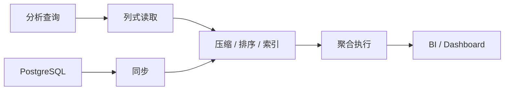

# 9. OLAP 数据库：ClickHouse / Doris / DuckDB

::: tip 本章导读
理解列式存储、MPP、本地 OLAP 和 PostgreSQL 到分析库的链路。
:::
::: info 本章验收问题
- 你能否根据查询模式选择 ClickHouse、Doris 或 DuckDB？
- 你能否解释 OLAP 快和数据可信之间为什么不是同一件事？
:::




OLAP 数据库面向高性能分析。

## 问题切入

它们的设计目标不是替代 PostgreSQL 的业务事务能力，而是更高效地处理大范围扫描、聚合、排序、多维分析和报表查询。

第 7 章说明了历史数据如何通过批处理生成 DWD、DWS、ADS。第 8 章说明了实时事件如何通过 Kafka 和 Flink 生成实时指标。但无论数据来自批处理还是实时流，最终都会遇到一个问题：这些结果要被人和应用高频查询。

典型需求包括：

```text
BI 看板秒级打开最近 90 天 GMV 趋势。
运营按渠道、地区、类目、用户等级自由下钻。
实时大盘每分钟刷新订单数和支付金额。
日志分析要在几十亿行中快速过滤错误事件。
数据科学家想在本地直接分析 Parquet 文件。
```

这些查询和 PostgreSQL 的业务点查不同，也和 Spark 批处理不同。它们需要在大量历史或近实时数据上做低延迟分析，于是需要专门面向分析查询优化的 OLAP 数据库。

## 核心判断

> OLAP 数据库的核心，是用列式存储、压缩、排序、预聚合和分布式执行，为分析查询优化。

分析查询和事务查询的负载特征完全不同——大范围扫描 vs 点查更新、分钟级延迟 vs 毫秒级延迟。OLAP 数据库从存储引擎（列式、压缩、排序键）到执行引擎（向量化、MPP）都是为分析场景重新设计的。这一章建立的是：什么时候必须从 PostgreSQL 切到 OLAP，以及不同 OLAP 引擎该怎么选。

OLAP 数据库也不是数仓建模、ETL、治理和事务系统的替代品。它负责承载分析查询，但指标口径、数据质量、血缘、权限、更新语义和源系统一致性仍然需要完整数据平台来保证。

## 机制解释

## 本章内容

| 节号 | 主题 |
|------|------|
| [09.1](/chapters/09/09-1) | OLAP数据库概述 |
| [09.2](/chapters/09/09-2) | OLAP数据模型与存储 |
| [09.3](/chapters/09/09-3) | OLAP查询优化 |
| [09.4](/chapters/09/09-4) | OLAP数据摄入与更新 |
| [09.5](/chapters/09/09-5) | OLAP监控与运维 |
| [09.6](/chapters/09/09-6) | OLAP高可用架构 |
| [09.7](/chapters/09/09-7) | OLAP性能调优 |
| [09.8](/chapters/09/09-8) | OLAP最佳实践 |
| [09.9](/chapters/09/09-9) | OLAP与BI集成 |
| [09.10](/chapters/09/09-10) | OLAP实战案例 |
| [09.11](/chapters/09/09-11) | OLAP常见问题 |
| [09.12](/chapters/09/09-12) | OLAP实战任务 |


## 系统位置

OLAP 数据库位于数据平台的分析服务层。

```text
PostgreSQL / Kafka / Files
  -> ETL / CDC / Flink / Spark
  -> 明细表 / 宽表 / 汇总表
  -> ClickHouse / Doris / DuckDB
  -> BI / Dashboard / Ad hoc SQL / 数据应用
```

它承接第 7 章和第 8 章的计算结果：批处理生成的历史汇总、实时处理生成的近实时指标，都需要一个查询层服务用户。它也引出第 10 章向量数据库：当查询对象从结构化字段、指标和维度扩展到文本语义、图片语义和知识片段时，传统 OLAP 的过滤聚合能力就不够，需要相似度检索和向量索引。

选型时要先看场景：

| 场景 | 更常见选择 | 判断原因 |
| --- | --- | --- |
| 高并发实时看板、日志分析 | ClickHouse | 列式、MergeTree、宽表和高吞吐聚合能力强 |
| 实时数仓、BI 服务、更新型分析 | Doris | MPP、表模型和 BI 场景整合度高 |
| 本地文件分析、Notebook、数据科学预处理 | DuckDB | 嵌入式、本地高性能、直接查询 Parquet |
| 大规模离线回算 | Spark / Hive | 更适合批量计算，不是交互查询层 |
| 强事务业务写入 | PostgreSQL | OLTP 一致性和事务能力更合适 |

## 场景案例

一个订单分析平台可以这样设计：

```text
PostgreSQL orders / order_items / payments
  -> CDC 或批量同步
  -> dwd_order_payment_detail
  -> ClickHouse orders_wide
  -> daily_order_metrics 物化视图 / 汇总表
  -> BI Dashboard
```

ClickHouse 明细宽表可以围绕查询模式设计：

```sql
CREATE TABLE orders_wide
(
    order_id String,
    user_id String,
    channel String,
    category String,
    order_status String,
    total_amount Decimal(18, 2),
    paid_at DateTime
)
ENGINE = MergeTree
PARTITION BY toYYYYMM(paid_at)
ORDER BY (channel, category, paid_at, user_id);
```

这个表设计表达了几个判断：

- `PARTITION BY toYYYYMM(paid_at)` 方便按月管理和裁剪历史数据。
- `ORDER BY (channel, category, paid_at, user_id)` 服务常见渠道、类目、时间范围分析。
- 宽表牺牲一定冗余，换取 BI 查询便利。
- 如果订单状态会更新，必须设计更新和去重策略，不能只把 append-only 日志当最终事实。

同一个场景如果是本地探索，可以先把 DWD 明细导出为 Parquet，用 DuckDB 在 Notebook 中快速验证分析逻辑；如果是企业 BI 平台，可以选择 Doris 承载高并发查询和更新型实时数仓。

## 常见误区

**误区一：OLAP 数据库越快越好，业务库可以不要。**

OLAP 快在分析，不代表适合强事务写入和复杂业务一致性。

**误区二：ClickHouse 有物化视图，就不需要数仓。**

物化视图是计算机制，数仓还包括分层、口径、质量、血缘、权限和治理。

**误区三：DuckDB 只是玩具。**

DuckDB 不适合替代服务化数仓，但在本地 OLAP、数据科学和文件分析中非常实用。

**误区四：把所有字段做成大宽表就万事大吉。**

宽表能提升查询便利性，但会带来冗余、更新困难、口径固化和存储成本。公共明细、汇总表和应用宽表要有边界。

**误区五：OLAP 查询快就代表数据可信。**

查询速度和数据可信是两件事。OLAP 数据库可以很快返回错误口径、重复数据或未治理字段。可信仍依赖建模、质量、血缘和权限。

## 实战任务

设计 PostgreSQL 到 ClickHouse 的订单分析链路。

要求：

1. 选择同步方式：批量还是 CDC。
2. 设计 ClickHouse 明细表。
3. 选择分区键。
4. 选择排序键。
5. 设计每日 GMV 物化视图或汇总表。
6. 说明更新和删除如何处理。
7. 说明哪些查询留在 PostgreSQL，哪些查询进入 ClickHouse。

补充要求：

- 列出 5 条目标查询，并用它们反推分区键、排序键和宽表字段。
- 对比 ClickHouse 明细宽表、Doris 主键模型、DuckDB 本地 Parquet 分析三种方案。
- 说明物化视图或汇总表的刷新策略。
- 设计一条对账规则：ClickHouse 每日 GMV 与数仓 DWS 每日 GMV 差异超过阈值时告警。
- 说明哪些场景不能迁入 OLAP，例如订单创建、库存扣减、支付状态强一致更新。

## 小结引出下一章

OLAP 数据库承担高性能分析。

ClickHouse 强在列式高性能和表引擎，Doris 强在实时数仓和 BI 场景，DuckDB 强在本地嵌入式分析。

下一章进入向量数据库。

因为 AI 时代的数据查询不再只有结构化过滤和聚合，还需要基于语义相似性的检索能力。
