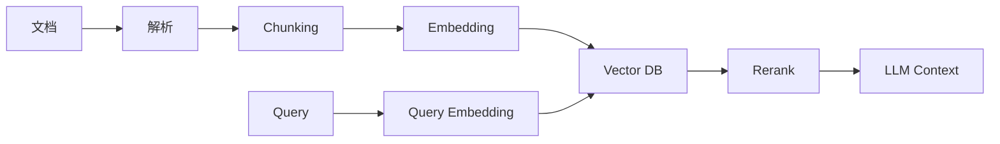

# 10. 向量数据库：面向 AI / RAG / 语义检索的数据系统

::: tip 本章导读
把非结构化数据转成可检索语义空间，理解 RAG、混合检索和向量治理。
:::
::: info 本章验收问题
- 你能否说明向量检索解决什么问题，又不解决什么问题？
- 你能否解释来源、权限、版本和评测为什么必须进入 RAG 链路？
:::




传统数据库擅长回答结构化问题。

## 问题切入

例如：

```text
订单金额大于 100 的记录
某个用户最近 20 笔订单
某天 GMV 总和
某类商品销量排行
```

但 AI 应用经常要回答另一类问题：

```text
哪些文档和这个问题语义相似？
哪些图片和这张图片相似？
哪些代码片段和这个需求相关？
哪些历史对话可以作为 Agent 记忆？
```

这些问题不是简单等值匹配，而是语义相似性检索。

第 9 章的 OLAP 数据库解决的是结构化分析查询：过滤、聚合、排序、分组和多维下钻。但 AI 应用经常面对的是文档、图片、代码、对话、网页、知识片段和操作记录。这些数据不一定能先被整理成整齐的行列，也不一定能通过关键词精确匹配找到。

一个企业知识库的真实问题通常不是：

```text
WHERE title = '报销制度'
```

而是：

```text
“出差打车超过预算还能报销吗？”
“客户合同里的自动续约条款在哪里？”
“这个报错和过去哪个工单最像？”
```

这些问题需要先把非结构化内容变成可检索的语义表示，再把检索结果和权限、来源、版本、上下文、评测结合起来。

## 核心判断

> 向量数据库不是传统数据库替代品，它解决的是非结构化数据进入 AI 应用后的语义检索问题。

语义搜索不是关键词匹配的升级版——它是把”意思相近”变成数学上的向量距离。这一章讲 Embedding、ANN 索引、RAG 召回链路和混合检索，但更重要的是讲清楚：向量数据库在 AI 数据系统中负责什么、不负责什么、容易在什么地方出问题。

一个可用的 AI 数据系统不仅需要向量检索，还需要文档解析、分块、Embedding 版本、元数据、权限过滤、重排、上下文组装、检索日志、评测和治理。把向量数据库当成 AI 数据基础设施的全部，是最常见的误判。

**关于 RAG 框架和 MCP 协议的说明**：本书选择讲解 RAG 的原理和向量检索的机制，而不是 LangChain 或 LlamaIndex 的 API。这两个框架在 2024-2025 年迭代极快，详细 API 教程写进书里半年就会过时。理解了 Embedding、ANN 索引、召回链路、重排和混合检索的原理之后，你用哪个框架都能快速上手。MCP（Model Context Protocol）是 Anthropic 2024 年底发布的 AI-工具集成协议，生态尚在快速演进中。本书建议读者掌握了本章的向量检索和 RAG 基础后，按需探索 MCP 的官方文档。

## 机制解释

### 10.1 向量数据库概述

2017年，Google在论文"Attention Is All You Need"中提出Transformer架构，这直接推动了文本嵌入技术的进化——BERT（2018年）和之后的Sentence-BERT让文本可以被表示为高质量的高维向量。当算法工程师开始用这些向量做语义搜索和推荐系统时，他们发现传统数据库在处理向量相似度查询时完全不够用——百万级向量的kNN检索可能需要数秒到数十秒，而在线推荐系统要求毫秒级返回。

向量数据库就是在这个背景下从一个研究课题变成了基础设施组件。它的基本工作方式是：将文本、图像、音频等非结构化数据通过嵌入模型（Embedding Model）转化为固定维度的数值向量（例如OpenAI的text-embedding-3-small模型输出1536维向量），然后存储在专用的向量索引中，查询时使用近似最近邻（ANN）算法快速找到最相似的k个向量。

向量数据库与传统数据库的关键区别在于查询模式。传统数据库做精确匹配——`WHERE name = 'iPhone'`只返回完全相等的记录。向量数据库做相似度匹配——查询"苹果手机"的向量，返回距离最近的向量所对应的记录，这些记录可能包含"iPhone 14"、"苹果15 Pro"等完全不同但语义相近的文字。这种能力是传统B-tree或哈希索引无法提供的。

主流向量数据库按部署模式分为两类：开源自建方案和托管云服务。

Milvus（2019年由Zilliz开源，2020年进入LF AI基金会）是开源侧的代表，支持十亿级向量规模，提供多种ANN索引算法（IVF_FLAT、IVF_PQ、HNSW等），架构上计算和存储分离，支持Kubernetes部署。缺点是运维复杂度高——需要管理etcd、MinIO、Pulsar等依赖组件。

Pinecone（2019年创立）是商业托管方案的代表，零运维、自动扩展、延迟可预测。但成本较高（按Pod规格和数据量计费），且数据存储在外部云上，数据敏感性高的场景不适用。

轻量级方案包括Chroma（2022年开源，Python原生，适合原型开发和小规模应用）、Qdrant（2021年开源，用Rust实现，内存占用低，REST API友好）、Weaviate（2019年开源，支持GraphQL接口和多模态数据，模块化设计可插拔不同向量化模块）。

选型的核心考量因素有三个：数据规模（百万级以下可以考虑Chroma或Qdrant，千万级以上建议Milvus或Pinecone）、团队运维能力（有专职SRE可以上Milvus，人手紧张用Pinecone）、查询复杂度（需要混合标量+向量过滤的场景目前Milvus最成熟）。

向量数据库不是传统数据库的替代品。你不会把订单数据存在Milvus里然后用它做OLAP。它的正确定位是AI应用数据栈中的一个专用组件——业务数据仍然在PostgreSQL或MySQL中，向量数据在Milvus或Pinecone中，应用层负责将两者的结果整合。这是贯穿本章的重要判断：向量数据库解决的是一个传统数据库天然不擅长的问题，它应该与传统数据库协作，而非取代。

### 10.2 向量表示与嵌入

向量数据库的前提是"有向量"。把非结构化数据变成向量的过程称为嵌入（Embedding），负责这个转换的模型称为嵌入模型。

不同数据类型有不同的嵌入模型。文本嵌入的发展脉络最清晰：Word2Vec（Google 2013年）开创了用向量表示词语的方法，GloVe（Stanford 2014年）引入全局统计信息，BERT（Google 2018年）通过双向Transformer实现了上下文感知的嵌入——同一个词在不同句子中的向量不同。Sentence-BERT（2019年）在BERT基础上做了孪生网络微调，让句子级语义相似度计算更准确，成为文本向量检索的主流选择。2023年后，OpenAI的text-embedding-3系列和Cohere的Embed V3等商业API让向量化变成了一次HTTP调用。

图像嵌入由CNN骨干网络完成。ResNet（Microsoft 2015年）的残差连接解决了深层网络的退化问题，至今仍是图像特征提取的基础架构。CLIP（OpenAI 2021年）更进一步，将图像和文本映射到同一个向量空间——这意味着你可以用文字"一只猫"去搜猫的图片，因为它们的向量在同一个空间里距离近。

嵌入质量直接决定了向量检索系统的上限——如果嵌入模型不能把语义相近的内容映射为相近的向量，后续无论用什么索引算法都救不回来。评估嵌入质量的常用方法是在标准数据集上做检索召回率测试：在MS MARCO（微软2016年发布的问答数据集）或BEIR（2021年的跨领域检索基准）上评估Top-k召回率。

选择嵌入模型时的实战建议是：如果业务场景和通用领域接近（电商商品搜索、客服问答匹配），直接用OpenAI或Cohere的通用嵌入API即可，性能足够且省去自行部署模型的工作。如果业务有大量领域专用术语（医疗、法律、金融），通用模型的嵌入针对性不足——医疗领域的"MI"可能被通用模型理解为"Mission Impossible"而非"Myocardial Infarction"，这时需要考虑领域微调或使用在专业语料上预训练过的模型。如果数据敏感性极高（例如涉及用户隐私的金融交易文本），用本地部署的开源模型（如BGE系列，BAAI 2023年开源）替代API调用。

向量的维度选择有一个经验范围。太低的维度（如64维）丢失了太多语义信息导致检索精度下降，太高（如4096维）会增大存储和计算开销。实践中128-1536维是主流区间：BGE-large-zh-v1.5输出1024维，OpenAI text-embedding-3-small输出1536维，text-embedding-3-large输出3072维。维度不在高而在模型质量——一个1024维的高质量嵌入可能比一个4096维的普通嵌入更准确。

### 10.3 向量索引算法

向量检索的朴素做法是暴力扫描——拿查询向量和数据库中的每一个向量算距离，排序后取Top-k。这在几千个向量时可行，在上百万个向量时延迟会涨到秒级，在上亿个向量时完全不可用。向量索引算法解决的就是"如何在亚秒级内从海量向量中找到近似最近邻"。

这个问题的正式名称是近似最近邻搜索（Approximate Nearest Neighbor, ANN），关键在于"近似"——放弃精确性要求，换取数量级的性能提升。主流ANN算法分为四个家族：

**基于树的算法**：以Annoy（Spotify 2014年开源）为代表。构建时在高维空间中递归划分超平面，形成二叉树森林；查询时不遍历全空间，只沿树结构搜索附近的子空间。优点是构建快、内存可控，缺点是在高维数据上精确度下降明显——维数越高，空间划分的边界越模糊。

**基于哈希的算法**：以LSH（Locality-Sensitive Hashing）为代表。核心思想是设计一种特殊的哈希函数，让相邻的向量以高概率被哈希到同一个桶中。查询时只检索与查询向量在同一个桶或邻近桶中的向量，将搜索空间从全部缩小到少数几个桶。LSH对汉明距离和余弦相似度有较好的理论保证，但对欧氏距离的适配不如后来的方法。

**基于量化的算法**：以FAISS（Facebook/Meta 2017年开源）的IVF+PQ为代表。分为两步：IVF（Inverted File）先将全量向量聚类成若干簇（通常用k-means），查询时只搜索与查询向量最近的少量簇；PQ（Product Quantization）将高维向量切分成多个低维子向量分别做量化，用极小的存储代价（字节级而非浮点级）近似存储原始向量。这是目前性价比最高的方法之一——在内存占用和检索精度之间达到了很好的平衡。

**基于图的算法**：以HNSW（Hierarchical Navigable Small World，2016年提出）为代表。构建一个分层图——顶层稀疏、底层稠密，每层是一个近似k近邻图。查询时从顶层开始，贪心地走向离查询向量更近的节点，逐层下降到最底层，最终返回找到的局部最优。HNSW目前是检索精度的SOTA，但构建成本高、内存占用大，适合对检索精度要求极高的场景。

实际选型时，没有哪个算法在所有维度上都最优。规则是：数据量小于100万、有足够内存，HNSW的精度最优；数据量在百万到亿级之间、关注内存效率，IVF+PQ是更务实的选择；如果追求最简部署且对精度要求不高，Annoy或LSH可以快速上线。所有主流向量数据库（Milvus、Pinecone、Qdrant）都集成了上述多种算法，允许为不同的索引配置不同的ANN算法参数。

### 10.4 向量检索与相似度计算

找到最相似的k个向量，前提是定义"什么叫相似"。在向量空间中，相似由距离函数定义——距离越近越相似。

三种最常用的距离计算方法：

**余弦相似度**：计算两个向量夹角的余弦值。公式是向量点积除以模长的乘积。值域在[-1, 1]，1表示方向完全相同（最相似），0表示正交（无关），-1表示方向完全相反。余弦相似度对向量的绝对长度不敏感——也就是说，[0.1, 0.2, 0.3]和[1, 2, 3]的余弦相似度是1，因为它们方向相同。这个特性让它特别适合文本嵌入，因为不同文档的长度不影响语义相似度判断。

**欧氏距离**：计算向量在多维空间中的直线距离。公式是各维度差的平方和开根号。值域在[0, 无穷)，0表示完全相同。欧氏距离对向量的绝对数值敏感，适合图像嵌入这类"向量各维度数值本身有意义"的场景。

**点积**：两个向量对应维度相乘后求和。值域取决于向量的模长。点积越大表示越相似。在归一化向量的场景下（所有向量模长为1），点积等价于余弦相似度。点积计算速度最快——只需乘加运算，不需要除法和开根号——因此在工程中如果事先做了归一化，直接用点积是最优选择。

向量检索的完整流程是：查询向量进入系统→ANN索引返回Top-k候选（粗略筛选）→对这k个候选用精确距离公式重新计算排名→返回最终结果。ANN索引的"近似"体现在第一步——它不保证找到的是绝对最近邻，但精确度通常在95%以上（召回率）。召回率与速度的平衡由索引参数控制：HNSW的`ef_search`参数（搜索时扩展的候选数）越大，召回率越高但速度越慢；IVF的`nprobe`参数（搜索的聚类数）同理。

混合检索（Hybrid Search）是当前工程中的前沿。纯向量检索在语义匹配上强大，但在精确关键词匹配上有短板——搜索"iPhone 15 Pro Max"可能返回"iPhone 15"和"iPhone 15 Pro"的结果，尽管它们不是同一款产品。混合检索的做法是用向量检索做语义召回、用全文检索做关键词过滤，然后对两路结果做融合排序（Reciprocal Rank Fusion是常用算法）。Milvus从2.4版本开始原生支持混合搜索，Weaviate也有类似的Hybrid Search能力。

检索质量评估的指标：首先看Top-k召回率——你的ANN索引返回的结果中，包含了真正最近邻的比例是多少。其次看查询延迟——P50和P99延迟分别是多少，关系到在线服务的SLA。第三看吞吐量——每秒钟能处理多少个查询，关系到系统扩展成本。

### 10.5 向量数据库性能优化

向量数据库的性能问题通常表现为三个症状之一：检索延迟高（P99超过业务SLA）、吞吐量不足（QPS上不去）、内存占用过大（向量索引撑爆了RAM）。优化的核心是理解ANN索引的精度-速度-内存三角——三者无法同时最优，优化就是在这三者之间做有意识的取舍。

索引参数调优是第一步，也是ROI最高的优化。对于HNSW索引，最关键的参数是`M`（每个节点在图中的最大连接数）。`M`越大精度越高，但构建时间更长、内存占用更大——`M`从16增加到64，构建时间可能增加三到四倍。对于IVF索引，`nlist`（聚类数）是核心参数，经验值为`4 * sqrt(N)`（N为向量总数），过小的`nlist`会导致每个聚类过大、搜索变慢，过大则检索引擎需要在更多聚类间遍历。

查询时的动态参数同样关键。Milvus中，`nprobe`（IVF搜索时扫描的聚类数）和`ef`（HNSW搜索时动态候选列表大小）决定了每次查询的精度和延迟。`nprobe`从1增加到10，召回率可能从80%上升到95%，但延迟也相应增加。实践中的做法是：先设定一个召回率目标（例如95%），逐步调高`nprobe`直到达到目标，接受对应的延迟。

硬件层面的优化效果立竿见影但又容易被忽视。向量计算是内存密集和CPU密集的——确保向量数据在内存中（不要在磁盘上做检索），使用AVX-512指令集加速距离计算（多数现代CPU支持），考虑GPU加速（Milvus有实验性GPU支持，但当前最实用的是FAISS的GPU版本）。在十亿级向量规模下，内存容量经常是瓶颈——HNSW索引的内存占用通常为原始向量数据的2-3倍。

数据层面的优化包括：批量插入优于单条插入（批量可以摊销索引更新成本）、预分区避免单点热点（按照预期查询模式提前分配向量到不同分区）、合理设置索引构建的触发策略（数据增长稳定后定期重建索引比频繁增量更新更高效）。

一个常被忽略的优化方向是业务分流。并不是所有查询都需要最高的向量检索精度——在推荐系统的多路召回架构中，向量检索只用在一路，其余各路可能用热度召回、协同过滤等。如果向量检索占整体延迟的80%，可以适当降低其精度换取速度，总效果影响不大。

### 10.6 向量数据库运维管理

向量数据库的运维与关系型数据库有重叠但有几个特殊关注点。

**索引构建是运维中最重的操作**。在Milvus中，为十亿级向量构建HNSW索引可能需要数小时到数天，期间系统仍然需要正常服务查询。如果你在数据持续写入的同时构建索引，需要理解Milvus的索引构建机制——新写入的数据在落盘后进入一个新的Segment，独立构建索引，查询时需要同时搜索已有索引和新Segment（后者做暴力扫描）。这意味着写密集型场景下，如果Segment数量过多（未合并的独立Segment太多），检索延迟会逐渐增大。运维上需要监控Segment数量并适时触发压缩合并。

**扩缩容的操作模式**：Milvus 2.x的存算分离架构下，查询节点（Query Node）可以水平扩展——QPS不足就加查询节点，索引构建节点（Index Node）不够就加构建节点。存储层（MinIO/S3）自带水平扩展。但注意查询节点的扩展不一定线性提升QPS——各节点各自拥有向量数据的一个分片（在分布式模式下按分区键或哈希分布），查询被转发到持有相关分片的节点。数据分布不均匀会导致少数节点成为热点。

**备份策略的特殊性**：向量数据和普通业务数据在备份上有两点不同。第一，向量索引本身可以从原始向量数据重建——因此有些团队只备份原始向量（在对象存储中），不备份索引，在灾难恢复后重建索引。这对恢复时间（RTO）有影响——重建十亿级向量的索引需要数小时。如果业务不能接受这个恢复时间，需要同时备份索引文件。第二，Milvus的元数据存在etcd中，这部分数据量小但结构关键，需要单独的备份策略。

**监控的关键指标**：检索延迟（P50/P95/P99）、QPS、索引构建进度、内存使用率、磁盘使用率、Segment数量、GC（垃圾回收）暂停时间。内存使用率是最重要的容量指标——当内存使用接近容量上限时，操作系统可能开始使用Swap，向量查询延迟会从毫秒级飙升到秒级。

**高可用架构**：Milvus协调节点（RootCoord、QueryCoord等）是多实例部署，单个节点故障不会导致服务中断。查询节点同样多实例，数据分片有副本。真正的单点风险在etcd和Pulsar——它们也各有自己的高可用配置，但配置复杂度不低。对于小规模部署（百万级向量），单机Standalone模式+定期备份是更务实的方案——运行半年不出问题可能比花一周配置高可用更有性价比。

### 10.7 向量数据库应用实践

向量数据库的应用可以归结为四个经典场景，每个场景对系统的要求不同。

**推荐系统**：这是向量数据库目前最大的应用领域。典型架构是"多路召回+精排"。向量检索是召回阶段的一路——将用户行为序列或画像向量化，在商品向量库中检索Top-N候选商品。这一路对延迟要求极高（通常<50ms），因为召回之后还有精排模型排队处理。Milvus在这个场景下通常配置为低延迟优先——HNSW索引、ef参数调低、只返回50-100个候选。实践中一个常见错误是对所有用户用相同的召回数量——活跃用户的兴趣分散应该召回更多候选、新用户的兴趣不明确也应该更宽泛的召回。

**语义搜索**：文档搜索和企业知识库方向。关键差异在于文本的向量化方式——长文档不能直接向量化（超过嵌入模型的输入长度限制），需要先做文档切分（Chunking），将长文分段后分别向量化存入数据库。查询时，用户的搜索词被向量化后检索相关的文档片段，再返回片段所属的完整文档。切分策略直接影响搜索效果——切太细丢失上下文（"功率"和"大功率"的粒度不同），切太粗则检索粒度不够精确。经验做法是500-1000字符一个Chunk，相邻Chunk之间有10-20%的重叠以保留边界附近的语义。

**图像检索**：以图搜图或拍照搜商品。嵌入模型选CLIP（多模态对齐）比纯CNN更灵活——CLIP可以支持文字搜图和图片搜图两种模式。性能上，单个图像特征向量通常在512-2048维，纬度比文本嵌入高，对索引的压力更大。对于电商等更新频繁的场景，向量数据库的实时写入能力（新商品上架后立即可检索）是硬需求。

**异常检测**：向量数据库在异常检测中的思路与其他场景相反——找的不是相似的，而是"不相似的"。将正常数据的向量存入数据库后，对每条新数据的向量做相似度检索。如果与最近邻的距离超过阈值，标记为异常。这种方法特别适合时序数据的异常模式检测——正常波动的向量聚类在一起，异常波形的向量游离在簇外。相比规则引擎，向量方法的优势是不需要事先定义异常模式，劣势是难以解释"为什么判定为异常"。

### 10.8 向量数据库选型与架构

选型的第一原则是先项目不要先选数据库——先明确你需要解决什么问题，再决定用什么工具。

数据规模是最直接的筛选条件。100万向量以下，Chroma或Qdrant足以胜任，部署五分钟就能开始写业务代码。100万到1000万之间，Qdrant和Weaviate都适用，Qdrant在内存效率上有优势（Rust实现、内存占用低）。1000万到1亿，考虑Milvus分布式部署或Pinecone——但此时成本开始变得敏感，Pinecone按向量数量和维度计费，千万级1536维向量每月可能是数千美元。1亿以上，目前开源方案中Milvus是唯一被大规模验证过的选择。

查询模式决定了对索引能力和过滤能力的要求。如果你的查询永远只是"给定向量找Top-k相似"，所有向量数据库都能做。如果查询中频繁带有标量过滤条件（"品类=服装 AND 价格 BETWEEN 100 AND 500"），需要评估该数据库的标量过滤性能——Milvus将标量过滤也做了索引化处理，而一些轻量级方案需要先做向量检索再后过滤，在大数据集上可能99%的候选被过滤掉，实际返回数量不足k。

架构集成上需要考虑的是：向量数据库在整体系统中的位置应该是一个独立的服务层，而不是主数据库。业务数据（用户信息、订单记录）存在PostgreSQL/MySQL中，向量数据存在向量数据库中，应用层负责在两者之间建立映射（向量检索返回的是ID列表，用这些ID去业务数据库获取完整信息）。这个架构保证了业务数据库的性能不被向量计算拖累，同时也让向量数据库可以独立扩缩容。

开源vs托管的选择不只是成本问题。数据安全敏感场景（金融、医疗、政务）通常不能将数据上传到Pinecone之类的第三方托管服务，必须本地部署Milvus或Qdrant。团队规模和运维能力也很关键——3人的创业团队用Pinecone能省下一个月部署时间、一个月后产品可能已经上线跑数据了。50人的工程团队自建Milvus集群，长期成本更低且定制灵活度更高。

自建vs托管不是二选一，很多团队采用混合策略：开发测试环境用Docker部署的Qdrant或Milvus Standalone，生产环境根据敏感程度分流——非敏感场景用Pinecone省事，敏感场景用自建Milvus或Qdrant。

### 10.9 向量数据库最佳实践

**先验证嵌入质量再优化索引**。当检索效果不好时，80%的情况问题在嵌入模型而非索引参数。检查方法：从数据库中人工挑选出50条你认为应该被检索到的典型记录，看它们的向量与查询向量的相似度是否显著高于随机采样。如果差距不大，换了HNSW也救不回来——先换模型或做领域微调。

**索引参数用二分法调优**。不要凭直觉设参数。做法是：设定一个目标（例如召回率>0.95），网格搜索一组参数组合（如nlist={1024, 2048, 4096}, nprobe={8, 16, 32}），对每个组合测量实际召回率和P99延迟，选择满足召回率条件下延迟最低的组合。

**向量的归一化**。如果你的距离计算使用余弦相似度或点积，在写入阶段就把所有向量做L2归一化，归一化后点积等价于余弦相似度，查询时直接使用点积，省去除法和根号运算。这个优化在QPS上千时能省下一块可观的CPU。

**预期管理：向量检索不是万能的**。给业务方沟通清楚：语义搜索可以找不到精确关键词（搜索"社保"不保证返回所有包含"社保"的文档），推荐系统的冷启动问题向量数据库解决不了（新用户没有行为数据就没有向量），长尾商品或内容因为正样本稀少，向量可能训练不充分导致检索效果差。这些局限性应该在项目启动阶段就明确，而不是上线后被投诉时才发现。

**建立离线评估+在线A/B的两层验证**。离线评估（用标注好的测试集跑Recall@k和MRR）告诉你模型和参数是否在正确的方向上。在线A/B告诉你用户是否真的感受到了改善——离线指标提升5%的Recall，在线转化率可能毫无变化（因为用户根本注意不到Top-10排序中第8和第10的差异），也可能显著提升（如果高召回引出了一款用户真的想买但之前没被推荐的商品）。不在线验证的优化可能是在错误的方向上做无用功。

**监控检索质量的漂移**。向量数据库上线后，检索质量会随时间漂移——不是索引本身的问题，而是数据和用户行为在变化。商品库不断上新、用户兴趣随季节变化，这些都会让旧模型产出的向量逐渐"过期"。建议每季度做一次离线的召回率回归测试，发现明显衰减时重新评估嵌入模型。

### 10.10 向量数据库常见问题

**问题一：检索精度远低于预期**。排查路径：先用暴力扫描（不经过ANN索引）计算真正的最近邻作为Ground Truth，对比ANN索引的返回结果。如果暴力扫描本身的结果也不准，问题在嵌入模型而非索引。如果暴力扫描是准的而ANN不准，检查索引参数——nprobe或ef设置过小。

**问题二：检索延迟突然飙升**。最可能的原因是内存不足导致操作系统Swap。也可能是Segments数量过多——查询需要同时搜索数十个未合并的小Segment，每个都要做独立检索。解决办法：触发手动Compaction合并Segment，或者重启垃圾回收（Milvus的数据删除是标记删除，需要GC才能真正释放空间）。

**问题三：写入后立刻检索不到**。向量数据库通常不是同步写入即时可见的。Milvus中数据写入后需要等待落盘和索引构建——这个时间窗口从秒级到分钟级不等（取决于数据量和索引构建策略）。如果业务要求写入后立即可以被检索到，需要评估数据库的"可见性保证"——Milvus 2.2版本后引入的Growing Segment允许新写入数据在未被索引时通过暴力扫描被检索到，但这个特性的前提是Growing Segment数据量不大。

**问题四：标量过滤后返回结果数量不足**。典型场景：先做向量检索取Top-100，再用标量条件过滤，剩下3条，但业务期望返回20条。解决方法是调整检索策略：要么增加向量检索的Top-k（如从100增加到500），过滤后有足够余量；要么将标量过滤前置到索引扫描阶段（Milvus支持这种模式，但需要合适的索引配置）。

**问题五：数据倾斜导致热点**。分布式部署下，如果按照某个倾斜的业务字段做分片（例如按商品类目分区），少数热门类目（如服装）的向量远多于其他类目，承载这些分区的节点成为热点。解决办法是按照与查询负载无关的维度做哈希分片（如向量ID的哈希），让数据均匀分布。

**问题六：嵌入模型升级后历史数据怎么办**。换了一个新的嵌入模型，所有已有向量的维度或语义空间都变了。没有捷径——需要把全量数据用新模型重新跑一遍向量化。在迁移期间可以考虑双写策略（同时向新老两个Collection写入向量），先用新Collection做内部测试验证效果，确认后再切换业务流量。

### 10.11 向量数据库实战案例

**案例一：电商推荐系统的向量召回**

一家月活5000万的电商平台，推荐系统原本依赖协同过滤和热度召回。2023年引入向量召回后，整体点击率提升了约8%。具体做法是：将用户最近30天的行为序列（浏览、加购、下单、搜索）通过一个自训练的Two-Tower模型映射为128维向量（User Tower和Item Tower分别输出用户向量和商品向量），每天凌晨将100万活跃用户的向量写入Milvus，商品向量（2000万SKU）每周更新一次。查询时，用户的实时行为向量在商品库中检索Top-200候选，经过精排模型后返回最终20个推荐结果。延迟要求：向量检索<30ms，全链路<100ms。

这个案例的关键经验是：向量召回的收益不在"替代了协同过滤"，而在"补充了协同过滤覆盖不到的部分"——新品没有用户行为数据（协同过滤失效），但有商品描述可以生成向量；长尾用户行为稀疏但只要有少量行为就能产生有意义的向量。

**案例二：法律文书语义搜索**

一家法律科技公司构建了一个包含2000万份判决文书和法规的检索系统。文本通过分Chunk（512字符一段，128字符重叠）后，用BGE-large-zh-v1.5（BAAI 2023年开源的中文嵌入模型，1024维）生成向量，存入自建的Milvus集群。查询延迟P99=80ms。

遇到的主要挑战是法律领域的术语特殊性——"善意取得"、"表见代理"这些术语的语义在通用嵌入模型中没有得到充分训练。解决方式是收集了10万对正负样本（人工标注的"相关判决"和"不相关判决"对），在BGE模型上做了对比学习微调，微调后离线Recall@100从0.72提升到0.89。这个经验适用于所有垂直领域——预训练模型给了你一个不错的起点，但领域的最后一公里需要自己的数据来补。

**案例三：实时异常交易检测**

某支付平台在2022年将欺诈检测从纯规则引擎升级为规则引擎+向量检测的混合方案。做法是：将每一笔历史欺诈交易的交易特征（金额离散化、时间编码、商户类别编码、设备指纹特征等拼接后的多模态向量，128维）存入Qdrant。新交易到达时，先经过规则引擎（判断金额、频率等硬规则），规则引擎标记为"需进一步检查"的交易才进入向量检测——在Qdrant中检索距离最近的20笔历史交易，如果这20笔中有超过60%是已确认的欺诈交易，触发高风险告警。

方案选择Qdrant而非Milvus的原因是：交易量级在每日200-300万笔，Qdrant完全够用；Rust实现的内存效率和低GC停顿对实时性帮助明显；REST API集成简单，不需要额外的gRPC客户端。这个选型说明向量数据库的选择不是越"大"越好，而是匹配规模。

### 10.12 向量数据库实战任务

以下三个任务从浅入深，覆盖向量数据库的核心操作。

**任务一：用Chroma搭建一个本地语义搜索**

不需要服务器，在你的开发机上用Chroma（`pip install chromadb`）+ Sentence-Transformers（`pip install sentence-transformers`）搭建一个本地文档搜索。选择一个有50-100篇中文文档的目录（可以是公司Wiki、技术文档、或任意文本），完成：将每篇文档切分为Chunk（用langchain的RecursiveCharacterTextSplitter或手写逻辑）、用BGE-small-zh生成向量、写入Chroma Collection、测试几个查询看返回结果是否相关。这个任务的目标是建立"文本→向量→向量数据库→检索"的端到端直觉。注意测试"精确关键词搜索"和"语义搜索"的区别——搜索"数据库索引"是否返回了包含"B-tree"的文档。

**任务二：索引参数对比实验**

在同一份数据集上（至少10万条向量，可以用任务一的数据或从HuggingFace下载预置数据集），分别用IVF_FLAT、IVF_PQ和HNSW三类索引构建，对每个索引测试不同参数组合下的Recall@10和P99延迟。目标是画出准确率-延迟散点图，找到在95%召回率下延迟最低的参数组合。这个任务的要点是建立索引参数调优的动手经验——参数不是从文档上查到的"推荐值"最好，而是要在你的数据分布上实测。

**任务三：向量检索系统的效果评估方案设计**

假设你上线了一个商品推荐向量检索模块，你需要设计一套评估体系来衡量它是否在生产环境中生效。回答：离线评估用哪些指标、用什么数据集（标注数据怎么来）、在线评估用哪些指标（CTR、CVR、还是其他）、A/B测试的流量分配和周期如何设计、上线后需要持续监控哪些指标以检测模型衰减。这个任务不要求实际部署，但要求你对"向量检索不是一个独立功能，而是一个需要持续评估和迭代的系统组件"有完整的认知。

三个任务的侧重点不同：任务一测基础搭建，任务二测性能调优直觉，任务三测系统化思维。全部完成后，你应该有能力评估一个向量检索需求并给出技术方案，而不是只会调用API。

## 系统位置

向量数据库是 AI 数据基础设施中的语义检索层。

```text
原始文档 / 网页 / 代码 / 对话 / 图片
  -> 采集与解析
  -> Chunking
  -> Embedding
  -> Vector DB / pgvector
  -> Hybrid Search / Rerank
  -> Context Assembly
  -> LLM / Agent
  -> Retrieval Logs / Evaluation / Governance
```

它继承前面章节的数据平台能力：对象存储保存原文，PostgreSQL 保存元数据和权限，批处理负责大规模离线 Embedding，实时链路负责增量更新，治理系统负责版本、血缘、质量和访问控制。

它也引出第 11 章图数据库：向量检索擅长找“语义相似”的内容，但不擅长表达实体之间的显式关系、路径、多跳推理和关系约束。知识图谱和图数据库会补足这部分能力。

## 场景案例

设计一个企业制度 RAG 知识库时，可以把数据模型拆成几类表和存储：

```text
object_storage
  原始 PDF / DOCX / HTML 文件

documents
  一行一个文档，记录来源、标题、部门、版本、权限、解析状态

chunks
  一行一个文本块，记录 document_id、章节位置、chunk 文本、chunk_version

embeddings
  一行一个向量，记录 chunk_id、embedding_model、embedding_version、vector

retrieval_logs
  一行一次检索，记录 query、过滤条件、召回结果、点击、反馈

evaluations
  一行一个评测样本，记录问题、标准答案、期望来源、实际召回和评分
```

用户提问“出差打车超过预算还能报销吗？”时，链路不应只做向量 Top-K：

```text
Query
  -> 判断用户权限和所在部门
  -> 关键词 + 向量混合召回
  -> 过滤过期制度和不可见文档
  -> Rerank
  -> 组装带来源和章节位置的上下文
  -> LLM 生成答案
  -> 记录检索日志和用户反馈
```

这个案例说明：向量数据库是关键组件，但答案质量来自整条 RAG 数据链路，而不是单次相似度检索。

## 常见误区

**误区一：向量数据库可以替代关系型数据库。**

向量库解决相似性检索，不解决强事务、复杂关系建模、指标分析和完整数据治理。

**误区二：Embedding 后就能问答。**

RAG 还需要解析、切分、检索、过滤、重排、上下文组装、生成和评测。

**误区三：召回分数高就一定答案正确。**

相似不等于事实正确，也不等于权限可见或上下文完整。

**误区四：只要换更强的 Embedding 模型，RAG 就一定变好。**

模型很重要，但文档解析、Chunk 策略、元数据、权限、混合检索、重排和评测同样会决定结果。模型变化还可能要求全量重算向量。

**误区五：向量库里只需要保存向量。**

真实系统必须保存来源、版本、权限、租户、文档结构、时间、解析状态和检索日志。没有这些元数据，检索结果无法治理、无法追溯、无法安全使用。

## 实战任务

设计一个 RAG 知识库数据模型：

```text
documents
chunks
embeddings
collections
retrieval_logs
evaluations
```

要求说明：

- 每张表一行代表什么。
- 原始文档保存在哪里。
- Chunk 如何关联文档。
- Embedding 如何记录模型版本。
- 检索日志如何用于评测。
- 权限过滤如何进入检索。

补充要求：

- 设计 `documents`、`chunks`、`embeddings` 的主键和外键关系。
- 为 `embedding_model`、`embedding_version`、`chunk_version` 设计升级策略。
- 说明如何处理文档删除、文档更新和权限变化。
- 设计一次 RAG 评测：至少包含 10 个问题、标准来源、期望召回 chunk、答案评分规则。
- 对比 pgvector 和专门向量数据库在这个场景中的边界。

## 小结引出下一章

向量数据库让语义相似性成为可查询对象。

它把非结构化数据接入 AI 应用，但它必须和元数据、权限、对象存储、评测、数据链路和治理协同。

下一章进入图数据库。

因为除了语义相似，AI 和数据分析还经常需要理解实体之间的关系网络。
