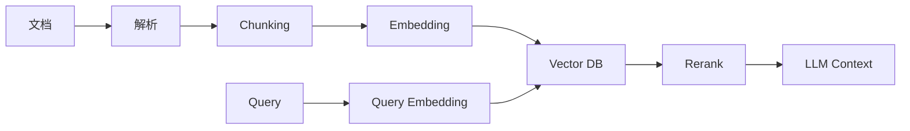

# 10. 向量数据库：面向 AI / RAG / 语义检索的数据系统

::: tip 本章导读
把非结构化数据转成可检索语义空间，理解 RAG、混合检索和向量治理。
:::


## 本章阅读框架

| 阅读问题 | 本章回答方式 |
| --- | --- |
| 这个问题为什么出现？ | 从业务增长、数据规模、系统目标或 AI 应用压力切入。 |
| 它解决什么问题？ | 提炼为一个核心判断，避免把概念写成孤立定义。 |
| 它不解决什么问题？ | 在机制解释和常见误区中说明边界，防止工具崇拜。 |
| 它在真实平台哪里出现？ | 放回 PostgreSQL、数仓、批流、OLAP、湖仓、向量、图和治理的演化链路。 |
| 读完要会做什么？ | 通过场景案例和实战任务转成可练习的判断。 |



传统数据库擅长回答结构化问题。

## 问题切入

例如：

```text
订单金额大于 100 的记录
某个用户最近 20 笔订单
某天 GMV 总和
某类商品销量排行
```

但 AI 应用经常要回答另一类问题：

```text
哪些文档和这个问题语义相似？
哪些图片和这张图片相似？
哪些代码片段和这个需求相关？
哪些历史对话可以作为 Agent 记忆？
```

这些问题不是简单等值匹配，而是语义相似性检索。

第 9 章的 OLAP 数据库解决的是结构化分析查询：过滤、聚合、排序、分组和多维下钻。但 AI 应用经常面对的是文档、图片、代码、对话、网页、知识片段和操作记录。这些数据不一定能先被整理成整齐的行列，也不一定能通过关键词精确匹配找到。

一个企业知识库的真实问题通常不是：

```text
WHERE title = '报销制度'
```

而是：

```text
“出差打车超过预算还能报销吗？”
“客户合同里的自动续约条款在哪里？”
“这个报错和过去哪个工单最像？”
```

这些问题需要先把非结构化内容变成可检索的语义表示，再把检索结果和权限、来源、版本、上下文、评测结合起来。

## 核心判断

> 向量数据库不是传统数据库替代品，它解决的是非结构化数据进入 AI 应用后的语义检索问题。

本章要建立的判断是：向量数据库让“语义相似”成为一种可查询能力，但它只解决 RAG 和 AI 数据系统中的召回问题，不解决全部可信问题。

一个可用的 AI 数据系统不仅需要向量检索，还需要文档解析、分块、Embedding 版本、元数据、权限过滤、重排、上下文组装、检索日志、评测和治理。把向量数据库当成 AI 数据基础设施的全部，是最常见的误判。

## 机制解释

### 10.1 向量数据库概述

前面学习了OLAP数据库，了解了面向分析查询的数据库系统。

AI时代需要什么样的数据库？如何存储和检索向量数据？如何支持相似度搜索？向量数据库与传统数据库有什么区别？

**场景**：
```yaml
AI应用需求：

算法工程师："要做推荐系统"

架构师："需要向量检索"

新工程师："什么是向量数据库？"
```

**问题**：
- 什么是向量数据库？
- 为什么需要向量数据库？
- 向量数据库与传统数据库有什么区别？
- 有哪些主流的向量数据库？
- 如何选择合适的向量数据库？

**答案**：**向量数据库是专门用于存储、索引和检索高维向量数据的数据库系统，通过近似最近邻（ANN）算法实现高效的相似度搜索，是AI应用（推荐系统、图像检索、语义搜索等）的核心基础设施**

---

## 什么是向量数据库

### 核心概念

**向量**：
```yaml
定义：
- 用数值数组表示数据
- 例如：[0.1, 0.3, -0.5, 0.8, ...]
- 维度：通常是128、256、512、768、1024等

特点：
- 数值化：将非数值数据转为数值
- 固定长度：同一模型生成的向量维度相同
- 高维：通常是几十到几千维
- 密集：大部分位置不是0

来源：
- 文本：Word2Vec、GloVe、BERT、Sentence-BERT
- 图像：ResNet、VGG、CLIP
- 音频：wav2vec、Hubert
- 用户行为：协同过滤矩阵分解
```

**向量数据库**：
```yaml
定义：
- 专门存储和检索向量的数据库
- 支持高效的相似度搜索
- 提供向量索引能力

核心能力：
1. 向量存储：存储大规模向量数据
2. 向量索引：构建快速检索索引
3. 相似度搜索：找出最相似的k个向量
4. 混合查询：向量检索+元数据过滤

与传统数据库区别：
- 传统数据库：精确匹配（=、>、<）
- 向量数据库：相似度匹配（≈）
- 传统数据库：基于B-tree、Hash索引
- 向量数据库：基于ANN索引
```

## 为什么需要向量数据库

### 传统数据库的局限

```yaml
问题1：无法表达语义相似度
-- 传统数据库：只能精确匹配
SELECT * FROM products
WHERE name = 'iPhone';

-- 找不到："苹果手机"、"iPhone 14"
-- 无法理解语义相似性

问题2：高维数据检索效率低
-- 传统索引在高维空间失效
-- 1000维数据：
-- - B-tree：效率极低
-- - Hash：无法处理范围查询
-- - 维度灾难：距离计算失效

问题3：无法支持AI应用
-- 推荐系统：需要找相似物品
-- 图像检索：需要找相似图片
-- 语义搜索：需要理解语义
-- 传统数据库无法支持
```

### 向量数据库的优势

```yaml
优势1：语义理解
-- 向量检索能理解语义
查询："苹果手机"
→ 向量：[0.2, 0.5, -0.3, ...]
→ 找到："iPhone 14"、"苹果15 Pro"

优势2：高效检索
-- 1000万向量，毫秒级检索
-- ANN算法：速度和准确率平衡
-- 支持实时更新

优势3：AI友好
-- 直接存储嵌入向量
-- 与深度学习模型无缝集成
-- 支持多种AI场景

优势4：可扩展性
-- 水平扩展：支持数十亿向量
-- 分布式架构：高可用
-- 云原生设计
```

## 向量数据库应用场景

### 1. 推荐系统

```yaml
场景：
- 商品推荐：根据用户兴趣推荐商品
- 内容推荐：新闻、视频、音乐推荐
- 社交推荐：好友推荐、群组推荐

实现：
用户行为 → 向量化 → 向量数据库
          ↓
    相似用户/物品检索
          ↓
        推荐结果

示例：
查询：
- 用户最近浏览的商品
- 用户兴趣向量

检索：
- 找到相似的商品向量
- 找到兴趣相似的用户
- 推荐他们喜欢的商品
```

### 2. 图像检索

```yaml
场景：
- 以图搜图：上传图片找相似图片
- 商品搜索：拍照搜索商品
- 人脸识别：1:N人脸比对

实现：
图片 → CNN → 向量 → 向量数据库
              ↓
         相似图片检索
              ↓
           检索结果

示例：
查询：
- 上传一张衣服图片

检索：
- 提取图片特征向量
- 在商品库中找相似图片
- 返回相似商品
```

### 3. 语义搜索

```yaml
场景：
- 文档搜索：语义相关而非关键词匹配
- 问答系统：找到相似的问题和答案
- 知识检索：语义相关的知识

实现：
文本 → BERT → 向量 → 向量数据库
            ↓
       语义相似文档检索
            ↓
          检索结果

示例：
查询："如何减肥"

检索：
- 找到："减肥方法"、"瘦身技巧"、"减重建议"
- 即使没有"减肥"关键词
- 只要语义相关就能找到
```

### 4. 异常检测

```yaml
场景：
- 欺诈检测：异常交易检测
- 故障检测：设备异常检测
- 安全检测：入侵检测

实现：
正常数据 → 向量模型 → 向量数据库
                      ↓
                  相似度计算
                      ↓
              低相似度=异常

示例：
查询：
- 新的交易向量

检索：
- 与历史交易向量比较
- 相似度低 → 可能是欺诈
- 触发告警
```

## 主流向量数据库对比

### Milvus

```yaml
特点：
- 开源、云原生
- 支持多种索引算法
- 可扩展性强
- 与AI框架集成好

优势：
- 性能好：支持数十亿向量
- 功能全：支持标量+向量过滤
- 生态好：Kubernetes部署
- 社区活跃

劣势：
- 学习曲线陡
- 运维复杂
- 资源占用高

适用场景：
- 大规模向量检索
- 需要云原生部署
- 需要混合查询
```

### Pinecone

```yaml
特点：
- 托管服务
- 全托管、零运维
- 性能优秀
- 易于使用

优势：
- 开箱即用
- 自动扩展
- 高可用
- API简单

劣势：
- 成本高
- 数据在云端
- 定制能力弱
- 依赖网络

适用场景：
- 快速原型开发
- 不想运维
- 预算充足
```

### Weaviate

```yaml
特点：
- 开源
- GraphQL API
- 支持多模态
- 模块化设计

优势：
- 易于使用
- GraphQL友好
- 支持向量和标量
- 模块化可扩展

劣势：
- 性能一般
- 社区较小
- 文档不够完善

适用场景：
- GraphQL应用
- 多模态检索
- 中小规模数据
```

### Chroma

```yaml
特点：
- 轻量级
- 易于集成
- Python友好
- 适合开发测试

优势：
- 简单易用
- Python原生
- 可以嵌入应用
- 适合小规模

劣势：
- 不适合大规模
- 性能有限
- 功能简单

适用场景：
- 开发测试
- 小规模应用
- 快速原型
```

### Qdrant

```yaml
特点：
- 用Rust实现
- 高性能
- API友好
- 支持过滤

优势：
- 性能优秀
- 内存占用低
- REST API
- 支持过滤查询

劣势：
- 相对较新
- 社区较小
- 生态不如Milvus

适用场景：
- 需要高性能
- 资源受限
- REST API集成
```

## 如何选择向量数据库

### 决策树

```yaml
1. 数据规模
   - < 100万向量：Chroma、Weaviate
   - 100万-1000万：Qdrant、Weaviate
   - > 1000万：Milvus、Pinecone

2. 部署方式
   - 托管服务：Pinecone
   - 自建：Milvus、Qdrant
   - 嵌入应用：Chroma

3. 团队能力
   - 愿意运维：Milvus
   - 不想运维：Pinecone
   - 快速开发：Chroma

4. 预算
   - 充足：Pinecone
   - 有限：Milvus、Qdrant
   - 零成本：Chroma（小规模）

5. 功能需求
   - 混合查询：Milvus、Qdrant
   - 多模态：Weaviate
   - 简单场景：Chroma
```

### 推荐组合

```yaml
场景1：电商商品推荐
- 推荐：Milvus
- 原因：大规模、高性能、支持混合查询

场景2：初创公司MVP
- 推荐：Pinecone
- 原因：快速上线、零运维

场景3：图像检索原型
- 推荐：Chroma
- 原因：简单易用、快速开发

场景4：企业级应用
- 推荐：Milvus自建
- 原因：可控、安全、可扩展

场景5：多模态检索
- 推荐：Weaviate
- 原因：原生支持多模态
```

## 向量数据库典型架构

### 推荐系统架构

```
                    ┌─────────────┐
                    │  用户行为    │
                    └──────┬──────┘
                           │
                    ┌──────▼──────┐
                    │  嵌入模型    │
                    │  (神经网络)  │
                    └──────┬──────┘
                           │
                    ┌──────▼──────┐
                    │  向量数据库  │
                    │  (Milvus)   │
                    └──────┬──────┘
                           │
                    ┌──────▼──────┐
                    │  推荐引擎    │
                    └─────────────┘
```

### 图像检索架构

```
                    ┌─────────────┐
                    │  图片上传    │
                    └──────┬──────┘
                           │
                    ┌──────▼──────┐
                    │  CNN模型     │
                    │ (ResNet/CLIP)│
                    └──────┬──────┘
                           │
                    ┌──────▼──────┐
                    │  向量数据库  │
                    │  (Pinecone) │
                    └──────┬──────┘
                           │
                    ┌──────▼──────┐
                    │  相似图片    │
                    └─────────────┘
```

## 总结

**向量数据库核心价值**：
1. **语义理解**：理解数据语义，而非简单匹配
2. **高效检索**：在大规模向量数据上快速检索
3. **AI友好**：与深度学习模型无缝集成
4. **广泛应用**：推荐、检索、搜索、检测

**选择向量数据库的关键**：
1. **数据规模**：小规模选简单，大规模选性能
2. **团队能力**：运维能力vs托管服务
3. **预算考虑**：成本vs功能
4. **功能需求**：混合查询、多模态等

**实践建议**：
1. **从简单开始**：先验证概念，再优化
2. **评估多种方案**：POC测试
3. **关注性能**：检索延迟、吞吐量
4. **监控运维**：建立监控体系

## 系统位置

向量数据库是 AI 数据基础设施中的语义检索层。

```text
原始文档 / 网页 / 代码 / 对话 / 图片
  -> 采集与解析
  -> Chunking
  -> Embedding
  -> Vector DB / pgvector
  -> Hybrid Search / Rerank
  -> Context Assembly
  -> LLM / Agent
  -> Retrieval Logs / Evaluation / Governance
```

它继承前面章节的数据平台能力：对象存储保存原文，PostgreSQL 保存元数据和权限，批处理负责大规模离线 Embedding，实时链路负责增量更新，治理系统负责版本、血缘、质量和访问控制。

它也引出第 11 章图数据库：向量检索擅长找“语义相似”的内容，但不擅长表达实体之间的显式关系、路径、多跳推理和关系约束。知识图谱和图数据库会补足这部分能力。

## 场景案例

设计一个企业制度 RAG 知识库时，可以把数据模型拆成几类表和存储：

```text
object_storage
  原始 PDF / DOCX / HTML 文件

documents
  一行一个文档，记录来源、标题、部门、版本、权限、解析状态

chunks
  一行一个文本块，记录 document_id、章节位置、chunk 文本、chunk_version

embeddings
  一行一个向量，记录 chunk_id、embedding_model、embedding_version、vector

retrieval_logs
  一行一次检索，记录 query、过滤条件、召回结果、点击、反馈

evaluations
  一行一个评测样本，记录问题、标准答案、期望来源、实际召回和评分
```

用户提问“出差打车超过预算还能报销吗？”时，链路不应只做向量 Top-K：

```text
Query
  -> 判断用户权限和所在部门
  -> 关键词 + 向量混合召回
  -> 过滤过期制度和不可见文档
  -> Rerank
  -> 组装带来源和章节位置的上下文
  -> LLM 生成答案
  -> 记录检索日志和用户反馈
```

这个案例说明：向量数据库是关键组件，但答案质量来自整条 RAG 数据链路，而不是单次相似度检索。

## 常见误区

**误区一：向量数据库可以替代关系型数据库。**

向量库解决相似性检索，不解决强事务、复杂关系建模、指标分析和完整数据治理。

**误区二：Embedding 后就能问答。**

RAG 还需要解析、切分、检索、过滤、重排、上下文组装、生成和评测。

**误区三：召回分数高就一定答案正确。**

相似不等于事实正确，也不等于权限可见或上下文完整。

**误区四：只要换更强的 Embedding 模型，RAG 就一定变好。**

模型很重要，但文档解析、Chunk 策略、元数据、权限、混合检索、重排和评测同样会决定结果。模型变化还可能要求全量重算向量。

**误区五：向量库里只需要保存向量。**

真实系统必须保存来源、版本、权限、租户、文档结构、时间、解析状态和检索日志。没有这些元数据，检索结果无法治理、无法追溯、无法安全使用。

## 实战任务

设计一个 RAG 知识库数据模型：

```text
documents
chunks
embeddings
collections
retrieval_logs
evaluations
```

要求说明：

- 每张表一行代表什么。
- 原始文档保存在哪里。
- Chunk 如何关联文档。
- Embedding 如何记录模型版本。
- 检索日志如何用于评测。
- 权限过滤如何进入检索。

补充要求：

- 设计 `documents`、`chunks`、`embeddings` 的主键和外键关系。
- 为 `embedding_model`、`embedding_version`、`chunk_version` 设计升级策略。
- 说明如何处理文档删除、文档更新和权限变化。
- 设计一次 RAG 评测：至少包含 10 个问题、标准来源、期望召回 chunk、答案评分规则。
- 对比 pgvector 和专门向量数据库在这个场景中的边界。

## 小结引出下一章

向量数据库让语义相似性成为可查询对象。

它把非结构化数据接入 AI 应用，但它必须和元数据、权限、对象存储、评测、数据链路和治理协同。

下一章进入图数据库。

因为除了语义相似，AI 和数据分析还经常需要理解实体之间的关系网络。
