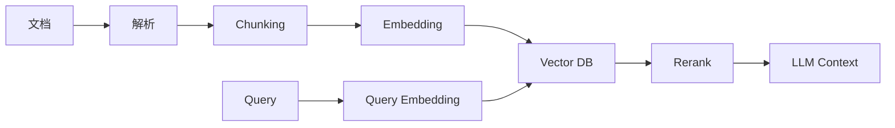

# 10. 向量数据库：面向 AI / RAG / 语义检索的数据系统

::: tip 本章导读
把非结构化数据转成可检索语义空间，理解 RAG、混合检索和向量治理。
:::
::: info 本章验收问题
- 你能否说明向量检索解决什么问题，又不解决什么问题？
- 你能否解释来源、权限、版本和评测为什么必须进入 RAG 链路？
:::




传统数据库擅长回答结构化问题。

## 问题切入

例如：

```text
订单金额大于 100 的记录
某个用户最近 20 笔订单
某天 GMV 总和
某类商品销量排行
```

但 AI 应用经常要回答另一类问题：

```text
哪些文档和这个问题语义相似？
哪些图片和这张图片相似？
哪些代码片段和这个需求相关？
哪些历史对话可以作为 Agent 记忆？
```

这些问题不是简单等值匹配，而是语义相似性检索。

第 9 章的 OLAP 数据库解决的是结构化分析查询：过滤、聚合、排序、分组和多维下钻。但 AI 应用经常面对的是文档、图片、代码、对话、网页、知识片段和操作记录。这些数据不一定能先被整理成整齐的行列，也不一定能通过关键词精确匹配找到。

一个企业知识库的真实问题通常不是：

```text
WHERE title = '报销制度'
```

而是：

```text
“出差打车超过预算还能报销吗？”
“客户合同里的自动续约条款在哪里？”
“这个报错和过去哪个工单最像？”
```

这些问题需要先把非结构化内容变成可检索的语义表示，再把检索结果和权限、来源、版本、上下文、评测结合起来。

## 核心判断

> 向量数据库不是传统数据库替代品，它解决的是非结构化数据进入 AI 应用后的语义检索问题。

语义搜索不是关键词匹配的升级版——它是把”意思相近”变成数学上的向量距离。这一章讲 Embedding、ANN 索引、RAG 召回链路和混合检索，但更重要的是讲清楚：向量数据库在 AI 数据系统中负责什么、不负责什么、容易在什么地方出问题。

一个可用的 AI 数据系统不仅需要向量检索，还需要文档解析、分块、Embedding 版本、元数据、权限过滤、重排、上下文组装、检索日志、评测和治理。把向量数据库当成 AI 数据基础设施的全部，是最常见的误判。

**关于 RAG 框架和 MCP 协议的说明**：本书选择讲解 RAG 的原理和向量检索的机制，而不是 LangChain 或 LlamaIndex 的 API。这两个框架在 2024-2025 年迭代极快，详细 API 教程写进书里半年就会过时。理解了 Embedding、ANN 索引、召回链路、重排和混合检索的原理之后，你用哪个框架都能快速上手。MCP（Model Context Protocol）是 Anthropic 2024 年底发布的 AI-工具集成协议，生态尚在快速演进中。本书建议读者掌握了本章的向量检索和 RAG 基础后，按需探索 MCP 的官方文档。

## 机制解释

## 本章内容

| 节号 | 主题 |
|------|------|
| [10.1](/chapters/10/10-1) | 向量数据库概述 |
| [10.2](/chapters/10/10-2) | 向量表示与嵌入 |
| [10.3](/chapters/10/10-3) | 向量索引算法 |
| [10.4](/chapters/10/10-4) | 向量检索与相似度计算 |
| [10.5](/chapters/10/10-5) | 向量数据库性能优化 |
| [10.6](/chapters/10/10-6) | 向量数据库运维管理 |
| [10.7](/chapters/10/10-7) | 向量数据库应用实践 |
| [10.8](/chapters/10/10-8) | 向量数据库选型与架构 |
| [10.9](/chapters/10/10-9) | 向量数据库最佳实践 |
| [10.10](/chapters/10/10-10) | 向量数据库常见问题 |
| [10.11](/chapters/10/10-11) | 向量数据库实战案例 |
| [10.12](/chapters/10/10-12) | 向量数据库实战任务 |


## 系统位置

向量数据库是 AI 数据基础设施中的语义检索层。

```text
原始文档 / 网页 / 代码 / 对话 / 图片
  -> 采集与解析
  -> Chunking
  -> Embedding
  -> Vector DB / pgvector
  -> Hybrid Search / Rerank
  -> Context Assembly
  -> LLM / Agent
  -> Retrieval Logs / Evaluation / Governance
```

它继承前面章节的数据平台能力：对象存储保存原文，PostgreSQL 保存元数据和权限，批处理负责大规模离线 Embedding，实时链路负责增量更新，治理系统负责版本、血缘、质量和访问控制。

它也引出第 11 章图数据库：向量检索擅长找“语义相似”的内容，但不擅长表达实体之间的显式关系、路径、多跳推理和关系约束。知识图谱和图数据库会补足这部分能力。

## 场景案例

设计一个企业制度 RAG 知识库时，可以把数据模型拆成几类表和存储：

```text
object_storage
  原始 PDF / DOCX / HTML 文件

documents
  一行一个文档，记录来源、标题、部门、版本、权限、解析状态

chunks
  一行一个文本块，记录 document_id、章节位置、chunk 文本、chunk_version

embeddings
  一行一个向量，记录 chunk_id、embedding_model、embedding_version、vector

retrieval_logs
  一行一次检索，记录 query、过滤条件、召回结果、点击、反馈

evaluations
  一行一个评测样本，记录问题、标准答案、期望来源、实际召回和评分
```

用户提问“出差打车超过预算还能报销吗？”时，链路不应只做向量 Top-K：

```text
Query
  -> 判断用户权限和所在部门
  -> 关键词 + 向量混合召回
  -> 过滤过期制度和不可见文档
  -> Rerank
  -> 组装带来源和章节位置的上下文
  -> LLM 生成答案
  -> 记录检索日志和用户反馈
```

这个案例说明：向量数据库是关键组件，但答案质量来自整条 RAG 数据链路，而不是单次相似度检索。

## 工程层对比：向量数据库选型

| 维度 | pgvector | Milvus / Zilliz Cloud | Qdrant | Weaviate | Pinecone |
|------|----------|----------------------|--------|----------|----------|
| **定位** | PostgreSQL 向量扩展 | 分布式向量数据库 | Rust 单机/分布式向量库 | 向量数据库 | 全托管向量服务 |
| **数据规模** | <100万向量（依赖PG内存） | 1亿+向量（分布式） | 100万-1000万（单机），更大需集群 | 100万-1000万 | 1亿+（托管） |
| **索引类型** | HNSW、IVFFlat | FLAT/IVF_FLAT/IVF_PQ/HNSW/SCANN | HNSW + 量化 | HNSW | 未公开 |
| **混合检索** | 关键词 + 向量（需搭配全文索引） | 向量 + 标量过滤（标量过滤索引化） | 向量 + payload过滤 | 向量 + BM25 | 向量 + 元数据过滤 |
| **权限/元数据** | PG原生RBAC + 任意列过滤 | 标量字段过滤（无RBAC） | payload过滤（无RBAC） | 对象级权限 | 元数据过滤 |
| **部署方式** | PG内，零额外运维 | 自建分布式 / Zilliz Cloud托管 | Docker单机 / 分布式集群 | Docker / 云托管 | 仅托管 |
| **代价** | 大规模内存瓶颈；索引构建锁表 | 分布式运维复杂；组件多 | Rust生态较小；集群功能较新 | 配置项多；内存占用偏高 | Pod规格按月计费或Serverless按读写单元计费；数据出境 |
| **失效条件** | 向量超100万+高并发→PG瓶颈 | 团队<3人无法运维分布式集群 | 需要PB级规模→单机不够 | 领域需要深度定制→配置受限 | 数据合规要求本地部署 |
| **注意事项** | embedding_version列必须手动维护；HNSW构建期间写性能下降 | nprobe/ef参数对召回-延迟影响大；需定期compaction | Rust内存效率好但API生态不如Python | GraphQL查询API；和SQL生态衔接需适配 | 不可本地部署；数据安全敏感场景不适合 |
| **推荐场景** | 中小规模RAG + 元数据/权限共存；企业知识库起步 | 大规模语义检索 + 高并发 + 分布式 | 中等规模 + 低延迟 + 内存受限 | 语义搜索 + 自动分类 + 多模态 | 快速验证/小团队/非敏感数据 |

## 故障清单：向量检索常见故障

| 类别 | 具体症状 | 检测方法 | 根因（引用本章机制） | 缓解措施 | 严重度 |
|------|---------|---------|---------------------|---------|--------|
| 召回噪声 | 用户问"报销制度"，返回10条中7条是无关操作手册 | 人工评测10个标准问题，计算Precision@10 | Embedding模型对领域术语的区分度不够——通用模型将"报销"和"采购"映射到相近向量位置（10.2节Embedding版本边界） | 换领域微调模型（如BGE-financial）；或在Chunk中注入领域关键词增强语义信号 | 高 |
| 召回漂移 | 换了embedding模型后，同一问题的Top-10结果变了6条 | A/B对比新旧模型在相同query集上的召回差异 | 模型向量空间不可混用——旧版本和新版本的相似度计算结果不具有可比性（10.2节版本管理） | 全量重算向量+重建索引；保留旧版本并行运行直到验证完成 | 高 |
| 权限泄露 | 用户A检索到了用户B部门内部文档的Chunk | 用无权限账号做检索测试，检查返回结果是否含受限文档 | 向量数据库只做相似度过滤，不做权限隔离——payload过滤≠RBAC（10.5节过滤能力边界） | 在检索后加权限过滤层（从PG/业务系统查权限）；或在向量入库时按部门分区 | 严重 |
| 过滤后空结果 | "品类=服装 AND 价格>500"条件下，Top-50被过滤只剩2条 | 对高频过滤条件做召回-过滤比例统计 | 标量过滤和向量检索的执行顺序问题——先向量检索后过滤，99%候选被丢弃（10.8节混合检索机制） | 改为先过滤后检索（Milvus支持标量过滤索引化）；或增大Top-K后过滤 | 中 |
| 查询延迟突增 | P99从20ms跳到500ms，但QPS没有变化 | 监控P99延迟曲线 + nprobe/ef参数日志 | 索引参数被误调——ef从128调到512导致搜索候选集膨胀（10.5节索引参数三角） | 用二分法找ef/nprobe最优值；设定延迟SLA后反向调参 | 中 |

## 常见误区

**误区一：向量数据库可以替代关系型数据库。**

向量库解决相似性检索，不解决强事务、复杂关系建模、指标分析和完整数据治理。

**误区二：Embedding 后就能问答。**

RAG 还需要解析、切分、检索、过滤、重排、上下文组装、生成和评测。

**误区三：召回分数高就一定答案正确。**

相似不等于事实正确，也不等于权限可见或上下文完整。

**误区四：只要换更强的 Embedding 模型，RAG 就一定变好。**

模型很重要，但文档解析、Chunk 策略、元数据、权限、混合检索、重排和评测同样会决定结果。模型变化还可能要求全量重算向量。

**误区五：向量库里只需要保存向量。**

真实系统必须保存来源、版本、权限、租户、文档结构、时间、解析状态和检索日志。没有这些元数据，检索结果无法治理、无法追溯、无法安全使用。

## 实战任务

设计一个 RAG 知识库数据模型：

```text
documents
chunks
embeddings
collections
retrieval_logs
evaluations
```

要求说明：

- 每张表一行代表什么。
- 原始文档保存在哪里。
- Chunk 如何关联文档。
- Embedding 如何记录模型版本。
- 检索日志如何用于评测。
- 权限过滤如何进入检索。

补充要求：

- 设计 `documents`、`chunks`、`embeddings` 的主键和外键关系。
- 为 `embedding_model`、`embedding_version`、`chunk_version` 设计升级策略。
- 说明如何处理文档删除、文档更新和权限变化。
- 设计一次 RAG 评测：至少包含 10 个问题、标准来源、期望召回 chunk、答案评分规则。
- 对比 pgvector 和专门向量数据库在这个场景中的边界。

## 小结引出下一章

向量数据库让语义相似性成为可查询对象。

它把非结构化数据接入 AI 应用，但它必须和元数据、权限、对象存储、评测、数据链路和治理协同。

**纵向主线桥段：**

> **数据组织线回溯**：Ch2的SQL结果集→Ch5的事实/维度组织→Ch9的列存压缩→本章的向量组织。向量空间改变了数据组织的基本形态——从行列结构到高维浮点数组，非结构化数据第一次有了可索引的组织方式。
> **数据组织线推进**：向量组织让文本、图片有了可查询的语义结构，但向量不是数据的唯一形态——实体之间的关系还需要另一种组织方式。
> **数据组织线未解之问**：如何组织实体之间的关系网络？→下一章的图组织。

> **检索线回溯**：Ch2的SQL过滤排序→Ch3的索引加速→Ch9的OLAP稀疏索引→本章的ANN近似检索。ANN把"语义相似"变成可查询的检索维度。
> **检索线推进**：向量检索解决了语义相似性的检索问题，但检索结果是相似内容而非关联实体——"哪个文本更相似"和"哪些实体如何连接"是两种不同的检索需求。
> **检索线未解之问**：如何检索实体之间的关联路径？→下一章的图遍历。

> **一致性线回溯**：Ch5的维度建模约束→Ch9的OLAP数据新鲜度→本章的Embedding版本一致性。向量版本漂移是RAG系统特有的不一致性问题——换了模型就换了整个向量空间。
> **一致性线推进**：Embedding版本一致性要求全量重算向量+重建索引，这是向量系统特有的维护成本。跨系统关系同步是下一个一致性挑战。
> **一致性线未解之问**：图与业务库之间的同步延迟如何影响一致性？→下一章的图数据一致性。

> **建模线回溯**：Ch5的星/雪花建模→Ch9的宽表建模→本章的分块+Embedding建模。向量化改变了数据组织——从结构化行列到语义向量空间，分块策略和嵌入模型选择是新的建模决策。
> **建模线推进**：分块+Embedding建模让非结构化数据有了可检索的结构，但数据组织不只是向量——实体类型和关系类型需要schema定义。
> **建模线未解之问**：如何定义实体和关系的schema？→下一章的本体建模。

> **故障与边界线回溯**：Ch9的OLAP查询超时→本章的召回噪声。向量检索引入了全新的故障形态——ANN的近似性意味着永远无法保证100%召回，这是概率性检索的本质边界。
> **故障与边界线推进**：召回噪声、版本漂移、权限泄露是向量检索特有的边界问题。ANN在法律/合规等"不可遗漏"场景可能失效——需要精确搜索兜底。
> **故障与边界线未解之问**：图遍历是否会引入新的故障形态？→下一章的图幻觉。

下一章进入图数据库。

因为除了语义相似，AI 和数据分析还经常需要理解实体之间的关系网络——"这些实体之间如何连接"比"哪个文本更相似"是另一种数据系统需求。
