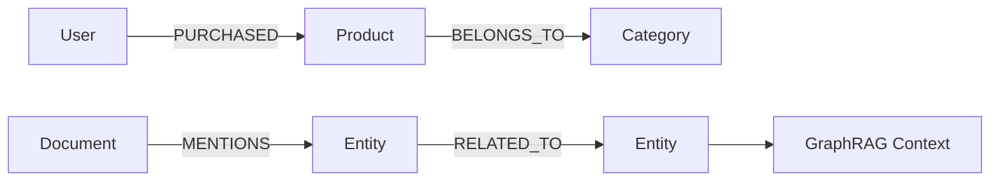

# 11. 图数据库：面向关系网络 / 知识图谱 / 路径分析的数据系统

::: tip 本章导读
理解节点、边、路径、多跳查询、知识图谱和 GraphRAG 在数据平台中的位置。
:::
::: info 本章验收问题
- 你能否判断一个问题为什么更适合图数据库而不是关系库或向量库？
- 你能否说明 GraphRAG 的路径扩展为什么必须受权限和来源约束？
:::




关系型数据库也能表达关系。

## 问题切入

但当问题重点从“记录本身”转向“记录之间的多跳关系、路径和网络结构”时，图数据库会更自然。

第 10 章讨论了向量数据库，它擅长根据语义相似性召回内容。但很多业务问题不是“哪个文本更相似”，而是“这些实体之间如何连接”：

```text
某个用户和欺诈团伙之间隔了几层关系？
一个供应商风险会影响哪些下游订单和客户？
一篇文档提到的实体与哪些政策、产品、负责人相关？
两个客户是否通过手机号、设备、地址或交易网络间接关联？
GraphRAG 中应该沿哪些实体关系扩展上下文？
```

这些问题如果只用关系型数据库表达，通常会变成多张表的递归 JOIN、复杂路径查询和难以维护的关系逻辑。图数据库出现的原因，就是让关系网络本身成为可以建模、查询和分析的对象。

## 核心判断

> 图数据库不是为了替代关系型数据库，而是为复杂关系、多跳查询和网络分析提供更直接的数据模型。

关系数据库用外键和 JOIN 表达关系——够用，直到关系本身成了分析对象。社交网络的好友推荐、供应链的路径追溯、反欺诈的环路检测，这些场景图数据库有数量级的表达优势。这一章建立的是”什么时候图是正确答案”的判断，以及 Neo4j、NebulaGraph 的选型逻辑。

图数据库也不是所有关系问题的最佳解。简单主外键、事务写入、报表聚合和指标分析仍然更适合关系数据库、数仓和 OLAP。图数据库应该用于关系网络本身成为分析对象的场景。

## 机制解释

### 11.1 图数据库概述

在关系型数据库中查"用户A的朋友的朋友的朋友买了什么"需要三到四次JOIN——如果用户A有200个朋友，每个朋友又有200个朋友，每次JOIN都在扩展结果集，到第三跳时可能已经膨胀到数百万行。这种"多跳关联查询"是图数据库存在的根本理由。

图数据库用节点（Node）表示实体、用边（Edge/Relationship）表示实体之间的关系，两者都可以携带属性（Property）。在这个模型下，"A的朋友的朋友"是一个图遍历操作——从A的节点出发，沿"朋友"边走到相邻节点，再沿"朋友"边走到下一层。数据库的存储引擎和查询引擎都是为这种操作原生设计的，所以遍历相邻节点的开销是O(1)而非O(n)——图数据库通常将每个节点的邻接边直接存储在该节点记录的附近（邻接表或类似结构），查询"A有哪些朋友"不是做一次索引查找再JOIN，而是直接读取A节点记录附带的边指针列表。

主流图数据库分为三类。原生图数据库以Neo4j为代表，从存储引擎到查询语言全部为图模型设计。Neo4j 2007年首次发布，Cypher查询语言（2011年随Neo4j 1.4引入）是图查询的事实标准。非原生图数据库在现有存储系统上叠加图语义——JanusGraph（2017年由Linux基金会托管）底层可以用HBase、Cassandra或BerkeleyDB作为存储后端，图结构序列化为邻接表存入KV存储。分布式图数据库解决单机装不下的场景——NebulaGraph（2019年由 vesoft 开源，2022年进入Apache孵化）采用存算分离的分布式架构，支持万亿级边规模。

选择和不用图数据库的边界在：当你的查询模式以多跳遍历（>=3跳）或不定长路径为主，图数据库带来的查询简洁度和性能提升是数量级的。当你的数据虽然是关系型的但查询模式是单表聚合或简单的两表JOIN——例如"统计每个部门的员工数"——用PostgreSQL就够了，图数据库不会带来额外收益。这一判断与第2-3章中讨论的关系型数据库定位形成了自然的承接关系。

## 系统位置

### 图模型设计清单

图数据库的难点不是把数据导入节点和边，而是让关系语义稳定。一个图模型至少要回答：

| 设计项 | 必须说明 | 失败后果 |
| --- | --- | --- |
| 实体身份 | 用户、商品、指标、文档、组织如何生成稳定 ID | 同一个实体被拆成多个节点，路径结果不可信 |
| 关系方向 | `User -> PLACED -> Order` 还是反向 | 查询语义混乱，多跳路径难以解释 |
| 关系属性 | 时间、来源、置信度、版本、权重是否记录在边上 | 只能知道“有关”，不知道为什么有关 |
| 路径边界 | 最多查几跳，允许哪些关系类型参与 | 多跳查询返回噪声路径或性能失控 |
| 图谱版本 | 实体抽取、关系抽取、人工修正如何记录版本 | GraphRAG 答案无法复现 |
| 权限继承 | 文档、实体、关系的权限如何传递 | 用户通过图路径看到无权访问的内容 |

以 GraphRAG 为例，不能只保存“文档 A 提到实体 B”。更可靠的结构是：

```text
Document(doc_id, source_uri, version, visibility)
Chunk(chunk_id, doc_id, position, text_hash)
Entity(entity_id, type, normalized_name)
Relation(subject_id, predicate, object_id, source_chunk_id, confidence, graph_version)
```

回答问题时，系统先用向量召回相关 Chunk，再用图查询扩展实体关系，最后把来源 Chunk、路径和置信度一起交给模型。这样图数据库解决的是“关系可追踪”和“多跳上下文组织”，不是替代文档权限、事实校验或最终答案评测。

图数据库是 AI 数据基础设施和数据平台中的关系网络层。

```text
PostgreSQL 业务表 / 数仓事实表 / 文档 / 日志
  -> 实体抽取 / 关系抽取 / ID 对齐
  -> Graph DB
  -> 路径查询 / 图算法 / 知识图谱 / GraphRAG
```

它和前后系统的关系很明确：

- PostgreSQL 和数仓提供结构化事实来源。
- 文档解析和信息抽取提供非结构化实体关系。
- 向量数据库提供语义相似召回。
- 图数据库提供显式关系扩展和路径约束。
- 数据治理负责实体口径、关系质量、权限和血缘。

图数据库引出第 12 章湖仓：结构化表、文档、图谱、向量和日志都会产生大量原始数据和中间产物，需要一个开放、低成本、可被多引擎访问的数据底座。

## 场景案例

以企业知识库 GraphRAG 为例，向量检索可以找到和问题相似的段落，但它未必知道这些段落中提到的实体之间是什么关系。

可以构建一张知识图谱：

```text
(Document)-[:MENTIONS]->(Policy)
(Policy)-[:APPLIES_TO]->(Department)
(Policy)-[:OWNED_BY]->(Person)
(Product)-[:HAS_RISK]->(Risk)
(Risk)-[:MITIGATED_BY]->(Policy)
```

具体数据示例：

```cypher
// 节点
CREATE (p1:Product {name: '支付网关', version: '3.2'});
CREATE (r1:Risk {name: 'SQL 注入风险', level: 'high'});
CREATE (r2:Risk {name: '数据泄露风险', level: 'high'});
CREATE (pol1:Policy {name: '安全开发规范', doc_id: 'SEC-001'});
CREATE (pol2:Policy {name: '数据保护制度', doc_id: 'DP-003'});
CREATE (per1:Person {name: '张工', role: '安全负责人'});
CREATE (dept1:Department {name: '支付事业部'});

// 边关系
CREATE (p1)-[:HAS_RISK]->(r1);
CREATE (p1)-[:HAS_RISK]->(r2);
CREATE (r1)-[:MITIGATED_BY]->(pol1);
CREATE (r2)-[:MITIGATED_BY]->(pol2);
CREATE (pol1)-[:OWNED_BY]->(per1);
CREATE (pol1)-[:APPLIES_TO]->(dept1);
CREATE (pol2)-[:OWNED_BY]->(per1);
```

当用户问”这个产品上线前需要遵守哪些安全要求？”时，系统可以：

```text
1. 用向量检索召回相关产品文档。
2. 抽取产品、风险、政策、安全要求等实体。
3. 沿图关系查找 Product -> Risk -> Policy -> Owner。
4. 把相关政策、负责人、适用部门和原文片段组装进上下文。
5. 让 LLM 生成带来源的回答。
```

例如，用 Cypher 查询”支付网关相关的所有安全政策和负责人”：

```cypher
MATCH (p:Product {name: '支付网关'})-[:HAS_RISK]->(r:Risk)
      -[:MITIGATED_BY]->(pol:Policy)
      -[:OWNED_BY]->(person:Person)
RETURN r.name AS risk, r.level AS level,
       pol.name AS policy, pol.doc_id AS doc_id,
       person.name AS owner;
```

预期结果：

```text
| risk           | level | policy         | doc_id  | owner |
|----------------|-------|----------------|---------|-------|
| SQL 注入风险    | high  | 安全开发规范    | SEC-001 | 张工  |
| 数据泄露风险    | high  | 数据保护制度    | DP-003  | 张工  |
```

这个查询只用了两跳（Product -> Risk -> Policy -> Person），就已经把产品面临的风险、对应的政策和负责人全部串联起来。如果只用 SQL，同样的查询需要多张表的递归 JOIN，而且路径长度不固定时会更复杂。

这个案例体现图数据库的价值：它不是替代向量检索，而是把“相似内容”扩展成“有关系约束的上下文网络”。

## 常见误区

**误区一：图数据库比关系型数据库更适合所有关系。**

简单外键关系和事务查询，关系型数据库更直接。图数据库适合多跳、路径和网络结构问题。

**误区二：知识图谱就是图数据库。**

图数据库是存储和查询系统，知识图谱还包括本体、抽取、消歧、对齐、质量和应用。

**误区三：把表直接转成节点和边就是图建模。**

图建模要围绕查询问题决定节点、边和属性，不是机械转换。

**误区四：图数据库上了以后就自动有知识图谱。**

知识图谱还需要实体抽取、关系抽取、本体设计、消歧、对齐、质量评估和应用闭环。图数据库只是存储和查询层。

**误区五：GraphRAG 可以只靠图，不需要向量。**

图关系适合显式路径和实体扩展，向量检索适合语义召回。高质量 GraphRAG 通常需要两者协同。

## 实战任务

设计一个电商关系图：

```text
User
Product
Order
Category
Brand
```

关系包括：

```text
User PURCHASED Product
Product BELONGS_TO Category
Product HAS_BRAND Brand
User VIEWED Product
User SIMILAR_TO User
```

要求：

- 定义节点属性。
- 定义边属性。
- 写出 3 个路径查询问题。
- 判断哪些数据来自 PostgreSQL，哪些来自事件日志。
- 说明这个图如何服务推荐或 GraphRAG。

补充要求：

- 写出一个 2 跳查询、一个 3 跳查询和一个最短路径查询。
- 说明 `Order` 是否应该作为节点，还是只作为 `PURCHASED` 边上的属性。
- 设计一个实体去重规则，例如同一用户多个设备、手机号或邮箱如何对齐。
- 说明哪些图数据可以离线批量构建，哪些关系需要实时更新。
- 说明图谱结果如何与向量检索结果合并进入 GraphRAG 上下文。

## 小结引出下一章

图数据库让关系网络成为一等查询对象。

它适合多跳关系、路径分析、知识图谱、风控、推荐和 GraphRAG。

下一章进入数据湖与湖仓。

因为结构化表、日志、文档、向量和图谱背后，都需要一个能长期存储、组织和被多引擎访问的数据底座。
