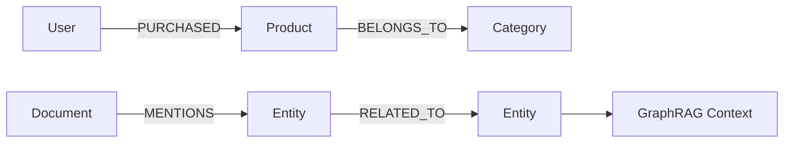

# 11. 图数据库：面向关系网络 / 知识图谱 / 路径分析的数据系统

::: tip 本章导读
理解节点、边、路径、多跳查询、知识图谱和 GraphRAG 在数据平台中的位置。
:::
::: info 本章验收问题
- 你能否判断一个问题为什么更适合图数据库而不是关系库或向量库？
- 你能否说明 GraphRAG 的路径扩展为什么必须受权限和来源约束？
:::




关系型数据库也能表达关系。

## 问题切入

但当问题重点从“记录本身”转向“记录之间的多跳关系、路径和网络结构”时，图数据库会更自然。

第 10 章讨论了向量数据库，它擅长根据语义相似性召回内容。但很多业务问题不是“哪个文本更相似”，而是“这些实体之间如何连接”：

```text
某个用户和欺诈团伙之间隔了几层关系？
一个供应商风险会影响哪些下游订单和客户？
一篇文档提到的实体与哪些政策、产品、负责人相关？
两个客户是否通过手机号、设备、地址或交易网络间接关联？
GraphRAG 中应该沿哪些实体关系扩展上下文？
```

这些问题如果只用关系型数据库表达，通常会变成多张表的递归 JOIN、复杂路径查询和难以维护的关系逻辑。图数据库出现的原因，就是让关系网络本身成为可以建模、查询和分析的对象。

## 核心判断

> 图数据库不是为了替代关系型数据库，而是为复杂关系、多跳查询和网络分析提供更直接的数据模型。

关系数据库用外键和 JOIN 表达关系——够用，直到关系本身成了分析对象。社交网络的好友推荐、供应链的路径追溯、反欺诈的环路检测，这些场景图数据库有数量级的表达优势。这一章建立的是”什么时候图是正确答案”的判断，以及 Neo4j、NebulaGraph 的选型逻辑。

图数据库也不是所有关系问题的最佳解。简单主外键、事务写入、报表聚合和指标分析仍然更适合关系数据库、数仓和 OLAP。图数据库应该用于关系网络本身成为分析对象的场景。

## 机制解释

### 11.1 图数据库概述

在关系型数据库中查"用户A的朋友的朋友的朋友买了什么"需要三到四次JOIN——如果用户A有200个朋友，每个朋友又有200个朋友，每次JOIN都在扩展结果集，到第三跳时可能已经膨胀到数百万行。这种"多跳关联查询"是图数据库存在的根本理由。

图数据库用节点（Node）表示实体、用边（Edge/Relationship）表示实体之间的关系，两者都可以携带属性（Property）。在这个模型下，"A的朋友的朋友"是一个图遍历操作——从A的节点出发，沿"朋友"边走到相邻节点，再沿"朋友"边走到下一层。数据库的存储引擎和查询引擎都是为这种操作原生设计的，所以遍历单个相邻节点的开销是O(1)而非O(n)——图数据库通常将每个节点的邻接边直接存储在该节点记录的附近（邻接表或类似结构），查询"A有哪些朋友"不是做一次索引查找再JOIN，而是直接读取A节点记录附带的边指针列表。但遍历所有相邻节点的总开销是O(邻接边数)，不是O(1)——"找到第一个邻居指针"是O(1)，"遍历全部邻居"取决于邻居数量。

主流图数据库分为三类。原生图数据库以Neo4j为代表，从存储引擎到查询语言全部为图模型设计。Neo4j 2007年首次发布，Cypher查询语言随Neo4j逐步演进，2015年通过openCypher项目开放标准化。非原生图数据库在现有存储系统上叠加图语义——JanusGraph（2017年由Linux基金会托管）底层可以用HBase、Cassandra或BerkeleyDB作为存储后端，图结构序列化为邻接表存入KV存储。分布式图数据库解决单机装不下的场景——NebulaGraph（2019年由 vesoft 开源，2022年进入Apache孵化）采用存算分离的分布式架构，支持万亿级边规模。

选择和不用图数据库的边界在：当你的查询模式以多跳遍历（>=3跳）或不定长路径为主，图数据库带来的查询简洁度和性能提升是数量级的。当你的数据虽然是关系型的但查询模式是单表聚合或简单的两表JOIN——例如"统计每个部门的员工数"——用PostgreSQL就够了，图数据库不会带来额外收益。这一判断与第2-3章中讨论的关系型数据库定位形成了自然的承接关系。

**图数据库不解决什么：** 图数据库解决的是"关系网络中的路径查询和结构发现"，不解决单行事务写入、报表聚合、指标分析和宽表BI——这些仍然是关系型数据库、数仓和OLAP的领域。图数据库也不自动产生知识图谱——它只是存储和查询层，知识图谱还需要实体抽取、关系抽取、本体设计、消歧和对齐（11.8和11.11节会展开）。另一个不解决的边界：图数据库存储的是显式关系（有边连接的实体），不能替代向量检索的语义相似性发现——第10章讨论的向量数据库解决的是"内容语义相似"，图数据库解决的是"实体关系关联"，两者互补而非互斥。

图数据库的代价和失效条件：引入图数据库意味着增加一个独立的数据系统——实体和关系需要从PostgreSQL、数仓、日志和文档中抽取、消歧和对齐后入图，数据同步和一致性维护是持续成本。图数据库在数据质量不足时失效——实体消歧不完整导致节点分裂，路径查询断裂；关系抽取不准确导致边语义混乱，图分析结果不可信。错误的关系比没有关系更危险，因为图遍历会让错误关系沿路径传播，产生图幻觉（GraphRAG中模型基于虚假路径生成错误回答，11.8节会详细讨论）。

### 11.2 图数据模型

把一张业务表"机械地转成节点和边"——每个列做属性、每行做节点——这是最常见的图建模失败模式。图建模不是关系建模的翻版，它解决的是"实体之间如何关联"的表达问题，而不是"一行记录包含哪些字段"的存储问题。

**图建模 ≠ 关系建模。** 关系建模围绕事实组织数据——一行订单包含客户ID、商品ID、金额和时间，事实本身是中心。图建模围绕关系组织数据——客户节点和商品节点是独立的实体，购买行为是一条连接两者的边，关系本身是中心。这个区分决定了你如何决定"什么是节点、什么是边、什么是属性"。

属性图（Property Graph）是最主流的图数据模型，Neo4j 和 NebulaGraph 都采用它。核心元素只有三种：节点（Node/Vertex）带标签和属性，边（Edge/Relationship）带类型、方向和属性，路径（Path）是从起点沿若干边到达终点的序列。以电商反欺诈场景为例：

```text
客户节点:  {user_id, name, phone, email, device_id}
商品节点:  {product_id, name, category, price}
供应商节点: {supplier_id, name, region, risk_level}
关系边:
  (客户)-[:PURCHASED {order_id, amount, time}]->(商品)
  (客户)-[:VIEWED {time, duration}]->(商品)
  (客户)-[:SHARED_DEVICE {device_id, time_range}]->(客户)
  (供应商)-[:SUPPLIES {contract_id, volume}]->(商品)
  (客户)-[:SAME_PHONE {phone}]->(客户)
```

注意几个建模判断：Order 不是节点而是 PURCHASED 边上的属性——因为查询关注的是"客户买了什么商品"这条关系，而非订单本身的字段。但如果下游还要统计订单维度的指标，Order 应该独立为节点，同时保留 PURCHASED 边。建模决策取决于查询问题，而非数据形态。

RDF 图用三元组（subject-predicate-object）表达一切。它的优势是语义标准化——W3C 的 RDF Schema 和 OWL 本体可以定义类层次和关系约束，适合知识图谱和本体建模场景。代价是：RDF 没有属性的"一等公民"地位，节点的属性也被表达为三元组（subject-attribute-object），查询和存储的效率不如属性图直接。在反欺诈和社交路径场景中，属性图的边属性（时间、置信度、来源）是路径过滤的关键条件，RDF 表达这些需要额外的三元组节点，增加了查询复杂度。

超图（Hypergraph）允许一条边连接多个节点——例如"一次团伙欺诈事件涉及5个客户、3个手机号、2个地址"。属性图的边只能连接两个节点，要表达团伙关系需要引入中间节点（如 FraudRing），增加了建模层次但保持了查询简洁。超图在学术研究中更自然，但在主流图数据库（Neo4j、NebulaGraph）中没有原生支持，实际工程中较少使用。

**图建模的代价和失效边界：** 图建模的前提条件是——你的核心查询问题确实围绕多跳关系和路径，而非单表聚合或两表 JOIN。如果一个电商报表问的是"每月GMV趋势"或"各品类销量排名"，图建模不会比关系建模更好，反而增加了数据同步和查询的复杂度。图建模的另一个限制是：节点和边的粒度选择没有唯一正确答案，同一个业务可以用不同粒度建模——Order 作为节点还是边属性，Phone 作为节点还是客户属性，这些决策直接影响路径查询的语义和性能。建模错误最常见的信号是：图查询返回噪声路径或语义混乱，根因是边粒度太粗或节点身份不稳定。

图建模和关系建模不是互斥选择，而是不同查询模式的适配。第2-3章讨论的 SQL 聚合和事务写入，图数据库不替代它们；图数据库补充的是"沿关系路径追踪影响传播"这种关系型数据库用递归 JOIN 也难以表达的场景。下一节进入图查询语言——建模决定了图的结构，查询语言决定了你能从图上走多远。

### 11.3 图查询语言

SQL 查询的是"符合条件的行"，图查询语言遍历的是"符合条件的路径"。这个根本差异决定了查询语言的机制设计：SQL 的核心操作是过滤和聚合，图查询的核心操作是模式匹配和路径扩展。

**图查询 ≠ SQL + JOIN。** 一个3跳路径查询——"客户A通过共享手机号关联的客户B，B购买的商品C属于哪个供应商"——在SQL中是三次JOIN加上子查询，路径长度不确定时还要用递归CTE。在Cypher中它是一个MATCH模式：

```cypher
MATCH (a:客户 {user_id: 'A001'})
      -[:SHARED_PHONE]->(b:客户)
      -[:PURCHASED]->(c:商品)
      -[:SUPPLIED_BY]->(s:供应商)
RETURN a.name, b.name, c.name, s.name, s.risk_level;
```

这条查询的执行机制是：从起点节点a出发，沿SHARED_PHONE边遍历到相邻客户节点b，再沿PURCHASED边走到商品节点c，最后沿SUPPLIED_BY边到达供应商s。每一步的遍历开销是O(邻接边数)，而非O(全表扫描)。这是图查询语言的核心优势——路径遍历是本地操作，不需要全局JOIN。

Cypher 是 Neo4j 的声明式图查询语言，也是图查询的事实标准。它的核心机制是 pattern matching——你描述要匹配的节点-边-节点模式，引擎决定遍历策略。Cypher 的可变长度路径语法 `(a)-[:KNOWS*1..3]->(b)` 表达"1到3跳的朋友关系"，这是递归路径的简洁表达，SQL中没有对应语法。Cypher 的限制是：它只运行在Neo4j和兼容openCypher的引擎上（如NebulaGraph部分兼容），跨平台可移植性不如Gremlin。

Gremlin 是 Apache TinkerPop 的遍历式图查询语言，运行在JanusGraph、Amazon Neptune等支持TinkerPop的图数据库上。Gremlin 的机制是遍历步骤链——`g.V(a).out('KNOWS').out('KNOWS').out('PURCHASED')` 是一步步沿边走，每步返回中间结果集给下一步。与Cypher的区别：Cypher描述"你要什么模式"，Gremlin描述"你怎么一步步走到那里"。Gremlin更灵活也更复杂——同一个查询在Gremlin中的写法可以有多种，性能差异很大，这是它的代价：查询优化更多依赖开发者而非引擎。

nGQL 是 NebulaGraph 的原生查询语言，语法接近Cypher但面向分布式执行设计。nGQL 的 `GO FROM` 语句是典型的遍历式查询——`GO 1 TO 3 STEPS FROM "A001" OVER shared_phone, purchased YIELD shared_phone._dst, purchased._dst`——它显式指定步数和边类型，引擎在分布式存储层协调多分片遍历。NebulaGraph v3.x 也支持 openCypher 的 MATCH 语法，可以写成 `MATCH (src:客户)-[e1:shared_phone]->(mid:客户)-[e2:purchased]->(dst:商品) WHERE id(src) == "A001" RETURN mid.name, dst.name`——MATCH 语法更适合多跳复杂路径查询。nGQL 不等于 Cypher 的分布式版——它的执行计划需要考虑数据分片位置和网络开销，这是NebulaGraph存算分离架构带来的查询机制差异。

**图查询语言的代价和失效条件：** 图查询语言的优势在多跳路径和模式匹配，但它在聚合统计上不如SQL。例如"统计每个供应商的商品数量和平均价格"，在Neo4j中需要先MATCH再聚合，性能不如PostgreSQL直接GROUP BY。图查询语言的另一个失效条件是：当图的密度极高（每个节点连接数千条边），遍历操作会在中间步骤膨胀结果集，导致查询超时——这是图遍历的"扇出爆炸"问题，不是查询语言本身能解决的，需要索引和查询优化配合（下一两节会展开）。

图查询语言的选择和图数据库绑定——你选Neo4j就用Cypher，选NebulaGraph就用nGQL或兼容Cypher，选JanusGraph就用Gremlin。语言选择不是独立决策，而是数据库选型的一部分。下一节进入Neo4j实战，用具体的电商反欺诈Cypher查询展示这些机制如何落地。

### 11.4 Neo4j 实战

上一节讨论了图查询语言的机制差异。现在用 Neo4j 和 Cypher 把这些机制落到具体的电商反欺诈场景中——不是展示语法糖，而是验证"图遍历解决什么、不解决什么"的判断。

Neo4j 是原生属性图数据库，从存储引擎到查询语言全部为图模型设计。它的存储机制是：每个节点的邻接边直接存储在该节点记录的附近（邻接表结构），查询"客户A有哪些关联边"是读取A节点记录附带的边指针列表，开销O(邻接边数)而非O(全表扫描)。这个存储设计让多跳遍历的每一步都是本地操作，不需要中间结果的物化和重分布。

以电商反欺诈为例，构建图模型：

```cypher
// 创建客户节点
CREATE (u1:客户 {user_id: 'U001', name: '张三', phone: '138xxxx', device: 'D001'})
CREATE (u2:客户 {user_id: 'U002', name: '李四', phone: '138xxxx', device: 'D001'})
CREATE (u3:客户 {user_id: 'U003', name: '王五', phone: '159xxxx', device: 'D002'})

// 创建商品和供应商节点
CREATE (p1:商品 {product_id: 'P001', name: '高端手机', price: 5999, category: '数码'})
CREATE (p2:商品 {product_id: 'P002', name: '平板电脑', price: 3999, category: '数码'})
CREATE (s1:供应商 {supplier_id: 'S001', name: '数码供应链', region: '华南', risk_level: 'low'})

// 创建关系边
CREATE (u1)-[:PURCHASED {order_id: 'O001', amount: 5999, time: '2025-03-01'}]->(p1)
CREATE (u2)-[:PURCHASED {order_id: 'O002', amount: 5999, time: '2025-03-02'}]->(p1)
CREATE (u3)-[:PURCHASED {order_id: 'O003', amount: 3999, time: '2025-03-03'}]->(p2)
CREATE (u1)-[:SHARED_DEVICE {device: 'D001', period: '2025-02-01~03-01'}]->(u2)
CREATE (u2)-[:SHARED_PHONE]->(u3)
CREATE (p1)-[:SUPPLIED_BY]->(s1)
CREATE (p2)-[:SUPPLIED_BY]->(s1)
```

**反欺诈路径查询**——找出通过共享设备和手机号间接关联的客户群：

```cypher
// 2跳：共享设备的客户还买了什么
MATCH (u:客户 {user_id: 'U001'})
      -[:SHARED_DEVICE]->(u2:客户)
      -[:PURCHASED]->(p:商品)
RETURN u2.name, p.name, p.price;

// 3跳：共享设备 -> 共享手机号 -> 购买商品，识别团伙购买模式
MATCH (u:客户 {user_id: 'U001'})
      -[:SHARED_DEVICE]->(u2:客户)
      -[:SHARED_PHONE]->(u3:客户)
      -[:PURCHASED]->(p:商品)
RETURN u2.name, u3.name, p.name, p.category;

// 不定长路径：客户U001通过任意关系链到达的供应商及其风险等级
MATCH path = (u:客户 {user_id: 'U001'})
      -[*1..4]->(s:供应商)
RETURN nodes(path) AS 路径节点, s.name, s.risk_level;
```

这些查询在关系型数据库中需要4-5次递归JOIN，路径长度不确定时SQL的递归CTE语法和性能都不友好。在Neo4j中，引擎从起点U001出发逐步遍历邻接边，每一步只扩展符合条件的节点，不需要物化中间结果集。

**Neo4j 实战不能替代的环节：** 图查询找到的是"实体之间如何关联"，但关联不等于欺诈判定。U001和U002共享设备可能有合理原因（家人共用），路径查询只能提供线索，最终判断需要业务规则和人工审核。Neo4j也不替代数据入图前的准备工作——实体消歧（同一用户多设备多手机号如何合并）、关系置信度标注、时间窗口过滤，这些是图查询的前提条件而非图数据库的内置能力。

**Neo4j 的代价和边界：** Neo4j Community Edition 是单机架构，数据量和并发受单机内存限制。企业版支持集群但写入仍需路由到主节点，写入吞吐不如分布式图数据库。Neo4j适合知识图谱、路径查询和中小规模反欺诈场景，不适合万亿级边的大规模社交网络分析——那需要NebulaGraph的分布式架构。Neo4j的另一个限制是：Cypher查询在密度极高的节点（超级节点，如一个热门商品被10万客户购买）上遍历时，中间结果集膨胀导致查询超时，需要索引和查询优化配合（下一节展开）。

数据入图的真实链路不是"直接导入"，而是：

```text
PostgreSQL 业务表（客户、订单、商品、供应商）
  -> ETL 抽取实体和关系
  -> 实体消歧（同一手机号多客户合并为SAME_PHONE边）
  -> 写入 Neo4j
  -> Cypher 路径查询 / 图算法
  -> 结果输出给风控规则引擎或 GraphRAG 上下文组装
```

Neo4j 实战的核心收获不是"学会Cypher语法"，而是理解图遍历的机制优势和多跳路径的表达简洁度，以及它的边界——图提供关系线索，不替代业务判断。下一节讨论图数据库架构，对比Neo4j原生架构和NebulaGraph分布式架构的机制差异。

### 11.5 图数据库架构

上一节用Neo4j实战展示了Cypher路径查询的机制。但Neo4j是单机原生架构——当图规模超过单机内存，或查询并发需要水平扩展时，架构选择就从"用哪个图数据库"变成"原生图还是分布式图"。

**原生图架构 ≠ 分布式图架构，解决的问题不同。** Neo4j的原生架构把节点的邻接边直接存储在节点记录附近（免索引邻接），遍历每一步是O(邻接边数)的本地读取。代价是：所有数据必须装在一台机器的内存和磁盘上，写入路由到主节点，集群模式下的写入扩展性有限。NebulaGraph的分布式架构采用存算分离——存储层分片存储顶点和边，计算层协调多分片遍历。代价是：跨分片遍历需要网络通信，每跳遍历的开销不再是纯本地操作，查询延迟随路径长度和分片分布增加。

**原生图架构（Neo4j）：** Neo4j的存储引擎为图模型原生设计。每个节点记录包含：固定大小的头部（标签、属性引用）、第一个关系边的指针、第一个属性的指针。关系边记录包含：起始节点指针、终止节点指针、关系类型、前后关系边指针（构成双向链表）。这意味着从节点A出发遍历所有邻接边，只需沿指针链读取，不需要索引查找。这个设计的优势是遍历极快——2-3跳路径查询的延迟通常在毫秒级。失效条件是：当图规模超过单机存储容量（社区版没有分片机制），或并发写入超过单主节点处理能力，原生架构的本地遍历优势无法弥补规模和吞吐的瓶颈。

**分布式图架构（NebulaGraph）：** NebulaGraph将存储、计算和元数据分离为三个独立服务。Meta Service管理schema、分片策略和集群拓扑——图空间（Graph Space）的逻辑分区映射到存储层的物理分片。Graph Service接收查询请求、解析nGQL或Cypher、生成执行计划、协调多分片执行。Storage Service用RocksDB存储顶点和边的KV数据，每个分片是独立的存储实例。遍历一条3跳路径的机制是：Graph Service先定位起点节点所在分片，在该分片本地遍历第一跳边，对每条边的终止节点查询其所在分片，如果跨分片则发起网络请求获取下一跳数据。代价显式可见：跨分片遍历的每一步引入网络延迟，3跳路径如果涉及3个不同分片，延迟是本地遍历的3倍以上。

**非原生图架构（JanusGraph）：** JanusGraph不自带存储引擎，底层使用HBase、Cassandra或BerkeleyDB作为KV存储后端，图结构序列化为邻接表存入KV。索引支持Elasticsearch或Solr。这种架构的优势是直接利用现有大数据基础设施的存储和索引能力，适合已有HBase/Cassandra集群的团队。代价是：图遍历需要两次查询——先从KV存储读取邻接表，再从索引获取属性过滤，性能不如原生图的单次遍历。JanusGraph不等于"免费获得图能力"——它继承了后端存储的所有运维复杂度（HBase的Region分裂、Cassandra的Compaction），图查询的性能优化需要同时调优存储后端和图层索引。

**架构选型的判断边界：**

| 架构类型 | 适合场景 | 失效条件 | 推荐规模 |
|---------|---------|---------|---------|
| 原生图（Neo4j） | 知识图谱、路径查询、中小规模反欺诈 | 数据量超单机内存、写入并发超主节点限制 | 节点<1亿，边<10亿 |
| 分布式图（NebulaGraph） | 大规模社交网络、供应链全链路追溯、高并发图服务 | 路径查询跨多分片延迟过高、运维复杂度超出团队能力 | 节点>1亿，边>10亿 |
| 非原生图（JanusGraph） | 已有HBase/Cassandra基础设施、离线图计算 | 实时遍历延迟不满足要求、双层运维成本过高 | 灵活，依赖后端规模 |

架构选择不替代数据建模和查询优化——无论选择哪种架构，图建模的粒度决策、超级节点处理和路径查询优化都是独立问题。下一节进入图索引与优化，讨论遍历加速和超级节点的具体机制。

### 11.6 图索引与优化

上一节对比了三种图数据库架构——原生、分布式和非原生。无论架构如何，图遍历的瓶颈都可能出现在一个地方：超级节点。一个热门商品被10万客户购买，一条SHARED_PHONE边连接数千个客户——从这些节点出发遍历时，引擎需要展开全部邻接边再做过滤，中间结果集瞬间膨胀到数万条。图索引解决的就是这个问题，但它的机制和代价与关系型数据库索引完全不同。

**图索引 ≠ 关系型索引。** 关系型索引加速的是"找到符合条件的行"（B树或Hash查找），图索引加速的是"缩小遍历的起止范围"。Neo4j的索引有两种：节点属性索引和关系属性索引。节点属性索引（如CREATE INDEX FOR (u:客户) ON (u.phone)）的作用是快速定位起点节点——"找到phone='138xxxx'的客户"，避免全图扫描。但索引不加速遍历本身——找到起点后，遍历邻接边仍然是免索引的本地读取。这是图索引的核心机制：索引解决"从哪里开始"，遍历解决"怎么走"，两者分工明确。

关系属性索引是更关键的优化手段。在电商反欺诈场景中，PURCHASED边带有time属性——查询"最近7天内共享设备的客户购买记录"需要沿SHARED_DEVICE边遍历到相邻客户，再沿PURCHASED边走到商品。如果PURCHASED边没有时间索引，引擎从相邻客户出发必须展开全部PURCHASED边再过滤时间窗口，10万条边可能只有50条满足条件，但展开和过滤的中间开销是10万次。关系属性索引（CREATE INDEX FOR ()-[r:PURCHASED]-() ON (r.time)）让引擎在遍历PURCHASED边时只展开满足时间条件的边，中间开销从10万降到50。

**NebulaGraph的索引机制不同：** NebulaGraph的索引是针对顶点和边的属性建立的二级索引，存储在独立的索引分片中。查询"phone='138xxxx'的客户"时，Graph Service先查询索引分片获取顶点ID，再到数据分片读取完整顶点记录。代价是：索引和数据分离意味着每次索引查询是两次网络请求（索引分片+数据分片），延迟高于Neo4j的本机索引查找。NebulaGraph的索引还有一个前提条件——索引必须在数据写入前创建，已有数据的后建索引需要触发重建操作，对大图可能耗时数小时。

**超级节点的优化不只是索引问题：** 超级节点（Supernode）的根因不是索引缺失而是数据分布——某些节点天然连接大量边（热门商品、公共手机号、大型供应商）。索引可以缩小遍历的边范围，但不能消除超级节点本身。处理超级节点的策略有三种：1）边属性过滤——用索引缩小遍历范围，只展开满足条件的边（上文已述）。2）边类型拆分——将PURCHASED边按时间窗口拆成PURCHASED_7D、PURCHASED_30D、PURCHASED_90D等子类型，每种子类型的边数量大幅减少，遍历开销相应降低。代价是：查询时需要显式指定边类型，灵活度不如统一PURCHASED+时间过滤。3）中间节点引入——将"客户直接购买商品"改为"客户下单->订单包含商品"，引入Order节点分散边密度。代价是：路径从1跳变2跳，查询模式改变。

**图索引的代价和失效边界：** 图索引的维护成本高于关系型索引——每次写入节点或边属性都需要同步更新索引，批量导入场景下索引构建可能耗时数小时。索引的失效条件是：当你查询的模式是"从全图中找所有满足某条件的路径"而非"从已知起点出发遍历"——全局路径搜索（如最短路径算法）不使用属性索引，它依赖遍历策略而非索引加速。另一个失效信号是：索引建了很多但查询仍然慢——根因可能是遍历方向错误（从大端往小端遍历）或查询模式本身需要全图扫描，这类问题需要查询优化而非更多索引。

图索引解决的是"遍历起点定位"和"边属性过滤"两个子问题，不解决超级节点和全局图算法的性能问题。下一节展开图查询优化——讨论遍历方向、查询重写和执行计划分析的机制。

### 11.7 图查询优化

图索引缩小了遍历的起止范围，但遍历本身仍然可能出问题。一个电商反欺诈查询"找出所有通过共享手机号间接关联的高端手机购买客户"，如果遍历方向从手机号节点出发（一个公共手机号可能连接数千客户），中间结果集瞬间膨胀。如果从已知客户出发沿SHARED_PHONE边遍历到相邻客户再过滤购买记录，中间结果集只有几十条。同一个查询，遍历方向不同，性能差距可以是100倍。图查询优化解决的就是这类遍历策略问题。

**图查询优化 ≠ 加索引。** 索引解决的是定位和过滤，优化解决的是遍历路径的选择和中间结果集的控制。两者的配合关系是：索引缩小起止范围，优化决定遍历方向和扩展策略。

**遍历方向是最关键的优化决策。** 图遍历的成本模型是：每一步遍历的中间结果集大小 = 当前结果集大小 × 每个节点的平均邻接边数 × 过滤条件命中率。以3跳路径 `(客户)-[:SHARED_PHONE]->(客户)-[:PURCHASED]->(商品)` 为例：

从大端遍历：热门手机号节点有5000条SHARED_PHONE边，每条边指向一个客户，5000个客户各自有20条PURCHASED边，中间结果集 = 5000 × 20 = 100000条，再过滤"高端手机"（命中率10%）= 10000条最终结果。

从小端遍历：从已知可疑客户出发，SHARED_PHONE边平均2条（可疑客户通常只共享少数手机号），2个客户 × 20条PURCHASED边 = 40条，过滤高端手机 = 4条结果。中间结果集从100000降到40，差距2500倍。

Cypher查询的写法本身不决定遍历方向——Neo4j引擎根据统计信息（每个Label的节点数、每种Edge类型的边数）选择起点。但如果统计信息不准确（大量数据写入后未更新统计），引擎可能选择错误的遍历方向。手动控制遍历方向的方法是用USING INDEX或USING SCAN提示指定起点Label，或用WITH子查询提前过滤中间结果：

```cypher
// 优化写法：先用索引定位可疑客户，再遍历路径
MATCH (u:客户) WHERE u.risk_flag = 'high'
WITH u
MATCH (u)-[:SHARED_PHONE]->(u2:客户)-[:PURCHASED]->(p:商品)
WHERE p.price > 5000
RETURN u.name, u2.name, p.name;
```

WITH子查询的作用是：先完成起点过滤（只保留高风险客户），再从这些少量起点出发遍历路径。没有WITH时，引擎可能从商品端或手机号端开始遍历，中间结果集远大于从客户端出发。

**NebulaGraph的查询优化机制不同：** NebulaGraph的Graph Service生成执行计划时需要考虑数据分片位置。遍历步骤尽可能在同一个分片内完成（本地遍历），跨分片遍历只在必要时触发。优化策略是：将高过滤率的步骤前置——先在起始分片内过滤节点属性，只把符合条件的节点ID传递到下一个分片做遍历，减少跨分片数据传输。代价是：执行计划的生成依赖Meta Service提供的分片统计信息，如果统计信息过时，跨分片遍历的策略可能不最优。

**图查询优化的常见失效信号和缓解措施：**

| 症状 | 根因 | 缓解措施 |
|------|------|---------|
| 2-3跳查询超时但1跳正常 | 中间结果集膨胀（遍历方向错误或超级节点） | 用WITH前置过滤、控制遍历方向、检查是否经过超级节点 |
| 查询返回结果少但耗时长 | 扇出爆炸：从高密度端遍历，过滤率极低 | 逆转遍历方向，从小密度端出发；添加边属性索引 |
| 带WHERE的查询比不带WHERE还慢 | 过滤条件在遍历后而非遍历中执行 | 将WHERE条件移入MATCH模式或WITH子查询，让引擎在遍历时过滤 |
| NebulaGraph查询延迟波动大 | 跨分片遍历路径不稳定（数据分布变化） | 重新平衡分片、更新统计信息、减少跨分片跳数 |

图查询优化解决的是"遍历怎么走"的策略问题，不解决"图本身的数据分布"问题——超级节点、边密度不均和分片倾斜需要建模调整和架构优化配合。图查询优化的另一个前提条件是：你必须理解图的数据分布特征——每个Label的节点数、每种Edge的边数和密度分布，否则优化决策只能靠猜测而非数据。下一节进入GraphRAG——图遍历和向量检索如何协同组装上下文。

### 11.8 GraphRAG

第10章讨论了向量检索——它擅长根据语义相似性召回内容片段。但很多业务问题不是"哪个文本更相似"，而是"这些实体之间如何关联"。向量检索找的是相似内容，图遍历找的是关联路径。GraphRAG 把这两种能力组合起来：先用向量检索召回与问题语义相关的文档片段，再用图查询沿实体关系扩展上下文，最后把文档证据、实体路径和关系语义一起交给语言模型。

**GraphRAG ≠ 搜索增强。** 搜索增强（Search Augmentation）是在检索结果上叠加更多来源——多路召回、知识库补充、网页搜索。GraphRAG 的核心机制不是叠加来源，而是改变上下文的组织方式——从"相似段落集合"变成"有实体关系约束的上下文网络"。一个反欺诈问题"供应商A的供货商品涉及哪些客户和风险"，向量检索召回的是讨论供应商A的文档段落，但这些段落未必包含完整的客户-商品-供应商关系链。GraphRAG先用向量召回相关文档，再沿图上的 `供应商-[:SUPPLIES]->商品-[:PURCHASED_BY]->客户-[:HAS_RISK]->风险` 路径扩展，把路径上的实体、关系和来源文档段落组装成结构化上下文。

GraphRAG的上下文组装机制分四个步骤：

**第一步：向量召回。** 用户问题被嵌入模型转为向量，在向量数据库中检索Top-K相关文档片段（Chunk）。这一步和第10章讨论的RAG召回机制相同——Chunk粒度、嵌入模型选择和检索参数直接影响召回质量。

**第二步：实体抽取与图定位。** 从召回的Chunk中抽取实体（NER）——供应商名、商品名、客户名、风险类型。将这些实体映射到图数据库中的节点。映射的前提条件是：图数据库中已有对应的实体节点，且实体ID与NER抽取结果一致。如果实体消歧没做好（"A公司"和"A有限公司"指向不同节点），图定位就会失败——这是GraphRAG最常见的失效点之一。

**第三步：图遍历扩展。** 从定位到的实体节点出发，沿预定义的关系路径（Path Template）扩展关联实体。路径模板不是随意的——它需要本体设计支撑。例如反欺诈场景的路径模板：`(供应商)-[:SUPPLIES]->(商品)-[:PURCHASED_BY]->(客户)-[:SHARED_DEVICE]->(客户)`，这条路径的业务语义是"供应商供货商品被哪些客户购买，这些客户通过共享设备还关联了谁"。路径模板的长度和方向决定了扩展的深度和噪声水平——3跳以上路径容易引入弱关联实体，降低上下文质量。

**第四步：上下文组装。** 将向量召回的Chunk原文 + 图遍历的实体路径 + 关系边上的属性（时间、来源、置信度）组合成结构化上下文。关键设计是：每条图关系必须携带来源Chunk ID和置信度——这样模型可以追溯"这条关系来自哪个文档、可信度多高"。没有来源追溯的GraphRAG会产生图幻觉——模型根据路径上的实体名拼接出不存在的关系事实。

**GraphRAG 的代价和失效边界：** GraphRAG的构建成本远高于纯向量RAG——除了向量数据库，还需要图数据库、实体抽取管线、关系抽取管线、实体消歧和本体设计。这些前置工程的投入通常占整个GraphRAG项目60%以上的工作量。GraphRAG不替代向量检索——高质量GraphRAG需要两者协同，图遍历补充向量检索覆盖不到的路径和关联，向量检索补充图查询覆盖不到的语义相似内容。GraphRAG的另一个失效条件是：图数据质量不足——实体消歧不完整导致节点分裂、关系抽取不准确导致边语义混乱、本体设计不合理导致路径模板噪声高。图数据库存储的是结构化的关系，但结构化不等于准确——错误的关系比没有关系更危险，因为它让模型基于虚假路径生成看似合理但实际错误的回答。

GraphRAG和纯向量RAG的对比：

| 维度 | 纯向量RAG | GraphRAG |
|------|----------|----------|
| 上下文组织 | 相似段落集合 | 实体关系网络 |
| 检索机制 | ANN语义召回 | ANN + 图遍历路径扩展 |
| 追溯能力 | Chunk来源 | Chunk来源 + 实体路径 + 关系置信度 |
| 适用问题 | "关于X的信息" | "X和Y如何关联、影响路径是什么" |
| 前置工程 | Chunk + Embedding | Chunk + Embedding + 实体抽取 + 图构建 + 本体设计 |
| 失效条件 | Embedding质量差、Chunk粒度不当 | 图数据质量差、实体消歧失败、路径模板噪声高 |

GraphRAG解决的是"上下文有结构"的问题，不解决"内容本身准确"的问题——图上的关系可能过期、错误或片面，这些质量问题需要数据治理配合（第13章会展开）。下一节进入图分析应用——图遍历和图算法在反欺诈、供应链和推荐场景中的具体落地。

### 11.9 图分析应用

上一节讨论了GraphRAG的上下文组装机制。现在回到图分析本身——图遍历和图算法在三个典型业务场景中的落地方式：反欺诈团伙检测、供应链风险追溯和社交推荐。

图分析应用的核心判断是：**图算法不替代业务规则和人工审核，它提供的是"关系线索和结构发现"。** 最短路径算法告诉你供应商风险沿供应链传播到哪些客户，但不告诉你应该切断哪条供货关系。社区发现算法识别出社交网络中的紧密群体，但不告诉你这个群体是正常的家庭圈还是欺诈团伙。图分析的结果是线索，判断是人的工作。

**反欺诈团伙检测：** 反欺诈的核心问题不是"这个客户是否可疑"（单点判断），而是"这些可疑客户之间如何关联"（网络判断）。单个客户使用共享设备可能只是家人共用，但10个客户共享同一设备、同一手机号、同一收货地址，并且都在同一周购买了同一款高端商品——这就是团伙模式的信号。

图算法在反欺诈中的两个关键操作：

社区发现（Community Detection）识别紧密关联的客户群体。以电商社交场景为例，用标签传播算法（Label Propagation）在客户关系图上运行：每个客户节点初始标签为自身ID，迭代过程中每个节点采纳邻居中多数标签。3-5轮迭代后，同一团伙的客户会收敛到相同标签，形成社区。社区发现的代价是：算法对超级节点敏感——一个公共手机号节点连接数千客户时，所有这些客户可能被错误地归入同一社区。缓解措施是在运行算法前移除超级节点（公共手机号、公共地址），或将它们转为边属性而非节点。

连通分量（Connected Components）识别完全独立的客户网络。如果一个欺诈团伙的成员之间没有和正常客户群连通，这个团伙就是一个孤立的连通分量。连通分量算法的复杂度是O(V+E)，适合大规模图的离线分析。但在实际反欺诈场景中，团伙和正常客户的网络几乎总是连通的（通过共享手机号或地址桥接），所以连通分量通常发现的不是团伙而是孤立的小群体。

**供应链风险追溯：** 供应商风险的影响传播是典型的路径问题。一个华南供应商出现质量问题，影响哪些商品和下游客户？图上的路径是 `(供应商)-[:SUPPLIES]->(商品)-[:PURCHASED_BY]->(客户)`。最短路径算法（Dijkstra）计算风险传播的最短链路——从供应商到每个客户经过的最少中间节点数。这比SQL的递归JOIN更有表达力，因为路径可以穿越多种关系类型（SUPPLIES、PURCHASED_BY、SHARED_DEVICE）而非单一外键链。

供应链追溯的代价是：路径语义需要业务解释——最短路径可能是 `(供应商)->(商品)->(客户)`（直接供货影响），也可能穿越 `(供应商)->(商品)->(客户)->(客户)`（间接社交关联），后者的业务意义远弱于前者。盲目使用最短路径而不区分关系类型的语义权重，会产生噪声追溯结果。缓解措施是：给不同关系类型设定权重（SUPPLIES权重高、SHARED_DEVICE权重低），用加权最短路径而非无权最短路径。

**社交推荐：** 图推荐的核心机制是"朋友的朋友可能也是你的朋友"——这是社交网络中最经典的路径模式。PageRank算法衡量节点在关系网络中的重要性——被多个重要客户关注的商品比被边缘客户关注的商品排名更高。Graph Embedding将节点和边转为向量（如Node2Vec、GraphSAGE），使得推荐系统可以在向量空间中做相似度计算——和朋友购买模式相似的客户，推荐相似的商品。但图推荐不替代协同过滤——图推荐基于显式关系（朋友、购买、浏览），协同过滤基于隐式行为相似性。两者互补而非互斥。

**图分析应用的共同代价：** 图算法的计算复杂度随图规模非线性增长——PageRank需要多轮迭代（每轮遍历全图），社区发现同样需要全图遍历。在千亿级边的大规模图上，这些算法无法在图数据库中实时运行，需要借助Spark GraphX或NebulaGraph的离线图计算引擎。图分析的另一个失效条件是：算法结果依赖图数据质量——消歧不完整的实体导致节点分裂，路径追溯可能断裂；过期的关系边导致推荐基于过时行为。图分析不自动修正这些质量问题。

三个场景的共同判断：图分析提供的是结构线索，不替代业务判断。下一节进入图数据库选型——Neo4j、NebulaGraph、JanusGraph在规模、架构和生态上的差异对比。

### 11.10 图数据库选型

前面几节分别展示了图建模、查询语言、Neo4j实战、架构差异、索引优化、查询优化、GraphRAG和图分析应用的机制。这些机制在不同图数据库上的实现和边界不同——选型不是"哪个最好"，而是"哪个机制组合最适合你的场景和约束"。

**图数据库选型不等于"选功能最多的"。** 选型的判断框架是：数据规模（节点和边的数量级）、查询模式（路径查询、图算法、全文检索还是混合）、写入模式（批量导入、实时更新还是低频写入）、团队能力（是否熟悉分布式系统运维）、和现有基础设施（是否已有HBase/Cassandra集群）。

**Neo4j：** 原生属性图数据库，生态最成熟。Cypher查询语言是图查询的事实标准，官方驱动、可视化工具（Neo4j Browser/Bloom）、图算法库（GDS）和APOC扩展库覆盖了知识图谱、路径查询和图分析的大部分需求。Neo4j的核心机制优势是免索引邻接遍历——从节点出发的每步遍历是O(邻接边数)的本地读取，2-3跳路径查询延迟在毫秒级。社区版免费但单机架构，企业版支持读写分离集群但写入仍路由到主节点，吞吐上限在万级TPS。Neo4j适合的场景：知识图谱构建和查询、中小规模（节点<1亿）反欺诈路径追踪、GraphRAG的图存储层。Neo4j不适合的场景：万亿级边的大规模社交网络分析、高并发写入（超过万级TPS）、需要水平扩展存储容量的场景。Neo4j的运维代价相对低——单机版无需分片管理，但内存配置和查询优化需要经验。

**NebulaGraph：** 分布式原生图数据库，存算分离架构。Meta/Graph/Storage三服务分离的设计让它可以独立扩展存储容量和计算并发。nGQL和部分Cypher兼容，官方驱动和可视化工具（NebulaGraph Studio）可用但生态不如Neo4j成熟。NebulaGraph的核心机制优势是分布式图存储和查询——万亿级边规模可以水平扩展，高并发查询可以增加Graph Service实例。代价是：跨分片遍历引入网络延迟，查询延迟随路径跨分片跳数增加；运维需要管理Meta/Graph/Storage三个服务的部署、分片策略和容量规划。NebulaGraph适合的场景：大规模社交网络和关系网络（节点>1亿，边>10亿）、供应链全链路追溯（需要跨多系统实体关联）、需要水平扩展的高并发图服务。NebulaGraph不适合的场景：小规模图的快速原型验证（分布式架构的运维开销不值得）、2-3跳低延迟路径查询（本地遍历比跨分片遍历更快）、团队能力不足以运维分布式系统。

**JanusGraph：** 非原生图数据库，底层使用HBase/Cassandra/BerkeleyDB存储，Elasticsearch/Solr做外部索引。Gremlin查询语言，Apache TinkerPop生态。JanusGraph的核心机制优势是利用现有大数据基础设施——已有HBase集群的团队不需要引入新的存储引擎。代价是双层运维（图层+存储层），遍历需要两次查询（KV邻接表+外部索引），实时遍历性能不如原生图。JanusGraph适合的场景：已有HBase/Cassandra基础设施的大规模离线图分析、与Spark GraphX配合做批量图计算。JanusGraph不适合的场景：实时2-3跳路径查询（双层查询延迟不满足要求）、需要成熟可视化和开发工具的场景（生态不如Neo4j）。

**选型对比表：**

| 维度 | Neo4j | NebulaGraph | JanusGraph | 注意事项 |
|------|-------|-------------|------------|---------|
| 存储架构 | 原生单机 | 分布式存算分离 | 非原生（KV后端） | 原生遍历最快但规模受限；分布式可扩展但跨分片有延迟 |
| 查询语言 | Cypher | nGQL/部分Cypher | Gremlin | 语言与引擎绑定，跨引擎迁移需重写查询 |
| **推荐场景** | 知识图谱、中小规模路径查询 | 大规模社交网络、高并发图服务 | 已有HBase基础设施的离线图计算 | 场景驱动选型而非功能驱动 |
| 规模上限 | 节点<1亿（社区版） | 灵活水平扩展 | 依赖后端规模 | 规模超限时需切换架构 |
| 写入吞吐 | 万级TPS（企业版集群） | 可水平扩展 | 依赖后端写入能力 | 高并发写入场景NebulaGraph更优 |
| 运维复杂度 | 低（单机版） | 高（三服务+分片） | 高（双层运维） | 运维能力是选型的隐性约束 |
| 生态成熟度 | 最成熟 | 中等 | 中等 | 生态决定了开发效率和学习曲线 |

选型判断的核心原则：**数据规模和查询模式决定架构类型，团队能力决定运维可行性，现有基础设施决定集成成本。** 不要因为"功能多"选JanusGraph——如果你的场景是实时2跳路径查询，JanusGraph的双层查询延迟会让你失望。不要因为"可扩展"选NebulaGraph——如果你的图只有百万级节点，分布式架构的运维开销远超收益。选型的本质是把场景约束映射到机制匹配，不是在功能清单上找最多选项。下一节进入知识图谱与本体建模——图数据库之上的语义设计层。

### 11.11 知识图谱与本体建模

上一节讨论了图数据库选型——Neo4j、NebulaGraph、JanusGraph解决的是存储和查询问题。知识图谱和本体建模解决的是更上层的问题：图上的实体应该有哪些类型、关系应该有哪些语义、约束和层次结构应该怎么定义。图数据库存储的是节点和边，本体定义的是"什么样的节点和边是合法的、有意义的"。

**本体 ≠ 标签体系。** 标签体系是对实体的扁平分类——给客户打上"高风险"、"VIP"、"新用户"标签，标签之间没有层次和约束关系。本体（Ontology）是概念的结构化定义——它声明"客户"是"人员"的子类、"企业客户"和"个人客户"是"客户"的子类、"PURCHASED关系只能连接客户和商品"是约束、"每个客户至少有一个手机号"是基数约束。标签体系告诉你"这个客户是什么属性"，本体告诉你"客户在关系网络中的合法位置和可参与的关系类型"。这个区分决定了知识图谱的质量上限——没有本体约束的图数据库只是"一堆节点和边"，有本体约束的图才是"可推理、可校验、可维护的知识结构"。

本体建模的核心组件：

**类层次（Class Hierarchy）：** 定义实体类型的层次结构。在电商供应链场景中：

```text
人员 -> 客户 -> 个人客户 / 企业客户
组织 -> 供应商 -> 国内供应商 / 海外供应商
商品 -> 实体商品 / 数字商品 / 服务
风险 -> 质量风险 / 交付风险 / 合规风险
```

类层次的判断价值是：查询可以沿层次泛化或细化。查询"所有客户"时，个人客户和企业客户的结果都被包含（泛化）；查询"高风险的海外供应商"时，沿层次从供应商细化到海外供应商（细化）。类层次的代价是：层次越深，维护和推理越复杂——"海外供应商"到底应该放在"供应商"下面还是"跨国组织"下面，这类分类决策需要领域专家参与而非技术团队自行决定。

**关系约束（Relation Constraints）：** 定义关系的域和范围——PURCHASED关系的域（起点类型）是客户，范围（终点类型）是商品。SUPPLIED_BY的域是商品，范围是供应商。这些约束不是装饰——它们防止"客户PURCHASED供应商"这种语义错误的边被写入图数据库。Neo4j没有内置的本体约束执行（它允许任意类型节点之间建立任意类型边），约束需要在应用层或数据入图管线中实现。NebulaGraph的Schema定义更接近本体约束——Tag（类似节点Label）和Edge Type需要预先定义属性结构，但没有域和范围的类型约束。这是图数据库和知识图谱的重要边界：图数据库提供存储和查询，本体约束需要在更高层实现。

**基数约束（Cardinality Constraints）：** 定义一个实体可以参与多少条某种关系。例如"每个客户至少有一个手机号"、"每个商品只有一个供应商"、"每条PURCHASED边必须携带order_id和时间"。基数约束的质量价值是：写入图数据时可以校验——如果一个客户节点没有手机号，说明实体消歧遗漏了；如果一个商品有5个SUPPLIED_BY关系但本体规定只能有1个，说明数据入图逻辑有错误。

**本体建模的代价和失效边界：** 本体设计的前置条件是领域知识——电商供应链的本体需要采购、物流和风控专家参与，不是技术团队凭想象定义的。本体设计的常见失效信号有三个：1）本体太复杂——5层类层次、50种关系类型、大量基数约束，维护成本极高，每次业务变更都要修改本体定义。缓解措施是只定义核心类和关系（"供应商、客户、商品、风险"四个核心类和5种核心关系），细节在业务迭代中逐步补充。2）本体太宽松——只定义了"实体"和"关系"两个泛化类，没有类型约束，任何节点之间可以建立任何边，结果图的语义混乱不可查询。缓解措施是至少定义域和范围约束，防止语义错误的边。3）本体和实际数据脱节——本体定义了"企业客户必须有统一社会信用代码"，但实际入图数据中30%的企业客户缺少这个字段，导致写入校验大量失败。缓解措施是本体约束分等级——核心约束必须满足（关系域和范围），扩展约束允许缺失但需要标记（属性完整性）。

本体建模在GraphRAG中的位置是路径模板的定义层——GraphRAG沿 `(供应商)-[:SUPPLIES]->(商品)-[:PURCHASED_BY]->(客户)` 扩展上下文，这条路径模板的合法性就是本体约束验证的。没有本体约束的路径模板可能包含语义不合法的组合——"供应商SUPPLIES客户"看起来合法但业务语义是错误的。本体建模保证GraphRAG的路径扩展在语义约束内进行，不保证路径上的实体数据本身准确——那是实体消歧和数据治理的责任。

本体建模和图数据库是两层：图数据库是存储和查询的机制层，本体是语义约束的设计层。下一节进入图数据库常见问题——故障清单、症状、根因和缓解措施的系统梳理。

### 11.12 图数据库常见问题

前面11节从建模、查询、实战、架构、索引、优化、GraphRAG、图分析、选型到本体设计逐层展开了图数据库的机制。每个机制都有自己的失效条件。**故障排查不等于"调参数"——大多数图数据库问题的根因不在配置而在数据质量和建模决策。** 这一节把最常见的故障信号整理成可操作的清单——每个问题包含具体症状、根因（引用本章机制）和缓解措施（可操作步骤），不是泛化的"有局限性"。

**问题一：图查询返回噪声路径或语义混乱。**

症状：MATCH查询返回的结果中包含语义不合理的关联——例如"客户通过SHARED_PHONE到达供应商"，或者3跳路径返回的实体和起点毫无业务关联。

根因：图建模时边粒度选择错误或缺少路径类型约束。SHARED_PHONE边连接的是共享同一手机号的客户，但如果手机号被建模为节点而非边属性，遍历 `(客户)->(手机号)->(客户)` 就可能混入SHARED_PHONE和PURCHASED两种不同语义的路径。本体约束缺失也导致路径模板包含语义不合法的组合。

缓解措施：1）检查边类型是否精确——SHARED_PHONE应只连接客户，不应连接客户和手机号节点；2）在MATCH查询中显式限定关系类型和方向，避免全类型遍历；3）建立本体约束验证路径模板的域和范围合法性；4）给边添加置信度属性，过滤低置信度路径。

**问题二：多跳查询延迟从毫秒级骤升到秒级甚至超时。**

症状：1跳查询正常（<10ms），2跳查询可接受（<100ms），3跳查询突然变慢（>1s甚至超时）。

根因：遍历经过超级节点导致中间结果集扇出爆炸。1跳从客户出发遍历PURCHASED边正常（每个客户20条边），2跳经过SHARED_PHONE正常（每个客户2条边），但3跳到达热门商品节点（10万条PURCHASED边）或公共手机号节点（5000条SHARED_PHONE边），中间结果集瞬间膨胀。遍历方向错误也是根因——从大端（热门商品）向小端（客户）遍历比反向遍历慢数十倍。

缓解措施：1）用PROFILE或EXPLAIN分析查询执行计划，找出扇出最大的步骤；2）逆转遍历方向——从小密度端出发；3）用WITH子查询提前过滤中间结果，减少扇出；4）对超级节点做边类型拆分或引入中间节点分散密度；5）给遍历边添加属性索引（如PURCHASED边的时间索引），在遍历中过滤而非遍历后过滤。

**问题三：实体消歧失败导致节点分裂或重复。**

症状：同一个客户在图中出现3个节点——"张三(zhangsan@email)"、"张三(zhangsan@phone)"、"Zhang San"，路径查询无法穿越这些分裂节点，GraphRAG上下文组装丢失关键关联。

根因：实体入图时缺少ID对齐和消歧逻辑。不同数据源（PostgreSQL订单表、日志系统、CRM系统）使用不同的客户标识（email、phone、设备ID），入图时没有统一的实体对齐规则。

缓解措施：1）定义实体唯一性规则——客户的统一ID由phone+email哈希生成；2）入图管线中增加ID对齐步骤——不同来源的客户记录先合并再写入图节点；3）对无法完全消歧的实体创建SAME_AS边连接分裂节点，查询时用SAME_AS边做路径穿越；4）定期运行实体对齐检测——发现分裂节点后标记为待审核。

**问题四：GraphRAG回答看似合理但实际错误（图幻觉）。**

症状：GraphRAG生成的回答引用了"供应商A供货给客户B"的关系，但图数据库中A和B之间没有直接的SUPPLIES关系——模型根据路径上的间接关联（A->商品->B的PURCHASED边）拼接出了不存在的直接关系陈述。

根因：GraphRAG的上下文组装缺少路径语义标注。图遍历返回的是实体序列[A, 商品, B]，但没有标注"A和B是通过商品间接关联而非直接供货"。模型在生成回答时把间接关联简化为直接关系，产生了图幻觉。

缓解措施：1）上下文组装时为每条路径标注关系类型和路径长度——"A通过SUPPLIES和PURCHASED两步间接关联B，非直接供货"；2）给每条边携带来源Chunk ID和置信度，模型生成回答时必须引用来源；3）GraphRAG回答后做路径验证——检查回答中声称的关系是否在图上真实存在；4）本体约束限定路径模板只包含语义合法的组合。

**问题五：图数据与业务数据不一致。**

症状：图数据库中客户节点的状态是"活跃"，但PostgreSQL中该客户已经注销；PURCHASED边的时间范围和订单表的时间范围不匹配；图上的供应商数量少于ERP系统中的供应商数量。

根因：图数据入图后缺少持续同步机制——图数据库不是业务系统的主库，数据变更后图没有同步更新。这是图一致性问题（本章一致性主线）：图数据库的数据一致性依赖上游系统，图本身不保证与业务系统的实时一致。

缓解措施：1）建立图数据同步管线——使用CDC（第6章）或定期批量同步从PostgreSQL/ERP更新图节点和边属性；2）给图节点和边添加last_sync_time属性，查询时检查数据新鲜度；3）定义同步频率要求——反欺诈路径需要近实时同步（分钟级），知识图谱可以接受小时级同步；4）定期运行图与业务数据的对账检测——发现不一致后标记为待更新。

**问题六：NebulaGraph跨分片查询延迟不稳定。**

症状：同一个3跳路径查询，有时延迟50ms，有时延迟500ms，波动大且不可预测。

根因：数据分片分布不均匀——某次查询的3跳路径全在一个分片内（本地遍历，50ms），下次查询的路径跨越3个分片（网络通信+协调，500ms）。分片策略没有按查询模式优化——例如客户和商品按ID哈希分片，但查询模式是从客户遍历到商品，跨分片概率高。

缓解措施：1）检查分片策略是否匹配查询模式——如果查询主要在客户-商品之间遍历，考虑将同一业务域的客户和商品分在同一分片；2）更新Meta Service统计信息，让Graph Service更准确地选择本地优先的执行计划；3）对高频查询路径做分片预计算——在写入时把相关实体的分片位置信息缓存到Meta层。

这些问题的共同规律是：图数据库的故障信号通常是"结果不对"而非"系统崩溃"——噪声路径、语义混乱、图幻觉和数据不一致，这些质量问题比性能问题更难发现也更影响业务。**图数据库的质量保障不能靠单一工具解决——** 它需要建模约束、查询优化、实体消歧、数据同步和本体设计的系统配合。**故障排查的边界：** 图数据库的问题排查能定位到具体的数据质量缺陷或建模错误，但不能自动修复它们——实体消歧规则需要业务定义，本体约束需要领域专家参与，数据同步策略需要权衡实时性和成本。这些是人的决策而非工具的自动行为。

## 系统位置

### 图模型设计清单

图数据库的难点不是把数据导入节点和边，而是让关系语义稳定。一个图模型至少要回答：

| 设计项 | 必须说明 | 失败后果 |
| --- | --- | --- |
| 实体身份 | 用户、商品、指标、文档、组织如何生成稳定 ID | 同一个实体被拆成多个节点，路径结果不可信 |
| 关系方向 | `User -> PLACED -> Order` 还是反向 | 查询语义混乱，多跳路径难以解释 |
| 关系属性 | 时间、来源、置信度、版本、权重是否记录在边上 | 只能知道“有关”，不知道为什么有关 |
| 路径边界 | 最多查几跳，允许哪些关系类型参与 | 多跳查询返回噪声路径或性能失控 |
| 图谱版本 | 实体抽取、关系抽取、人工修正如何记录版本 | GraphRAG 答案无法复现 |
| 权限继承 | 文档、实体、关系的权限如何传递 | 用户通过图路径看到无权访问的内容 |

以 GraphRAG 为例，不能只保存“文档 A 提到实体 B”。更可靠的结构是：

```text
Document(doc_id, source_uri, version, visibility)
Chunk(chunk_id, doc_id, position, text_hash)
Entity(entity_id, type, normalized_name)
Relation(subject_id, predicate, object_id, source_chunk_id, confidence, graph_version)
```

回答问题时，系统先用向量召回相关 Chunk，再用图查询扩展实体关系，最后把来源 Chunk、路径和置信度一起交给模型。这样图数据库解决的是“关系可追踪”和“多跳上下文组织”，不是替代文档权限、事实校验或最终答案评测。

图数据库是 AI 数据基础设施和数据平台中的关系网络层。

```text
PostgreSQL 业务表 / 数仓事实表 / 文档 / 日志
  -> 实体抽取 / 关系抽取 / ID 对齐
  -> Graph DB
  -> 路径查询 / 图算法 / 知识图谱 / GraphRAG
```

它和前后系统的关系很明确：

- PostgreSQL 和数仓提供结构化事实来源。
- 文档解析和信息抽取提供非结构化实体关系。
- 向量数据库提供语义相似召回。
- 图数据库提供显式关系扩展和路径约束。
- 数据治理负责实体口径、关系质量、权限和血缘。

图数据库引出第 12 章湖仓：结构化表、文档、图谱、向量和日志都会产生大量原始数据和中间产物，需要一个开放、低成本、可被多引擎访问的数据底座。

## 场景案例

以企业知识库 GraphRAG 为例，向量检索可以找到和问题相似的段落，但它未必知道这些段落中提到的实体之间是什么关系。

可以构建一张知识图谱：

```text
(Document)-[:MENTIONS]->(Policy)
(Policy)-[:APPLIES_TO]->(Department)
(Policy)-[:OWNED_BY]->(Person)
(Product)-[:HAS_RISK]->(Risk)
(Risk)-[:MITIGATED_BY]->(Policy)
```

具体数据示例：

```cypher
// 在单个查询中创建节点和边关系（Cypher变量作用域限制在单个查询内）
CREATE (p1:Product {name: '支付网关', version: '3.2'})
  -[:HAS_RISK]->(r1:Risk {name: 'SQL 注入风险', level: 'high'})
  -[:MITIGATED_BY]->(pol1:Policy {name: '安全开发规范', doc_id: 'SEC-001'})
  -[:OWNED_BY]->(per1:Person {name: '张工', role: '安全负责人'}),
 (p1)-[:HAS_RISK]->(r2:Risk {name: '数据泄露风险', level: 'high'})
  -[:MITIGATED_BY]->(pol2:Policy {name: '数据保护制度', doc_id: 'DP-003'})
  -[:OWNED_BY]->(per1),
 (pol1)-[:APPLIES_TO]->(dept1:Department {name: '支付事业部'}),
 (pol2)-[:OWNED_BY]->(per1)
```

当用户问”这个产品上线前需要遵守哪些安全要求？”时，系统可以：

```text
1. 用向量检索召回相关产品文档。
2. 抽取产品、风险、政策、安全要求等实体。
3. 沿图关系查找 Product -> Risk -> Policy -> Owner。
4. 把相关政策、负责人、适用部门和原文片段组装进上下文。
5. 让 LLM 生成带来源的回答。
```

例如，用 Cypher 查询”支付网关相关的所有安全政策和负责人”：

```cypher
MATCH (p:Product {name: '支付网关'})-[:HAS_RISK]->(r:Risk)
      -[:MITIGATED_BY]->(pol:Policy)
      -[:OWNED_BY]->(person:Person)
RETURN r.name AS risk, r.level AS level,
       pol.name AS policy, pol.doc_id AS doc_id,
       person.name AS owner;
```

预期结果：

```text
| risk           | level | policy         | doc_id  | owner |
|----------------|-------|----------------|---------|-------|
| SQL 注入风险    | high  | 安全开发规范    | SEC-001 | 张工  |
| 数据泄露风险    | high  | 数据保护制度    | DP-003  | 张工  |
```

这个查询只用了三跳（Product -> Risk -> Policy -> Person），就已经把产品面临的风险、对应的政策和负责人全部串联起来。如果只用 SQL，同样的查询需要多张表的递归 JOIN，而且路径长度不固定时会更复杂。

这个案例体现图数据库的价值：它不是替代向量检索，而是把“相似内容”扩展成“有关系约束的上下文网络”。

## 工程层对比：图数据库选型

| 维度 | Neo4j | NebulaGraph | JanusGraph | Amazon Neptune | Apache AGE |
|------|-------|-------------|------------|----------------|------------|
| **定位** | 单机原生图数据库，生态最成熟 | 分布式大规模图数据库 | 存算分离，外挂存储+索引 | 云托管图服务 | PostgreSQL图查询扩展 |
| **数据规模** | 单机数十亿节点/边 | 万亿级边（分布式） | 十亿级（依赖HBase/Cassandra） | 数十亿（托管限制） | 随PG容量 |
| **查询语言** | Cypher（事实标准） | nGQL（兼容openCypher） | Gremlin | openCypher + Gremlin + SPARQL | openCypher |
| **部署方式** | Community免费/Aura托管/Enterprise自建 | 开源自建分布式 | 开源自建（需HBase+ES） | AWS托管 | PG内扩展，零额外运维 |
| **代价** | 单机瓶颈；分布式需付费Enterprise | 分布式运维复杂；3服务组件 | 外挂存储+索引双重运维 | AWS锁定；读写延迟受托管限制 | 无原生图存储优化；仅模式匹配 |
| **失效条件** | 超单机容量→需Enterprise集群 | 团队<5人难以运维3组件集群 | KV存储延迟传导到图查询 | 数据合规要求本地部署→不适合 | 大规模遍历→PG性能瓶颈 |
| **注意事项** | Community版无集群；索引创建后台执行不锁写 | Meta/Graph/Storage三服务需独立运维和扩缩容 | HBase/Cassandra运维是额外负担 | 只支持AWS；冷启动延迟 | 图查询和SQL混合需谨慎规划索引 |
| **推荐场景** | 知识图谱应用开发 + Cypher生态 + 单机够用 | 超大规模社交/风控图 + 需要水平扩展 | 已有HBase基础设施 + 需图查询 | AWS用户 + 不想运维 + 快速上线 | 已有PG + 只需轻量图查询 + 不想新增系统 |

## 故障清单：图数据库常见故障

| 类别 | 具体症状 | 检测方法 | 根因（引用本章机制） | 缓解措施 | 严重度 |
|------|---------|---------|---------------------|---------|--------|
| 图幻觉 | GraphRAG返回"供应商A→客户B→供应商C"的虚假关联链 | 用已知事实的三元组校验图查询结果，计算虚假路径比例 | 实体消歧失败——两个同名不同实体被合并为一个节点，导致虚假路径（11.6节知识图谱消歧机制） | 加强实体消歧规则（按ID对齐而非名称）；在边上记录置信度和来源Chunk | 高 |
| 遍历爆炸 | 3跳查询返回百万级路径，延迟>30秒 | 监控多跳查询的路径数量和延迟曲线 | 节点度数过高（超级节点）——热门用户有数万好友，每跳扩展数量级增长（11.3节遍历机制） | 设定路径深度上限；过滤低置信度边；对超级节点做分页或限制每跳扩展数 | 高 |
| 图-业务数据不一致 | PG中订单已取消，图中PURCHASED边仍存在 | 定期对比PG订单状态和图中边的时间戳，统计不一致比例 | CDC同步延迟或缺失——图数据库不保证和业务库实时一致（11.7节系统位置） | 加CDC同步链路；在边上记录valid_until时间；查询时检查业务库最新状态 | 中 |
| 权限路径泄露 | 用户沿图路径看到了无权访问的部门内部文档实体 | 用无权限账号做3跳遍历测试，检查是否到达受限节点 | 图权限继承——从可见节点沿边可达不可见节点，图数据库未做路径级权限过滤（11.1节权限边界） | 在节点上记录visibility字段；查询时在每个跳步检查目标节点权限；对敏感边做访问控制 | 严重 |

## 常见误区

**误区一：图数据库比关系型数据库更适合所有关系。**

简单外键关系和事务查询，关系型数据库更直接。图数据库适合多跳、路径和网络结构问题。

**误区二：知识图谱就是图数据库。**

图数据库是存储和查询系统，知识图谱还包括本体、抽取、消歧、对齐、质量和应用。

**误区三：把表直接转成节点和边就是图建模。**

图建模要围绕查询问题决定节点、边和属性，不是机械转换。

**误区四：图数据库上了以后就自动有知识图谱。**

知识图谱还需要实体抽取、关系抽取、本体设计、消歧、对齐、质量评估和应用闭环。图数据库只是存储和查询层。

**误区五：GraphRAG 可以只靠图，不需要向量。**

图关系适合显式路径和实体扩展，向量检索适合语义召回。高质量 GraphRAG 通常需要两者协同。

## 实战任务

设计一个电商关系图：

```text
User
Product
Order
Category
Brand
```

关系包括：

```text
User PURCHASED Product
Product BELONGS_TO Category
Product HAS_BRAND Brand
User VIEWED Product
User SIMILAR_TO User
```

要求：

- 定义节点属性。
- 定义边属性。
- 写出 3 个路径查询问题。
- 判断哪些数据来自 PostgreSQL，哪些来自事件日志。
- 说明这个图如何服务推荐或 GraphRAG。

补充要求：

- 写出一个 2 跳查询、一个 3 跳查询和一个最短路径查询。
- 说明 `Order` 是否应该作为节点，还是只作为 `PURCHASED` 边上的属性。
- 设计一个实体去重规则，例如同一用户多个设备、手机号或邮箱如何对齐。
- 说明哪些图数据可以离线批量构建，哪些关系需要实时更新。
- 说明图谱结果如何与向量检索结果合并进入 GraphRAG 上下文。

## 小结引出下一章

图数据库让关系网络成为一等查询对象。

它适合多跳关系、路径分析、知识图谱、风控、推荐和 GraphRAG。

**纵向主线桥段：**

> **数据组织线回溯**：Ch5的事实/维度组织→Ch10的向量组织→本章的图组织。图结构用节点和边表示实体和关系，是继行列、向量之后第三种数据组织形态——从"相似"到"关联"。
> **数据组织线推进**：图组织让关系网络成为可查询的一等对象，但图、向量、表、文档都需要统一的存储底座来长期管理和多引擎访问。
> **数据组织线未解之问**：如何在开放存储上统一管理所有数据形态？→下一章的表格式组织。

> **检索线回溯**：Ch2的SQL过滤→Ch3的索引加速→Ch10的ANN近似检索→本章的图遍历。图遍历是"检索"在关系网络上的延伸——从检索相似内容到检索关联路径。
> **检索线推进**：向量检索解决"语义相似"的检索问题，图遍历解决"实体关联"的检索问题——两者在GraphRAG中协同，但还有第三类检索：对原始数据的全量扫描和交互式查询。
> **检索线未解之问**：多引擎如何共享同一批数据做不同类型的检索？→下一章湖仓的多引擎查询。

> **一致性线回溯**：Ch9的OLAP数据新鲜度→Ch10的Embedding版本一致性→本章的图数据一致性。图和业务库之间的同步是新的一致性挑战——CDC延迟会导致图查询返回过时路径。
> **一致性线推进**：图数据一致性要求图与源系统的同步机制，但跨引擎的一致性保证是更大的挑战——多个计算引擎访问同一批数据需要快照级别的隔离。
> **一致性线未解之问**：如何保证多引擎并发读写的一致性？→下一章的湖仓快照隔离。

> **建模线回溯**：Ch10的分块+Embedding建模→本章的本体建模。本体定义了实体类型、关系类型和约束，是知识图谱的schema——从"如何把文本变成向量"到"如何定义实体之间的关系类型"。
> **建模线推进**：本体建模让数据有了语义层面的组织约束，但开放数据底座上的数据组织方式（分区、排序、演化）是另一种建模决策。
> **建模线未解之问**：如何在对象存储上为多引擎数据建立可演化的建模框架？→下一章的湖仓建模。

> **故障与边界线回溯**：Ch10的召回噪声→本章的图幻觉。图数据库引入了新的故障形态——遍历可能返回不存在的关联路径，这是ANN近似性的图版本：不保证路径的真实性。
> **故障与边界线推进**：图幻觉、遍历爆炸、权限路径泄露是图查询特有的边界问题。多跳遍历的复杂度增长远超线性，是图系统的核心边界约束。
> **故障与边界线未解之问**：多引擎并发访问同一批数据会引入什么新故障？→下一章的多引擎冲突。

下一章进入数据湖与湖仓。

因为结构化表、日志、文档、向量和图谱背后，都需要一个能长期存储、组织和被多引擎访问的数据底座——湖仓就是这个底座。
