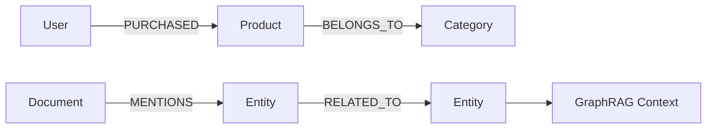

# 11. 图数据库：面向关系网络 / 知识图谱 / 路径分析的数据系统

::: tip 本章导读
理解节点、边、路径、多跳查询、知识图谱和 GraphRAG 在数据平台中的位置。
:::


## 本章阅读框架

| 阅读问题 | 本章回答方式 |
| --- | --- |
| 这个问题为什么出现？ | 从业务增长、数据规模、系统目标或 AI 应用压力切入。 |
| 它解决什么问题？ | 提炼为一个核心判断，避免把概念写成孤立定义。 |
| 它不解决什么问题？ | 在机制解释和常见误区中说明边界，防止工具崇拜。 |
| 它在真实平台哪里出现？ | 放回 PostgreSQL、数仓、批流、OLAP、湖仓、向量、图和治理的演化链路。 |
| 读完要会做什么？ | 通过场景案例和实战任务转成可练习的判断。 |



关系型数据库也能表达关系。

## 问题切入

但当问题重点从“记录本身”转向“记录之间的多跳关系、路径和网络结构”时，图数据库会更自然。

第 10 章讨论了向量数据库，它擅长根据语义相似性召回内容。但很多业务问题不是“哪个文本更相似”，而是“这些实体之间如何连接”：

```text
某个用户和欺诈团伙之间隔了几层关系？
一个供应商风险会影响哪些下游订单和客户？
一篇文档提到的实体与哪些政策、产品、负责人相关？
两个客户是否通过手机号、设备、地址或交易网络间接关联？
GraphRAG 中应该沿哪些实体关系扩展上下文？
```

这些问题如果只用关系型数据库表达，通常会变成多张表的递归 JOIN、复杂路径查询和难以维护的关系逻辑。图数据库出现的原因，就是让关系网络本身成为可以建模、查询和分析的对象。

## 核心判断

> 图数据库不是为了替代关系型数据库，而是为复杂关系、多跳查询和网络分析提供更直接的数据模型。

本章要建立的判断是：图数据库解决的是实体关系、路径、多跳查询和网络结构分析问题。它让“关系”不只是外键或 JOIN 条件，而是可以带方向、属性、权重、路径和算法的核心数据。

图数据库也不是所有关系问题的最佳解。简单主外键、事务写入、报表聚合和指标分析仍然更适合关系数据库、数仓和 OLAP。图数据库应该用于关系网络本身成为分析对象的场景。

## 机制解释

### 11.1 基础概念

图由节点和边组成。

Node / Vertex 表示实体。

Edge / Relationship 表示实体之间的关系。

Property 表示节点或边的属性。

Label 表示节点类别。

Path 表示从一个节点经过若干边到另一个节点的路径。

Graph 是整体关系网络。

在 Neo4j 的 Property Graph 模型中，节点表示实体，可以带一个或多个 label，也可以保存 key-value properties；relationship 连接两个节点，必须有起点、终点、方向和一个 type，也可以保存 properties。这个约束很重要：方向和类型不是图上的装饰，而是路径查询和语义解释的一部分。

例如：

```text
(User)-[:PURCHASED]->(Product)
(User)-[:VIEWED]->(Product)
(Company)-[:OWNS]->(Company)
(Document)-[:MENTIONS]->(Entity)
```

图模型的核心判断是：

> 当关系本身成为查询对象时，图比表更直接。

### 11.2 图数据模型

常见图模型包括 Property Graph 和 RDF Graph。

Property Graph 中，节点和边都可以有属性。

RDF Graph 用三元组表达：

```text
subject -> predicate -> object
```

知识图谱通常围绕实体、关系、属性、本体和 schema 构建。

Entity 是实体，例如用户、公司、产品、疾病、论文。

Relation 是实体之间的关系，例如购买、任职、投资、引用。

Ontology 是概念体系，定义实体类型、关系类型和约束。

图建模的关键不是把所有东西都画成点和线，而是明确：

```text
什么是节点？
什么是边？
边是否有方向？
边是否有权重？
哪些属性放节点？
哪些属性放边？
查询需要几跳？
```

### 11.3 查询语言

常见图查询语言包括：

- Cypher。
- Gremlin。
- SPARQL。
- GQL。
- openCypher。

Cypher 是 Neo4j 的声明式图查询语言，核心是 graph pattern matching。查询不是先指定遍历步骤，而是描述要匹配的节点、关系和路径模式。

Cypher 查询示例：

```cypher
MATCH (u:User)-[:PURCHASED]->(p:Product)
WHERE u.user_id = '501'
RETURN p.name;
```

多跳查询示例：

```cypher
MATCH (a:Company)-[:OWNS*1..3]->(b:Company)
WHERE a.name = 'A 公司'
RETURN b.name;
```

SQL 可以通过多表 JOIN 表达关系，但多跳路径查询会越来越复杂。

图查询更关注模式匹配、路径、邻居、连通性和子图。

### 11.4 图数据库产品

常见图数据库包括：

- Neo4j。
- NebulaGraph。
- JanusGraph。
- TigerGraph。
- ArangoDB。
- Amazon Neptune。
- HugeGraph。
- Memgraph。
- PostgreSQL + Apache AGE。

不同产品边界不同。

Neo4j 生态成熟，适合知识图谱、路径查询和应用开发。

NebulaGraph 更关注分布式大规模图。它的官方定位是开源、分布式、易扩展的原生图数据库，强调可以承载很大的顶点和边规模，并通过 shared-nothing、存算分离和多服务架构扩展集群能力。

理解 NebulaGraph 时，不要只把它看成“另一个 Cypher 数据库”。它的系统边界更接近大规模图服务：

| 组件 | 主要职责 | 设计含义 |
| --- | --- | --- |
| Meta Service | schema、集群管理、用户权限等元数据管理 | 图空间、Tag、Edge type、节点和权限需要被集中管理 |
| Graph Service | 查询接入和执行 | 负责接收查询、解析、计划和协调执行 |
| Storage Service | 图数据存储 | 负责持久化顶点、边和属性，并支撑分布式扩展 |

这种定位适合超大关系网络、风控团伙、社交关系、推荐关系和需要水平扩展的图服务。但它不自动解决图谱质量、本体设计、实体消歧、关系抽取、权限治理和 GraphRAG 答案评测。分布式图数据库解决的是大规模图存储和查询服务能力，不是知识图谱工程的全部。

JanusGraph 常结合外部存储和索引系统。

Amazon Neptune 支持图云服务。

Apache AGE 让 PostgreSQL 获得图查询扩展能力。

### 11.5 图算法

图数据库不只查询路径，也可以支持图算法。

常见算法包括：

- BFS。
- DFS。
- Shortest Path。
- PageRank。
- Community Detection。
- Connected Components。
- Centrality。
- Similarity。
- Graph Embedding。

这些算法解决的是网络结构问题。

例如：

- 最短路径用于供应链路径、关系链路、知识跳转。
- PageRank 衡量节点重要性。
- 社区发现识别关系群体。
- 连通分量发现团伙或孤立网络。
- Graph Embedding 把图结构转成向量，用于推荐或 GraphRAG。

### 11.6 知识图谱

知识图谱通常包括：

- 实体抽取。
- 关系抽取。
- 实体消歧。
- 实体对齐。
- 本体设计。
- 三元组构建。
- 图谱存储。
- 图谱推理。
- 图谱问答。
- GraphRAG。

知识图谱不是“把文本丢进图数据库”。

它需要先定义实体类型、关系类型和抽取规则，再把文档、业务表、日志和外部知识转成可查询图结构。

GraphRAG 把图结构引入 RAG，让检索不只依赖语义相似，也能沿实体关系扩展上下文。

### 11.7 图数据库在大数据体系中的位置

图数据库的数据可以来自：

- PostgreSQL 业务表。
- 数仓事实表和维度表。
- 日志和事件流。
- 文档解析结果。
- 实体抽取和关系抽取。

典型链路：

```text
PostgreSQL / 文档 / 日志
  -> 实体抽取
  -> 关系抽取
  -> 图数据库
  -> 路径查询 / 图算法 / GraphRAG
```

图数据库常与 Spark GraphX / GraphFrames 做离线图计算，与 Kafka / Flink 处理实时关系更新，与向量数据库结合做 GraphRAG。


### 深度展开：图数据库如何落到真实系统

本节补齐本章的工程细节。阅读时不要只记住概念名称，而要把它放回“输入是什么、处理路径是什么、输出给谁、边界在哪里、如何验证”的链路中。

#### 一、它从什么问题开始

有些问题关注的不是单行记录或聚合指标，而是实体之间的多跳关系、路径、网络结构和影响传播。

这个问题通常不会以技术名词出现，而是以业务现象出现：报表变慢、指标不一致、实时看板延迟、RAG 召回不稳定、数据无法追溯、项目 Demo 无法验收。能不能把现象还原成系统问题，是本书要训练的第一层能力。

#### 二、输入数据和前置判断

输入是实体、关系、关系类型、属性、来源、时间范围和置信度，例如用户、商品、账号、设备、文档实体和知识概念。

在动手之前，至少要确认四件事：

| 判断项 | 要回答的问题 |
| --- | --- |
| 数据粒度 | 一行代表什么事实，是用户、订单、订单明细、事件、文件、Chunk，还是一条关系？ |
| 时间边界 | 使用创建时间、更新时间、支付时间、事件时间，还是处理时间？ |
| 状态边界 | 哪些状态算有效，哪些测试、取消、退款、重复或迟到数据要排除？ |
| 责任边界 | 这个环节负责记录事实、生产指标、加速查询、治理质量，还是服务 AI 应用？ |

#### 三、处理路径

处理路径是抽取节点和边，建立属性图或 RDF 模型，使用路径匹配、邻居扩展、社区发现或图算法回答多跳问题。

这条路径应该能被写成可执行流程，而不是停留在术语解释。一个合格的设计至少要说明：数据从哪里来、经过哪些转换、写到哪里、谁消费、失败后如何重跑、结果如何校验。

#### 四、在真实平台中的位置

真实平台中 Neo4j、NebulaGraph 或图计算框架常与关系库、数仓和向量检索共存。GraphRAG 会把图上的实体关系和文档证据一起交给模型。

平台位置决定了它和前后系统的关系。不要孤立地问“这个技术好不好”，而要问：

- 它继承了上一层什么问题？
- 它把什么复杂度转移给了下一层？
- 它的输出是否能被复用、追溯和治理？
- 它是否改变了数据粒度、延迟、一致性或权限边界？

#### 五、边界和失败模式

图数据库不替代关系数据库和数仓。它适合关系网络和路径问题，不适合所有高频交易写入、常规指标聚合和宽表 BI。

常见失败信号可以这样检查：

| 失败信号 | 应该追问什么 |
| --- | --- |
| 问题需要沿关系多跳追踪 | 定位到具体输入、口径、链路、边界或治理责任。 |
| JOIN 层数越来越深且语义难读 | 定位到具体输入、口径、链路、边界或治理责任。 |
| 需要解释实体之间为什么相关 | 定位到具体输入、口径、链路、边界或治理责任。 |
| 需要把文档中的实体关系用于推理 | 定位到具体输入、口径、链路、边界或治理责任。 |

#### 六、可操作练习

从订单、用户、商品和文档实体中构建一个小型图谱，写出“用户购买过的商品所属类目影响了哪些相似用户”的路径查询。

练习完成后不要只看“有没有跑通”，还要补一份复盘：

- 输入数据是否足以支撑问题？
- 口径和边界是否写清楚？
- 结果能否被重复计算和对账？
- 如果数据量扩大 10 倍，瓶颈会出现在哪里？
- 如果接入下游 BI、RAG 或治理系统，还缺哪些元数据？


## 系统位置

### 图模型设计清单

图数据库的难点不是把数据导入节点和边，而是让关系语义稳定。一个图模型至少要回答：

| 设计项 | 必须说明 | 失败后果 |
| --- | --- | --- |
| 实体身份 | 用户、商品、指标、文档、组织如何生成稳定 ID | 同一个实体被拆成多个节点，路径结果不可信 |
| 关系方向 | `User -> PLACED -> Order` 还是反向 | 查询语义混乱，多跳路径难以解释 |
| 关系属性 | 时间、来源、置信度、版本、权重是否记录在边上 | 只能知道“有关”，不知道为什么有关 |
| 路径边界 | 最多查几跳，允许哪些关系类型参与 | 多跳查询返回噪声路径或性能失控 |
| 图谱版本 | 实体抽取、关系抽取、人工修正如何记录版本 | GraphRAG 答案无法复现 |
| 权限继承 | 文档、实体、关系的权限如何传递 | 用户通过图路径看到无权访问的内容 |

以 GraphRAG 为例，不能只保存“文档 A 提到实体 B”。更可靠的结构是：

```text
Document(doc_id, source_uri, version, visibility)
Chunk(chunk_id, doc_id, position, text_hash)
Entity(entity_id, type, normalized_name)
Relation(subject_id, predicate, object_id, source_chunk_id, confidence, graph_version)
```

回答问题时，系统先用向量召回相关 Chunk，再用图查询扩展实体关系，最后把来源 Chunk、路径和置信度一起交给模型。这样图数据库解决的是“关系可追踪”和“多跳上下文组织”，不是替代文档权限、事实校验或最终答案评测。

图数据库是 AI 数据基础设施和数据平台中的关系网络层。

```text
PostgreSQL 业务表 / 数仓事实表 / 文档 / 日志
  -> 实体抽取 / 关系抽取 / ID 对齐
  -> Graph DB
  -> 路径查询 / 图算法 / 知识图谱 / GraphRAG
```

它和前后系统的关系很明确：

- PostgreSQL 和数仓提供结构化事实来源。
- 文档解析和信息抽取提供非结构化实体关系。
- 向量数据库提供语义相似召回。
- 图数据库提供显式关系扩展和路径约束。
- 数据治理负责实体口径、关系质量、权限和血缘。

图数据库引出第 12 章湖仓：结构化表、文档、图谱、向量和日志都会产生大量原始数据和中间产物，需要一个开放、低成本、可被多引擎访问的数据底座。

## 场景案例

以企业知识库 GraphRAG 为例，向量检索可以找到和问题相似的段落，但它未必知道这些段落中提到的实体之间是什么关系。

可以构建一张知识图谱：

```text
(Document)-[:MENTIONS]->(Policy)
(Policy)-[:APPLIES_TO]->(Department)
(Policy)-[:OWNED_BY]->(Person)
(Product)-[:HAS_RISK]->(Risk)
(Risk)-[:MITIGATED_BY]->(Policy)
```

具体数据示例：

```cypher
// 节点
CREATE (p1:Product {name: '支付网关', version: '3.2'});
CREATE (r1:Risk {name: 'SQL 注入风险', level: 'high'});
CREATE (r2:Risk {name: '数据泄露风险', level: 'high'});
CREATE (pol1:Policy {name: '安全开发规范', doc_id: 'SEC-001'});
CREATE (pol2:Policy {name: '数据保护制度', doc_id: 'DP-003'});
CREATE (per1:Person {name: '张工', role: '安全负责人'});
CREATE (dept1:Department {name: '支付事业部'});

// 边关系
CREATE (p1)-[:HAS_RISK]->(r1);
CREATE (p1)-[:HAS_RISK]->(r2);
CREATE (r1)-[:MITIGATED_BY]->(pol1);
CREATE (r2)-[:MITIGATED_BY]->(pol2);
CREATE (pol1)-[:OWNED_BY]->(per1);
CREATE (pol1)-[:APPLIES_TO]->(dept1);
CREATE (pol2)-[:OWNED_BY]->(per1);
```

当用户问”这个产品上线前需要遵守哪些安全要求？”时，系统可以：

```text
1. 用向量检索召回相关产品文档。
2. 抽取产品、风险、政策、安全要求等实体。
3. 沿图关系查找 Product -> Risk -> Policy -> Owner。
4. 把相关政策、负责人、适用部门和原文片段组装进上下文。
5. 让 LLM 生成带来源的回答。
```

例如，用 Cypher 查询”支付网关相关的所有安全政策和负责人”：

```cypher
MATCH (p:Product {name: '支付网关'})-[:HAS_RISK]->(r:Risk)
      -[:MITIGATED_BY]->(pol:Policy)
      -[:OWNED_BY]->(person:Person)
RETURN r.name AS risk, r.level AS level,
       pol.name AS policy, pol.doc_id AS doc_id,
       person.name AS owner;
```

预期结果：

```text
| risk           | level | policy         | doc_id  | owner |
|----------------|-------|----------------|---------|-------|
| SQL 注入风险    | high  | 安全开发规范    | SEC-001 | 张工  |
| 数据泄露风险    | high  | 数据保护制度    | DP-003  | 张工  |
```

这个查询只用了两跳（Product -> Risk -> Policy -> Person），就已经把产品面临的风险、对应的政策和负责人全部串联起来。如果只用 SQL，同样的查询需要多张表的递归 JOIN，而且路径长度不固定时会更复杂。

这个案例体现图数据库的价值：它不是替代向量检索，而是把“相似内容”扩展成“有关系约束的上下文网络”。

## 常见误区

**误区一：图数据库比关系型数据库更适合所有关系。**

简单外键关系和事务查询，关系型数据库更直接。图数据库适合多跳、路径和网络结构问题。

**误区二：知识图谱就是图数据库。**

图数据库是存储和查询系统，知识图谱还包括本体、抽取、消歧、对齐、质量和应用。

**误区三：把表直接转成节点和边就是图建模。**

图建模要围绕查询问题决定节点、边和属性，不是机械转换。

**误区四：图数据库上了以后就自动有知识图谱。**

知识图谱还需要实体抽取、关系抽取、本体设计、消歧、对齐、质量评估和应用闭环。图数据库只是存储和查询层。

**误区五：GraphRAG 可以只靠图，不需要向量。**

图关系适合显式路径和实体扩展，向量检索适合语义召回。高质量 GraphRAG 通常需要两者协同。

## 实战任务

设计一个电商关系图：

```text
User
Product
Order
Category
Brand
```

关系包括：

```text
User PURCHASED Product
Product BELONGS_TO Category
Product HAS_BRAND Brand
User VIEWED Product
User SIMILAR_TO User
```

要求：

- 定义节点属性。
- 定义边属性。
- 写出 3 个路径查询问题。
- 判断哪些数据来自 PostgreSQL，哪些来自事件日志。
- 说明这个图如何服务推荐或 GraphRAG。

补充要求：

- 写出一个 2 跳查询、一个 3 跳查询和一个最短路径查询。
- 说明 `Order` 是否应该作为节点，还是只作为 `PURCHASED` 边上的属性。
- 设计一个实体去重规则，例如同一用户多个设备、手机号或邮箱如何对齐。
- 说明哪些图数据可以离线批量构建，哪些关系需要实时更新。
- 说明图谱结果如何与向量检索结果合并进入 GraphRAG 上下文。

## 小结引出下一章

图数据库让关系网络成为一等查询对象。

它适合多跳关系、路径分析、知识图谱、风控、推荐和 GraphRAG。

下一章进入数据湖与湖仓。

因为结构化表、日志、文档、向量和图谱背后，都需要一个能长期存储、组织和被多引擎访问的数据底座。
