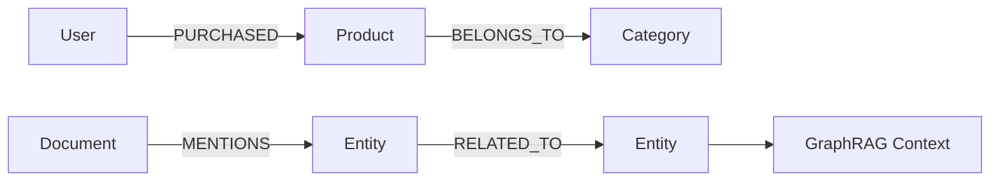

# 11. 图数据库：面向关系网络 / 知识图谱 / 路径分析的数据系统

::: tip 本章导读
理解节点、边、路径、多跳查询、知识图谱和 GraphRAG 在数据平台中的位置。
:::
::: info 本章验收问题
- 你能否判断一个问题为什么更适合图数据库而不是关系库或向量库？
- 你能否说明 GraphRAG 的路径扩展为什么必须受权限和来源约束？
:::




关系型数据库也能表达关系。

## 问题切入

但当问题重点从“记录本身”转向“记录之间的多跳关系、路径和网络结构”时，图数据库会更自然。

第 10 章讨论了向量数据库，它擅长根据语义相似性召回内容。但很多业务问题不是“哪个文本更相似”，而是“这些实体之间如何连接”：

```text
某个用户和欺诈团伙之间隔了几层关系？
一个供应商风险会影响哪些下游订单和客户？
一篇文档提到的实体与哪些政策、产品、负责人相关？
两个客户是否通过手机号、设备、地址或交易网络间接关联？
GraphRAG 中应该沿哪些实体关系扩展上下文？
```

这些问题如果只用关系型数据库表达，通常会变成多张表的递归 JOIN、复杂路径查询和难以维护的关系逻辑。图数据库出现的原因，就是让关系网络本身成为可以建模、查询和分析的对象。

## 核心判断

> 图数据库不是为了替代关系型数据库，而是为复杂关系、多跳查询和网络分析提供更直接的数据模型。

关系数据库用外键和 JOIN 表达关系——够用，直到关系本身成了分析对象。社交网络的好友推荐、供应链的路径追溯、反欺诈的环路检测，这些场景图数据库有数量级的表达优势。这一章建立的是”什么时候图是正确答案”的判断，以及 Neo4j、NebulaGraph 的选型逻辑。

图数据库也不是所有关系问题的最佳解。简单主外键、事务写入、报表聚合和指标分析仍然更适合关系数据库、数仓和 OLAP。图数据库应该用于关系网络本身成为分析对象的场景。

## 机制解释

## 本章内容

| 节号 | 主题 |
|------|------|
| [11.1](/chapters/11/11-1) | 图数据库概述 |
| [11.2](/chapters/11/11-2) | 图数据模型 |
| [11.3](/chapters/11/11-3) | 图查询语言 |
| [11.4](/chapters/11/11-4) | Neo4j 实战 |
| [11.5](/chapters/11/11-5) | 图数据库架构 |
| [11.6](/chapters/11/11-6) | 图索引与优化 |
| [11.7](/chapters/11/11-7) | 图查询优化 |
| [11.8](/chapters/11/11-8) | GraphRAG |
| [11.9](/chapters/11/11-9) | 图分析应用 |
| [11.10](/chapters/11/11-10) | 图数据库选型 |
| [11.11](/chapters/11/11-11) | 知识图谱与本体建模 |
| [11.12](/chapters/11/11-12) | 图数据库常见问题 |


## 系统位置

### 图模型设计清单

图数据库的难点不是把数据导入节点和边，而是让关系语义稳定。一个图模型至少要回答：

| 设计项 | 必须说明 | 失败后果 |
| --- | --- | --- |
| 实体身份 | 用户、商品、指标、文档、组织如何生成稳定 ID | 同一个实体被拆成多个节点，路径结果不可信 |
| 关系方向 | `User -> PLACED -> Order` 还是反向 | 查询语义混乱，多跳路径难以解释 |
| 关系属性 | 时间、来源、置信度、版本、权重是否记录在边上 | 只能知道“有关”，不知道为什么有关 |
| 路径边界 | 最多查几跳，允许哪些关系类型参与 | 多跳查询返回噪声路径或性能失控 |
| 图谱版本 | 实体抽取、关系抽取、人工修正如何记录版本 | GraphRAG 答案无法复现 |
| 权限继承 | 文档、实体、关系的权限如何传递 | 用户通过图路径看到无权访问的内容 |

以 GraphRAG 为例，不能只保存“文档 A 提到实体 B”。更可靠的结构是：

```text
Document(doc_id, source_uri, version, visibility)
Chunk(chunk_id, doc_id, position, text_hash)
Entity(entity_id, type, normalized_name)
Relation(subject_id, predicate, object_id, source_chunk_id, confidence, graph_version)
```

回答问题时，系统先用向量召回相关 Chunk，再用图查询扩展实体关系，最后把来源 Chunk、路径和置信度一起交给模型。这样图数据库解决的是“关系可追踪”和“多跳上下文组织”，不是替代文档权限、事实校验或最终答案评测。

图数据库是 AI 数据基础设施和数据平台中的关系网络层。

```text
PostgreSQL 业务表 / 数仓事实表 / 文档 / 日志
  -> 实体抽取 / 关系抽取 / ID 对齐
  -> Graph DB
  -> 路径查询 / 图算法 / 知识图谱 / GraphRAG
```

它和前后系统的关系很明确：

- PostgreSQL 和数仓提供结构化事实来源。
- 文档解析和信息抽取提供非结构化实体关系。
- 向量数据库提供语义相似召回。
- 图数据库提供显式关系扩展和路径约束。
- 数据治理负责实体口径、关系质量、权限和血缘。

图数据库引出第 12 章湖仓：结构化表、文档、图谱、向量和日志都会产生大量原始数据和中间产物，需要一个开放、低成本、可被多引擎访问的数据底座。

## 场景案例

以企业知识库 GraphRAG 为例，向量检索可以找到和问题相似的段落，但它未必知道这些段落中提到的实体之间是什么关系。

可以构建一张知识图谱：

```text
(Document)-[:MENTIONS]->(Policy)
(Policy)-[:APPLIES_TO]->(Department)
(Policy)-[:OWNED_BY]->(Person)
(Product)-[:HAS_RISK]->(Risk)
(Risk)-[:MITIGATED_BY]->(Policy)
```

具体数据示例：

```cypher
// 在单个查询中创建节点和边关系（Cypher变量作用域限制在单个查询内）
CREATE (p1:Product {name: '支付网关', version: '3.2'})
  -[:HAS_RISK]->(r1:Risk {name: 'SQL 注入风险', level: 'high'})
  -[:MITIGATED_BY]->(pol1:Policy {name: '安全开发规范', doc_id: 'SEC-001'})
  -[:OWNED_BY]->(per1:Person {name: '张工', role: '安全负责人'}),
 (p1)-[:HAS_RISK]->(r2:Risk {name: '数据泄露风险', level: 'high'})
  -[:MITIGATED_BY]->(pol2:Policy {name: '数据保护制度', doc_id: 'DP-003'})
  -[:OWNED_BY]->(per1),
 (pol1)-[:APPLIES_TO]->(dept1:Department {name: '支付事业部'}),
 (pol2)-[:OWNED_BY]->(per1)
```

当用户问”这个产品上线前需要遵守哪些安全要求？”时，系统可以：

```text
1. 用向量检索召回相关产品文档。
2. 抽取产品、风险、政策、安全要求等实体。
3. 沿图关系查找 Product -> Risk -> Policy -> Owner。
4. 把相关政策、负责人、适用部门和原文片段组装进上下文。
5. 让 LLM 生成带来源的回答。
```

例如，用 Cypher 查询”支付网关相关的所有安全政策和负责人”：

```cypher
MATCH (p:Product {name: '支付网关'})-[:HAS_RISK]->(r:Risk)
      -[:MITIGATED_BY]->(pol:Policy)
      -[:OWNED_BY]->(person:Person)
RETURN r.name AS risk, r.level AS level,
       pol.name AS policy, pol.doc_id AS doc_id,
       person.name AS owner;
```

预期结果：

```text
| risk           | level | policy         | doc_id  | owner |
|----------------|-------|----------------|---------|-------|
| SQL 注入风险    | high  | 安全开发规范    | SEC-001 | 张工  |
| 数据泄露风险    | high  | 数据保护制度    | DP-003  | 张工  |
```

这个查询只用了三跳（Product -> Risk -> Policy -> Person），就已经把产品面临的风险、对应的政策和负责人全部串联起来。如果只用 SQL，同样的查询需要多张表的递归 JOIN，而且路径长度不固定时会更复杂。

这个案例体现图数据库的价值：它不是替代向量检索，而是把“相似内容”扩展成“有关系约束的上下文网络”。

## 工程层对比：图数据库选型

| 维度 | Neo4j | NebulaGraph | JanusGraph | Amazon Neptune | Apache AGE |
|------|-------|-------------|------------|----------------|------------|
| **定位** | 单机原生图数据库，生态最成熟 | 分布式大规模图数据库 | 存算分离，外挂存储+索引 | 云托管图服务 | PostgreSQL图查询扩展 |
| **数据规模** | 单机数十亿节点/边 | 万亿级边（分布式） | 十亿级（依赖HBase/Cassandra） | 数十亿（托管限制） | 随PG容量 |
| **查询语言** | Cypher（事实标准） | nGQL（兼容openCypher） | Gremlin | openCypher + Gremlin + SPARQL | openCypher |
| **部署方式** | Community免费/Aura托管/Enterprise自建 | 开源自建分布式 | 开源自建（需HBase+ES） | AWS托管 | PG内扩展，零额外运维 |
| **代价** | 单机瓶颈；分布式需付费Enterprise | 分布式运维复杂；3服务组件 | 外挂存储+索引双重运维 | AWS锁定；读写延迟受托管限制 | 无原生图存储优化；仅模式匹配 |
| **失效条件** | 超单机容量→需Enterprise集群 | 团队<5人难以运维3组件集群 | KV存储延迟传导到图查询 | 数据合规要求本地部署→不适合 | 大规模遍历→PG性能瓶颈 |
| **注意事项** | Community版无集群；索引创建后台执行不锁写 | Meta/Graph/Storage三服务需独立运维和扩缩容 | HBase/Cassandra运维是额外负担 | 只支持AWS；冷启动延迟 | 图查询和SQL混合需谨慎规划索引 |
| **推荐场景** | 知识图谱应用开发 + Cypher生态 + 单机够用 | 超大规模社交/风控图 + 需要水平扩展 | 已有HBase基础设施 + 需图查询 | AWS用户 + 不想运维 + 快速上线 | 已有PG + 只需轻量图查询 + 不想新增系统 |

## 故障清单：图数据库常见故障

| 类别 | 具体症状 | 检测方法 | 根因（引用本章机制） | 缓解措施 | 严重度 |
|------|---------|---------|---------------------|---------|--------|
| 图幻觉 | GraphRAG返回"供应商A→客户B→供应商C"的虚假关联链 | 用已知事实的三元组校验图查询结果，计算虚假路径比例 | 实体消歧失败——两个同名不同实体被合并为一个节点，导致虚假路径（11.6节知识图谱消歧机制） | 加强实体消歧规则（按ID对齐而非名称）；在边上记录置信度和来源Chunk | 高 |
| 遍历爆炸 | 3跳查询返回百万级路径，延迟>30秒 | 监控多跳查询的路径数量和延迟曲线 | 节点度数过高（超级节点）——热门用户有数万好友，每跳扩展数量级增长（11.3节遍历机制） | 设定路径深度上限；过滤低置信度边；对超级节点做分页或限制每跳扩展数 | 高 |
| 图-业务数据不一致 | PG中订单已取消，图中PURCHASED边仍存在 | 定期对比PG订单状态和图中边的时间戳，统计不一致比例 | CDC同步延迟或缺失——图数据库不保证和业务库实时一致（11.7节系统位置） | 加CDC同步链路；在边上记录valid_until时间；查询时检查业务库最新状态 | 中 |
| 权限路径泄露 | 用户沿图路径看到了无权访问的部门内部文档实体 | 用无权限账号做3跳遍历测试，检查是否到达受限节点 | 图权限继承——从可见节点沿边可达不可见节点，图数据库未做路径级权限过滤（11.1节权限边界） | 在节点上记录visibility字段；查询时在每个跳步检查目标节点权限；对敏感边做访问控制 | 严重 |

## 常见误区

**误区一：图数据库比关系型数据库更适合所有关系。**

简单外键关系和事务查询，关系型数据库更直接。图数据库适合多跳、路径和网络结构问题。

**误区二：知识图谱就是图数据库。**

图数据库是存储和查询系统，知识图谱还包括本体、抽取、消歧、对齐、质量和应用。

**误区三：把表直接转成节点和边就是图建模。**

图建模要围绕查询问题决定节点、边和属性，不是机械转换。

**误区四：图数据库上了以后就自动有知识图谱。**

知识图谱还需要实体抽取、关系抽取、本体设计、消歧、对齐、质量评估和应用闭环。图数据库只是存储和查询层。

**误区五：GraphRAG 可以只靠图，不需要向量。**

图关系适合显式路径和实体扩展，向量检索适合语义召回。高质量 GraphRAG 通常需要两者协同。

## 实战任务

设计一个电商关系图：

```text
User
Product
Order
Category
Brand
```

关系包括：

```text
User PURCHASED Product
Product BELONGS_TO Category
Product HAS_BRAND Brand
User VIEWED Product
User SIMILAR_TO User
```

要求：

- 定义节点属性。
- 定义边属性。
- 写出 3 个路径查询问题。
- 判断哪些数据来自 PostgreSQL，哪些来自事件日志。
- 说明这个图如何服务推荐或 GraphRAG。

补充要求：

- 写出一个 2 跳查询、一个 3 跳查询和一个最短路径查询。
- 说明 `Order` 是否应该作为节点，还是只作为 `PURCHASED` 边上的属性。
- 设计一个实体去重规则，例如同一用户多个设备、手机号或邮箱如何对齐。
- 说明哪些图数据可以离线批量构建，哪些关系需要实时更新。
- 说明图谱结果如何与向量检索结果合并进入 GraphRAG 上下文。

## 小结引出下一章

图数据库让关系网络成为一等查询对象。

它适合多跳关系、路径分析、知识图谱、风控、推荐和 GraphRAG。

**纵向主线桥段：**

> **数据组织线回溯**：Ch5的事实/维度组织→Ch10的向量组织→本章的图组织。图结构用节点和边表示实体和关系，是继行列、向量之后第三种数据组织形态——从"相似"到"关联"。
> **数据组织线推进**：图组织让关系网络成为可查询的一等对象，但图、向量、表、文档都需要统一的存储底座来长期管理和多引擎访问。
> **数据组织线未解之问**：如何在开放存储上统一管理所有数据形态？→下一章的表格式组织。

> **检索线回溯**：Ch2的SQL过滤→Ch3的索引加速→Ch10的ANN近似检索→本章的图遍历。图遍历是"检索"在关系网络上的延伸——从检索相似内容到检索关联路径。
> **检索线推进**：向量检索解决"语义相似"的检索问题，图遍历解决"实体关联"的检索问题——两者在GraphRAG中协同，但还有第三类检索：对原始数据的全量扫描和交互式查询。
> **检索线未解之问**：多引擎如何共享同一批数据做不同类型的检索？→下一章湖仓的多引擎查询。

> **一致性线回溯**：Ch9的OLAP数据新鲜度→Ch10的Embedding版本一致性→本章的图数据一致性。图和业务库之间的同步是新的一致性挑战——CDC延迟会导致图查询返回过时路径。
> **一致性线推进**：图数据一致性要求图与源系统的同步机制，但跨引擎的一致性保证是更大的挑战——多个计算引擎访问同一批数据需要快照级别的隔离。
> **一致性线未解之问**：如何保证多引擎并发读写的一致性？→下一章的湖仓快照隔离。

> **建模线回溯**：Ch10的分块+Embedding建模→本章的本体建模。本体定义了实体类型、关系类型和约束，是知识图谱的schema——从"如何把文本变成向量"到"如何定义实体之间的关系类型"。
> **建模线推进**：本体建模让数据有了语义层面的组织约束，但开放数据底座上的数据组织方式（分区、排序、演化）是另一种建模决策。
> **建模线未解之问**：如何在对象存储上为多引擎数据建立可演化的建模框架？→下一章的湖仓建模。

> **故障与边界线回溯**：Ch10的召回噪声→本章的图幻觉。图数据库引入了新的故障形态——遍历可能返回不存在的关联路径，这是ANN近似性的图版本：不保证路径的真实性。
> **故障与边界线推进**：图幻觉、遍历爆炸、权限路径泄露是图查询特有的边界问题。多跳遍历的复杂度增长远超线性，是图系统的核心边界约束。
> **故障与边界线未解之问**：多引擎并发访问同一批数据会引入什么新故障？→下一章的多引擎冲突。

下一章进入数据湖与湖仓。

因为结构化表、日志、文档、向量和图谱背后，都需要一个能长期存储、组织和被多引擎访问的数据底座——湖仓就是这个底座。
