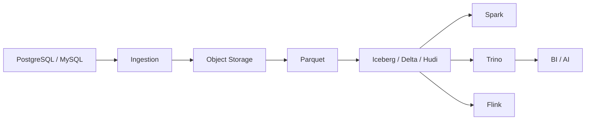

# 12. 数据湖与湖仓架构

::: tip 本章导读
用对象存储、文件格式、表格式、Catalog 和多引擎查询构建开放分析底座。
:::
::: info 本章验收问题
- 你能否解释对象存储、Parquet、表格式和 Catalog 的责任分工？
- 你能否说明湖仓为什么仍然需要建模、质量和治理，而不只是开放格式？
:::




数据湖解决低成本和灵活存储。

数仓解决高质量建模和稳定分析。

## 问题切入

湖仓试图统一两者：在开放存储上获得表管理、事务、元数据、演化和多引擎分析能力。

前面的章节已经出现了很多数据形态：PostgreSQL 业务表、数仓事实表、Kafka 事件、Parquet 文件、OLAP 宽表、RAG 文档、向量、图谱和评测日志。它们不可能全部只放在一个业务库或一个 OLAP 数据库里。

团队很快会遇到这些问题：

```text
历史明细太多，放在业务库成本和风险都太高。
日志、文档、图片、模型输入输出不是传统数仓表。
Spark、Flink、Trino、DuckDB 都希望访问同一批数据。
文件在对象存储里越来越多，但不知道哪份是最新、可用、可信版本。
schema 变化后，下游任务不知道该如何兼容。
AI 应用需要同时访问原文、分块、向量、图谱和评测数据。
```

数据湖出现是为了承载开放、多样、低成本的数据存储；湖仓出现是为了避免数据湖失控成“数据沼泽”。

## 核心判断

> 湖仓的关键不是“湖 + 仓”的口号，而是用表格式把对象存储中的文件组织成可管理、可查询、可演化的数据表。

对象存储上的 Parquet 文件堆积如山，谁来管理？湖仓用 Iceberg、Delta Lake、Hudi 这些表格式把文件变成表——支持 ACID、时间旅行、Schema 演化、多引擎访问。这一章讲的是数据湖从"文件堆"演进到"开放数据底座"的关键一跃，以及为什么这个跃迁在 2020 年代才真正可行。

湖仓也不是万能替代品。它不能自动完成业务建模，不能替代 OLAP 数据库的高并发低延迟服务能力，不能省掉质量、权限、血缘和指标治理。它提供的是长期开放数据底座。

## 机制解释

### 12.1 湖仓概述

一个电商平台的订单数据存放在 PostgreSQL 里，每天新增几十万条。业务团队要查实时 GMV，数据团队要做月度对账，AI 团队要拿历史订单训练推荐模型。三方各拉各的数据——PostgreSQL 扛不住分析查询的扫描压力，Hadoop 集群里的文件缺乏版本管理导致对账口径不一致，模型训练用的是三个月前导出的 CSV 已经严重过期。这不是一个"用什么工具"的问题，而是数据在对象存储上堆积如山却无人管理的问题。

**核心判断：湖仓不是数据湖的升级版，而是表格式 + Catalog + 多引擎三位一体的数据组织方式。**

数据湖解决的是低成本存储——把 CSV、JSON、Parquet、日志、图片全部扔进 S3/OSS，什么格式都能放，什么引擎都能读。但"什么都能放"不等于"什么都能管"。缺乏表格式和元数据管理的数据湖，文件命名混乱、目录含义不清、schema 不可追踪、质量不可验证——最终变成数据沼泽。湖仓的出现不是为了在"湖"上面加一个"仓"的标签，而是用 Iceberg/Delta/Hudi 这样的表格式，把对象存储上的 Parquet 文件组织成具备快照、事务、演化和多引擎访问能力的表。

三位一体缺任何一位都会失效：没有表格式，对象存储上的文件只是文件堆——Parquet 不等于表，文件格式解决物理存储但不解决快照、并发、事务和 schema 演化；没有 Catalog，Spark 和 Trino 找不到同一张表的定义，多引擎查询就退化成各自猜测文件布局；没有多引擎协作能力，湖仓就只是一个只能用单一引擎访问的封闭存储，开放性无从谈起。

从系统演进来看，第 11 章的图数据一致性解决的是节点和边的事务与查询，湖仓的快照隔离解决的是对象存储上 Parquet 文件的原子提交与时间旅行——两者都在处理"分布式数据的一致性可见性"，但层级不同：图数据库在记录层，湖仓在文件-元数据层。第 7-9 章的批处理、流处理和 OLAP 分别解决计算问题，湖仓解决的是这些计算引擎共同依赖的存储底座的组织问题——不是替代批处理或 OLAP，而是让批处理产物、实时流增量、OLAP 宽表都能以统一表格式沉淀在开放存储上。

湖仓也不等于万能替代品。它不自动解决数据质量问题——脏数据写入湖仓后只是被快照保护了版本，质量仍然需要校验规则和治理流程。它不能替代 ClickHouse/Doris 的高并发低延迟 BI 服务——Trino 查询 Iceberg 表的交互式延迟在秒级，而业务看板需要毫秒级响应。它不能省掉数仓建模——事实表、维度表、指标口径和分层设计仍然是必需的，湖仓只是让这些模型可以建立在开放存储而非封闭引擎上。

代价是什么？湖仓引入了表格式和 Catalog 两层额外复杂度——元数据文件需要维护，快照需要定期清理，小文件需要 compaction，Catalog 需要独立部署和权限管理。这些运维成本不是可选的：一个没有 compaction 和快照清理的 Iceberg 表，三个月后元数据文件数量会超过数据文件数量，查询计划阶段就要扫描数万个 manifest，延迟从毫秒退化到分钟级。

场景关键词在本章贯穿使用：订单数据从 PostgreSQL CDC 进入对象存储，Parquet 文件通过 Iceberg 表格式组织成表，Catalog 让多引擎找到一致定义，Trino 做 GMV 交互查询，Flink 增量写入最新订单，Spark 做月度汇总——这是湖仓解决的真实问题链条，而不是"便宜存储 + 贵分析"的简化叙事。

### 12.2 数据湖到湖仓演化

2010 年代初，Hadoop 集群是数据湖的代名词——HDFS 承载海量数据，MapReduce/Spark 做批量计算，Hive 用 SQL 查询。这个架构解决了一个真实问题：业务库里的历史明细数据太多， PostgreSQL 承载不了五年订单的扫描分析，全部导出后需要一个低成本的大存储。HDFS 做到了这一点：CSV、JSON、Avro、日志文件全部放进去，存储成本远低于传统数仓。

但 HDFS 数据湖有三个结构性缺陷，不是调优可以消除的。第一，HDFS 本身是分布式文件系统而非对象存储，集群扩缩容复杂，NameNode 是单点瓶颈，三层副本的存储成本是对象存储的三倍。第二，Hive 表的元数据绑定在 Hive Metastore 上，schema 变更后下游 Spark 任务经常因为列不匹配而失败，分区一旦设定就无法演化——订单表按月分区上线后发现需要按日分区，只能重建整张表。第三，没有事务能力——一个 Spark 任务写入一半失败后，下游读到的是半成品数据，没有回滚机制。

对象存储（S3/OSS/MinIO）的普及是第一个转折点。S3 提供 11 个 9 的持久性、按需付费、无限容量，不再需要运维 HDFS 集群。但对象存储是纯粹的文件存储——它不理解"表"，不理解"事务"，不理解"schema"。把 Parquet 文件扔进 S3 后，谁来管理这批文件属于哪张表、哪个版本、哪个分区？

**核心判断：数据湖到湖仓的演化不是存储升级，而是用表格式在对象存储上重建表级管理能力。**

演化路径可以这样理解：

```text
第一阶段（数据湖原始态）
  S3 上堆满 CSV/JSON/Parquet 文件
  -> 没有表定义，没有版本，没有 schema
  -> 下游不知道哪份是最新、可用、可信版本

第二阶段（Hive Metastore + Parquet）
  Hive Metastore 管理表元数据
  -> 有了"表"的概念，但元数据和数据文件是松耦合
  -> Hive 分区一旦设定无法演化，没有事务和快照

第三阶段（湖仓 = 对象存储 + 表格式 + Catalog + 多引擎）
  Iceberg/Delta/Hudi 在 Parquet 文件之上建立元数据层
  -> 快照、ACID、schema 演化、分区演化、时间旅行
  -> Catalog 让 Spark/Flink/Trino/DuckDB 看到同一张表
  -> 数据从"文件堆"变成"可管理、可演化、可多引擎查询的表"
```

Hive Metastore 不等于湖仓的 Catalog。Hive Metastore 只管理表名和分区位置，不管理快照版本——写入失败后 Metastore 里的分区指针已经指向半成品数据，下游查询直接报错或返回不完整结果。Iceberg 的 Catalog 不仅存储表名，还存储当前快照的元数据文件指针——每次提交形成新快照，失败写入不会更新 Catalog 指针，下游永远读到上一个完整快照。这是从"松耦合元数据"到"原子提交 + 快照隔离"的根本变化，不是命名上的差异。

从系统位置看演化：第 7 章批处理产出的 Parquet 文件，第 8 章流处理的增量数据，第 9 章 OLAP 的宽表——这三类数据以前分别落在 HDFS、Kafka 到 HDFS 的落地目录和数仓中，各管各的。湖仓把它们统一到对象存储 + 表格式的框架下——批处理产物写入 Iceberg 的历史分区，流处理增量写入 Iceberg 的最新分区，OLAP 宽表从 Iceberg 表构建后可以同步到 ClickHouse 服务层。湖仓不替代 OLAP，但让 OLAP 的数据来源从"数仓导出"变成"湖仓开放表"，数据可追溯、可审计。

代价和边界：湖仓引入的表格式层增加了元数据管理复杂度——Iceberg 的每次提交生成 manifest 文件和 manifest list，高频写入场景下元数据文件增长速度快于数据文件。没有 compaction 和快照清理的湖仓表会在 3-6 个月内出现"元数据膨胀"——查询引擎在计划阶段就要扫描数万个 manifest 文件，延迟从秒级退化到分钟级。这不是性能调优问题，而是运维流程缺失——compaction 和快照清理必须是常态化运维动作，不是可选的优化步骤。

演化方向不是"数据湖越来越好"，而是"数据组织方式从文件堆变为表管理"。湖仓 ≠ 格式枚举——不是在 S3 上选 Parquet 还是 ORC，而是在文件之上建元数据层、快照机制和演化能力。

### 12.3 对象存储与 Parquet

对象存储是湖仓的物理存储层，Parquet 是湖仓的列式文件格式——这两个是湖仓的基础设施，但都不是湖仓本身。一个常见误区是"有了 S3 + Parquet 就有了湖仓"，这就像说"有了磁盘 + CSV 就有了数据库"——存储和格式只解决数据存在哪里、以什么形态存在，不解决表级管理、事务、演化和多引擎查询。

**对象存储的特性与限制。** S3/OSS/MinIO 提供的是近乎无限容量、按需付费、高持久性的文件存储。对湖仓来说，对象存储的关键特性有三：第一，廉价——S3 标准存储每 GB 月费约 $0.023，远低于 HDFS 三副本的成本；第二，弹性——不需要运维集群扩缩容，存储容量随数据自动增长；第三，多引擎访问——Spark、Flink、Trino、DuckDB 都有 S3 兼容的连接器，同一份文件可以被多个计算引擎读取。

但对象存储有三个结构性限制，湖仓的表格式层正是为了弥补这些限制而出现的。第一，对象存储没有目录事务——S3 的 PUT 操作是原子性的，但多文件的 PUT 不是原子性的。一个 Spark 任务要写入 100 个 Parquet 文件，如果第 50 个文件写入时任务失败，S3 上已经有了 49 个文件，下游读到的是不完整数据——对象存储本身不提供"100 个文件要么全写要么全不写"的事务保证。第二，对象存储没有版本管理——同一路径的文件覆盖后旧版本消失（除非启用 S3 版本控制功能，但那是对象存储层面的版本，不是表级别的快照）。第三，对象存储没有元数据索引——列出某个前缀下的所有文件需要逐个扫描，百万文件级别的 LIST 操作延迟在秒到分钟级。

**Parquet 的机制与边界。** Parquet 是列式存储格式，每个文件内部按列组（Row Group）组织数据，每列独立存储和压缩。对订单明细表来说，如果查询只需要 order_id 和 amount 两列，Parquet 可以只读取这两列的数据页，跳过其他列——这就是列裁剪（Column Projection），可以减少 80-90% 的 I/O。Parquet 还在文件尾部存储每列的统计信息（min/max/null_count），查询引擎可以利用这些统计信息跳过不满足谓词条件的 Row Group——这就是谓词下推（Predicate Pushdown），对"WHERE paid_at BETWEEN '2024-01-01' AND '2024-01-31'"这样的查询，引擎可以只扫描 paid_at min/max 落在这个范围内的 Row Group。

但 Parquet 也有边界。第一，Parquet 是文件格式不是表格式——它不解决快照、并发写入、schema 演化和分区演化。一个 Parquet 文件一旦写入就不可修改（Parquet 不支持 inplace update），更新数据只能写新文件。第二，Parquet 文件粒度的统计信息不够——min/max 只在文件级别和 Row Group 级别，没有分区级别和表级别的统计信息。Iceberg 的 manifest 文件在 Parquet 文件之上增加了文件级统计信息索引，这是查询加速的关键差异。第三，Parquet 不管理文件之间的关系——哪些文件属于同一个分区、同一个快照、同一个表的同一个版本？Parquet 自己不回答这些问题，表格式才回答。

**核心判断：对象存储 + Parquet 解决的是"数据物理存在"，湖仓的表格式解决的是"数据逻辑组织"。两者不等于可以互相替代。**

从系统连接看，第 7 章批处理的输出产物是 Parquet 文件——Spark 将订单明细从 PostgreSQL 读取后写入 S3 上的 Parquet 文件。如果只有这一步，下游 Trino 查询这些文件时需要手动指定路径和格式，schema 变化后所有下游查询都要改。Iceberg 表格式在 Parquet 文件之上增加了元数据层——manifest 文件记录每个 Parquet 文件的列统计、分区值和行数，manifest list 记录每次提交的所有 manifest 和快照 ID，Catalog 孰储当前快照指针。查询引擎不再需要猜测文件路径和 schema——直接从 Catalog 读取当前快照，从 manifest list 获取 manifest，从 manifest 获取数据文件路径和统计信息，整条链路可追溯、可审计。

代价：对象存储的廉价不代表免费——没有 lifecycle policy 的 S3 存储会随时间累积成本，半年前的过期快照数据文件如果不清理，存储成本可能翻倍。Parquet 文件的目标大小应该在 256MB-512MB——过小的文件（<10MB）会导致查询引擎在计划阶段扫描大量文件元数据，过大的文件（>1GB）会导致单个任务的读取时间过长。小文件问题不是 Parquet 本身的 bug，而是写入频率和文件大小的管理问题——高频 CDC 流式写入每分钟产生几 KB 的小文件，必须通过 compaction 合理合并。

### 12.4 表格式（Iceberg / Delta Lake / Hudi）

Parquet 文件解决了数据如何物理存储，但没有回答"这些文件属于哪张表、哪个版本、哪个分区、哪个快照"。一个电商平台的订单数据 CDC 进 S3 后，每天产生数百个 Parquet 文件——一周后 S3 上有数千个文件，Trino 查询时需要手动猜测路径和 schema，Spark 任务不知道应该读哪些文件才是最新完整版本。这不是 Parquet 的问题——Parquet 从不承诺解决表级管理。这是数据组织的问题。

**核心判断：表格式不是文件格式的升级版，而是在对象存储文件之上重建元数据层、快照机制和演化能力。湖仓 ≠ 格式枚举，表格式的选择决定了湖仓的事务模型、演化策略和引擎兼容性。**

三种表格式的核心机制差异决定了它们的适用场景，这不是"同一个功能换个名字"：

**Iceberg 的核心机制是快照 + manifest 元数据树。** 每次写入提交形成一个新的快照（snapshot），每个快照指向一个 manifest list，每个 manifest list 包含多个 manifest 文件，每个 manifest 文件记录一组数据文件（Parquet）的路径、分区值、列统计信息（min/max/null_count/record_count）和文件大小。这棵元数据树使得查询引擎在计划阶段可以逐层过滤——先从 manifest list 找到相关 manifest，再从 manifest 的统计信息跳过不满足条件的文件，最后只读取目标 Row Group。这种分层元数据结构是 Iceberg 查询加速的关键机制，不是"Parquet 文件 + 一个索引"的简单叠加。Iceberg 的快照隔离基于元数据指针切换——提交成功后 Catalog 指针从旧快照切换到新快照，这个切换是原子性的。下游查询引擎读到的是完整的快照，不会看到写入过程中的半成品数据。

**Delta Lake 的核心机制是事务日志（_delta_log）。** 每次提交生成一个 JSON 格式的日志文件（00000001.json、00000002.json...），记录本次提交新增和删除的文件列表、schema 变更和分区信息。查询引擎读取事务日志后重建当前表状态——合并所有日志条目得到文件列表和 schema。Delta Lake 的 ACID 事务基于日志的原子提交——写入完成后日志文件才可见，读取引擎只读已提交的日志。Delta Lake 与 Spark 的绑定最深——很多高级特性（如 MERGE INTO、Change Data Feed）在 Spark 生态内表现最稳定，在 Trino 或 Flink 的 Delta 连接器上功能覆盖可能有差异。

**Hudi 的核心机制是 Timeline + 文件布局（CoW/MoR）。** Hudi 的 Timeline 按时间顺序记录所有操作（commit、compaction、clean），每个 instant 有状态（requested/in-progress/completed）。文件布局区分 Copy-on-Write（CoW）和 Merge-on-Read（MoR）——CoW 每次更新重写整个文件，写入慢但查询快；MoR 更新写入增量日志文件（log file），查询时合并基础文件和增量日志，写入快但查询需要额外合并开销。Hudi 的核心定位是 CDC/Upsert 场景——它最早解决的是"Kafka CDC 数据如何高效 upsert 到 HDFS/S3 上"，增量查询（Incremental Query）是 Hudi 的独特能力。

**选择判断不是"哪个更先进"，而是"场景匹配什么机制"。**

| 维度 | Iceberg | Delta Lake | Hudi |
| --- | --- | --- | --- |
| 事务机制 | 快照 + 元数据树指针原子切换 | 事务日志原子提交 | Timeline 状态管理 + CoW/MoR |
| 元数据结构 | 分层 manifest 树（快照→manifest list→manifest→数据文件） | 事务日志合并重建 | Timeline + 文件布局元数据 |
| 多引擎兼容 | 开放设计，Spark/Flink/Trino/DuckDB 连接器成熟 | Spark 绑定最深，其他引擎连接器功能有差异 | Spark 为主，Flink 连接器较成熟 |
| 写入模式 | 主要追加，upsert 通过 MERGE INTO 支持 | 追加 + MERGE INTO（CDF 是增量读取功能，不是写入模式） | CoW 追加重写 / MoR 增量日志 |
| 增量读取 | 增量快照（从快照 A 到快照 B 的变更文件） | Change Data Feed | Incremental Query（Timeline instant 范围） |
| schema/分区演化 | 分区演化无需重写数据（隐藏分区） | 分区演化需要重写或迁移 | 分区演化支持但更复杂 |

**边界与代价。** "表格式支持 ACID"不等于"湖仓拥有业务数据库级别的事务系统"。表格式的 ACID 解决的是表级提交原子性、快照可见性和并发写入协调——一个 Spark 任务写入 100 个文件要么全部提交要么全部不提交，两个任务同时写同一分区时不会互相覆盖。它不解决跨业务系统的事务——订单状态在 PostgreSQL 和湖仓表之间的同步一致性仍然依赖 CDC 的可靠性，表格式本身不保证两端的原子提交。它不自动解决行列级权限——Iceberg 表级别的权限需要 Catalog 和引擎协同实现，不是表格式内建的功能。它不解决数据质量——脏数据写入 Iceberg 后只是被快照保护了版本，质量仍然需要校验规则。

从系统连接看，第 11 章图数据库的事务解决的是节点和边级别的原子提交与一致性查询，湖仓表格式的快照解决的是对象存储文件级别的原子提交与版本化查询——两者都在处理"分布式数据的一致性可见性"，但事务粒度和隔离机制不同。第 8 章流处理产出的增量数据通过 Flink 写入 Iceberg 表，每次 checkpoint 形成一个快照——流处理的 checkpoint 机制和湖仓的快照机制天然对齐，这是 Flink + Iceberg 组合的优势。

### 12.5 Catalog 与元数据管理

一个电商平台的订单数据写入 Iceberg 表后，Spark 批处理任务看到这张表有 365 天的分区数据，Trino 交互查询看到这张表只有昨天的数据，Flink 流式写入任务看到这张表的 schema 缺少昨天新增的 is_refunded 字段。三个引擎读的是同一批 Parquet 文件，但看到的表定义不一致——这不是表格式的问题，而是 Catalog 的问题。没有 Catalog 的湖仓就像一个没有目录索引的图书馆——书都摆在那里，但读者找不到自己需要的书在哪一排哪一层。

**核心判断：Catalog 是湖仓的"大脑"，它不存储数据文件但存储"数据在哪里、属于谁、长什么样"的全部定位信息。没有 Catalog，多引擎查询退化成各自猜测文件布局。**

Catalog 在 Iceberg 中的角色可以这样精确描述：它存储的是表名到当前快照元数据文件指针的映射。当 Trino 查询 `lakehouse.orders` 这张表时，它先从 Catalog 获取这张表的当前快照指针（指向 S3 上的一个 manifest list 文件路径），然后从 manifest list 读到所有 manifest 文件路径，再从 manifest 读到所有数据文件路径和统计信息——整条链路从 Catalog 开始，Catalog 提供的是"入口"。如果 Spark 和 Trino 连接不同的 Catalog（比如 Spark 用 Hive Metastore，Trino 用 AWS Glue），它们读到的当前快照指针可能不同——这就是前面三个引擎看到不一致表定义的根因。

**主流 Catalog 的机制差异不是"换个名字"，而是管理范围和架构定位不同：**

Hive Metastore 是最早的元数据管理方案。它管理的是"表名 + 分区路径列表"——给定一个表名和分区值，Hive Metastore 返回该分区在 HDFS/S3 上的目录路径。它的局限在于元数据和数据的松耦合——分区路径指向的是一个 S3 目录，目录里的文件是否完整、是否属于当前版本、schema 是否匹配，Hive Metastore 不保证。写入失败后目录里可能有不完整文件，Hive Metastore 的分区指针已经指向这个目录，下游查询直接命中半成品数据。Iceberg 使用 Hive Metastore 时只存一个元数据文件指针（而不是分区目录列表），快照和 manifest 层保证了数据完整性。

AWS Glue Catalog 是 Hive Metastore 的云托管版本——同样的机制，但不需要运维 Metastore 集群。Glue 的优势是与 AWS 生态深度集成（Athena、EMR、Glue ETL 都默认使用 Glue Catalog），劣势是跨云场景下 Glue 不适用——MinIO + Iceberg 在私有环境部署时不能用 Glue。

Nessie 和 Iceberg REST Catalog 代表新一代 Catalog 方案。它们的核心理念是"Git-like 分支管理"——Nessie 支持分支（branch）、标签（tag）和合并（merge），数据工程师可以在独立分支上做 schema 变更或数据重写，验证无误后合并到主分支。这对湖仓的实验性操作（比如测试新的分区策略、试跑新的 ETL 逻辑）提供了隔离环境——实验失败不影响主分支的查询，不需要回滚。Iceberg REST Catalog 是 Iceberg 官方定义的标准化 Catalog 接口——任何实现 REST Catalog 规范的服务都可以作为 Iceberg 的 Catalog，这解耦了 Catalog 的具体实现和 Iceberg 的元数据访问。

Unity Catalog 是 Databricks 的商业 Catalog 方案，它在 Delta Lake 生态内提供统一的元数据、权限和血缘管理。选择 Unity Catalog 意味着选择 Databricks 的平台绑定——开放性和控制权需要评估。

**边界和代价。** Catalog 不解决数据质量问题——它知道"表在哪里"但不验证"数据是否正确"。Catalog 不解决权限治理的全链路——Iceberg 表级别的权限需要 Catalog 和计算引擎协同（Trino 的权限配置在 Trino 自身的 access control 层，不是 Catalog 层），行级和列级权限需要额外的治理工具。Catalog 的部署和运维是额外成本——Hive Metastore 需要独立的 MySQL 后端和高可用配置，Nessie 需要独立的版本化存储服务，REST Catalog 需要 API 服务层。

**核心判断的推论：多引擎查询的"一致性"依赖 Catalog 的"唯一性"。** 如果 Spark 用 Hive Metastore，Trino 用 Glue Catalog，Flink 用 REST Catalog——三个 Catalog 的元数据可能不同步，多引擎查询的一致性就无法保证。正确的做法是所有引擎共享同一个 Catalog 实例——Spark、Trino、Flink 全部指向同一个 Hive Metastore 或同一个 REST Catalog endpoint。这不是"推荐做法"，而是"如果不这么做，多引擎查询就会出问题"的硬约束。

从系统连接看，第 9 章 OLAP 的查询加速依赖稳定的表定义来源——ClickHouse 从 Iceberg 表同步宽表数据时，必须通过 Catalog 获取一致的快照定义，否则同步的数据和湖仓的数据不一致。第 8 章流处理的 Flink 任务写入 Iceberg 表后更新 Catalog 快照指针——下游 Trino 查询读取同一个 Catalog 的同一个快照指针，这就是"流写批读"的元数据一致性基础。

### 12.6 多引擎查询

一个电商平台的订单明细表用 Iceberg 格式存储在 S3 上。数据团队用 Spark 做月度汇总——扫描全量 365 天分区，计算 GMV 和复购率，耗时 20 分钟，这是批处理的合理延迟。BI 团队用 Trino 做交互查询——只扫描最近 7 天分区，响应时间 3 秒，这是交互式分析的要求。流处理团队用 Flink 做实时入湖——CDC 数据每分钟增量写入最新分区，每次写入形成 Iceberg 快照。模型团队用 DuckDB 在本地做数据抽样——从 Iceberg 表读取一个分区的 Parquet 文件，在笔记本上验证 schema 和分布。四个引擎读的是同一张 Iceberg 表、同一批 Parquet 文件、同一个 Catalog 指向的同一个快照——这就是开放表格式的价值。

**核心判断：多引擎查询不是"四个引擎分别读四个数据副本"，而是"四个引擎通过同一个 Catalog 读同一个快照的同一批文件"。开放是前提，一致是约束。**

多引擎查询的实现机制可以这样分解：

Spark 的角色是批处理和大规模转换。它读取 Iceberg 表时，从 Catalog 获取当前快照的 manifest list，从 manifest list 获取所有 manifest，从 manifest 获取所有数据文件路径，然后按分区和文件大小分配 Spark 任务。Spark 写入 Iceberg 表时，每个 Task 写出自己的 Parquet 文件，Job 完成后汇总所有新文件信息生成新的 manifest 和 manifest list，提交到 Catalog 更新快照指针。Spark 适合月度汇总、数据清洗、宽表构建这类需要扫描全量数据的大规模操作——它不需要秒级延迟，但需要稳定的扫描吞吐。

Trino 的角色是交互式 SQL 查询。它读取 Iceberg 表时同样从 Catalog 获取快照和 manifest，但 Trino 的优化侧重于减少扫描范围——利用 manifest 的列统计信息做谓词下推，跳过不满足条件的文件。Trino 以交互式 SQL 查询为核心定位，但也支持对 Iceberg 表的有限写入操作（INSERT/DELETE/UPDATE/MERGE）。写入吞吐不如 Spark，但它的查询优化侧重于减少扫描范围——利用 manifest 的列统计信息做谓词下推，跳过不满足条件的文件。适合 BI 团队的"过去一周 GMV 趋势"、"各品类订单量对比"这类秒级响应的交互式查询。

Flink 的角色是流式写入和实时入湖。Flink 的 Iceberg 连接器在每次 checkpoint 时将当前批次的数据文件和增量 manifest 提交为新的 Iceberg 快照——checkpoint 机制和快照机制天然对齐。Flink 写入是追加模式（Append），每个 checkpoint 产生一组新的 Parquet 文件和一个新的快照。下游 Trino 查询读到的是 Flink 最近一次 checkpoint 提交的完整快照，不会看到 checkpoint 过程中的半成品数据。

DuckDB 的角色是本地抽样和验证。它可以直接读取 S3 上的 Parquet 文件（或通过 Iceberg 扩展读取 Iceberg 表），在笔记本上做快速抽样和 schema 检查。DuckDB 不参与 Catalog 的快照更新，也不参与多引擎的并发写入协调——它是一个只读的本地分析工具，适合数据工程师在开发阶段验证数据形态和 SQL 逻辑，但不能替代 Trino 的多用户服务能力或 Spark 的批处理吞吐。

**多引擎协作的约束和代价。**

约束一：并发写入冲突。Spark 批处理和 Flink 流式写入同时操作同一张 Iceberg 表时，如果两者写入同一分区，Iceberg 的乐观并发控制（Optimistic Concurrency Control）会检测到冲突——后提交的一方需要重读最新快照后重新提交。这不是 bug，而是并发写入的协调机制——但高频写入场景下冲突概率上升，可能导致写入延迟增加。解决方案是写入分工——Spark 写历史分区，Flink 写最新分区，两者写入不同分区就不会冲突。

约束二：引擎功能差异。同一张 Iceberg 表在不同引擎上的功能覆盖可能不同——Spark 的 MERGE INTO 支持最完整（upsert 场景），Trino 的 MERGE 支持较新但功能有差异，Flink 主要做追加写入。这不是 Iceberg 表格式的问题，而是各引擎连接器的成熟度差异。选择多引擎方案时必须逐项核对每个引擎对 Iceberg 特性的支持矩阵，而不是假设"所有引擎支持所有特性"。

约束三：查询延迟差异。Trino 查询 Iceberg 表的交互式延迟在秒级，适合 BI 交互查询，但不适合毫秒级的看板服务——实时看板需要 ClickHouse/Doris 这类 OLAP 数据库的预聚合和索引加速。湖仓提供的是"开放存储 + 多引擎查询"，不是"所有查询都最快"——低延迟 BI 看板仍然需要从湖仓同步宽表到 OLAP 服务层。

从系统连接看，第 9 章 OLAP 的定位是"高并发低延迟查询服务"，湖仓的定位是"开放存储 + 多引擎数据管理"——两者不是替代关系而是互补关系。湖仓是数据底座，OLAP 是查询服务层。第 7 章批处理的产物沉淀在湖仓，第 8 章流处理的增量更新湖仓——多引擎查询是这些计算产物在开放存储上的消费方式，而不是一个新的计算范式。

### 12.7 湖仓事务与快照

一个电商平台的订单数据每天通过 CDC 从 PostgreSQL 流入 Iceberg 表。凌晨 2:00 的批处理任务正在写入昨天全量的订单明细——100 个 Parquet 文件需要全部写入完成后才能提交为一个新的 Iceberg 快照。如果第 50 个文件写入时 Spark 任务失败，下游 Trino 查询不应该看到只有 50 个文件的不完整数据。凌晨 2:00 到 2:30 期间，下游 Trino 查询的 GMV 看板应该继续读取前一天的完整快照——用户看到的数字不能因为写入过程中的失败而跳变。这是事务和快照隔离要解决的真实问题。

**核心判断：湖仓的事务不等于业务数据库的事务，它的核心是对象存储上的原子提交和快照隔离——保证"写入要么全部可见要么全部不可见"，但不保证跨系统的分布式事务一致性。**

Iceberg 的快照隔离机制可以这样精确描述：

**原子提交。** Iceberg 的每次写入提交生成一棵新的元数据树——新的 manifest list 指向新的 manifest 文件，新的 manifest 文件记录新增和删除的数据文件。这棵元数据树先写入 S3（manifest 文件和 manifest list 都是独立的 S3 对象），写入完成后才更新 Catalog 中的当前快照指针——从旧快照的 manifest list 路径切换到新快照的 manifest list 跊径。这个指针切换是原子性的（Catalog 的 update 操作是原子性的），所以在切换完成之前，所有查询引擎读到的仍然是旧快照的完整数据。如果写入过程中任何环节失败——Spark 任务中途崩溃、manifest 文件写入失败、manifest list 写入失败——Catalog 指针不会更新，下游永远读到旧快照的完整数据，不会看到半成品。

**快照隔离。** Iceberg 的每个快照是一个独立的、不可变的元数据树。快照 A 和快照 B 之间没有共享的可变状态——快照 A 的 manifest list 永远指向快照 A 的 manifest 文件和数据文件，快照 B 的 manifest list 永远指向快照 B 的 manifest 文件和数据文件（包括从快照 A 继承的旧文件和新增的文件）。这意味着：Trino 在快照 A 上做长时间扫描查询（比如月度汇总需要 20 分钟），这期间 Flink 写入了新数据并提交了快照 B——Trino 的查询不受影响，因为快照 A 的元数据树是独立的、不可变的。这与第 11 章图数据库的快照隔离机制原理相同——图数据库用 MVCC 保证读事务不被写事务影响，Iceberg 用元数据树的不可变性保证查询快照不被写入提交影响。区别在于粒度：图数据库在节点/边级别隔离，Iceberg 在文件/快照级别隔离。

**快照回滚。** 错误写入后可以通过 Catalog 将当前快照指针回滚到之前的快照——不需要删除文件，只需要改指针。这是"逻辑回滚"而非"物理删除"——错误写入产生的文件仍然在 S3 上，但不再被任何快照引用，后续的 orphan cleanup 会清理这些文件。回滚的操作代价很低（只是更新 Catalog 中的指针），但前提是之前的快照没有被过期清理（snapshot expiration）删除——如果已经执行了快照清理，回滚需要的旧快照元数据文件可能已经被删除，回滚就不可能了。所以快照清理的保留策略必须设计——至少保留最近 N 个快照或最近 M 天的快照，不能清理完再想回滚。

**并发写入协调。** 两个 Spark 任务同时写入同一张 Iceberg 表的同一分区时，Iceberg 使用乐观并发控制（Optimistic Concurrency Control）——两者各自准备自己的元数据树，提交时检查当前快照是否还是自己开始写入时的快照。如果是，提交成功；如果不是（说明另一个任务已经提交了新快照），需要重新基于最新快照构建元数据树后再次提交。冲突检测的粒度是分区级别——如果两个任务写入不同分区，不会冲突；写入相同分区时才需要协调。高频写入场景下（如分钟级 CDC 流式写入），冲突概率上升，可能导致提交延迟增加。

**边界和代价。**

边界一：湖仓事务不等于跨系统事务。订单状态在 PostgreSQL 的更新和湖仓 Iceberg 表的更新不是原子性的——CDC 管道将 PostgreSQL 的变更事件传输到 Iceberg，但 PostgreSQL 的事务提交和 Iceberg 的快照提交是两个独立操作。如果 CDC 管道中断，PostgreSQL 已经更新但 Iceberg 表还没有——两端状态不一致。这不是表格式可以解决的问题，而是 CDC 管道的可靠性问题。

边界二：快照隔离不等于行级隔离。Iceberg 的快照隔离在文件级别——查询引擎看到一个完整的快照（所有文件要么全在要么全不在），但不保证同一行的并发读写隔离。一个 Spark MERGE INTO 任务正在更新某行的 amount 字段，同时 Trino 正在读取这张表——Trino 看到的是上一个快照的数据（MERGE 还没提交），不是 MERGE 进行中的中间状态。这是文件级快照隔离，不是行级锁隔离。

代价：每次提交生成新的元数据文件——manifest、manifest list、metadata json。高频写入场景下元数据文件增长速度快于数据文件。没有 compaction 和快照清理的 Iceberg 表，三个月后 manifest 文件数量可能超过数据文件数量——查询引擎在计划阶段扫描数万个 manifest 文件，延迟从毫秒退化到分钟级。这不是可选的优化，而是必须的运维——compaction 合并小文件减少 manifest 数量，快照清理删除过期元数据释放存储空间。

### 12.8 湖仓数据组织

一个电商平台的订单明细表最初按月分区（`paid_at_month=2024-01`），上线三个月后发现月分区粒度太粗——Trino 查询最近一天的订单仍然要扫描整个月的所有文件，一个月分区包含 30 万条订单、50 个 Parquet 文件，单次查询耗时 15 秒。团队决定改为按日分区（`paid_at_day=2024-01-15`），但 Hive 分区策略的修改需要重建整张表——重写所有数据文件、迁移所有历史分区。Iceberg 的隐藏分区（Hidden Partitioning）不需要重建——分区演化只需修改表的分区规格（partition spec），新写入的数据按新分区规则组织，旧数据保持原有分区布局，查询引擎自动适配新旧分区。

**核心判断：湖仓的数据组织不等于"选一个分区字段"，而是分区演化 + 排序策略 + Z-order 聚类三者共同决定查询性能和数据管理效率。这是湖仓建模的核心——不是传统数仓的维度建模，而是物理布局的建模。**

**分区策略。** 分区的首要目标是减少查询扫描范围——查询 `WHERE paid_at BETWEEN '2024-01-01' AND '2024-01-07'` 时，按日分区的表只需要扫描 7 个分区，按月分区要扫描 1 个分区（但这个分区包含 30 天的所有数据）。分区的粒度选择取决于查询模式和写入频率：日分区适合交互式查询（Trino 查询单日数据），月分区适合批处理汇总（Spark 扫描全月数据）。但粒度越细、分区越多、小文件问题越严重——Flink 分钟级 CDC 写入按日分区后，每天产生数百个小文件，必须定期 compaction 合并到目标大小（256MB-512MB）。

Iceberg 的隐藏分区解决了两个传统分区痛点。第一，分区字段不需要出现在数据文件中——`paid_at` 字段在数据文件中是完整的时间戳，分区值 `days(paid_at)` 由 Iceberg 在写入时自动计算，查询时用户只需要写 `WHERE paid_at BETWEEN ...`，Iceberg 自动将谓词转换为分区过滤条件。这意味着分区策略的变化不影响 SQL 查询——从月分区改为日分区后，下游查询的 SQL 不需要改。第二，分区演化不需要重写数据——修改 partition spec 后，新写入按新规则分区，旧数据保持原分区，查询引擎自动适配新旧分区的差异。Hive 分区演化需要整表重建——这是 Iceberg 相比 Hive 分区的关键机制优势，不是"换个名字"。

**排序策略。** 排序决定了 Parquet 文件内部数据的排列顺序。对订单明细表按 `(paid_at, order_id)` 排序后，同一个时间段内的订单在同一个 Row Group 中——Trino 查询 `WHERE paid_at BETWEEN '2024-01-15' AND '2024-01-15'` 时，Row Group 级别的 min/max 统计信息可以精确跳过不包含目标日期的 Row Group。不排序的情况下，同一个 Row Group 可能包含跨多天的订单，min/max 范围很大，谓词下推的效果大幅减弱——几乎每个 Row Group 都需要扫描。排序的代价是写入时需要全局排序操作（Spark 写入时需要 shuffle），写入延迟增加。排序适合写入频率低（批处理覆盖）的场景，不适合高频流式写入——Flink 分钟级追加写入不可能做全局排序。

**Z-order 聚类。** Z-order 是多维排序策略——它将多个列的值映射到一个 Z-order 曲线上的值，然后按这个值排序数据。对订单明细表按 `(user_id, paid_at)` 做 Z-order 后，同一个用户的近期订单在物理上相邻——查询 `WHERE user_id = 12345 AND paid_at > '2024-01-01'` 时可以同时利用 user_id 和 paid_at 的局部性。普通排序只能优化一个维度——按 paid_at 排序优化了时间维度但打散了用户维度，按 user_id 排序优化了用户维度但打散了时间维度。Z-order 是两者之间的折中——不完美但比单维排序在多维查询场景下更好。代价：Z-order 的写入需要计算 Z-order 值并排序，计算成本高于单维排序。Z-order 的效果取决于列的选择——选择不相关的列做 Z-order 不会带来查询加速，反而浪费写入时的排序成本。

**核心判断的推论：湖仓建模 = 分区策略 + 排序策略 + Z-order 聚类 + compaction 频率。这不是传统数仓的维度建模（事实表 + 维度表 + 指标口径），而是物理布局的建模——决定数据文件如何分组、如何排列、如何合并。两者不等于可以互相替代：湖仓建模解决"查询扫描多少数据"的问题，维度建模解决"业务指标如何定义和关联"的问题。没有维度建模的湖仓表只是物理布局优化的数据堆——指标口径仍然不清晰。没有物理布局建模的湖仓表即使有维度建模，查询性能也会退化。**

从系统连接看，第 9 章 OLAP 的查询加速依赖物理布局——ClickHouse 的排序键和分区键决定了查询扫描范围，Iceberg 的排序策略和分区策略同样决定了 Trino/Spark 的查询扫描范围。两者的建模逻辑相同：减少扫描范围。第 7 章批处理的 Spark 任务在写入 Iceberg 表时可以做全局排序和 Z-order——批处理的写入频率低（每天一次），排序延迟可以接受。第 8 章流处理的 Flink 任务只能做追加写入——排序由后续的 compaction 操作完成（compaction 时读取小文件并按排序策略合并为大文件）。

### 12.9 湖仓运维

一个电商平台的订单明细 Iceberg 表上线三个月后，Trino 的 GMV 交互查询从 3 秒退化到 30 秒。团队排查后发现三个根因：第一，Flink 分钟级 CDC 写入导致每天产生数百个 2-5MB 的小文件，三个月累计了 27000 个数据文件——Trino 在计划阶段需要扫描这些文件的元数据，延迟从毫秒退化到秒级。第二，每次 Flink checkpoint 提交产生一个新的 Iceberg 快照，三个月累计了 40000 个快照——manifest 文件数量已经超过数据文件数量，元数据膨胀严重。第三，三个月前的 CDC 错误写入产生了 500 个孤儿文件——这些文件不再被任何快照引用但仍然占 S3 存储空间，每月额外产生 $200 的存储费用。

**核心判断：湖仓运维不是可选的性能优化，而是保证查询性能不退化到不可用状态的必要维护。不执行 compaction、快照清理和孤儿文件清理的湖仓表，3-6 个月内必然出现元数据膨胀导致的查询计划阶段延迟暴增。这不是调优问题，而是运维流程缺失。**

**Compaction（小文件合并）。** Compaction 的目标是将多个小文件合并成少量大文件，目标大小在 256MB-512MB。小文件的来源有两个：高频流式写入（Flink 分钟级 CDC 每次 checkpoint 写出几 KB 到几 MB 的文件）和批处理任务的并行度过高（Spark 1000 个 Task 各写出一个小文件）。小文件的影响不仅是查询性能——Trino 查询时需要打开和关闭数千个文件，S3 GET 请求的数量暴增，网络延迟和请求费用同步上升。

Iceberg 的 compaction 机制是通过一个重写数据文件的操作完成的——读取目标分区内的所有小文件，按排序策略合并后写出少量大文件，提交新快照（新快照引用合并后的文件，旧快照继续引用原始小文件直到过期清理）。Compaction 是一个"读取 + 排序 + 写入 + 提交"的完整操作，不是简单的文件拼接——合并过程中可以同时执行排序策略调整和 Z-order 重建。执行时机取决于写入频率：日级批处理写入后可以每天执行一次 compaction，分钟级流式写入后需要更频繁的 compaction（每小时或每几小时一次）。Compaction 的代价是读取和重写数据文件——需要 Spark 任务的计算资源和 S3 的 I/O 带宽，执行期间会增加 S3 的临时存储量（新文件写入完成后旧文件才在快照清理时删除）。

**快照清理（Snapshot Expiration）。** Iceberg 的每次提交产生一个新快照，每个快照有独立的元数据树（metadata json + manifest list + manifest 文件）。如果不清理过期快照，元数据文件会无限增长——三个月的分钟级写入可能产生数万个快照和数十万个 manifest 文件。快照清理的操作是删除过期快照的元数据文件和不再被任何活跃快照引用的数据文件——这不是手动删除 S3 对象，而是通过 Iceberg 的 `ExpireSnapshots` 操作完成的，该操作会追踪每个数据文件被哪些快照引用，只在确认没有任何活跃快照引用时才删除。

快照清理的保留策略必须设计。如果保留最近 1 个快照（只保留当前快照），查询失败后无法回滚到之前的版本。如果保留所有快照，元数据膨胀不可避免。经验做法是保留最近 7-30 天的快照或最近 50-100 个快照——这个范围足够覆盖常见的回滚和审计需求，同时避免元数据无限增长。快照清理必须先于孤儿文件清理执行——先清理过期快照释放引用，再清理孤儿文件释放存储。

**孤儿文件清理（Orphan File Cleanup）。** 孤儿文件是不被任何快照引用的数据文件或元数据文件——来源包括：写入失败后未被提交的 Parquet 文件、compaction 后被新快照替代但旧快照已过期清理的数据文件、手动删除快照时遗漏的 manifest 文件。这些文件占 S3 存储空间但不提供任何查询价值。Iceberg 的 `RemoveOrphanFiles` 操作通过扫描 S3 上实际存在的文件列表和所有活跃快照引用的文件列表，找出差集并删除。这个操作需要 S3 LIST 权限和较长的执行时间（百万文件级别的 LIST 操作），建议每周或每月执行一次，不建议高频执行。

**运维执行顺序。** 正确的运维执行顺序是：Compaction → 快照清理 → 孤儿文件清理。Compaction 先合并小文件减少文件数量，快照清理再删除过期快照释放元数据引用，孤儿文件清理最后删除不再被引用的数据文件释放存储空间。反向执行会有问题：先清理孤儿文件可能删除了还在被某个快照引用的数据文件（因为快照清理还没执行），导致查询报文件不存在的错误。

**边界和代价。** 湖仓运维不解决数据质量问题——compaction 只合并文件大小，不校验数据正确性；快照清理只释放存储空间，不检查数据完整性。运维操作本身也有风险：compaction 执行期间会临时增加存储量（新文件 + 旧文件并存），快照清理误删活跃快照会导致查询不可用，孤儿文件清理误删仍在引用的文件会导致查询报文件缺失。这些操作必须在非高峰期执行，并且执行后验证查询正常——不能假设"运维操作一定成功"。

从系统连接看，第 9 章 OLAP 的运维包含索引维护和预聚合更新，湖仓运维包含 compaction 和快照清理——两者都是"保证查询性能不退化"的必要动作。第 7 章批处理的 Spark 任务产出大量 Parquet 文件后需要 compaction，第 8 章流处理的 Flink 分钟级写入后更需要 compaction——流式写入是小文件问题的最大来源。

### 12.10 湖仓选型

团队决定构建湖仓，面对的第一个问题是选择哪个表格式。技术论坛上 Iceberg、Delta Lake、Hudi 的支持者各有说法——Iceberg 的开放性和多引擎兼容性最好，Delta Lake 的 Spark 生态绑定最深功能最成熟，Hudi 的 CDC/Upsert 能力最强。选型不能基于"哪个更先进"或"哪个更热门"——必须基于场景约束、引擎生态和组织能力。

**核心判断：湖仓选型不是选一个"更好的"表格式，而是选择一种事务机制、元数据架构和引擎绑定方向。选型的代价是长期绑定——更换表格式需要迁移所有数据文件和元数据，这不是一个可以随时切换的决定。**

**Iceberg 的选型判断。** Iceberg 的核心优势是开放设计和多引擎兼容性——它的元数据树结构（快照 → manifest list → manifest → 数据文件）是标准化的、不绑定任何特定引擎。Spark、Flink、Trino、DuckDB、Presto 都有成熟的 Iceberg 连接器，同一张 Iceberg 表可以被所有引擎读写，不需要数据复制或格式转换。Iceberg 的隐藏分区和分区演化不需要重建数据——这对需要频繁调整分区策略的场景（如从月分区改为日分区）是关键优势。Iceberg 的 REST Catalog 规范提供了标准化的 Catalog 接口——任何实现该规范的服务都可以作为 Catalog，不绑定 Hive Metastore 或 Glue。

Iceberg 的适用场景特征：多引擎混合访问是核心需求（Spark 批处理 + Trino 交互查询 + Flink 流式写入 + DuckDB 本地抽样），分区策略需要灵活演化，团队有运维 compaction 和快照清理的能力（Iceberg 不自动执行这些运维操作，需要调度 Spark 任务或使用第三方工具）。Iceberg 的代价：MERGE INTO（upsert）的 Spark 实现较新（v3.4+），在复杂 upsert 场景下不如 Hudi 的 MoR 模式高效；高频流式写入（分钟级）需要频繁 compaction 否则小文件问题严重；Iceberg 不自动做 compaction 和快照清理——团队必须自己运维这些流程。

**Delta Lake 的选型判断。** Delta Lake 的核心优势是 Spark 生态绑定——Databricks 团队维护 Delta Lake，Spark 对 Delta 的支持最完整、最稳定。MERGE INTO、Change Data Feed（CDF）、OPTIMIZE（自动 compaction）、Z-order 等高级特性在 Spark 生态内都有成熟实现。Delta Lake 的使用门槛最低——在 Spark 配置中启用 Delta 后，`spark.read.format("delta")` 和 `spark.write.format("delta")` 就可以读写 Delta 表，不需要额外部署 Catalog 或连接器。

Delta Lake 的适用场景特征：团队以 Spark 为主要计算引擎，不需要 Trino/Flink/Presto 等非 Spark 引擎的大量查询；希望写入和运维的自动化程度高（Delta 的 OPTIMIZE 和 VACUUM 操作比 Iceberg 的手动 compaction 和快照清理更简单）；使用 Databricks 平台（Unity Catalog 提供一体化元数据、权限和血缘管理）。Delta Lake 的代价：多引擎兼容性不如 Iceberg——Trino 的 Delta 连接器功能覆盖有差异（不支持所有 Delta 特性），Flink 的 Delta 连接器较新且成熟度不如 Iceberg 连接器；Delta Lake 的开源版本和 Databricks 平台版本功能有差异（某些高级特性只在 Databricks 平台内提供）——选择 Delta 意味着部分绑定 Databricks 的平台路线。

**Hudi 的选型判断。** Hudi 的核心优势是 CDC/Upsert 和增量查询——CoW/MoR 双模式让团队在写入性能和查询性能之间做取舍。MoR 模式适合高频 upsert 场景（如订单状态的实时更新——CDC 事件包含 order_id 和新状态，需要将旧状态的记录更新为新状态），写入增量日志文件而不是重写整个数据文件。Hudi 的 Incremental Query 可以查询某个时间范围内的变更数据——这对下游消费变更数据（如从 Hudi 表增量同步到 ClickHouse）是独特优势。

Hudi 的适用场景特征：核心需求是 CDC/Upsert 和增量查询，数据以事件/状态更新为主（订单状态变更、用户画像更新），写入频率高但每条数据量小，需要近实时的下游同步能力。Hudi 的代价：MoR 模式的查询需要合并基础文件和增量日志——查询延迟高于 CoW 和 Iceberg/Delta 的纯 Parquet 读取；Hudi 的表服务（compaction、clean、cluster）是内建但需要调优的——MoR 模式下 compaction 频率和策略直接影响查询性能；多引擎兼容性不如 Iceberg——Trino 的 Hudi 连接器成熟度较低。

**选型的硬约束判断。**

| 约束 | 选型推荐 | 原因 |
| --- | --- | --- |
| 多引擎混合访问（Spark + Trino + Flink + DuckDB） | Iceberg | 开放设计和多引擎连接器成熟度最高 |
| Spark 为主 + 低运维门槛 | Delta Lake | Spark 生态绑定最深，运维自动化程度高 |
| CDC/Upsert + 增量查询 + 近实时同步 | Hudi | CoW/MoR 和 Incremental Query 是核心差异化 |
| Databricks 平台用户 | Delta Lake | Unity Catalog 一体化管理，与平台深度集成 |
| 私有化部署 + MinIO + 多引擎 | Iceberg | REST Catalog 规范不绑定云服务，MinIO 兼容 |

**不等于可以随意切换的警告。** 表格式的更换不是改一个配置参数——它需要迁移所有数据文件和元数据（Iceberg 的 manifest → Delta 的 _delta_log → Hudi 的 Timeline），这是一个涉及所有下游查询和写入任务的全局变更。选型决定后至少绑定 2-3 年——这期间团队投入的学习成本、运维流程和下游依赖都是沉没成本。所以选型决策必须在场景分析、引擎生态评估和团队能力评估三方面都做充分，不能基于"试一下看看"的心态。

### 12.11 湖仓实战案例

一个中型电商平台的订单数据面临三个现实问题：第一，PostgreSQL 业务库承载五年订单明细（约 5000 万条），查询月度 GMV 时扫描时间超过 30 秒，业务库的在线查询受到影响。第二，数据团队用 Hive + HDFS 做月度汇总，但 Hive 表的分区固定按月划分，无法调整到日粒度，schema 变化后下游 Spark 任务频繁报列不匹配错误。第三，BI 团队需要最近 7 天的 GMV 交互查询，但 HDFS 上的数据只能通过 Spark 批处理读取，交互式查询需要先导出 CSV 再导入 BI 工具，全链路延迟超过 1 小时。

团队决定构建 Mini Lakehouse：PostgreSQL → CDC → MinIO → Parquet → Iceberg → Spark + Trino + Flink。这个案例不是展示"湖仓有多先进"，而是展示每一步解决了什么问题、引入了什么代价、在哪里需要额外的系统补充。

**第一步：数据同步入湖。** PostgreSQL 的 orders、order_items、users、products 四张核心表通过 Airbyte 批量同步到 MinIO 对象存储。同步产出的文件是 Parquet 格式——Airbyte 的 S3/Parquet 目标连接器使用 Java 库（Apache Avro + Parquet Java）将 CDC 记录直接转换为列式文件，不依赖 Spark。这一步解决的是"历史明细从业务库卸载到低成本存储"的问题——PostgreSQL 不再承载五年历史数据的查询压力，MinIO 的存储成本远低于 PostgreSQL 的存储扩展。代价：Airbyte 同步有延迟（批量同步每天一次），当天的新增数据不会立即出现在湖仓表中——这个延迟对月度汇总不敏感，但对实时 GMV 看板不可接受。实时入湖需要第二步的 Flink CDC 流式写入。

**第二步：Iceberg 表格式组织。** 同步到 MinIO 的 Parquet 文件通过 Iceberg 表格式组织为表。以 `order_items` 表为例：

```text
表：lakehouse.order_items
格式：Iceberg v2
文件：Parquet，目标 256MB-512MB
分区：days(paid_at)，隐藏分区
排序：paid_at, order_id
Catalog：Hive Metastore（Spark/Trino/Flink 共用同一实例）
写入：Airbyte 批量同步历史数据 → Spark 做数据清洗和宽表构建
       Flink CDC 流式写入当天新增数据（分钟级）
查询：Spark 做月度汇总（扫描全量分区）
       Trino 做 7 天 GMV 交互查询（只扫描最近 7 个分区）
       DuckDB 在本地做数据抽样和 schema 验证
```

Iceberg 解决了 Hive 的三个痛点：隐藏分区使得分区演化不需要重建数据——从 days(paid_at) 改为 hours(paid_at) 只需修改 partition spec，新写入按小时分区，旧数据保持日分区，Trino 查询自动适配；schema 演化使得新增 is_refunded 字段不需要重建表——Iceberg 的 schema 演化通过 metadata json 记录每个版本的 schema，旧数据缺少新字段时查询引擎自动填充 null 值；快照使得错误写入可以回滚——Spark 任务写入失败后不会影响下游查询，回滚只需要将 Catalog 指针指向之前的快照。

代价：Iceberg 的元数据管理需要运维——Flink 分钟级写入每天产生数百个快照和小文件，必须每小时执行 compaction 合并小文件到目标大小，每天执行快照清理保留最近 7 天快照，每周执行孤儿文件清理释放 S3 存储空间。这些运维流程不是可选的——没有 compaction 的 Iceberg 表在 3 个月后查询性能退化到不可用状态。

**第三步：多引擎查询协作。** Spark 扫描全量 365 天分区计算月度 GMV 和品类复购率——这是批处理的合理延迟（20 分钟），不需要秒级响应。Trino 查询最近 7 天分区计算 GMV 趋势——只扫描 7 个分区约 50 个 Parquet 文件，响应时间 3 秒，满足 BI 交互查询要求。Flink CDC 每分钟写入最新订单数据——下游 Trino 查询读到的是 Flink 最近一次 checkpoint 提交的完整快照，不会看到写入过程中的半成品。DuckDB 在本地读取一个分区的 Parquet 文件做数据抽样——数据工程师在笔记本上验证 schema 和分布，不需要连接 Trino 服务。

多引擎协作的关键约束是 Catalog 唯一性——Spark、Trino、Flink 全部指向同一个 Hive Metastore 实例。如果 Spark 用 Hive Metastore、Trino 用 Glue Catalog，两者的快照指针可能不同步，查询结果不一致。这不是"推荐做法"，而是"不这么做就会出问题"的硬约束。

**第四步：OLAP 服务层补充。** Trino 查询 Iceberg 表的交互式延迟在 3 秒级别——满足 BI 交互查询但不满足毫秒级实时看板的要求。业务团队需要一个亚秒级响应的 GMV 实时看板，这需要 ClickHouse 或 Doris 作为 OLAP 服务层。方案是：从 Iceberg 的 orders 和 order_items 表构建 GMV 汇总宽表，每天同步到 ClickHouse——ClickHouse 的预聚合和排序索引保证亚秒级查询响应。

**核心判断：湖仓案例展示的不是"一个系统替代所有系统"，而是"开放存储底座 + 计算引擎组合 + OLAP 服务层"的三层协作。湖仓不替代 PostgreSQL 的业务事务，不替代 ClickHouse 的低延迟查询，不替代 Spark 的批处理能力——它提供的是让这些系统的数据沉淀在开放存储上的统一组织方式。**

数据分层设计：

```text
lake/
  raw/           Airbyte 同步落地数据（保留原始 schema）
  silver/        清洗后的标准明细表（Iceberg 分区 + 排序）
  gold/          GMV 汇总和品类复购率宽表（同步到 ClickHouse 服务层）
  ai/            推荐模型的训练数据集版本（ Iceberg 快照管理版本）
```

从系统连接看，第 7 章批处理的 Spark 产物写入 silver 层，第 8 章流处理的 Flink CDC 写入 silver 层的最新分区，第 9 章 OLAP 的 ClickHouse 从 gold 层同步数据——湖仓是这些系统的共同存储底座，不是替代品。

### 12.12 湖仓常见问题

湖仓上线后遇到的问题，多数不是技术 bug 而是运维流程缺失或设计决策不当。以下故障清单按症状 → 根因 → 缓解的结构组织——不是为了列举"常见问题"，而是为了训练"看到症状后还原到根因"的诊断能力。

**问题一：Trino 查询 Iceberg 表延迟从 3 秒退化到 30 秒。**

症状：交互式 GMV 查询在上线初期响应时间 3 秒，三个月后退化到 30 秒，数据量增长不到 50%。

根因：Flink 分钟级 CDC 写入每天产生数百个 2-5MB 小文件，三个月累计 27000 个数据文件。Trino 在查询计划阶段需要从 Catalog 读取当前快照的 manifest list，再从 manifest list 读取所有 manifest 文件获取数据文件路径和统计信息——27000 个数据文件对应数千个 manifest 文件，计划阶段延迟从毫秒暴增到秒级。数据量增长不多但文件数量暴增——扫描 27000 个小文件比扫描 500 个大文件慢得多。

缓解：建立常态化 compaction 流程——每小时执行 compaction 合并小文件到 256MB-512MB 目标大小，同时执行排序策略（按 paid_at 排序）提升 Row Group 级别谓词下推效果。compaction 后文件数量从 27000 降到约 1500，计划阶段延迟回到毫秒级，查询延迟回到 3 秒。预防措施：上线时就设计 compaction 调度，不要等问题出现后再补。

**问题二：Spark 和 Flink 同时写入同一张 Iceberg 表的同一分区，写入频繁失败。**

症状：Flink 分钟级 CDC 写入和 Spark 日终批处理同时写 `paid_at_day=2024-01-15` 分区，Flink 的提交频繁报乐观并发控制冲突（Optimistic Concurrency Control failure），需要多次重试。

根因：Iceberg 的乐观并发控制在同一分区上的两个写入任务提交时检测到快照已经被另一个任务更新——后提交的任务必须重新基于最新快照构建元数据树后再次提交。Flink 分钟级写入和 Spark 日终写入命中同一分区时冲突概率上升。

缓解：写入分工——Flink 只写当天分区（增量写入最新数据），Spark 只写历史分区（覆盖回填历史数据），两者写入不同分区就不会冲突。如果必须写同一分区，调整写入时间窗口——Spark 日终写入在凌晨 2:00-4:00 执行（Flink checkpoint 间隔可以在这个窗口内拉长到 5 分钟减少提交频率）。不等于"并发写入不可能"——只是需要设计写入分工和时间窗口。

**问题三：Schema 新增字段后下游 Trino 查询报列不存在。**

症状：Iceberg 表新增 is_refunded 字段后，Spark 写入新数据包含该字段，但 Trino 查询报 `Column 'is_refunded' not found`。

根因：Trino 连接的 Catalog 版本没有更新——Trino 的 Iceberg 连接器缓存了表的 schema 定义，新增字段的 schema 变更在 Iceberg 的 metadata json 中已经记录，但 Trino 的缓存没有刷新。这不是 Iceberg 的问题，而是 Trino 连接器的缓存刷新机制问题。

缓解：确认 Trino 连接器配置的缓存刷新策略——有些连接器需要手动刷新（`CALL system.refresh_table_metadata`），有些连接器支持自动刷新（配置缓存过期时间）。预防措施：schema 变更后主动检查所有引擎的 schema 可见性——不能假设"Iceberg 的 schema 演化对所有引擎自动生效"。

**问题四：Iceberg 表回滚到之前快照后发现查询报文件不存在。**

症状：Spark 任务错误写入后需要回滚到昨天的快照，执行 Catalog 快照指针回滚后 Trino 查询报 `File not found in S3`。

根因：快照清理（snapshot expiration）在回滚之前已经执行——昨天的快照虽然还在 Catalog 中记录，但快照清理已经删除了该快照引用的 manifest 文件和部分数据文件。回滚指针指向的快照元数据文件已经不存在。

缓解：快照清理的保留策略必须覆盖回滚需求——保留最近 7-30 天的快照或最近 50-100 个快照，不能因为"减少存储成本"而激进清理。预防措施：任何需要回滚能力的场景，快照保留策略必须匹配——如果保留策略只保留最近 1 个快照，回滚就不可能。

**问题五：湖仓表的 GMV 指标与 PostgreSQL 业务库的 GMV 对账不一致。**

症状：Iceberg order_items 表的月度 GMV（Trino 查询结果）与 PostgreSQL orders 表的月度 GMV（业务报表）相差 5%。

根因：时间边界不一致——Iceberg 表使用 paid_at（支付时间）分区，Trino 查询 `WHERE paid_at BETWEEN '2024-01-01' AND '2024-01-31'`；PostgreSQL 业务报表使用 created_at（下单时间），包含了 1 月下单但 2 月支付的订单。这不是湖仓的技术问题，而是数据口径问题——两个系统使用不同的时间字段作为过滤条件。

缓解：统一口径——Iceberg 表的分区字段和查询过滤条件必须与业务报表使用相同的时间字段。如果业务报表使用 paid_at，Iceberg 表也使用 paid_at 分区；如果使用 created_at，Iceberg 表也改为 created_at 分区。对账不一致不等于湖仓数据有错——很多时候是口径定义的差异。预防措施：上线前明确时间边界和状态边界——哪些时间字段用于分区，哪些状态（已支付/已取消/已退款）算有效GMV。

**问题六：MinIO 存储成本持续增长，超出预算 30%。**

症状：上线三个月后 S3/MinIO 存储费用超出预算，月增长速度是数据增长速度的两倍。

根因：孤儿文件和过期快照数据文件没有清理——CDC 错误写入、compaction 旧文件和快照清理后的数据文件仍然占存储空间。加上 Flink 分钟级写入每天产生大量小文件，compaction 期间新旧文件并存（新文件写出后旧文件在快照清理时才删除），临时存储量翻倍。

缓解：执行运维三步流程——compaction 合并小文件 → 快照清理删除过期元数据 → 孤儿文件清理删除不再引用的数据文件。设置 MinIO 的 lifecycle policy——超过 90 天未被访问的 raw 层文件自动降级到低成本存储。预防措施：上线时就设计运维调度和 lifecycle policy，不要在存储成本超标后才补。

**核心判断：湖仓的常见问题不是技术 bug，而是运维流程缺失、设计决策不当和口径定义不一致。每个问题都可以还原到"输入是什么、处理路径是什么、边界在哪里、代价是什么"的链路分析——不是"碰到了就修"，而是"设计时就预防"。**

## 系统位置

### 湖仓表生命周期检查表

湖仓不是把文件放到对象存储就结束。一个可用的湖仓表要管理文件、元数据、快照、schema、分区和多引擎访问。

| 生命周期环节 | 要设计什么 | 常见问题 |
| --- | --- | --- |
| 写入 | 批写、流写、追加、覆盖、Merge 的规则 | 多个任务并发写入导致数据冲突 |
| 文件布局 | Parquet/ORC 文件大小、分区路径、排序方式 | 小文件过多，查询计划和元数据扫描变慢 |
| 快照 | 每次提交形成什么快照，如何回滚和审计 | 错误写入后无法恢复到上一版本 |
| Schema 演化 | 新增、删除、重命名字段如何处理 | 下游引擎读到不兼容 schema |
| 分区演化 | 日期、小时、业务域等分区如何调整 | 老分区和新分区查询口径不一致 |
| Catalog | Hive Metastore、REST Catalog 或其他目录如何管理 | Spark、Flink、Trino 看到的表不一致 |
| 清理 | 过期快照、孤立文件、小文件合并如何执行 | 存储成本上升，查询越来越慢 |

以订单明细湖仓表为例，设计可以写成：

```text
表：lakehouse.order_items
格式：Iceberg v2
文件：Parquet，目标 256MB-512MB
分区：days(paid_at)，后续可演化到 hours(paid_at)
主键语义：order_item_id + version
写入：批处理覆盖历史分区，CDC 进入增量 Merge
查询：Spark 负责大规模构建，Trino 负责交互分析，Flink 负责增量写入
治理：每个快照记录任务版本、源表版本、行数和质量校验结果
```

这个设计说明湖仓解决的是开放存储、多引擎协作和表级演化问题，不自动解决指标口径、权限治理和高并发看板查询。需要低延迟 BI 时，湖仓常常还要把宽表或汇总表同步到 ClickHouse、Doris 等 OLAP 系统。

湖仓是现代数据平台的开放数据底座。

```text
业务库 / 日志 / 文件 / 文档 / 模型产物
  -> Ingestion
  -> Object Storage
  -> Parquet / ORC
  -> Iceberg / Delta / Hudi
  -> Catalog
  -> Spark / Flink / Trino / DuckDB
  -> 数仓 / OLAP / 向量库 / 图数据库 / AI 应用
```

它承接前面所有数据形态：批处理产物可以写入湖仓，实时流可以增量写入湖仓，向量和图谱的原始文档、中间结果和评测数据也可以沉淀在湖仓中。

它也引出第 13 章数据治理：一旦数据跨越业务库、数仓、湖仓、OLAP、向量和图，如果没有质量、元数据、血缘、权限和指标治理，开放存储只会扩大混乱。

## 场景案例

一个 Mini Lakehouse 可以这样搭建：

```text
PostgreSQL orders / users / products
  -> Airbyte 批量同步
  -> MinIO 对象存储
  -> Parquet 文件
  -> Iceberg 表
  -> Spark 做批量转换
  -> Trino 做交互式查询
  -> DuckDB 做本地抽样分析
  -> RAG 文档和评测日志也沉淀到对象存储
```

数据目录可以按层组织：

```text
lake/
  raw/           原始文件和同步落地数据
  bronze/        基础清洗表
  silver/        标准明细表
  gold/          汇总和应用表
  ai/            文档、chunk、embedding 版本、评测数据
```

这个案例里，Parquet 负责列式文件存储，Iceberg 负责把文件组织成表，Catalog 负责让 Spark 和 Trino 找到同一张表，Spark 负责批量转换，Trino 负责交互查询。

湖仓的价值不是让所有查询都最快，而是让数据长期开放、可管理、可被多种计算引擎复用。

## 工程层对比：表格式选型

| 维度 | Apache Iceberg | Delta Lake | Apache Hudi |
|------|---------------|------------|-------------|
| **定位** | 开放表格式，多引擎优先 | Spark生态深度绑定 | CDC流式写入优先 |
| **引擎兼容** | Spark/Flink/Trino/DuckDB/Presto/Athena | Spark为主（其他引擎兼容性有限） | Spark/Flink/Presto（Trino/DuckDB支持有限） |
| **快照机制** | 每次提交生成新快照，快照间独立可追溯 | 每次提交生成新版本，事务日志追加写入 | 两种表类型：COW（写时复制）和MOR（读时合并） |
| **并发写入** | 乐观并发+冲突重试，多引擎可并发写同一表 | 乐观并发，但主要支持Spark多任务写入 | 支持多writer并发写入（MOR模式） |
| **Schema演化** | 支持增删列、改列名、改列类型，无需重建表 | 支持增列和改列名，类型变更需重建 | 支持增删列，但演化灵活度不如Iceberg |
| **分区演化** | 支持隐藏分区+分区演化（无需迁移数据） | 分区设定后不能演化，需重建表 | 分区变更需要手动触发迁移 |
| **时间旅行** | 快照ID+时间戳，可查历史版本 | 版本号+时间戳回溯 | 通过增量提交回溯 |
| **代价** | 元数据文件增长快，需定期compaction+快照清理 | 事务日志文件增长快，需定期清理 | MOR模式读性能受增量文件影响，compaction更频繁 |
| **失效条件** | 高频小文件写入→元数据膨胀→查询计划阶段分钟级延迟 | 非Spark引擎查询→兼容性风险→数据不一致 | 低频大批量查询场景→COW写入延迟高/MOR合并延迟高 |
| **注意事项** | manifest/manifest list需监控数量；compaction必须常态化；Catalog选型影响多引擎访问能力 | Delta Lake的_log目录需定期清理；多引擎访问时必须通过Unity Catalog或Delta Sharing | MOR表的compaction频率需根据写入频率调整；COW表不适合高频更新 |
| **推荐场景** | 多引擎查询+开放数据底座+需要分区和schema演化 | 纯Spark生态+需要和Databricks平台深度集成 | CDC流式写入+高频更新+近实时查询需求 |

## 故障清单：湖仓常见故障

| 类别 | 具体症状 | 检测方法 | 根因（引用本章机制） | 缓解措施 | 严重度 |
|------|---------|---------|---------------------|---------|--------|
| 元数据膨胀 | Trino查询Iceberg表，计划阶段从2秒退化到45秒 | 监控manifest文件数量和manifest list大小 | 高频流式写入每分钟生成manifest文件，3个月后累积10万+manifest（12.7节快照机制） | 定期执行compaction合并小文件+快照过期清理（expire_snapshots）；manifest数量>5000时触发运维 | 高 |
| 多引擎冲突 | Spark写入新分区后，Trino查询返回旧数据 | 用Spark和Trino分别查同一分区，对比行数 | Catalog刷新延迟——Trino缓存了旧快照指针，Spark提交的新快照未被Trino自动发现（12.6节多引擎机制） | 配置Catalog自动刷新（如Nessie Catalog）；或在Trino查询前手动REFRESH TABLE；确保Catalog使用共享元数据存储 | 高 |
| 半成品泄露 | Spark任务失败后，下游读到50个文件而非预期的100个 | 对比目标文件数和实际文件数 | 对象存储缺乏多文件原子写入——50个文件已PUT成功，后续50未写入（12.3节对象存储限制） | Iceberg的原子提交机制：失败写入不更新Catalog快照指针，下游永远读到上一个完整快照 | 中 |
| 小文件灾 | CDC流每分钟写入一个<1MB的Parquet文件，一个月后单分区有4万+小文件 | 统计单分区文件数量和平均文件大小 | 流式写入频率高但单次数据量小——CDC事件每分钟仅几百条（12.9节运维compaction） | 分层写入策略：热数据层CDC流式写入MOR表，冷数据层定期compaction合并为COW大文件；目标文件大小256MB-512MB | 高 |
| Schema断裂 | orders表新增payment_method列后，下游Spark任务报"列不存在" | 对比Iceberg当前schema和下游任务的schema期望 | 下游Spark任务缓存了旧schema——Iceberg表已演化但下游任务未重新加载（12.7节schema演化机制） | 下游任务启动时从Catalog重新加载schema；Iceberg的schema演化设计为向前兼容（新列nullable），确保旧数据不会报错 | 中 |

## 常见误区

**误区一：数据湖就是便宜存储。**

只有存储没有管理，数据湖会变成数据沼泽。

**误区二：Parquet 等于湖仓。**

Parquet 是文件格式，不是表格式。湖仓还需要快照、元数据、事务、演化和 Catalog。

**误区三：湖仓可以替代所有 OLAP 数据库。**

湖仓适合开放存储和多引擎数据管理，高并发低延迟 BI 仍可能需要 ClickHouse、Doris 等 OLAP 服务层。

**误区四：有 Parquet 文件就等于有表。**

文件格式只解决物理存储，不解决快照、并发、事务、schema 演化、分区演化和多引擎一致访问。

**误区五：湖仓可以不用数仓建模。**

湖仓提供存储和表管理能力，但事实表、维度表、指标口径和数据分层仍然需要设计。没有建模的湖仓仍然会变成数据沼泽。

## 实战任务

设计一个 Mini Lakehouse：

```text
PostgreSQL
  -> Airbyte
  -> MinIO
  -> Parquet
  -> Iceberg
  -> Trino / Spark
```

要求说明：

- 哪些表同步进湖仓。
- 文件格式选择。
- 表格式选择。
- Catalog 选择。
- 分区策略。
- 哪些任务用 Spark。
- 哪些查询用 Trino。
- 哪些数据进入向量库或图数据库。

补充要求：

- 为 `orders` 表设计 Iceberg 分区策略。
- 说明 schema 新增字段时如何兼容旧数据。
- 说明一次错误写入如何通过快照或回滚恢复。
- 设计一个 Catalog 命名空间，例如 `raw`、`silver`、`gold`、`ai`。
- 说明哪些高并发看板仍应同步到 ClickHouse 或 Doris。

## 小结引出下一章

数据湖提供灵活开放存储，数仓提供建模和治理，湖仓用表格式尝试统一两者。

**纵向主线桥段：**

> **数据组织线回溯**：Ch2的SQL结果集→Ch5的事实/维度组织→Ch7的文件组织→Ch10的向量组织→Ch11的图组织→本章的表格式组织。湖仓把所有数据形态（表、文档、向量、图谱）统一到对象存储+表格式的开放框架下，让数据从"各管各的"变成"可管理、可演化、可多引擎查询"。
> **数据组织线推进**：表格式组织让对象存储上的Parquet文件堆获得了表级别的管理能力——ACID、时间旅行、Schema演化、分区演化。但数据的可信性和可追踪性超出了表格式的职责范围。
> **数据组织线未解之问**：如何让数据组织从"可管理"走向"可信任、可追踪、可审计"？→下一章的治理对象管理。

> **一致性线回溯**：Ch5的建模约束→Ch6的CDC一致性→Ch8的Exactly Once→Ch11的图数据一致性→本章的湖仓快照隔离。Iceberg的快照机制让对象存储上的数据获得了ACID能力——多引擎并发读写有了原子提交保证。
> **一致性线推进**：快照一致性解决了"数据不丢不坏"的问题，但业务口径一致性是另一层问题——湖仓表的GMV口径和业务库的GMV口径可能使用不同的时间字段和状态过滤条件。
> **一致性线未解之问**：如何让一致性从"数据级"走向"口径级"审计闭环？→下一章的治理审计。

> **建模线回溯**：Ch5的星/雪花建模→Ch10的分块+Embedding建模→Ch11的本体建模→本章的湖仓建模（分区+排序+Z-order）。湖仓建模改变了数据组织粒度——从固定分区到可演化分区，从单引擎到多引擎。
> **建模线推进**：湖仓建模解决的是物理层面的数据组织——分区策略、排序策略、Z-order聚类。但指标口径的建模是业务层面的决策——湖仓建模不能替代口径定义。
> **建模线未解之问**：指标口径建模如何覆盖从PG到湖仓的全链路？→下一章的指标口径建模。

> **故障与边界线回溯**：Ch10的召回噪声→Ch11的图幻觉→本章的多引擎冲突。湖仓引入了全新的故障形态——多引擎并发写入同一分区会产生冲突，CDC分钟级写入产生小文件灾，元数据膨胀会让查询计划阶段分钟级延迟。
> **故障与边界线推进**：小文件灾、元数据膨胀、半成品泄露、Schema断裂、口径不一致是湖仓运维特有的边界问题。文件堆积不等于数据沼泽——但缺乏管理就会变成沼泽。
> **故障与边界线未解之问**：当所有故障模式都指向"规则无人执行"时，治理如何成为最后一道防线？→下一章的治理失效。

下一章进入数据治理。本书不单独展开 Data Mesh（数据网格）和 Data Fabric——这两种企业级数据组织范式更多是架构和组织层面的决策，而非技术原语。掌握了湖仓的开放存储、表格式和多引擎访问之后，再探索 Data Mesh 的分领域所有权和自助数据产品概念会更有根基。建议对此感兴趣的读者从 Zhamak Dehghani 的《Data Mesh》原书开始。

因为数据平台一旦跨越 PostgreSQL、数仓、湖仓、向量和图，如果没有治理，就无法保证可信、可追踪、可复用和可控制——治理是所有主线闭环的最后一层。
