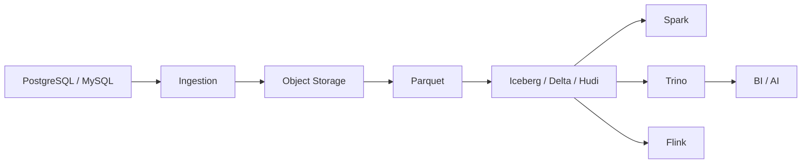

# 12. 数据湖与湖仓架构

::: tip 本章导读
用对象存储、文件格式、表格式、Catalog 和多引擎查询构建开放分析底座。
:::




数据湖解决低成本和灵活存储。

数仓解决高质量建模和稳定分析。

## 问题切入

湖仓试图统一两者：在开放存储上获得表管理、事务、元数据、演化和多引擎分析能力。

前面的章节已经出现了很多数据形态：PostgreSQL 业务表、数仓事实表、Kafka 事件、Parquet 文件、OLAP 宽表、RAG 文档、向量、图谱和评测日志。它们不可能全部只放在一个业务库或一个 OLAP 数据库里。

团队很快会遇到这些问题：

```text
历史明细太多，放在业务库成本和风险都太高。
日志、文档、图片、模型输入输出不是传统数仓表。
Spark、Flink、Trino、DuckDB 都希望访问同一批数据。
文件在对象存储里越来越多，但不知道哪份是最新、可用、可信版本。
schema 变化后，下游任务不知道该如何兼容。
AI 应用需要同时访问原文、分块、向量、图谱和评测数据。
```

数据湖出现是为了承载开放、多样、低成本的数据存储；湖仓出现是为了避免数据湖失控成“数据沼泽”。

## 核心判断

> 湖仓的关键不是“湖 + 仓”的口号，而是用表格式把对象存储中的文件组织成可管理、可查询、可演化的数据表。

本章要建立的判断是：湖仓架构解决的是开放存储上的数据管理问题。它用文件格式、表格式、Catalog 和多引擎访问，把对象存储里的文件变成可治理、可演化、可查询的数据表。

湖仓也不是万能替代品。它不能自动完成业务建模，不能替代 OLAP 数据库的高并发低延迟服务能力，不能省掉质量、权限、血缘和指标治理。它提供的是长期开放数据底座。

## 机制解释

### 12.1 数据湖基础

数据湖通常建立在对象存储上，例如 S3、OSS、MinIO。

它可以保存各种数据：

- CSV。
- JSON。
- 日志。
- 图片。
- 音频。
- 文档。
- Parquet。
- ORC。
- 模型输入输出。
- AI 中间产物。

数据湖的优势是低成本、开放和灵活。

但如果缺乏管理，数据湖会变成数据沼泽：

```text
文件命名混乱
目录含义不清
schema 不可追踪
质量不可验证
权限不可控制
血缘不可解释
下游不知道该用哪份数据
```

所以数据湖需要元数据、目录、质量、权限和表格式。

### 12.2 文件格式

常见文件格式包括：

- CSV。
- JSON。
- Avro。
- Parquet。
- ORC。

CSV 简单但缺乏类型信息，压缩和列裁剪能力弱。

JSON 灵活，适合半结构化数据，但分析扫描成本高。

Avro 适合行式序列化和 schema 演化。

Parquet 和 ORC 是列式存储格式，适合分析。

Parquet 的价值在于：

- 列式读取。
- 压缩效率高。
- 支持嵌套结构。
- 适合 Spark、Trino、DuckDB 等引擎查询。

文件格式解决的是“数据如何物理存储”。

但它不解决事务、并发写入、快照、表演化和元数据管理。

这就是表格式出现的原因。

### 12.3 表格式

现代湖仓常见表格式包括：

- Apache Iceberg。
- Delta Lake。
- Apache Hudi。

它们把对象存储上的文件组织成表，并提供：

- 表元数据。
- 快照。
- schema 演化。
- 分区演化。
- ACID 能力。
- 时间旅行。
- 增量读取。
- 文件 compaction。

Iceberg 的核心价值可以理解为：

```text
Object Storage 上的文件
  -> 通过元数据组织成表
  -> 多引擎可查询
  -> 支持快照和演化
```

表格式的核心判断是：

> 表格式让数据湖里的文件具备类似数据库表的管理能力。

### 12.4 查询引擎

湖仓不是一个单一数据库，而是存储、表格式、Catalog 和查询引擎的组合。

常见查询引擎包括：

- Spark。
- Flink。
- Trino。
- Presto。
- Hive。
- DuckDB。

Spark 适合批处理和大规模转换。

Flink 适合流式写入和实时计算。

Trino 适合交互式 SQL 查询。

DuckDB 适合本地分析和文件探索。

同一份 Iceberg 表，可以被多个引擎访问，这就是开放表格式的价值。

### 12.5 Catalog

Catalog 负责管理表元数据的位置和命名空间。

常见 Catalog 包括：

- Hive Metastore。
- AWS Glue Catalog。
- Nessie。
- Iceberg REST Catalog。
- Unity Catalog。

Catalog 解决的是：

```text
有哪些库？
有哪些表？
表的元数据在哪里？
表属于哪个命名空间？
谁能访问？
```

没有 Catalog，多引擎就很难稳定找到和理解同一张表。

### 12.6 湖仓典型架构

典型链路是：

```text
PostgreSQL / MySQL
  -> CDC / Batch Ingestion
  -> Object Storage
  -> Parquet
  -> Iceberg / Delta / Hudi
  -> Spark / Flink / Trino
  -> dbt
  -> BI / AI / ML
  -> 向量数据库 / 图数据库
```

在这条链路中：

- PostgreSQL 提供业务事实。
- CDC / Batch 负责写入湖仓。
- Object Storage 保存数据文件。
- Parquet 提供列式分析格式。
- Iceberg / Delta / Hudi 提供表管理。
- Spark / Flink / Trino 提供计算和查询。
- BI / AI / ML 使用结果。

## 系统位置

湖仓是现代数据平台的开放数据底座。

```text
业务库 / 日志 / 文件 / 文档 / 模型产物
  -> Ingestion
  -> Object Storage
  -> Parquet / ORC
  -> Iceberg / Delta / Hudi
  -> Catalog
  -> Spark / Flink / Trino / DuckDB
  -> 数仓 / OLAP / 向量库 / 图数据库 / AI 应用
```

它承接前面所有数据形态：批处理产物可以写入湖仓，实时流可以增量写入湖仓，向量和图谱的原始文档、中间结果和评测数据也可以沉淀在湖仓中。

它也引出第 13 章数据治理：一旦数据跨越业务库、数仓、湖仓、OLAP、向量和图，如果没有质量、元数据、血缘、权限和指标治理，开放存储只会扩大混乱。

## 场景案例

一个 Mini Lakehouse 可以这样搭建：

```text
PostgreSQL orders / users / products
  -> Airbyte 批量同步
  -> MinIO 对象存储
  -> Parquet 文件
  -> Iceberg 表
  -> Spark 做批量转换
  -> Trino 做交互式查询
  -> DuckDB 做本地抽样分析
  -> RAG 文档和评测日志也沉淀到对象存储
```

数据目录可以按层组织：

```text
lake/
  raw/           原始文件和同步落地数据
  bronze/        基础清洗表
  silver/        标准明细表
  gold/          汇总和应用表
  ai/            文档、chunk、embedding 版本、评测数据
```

这个案例里，Parquet 负责列式文件存储，Iceberg 负责把文件组织成表，Catalog 负责让 Spark 和 Trino 找到同一张表，Spark 负责批量转换，Trino 负责交互查询。

湖仓的价值不是让所有查询都最快，而是让数据长期开放、可管理、可被多种计算引擎复用。

## 常见误区

**误区一：数据湖就是便宜存储。**

只有存储没有管理，数据湖会变成数据沼泽。

**误区二：Parquet 等于湖仓。**

Parquet 是文件格式，不是表格式。湖仓还需要快照、元数据、事务、演化和 Catalog。

**误区三：湖仓可以替代所有 OLAP 数据库。**

湖仓适合开放存储和多引擎数据管理，高并发低延迟 BI 仍可能需要 ClickHouse、Doris 等 OLAP 服务层。

**误区四：有 Parquet 文件就等于有表。**

文件格式只解决物理存储，不解决快照、并发、事务、schema 演化、分区演化和多引擎一致访问。

**误区五：湖仓可以不用数仓建模。**

湖仓提供存储和表管理能力，但事实表、维度表、指标口径和数据分层仍然需要设计。没有建模的湖仓仍然会变成数据沼泽。

## 实战任务

设计一个 Mini Lakehouse：

```text
PostgreSQL
  -> Airbyte
  -> MinIO
  -> Parquet
  -> Iceberg
  -> Trino / Spark
```

要求说明：

- 哪些表同步进湖仓。
- 文件格式选择。
- 表格式选择。
- Catalog 选择。
- 分区策略。
- 哪些任务用 Spark。
- 哪些查询用 Trino。
- 哪些数据进入向量库或图数据库。

补充要求：

- 为 `orders` 表设计 Iceberg 分区策略。
- 说明 schema 新增字段时如何兼容旧数据。
- 说明一次错误写入如何通过快照或回滚恢复。
- 设计一个 Catalog 命名空间，例如 `raw`、`silver`、`gold`、`ai`。
- 说明哪些高并发看板仍应同步到 ClickHouse 或 Doris。

## 小结引出下一章

数据湖提供灵活开放存储，数仓提供建模和治理，湖仓用表格式尝试统一两者。

下一章进入数据治理。

因为数据平台一旦跨越 PostgreSQL、数仓、湖仓、向量和图，如果没有治理，就无法保证可信、可追踪、可复用和可控制。
