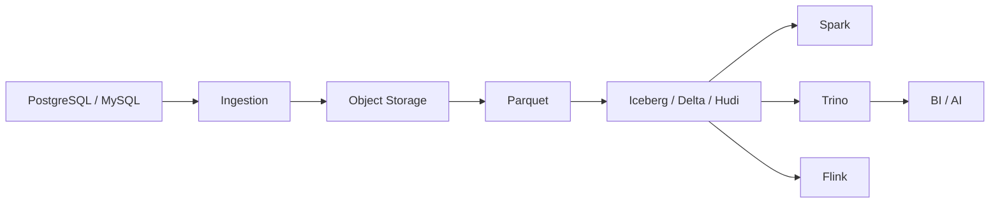

# 12. 数据湖与湖仓架构

::: tip 本章导读
用对象存储、文件格式、表格式、Catalog 和多引擎查询构建开放分析底座。
:::
::: info 本章验收问题
- 你能否解释对象存储、Parquet、表格式和 Catalog 的责任分工？
- 你能否说明湖仓为什么仍然需要建模、质量和治理，而不只是开放格式？
:::




数据湖解决低成本和灵活存储。

数仓解决高质量建模和稳定分析。

## 问题切入

湖仓试图统一两者：在开放存储上获得表管理、事务、元数据、演化和多引擎分析能力。

前面的章节已经出现了很多数据形态：PostgreSQL 业务表、数仓事实表、Kafka 事件、Parquet 文件、OLAP 宽表、RAG 文档、向量、图谱和评测日志。它们不可能全部只放在一个业务库或一个 OLAP 数据库里。

团队很快会遇到这些问题：

```text
历史明细太多，放在业务库成本和风险都太高。
日志、文档、图片、模型输入输出不是传统数仓表。
Spark、Flink、Trino、DuckDB 都希望访问同一批数据。
文件在对象存储里越来越多，但不知道哪份是最新、可用、可信版本。
schema 变化后，下游任务不知道该如何兼容。
AI 应用需要同时访问原文、分块、向量、图谱和评测数据。
```

数据湖出现是为了承载开放、多样、低成本的数据存储；湖仓出现是为了避免数据湖失控成“数据沼泽”。

## 核心判断

> 湖仓的关键不是“湖 + 仓”的口号，而是用表格式把对象存储中的文件组织成可管理、可查询、可演化的数据表。

对象存储上的 Parquet 文件堆积如山，谁来管理？湖仓用 Iceberg、Delta Lake、Hudi 这些表格式把文件变成表——支持 ACID、时间旅行、Schema 演化、多引擎访问。这一章讲的是数据湖从"文件堆"演进到"开放数据底座"的关键一跃，以及为什么这个跃迁在 2020 年代才真正可行。

湖仓也不是万能替代品。它不能自动完成业务建模，不能替代 OLAP 数据库的高并发低延迟服务能力，不能省掉质量、权限、血缘和指标治理。它提供的是长期开放数据底座。

## 机制解释

## 本章内容

| 节号 | 主题 |
|------|------|
| [12.1](/chapters/12/12-1) | 湖仓概述 |
| [12.2](/chapters/12/12-2) | 数据湖到湖仓演化 |
| [12.3](/chapters/12/12-3) | 对象存储与 Parquet |
| [12.4](/chapters/12/12-4) | 表格式（Iceberg / Delta Lake / Hudi） |
| [12.5](/chapters/12/12-5) | Catalog 与元数据管理 |
| [12.6](/chapters/12/12-6) | 多引擎查询 |
| [12.7](/chapters/12/12-7) | 湖仓事务与快照 |
| [12.8](/chapters/12/12-8) | 湖仓数据组织 |
| [12.9](/chapters/12/12-9) | 湖仓运维 |
| [12.10](/chapters/12/12-10) | 湖仓选型 |
| [12.11](/chapters/12/12-11) | 湖仓实战案例 |
| [12.12](/chapters/12/12-12) | 湖仓常见问题 |


## 系统位置

### 湖仓表生命周期检查表

湖仓不是把文件放到对象存储就结束。一个可用的湖仓表要管理文件、元数据、快照、schema、分区和多引擎访问。

| 生命周期环节 | 要设计什么 | 常见问题 |
| --- | --- | --- |
| 写入 | 批写、流写、追加、覆盖、Merge 的规则 | 多个任务并发写入导致数据冲突 |
| 文件布局 | Parquet/ORC 文件大小、分区路径、排序方式 | 小文件过多，查询计划和元数据扫描变慢 |
| 快照 | 每次提交形成什么快照，如何回滚和审计 | 错误写入后无法恢复到上一版本 |
| Schema 演化 | 新增、删除、重命名字段如何处理 | 下游引擎读到不兼容 schema |
| 分区演化 | 日期、小时、业务域等分区如何调整 | 老分区和新分区查询口径不一致 |
| Catalog | Hive Metastore、REST Catalog 或其他目录如何管理 | Spark、Flink、Trino 看到的表不一致 |
| 清理 | 过期快照、孤立文件、小文件合并如何执行 | 存储成本上升，查询越来越慢 |

以订单明细湖仓表为例，设计可以写成：

```text
表：lakehouse.order_items
格式：Iceberg v2
文件：Parquet，目标 256MB-512MB
分区：days(paid_at)，后续可演化到 hours(paid_at)
主键语义：order_item_id + version
写入：批处理覆盖历史分区，CDC 进入增量 Merge
查询：Spark 负责大规模构建，Trino 负责交互分析，Flink 负责增量写入
治理：每个快照记录任务版本、源表版本、行数和质量校验结果
```

这个设计说明湖仓解决的是开放存储、多引擎协作和表级演化问题，不自动解决指标口径、权限治理和高并发看板查询。需要低延迟 BI 时，湖仓常常还要把宽表或汇总表同步到 ClickHouse、Doris 等 OLAP 系统。

湖仓是现代数据平台的开放数据底座。

```text
业务库 / 日志 / 文件 / 文档 / 模型产物
  -> Ingestion
  -> Object Storage
  -> Parquet / ORC
  -> Iceberg / Delta / Hudi
  -> Catalog
  -> Spark / Flink / Trino / DuckDB
  -> 数仓 / OLAP / 向量库 / 图数据库 / AI 应用
```

它承接前面所有数据形态：批处理产物可以写入湖仓，实时流可以增量写入湖仓，向量和图谱的原始文档、中间结果和评测数据也可以沉淀在湖仓中。

它也引出第 13 章数据治理：一旦数据跨越业务库、数仓、湖仓、OLAP、向量和图，如果没有质量、元数据、血缘、权限和指标治理，开放存储只会扩大混乱。

## 场景案例

一个 Mini Lakehouse 可以这样搭建：

```text
PostgreSQL orders / users / products
  -> Airbyte 批量同步
  -> MinIO 对象存储
  -> Parquet 文件
  -> Iceberg 表
  -> Spark 做批量转换
  -> Trino 做交互式查询
  -> DuckDB 做本地抽样分析
  -> RAG 文档和评测日志也沉淀到对象存储
```

数据目录可以按层组织：

```text
lake/
  raw/           原始文件和同步落地数据
  bronze/        基础清洗表
  silver/        标准明细表
  gold/          汇总和应用表
  ai/            文档、chunk、embedding 版本、评测数据
```

这个案例里，Parquet 负责列式文件存储，Iceberg 负责把文件组织成表，Catalog 负责让 Spark 和 Trino 找到同一张表，Spark 负责批量转换，Trino 负责交互查询。

湖仓的价值不是让所有查询都最快，而是让数据长期开放、可管理、可被多种计算引擎复用。

## 工程层对比：表格式选型

| 维度 | Apache Iceberg | Delta Lake | Apache Hudi |
|------|---------------|------------|-------------|
| **定位** | 开放表格式，多引擎优先 | Spark生态深度绑定 | CDC流式写入优先 |
| **引擎兼容** | Spark/Flink/Trino/DuckDB/Presto/Athena | Spark为主（其他引擎兼容性有限） | Spark/Flink/Presto（Trino/DuckDB支持有限） |
| **快照机制** | 每次提交生成新快照，快照间独立可追溯 | 每次提交生成新版本，事务日志追加写入 | 两种表类型：COW（写时复制）和MOR（读时合并） |
| **并发写入** | 乐观并发+冲突重试，多引擎可并发写同一表 | 乐观并发，但主要支持Spark多任务写入 | 支持多writer并发写入（MOR模式） |
| **Schema演化** | 支持增删列、改列名、改列类型，无需重建表 | 支持增列和改列名，类型变更需重建 | 支持增删列，但演化灵活度不如Iceberg |
| **分区演化** | 支持隐藏分区+分区演化（无需迁移数据） | 分区设定后不能演化，需重建表 | 分区变更需要手动触发迁移 |
| **时间旅行** | 快照ID+时间戳，可查历史版本 | 版本号+时间戳回溯 | 通过增量提交回溯 |
| **代价** | 元数据文件增长快，需定期compaction+快照清理 | 事务日志文件增长快，需定期清理 | MOR模式读性能受增量文件影响，compaction更频繁 |
| **失效条件** | 高频小文件写入→元数据膨胀→查询计划阶段分钟级延迟 | 非Spark引擎查询→兼容性风险→数据不一致 | 低频大批量查询场景→COW写入延迟高/MOR合并延迟高 |
| **注意事项** | manifest/manifest list需监控数量；compaction必须常态化；Catalog选型影响多引擎访问能力 | Delta Lake的_log目录需定期清理；多引擎访问时必须通过Unity Catalog或Delta Sharing | MOR表的compaction频率需根据写入频率调整；COW表不适合高频更新 |
| **推荐场景** | 多引擎查询+开放数据底座+需要分区和schema演化 | 纯Spark生态+需要和Databricks平台深度集成 | CDC流式写入+高频更新+近实时查询需求 |

## 故障清单：湖仓常见故障

| 类别 | 具体症状 | 检测方法 | 根因（引用本章机制） | 缓解措施 | 严重度 |
|------|---------|---------|---------------------|---------|--------|
| 元数据膨胀 | Trino查询Iceberg表，计划阶段从2秒退化到45秒 | 监控manifest文件数量和manifest list大小 | 高频流式写入每分钟生成manifest文件，3个月后累积10万+manifest（12.7节快照机制） | 定期执行compaction合并小文件+快照过期清理（expire_snapshots）；manifest数量>5000时触发运维 | 高 |
| 多引擎冲突 | Spark写入新分区后，Trino查询返回旧数据 | 用Spark和Trino分别查同一分区，对比行数 | Catalog刷新延迟——Trino缓存了旧快照指针，Spark提交的新快照未被Trino自动发现（12.6节多引擎机制） | 配置Catalog自动刷新（如Nessie Catalog）；或在Trino查询前手动REFRESH TABLE；确保Catalog使用共享元数据存储 | 高 |
| 半成品泄露 | Spark任务失败后，下游读到50个文件而非预期的100个 | 对比目标文件数和实际文件数 | 对象存储缺乏多文件原子写入——50个文件已PUT成功，后续50未写入（12.3节对象存储限制） | Iceberg的原子提交机制：失败写入不更新Catalog快照指针，下游永远读到上一个完整快照 | 中 |
| 小文件灾 | CDC流每分钟写入一个<1MB的Parquet文件，一个月后单分区有4万+小文件 | 统计单分区文件数量和平均文件大小 | 流式写入频率高但单次数据量小——CDC事件每分钟仅几百条（12.9节运维compaction） | 分层写入策略：热数据层CDC流式写入MOR表，冷数据层定期compaction合并为COW大文件；目标文件大小256MB-512MB | 高 |
| Schema断裂 | orders表新增payment_method列后，下游Spark任务报"列不存在" | 对比Iceberg当前schema和下游任务的schema期望 | 下游Spark任务缓存了旧schema——Iceberg表已演化但下游任务未重新加载（12.7节schema演化机制） | 下游任务启动时从Catalog重新加载schema；Iceberg的schema演化设计为向前兼容（新列nullable），确保旧数据不会报错 | 中 |

## 常见误区

**误区一：数据湖就是便宜存储。**

只有存储没有管理，数据湖会变成数据沼泽。

**误区二：Parquet 等于湖仓。**

Parquet 是文件格式，不是表格式。湖仓还需要快照、元数据、事务、演化和 Catalog。

**误区三：湖仓可以替代所有 OLAP 数据库。**

湖仓适合开放存储和多引擎数据管理，高并发低延迟 BI 仍可能需要 ClickHouse、Doris 等 OLAP 服务层。

**误区四：有 Parquet 文件就等于有表。**

文件格式只解决物理存储，不解决快照、并发、事务、schema 演化、分区演化和多引擎一致访问。

**误区五：湖仓可以不用数仓建模。**

湖仓提供存储和表管理能力，但事实表、维度表、指标口径和数据分层仍然需要设计。没有建模的湖仓仍然会变成数据沼泽。

## 实战任务

设计一个 Mini Lakehouse：

```text
PostgreSQL
  -> Airbyte
  -> MinIO
  -> Parquet
  -> Iceberg
  -> Trino / Spark
```

要求说明：

- 哪些表同步进湖仓。
- 文件格式选择。
- 表格式选择。
- Catalog 选择。
- 分区策略。
- 哪些任务用 Spark。
- 哪些查询用 Trino。
- 哪些数据进入向量库或图数据库。

补充要求：

- 为 `orders` 表设计 Iceberg 分区策略。
- 说明 schema 新增字段时如何兼容旧数据。
- 说明一次错误写入如何通过快照或回滚恢复。
- 设计一个 Catalog 命名空间，例如 `raw`、`silver`、`gold`、`ai`。
- 说明哪些高并发看板仍应同步到 ClickHouse 或 Doris。

## 小结引出下一章

数据湖提供灵活开放存储，数仓提供建模和治理，湖仓用表格式尝试统一两者。

**纵向主线桥段：**

> **数据组织线回溯**：Ch2的SQL结果集→Ch5的事实/维度组织→Ch7的文件组织→Ch10的向量组织→Ch11的图组织→本章的表格式组织。湖仓把所有数据形态（表、文档、向量、图谱）统一到对象存储+表格式的开放框架下，让数据从"各管各的"变成"可管理、可演化、可多引擎查询"。
> **数据组织线推进**：表格式组织让对象存储上的Parquet文件堆获得了表级别的管理能力——ACID、时间旅行、Schema演化、分区演化。但数据的可信性和可追踪性超出了表格式的职责范围。
> **数据组织线未解之问**：如何让数据组织从"可管理"走向"可信任、可追踪、可审计"？→下一章的治理对象管理。

> **一致性线回溯**：Ch5的建模约束→Ch6的CDC一致性→Ch8的Exactly Once→Ch11的图数据一致性→本章的湖仓快照隔离。Iceberg的快照机制让对象存储上的数据获得了ACID能力——多引擎并发读写有了原子提交保证。
> **一致性线推进**：快照一致性解决了"数据不丢不坏"的问题，但业务口径一致性是另一层问题——湖仓表的GMV口径和业务库的GMV口径可能使用不同的时间字段和状态过滤条件。
> **一致性线未解之问**：如何让一致性从"数据级"走向"口径级"审计闭环？→下一章的治理审计。

> **建模线回溯**：Ch5的星/雪花建模→Ch10的分块+Embedding建模→Ch11的本体建模→本章的湖仓建模（分区+排序+Z-order）。湖仓建模改变了数据组织粒度——从固定分区到可演化分区，从单引擎到多引擎。
> **建模线推进**：湖仓建模解决的是物理层面的数据组织——分区策略、排序策略、Z-order聚类。但指标口径的建模是业务层面的决策——湖仓建模不能替代口径定义。
> **建模线未解之问**：指标口径建模如何覆盖从PG到湖仓的全链路？→下一章的指标口径建模。

> **故障与边界线回溯**：Ch10的召回噪声→Ch11的图幻觉→本章的多引擎冲突。湖仓引入了全新的故障形态——多引擎并发写入同一分区会产生冲突，CDC分钟级写入产生小文件灾，元数据膨胀会让查询计划阶段分钟级延迟。
> **故障与边界线推进**：小文件灾、元数据膨胀、半成品泄露、Schema断裂、口径不一致是湖仓运维特有的边界问题。文件堆积不等于数据沼泽——但缺乏管理就会变成沼泽。
> **故障与边界线未解之问**：当所有故障模式都指向"规则无人执行"时，治理如何成为最后一道防线？→下一章的治理失效。

下一章进入数据治理。本书不单独展开 Data Mesh（数据网格）和 Data Fabric——这两种企业级数据组织范式更多是架构和组织层面的决策，而非技术原语。掌握了湖仓的开放存储、表格式和多引擎访问之后，再探索 Data Mesh 的分领域所有权和自助数据产品概念会更有根基。建议对此感兴趣的读者从 Zhamak Dehghani 的《Data Mesh》原书开始。

因为数据平台一旦跨越 PostgreSQL、数仓、湖仓、向量和图，如果没有治理，就无法保证可信、可追踪、可复用和可控制——治理是所有主线闭环的最后一层。
