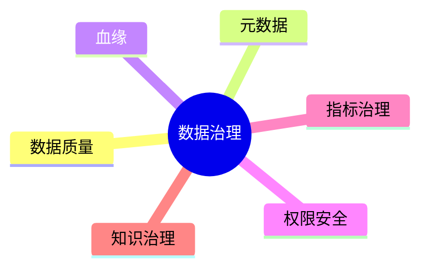

# 13. 数据治理与工程化

::: tip 本章导读
覆盖质量、元数据、血缘、权限、指标和 AI 知识治理，让数据平台长期可信。
:::


## 本章阅读框架

| 阅读问题 | 本章回答方式 |
| --- | --- |
| 这个问题为什么出现？ | 从业务增长、数据规模、系统目标或 AI 应用压力切入。 |
| 它解决什么问题？ | 提炼为一个核心判断，避免把概念写成孤立定义。 |
| 它不解决什么问题？ | 在机制解释和常见误区中说明边界，防止工具崇拜。 |
| 它在真实平台哪里出现？ | 放回 PostgreSQL、数仓、批流、OLAP、湖仓、向量、图和治理的演化链路。 |
| 读完要会做什么？ | 通过场景案例和实战任务转成可练习的判断。 |



大数据平台不是只会跑 SQL。

真正的平台价值来自可信、可追踪、可复用、可治理。

## 问题切入

没有治理的数据平台，会从数据湖变成数据沼泽，从指标平台变成口径争吵现场，从 AI 知识库变成不可追溯的上下文堆。

前面章节已经把数据系统扩展到很多组件：PostgreSQL、数仓、ETL、批处理、实时处理、OLAP、湖仓、向量数据库和图数据库。系统能力越强，混乱的放大效应也越强。

常见事故包括：

```text
两个团队的 GMV 指标不一致，没人知道哪个可信。
上游字段改名后，下游几十张表和看板静默出错。
RAG 回答引用了过期文档，用户不知道来源。
向量检索返回了用户无权访问的内部材料。
图谱关系抽取错误，GraphRAG 沿错误路径生成答案。
数据质量任务失败，但报表仍然正常刷新。
```

这些问题不是再买一个数据库或计算引擎就能解决的。它们需要治理机制贯穿数据生命周期。

## 核心判断

> 数据治理不是上线前的附加项，而是让数据长期可用的基础设施。

本章要建立的判断是：数据治理解决的是可信、可解释、可追踪、可控制和可复用问题。它把数据平台从“任务和表的堆砌”变成可以长期演化的基础设施。

治理也不是单独一个后台系统就能完成。它必须嵌入采集、建模、转换、调度、查询、检索、权限、评测和发布流程中。没有流程执行的治理文档，最后仍然会变成过期说明。

## 机制解释

### 13.1 数据质量

数据质量关注数据是否可信。

常见维度包括：

- 完整性。
- 准确性。
- 一致性。
- 唯一性。
- 及时性。
- 合法性。
- 空值检查。
- 范围检查。
- 异常检测。

例如：

```text
orders.order_id 不能为空
orders.total_amount 不能小于 0
payments.order_id 必须能关联订单
每日订单数不能突然下降 90%
GMV 不能为负
```

数据质量的核心判断是：

> 数据可信不是靠口头保证，而是靠规则、检查、告警、责任和修复流程。

### 13.2 元数据管理

元数据是描述数据的数据。

常见元数据包括：

- 技术元数据：库、表、字段、类型、分区、存储位置。
- 业务元数据：业务含义、指标定义、口径、数据负责人。
- 操作元数据：任务运行时间、延迟、失败、血缘、访问记录。

没有元数据，数据平台会出现典型问题：

```text
不知道哪张表能用
不知道字段是什么意思
不知道指标是谁定义的
不知道数据什么时候更新
不知道下游有哪些依赖
```

元数据管理解决的是可发现性和可解释性。

### 13.3 数据血缘

数据血缘回答：

```text
这张表从哪里来？
经过哪些任务？
影响哪些下游？
字段如何计算？
指标依赖哪些事实？
```

血缘分为：

- 表级血缘。
- 字段级血缘。
- 任务血缘。
- 指标血缘。
- 向量数据血缘。
- 图谱关系血缘。

血缘的价值包括：

- 故障追踪。
- 影响分析。
- 变更评估。
- 质量定位。
- 合规审计。

例如一个字段要改名，血缘可以告诉你会影响哪些 DWD 表、DWS 汇总、ADS 看板、RAG 检索日志和下游应用。

### 13.4 权限与安全

数据平台的目标不是让所有人随便用所有数据。

目标是让数据在正确权限下可用。

常见机制包括：

- RBAC。
- ABAC。
- 行级权限。
- 列级权限。
- 文档级权限。
- 向量检索权限过滤。
- 图关系访问权限。
- 数据脱敏。
- 审计日志。
- 合规。

AI 场景下，权限更复杂。

RAG 检索不能只看语义相似，还必须看用户是否有权访问原始文档和 Chunk。

GraphRAG 不能因为路径扩展而暴露无权限实体关系。

向量库、图数据库和对象存储必须共享一致的权限边界。

这里最容易出错的是把“检索过滤”当成“授权系统”。PostgreSQL 的 Row-Level Security 是在表访问时按策略限制哪些行可见或可修改；对象存储默认私有，访问由 bucket、object、IAM policy、access point 等资源权限决定；向量数据库的 payload / metadata filter 可以缩小召回范围；图数据库的角色和权限可以限制图空间、schema 或数据访问。但这些机制如果各自孤立，就会出现 SQL 查不到、对象存储能下载，或者向量检索过滤了文档、GraphRAG 路径又扩展出无权限关系的问题。

端到端权限应该按同一个授权决策传播：

| 环节 | 必须携带的权限信息 | 失败后果 |
| --- | --- | --- |
| SQL / OLTP | 用户、租户、角色、行级/列级策略、操作类型 | 业务表可见性和下游同步范围不一致 |
| 对象存储 | bucket、object、prefix、版本、IAM / policy / access grant | 原文或附件绕过数据库权限被读取 |
| 文档 Chunk | document_id、chunk_id、来源版本、acl_scope、敏感级别 | RAG 召回了用户无权访问的片段 |
| 向量检索 | metadata / payload filter、tenant、collection、query audit id | 语义相似结果越过业务授权边界 |
| 图关系扩展 | entity、relationship、path、关系来源、可见范围 | GraphRAG 通过多跳路径泄露隐藏实体或关系 |
| 答案生成 | 引用来源、权限命中、脱敏状态、审计记录 | 模型输出把不可见上下文重新暴露给用户 |

因此 RAG / GraphRAG 的权限检查不能只放在最后一步。正确流程是：查询前确认主体身份和策略，召回时按文档、Chunk 和向量元数据过滤，图扩展时按实体和关系权限剪枝，组装上下文时再次校验来源，生成答案时只引用用户可见证据，并把查询、召回、路径、过滤条件和答案引用写入审计日志。

### 13.5 指标治理

指标治理解决口径冲突。

一个指标应该有：

- 指标名称。
- 业务定义。
- 计算公式。
- 时间口径。
- 过滤条件。
- 维度范围。
- 指标负责人。
- 指标版本。
- 指标血缘。
- 指标服务。

例如 GMV：

```text
是否只统计已支付订单？
是否扣除退款？
是否排除测试订单？
按创建时间还是支付时间？
按自然日还是业务日？
```

指标治理的核心判断是：

> 指标不是某条 SQL 的结果，而是组织内部可复用的业务契约。

### 13.6 知识治理

AI 知识系统也需要治理。

常见对象包括：

- 文档元数据。
- Chunk 版本。
- Embedding 版本。
- 向量索引版本。
- 图谱版本。
- 本体版本。
- 召回日志。
- RAG 评测。
- GraphRAG 评测。

如果不治理，RAG 系统会出现：

```text
不知道答案来自哪个文档
不知道文档是否过期
不知道向量由哪个模型生成
不知道 Chunk 如何切分
不知道权限是否正确过滤
不知道一次改动让召回变好还是变差
```

知识治理的核心判断是：

> AI 数据不是把文档向量化就结束，而是要让知识来源、版本、权限、召回和效果可追踪。


### 深度展开：数据治理如何落到真实系统

本节补齐本章的工程细节。阅读时不要只记住概念名称，而要把它放回“输入是什么、处理路径是什么、输出给谁、边界在哪里、如何验证”的链路中。

#### 一、它从什么问题开始

数据平台能跑不等于可信。长期可用的数据系统需要质量、元数据、血缘、权限、指标和知识治理。

这个问题通常不会以技术名词出现，而是以业务现象出现：报表变慢、指标不一致、实时看板延迟、RAG 召回不稳定、数据无法追溯、项目 Demo 无法验收。能不能把现象还原成系统问题，是本书要训练的第一层能力。

#### 二、输入数据和前置判断

输入是表结构、任务依赖、指标定义、数据质量规则、权限策略、文档 Chunk、向量版本、图谱版本和使用日志。

在动手之前，至少要确认四件事：

| 判断项 | 要回答的问题 |
| --- | --- |
| 数据粒度 | 一行代表什么事实，是用户、订单、订单明细、事件、文件、Chunk，还是一条关系？ |
| 时间边界 | 使用创建时间、更新时间、支付时间、事件时间，还是处理时间？ |
| 状态边界 | 哪些状态算有效，哪些测试、取消、退款、重复或迟到数据要排除？ |
| 责任边界 | 这个环节负责记录事实、生产指标、加速查询、治理质量，还是服务 AI 应用？ |

#### 三、处理路径

处理路径是采集元数据，建立血缘，定义质量规则和告警，统一指标口径，管理权限和敏感字段，并把治理信息接入 BI、RAG 和平台运维。

这条路径应该能被写成可执行流程，而不是停留在术语解释。一个合格的设计至少要说明：数据从哪里来、经过哪些转换、写到哪里、谁消费、失败后如何重跑、结果如何校验。

#### 四、在真实平台中的位置

真实平台中治理通常由 Data Catalog、Lineage、质量平台、指标平台、权限系统和审计系统组成。AI 场景还需要文档来源、向量版本、召回日志和答案评测。

平台位置决定了它和前后系统的关系。不要孤立地问“这个技术好不好”，而要问：

- 它继承了上一层什么问题？
- 它把什么复杂度转移给了下一层？
- 它的输出是否能被复用、追溯和治理？
- 它是否改变了数据粒度、延迟、一致性或权限边界？

#### 五、边界和失败模式

治理不是写几个字段说明，也不是最后补文档。没有治理，数仓会出现口径漂移，湖仓会失控，RAG 会无法解释来源和权限。

常见失败信号可以这样检查：

| 失败信号 | 应该追问什么 |
| --- | --- |
| 表没人敢删也没人知道谁用 | 定位到具体输入、口径、链路、边界或治理责任。 |
| 指标同名不同义 | 定位到具体输入、口径、链路、边界或治理责任。 |
| 下游任务失败找不到上游变更 | 定位到具体输入、口径、链路、边界或治理责任。 |
| AI 答案无法追溯到来源 | 定位到具体输入、口径、链路、边界或治理责任。 |

#### 六、可操作练习

为订单 GMV 指标建立治理卡片：定义、来源表、计算 SQL、负责人、刷新频率、质量规则、血缘、权限和变更记录。

练习完成后不要只看“有没有跑通”，还要补一份复盘：

- 输入数据是否足以支撑问题？
- 口径和边界是否写清楚？
- 结果能否被重复计算和对账？
- 如果数据量扩大 10 倍，瓶颈会出现在哪里？
- 如果接入下游 BI、RAG 或治理系统，还缺哪些元数据？


## 系统位置

### 最小治理数据模型

治理不能只写成制度。一个可落地的治理系统至少要有能存下来的数据模型：

| 治理对象 | 关键字段 | 解决的问题 |
| --- | --- | --- |
| 数据表 | table_id、系统、库、表、负责人、生命周期 | 谁拥有这张表，是否还能删除或下线 |
| 字段 | column_id、类型、含义、敏感级别、枚举规则 | 字段能否被正确理解和授权 |
| 指标 | metric_id、公式、时间口径、过滤规则、负责人、版本 | 同名指标是否同义，口径变更如何追踪 |
| 血缘 | source、target、任务、字段映射、运行版本 | 上游变化会影响哪些下游 |
| 质量规则 | 规则类型、阈值、执行频率、失败等级 | 数据错误能否在进入应用前被发现 |
| 权限策略 | 主体、资源、动作、条件、审计记录 | 谁能读、写、导出或用于模型训练 |
| AI 评测 | 问题、答案、来源命中、权限命中、人工评分 | RAG / GraphRAG 是否可信 |

这些对象可以先存在 PostgreSQL 中，不必一开始就建设大型治理平台。关键是从第一张核心表、第一条指标、第一批向量和第一组图关系开始记录来源、口径、质量和权限。

例如一个 RAG 系统的治理记录至少要包含：

```text
document_source：文档来自哪里，版本是什么，谁负责
chunk_lineage：Chunk 从哪个文档、页码、段落生成
embedding_version：使用哪个模型、维度、参数和生成时间
retrieval_log：查询、用户、召回 Chunk、分数、过滤条件
answer_evaluation：答案是否命中来源，是否越权，是否被人工接受
```

这样治理才进入 AI 数据链路本身，而不是系统出错后才补一张流程图。

数据治理是贯穿全书的控制面。

```text
PostgreSQL
  -> ETL / CDC
  -> 数仓 / 湖仓 / OLAP
  -> 向量数据库 / 图数据库
  -> BI / RAG / GraphRAG / 数据应用
```

治理在每一层都有对应对象：

| 层级 | 治理对象 |
| --- | --- |
| PostgreSQL | 表结构、主外键、权限、变更记录 |
| ETL / CDC | 同步状态、延迟、重试、schema 演化 |
| 数仓 | 分层、事实表、维度表、指标口径 |
| 批流处理 | DAG、任务血缘、质量检查、补数 |
| OLAP | 宽表、汇总表、查询权限、对账 |
| 湖仓 | Catalog、表格式、快照、schema 演化 |
| 向量 | 文档、chunk、embedding 版本、检索日志 |
| 图 | 实体、关系、本体、路径、图谱质量 |
| AI 应用 | 来源、权限、评测、反馈、审计 |

它也承接第 12 章湖仓：开放数据底座一旦跨多引擎、多团队、多应用，就必须依赖治理来保证可信和可控。

## 场景案例

设计一个治理 Mini Platform，可以包含八个模块：

```text
表目录
字段目录
指标字典
任务列表
血缘图
质量规则
权限策略
RAG 评测记录
```

当用户打开 `ads_sales_dashboard` 表时，平台应该能回答：

```text
这张表是谁负责？
多久更新一次？
字段 `paid_gmv` 的业务定义是什么？
它来自哪些 ODS / DWD / DWS 表？
最近 7 天质量检查是否通过？
哪些看板、API、RAG 应用依赖它？
哪些角色能访问明细，哪些只能访问汇总？
如果源表字段变更，会影响哪些下游？
```

为了让这些问题有答案，治理平台需要维护具体元数据。例如表目录：

```sql
CREATE TABLE table_catalog (
    table_id        SERIAL PRIMARY KEY,
    table_name      TEXT NOT NULL,
    schema_name     TEXT NOT NULL,
    layer           TEXT NOT NULL,        -- ODS / DWD / DWS / ADS
    owner           TEXT NOT NULL,
    update_freq     TEXT,                 -- daily / hourly / realtime
    description     TEXT,
    created_at      TIMESTAMP DEFAULT now()
);
```

字段目录：

```sql
CREATE TABLE field_catalog (
    field_id        SERIAL PRIMARY KEY,
    table_id        INT REFERENCES table_catalog(table_id),
    field_name      TEXT NOT NULL,
    field_type      TEXT NOT NULL,
    business_meaning TEXT,                -- 业务含义
    calc_formula    TEXT,                 -- 计算公式
    is_primary_key  BOOLEAN DEFAULT false,
    is_nullable     BOOLEAN DEFAULT true
);
```

指标字典：

```sql
CREATE TABLE metric_dict (
    metric_id       SERIAL PRIMARY KEY,
    metric_name     TEXT NOT NULL UNIQUE, -- 如 paid_gmv
    business_def    TEXT NOT NULL,        -- 业务定义
    calc_formula    TEXT NOT NULL,        -- 计算公式
    time口径        TEXT,                 -- 按支付时间 / 创建时间
    filter_cond     TEXT,                 -- 过滤条件，如 order_status = 'paid'
    owner           TEXT NOT NULL,
    version         INT DEFAULT 1
);
```

数据质量规则：

```sql
CREATE TABLE quality_rules (
    rule_id         SERIAL PRIMARY KEY,
    table_name      TEXT NOT NULL,
    rule_type       TEXT NOT NULL,        -- null_check / range_check / freshness / row_count
    rule_sql        TEXT NOT NULL,
    threshold       TEXT,
    alert_channel   TEXT,                 -- email / slack / pagerduty
    is_active       BOOLEAN DEFAULT true
);
```

示例质量规则：

```sql
-- 空值检查
INSERT INTO quality_rules (table_name, rule_type, rule_sql, threshold)
VALUES ('orders', 'null_check',
        'SELECT count(*) FROM orders WHERE order_id IS NULL',
        '0');

-- 行数波动检查
INSERT INTO quality_rules (table_name, rule_type, rule_sql, threshold)
VALUES ('orders', 'row_count',
        'SELECT count(*) FROM orders WHERE created_at >= current_date',
        '>= 70% of 7-day average');

-- 时效性检查
INSERT INTO quality_rules (table_name, rule_type, rule_sql, threshold)
VALUES ('ads_sales_dashboard', 'freshness',
        'SELECT extract(epoch FROM now() - max(updated_at)) / 3600 FROM ads_sales_dashboard',
        '< 25 hours');
```

血缘关系可以用一张简单的依赖表记录：

```sql
CREATE TABLE data_lineage (
    lineage_id      SERIAL PRIMARY KEY,
    source_table    TEXT NOT NULL,
    target_table    TEXT NOT NULL,
    transform_type  TEXT,                 -- etl / dbt / spark / flink
    task_name       TEXT,
    updated_at      TIMESTAMP DEFAULT now()
);
```

示例血缘数据：

```sql
INSERT INTO data_lineage (source_table, target_table, transform_type, task_name) VALUES
('orders',           'ods_orders',           'airbyte',   'daily_order_sync'),
('ods_orders',       'dwd_order_detail',     'dbt',       'dwd_order_detail'),
('dwd_order_detail', 'dws_daily_sales',      'dbt',       'dws_daily_sales'),
('dws_daily_sales',  'ads_sales_dashboard',  'dbt',       'ads_sales_dashboard');
```

这样当用户查询 `ads_sales_dashboard` 的血缘时，平台可以沿着 `data_lineage` 表回溯到 `ods_orders` 和 `orders`，形成完整链路。

当用户打开一个 RAG 答案时，平台也应该能回答：

```text
答案引用了哪些文档和 chunk？
这些文档是否在用户权限范围内？
chunk 由哪个解析版本和 embedding 模型生成？
检索结果是否经过重排？
这个问题是否在评测集中？
最近一次知识库更新是否让召回效果变好？
```

这就是治理从传统数据平台扩展到 AI 数据基础设施后的形态。

## 常见误区

**误区一：治理会拖慢开发。**

没有治理，短期快，长期会被口径冲突、质量事故、权限风险和重复建设拖慢。

**误区二：治理只是数据团队的事。**

业务定义、指标口径、权限规则和质量标准都需要业务、工程和数据团队共同维护。

**误区三：向量和图数据不需要治理。**

向量和图更需要治理，因为它们经常参与 AI 生成结果，一旦来源、权限和版本不清，风险更高。

**误区四：治理等于写文档。**

文档只是治理的一部分。真正有效的治理必须连接到任务、表、权限、质量检查、血缘、告警和发布流程。

**误区五：权限只要控制数据库表就够了。**

AI 场景还要控制对象存储原文、chunk、向量检索、图关系扩展和生成答案引用。权限边界必须端到端一致。

## 实战任务

设计一个数据治理 Mini Platform：

模块包括：

```text
表目录
字段目录
指标字典
任务列表
血缘图
质量规则
权限策略
RAG 评测记录
```

要求说明：

- 元数据存储表。
- 指标定义字段。
- 血缘关系表达方式。
- 质量规则如何运行。
- 权限如何影响 SQL、向量检索和图查询。
- 质量失败如何告警。

补充要求：

- 设计 `datasets`、`fields`、`metrics`、`lineage_edges`、`quality_rules`、`access_policies` 六张核心元数据表。
- 为 GMV 指标写一条完整治理记录。
- 为 RAG 文档权限设计一次检索过滤流程。
- 设计一次字段变更影响分析：`orders.total_amount` 改名会影响哪些下游对象。
- 设计质量失败后的处理流程：告警、阻断、降级、修复、复盘。

## 小结引出下一章

数据治理让数据平台从任务堆砌走向可信基础设施。

它覆盖质量、元数据、血缘、权限、指标和 AI 知识治理。

下一章进入项目实战。

因为理解系统还不够，必须把 PostgreSQL、SQL、数仓、批流、OLAP、湖仓、向量、图和治理串成可运行的项目闭环。
