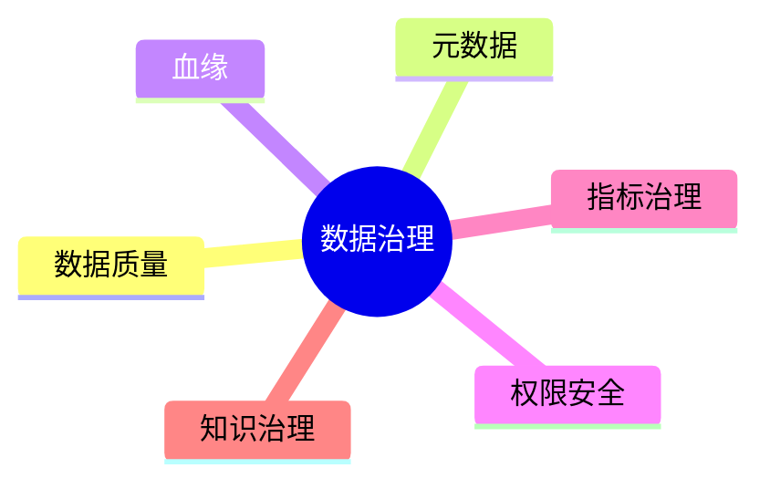

# 13. 数据治理与工程化

::: tip 本章导读
覆盖质量、元数据、血缘、权限、指标和 AI 知识治理，让数据平台长期可信。
:::
::: info 本章验收问题
- 你能否为一个指标或知识库写出最小治理卡片？
- 你能否说明数据治理为什么必须嵌入流程，而不是最后补文档？
:::




大数据平台不是只会跑 SQL。

真正的平台价值来自可信、可追踪、可复用、可治理。

## 问题切入

没有治理的数据平台，会从数据湖变成数据沼泽，从指标平台变成口径争吵现场，从 AI 知识库变成不可追溯的上下文堆。

前面章节已经把数据系统扩展到很多组件：PostgreSQL、数仓、ETL、批处理、实时处理、OLAP、湖仓、向量数据库和图数据库。系统能力越强，混乱的放大效应也越强。

常见事故包括：

```text
两个团队的 GMV 指标不一致，没人知道哪个可信。
上游字段改名后，下游几十张表和看板静默出错。
RAG 回答引用了过期文档，用户不知道来源。
向量检索返回了用户无权访问的内部材料。
图谱关系抽取错误，GraphRAG 沿错误路径生成答案。
数据质量任务失败，但报表仍然正常刷新。
```

这些问题不是再买一个数据库或计算引擎就能解决的。它们需要治理机制贯穿数据生命周期。

## 核心判断

> 数据治理不是上线前的附加项，而是让数据长期可用的基础设施。

没有治理的数据平台，会从数据湖变成数据沼泽——GMV 口径三套、字段含义无人知晓、权限失控、RAG 引用过时文档。这一章讲数据治理不是管理制度，而是让数据可发现、可信任、可追踪、可控制的系统性工程。治理不嵌入流程，文档最后一定过期。

治理也不是单独一个后台系统就能完成。它必须嵌入采集、建模、转换、调度、查询、检索、权限、评测和发布流程中。没有流程执行的治理文档，最后仍然会变成过期说明。

## 机制解释

### 13.1 数据治理概述

2018年，一家中型电商公司的数据团队遇到了一个典型问题：市场部、财务部和运营部各自报出的"上季度GMV"差了15%。三个部门都从同一个数据仓库取数，但口径各不相同——市场部算了含退款的，财务部只算实收的，运营部按订单创建时间统计、财务部按支付完成时间统计。

这就是数据治理要解决的第一性问题：当数据成为企业的共同语言时，谁来定义词汇表？

数据治理不是一套技术工具，而是一套管理规则。它回答的是组织层面的问题：谁对数据质量负责、数据标准由谁制定、敏感数据谁能访问、数据从创建到销毁经历哪些环节。技术工具是执行手段，但治理首先是决策权分配。

在国际上，DAMA（数据管理协会）的DMBOK框架将数据治理定位为数据管理的核心。这套框架把治理划分为数据架构、数据质量、数据安全、元数据管理、数据生命周期等十个知识领域。另一套广泛采用的框架是DCAM（数据能力评估模型），由EDM Council于2015年发布，侧重从可审计能力角度评估治理成熟度。

在国内实践中有其特殊性。2021年《数据安全法》和《个人信息保护法》相继生效后，数据治理从"加分项"变成了"必选项"。企业不仅要管好内部的数据资产，还要证明自己管好了——监管机构会要审计日志。

但治理如果变成了填表和审批，就走偏了。实践表明，有效的数据治理应该是"润物无声"的：好的命名规范让新人自然写出合规的SQL，好的元数据目录让分析师能直接找到需要的数据、不用反复问人，好的权限体系在出事之前就阻止了越权访问。治理的目标不是管控，而是让数据使用更顺畅。

本章不讨论合规法条的具体条文，也不涉及GDPR的逐条解读。那些应该由法务团队负责。本章聚焦的是数据工程师需要掌握的治理能力：如何建立质量监控、如何管理元数据、如何设计安全策略、如何推动治理在组织中落地。

### 13.2 数据质量管理

数据质量问题的代价是直观的。2019年，某银行因为一笔ETL任务遗漏了退款记录，导致风控模型连续两周低估了逾期率。当问题被发现时，已经产生了约2000万的坏账敞口。这不是算法的问题，是数据在进入模型之前就已经错了。

数据质量管理建立在六个经典维度之上，这六个维度来自DAMA框架，业界普遍接受：

**完整性**：该有的数据有没有。一个用户表里，有多少用户缺少手机号字段？如果缺失率超过30%，那么基于手机号的任何分析都不可靠。

**准确性**：数据对不对。一个订单表里，已经发货的订单却标记为"已取消"，这就是准确性问题。

**一致性**：不同地方的数据是否矛盾。同一个用户在CRM系统里标记为"VIP"，在数据仓库的user表里却显示"普通用户"——两个系统对VIP的定义没有对齐。

**及时性**：数据是不是当前可用的。每日ETL应该早上8点完成，如果偶尔拖到下午2点，分析师整个上午都在看昨天的数据做决策。

**唯一性**：有没有不应该存在的重复。一个用户因为注册了两次，在用户表里出现两条记录。不做唯一性检查，用户数就会虚高。

**有效性**：数据是否符合预设的格式和规则。年龄字段出现负值、邮箱字段没有@符号，都是有效性问题。

这六个维度的测量方法不同。完整性用缺失率（null_rate），准确性需要先定义"真值"再计算匹配率，一致性需要跨系统比对，及时性用数据到达时间与目标时间的偏差，唯一性通过主键去重计数检测，有效性则靠正则和域值范围校验。

工程实践中，数据质量的落地分三步走。第一步是定义规则：对每个关键表的关键字段，写出具体的检查条件。例如`orders.total_amount IS NOT NULL AND orders.total_amount > 0 AND orders.total_amount < 1000000`。第二步是自动化执行：将这些规则配置到调度系统里，每次ETL完成后自动跑检查。第三步是监控告警：当某个检查的不通过率超过阈值时（例如完整性从99.9%突然跌到95%），触发告警通知。

开源的Great Expectations框架（2017年由Abe Gong创建）是目前Python生态中最成熟的数据质量工具。它允许用户用声明式语法定义期望（Expectations），自动生成数据文档，并与Airflow等调度工具集成。商业领域的Monte Carlo（2019年创立）则走得更远，利用机器学习自动检测数据异常模式，不需要人工逐个定义规则。

一个常见的错误是只检查不做修复。数据质量问题的根因可能在数据源头（业务系统录入错误）、传输过程（ETL逻辑bug）或转换过程（JOIN产生了脏数据）。质量监控的价值在于准确定位问题来源，而非简单地标记"这行数据不对"。实践经验表明，在数据产生的上游（业务系统或ODS层）修数据，成本远低于在报表层后发现再修——上游修一个字段，下游所有依赖自动获益。

### 13.3 数据标准与规范

某大型零售企业有7个事业部和3个数据团队。当他们试图做全公司范围的用户画像时发现，"活跃用户"在电商团队定义为"近30天下过单"，在会员团队定义为"近30天登录过"，在客服团队定义为"近90天有过交互"。三个定义产生三个数值，谁都没法做统一分析。

这就是数据标准的缺失。数据标准解决的是一个根本问题：当多个人、多个团队、多个系统都在描述同一个事物时，大家用同样的词汇和规则。

数据标准包含四个层次：

**业务术语标准**：定义业务概念。什么是"活跃用户"、什么是"有效订单"、什么是"GMV"。这层标准应该由业务方主导，数据团队配合，以业务术语表（Business Glossary）的形式沉淀。

**数据定义标准**：将业务术语映射到具体的字段和取值规则。例如"有效订单"定义为`orders表中order_status IN ('paid', 'shipped', 'delivered') 且 total_amount > 0 的记录`。这层标准由数据工程师定义，是SQL口径的统一来源。

**命名规范**：表名、字段名、索引名的命名规则。一套好的命名规范让工程师看到表名就能猜到里面有什么。常见约定包括：表名用`业务域_粒度_类型`（如`trade_orders_daily`），布尔字段加`is_`前缀（如`is_deleted`），时间字段统一用`_at`后缀（如`created_at`）。

**编码标准**：枚举值、状态码的统一。例如所有表的用户状态统一用`active`/`inactive`而非A/I、0/1、正常/禁用等混用。

制定标准本身不难，难的是推广。推行标准的阻力通常来自三个方面：老系统改不动——迁移成本太高；业务团队觉得"我们自己的定义更合理"——缺少共识机制；没有强制性——标准发布了但没人遵守。

实践中的有效做法不是"全部标准化"，而是"增量标准化"。新项目、新表、新字段必须符合标准；老系统在重大升级时进行对齐；允许合理的例外但需要明确记录。标准化是一个过程，不是一次发布就完成的事件。

Apache Atlas（2015年由Hortonworks贡献给Apache基金会）提供了开源的技术元数据标准化管理。DataHub（LinkedIn于2019年开源）则在元数据标准化之外更强调数据发现和协作。两者都是工程落地的可选方案。

### 13.4 数据安全与合规

数据安全在2018年前对很多数据团队来说是"合规部门的事"。但Facebook-Cambridge Analytica事件（2018年3月曝光）和GDPR同年5月生效之后，数据安全变成了数据工程师日常工作不可回避的一部分。

安全与合规包含四个紧密耦合的方面：

**数据分级分类**：不是所有数据都同等敏感。典型的分级体系分四层：公开数据（产品定价、公司介绍）、内部数据（运营报表、技术文档）、敏感数据（用户手机号、身份证号、交易记录）、绝密数据（核心算法参数、未公布的财务数据）。分级决定了后续所有安全策略的基线。

**访问控制**：谁在什么条件下能看什么数据。技术上有三层控制——网络层（白名单IP才能连数据库）、数据库层（账号密码+最小权限原则）、表/字段级（某个分析师可以查用户表但不能看手机号字段）。PostgreSQL的行级安全策略（Row-Level Security）从9.5版本开始支持，可以实现"每个部门只能看到自己部门的订单"这样细粒度的控制。

**数据脱敏**：让敏感数据在非生产环境中可用但不泄露真实信息。动态脱敏在查询时即时处理（查询结果中的手机号显示为`138****5678`），静态脱敏将脱敏后的数据写入另一个环境供开发和测试使用。脱敏不是加密——加密数据不能直接用于分析，脱敏数据可以。

**审计追踪**：谁在什么时候访问了什么数据、做了什么操作。数据库层的审计日志（PostgreSQL通过`pgAudit`扩展实现）、应用层的操作日志、数据平台的访问日志，三者叠加才能形成完整的审计链。

在工程实践中，数据安全容易陷入两个极端。一个是"一刀切全部加密"——结果分析师没法在测试环境跑SQL，开发效率大幅下降。另一个是"只靠制度不靠技术"——一份PPT规定了安全要求，但工程师能把生产数据直接`SELECT *`导出到本地CSV。有效的安全策略是分层分级、够用即可：该加密的必须加密，该脱敏的做到能用的脱敏，该审计的关键操作必须留痕。

从合规角度看，国内企业需要关注的两部法律是2021年9月施行的《数据安全法》和2021年11月施行的《个人信息保护法》。前者建立了数据分类分级保护制度，后者对个人信息的收集、存储、使用、传输做出了明确规定。实际操作中，数据工程师需要回答这几个问题：数据是否存在境内、是否涉及个人信息、是否有用户授权、删除请求能否在合理时间内响应。

### 13.5 元数据管理

"这张表是干什么用的？""这个字段从哪里来的？""改了这个ETL会影响哪些下游报表？"——这三个问题是数据团队日常最高频的问题，而答案都在元数据里。

元数据是"关于数据的数据"，分为三类：

**技术元数据**：表结构、字段类型、分区信息、索引、数据量、更新时间。Spark的`DESCRIBE EXTENDED`、PostgreSQL的`information_schema`提供的都是技术元数据。这是三类中最容易自动采集的。

**业务元数据**：字段的业务含义、指标的统计口径、数据Owner是谁。一个字段名叫`amount`，在订单表里是"实付金额（含运费，不含退款）"还是"下单金额"——这个信息没有元数据管理的话，只能靠口口相传。业务元数据不能自动采集，需要人工维护。

**操作元数据**：ETL任务的运行时间、处理数据量、失败次数、依赖关系。Airflow的DAG Run记录和Spark的History Server日志都属于操作元数据。

三类元数据背后对应三个价值场景：

第一个是数据发现——"我需要用户近30天的活跃数据，该查哪张表？"做好的元数据目录能回答这个问题。LinkedIn在2019年开源DataHub的直接动机就是内部工程师找不到需要的数据。

第二个是数据血缘——"这个报表里GMV字段的计算链路是什么？"血缘从源头业务表开始，经过ODS、DWD、DWS、ADS层层追踪，展示每个字段在每个环节的转换逻辑。当上游表发生变更时，血缘可以自动评估下游影响范围。

第三个是影响分析——"我要下线这张表，哪些任务会挂？"这是血缘的反向查询。

元数据管理当前有两大技术路线。开源路线：Apache Atlas（2015年，与Hadoop生态深度集成）、DataHub（LinkedIn 2019年开源，push-based架构，更现代）、Amundsen（Lyft 2019年开源，侧重搜索和发现）。商业路线：Alation（2012年创立）、Collibra（2008年创立），在协作治理和业务术语表方面更成熟。

工程上有一条基本经验：元数据管理不要一开始就追求完美。先采集技术元数据（这是自动化的、零成本的），再逐步补充业务元数据（挑十个最重要的表先写好描述），最后才是血缘（需要解析SQL和ETL逻辑，技术难度最高）。先让分析师能用上数据搜索，再考虑全链路血缘。

### 13.6 数据生命周期管理

2019年，某出行平台的数据团队发现他们每月为S3对象存储支付的费用已经超过了计算资源的费用。检查后发现，三年前的GPS轨迹数据（每天产生约5TB）仍然保存在热存储层，而业务上这些数据最近半年只被查询过两次。

数据不是存得越久越好，也不是删得越早越省钱。生命周期管理的核心是在"业务需要时能找到"和"不需要时不浪费钱"之间找到平衡点。

典型的生命周期策略分为四个阶段：

**活跃期**：数据被频繁访问。例如最近7天的订单明细，BI报表每天要跑、分析师随时要查。这一阶段的数据放在性能最好的存储层——SSD或高频对象存储。保持原始粒度和完整字段。

**温存期**：访问频率下降但仍有需要。例如最近3个月的订单数据，主要用于周报和月报。可以保持在对象存储上，使用Parquet等列式格式压缩，但保持全字段和原始粒度。查询速度不如活跃期，但成本显著降低。

**冷存期**：极少访问但必须保留。例如3年前的交易记录，只会在年度审计时用到。迁移到归档存储（如AWS S3 Glacier、阿里云OSS归档存储），读取可能需要数小时且按恢复数据量额外计费。可以只保留关键字段而丢弃明细，也可以做高压缩比的聚合。

**销毁期**：超过法定保留期限、失去业务价值的数据执行删除。删除不是简单`DROP TABLE`——需要确认下游没有任何依赖、确认合规要求的最低保留期已满足、确认删除操作有审计记录。

实施生命周期管理的两个关键决策是保留策略（什么数据保留多久）和分级存储映射（什么阶段的数据存在哪种存储上）。保留策略需要结合合规要求（中国的《电子商务法》要求交易记录至少保存三年）、业务需求（核心交易数据通常会保留更久）和成本约束。

工程实现上，分区表是生命周期管理的基础技术。按日期分区的表，删除历史数据的操作是`DROP PARTITION`而非`DELETE`——前者是元数据操作，秒级完成；后者是逐行删除，可能需要数小时。Iceberg和Delta Lake等开放表格式进一步提供了时间旅行（Time Travel）能力，允许在一定时间窗口内回滚到历史快照，让数据在逻辑上"删除"后仍然可以在物理上被恢复。

成本节省的幅度是显著的。一个典型的数仓环境，通过数据分层存储策略，可以将总存储成本降低40-60%。冷数据从SSD迁移到归档存储，单位容量的存储成本可能从每月$0.023/GB降到$0.004/GB——接近六分之一的差距。对于数据量在PB级别的企业，这对应于每年数百万元的节省。

### 13.7 数据治理组织与流程

技术工具选好了，标准也写好了，但治理仍然可能推不下去。根本原因往往不在技术层面，而在组织层面：没有人真正对数据质量负责，没有人有权力要求业务方修改源头数据，治理变成了数据团队自娱自乐的项目。

有效的数据治理组织需要解决三个问题：谁做决策、谁负责执行、利益相关方如何参与。

典型的治理组织架构包含三个层级：

**治理委员会**：最高决策层，通常由CEO或CTO级别的管理者挂帅，各业务线VP参加。职责是做战略决策——批准治理制度、裁决跨部门数据争议、为治理投入资源。委员会不需要经常开会，每季度一次即可。

**治理工作组**：执行层，由数据架构师、数据治理负责人、各业务线数据代表组成。日常工作是制定标准、评审数据需求、跟踪质量问题整改、推动工具建设。这个团队按周运作，是治理真正落地的地方。

**数据Owner和数据管家**：每个关键数据集（如用户主数据、订单数据）指定一个Owner（通常是业务方负责人）和一个管家（通常是数据工程师或数据产品经理）。Owner对数据的定义和口径做最终决策，管家负责日常维护——监控质量、响应问题、更新文档。

流程层面，最需要制度化的是三件事：

**数据需求流程**：当业务方需要新增一个指标或改一张表时，流程是"提出需求→数据团队评估→Owner确认口径→开发上线→回写元数据"。缺少这个流程的后果就是口径越来越乱。

**质量问题处理流程**：当数据质量告警触发后，流程是"告警→值班确认→定位原因（上游数据源问题还是ETL bug）→修复→验证→复盘"。重点在于定位和复盘环节——不能只把数据修了就完事，要避免同一个问题反复出现。

**数据变更管理流程**：当一张表要改结构或要下线时，流程是"变更申请→影响分析（依赖这张表的ETL和报表有哪些）→通知受影响方→窗口期执行→确认完成"。缺少这个流程的结果就是下游报表突然全部挂掉，没人知道为什么。

推动治理落地的关键经验是用"正向反馈"替代"处罚机制"。实践表明，当数据分析师发现元数据目录能帮他在五分钟内找到需要的数据（之前需要问三个人花半天），他会主动去维护元数据。当业务方发现标准化的指标能让他们与财务对账省掉两周的扯皮时间，他们会主动遵守标准。治理最好的广告不是管理层的PPT，而是一个被治理解决掉的实际痛点。

### 13.8 数据治理工具与平台

没有任何一个工具能覆盖数据治理的所有方面。实践中，治理工具是一组系统的组合，而非单一平台。选择和整合这些工具时，要按优先级而非按功能清单做决策。

工具选型按治理领域分类如下：

**数据目录与发现**：让用户能搜索和浏览数据资产。DataHub（LinkedIn开源，2019年）是目前活跃度最高的开源方案，push-based架构设计让元数据采集更灵活。Amundsen（Lyft开源，2019年）搜索体验好，但元数据采集依赖预定义的数据源类型。商业领域Alation在搜索相关性和协作治理上有明显优势，但价格不菲——典型部署年费在六位数美元级别。

**数据质量**：Great Expectations（开源，2017年）是Python生态的事实标准，核心概念是"期望"（Expectation）——用声明式语法定义数据应该满足的条件。商业产品中Monte Carlo（2019年创立）最受资本关注，核心差异在于用机器学习自动检测异常而无需手动定义规则。选择取决于团队能力：有人能写检查规则就用Great Expectations，没人维护就用Monte Carlo但要接受更高的成本。

**数据血缘**：自动化血缘采集是技术难点。开源方案中，Apache Atlas通过Hive Hook和Spark Listener采集血缘，但局限于Hadoop生态。DataHub支持更广泛的集成（Airflow、dbt、Spark、Snowflake等）。商业产品如Collibra提供可视化血缘图但价格极高。dbt（2016年创立）在工程团队中实际充当了"事实血缘"的角色——dbt项目中的模型依赖关系就是最准确的血缘来源。

**数据安全**：Apache Ranger（2014年进入Apache孵化）在Hadoop生态中做细粒度访问控制。Privacera基于Ranger的商业版增强了数据脱敏和审计功能。数据库层PostgreSQL的pgAudit扩展和行级安全策略（RLS）足以覆盖中小规模的安全需求。

选型时应遵循的顺序是：先上数据目录（让团队能发现数据，这是其他治理功能的基础），再上数据质量（让数据可信），然后是血缘和安全。不要试图一次性买齐所有工具再上线——那通常是两年后什么都没落地的保证。

开源与商业的选择，本质上取决于团队规模和运维能力。20人以下的数据团队，托管商业产品是更务实的选择——省下的运维人力投入比许可费更值钱。50人以上、有专职数据平台团队的，自建开源体系能获得更高的灵活性和更低的长期成本。

### 13.9 数据治理最佳实践

从数十个数据治理项目的成败中，可以提炼出几条反复被验证的实践原则。

**从痛点驱动，不要从框架驱动**。治理最有效率的起步方式是找到一个具体的、折磨团队很久的问题，用治理手段解决它，然后基于这个成功案例扩展到其他领域。例如"财务和运营的GMV对不上——我们先把GMV口径标准化"远比"我们按DAMA框架启动十大知识领域的全面建设"有效。前者让利益相关方在两个月内看到治理的价值，后者让他们在两年后仍然在填调查问卷。

**先做能自动化的，再推动需要人工的**。技术元数据采集可以是100%自动化的，数据质量检查可以在每次ETL后自动执行，权限回收可以通过脚本定期扫描。这些不需要任何人改变工作习惯就能产生的治理产出，应该在初期优先实现。等这些自动化治理已经有了可见效果，再推动业务方配合维护业务术语表这类需要人工投入的事情。

**治理责任必须在数据团队以外的领域扎根**。数据团队不可能比业务方更清楚"什么叫有效客户"。如果把数据标准的定义权全部放在数据团队，结果就是标准脱离业务实际、业务方不认可、治理变成数据团队的单方面努力。每一个关键数据资产必须有一个业务Owner对定义负责。

**用度量驱动改进**。治理不能靠感觉——"我感觉数据质量提高了"无法说服任何人继续投入资源。治理需要自己的指标体系：数据质量的月度趋势、元数据目录的搜索命中率、数据需求从提交到交付的周期、数据问题的平均修复时间。度量让治理的进展对管理层可见。

**建立轻量级流程**。最容易杀死治理项目的是过于复杂的审批流——改一个字段定义需要三个委员会签字、花两周时间。轻量流程的原则是区分"需审批"和"需通知"——变更需要通知所有受影响方，但只有可能产生重大影响的变更才需要审批。大部分数据标准的更新应该走"提交→自动检查→合并"的工程化路径，类似代码审查。

**持续运营而非一次性项目**。把数据治理当成一个项目来做是常见失败模式：项目立项→顾问入场→输出一套文档→项目结项→文档束之高阁。成功的治理是一个持续的运营职能——有专人负责、有日常工作机制、有用量指标、有季度回顾。角色很关键：没有专职的数据治理负责人（哪怕是兼职的），治理不会持续。

### 13.10 数据治理常见问题

治理项目的高失败率背后有几个反复出现的问题模式。识别它们有助于在新启动的治理工作中避开这些坑。

**问题一：高层不重视，中层不授权**。CEO在战略会上说"数据是公司的核心资产"，但回到日常，数据治理在预算优先级上排在业务增长和系统迁移之后，数据团队负责人无权要求业务方配合修改源头数据。根源在于治理的价值没有被翻译成管理层能理解的语言——不是"数据质量提升了3个点"，而是"上个月因为口径不一致导致的跨部门对账，花了财务部两个人两周的时间"。

**问题二：治理变成了纯技术项目**。数据团队埋头搭建DataHub、写Great Expectations规则、采集血缘——但业务方完全不知道这些工具在干什么。半年后，CTO问"治理怎么样了"，回答是"技术平台搭好了，但业务方不配合维护元数据"。治理首先是组织问题，然后才是技术问题。技术工具上线之前，先解决"谁负责什么、审批流程怎么走、争议怎么裁决"这些组织性问题。

**问题三：追求大而全的标准体系**。花半年时间、写出200页的数据标准文档，涵盖所有表和所有字段的命名规范。文档写完之后，工程师说"记不住这么多规则"，业务方说"我们的需求不在这套标准里"，最终文档成了摆设。标准应该从最高频、最痛苦的10个表开始，增量推进。

**问题四：一切都要审批**。变更一个枚举值需要数据治理委员会开会表决，新建一张表需要填五个审批单。结果是工程师绕过流程直接上线，治理流程名存实亡。治理流程的设计应该追求"默认通过、异常拦截"而非"默认拦截、逐一放行"。

**问题五：治理只进不退**。持续不断地加规则、加检查、加审批，但从不去掉已经过时或没人在用的规则。三年后，治理体系变成了一堆没人理解也不会删的包袱。治理应该有自己的定期清理机制——每季度回顾一次规则的有效性，删除没有被触发过的检查，废止已经不适用的标准。

这些问题都不是技术层面的，但它们的后果都落在技术团队头上。数据治理要成功，需要负责治理的人同时具备技术理解力（知道什么能在工程上实现）和组织推动力（能让非技术团队参与进来）。

### 13.11 数据治理实战案例

以下是三个不同行业的治理实践，各有侧重。

**案例一：电商公司的指标口径统一**

一家年GMV超过500亿的电商平台，在2021年发现核心指标"有效GMV"在五个团队中有五种算法。数据治理项目以此为切入点启动。具体做法是：用两周时间梳理五种算法的差异来源（退款时间窗口不同、是否含运费不同、B2B订单是否计入不同），然后由数据委员会拍板选定一种作为公司级口径，写入指标字典（存放在DataHub中），并强制要求所有面向管理层的报表使用公司级口径。各业务线可以在自己内部使用自定义口径，但跨部门沟通时必须以公司级口径为准。实施六个月后，跨部门对账时间从每周5小时降到30分钟。

**案例二：金融企业的数据安全分级**

一家持牌消费金融公司，在2021年《个人信息保护法》生效后启动数据安全治理。首先梳理了数据资产清单——共涉及200多张表、4000多个字段——然后按四级分类标准对每个字段做了安全定级。三级以上（敏感和绝密）字段实施了数据库层加密和访问审计日志。开发环境和测试环境使用静态脱敏后的数据副本（通过自研的脱敏脚本每日生成），确保工程师日常开发不会接触到真实客户信息。整个项目历时四个月，最耗时的环节不是技术实现而是字段定级——需要安全部、法务部和业务方三方达成共识。

**案例三：传统企业的数据治理从零启动**

一家营收规模在百亿级别的制造企业，在2020年之前没有专职的数据团队，数据散落在各个业务系统的本地数据库中。从零启动治理的做法是：先成立了一个由CIO直接领导的三人数仓团队，前三个月的唯一任务不是建平台，而是逐一访谈财务、销售、供应链三个部门的"数据痛点"。访谈中发现的最高频痛点是"同一个供应商在不同系统中名字不一样，导致采购分析无法合并"。基于此，团队从供应商主数据标准化入手，用Excel维护了一个供应商名称映射表，分发给各部门核对。六个月后扩展到客户主数据和物料主数据标准化。两年后才引入了正式的数据治理平台DataHub。这个路径的核心经验是：在组织的数据意识还不够成熟的时候，用最小成本先解决最高频的痛点，比一步到位上平台更重要。

### 13.12 数据治理实战任务

本章的理论需要通过动手实践来消化。以下是三个递进的实战任务，从单表质量检查到完整的治理体系设计。

**任务一：为一张关键业务表建立质量监控**

选择你日常工作中最常使用的一张业务表（例如订单表、用户表），完成以下步骤：

1. 明确这张表的六个质量维度分别关注什么——完整性的看哪些字段、准确性的如何验证、一致性的和哪个上游系统比对。
2. 写出五个具体的数据质量检查SQL。例如检查`orders.total_amount`的空值率和异常值范围，检查`orders.user_id`是否能关联到用户表中的有效用户。
3. 评估当前每个检查的通过率，记录为基线。
4. 如果某个检查不通过率高于预期，尝试定位根因——是源头数据的问题还是ETL的问题。

这个任务的观察点是：你不应该追求一次覆盖所有字段，先找到最影响业务的两个字段深挖。

**任务二：为你的数据环境建立一份元数据目录**

范围限定在10张以内的表。对每张表记录：表名、表用途（一段话描述）、数据来源（从哪接入的）、更新频率（每天还是每小时）、字段清单（含每个字段的业务含义）、责任人、关键依赖（谁在用这张表）。你可以直接用Markdown或Excel记录，不一定要用DataHub这类平台——重点是内容而非工具。

这个任务完成后，找一位同事，看他在不经过你口头解释的情况下能否通过这份目录理解每张表的作用。

**任务三：设计一份数据治理推进计划**

假设你所在公司的数据团队现状是：5人数据工程团队，2个业务系统（交易系统+CRM），有最基础的数据仓库但没有治理体系。请设计一份为期6个月的治理推进计划，包括：前两个月重点做什么（建议从哪个具体痛点切入），需要哪些角色参与（谁主导、谁配合），期望在6个月末产出哪些可度量的结果。计划不超过两页A4纸，重点是优先级排序和具体可执行的第一步。

这三个任务从微观到宏观覆盖了治理的不同层面。任务一训练的是"用SQL思考质量"的能力，任务二训练的是"让数据自描述"的能力，任务三训练的是"制定可落地计划"的能力——这三项恰好是数据工程师在治理方向上最有区分度的能力。

## 系统位置

### 最小治理数据模型

治理不能只写成制度。一个可落地的治理系统至少要有能存下来的数据模型：

| 治理对象 | 关键字段 | 解决的问题 |
| --- | --- | --- |
| 数据表 | table_id、系统、库、表、负责人、生命周期 | 谁拥有这张表，是否还能删除或下线 |
| 字段 | column_id、类型、含义、敏感级别、枚举规则 | 字段能否被正确理解和授权 |
| 指标 | metric_id、公式、时间口径、过滤规则、负责人、版本 | 同名指标是否同义，口径变更如何追踪 |
| 血缘 | source、target、任务、字段映射、运行版本 | 上游变化会影响哪些下游 |
| 质量规则 | 规则类型、阈值、执行频率、失败等级 | 数据错误能否在进入应用前被发现 |
| 权限策略 | 主体、资源、动作、条件、审计记录 | 谁能读、写、导出或用于模型训练 |
| AI 评测 | 问题、答案、来源命中、权限命中、人工评分 | RAG / GraphRAG 是否可信 |

这些对象可以先存在 PostgreSQL 中，不必一开始就建设大型治理平台。关键是从第一张核心表、第一条指标、第一批向量和第一组图关系开始记录来源、口径、质量和权限。

例如一个 RAG 系统的治理记录至少要包含：

```text
document_source：文档来自哪里，版本是什么，谁负责
chunk_lineage：Chunk 从哪个文档、页码、段落生成
embedding_version：使用哪个模型、维度、参数和生成时间
retrieval_log：查询、用户、召回 Chunk、分数、过滤条件
answer_evaluation：答案是否命中来源，是否越权，是否被人工接受
```

这样治理才进入 AI 数据链路本身，而不是系统出错后才补一张流程图。

数据治理是贯穿全书的控制面。

```text
PostgreSQL
  -> ETL / CDC
  -> 数仓 / 湖仓 / OLAP
  -> 向量数据库 / 图数据库
  -> BI / RAG / GraphRAG / 数据应用
```

治理在每一层都有对应对象：

| 层级 | 治理对象 |
| --- | --- |
| PostgreSQL | 表结构、主外键、权限、变更记录 |
| ETL / CDC | 同步状态、延迟、重试、schema 演化 |
| 数仓 | 分层、事实表、维度表、指标口径 |
| 批流处理 | DAG、任务血缘、质量检查、补数 |
| OLAP | 宽表、汇总表、查询权限、对账 |
| 湖仓 | Catalog、表格式、快照、schema 演化 |
| 向量 | 文档、chunk、embedding 版本、检索日志 |
| 图 | 实体、关系、本体、路径、图谱质量 |
| AI 应用 | 来源、权限、评测、反馈、审计 |

它也承接第 12 章湖仓：开放数据底座一旦跨多引擎、多团队、多应用，就必须依赖治理来保证可信和可控。

## 场景案例

设计一个治理 Mini Platform，可以包含八个模块：

```text
表目录
字段目录
指标字典
任务列表
血缘图
质量规则
权限策略
RAG 评测记录
```

当用户打开 `ads_sales_dashboard` 表时，平台应该能回答：

```text
这张表是谁负责？
多久更新一次？
字段 `paid_gmv` 的业务定义是什么？
它来自哪些 ODS / DWD / DWS 表？
最近 7 天质量检查是否通过？
哪些看板、API、RAG 应用依赖它？
哪些角色能访问明细，哪些只能访问汇总？
如果源表字段变更，会影响哪些下游？
```

为了让这些问题有答案，治理平台需要维护具体元数据。例如表目录：

```sql
CREATE TABLE table_catalog (
    table_id        SERIAL PRIMARY KEY,
    table_name      TEXT NOT NULL,
    schema_name     TEXT NOT NULL,
    layer           TEXT NOT NULL,        -- ODS / DWD / DWS / ADS
    owner           TEXT NOT NULL,
    update_freq     TEXT,                 -- daily / hourly / realtime
    description     TEXT,
    created_at      TIMESTAMP DEFAULT now()
);
```

字段目录：

```sql
CREATE TABLE field_catalog (
    field_id        SERIAL PRIMARY KEY,
    table_id        INT REFERENCES table_catalog(table_id),
    field_name      TEXT NOT NULL,
    field_type      TEXT NOT NULL,
    business_meaning TEXT,                -- 业务含义
    calc_formula    TEXT,                 -- 计算公式
    is_primary_key  BOOLEAN DEFAULT false,
    is_nullable     BOOLEAN DEFAULT true
);
```

指标字典：

```sql
CREATE TABLE metric_dict (
    metric_id       SERIAL PRIMARY KEY,
    metric_name     TEXT NOT NULL UNIQUE, -- 如 paid_gmv
    business_def    TEXT NOT NULL,        -- 业务定义
    calc_formula    TEXT NOT NULL,        -- 计算公式
    time口径        TEXT,                 -- 按支付时间 / 创建时间
    filter_cond     TEXT,                 -- 过滤条件，如 order_status = 'paid'
    owner           TEXT NOT NULL,
    version         INT DEFAULT 1
);
```

数据质量规则：

```sql
CREATE TABLE quality_rules (
    rule_id         SERIAL PRIMARY KEY,
    table_name      TEXT NOT NULL,
    rule_type       TEXT NOT NULL,        -- null_check / range_check / freshness / row_count
    rule_sql        TEXT NOT NULL,
    threshold       TEXT,
    alert_channel   TEXT,                 -- email / slack / pagerduty
    is_active       BOOLEAN DEFAULT true
);
```

示例质量规则：

```sql
-- 空值检查
INSERT INTO quality_rules (table_name, rule_type, rule_sql, threshold)
VALUES ('orders', 'null_check',
        'SELECT count(*) FROM orders WHERE order_id IS NULL',
        '0');

-- 行数波动检查
INSERT INTO quality_rules (table_name, rule_type, rule_sql, threshold)
VALUES ('orders', 'row_count',
        'SELECT count(*) FROM orders WHERE created_at >= current_date',
        '>= 70% of 7-day average');

-- 时效性检查
INSERT INTO quality_rules (table_name, rule_type, rule_sql, threshold)
VALUES ('ads_sales_dashboard', 'freshness',
        'SELECT extract(epoch FROM now() - max(updated_at)) / 3600 FROM ads_sales_dashboard',
        '< 25 hours');
```

血缘关系可以用一张简单的依赖表记录：

```sql
CREATE TABLE data_lineage (
    lineage_id      SERIAL PRIMARY KEY,
    source_table    TEXT NOT NULL,
    target_table    TEXT NOT NULL,
    transform_type  TEXT,                 -- etl / dbt / spark / flink
    task_name       TEXT,
    updated_at      TIMESTAMP DEFAULT now()
);
```

示例血缘数据：

```sql
INSERT INTO data_lineage (source_table, target_table, transform_type, task_name) VALUES
('orders',           'ods_orders',           'airbyte',   'daily_order_sync'),
('ods_orders',       'dwd_order_detail',     'dbt',       'dwd_order_detail'),
('dwd_order_detail', 'dws_daily_sales',      'dbt',       'dws_daily_sales'),
('dws_daily_sales',  'ads_sales_dashboard',  'dbt',       'ads_sales_dashboard');
```

这样当用户查询 `ads_sales_dashboard` 的血缘时，平台可以沿着 `data_lineage` 表回溯到 `ods_orders` 和 `orders`，形成完整链路。

当用户打开一个 RAG 答案时，平台也应该能回答：

```text
答案引用了哪些文档和 chunk？
这些文档是否在用户权限范围内？
chunk 由哪个解析版本和 embedding 模型生成？
检索结果是否经过重排？
这个问题是否在评测集中？
最近一次知识库更新是否让召回效果变好？
```

这就是治理从传统数据平台扩展到 AI 数据基础设施后的形态。

## 常见误区

**误区一：治理会拖慢开发。**

没有治理，短期快，长期会被口径冲突、质量事故、权限风险和重复建设拖慢。

**误区二：治理只是数据团队的事。**

业务定义、指标口径、权限规则和质量标准都需要业务、工程和数据团队共同维护。

**误区三：向量和图数据不需要治理。**

向量和图更需要治理，因为它们经常参与 AI 生成结果，一旦来源、权限和版本不清，风险更高。

**误区四：治理等于写文档。**

文档只是治理的一部分。真正有效的治理必须连接到任务、表、权限、质量检查、血缘、告警和发布流程。

**误区五：权限只要控制数据库表就够了。**

AI 场景还要控制对象存储原文、chunk、向量检索、图关系扩展和生成答案引用。权限边界必须端到端一致。

## 实战任务

设计一个数据治理 Mini Platform：

模块包括：

```text
表目录
字段目录
指标字典
任务列表
血缘图
质量规则
权限策略
RAG 评测记录
```

要求说明：

- 元数据存储表。
- 指标定义字段。
- 血缘关系表达方式。
- 质量规则如何运行。
- 权限如何影响 SQL、向量检索和图查询。
- 质量失败如何告警。

补充要求：

- 设计 `datasets`、`fields`、`metrics`、`lineage_edges`、`quality_rules`、`access_policies` 六张核心元数据表。
- 为 GMV 指标写一条完整治理记录。
- 为 RAG 文档权限设计一次检索过滤流程。
- 设计一次字段变更影响分析：`orders.total_amount` 改名会影响哪些下游对象。
- 设计质量失败后的处理流程：告警、阻断、降级、修复、复盘。

## 小结引出下一章

数据治理让数据平台从任务堆砌走向可信基础设施。

它覆盖质量、元数据、血缘、权限、指标和 AI 知识治理。

下一章进入项目实战。

因为理解系统还不够，必须把 PostgreSQL、SQL、数仓、批流、OLAP、湖仓、向量、图和治理串成可运行的项目闭环。
