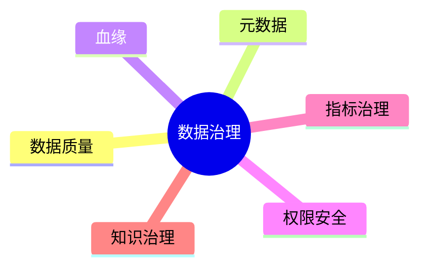

# 13. 数据治理与工程化

::: tip 本章导读
覆盖质量、元数据、血缘、权限、指标和 AI 知识治理，让数据平台长期可信。
:::
::: info 本章验收问题
- 你能否为一个指标或知识库写出最小治理卡片？
- 你能否说明数据治理为什么必须嵌入流程，而不是最后补文档？
:::




大数据平台不是只会跑 SQL。

真正的平台价值来自可信、可追踪、可复用、可治理。

## 问题切入

没有治理的数据平台，会从数据湖变成数据沼泽，从指标平台变成口径争吵现场，从 AI 知识库变成不可追溯的上下文堆。

前面章节已经把数据系统扩展到很多组件：PostgreSQL、数仓、ETL、批处理、实时处理、OLAP、湖仓、向量数据库和图数据库。系统能力越强，混乱的放大效应也越强。

常见事故包括：

```text
两个团队的 GMV 指标不一致，没人知道哪个可信。
上游字段改名后，下游几十张表和看板静默出错。
RAG 回答引用了过期文档，用户不知道来源。
向量检索返回了用户无权访问的内部材料。
图谱关系抽取错误，GraphRAG 沿错误路径生成答案。
数据质量任务失败，但报表仍然正常刷新。
```

这些问题不是再买一个数据库或计算引擎就能解决的。它们需要治理机制贯穿数据生命周期。

## 核心判断

> 数据治理不是上线前的附加项，而是让数据长期可用的基础设施。

没有治理的数据平台，会从数据湖变成数据沼泽——GMV 口径三套、字段含义无人知晓、权限失控、RAG 引用过时文档。这一章讲数据治理不是管理制度，而是让数据可发现、可信任、可追踪、可控制的系统性工程。治理不嵌入流程，文档最后一定过期。

治理也不是单独一个后台系统就能完成。它必须嵌入采集、建模、转换、调度、查询、检索、权限、评测和发布流程中。没有流程执行的治理文档，最后仍然会变成过期说明。

## 机制解释

## 本章内容

| 节号 | 主题 |
|------|------|
| [13.1](/chapters/13/13-1) | 数据治理概述 |
| [13.2](/chapters/13/13-2) | 数据质量管理 |
| [13.3](/chapters/13/13-3) | 数据标准与规范 |
| [13.4](/chapters/13/13-4) | 数据安全与合规 |
| [13.5](/chapters/13/13-5) | 元数据管理 |
| [13.6](/chapters/13/13-6) | 数据生命周期管理 |
| [13.7](/chapters/13/13-7) | 数据治理组织与流程 |
| [13.8](/chapters/13/13-8) | 数据治理工具与平台 |
| [13.9](/chapters/13/13-9) | 数据治理最佳实践 |
| [13.10](/chapters/13/13-10) | 数据治理常见问题 |
| [13.11](/chapters/13/13-11) | 数据治理实战案例 |
| [13.12](/chapters/13/13-12) | 数据治理实战任务 |


## 系统位置

### 最小治理数据模型

治理不能只写成制度。一个可落地的治理系统至少要有能存下来的数据模型：

| 治理对象 | 关键字段 | 解决的问题 |
| --- | --- | --- |
| 数据表 | table_id、系统、库、表、负责人、生命周期 | 谁拥有这张表，是否还能删除或下线 |
| 字段 | column_id、类型、含义、敏感级别、枚举规则 | 字段能否被正确理解和授权 |
| 指标 | metric_id、公式、时间口径、过滤规则、负责人、版本 | 同名指标是否同义，口径变更如何追踪 |
| 血缘 | source、target、任务、字段映射、运行版本 | 上游变化会影响哪些下游 |
| 质量规则 | 规则类型、阈值、执行频率、失败等级 | 数据错误能否在进入应用前被发现 |
| 权限策略 | 主体、资源、动作、条件、审计记录 | 谁能读、写、导出或用于模型训练 |
| AI 评测 | 问题、答案、来源命中、权限命中、人工评分 | RAG / GraphRAG 是否可信 |

这些对象可以先存在 PostgreSQL 中，不必一开始就建设大型治理平台。关键是从第一张核心表、第一条指标、第一批向量和第一组图关系开始记录来源、口径、质量和权限。

例如一个 RAG 系统的治理记录至少要包含：

```text
document_source：文档来自哪里，版本是什么，谁负责
chunk_lineage：Chunk 从哪个文档、页码、段落生成
embedding_version：使用哪个模型、维度、参数和生成时间
retrieval_log：查询、用户、召回 Chunk、分数、过滤条件
answer_evaluation：答案是否命中来源，是否越权，是否被人工接受
```

这样治理才进入 AI 数据链路本身，而不是系统出错后才补一张流程图。

数据治理是贯穿全书的控制面。

```text
PostgreSQL
  -> ETL / CDC
  -> 数仓 / 湖仓 / OLAP
  -> 向量数据库 / 图数据库
  -> BI / RAG / GraphRAG / 数据应用
```

治理在每一层都有对应对象：

| 层级 | 治理对象 |
| --- | --- |
| PostgreSQL | 表结构、主外键、权限、变更记录 |
| ETL / CDC | 同步状态、延迟、重试、schema 演化 |
| 数仓 | 分层、事实表、维度表、指标口径 |
| 批流处理 | DAG、任务血缘、质量检查、补数 |
| OLAP | 宽表、汇总表、查询权限、对账 |
| 湖仓 | Catalog、表格式、快照、schema 演化 |
| 向量 | 文档、chunk、embedding 版本、检索日志 |
| 图 | 实体、关系、本体、路径、图谱质量 |
| AI 应用 | 来源、权限、评测、反馈、审计 |

它也承接第 12 章湖仓：开放数据底座一旦跨多引擎、多团队、多应用，就必须依赖治理来保证可信和可控。

## 场景案例

设计一个治理 Mini Platform，可以包含八个模块：

```text
表目录
字段目录
指标字典
任务列表
血缘图
质量规则
权限策略
RAG 评测记录
```

当用户打开 `ads_sales_dashboard` 表时，平台应该能回答：

```text
这张表是谁负责？
多久更新一次？
字段 `paid_gmv` 的业务定义是什么？
它来自哪些 ODS / DWD / DWS 表？
最近 7 天质量检查是否通过？
哪些看板、API、RAG 应用依赖它？
哪些角色能访问明细，哪些只能访问汇总？
如果源表字段变更，会影响哪些下游？
```

为了让这些问题有答案，治理平台需要维护具体元数据。例如表目录：

```sql
CREATE TABLE table_catalog (
    table_id        SERIAL PRIMARY KEY,
    table_name      TEXT NOT NULL,
    schema_name     TEXT NOT NULL,
    layer           TEXT NOT NULL,        -- ODS / DWD / DWS / ADS
    owner           TEXT NOT NULL,
    update_freq     TEXT,                 -- daily / hourly / realtime
    description     TEXT,
    created_at      TIMESTAMP DEFAULT now()
);
```

字段目录：

```sql
CREATE TABLE field_catalog (
    field_id        SERIAL PRIMARY KEY,
    table_id        INT REFERENCES table_catalog(table_id),
    field_name      TEXT NOT NULL,
    field_type      TEXT NOT NULL,
    business_meaning TEXT,                -- 业务含义
    calc_formula    TEXT,                 -- 计算公式
    is_primary_key  BOOLEAN DEFAULT false,
    is_nullable     BOOLEAN DEFAULT true
);
```

指标字典：

```sql
CREATE TABLE metric_dict (
    metric_id       SERIAL PRIMARY KEY,
    metric_name     TEXT NOT NULL UNIQUE, -- 如 paid_gmv
    business_def    TEXT NOT NULL,        -- 业务定义
    calc_formula    TEXT NOT NULL,        -- 计算公式
    time口径        TEXT,                 -- 按支付时间 / 创建时间
    filter_cond     TEXT,                 -- 过滤条件，如 order_status = 'paid'
    owner           TEXT NOT NULL,
    version         INT DEFAULT 1
);
```

数据质量规则：

```sql
CREATE TABLE quality_rules (
    rule_id         SERIAL PRIMARY KEY,
    table_name      TEXT NOT NULL,
    rule_type       TEXT NOT NULL,        -- null_check / range_check / freshness / row_count
    rule_sql        TEXT NOT NULL,
    threshold       TEXT,
    alert_channel   TEXT,                 -- email / slack / pagerduty
    is_active       BOOLEAN DEFAULT true
);
```

示例质量规则：

```sql
-- 空值检查
INSERT INTO quality_rules (table_name, rule_type, rule_sql, threshold)
VALUES ('orders', 'null_check',
        'SELECT count(*) FROM orders WHERE order_id IS NULL',
        '0');

-- 行数波动检查
INSERT INTO quality_rules (table_name, rule_type, rule_sql, threshold)
VALUES ('orders', 'row_count',
        'SELECT count(*) FROM orders WHERE created_at >= current_date',
        '>= 70% of 7-day average');

-- 时效性检查
INSERT INTO quality_rules (table_name, rule_type, rule_sql, threshold)
VALUES ('ads_sales_dashboard', 'freshness',
        'SELECT extract(epoch FROM now() - max(updated_at)) / 3600 FROM ads_sales_dashboard',
        '< 25 hours');
```

血缘关系可以用一张简单的依赖表记录：

```sql
CREATE TABLE data_lineage (
    lineage_id      SERIAL PRIMARY KEY,
    source_table    TEXT NOT NULL,
    target_table    TEXT NOT NULL,
    transform_type  TEXT,                 -- etl / dbt / spark / flink
    task_name       TEXT,
    updated_at      TIMESTAMP DEFAULT now()
);
```

示例血缘数据：

```sql
INSERT INTO data_lineage (source_table, target_table, transform_type, task_name) VALUES
('orders',           'ods_orders',           'airbyte',   'daily_order_sync'),
('ods_orders',       'dwd_order_detail',     'dbt',       'dwd_order_detail'),
('dwd_order_detail', 'dws_daily_sales',      'dbt',       'dws_daily_sales'),
('dws_daily_sales',  'ads_sales_dashboard',  'dbt',       'ads_sales_dashboard');
```

这样当用户查询 `ads_sales_dashboard` 的血缘时，平台可以沿着 `data_lineage` 表回溯到 `ods_orders` 和 `orders`，形成完整链路。

当用户打开一个 RAG 答案时，平台也应该能回答：

```text
答案引用了哪些文档和 chunk？
这些文档是否在用户权限范围内？
chunk 由哪个解析版本和 embedding 模型生成？
检索结果是否经过重排？
这个问题是否在评测集中？
最近一次知识库更新是否让召回效果变好？
```

这就是治理从传统数据平台扩展到 AI 数据基础设施后的形态。

## 工程层对比：治理工具选型

| 维度 | Apache Atlas | DataHub (LinkedIn开源) | OpenMetadata | Amundsen (Lyft开源) | 自建元数据平台 |
|------|-------------|----------------------|-------------|--------------------|--------------|
| **定位** | Hadoop生态元数据治理 | 通用数据目录+血缘+治理 | 统一元数据+质量+血缘+协作 | 数据发现和目录 | 按业务场景定制 |
| **数据源覆盖** | Hive/HBase/Kafka/Spark为主 | PG/MySQL/Snowflake/BigQuery/Kafka等60+ | PG/MySQL/Snowflake/Redshift/BigQuery等30+ | PG/MySQL/Hive/S3等 | 自定义连接器 |
| **血缘能力** | 自动采集Hive/Spark血缘 | 自动采集SQL+dbt+Spark血缘 | SQL+dbt血缘自动采集 | Hive血缘为主 | 自建血缘表+手动补充 |
| **质量规则** | 内置基础规则 | 自定义质量检查 | 内置质量测试框架 | 基础统计 | 自定义规则引擎 |
| **权限/访问控制** | RBAC基础 | RBAC+细粒度策略 | RBAC+策略引擎 | 基础权限 | 自定义权限模型 |
| **代价** | 和Hadoop生态绑定重；部署复杂（Kafka+HBase+Solr） | 部署需要Kafka+ES+PostgreSQL（Neo4j可选） | 部署需要ES+MySQL+Kafka | 部署需要Neo4j+ES+PostgreSQL | 开发成本高；但完全匹配业务需求 |
| **失效条件** | 非 Hadoop生态→数据源覆盖不全 | 团队<3人难以运维3+组件 | 血缘自动采集对非SQL数据源支持有限 | 社区活跃度低（2021年后更新少） | 如果没有持续投入，自建平台3年后退化 |
| **注意事项** | Atlas对新数据源需写自定义hook；JanusGraph血缘查询需要调优 | DataHub的entity schema变更需同步API版本；Kafka消费延迟影响元数据时效性 | OpenMetadata的quality test支持手动触发、dbt集成和CRON自动调度；多数据源对齐需要统一命名规范 | Amundsen社区已不太活跃；不建议新项目采用 | 自建平台必须包含：元数据表、血缘表、质量规则表、权限策略表、告警配置表 |
| **推荐场景** | 已有Hadoop/Hive生态→Atlas作为默认治理 | 通用数据目录+多数据源+活跃社区 | 通用元数据+质量+协作+中等规模 | Lyft生态用户（不建议新项目） | 业务场景高度定制+治理需求超出开源工具覆盖范围 |

## 故障清单：治理常见故障

| 类别 | 具体症状 | 检测方法 | 根因（引用本章机制） | 缓解措施 | 严重度 |
|------|---------|---------|---------------------|---------|--------|
| 口径分裂 | 三个团队GMV指标分别是320万、280万、355万，无人知道哪个可信 | 用指标字典对比三套GMV定义的过滤条件、时间范围和状态排除 | 指标口径未统一定义——"GMV"在不同团队指代不同：是否排除退款、是否包含优惠券、是否含未支付订单（13.1节治理对象模型） | 建立指标字典强制统一口径；GMV定义必须包含5要素：时间范围+业务状态+是否退款+支付状态+币种；口径争议升级到治理委员会 | 严重 |
| 血缘断裂 | 上游orders表total_amount字段改名后，下游30+看板和数据产品静默出错 | 用血缘图扫描字段变更影响范围，对比变更前后下游任务报错率 | 字段变更未走影响分析流程——改名操作没有触发血缘扫描和下游通知（13.6节血缘发现机制） | 字段变更必须先跑血缘影响分析；改名后自动推送通知到下游任务owner；保留旧列名别名过渡期 | 高 |
| 权限泄露 | 用户通过RAG检索到了内部文档的chunk，通过图路径看到了无权限部门实体 | 用无权限账号测试RAG检索+图遍历，检查是否到达受限数据 | 权限只控制数据库表，未延伸到chunk/向量/图关系——数据库RBAC≠端到端权限（13.4节权限边界） | 权限策略统一管理SQL表+对象存储原文+chunk可见性+向量检索过滤+图节点visibility字段；每次检索和遍历检查权限 | 严重 |
| 治理失效 | 治理平台运行6个月后，指标字典覆盖率从80%降到30%，新增表无人登记 | 每月统计治理覆盖率：指标定义覆盖率、血缘覆盖率、质量规则覆盖率 | 治理未嵌入开发流程——新表创建不走治理登记，3个月后元数据平台和实际数据脱节（13.9节组织建设） | 新表/新任务/新指标创建必须在CI/CD中嵌入治理登记步骤；未登记表自动触发告警；治理覆盖率纳入团队KPI | 高 |

## 常见误区

**误区一：治理会拖慢开发。**

没有治理，短期快，长期会被口径冲突、质量事故、权限风险和重复建设拖慢。

**误区二：治理只是数据团队的事。**

业务定义、指标口径、权限规则和质量标准都需要业务、工程和数据团队共同维护。

**误区三：向量和图数据不需要治理。**

向量和图更需要治理，因为它们经常参与 AI 生成结果，一旦来源、权限和版本不清，风险更高。

**误区四：治理等于写文档。**

文档只是治理的一部分。真正有效的治理必须连接到任务、表、权限、质量检查、血缘、告警和发布流程。

**误区五：权限只要控制数据库表就够了。**

AI 场景还要控制对象存储原文、chunk、向量检索、图关系扩展和生成答案引用。权限边界必须端到端一致。

## 实战任务

设计一个数据治理 Mini Platform：

模块包括：

```text
表目录
字段目录
指标字典
任务列表
血缘图
质量规则
权限策略
RAG 评测记录
```

要求说明：

- 元数据存储表。
- 指标定义字段。
- 血缘关系表达方式。
- 质量规则如何运行。
- 权限如何影响 SQL、向量检索和图查询。
- 质量失败如何告警。

补充要求：

- 设计 `datasets`、`fields`、`metrics`、`lineage_edges`、`quality_rules`、`access_policies` 六张核心元数据表。
- 为 GMV 指标写一条完整治理记录。
- 为 RAG 文档权限设计一次检索过滤流程。
- 设计一次字段变更影响分析：`orders.total_amount` 改名会影响哪些下游对象。
- 设计质量失败后的处理流程：告警、阻断、降级、修复、复盘。

## 小结引出下一章

数据治理让数据平台从任务堆砌走向可信基础设施。

它覆盖质量、元数据、血缘、权限、指标和 AI 知识治理。

**纵向主线桥段：**

> **数据组织线终章**：从Ch2的SQL结果集→Ch5的事实/维度组织→Ch10的向量组织→Ch11的图组织→Ch12的表格式组织→本章的治理对象。治理把所有数据组织形态纳入统一管理——无论数据是表、向量、图还是文档，治理对象（元数据、血缘、质量规则、权限策略、指标定义）是跨形态的统一框架。
> **数据组织线推进**：治理让所有数据形态有了可追踪、可验证、可控制的管理层，但治理本身也是一种组织——治理对象的建模决定了治理的有效性。治理对象模型定义了五类核心对象（指标、血缘、权限、质量、审计），覆盖了从PG到湖仓到向量库的全链路。
> **数据组织线未解之问**：闭环完成——数据组织从"可存储"到"可管理"到"可治理"，治理是组织线的最后一层。

> **检索线终章**：从Ch2的SQL过滤排序→Ch3的索引加速→Ch10的ANN召回→Ch11的图遍历→本章的血缘发现。血缘发现是"检索"在治理层的延伸——从检索数据内容到检索数据之间的关系、来源和影响范围。
> **检索线推进**：血缘让数据的来源和影响范围变得可追溯，但血缘信息本身需要被维护和检索——血缘断裂是治理系统的常见故障，上游字段改名后下游30+看板静默出错。
> **检索线未解之问**：闭环完成——检索从"找数据"到"找关联"到"找来源和影响"，血缘是检索线的治理闭环。

> **一致性线终章**：从Ch2的聚合口径→Ch5的建模约束→Ch6的CDC一致性→Ch8的Exactly Once→Ch10的Embedding版本一致性→Ch11的图数据一致性→Ch12的湖仓快照隔离→本章的治理审计闭环。12章的一致性线到此完成闭环——从单表口径到跨系统审计，治理是所有一致性问题的最后一道防线。
> **一致性线推进**：口径治理统一了定义，但定义本身的选择是业务决策——治理不解决业务决策的正确性，只解决定义的一致性。审计闭环确保了"可追踪和可验证"，但不确保"决策正确"。
> **一致性线未解之问**：闭环完成——一致性从"单表级"到"跨系统级"到"审计级"，治理审计是一致性线的终极形态。

> **建模线终章**：从Ch2的SQL聚合建模→Ch5的星/雪花建模→Ch10的分块+Embedding建模→Ch11的本体建模→Ch12的湖仓建模→本章的指标口径建模。指标口径建模把所有建模线串联起来——无论数据在PG、数仓、湖仓还是向量库，口径必须一致、可追溯、可审计。
> **建模线推进**：指标口径建模解决的是"同一个指标在不同系统中定义是否一致"的问题——GMV口径必须包含5要素（时间范围+业务状态+是否退款+支付状态+币种）。这是建模线的治理闭环。
> **建模线未解之问**：闭环完成——建模从"物理组织"到"语义定义"到"口径治理"，指标口径是建模线的终极形态。

> **故障与边界线终章**：从Ch2的口径错误→Ch9的查询超时→Ch10的召回噪声→Ch11的图幻觉→Ch12的多引擎冲突→本章的治理失效。治理失效是所有故障线的终极形态——当质量规则无人执行、血缘无人维护、权限无人检查，所有前面章节精心设计的一致性和边界防线都会退化。
> **故障与边界线推进**：治理失效不是技术bug而是组织问题——流程过重导致审批绕行，规则堆积无人执行，治理覆盖率从80%降到30%。治理作为基础设施而非决策替身的根本边界在于：它只能确保可追踪和可验证，不能确保业务决策正确。
> **故障与边界线未解之问**：闭环完成——故障从"技术级"到"运维级"到"组织级"，治理失效是故障与边界线的终极形态。

下一章进入项目实战。

因为理解系统还不够，必须把 PostgreSQL、SQL、数仓、批流、OLAP、湖仓、向量、图和治理串成可运行的项目闭环。
