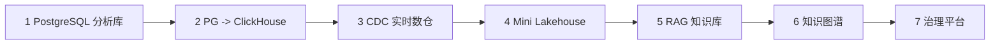

# 14. 大数据方向项目实战

::: tip 本章导读
用 7 个项目把 PostgreSQL、OLAP、实时、湖仓、RAG、图和治理串成可执行闭环。
:::
::: info 本章验收问题
- 你能否从 7 个项目里看出 PostgreSQL 到 AI 数据系统的连续演化关系？
- 你能否区分“可检查骨架”和“端到端已跑通”的证据差别？
:::




前面的章节建立了系统理解。

这一章把它们压成可执行项目。

## 问题切入

项目不是为了堆技术栈，而是验证一条完整路径：

```text
PostgreSQL 业务数据
  -> SQL 分析
  -> 数仓建模
  -> ETL / CDC
  -> OLAP / 批处理 / 实时处理
  -> 湖仓
  -> 向量检索 / 图关系分析
  -> 数据治理
```

如果只读概念，读者很容易产生错觉：知道 PostgreSQL、ClickHouse、Kafka、Flink、Iceberg、Milvus、Neo4j 的名字，就等于理解了数据系统。真正的能力要通过项目验证：

```text
能不能设计表结构？
能不能写出可解释 SQL？
能不能把数据从业务库同步到分析系统？
能不能处理失败、重跑、延迟和质量检查？
能不能说明每个组件为什么出现，以及不解决什么问题？
能不能把结构化分析、语义检索、关系网络和治理串起来？
```

## 核心判断

前面 13 章建立了从 PostgreSQL 到 AI 数据基础设施的完整判断体系。这一章用 7 个项目把这些判断串起来——不是教程式的 step-by-step，而是每个项目有一条清晰的数据链路和可检查的交付产物。项目的价值在于验证你能否把"知道"转成"做到"。

每个项目都必须交付可检查产物：架构图、数据模型、核心 SQL、数据链路、验收指标、运行说明和复盘记录。没有这些产物，项目只是 Demo，不是能力证明。

本书在仓库中配套了 `project-workbench/` 目录，把本章七个项目拆成可检查的项目骨架。读者可以先运行 `pnpm projects:verify` 确认项目文档结构完整，再逐个补真实脚本、DDL、查询和运行记录。

## 机制解释

七个项目按系统演化顺序排列：

```text
PostgreSQL 分析库
  -> PostgreSQL 到 OLAP
  -> CDC 实时数仓
  -> Mini Lakehouse
  -> RAG 向量知识库
  -> 知识图谱与 GraphRAG
  -> 数据治理 Mini Platform
```

它们分别验证不同能力：

| 项目 | 验证能力 |
| --- | --- |
| 项目 1 | PostgreSQL、SQL、指标口径、大表直觉 |
| 项目 2 | OLTP/OLAP 分离、列式分析、宽表和汇总 |
| 项目 3 | CDC、Kafka、Flink、实时窗口和状态 |
| 项目 4 | 对象存储、Parquet、Iceberg、Catalog、多引擎 |
| 项目 5 | 文档、chunk、embedding、向量检索、RAG 评测 |
| 项目 6 | 实体、关系、路径、图算法、GraphRAG |
| 项目 7 | 元数据、血缘、质量、权限、指标和知识治理 |

### 14.8 项目实战指南

前面学习了多个实战项目，了解了不同类型的数据系统搭建。

如何开始项目实战？如何选择合适的项目？如何规划项目进度？如何评估项目成果？

**场景**：
```yaml
项目实战指导：

学员："有这么多项目，从哪个开始？"

导师："需要实战指南"

架构师："循序渐进"
```

**项目选择建议**：
```yaml
初级项目（入门）：
- 项目一：电商数仓搭建
- 适合：初学者
- 时间：8-10小时
- 价值：掌握数仓基础

中级项目（进阶）：
- 项目三：用户行为分析平台
- 项目四：日志分析系统
- 适合：有一定基础
- 时间：8-10小时
- 价值：掌握实时处理

高级项目（精通）：
- 项目二：实时推荐系统
- 项目五：知识图谱构建
- 项目六：数据中台搭建
- 适合：有丰富经验
- 时间：10-15小时
- 价值：综合应用能力

推荐路径：
第1个项目：项目一（数仓）
第2个项目：项目三（用户行为）
第3个项目：项目二（推荐）或项目四（日志）
第4个项目：项目五（知识图谱）或项目六（中台）
```

**项目实施流程**：
```yaml
阶段1：需求分析（1-2小时）
- 明确业务需求
- 定义技术目标
- 评估数据规模
- 选择技术栈

阶段2：架构设计（2-3小时）
- 系统架构设计
- 数据模型设计
- 接口设计
- 技术选型

阶段3：开发实现（4-8小时）
- 环境搭建
- 数据开发
- 功能开发
- 联调测试

阶段4：测试优化（1-2小时）
- 功能测试
- 性能测试
- 问题优化
- 文档完善

阶段5：部署上线（1小时）
- 部署配置
- 上线验证
- 监控配置
- 项目总结
```

**项目评估标准**：
```yaml
完成度评估：
✓ 功能完成度>80%
✓ 核心功能可用
✓ 基本无Bug

质量评估：
✓ 代码规范
✓ 架构合理
✓ 文档齐全

能力评估：
✓ 理解需求
✓ 独立完成
✓ 解决问题
✓ 持续优化
```

**学习建议**：
```yaml
1. 循序渐进
   - 从简单到复杂
   - 从单点到系统
   - 从模仿到创新

2. 理论结合
   - 先学习理论
   - 再动手实践
   - 最后总结反思

3. 记录总结
   - 记录过程
   - 总结经验
   - 分享交流

4. 持续优化
   - 不断改进
   - 追求卓越
   - 超越自我
```

**预期时间**：每个项目8-15小时

## 系统位置

### 项目验收矩阵

第 14 章的项目不是展示工具，而是把全书能力压成可检查产物。每个项目至少要从五个方向验收：

| 验收方向 | 必需证据 | 不合格表现 |
| --- | --- | --- |
| 数据模型 | schema、ER 图、粒度说明、主键和状态字段 | 表能创建，但一行代表什么说不清 |
| 计算逻辑 | SQL、任务脚本、窗口定义、指标公式 | 只有结果截图，没有口径和可重复计算过程 |
| 链路运行 | 数据输入、转换、输出、重跑、失败恢复 | Demo 只能顺序跑一次，失败后不能恢复 |
| 质量对账 | 行数、金额、主键重复、延迟、来源命中 | 任务成功但没有证明结果正确 |
| 治理边界 | 元数据、血缘、权限、评测、风险清单 | BI、RAG 或 GraphRAG 结果无法追溯 |

七个项目的验收重点也不同：

| 项目 | 最核心验收点 |
| --- | --- |
| PostgreSQL 分析库 | schema、约束、指标 SQL、执行记录和基础对账 |
| PostgreSQL 到 ClickHouse | 宽表映射、MergeTree 设计、OLTP/OLAP 边界和指标对账 |
| CDC 实时数仓 | 事件语义、Watermark、Checkpoint、Sink 幂等和离线对账 |
| Mini Lakehouse | 对象存储布局、Iceberg 表、Schema 演化和多引擎查询 |
| RAG 向量知识库 | Chunk、Embedding、权限过滤、召回日志和评测集 |
| 知识图谱与 GraphRAG | 实体关系模型、多跳查询、路径证据和图谱版本 |
| 治理 Mini Platform | 元数据、指标、血缘、质量、权限和 AI 评测记录 |

如果一个项目只能说明“用了什么工具”，但不能拿出这些证据，它还没有完成本书意义上的实战任务。

项目实战是从“知识理解”到“系统构建”的转换层。

它把前面章节串成闭环：

```text
第 1-3 章：PostgreSQL 与 SQL 基础
第 4-6 章：OLTP/OLAP、数仓、ETL
第 7-9 章：批处理、实时处理、OLAP 查询服务
第 10-13 章：向量、图、湖仓、治理
```

如果读者只完成项目 1-2，说明已经能从业务库走向分析库；完成项目 3-4，说明具备批流和湖仓基础；完成项目 5-7，说明能把 AI 数据系统和治理纳入统一平台。

## 场景案例

一个完整的毕业项目可以是“智能电商数据平台”：

```text
PostgreSQL 保存用户、商品、订单、支付和事件。
ClickHouse 承载经营看板和多维分析。
Kafka / Flink 生成实时订单监控。
MinIO / Iceberg 保存长期历史明细、日志和 AI 中间产物。
pgvector / Milvus 构建商品和客服文档 RAG。
Neo4j / NebulaGraph 构建用户、商品、类目、行为关系图。
治理平台统一管理表、字段、指标、血缘、权限和评测。
```

这个项目不是要求一口气做完全部工程，而是让每个阶段都有清晰产物。最终读者应该能解释：哪些数据留在 PostgreSQL，哪些进入 OLAP，哪些进入湖仓，哪些进入向量库，哪些进入图数据库，哪些规则由治理平台统一控制。

## 常见误区

**误区一：项目越大越能证明能力。**

初学阶段更重要的是闭环完整、边界清楚、验证明确。一个能跑通、能解释、能复盘的小项目，比一个堆满工具但无法验证的数据平台更有价值。

**误区二：只要工具启动成功，项目就完成了。**

工具启动只是环境准备。项目完成要看数据是否流动、模型是否清楚、指标是否可信、失败是否能恢复、结果是否能验证。

**误区三：AI 项目可以跳过数据平台基础。**

RAG、GraphRAG 和智能数据应用仍然依赖文档、元数据、权限、日志、评测和治理。跳过数据平台基础，AI 应用很难长期可信。

**误区四：项目不需要写复盘。**

复盘记录能说明每个组件解决什么、不解决什么、遇到什么故障、如何验证和如何扩展。它是从 Demo 走向工程能力的关键。

## 实战任务

选择一个项目作为当前阶段主项目，并为它写一份项目计划。

计划必须包含：

- 问题背景。
- 数据源。
- 架构图。
- 数据模型。
- 核心任务。
- 验收指标。
- 运行命令。
- 质量检查。
- 权限和治理边界。
- 复盘问题。

推荐顺序是：

```text
项目 1
  -> 项目 2
  -> 项目 3
  -> 项目 4
  -> 项目 5
  -> 项目 6
  -> 项目 7
```

这个顺序从单机数据库开始，到 OLAP，再到实时，再到湖仓，再到 AI 检索和治理。

不要一开始就追求全量平台。

每个项目都应该交付：

- 架构图。
- 数据模型。
- 核心 SQL。
- 数据链路。
- 验收指标。
- 常见问题记录。

不要一开始就追求全量平台。每个项目都应该先形成最小闭环，再逐步扩展。

## 小结引出下一章

项目实战的目标不是证明“我会装工具”，而是证明你能把数据从业务库带到分析系统，再带到 AI 应用，并且知道每一层的边界、代价和治理要求。

下一章进入推荐学习顺序。

因为项目可以并行延展，但学习不能乱跳。读者需要知道应该先补哪一层能力，再进入下一层系统。
