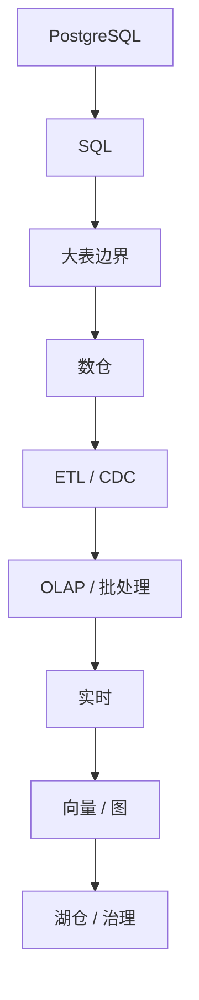

# 15. 推荐学习顺序

::: tip 本章导读
给出从 PostgreSQL 到数据治理的阶段化学习路径，避免直接跳工具。
:::




学习数据系统最怕两件事。

## 问题切入

第一，直接跳工具。

第二，长期停留在单点语法。

合理顺序应该是：先建立 PostgreSQL 和 SQL 的底层直觉，再逐步进入数仓、数据链路、批流、OLAP、湖仓、向量、图和治理。

如果顺序错了，学习会出现两种典型问题：先学 Spark / Flink，却不知道数据为什么要建模、分层和治理；或者长期停留在 SQL 练习题里，不知道业务库、数仓、湖仓和 AI 数据系统如何连接。

## 核心判断

推荐顺序不是按工具流行度排列，而是按系统问题的出现顺序排列。先理解业务数据如何被组织，再理解分析查询如何表达，再理解单机边界为什么引出数仓、批流、OLAP、湖仓、向量、图和治理。

这条路线的关键是：每一步都能回答“上一层解决了什么，又留下什么问题”。

## 机制解释

### 第一阶段：PostgreSQL 与 SQL 分析

目标：

- 理解表、行、列、主键、外键、约束、事务、索引。
- 掌握基础查询、聚合、JOIN、CTE、窗口函数和指标 SQL。

这一阶段不要急着学 Spark 或 Flink。

如果不会用 SQL 准确表达业务问题，进入大数据系统后只会把复杂度放大。

### 第二阶段：PostgreSQL 大表与边界

目标：

- 理解大表为什么慢。
- 学会分区、索引、物化视图、执行计划。
- 能判断业务库分析边界。

这一阶段训练的是系统压力判断。

你要知道什么时候加索引，什么时候做预计算，什么时候应该把分析迁出去。

### 第三阶段：数仓建模

目标：

- 理解 ODS / DWD / DWS / ADS。
- 设计事实表和维度表。
- 定义指标口径。
- 管理粒度和血缘。

这一阶段从“查表”进入“建模”。

### 第四阶段：ETL / CDC

目标：

- 理解数据如何从 PostgreSQL 进入数仓。
- 区分 ETL / ELT。
- 理解 CDC、WAL、Debezium、Kafka Connect。
- 能设计批量和实时同步链路。

这一阶段从“模型设计”进入“工程链路”。

### 第五阶段：OLAP 与批处理

目标：

- 理解 ClickHouse / Doris / DuckDB。
- 理解 Hive / Spark / Trino。
- 理解列式存储、Shuffle、Parquet、ORC、MPP。

这一阶段学习如何处理历史数据和高性能分析。

### 第六阶段：实时数据

目标：

- 理解 Kafka 事件流模型。
- 理解 Flink 状态计算。
- 掌握 Event Time、Watermark、Window、Checkpoint。

这一阶段学习如何回答“正在发生什么”。

### 第七阶段：向量数据库

目标：

- 理解 Embedding。
- 理解 Chunking。
- 理解 Vector Search。
- 掌握 pgvector、Milvus / Qdrant 的边界。
- 理解 Hybrid Search 和 RAG。

这一阶段把非结构化数据接入 AI 应用。

### 第八阶段：图数据库

目标：

- 理解图模型。
- 学会 Cypher 基础。
- 理解 Neo4j / NebulaGraph。
- 理解知识图谱、图算法和 GraphRAG。

这一阶段把关系网络纳入数据系统。

### 第九阶段：数据湖 / 湖仓

目标：

- 理解对象存储。
- 理解 Parquet。
- 理解 Iceberg / Delta / Hudi。
- 理解 Catalog 和多引擎查询。

这一阶段建立开放存储和现代分析底座。

### 第十阶段：数据治理

目标：

- 理解元数据。
- 理解数据质量。
- 理解数据血缘。
- 理解指标治理。
- 理解向量和图数据治理。
- 理解权限安全、调度运维和成本优化。

这一阶段让数据系统从“能跑”变成“可信、可管、可复用”。

## 系统位置

本章是全书的学习路线控制面。第 1-14 章回答“每一类系统是什么、为什么出现、如何落地”，本章回答“读者应该按什么顺序掌握这些能力”。

它也为第 16 章能力地图做准备：学习顺序描述路径，能力地图描述最终应形成的能力结构。

## 场景案例

如果读者当前只会写基础 SQL，推荐路线是：

```text
先完成 PostgreSQL 电商分析库
  -> 再做 PostgreSQL 到 ClickHouse
  -> 再做 CDC 实时订单看板
  -> 再做 Mini Lakehouse
  -> 最后做 RAG、GraphRAG 和治理平台
```

如果读者已经做过数仓，但对 AI 数据系统不熟，推荐从第 10 章开始补向量、图和知识治理，但仍要回头确认第 5、6、13 章的建模、链路和治理能力是否扎实。

## 常见误区

**误区一：先学最火的工具。**

工具热度不等于学习顺序。没有 SQL、建模和链路基础，直接学 Spark、Flink 或向量数据库，很容易只会跑 Demo。

**误区二：学完 PostgreSQL 就停下。**

PostgreSQL 是入口，不是终点。它帮助建立数据库直觉，但大规模分析、实时处理、湖仓、AI 检索和治理还需要继续迁移。

**误区三：AI 数据系统可以跳过数仓和治理。**

RAG 和 GraphRAG 仍然需要数据来源、权限、版本、评测和质量控制。AI 只会放大数据基础的好坏。

## 实战任务

给自己写一份 30 天学习计划：

- 第 1 周：PostgreSQL、SQL、指标口径。
- 第 2 周：大表、OLTP/OLAP、数仓建模。
- 第 3 周：ETL/CDC、批处理、实时处理、OLAP。
- 第 4 周：湖仓、向量、图、治理和项目复盘。

每周至少交付一个可检查产物：SQL 文件、建模文档、链路设计、架构图、评测表或治理清单。

## 小结引出下一章

推荐路线是：

```text
PostgreSQL
  -> SQL
  -> 大表边界
  -> 数仓
  -> ETL / CDC
  -> 批处理 / OLAP
  -> 实时计算
  -> 向量
  -> 图
  -> 湖仓
  -> 治理
```

这条路线的优势是每一步都能解释下一步为什么出现。

下一章进入能力地图，把这条路线沉淀成可检查的能力结构。
