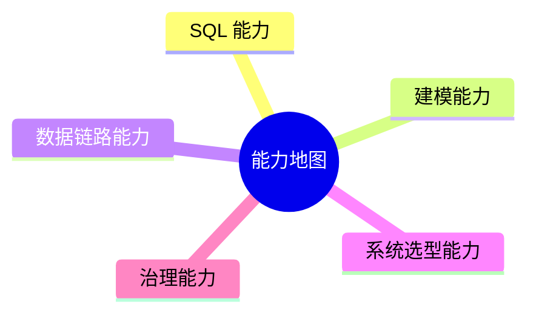

# 16. 能力地图

::: tip 本章导读
把全书能力沉淀为 SQL、建模、链路、选型和治理五类能力。
:::


## 本章阅读框架

| 阅读问题 | 本章回答方式 |
| --- | --- |
| 这个问题为什么出现？ | 从业务增长、数据规模、系统目标或 AI 应用压力切入。 |
| 它解决什么问题？ | 提炼为一个核心判断，避免把概念写成孤立定义。 |
| 它不解决什么问题？ | 在机制解释和常见误区中说明边界，防止工具崇拜。 |
| 它在真实平台哪里出现？ | 放回 PostgreSQL、数仓、批流、OLAP、湖仓、向量、图和治理的演化链路。 |
| 读完要会做什么？ | 通过场景案例和实战任务转成可练习的判断。 |



完成本书后，能力不应该表现为“知道很多工具名”，而应该表现为能在具体系统问题中做判断。

## 问题切入

能力地图分为五类：SQL 能力、建模能力、数据链路能力、系统选型能力、治理能力。

很多学习者的问题不是没学过工具，而是无法把工具放到系统问题中判断：

```text
这个查询应该留在 PostgreSQL，还是进 ClickHouse？
这个指标冲突是 SQL 问题、建模问题，还是治理问题？
这个 RAG 效果差，是向量库问题，还是文档解析和评测问题？
这个实时链路延迟高，是 Kafka、Flink、Sink，还是业务期望不合理？
```

本章把全书能力收束成一张检查表。

## 核心判断

真正的数据库和数据平台能力，不是知道每个系统的定义，而是能判断问题属于哪一层、该用什么机制解决、会引入什么代价、哪些边界不能越过。

## 机制解释

### 一、SQL 能力

SQL 能力是大数据方向的基础硬技能。

包括：

- 查询。
- 聚合。
- JOIN。
- CTE。
- 窗口函数。
- 指标计算。

合格标准不是会写语法，而是能把业务问题变成可解释 SQL。

例如：

```text
业务问题：新用户 7 日留存是多少？
  -> 定义新用户
  -> 定义回访
  -> 明确时间字段
  -> 去重 user_id
  -> 按注册日期分组
  -> 输出留存率
```

### 二、建模能力

建模能力决定数据是否可分析、可复用、可治理。

包括：

- 业务建模。
- 事实表。
- 维度表。
- 宽表。
- 分层模型。
- 向量数据模型。
- 图数据模型。

核心问题始终是：

```text
一行代表什么？
字段描述什么？
关系如何表达？
指标如何计算？
权限如何继承？
版本如何追踪？
```

### 三、数据链路能力

数据链路能力决定数据能否持续进入平台。

包括：

- 批处理。
- 流处理。
- CDC。
- ETL。
- ELT。
- Embedding Pipeline。
- Graph Construction Pipeline。
- 调度。
- 质量校验。

核心判断是：

> 数据链路不是一次性脚本，而是可重跑、可观察、可恢复、可追踪的工程系统。

### 四、系统选型能力

系统选型不是背优缺点，而是在需求和边界之间做匹配。

| 系统 | 主要定位 |
| --- | --- |
| PostgreSQL | 业务库 / 中小分析 / pgvector / 元数据 |
| ClickHouse | 高性能 OLAP |
| Doris | 实时数仓 / BI |
| Spark | 离线大规模计算 |
| Flink | 实时流计算 |
| Kafka | 事件流 / 数据总线 |
| Iceberg | 湖仓表格式 |
| Trino | 联邦查询 |
| DuckDB | 本地分析 |
| Milvus / Qdrant | 向量检索 |
| Neo4j / NebulaGraph | 图关系分析 |

选型时至少问：

```text
数据规模多大？
延迟要求多高？
写入模式是什么？
查询模式是什么？
一致性要求是什么？
团队是否能运维？
是否需要治理和权限？
是否已有系统可以满足？
```

### 五、治理能力

治理能力让数据系统长期可信。

包括：

- 元数据管理。
- 数据质量。
- 数据血缘。
- 指标治理。
- 向量数据治理。
- 图谱治理。
- 权限安全。
- 调度运维。
- 成本优化。

治理不是“平台成熟以后再做”，而是从第一条数据链路、第一张指标表、第一批文档向量开始就应该建立基本规则。

### 六、能力分级

能力地图还需要分级，否则容易把“听过”“会跑 Demo”和“能做系统判断”混在一起。

| 能力层级 | 表现 | 不合格信号 |
| --- | --- | --- |
| 入门 | 能解释概念，能完成单点练习 | 只能复述定义，不能说明它解决什么问题 |
| 可用 | 能在一个项目中交付 SQL、模型、链路或治理清单 | 产物能跑，但没有口径、血缘、质量或边界说明 |
| 熟练 | 能定位问题属于 SQL、建模、链路、选型还是治理 | 遇到问题只会更换工具，不会拆解原因 |
| 系统化 | 能设计端到端链路，并说明每层取舍和失败模式 | 架构图堆组件，但没有数据粒度、延迟、一致性和权限边界 |
| 可带人 | 能把能力拆成任务、验收标准和复盘机制 | 团队依赖个人经验，不能沉淀为稳定流程 |

对本书来说，最低目标不是“入门”，而是达到“可用”：能用可检查产物证明自己理解了系统机制。最终目标是靠第 14 章项目和第 17 章毕业设计逼近“熟练”和“系统化”。

### 七、能力之间的依赖关系

这些能力不是并列清单。它们有依赖顺序：

```text
SQL 表达能力
  -> 建模能力
  -> 数据链路能力
  -> 系统选型能力
  -> 治理能力
  -> AI 数据应用能力
```

SQL 能力不足时，指标会错。建模能力不足时，表会不可复用。链路能力不足时，数据会不稳定。选型能力不足时，系统会过度复杂或性能不足。治理能力不足时，数据会失去信任。AI 数据应用能力不足时，向量、图和模型会变成不可追溯的黑盒。


### 深度展开：能力地图如何落到真实系统

本节补齐本章的工程细节。阅读时不要只记住概念名称，而要把它放回“输入是什么、处理路径是什么、输出给谁、边界在哪里、如何验证”的链路中。

#### 一、它从什么问题开始

读完整本书后，需要把知识点转成能力结构，否则很容易仍然停留在工具记忆。

这个问题通常不会以技术名词出现，而是以业务现象出现：报表变慢、指标不一致、实时看板延迟、RAG 召回不稳定、数据无法追溯、项目 Demo 无法验收。能不能把现象还原成系统问题，是本书要训练的第一层能力。

#### 二、输入数据和前置判断

输入是已完成的 SQL、建模、链路、OLAP、湖仓、AI 检索、图分析和治理练习。

在动手之前，至少要确认四件事：

| 判断项 | 要回答的问题 |
| --- | --- |
| 数据粒度 | 一行代表什么事实，是用户、订单、订单明细、事件、文件、Chunk，还是一条关系？ |
| 时间边界 | 使用创建时间、更新时间、支付时间、事件时间，还是处理时间？ |
| 状态边界 | 哪些状态算有效，哪些测试、取消、退款、重复或迟到数据要排除？ |
| 责任边界 | 这个环节负责记录事实、生产指标、加速查询、治理质量，还是服务 AI 应用？ |

#### 三、处理路径

处理路径是把能力拆成查询表达、数据建模、链路工程、系统选型、治理可信和 AI 数据应用六类，再为每类定义可验证表现。

这条路径应该能被写成可执行流程，而不是停留在术语解释。一个合格的设计至少要说明：数据从哪里来、经过哪些转换、写到哪里、谁消费、失败后如何重跑、结果如何校验。

#### 四、在真实平台中的位置

真实团队会用能力地图做培养、面试、项目分工和技术评审。它把“会不会某个工具”改成“能否解释问题、设计边界、验证结果”。

平台位置决定了它和前后系统的关系。不要孤立地问“这个技术好不好”，而要问：

- 它继承了上一层什么问题？
- 它把什么复杂度转移给了下一层？
- 它的输出是否能被复用、追溯和治理？
- 它是否改变了数据粒度、延迟、一致性或权限边界？

#### 五、边界和失败模式

能力地图不是证书目录。一个人可以不会所有工具，但必须能判断工具为什么出现、什么时候不该用、如何验证效果。

常见失败信号可以这样检查：

| 失败信号 | 应该追问什么 |
| --- | --- |
| 简历堆满工具但项目说不清边界 | 定位到具体输入、口径、链路、边界或治理责任。 |
| 只会写任务不会做质量检查 | 定位到具体输入、口径、链路、边界或治理责任。 |
| 只会搭 RAG 不会治理数据来源 | 定位到具体输入、口径、链路、边界或治理责任。 |
| 系统选型只看流行度 | 定位到具体输入、口径、链路、边界或治理责任。 |

#### 六、可操作练习

用能力地图给自己的项目打分：每类能力列出证据、缺口、下一步补强任务和验收方式。

练习完成后不要只看“有没有跑通”，还要补一份复盘：

- 输入数据是否足以支撑问题？
- 口径和边界是否写清楚？
- 结果能否被重复计算和对账？
- 如果数据量扩大 10 倍，瓶颈会出现在哪里？
- 如果接入下游 BI、RAG 或治理系统，还缺哪些元数据？


## 系统位置

能力地图是第 15 章学习顺序的验收层，也是第 17 章最终学习目标的前置检查。

```text
学习顺序
  -> 形成能力
  -> 通过项目验证
  -> 达到最终目标
```

每一项能力都应该能在项目中找到证据：SQL 文件、数据模型、DAG、架构图、选型说明、治理规则、评测记录或复盘文档。

## 场景案例

面对“实时 GMV 看板和最终财务 GMV 不一致”这个问题，能力地图可以帮助定位：

```text
SQL 能力：两个 GMV 是否过滤条件一致？
建模能力：实时明细和离线明细的一行粒度是否一致？
数据链路能力：CDC 是否丢失、重复或延迟？
系统选型能力：实时看板是否被误当财务结算系统？
治理能力：指标是否有统一定义、血缘和负责人？
```

这个案例说明，真实问题通常不是单点工具问题，而是多类能力的组合判断。

## 常见误区

**误区一：能力等于工具清单。**

工具只是载体。能力是能把问题、机制、边界和代价讲清楚，并能用产物验证。

**误区二：SQL 能力和工程能力可以分开。**

SQL 是表达计算的基础，但真实平台还要考虑链路、调度、质量、权限和可恢复性。

**误区三：治理能力是管理岗才需要。**

任何写表、写指标、写检索链路、写图谱关系的人，都在生产可被复用或误用的数据资产，因此都需要治理意识。

## 实战任务

用本章五类能力审查第 14 章中的任意一个项目。

输出一张表：

| 能力 | 当前证据 | 缺口 | 下一步 |
| --- | --- | --- | --- |
| SQL 能力 | SQL 文件、指标口径 | 例如缺少留存 SQL | 补查询和口径说明 |
| 建模能力 | 表结构、ER 图 | 例如粒度不清 | 补事实表定义 |
| 数据链路能力 | DAG、同步脚本 | 例如不能重跑 | 补幂等和补数 |
| 系统选型能力 | 架构说明 | 例如选型无边界 | 补取舍说明 |
| 治理能力 | 质量规则、权限 | 例如无血缘 | 补元数据记录 |

再补一列“验收证据”，不要只写“已完成”。例如：

- SQL 能力的证据是 `.sql` 文件、执行记录、结果样例和口径说明。
- 建模能力的证据是表结构、粒度说明、主键、分区、维度和指标定义。
- 链路能力的证据是 DAG、重跑策略、失败恢复、对账记录和延迟记录。
- 选型能力的证据是需求边界、备选方案、取舍理由和成本估算。
- 治理能力的证据是元数据、血缘、质量规则、权限策略和审计记录。

## 小结引出下一章

能力地图的核心是迁移。

你在 PostgreSQL 中理解的表、行、列、主键、索引、事务、查询路径，会迁移到数仓事实表、湖仓表格式、向量元数据、图实体关系和数据治理。

真正的能力不是知道所有系统，而是知道每个系统在什么问题上出现，解决什么，不解决什么，如何与前后系统协作。

下一章用最终目标把这些能力收束为读者完成本书后应达到的状态。
