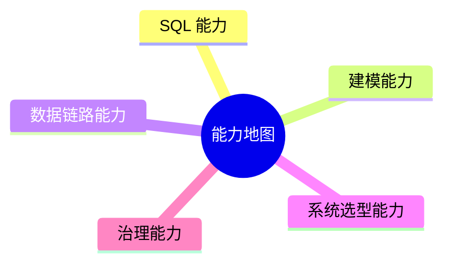

# 16. 能力地图

::: tip 本章导读
把全书能力沉淀为 SQL、建模、链路、选型和治理五类能力。
:::
::: info 本章验收问题
- 你能否用能力地图定位自己的短板，而不是只说“会不会某个工具”？
- 你能否把一个项目拆成 SQL、建模、链路、选型和治理五类能力？
:::




完成本书后，能力不应该表现为“知道很多工具名”，而应该表现为能在具体系统问题中做判断。

## 问题切入

能力地图分为五类：SQL 能力、建模能力、数据链路能力、系统选型能力、治理能力。

很多学习者的问题不是没学过工具，而是无法把工具放到系统问题中判断：

```text
这个查询应该留在 PostgreSQL，还是进 ClickHouse？
这个指标冲突是 SQL 问题、建模问题，还是治理问题？
这个 RAG 效果差，是向量库问题，还是文档解析和评测问题？
这个实时链路延迟高，是 Kafka、Flink、Sink，还是业务期望不合理？
```

本章把全书能力收束成一张检查表。

## 核心判断

真正的数据库和数据平台能力，不是知道每个系统的定义，而是能判断问题属于哪一层、该用什么机制解决、会引入什么代价、哪些边界不能越过。

## 机制解释

### 16.2 核心能力体系

数据工程师的能力体系不是按工具排列的（"会Spark、会Flink、会dbt"），而是按问题域组织的——每种能力对应解决一类数据问题。

全书覆盖的能力可以归为五个域：

**分析表达能力（第2章）**：将业务问题转化为数据计算过程。具体包括口径澄清（"新用户7日留存"到底指什么）、边界定义（哪些记录算、哪些不算）、计算逻辑设计（用什么聚合、怎么分组）、结果验证（数字是否合理）。这种能力与具体数据库无关——在PostgreSQL上学到的分析思维可以直接迁移到Spark SQL或Trino。

**数据工程能力（第3-8章）**：构建和维护数据处理管道。具体包括数据库性能管理（索引设计、查询优化、分区策略）、数仓建模（按星型模型组织数据、面向分析而非事务优化）、ETL/ELT工程（数据从源端到目标端的可靠搬运）、批处理调度（大规模离线计算的编排和质量门）、流处理（对实时性敏感的场景做持续计算）。这是数据工程师日常占比最高的能力。

**架构与选型能力（第9-13章）**：在多种技术方案之间做决策。具体包括OLAP系统选型（ClickHouse适合什么、Doris适合什么、什么场景不应该用OLAP引擎）、向量数据库选型（语义搜索用Milvus还是Pinecone、规模和数据特征如何影响选择）、图数据库选型（多跳查询场景下Neo4j和PostgreSQL递归CTE的边界在哪）、湖仓架构设计（什么时候数据湖就够了、什么时候需要湖仓一体）、数据治理体系设计（治理组织的建立和工具链的整合）。

**领域理解能力**：理解数据所代表的业务。这不是书中学的、也不是工具教的，但它是数据工程师区分度的关键来源。同样是写SQL，理解了电商的GMV口径、金融的风控逻辑、物流的时效定义，写出来的查询质量和业务价值完全不同。这项能力通过长期在业务中浸泡形成。

**影响力与传承能力（第16-17章）**：让技术决策被采纳、让知识在团队中流动。具体包括技术方案表达能力（为什么选A不选B，理由是什么）、知识沉淀能力（把一次性的分析变成可复用的指标和文档）、团队培养能力（帮助初级工程师建立正确的技术判断）。

这五个域之间存在依赖关系：分析表达是基础——如果拿到业务问题连怎么算都说不清，再好的工具也没用。数据工程是主体——不管你在什么公司、做什么业务，数据处理管道的构建和维护是绕不开的日常。架构选型是进阶——当你不再仅仅实现别人设计好的方案，而是开始参与甚至主导技术决策。领域理解是乘法——它让前三个能力的效果放大。影响力和传承是外部化——让个人能力转化为团队能力。

### 16.3 能力评估矩阵

模糊的自我认知是能力提升的最大障碍。常见的两种偏差是：刚学会窗口函数就觉得自己"精通SQL"——高估了深度；另一类是做过三年ETL但仍然觉得"我只会写数据管道"——低估了广度。

能力评估矩阵用一个统一框架对抗这种偏差。每个能力域按四个等级评估：

**L1：能在指导下完成**。给他一个明确的任务定义和一个参照样例，他能完成。例如"参考上个月的周报SQL模板，写出这个月的周报"。

**L2：能独立完成**。不需要参照样例，能独立理解需求、设计方案、实现并验证。例如"业务方要一个新品动销率报表，你能从'什么叫新品、什么叫动销'的澄清开始，独立完成整个分析链路"。

**L3：能指导他人和制定规范**。不仅能自己做好，还能告诉别人怎么做、为什么这么做。例如"你能为团队制定SQL编码规范，并解释为什么用CTE而非子查询嵌套、为什么分区键要放在WHERE条件的最前面"。

**L4：能在不确定场景下做技术决策**。面对没有现成方案的问题，能综合考虑业务需求、技术约束和团队能力，做出合理的选择并承担责任。例如"公司要做实时数仓，你判断用Flink还是Kafka Streams，并给出选择理由和风险说明"。

评估的工具很简单——对每个能力域，找两个问题：

第一个是"你能回忆起自己最近一次独立完成这个能力域相关任务的场景吗？"如果能清晰回忆出三个以上的独立完成案例，至少是L2。

第二个是"如果有初级同事在这个能力域上请教你，你能给出的建议是什么层次的？"如果只能回答"看文档"，那是L1；如果能给出"这个场景下应该用X而不是用Y，因为……"这样的有判断力的回答，至少是L3。

在此基础上做一个"差异分析"：把五个能力域分别填到L1-L4的格子里，看看分布。常见的有利于职业发展的分布是T型——一个或两个域到L3/L4（你的核心专业方向），其余域至少到L2（你的支撑能力宽度）。所有域都在L2但到不了L3，说明需要选一个方向深耕。某一个域到了L4但其余域都停留在L1，说明深度足够但宽度可能限制了你理解全链路问题的能力。

评估不需要频繁做——每个季度花一小时做一次回顾就够。重点是评估之后的行动：你决定在下一个季度重点提升哪个能力域的一个子项。

### 16.4 初级能力要求

初级数据工程师的定位是：能在既有的架构和规范下，独立完成明确需求的数据开发任务。关键词是"既有架构下"和"明确需求"——公司已经选好了技术栈、搭好了数据平台，需求已经有人澄清过了。

具体来说，初级阶段的五项关键能力及达标标准：

**SQL分析能力——L2**：能独立完成口径清晰的查询。拿到"I need weekly active users per country for Q1"这种需求后，知道先澄清"活跃的定义是什么"、"统计时间按哪个时区"、"country用哪个字段"这些问题，然后写出逻辑清晰的SQL（用CTE分步而非子查询嵌套），最后能通过交叉验证判断结果是否合理。不需要写出最优雅或最高效的查询，但写出来的查询必须可读、可验证。

**数据库操作能力——L1-L2**：能管理数据库对象（建表、建索引、授权），能理解基本的执行计划（知道一个查询慢了是没走索引还是扫描了太多数据）。不需要做复杂的性能调优——那是中级的事——但至少不能在线上库跑全表扫描而毫无察觉。

**ETL开发能力——L1-L2**：能在现有ETL框架下开发新的数据管道。典型的日常任务：上游多了一张业务表，你需要把它接入数据仓库的ODS层，然后写DWD层的清洗逻辑，再更新一个下游的汇总表。需求是明确的，架构是现成的，工具是团队已经选好的（Airflow+Spark或者DataX+MaxCompute），你负责的是实现。

**基础运维能力——L1**：能监控自己负责的任务是否正常运行，在告警触发时能按已有的SOP（标准操作流程）处理常见问题。比如ETL任务失败是因为上游数据延迟，你知道需要等上游恢复后重跑，而不是自己冲进去改代码。

**业务理解——L1**：了解自己负责的业务域的基础概念。做电商数仓的至少要知道GMV、客单价、转化率这些指标是什么含义，做用户增长的至少要知道DAU、留存率、LTV怎么算。不需要有业务洞察的能力，但拿到业务方的问题后不需要对方从零解释。

达到初级水平的时间线：有一定SQL基础（大学学过数据库概论这种程度）的人，全职投入学习加实践，通常3-6个月可以到达。如果本身是计算机相关专业且有实习经验，可能更快。这里的关键差异不在于"学了多少"，而在于"做了几个端到端的任务"——从理解需求到上线运行、从被问到"这个数字为什么是这样"到能自己回答。完成三个以上端到端任务通常标志着初级水平的稳固建立。

### 16.5 中级能力要求

初级到中级的质变发生在"从执行到负责"的转变。中级工程师不再仅仅完成分配的任务，而是对一个模块或一条数据链路的完整性和可靠性负责。

中级阶段的标志性特征：

**SQL分析能力——L3**：能写出团队规范，能从执行计划反向推演出查询的性能瓶颈。典型的中级场景：团队新来了一个初级工程师，写的查询跑了五分钟还不出结果。中级工程师看他的SQL和对表的数据量评估，能直接指出"你的JOIN条件少了一个分区字段，导致扫描了半年的数据而不是一天的数据"。更进一步，中级工程师能把这种判断沉淀为团队的SQL编码规范，让同类问题不再反复出现。

**性能优化能力——L2-L3**：能独立定位和解决数据管道的性能问题。场景：一个每天跑30分钟的ETL任务因为数据量增长开始超时。中级工程师会拆解这个任务——是某个JOIN慢了（看执行计划）、是某个子查询产生了数据倾斜（看Spark的Stage分布）、还是IO瓶颈（看数据量增长曲线）——然后针对性地解决（增加分区裁剪、优化JOIN顺序、增加中间落盘），而不是遇到慢就提资源。

**架构设计能力——L2**：能在给定业务需求下设计数据分层和建模方案。场景：公司要新增一个"用户增长"数据域，中级工程师能独立输出这个域的ODS-DWD-DWS-ADS的分层设计，包括维度建模（哪些是缓慢变化维度、哪些是快照事实）、增量更新策略（全量还是增量、用什么合并逻辑）、核心指标定义（新增用户、日活、留存的计算口径）。

**ETL工程化能力——L2-L3**：能设计管道而非只写任务。关注点从"让单个ETL跑通"升级到"让整个管道可靠"。具体包括：数据质量检查嵌入ETL流程（跑完数据自动检查完整性）、失败重试和告警策略（什么失败应该自动重试、什么应该停下等人介入）、依赖管理（修改上游表之前评估下游影响范围）。

**跨团队协作——L2**：能独立与业务方沟通需求。不需要组长帮他从业务方那里翻译需求，他能直接面对产品经理或数据分析师，澄清需求、评估工作量、承诺交付时间、在出现分歧时有理有据地解释为什么某个需求在当前架构下成本高。

从初级到中级的晋升，时间上典型是1.5-3年的工程实践积累。加速这个过程的关键变量是项目的复杂度广度——一直在同一个项目上做相似的ETL任务不会带来质变。主动接触不同类型的项目（做一段批处理再做一段流处理、维护完数仓再碰一次OLAP选型）能显著缩短这个周期。

### 16.6 高级能力要求

中级到高级的转变不在技术深度的线性增长，而在思维方式的变化：中级关注"怎么做"，高级关注"为什么做这个而不是那个"。

高级数据工程师的区分度体现在以下几个方面：

**技术决策能力——L4**：在多个可行方案中做出有理由的选择，并能为这个选择负责。场景：公司要从离线数仓升级到实时数仓。一位高级工程师不会直接说"用Flink"或"用Kafka Streams"，而是先梳理需求——哪些场景的实时延迟要求是秒级、哪些是分钟级、对这些场景分别评估Flink和Kafka Streams在运维复杂度、团队学习成本、与现有技术栈的兼容性上的差异——然后给出一个分层方案：核心交易场景用Flink保证低延迟，次要场景用Kafka Streams降低运维负担。给出的不是"哪个更好"的答案，而是"在什么约束下采取什么策略"的判断框架。

**系统设计能力——L3-L4**：能从零设计一个数据系统的架构。这和中级"在给定架构下设计一个数据域"的区别在于：高级面对的是初始状态没有技术栈、没有分层设计、没有现成规范的局面。他需要决定数据存储层用什么（对象存储+Iceberg还是直接用Doris存明细）、计算层用什么（Spark还是Flink还是两者分层）、调度层用什么（Airflow还是DolphinScheduler）、元数据层用什么（DataHub还是Atlas），并且这些决策要互相兼容。

**技术影响力——L3**：能通过技术决策和技术分享影响团队和其他团队。当高级工程师说"这个查询的写法有性能风险"，初级和中级会认真对待这个提醒并追问原因——不是因为职级，而是因为他的历史判断被验证过。高级工程师在团队中的存在让"有问题的方案"在更早阶段被拦截。

**不确定性处理**：高级面对的问题往往不是"已知问题的已知解法"，而是需求和技术都不确定。业务方说"我们想做一些用户分群，还没想好怎么分"，技术上说"现有的数据基础设施不支持低延迟的交互式分群查询"。高级工程师的应对是：先用DuckDB在本地做概念验证，证明交互式分群在几千万用户规模下是可行的，然后给出两套方案的选择（升级到ClickHouse还是做预计算宽表），让业务方和CTO在成本和性能之间做取舍，而非等着需求被明确。

**广度与深度的平衡**：高级工程师通常有一个T型的深化版——不是只有一个深度域（那还是中级），而是至少两个域到了L3-L4，其余域牢牢站在L2。典型的组合是：SQL分析+数据工程双深度（这是基础盘），加上OLAP或治理中的一个作为差异化深度（这是区分度）。

从高级到中级的晋升周期通常为3-5年，但年限不是决定因素。决定因素是是否承担过以下三类经历中的至少两个：主导过一次重大技术选型并落地成功、从零设计并交付过一个数据系统、在组织的技术规范和决策上有过实质影响。

### 16.7 专家能力要求

这里定义的"专家"不是技术职级的最高一级，而是指在某个能力域上达到了业界公认的专业水平——你的判断和方案在该领域能被同行认可和引用。

专家级与高级的分界在于：高级在组织内解决问题，专家在行业内解决问题。二者的差异不是技能数量上的差别，而是知识输出方式的不同。

专家级的典型特征：

**领域深度——L4+**：在某个能力域上，你不只是"能做对"，而是能判断"行业目前在这个问题上走的方向对不对"。例如在OLAP引擎方向，专家不仅能用ClickHouse或Doris解决问题，还能说清两者在存储引擎设计上的关键差异——ClickHouse的MergeTree按排序键组织数据、Doris基于MPP架构——以及这些差异在什么场景下会成为优势或瓶颈。这种理解不是从文档中学来的，是大量实战中踩过坑之后的归纳。

**解决行业级难题**：专家处理的问题通常是"这个行业的普遍做法在当前约束下不work"。例如物流行业的实时轨迹匹配——常见的窗口JOIN方案在高峰期会产生OOM，而专家能提出并实现一个基于状态分片+异步输出的改进方案，方案在行业内有通用参考价值。

**技术输出**：专家的知识不是只留在自己脑子里，而是通过写博客、做开源贡献、在技术会议做分享、或编写团队内部的技术手册等方式外化。外化不是因为"应该分享"，而是因为长期深度实践后自然产生了值得被记录和传播的认知。亚马逊的Principal Engineer有"写下来"的文化——技术决策必须附带文档，Doc（叙事性文档，非简单的PRD）是技术影响力的载体。

**培养他人的能力**：专家带出来的工程师在判断力上有可辨识的提升。不是教会了他们用什么工具，而是教会了他们"面对一个不确定的技术问题时，应该按什么顺序思考"——先分析约束（数据量、延迟要求、团队能力），再列出候选方案，再逐一评估适用条件，最后做选择并写明假设。

专家与高级还有一个隐蔽但关键的差异：专家敢于说"这个领域我不熟"。高级工程师面对不熟悉的领域可能倾向于用自己的已知框架去套用、给出一个看起来合理的方案；专家对自己知道的边界更清晰——不属于自己深度域的会明确表明"这个方向你需要请教XX方向的人，我的判断置信度不高"。

达到专家级没有典型的时间线。在一个方向上持续深耕5-8年是一个参考范围，但年限同样不是决定因素。真正的瓶颈是：你所在的组织有没有为你提供深耕的土壤（足够复杂和长期的问题），和你自己有没有在解决具体问题之外持续做归纳和输出。

### 16.8 能力提升路径

能力提升不是平均用力地"多学多练"，而是在不同阶段有不同策略的组合。

**初级到中级：广度优先，建立全链路视角。** 这个阶段最有效的策略是"轮岗式学习"——不要一直只做ETL或只写SQL报表。在一个全链路数据项目中，跟着看一遍从业务需求→数据源接入→ODS→DWD→DWS→ADS→BI报表的完整流程。不需要每个环节都精通，但要知道每个环节在解决什么问题、上下游之间怎么衔接。这种全链路视角在初级到中级的跨越中是一个加速因素，因为中级需要理解"我的一个改动会怎样影响下游"。

**中级到高级：深度优先，选一个方向深耕。** 到中级之后，继续追求广度会陷入"什么都会一点、什么都不够深"的陷阱。选择深耕方向的方法不是看"哪个技术热门"，而是看"在我的日常工作中，哪个方向最频繁地让我感到'这个问题我其实没吃透'"。深耕的标志不是你读了多少文档，而是你在该方向上积累了足够多"做错了→理解了为什么错→调整了方法论→下次不再犯"的实例。

**高级到专家：从解决到归纳，将经验系统化。** 这个阶段的瓶颈往往不在"见得多不多"，而在"有没有做总结"。一个在中级就能养成的习惯是写技术笔记——不是流水账式的"今天做了什么"，而是"今天遇到一个什么类型的问题、定位过程是怎样的、最终判断是什么、如果重来一次会怎样更快定位"。这种笔记积累两年以上就自然形成了"模式识别"能力——下次遇到相似症状时不需要从头推理。

在整个过程中，有一个被低估的加速器：陈述性写作。把"我觉得X比Y好"这种模糊判断，写成"在Z场景下，X比Y好，因为X在做某个操作时的复杂度是O(log n)而Y是O(n)"这种可讨论、可验证的陈述。每次这种写作的完成都让你的判断边界更清晰了一块。这种能力不限于技术博客，代码评审中的Comment、技术方案文档中的选型理由，都是练习机会。

最后一条经验：能力提升的最大阻碍不是学得慢，而是学了不用。每学完一个技术概念，找机会在真实项目中验证一次。"真实"的标准是：你需要为结果负责——数据出错了你要自己排查，方案不行你要自己承担返工成本。在这种约束下建立的认知和读文档形成的认知，深度完全不同。

## 系统位置

能力地图是第 15 章学习顺序的验收层，也是第 17 章最终学习目标的前置检查。

```text
学习顺序
  -> 形成能力
  -> 通过项目验证
  -> 达到最终目标
```

每一项能力都应该能在项目中找到证据：SQL 文件、数据模型、DAG、架构图、选型说明、治理规则、评测记录或复盘文档。

## 场景案例

面对“实时 GMV 看板和最终财务 GMV 不一致”这个问题，能力地图可以帮助定位：

```text
SQL 能力：两个 GMV 是否过滤条件一致？
建模能力：实时明细和离线明细的一行粒度是否一致？
数据链路能力：CDC 是否丢失、重复或延迟？
系统选型能力：实时看板是否被误当财务结算系统？
治理能力：指标是否有统一定义、血缘和负责人？
```

这个案例说明，真实问题通常不是单点工具问题，而是多类能力的组合判断。

## 常见误区

**误区一：能力等于工具清单。**

工具只是载体。能力是能把问题、机制、边界和代价讲清楚，并能用产物验证。

**误区二：SQL 能力和工程能力可以分开。**

SQL 是表达计算的基础，但真实平台还要考虑链路、调度、质量、权限和可恢复性。

**误区三：治理能力是管理岗才需要。**

任何写表、写指标、写检索链路、写图谱关系的人，都在生产可被复用或误用的数据资产，因此都需要治理意识。

## 实战任务

用本章五类能力审查第 14 章中的任意一个项目。

输出一张表：

| 能力 | 当前证据 | 缺口 | 下一步 |
| --- | --- | --- | --- |
| SQL 能力 | SQL 文件、指标口径 | 例如缺少留存 SQL | 补查询和口径说明 |
| 建模能力 | 表结构、ER 图 | 例如粒度不清 | 补事实表定义 |
| 数据链路能力 | DAG、同步脚本 | 例如不能重跑 | 补幂等和补数 |
| 系统选型能力 | 架构说明 | 例如选型无边界 | 补取舍说明 |
| 治理能力 | 质量规则、权限 | 例如无血缘 | 补元数据记录 |

再补一列“验收证据”，不要只写“已完成”。例如：

- SQL 能力的证据是 `.sql` 文件、执行记录、结果样例和口径说明。
- 建模能力的证据是表结构、粒度说明、主键、分区、维度和指标定义。
- 链路能力的证据是 DAG、重跑策略、失败恢复、对账记录和延迟记录。
- 选型能力的证据是需求边界、备选方案、取舍理由和成本估算。
- 治理能力的证据是元数据、血缘、质量规则、权限策略和审计记录。

## 小结引出下一章

能力地图的核心是迁移。

你在 PostgreSQL 中理解的表、行、列、主键、索引、事务、查询路径，会迁移到数仓事实表、湖仓表格式、向量元数据、图实体关系和数据治理。

真正的能力不是知道所有系统，而是知道每个系统在什么问题上出现，解决什么，不解决什么，如何与前后系统协作。

下一章用最终目标把这些能力收束为读者完成本书后应达到的状态。
