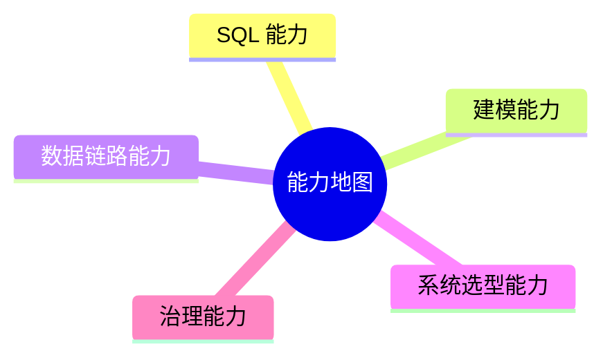

# 16. 能力地图

::: tip 本章导读
把全书能力沉淀为 SQL、建模、链路、选型和治理五类能力。
:::
::: info 本章验收问题
- 你能否用能力地图定位自己的短板，而不是只说“会不会某个工具”？
- 你能否把一个项目拆成 SQL、建模、链路、选型和治理五类能力？
:::




完成本书后，能力不应该表现为“知道很多工具名”，而应该表现为能在具体系统问题中做判断。

## 问题切入

能力地图分为五类：SQL 能力、建模能力、数据链路能力、系统选型能力、治理能力。

很多学习者的问题不是没学过工具，而是无法把工具放到系统问题中判断：

```text
这个查询应该留在 PostgreSQL，还是进 ClickHouse？
这个指标冲突是 SQL 问题、建模问题，还是治理问题？
这个 RAG 效果差，是向量库问题，还是文档解析和评测问题？
这个实时链路延迟高，是 Kafka、Flink、Sink，还是业务期望不合理？
```

本章把全书能力收束成一张检查表。

## 核心判断

真正的数据库和数据平台能力，不是知道每个系统的定义，而是能判断问题属于哪一层、该用什么机制解决、会引入什么代价、哪些边界不能越过。

## 机制解释

## 本章内容

| 节号 | 主题 |
|------|------|
| [16.2](/chapters/16/16-2) | 核心能力体系 |
| [16.3](/chapters/16/16-3) | 能力评估矩阵 |
| [16.4](/chapters/16/16-4) | 初级能力要求 |
| [16.5](/chapters/16/16-5) | 中级能力要求 |
| [16.6](/chapters/16/16-6) | 高级能力要求 |
| [16.7](/chapters/16/16-7) | 专家能力要求 |
| [16.8](/chapters/16/16-8) | 能力提升路径 |


## 系统位置

能力地图是第 15 章学习顺序的验收层，也是第 17 章最终学习目标的前置检查。

```text
学习顺序
  -> 形成能力
  -> 通过项目验证
  -> 达到最终目标
```

每一项能力都应该能在项目中找到证据：SQL 文件、数据模型、DAG、架构图、选型说明、治理规则、评测记录或复盘文档。

## 场景案例

面对“实时 GMV 看板和最终财务 GMV 不一致”这个问题，能力地图可以帮助定位：

```text
SQL 能力：两个 GMV 是否过滤条件一致？
建模能力：实时明细和离线明细的一行粒度是否一致？
数据链路能力：CDC 是否丢失、重复或延迟？
系统选型能力：实时看板是否被误当财务结算系统？
治理能力：指标是否有统一定义、血缘和负责人？
```

这个案例说明，真实问题通常不是单点工具问题，而是多类能力的组合判断。

## 常见误区

**误区一：能力等于工具清单。**

工具只是载体。能力是能把问题、机制、边界和代价讲清楚，并能用产物验证。

**误区二：SQL 能力和工程能力可以分开。**

SQL 是表达计算的基础，但真实平台还要考虑链路、调度、质量、权限和可恢复性。

**误区三：治理能力是管理岗才需要。**

任何写表、写指标、写检索链路、写图谱关系的人，都在生产可被复用或误用的数据资产，因此都需要治理意识。

## 实战任务

用本章五类能力审查第 14 章中的任意一个项目。

输出一张表：

| 能力 | 当前证据 | 缺口 | 下一步 |
| --- | --- | --- | --- |
| SQL 能力 | SQL 文件、指标口径 | 例如缺少留存 SQL | 补查询和口径说明 |
| 建模能力 | 表结构、ER 图 | 例如粒度不清 | 补事实表定义 |
| 数据链路能力 | DAG、同步脚本 | 例如不能重跑 | 补幂等和补数 |
| 系统选型能力 | 架构说明 | 例如选型无边界 | 补取舍说明 |
| 治理能力 | 质量规则、权限 | 例如无血缘 | 补元数据记录 |

再补一列“验收证据”，不要只写“已完成”。例如：

- SQL 能力的证据是 `.sql` 文件、执行记录、结果样例和口径说明。
- 建模能力的证据是表结构、粒度说明、主键、分区、维度和指标定义。
- 链路能力的证据是 DAG、重跑策略、失败恢复、对账记录和延迟记录。
- 选型能力的证据是需求边界、备选方案、取舍理由和成本估算。
- 治理能力的证据是元数据、血缘、质量规则、权限策略和审计记录。

## 小结引出下一章

能力地图的核心是迁移。

你在 PostgreSQL 中理解的表、行、列、主键、索引、事务、查询路径，会迁移到数仓事实表、湖仓表格式、向量元数据、图实体关系和数据治理。

真正的能力不是知道所有系统，而是知道每个系统在什么问题上出现，解决什么，不解决什么，如何与前后系统协作。

下一章用最终目标把这些能力收束为读者完成本书后应达到的状态。
