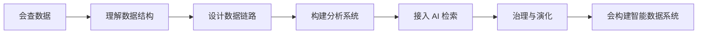

# 17. 最终学习目标

::: tip 本章导读
定义从会查数据到会构建智能数据系统的最终能力标准。
:::


## 本章阅读框架

| 阅读问题 | 本章回答方式 |
| --- | --- |
| 这个问题为什么出现？ | 从业务增长、数据规模、系统目标或 AI 应用压力切入。 |
| 它解决什么问题？ | 提炼为一个核心判断，避免把概念写成孤立定义。 |
| 它不解决什么问题？ | 在机制解释和常见误区中说明边界，防止工具崇拜。 |
| 它在真实平台哪里出现？ | 放回 PostgreSQL、数仓、批流、OLAP、湖仓、向量、图和治理的演化链路。 |
| 读完要会做什么？ | 通过场景案例和实战任务转成可练习的判断。 |



本书最终目标是把读者从：

## 问题切入

```text
会查数据
```

带到：

```text
会构建智能数据系统
```

这个目标可以拆成十二项能力。

如果读者最后只是记住一堆名词，本书就没有完成任务。最终目标应该能被检查：给一个业务场景，读者能设计数据结构、分析口径、同步链路、计算层、查询层、AI 检索层和治理边界。

## 核心判断

最终能力不是“会用所有工具”，而是能围绕一个业务问题设计完整数据系统，并能说明每一层为什么出现、解决什么、不解决什么、如何验证。

## 机制解释

### 一、能用 PostgreSQL 理解业务数据结构

你应该能解释：

- Database、Schema、Table、Row、Column 的层级。
- 主键、外键、约束、事务、索引、视图、物化视图、分区的作用。
- 一张表的一行代表什么。
- 表之间如何通过业务关系连接。

### 二、能写复杂 SQL 分析指标

你应该能使用：

- 基础查询。
- 聚合。
- JOIN。
- CTE。
- 窗口函数。
- 指标 SQL。

并能解释指标口径，而不是只给出 SQL 结果。

### 三、能判断 PostgreSQL 的分析边界

你应该能区分：

- 业务查询。
- 分析查询。
- 点查。
- 大范围扫描。
- 可以靠索引优化的问题。
- 应该迁移到 OLAP 或数仓的问题。

### 四、能设计数仓分层和指标体系

你应该能设计：

- ODS。
- DWD。
- DWS。
- ADS。
- 事实表。
- 维度表。
- 指标字典。
- 指标血缘。

### 五、能理解 PostgreSQL 到大数据平台的数据链路

你应该能解释：

- ETL。
- ELT。
- CDC。
- WAL。
- Debezium。
- Kafka Connect。
- Airflow / Dagster。
- 数据质量检查。

### 六、能掌握主流系统的基本定位

你应该能判断：

- PostgreSQL 适合什么。
- ClickHouse 适合什么。
- Doris 适合什么。
- Spark 适合什么。
- Flink 适合什么。
- Kafka 适合什么。
- Iceberg 适合什么。
- Trino 适合什么。
- DuckDB 适合什么。

### 七、能理解向量数据库在 RAG 和语义检索中的作用

你应该能解释：

- Embedding。
- Chunking。
- Vector Search。
- Metadata Filter。
- Hybrid Search。
- Rerank。
- RAG Evaluation。
- pgvector 与 Milvus / Qdrant 的边界。

### 八、能理解图数据库在知识图谱和关系分析中的作用

你应该能解释：

- Node。
- Edge。
- Property Graph。
- RDF。
- Cypher。
- 多跳查询。
- 图算法。
- 知识图谱。
- GraphRAG。

### 九、能设计批处理、实时处理、向量检索、图关系分析的综合架构

你应该能把系统串起来：

```text
PostgreSQL
  -> CDC / Batch
  -> Kafka / Spark / Flink
  -> ClickHouse / Iceberg
  -> Milvus / Neo4j
  -> BI / RAG / GraphRAG
```

并能说明每一层的边界和职责。

### 十、能理解数据湖与湖仓架构

你应该能解释：

- Object Storage。
- CSV / JSON / Avro / Parquet / ORC。
- Iceberg / Delta / Hudi。
- Catalog。
- Spark / Flink / Trino 多引擎协作。

### 十一、能建立数据治理意识

你应该能设计基础治理能力：

- 元数据。
- 数据质量。
- 数据血缘。
- 指标治理。
- 权限安全。
- 向量数据治理。
- 图谱治理。
- 成本优化。

### 十二、能从“会查数据”升级为“会构建智能数据系统”

最终能力不是某个单点技术。

而是能回答：

```text
数据从哪里来？
如何进入平台？
如何被组织？
如何被计算？
如何被查询？
如何被治理？
如何服务 BI、AI 和业务应用？
```

如果你能围绕这些问题设计出一条清晰链路，并知道每个系统为什么出现、解决什么、不解决什么、和前后系统如何协作，那么你已经完成了本书的核心迁移。


### 深度展开：最终学习目标如何落到真实系统

本节补齐本章的工程细节。阅读时不要只记住概念名称，而要把它放回“输入是什么、处理路径是什么、输出给谁、边界在哪里、如何验证”的链路中。

#### 一、它从什么问题开始

学习终点不是知道更多数据库名字，而是能理解和构建可信、可计算、可检索、可治理的数据系统。

这个问题通常不会以技术名词出现，而是以业务现象出现：报表变慢、指标不一致、实时看板延迟、RAG 召回不稳定、数据无法追溯、项目 Demo 无法验收。能不能把现象还原成系统问题，是本书要训练的第一层能力。

#### 二、输入数据和前置判断

输入是一个真实业务目标，例如经营分析、实时监控、RAG、GraphRAG、推荐、风控或数据治理。

在动手之前，至少要确认四件事：

| 判断项 | 要回答的问题 |
| --- | --- |
| 数据粒度 | 一行代表什么事实，是用户、订单、订单明细、事件、文件、Chunk，还是一条关系？ |
| 时间边界 | 使用创建时间、更新时间、支付时间、事件时间，还是处理时间？ |
| 状态边界 | 哪些状态算有效，哪些测试、取消、退款、重复或迟到数据要排除？ |
| 责任边界 | 这个环节负责记录事实、生产指标、加速查询、治理质量，还是服务 AI 应用？ |

#### 三、处理路径

处理路径是把业务事实建模进 PostgreSQL，经由 SQL、数仓、ETL / CDC、批流、OLAP、湖仓、向量、图和治理，形成可解释的数据应用链路。

这条路径应该能被写成可执行流程，而不是停留在术语解释。一个合格的设计至少要说明：数据从哪里来、经过哪些转换、写到哪里、谁消费、失败后如何重跑、结果如何校验。

#### 四、在真实平台中的位置

真实系统的最终形态不是单个数据库，而是一组有边界、有血缘、有质量检查、有权限、有评测的数据基础设施。

平台位置决定了它和前后系统的关系。不要孤立地问“这个技术好不好”，而要问：

- 它继承了上一层什么问题？
- 它把什么复杂度转移给了下一层？
- 它的输出是否能被复用、追溯和治理？
- 它是否改变了数据粒度、延迟、一致性或权限边界？

#### 五、边界和失败模式

最终目标不是做最大架构。小系统也需要清楚边界，大系统也要避免过度设计。能力成熟的标志是能解释取舍，而不是堆组件。

常见失败信号可以这样检查：

| 失败信号 | 应该追问什么 |
| --- | --- |
| 只画组件，不说明数据粒度 | 每层输入输出是什么，一行或一个事件代表什么？ |
| 只写查询，不说明指标口径 | 时间字段、状态过滤、去重规则和负责人是什么？ |
| 只搭 RAG，不记录来源和权限 | Chunk 来自哪个文档版本，用户是否有权看到？ |
| 只追求实时，不说明准确性边界 | 迟到、重复、撤回、补数和最终对账怎么处理？ |
| 只选热门系统，不说明替代方案 | 为什么 PostgreSQL、ClickHouse、Spark、Flink、Iceberg、向量库或图库是必要的？ |

对应的合格信号是：

| 合格信号 | 证据 |
| --- | --- |
| 能画出端到端链路并说明每层责任 | 架构图、表模型、链路说明、系统边界 |
| 能为每个指标和召回结果追溯来源 | 指标字典、血缘、检索日志、评测记录 |
| 能判断实时、批处理、OLAP 和向量检索的边界 | 延迟要求、查询模式、数据规模、成本和一致性说明 |
| 能设计质量和权限检查 | 质量规则、访问策略、审计记录和失败处理流程 |

#### 六、可操作练习

完成毕业设计：为一个电商公司设计从 PostgreSQL 到 BI、RAG、GraphRAG 的数据系统，并给出架构图、表设计、链路、验收指标和风险清单。

练习完成后不要只看“有没有跑通”，还要补一份复盘：

- 输入数据是否足以支撑问题？
- 口径和边界是否写清楚？
- 结果能否被重复计算和对账？
- 如果数据量扩大 10 倍，瓶颈会出现在哪里？
- 如果接入下游 BI、RAG 或治理系统，还缺哪些元数据？


## 系统位置

本章是全书的最终验收标准。

它把前面章节的内容收束为三类产物：

- **理解产物**：能解释概念、机制、边界和演化关系。
- **设计产物**：能画出架构、数据模型、链路和治理方案。
- **验证产物**：能用 SQL、任务、质量规则、评测集和复盘证明系统有效。

## 场景案例

给定一个“企业知识和经营分析平台”需求，最终读者应该能设计：

```text
PostgreSQL：保存业务交易、用户、权限和元数据。
数仓：建设 ODS / DWD / DWS / ADS 和指标口径。
ETL / CDC：同步业务数据和变更事件。
Spark / Flink：处理离线历史和实时事件。
ClickHouse / Doris：服务 BI 和经营看板。
Iceberg Lakehouse：保存长期历史、日志、文档和 AI 中间产物。
pgvector / Milvus：构建 RAG 语义检索。
Neo4j / NebulaGraph：构建实体关系和 GraphRAG。
治理平台：统一质量、血缘、权限、指标和评测。
```

并能解释每一层的边界：PostgreSQL 不承担全部历史分析，向量数据库不替代权限和事实校验，图数据库不替代关系型业务库，湖仓不替代所有高并发 OLAP 查询。

## 常见误区

**误区一：最终目标是学完所有工具。**

工具永远会变化。最终目标是形成稳定的问题判断能力和系统迁移能力。

**误区二：能跑 Demo 就等于会构建系统。**

真实系统还需要数据质量、权限、血缘、失败恢复、成本控制和评测闭环。

**误区三：AI 数据系统是传统数据平台之外的新东西。**

AI 数据系统建立在传统数据平台之上，并增加文档、向量、图谱、评测和上下文治理。它不是跳过基础，而是扩展基础。

## 实战任务

用一页设计文档回答最终毕业题：

> 为一个电商公司设计从 PostgreSQL 到 BI、RAG、GraphRAG 的智能数据系统。

必须包含：

- 数据源和业务表。
- SQL 指标和口径。
- 数仓分层。
- ETL / CDC 链路。
- 批处理和实时处理边界。
- OLAP 查询服务。
- 湖仓存储。
- 向量检索。
- 图关系分析。
- 数据治理。
- 验收指标和风险边界。

这一页设计文档至少要能经受三类审查：

| 审查视角 | 必须回答 |
| --- | --- |
| 业务审查 | 指标是否有业务含义，RAG / GraphRAG 是否服务真实问题？ |
| 工程审查 | 链路是否能重跑、补数、对账、扩容和恢复？ |
| 治理审查 | 数据来源、权限、质量、血缘、评测和成本是否可追踪？ |

如果设计文档无法回答这些问题，它仍然只是架构草图，不是最终学习目标的证据。

## 小结引出下一章

这是全书最后一章，因此不再引出新的技术章节，而是把路线收束为一句话：数据库学习从 SQL 开始，但真正目标是理解数据如何成为可信、可计算、可检索、可治理的智能系统基础设施。

## 结语

数据库学习的起点可以是一条 SQL。

但数据系统理解的终点，不是写出更长的 SQL。

真正的终点是能理解数据如何从业务事实出发，经过建模、同步、计算、存储、检索、治理，最终成为 BI、RAG、GraphRAG、推荐、风控和智能应用可以依赖的基础设施。

这就是从 PostgreSQL 到智能数据系统的完整路径。
