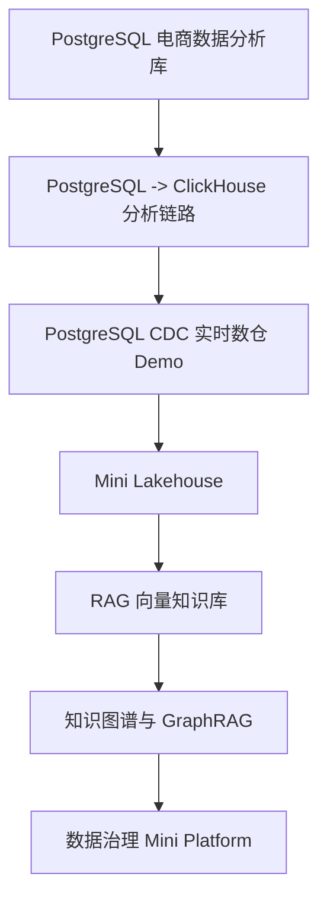

# 项目实战总览

7 个项目按系统演化顺序推进。

详见 [第 14 章：大数据方向项目实战](/chapters/14-projects)。

## 执行状态

| 项目 | 系统位置 | 当前状态 | 阻塞项 | 必需产物 |
| --- | --- | --- | ---: | ---: |
| PostgreSQL 电商数据分析库 | PostgreSQL 基础与 SQL 分析 | `runtime-entry-present` | 2 | 5 |
| PostgreSQL 到 ClickHouse 分析链路 | OLTP 到 OLAP 分化 | `static-artifacts-verified` | 3 | 10 |
| CDC 实时数仓 Demo | CDC 与实时计算 | `static-artifacts-verified` | 4 | 7 |
| Mini Lakehouse | Lakehouse 架构 | `static-artifacts-verified` | 4 | 7 |
| RAG 向量知识库 | AI 时代数据基础设施 | `static-artifacts-verified` | 3 | 8 |
| 知识图谱与 GraphRAG | 图数据库与 GraphRAG | `static-artifacts-verified` | 3 | 8 |
| 数据治理 Mini Platform | 治理、血缘、质量与信任 | `static-artifacts-verified` | 3 | 8 |

完整执行总表由 `node scripts/generate-project-runbook.mjs` 从 `project-workbench/project-manifest.json` 生成，维护在 `docs/project-runbook.md`。

`pnpm projects:verify` 只证明项目目录、交付清单、关键 SQL / JSON / 文档和 manifest 状态一致；不证明数据库、消息队列、计算引擎或 AI 检索链路已经真实运行。
