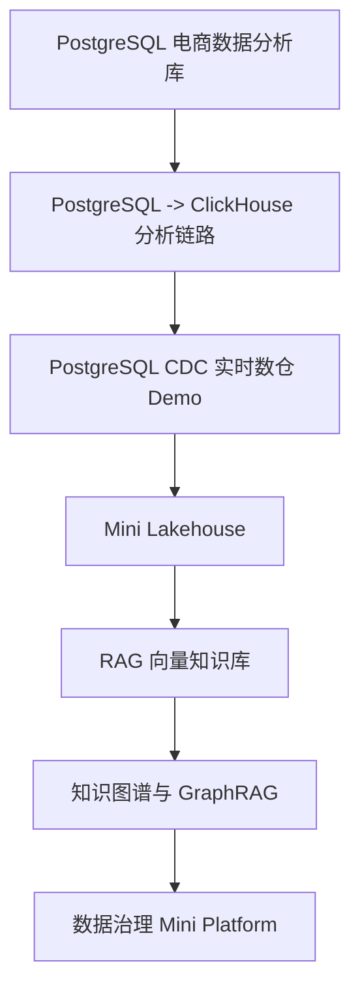

# 项目实战总览

7 个项目按系统演化顺序推进。

```mermaid
flowchart TB
  P1["PostgreSQL 电商数据分析库"] --> P2["PostgreSQL -> ClickHouse 分析链路"]
  P2 --> P3["PostgreSQL CDC 实时数仓 Demo"]
  P3 --> P4["Mini Lakehouse"]
  P4 --> P5["RAG 向量知识库"]
  P5 --> P6["知识图谱与 GraphRAG"]
  P6 --> P7["数据治理 Mini Platform"]
```

详见 [第 14 章：大数据方向项目实战](/chapters/14-projects)。
