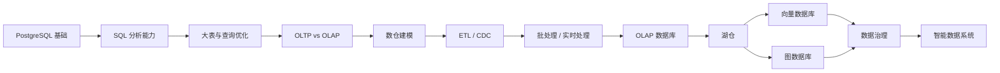
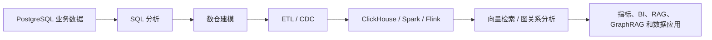

# 学习路线图

这本书采用演化式叙事：先从 PostgreSQL 建立数据库直觉，再逐步进入分析系统、大数据平台和 AI 数据基础设施。

```mermaid
flowchart LR
  A["PostgreSQL 基础"] --> B["SQL 分析能力"]
  B --> C["大表与查询优化"]
  C --> D["OLTP vs OLAP"]
  D --> E["数仓建模"]
  E --> F["ETL / CDC"]
  F --> G["批处理 / 实时处理"]
  G --> H["OLAP 数据库"]
  H --> I["湖仓"]
  I --> J["向量数据库"]
  I --> K["图数据库"]
  J --> L["数据治理"]
  K --> L
  L --> M["智能数据系统"]
```

## 最小闭环

```mermaid
flowchart LR
  P["PostgreSQL 业务数据"] --> S["SQL 分析"]
  S --> W["数仓建模"]
  W --> E["ETL / CDC"]
  E --> C["ClickHouse / Spark / Flink"]
  C --> A["向量检索 / 图关系分析"]
  A --> APP["指标、BI、RAG、GraphRAG 和数据应用"]
```
