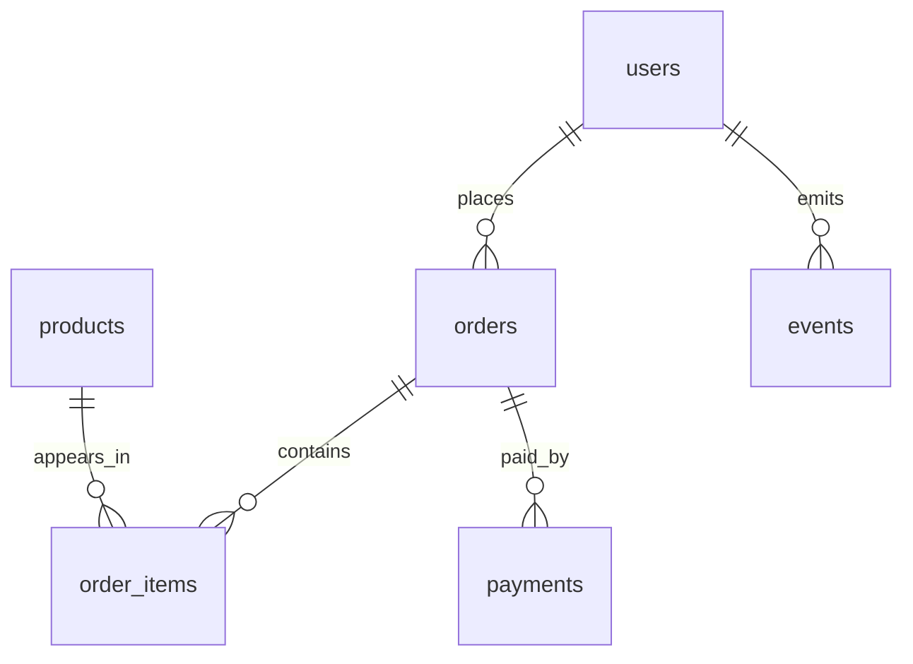

# SQL 实验室

这一页用于把书中的 SQL 示例从“可读”推进到“可运行”。

## 样例数据

- PostgreSQL 建表与样例数据：[examples/ecommerce-postgres.sql](/examples/ecommerce-postgres.sql)
- 第 2 章 SQL 查询练习：[examples/chapter-02-queries.sql](/examples/chapter-02-queries.sql)

## 建议运行方式

```bash
createdb db_cookbook
psql db_cookbook -f site/public/examples/ecommerce-postgres.sql
psql db_cookbook -f site/public/examples/chapter-02-queries.sql
```

也可以使用仓库脚本：

```bash
DB_NAME=db_cookbook_lab pnpm sql:run
```

## 当前验证

当前仓库提供两个层级的验证：

```bash
node scripts/verify-sql-examples.mjs
```

这个脚本会检查样例 schema、表名、字段名和第 2 章查询引用是否一致。

如果本地安装了 PostgreSQL，再执行上面的 `createdb` / `psql` 命令做真实运行验证。静态验证不能替代数据库执行，它只能提前发现文档和 SQL 样例之间的结构漂移。

## 数据模型



## 验收目标

- 能跑通基础查询、聚合、JOIN、CTE、窗口函数和指标 SQL。
- 能用同一套样例数据解释第 1-5 章中的表结构、指标口径和数仓建模。
- 后续每章新增 SQL 示例时，都优先接入这套样例数据。
